# Gender Barriers, Structural Transformation, and Economic Development

Gaurav Chiplunkar
Tatjana Kleineberg

POLICY RESEARCH WORKING PAPER 11083

## Abstract

The representation and significance of women in the labor force have grown significantly over the past five decades around the globe. Using nationally representative data from more than 90 countries, this paper documents distinct gender patterns in employment transitions across both sectors and occupations during this period. Using a model of occupational and sectoral choice and focusing on six major economies, the paper finds that declining gender barriers—defined as gender-specific distortions in employment and wages—were a key driver of the observed rise in female labor force participation, expansion of the service sector, and increases in real GDP per capita from 1970 to 2018, but with substantial variation across countries.

# Gender Barriers, Structural Transformation, and Economic Development\*

Gaurav Chiplunkar
University of Virginia

Tatjana Kleineberg
World Bank

Keywords: Economic Growth, Structural Transformation, Gender, Misallocation

## 1 Introduction

The role of women in the labor force has undergone a profound transformation over the past century, evolving from a largely marginalized position (Boserup, 1975) to one of increasing representation, influence, and leadership in the global workforce (Goldin, 2024). In the 1970s, for instance, there were, on average, fewer than four women for every ten men in professional and managerial positions across a large cross-section of countries. By the 2010s, this number increased to more than eight women for every ten men. This growing representation of women in the labor market not only reflects progress toward gender equality, but also has significant implications for countries' aggregate employment structures, productivity, and economic growth. $^{1}$ Over the same period, economies around the world have undergone fundamental structural changes, with employment transitioning from agriculture to manufacturing and services (Kuznets, 1973).

In this paper, we study the evolution of gendered labor market opportunities, economic growth, and structural change empirically and theoretically. First, we use micro-data from 91 countries at different stages of development and over five decades to document new evidence on the link between economic development and gendered labor market outcomes. We then propose a model to study these patterns. Our framework integrates two broad explanations for the observed evolution of gendered labor market outcomes and economic growth: first, economic mechanisms such as sector- or occupation-specific technological change, income effects in consumption, and improved education; and second, gender-specific distortions arising from discrimination and social norms. We structurally estimate our model to six major economies, which offer high-quality gender-disaggregated data on both wages and employment over five decades. We then use the estimated model to study the effects of changing gender distortions on structural change and aggregate growth in these countries. We find that gender distortions are important and have declined in most countries. On average, the decline in gender distortions in our sample countries accounts for a substantial share of overall economic growth and reallocation of employment in the labor market.

We begin by providing new evidence on gendered employment patterns across occupations and sectors. Our analysis draws on censuses and nationally representative household and labor force surveys from 91 countries, spanning five decades (1970-2018) and covering over 300 country-years. Using these data, we first show that the canonical process of structural transformation – employment transitions from agriculture to manufacturing and services with economic development – is primarily driven by men. Women follow a different pattern: at low levels of development, they exit agriculture and primarily transition out of the labor force. At higher levels of development, women re-enter the labor force, primarily in the service sector. Unlike men, women’s representation in manufacturing remains low across all development levels. We further document gender differences in occupational choices within sectors, showing that men increasingly work in professional and industrial jobs in richer countries, while women’s employment (relative to men) expands faster in clerical jobs but slower in professional and industrial jobs.

In addition to gender employment gaps, we also analyze the evolution of gender wage gaps for a select set of countries which provide high-quality micro-data on hourly earnings. We find that wage gaps have narrowed over time across all occupation-sector pairs. However, women in the 2010s still earned, on average, only 70 cents for every dollar earned by men. Furthermore, we observe a weak correlation between gender wage gaps and countries' development levels – in contrast to gender employment gaps that tend to decrease in richer countries. Additionally, gender employment and wage gaps do not necessarily correlate across occupation-sector pairs.

We then propose a model of occupational and sectoral choice that can speak to these empirical findings and that builds on Hsieh et al. (2019). The documented changes in gendered employment and wage patterns – both across countries and within countries over time – can be partly driven by previously studied economic channels, such as income effects in consumption, sector- or factor-specific technological change, or shifts in the supply of, or returns to human capital. $^{2}$ Specifically, technological change and income effects can increase labor demand in the “female-gendered” service sector, disproportionately benefiting women (Ngai and Petrongolo, 2017; Fan et al., 2023). Additionally, the narrowing of gender education gaps has expanded the supply of women’s human capital (Evans et al., 2021; Feng et al., 2023). On the other hand, the documented changes in gendered labor market outcomes can also be driven by a decline in barriers that women face in certain occupations and sectors, which would increase women’s labor supply in them. $^{3}$

Our model enables us to disentangle the effects of economic mechanisms from those of changing gender barriers. In the model, individuals differ by gender and ability, while occupation-sector pairs differ in wage rates per unit of human capital, returns to ability, and costs or barriers that men and women face when working in them. Individuals receive idiosyncratic preference shocks across occupation-sector pairs and then choose their occupation and sector. We model the option of not participating in the labor force as an additional choice, which we call the “home sector” (Hsieh et al., 2019; Ngai and Petrongolo, 2017). On the demand side, consumers have non-homothetic preferences, allowing them to shift consumption away from agriculture and toward services as their income rises – a key driver of structural transformation emphasized in the literature. $^{4}$ Wage rates per human capital unit in each occupation-sector and prices in each sector are endogenously determined in equilibrium.

Following Hsieh et al. (2019), we define two types of gender barriers: first, “gender norms” which capture the excess utility costs that women incur relative to men when working in a given occupation-sector pair; and second, female “wage discrimination”, which captures differences in remuneration that women receive per human capital unit relative to men. In the absence of distortions, an efficient allocation of talent ensures that high-ability workers sort into sectors and occupations that offer the highest returns to their ability. However, gender barriers distort these choices, shifting workers away from the jobs where they have a comparative advantage. For instance, high-ability women may opt out of the labor market or work in clerical jobs with low returns to their ability rather than pursuing professional or managerial jobs with higher returns. Such distortions therefore lead to a misallocation of talent, reducing aggregate productivity and output.

We estimate the model to a core sample of six large economies – India, Indonesia, Brazil, Mexico, Canada and the United States – for which we have employment and hourly wage data spanning four to five decades. Gender barriers in each occupation-sector and country-year are quantified as “wedges” which ensure that our model equations precisely match the data on gender employment and wage gaps after accounting for economic fundamentals and individuals’ employment and consumption choices in equilibrium. For example, the model expresses the observed gender wage gap in each occupation-sector as a function of a model-implied gender gap in human capital and the wage discrimination women face relative to men. To measure gender barriers, we assume that men and women have the same productivity within each occupation-sector, conditional on their model-implied human capital levels. $^{5}$

Our estimates of gender barriers reveal three main findings. First, gender norms have declined significantly over time, particularly in the service sector and in professional, managerial, and clerical jobs. Second, wage discrimination has also declined across all sectors and occupations, but relatively less in professional jobs. Third, trends in gender barriers vary considerably across countries: they worsened in India, showed little improvement in Indonesia, and declined substantially in Brazil, Mexico, Canada, and the United States. As a validation, we show that our estimated gender barriers strongly correlate across countries and over time with empirically measured gender norms and labor market constraints.

Using our estimated model, we then quantify the contribution of changing gender barriers to countries' structural transformation and economic growth over the past five decades, in the spirit of a growth accounting exercise. To do so, we simulate counterfactual employment and growth paths for each country while holding gender barriers in each occupation-sector fixed at their calibrated values from the 1970s but allowing all other variables, such as technologies and skill distributions, to evolve over time. We find that declining gender barriers had large effects on female labor force participation, structural transformation, and economic growth in all countries of our sample, except India. Averaging across countries, we find that changes in gender barriers between 1970 and the 2010s accounted for $40\% - 45\%$ of employment growth and $20\% - 35\%$ of output growth in the manufacturing and service sectors. Declining gender barriers particularly contributed to the rapid rise of the service sector, revealing a novel channel for explaining the premature deindustrialization observed in developing countries in recent decades (Rodrik, 2016; Huneeus and Rogerson, 2024). On average, changes in gender barriers accounted for $28\%$ of observed real GDP per capita growth in our sample, with significant heterogeneity across countries – ranging from $10\%$ in Indonesia and $28\%$ in the United States to $40\%$ in Canada and Mexico, and over $50\%$ in Brazil. In contrast, worsening gender barriers in India imply that economic growth would have been higher if these barriers had not changed.

In a series of additional analyses, we examine the mechanisms and robustness of our findings. First, we show in our baseline model that declining gender norms had a larger effect on economic growth than reductions in wage discrimination. Second, we show that our aggregate results are similar in a model where workers sort into occupations and sectors based on idiosyncratic talent shocks rather than preference shocks, as in the baseline model. Despite similar aggregate effects, the relative importance of wage discrimination and gender norms reverses in a model with talent shocks, which aligns with the findings from Hsieh et al. (2019) and is further discussed in Section 7.2. Third, we show that non-homothetic preferences amplify the effects of declining gender barriers on aggregate and sectoral outcomes because falling barriers make economies richer, shifting consumption and labor demand away from agriculture and toward manufacturing and services. Lastly, we perform a robustness check that accounts for gender-specific comparative advantage across occupation-sector pairs, which we quantify from a benchmark economy – the United States in 2015 – which we assume to have no wage discrimination, following Lee (2024). After adjusting for these estimated gender productivity differences in all country-years, changes in gender barriers remain relevant, accounting for 21% of observed growth in GDP per capita, compared to 28% in the baseline.

Related Literature. A large literature documents gender disparities in the labor market, but only a few recent studies provide cross-country comparisons and examine the macroeconomic implications of gender roles. Cuberes and Teignier (2014), Albanesi et al. (2023), and Olivetti et al. (2024) provide excellent reviews. Several papers study the link between gender roles and structural transformation in the United States, including Ngai and Petrongolo (2017), Ngai et al. (2024), Moro et al. (2017), and Rendall (2018). Across countries, Gottlieb et al. (2023), Bridgman et al. (2018) and Bick et al. (2022) use rich time-use surveys to examine the implications of gender differences in hours worked. Our quantitative approach – which measures gender barriers as wedges and quantifies their importance for aggregate outcomes – aligns most closely with Hsieh et al. (2019), Lee (2024), and Chiplunkar and Goldberg (2024). Hsieh et al. (2019) study the aggregate implications of talent misallocation due to gender and racial barriers in the United States. They find, similar to us, that a reduction in barriers explains 20-40% of US economic growth over the last decades. Lee (2024) documents that gender barriers in poor countries are higher in non-agriculture sectors, also aligning with our findings.

While the literature on structural transformation emphasizes sectoral employment transitions, we further document transitions across occupations within sectors, with a focus on gender. We find that gender differences across sectors are more important in poorer countries, while occupational differences matter more in richer countries, in line with recent work by Caunedo et al. (2023) and Bandiera et al. (2022). We therefore develop one consistent framework to jointly study the extensive margin of entering the labor force and the intensive margin of choosing a particular sector and occupation. The model incorporates the drivers of employment choices that have been emphasized in the macro-labor and structural transformation literature, which include heterogeneity in workers' ability and hence their comparative advantage, gender-specific barriers, differential returns to ability across occupation-sectors (Hsieh et al., 2019; Cassan et al., 2024), as well as non-homothetic demand, sector-specific technological change, and changing human capital supply (Ngai and Pissarides, 2007; Herrendorf et al., 2014; Boppart, 2014; Ngai and Petrongolo, 2017; Comin et al., 2021; Porzio et al., 2022; Feng et al., 2023).

The paper is organized as follows: Section 2 describes the data and provides new evidence on the link between economic development and gendered labor market outcomes. Section 3 presents the theoretical model and Section 4 describes the identification and model quantification. Sections 5 and 6 present the estimation results and the counterfactual simulations. Section 7 examines mechanisms and tests the robustness of our analysis. Section 8 concludes.

## 2 Empirical Facts

## 2.1 Data

Data Sources and Sample Description. We use data from the Integrated Public Use Microdata Series (IPUMS International, 2020), which provides harmonized individual-level data on demographic and employment variables from nationally representative censuses, and household and labor force surveys for many countries and years. We extract employment information by occupation, sector, and gender for 91 countries and 305 country-years. The time coverage ranges from 1960 to 2020 and includes, on average, 3-4 rounds of data for each country. Online Appendix C shows that the data has good coverage over the time period and the entire development spectrum. We complement the IPUMS data with labor force surveys from the World Bank Global Labor Database (GLD) and the World Bank i2d2 database. $^{6}$

For our quantitative exercise, we use a core sample of six large economies – India, Indonesia, Mexico, Brazil, Canada, and the United States – which additionally offer high-quality micro data on hours worked and compensation, enabling us to calculate workers' hourly wages. In addition, these countries provide data for more than four decades, allowing us to study the process of structural transformation and the evolution of gendered labor market outcomes over a long period of time. The six economies span a wide income spectrum (Figure OA.7 in the Online Appendix) and cover around 25-30% of the world population. For Indonesia, we complement the IPUMS census data with the SAKERNAS labor force survey to extend the time coverage of wage data to 2018. For India, we use survey data from the National Sample Surveys (NSS), the Employment-Unemployment Survey (EUS), and the Periodic Labor Force Survey (PLFS) up to 2018.

Sector and Occupation Classification. We define three market sectors – agriculture, manufacturing, and services – by assigning the more detailed industry codes from IPUMS and the labor force surveys to these three categories. The categorization follows the literature (Herrendorf et al. (2013); Herrendorf and Schoellman (2018)) and is outlined in Online Appendix C, Table OA.6. We define a fourth sector as the “home sector” to which we attribute unemployed and inactive individuals, following Hsieh et al. (2019).

At the occupation level, we use 1-digit ISCO codes. We aggregate the top three ISCO codes, which results in the following seven occupation categories: (1) professionals, (2) clerks, (3) service workers, (4) skilled agricultural workers, (5) crafts and trades workers, (6) plant and machine operators, and (7) elementary occupation workers. To minimize measurement errors arising from small sample sizes in specific occupation-sector-gender cells, we impose two restrictions. First, we consider only two occupations within the agriculture sector: skilled agricultural workers and elementary occupations. $^{7}$ Second, we model the occupation of “skilled agricultural workers” only in the agriculture sector and we assign all workers in that occupation to the agriculture sector. More information is provided in Online Appendix C.

Construction of the Data Set. First, we calculate employment shares of men and women in each occupation-sector and country-year. We allocate part-time workers proportionally between the reported occupation-sector and the home sector based on their hours worked. This adjustment is particularly important because women are more likely to work part time. Second, we compute hourly earnings for men and women in each occupation-sector for the limited sample of countries that provide data on hours worked and earnings. Further details on the data cleaning and dataset construction are available in Online Appendix C.

## 2.2 Sectoral Employment Transitions by Gender

We first document how sectoral employment choices differ between men and women and how these gendered employment choices change with economic development.

Figure 1: Sectoral Employment Transitions by Gender

(a) Transitions Across Sectors: Men  
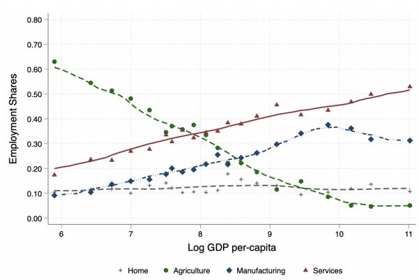

(b) Transitions Across Sectors: Women  
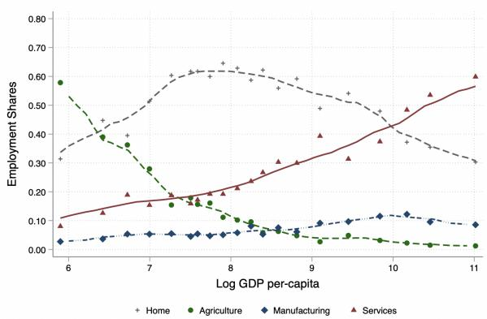

(c) (De)Industrialization: Men  
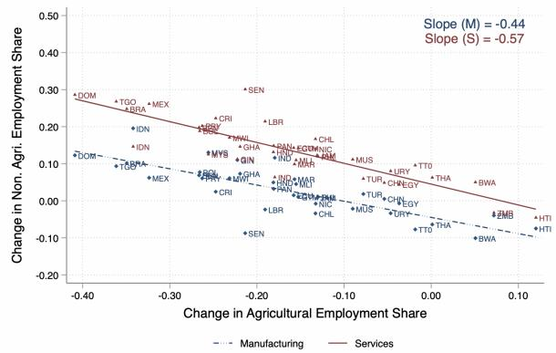

(d) (De)Industrialization: Women  
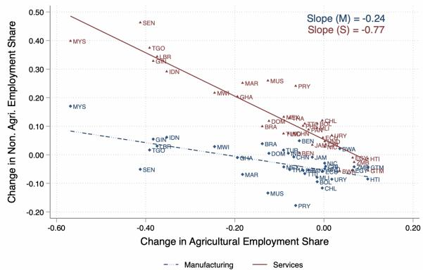  
Notes: Figures (a) and (b) present a non-parametric fit of sectoral employment shares for men and women against log real GDP per-capita in 2010 US dollars. The shares are calculated as a fraction of the overall population, which includes the share of inactive individuals in the “home sector”. The sample pools data from 91 countries and 305 country-years between 1960-2019. Figures (c) and (d) show how changes in male and female employment shares in agriculture (horizontal axis) correlate with employment changes in manufacturing (dash blue line) and services (solid red line). The sample is restricted to low- and middle-income countries. For each country, we calculate changes in sectoral employment shares over time, conditional on labor force participation, using the first (1970-1990) and last (2000-2019) years of available data. We report the coefficients from a linear regression model for manufacturing (Slope (M)) and services (Slope (S)) in the upper right corner of each graph.

Figure 1a plots the sectoral employment shares of men against countries' log real GDP per capita, pooling the data across all countries and years. The graph shows the well-documented pattern of structural transformation: poorer countries have high employment shares in agriculture, while richer countries have lower agricultural employment shares and higher shares in manufacturing and market services. The share of men in the home sector (i.e., not in the labor force) is small and relatively stable across different levels of economic development.

Figure 1b shows different employment patterns for women. Similar to men, women's employment shares in agriculture are high in poor countries and low in richer ones. However, in low- and middle-income countries, lower agricultural employment shares among women coincide with higher shares in the home sector, i.e., with low female labor force participation. In richer countries, female labor force participation is higher again, with most women working in the service sector. $^{8}$ Female employment shares in manufacturing remain consistently low across all levels of economic development.

These gender differences in sectoral employment suggest that higher female labor force participation might increase employment in services relative to manufacturing. Hence, changes in gender roles and rising female labor force participation over recent decades may have contributed to the premature deindustrialization and service-led growth observed in many developing and emerging countries (Rodrik, 2016; Fan et al., 2023; Huneeus and Rogerson, 2024). To further examine this possibility, Figures 1c and 1d present how changes in agricultural employment shares correlate with corresponding changes in manufacturing and services between the 1970s and 2010s, separately for men and women, and restricting the sample to low- and middle-income countries. For each country, we calculate changes in sectoral employment shares over time, conditional on labor force participation, using the first (1970-1990) and last (2000-2019) years of available data. Figure 1c shows that a 10 percentage-point (p.p.) decline in men's agricultural employment share is, on average, associated with an increase of 4.4 p.p. in manufacturing and 5.7 p.p. in services. For women, the shift toward services is stronger with employment shares increasing by 2.4 p.p. in manufacturing and by 7.7 p.p. in services (Figure 1d). $^{9}$

## 2.3 Occupational Employment Transitions by Gender

We next examine gender differences in occupational employment transitions. While the literature on structural transformation primarily focuses on sectoral transitions, a recent literature has highlighted the importance of occupational choices for talent allocation, aggregate productivity, and growth (Hsieh et al., 2019; Cassan et al., 2024).

Figure 2 shows that employment in agricultural jobs is high in poor countries but lower in richer countries for both genders, reflecting the broader employment decline in the agriculture sector. In richer countries, men's employment shares increase across all other occupations. The increase is particularly large in professional jobs where men's employment shares rise from less than $8\%$ in poor countries to over $35\%$ in the richest ones (black triangles). In contrast, male employment shares in clerical jobs (gray dots) remain relatively low, ranging between $5\%$ and $8\%$ across all development levels.

For women, smaller agricultural employment shares in middle-income countries do not lead to employment growth in other occupations but instead to lower female labor force participation. In richer countries, female employment shares expand rapidly in professional occupations (from $5\%$ to $35\%$ ) and in trade and service jobs (from $8\%$ to $20\%$ ). Unlike men, women's employment shares rise substantially in clerical jobs (from $1\%$ to $20\%$ ), while their employment remains low in machine-operating and elementary occupations.

Figure 2: Occupational Employment Shares by Gender and by Sector  
(a) Transition Across Occupations: Men  
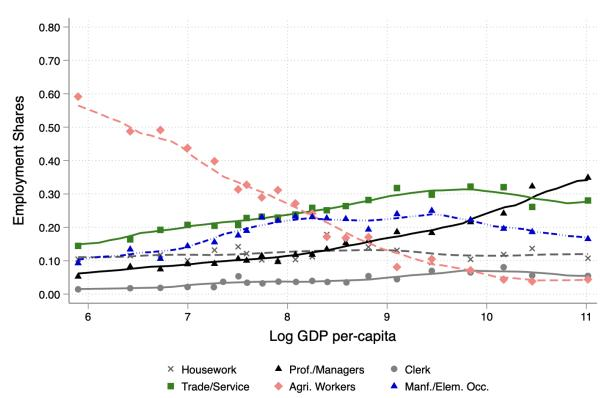

(b) Transition Across Occupations: Women  
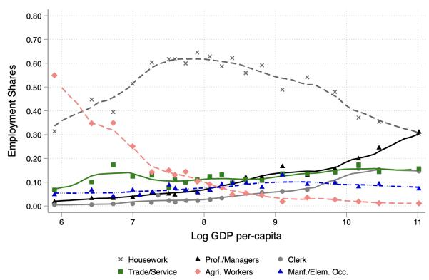  
Notes: This Figure presents a non-parametric fit of occupational employment shares against log real GDP per-capita in 2010 US dollars, separately for men and women. The shares are calculated as a fraction of the overall population, including inactive individuals in the home sector. The sample pools data from 91 countries and 305 country-years between 1960-2019.

More generally, sectors employ occupations in different proportions, creating a direct link between sectoral and occupational employment transitions. Figure OA.3 in the Online Appendix shows this link by plotting occupational employment shares separately within the manufacturing and service sectors against countries' GDP per capita. Overall, the service sector uses professional and clerical occupations more intensely at all development levels. The manufacturing sector is highly concentrated in trade and service occupations in poorer countries but diversifies across occupations in richer ones. Gender differences across occupations within these sectors are relatively small in poorer countries but increase in richer ones. The largest gender gap emerges in clerical occupations, where women account for the entire employment increase with development. Men and women both contribute to the rise in professional and managerial jobs in rich countries, but men remain 5-10 p.p. more likely to work in these occupations than women.

## 2.4 Gender Segregation across Sectors and Occupations

Having documented gender differences in employment choices across sectors and occupations, we now use the Theil Information H-Index to systematically measure gender segregation across occupation-sector pairs in each country-year. Similar to the Gini coefficient, the H-Index measures segregation on a normalized scale between 0 and 1 by using the entropic “distance” between the observed empirical distribution and an ideal gender-equal distribution. A higher value indicates greater segregation, while zero indicates perfect gender equality. The index allows decomposing total gender segregation across occupation-sector pairs into two additive components, which separately measure gender differences across sectors and across occupations within sectors. Appendix A.1 formally defines the index and decomposition.

Figure 3a plots the segregation across occupation-sector pairs against countries' real GDP per capita, pooling data across all countries and years. The figure shows an inverted U-shape relationship, indicating that gender segregation is lower in poor and rich countries but high in middle-income countries. Figure 3b plots the share of total gender segregation that is explained by differences across occupations within sectors. This component is significantly higher in richer countries, where it accounts for up to 50% of overall segregation, compared to 20% in poorer countries. $^{10}$ This finding is consistent with Bandiera et al. (2022), who document that the division of labor and the number of occupations increase with development.

Figure 3: H-Index of Gender Segregation across Sectors and Occupations  
(a) Aggregate Index  
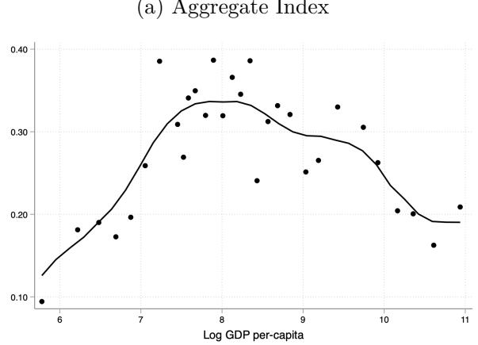

(b) Fraction Explained Within Sector  
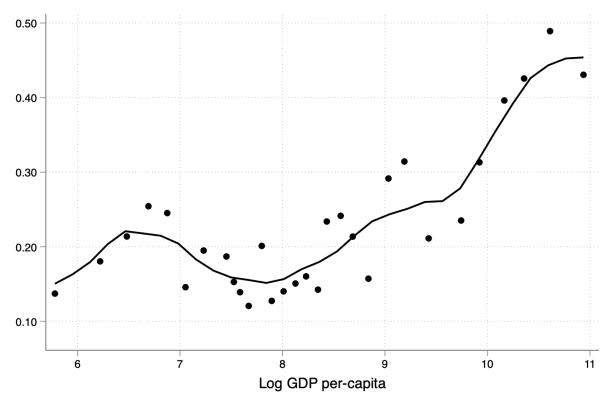  
Notes: This figure plots the H-Index, which measures gender segregation across occupation-sector pairs, against the log of real GDP per capita in 2010 US dollars. The sample pools data from 91 countries and 305 country-years between 1960-2019. Figure (a) shows the level of the segregation index and Figure (b) shows the share of overall segregation that is explained by segregation across occupations within sectors.

## 2.5 Gender Gaps within Countries over Time

We next use a core sample of six large economies – India, Indonesia, Brazil, Mexico, Canada, and the United States – to examine the evolution of gender employment and wage gaps within countries over time and to implement our quantitative exercise. These countries provide individual-level data on employment outcomes and hourly wages spanning at least four decades. To document patterns over time, we compute female-to-male employment ratios by dividing the employment shares of women in each occupation-sector pair by those of men. Similarly, female-to-male wage ratios divide the average wages of women in each occupation-sector pair by those of men. Ratios of 1 indicate gender parity. Ratios below (above) 1 indicate that women have lower (higher) representation or wages in the occupation-sector relative to men.

Gender Employment Gaps over Time. Changes in employment ratios over time largely confirm the cross-sectional patterns documented above, particularly highlighting the transition of women from the home sector to the service sector. In the 1970s, women were, on average, 8 times more likely to stay at home than men in our sample countries, which decreased to 3.6 in the 2010s (Table 1, Panel A). Women remain most underrepresented in the agriculture and manufacturing sectors, which employ only 2.7 women for every 10 men, with little change over time. In contrast, women's employment expanded rapidly in the service sector, increasing from 6.5 to 9.3 women for every 10 men over the past decades. Turning to occupations, Panel B of Table 1 shows that women were underrepresented in all occupations except clerical jobs in the 1970s. The largest catch-up occurred in professional and managerial jobs, where women's employment increased from 3.3 to 8.2 for every 10 men. Women's overrepresentation in clerical jobs grew further over time, rising from 11 to 14 women for every 10 men. Employment gaps in other occupations improved over time, but remain large in the 2010s.

Table 1: Gender Employment and Wage Ratios

<table><tr><td rowspan="2"></td><td colspan="2">Employment Ratio</td><td colspan="2">Wage Ratio</td></tr><tr><td>1970-75</td><td>2010-18</td><td>1970-75</td><td>2010-18</td></tr><tr><td></td><td>(1)</td><td>(2)</td><td>(3)</td><td>(4)</td></tr><tr><td colspan="5">Panel A. Sectors</td></tr><tr><td>Home</td><td>8.07</td><td>3.63</td><td></td><td></td></tr><tr><td>Agriculture</td><td>0.27</td><td>0.27</td><td>0.56</td><td>0.73</td></tr><tr><td>Manufacturing</td><td>0.28</td><td>0.28</td><td>0.50</td><td>0.69</td></tr><tr><td>Services</td><td>0.65</td><td>0.93</td><td>0.54</td><td>0.71</td></tr><tr><td colspan="5">Panel B. Occupations</td></tr><tr><td>Professional</td><td>0.33</td><td>0.82</td><td>0.58</td><td>0.70</td></tr><tr><td>Clerks</td><td>1.08</td><td>1.41</td><td>0.80</td><td>0.86</td></tr><tr><td>Craft, Trade, Service</td><td>0.39</td><td>0.57</td><td>0.46</td><td>0.67</td></tr><tr><td>Agricultural</td><td>0.25</td><td>0.24</td><td>0.56</td><td>0.72</td></tr><tr><td>Machine Op., Elementary</td><td>0.39</td><td>0.50</td><td>0.51</td><td>0.73</td></tr><tr><td colspan="5">Panel C. Countries</td></tr><tr><td>India</td><td></td><td></td><td>0.56</td><td>0.60</td></tr><tr><td>Indonesia</td><td></td><td></td><td>0.54</td><td>0.73</td></tr><tr><td>Brazil</td><td></td><td></td><td>0.57</td><td>0.72</td></tr><tr><td>Mexico</td><td></td><td></td><td>0.65</td><td>0.75</td></tr><tr><td>Canada</td><td></td><td></td><td>0.44</td><td>0.71</td></tr><tr><td>United States</td><td></td><td></td><td>0.47</td><td>0.70</td></tr></table>

Notes: This table reports female-to-male employment ratios (Columns 1-2) and wage ratios (Columns 3-4) in the 1970s and 2010s. The ratios divide employment shares (average wages) of women in each occupation sector by those of men. Panels A-C report average ratios for sectors, occupations, and countries. Averages of employment (wage) ratios are weighted by the employment (income) of each occupation-sector.

Gender Wage Gaps over Time. Table 1 further documents changes in gender wage gaps over time (columns 3-4). In the 1970s, women earned, on average, 50-56 cents for every dollar earned by men across all sectors. Wage gaps exhibited more variation across occupations in the 1970s with women earning 46 cents per dollar earned by men in craft, trade, and service occupations but 80 cents in clerical jobs. Gender wage gaps have narrowed significantly over time, but remain persistent in the 2010s, with women earning, on average, around 70 cents for every dollar earned by men in most sectors and occupations. Comparing wage gaps across countries shows little correlation with economic development (Panel C). In the 1970s, gender wage gaps across countries range from 0.44 to 0.65, which improves to 0.6-0.75 in the 2010s. Moreover, we find that the levels and trends of wage and employment ratios are not necessarily correlated across occupations-sectors. For instance, in the 2010s, women were better represented in the service sector than in agriculture or manufacturing, yet wage ratios remained similar across sectors (Panel A, Columns 2 and 4). Likewise, gender employment gaps in professional and clerical occupations narrow rapidly over time and with economic development, but their wage gaps remain significant at all development levels. $^{11}$

## 2.6 Discussion and Model Implications

Overall, our findings emphasize distinct gender patterns in labor force participation, occupational and sectoral choices, and wage gaps along the development spectrum and within countries over time. The documented narrowing of gender employment and wage gaps over time can be partly explained by well-studied economic drivers of structural transformation and economic growth, such as income effects in consumption, sector-specific technological change, or rising educational attainment. For instance, technological change or income effects have increased the labor demand in the predominantly female service sector, disproportionately benefiting women (Ngai and Petrongolo, 2017). However, gendered labor market outcomes also respond to changes in the barriers that women face in the labor market, such as gender norms or wage discrimination.

To disentangle the effects of economic forces from gender-specific barriers, and to assess their relative importance, we develop a quantitative model of occupational and sectoral choice that incorporates the above-mentioned mechanisms and can be taken to the data. The fact that gender differences in occupational choices are particularly important at higher levels of economic development underscores the need for a unified framework that incorporates labor force participation as well as occupational and sectoral choices to study the effects of gender roles on macroeconomic outcomes over long time periods and across countries with varying levels of economic development. Our model framework allows us: (i) to measure gender barriers for each occupation-sector and country-year by matching model equations to observed gender employment and wage gaps; and (ii) to implement counterfactual simulations which quantify the effects of changes in gender barriers on countries' paths of structural transformation and economic development, in the spirit of a growth accounting exercise.

## 3 Model

We now present the set-up of the occupational and sectoral choice model (Roy, 1951), solve individuals' employment and consumption choices and firms' production decisions, and define the equilibrium of the model.

## 3.1 Setup, Gender Barriers, and Preferences

The economy consists of a mass $N_{g}$ of individuals of gender g, who are either male m or female f. Each individual has an ability z that is drawn from a gender specific ability distribution $F_{g}(z)$ . There are O occupations and J sectors. Occupation-sector pairs oj differ in their returns to ability z, denoted by $\kappa_{ojg}$ , which can potentially vary across gender. Workers receive idiosyncratic preference shocks $\nu_{oj}^{i}$ across all occupation-sector pairs oj.

Gender Barriers. Two gender-specific barriers can distort the efficient allocation of workers across occupation-sector pairs. First, each worker of gender g incurs a utility cost $A_{ojg}$ when working in a given occupation-sector oj. This utility cost can capture general amenities that influence the desirability of working in the occupation-sector pair. However, systematic differences in utility costs between men and women likely indicate underlying gender norms or barriers. We therefore define the excess utility cost that women incur relative to men when working in the same occupation-sector as a gender-specific barrier. Throughout the paper, we refer to this distortion as “gender norms” and we formally define it as: $\lambda_{oj}=1-A_{ojf}/A_{ojm}$ . $^{12}$ The second gender distortion arises if men and women earn a different wage rate per human capital unit in the same occupation-sector pair. We refer to this wage differential as female “wage discrimination”, which we formally define as the percentage difference between gender-specific wage rates $w_{ojg}$ in each occupation-sector pair: $\tau_{oj}=1-w_{ojf}/w_{ojm}$ . $^{13}$

Consumer Preferences. Individuals have non-homothetic CES preferences across agriculture, manufacturing, and service goods, allowing sectoral expenditure shares to change with income levels (Comin et al. (2021)). $^{14}$ Preferences for a consumption bundle C over sectors $k = \{A, M, S\}$ are defined by the following constraint:

$$
\sum_ {k} \theta_ {k} ^ {\frac {1}{\sigma}} \left(\frac {C _ {k}}{C ^ {\varepsilon_ {k}}}\right) ^ {\frac {\sigma - 1}{\sigma}} = 1,\tag{1}
$$

where $\sigma > 0$ is the standard CES elasticity of substitution across sectors, $\varepsilon_{k}$ is the non-homothetic elasticity of substitution, and $\theta_{k}$ are sectoral preference shifters. Setting $\varepsilon_{k} = 1\forall k$ corresponds to the standard homothetic CES preferences. Individuals maximize their utility subject to the budget constraint $\sum_{k} p_{k} C_{k} = I_{ojg}(z)$ . The income earned by an individual of gender g and ability z who works in occupation-sector pair oj is equal to $I_{ojg}(z) = w_{ojg} \exp(z \kappa_{ojg})$ , where $w_{ojg}$ is the wage rate per human capital unit in oj, which can vary across genders due to gender wage discrimination, and $\kappa_{ojg}$ are occupation-sector-specific returns to ability.

Services are a CES composite of home and market services $S = \{hs, ms\}$ , following Ngai and Petrongolo (2017) and Ngai et al. (2024) so that:

$$
C _ {S} = \left[ \sum_ {s ^ {\prime} \in \{h s, m s \}} \alpha_ {s ^ {\prime}} C _ {s ^ {\prime}} ^ {\frac {\sigma_ {s} - 1}{\sigma_ {s}}} \right] ^ {\frac {\sigma_ {s}}{\sigma_ {s} - 1}},
$$

where $\sigma_{s}>0$ is the elasticity of substitution between home and market services, and $\alpha_{s}$ are the preference weights with $\sum_{s}\alpha_{s}=1$ .

## 3.2 Consumption and Employment Choices

Consumption Choice across Sectoral Goods. With non-homothetic preferences, individuals of gender g and ability z who work in occupation o and sector j spend the following share of their income on goods from sector $k:^{15}$

$$
\varphi_ {k} (I _ {o j g} (z), p) = \theta_ {k} \left(\frac {p _ {k}}{P _ {o j g} (z)}\right) ^ {1 - \sigma} \left(\frac {I _ {o j g} (z)}{P _ {o j g} (z)}\right) ^ {(\varepsilon_ {k} - 1) (1 - \sigma)},\tag{2}
$$

where the price index $P_{ojg}(z)$ for an individual with income $I_{ojg}(z)$ is implicitly defined:

$$
P _ {o j g} (z) = \left[ \sum_ {k} \theta_ {k} p _ {k} ^ {1 - \sigma} \times \left(\frac {I _ {o j g} (z)}{P _ {o j g} (z)}\right) ^ {(\varepsilon_ {k} - 1) (1 - \sigma)} \right] ^ {\frac {1}{1 - \sigma}}.\tag{3}
$$

Appendix A.2 provides the proof. From Equation (2), the ratio of expenditure shares across sectors k and m is given by:

$$
\frac {\varphi_ {k}}{\varphi_ {m}} = \frac {\theta_ {k}}{\theta_ {m}} \bigg (\frac {p _ {k}}{p _ {m}} \bigg) ^ {1 - \sigma} \bigg (\frac {I _ {o j g} (z)}{P _ {o j g} (z)} \bigg) ^ {(\epsilon_ {k} - \epsilon_ {m}) (1 - \sigma)}.\tag{4}
$$

Similar to homothetic CES preferences, the ratio of sectoral expenditure shares depends on preference shifters $(\theta_{k}/\theta_{m})$ , and a substitution effect that arises from relative sectoral prices $(p_{k}/p_{m})$ . With non-homothetic preferences, sectoral expenditure shares further depend on an income effect, whose importance is governed by the relative difference between the elasticities $\varepsilon_{k}-\varepsilon_{m}$ . Within the service composite, the respective consumption shares of home and market services are given by the standard CES expression:

$$
\varphi_ {s ^ {\prime}} = \alpha_ {s ^ {\prime}} \left(\frac {p _ {s ^ {\prime}}}{P _ {S}}\right) ^ {1 - \sigma_ {s}} \varphi_ {S},\tag{5}
$$

where $\varphi_{S}$ is the expenditure share on the entire service composite and $P_{S}$ is the CES price index of the service composite (cf. Online Appendix B.1).

Employment Choice Across Occupation-Sector Pairs. The utility of a worker i of gender g and ability z who works in an occupation-sector pair oj is given by:

$$
U _ {o j g} ^ {i} (z) = A _ {o j g} \times V (I _ {o j g} (z), P _ {o j g} (z)) \times \nu_ {o j} ^ {i},
$$

where $A_{ojg}$ are the gender-specific utility costs that an individual of gender g incurs when working in occupation-sector oj, $\nu_{oj}^{i}$ are idiosyncratic preference shocks across occupation-sector pairs, and $V(I_{ojg}(z), P_{ojg}(z))$ is the indirect utility from consumption, which equals real income $I_{ojg}(z)/P_{ojg}(z)$ . We assume that preference shocks $\nu_{oj}^{i}$ are i.i.d. and follow a Fréchet distribution with dispersion parameter $\sigma_{\nu}$ . Under this assumption, the share of workers of gender g and ability type z working in occupation-sector pair oj is equal to:

$$
\pi_ {o j | g z} = \frac {\left[ A _ {o j g} \times V (I _ {o j g} (z) , P _ {o j g} (z)) \right] ^ {\sigma_ {\nu}}}{\sum_ {j ^ {\prime}} \sum_ {o ^ {\prime}} \left[ A _ {o ^ {\prime} j ^ {\prime} g} \times V (I _ {o ^ {\prime} j ^ {\prime} g} (z) , P _ {o ^ {\prime} j ^ {\prime} g} (z)) \right] ^ {\sigma_ {\nu}}}.\tag{6}
$$

Equation (6) shows that workers' employment choices depend on the gender-specific utility cost $A_{ojg}$ and the real income that they receive when working in a given occupation-sector.

## 3.3 Production and Equilibrium

Human Capital Supply: We then aggregate across individuals' employment choices to solve for the aggregate supply of human capital in each occupation-sector pair $oj$ :

$$
H _ {o j} = \sum_ {g} N _ {g} \int_ {z} \pi_ {o j | g z} \exp (z \kappa_ {o j g}) d F _ {g} (z),\tag{7}
$$

which integrates over the human capital units of each ability z and gender g type, weighted by the probability that such a type chooses a given occupation-sector oj.

Production: A representative firm in each sector j produces output $Y_{j}$ with a Cobb Douglas production function that differs in productivity $B_{j}$ and uses human capital from each occupation as inputs with expenditure shares $\gamma_{oj}$ . Firms' profit maximization is then given by:

$$
\Pi_ {j} = \max _ {H _ {o j}} p _ {j} B _ {j} \prod_ {o} H _ {o j} ^ {\gamma_ {o j}} - \sum_ {o} w _ {o j} H _ {o j},\tag{8}
$$

where $p_{j}$ are sectoral prices and $w_{oj}$ are the wage rates per human capital unit that equal workers' marginal product. Following Hsieh et al. (2019), we assume that men are paid the undistorted wage rate $w_{oj}$ while women face wage discrimination $\tau_{oj}$ that introduces a wedge between their effective wage rate and their marginal product so that $w_{ojf} = (1 - \tau_{oj})w_{oj}$ . $^{16}$

Equilibrium: The exogenous parameters of the model characterize preferences over sectoral consumption $\{\sigma,\sigma_{s},\alpha_{s},\{\varepsilon_{j},\theta_{j}\}_{\forall j}\}$ , production functions $\{\{B_{j}\}_{\forall j},\{\gamma_{oj},\kappa_{ojg}\}_{\forall oj}\}$ , the dispersion of preference shocks across occupation-sector pairs $\{\sigma_{\nu}\}$ , the mean and standard deviation of gender-specific ability distributions $\{\mu_{gz},\sigma_{gz}\}$ , and gender barriers $\{\{\tau_{oj}\}_{\forall oj},\{A_{ojg}\}_{\forall ojg}\}$ . Given these parameters, the equilibrium is defined in each country-year by a vector of sectoral prices and occupation-and-sector-specific wage rates $\{\{p_{j}\}_{\forall j},\{w_{oj}\}_{\forall oj}\}$ so that: (i) workers make optimal consumption and employment choices; (ii) firms in each sector hire human capital from each occupation to maximize profits; (iii) labor markets clear in each occupation-sector pair; and (iv) good markets clear in each sector.

## 4 Model Quantification

To quantify our model parameters, we determine a set of parameters externally, either by fitting them directly to observed data moments, or by taking estimates from the literature. The remaining parameters are then obtained by fitting the model's equilibrium conditions to selected data moments using a simulated method of moments approach in an iterative algorithm that is described in Appendix B. Table 2 defines all model parameters and summarizes how they are determined.

Table 2: Model Parameters and Baseline Values

<table><tr><td colspan="2">Sym. Definition</td><td>Determination</td><td>Values</td></tr><tr><td colspan="4">Panel A. Preference Parameters</td></tr><tr><td>σ</td><td>Elasticity of substitution across j</td><td>Comin et al. (2021)</td><td>0.25</td></tr><tr><td>εj</td><td>Income effect non-homoth. CES</td><td>Comin et al. (2021)</td><td>{0.01, 1, 1.3}</td></tr><tr><td>θj</td><td>Sectoral preference shifters</td><td>Calibrated across countries</td><td></td></tr><tr><td>σν</td><td>Dispersion of pref. shocks over oj</td><td>Hsieh et al. (2019)</td><td>2</td></tr><tr><td>σs</td><td>Elasticity of substitution b/w home and market services</td><td>Ngai and Petrongolo (2017)</td><td>2.3</td></tr><tr><td>αs</td><td>Preference weight on home services</td><td>Ngai and Petrongolo (2017)</td><td>0.2</td></tr><tr><td colspan="4">Panel B. Ability Distribution and Returns to Ability</td></tr><tr><td>μgz</td><td>Avg. ability z by gender</td><td>Avg. Years of Schooling</td><td></td></tr><tr><td>σgz</td><td>S.D. of ability z by gender</td><td>S.D. Schooling Yrs</td><td></td></tr><tr><td>κoj</td><td>Returns to ability in oj</td><td>Mincer Regressions</td><td></td></tr><tr><td colspan="4">Panel C. Production Technology</td></tr><tr><td>γoj</td><td>Expenditure shares on Hoj</td><td>Wage Expenditure by oj</td><td></td></tr><tr><td>Bj</td><td>Sectoral productivity of sector j</td><td>Zero profit conditions</td><td></td></tr><tr><td colspan="4">Panel D. Gender Barriers</td></tr><tr><td>λoj</td><td>Gender norms/excess utility cost</td><td>Gender Emp. Ratios</td><td></td></tr><tr><td>τoj</td><td>Female wage discrimination in oj</td><td>Gender Wage Ratios</td><td></td></tr></table>

Notes: This table defines all model parameters and describes how we determine them in our quantification exercise. The preference parameters listed in Panel A are constant across countries and time, but sectoral preference shifters $\theta_{j}$ can vary across countries. All other parameters can vary across countries and years.

## 4.1 Externally Determined Parameters

Preference Parameters: We set the dispersion of workers' preference shocks across occupation-sector pairs to $\sigma_{\nu} = 2$ , following Hsieh et al. (2019) and Cassan et al. (2024). For the CES preferences over home and market services, we set the elasticity of substitution to $\sigma_{s} = 2.3$ , and the preference weight on home services to $\alpha_{s} = 0.2$ , following Ngai and Petrongolo (2017). For the non-homothetic CES preferences, we use estimates from Comin et al. (2021), setting the elasticity of substitution to $\sigma = 0.25$ and the parameters that discipline income effects to $\varepsilon_{j} = \{0.01, 1, 1.3\}$ for $j = \{A, M, S\}$ . $^{17}$ We assume preference parameters to be the same across countries and over time. Sectoral preference shifters $\theta_{j}$ can vary across countries and are estimated jointly with the remaining parameters as described in Section 4.2.

Ability Distributions: We assume that ability z follows a normal distribution with a mean and variance that can vary across gender, countries, and over time, so that $z \sim N(\mu_{gz}, \sigma_{gz})$ . We calibrate the mean and variance of each distribution to the observed distribution of years of schooling for each gender, country, and year. $^{18}$

Returns to Ability: We estimate the returns to ability for each occupation-sector $\kappa_{oj}$ by estimating a Mincer regression, similar to Fan et al. (2023). $^{19}$ Recall that a worker of gender g and ability z who works in an occupation-sector pair oj earns income equal to: $I_{ojg}(z) = w_{ojg} \times \exp(z\kappa_{oj})$ . To estimate $\kappa_{oj}$ for the six countries in our core sample, we take the log of this structural equation and use our individual-level data to estimate the following Mincerian wage regression separately for each country-year:

$$
\ln (\mathrm{Wage} _ {i}) = \alpha_ {o j g} + \kappa_ {o j} (\mathrm{YrsSchool} _ {i}) + \gamma_ {1} \mathrm{Exp} _ {i} + \gamma_ {2} \mathrm{Exp} _ {i} ^ {2} + u _ {i},\tag{9}
$$

where $\mathrm{Wage}_i$ is individual $i$ 's hourly income, $\mathrm{YrsSchool}_i$ are years of schooling, $\mathrm{Exp}_i$ is experience, and $\alpha_{ojg}$ are occupation-sector-gender fixed effects that capture, among other things, the average wage rates in a given occupation-sector-gender cell. The coefficients $\hat{\kappa}_{oj}$ estimates the returns to schooling for each occupation-sector pair. We assume no returns to education in the home sector, setting $\kappa_{home} = 0$ .

## 4.2 Parameters Estimated within the Model

The remaining parameters to be calibrated are sectoral preference shifters $\{\{\theta_{j}\}_{\forall j}\}$ , sectoral productivity and occupational expenditure shares $\{\{B_{j}\}_{\forall j},\{\gamma_{oj}\}_{\forall o_{j}}\}$ , and gender barriers $\{\{\tau_{oj}\}_{\forall o_{j}},\{A_{ojg}\}_{\forall o_{jg}}\}$ . We now describe the intuition of our quantification strategy, while Appendix B describes the numerical procedure and iterative algorithm.

Gender Norms $(\lambda_{oj})$ : We infer the gender-specific utility cost of working in each occupation-sector $A_{ojg}$ from the occupational and sectoral choices shown in Equation (6):

$$
\pi_ {o j | g} \propto \underbrace {A _ {o j g}} _ {\text {Utility Cost}} \times \underbrace {I _ {o j g} / P _ {o j g}} _ {\text {Real Income}}.
$$

This equation shows that the share of individuals of gender g who chooses to work in a given occupation-sector oj depends on the real income (or indirect utility) that they receive and the utility cost they incur when working in oj. Using Equation (6) and computing the real income term within our model, we can then infer $A_{ojg}$ as a residual that exactly matches the observed employment shares by occupation, sector, and gender in each country-year. $A_{ojg}$ are only identified relative to other occupation-sector pairs for each gender g, so we normalize $A_{home,g} = 1$ for men and women. For each gender, working in any other occupation-sector can incur either a utility cost or premium relative to working at home. Gender norms are then given by $\lambda_{oj} = 1 - A_{ojf}/A_{ojm}$ , capturing the excess costs that women incur relative to men when working in occupation-sector oj relative to staying at home. For example, a value of $\lambda_{oj} = 0.2$ indicates that women face an additional cost equivalent to 20% of their real income in occupation-sector pair oj compared to men. A value of $\lambda_{oj} = 0$ implies gender parity in utility costs, while larger values indicate higher barriers for women relative to men.

Wage Discrimination $(\tau_{oj})$ : For each oj, the model expresses the average gender wage ratio as a function of a model-implied human capital ratio and wage discrimination:

$$
\underbrace {\frac {\overline {{\mathrm{wage}}} _ {o j f}}{\overline {{\mathrm{wage}}} _ {o j m}}} _ {\text {Obs. Wage Gap}} = \underbrace {(1 - \tau_ {o j})} _ {\text {Wage Discr}} \times \underbrace {\frac {\overline {{H}} _ {o j f}}{\overline {{H}} _ {o j m}}} _ {\text {Avg. HC Gap}},\tag{10}
$$

where we use $w_{ojf} = (1 - \tau_{oj})w_{ojm}$ and where $\overline{H}_{ojg}$ is the average human capital of workers with gender g, who choose to work in the occupation-sector pair oj. $\overline{H}_{ojg}$ is endogenously determined in equilibrium and depends on workers' ability distributions $F_{g}(z)$ , occupation-sector-specific returns to human capital $\kappa_{oj}$ , and the extent to which workers sort across occupation-sector pairs based on their ability. $^{20}$ Using Equation (10) and computing the gender human capital gap within our model, we can then infer female wage discrimination $\tau_{oj}$ as a wedge to exactly match the observed female-to-male wage ratios in each occupation, sector, country, and year.

Inferring Gender Barriers: Since average human capital by gender, occupation, and sector $\overline{H}_{ojg}$ and workers' real income $I_{ojg}/P_{ojg}$ are jointly determined in equilibrium, we solve for them in an iterative algorithm, which simultaneously solves for equilibrium wage rates in each occupation-sector and sectoral prices. We impose no restrictions on the values of gender barriers across countries, time, or genders, allowing women, relative to men, to receive either a penalty or a premium in wages and utility when working in a given occupation-sector.

Sectoral Preference Shifters, Prices, and Productivity: In the joint estimation, we further quantify sectoral preference shifters $\theta_{j}$ , productivities $B_{j}$ , and prices $p_{j}$ to ensure that zero-profit conditions and goods market clearing conditions hold in each sector. These conditions require that consumers' expenditure and wage bills equal firms' revenue in each sector, so that $p_{j}Y_{j}=p_{j}C_{j}=WageBill_{j}=\sum_{o}w_{oj}H_{oj}$ .

With non-homothetic CES preferences, sectoral expenditure shares for $j = \{A, M, S\}$ depend on the product between sectoral preference shifters and sectoral prices, as shown in Equation (2). We therefore first solve for the joint term, which we denote as $\psi_{j} \equiv \theta_{j} p_{j}^{1-\sigma}$ , by matching the model-implied sectoral expenditure to the empirically observed sectoral wage bill. $^{21}$ In a second step, we then separate preference shifters and prices by making the identifying assumption that preference shifters can vary across countries but not over time. Under this assumption, changes in $\psi_{j}$ over time pin down the growth in sectoral prices. Without loss of generality, we normalize prices for sectors $j = \{A, M, S\}$ to 1 in the first period of each country, which infers the values of preference shifters $\theta_{j}$ for each country. To solve for the separate prices of home and market services within the service composite, we use Equation (5) which is the standard CES expression for sectoral expenditure shares.

In the estimation procedure, we further match the data on real GDP per capita growth rates for each country. To compute real income or GDP growth in our model, we compute a Fisher price index between the first and last year for each country and use it to deflate the model-implied income measure. In a final step, we infer the production parameters $B_{j}$ and $\gamma_{oj}$ from firms' profit functions and first order conditions (cf. Equation 8). Appendix B provides more details on the numerical procedure and iterative algorithm.

## 5 Gender Barrier Estimates and Model Validation

We now present our estimates of gender barriers, and show that the estimates correlate with empirical measures of gender norms and women's legal rights across countries and over time.

Gender Norms $(\lambda_{oj})$ . Table 3 shows that gender norms have, on average, decreased across all sectors and occupations during the past decades (columns 1-2), especially in the service sector and in professional and clerical occupations. A comparison across countries in Panel C shows that gender norms have worsened in India, changed little in Indonesia, but improved substantially in the other countries in our sample. Brazil and Mexico exhibited very high gender norms in the 1970s, but have seen the largest improvements over time – consistent with rising female labor force participation in these countries. In the 2010s, gender norms show a clear negative correlation with economic development: they are highest in India, lower in Mexico, Brazil, and Indonesia, and significantly lower in Canada and the United States.

Wage Discrimination $(\tau_{oj})$ . Table 3 shows that average wage discrimination has declined across all sectors, from around 45% in the 1970s to around 30% in the 2010s (Columns 3-4, Panel A). Levels and changes of wage discrimination vary substantially across occupations but are relatively similar across sectors (Panel A-B), highlighting the importance of occupations to study gender barriers in the labor market. In the 1970s, wage discrimination ranged from 52% in crafts and trade occupations, to 36% in professional jobs, and 15% in clerical jobs. Unlike gender norms, wage discrimination has shown only modest improvements in professional and clerical occupations. A comparison across countries in Panel C shows that wage discrimination increased slightly in India, but declined substantially in all other countries, reaching average levels of 25-30% in the 2010s. $^{22}$ Unlike gender norms, wage discrimination does not exhibit a clear correlation with economic development. Additionally, improvements in one gender barrier do not necessarily imply progress in the other one. For example, while Indonesia reduced wage discrimination by 14 p.p., gender norms remained largely unchanged. $^{23}$

Table 3: Measures of Gender Norms and Female Wage Discrimination

<table><tr><td rowspan="2"></td><td colspan="2">Gender Norms</td><td colspan="2">Wage Discrimination</td></tr><tr><td>1970-75</td><td>2010-18</td><td>1970-75</td><td>2010-18</td></tr><tr><td></td><td>(1)</td><td>(2)</td><td>(3)</td><td>(4)</td></tr><tr><td colspan="5">Panel A. Sectors</td></tr><tr><td>Agriculture</td><td>0.73</td><td>0.67</td><td>0.42</td><td>0.29</td></tr><tr><td>Manufacturing</td><td>0.73</td><td>0.66</td><td>0.48</td><td>0.32</td></tr><tr><td>Services</td><td>0.63</td><td>0.38</td><td>0.43</td><td>0.29</td></tr><tr><td colspan="5">Panel B. Occupations</td></tr><tr><td>Professional</td><td>0.73</td><td>0.40</td><td>0.36</td><td>0.31</td></tr><tr><td>Clerks</td><td>0.59</td><td>0.28</td><td>0.15</td><td>0.14</td></tr><tr><td>Craft, Trade, Service</td><td>0.66</td><td>0.54</td><td>0.52</td><td>0.34</td></tr><tr><td>Agricultural</td><td>0.73</td><td>0.69</td><td>0.42</td><td>0.29</td></tr><tr><td>Machine Op., Elementary</td><td>0.73</td><td>0.61</td><td>0.48</td><td>0.28</td></tr><tr><td colspan="5">Panel C. Countries</td></tr><tr><td>India</td><td>0.70</td><td>0.77</td><td>0.34</td><td>0.37</td></tr><tr><td>Indonesia</td><td>0.50</td><td>0.48</td><td>0.41</td><td>0.27</td></tr><tr><td>Brazil</td><td>0.87</td><td>0.47</td><td>0.46</td><td>0.33</td></tr><tr><td>Mexico</td><td>0.81</td><td>0.57</td><td>0.34</td><td>0.25</td></tr><tr><td>Canada</td><td>0.64</td><td>0.26</td><td>0.56</td><td>0.30</td></tr><tr><td>United States</td><td>0.50</td><td>0.16</td><td>0.53</td><td>0.32</td></tr></table>

Notes: This table reports the gender norm $\lambda_{oj}$ and wage discrimination estimates in the 1970s and 2010s for the countries in our core sample. Panels A-C present average barriers by sector, occupation, and country. Averages are weighted by the total income in each occupation-sector and country-year.

Model Validation. As a validation, we examine whether our estimates of gender barriers – which are inferred as structural residuals – relate to measurable changes in social norms and women rights. To do so, we use the World Bank’s “Women, Business, and the Law” (WBL) database, which evaluates 35 aspects of countries’ legal code to construct indicators that measure gender equality in the labor market, at the workplace, and in the legal system over the past five decades and across 190 countries (World Bank, 2019; Hyland et al., 2020).

We merge the data sets at the country-year level and regress our estimates of wage discrimination $\hat{\tau}_{ojct}$ or gender norms $\hat{\lambda}_{ojct}$ on the different indicators from the WBL data for each country-year, controlling for the log of GDP per capita.

Table OA.1 in the Online Appendix shows a negative correlation between our wage discrimination estimates and measures of gender equality at the workplace, and between our gender norm estimates and WBL indicators related to household norms, which measure, for example, gender parity in heading a household and laws against domestic violence. Estimates of both gender barriers correlate negatively and significantly with the overall WBL index. These results indicate that our estimates capture meaningful information about measurable changes in underlying social and gender norms across countries and over time.

In terms of model fit, we find a strong correlation between our estimated gender barriers and their empirical targets in the data across occupations, sectors, countries and years, i.e., gender norms $\lambda_{ojct}$ correlate with observed gender employment ratios; and wage discrimination $\tau_{ojct}$ with observed gender wage gaps (cf. Figure OA.6 in the Online Appendix). $^{24}$

## 6 Effects of Changes in Gender Barriers

We now use our estimated model to quantify the share of countries' overall growth and structural transformation that can be attributed to changes in gender barriers over the past five decades. To do so, we simulate counterfactuals in which gender barriers $\{\tau_{oj},\lambda_{oj}\}$ are held fixed at their calibrated values from each country's initial year, while other parameters – such as sector- and occupation-specific technological change $\{\gamma_{oj}, B_j\}$ , gender-specific education distributions $\{\mu_{zg},\sigma_{zg}\}$ , and returns to human capital $\kappa_{oj}$ – evolve according to their calibrated trajectories over time. We first fix both gender barriers at their initial levels and then gender norms and wage discrimination separately. We simulate counterfactual equilibrium paths for each country's employment structure, sectoral output, wages, and real GDP. To quantify the share of observed growth explained by changes in gender barriers, we compute $1 - \hat{g}_x / g_x$ , where $g_x$ is the observed growth rate in the data, and $\hat{g}_x$ is the counterfactual growth rate that we obtain when fixing gender barriers at their 1970s levels.

## 6.1 Effects on Sectoral Employment and Output

Employment Transitions across Sectors. Figure 4 shows the average effects of changes in gender barriers on sectoral employment shares across the six countries of our core sample. The black bars show the average annual percentage point (p.p.) change in sectoral employment shares that we observe between the 1970s and 2010s in the data. Population share in the home and agriculture sectors declined respectively by an average of 0.14 p.p. and 0.36 p.p. per year (Figure 4a). In contrast, population shares in the manufacturing and service sectors increased respectively by 0.05 p.p. and 0.45 p.p. per year. Figure 4b shows that the reallocation from the home sector to market services was primarily driven by women, while changes in the agriculture and manufacturing sectors were smaller for women relative to men.

These transitions would have looked significantly different if gender barriers had not changed since the 1970s. Without changes in wage discrimination and gender norms (lightest gray bar on the right), the population share in the home sector would have increased by 0.09 p.p. per year, which would have resulted in slower employment growth in manufacturing (0.03 p.p.) and services (0.24 p.p.), with minimal effects on the agriculture sector. It follows that changes in both gender barriers together account, on average, for approximately 40% of the observed changes in employment in manufacturing (1-0.03/0.05) and 45% in services. Hence, declining gender barriers significantly accelerated structural transformation in our sample countries by enabling women to transition from the home sector primarily into market services, and, to a lesser extent, into manufacturing, while leaving agricultural employment trends largely unchanged. These effects are primarily driven by changes in gender norms rather than changes in wage discrimination, as shown by the two darker gray bars in the middle.

The measures in Figure 4a represent the shares of the total working-age population in each sector, including the share that is inactive and works in the home sector. Instead, the literature typically focuses on sectoral employment shares conditional on labor force participation, which does not account for changes in labor force participation. Using this measure, Figure 4c shows that keeping gender barriers at their 1970s levels more than doubles the growth in manufacturing employment shares, while slowing the growth in services by $16\%$ . These findings imply that changes in gender barriers and women's entry into the labor market over the past decades increased the absolute number of workers in manufacturing but reduced its employment share among active workers because the women who joined the labor market disproportionately entered the service sector. Hence, our results indicate that falling gender barriers over the last decades contributed to the observed deindustrialization and rise of the service sector – a novel channel in addition to the ones documented in a recent literature (Rodrik, 2016; Fan et al., 2023; Huneeus and Rogerson, 2024).

Figure 4: Effect of Gender Barriers on Sectoral and Occupational Employment Shares

(a) Sectoral Population Shares: All  
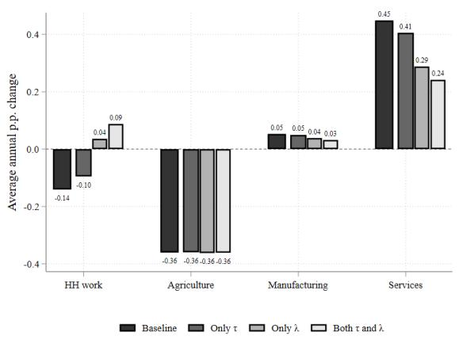

(b) Sectoral Population Shares: Women  
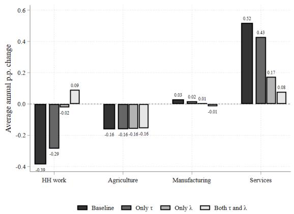

(c) Sectoral Employment Shares  
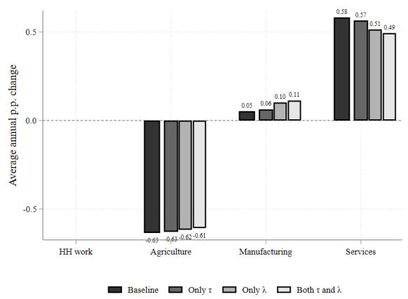

(d) Occupational Population Shares  
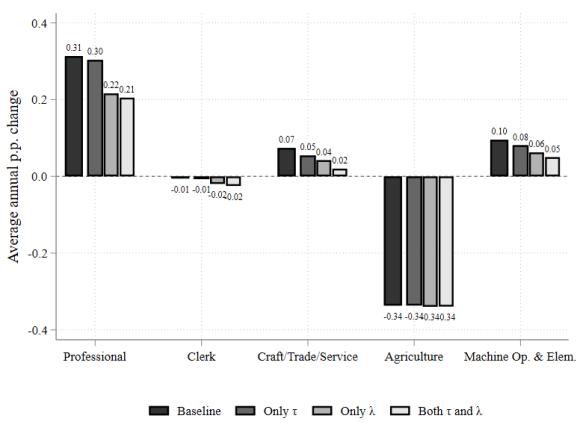

Notes: This figure shows average annual percentage point changes in sectoral and occupational employment shares between the 1970s and 2010s for the six countries in our core sample. The top panel shows sectoral employment shares changes in the aggregate and for women, including the home sector share. Figure (c) instead measures sectoral employment shares conditional on labor force participation, excluding the home sector share. Figure (d) shows changes in occupational employment shares, whose measures include the home sector share (however, we omit the home sector bars from Figure (d) because they are identical to Figure (a)). The four bars in each graph represent: (i) the data; (ii) counterfactuals that fix wage discrimination at the 1970s level; (iii) counterfactuals that fix gender norms at the 1970s level; and (iv) counterfactuals that fix both gender barrier at the 1970s levels.

Employment Transitions across Occupations. Figure 4d documents how changes in gender barriers affected occupational employment shares over the past decades. In the data (black bars), rising female labor force participation and declining agricultural employment have coincided with employment growth in professional and managerial occupations (0.31 p.p. per year), machine-operating and elementary occupations (0.10 p.p.), and crafts, trade, and service occupations (0.07 p.p.). Overall, declining gender barriers account for a third of the observed growth in professional occupations, half for elementary occupations, and around 70% for craft, trade, and service occupations (lightest gray bars on the left). Clerical occupations – where women are overrepresented – would have experienced a steeper decrease if barriers had not changed. Effects are again primarily driven by changes in gender norms rather than changes in wage discrimination, as shown by the two darker gray bars in the middle.

Table 4: Change in Sectoral Output Explained by Gender Barriers

<table><tr><td></td><td>Agriculture</td><td>Manufacturing</td><td>Services</td></tr><tr><td></td><td>(1)</td><td>(2)</td><td>(3)</td></tr><tr><td>India</td><td>-5.90</td><td>-3.59</td><td>-2.94</td></tr><tr><td>Indonesia</td><td>1.81</td><td>4.45</td><td>14.98</td></tr><tr><td>Brazil</td><td>34.45</td><td>44.80</td><td>61.64</td></tr><tr><td>Mexico</td><td>12.59</td><td>23.59</td><td>53.46</td></tr><tr><td>Canada</td><td>11.41</td><td>32.52</td><td>44.72</td></tr><tr><td>USA</td><td>16.50</td><td>16.85</td><td>32.75</td></tr><tr><td>Average</td><td>11.81</td><td>19.77</td><td>34.10</td></tr></table>

Notes: This table reports the share of sectoral output growth, which is explained by changes in gender barriers between the 1970s and 2010s. To calculate this share, we compute $(1 - \hat{g}/g)$ , where g represents the sectoral output growth from our baseline calibration, and $\hat{g}$ is the counterfactual output growth obtained when both gender barriers $(\tau_{ojct} \text{ and } \lambda_{ojct})$ are fixed at their calibrated values from the 1970s. The last row presents a simple average across the six countries in our core sample.

Effects on Sectoral Output. In addition to the employment transitions, changing gender barriers also affected sectoral output growth. $^{25}$ Table 4 shows that changes in gender norms and wage discrimination account, on average, for 12% of real output growth in agriculture, 20% in manufacturing, and 34% in services, with substantial variation across our sample countries. A notable outlier is India, where sectoral output would have been 3-6% higher had gender barriers not changed – which is consistent with the worsening of gender barriers shown in Table 3. Among the other countries, we find the smallest impact on sectoral output growth in Indonesia and the largest in Brazil. Across sectors, reductions in gender barriers have contributed the most to output growth in the service sector (15-60% across countries), followed by manufacturing (5-45%), and the least in agriculture (2-34%).

## 6.2 Effects on Aggregate Income and Productivity

Given the importance of changes in gender barriers for employment transitions and sectoral output, we now examine their contribution to aggregate earnings and GDP.

Effects on Output and Productivity. Table 5 shows that changes in gender barriers over the past decades explain, on average, 28% of the observed real GDP per capita growth in our sample countries. The effects vary considerably across countries, ranging from -5% in India to over 50% in Brazil.

Falling gender barriers increase GDP per capita through two channels: first, by increasing women's labor supply (extensive margin), and second, by improving the allocation of talent within the labor market as workers improve their sorting into occupations and sectors based on their comparative advantage. The combined effect of these channels on workers' productivity – i.e., output or GDP per market worker – is theoretically ambiguous because an improved talent allocation raises average human capital per worker, but higher labor force participation lowers it because the marginal worker who enters the labor market is negatively selected on ability. Quantitatively, we find that changes in gender barriers account for 3% of real GDP growth per worker (Column (2) of Table 5), indicating that the productivity gains from improved sorting marginally outweigh the negative selection effect from the extensive margin.

The effects are primarily driven by changes in gender norms, which account for an average of 24% of the observed real GDP per capita growth, while reductions in wage discrimination explain only 4% (see Table OA.2 in the Online Appendix). Changes in gender norms are more important because they declined most in occupations that offer high returns to ability, such as professional and clerical jobs, while wage discrimination has decreased more in occupations with lower returns to ability, as shown in Table 3.

Table 5: Share of GDP and Earnings Growth Due to Changes in Gender Barriers

<table><tr><td rowspan="2"></td><td colspan="2">Real GDP</td><td colspan="2">Real Earnings</td></tr><tr><td>Per Capita(1)</td><td>Per Worker(2)</td><td>Men(3)</td><td>Women(4)</td></tr><tr><td>India</td><td>-4.93</td><td>-0.35</td><td>-2.91</td><td>-27.51</td></tr><tr><td>Indonesia</td><td>9.93</td><td>1.00</td><td>-5.07</td><td>56.47</td></tr><tr><td>Brazil</td><td>55.98</td><td>5.68</td><td>-15.36</td><td>96.81</td></tr><tr><td>Mexico</td><td>39.43</td><td>2.50</td><td>-20.96</td><td>85.14</td></tr><tr><td>Canada</td><td>41.45</td><td>2.39</td><td>-14.01</td><td>83.68</td></tr><tr><td>USA</td><td>27.81</td><td>6.00</td><td>-11.76</td><td>79.34</td></tr><tr><td>Average</td><td>28.28</td><td>2.87</td><td>-11.68</td><td>62.32</td></tr></table>

Notes: This table reports the share of real GDP and real earnings growth, which is explained by changes in gender barriers between the 1970s and 2010s. The shares are calculated as described in the notes of Table 4. The last row presents a simple average across the six countries of our core sample.

Effects on Earnings for Men and Women. Table 5 further shows that changes in gender barriers over the past decades reduced real wage growth by an average of 12% for men while increasing it by 62% for women (Columns 3-4). These results are driven by changes in the workforce composition and equilibrium effects: declining gender barriers increase women's labor force participation and enable them to enter the occupations and sectors where they were most productive, including high-return jobs. In equilibrium, these changes increase the competition for men in high-return jobs, causing some lower-ability men to shift to lower-return occupation-sectors or to exit the labor force altogether. Table OA.2 in the Online Appendix shows that changes in gender norms alone account for nearly the entire effect on real earnings growth for men. For women, both gender barriers matter because declining wage discrimination directly raises women's wage rates per human capital unit, in addition to affecting their employment choices. $^{26}$

Summary. Our counterfactual analysis shows that changes in gender barriers have played an important role in driving structural transformation and GDP growth over the past decades in our sample countries, primarily by increasing female labor force participation and expanding employment in the service sector and in professional, trade, and service occupations. Comparing countries at different development levels, we find that changes in gender barriers had the smallest – or even negative – effects in the poorer countries of our sample (India and Indonesia), and the largest effects in the middle-income countries (Brazil and Mexico). The richest countries (Canada and the United States) fall in between but still exhibit large effects.

## 7 Mechanisms and Robustness of Results

We next perform a series of analyses and robustness checks to study specific mechanisms of our findings and to examine the sensitivity of our quantitative results.

## 7.1 Non-Homothetic Preferences and Income Effects

We first assess the importance of non-homothetic preferences for our findings by simplifying our baseline model to homothetic CES preferences, setting $\varepsilon_{j}=1\forall j$ in Equation (1). With homothetic CES preferences, the expenditure shares in sectors $j=\{A,M,S\}$ simplify to $\varphi_{j}=\theta_{j}\times(p_{j}/P)^{1-\sigma}$ , where P is the standard CES price index and sectoral expenditure shares no longer depend on individuals' income levels. We re-estimate all parameters and gender barriers in the homothetic model and implement the same counterfactuals.

Table 6 compares the results between the non-homothetic benchmark (column 1) and the homothetic model (column 2). We find that non-homothetic preferences amplify the effects of changing gender barriers, accounting for 28% of observed real GDP per capita growth, compared to 23% with homothetic preferences. In the non-homothetic model, changing gender barriers also explain a larger share of output growth in manufacturing (20% vs 16%) and services (34% vs 28%), while accounting for a similar share of agricultural output growth. Intuitively, declining gender barriers increase individuals' income levels. Under non-homothetic preferences, these income gains shift expenditure shares away from agriculture and toward manufacturing and services, which amplifies the employment and output gains in these sectors.

## 7.2 Preference versus Talent Shocks

We next analyze how our quantitative results change when workers receive idiosyncratic talent shocks $\nu_{oj}^{ti}$ across occupation-sector pairs (Roy, 1951), instead of the preference shocks $\nu_{oj}^{i}$ used in the baseline model. With preference shocks an inefficient allocation of talent can emerge because workers differ in absolute ability z and occupation-sector pairs differ in their returns to ability $\kappa_{oj}$ . This model setup captures a vertical dimension of comparative advantage: high-ability z types have an absolute advantage in all occupation-sectors but a comparative advantage in occupation-sectors with higher returns to ability. Gender barriers can then distort the sorting of high-ability z workers into high-return occupation-sectors. I.i.d. talent shocks across occupation-sector pairs instead represents a horizontal dimension of comparative advantage. When combining absolute ability z and i.i.d. talent shocks, workers' comparative advantage in a given occupation-sector pair depends on the triplet $\{\nu_{oj}^{ti}, z^{i}, \kappa_{oj}\}$ .

Table 6: Importance of Non-Homothetic Preferences

<table><tr><td></td><td>Benchmark Model</td><td>Homothetic Demand</td></tr><tr><td></td><td>(1)</td><td>(2)</td></tr><tr><td>Real GDP per capita</td><td>28.28</td><td>22.73</td></tr><tr><td>Real GDP per worker</td><td>2.87</td><td>1.54</td></tr><tr><td>Agricultural Output</td><td>11.81</td><td>10.77</td></tr><tr><td>Manufacturing Output</td><td>19.77</td><td>15.92</td></tr><tr><td>Service Output</td><td>34.10</td><td>27.75</td></tr></table>

Notes: This table reports the share of real GDP and sectoral output growth, which is explained by changes in gender barriers between the 1970s and 2010s for the benchmark model with non-homothetic preferences (Column (1)) and a model with homothetic CES preferences (Column (2)). The shares are calculated as described in the notes of Table 4. We average across the six countries in our core sample.

Using talent shocks, instead of preference shocks, adds complexity to the model with non-homothetic preferences because the talent shocks directly affect workers' income in each occupation-sector pair. Under non-homothetic preferences, income levels further affect individuals' sectoral expenditure shares, and therefore the relative weights that they assign to nominal earnings, sectoral prices, and occupational disutility $A_{ojg}$ . These additional equilibrium interactions complicate the employment choice problem, which no longer admits the tractable, closed-form solution proposed in Equation (6). To avoid this complexity, we use a model with homothetic preferences to examine the effects of gender barriers when shocks across occupation-sector pairs are specified either as preference or talent shocks. For both models, we re-estimate all parameters and implement all counterfactuals. Section B.2 in the Online Appendix solves the model with talent shocks.

Table 7 shows that changes in gender barriers account for a similar share of the observed GDP per-capita growth with preference or talent shocks (Columns 1-2). The talent shock model, however, explains a larger share of GDP growth per worker (7.2% vs. 1.5%) because it provides two levers to improve the talent allocation of workers: first, by improving the sorting of high-ability z types into high-return occupation-sectors; and second, by improving the sorting of workers into occupation-sectors based on their talent shocks $\nu_{oj}^{ti}$ . The second channel is absent in the model with preference shocks.

Table 7: Impact of Preference vs Talent Shocks

<table><tr><td></td><td colspan="2">Both Barriers</td><td colspan="2">Gender Norms</td><td colspan="2">Wage Discrimination</td></tr><tr><td></td><td colspan="2">Preference Talent</td><td colspan="2">Preference Talent</td><td colspan="2">Preference Talent</td></tr><tr><td></td><td>(1)</td><td>(2)</td><td>(3)</td><td>(4)</td><td>(5)</td><td>(6)</td></tr><tr><td>Real GDP per capita</td><td>22.73</td><td>21.78</td><td>14.10</td><td>-6.89</td><td>7.48</td><td>29.13</td></tr><tr><td>Real GDP per worker</td><td>1.54</td><td>7.17</td><td>2.82</td><td>-2.93</td><td>-1.20</td><td>9.39</td></tr></table>

Notes: This table reports the share of real GDP growth, which is explained by changes in gender barriers between the 1970s and 2010s, averaging across the six countries in our core sample. The shares are calculated as described in the notes of Table 4. The columns presents the growth contributions in models where workers receive either idiosyncratic preference or talent shocks across occupation-sector pairs. Columns (1) and (2) report contributions for both gender barriers, columns (3) and (4) for gender norms only, and columns (5) and (6) for wage discrimination only. Both models use homothetic CES preferences on the demand side.

Table 7 further shows that changes in gender norms have larger effects on aggregate growth in the model with preference shocks (Columns 3-4), whereas changes in wage discrimination matter more in the model with talent shocks (Columns 5-6). To understand this result, it is useful to examine how each model links workers' occupation-sector choices to groups' average human capital across occupation-sector pairs. In the model with preference shocks, a group's average ability $\bar{z}_{oj}^{g}$ is decreasing in the group's employment share $\pi_{oj|gz}$ only in high-return occupation-sectors. This relation arises because the first entrants of a group into the high-return occupation have the highest ability $z$ , leading to a decline in the group's average ability as additional workers enter. The opposite holds for low-return occupations. In the model with talent shocks, a group's average occupation-sector-specific talent $\bar{\nu}_{oj}^{tg}$ decreases in the group's employment share $\pi_{oj|g}$ which holds for all occupation-sectors.

As a result, a model with talent shocks infers a large decline in women's average human capital in high-return occupations where women's employment shares have increased over time (e.g., professional occupations), as it predicts reductions in both average ability $\bar{z}_{oj}^{g}$ and average occupation-sector-specific talent $\bar{\nu}_{oj}^{tg}$ . A model with preference shocks instead captures only the decline in average ability $\bar{z}_{oj}^{g}$ . To match the observed changes in gender employment and wage gaps, the model with talent shocks therefore infers a larger decline in female wage discrimination $\tau_{oj}$ in these occupations, while the model with preference shocks infers a larger decline in gender norms $\lambda_{oj}$ over time.

Table 8: Robustness to the Dispersion of Preference Shocks $\sigma_{\nu}$

<table><tr><td></td><td> $\sigma_{\nu}=1.5$ </td><td> $\sigma_{\nu}=2$ (Benchmark)</td><td> $\sigma_{\nu}=4$ </td></tr><tr><td></td><td>(1)</td><td>(2)</td><td>(3)</td></tr><tr><td>All Gender Barriers</td><td>30.20</td><td>28.28</td><td>22.53</td></tr><tr><td>Gender Norms Only</td><td>26.67</td><td>23.68</td><td>14.25</td></tr><tr><td>Wage Discrimination Only</td><td>3.49</td><td>4.39</td><td>7.12</td></tr></table>

Notes: This table reports the share of real GDP growth, which is explained by changes in gender barriers between the 1970s and 2010s, for different levels of dispersion in workers' occupation-sector-specific preference shocks $\sigma_{\epsilon}$ . The shares are calculated as described in the notes of Table 4. We average across the six countries in our core sample. A smaller value of $\sigma_{\epsilon}$ indicates higher dispersion.

## 7.3 Dispersion of Preference Shocks

We next examine how our results change with the dispersion of workers' preference shocks across occupation-sector pairs $\sigma_{\nu}$ . Smaller values of $\sigma_{\nu}$ indicate higher dispersion. Our baseline model uses $\sigma_{\nu} = 2$ , following Hsieh et al. (2019) and Cassan et al. (2024). We now consider alternative values, ranging from 1.5 (high dispersion) to 4 (low dispersion).

Table 8 shows that a higher dispersion of preference shocks increases the share of economic growth that is explained by changes in gender barriers. Intuitively, the model infers higher levels of gender norms to explain observed occupational choices when idiosyncratic preferences are more dispersed across occupation-sectors, and vice-versa for less dispersion. The estimates of wage discrimination are more stable because they are calibrated to observed wage gaps, which are less affected by the dispersion of preference shocks than employment choices. Hence, Table 8 shows that the importance of changes in gender norms decreases when preference shocks are less dispersed, while the importance of wage discrimination increases.

## 7.4 Gender-Specific Comparative Advantage

In our benchmark model, we assume that men and women with the same ability z are equally productive in each occupation-sector. Under this assumption, we infer female wage discrimination $\tau_{oj}$ to match observed gender wage gaps in each occupation-sector using Equation 10. However, if men or women had a systematic comparative advantage in specific occupation-sector pairs, then our estimates of $\tau_{oj}$ would also reflect these productivity effects. Measuring true productivity differences across genders in each occupation-sector pair and disentangling them from gender barriers is challenging (if not impossible), as it would require detailed data on labor input and output, separately for men and women. Such granular data does not exist for a large set of occupations, sectors, years, and countries. Instead, we implement two analyses to examine the potential role of gender-specific comparative advantage and its implications for our results.

Table 9: Robustness to Adjustments for Gender-Specific Comparative Advantage

<table><tr><td>Model:</td><td>Benchmark</td><td>With Comparative Adv.</td></tr><tr><td></td><td>(1)</td><td>(2)</td></tr><tr><td>All Gender Barriers</td><td>28.28</td><td>20.77</td></tr><tr><td>Gender Norms Only</td><td>23.68</td><td>17.28</td></tr><tr><td>Wage Discrimination Only</td><td>4.39</td><td>3.12</td></tr></table>

Notes: This table reports the share of real GDP growth, which is explained by changes in gender barriers between the 1970s and 2010s. The shares are calculated as described in the notes of Table 4. We average across the six countries in our core sample. The columns compare the results from our benchmark model (Column (1)) and from a model that adjusts for a gender-specific comparative advantage across occupations-sector pairs (Column (2)). We measure such comparative advantage from a benchmark economy – the United States in 2015 – which we assume to have no wage discrimination.

First, we examine whether our estimates of $\tau_{ojct}$ show greater variation across occupation-sector pairs, or across country-years. This information provides insights into the underlying factors that $\tau_{ojct}$ reflects, as gender-specific productivity differences (unlike gender barriers) are expected to vary more across occupation-sector pairs and less across country-years. $^{27}$ Regressing our estimates of $\tau_{ojct}$ on occupation, sector, or occupation-sector fixed effects explains at most 20% of the variation in $\tau_{ojct}$ with $R^{2}$ values ranging from 0.01 to 0.2. This finding indicates that a substantial part of the variation in our $\tau_{ojct}$ estimates is driven by variation across country-years, making them more likely to reflect gender barriers than systematic gender productivity differences within occupation-sector pairs.

In a second exercise, we repeat our counterfactual analysis while explicitly accounting for a gender-specific comparative advantage in each occupation-sector pair. To do so, we select a benchmark economy, the United States in 2015, where we assume no wage discrimination (Lee, 2024). Under this assumption, any observed gender wage gap in a given occupation-sector pair – after adjusting for differences in model-implied human capital – reflects actual differences in productivity between men and women. Hence, we estimate these gender-specific comparative advantages for each occupation-sector pair for our benchmark economy, $\delta_{oj,US2015}$ , and apply the estimates to all other countries and years. Under this adjustment, the effective human capital units of a woman who works in occupation-sector oj in any country-year is then given by: $h_{ojf}^{i}(z) = (1 - \delta_{oj,US2015}) \times \exp(z^{i}\kappa_{oj})$ . Table 9 shows that changes in gender barriers account for 21% of observed real GDP per capita growth under this adjustment, compared to 28% in the benchmark model. The moderate reduction also holds when we fix either gender norms (17% vs 24%) or wage discrimination (3% vs 4%). Hence, changes in gender barriers over the past decades remain an important channel for explaining economic growth in our sample, even when adjusting for a gender-specific comparative advantage.

## 8 Conclusion

This paper provides new evidence on the gender dimension of structural transformation across a large cross-section of countries over the past five decades. We find significant gender gaps in employment and wages that have narrowed on average over time, but continue to persist even today, and even in the most developed countries. We develop a general equilibrium occupational and sectoral choice model to quantify the effects of changes in gender barriers on macroeconomic outcomes, after accounting for the economic channels emphasized in the literature. We find that declining gender barriers have made substantial contributions to the observed increase in female labor force participation, the rise of the service sector, and real GDP per capita growth, but with substantial variation across countries.

By developing a unified framework to study both occupational and sectoral choices, our model not only extends the approaches in the literature (Hsieh et al., 2019), but is particularly useful to study employment transitions over long time horizons and across countries that span a wide spectrum of economic development, where employment structures vary significantly across sectors and occupations. Our analysis cannot identify the factors that led to a rapid decline in gender barriers in some countries but not in others. Future comparative research is therefore needed to examine the underlying drivers of these changes and to propose specific policies that can reduce gender barriers and promote gender parity in the labor market.

## References

Albanesi, S., C. Olivetti, and B. Petrongolo (2023). Families, labor markets and policy. Handbook of Economics of the Family.

Alder, S., T. Boppart, and A. Müller (2022). A theory of structural change that can fit the data. American Economic Journal: Macroeconomics 14(2), 160–206.

Bandiera, O., A. Elsayed, A. Heil, and A. Smurra (2022). Economic development and the organisation of labour: Evidence from the jobs of the world project. Journal of the European Economic Association 20(6), 2226–2270.

Bick, A., N. Fuchs-Schündeln, D. Lagakos, and H. Tsujiyama (2022). Structural change in labor supply and cross-country differences in hours worked. Journal of Monetary Economics 130, 68–85.

Boppart, T. (2014). Structural change and the kaldor facts in a growth model with relative price effects and non-gorman preferences. Econometrica 82(6), 2167–2196.

Boserup, E. (1975). The changing role of women in developing countries. India International Centre Quarterly 2(3), 199–203.

Bridgman, B., G. Duernecker, and B. Herrendorf (2018). Structural transformation, marketization, and household production around the world. Journal of Development Economics 133, 102–126.

Cassan, G., D. Keniston, and T. Kleineberg (2024). A division of laborers: Identity and efficiency in india. Technical Manuscript.

Caunedo, J., D. Jaume, and E. Keller (2023). Occupational exposure to capital-embodied technical change. American Economic Review 113(6), 1642–1685.

Chiplunkar, G. and P. K. Goldberg (2024). Aggregate implications of barriers to female entrepreneurship. Econometrica 92(6), 1801–1835.

Comin, D., D. Lashkari, and M. Mestieri (2021). Structural change with long-run income and price effects. Econometrica 89(1), 311–374.

Conte, B. (2022). Climate change and migration: The case of africa.

Cuberes, D. and M. Teignier (2014). Gender inequality and economic growth: A critical review. Journal of International Development 26(2), 260–276.

Deshpande, A. and N. Kabeer (2024). Norms that matter: Exploring the distribution of women's work between income generation, expenditure-saving and unpaid domestic responsibilities in india. World Development 174, 106435.

Deshpande, A. and J. Singh (2021). Dropping out, being pushed out or can't get in?

decoding declining labour force participation of indian women.

Deshpande, A. and J. Singh (2024). The demand-side story: Structural change and the decline in female labour force participation in india.

Evans, D. K., M. Akmal, and P. Jakiela (2021). Gender gaps in education: The long view. IZA Journal of Development and Migration 12(1).

Fan, T., M. Peters, and F. Zilibotti (2023). Growing like india—the unequal effects of service-led growth. Econometrica 91(4), 1457–1494.

Feng, Y., J. Ren, and M. Rendall (2023). The reversal of the gender education gap with economic development. Center for Economic Policy Research.

Fletcher, E., R. Pande, and C. M. T. Moore (2017). Women and work in india: Descriptive evidence and a review of potential policies.

Goldin, C. (1995). The u-shaped female labor force function in economic development and economic history. Investment in Women's Human Capital and Economic Development, ed. by T. P. Schultz, University of Chicago, 61–90.

Goldin, C. (2024). Nobel lecture: An evolving economic force. American Economic Review 114(6), 1515–1539.

Gottlieb, C., C. Doss, D. Gollin, and M. Poschke (2023). Understanding the gender division of work across countries. Technical report.

Herrendorf, B., R. Rogerson, and A. Valentinyi (2013). Two perspectives on preferences and structural transformation. American Economic Review 103(7), 2752–89.

Herrendorf, B., R. Rogerson, and A. Valentinyi (2014). Growth and structural transformation. Handbook of Economic Growth 2, 855–941.

Herrendorf, B. and T. Schoellman (2018). Wages, human capital, and barriers to structural transformation. American Economic Journal: Macroeconomics 10(2), 1–23.

Hsieh, C.-T., E. Hurst, C. Jones, and P. Klenow (2019). The allocation of talent and U.S. economic growth. Econometrica 87(5), 1439–1474.

Huneeus, F. and R. Rogerson (2024). Heterogeneous paths of industrialization. Review of Economic Studies 91(3), 1746–1774.

Hyland, M., S. Djankov, and P. K. Goldberg (2020). Gendered laws and women in the workforce. American Economic Review: Insights 2(4), 475–490.

IPUMS International (2020). Minnesota population center, integrated public use microdata series, international. Version 7.3 [dataset]. Minneapolis, MN: IPUMS, 2020. https://doi.org/10.18128/D020.V7.3.

Jayachandran, S. (2021). Social norms as a barrier to women's employment in developing

countries. Technical report.

Kuznets, S. (1973). Modern economic growth: Findings and reflections. The American economic review 63(3), 247–258.

Lee, M. (2024). Allocation of female talent and cross-country productivity differences. The Economic Journal 134(664), 3333–3359.

Mammen, K. and C. Paxson (2000). Women's work and economic development. Journal of Economic Perspectives 14(4), 141–164.

Moro, A., S. Moslehi, and S. Tanaka (2017). Does home production drive structural transformation? American Economic Journal Macroeconomics, 116–146.

Ngai, L. R., C. Olivetti, and B. Petrongolo (2024). Gendered change: 150 years of transformation in us hours. Technical report, National Bureau of Economic Research.

Ngai, L. R. and B. Petrongolo (2017). Gender gaps and the rise of the service economy. American Economic Journal: Macroeconomics 9(4), 1–44.

Ngai, L. R. and C. A. Pissarides (2007). Structural change in a multisector model of growth. American Economic Review 97, 429–443.

Olivetti, C., J. Pan, and B. Petrongolo (2024). The evolution of gender in the labor market. Handbook of Labor Economics.

Porzio, T., F. Rossi, and G. Santangelo (2022, August). The human side of structural transformation. American Economic Review 112(8), 2774–2814.

Ranasinghe, A. (2024a). Gender specific distortions, entrepreneurship and misallocation. Journal of Economic Dynamics and Control 162, 104858.

Ranasinghe, A. (2024b). Misallocation across establishment gender. Journal of Comparative Economics 52(1), 183–206.

Rendall, M. (2018). Female market work, tax regimes, and the rise of the service sector. Review of Economic Dynamics 28, 269–289.

Rodrik, D. (2016). Premature deindustrialization. Journal of Economic Growth 21.

Roy, A. D. (1951). Some thoughts on the distribution of earnings. Oxford Economic Papers 3(2), 135–146.

World Bank (2019). Women, business and the law 2019: A decade of reform. Technical Report.

## APPENDIX

## A THEORY

## A.1 Theil Information H-Index and Decomposition

The Theil Information H-Index of segregation is based on Entropy measures which are defined as:

$$
E = \sum_ {g} \frac {N _ {g}}{N} \ln \left(\frac {N}{N _ {g}}\right),
$$

where E measures the "diversity" of the population across gender groups g. $N_{g}$ is the total number of workers of gender g and N is the total population. The entropy measure is equal to zero if all workers have the same gender, while it is maximized if workers are evenly distributed among genders. The entropy measure can also be calculated conditional on a given sector or occupation. Total gender segregation across all occupation-sector pairs is given by:

$$
H _ {o j} = \sum_ {g} \sum_ {o} \sum_ {j} \frac {N _ {o j}}{N \times E} \frac {N _ {o j g}}{N _ {o j}} \ln \left(\frac {N _ {o j g}}{N _ {o j}} \frac {N}{N _ {g}}\right),
$$

where $N_{ojg}$ is the number of workers of gender g in occupation o and sector j. A larger H index implies that men and women are more segregated across occupations and sectors. The H-index is additively decomposable into gender segregation across sectors and segregation across occupations within sectors in the following way:

$$
H _ {o j} = H _ {j} + \sum_ {j} \sum_ {o} \frac {N _ {j}}{N} \frac {E _ {j}}{E} H _ {o} ^ {j},
$$

where $H_{j}$ captures gender segregation across sectors and the second term captures gender segregation across occupations within sectors. Within-sector segregation depends on the relative size of each sector $\left(\frac{N_{j}}{N}\right)$ and the relative entropy measures of each sector $\frac{E_{j}}{E}$ . $H_{o}^{j}$ captures the segregation across occupations within each sector which is equal to:

$$
H _ {o} ^ {j} = \sum_ {g} \sum_ {o} \frac {N _ {o j}}{N _ {j} \times E _ {j}} \frac {N _ {o j g}}{N _ {o j}} \ln \left(\frac {N _ {o j g}}{N _ {o j}} \frac {N _ {j}}{N _ {g j}}\right),
$$

where we simply treat the population in each sector as the universe. Similarly, gender segregation across sectors abstracts from any occupational differences and is given by:

$$
H _ {j} = \sum_ {g} \sum_ {j} \frac {N _ {j}}{N \times E} \frac {N _ {j g}}{N _ {j}} \ln \left(\frac {N _ {j g}}{N _ {j}} \frac {N}{N _ {g}}\right).
$$

## A.2 Deriving Sectoral Expenditure Shares

Individuals have non-homothetic preferences over sectors $k = \{A, M, S\}$ which are implicitly defined by the constraint:

$$
\sum_ {k} \theta_ {k} ^ {\frac {1}{\sigma}} \left(\frac {C _ {k}}{C ^ {\varepsilon_ {k}}}\right) ^ {\frac {\sigma - 1}{\sigma}} = 1,\tag{A.1}
$$

which consumers maximize subject to the standard budget constraint: $\sum_{k} p_{k} C_{k} = I_{ojg}(z)$ , where $I_{ojg}(z)$ is the income earned by a worker of gender g and ability z who works in oj. Taking the first-order conditions with a Lagrangian multiplier $\lambda$ , we get:

$$
\begin{array}{c} \left(\frac {\sigma - 1}{\sigma}\right) \theta_ {k} ^ {\frac {1}{\sigma}} C _ {k} ^ {\frac {- 1}{\sigma}} C ^ {\frac {- \varepsilon_ {k} (\sigma - 1)}{\sigma}} = \lambda p _ {k} \\ \Rightarrow \left(\frac {\sigma - 1}{\sigma}\right) \underbrace {\sum_ {k} \theta_ {k} ^ {\frac {1}{\sigma}} C _ {k} ^ {\frac {\sigma - 1}{\sigma}} C ^ {\frac {- \varepsilon_ {k} (\sigma - 1)}{\sigma}}} _ {= 1} = \lambda \underbrace {\sum_ {k} p _ {k} C _ {k}} _ {= I _ {o j g} (z)} \\ \Rightarrow \lambda = \left(\frac {\sigma - 1}{\sigma}\right) \times \frac {1}{I _ {o j g} (z)}. \end{array}
$$

Substituting for $\lambda$ from the above, using C = I/P in the FOC, and rearranging:

$$
\begin{array}{c} C _ {k} = \theta_ {k} \bigg (\frac {p _ {k}}{I _ {o j g} (z)} \bigg) ^ {- \sigma} \bigg (\frac {I _ {o j g} (z)}{P _ {o j g} (z)} \bigg) ^ {\varepsilon_ {k} (1 - \sigma)} \\ = \theta_ {k} \bigg (\frac {p _ {k}}{P _ {o j g} (z)} \bigg) ^ {- \sigma} \bigg (\frac {I _ {o j g} (z)}{P _ {o j g} (z)} \bigg) ^ {\sigma + \varepsilon_ {k} (1 - \sigma)}. \end{array}
$$

Lastly, defining expenditure shares $\varphi_{k} \equiv p_{k} C_{k} / I_{ojg}(z)$ , we get:

$$
\varphi_ {k} = \theta_ {k} \left(\frac {p _ {k}}{P _ {o j g} (z)}\right) ^ {1 - \sigma} \left(\frac {I _ {o j g} (z)}{P _ {o j g} (z)}\right) ^ {(\varepsilon_ {k} - 1) (1 - \sigma)}.
$$

## B ESTIMATION ALGORITHM

We now describe the numerical procedure that estimates our model parameters. Specifically, we estimate sectoral preference shifters $\{\theta_{j}\}_{\forall j}$ , productivity parameters $\{\{B_{j}\}_{\forall j}$ and $\{\gamma_{oj}\}_{\forall oj}\}$ , and gender barriers $\{\tau_{oj}\}_{\forall oj}$ and $\{A_{ojg}\}_{\forall ojg}$ . The estimation can be implemented separately for each country and consists of three nested loops.

Loop I: Guess overall income levels (i.e., nominal wages) in each country-year.

Loop II: Equation (2) shows that sectoral expenditure shares for $j = \{A, M, S\}$ depend on the joint term of sectoral preference weights and prices, so that we first solve for the combined term of $\psi_{j} := \theta_{j} p_{j}^{1-\sigma}$ for each country-year.

Loop III: Guess wage rates $w_{ojg}$ and utility costs $A_{ojg}$ for each ojg.

Step III.1: Compute income $I_{ojgz} = w_{ojg} \exp(z\kappa_{ojg})$ , the non-homothetic-CES price index $P_{ojgz}$ and hence indirect utility $V(I_{ojgz}, P_{ojgz})$ for each gender-ability type gz and each oj. Note that the price index $P_{ojgz}$ of each income-type depends on the joint term $\psi_j := \theta_j p_j^{1-\sigma}$ . Using the model-implied indirect utility values and the current guess of $A_{ojg}$ , we then solve the occupational-and-sectoral choices for each gender-and-ability-type using Equation (6). Integrating the employment choice probabilities across ability-types, we can then solve for new values of utility costs $A_{ojg}^{new}$ , which ensure that the model exactly matches the data on gender employment shares $\pi_{oj|g}$ .

Step III.2: Next, we compute average human capital in each occupation-sector for each gender – which takes into account how workers select into occupation-sector pairs based on their comparative advantage, wage rates, and gender barriers:

$$
\overline {{H}} _ {o j g} \equiv \frac {H _ {o j g}}{N _ {o j g}} = \frac {\int_ {z} \pi_ {o j | g z} \exp (z \kappa_ {o j g}) d F _ {g} (z)}{\int_ {z} \pi_ {o j | g z} d F _ {g} (z)}.\tag{B.1}
$$

Using this measure of $\overline{H}_{ojg}$ , we then solve for new values of wage rates at the occupation-sector-gender level $w_{ojg}^{new}$ , which ensure that the model exactly matches the data on men and women's average wages in each occupation-sector pair by computing:

$$
w _ {o j g} ^ {n e w} = \frac {\overline {{\mathrm{wage}}} _ {o j g}}{\overline {{H}} _ {o j g}}.\tag{B.2}
$$

Step III.3: We iterate on the inner loop until the values of $w_{ojg}$ and $A_{ojg}$ converge. After convergence, female wage discrimination $\tau_{oj}$ is given by: $\tau_{oj} = 1 - w_{ojf}/w_{ojm}$ .

Loop II: We then turn to the second loop to solve for the values of $\psi_{j} := \theta_{j} p_{j}^{(1-\sigma)}$ .

Step II.1: Using Equation (2), we solve for the sectoral expenditure shares in $j = \{A, M, S\}$ for each income-type ojgz. We then aggregate these expenditure shares to the sector level, weighting them by the distribution of workers across ojgz types and their respective income levels $I_{ojgz}$ . $^{28}$ We then use the market clearing condition to solve for new values of $\psi_j$ , which ensure that consumers' expenditure equals firms' revenue in each sector $j = \{A, M, S\}$ so that: $\psi_j^{new} = R_j / (E_j / \psi_j^{old})$ , where $R_j = \sum_o w_{oj} H_{oj}$ .

Step II.2: We iterate on this loop until the values of $\psi_{j}$ converge.

Loop I: We next turn to the outer loop which solves for nominal income levels and sectoral prices by targeting each country's observed real GDP per capita growth rate.

Step I.1: To compute real income growth in the model, we first disentangle the joint term $\psi_{j}$ into sectoral preference shifters $\theta_{j}$ and sectoral prices $p_{j}$ . To do so, we assume that sectoral preference shifters can vary across countries but not over time, so that the change in $\psi_{j}$ over time pins down the growth in sectoral prices for each country. Without loss of generality, we normalize prices for sectors $j = \{A, M, S\}$ to 1 in the first period of each country, pinning down the level of sectoral preference shifters $\theta_{j}$ for each country.

Step I.2: Given sectoral prices and consumers' expenditure for sectors $j = \{A, M, S\}$ , we then use Equation (5) to decompose the price of the aggregate service composite into the respective prices of home and market services. $^{29}$

Step I.3: Using the sectoral prices and quantities, we then compute the Fisher price index across the three market sectors $j = \{A, M, ms\}$ for each country. To compute real income growth in our model, we then deflate total market-based income (i.e., workers' wage bill or firms' revenue in the sectors $j = \{A, M, ms\}$ ) with the Fisher price index. We then adjust the nominal wage level in the last year of each country until the model-implied real income growth rate matches the real GDP per capita growth rates that we observe in the data.

Step I.4: We iterate until the estimates of all three loops converge.

ONLINE APPENDIX MATERIAL FOR

GENDER BARRIERS, STRUCTURAL TRANSFORMATION, AND ECONOMIC DEVELOPMENT

BY GAURAV CHIPLUNKAR AND TATJANA KLEINEBERG

2025

FOR ONLINE PUBLICATION

## A TABLES AND FIGURES

## A.1 Descriptive Patterns

Figure OA.1: Manufacturing and Service Growth in Developing Countries  
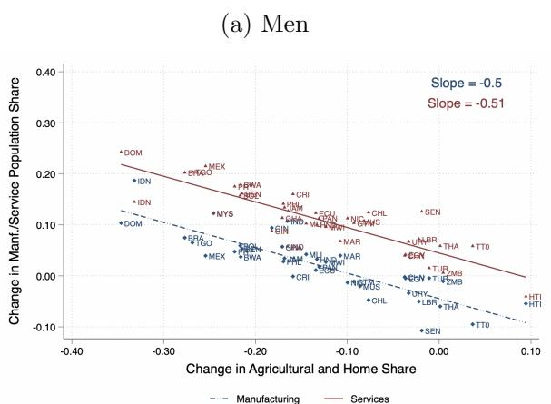

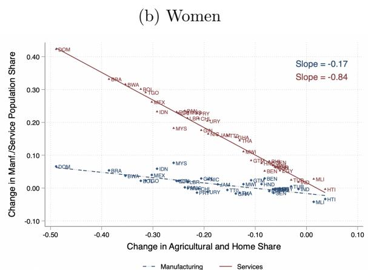  
Notes: This figure shows how changes in the combined employment shares in agriculture and the home sector (horizontal axis) correlate with employment changes in manufacturing (dash blue line) and services (solid red line), separately for men and women. The sample is restricted to low- and middle-income countries. For each country, we calculate changes in sectoral employment shares over time, conditional on labor force participation, using the first (1970-1990) and last (2000-2019) years of available data. We report the coefficients from a linear regression model for manufacturing (Slope (M)) and services (Slope (S)) in the upper right corner of each graph.

## Figure OA.2: Manufacturing Employment Shares: Aggregate and by Gender

(a) Aggregate and Male Shares  
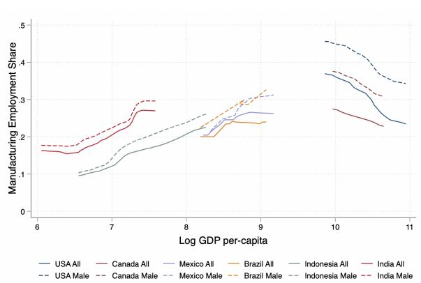

(b) Aggregate and Female Shares  
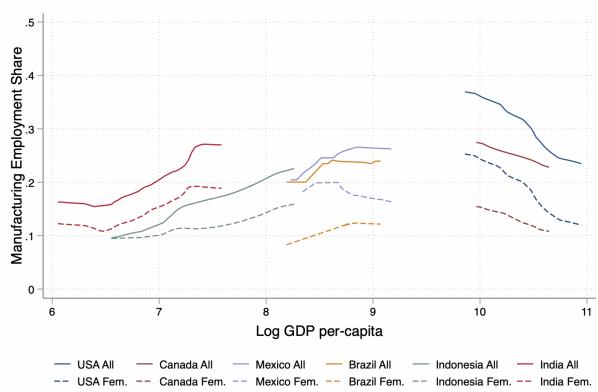  
Notes: This figure plots manufacturing employment shares against log real GDP per-capita in 2010 US dollars over time for the six countries of our core sample: India, Indonesia, Brazil, Mexico, Canada, and the United States. The solid lines show changes in aggregate employment shares. The dashed lines show changes in male (left figure) and female (right figure) employment shares.

Figure OA.3: Occupational Transitions Within Manufacturing and Services  
(a) Manufacturing: All  
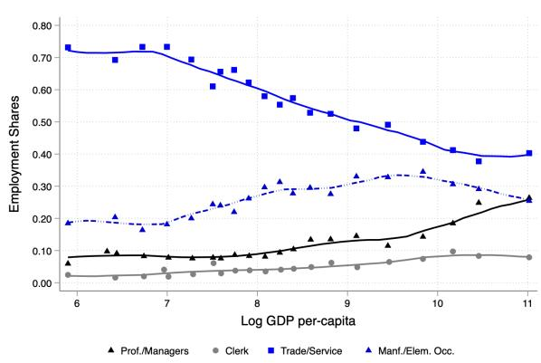

(b) Services: All  
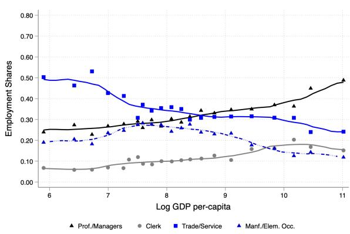

(c) Manufacturing: Men  
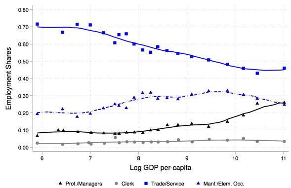

(d) Services: Men  
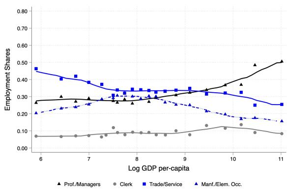

(e) Manufacturing: Women  
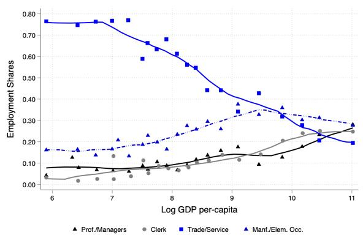

(f) Services: Women  
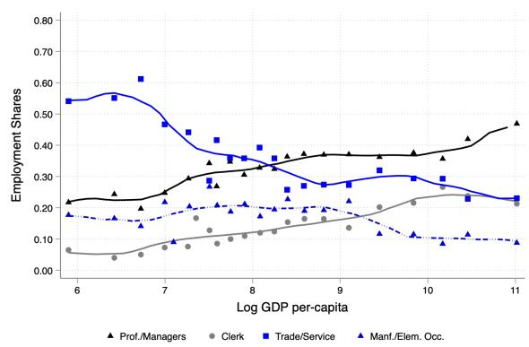  
Notes: This figure presents non-parametric fits of occupational employment shares within manufacturing (left panel) and within the service sector (right panel) against log real GDP per-capita in 2010 US dollars – aggregate, and separately for men and women. The sample pools data from 91 countries and 305 country-years between 1960-2019.

Figure OA.4: Gender Employment and Wage Ratios over Time  
(a) Employment Ratio by Sector  
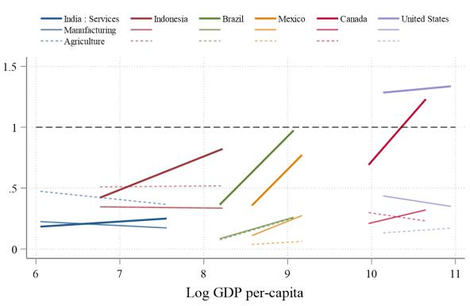  
(c) Wage Ratio by Sector

(b) Employment Ratio by Occupation  
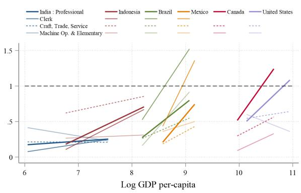  
(d) Wage Ratio by Occupation

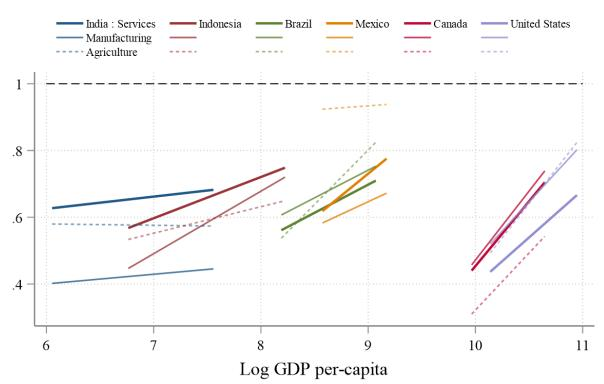

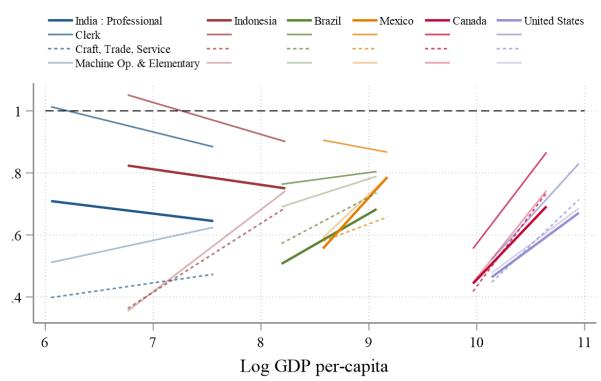  
Notes: This figure plots the female-to-male employment and wage ratios for countries in our core sample against the log of real GDP per-capita in 2010 US dollars. The time period covers the first (1970s) and last (2010s) survey year of each country. Hence, the length of the graphs on the x-axis reflects how fast countries grew during this time period. Employment ratios divide the share of women working in an occupation-sector by the share of men. Wage ratios divide the average wage of women in an occupation-sector by the average wage of men. Figures (a) and (c) show these ratios by sector, while Figures (b) and (d) show them by occupation. Figure (b) excludes the clerk occupation for the United States and Canada as their employment ratios exceed 2 which makes the graph hard to read.

Figure OA.5: Gender Norms and Wage Discrimination Across Countries Over Time  
(a) Gender Norms $(\lambda_{oj})$ by Sector  
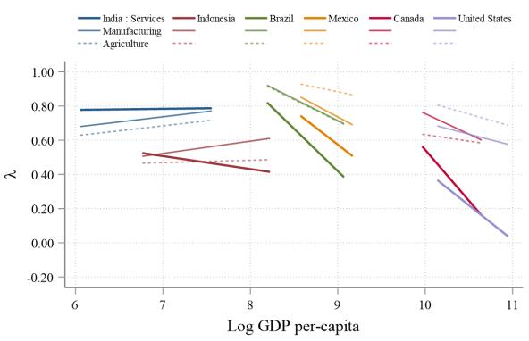

(b) Gender Norms $(\lambda_{oj})$ by Occupation  
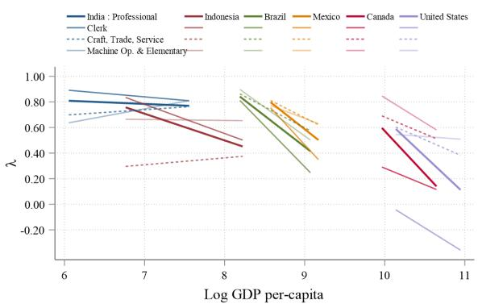

(c) Wage Discrimination ( $\tau_{oj}$ ) by Sector  
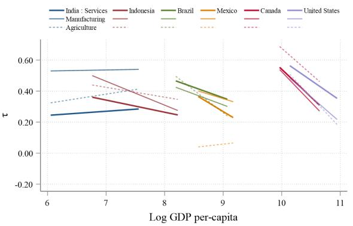

(d) Wage Discrimination ( $\tau_{oj}$ ) by Occupation  
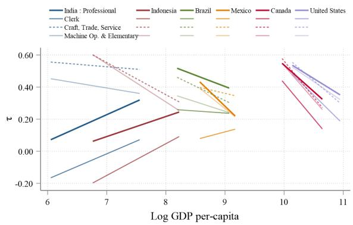  
Notes: This figure plots the estimated gender norms $\lambda_{oj}$ and wage discrimination $\tau_{oj}$ for our core-sample countries against the log of real GDP per-capita in 2010 US dollars. The time period covers the first (1970s) and last (2010s) survey year of each country. Hence, the length of the graphs on the x-axis reflects how fast countries grew during this time period. Figures (a) and (b) show gender norms by sector and occupation, and Figures (c) and (d) show wage discrimination by sector and occupation.

## A.2 Model Fit and Model Validation

Table OA.1: Gender barriers and World, Business, and the Law Indicators

<table><tr><td></td><td>Coef.</td><td>S.E.</td><td>p-value</td></tr><tr><td colspan="4">Panel A. Correlation with τ</td></tr><tr><td>Overall WBL Index</td><td>-0.08</td><td>(0.02)</td><td>0.00***</td></tr><tr><td>Index of Workplace Equality</td><td>-0.07</td><td>(0.02)</td><td>0.00***</td></tr><tr><td>Can a woman get a job in the same way as a man?</td><td>0.03</td><td>(0.04)</td><td>0.53</td></tr><tr><td>Does the law prohibit discrimination in empl. based on gender?</td><td>-0.12</td><td>(0.04)</td><td>0.01***</td></tr><tr><td>Is there legislation on sexual harassment in employment?</td><td>-0.17</td><td>(0.03)</td><td>0.00***</td></tr><tr><td>Are there criminal penalties for harassment at workplace?</td><td>-0.17</td><td>(0.03)</td><td>0.00***</td></tr><tr><td colspan="4">Panel B. Correlation with λ</td></tr><tr><td>Overall WBL Index</td><td>-0.16</td><td>(0.02)</td><td>0.00***</td></tr><tr><td>Index of Household Norms</td><td>-0.11</td><td>(0.02)</td><td>0.00***</td></tr><tr><td>Can a woman be head of household in the same way as a man?</td><td>-0.04</td><td>(0.05)</td><td>0.45</td></tr><tr><td>Is there legislation specifically addressing domestic violence?</td><td>-0.17</td><td>(0.05)</td><td>0.00***</td></tr><tr><td>Can a woman obtain a divorce in the same way as a man?</td><td>-0.12</td><td>(0.05)</td><td>0.01**</td></tr><tr><td>Does a woman have the same rights to remarry as a man?</td><td>-0.12</td><td>(0.05)</td><td>0.01**</td></tr></table>

Notes: This table shows the OLS correlation of wage discrimination $\tau_{ojct}$ in Panel A and gender norms $\lambda_{ojct}$ in Panel B with indicators of the “World, Business, and the Law” data as described in Section 5. Standard errors are clustered at the country level. \*\*\* is p<0.01, \*\* is p<0.05 and \* is p<0.1.

Figure OA.6: Correlations of Gender Barriers and their Empirical Targets  
(a) Gender Norms and Gender Employment Gaps (b) Wage Discrimination nd Gender Wage Gaps  
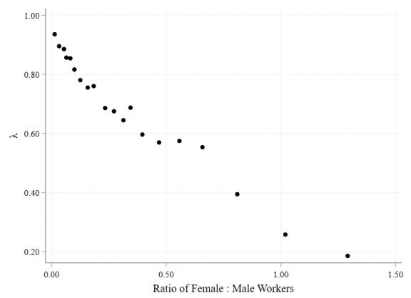

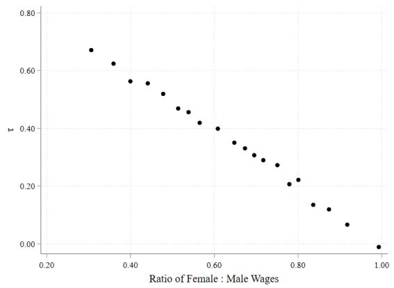  
Notes: This figure shows a binned scatter plot of the correlation between our estimates of gender barriers and their empirical targets in the data. Figure (a) shows the correlation between gender norms $\lambda_{ojct}$ and observed employment gaps, Figure (b) between wage discrimination $\tau_{ojct}$ and observed wage gaps. The sample pools all occupation-sectors and country-years.

## A.3 Importance of Gender Barriers and Aggregate Growth

Table OA.2: Change in Aggregate Outcomes Explained by Gender Barriers

<table><tr><td rowspan="2"></td><td colspan="2">Real GDP</td><td colspan="2">Real Earnings</td></tr><tr><td>Per Capita(1)</td><td>Per Worker(2)</td><td>Men(3)</td><td>Women(4)</td></tr><tr><td colspan="5">Panel A. Gender Norms</td></tr><tr><td>India</td><td>-3.78</td><td>0.37</td><td>-3.11</td><td>-1.28</td></tr><tr><td>Indonesia</td><td>3.84</td><td>1.24</td><td>-6.96</td><td>21.49</td></tr><tr><td>Brazil</td><td>53.34</td><td>5.38</td><td>-14.39</td><td>87.41</td></tr><tr><td>Mexico</td><td>34.51</td><td>3.75</td><td>-20.07</td><td>66.01</td></tr><tr><td>Canada</td><td>31.97</td><td>2.95</td><td>-12.13</td><td>46.05</td></tr><tr><td>United States</td><td>22.21</td><td>8.37</td><td>-12.29</td><td>42.78</td></tr><tr><td>Average</td><td>23.68</td><td>3.68</td><td>-11.49</td><td>43.74</td></tr><tr><td colspan="5">Panel B. Wage Discrimination</td></tr><tr><td>India</td><td>-2.11</td><td>-0.72</td><td>0.44</td><td>-43.57</td></tr><tr><td>Indonesia</td><td>3.93</td><td>-0.27</td><td>-0.66</td><td>19.90</td></tr><tr><td>Brazil</td><td>5.09</td><td>-0.87</td><td>-0.80</td><td>29.64</td></tr><tr><td>Mexico</td><td>6.76</td><td>0.14</td><td>-3.80</td><td>33.71</td></tr><tr><td>Canada</td><td>8.01</td><td>-0.88</td><td>-2.89</td><td>52.47</td></tr><tr><td>USA</td><td>4.64</td><td>-1.58</td><td>-1.28</td><td>49.00</td></tr><tr><td>Average</td><td>4.39</td><td>-0.70</td><td>-1.50</td><td>23.52</td></tr></table>

Notes: This table reports the share of real GDP and real earnings growth, which is explained by changes in gender barriers between the 1970s and 2010s. To calculate this share, we compute $(1 - \hat{g}/g)$ , where g represents the growth rate observed in the data and $\hat{g}$ is the counterfactual growth rate obtained when gender barriers are fixed at their calibrate values from the 1970s. The panels report the separate effects for changes in either gender norms (Panel A) or wage discrimination (Panel B). The last row reports a simple average across the six countries in our core sample.

## B THEORY

## B.1 CES Preferences over Home and Market Services

For a sector $k \in hs, ms$ , i.e., home and market services, consumers minimize:

$$
\begin{array}{l} \min \sum_ {k} p _ {k} C _ {k} \\ \text {s.t.} C _ {S} = \left[ \sum_ {k} \alpha_ {k} ^ {\frac {1}{\sigma_ {s}}} C _ {k} ^ {\frac {\sigma_ {s} - 1}{\sigma_ {s}}} \right] ^ {\frac {\sigma_ {s}}{\sigma_ {s} - 1}}. \end{array}
$$

For a CES price index of the aggregate service composite $P_S = \left[\sum_k \alpha_k p_k^{1 - \sigma_s}\right]^{\frac{1}{1 - \sigma_s}}$ and a Lagrange multiplier $\lambda$ , the first-order condition is given by:

$$
\begin{array}{r l} & {\lambda p _ {k} = \alpha_ {k} ^ {\frac {1}{\sigma_ {s}}} \times \left(\frac {C _ {k}}{C _ {S}}\right) ^ {- \frac {1}{\sigma_ {s}}}} \\ & {\Rightarrow C _ {k} = \alpha_ {k} (\lambda p _ {k}) ^ {- \sigma_ {s}} C _ {S}} \\ & {\quad \therefore \frac {C _ {h s}}{C _ {m s}} = \frac {\alpha_ {h s}}{\alpha_ {m s}} \times \left(\frac {p _ {h s}}{p _ {m s}}\right) ^ {- \sigma_ {s}}} \\ & {\quad \Rightarrow \frac {\varphi_ {h s}}{\varphi_ {m s}} \equiv \frac {P _ {h s} C _ {h s} / I}{P _ {m s} C _ {m s} / I} = \frac {\alpha_ {h s}}{\alpha_ {m s}} \times \left(\frac {p _ {h s}}{p _ {m s}}\right) ^ {1 - \sigma_ {s}}.} \end{array}
$$

Lastly, substituting back in the constraint, we have:

$$
\begin{array}{c} C _ {S} ^ {\frac {\sigma_ {s} - 1}{\sigma_ {s}}} = \lambda^ {1 - \sigma_ {s}} \bigg \{\sum_ {k} \alpha_ {k} p _ {k} ^ {1 - \sigma_ {s}} \bigg \} C _ {S} ^ {\frac {\sigma_ {s} - 1}{\sigma_ {s}}} \\ \lambda = \bigg [ \sum_ {k} \alpha_ {k} p _ {k} ^ {1 - \sigma_ {s}} \bigg ] ^ {\frac {- 1}{1 - \sigma_ {s}}} = 1 / P _ {S} \\ \Rightarrow C _ {k} = \alpha_ {k} \bigg (\frac {p _ {k}}{P _ {S}} \bigg) ^ {- \sigma_ {s}} C _ {s} \\ \Rightarrow \varphi_ {k} \equiv \frac {p _ {k} C _ {k}}{I} = \alpha_ {k} \bigg (\frac {p _ {k}}{P _ {S}} \bigg) ^ {1 - \sigma_ {s}} \varphi_ {S}. \end{array}
$$

## B.2 Model with Homothetic CES Preferences

## B.2.1 Indirect utility, expenditure, and occupation-sector choices with homothetic CES preferences

The non-homothetic CES preferences simplify to homothetic ones when setting $\epsilon_{k} = 1\forall k$ . In this case, the price index P no longer depends on individuals' income and Equation (3) simplifies to the standard CES price index:

$$
P = \left[ \sum_ {k} \theta_ {k} p _ {k} ^ {1 - \sigma} \right] ^ {\frac {1}{1 - \sigma}}.\tag{OA.1}
$$

We can then write the indirect utility from Section 3.2 by taking the exponential as follows:

$$
U _ {o j g} (z) = A _ {o j g} \times \underbrace {\frac {w _ {o j g} e ^ {z \kappa_ {o j g}} \times \nu_ {o j} ^ {i}}{P}} _ {= V (I (z), P)}.\tag{OA.2}
$$

Assuming that $\nu_{oj}^{i}$ is Frechet distributed, the solution to the occupational choice problem is given by:

$$
\pi_ {o j | g z} = \frac {\left[ A _ {o j g} w _ {o j g} e ^ {z \kappa_ {o j g}} \right] ^ {\sigma_ {\nu}}}{\sum_ {j ^ {\prime}} \sum_ {o ^ {\prime}} \left[ A _ {o ^ {\prime} j ^ {\prime} g} w _ {o ^ {\prime} j ^ {\prime} g} e ^ {z \kappa_ {o ^ {\prime} j ^ {\prime} g}} \right] ^ {\sigma_ {\nu}}},\tag{OA.3}
$$

where the CES price index P cancels because – in contrast to the non-homothetic CES – it no longer depends on individual income and therefore no longer varies across occupational and sectoral employment choices.

## B.2.2 Homothetic Preferences and Talent Shocks across Occupation-Sector Pairs

With homothetic preferences, the model remains tractable when workers receive either preference $\nu_{oj}^{i}$ or talent shocks $\nu_{oj}^{ti}$ across occupation-sector pairs. With preference shocks, individuals' income varies only across ojgz cells and $I_{ojg}(z) = w_{ojg} \exp(z\kappa_{ojg})$ . With talent shocks $\nu_{oj}^{ti}$ , each worker's human capital and income in a given occupation-sector pair further depends on their idiosyncratic talent draw. Solving for the human capital supply in each occupation-sector pair in the talent-shock model therefore requires several steps. First, we use the properties of the Frechet distribution to solve for the average talent levels of workers with gender g and ability z conditional on having chosen an occupation-sector pair oj, which we denote by $\bar{\nu}_{oj}^{tgz}$ , and which is equal to:

$$
\bar {\nu} _ {o j} ^ {t g z} = \sigma_ {\nu} \bigg (\frac {1}{\pi_ {o j | g z}} \bigg) ^ {\frac {1}{\sigma_ {\nu}}} \Gamma \bigg (1 - \frac {1}{\sigma_ {\nu}} \bigg),\tag{OA.4}
$$

where $\Gamma(.)$ is the gamma function. This equation illustrates the negative selection result that is standard in Roy models with job-specific talent shocks: for each gender-ability type, the average occupation-sector-specific talent is decreasing in the group's employment share $\pi_{oj|gz}$ because additional entrants into the occupation-sector are negatively selected based on their talent draw $\nu_{oj}^{ti}$ .

The average human capital units of workers of gender g and ability z who work in occupation-sector oj then combines the average occupation-sector-specific talent and the ability z so that:

$$
\overline {{H}} _ {o j g z} = e ^ {z \kappa_ {o j g}} \times \bar {\nu} _ {o j} ^ {t g z}.\tag{OA.5}
$$

Lastly, to solve for the aggregate human capital supply in each occupation-sector, we integrate over ability-z-types and sum across genders so that:

$$
H _ {o j} = \sum_ {g} N _ {g} \int_ {z} \pi_ {o j | g z} \overline {{H}} _ {o j g z} d F (z).\tag{OA.6}
$$

## C DATA AND MEASUREMENT

## C.1 Sample Coverage

Table OA.3: Coverage of All Countries across Decades

<table><tr><td>Decade</td><td># Country-Years</td><td>Percentage</td></tr><tr><td>1960-69</td><td>13</td><td>4.26</td></tr><tr><td>1970-79</td><td>31</td><td>10.16</td></tr><tr><td>1980-89</td><td>46</td><td>15.08</td></tr><tr><td>1990-99</td><td>62</td><td>20.33</td></tr><tr><td>2000-09</td><td>93</td><td>30.49</td></tr><tr><td>2010-19</td><td>60</td><td>19.67</td></tr><tr><td>Total</td><td>305</td><td>100</td></tr></table>

Notes: This table reports the coverage of country-years across all 91 countries and 305 country-years in our data by decade.

## Figure OA.7: Sample Coverage across Countries

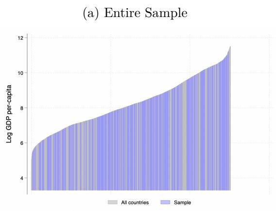

(b) Core Sample  
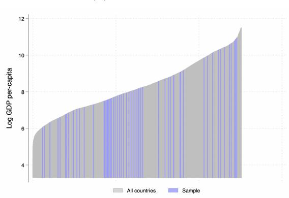  
Notes: This figure sorts all country-years by their real GDP per-capita in 2010 US dollars and highlights the data coverage across all countries in our sample (Figure a) and across the countries in our core sample (Figure b) in blue.

Table OA.4: Coverage of Countries in the Core Sample

<table><tr><td>Country</td><td>Time Coverage</td><td>Real GDP p.c. in 2010</td></tr><tr><td></td><td>(1)</td><td>(2)</td></tr><tr><td>India</td><td>1983 to 2018</td><td>$1,357</td></tr><tr><td>Indonesia</td><td>1976 to 2018</td><td>$866</td></tr><tr><td>Mexico</td><td>1970 to 2015</td><td>$9,271</td></tr><tr><td>Brazil</td><td>1970 to 2010</td><td>$11,286</td></tr><tr><td>Canada</td><td>1971 to 2011</td><td>$48,464</td></tr><tr><td>United States</td><td>1970 to 2015</td><td>$48,467</td></tr></table>

Notes: This table reports the coverage of our data for the six countries in our core sample. Column (1) reports the time coverage while Column (2) reports the real GDP per-capita in 2010 US dollars from the World Bank data.

## C.2 Sample Definition, Sector-Occupation Classifications, and Data Cleaning

## C.2.1 Sample Definition

1. We restrict the sample to individuals of ages 25 to 60 years.

2. For a very small share of observations, we observe a sector and occupation of workers' current job, but their employment status is missing. We count these individuals as “employed”.

3. We drop individuals who are in the armed forces. Among the inactive population, we drop individuals who report that they do not work because they are in school, in prison, disabled, retired, or living on rents. For years where this information is not available, we assume that the fraction of inactive individuals for which this criterion applies is the same as in the closest survey-year.

4. We classify all individuals who are unemployed or out of the workforce as working in the “home sector.”

5. Table OA.5 provides the classification of education categories into years of education.

## C.2.2 Industry and Occupation Classifications

1. Tables OA.6 and OA.7 provide the classification of sectors and occupations.

Table OA.5: Classification of Education

<table><tr><td>Code</td><td>Education</td><td>Years</td></tr><tr><td>0</td><td>NIU (not in universe)</td><td>NA</td></tr><tr><td>100</td><td>Less than primary completed</td><td>2</td></tr><tr><td>110</td><td>No schooling</td><td>1</td></tr><tr><td>120</td><td>Some primary</td><td>3</td></tr><tr><td>130</td><td>Primary (4 years)</td><td>4</td></tr><tr><td>211</td><td>Primary (5 years)</td><td>5</td></tr><tr><td>212</td><td>Primary (6 years)</td><td>6</td></tr><tr><td>221</td><td>General and unspecified track</td><td>9</td></tr><tr><td>222</td><td>Technical track</td><td>9</td></tr><tr><td>311</td><td>General track completed</td><td>12</td></tr><tr><td>312</td><td>Some college/university</td><td>14</td></tr><tr><td>320</td><td>Technical track</td><td>14</td></tr><tr><td>321</td><td>Secondary technical degree</td><td>12</td></tr><tr><td>322</td><td>Post-secondary technical education</td><td>14</td></tr><tr><td>400</td><td>University Completed</td><td>16</td></tr><tr><td>999</td><td>Unknown/Missing</td><td>NA</td></tr></table>

2. For the small share of employed workers for which we observe only either an occupation code or a sector code, we make the following adjustments:

\- We set the occupation code to "Skilled Agricultural Workers" if the reported sector is agriculture, but the occupation code is missing, unknown, or unspecified.

\- We set the sector to "Agriculture" if the sector code is missing and the reported occupation is "Skilled Agricultural Workers".

\- We set the sector to "Manufacturing" if the sector code is missing and the reported occupation is either "Craft and Trades Workers" or "Plant and Machine Operators".

\- We set the sector to "Services" if the sector code is missing and the reported occupation is "Professionals," "Clerks," "Service workers," or "Elementary workers".

\- We drop all other employed individuals for which the occupation code is missing, unknown, or unspecified.

3. We group some occupations and sectors to avoid noisy measurements in occupation-

sector-gender cells that have only a very small sample size in some country years.

\- We group the first three ISCO occupation codes as shown in Table OA.7 as one category of "Professionals".

\- We re-assign workers that work as "Professionals," "Clerks," or "Service Workers" in the "Agriculture" sector to the "Services" sector.

\- We re-assign workers that work as "Crafts and Trade workers" or "Plant and Machine Operators" in the "Agriculture" sector to the "Manufacturing" sector.

\- We re-assign workers that work as "Skilled Agricultural workers" in the "Manufacturing" or "Service" sector to the "Agriculture" sector.

Table OA.6: Classification of Industry Codes in IPUMS

<table><tr><td>Code</td><td>Industry</td><td>Classification</td></tr><tr><td>10</td><td>Agriculture, fishing, and forestry</td><td>Agriculture</td></tr><tr><td>20</td><td>Mining and extraction</td><td>Manufacturing</td></tr><tr><td>30</td><td>Manufacturing</td><td>Manufacturing</td></tr><tr><td>40</td><td>Electricity, gas, water and waste management</td><td>Manufacturing</td></tr><tr><td>50</td><td>Construction</td><td>Manufacturing</td></tr><tr><td>60</td><td>Wholesale and retail trade</td><td>Services</td></tr><tr><td>70</td><td>Hotels and restaurants</td><td>Services</td></tr><tr><td>80</td><td>Transportation, storage, and communications</td><td>Services</td></tr><tr><td>90</td><td>Financial services and insurance</td><td>Services</td></tr><tr><td>100</td><td>Public administration and defense</td><td>Services</td></tr><tr><td>110</td><td>Services, not specified</td><td>Services</td></tr><tr><td>111</td><td>Business services and real estate</td><td>Services</td></tr><tr><td>112</td><td>Education</td><td>Services</td></tr><tr><td>113</td><td>Health and social work</td><td>Services</td></tr><tr><td>114</td><td>Other services</td><td>Services</td></tr><tr><td>120</td><td>Private household services</td><td>Services</td></tr><tr><td>130</td><td>Other industry, n.e.c.</td><td>Services</td></tr><tr><td>998</td><td>Response suppressed</td><td>NA</td></tr><tr><td>999</td><td>Unknown</td><td>NA</td></tr></table>

Table OA.7: Classification of Occupations

<table><tr><td>ISCO</td><td>Occupation</td><td>Classification</td><td>Sector</td></tr><tr><td>1</td><td>Legislators, senior officials and managers</td><td>Professional (1)</td><td>M,S</td></tr><tr><td>2</td><td>Professionals</td><td>Professional (1)</td><td>M,S</td></tr><tr><td>3</td><td>Technicians and associate professionals</td><td>Professional (1)</td><td>M,S</td></tr><tr><td>4</td><td>Clerks, secretaries, librarians, cashiers</td><td>Clerks (2)</td><td>M,S</td></tr><tr><td>5</td><td>Service workers and shop and market sales</td><td>Services Workers (3)</td><td>M,S</td></tr><tr><td>6</td><td>Skilled agricultural and fishery workers</td><td>Skilled Agri. (4)</td><td>A</td></tr><tr><td>7</td><td>Crafts and trades workers (builders, textile)</td><td>Craft/Trade (5)</td><td>M,S</td></tr><tr><td>8</td><td>Plant and machine operators and assemblers</td><td>Plant &amp; Machine (6)</td><td>M,S</td></tr><tr><td>9</td><td>Elementary occ (street vendors, manual labor)</td><td>Elementary (7)</td><td>A,M,S</td></tr><tr><td>10</td><td>Armed forces</td><td>Drop</td><td></td></tr><tr><td>11</td><td>Other occupations, unspecified or n.e.c.</td><td>Drop</td><td></td></tr><tr><td>97</td><td>Response suppressed</td><td>Drop</td><td></td></tr><tr><td>98</td><td>Unknown</td><td>Drop</td><td></td></tr><tr><td>99</td><td>NIU (not in universe)</td><td>Drop</td><td></td></tr></table>

Notes: This table shows the classification of occupations as reported in the IPUMS data. We aggregate the first three ISCO codes as shown in Column (3). The last column shows which occupations are represented in the respective sectors. More information on the ISCO classification of occupations can be found here.

## C.3 Measures of Earnings, Hours Worked, and Effective Employment

In this section, we first discuss the available information on hours worked and how we compute measures of “effective employment” in each occupation-sector-gender cell. We then describe how income is measured in IPUMS and the labor force survey data and how we compute our measures of hourly earnings.

## C.3.1 Measurement of Hours Worked

Availability and measurement of hours worked in IPUMS vary across country-years. The most commonly available measures are:

1. HRSWORK1: reports the person's total hours worked per week at all jobs.

2. HRSUSUAL1: reports the person's usual number of hours worked in a typical week across all jobs.

3. HRSACTUAL1: reports the person's actual number of hours worked per week at all jobs.

For some country-years, only a categorized equivalent of the variable is available (marked with the suffix 2, e.g.: HRSWORK2). When the numerical variable is not available, we use the categorical variable by setting hours to the midpoint of each category.

1. We use the variable HRSWORK1 or the midpoints of HRSWORK2 categories when possible. If these variables are not available, we use either usual or actual hours worked per week.

2. We set observations to missing if reported hours are negative or exceed 100 hours per week.

3. When hours worked are missing for an employed individual, but are available in general for the country-year sample, then we replace the missing observations by the average hours worked in the same gender-sector-occupation cell within that country-year.

4. If no information on hours worked is available for a specific country year, we use the average hours worked of each gender-sector-occupation cell from the closest year of the country for which this variable is available. This adjustment applies to the samples of Brazil (1970), Mexico (1970,2005,2015), and Indonesia (2000, 2005, 2010).

5. To convert weekly hours worked into monthly or annual measures, we assume that individuals work for 4.3 weeks/month and for 12 months/year. In some cases (United States and Canada) we observe the number of months worked, which we then use to calculate annual hours worked.

## C.3.2 Measurement of Effective Employment

Our quantitative exercise focuses on the extensive margin of employment choices. To capture differences in the intensive margin between part- or full-time workers, we make the following adjustments in the individual-level data to measure effective employment in each occupation-sector-gender cell in each country year:

\- Workers who work less than 15 hours are assigned two-thirds to the "Home sector" and one-third to the reported occupation-sector.

\- Workers who work between 15 and 25 hours are assigned one-half to the "Home sector" and one-half to the reported occupation-sector.

\- Workers who work between 25 and 35 hours are assigned one-third to the "Home sector" and two-thirds to the reported occupation-sector.

\- Workers who work more than 35 hours are fully assigned to the reported occupation-sector and unemployed and inactive individuals are fully assigned to the "Home sector".

\- For country-years in which hours worked is not available in the individual-level data, we assume that the ratios between workers and "effective workers" in each occupation-sector-gender cell are the same as in the closest survey year in which this information is available. The relevant country-years for which we need to make this adjustment are Brazil 1970 (for which we use the ratios from Brazil 1980), Mexico 1970 (for which we use the ratios from Mexico 1990) and Mexico 2015 (for which we use the ratios from Mexico 2010).

## C.3.3 Measuring Income

IPUMS provides three main income variables:

1. INCTOT: reports the person's total personal income from all sources in the previous month or year.

2. INCEARN: reports the person's total income from their labor (wages, business, or farm) in the previous month or year.

3. INCWAGE: reports the person's weekly, monthly or annual wage or salary income.

The labor force surveys provide the equivalent of INCWAGE. Each country-year differs in the availability of these variables. When possible, we try to use the same income measure for a given country over time. More specifically, countries have the following availability:

1. Brazil: 1970, 1980, 1991, 2000, 2010

\- INCTOT for the previous month is available and used for all sample years.

\- Hours Worked per Week: HRSWORK1 available for 1991, 2000 and 2010. HRSWORK2 available for 1980. For 1970 we use the gender-sector-occupation average from the 1980 data.

\- Earnings per hour = INCTOT/(4.33\*Hrs Worked per Week).

## 2. Canada: 1971, 1981, 1991, 2001, 2011

\- INCTOT for the previous year is available and used for all sample years.

\- Hours Worked per Week: HRSWORK1 available 1981 onwards, HRSUSUAL2 available for 1971.

\- Months Worked per Year: MONTHSWRK is available and used to convert annual income to hourly income.

\- Earnings per hour = INCTOT/(4.33\*Hrs Worked per Week\*Months Worked).

## 3. India: 1983, 1987, 1993, 1999, 2004, 2009, 2011, 2018

\- There is no information on hours worked provided in IPUMS, so we instead rely on data from the labor force surveys, in particular the Indian Employment-Unemployment Survey (EUS) from 1983-2009 and the Periodic Labor Force Survey (PLFS) for 2011-2018. Both surveys have been harmonized in the World Bank's Global Labor Database (GLD).

\- Income is measured as "Last wage payment, primary job, excl. bonuses, etc. (7-day ref period)". An additional variable records the frequency of payment for each survey.

\- Hours Worked per Week: The variable records the hours of work last week for the individual's main job.

\- Wages per hour: We convert weekly wages to hourly wages using hours worked per week.

## 4. Indonesia: 1976, 1995, 2015, 2018

\- Income: In IPUMS, the only available income measure is INCWAGE of the previous month, which is available only for the years 1976 and 1995.

\- Hours worked: HRSWORKED1 is available for 1995 and HRSACTUAL1 is available for 1976.

\- For 1976 and 1995, we compute wages per hour = INCWAGE/(4.333\*Hrs Worked per Week).

\- For the time period from 1994 to 2019, we complement the IPUMS data for Indonesia with data from the SAKERNAS labor force survey.

\- Wage income is available in the SAKERNAS survey for most years and is defined as "Last wage payment, primary job, excl. bonuses, etc. (7-day ref period)".

\- Hours worked in the last week is available in the SAKERNAS survey.

\- For 1994-2018, we compute hourly wages by dividing weekly wage income by weekly hours worked.

## 5. Mexico: 1970, 1990, 1995, 2000, 2005, 2010, 2015

• INCTOT of the previous month is available in 1970, 1995, and 2000.

• INCEARN of the previous month is available in 1990, 1995, 2000, and 2015.

• We use the variable INCTOT in 1970 and INCEARN in 2015.

\- Hours worked: HRSWORKED1 is available for 1990, 1995, 2000, and 2010. For 1970 we use the gender-sector-occupation averages of the 1990 survey. For 2015 we use the gender-sector-occupation average of the 2010 survey.

\- Earnings per hour = INCTOT or INCEARN / (4.33\*Hrs Worked per Week)

## 6. United States: 1970, 1980, 1990, 2000, 2005, 2010, 2015

\- INCTOT in the previous year is available and used in all sample years.

\- Hours worked: HRSWORK1 is available from 1980 onwards. HRSWORK2 is available for 1970. MONTHSWRK is available for all years.

\- Earnings per hour = INCTOT/(4.33\*Hrs Worked per Week\*Months Worked).

## C.3.4 Measuring Income: Data Cleaning and Aggregation

We first clean the data on hourly wages and then compute men and women's aggregate and average wages for all occupation-sector pairs. We do the cleaning separately for each country year.

We trim hourly wages at the 99th percentile for each occupation-sector-gender cell. If workers' income is missing, we impute it by estimating the following Mincer regression:

$$
\ln (\mathrm{wage} _ {i}) = \alpha * \mathrm{YrsSchool} _ {i} + \beta * \mathrm{Exp} _ {i} + \gamma * \mathrm{Exp} _ {i} ^ {2} + u _ {o j g} + \epsilon_ {i},\tag{OA.7}
$$

which regresses the log of hourly wages of individuals i on their years of schooling, experience, experience squared, and gender, sector, and occupation fixed effects. We then use the predicted values from the Mincer regression to impute hourly income for all employed individuals for which income data is missing.

We compute annual total earnings for each individual by multiplying reported monthly income times 12 (Brazil, Mexico, Indonesia IPUMS), reported weekly income times 52 (India and Indonesia labor force surveys) or by simply using reported annual income (Canada and US IPUMS). We then aggregate income across individuals to the occupation-sector-and-gender level after adjusting individuals' survey weights for part-time employment as described above. Average earnings in each occupation-sector-gender cell is then equal to annual aggregate earnings divided by the number of “effective workers” | which again adjusts for part-time workers as described above.

Earnings in Home Sector: For each country-year, we set earnings in the Home Sector equal to the measured earnings of women who work in “elementary occupations” in the service sector.