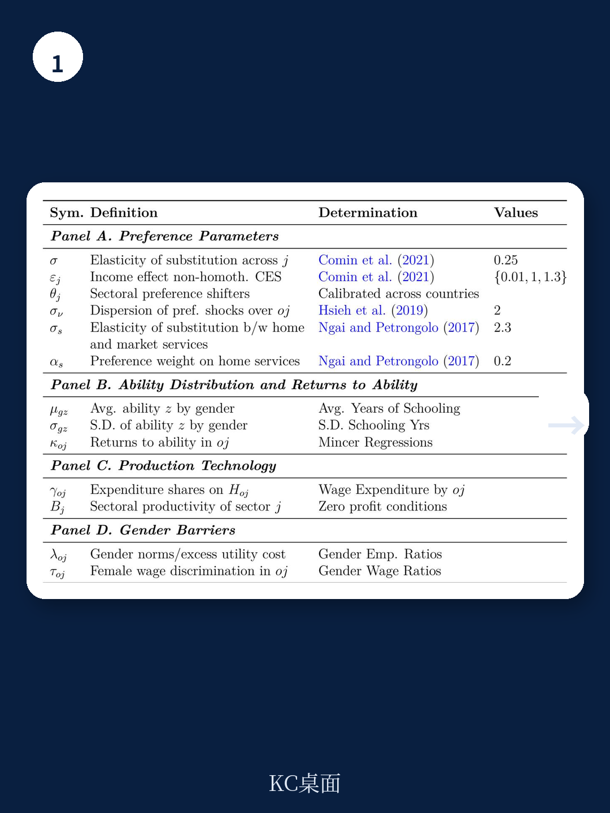
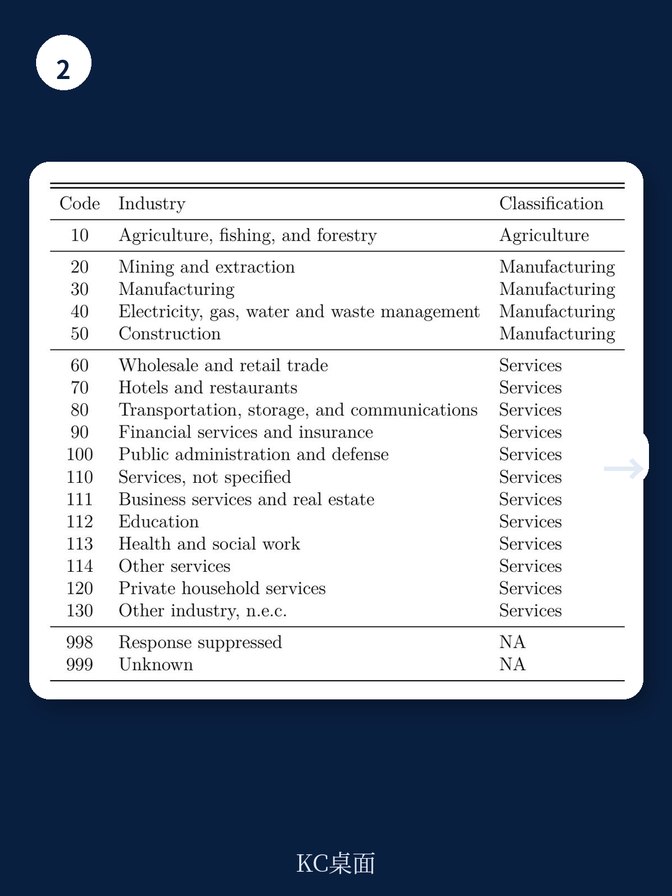

# 世界银行：性别壁垒下降贡献了全球28%的人均GDP增长，但印度是例外

一份来自世界银行的最新研究，对过去五十年间全球劳动力市场的结构性变化提供了一个被严重低估的解释框架。

这份由Gaurav Chiplunkar和Tatjana Kleineberg撰写的政策研究工作论文，基于91个国家超过300个年份的微观数据，系统性地回答了三个问题：女性劳动力参与率上升的驱动力究竟是什么？这种变化如何重塑了全球的产业就业结构？以及，它到底为经济增长贡献了多少？

研究给出的核心判断是：性别壁垒的下降——而非单纯的技术进步或教育扩张——是推动服务业扩张、制造业转型和人均GDP增长的关键变量。平均而言，1970年至2018年间，性别壁垒的下降解释了样本国家28%的人均GDP增长。但这个平均数掩盖了巨大的国别差异：巴西超过50%，加拿大和墨西哥约40%，美国约28%，而印度则是负数——其性别壁垒在五十年间不仅没有改善，反而恶化了。

这个发现的意义在于，它将性别平等从一个社会议题重新定位为一个宏观经济效率议题。对于关注长期增长潜力的决策者和投资者而言，这意味着对劳动力市场结构性红利的评估需要纳入一个此前被低估的维度。

> **KC评论：** 这份报告最有价值的地方不在于“性别平等是好事”这个常识，而在于它给出了一个可量化的因果链条：性别壁垒下降 -> 人才重新配置 -> 产业结构转型 -> 人均产出提升。它把性别问题从社会学范畴拉进了增长核算的框架里。完整报告中包含了对六个主要经济体长达50年的分行业、分职业的详细数据拆解和模型参数，这些图表和假设是理解这一结论可信度的关键。

## 1. 女性的就业路径与男性完全不同，这决定了结构性转型的性别不对称

研究首先揭示了一个被宏观数据掩盖的事实：经典的“从农业到制造业再到服务业”的结构性转型叙事，本质上是一个男性主导的故事。

女性的就业转型路径呈现出独特的“U型”特征。在经济发展的低水平阶段，女性退出农业后，并没有像男性那样进入制造业，而是主要退出了劳动力市场。只有当经济发展到更高水平、服务业开始扩张时，女性才重新进入劳动力市场，且几乎全部集中在服务业。女性在制造业的就业占比，在所有发展水平上都保持低位。

这意味着，过去五十年全球服务业的大规模扩张，其劳动力供给侧的驱动力在很大程度上来自女性。而制造业的就业增长，则主要来自男性。这种性别不对称的就业转型，对理解不同国家的产业结构演变至关重要。

对于正在经历“过早去工业化”的发展中国家而言，这个发现提供了一个新的解释：如果性别壁垒下降缓慢，女性无法有效进入服务业，那么劳动力从农业释放后就会面临更严重的就业挤压，从而加剧经济转型的阵痛。

> **KC评论：** 这个“U型”模式不是一个理论推演，而是来自91个国家的微观数据。完整报告中有大量按发展水平分组的就业转型图表，清晰展示了不同国家女性就业率的拐点位置和斜率差异。这些图表本身就能帮助读者判断自己所在的经济体处于转型的哪个阶段。

## 2. 性别壁垒的下降解释了服务业就业增长的40%-45%

研究将性别壁垒区分为两类：一是“性别规范”，即女性在特定职业-行业组合中工作所面临的额外效用成本（可以理解为社会接受度和心理成本）；二是“工资歧视”，即女性每单位人力资本获得的报酬低于男性。

通过结构模型估算，研究发现在1970年至2010年代期间，性别规范的下降主要发生在服务业以及专业、管理和文职类职业中。工资歧视在所有行业和职业中都有所下降，但在专业职业中下降幅度相对较小。

更重要的是，研究通过反事实模拟发现：如果性别壁垒保持在1970年代的水平，那么样本国家制造业和服务业的就业增长将分别下降20%-35%和40%-45%。这意味着，服务业过去半个世纪的爆炸式增长，有近一半要归因于女性进入门槛的降低。

这个数字对于理解全球服务业的长期增长潜力具有直接含义。如果性别壁垒的下降是服务业扩张的主要驱动力之一，那么当一个经济体的性别壁垒已经降至较低水平后，服务业就业增长的这一边际驱动力就会自然衰减。

## 3. 性别壁垒下降对增长的贡献：巴西超过50%，印度为负

研究对六个主要经济体——印度、印度尼西亚、巴西、墨西哥、加拿大和美国——进行了详细的国别分析。结果呈现出显著的异质性。

巴西是最大的受益者：性别壁垒的下降解释了其超过50%的人均GDP增长。加拿大和墨西哥约为40%。美国约为28%。印度尼西亚约为10%。

印度是唯一的负贡献案例。研究发现，印度的性别壁垒在五十年间不仅没有下降，反而有所恶化。这意味着，如果印度的性别壁垒能保持1970年代的水平，其经济增长本可以更高。这一发现与印度近年来女性劳动力参与率持续下降的观察高度一致。

这个国别差异本身就是一个重要的研究问题。为什么巴西和墨西哥的性别壁垒下降如此显著，而印度却出现了倒退？报告没有给出完整的答案，但指出其估算的性别壁垒与实证测量的性别规范指标高度相关，暗示社会规范和制度环境可能是关键。

> **KC评论：** 这六个国家的对比本身就构成了一个自然实验。完整报告中包含了每个国家分时期的性别壁垒估算值及其变化趋势图，以及这些变化与经济增长路径的对应关系。对于关注新兴市场长期增长前景的读者来说，这些图表比任何宏观预测都更有说服力。

## 4. 报告尚未完全回答的关键问题：性别壁垒下降的原因是什么？

这份报告最令人印象深刻的是它对“性别壁垒下降带来了什么”的量化分析，但它对“性别壁垒为什么会下降”的解释相对有限。

研究承认，性别壁垒的变化受到社会规范、政策改革、法律框架、文化变迁等多种因素的影响。模型将性别壁垒视为外生的“楔子”，通过数据反推其大小和变化，但并没有建立一个解释壁垒如何内生演化的理论机制。

这意味着，对于政策制定者而言，报告给出了一个强有力的“为什么应该重视性别平等”的证据，但并没有提供一个清晰的“如何推动性别壁垒下降”的操作指南。哪些政策最有效？是反歧视立法、教育投资、育儿补贴，还是文化层面的长期变迁？这些问题仍然需要在更广泛的文献中寻找答案。

对于一个投资者而言，这意味着：如果一个经济体正在经历快速的性别壁垒下降，那么它可能正处于一个结构性增长红利期；但判断这个红利还能持续多久，需要依赖对当地社会变迁和政策环境的定性判断，而非模型本身。

## 5. 对读者的观察框架：如何用这份报告的逻辑审视具体经济体

基于这份报告的框架，读者可以从三个维度来评估一个经济体未来的结构性增长潜力：

第一，当前女性劳动力参与率的水平与趋势。如果参与率处于U型曲线的左侧（低发展水平、低参与率），那么随着经济发展，女性可能先退出劳动力市场，而非进入。如果参与率已经开始上升，那么服务业扩张的红利可能正在释放。

第二，性别壁垒的行业分布。报告发现，在较贫穷的国家，性别壁垒主要体现在行业之间（女性难以进入制造业和某些服务业）；在较富裕的国家，性别壁垒更多体现在职业之间（女性集中在文职等低回报职业，难以进入高端专业岗位）。不同阶段的壁垒形态不同，对应的政策重点也应不同。

第三，性别壁垒变化与产业结构的匹配度。如果一个国家的服务业正在扩张，但性别壁垒下降缓慢，那么服务业可能面临劳动力供给瓶颈，从而制约其增长速度。反之，如果性别壁垒正在快速下降，那么服务业就业和产出可能获得额外推动力。

这些观察框架可以帮助读者超越宏观GDP增速的简单比较，深入到劳动力市场的结构性层面去理解不同经济体的增长质量与可持续性。

---

性别壁垒的下降不是一种道德选择，而是一种效率提升。这份世界银行的研究用严谨的量化分析证明了这一点。但正如报告所揭示的，不同国家走在这条路上的速度差异巨大，而这种差异本身就是理解全球经济结构性分化的一个关键维度。

如果你对完整报告中的原始数据图表、六个国家的分行业分职业详细拆解、以及模型背后的技术假设感兴趣，欢迎加入我们的社群。我们每天会由AI agent结合人工review生成国际投行与多边机构的最新中文摘要与深度评论，每日更新，内容约10-40页，包含当天最新数据图表合集，既方便喂给AI进行二次分析，也方便人工快速把握全球市场的结构性动态。

Personal reading notes and learning share only. Not investment advice.

