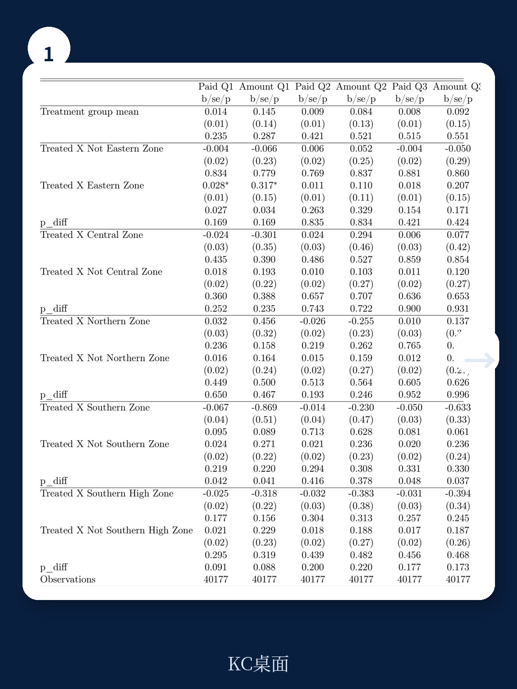
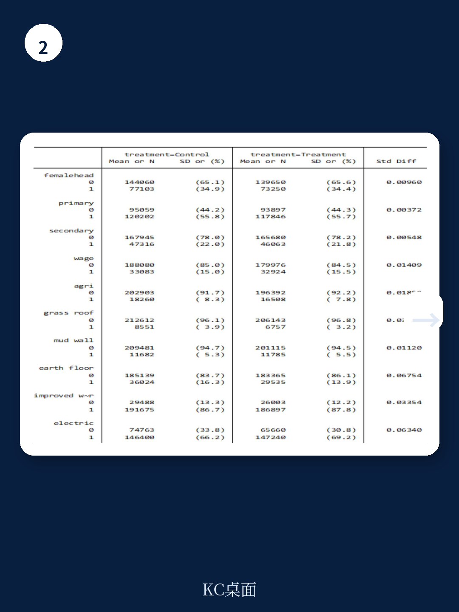

# 世界银行：中小企业不是“怕”税务局，是“不信”税务局

坦桑尼亚税务局把官员派到了中小企业门口，结果怎样？

世界银行一份最新实验给出了一个让税务部门既欣慰又头疼的答案：中小企业纳税人的反应，远比“多派几个人去查”要复杂。

这份题为《对税务局撒谎还是接受帮助？》的工作论文，通过一项在坦桑尼亚119个城区和近郊区域实施的随机对照实验，检验了一个朴素但从未被严格验证的命题——如果税务局官员只是站在旁边，什么都不做，中小企业会不会变得更诚实？

实验的设计本身就是一个创新。世界银行与坦桑尼亚税务局合作，在一轮全国性的中小企业面对面调查中，随机让税务局官员陪同独立调查公司的访员进入一半的样本区域。这些官员不参与提问，不查阅账本，仅仅是“在场”。这是一种介于传统审计威慑与纯粹自愿遵从之间的干预：它既不是惩罚性的，也不是纯粹的宣传教育，而是试图通过增加税务局在社区中的物理可见性，来改变纳税人的心理参照系。

结果令人意外。整体来看，税务局官员的“在场”并没有对中小企业的纳税遵从度和纳税道德产生显著的统计影响。但细分之后，故事变得有趣：在最大城市达累斯萨拉姆，干预带来了短期的纳税额提升；而在其他地区，纳税道德出现了持续性的改善。

> **KC评论：** 这份报告最值得关注的地方不在于它证明“派人有用”或“派人没用”，而在于它揭示了一个被许多税收改革忽略的中介变量——纳税人对执法可信度的感知。达累斯萨拉姆的短期效果，很可能是因为企业主原本就认为税务局“抓不到我”，突然看见官员出现在社区，打破了这种预期。而在其他地区，企业主原本可能连税务局长什么样都不清楚，看见官员反而觉得“这个系统是认真的”。

这引出了一个更深层的追问：为什么整体效果不显著？是干预强度不够，还是中小企业主在调查中“对税务局撒谎”了？

## 1. 这轮实验真正检验的不是“查税”，而是“刷脸”的边界

理解这份报告的价值，首先要搞清楚它检验的到底是什么。

传统的税收执法研究，要么关注审计的威慑效应——比如发一封“你可能被查”的信函，看纳税人会不会多交税；要么关注服务的便利效应——比如简化申报流程、提供在线缴税工具。这两种路径对应的是两类纳税人动机：害怕被惩罚，或者觉得交税没那么麻烦。

世界银行的这项实验，走的是第三条路。它试图检验的是“税务局在社区中的存在感”本身对纳税人行为的影响。这不是审计，不是服务，而是一种介于两者之间的信号传递。

实验的具体操作是：在随机选中的60个区域，税务局官员陪同调查访员进入企业。官员只旁观，不介入。企业主在回答“您对税法的看法”“您过去一年是否如实申报”等问题时，知道有一个税务局的人在场。

这种设计在学术上非常巧妙。它创造了一个“外生的可见性冲击”——这些区域的企业主原本可能一年也见不到一次税务局的人，现在突然在调查中看见了。这种冲击是临时的、非惩罚性的，因此可以相对干净地识别出“可见性”本身对态度和行为的影响。

但这也正是实验效果的边界所在。一次性的、几小时的“在场”，与税务局长期在社区中设立办公室、定期上门走访的“存在感”，是完全不同的两件事。报告自己也承认，实验的干预强度有限，可能不足以产生可检测的溢出效应。

> **KC评论：** 这份报告的价值不在于它给出了一个“yes or no”的答案，而在于它打开了一个新的研究维度。如果你只关心“多派税务官员能不能多收税”，这篇论文的结论会让你失望。但如果你关心“如何在不增加执法成本的前提下改变纳税人的心理预期”，这篇论文的实验设计本身就值得反复琢磨。完整的实验设计细节、随机化过程、样本平衡性检验，都在报告的第三部分和附录中。

## 2. 达累斯萨拉姆的短期改善，揭示了一个被忽视的机制

实验最显著的正面结果，出现在达累斯萨拉姆所在的东部地区。在干预后的第一个季度（2023年第一季度），处理组的企业缴税概率和缴税金额都出现了统计显著的提升。

这个结果为什么重要？因为它提供了一个机制线索。

达累斯萨拉姆是坦桑尼亚的经济首都，集中了全国最活跃的商业活动。税务局的总部设在这里，执法资源也最为密集。理论上，这里的纳税人应该对税务局的存在已经“习以为常”，额外增加一点可见性不太可能产生边际效果。

但实验结果显示，恰恰是在这个“执法密度最高”的地方，干预产生了短期效果。这暗示了一个可能性：达累萨拉姆的企业主不是不知道税务局的存在，而是低估了税务局在社区层面的活动强度。他们可能认为“税务局主要盯着大企业”，或者“税务局只在市中心转悠”。当税务局官员出现在自己所在的社区、出现在自己的店门口时，这种“低估”被修正了。

换句话说，效果来自信息更新，而不是威慑升级。

> **KC评论：** 这个机制对中国的税收征管改革也有启发。很多中小企业不是“不想交税”，而是“以为别人都不交”或者“以为税务局查不到自己”。如果税务局能够通过社区化的、非惩罚性的接触，让企业主意识到“税务局确实在关注我们这一层”，可能会比增加罚款力度更有效地改变遵从行为。报告中对这个信息更新机制的验证，是通过一个2024年4月进行的终期调查完成的，具体问卷设计和数据分析，在报告的第四节后半部分有详细展开。

## 3. 其他地区的纳税道德改善，但可能只是“嘴上说得好听”

与达累斯萨拉姆的短期缴税改善形成对照的，是其他地区出现的纳税道德提升——而且是持续性的提升。

在坦桑尼亚其他地区的处理组中，企业主在调查中回答的“对税法的认同感”“对税务局的信任度”等指标，都比对照组更高，而且这种差异在干预后16个月仍然存在。

这听起来是个好消息。但如果结合缴税数据来看，问题就出来了：这些地区的纳税道德提升了，但实际缴税行为并没有显著变化。

报告提出了两种可能的解释。第一种是“真实改善”：企业主确实对税务局有了更好的印象，但由于各种现实障碍（比如缴税流程复杂、现金流紧张），这种态度的改善还没有转化为行为。第二种是“策略性回应”：企业主知道税务局官员在场，所以在调查中给出了“正确”的回答，但内心并没有真正改变。

报告倾向于第二种解释。作者提到，轶事证据表明企业主“对税务局撒谎”的可能性更大。但这个判断需要更多研究来验证。

> **KC评论：** 这是整份报告最微妙也最值得深思的地方。如果纳税道德调查的结果只是“嘴上说得好听”，那么基于调查问卷来评估税收改革效果的做法就需要重新审视。报告对此进行了非常严谨的讨论，包括如何通过终期调查来区分“真实改善”和“策略性回应”，以及为什么作者认为前者更可能。完整的机制检验和稳健性分析，在报告的4.3和4.4节。

## 4. 报告没有完全回答：一次性的“刷脸”能否变成制度化的“在场”

这份报告最大的价值，在于它提出了一个重要的未解问题：临时性的、非惩罚性的税务局可见性提升，能否通过制度化的方式转化为持续性的遵从改善？

实验中的干预是一次性的。税务局官员在调查期间出现，然后离开。企业主知道这是一次特殊事件，而不是税务局日常运作的一部分。因此，即使这次干预改变了他们的信息集，他们也可能预期“以后不会再这样”，从而不会调整自己的长期行为。

真正有意义的变化，可能需要税务局在社区中建立持续性的存在感——比如定期走访、设立社区服务站、与商业协会建立常规沟通渠道。但这样的干预成本极高，而且需要税务局在组织能力和文化上做出根本性的调整。

坦桑尼亚税务局其实已经在尝试类似的转型。报告提到，税务局近年来推行了“门到门”宣传行动，设立纳税人自助门户，发送纳税提醒短信。这些措施的目的是从“以执法为中心”转向“以促进和信任为中心”。但问题是，这些措施的效果如何？与实验中的一次性干预相比，制度化的社区存在能否产生更持续的效果？

报告没有回答这个问题。它只是提供了一个起点：证明“可见性”本身确实可以影响纳税人的态度和行为，但这种影响的方向和大小取决于具体情境。

> **KC评论：** 对于关注税收改革或公共管理的读者来说，报告没有展开的一个关键问题是：税务局的组织能力是否足以支撑这种社区化的执法模式？坦桑尼亚税务局在达累斯萨拉姆有5个税务区，但在其他地区可能只有很少的执法人员。如果要把“刷脸”变成常态，首先需要解决的是人员配置和培训问题。报告在第二节和第五节对坦桑尼亚的税务行政背景有详细的描述，但这个问题本身超出了这篇论文的研究范围。

## 5. 一个观察框架：如何判断“税务局在场”的真实效果

综合这份报告的发现，我们可以提炼出一个判断“税务局在场”策略效果的框架。这个框架有三个维度。

第一个维度是“可见性的频率”。一次性的可见性，改变的是纳税人的短期信息集；定期的可见性，改变的是纳税人对执法概率的长期预期；制度化的可见性，改变的则是纳税人对税务局角色和意图的根本认知。实验只检验了第一种，但真正有意义的可能是后两种。

第二个维度是“可见性的性质”。是惩罚性的（审计、罚款通知），还是促进性的（上门指导、政策宣讲），还是中性的（只是在场）？实验检验的是中性的可见性，但在现实中，税务局官员的出现几乎不可能被企业主理解为完全中性。

第三个维度是“可见性的受众”。是已经注册的企业，还是未注册的隐形企业？实验样本只覆盖了已经注册的中小企业，但坦桑尼亚真正的税收缺口，可能更多地来自那些根本没有进入税务系统的企业。

> **KC评论：** 这三个维度构成了一个实用的分析工具。如果你看到一篇新闻报道说“某地税务局开展上门服务取得显著成效”，你可以用这个框架去追问：服务频率是多少？是一次性的还是常态化的？服务内容是帮助办税还是变相检查？受众是已注册企业还是全覆盖？这些问题的答案，决定了这个“成效”是真实改善还是短期脉冲。报告中的终期调查设计实际上就是沿着这个逻辑展开的，具体的调查结果和异质性分析，在报告的4.5节。

## 6. 这些未解问题，指向了下一步最值得关注的变量

坦桑尼亚的经验告诉我们，中小企业税收征管的难点，从来不是“不知道要交税”，而是“不相信交了税会有用”。

世界银行的这份实验，给出了一个初步但重要的证据：通过增加税务局在社区中的非惩罚性存在，确实可以改变纳税人的态度，甚至在一定程度上改变行为。但这种改变的方向和大小，高度依赖于当地的企业密度、执法历史和企业主的初始信念。

对于关注这个领域的读者来说，下一步最值得关注的是两个变量。

第一个是“可信度”。当税务局官员出现在社区中，企业主相信的是“他们真的来帮我办税”，还是“他们在找借口查我”？实验的结果暗示，在达累斯萨拉姆，企业主可能更倾向于前者；在其他地区，可能更倾向于后者。这种信任差异，是决定“刷脸”策略成败的关键。

第二个是“持续性”。一次性的干预可以产生短期效果，但要让效果持续，需要税务局在社区中建立制度化的存在。这意味着不仅要增加人员配置，还要改变考核方式、激励机制和内部文化。

报告没有给出这些问题的答案，但它提供了一个非常扎实的起点。

---

如果你想进一步阅读这份报告的完整内容，包括随机化实验的设计细节、坦桑尼亚的推定税制安排、终期调查的问卷设计和数据分析，以及作者对“对税务局撒谎”机制的详细验证，欢迎加入我们的社群。

我们每天会由AI agent加人工审核，生成国际投行和主要研究机构的中文摘要与评论，涵盖当天最新数据图表合集，既方便直接喂给AI工具，也方便人工快速把握市场动态。内容长度约10到40页，每天更新。

Personal reading notes and learning share only. Not investment advice.

