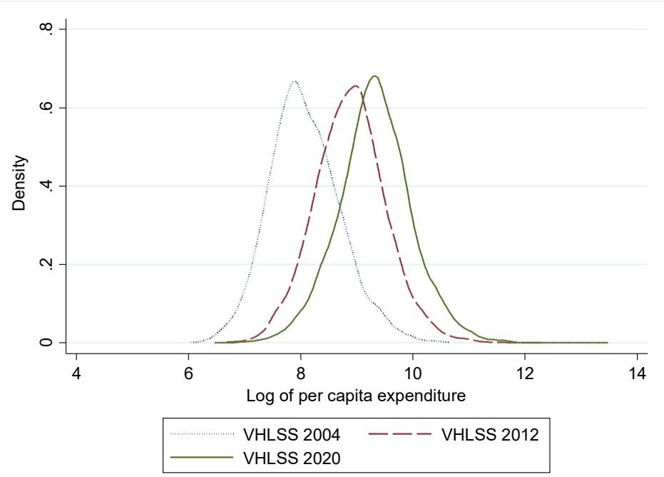
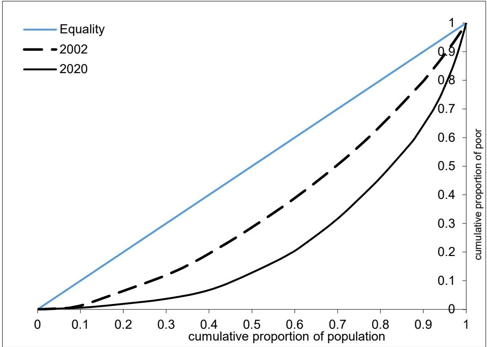
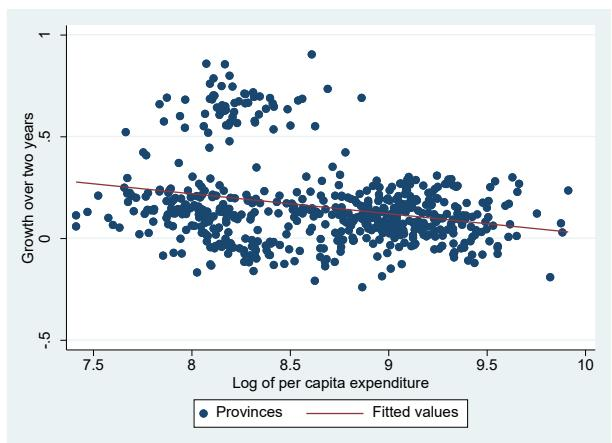
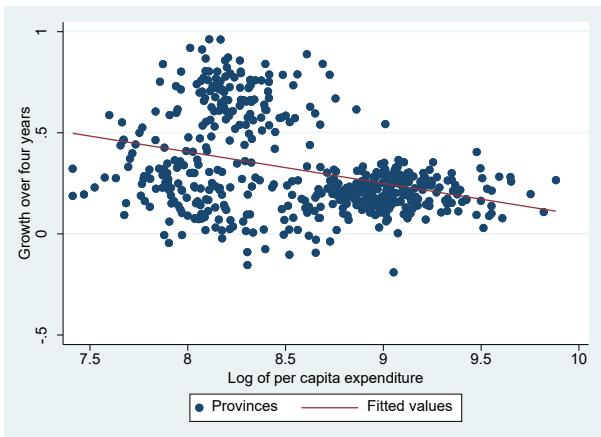
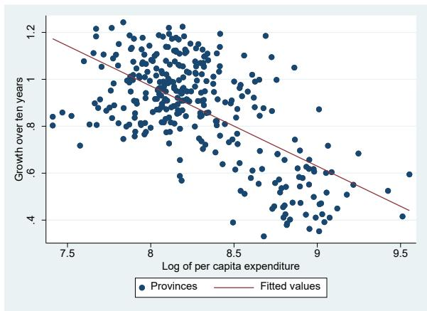
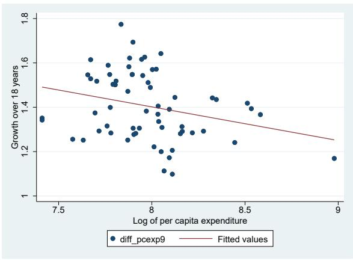

# Rapid Economic Growth but Rising Poverty Segregation

# Will Viet Nam Meet the SDGs for Equitable Development?

Hai-Anh H. Dang

Shatakshee Dhongde

Minh Do

Cuong Viet Nguyen

Obert Pimhidzai

POLICY RESEARCH WORKING PAPER 11067

## Abstract

Viet Nam is widely regarded as a success story for its impressive economic growth and poverty reduction in the last few decades. Yet, recent evidence indicates that the country's economic growth has not been uniform. Compiling and analyzing new, extensive province-level data from the Vietnam Household Living Standards Surveys spanning 2002 to 2020 and other data sources, this paper finds within-province inequality to be much larger than between-province inequality. Furthermore, this inequality gap has been rising over time. Despite the country's fast poverty reduction, the poor were increasingly segregated in certain provinces, particularly those with a larger ethnic minority population. The analysis finds a beneficial impact of economic growth on poverty reduction, but this can depend on inequality levels. It also finds that greater inequality has had negative effects on economic growth but varying negative effects on different poverty indicators. The paper provides supportive evidence of the beneficial impact of economic transitions from agriculture to non-agriculture. The results suggest that policy makers in Viet Nam should focus on reducing spatial disparities and income inequality to attain sustainable economic development.

# Rapid Economic Growth but Rising Poverty Segregation: Will Viet Nam Meet the SDGs for Equitable Development?

Hai-Anh H. Dang, Shatakshee Dhongde, Minh Do, Cuong Viet Nguyen, and Obert Pimhidzai\*

JEL: C15, D31, I31, O10, O57

Keywords: poverty, inequality, pro-poor growth, convergence, household surveys, Viet Nam

## 1. Introduction

Poverty and inequality provide two closely related, but different, measures of household welfare. As rising global living standards have led to less poverty, increasingly more attention has been placed on whether the fruits of economic growth are equally distributed to different population groups in a society. The Sustainable Development Goals (SDGs) adopted by the United Nations (UN) offer a most notable example where the needs to reduce both poverty (SDG number 1) and inequality (SDG number 10) are emphasized by the international community. Indeed, a country with good economic growth but a (highly) unequal income distribution may neither be able to shrink its poor nor narrow the undesirable gaps between its population segments.

Viet Nam is widely regarded as a success story for its impressive economic growth and poverty reduction in the last few decades. Its growth has been found to be pro-poor since the early 1990s (Glewwe and Dang, 2011; Nguyen and Pham, 2018; Pimhidzai and Niu, 2021). Yet, recent evidence indicates that the country's economic growth was not uniform: while inequality gaps between urban and rural areas have been found to narrow over time, they have widened within urban and rural areas (Bui and Imai, 2019). Furthermore, poverty rates became concentrated spatially (Lanjouw, Marra, and Nguyen, 2017) and among ethnic minority groups (Benjamin, Brandt, and McCaig, 2017), suggesting that attention can be focused on these particular groups for more effective poverty amelioration.

In this paper, we aim to provide a long-term (and mostly descriptive) review of trends in poverty, inequality, and economic growth in Viet Nam. We contribute to the existing literature in several ways. First, we offer a broad but early assessment of the intertwined relationship between poverty, inequality, and economic growth for the country over the past 20 years. Recent review studies suggest that there is an intricate and complex relationship between these three development outcomes, which require further evidence for better understanding (Cerra et al., 2022; Ferreira et al., 2022). In fact, we offer the first study to investigate all three development outcomes of poverty, inequality, and economic growth for Viet Nam.

Specifically, we investigate several research questions that are highly relevant to policy. Have average incomes across provinces converged (or diverged) over time? If yes, how were the poor segregated? Why were the poor spatially concentrated in some provinces and not others? Did factors such as inequality, urbanization, investment, and volume of government spending play a role in determining poverty reduction? Furthermore, what could we tell about the relationship between economic growth, inequality, and (different measures of) poverty?

Second, our analysis spans the period 2002-2020, which represents the longest-running period for the country that has been examined in an academic study. We complete this task by analyzing 10 rounds of the nationally representative Vietnam Household Living Standards Surveys (VHLSS). Our findings on the trends of poverty, inequality and economic growth, which are further disaggregated into between-province and within-province and regional variations, offer a nuanced picture of the evolution of these outcomes over time. To our knowledge, these findings are new and not available in previous studies. $^{1}$

Finally, we construct a database of panel data at the province level, which allows us to offer more granular analysis than the urban-rural dichotomy analyzed in previous studies. We further supplement this database with data on government spending that we collect from the central government and different provincial government websites. As a result, we can zoom in on provinces that are good (or bad) performers. Furthermore, this rich panel database also allows us to employ rigorous econometric modeling techniques to investigate the channels affecting the province-level income distributions.

Our estimation results suggest that within-province inequality has steadily increased over time. Within-province inequality is also much larger than between-province inequality, with the former type of inequality being almost three times the latter type of inequality in 2020. Average incomes and expenditures appear to converge across provinces, while poverty significantly declines during this period. The remaining poor seem to be regionally segregated among provinces with a greater share of ethnic minority population. We find beneficial impact of economic growth on poverty reduction. While the relationship of inequality with headcount poverty appears weak and not statistically significant, inequality is positively and strongly statistically correlated with poverty gap and poverty severity and might impede economic growth. Provinces with greater population density and a larger share of urban population have faster growth, whereas the opposite result holds for those with a greater share of ethnic minority groups. The transitions from an agriculture-based economy toward wage-based and services-based economy could be beneficial for the country's economic growth and poverty reduction.

This paper consists of four sections. In the next section, we describe the data (Section 2.1), discuss the overall trends in economic growth, inequality, and poverty at the country level (Section 2.2) and at the regional level as well as analyze poverty segregation across provinces (Section 2.3). We subsequently investigate in Section 3 the relationship between economic growth, inequality, and poverty, including convergence in inequality. We finally conclude in Section 4.

## 2. Trends in economic growth, inequality, and poverty

## 2.1. Data

We compile data from the Vietnam Household Living Standards Surveys (VHLSSs), which has been widely employed by the government, the international community, and academic researchers for poverty and inequality analysis for the country. The VHLSSs have been conducted by the General Statistics Office of Vietnam with technical support from the World Bank every two years since 2002. We compile data on all 58 provinces and five centrally controlled municipalities and supplement this data with other data that we collected. $^{2}$ In particular, provincial government spending data for the period 2018-2020 is currently unavailable for all the 63 provinces in any official document. To get the most updated data, we manually collected the state spending and investment spending data for 2018-2020 from several sources including the Ministry of Finance's website, provincial finance departments' websites, and relevant official documents.

The VHLSSs contain detailed data on individuals and households. Household-level data are collected on durables, assets, production, income, and participation in government programs. Individual-level data are collected on demographics, education, employment, health, and migration. The 1999 Population and Housing Census was used as the sampling frame of the VHLSSs during 2002-2008, while the 2009 and 2019 Population and Housing Censuses were used as the sampling frame of the VHLSSs respectively for 2010-2016 and 2018-2020. Around 3,100 communes were chosen as the primary sampling units out of the list of 10,000 communes for the whole country. A village was randomly selected from each commune, and about 15 households were selected randomly from the village.

The large-sample VHLSSs have a sample size of about 46,000 households that are designed to be representative at the provincial level. While these large-sample surveys only collect income data, a sub-sample of the VHLSSs (the small-sample VHLSSs of around 9,000 households) collect data on both income and expenditure. Since policy discourse in the country is typically based on poverty and inequality analysis using expenditure data, we mostly analyze such data in this paper. We obtain the province-level expenditure using Elbers et al.'s (2003) small area (poverty-map) estimation method (see Appendix B for more detailed description for the data). For robustness checks, we also provide some alternate estimates using per capita income in Appendix A, which offer qualitatively similar results.

## 2.2. Overall trends in economic growth, inequality, and poverty

We provide in Table 1 the country trends in (real) per capita income, expenditure, poverty, and inequality. Between 2002 and 2020, per capita incomes increased significantly from 4,565 thousand (Vietnamese) dong to 15,156 thousand dong. $^{3}$ Similarly, real per capita expenditure more than tripled from 3,476 thousand dong in 2002 to 14,251 thousand dong in 2020. $^{4}$ This rapid economic growth has been widely attributed to important policy changes that took place in Viet Nam in the last two decades (see, e.g., Justino and Litchfield, 2014, Benjamin et al., 2017 for a review). Specifically, the “Doi Moi” (renovation) policies introduced in 1986 helped transform Viet Nam from a centrally planned economy to an open, export-oriented economy with high volume of trade and foreign direct investment. In 2001, the United States and Viet Nam signed a Bilateral Trade Agreement, in which the United States granted Viet Nam the status of the Most Favored Nations. As a result, tariffs on Vietnamese exports to the U.S. reduced significantly, triggering export-led economic growth.

Figure 1 plots the distribution of log of per capita expenditure over time. Between 2004 and 2020, the distribution shifted significantly to the right, indicating a rise in average per capita expenditures. $^{5}$ However there is not a marked decrease in the variance of the distribution, indicating that inequality did not change rapidly during this period. We estimate three different measures of inequality, namely the Gini index and the Theil L and T indices and show the results in Table 1. All the three measures show steady levels of inequality in per capita expenditure. The average value of the Gini index was 0.37 and close to the lower side of the typical range of 0.3-0.5 for Gini values for per capita expenditures in developing countries (World Bank, 2005).

The Gini index is derived from the Lorenz curve and cannot be written as the sum of a term summarizing within-group inequality and a term summarizing between-group inequality (Bourguignon, 1979). Unlike the Gini index, the Theil index is a generalized entropy (GE) measure, and it can be decomposed into within and between components. Table 2 shows the decomposition of the Theil L index (GE 0; also known as the mean log deviation) and the Theil T index (GE 1). We find that within-province inequality increased over time. Within-province inequality explained about $66\%$ of total inequality in 2002, but more than $70\%$ in 2020. This translates into within-province inequality increasing from about twice higher than between-province inequality in the early 2000s, to about three times higher than between-province inequality in the late 2010s. Thus, within-province inequality has become much more significant over time than between-province inequality. $^{6}$

There were significant differences in inequality levels within the provinces (Appendix A, Table A.1). Compared with the national average of 0.37, the Gini index was greater than 0.40 in Lao Cai, Dien Bien, and Lai Chau in the northern mountain region. In 2020, these provinces still had some of the remarkably high poverty rates (Lao Cai: 21.5%, Dien Bien 46% and Lai Chau: 36%). Inequality and poverty levels were similarly high in the central highlands region (e.g., Kom Tum and Gia Lai had Gini values of 0.41 and 0.39 and poverty rates of 17% and 27% respectively). On the other hand, inequality was lower in Mekong River delta with a Gini index of about 0.31 in Long An and Tien Giang (where poverty rates hover around 1%) and 0.28 in Hung Yen and Thai Binh in the Red river delta (where poverty rates range around 1%).

Finally, we also show in Table 1 the estimates of three Foster-Greer-Thorbecke (FGT) indices of poverty (Foster et al., 1984). The poverty rate (i.e., the headcount ratio) measures the incidence or the proportion of the poor in the population, the poverty gap measures the depth of poverty (i.e., the average income shortfall of the poor), whereas the poverty severity index (i.e., the squared poverty gap) takes into account inequality of the income distribution among the poor. All three measures are estimated using the national (expenditure-based) poverty line as well as the World Bank’s PPP \$3.1 per day poverty line. In tandem with the rapid economic growth, we find that poverty rates declined significantly. Nationwide, the headcount poverty rate decreased from 29% in 2002 to less than 10% and 5% in 2016 and 2020, respectively. Notably, the first goal of the United Nations’ Millennium Development Goals was to reduce extreme poverty rates by half between 1990 and 2015 but Viet Nam appears to have well exceeded the target. $^{7}$ More summary statistics are provided in Appendix A, Table A.2.

## 2.3. Regional distribution of poverty

The country-level trends in economic growth, poverty and inequality do not reflect the regional variation in these indicators. In Table A.1 in the Appendix, we present the estimates for each of these indicators in 2020, for all 63 provinces. In the last two decades, although overall poverty declined rapidly in Viet Nam, poverty rates varied significantly across provinces. Poverty rates were lowest in Ho Chi Minh City (1.8% average over time) and neighboring Binh Duong province (3.2% average). Ho Chi Minh City is the largest city and the prime economic center in Viet Nam. The city has numerous export processing zones, industrial parks, colleges, and universities, as well as the largest international airport in the country. After Ho Chi Minh City, Binh Duong is the second highest recipient of foreign direct investment. Both Ho Chi Minh City and Binh Duong province are in the southeast region. Poverty was also lower in the Red River Delta, for instance in the capital city of Hanoi (5.4% average) and the port city of Hai Phong (5% average). $^{8}$ On the other hand, poverty rates were very high in northwest provinces of Son La (50% average), Dien Bien (62% average), Lai Chau (60% average) and Ha Giang (56% average) in the northeast. These provinces lie in the inland, mountainous regions, bordering China and the Lao People's Democratic Republic and have more than $80\%$ of their population residing in rural areas. Furthermore, more than $70\%$ of their population consists of ethnic minorities.

Given the large variance in poverty levels across provinces, there is evidence suggesting that poverty has become spatially concentrated over time (Lanjouw et al., 2017). We measure disparity in the regional distribution of poverty by estimating a poverty segregation curve (Dhongde, 2017). $^{9}$ The poverty segregation curve is a useful graphical tool to analyze how the regional distribution of the poor changed over time. The curve compares a province's share of the poor population with its share of the overall population. The poor are segregated when provinces' share of the poor does not resemble their share in the overall population. Perfect integration (zero segregation) implies that each province has the same share in the poor and the overall population (poor and non-poor combined). Figure 2 plots the poverty segregation curve for 2002 and 2020. The diagonal line of equality shows that there is zero segregation of the poor. The 2002 curve lies above the 2020 curve and hence dominates the 2020 curve. In other words, there was unambiguous increase in the segregation of the poor in Viet Nam.

Poverty segregation curves may often intersect or overlap, and thus fail to provide a complete rank ordering of inequality. In Table 3, we calculate two indices of segregation, namely the Dissimilarity index and the Gini index. The Dissimilarity index is equal to one-half the sum of the absolute difference between the proportion of the poor and the proportion of the population across provinces. The Gini index is equal to twice the area between the segregation curve and the diagonal of equality. $^{10}$ Between 2002 and 2010, there was not a marked increase in segregation. However, since 2012, there was a steady rise in the spatial inequality in the distribution of the poor. Provinces with a cumulative share of about 50% of the total population had about 30% of the poor population in 2002, whereas only about 3% of the poor population in 2020. Over the years, poor provinces such as Dien Bien and Lai Chau saw their share of the poor population increase disproportionately. Despite a rapid decline in average poverty levels, we find that the remaining poor were increasingly segregated in certain provinces in the country.

## 3. Relationship between economic growth, inequality and poverty

## 3.1. Factors affecting provincial poverty

We further analyze the VHLSS data to find which factors were highly correlated with provincial poverty levels. Following the existing literature that examines the effects of income and inequality on poverty (Bourguignon, 2003; Kraay, 2006; Chen and Ravallion, 2010; Ferreira, 2010; Marrero et al., 2024), we estimate the following province fixed effects (FE) model

$$
P _ {i, t} = \alpha + \beta_ {1} L o g (Y _ {i t}) + \beta_ {2} G _ {i t} + \delta X _ {i t} ^ {\prime} + \tau_ {t} + u _ {i} + \varepsilon_ {i t}\tag{1}
$$

In equation (1), $P_{i,t}$ is a poverty index of province i in year t, $Y_{i,t}$ is per capita expenditure, $G_{it}$ is the Gini index, $X_{it}$ is a vector of explanatory variables including high school completion rates, population density (in logarithmic form), shares of the urban population and the ethnic minority population, share of the population with a high school diploma, and different types of investments such as state spending and investment spending. These are the control variables that are widely used in previous studies. We also include in $X_{it}$ the shares of the population with wage income and non-farm income to control for local economic development. The year dummy variables $\tau_{t}$ and the province dummy variables $u_{i}$ help capture unobserved trends occurring for the same years and provinces. $\varepsilon_{it}$ is the error term. The two coefficients $\beta_{1}$ and $\beta_{2}$ that measure the correlation between per capita expenditure and inequality are of primary interest. $^{11}$ The summary statistics are provided in Appendix A, Table A.2.

For better comparison, we use three model specifications for equation (1) where we sequentially add the explanatory variables to the two core variables (log of) per capita expenditure and Gini index. For the first model, we add the province FE. For the second model, we add to model 1 the year FE. Finally, for model 3, we add all the remaining $X_{it}$ control variables, which is our preferred model for interpretation. Table 4 shows that the estimated results for per capita expenditure vary somewhat between model 1 and model 2, which is perhaps due to unobserved trends occurring in different years. But more importantly, once we control for both the province and year FE, overall, the results remain similar between model 2 and model 3.

In particular, Table 4 shows that, holding all other factors constant, a 1 percent rise in a province's per capita expenditure reduced its poverty rate by 0.26 percentage points (column 3), its poverty gap by 0.10 percentage points (column 6), and its poverty severity index by 0.05 percentage points (column 9). Interestingly, holding fixed the per capita expenditure levels, a 1 percent rise in the Gini index led to a reduction in the poverty rate of 0.19 percentage points, but this estimate is not statistically significant. But a similar increase in the Gini index has stronger and statistically significant effects on both the depth and severity of poverty (columns 6 and 9). These results generally concur with findings for other countries, which suggest that while economic growth can be beneficial for poverty reduction, this relationship can change depending on inequality levels (Cerra et al., 2022; Ferreira et al., 2022). But our results shed new light on the intricate relationship between poverty versus inequality and growth using the Viet Nam context and further highlight that we should consider other measures of poverty beyond headcount poverty for a more nuanced understanding of these dynamics.

For the other control variables, Table 4 shows that keeping other factors fixed, provinces with a larger share of urban population or ethnic minority population had greater poverty and more poverty depth and poverty severity. Despite being only marginally statistically significant at the 10 percent level, the positive sign of the estimated coefficient of state spending on all the three poverty indexes is a puzzle (columns 3, 6, and 9). A possible explanation is that state spending could have been mainly reserved for improving infrastructure, and poorer (and more remote) provinces were likely to have been allocated more investment. While population density could raise the poverty rate, higher shares of wage or non-farm income could significantly lower it. The magnitude of impact is comparable to that of the province's per capita expenditure. A 1 percent increase in a province's share of non-farm income and wage income reduced its poverty rate by 0.27 and 0.31 percentage points, respectively (column 3).

We further examine factors that are related to a province's poverty segregation, as measured by its dissimilarity index. Table A.5 in Appendix A indicates that richer provinces or provinces with a lower share of urban population tend to have less poverty segregation, while the opposite holds for provinces with more population density, or provinces that have a higher share of wage or non-farm income. These results hold whether or not we control for the Gini index, the other measure of poverty segregation (columns 3 and 4).

## 3.2. Factors affecting provincial economic growth

In the previous section, we found a strong negative relation between per capita expenditure levels and poverty and a positive relation between inequality and poverty. In this section, we analyze how poverty and inequality in turn affect economic growth. There is an extensive literature on the impact of inequality and poverty on economic growth, but there appears to be inconclusive evidence on the impact (see Baselgia and Foellmi (2022), Cerra et al. (2022), and Ferreira et al. (2022) for recent reviews).

To analyze the inequality-growth and the poverty-growth links, Marrero and Serven (2022) employ the overlapping-generations model with learning-by-doing and knowledge spillovers (Aghion et al., 1999). In this model, poor people have initial endowment below a minimum consumption level. The poor do not save and do not contribute to the aggregate economic growth. In this setting, this study shows that aggregate income growth depends on the share of people below the poverty threshold (i.e., poverty) and on the distribution of endowments (i.e., inequality). Using VHLSSs data, we estimate their reduced form empirical model:

$$
\Delta Y _ {i, t} = \pi + \gamma_ {1} L o g (Y _ {i, t - 1}) + \gamma_ {2} G _ {i, t - 1} + \gamma_ {3} P _ {i, t - 1} + \varphi X _ {i, t - 1} ^ {\prime} + \tau_ {t} + u _ {i} + v _ {i, t}\tag{2}
$$

where $\Delta Y_{i,t} = \operatorname{Log}\big(Y_{i,t}\big) - \operatorname{Log}\big(Y_{i,t-1}\big)$ .

Note that equation (2) is a combination of the standard empirical poverty and growth regression (Ravallion, 2012) and the standard inequality-growth regression (Forbes, 2000; Berg et al., 2018), which allows for testing the impact of poverty and inequality on expenditure growth in the same equation. As Marrero and Serven (2022) point out, the identifying assumption for the main coefficients of interest $\gamma'$ s in this equation is that poverty is not an almost exact linear combination of expenditure and inequality.

Equation (2) is also a standard model used to test conditional $\beta$ -convergence in per capita expenditure (Barro and Sala-i-Martin, 1991). $^{12}$ Growth of per capita expenditure, which equals the difference between log of current per capita expenditure and log of lagged per capita expenditure, is regressed on lag of the control variables. This model is now modified by adding lagged values of inequality and poverty to the set of growth determinants. Clearly, we should be cautious and interpret the lagged Gini and poverty rate in equation (2) as having a correlational—rather than causal—relationship with income growth. Put differently, compared to equation (1), equation (2) presents a related, but different, hypothesis on the intertwined relationship between income growth, inequality, and poverty where the outcome is a change variable (i.e., growth of per capita expenditure) instead of a level variable (i.e., poverty indicators) as with equation (1).

We estimate equation (2) using both province FE and GMM models, with the GMM model being our preferred model for interpretation. The province FE model can be biased if the log of lagged per capita expenditure is correlated with unobserved variables (but these can serve as useful robustness checks). We address this omitted variable bias as follows. Firstly, we also estimate the model of first-differenced variables, and the first difference transformation removes the time-invariant unobserved effect $u_{i}$ . The Arellano–Bond tests for zero autocorrelation of the first order and second order in first-differenced errors are also reported, and these test statistics for autocorrelation present no evidence of model misspecification (i.e., the AR1 and AR2 test values of -6.41 and 4.25 correspond to p-values of less than 0.01; Table 5, column 6). Secondly, we apply the GMM estimator which was developed by Holtz-Eakin, Newey, and Rosen (1988) and Arellano and Bond (1991). The GMM-type instruments for the log of lagged per capita expenditure are higher order lags of the per capita expenditure variables. Although the exogeneity of these instruments may be questionable, we can perform the overidentification test to assess the validation of the instruments. The Sargan test statistics of overidentifying restrictions is performed and reported at the bottom of Table 5 (column 6). The null hypothesis that overidentifying restrictions are valid is not rejected in all the regressions.

We use the same vector of explanatory variables $X_{it}$ as with equation (1). We also estimate three model specifications, where we sequentially add the explanatory variables to the two core variables: lagged (log of) per capita expenditure and Gini index. That is, we add to the first model specification the province FE, and we add to the second model specification the year FE. Finally, for the third model specification, we add all the remaining $X_{it}$ control variables, which is our preferred model for interpretation. We present the estimation results for equation (2) in Table 5. Similar to Table 4, the second model specification with both province and year FE provides intermediate estimation results between the other models: the absolute values of its estimated lagged expenditures (columns 2 and 5) are larger than those using the first model specification with province FE (columns 1 and 4) but smaller than those using our preferred third model specification with all the control variables (columns 3 and 6). We also re-estimate equation (2) using per capita income instead of per capita expenditure and show the estimates in Appendix A, Table A.6.

In almost all the different specifications in Table 5, the estimated coefficient on lagged log of per capita expenditure is negative and significant at the 1% level. Thus, there is evidence of conditional $\beta$ -convergence of per capita expenditure across provinces. Provinces with higher expenditure experienced a lower growth rate. The absolute magnitude of the estimate of the lagged log of per capita expenditure is larger in models with control variables than in those without control variables. According to our preferred GMM model with control variables (column 6), if per capita expenditure in the current period increased by 1 percent, the growth rate of per capita expenditure in the next period is 0.60% lower. In other words, if per capita expenditure increases by 1 percent in the current period, per capita expenditure in the next period will increase by 0.40% (i.e., one minus 0.60).

In addition to finding evidence on conditional $\beta$ -convergence across provinces, Table 5 shows strong negative correlation between inequality and growth in per capita expenditures, suggesting that inequality is harmful for economic growth. Specifically, a 1 percent increase in the Gini index in the current period is associated with a 0.96% decrease in per capita expenditure growth rate in the next period (column 6). $^{13}$ However, poverty rates are not statistically significantly correlated with growth. However, when we replace the headcount poverty rate with poverty gap and poverty severity indexes, the estimated coefficient on the Gini loses statistical significance; the other two poverty indexes become strongly statistically significant instead (Appendix A, Tables A.7 and A.8, columns 6). Since these two other poverty indexes better account for inequality compared to the headcount poverty rate, this indicates that a combination of poverty and inequality could be harmful for economic growth.

Regarding other control variables, provinces with more population density or larger shares of urban population or wage and non-farm income have faster growth. While the results with the population variables have opposite effects on poverty, the results with wage and non-farm income are consistent with those discussed earlier with Table 4. These suggest that the transitions from an agriculture-based economy toward wage-based and services-based economy could be beneficial for the country's economic growth and poverty reduction. Our result is consistent with a key finding that movement of labor from agriculture to non-agriculture through structural transformation are a key driver behind economic development in recent studies for Viet Nam (Tarp, 2017; Liu et al., 2022), and other countries (Deininger et al., 2022).

As further robustness checks, we modify equation (2) by adding the interaction terms between lagged per capita expenditure (and income) and lagged values of control variables (state spending, investment spending, population density, share of urban population, share of population with high-school diploma and share of ethnic minority) and show the estimation results in Appendix A, Tables A.9 and A.10. We still find strong evidence on conditional $\beta$ -convergence in both tables. Furthermore, the interaction terms of expenditure and income with poverty is negative and strongly statistically significant in both tables, and the interaction term of income and inequality is negative in Table A.10. These results suggest that, for the same level of economic development, higher levels of poverty and inequality are generally not conducive to economic growth.

## 4. Discussion and conclusion

In this paper, we provide a comprehensive analysis of poverty and inequality trends in Viet Nam in the past two decades. We compile new, extensive panel data at the province level over the past two decades using the Vietnam Household Living Standards Surveys and other data sources. We find that although average incomes between provinces tended to converge, there was a significant rise in within-province inequality over time. Within-province inequality was three times larger than between-province inequality in 2020. While economic growth helped reduce poverty, greater inequality could negatively affect poverty gap and poverty severity as well as economic growth. Although poverty levels in the country declined significantly, the poor were increasingly segregated in certain provinces. In particular, provinces with a larger share of ethnic minority groups had greater poverty levels. Economic transitions toward wage and service economies could have beneficial impacts on growth and poverty reduction but could also increase poverty segregation.

SDG 1 calls for an end to poverty in all its forms. Certainly, the goal refers to a broader notion of poverty. Admittedly a limitation of our analysis is that we can focus only on monetary (i.e., consumption and income) poverty and do not measure changes in multi-dimensional poverty in Viet Nam. However, goal 1 also emphasizes the need to address poverty in specific underserved geographic areas within each country. To that effect, our analysis examines a new aspect of poverty in the country and reveals a rise in the segregation of its poor. This new finding lends further support to those in the existing studies that poorer population groups are both spatially and ethnically concentrated (Benjamin, Brandt, and McCaig, 2017; Lanjouw, Marra, and Nguyen, 2017; Fujii, 2018). As such, although Viet Nam has made substantial progress in reducing overall poverty, geographically targeted policies can be designed to reach out to the remaining poor.

Another of our contributions is to highlight the importance of reducing inequality. SDG 10 urges policy makers to accelerate progress towards lowering inequality within countries. Although inequality in Viet Nam is lower compared to many other developing countries, we found a rising share of inequality within provinces. Greater inequality levels were negatively correlated with economic growth and positively correlated with poverty levels.

The recent Covid-19 pandemic can offer an illustrative example for both the importance of reducing inequality and poverty segregation. Analyzing Labor Force Surveys data spanning the pandemic, Dang, Nguyen, and Carletto (2023) find that the pandemic had far stronger effects on low-wage workers; specifically, it increased the proportion of below-minimum wage workers by 32% and worsened various wage equality indexes. This study also finds that the pandemic effects were smaller in provinces with greater openness to the global economy (as measured by the share of exports and imports in provinces’ GDP). Reviewing the literature that studied the pandemic’s effects on vulnerable population groups in Viet Nam, Dang and Do (2023) also find that poor households, informal workers, people in poor health, ethnic minority groups, and other disadvantaged groups have been most affected by Covid-19. These results further highlight that inequality in the country can be deepened during times of crisis, affecting the more vulnerable groups that are most in need of assistance.

Indeed, geographical disadvantages could explain most of the non-farm participation gap in disadvantaged communities (World Bank, 2019). Furthermore, while national target programs that specially support poorer communes have sustained high commune level investments, a smaller share went to the poorest communes (Pimhidzai and Niu, 2021). As such, place-based poverty interventions can help effectively target and mitigate the disadvantages of fewer economic activities in lagging areas, which typically have less population density. Investment in both digital and physical infrastructure, such as building better Internet connections and roads, is beneficial for integrating these communities into the national (and global) economy.

Promising directions for future research include investigation of the impacts of interventions such as place-based poverty programs in Viet Nam as well as experimenting with different analytical frameworks that can provide more insights into the intricate relationship between poverty, inequality, and economic growth.

## References

Aghion, P., Caroli, E., & Garcia-Penalosa, C. (1999). Inequality and economic growth: the perspective of the new growth theories. Journal of Economic Literature, 37(4), 1615-1660.

Arellano, M., & Bond, S. (1991). Some tests of specification for panel data: Monte Carlo evidence and an application to employment equations. Review of Economic Studies, 58(2), 277-297.

Barro, R. J. (2012). Convergence and modernization revisited (No. w18295). National Bureau of Economic Research.

Barro, R. J., Sala-i-Martin, X., Blanchard, O. J., & Hall, R. E. (1991). Convergence across states and regions. Brookings Papers on Economic Activity, 107-182.

Baselgia, E., & Foellmi, R. (2022). Inequality and growth: a review on a great open debate in economics. WIDER Working Paper Series, (wp-2022-5).

Benjamin, D., Brandt, L., & McCaig, B. (2017). Growth with equity: income inequality in Vietnam, 2002–14. Journal of Economic Inequality, 15(1), 25-46.

Berg, A., Ostry, J. D., Tsangarides, C. G., & Yakhshilikov, Y. (2018). Redistribution, inequality, and growth: new evidence. Journal of Economic Growth, 23, 259-305.

Bourguignon, F. (1979). Decomposable income inequality measures. Econometrica, 47(4): 901-920.

Bourguignon, F. (2003). The growth elasticity of poverty reduction: explaining heterogeneity across countries and time periods. In T. S. Eicher & S. J. Turnovsky (Eds.), Inequality and Growth: Theory and Policy Implications. MIT Press.

Bui, T. P., & Imai, K. S. (2019). Determinants of rural-urban inequality in Vietnam: Detailed decomposition analyses based on unconditional quantile regressions. Journal of Development Studies, 55(12), 2610-2625.

Cerra, M. V., Lama, M. R., & Loayza, N. (2022). “Links between growth, inequality, and poverty: a survey”. In Cerra et al. (2022). (Eds.). How to Achieve Inclusive Growth. United Kingdom: Oxford University Press.

Chen, S., & Ravallion, M. (2010). The developing world is poorer than we thought, but no less successful in the fight against poverty. Quarterly Journal of Economics, 125(4), 1577-1625.

Dang, H. A. (2012). “Vietnam: A widening poverty gap for ethnic minorities. Indigenous Peoples, Poverty and Development”. In Gillette Hall and Harry Patrinos. (Eds.) Indigenous Peoples, Poverty and Development. Cambridge University Press.

Dang, H. A., & Do, M. N. (2023). COVID-19 Pandemic and the Health and Well-being of Vulnerable People in Vietnam. In Handbook of Social Sciences and Global Public Health. Cham: Springer International Publishing.

Dang, H. A., Nguyen, C., & Carletto, C. (2023). Did a Successful Fight against COVID-19 Come at a Cost? Impacts of the pandemic on employment outcomes in Vietnam. World Development, 161, 106129.

Dang, H. A., Dhongde, S., Do, M., Nguyen, C. V., & Pimhidzai, O. (2023). Rapid Economic Growth but Rising Poverty Segregation: Will Vietnam Meet the SDGs for Equitable Development? IZA Discussion paper no. 15196.

Deaton, A., & Kozel, V. (2005). Data and dogma: the great Indian poverty debate. World Bank Research Observer, 20(2), 177-199.

Dhongde, S. (2017). Measuring Segregation of the Poor: Evidence from India. World Development, 89, 111-123.

Elbers, C., Lanjouw, J. O., & Lanjouw, P. (2003). Micro-level estimation of poverty and inequality. Econometrica, 71(1), 355-364.

Ferreira, F.H. (2010). “Distributions in Motion”. In Oxford Handbook of the Economics of Poverty.

Ferreira, I. A., Salvucci, V., & Tarp, F. (2022). Poverty, inequality, and growth: trends, policies, and controversies (No. wp-2022-43). World Institute for Development Economic Research (UNU-WIDER).

Forbes, K. J. (2000). A reassessment of the relationship between inequality and growth. American Economic Review, 90(4), 869-887.

Foster, J., Greer, J., & Thorbecke, E. (1984). A class of decomposable poverty measures. Econometrica, 52(3): 761-766.

Fujii, T. (2018). Has the development gap between the ethnic minority and majority groups narrowed in Vietnam?: Evidence from household surveys. World Economy, 41(8), 2067-2101.

Glewwe, P., & Dang, H. A. H. (2011). Was Vietnam's economic growth in the 1990s pro-poor? An analysis of panel data from Vietnam. Economic Development and Cultural Change, 59(3), 583-608.

Gradín, C. (2021). Trends in global inequality using a new integrated dataset (No. 2021/61). WIDER Working Paper.

Holtz-Eakin, D., Newey, W., & Rosen, H. S. (1988). Estimating vector autoregressions with panel data. Econometrica, 1371-1395.

Justino, P., & Litchfield, J. (2003). Poverty dynamics in rural Vietnam: winners and losers during reform. Poverty Research Unit at Sussex Working Paper, 10.

Kraay, A. (2006). When is growth pro-poor? Evidence from a panel of countries. Journal of development economics, 80(1), 198-227.

Lanjouw, P., Marra, M., & Nguyen, C. (2017). Vietnam's evolving poverty index map: Patterns and implications for policy. Social Indicators Research, 133(1), 93-118.

Le, H. T., & Booth, A. L. (2014). Inequality in Vietnamese Urban–Rural Living Standards, 1993–2006. Review of Income and Wealth, 60(4), 862-886.

Liu, Y., Barrett, C. B., Pham, T., & Violette, W. (2020). The intertemporal evolution of agriculture and labor over a rapid structural transformation: Lessons from Vietnam. Food Policy, 94, 101913.

Massey, D. S. (2016). “Segregation and the perpetuation of disadvantage”. In Oxford Handbook of the Social Science of Poverty, 16, 369-405.

Marrero, G. A., & Servén, L. (2022). Growth, inequality and poverty: a robust relationship? Empirical Economics, 63(2), 725-791.

Marrero, Á. S., Marrero, G. A., & Servén, L. (2024). Poverty convergence clubs. Review of Income and Wealth. Doi: https://doi.org/10.1111/roiw.12688.

McCaig, B. (2011). Exporting out of poverty: Provincial poverty in Vietnam and US market access. Journal of International Economics, 85(1), 102-113.

Nguyen, C. V., & Pham, N. M. (2018). Economic growth, inequality, and poverty in Vietnam. Asian-Pacific Economic Literature, 32(1), 45-58.

Nguyen, B. T., Albrecht, J. W., Vroman, S. B., & Westbrook, M. D. (2007). A quantile regression decomposition of urban–rural inequality in Vietnam. Journal of Development Economics, 83(2), 466-490.

Pham, A. T. Q., & Mukhopadhaya, P. (2018). Measurement of poverty in multiple dimensions: The case of Vietnam. Social Indicators Research, 138(3), 953-990.

Pimhidzai, O., & Niu, C. (2021). Shared gains: How high growth and anti-poverty programs reduced poverty in Vietnam- Vietnam poverty and shared prosperity update report. Washington, D.C.: World Bank Group.

Ravallion, M. (2012). Why don't we see poverty convergence? American Economic Review, 102(1), 504-523.

Tarp, F. (Eds). (2017). Growth, Structural Transformation, and Rural Change in Viet Nam: A Rising Dragon on the Move. Oxford University Press.

World Bank. (1999). Vietnam development report 2000: attacking poverty. World Bank in Vietnam.

---. (2005). Poverty Manual. Chapter 6.
http://siteresources.worldbank.org/PGLP/Resources/PovertyManual.pdf

---. (2018a). World Development Indicators Online.

---. (2018b). Piecing together the Poverty Puzzle. Washington DC: World Bank.

---. (2019). Better opportunities for all: Poverty reduction and shared prosperity in Vietnam. Washington, D.C.: World Bank Group.

Table 1: National trends in per capita expenditure, inequality, and poverty

<table><tr><td rowspan="2">Indicators</td><td colspan="10">Years</td></tr><tr><td>2002</td><td>2004</td><td>2006</td><td>2008</td><td>2010</td><td>2012</td><td>2014</td><td>2016</td><td>2018</td><td>2020</td></tr><tr><td>Per capita income (‘000 D)</td><td>4565.9(88.1)</td><td>5335.9(142.6)</td><td>6176.6(140.5)</td><td>6414.9(171.4)</td><td>9305.1(225.8)</td><td>9680.7(184.7)</td><td>10600.6(144.5)</td><td>12044.0(172.9)</td><td>14861.7(223.3)</td><td>15156.3(197.1)</td></tr><tr><td>Per capita expenditure (‘000 D)</td><td>3476.1(63.0)</td><td>4009.7(113.1)</td><td>4519.2(113.9)</td><td>4560.0(93.6)</td><td>8520.3(147.5)</td><td>8902.6(121.9)</td><td>9586.5(128.9)</td><td>11577.7(190.7)</td><td>12376.8(170.4)</td><td>14250.9(218.8)</td></tr><tr><td>Poverty estimate using the national expenditure poverty line</td><td></td><td></td><td></td><td></td><td></td><td></td><td></td><td></td><td></td><td></td></tr><tr><td>Poverty rate (%)</td><td>28.8(0.6)</td><td>19.5(1.0)</td><td>16.0(0.8)</td><td>14.5(0.8)</td><td>20.7(0.6)</td><td>17.2(0.6)</td><td>13.5(0.5)</td><td>9.8(0.5)</td><td>7(0.4)</td><td>4.7(0.3)</td></tr><tr><td>Poverty gap index</td><td>0.069(0.002)</td><td>0.047(0.002)</td><td>0.038(0.002)</td><td>0.035(0.002)</td><td>0.059(0.002)</td><td>0.045(0.002)</td><td>0.037(0.002)</td><td>0.027(0.002)</td><td>0.02(0.002)</td><td>0.011(0.001)</td></tr><tr><td>Poverty severity index</td><td>0.024(0.001)</td><td>0.017(0.001)</td><td>0.014(0.001)</td><td>0.012(0.001)</td><td>0.024(0.001)</td><td>0.017(0.001)</td><td>0.015(0.001)</td><td>0.010(0.001)</td><td>0.008(0.001)</td><td>0.004(0.000)</td></tr><tr><td>Poverty estimate using the poverty line of 3.1$ PPP/day</td><td></td><td></td><td></td><td></td><td></td><td></td><td></td><td></td><td></td><td></td></tr><tr><td>Poverty rate (%)</td><td>56.2(0.8)</td><td>45.3(1.7)</td><td>34.7(1.5)</td><td>35.7(1.4)</td><td>9.6(0.4)</td><td>6.5(0.4)</td><td>5.7(0.3)</td><td>4.3(0.4)</td><td>3.2(0.3)</td><td>1.4(0.2)</td></tr><tr><td>Poverty gap index</td><td>0.187(0.003)</td><td>0.141(0.006)</td><td>0.103(0.005)</td><td>0.100(0.005)</td><td>0.023(0.001)</td><td>0.014(0.001)</td><td>0.013(0.001)</td><td>0.010(0.001)</td><td>0.007(0.001)</td><td>0.003(0.000)</td></tr><tr><td>Poverty severity index</td><td>0.081(0.002)</td><td>0.061(0.003)</td><td>0.042(0.002)</td><td>0.040(0.002)</td><td>0.008(0.001)</td><td>0.005(0.000)</td><td>0.005(0.000)</td><td>0.003(0.000)</td><td>0.001(0.000)</td><td>0.023(0.000)</td></tr><tr><td>Gini</td><td>0.370(0.003)</td><td>0.370(0.004)</td><td>0.358(0.004)</td><td>0.356(0.005)</td><td>0.393(0.006)</td><td>0.357(0.004)</td><td>0.348(0.004)</td><td>0.381(0.005)</td><td>0.357(0.004)</td><td>0.368(0.005)</td></tr><tr><td>Theil L index</td><td>0.221(0.008)</td><td>0.224(0.007)</td><td>0.212(0.006)</td><td>0.208(0.006)</td><td>0.259(0.009)</td><td>0.213(0.006)</td><td>0.205(0.006)</td><td>0.246(0.008)</td><td>0.219(0.006)</td><td>0.231(0.007)</td></tr><tr><td>Theil T index</td><td>0.249(0.010)</td><td>0.241(0.007)</td><td>0.227(0.008)</td><td>0.227(0.008)</td><td>0.294(0.014)</td><td>0.230(0.009)</td><td>0.216(0.009)</td><td>0.265(0.013)</td><td>0.226(0.007)</td><td>0.247(0.011)</td></tr></table>

Note: i) Authors' estimation from VHLSSs. ii) Standard errors in parentheses. iii) Per capita income and expenditure in thousand VND, adjusted to constant prices in 2002

Table 2: Percent share of inequality in per capita expenditures within and between provinces

<table><tr><td rowspan="2">Inequality index</td><td colspan="10">Years</td></tr><tr><td>2002</td><td>2004</td><td>2006</td><td>2008</td><td>2010</td><td>2012</td><td>2014</td><td>2016</td><td>2018</td><td>2020</td></tr><tr><td>Theil L</td><td></td><td></td><td></td><td></td><td></td><td></td><td></td><td></td><td></td><td></td></tr><tr><td>Within</td><td>65.8</td><td>68.8</td><td>73.8</td><td>76.4</td><td>72.1</td><td>77.9</td><td>78.4</td><td>72.3</td><td>77.4</td><td>73.2</td></tr><tr><td>Between</td><td>34.2</td><td>31.2</td><td>26.2</td><td>23.6</td><td>27.9</td><td>22.1</td><td>21.6</td><td>27.7</td><td>22.6</td><td>26.8</td></tr><tr><td>Theil T</td><td></td><td></td><td></td><td></td><td></td><td></td><td></td><td></td><td></td><td></td></tr><tr><td>Within</td><td>64.6</td><td>67.4</td><td>73.7</td><td>76.2</td><td>73.5</td><td>78.6</td><td>79.1</td><td>72.9</td><td>78.1</td><td>74.1</td></tr><tr><td>Between</td><td>35.4</td><td>32.6</td><td>26.3</td><td>23.8</td><td>26.5</td><td>21.4</td><td>20.9</td><td>27.1</td><td>21.9</td><td>25.9</td></tr></table>

Note: i) Authors' estimation from VHLSSs

Table 3: Indices measuring provincial segregation

<table><tr><td>Year</td><td>Dissimilarity Index</td><td>Gini Index</td></tr><tr><td>2002</td><td>0.21</td><td>0.30</td></tr><tr><td>2004</td><td>0.26</td><td>0.36</td></tr><tr><td>2006</td><td>0.28</td><td>0.38</td></tr><tr><td>2008</td><td>0.23</td><td>0.32</td></tr><tr><td>2010</td><td>0.24</td><td>0.34</td></tr><tr><td>2012</td><td>0.28</td><td>0.38</td></tr><tr><td>2014</td><td>0.32</td><td>0.45</td></tr><tr><td>2016</td><td>0.40</td><td>0.53</td></tr><tr><td>2018</td><td>0.50</td><td>0.66</td></tr><tr><td>2020</td><td>0.50</td><td>0.61</td></tr></table>

Note: i) Authors' estimation based on VHLSSs data

Table 4: Factors related to provincial poverty

<table><tr><td rowspan="4">Explanatory variables</td><td colspan="9">Dependent variable is the poverty indexes of provinces</td></tr><tr><td colspan="3">Poverty headcount</td><td colspan="3">Poverty gap index</td><td colspan="3">Poverty severity index</td></tr><tr><td>Model 1</td><td>Model 2</td><td>Model 3</td><td>Model 4</td><td>Model 5</td><td>Model 6</td><td>Model 7</td><td>Model 8</td><td>Model 9</td></tr><tr><td>(1)</td><td>(2)</td><td>(3)</td><td>(4)</td><td>(5)</td><td>(6)</td><td>(7)</td><td>(8)</td><td>(9)</td></tr><tr><td rowspan="2">Log of per capita expenditure</td><td>-0.420***</td><td>-0.328***</td><td>-0.261***</td><td>-0.036***</td><td>-0.104***</td><td>-0.099***</td><td>-0.013***</td><td>-0.047***</td><td>-0.047***</td></tr><tr><td>(0.013)</td><td>(0.061)</td><td>(0.054)</td><td>(0.003)</td><td>(0.015)</td><td>(0.015)</td><td>(0.001)</td><td>(0.009)</td><td>(0.009)</td></tr><tr><td rowspan="2">Gini index</td><td>-0.507**</td><td>-0.350*</td><td>-0.125</td><td>0.180**</td><td>0.085</td><td>0.136**</td><td>0.086**</td><td>0.040</td><td>0.066*</td></tr><tr><td>(0.203)</td><td>(0.201)</td><td>(0.166)</td><td>(0.073)</td><td>(0.055)</td><td>(0.055)</td><td>(0.041)</td><td>(0.036)</td><td>(0.037)</td></tr><tr><td rowspan="2">Log of state spending</td><td></td><td></td><td>0.002*</td><td></td><td></td><td>0.001*</td><td></td><td></td><td>0.000*</td></tr><tr><td></td><td></td><td>(0.001)</td><td></td><td></td><td>(0.000)</td><td></td><td></td><td>(0.000)</td></tr><tr><td rowspan="2">Log of investment spending</td><td></td><td></td><td>0.001</td><td></td><td></td><td>0.002</td><td></td><td></td><td>0.002</td></tr><tr><td></td><td></td><td>(0.005)</td><td></td><td></td><td>(0.002)</td><td></td><td></td><td>(0.001)</td></tr><tr><td rowspan="2">Log of population density</td><td></td><td></td><td>0.293***</td><td></td><td></td><td>-0.007</td><td></td><td></td><td>-0.013</td></tr><tr><td></td><td></td><td>(0.099)</td><td></td><td></td><td>(0.021)</td><td></td><td></td><td>(0.011)</td></tr><tr><td rowspan="2">Share of urban population</td><td></td><td></td><td>0.003**</td><td></td><td></td><td>0.001**</td><td></td><td></td><td>0.000**</td></tr><tr><td></td><td></td><td>(0.001)</td><td></td><td></td><td>(0.000)</td><td></td><td></td><td>(0.000)</td></tr><tr><td rowspan="2">Share of population with high-school diploma</td><td></td><td></td><td>0.060</td><td></td><td></td><td>-0.091*</td><td></td><td></td><td>-0.047</td></tr><tr><td></td><td></td><td>(0.297)</td><td></td><td></td><td>(0.053)</td><td></td><td></td><td>(0.031)</td></tr><tr><td rowspan="2">Share of ethnic minority population</td><td></td><td></td><td>0.001***</td><td></td><td></td><td>0.000***</td><td></td><td></td><td>0.000***</td></tr><tr><td></td><td></td><td>(0.000)</td><td></td><td></td><td>(0.000)</td><td></td><td></td><td>(0.000)</td></tr><tr><td rowspan="2">Share of wage income</td><td></td><td></td><td>-0.310***</td><td></td><td></td><td>-0.026</td><td></td><td></td><td>-0.005</td></tr><tr><td></td><td></td><td>(0.106)</td><td></td><td></td><td>(0.031)</td><td></td><td></td><td>(0.016)</td></tr><tr><td rowspan="2">Share of non-farm income</td><td></td><td></td><td>-0.273***</td><td></td><td></td><td>-0.044</td><td></td><td></td><td>-0.019</td></tr><tr><td></td><td></td><td>(0.102)</td><td></td><td></td><td>(0.027)</td><td></td><td></td><td>(0.015)</td></tr><tr><td rowspan="2">Constant</td><td>4.078***</td><td>3.355***</td><td>3.160***</td><td>0.311***</td><td>0.898***</td><td>0.795***</td><td>0.112***</td><td>0.400***</td><td>0.343***</td></tr><tr><td>(0.100)</td><td>(0.479)</td><td>(0.419)</td><td>(0.025)</td><td>(0.119)</td><td>(0.106)</td><td>(0.013)</td><td>(0.073)</td><td>(0.063)</td></tr><tr><td>Year FE</td><td>No</td><td>Yes</td><td>Yes</td><td>No</td><td>Yes</td><td>Yes</td><td>No</td><td>Yes</td><td>Yes</td></tr><tr><td>Province FE</td><td>Yes</td><td>Yes</td><td>Yes</td><td>Yes</td><td>Yes</td><td>Yes</td><td>Yes</td><td>Yes</td><td>Yes</td></tr><tr><td>Observations</td><td>630</td><td>630</td><td>630</td><td>630</td><td>630</td><td>630</td><td>630</td><td>630</td><td>630</td></tr><tr><td>Number of provinces</td><td>63</td><td>63</td><td>63</td><td>63</td><td>63</td><td>63</td><td>63</td><td>63</td><td>63</td></tr><tr><td>R2</td><td>0.873</td><td>0.892</td><td>0.158</td><td>0.550</td><td>0.716</td><td>0.843</td><td>0.507</td><td>0.647</td><td>0.746</td></tr><tr><td>σu</td><td>0.0584</td><td>0.0609</td><td>0.316</td><td>0.0430</td><td>0.0335</td><td>0.0218</td><td>0.0217</td><td>0.0173</td><td>0.0129</td></tr><tr><td>σe</td><td>0.0724</td><td>0.0609</td><td>0.0545</td><td>0.0247</td><td>0.0175</td><td>0.0167</td><td>0.0129</td><td>0.0101</td><td>0.00968</td></tr><tr><td>ρ</td><td>0.394</td><td>0.501</td><td>0.971</td><td>0.752</td><td>0.786</td><td>0.632</td><td>0.739</td><td>0.746</td><td>0.640</td></tr></table>

Notes: i) Authors' estimation from VHLSSs using province FE models, ii) Robust standard errors in parentheses clustered at the province level, iii) \*\*\* p<0.01, \*\* p<0.05, \* p<0.1.

Table 5: Relation between expenditure growth, poverty, and inequality

<table><tr><td rowspan="4">Explanatory variables</td><td colspan="6">Dependent variable is the growth of per capita expenditure (Log  $Y_{t}-Log Y_{t-1}$ )</td></tr><tr><td colspan="3">FE</td><td colspan="3">GMM</td></tr><tr><td>Model 1</td><td>Model 2</td><td>Model 3</td><td>Model 4</td><td>Model 5</td><td>Model 6</td></tr><tr><td>(1)</td><td>(2)</td><td>(3)</td><td>(4)</td><td>(5)</td><td>(6)</td></tr><tr><td>Lagged log of per capita expenditure</td><td>-0.195***(0.033)</td><td>-0.819***(0.058)</td><td>-0.852***(0.062)</td><td>-0.149***(0.044)</td><td>-0.187***(0.049)</td><td>-0.595***(0.091)</td></tr><tr><td>Lagged Gini index</td><td>-0.631*(0.362)</td><td>0.100(0.146)</td><td>0.078(0.156)</td><td>-0.581***(0.203)</td><td>-0.853***(0.161)</td><td>-0.960***(0.166)</td></tr><tr><td>Lagged poverty rate</td><td>-0.170**(0.073)</td><td>-0.070(0.068)</td><td>-0.069(0.071)</td><td>-0.055(0.102)</td><td>0.055(0.100)</td><td>-0.111(0.078)</td></tr><tr><td>Lagged log of other State spending</td><td></td><td></td><td>0.002**(0.001)</td><td></td><td></td><td>0.001(0.002)</td></tr><tr><td>Lagged log of investment spending</td><td></td><td></td><td>0.001(0.005)</td><td></td><td></td><td>0.000(0.008)</td></tr><tr><td>Lagged log of population density</td><td></td><td></td><td>-0.067(0.071)</td><td></td><td></td><td>0.046***(0.014)</td></tr><tr><td>Lagged share of urban population</td><td></td><td></td><td>-0.001(0.001)</td><td></td><td></td><td>0.003***(0.001)</td></tr><tr><td>Lagged share of population with high-school diploma</td><td></td><td></td><td>0.051(0.283)</td><td></td><td></td><td>0.060(0.171)</td></tr><tr><td>Lagged share of ethnic minority population</td><td></td><td></td><td>0.001***(0.000)</td><td></td><td></td><td>-0.000(0.000)</td></tr><tr><td>Lagged share of wage income</td><td></td><td></td><td>0.252**(0.095)</td><td></td><td></td><td>0.373***(0.111)</td></tr><tr><td>Lagged share of non-farm income</td><td></td><td></td><td>0.149(0.103)</td><td></td><td></td><td>0.238**(0.096)</td></tr><tr><td>Constant</td><td>2.101***(0.369)</td><td>6.704***(0.469)</td><td>6.732***(0.496)</td><td>1.655***(0.390)</td><td>1.861***(0.422)</td><td>5.082***(0.703)</td></tr><tr><td>Year FE</td><td>No</td><td>Yes</td><td>Yes</td><td></td><td></td><td></td></tr><tr><td>Province FE</td><td>Yes</td><td>Yes</td><td>Yes</td><td></td><td></td><td></td></tr><tr><td>Observations</td><td>567</td><td>567</td><td>567</td><td>567</td><td>567</td><td>567</td></tr><tr><td>R2/ Chi2</td><td>0.093</td><td>0.894</td><td>0.903</td><td>2298</td><td>3926</td><td>7831</td></tr><tr><td>Number of provinces</td><td>63</td><td>63</td><td>63</td><td>63</td><td>63</td><td>63</td></tr></table>

<table><tr><td>Arellano-Bond test for AR(1)</td><td>-7.365</td><td>-7.437</td><td>-6.411</td></tr><tr><td>Arellano-Bond test for AR(2)</td><td>2.939</td><td>2.837</td><td>4.253</td></tr><tr><td>Sargan test</td><td>311.1</td><td>310.8</td><td>135</td></tr></table>

Note: i) Authors' estimation from VHLSSs using province FE model (columns 1 to 3) and GMM model (columns 4 to 6), ii) Robust standard errors in parentheses clustered at the province level, iii)\*\*\* p<0.01, \*\* p<0.05, \* p<0.1.

Figure 1: Density of log of per capita expenditure over time  
  
Note: i) Authors' estimation based on VHLSSs data

Figure 2: Segregation of the poor across provinces in Viet Nam: 2002-2020  
  
Note: i) Authors' estimation based on VHLSSs data

## Supporting Information for review and online publication only

## Appendix A: Additional tables and figures

Table A.1: Average income, inequality, and poverty rates among provinces in Viet Nam in 2020

<table><tr><td rowspan="2">Province name</td><td rowspan="2">Province code</td><td colspan="4">VHLSS 2004</td><td colspan="4">VHLSS 2012</td><td colspan="4">VHLSS 2020</td></tr><tr><td>Per capita income (thousand VND)</td><td>Per capita expend. (thousand VND)</td><td>Poverty rate (%)</td><td>Gini</td><td>Per capita income (thousand VND)</td><td>Per capita expend. (thousand VND)</td><td>Poverty rate (%)</td><td>Gini</td><td>Per capita income (thousand VND)</td><td>Per capita expend. (thousand VND)</td><td>Poverty rate (%)</td><td>Gini</td></tr><tr><td colspan="14">Red River Delta</td></tr><tr><td>Hà Nội</td><td>1</td><td>7,569</td><td>6,151</td><td>9.0</td><td>0.318</td><td>34,292</td><td>34,666</td><td>6.7</td><td>0.350</td><td>70,183</td><td>68,586</td><td>0.4</td><td>0.321</td></tr><tr><td>Quảng Ninh</td><td>22</td><td>8,061</td><td>5,411</td><td>10.3</td><td>0.342</td><td>30,562</td><td>27,687</td><td>13.7</td><td>0.368</td><td>53,041</td><td>47,940</td><td>3.7</td><td>0.319</td></tr><tr><td>Vĩnh Phúc</td><td>26</td><td>4,847</td><td>3,534</td><td>17.8</td><td>0.270</td><td>22,186</td><td>22,806</td><td>13.7</td><td>0.310</td><td>58,206</td><td>49,875</td><td>0.5</td><td>0.300</td></tr><tr><td>Bắc Ninh</td><td>27</td><td>5,891</td><td>4,482</td><td>8.4</td><td>0.279</td><td>29,435</td><td>26,730</td><td>6.0</td><td>0.306</td><td>68,768</td><td>54,120</td><td>0.0</td><td>0.281</td></tr><tr><td>Hải Dương</td><td>30</td><td>5,414</td><td>4,175</td><td>11.1</td><td>0.266</td><td>24,565</td><td>23,870</td><td>8.3</td><td>0.294</td><td>57,274</td><td>49,202</td><td>0.3</td><td>0.297</td></tr><tr><td>Hải Phòng</td><td>31</td><td>6,484</td><td>5,565</td><td>8.1</td><td>0.363</td><td>30,426</td><td>27,745</td><td>6.5</td><td>0.311</td><td>67,333</td><td>58,427</td><td>0.3</td><td>0.302</td></tr><tr><td>Hung Yên</td><td>33</td><td>5,156</td><td>3,551</td><td>15.9</td><td>0.268</td><td>21,704</td><td>23,985</td><td>8.8</td><td>0.290</td><td>51,696</td><td>44,467</td><td>0.8</td><td>0.286</td></tr><tr><td>Thái Bình</td><td>34</td><td>4,586</td><td>3,676</td><td>14.8</td><td>0.259</td><td>20,488</td><td>21,297</td><td>12.3</td><td>0.295</td><td>56,373</td><td>44,839</td><td>1.1</td><td>0.275</td></tr><tr><td>Hà Nam</td><td>35</td><td>4,284</td><td>3,431</td><td>23.3</td><td>0.283</td><td>21,282</td><td>22,668</td><td>13.1</td><td>0.303</td><td>51,912</td><td>49,058</td><td>1.1</td><td>0.311</td></tr><tr><td>Nam Định</td><td>36</td><td>4,860</td><td>3,680</td><td>18.1</td><td>0.303</td><td>21,864</td><td>22,558</td><td>9.5</td><td>0.294</td><td>57,699</td><td>48,829</td><td>0.9</td><td>0.313</td></tr><tr><td>Ninh Bình</td><td>37</td><td>4,436</td><td>3,813</td><td>15.5</td><td>0.291</td><td>20,385</td><td>22,692</td><td>11.7</td><td>0.314</td><td>50,993</td><td>47,557</td><td>1.0</td><td>0.306</td></tr><tr><td colspan="14">Northern Mountain</td></tr><tr><td>Hà Giang</td><td>2</td><td>2,965</td><td>2,395</td><td>57.2</td><td>0.371</td><td>10,131</td><td>10,403</td><td>70.5</td><td>0.381</td><td>22,811</td><td>22,916</td><td>41.1</td><td>0.466</td></tr><tr><td>Cao Bằng</td><td>4</td><td>3,344</td><td>3,009</td><td>43.0</td><td>0.350</td><td>13,386</td><td>14,279</td><td>49.2</td><td>0.388</td><td>27,336</td><td>29,094</td><td>24.6</td><td>0.424</td></tr><tr><td>Bắc Kạn</td><td>6</td><td>3,265</td><td>2,730</td><td>42.7</td><td>0.312</td><td>14,306</td><td>15,161</td><td>42.2</td><td>0.356</td><td>27,778</td><td>28,930</td><td>18.7</td><td>0.391</td></tr><tr><td>Tuyên Quang</td><td>8</td><td>4,085</td><td>3,311</td><td>34.4</td><td>0.339</td><td>14,666</td><td>16,586</td><td>38.2</td><td>0.366</td><td>37,344</td><td>32,360</td><td>8.1</td><td>0.317</td></tr><tr><td>Lào Cai</td><td>10</td><td>3,362</td><td>2,937</td><td>53.5</td><td>0.400</td><td>13,831</td><td>15,817</td><td>51.6</td><td>0.441</td><td>30,663</td><td>29,258</td><td>21.5</td><td>0.426</td></tr><tr><td>Điện Biên</td><td>11</td><td>2,690</td><td>2,058</td><td>68.8</td><td>0.355</td><td>10,445</td><td>9,985</td><td>72.7</td><td>0.383</td><td>21,853</td><td>21,397</td><td>45.6</td><td>0.458</td></tr><tr><td>Lai Châu</td><td>12</td><td>2,579</td><td>1,949</td><td>70.9</td><td>0.339</td><td>9,424</td><td>9,619</td><td>74.4</td><td>0.400</td><td>24,449</td><td>21,207</td><td>35.9</td><td>0.385</td></tr><tr><td>Sơn La</td><td>14</td><td>3,326</td><td>2,416</td><td>59.0</td><td>0.372</td><td>12,526</td><td>12,048</td><td>60.4</td><td>0.361</td><td>27,329</td><td>24,156</td><td>30.4</td><td>0.393</td></tr><tr><td>Yên Bái</td><td>15</td><td>3,935</td><td>3,190</td><td>36.1</td><td>0.343</td><td>13,772</td><td>16,261</td><td>43.9</td><td>0.389</td><td>32,735</td><td>32,504</td><td>18.2</td><td>0.397</td></tr><tr><td>Hoà Bình</td><td>17</td><td>3,491</td><td>2,816</td><td>48.9</td><td>0.365</td><td>14,762</td><td>16,561</td><td>37.2</td><td>0.375</td><td>34,479</td><td>33,871</td><td>9.1</td><td>0.385</td></tr><tr><td>Thái Nguyên</td><td>19</td><td>4,761</td><td>4,005</td><td>23.6</td><td>0.340</td><td>21,266</td><td>22,855</td><td>16.5</td><td>0.341</td><td>43,535</td><td>42,082</td><td>4.0</td><td>0.309</td></tr><tr><td>Lạng Sơn</td><td>20</td><td>4,184</td><td>3,217</td><td>38.0</td><td>0.359</td><td>14,451</td><td>15,290</td><td>46.5</td><td>0.392</td><td>30,544</td><td>30,678</td><td>10.4</td><td>0.340</td></tr><tr><td>Bắc Giang</td><td>24</td><td>4,709</td><td>3,553</td><td>20.9</td><td>0.301</td><td>19,870</td><td>19,337</td><td>23.4</td><td>0.319</td><td>50,049</td><td>42,191</td><td>1.7</td><td>0.283</td></tr><tr><td>Phú Tho</td><td>25</td><td>4,441</td><td>3,454</td><td>25.9</td><td>0.313</td><td>18,987</td><td>20,477</td><td>18.8</td><td>0.331</td><td>42,208</td><td>42,264</td><td>2.6</td><td>0.315</td></tr><tr><td colspan="14">Central Coast</td></tr><tr><td>Thanh Hoá</td><td>38</td><td>3,727</td><td>3,040</td><td>34.9</td><td>0.313</td><td>15,455</td><td>18,394</td><td>27.3</td><td>0.332</td><td>47,451</td><td>37,421</td><td>4.5</td><td>0.331</td></tr><tr><td>Nghê An</td><td>40</td><td>3,750</td><td>3,087</td><td>33.2</td><td>0.304</td><td>16,561</td><td>19,018</td><td>26.2</td><td>0.343</td><td>49,245</td><td>36,426</td><td>8.9</td><td>0.348</td></tr><tr><td>Hà Tĩnh</td><td>42</td><td>3,690</td><td>3,218</td><td>31.6</td><td>0.305</td><td>16,259</td><td>20,775</td><td>17.9</td><td>0.318</td><td>42,545</td><td>38,686</td><td>4.7</td><td>0.342</td></tr><tr><td>Quảng Bình</td><td>44</td><td>3,617</td><td>3,158</td><td>33.9</td><td>0.308</td><td>17,270</td><td>20,239</td><td>23.3</td><td>0.349</td><td>43,326</td><td>37,591</td><td>8.7</td><td>0.353</td></tr><tr><td>Quảng Trị</td><td>45</td><td>3,657</td><td>2,956</td><td>37.5</td><td>0.313</td><td>16,140</td><td>18,386</td><td>30.5</td><td>0.362</td><td>36,003</td><td>36,802</td><td>12.8</td><td>0.391</td></tr><tr><td>Thừa Thiên Huế</td><td>46</td><td>4,578</td><td>3,945</td><td>22.1</td><td>0.340</td><td>19,724</td><td>22,144</td><td>14.7</td><td>0.340</td><td>41,907</td><td>40,520</td><td>4.6</td><td>0.328</td></tr><tr><td>Đà Nẵng</td><td>48</td><td>8,043</td><td>6,859</td><td>2.9</td><td>0.305</td><td>34,565</td><td>35,850</td><td>3.2</td><td>0.336</td><td>61,791</td><td>70,096</td><td>0.3</td><td>0.321</td></tr><tr><td>Quảng Nam</td><td>49</td><td>3,924</td><td>3,295</td><td>28.4</td><td>0.300</td><td>17,434</td><td>18,872</td><td>22.5</td><td>0.312</td><td>44,941</td><td>42,968</td><td>4.5</td><td>0.320</td></tr><tr><td>Quảng Ngãi</td><td>51</td><td>4,048</td><td>3,499</td><td>22.6</td><td>0.292</td><td>15,684</td><td>18,303</td><td>25.7</td><td>0.324</td><td>40,594</td><td>38,232</td><td>8.0</td><td>0.361</td></tr><tr><td>Bình Định</td><td>52</td><td>5,021</td><td>4,107</td><td>21.1</td><td>0.333</td><td>20,673</td><td>21,349</td><td>14.6</td><td>0.313</td><td>43,066</td><td>44,340</td><td>2.1</td><td>0.336</td></tr><tr><td>Phú Yên</td><td>54</td><td>4,516</td><td>3,627</td><td>22.5</td><td>0.303</td><td>17,413</td><td>19,321</td><td>16.9</td><td>0.297</td><td>39,255</td><td>38,622</td><td>6.4</td><td>0.319</td></tr><tr><td>Khánh Hoà</td><td>56</td><td>5,676</td><td>4,555</td><td>16.5</td><td>0.340</td><td>21,138</td><td>24,903</td><td>14.3</td><td>0.348</td><td>40,098</td><td>44,819</td><td>3.8</td><td>0.318</td></tr><tr><td>Ninh Thuận</td><td>58</td><td>4,667</td><td>4,494</td><td>20.8</td><td>0.374</td><td>17,061</td><td>20,129</td><td>21.9</td><td>0.325</td><td>36,271</td><td>39,373</td><td>7.9</td><td>0.369</td></tr><tr><td>Bình Thuận</td><td>60</td><td>5,338</td><td>4,924</td><td>10.9</td><td>0.339</td><td>21,012</td><td>22,304</td><td>14.1</td><td>0.298</td><td>49,947</td><td>43,601</td><td>2.1</td><td>0.310</td></tr><tr><td colspan="14">Central Highlands</td></tr><tr><td>Kon Tum</td><td>62</td><td>4,084</td><td>3,015</td><td>47.8</td><td>0.402</td><td>17,072</td><td>16,731</td><td>47.6</td><td>0.422</td><td>36,165</td><td>33,221</td><td>16.8</td><td>0.411</td></tr><tr><td>Gia Lai</td><td>64</td><td>4,431</td><td>3,047</td><td>46.1</td><td>0.381</td><td>22,246</td><td>17,663</td><td>36.3</td><td>0.375</td><td>29,994</td><td>27,393</td><td>26.7</td><td>0.391</td></tr><tr><td>Đắk Lắk</td><td>66</td><td>4,622</td><td>3,211</td><td>37.0</td><td>0.372</td><td>20,877</td><td>18,844</td><td>30.4</td><td>0.365</td><td>35,057</td><td>33,144</td><td>14.1</td><td>0.349</td></tr><tr><td>Đắk Nông</td><td>67</td><td>4,257</td><td>2,975</td><td>32.0</td><td>0.295</td><td>20,059</td><td>18,240</td><td>23.9</td><td>0.314</td><td>35,779</td><td>36,117</td><td>7.5</td><td>0.333</td></tr><tr><td>Lâm Đồng</td><td>68</td><td>5,324</td><td>3,813</td><td>26.6</td><td>0.339</td><td>22,353</td><td>24,150</td><td>18.7</td><td>0.345</td><td>47,473</td><td>43,901</td><td>5.2</td><td>0.358</td></tr><tr><td colspan="14">Southeast</td></tr><tr><td>Bình Phước</td><td>70</td><td>5,848</td><td>4,502</td><td>14.4</td><td>0.319</td><td>26,671</td><td>22,980</td><td>11.8</td><td>0.291</td><td>50,678</td><td>48,115</td><td>3.4</td><td>0.362</td></tr><tr><td>Tây Ninh</td><td>72</td><td>5,721</td><td>4,627</td><td>11.3</td><td>0.312</td><td>23,193</td><td>21,192</td><td>14.0</td><td>0.284</td><td>53,535</td><td>47,888</td><td>0.8</td><td>0.312</td></tr><tr><td>Bình Dương</td><td>74</td><td>9,335</td><td>6,379</td><td>3.4</td><td>0.307</td><td>42,197</td><td>27,204</td><td>6.2</td><td>0.294</td><td>84,979</td><td>53,861</td><td>0.0</td><td>0.287</td></tr><tr><td>Đồng Nai</td><td>75</td><td>8,140</td><td>5,571</td><td>6.8</td><td>0.313</td><td>29,374</td><td>25,884</td><td>8.9</td><td>0.310</td><td>70,667</td><td>59,240</td><td>0.9</td><td>0.319</td></tr><tr><td>Bà Ria - Vũng Tàu</td><td>77</td><td>7,868</td><td>6,372</td><td>6.2</td><td>0.345</td><td>33,363</td><td>29,922</td><td>5.2</td><td>0.318</td><td>54,245</td><td>68,820</td><td>0.2</td><td>0.344</td></tr><tr><td>Hồ Chí Minh</td><td>79</td><td>13,943</td><td>9,490</td><td>1.9</td><td>0.307</td><td>40,295</td><td>34,009</td><td>3.7</td><td>0.321</td><td>77,646</td><td>85,497</td><td>0.0</td><td>0.329</td></tr><tr><td colspan="14">Mekong River Delta</td></tr><tr><td>Long An</td><td>80</td><td>6,000</td><td>4,460</td><td>9.7</td><td>0.287</td><td>23,282</td><td>21,779</td><td>11.3</td><td>0.290</td><td>54,063</td><td>42,739</td><td>1.7</td><td>0.308</td></tr><tr><td>Tiền Giang</td><td>82</td><td>5,750</td><td>4,399</td><td>10.7</td><td>0.292</td><td>22,983</td><td>23,416</td><td>10.9</td><td>0.303</td><td>54,663</td><td>41,873</td><td>0.6</td><td>0.305</td></tr><tr><td>Bến Tre</td><td>83</td><td>4,999</td><td>4,121</td><td>12.8</td><td>0.295</td><td>20,071</td><td>20,014</td><td>15.5</td><td>0.305</td><td>47,149</td><td>37,194</td><td>1.7</td><td>0.288</td></tr><tr><td>Trà Vinh</td><td>84</td><td>4,755</td><td>3,614</td><td>20.3</td><td>0.301</td><td>18,860</td><td>17,416</td><td>27.8</td><td>0.331</td><td>50,631</td><td>33,305</td><td>8.3</td><td>0.335</td></tr><tr><td>Vĩnh Long</td><td>86</td><td>5,077</td><td>4,032</td><td>15.0</td><td>0.288</td><td>20,972</td><td>22,020</td><td>14.5</td><td>0.321</td><td>43,349</td><td>39,023</td><td>2.0</td><td>0.293</td></tr><tr><td>Đồng Tháp</td><td>87</td><td>5,687</td><td>4,492</td><td>16.7</td><td>0.458</td><td>19,400</td><td>19,866</td><td>19.3</td><td>0.321</td><td>52,289</td><td>34,445</td><td>4.5</td><td>0.289</td></tr><tr><td>An Giang</td><td>89</td><td>6,218</td><td>3,883</td><td>20.3</td><td>0.297</td><td>22,574</td><td>17,921</td><td>20.3</td><td>0.292</td><td>44,669</td><td>33,414</td><td>6.5</td><td>0.323</td></tr><tr><td>Kiên Giang</td><td>91</td><td>6,130</td><td>3,819</td><td>22.4</td><td>0.331</td><td>23,627</td><td>18,770</td><td>28.1</td><td>0.362</td><td>62,005</td><td>32,432</td><td>10.6</td><td>0.335</td></tr><tr><td>Cần Thơ</td><td>92</td><td>6,292</td><td>4,886</td><td>13.4</td><td>0.352</td><td>28,090</td><td>23,662</td><td>13.4</td><td>0.333</td><td>64,735</td><td>44,047</td><td>1.8</td><td>0.326</td></tr><tr><td>Hậu Giang</td><td>93</td><td>5,387</td><td>3,486</td><td>22.0</td><td>0.286</td><td>19,450</td><td>18,489</td><td>27.9</td><td>0.333</td><td>53,440</td><td>35,402</td><td>5.3</td><td>0.302</td></tr><tr><td>Sóc Trăng</td><td>94</td><td>4,742</td><td>3,437</td><td>24.7</td><td>0.304</td><td>17,860</td><td>17,636</td><td>29.4</td><td>0.349</td><td>47,319</td><td>32,997</td><td>7.7</td><td>0.360</td></tr><tr><td>Bạc Liêu</td><td>95</td><td>5,610</td><td>3,583</td><td>22.8</td><td>0.305</td><td>24,444</td><td>19,485</td><td>22.8</td><td>0.326</td><td>51,605</td><td>34,829</td><td>7.2</td><td>0.357</td></tr><tr><td>Cà Mau</td><td>96</td><td>6,176</td><td>3,950</td><td>19.4</td><td>0.318</td><td>19,811</td><td>18,571</td><td>22.3</td><td>0.317</td><td>39,848</td><td>34,263</td><td>6.8</td><td>0.323</td></tr></table>

Note: i) Authors' estimation from the 2020 VHLSS.

Table A.2: Summary statistics

<table><tr><td>Variables</td><td>Obs</td><td>Mean</td><td>Std. Dev.</td><td>Min</td><td>Max</td></tr><tr><td>Headcount poverty</td><td>630</td><td>0.249</td><td>0.252</td><td>0.000</td><td>0.895</td></tr><tr><td>Poverty gap index</td><td>630</td><td>0.059</td><td>0.063</td><td>0.000</td><td>0.345</td></tr><tr><td>Poverty severity index</td><td>630</td><td>0.024</td><td>0.030</td><td>0.000</td><td>0.188</td></tr><tr><td>Log of per capita expenditure</td><td>630</td><td>8.724</td><td>0.563</td><td>7.411</td><td>10.148</td></tr><tr><td>Gini index</td><td>630</td><td>0.331</td><td>0.040</td><td>0.257</td><td>0.475</td></tr><tr><td>Log of state spending</td><td>630</td><td>15.085</td><td>1.761</td><td>0.000</td><td>18.180</td></tr><tr><td>Log of investment spending</td><td>630</td><td>13.927</td><td>1.130</td><td>8.397</td><td>17.275</td></tr><tr><td>Log of population density</td><td>630</td><td>-1.261</td><td>0.999</td><td>-3.413</td><td>1.482</td></tr><tr><td>Share of urban population</td><td>630</td><td>25.337</td><td>16.499</td><td>5.023</td><td>87.511</td></tr><tr><td>Share of population with high-school diploma</td><td>630</td><td>0.072</td><td>0.036</td><td>0.006</td><td>0.237</td></tr><tr><td>Share of ethnic minority population</td><td>630</td><td>20.851</td><td>27.157</td><td>0.000</td><td>97.066</td></tr><tr><td>Share of wage income</td><td>630</td><td>0.369</td><td>0.107</td><td>0.145</td><td>0.694</td></tr><tr><td>Share of non-farm income</td><td>630</td><td>0.207</td><td>0.061</td><td>0.045</td><td>0.559</td></tr></table>

Table A.3: Factors related to provincial poverty, with additional control variables

<table><tr><td rowspan="4">Explanatory variables</td><td colspan="9">Dependent variable is the poverty indexes of provinces</td></tr><tr><td colspan="3">Poverty headcount</td><td colspan="3">Poverty gap index</td><td colspan="3">Poverty severity index</td></tr><tr><td>Model 1</td><td>Model 2</td><td>Model 3</td><td>Model 4</td><td>Model 5</td><td>Model 6</td><td>Model 7</td><td>Model 8</td><td>Model 9</td></tr><tr><td>(1)</td><td>(2)</td><td>(3)</td><td>(4)</td><td>(5)</td><td>(6)</td><td>(7)</td><td>(8)</td><td>(9)</td></tr><tr><td>Log of per capita expenditure</td><td>-0.420***(0.013)</td><td>-0.328***(0.061)</td><td>-0.274***(0.057)</td><td>-0.036***(0.003)</td><td>-0.104***(0.015)</td><td>-0.103***(0.015)</td><td>-0.013***(0.001)</td><td>-0.047***(0.009)</td><td>-0.049***(0.009)</td></tr><tr><td>Gini index</td><td>-0.507**(0.203)</td><td>-0.350*(0.201)</td><td>-0.090(0.158)</td><td>0.180**(0.073)</td><td>0.085(0.055)</td><td>0.144***(0.052)</td><td>0.086**(0.041)</td><td>0.040(0.036)</td><td>0.069*(0.035)</td></tr><tr><td>Log of state spending</td><td></td><td></td><td>0.001*(0.001)</td><td></td><td></td><td>0.000(0.000)</td><td></td><td></td><td>0.000(0.000)</td></tr><tr><td>Log of investment spending</td><td></td><td></td><td>0.002(0.005)</td><td></td><td></td><td>0.003*(0.002)</td><td></td><td></td><td>0.002**(0.001)</td></tr><tr><td>Log of population density</td><td></td><td></td><td>0.290***(0.102)</td><td></td><td></td><td>-0.010(0.021)</td><td></td><td></td><td>-0.015(0.011)</td></tr><tr><td>Share of urban population</td><td></td><td></td><td>0.003***(0.001)</td><td></td><td></td><td>0.001***(0.000)</td><td></td><td></td><td>0.000***(0.000)</td></tr><tr><td>Share of population with high-school diploma</td><td></td><td></td><td>0.143(0.299)</td><td></td><td></td><td>-0.041(0.047)</td><td></td><td></td><td>-0.017(0.027)</td></tr><tr><td>Share of ethnic minority population</td><td></td><td></td><td>0.001***(0.000)</td><td></td><td></td><td>0.000***(0.000)</td><td></td><td></td><td>0.000***(0.000)</td></tr><tr><td>Share of wage income</td><td></td><td></td><td>-0.316***(0.104)</td><td></td><td></td><td>-0.032(0.031)</td><td></td><td></td><td>-0.009(0.017)</td></tr><tr><td>Share of non-farm income</td><td></td><td></td><td>-0.258**(0.113)</td><td></td><td></td><td>-0.042(0.030)</td><td></td><td></td><td>-0.020(0.016)</td></tr><tr><td>Share of village with year-round passable road</td><td></td><td></td><td>-0.064(0.046)</td><td></td><td></td><td>-0.040***(0.011)</td><td></td><td></td><td>-0.024***(0.007)</td></tr><tr><td>Share of village with daily market</td><td></td><td></td><td>0.039(0.041)</td><td></td><td></td><td>0.018(0.011)</td><td></td><td></td><td>0.010*(0.006)</td></tr><tr><td>Distance from village to the nearest town</td><td></td><td></td><td>-0.007(0.011)</td><td></td><td></td><td>-0.001(0.003)</td><td></td><td></td><td>0.000(0.002)</td></tr><tr><td>Constant</td><td>4.078***(0.100)</td><td>3.355***(0.479)</td><td>3.238***(0.440)</td><td>0.311***(0.025)</td><td>0.898***(0.119)</td><td>0.814***(0.099)</td><td>0.112***(0.013)</td><td>0.400***(0.073)</td><td>0.348***(0.056)</td></tr><tr><td>Year FE</td><td>No</td><td>Yes</td><td>Yes</td><td>No</td><td>Yes</td><td>Yes</td><td>No</td><td>Yes</td><td>Yes</td></tr><tr><td>Province FE</td><td>Yes</td><td>Yes</td><td>Yes</td><td>Yes</td><td>Yes</td><td>Yes</td><td>Yes</td><td>Yes</td><td>Yes</td></tr><tr><td>Observations</td><td>630</td><td>630</td><td>628</td><td>630</td><td>630</td><td>628</td><td>630</td><td>630</td><td>628</td></tr><tr><td>Number of provinces</td><td>63</td><td>63</td><td>63</td><td>63</td><td>63</td><td>63</td><td>63</td><td>63</td><td>63</td></tr><tr><td>R2</td><td>0.873</td><td>0.892</td><td>0.160</td><td>0.550</td><td>0.716</td><td>0.839</td><td>0.507</td><td>0.647</td><td>0.741</td></tr><tr><td> $\sigma_u$ </td><td>0.0584</td><td>0.0609</td><td>0.317</td><td>0.0430</td><td>0.0335</td><td>0.0213</td><td>0.0217</td><td>0.0173</td><td>0.0140</td></tr><tr><td> $\sigma_e$ </td><td>0.0724</td><td>0.0609</td><td>0.0542</td><td>0.0247</td><td>0.0175</td><td>0.0163</td><td>0.0129</td><td>0.0101</td><td>0.00946</td></tr><tr><td>ρ</td><td>0.394</td><td>0.501</td><td>0.971</td><td>0.752</td><td>0.786</td><td>0.631</td><td>0.739</td><td>0.746</td><td>0.686</td></tr></table>

Notes: i) Authors' estimation from VHLSSs using province FE models, ii) Robust standard errors in parentheses clustered at the province level, iii)\*\*\* p<0.01, \*\* p<0.05, \* p<0.1.

Table A.4: Relation between expenditure growth, poverty, and inequality, , with additional control variables

<table><tr><td rowspan="4">Explanatory variables</td><td colspan="6">Dependent variable is the growth of per capita expenditure (Log Yt - Log Yt-1)</td></tr><tr><td colspan="3">FE</td><td colspan="3">GMM</td></tr><tr><td>Model 1</td><td>Model 2</td><td>Model 3</td><td>Model 4</td><td>Model 5</td><td>Model 6</td></tr><tr><td>(1)</td><td>(2)</td><td>(3)</td><td>(4)</td><td>(5)</td><td>(6)</td></tr><tr><td rowspan="2">Lagged log of per capita expenditure</td><td>-0.195***</td><td>-0.819***</td><td>-0.863***</td><td>-0.149***</td><td>-0.187***</td><td>-0.816***</td></tr><tr><td>(0.033)</td><td>(0.058)</td><td>(0.065)</td><td>(0.044)</td><td>(0.049)</td><td>(0.110)</td></tr><tr><td rowspan="2">Lagged Gini index</td><td>-0.631*</td><td>0.100</td><td>0.115</td><td>-0.581***</td><td>-0.853***</td><td>-0.233</td></tr><tr><td>(0.362)</td><td>(0.146)</td><td>(0.160)</td><td>(0.203)</td><td>(0.161)</td><td>(0.305)</td></tr><tr><td rowspan="2">Lagged poverty rate</td><td>-0.170**</td><td>-0.070</td><td>-0.073</td><td>-0.055</td><td>0.055</td><td>-0.203</td></tr><tr><td>(0.073)</td><td>(0.068)</td><td>(0.077)</td><td>(0.102)</td><td>(0.100)</td><td>(0.127)</td></tr><tr><td rowspan="2">Lagged log of other State spending</td><td></td><td></td><td>0.002*</td><td></td><td></td><td>-0.001</td></tr><tr><td></td><td></td><td>(0.001)</td><td></td><td></td><td>(0.002)</td></tr><tr><td rowspan="2">Lagged log of investment spending</td><td></td><td></td><td>0.001</td><td></td><td></td><td>-0.012</td></tr><tr><td></td><td></td><td>(0.005)</td><td></td><td></td><td>(0.012)</td></tr><tr><td rowspan="2">Lagged log of population density</td><td></td><td></td><td>-0.064</td><td></td><td></td><td>0.058***</td></tr><tr><td></td><td></td><td>(0.072)</td><td></td><td></td><td>(0.021)</td></tr><tr><td rowspan="2">Lagged share of urban population</td><td></td><td></td><td>-0.001</td><td></td><td></td><td>0.005***</td></tr><tr><td></td><td></td><td>(0.001)</td><td></td><td></td><td>(0.001)</td></tr><tr><td rowspan="2">Lagged share of population with high-school diploma</td><td></td><td></td><td>0.096</td><td></td><td></td><td>-0.388</td></tr><tr><td></td><td></td><td>(0.291)</td><td></td><td></td><td>(0.386)</td></tr><tr><td rowspan="2">Lagged share of ethnic minority population</td><td></td><td></td><td>0.001***</td><td></td><td></td><td>0.001</td></tr><tr><td></td><td></td><td>(0.000)</td><td></td><td></td><td>(0.000)</td></tr><tr><td rowspan="2">Lagged share of wage income</td><td></td><td></td><td>0.244**</td><td></td><td></td><td>-0.050</td></tr><tr><td></td><td></td><td>(0.096)</td><td></td><td></td><td>(0.192)</td></tr><tr><td rowspan="2">Lagged share of non-farm income</td><td></td><td></td><td>0.156</td><td></td><td></td><td>-0.237</td></tr><tr><td></td><td></td><td>(0.106)</td><td></td><td></td><td>(0.193)</td></tr><tr><td rowspan="2">Share of village with year-round passable road</td><td></td><td></td><td>-0.052</td><td></td><td></td><td>0.680***</td></tr><tr><td></td><td></td><td>(0.038)</td><td></td><td></td><td>(0.215)</td></tr><tr><td rowspan="2">Share of village with daily market</td><td></td><td></td><td>0.036</td><td></td><td></td><td>0.180</td></tr><tr><td></td><td></td><td>(0.032)</td><td></td><td></td><td>(0.194)</td></tr><tr><td>Distance from village to the nearest town</td><td></td><td></td><td>-0.015</td><td></td><td></td><td>-0.094</td></tr><tr><td></td><td></td><td colspan="4">(0.012)</td><td>(0.069)</td></tr><tr><td>Constant</td><td>2.101***(0.369)</td><td>6.704***(0.469)</td><td>6.835***(0.524)</td><td>1.655***(0.390)</td><td>1.861***(0.422)</td><td>7.207***(0.924)</td></tr><tr><td>Year FE</td><td>No</td><td>Yes</td><td>Yes</td><td></td><td></td><td></td></tr><tr><td>Province FE</td><td>Yes</td><td>Yes</td><td>Yes</td><td></td><td></td><td></td></tr><tr><td>Observations</td><td>567</td><td>567</td><td>565</td><td>567</td><td>567</td><td>565</td></tr><tr><td>R2/ Chi2</td><td>0.0767</td><td>0.420</td><td>0.289</td><td>2298</td><td>3926</td><td>4210</td></tr><tr><td>Number of provinces</td><td>63</td><td>63</td><td>63</td><td>63</td><td>63</td><td>63</td></tr><tr><td>Arellano-Bond test for AR(1)</td><td></td><td></td><td></td><td>-7.365</td><td>-7.437</td><td>-5.325</td></tr><tr><td>Arellano-Bond test for AR(2)</td><td></td><td></td><td></td><td>2.939</td><td>2.837</td><td>1.197</td></tr><tr><td>Sargan test</td><td></td><td></td><td></td><td>311.1</td><td>310.8</td><td>62.81</td></tr></table>

Note: i) Authors' estimation from VHLSSs using province FE model (columns 1 to 3) and GMM model (columns 4 to 6), ii) Robust standard errors in parentheses clustered at the province level, iii)\*\*\* p<0.01 \*\* p<0.05, \* p<0.1.

Table A.5: Factors related to provincial dissimilarity index

<table><tr><td rowspan="3">Explanatory variables</td><td colspan="4">Dissimilarity Index</td></tr><tr><td>Model 1</td><td>Model 2</td><td>Model 3</td><td>Model 4</td></tr><tr><td>(1)</td><td>(2)</td><td>(3)</td><td>(4)</td></tr><tr><td>Log of per capita expenditure</td><td>0.005***(0.001)</td><td>-0.018***(0.006)</td><td>-0.014**(0.006)</td><td>-0.012**(0.006)</td></tr><tr><td>Gini index</td><td>0.029(0.022)</td><td>0.066***(0.022)</td><td>0.052***(0.018)</td><td></td></tr><tr><td>Log of state spending</td><td></td><td></td><td>-0.000(0.000)</td><td>0.000(0.000)</td></tr><tr><td>Log of investment spending</td><td></td><td></td><td>-0.000(0.001)</td><td>-0.000(0.001)</td></tr><tr><td>Log of population density</td><td></td><td></td><td>0.030***(0.007)</td><td>0.030***(0.007)</td></tr><tr><td>Share of urban population</td><td></td><td></td><td>-0.000***(0.000)</td><td>-0.000***(0.000)</td></tr><tr><td>Share of population with high-school diploma</td><td></td><td></td><td>-0.017(0.020)</td><td>-0.019(0.021)</td></tr><tr><td>Share of ethnic minority population</td><td></td><td></td><td>0.000(0.000)</td><td>0.000(0.000)</td></tr><tr><td>Share of wage income</td><td></td><td></td><td>0.016**(0.007)</td><td>0.021***(0.007)</td></tr><tr><td>Share of non-farm income</td><td></td><td></td><td>0.015**(0.007)</td><td>0.021**(0.008)</td></tr><tr><td>Constant</td><td>-0.040***(0.096)</td><td>0.129***(0.419)</td><td>0.146***(0.350)</td><td>0.147***(0.024)</td></tr><tr><td>Year FE</td><td>No</td><td>Yes</td><td>Yes</td><td>No</td></tr><tr><td>Province FE</td><td>Yes</td><td>Yes</td><td>Yes</td><td>Yes</td></tr><tr><td>Observations</td><td>630</td><td>630</td><td>630</td><td>630</td></tr><tr><td>Number of provinces</td><td>63</td><td>63</td><td>63</td><td>63</td></tr><tr><td>R2</td><td>0.112</td><td>0.0189</td><td>0.0339</td><td>0.0226</td></tr><tr><td>sigma_u</td><td>0.0118</td><td>0.0137</td><td>0.0264</td><td>0.0286</td></tr><tr><td>sigma_e</td><td>0.00573</td><td>0.00508</td><td>0.00461</td><td>0.00471</td></tr><tr><td>rho</td><td>0.810</td><td>0.880</td><td>0.970</td><td>0.974</td></tr></table>

Notes: i) Authors' estimation from VHLSSs using province FE models, ii) Robust standard errors in parentheses clustered at the province level, iii)\*\*\* p<0.01, \*\* p<0.05, \* p<0.1.

Table A.6: Relation between income growth, poverty, and income inequality

<table><tr><td rowspan="4">Explanatory variables</td><td colspan="6">Dependent variable is the growth of per capita income</td></tr><tr><td colspan="3">FE</td><td colspan="3">GMM</td></tr><tr><td>Model 1</td><td>Model 2</td><td>Model 3</td><td>Model 4</td><td>Model 5</td><td>Model 6</td></tr><tr><td>(1)</td><td>(2)</td><td>(3)</td><td>(4)</td><td>(5)</td><td>(6)</td></tr><tr><td></td><td>-0.169***</td><td>-0.589***</td><td>-0.579***</td><td>-0.156***</td><td>-0.119</td><td>-0.456***</td></tr><tr><td>Lagged log of per capita income</td><td>(0.025)</td><td>(0.050)</td><td>(0.055)</td><td>(0.037)</td><td>(0.082)</td><td>(0.091)</td></tr><tr><td rowspan="2">Lagged Gini index</td><td>-0.298</td><td>-0.258</td><td>-0.224</td><td>-0.347**</td><td>-0.607**</td><td>-0.607***</td></tr><tr><td>(0.222)</td><td>(0.180)</td><td>(0.167)</td><td>(0.170)</td><td>(0.270)</td><td>(0.218)</td></tr><tr><td rowspan="2">Lagged poverty gap</td><td>-0.236***</td><td>-0.032</td><td>0.027</td><td>-0.240**</td><td>-0.091</td><td>-0.217</td></tr><tr><td>(0.070)</td><td>(0.096)</td><td>(0.099)</td><td>(0.094)</td><td>(0.152)</td><td>(0.210)</td></tr><tr><td></td><td></td><td></td><td>-0.002</td><td></td><td></td><td>-0.003</td></tr><tr><td>Lagged log of other State spending</td><td></td><td></td><td>(0.002)</td><td></td><td></td><td>(0.002)</td></tr><tr><td></td><td></td><td></td><td>0.005</td><td></td><td></td><td>0.004</td></tr><tr><td>Lagged log of investment spending</td><td></td><td></td><td>(0.007)</td><td></td><td></td><td>(0.009)</td></tr><tr><td>Lagged log of population density</td><td></td><td></td><td>-0.279***</td><td></td><td></td><td>0.054***</td></tr><tr><td></td><td></td><td></td><td>(0.072)</td><td></td><td></td><td>(0.013)</td></tr><tr><td></td><td></td><td></td><td>0.001</td><td></td><td></td><td>0.003***</td></tr><tr><td>Lagged share of urban population</td><td></td><td></td><td>(0.001)</td><td></td><td></td><td>(0.001)</td></tr><tr><td></td><td></td><td></td><td>-0.124</td><td></td><td></td><td>-0.024</td></tr><tr><td>Lagged share of population with high-school diploma</td><td></td><td></td><td>(0.317)</td><td></td><td></td><td>(0.305)</td></tr><tr><td></td><td></td><td></td><td>0.001</td><td></td><td></td><td>-0.000</td></tr><tr><td>Lagged share of ethnic minority population</td><td></td><td></td><td>(0.000)</td><td></td><td></td><td>(0.000)</td></tr><tr><td rowspan="2">Lagged share of wage income</td><td></td><td></td><td>0.188</td><td></td><td></td><td>0.083</td></tr><tr><td></td><td></td><td>(0.117)</td><td></td><td></td><td>(0.123)</td></tr><tr><td rowspan="2">Lagged share of non-farm income</td><td></td><td></td><td>-0.060</td><td></td><td></td><td>-0.212</td></tr><tr><td></td><td></td><td>(0.134)</td><td></td><td></td><td>(0.165)</td></tr><tr><td rowspan="2">Constant</td><td>1.809***</td><td>5.143***</td><td>4.536***</td><td>1.721***</td><td>1.471**</td><td>4.306***</td></tr><tr><td>(0.272)</td><td>(0.432)</td><td>(0.489)</td><td>(0.348)</td><td>(0.746)</td><td>(0.789)</td></tr><tr><td>Year FE</td><td>No</td><td>Yes</td><td>Yes</td><td></td><td></td><td></td></tr><tr><td>Province FE</td><td>Yes</td><td>Yes</td><td>Yes</td><td></td><td></td><td></td></tr><tr><td>Observations</td><td>567</td><td>567</td><td>567</td><td>567</td><td>567</td><td>567</td></tr><tr><td>R2/ Chi2</td><td>0.137</td><td>0.485</td><td>0.515</td><td>2390</td><td>2632</td><td>2023</td></tr><tr><td>Number of provinces</td><td>63</td><td>63</td><td>63</td><td>63</td><td>63</td><td>63</td></tr><tr><td>Arellano-Bond test for AR(1)</td><td></td><td></td><td></td><td>-5.118</td><td>-4.641</td><td>-5.017</td></tr><tr><td>Arellano-Bond test for AR(2)</td><td></td><td></td><td></td><td>2.257</td><td>1.338</td><td>0.710</td></tr><tr><td>Sargan test</td><td></td><td></td><td></td><td>144.9</td><td>82.10</td><td>74.92</td></tr></table>

Note: i) Authors' estimation from VHLSSs using province FE model (columns 1 to 3) and GMM model (columns 4 to 6), ii) Robust standard errors in parentheses clustered at the province level, iii)\*\*\* p<0.01, \*\* p<0.05, \* p<0.1.

Table A.7: Relation between expenditure growth, poverty gap, and inequality

<table><tr><td rowspan="3">Explanatory variables</td><td colspan="6">Dependent variable is the growth of per capita expenditure (Log  $Y_{t}-Log Y_{t-1}$ )</td></tr><tr><td colspan="3">FE</td><td colspan="3">GMM</td></tr><tr><td>Model 1(1)</td><td>Model 2(2)</td><td>Model 3(3)</td><td>Model 4(4)</td><td>Model 5(5)</td><td>Model 6(6)</td></tr><tr><td>Lagged log of per capita expenditure</td><td>-0.123***(0.009)</td><td>-0.813***(0.062)</td><td>-0.909***(0.065)</td><td>-0.119***(0.013)</td><td>-0.252**(0.102)</td><td>-0.856***(0.134)</td></tr><tr><td>Lagged Gini index</td><td>-0.531(0.351)</td><td>0.141(0.149)</td><td>0.210(0.160)</td><td>-0.711**(0.338)</td><td>-0.573(0.395)</td><td>-0.103(0.276)</td></tr><tr><td>Lagged poverty gap</td><td>-0.080(0.260)</td><td>-0.165(0.183)</td><td>-0.638***(0.209)</td><td>0.105(0.254)</td><td>-0.351(0.611)</td><td>-2.192***(0.554)</td></tr><tr><td>Lagged log of other State spending</td><td></td><td></td><td>0.002**(0.001)</td><td></td><td></td><td>0.002(0.002)</td></tr><tr><td>Lagged log of investment spending</td><td></td><td></td><td>0.003(0.005)</td><td></td><td></td><td>0.011(0.008)</td></tr><tr><td>Lagged log of population density</td><td></td><td></td><td>-0.092(0.068)</td><td></td><td></td><td>0.039**(0.015)</td></tr><tr><td>Lagged share of urban population</td><td></td><td></td><td>-0.001(0.001)</td><td></td><td></td><td>0.004***(0.001)</td></tr><tr><td>Lagged share of population with high-school diploma</td><td></td><td></td><td>0.030(0.266)</td><td></td><td></td><td>0.018(0.178)</td></tr><tr><td>Lagged share of ethnic minority population</td><td></td><td></td><td>0.002***(0.000)</td><td></td><td></td><td>0.001*(0.000)</td></tr><tr><td>Lagged share of wage income</td><td></td><td></td><td>0.258***(0.094)</td><td></td><td></td><td>0.379***(0.107)</td></tr><tr><td>Lagged share of non-farm income</td><td></td><td></td><td>0.144(0.102)</td><td></td><td></td><td>0.184*(0.109)</td></tr><tr><td>Constant</td><td>1.396***(0.124)</td><td>6.613***(0.494)</td><td>7.100***(0.507)</td><td>1.413***(0.076)</td><td>2.367***(0.773)</td><td>6.864***(1.008)</td></tr><tr><td>Year FE</td><td>No</td><td>Yes</td><td>Yes</td><td></td><td></td><td></td></tr><tr><td>Province FE</td><td>Yes</td><td>Yes</td><td>Yes</td><td></td><td></td><td></td></tr><tr><td>Observations</td><td>567</td><td>567</td><td>567</td><td>567</td><td>567</td><td>567</td></tr><tr><td>R2/ Chi2</td><td>0.091</td><td>0.894</td><td>0.904</td><td>2234</td><td>4069</td><td>7018</td></tr><tr><td>Number of provinces</td><td>63</td><td>63</td><td>63</td><td>63</td><td>63</td><td>63</td></tr><tr><td>Arellano-Bond test for AR(1)</td><td></td><td></td><td></td><td>-7.365</td><td>-6.458</td><td>-6.183</td></tr><tr><td>Arellano-Bond test for AR(2)</td><td></td><td></td><td></td><td>2.939</td><td>4.202</td><td>3.671</td></tr><tr><td>Sargan test</td><td></td><td></td><td></td><td>311.1</td><td>136.2</td><td>115.4</td></tr></table>

Note: i) Authors' estimation from VHLSSs using province FE model (columns 1 to 3) and GMM model (columns 4 to 6), ii) Robust standard errors in parentheses clustered at the province level, iii)\*\*\* p<0.01, \*\* p<0.05, \* p<0.1.

Table A.8: Relation between expenditure growth, poverty severity, and inequality

<table><tr><td rowspan="4">Explanatory variables</td><td colspan="6">Dependent variable is the growth of per capita expenditure (Log  $Y_{t}-Log Y_{t-1}$ )</td></tr><tr><td colspan="3">FE</td><td colspan="3">GMM</td></tr><tr><td>Model 1</td><td>Model 2</td><td>Model 3</td><td>Model 4</td><td>Model 5</td><td>Model 6</td></tr><tr><td>(1)</td><td>(2)</td><td>(3)</td><td>(4)</td><td>(5)</td><td>(6)</td></tr><tr><td rowspan="2">Lagged log of per capita expenditure</td><td>-0.116***</td><td>-0.804***</td><td>-0.891***</td><td>-0.113***</td><td>-0.241***</td><td>-0.782***</td></tr><tr><td>(0.008)</td><td>(0.060)</td><td>(0.062)</td><td>(0.012)</td><td>(0.092)</td><td>(0.128)</td></tr><tr><td rowspan="2">Lagged Gini index</td><td>-0.592*</td><td>0.131</td><td>0.180</td><td>-0.855**</td><td>-0.605</td><td>-0.263</td></tr><tr><td>(0.352)</td><td>(0.148)</td><td>(0.160)</td><td>(0.353)</td><td>(0.390)</td><td>(0.269)</td></tr><tr><td rowspan="2">Lagged poverty severity</td><td>0.387</td><td>-0.194</td><td>-1.002***</td><td>0.522</td><td>-0.600</td><td>-3.668***</td></tr><tr><td>(0.516)</td><td>(0.314)</td><td>(0.329)</td><td>(0.575)</td><td>(1.196)</td><td>(1.093)</td></tr><tr><td rowspan="2">Lagged log of other State spending</td><td></td><td></td><td>0.002**</td><td></td><td></td><td>0.002</td></tr><tr><td></td><td></td><td>(0.001)</td><td></td><td></td><td>(0.002)</td></tr><tr><td rowspan="2">Lagged log of investment spending</td><td></td><td></td><td>0.003</td><td></td><td></td><td>0.010</td></tr><tr><td></td><td></td><td>(0.005)</td><td></td><td></td><td>(0.009)</td></tr><tr><td rowspan="2">Lagged log of population density</td><td></td><td></td><td>-0.099</td><td></td><td></td><td>0.039***</td></tr><tr><td></td><td></td><td>(0.068)</td><td></td><td></td><td>(0.015)</td></tr><tr><td rowspan="2">Lagged share of urban population</td><td></td><td></td><td>-0.001</td><td></td><td></td><td>0.004***</td></tr><tr><td></td><td></td><td>(0.001)</td><td></td><td></td><td>(0.001)</td></tr><tr><td rowspan="2">Lagged share of population with high-school diploma</td><td></td><td></td><td>0.034</td><td></td><td></td><td>-0.019</td></tr><tr><td></td><td></td><td>(0.265)</td><td></td><td></td><td>(0.175)</td></tr><tr><td rowspan="2">Lagged share of ethnic minority population</td><td></td><td></td><td>0.002***</td><td></td><td></td><td>0.001</td></tr><tr><td></td><td></td><td>(0.000)</td><td></td><td></td><td>(0.000)</td></tr><tr><td rowspan="2">Lagged share of wage income</td><td></td><td></td><td>0.270***</td><td></td><td></td><td>0.399***</td></tr><tr><td></td><td></td><td>(0.093)</td><td></td><td></td><td>(0.106)</td></tr><tr><td rowspan="2">Lagged share of non-farm income</td><td></td><td></td><td>0.150</td><td></td><td></td><td>0.207*</td></tr><tr><td></td><td></td><td>(0.102)</td><td></td><td></td><td>(0.109)</td></tr><tr><td rowspan="2">Constant</td><td>1.343***</td><td>6.535***</td><td>6.925***</td><td>1.399***</td><td>2.276***</td><td>6.260***</td></tr><tr><td>(0.112)</td><td>(0.477)</td><td>(0.468)</td><td>(0.072)</td><td>(0.682)</td><td>(0.948)</td></tr><tr><td>Year FE</td><td>No</td><td>Yes</td><td>Yes</td><td></td><td></td><td></td></tr><tr><td>Province FE</td><td>Yes</td><td>Yes</td><td>Yes</td><td></td><td></td><td></td></tr><tr><td>Observations</td><td>567</td><td>567</td><td>567</td><td>567</td><td>567</td><td>567</td></tr><tr><td>R2/ Chi2</td><td>0.0744</td><td>0.420</td><td>0.246</td><td>1883</td><td>4033</td><td>6803</td></tr><tr><td>Number of provinces</td><td>63</td><td>63</td><td>63</td><td>63</td><td>63</td><td>63</td></tr><tr><td>Arellano-Bond test for AR(1)</td><td></td><td></td><td></td><td>-7.372</td><td>-6.495</td><td>-6.190</td></tr><tr><td>Arellano-Bond test for AR(2)</td><td></td><td></td><td></td><td>2.990</td><td>4.226</td><td>3.693</td></tr><tr><td>Sargan test</td><td></td><td></td><td></td><td>310.5</td><td>135.8</td><td>114.9</td></tr></table>

Note: i) Authors' estimation from VHLSSs using province FE model (columns 1 to 3) and GMM model (columns 4 to 6), ii) Robust standard errors in parentheses clustered at the province level, iii)\*\*\* p<0.01, \*\* p<0.05, \* p<0.1.

Table A.9: Relation between expenditure growth, poverty, and inequality with interactions

<table><tr><td rowspan="2">Explanatory variables</td><td colspan="8">Dependent variable is the growth of per capita expenditure (Log  $Y_{t}-\log Y_{t-1}$ )</td></tr><tr><td>Model 1</td><td>Model 2</td><td>Model 3</td><td>Model 4</td><td>Model 5</td><td>Model 6</td><td>Model 7</td><td>Model 8</td></tr><tr><td>Lagged log of per capita expenditure</td><td>-0.659***(0.180)</td><td>-0.767***(0.179)</td><td>-0.491***(0.074)</td><td>-0.525***(0.074)</td><td>-0.505***(0.072)</td><td>-0.486***(0.069)</td><td>-0.519***(0.088)</td><td>-0.505***(0.071)</td></tr><tr><td>Lagged log of per capita expenditure * Lagged log of other State spending</td><td>0.011(0.009)</td><td></td><td></td><td></td><td></td><td></td><td></td><td></td></tr><tr><td>Lagged log of per capita expenditure * Lagged log of investment spending</td><td></td><td>0.016*(0.009)</td><td></td><td></td><td></td><td></td><td></td><td></td></tr><tr><td>Lagged log of per capita expenditure * Lagged log of population density</td><td></td><td></td><td>0.001(0.008)</td><td></td><td></td><td></td><td></td><td></td></tr><tr><td>Lagged log of per capita expenditure * Lagged share of urban population</td><td></td><td></td><td></td><td>0.000(0.000)</td><td></td><td></td><td></td><td></td></tr><tr><td>Lagged log of per capita expenditure * Lagged share of population with high-school diploma</td><td></td><td></td><td></td><td></td><td>0.461*(0.252)</td><td></td><td></td><td></td></tr><tr><td>Lagged log of per capita expenditure * Lagged share of ethnic minority population</td><td></td><td></td><td></td><td></td><td></td><td>0.001*(0.000)</td><td></td><td></td></tr><tr><td>Lagged log of per capita expenditure * Lagged Gini index</td><td></td><td></td><td></td><td></td><td></td><td></td><td>0.114(0.261)</td><td></td></tr><tr><td>Lagged log of per capita expenditure * Lagged poverty rate</td><td></td><td></td><td></td><td></td><td></td><td></td><td></td><td>-0.188**(0.077)</td></tr><tr><td>Lagged log of other State spending</td><td>-0.097(0.083)</td><td>0.002(0.002)</td><td>0.000(0.002)</td><td>0.001(0.002)</td><td>0.001(0.001)</td><td>0.001(0.002)</td><td>0.001(0.002)</td><td>0.001(0.002)</td></tr><tr><td>Lagged log of investment spending</td><td>0.003(0.007)</td><td>-0.129(0.082)</td><td>0.003(0.007)</td><td>0.000(0.007)</td><td>0.001(0.007)</td><td>0.000(0.007)</td><td>0.001(0.007)</td><td>-0.002(0.007)</td></tr><tr><td>Lagged log of population density</td><td>0.035***</td><td>0.035***</td><td>0.030</td><td>0.039***</td><td>0.034***</td><td>0.030***</td><td>0.033***</td><td>0.031***</td></tr><tr><td rowspan="2">Explanatory variables</td><td colspan="8">Dependent variable is the growth of per capita expenditure (Log  $Y_{t}-Log Y_{t-1}$ )</td></tr><tr><td>Model 1</td><td>Model 2</td><td>Model 3</td><td>Model 4</td><td>Model 5</td><td>Model 6</td><td>Model 7</td><td>Model 8</td></tr><tr><td></td><td>(0.010)</td><td>(0.011)</td><td>(0.073)</td><td>(0.011)</td><td>(0.011)</td><td>(0.010)</td><td>(0.011)</td><td>(0.010)</td></tr><tr><td>Lagged share of urban population</td><td>0.002***(0.001)</td><td>0.002***(0.001)</td><td>0.002***(0.001)</td><td>-0.002(0.005)</td><td>0.002***(0.001)</td><td>0.003***(0.001)</td><td>0.002***(0.001)</td><td>0.002***(0.001)</td></tr><tr><td>Lagged share of population with high-school diploma</td><td>0.175(0.156)</td><td>0.163(0.155)</td><td>0.063(0.138)</td><td>0.203(0.146)</td><td>-3.784*(2.155)</td><td>0.102(0.135)</td><td>0.145(0.146)</td><td>0.177(0.159)</td></tr><tr><td>Lagged share of ethnic minority population</td><td>0.000(0.000)</td><td>-0.000(0.000)</td><td>-0.000(0.000)</td><td>0.000(0.000)</td><td>0.000(0.000)</td><td>-0.006**(0.003)</td><td>-0.000(0.000)</td><td>-0.000(0.000)</td></tr><tr><td>Lagged Gini index</td><td>-0.887***(0.133)</td><td>-0.902***(0.148)</td><td>-0.873***(0.155)</td><td>-0.882***(0.149)</td><td>-0.934***(0.143)</td><td>-1.008***(0.156)</td><td>-1.924(2.299)</td><td>-0.789***(0.175)</td></tr><tr><td>Lagged poverty rate</td><td>-0.135**(0.062)</td><td>-0.183**(0.075)</td><td>-0.117(0.077)</td><td>-0.145**(0.071)</td><td>-0.127*(0.067)</td><td>-0.073(0.071)</td><td>-0.116*(0.069)</td><td>1.312**(0.600)</td></tr><tr><td>Lagged share of wage income</td><td>0.280***(0.098)</td><td>0.302***(0.100)</td><td>0.333***(0.097)</td><td>0.291***(0.099)</td><td>0.267***(0.095)</td><td>0.326***(0.098)</td><td>0.300***(0.096)</td><td>0.353***(0.101)</td></tr><tr><td>Lagged share of non-farm income</td><td>0.217**(0.097)</td><td>0.203**(0.091)</td><td>0.141(0.097)</td><td>0.151(0.094)</td><td>0.161*(0.086)</td><td>0.147(0.096)</td><td>0.141(0.090)</td><td>0.213**(0.092)</td></tr><tr><td>Constant</td><td>5.718***(1.534)</td><td>6.568***(1.522)</td><td>4.252***(0.585)</td><td>4.582***(0.610)</td><td>4.439***(0.567)</td><td>4.257***(0.536)</td><td>4.547***(0.772)</td><td>4.416***(0.550)</td></tr><tr><td>Year FE</td><td>Yes</td><td>Yes</td><td>Yes</td><td>Yes</td><td>Yes</td><td>Yes</td><td>Yes</td><td>Yes</td></tr><tr><td>Province FE</td><td>Yes</td><td>Yes</td><td>Yes</td><td>Yes</td><td>Yes</td><td>Yes</td><td>Yes</td><td>Yes</td></tr><tr><td>Observations</td><td>567</td><td>567</td><td>567</td><td>567</td><td>567</td><td>567</td><td>567</td><td>567</td></tr><tr><td>R2/ Chi2</td><td>6983</td><td>7747</td><td>8511</td><td>9686</td><td>7710</td><td>8503</td><td>7664</td><td>6568</td></tr><tr><td>Number of provinces</td><td>63</td><td>63</td><td>63</td><td>63</td><td>63</td><td>63</td><td>63</td><td>63</td></tr><tr><td>Arellano-Bond test for AR(1)</td><td>-6.628</td><td>-6.502</td><td>-6.668</td><td>-6.661</td><td>-6.734</td><td>-6.800</td><td>-6.654</td><td>-6.715</td></tr><tr><td>Arellano-Bond test for AR(2)</td><td>4.146</td><td>4.120</td><td>4.194</td><td>4.309</td><td>4.235</td><td>4.299</td><td>4.293</td><td>4.109</td></tr><tr><td>Sargan test</td><td>198.4</td><td>186.1</td><td>225.8</td><td>214</td><td>210.9</td><td>209.5</td><td>222.8</td><td>219.9</td></tr></table>

Note: i) Authors' estimation from VHLSSs using province GMM models, ii) Robust standard errors in parentheses clustered at the province level, iii)\*\*\* p<0.01, \*\* p<0.05, \* p<0.1.

Table A.10: Relation between income growth, poverty, and inequality with interactions

<table><tr><td rowspan="2">Explanatory variables</td><td colspan="8">Dependent variable is the growth of per capita income (Log  $Y_{t}-Log Y_{t-1}$ )</td></tr><tr><td>Model 1</td><td>Model 2</td><td>Model 3</td><td>Model 4</td><td>Model 5</td><td>Model 6</td><td>Model 7</td><td>Model 8</td></tr><tr><td>Lagged log of per capita income</td><td>-0.399***(0.099)</td><td>-0.179(0.273)</td><td>-0.312***(0.063)</td><td>-0.254***(0.052)</td><td>-0.339***(0.091)</td><td>-0.378***(0.068)</td><td>-0.355***(0.062)</td><td>-0.326***(0.057)</td></tr><tr><td>Lagged log of per capita income * Lagged log of other State spending</td><td>0.004(0.007)</td><td></td><td></td><td></td><td></td><td></td><td></td><td></td></tr><tr><td>Lagged log of per capita income * Lagged log of investment spending</td><td></td><td>-0.009(0.016)</td><td></td><td></td><td></td><td></td><td></td><td></td></tr><tr><td>Lagged log of per capita income * Lagged log of population density</td><td></td><td></td><td>-0.008(0.012)</td><td></td><td></td><td></td><td></td><td></td></tr><tr><td>Lagged log of per capita income * Lagged share of urban population</td><td></td><td></td><td></td><td>-0.003***(0.001)</td><td></td><td></td><td></td><td></td></tr><tr><td>Lagged log of per capita income * Lagged share of population with high-school diploma</td><td></td><td></td><td></td><td></td><td>-0.339(0.381)</td><td></td><td></td><td></td></tr><tr><td>Lagged log of per capita income * Lagged share of ethnic minority population</td><td></td><td></td><td></td><td></td><td></td><td>-0.000(0.000)</td><td></td><td></td></tr><tr><td>Lagged log of per capita income * Lagged Gini index</td><td></td><td></td><td></td><td></td><td></td><td></td><td>-0.102***(0.036)</td><td></td></tr><tr><td>Lagged log of per capita income * Lagged poverty rate</td><td></td><td></td><td></td><td></td><td></td><td></td><td></td><td>-0.038**(0.017)</td></tr><tr><td>Lagged log of other State spending</td><td>-0.043(0.067)</td><td>-0.004*(0.002)</td><td>-0.005**(0.002)</td><td>-0.004*(0.002)</td><td>-0.005**(0.002)</td><td>-0.004(0.002)</td><td>-0.003(0.002)</td><td>-0.005*(0.002)</td></tr><tr><td>Lagged log of investment spending</td><td>0.006(0.008)</td><td>0.089(0.145)</td><td>0.005(0.007)</td><td>0.003(0.007)</td><td>0.004(0.008)</td><td>0.006(0.008)</td><td>0.000(0.007)</td><td>-0.000(0.007)</td></tr><tr><td>Lagged log of population density</td><td>0.042***</td><td>0.043***</td><td>0.110</td><td>0.062***</td><td>0.049***</td><td>0.044***</td><td>0.034***</td><td>0.042***</td></tr><tr><td></td><td>(0.010)</td><td>(0.009)</td><td>(0.112)</td><td>(0.012)</td><td>(0.011)</td><td>(0.010)</td><td>(0.012)</td><td>(0.009)</td></tr><tr><td>Lagged share of urban population</td><td>0.002***(0.001)</td><td>0.002***(0.001)</td><td>0.002***(0.001)</td><td>0.034***(0.009)</td><td>0.002***(0.001)</td><td>0.002***(0.001)</td><td>0.003***(0.001)</td><td>0.002***(0.001)</td></tr><tr><td>Lagged share of population with high-school diploma</td><td>0.111(0.192)</td><td>0.100(0.176)</td><td>0.105(0.188)</td><td>0.067(0.177)</td><td>3.171(3.373)</td><td>0.108(0.205)</td><td>0.071(0.166)</td><td>0.152(0.213)</td></tr><tr><td>Lagged share of ethnic minority population</td><td>-0.001**(0.000)</td><td>-0.000(0.000)</td><td>-0.001*(0.000)</td><td>-0.000(0.000)</td><td>-0.001**(0.000)</td><td>0.000(0.004)</td><td>-0.000(0.000)</td><td>-0.000(0.000)</td></tr><tr><td>Lagged Gini index</td><td>-0.409**(0.188)</td><td>-0.390**(0.171)</td><td>-0.419**(0.201)</td><td>-0.574***(0.122)</td><td>-0.460**(0.183)</td><td>-0.432**(0.202)</td><td>-0.192(0.208)</td><td>-0.421**(0.208)</td></tr><tr><td>Lagged poverty rate</td><td>-0.074(0.096)</td><td>-0.056(0.121)</td><td>-0.047(0.106)</td><td>0.091(0.083)</td><td>-0.032(0.115)</td><td>-0.117(0.111)</td><td>-0.098(0.091)</td><td>0.148(0.149)</td></tr><tr><td>Lagged share of wage income</td><td>0.091(0.108)</td><td>0.116(0.100)</td><td>0.095(0.105)</td><td>0.034(0.110)</td><td>0.079(0.106)</td><td>0.088(0.108)</td><td>0.209**(0.099)</td><td>0.037(0.099)</td></tr><tr><td>Lagged share of non-farm income</td><td>-0.223*(0.122)</td><td>-0.221(0.139)</td><td>-0.258**(0.131)</td><td>-0.260**(0.131)</td><td>-0.202(0.147)</td><td>-0.227*(0.137)</td><td>-0.224(0.142)</td><td>-0.254**(0.129)</td></tr><tr><td>Constant</td><td>3.750***(0.904)</td><td>1.794(2.396)</td><td>3.011***(0.536)</td><td>2.487***(0.434)</td><td>3.224***(0.784)</td><td>3.544***(0.578)</td><td>3.529***(0.551)</td><td>3.273***(0.456)</td></tr><tr><td>Year FE</td><td>Yes</td><td>Yes</td><td>Yes</td><td>Yes</td><td>Yes</td><td>Yes</td><td>Yes</td><td>Yes</td></tr><tr><td>Province FE</td><td>Yes</td><td>Yes</td><td>Yes</td><td>Yes</td><td>Yes</td><td>Yes</td><td>Yes</td><td>Yes</td></tr><tr><td>Observations</td><td>567</td><td>567</td><td>567</td><td>567</td><td>567</td><td>567</td><td>567</td><td>567</td></tr><tr><td>R2/ Chi2</td><td>3446</td><td>3460</td><td>3666</td><td>3055</td><td>3255</td><td>3335</td><td>3043</td><td>2985</td></tr><tr><td>Number of provinces</td><td>63</td><td>63</td><td>63</td><td>63</td><td>63</td><td>63</td><td>63</td><td>63</td></tr><tr><td>Arellano-Bond test for AR(1)</td><td>-4.913</td><td>-4.915</td><td>-4.998</td><td>-5.048</td><td>-5.176</td><td>-5.363</td><td>-4.898</td><td>-5.006</td></tr><tr><td>Arellano-Bond test for AR(2)</td><td>1.172</td><td>1.243</td><td>1.234</td><td>1.131</td><td>1.193</td><td>1.031</td><td>1.402</td><td>1.503</td></tr><tr><td>Sargan test</td><td>173.5</td><td>175.8</td><td>195.9</td><td>151.5</td><td>161.6</td><td>147.5</td><td>174.1</td><td>194.9</td></tr></table>

Note: i) Authors' estimation from VHLSSs using province GMM models, ii) Robust standard errors in parentheses clustered at the province level, iii)\*\*\* p<0.01, \*\* p<0.05, \* p<0.1.

Figure A.1: Growth of per capita expenditure and initial expenditure level  
Panel A. Two-year growth of per capita expenditure  
  
Panel C. Ten-year growth of per capita expenditure

Panel B. Four-year growth of per capita expenditure  
  
Panel D. 18-year growth of per capita expenditure

  
Note: i) Authors' estimation using VHLSSs data

## Appendix B: Further data description

The Vietnam Household Living Standard Surveys (VHLSS) are conducted biennially, covering approximately 45,000 households in each survey round. The VHLSSs are designed to be representative at the provincial level (63 provinces). Within the VHLSSs, a sub-sample of around 9,000 households is selected to collect expenditure data. However, this smaller sample is only representative at the regional level (6 regions). To obtain estimates that are representative at the provincial level, the full sample of 45,000 households should be utilized. Thus, we estimate per capita expenditure of households in the sample of 36,000 households using the “poverty mapping” imputation method (Elbers et al., 2003). Estimating per capita expenditure consists of two steps. First, we estimate an expenditure model using the small-sample VHLSs (9,000 households). The dependent variable is the per capita expenditure, and the explanatory variables consist of household characteristics including demographics, ethnicity, education of household heads and household members, durables, housing conditions, and region dummies. We estimate separate models for urban and rural areas. The variables are selected using stepwise regressions. Only variables that are statistically significant at the 1% level and demonstrate reasonable signs are used in the final models. Second, we apply this expenditure model to the sample of 36,000 households (using the same variables that were employed in the expenditure model based on the small-sample VHLSSs) and predict per capita expenditure for these households. As a result, we have per capita expenditure data for the full sample of 45,000 households, and we use this data to estimate the per capita expenditure of provinces.