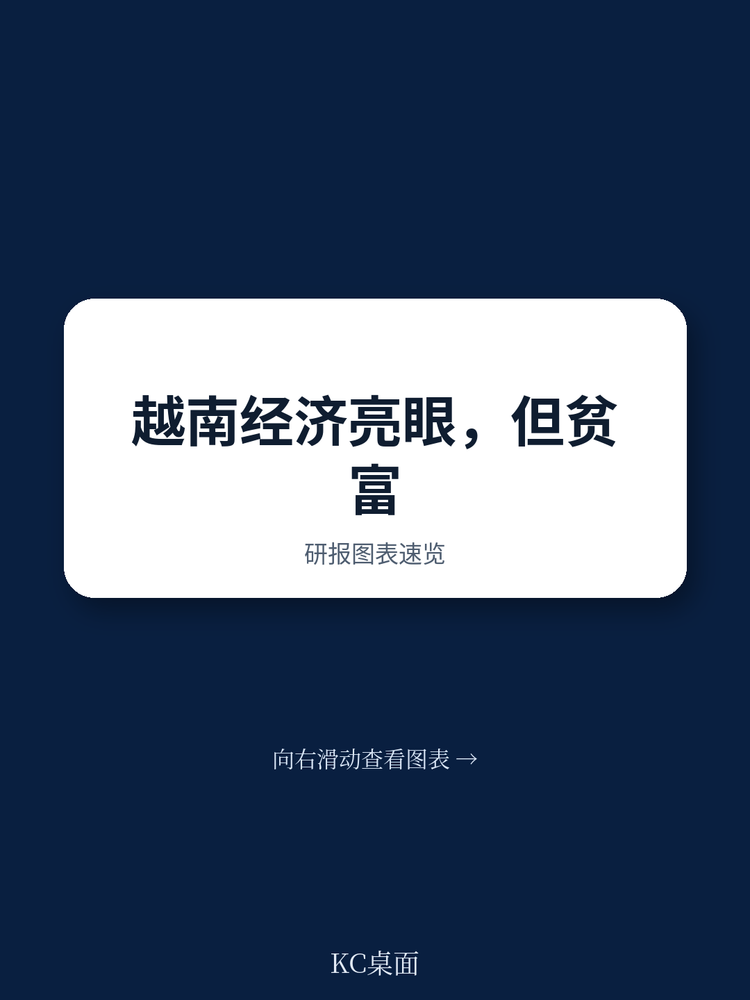
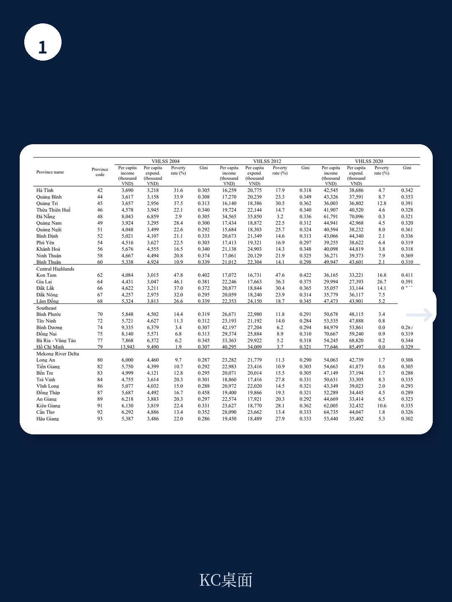
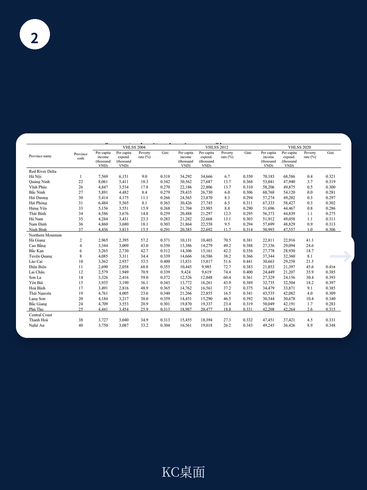

# 世界银行：越南增长奇迹背后，穷人正在被“隔离”

越南是全球公认的增长与减贫典范。过去二十年，这个国家的人均收入翻了三倍以上，贫困率从近30%骤降至5%以下。世界银行最新发布的政策研究工作论文，却在这份成绩单上画下了一个醒目的问号：经济增长在加速，但穷人正在被越来越清晰地“隔离”到特定省份。更令人警惕的是，省内不平等已经取代省际差距，成为理解越南社会分化的核心变量。

这份题为“Rapid Economic Growth but Rising Poverty Segregation”的报告，基于2002至2020年十轮越南家庭生活水平调查数据，首次系统性地同时考察了经济增长、不平等与贫困三者之间的动态关系。它的核心判断直指一个政策困境：如果只盯着全国平均数据，你会错过正在发生的结构性撕裂。

**增长没有错，但增长的红利分配机制正在发生变化。** 这份报告揭示的，不是一个失败的故事，而是一个成功故事中正在酝酿的复杂风险。对于任何关注新兴市场发展模式、或者试图理解“增长与公平”这一经典命题的读者来说，越南的案例都是一面值得细看的镜子。

## 1. 省内不平等已超过省际差距，且差距还在拉大

大多数关于不平等的讨论，习惯性地聚焦于“区域差距”——沿海与内陆、城市与乡村。但世界银行这份报告提供了一个反直觉的发现：越南真正的分化，不是发生在省份之间，而是发生在省份内部。

报告使用泰尔指数（Theil index）对不平等进行了分解，这种方法的优势在于可以将总不平等精确拆分为“省内”和“省际”两个部分。结果显示，2002年时，省内不平等解释了总不平等的约66%，而到了2020年，这一比例已超过70%。换算成倍数关系：2000年代初，省内不平等约是省际不平等的两倍；到2010年代末，这个差距扩大到了三倍。

这意味着什么？如果你只对比胡志明市与偏远省份的平均收入，你看到的只是冰山一角。真正的挑战在于，即便在同一个省份内部，不同人群之间的收入鸿沟正在加速扩大。报告进一步指出，那些省内不平等程度最高的省份，往往也是贫困率最高的省份——比如北部的老街省、奠边省和莱州省，它们的基尼系数均超过0.40，同时贫困率在20%至46%之间。

> **KC评论：** 这个发现对政策制定者和投资者的启示是，传统的“区域均衡发展”框架可能已经不够用了。未来的政策重点需要从“缩小省际差距”转向“改善省内分配”。对于企业而言，这意味着同一个省份内可能同时存在高消费群体和极度贫困群体，市场细分策略需要更加精细。

## 2. 贫困在快速减少，但剩余贫困人口正在被“地理隔离”

这是报告中最具政策冲击力的发现之一。越南的贫困率从2002年的29%下降到2020年的不到5%，成绩不可谓不亮眼。但报告通过构造“贫困隔离曲线”发现，剩余贫困人口的分布正在变得高度集中。

用两个数字可以直观感受这种变化：2002年，累计占全国人口约50%的省份，拥有约30%的贫困人口；到了2020年，同样的人口份额对应的贫困人口比例骤降至约3%。换句话说，贫困正在从全国性的普遍现象，退化为少数特定省份的局部问题。

这些“贫困高发区”有什么共同特征？报告给出了清晰的画像：它们主要是内陆山区省份，与中国和老挝接壤，农村人口占比超过80%，且少数民族人口比例超过70%。奠边省、莱州省、山罗省、河江省是典型的代表。

> **KC评论：** 这个发现直接挑战了“增长会自动惠及所有人”的假设。越南的增长确实减少了贫困的“数量”，但贫困的“空间结构”却恶化了。报告没有完全展开的是，这种隔离是否会自我强化——当贫困人口集中到特定区域后，公共服务、基础设施投资和市场机会是否也会随之撤离？这需要读者在完整报告中查看更细致的省级数据和政策讨论。

## 3. 经济增长对减贫有效，但效果取决于不平等水平

报告通过计量模型检验了增长、不平等与贫困三者之间的相互作用，结论清晰但充满条件性。经济增长对减贫有显著的正面影响，但这个效应的大小和显著性，高度依赖于不平等水平。

具体而言，当不平等程度较低时，经济增长的减贫效应更强；反之，高不平等会削弱甚至抵消增长的减贫效果。报告还发现，不平等本身对经济增长有显著的负面效应——基尼系数每上升一个百分点，后续的经济增长率就会显著下降。

更值得关注的是，不平等对不同贫困指标的影响存在差异。对于贫困发生率（即贫困人口占比），不平等的影响在统计上并不显著；但对于贫困深度（贫困人口收入缺口）和贫困严重程度（贫困人口内部的收入不平等），不平等则表现出强烈且显著的正相关。这意味着，不平等不会让更多人“掉入”贫困线以下，但它会让已经贫困的人陷入更深的困境。

报告还发现，经济结构转型——从农业向工资性就业和服务业的转移——对增长和减贫都有益。但这份益处并非自动实现，它需要配套的教育、基础设施和劳动力市场政策。

## 4. 报告尚未完全回答的关键问题：政策工具的有效性与边界

世界银行这份报告在诊断层面做得非常出色，但在处方层面留出了明显的空白。报告建议政策制定者应聚焦于减少空间差异和收入不平等，但并没有深入讨论具体政策工具的有效性。

比如，政府支出对减贫的影响在模型中的表现并不稳定，甚至在某些设定下出现了负相关。这提示了一个尴尬的可能性：财政转移支付可能没有精准地到达最需要的地区和人群。报告承认，2018-2020年的省级政府支出数据需要手动从各政府部门网站收集，数据的可得性和质量本身就是问题。

另一个未解的问题是：少数民族群体的贫困陷阱如何打破？报告反复提到少数民族人口比例与贫困率的强相关性，但没有深入分析背后的机制——是地理隔离、教育缺失、语言障碍，还是土地权利问题？不同原因需要截然不同的政策回应。

这些未解问题恰恰构成了完整报告中最有价值的部分。世界银行的研究团队在附录中提供了详尽的省级数据、计量模型设定和稳健性检验，这些技术细节对于真正想理解问题深度的读者来说，比摘要本身更重要。

## 5. 一个更通用的观察框架：如何判断一个经济体的增长质量

越南的案例提供了一个可迁移的分析框架，用于评估任何新兴市场的增长质量。这个框架包含三个递进的问题：

第一，增长是否在空间上均衡？不仅要看城市与乡村、沿海与内陆的差距，更要看省内部分化。省内不平等快速上升，往往是社会矛盾积累的前兆信号。

第二，贫困减少的“最后一公里”是否有效？当贫困率降到个位数之后，剩余的贫困人口往往具有高度异质性——他们可能是地理上隔离的、语言文化上边缘的、或者缺乏基本资产和技能的。传统的“普惠式”减贫政策对他们可能无效，需要更精准的干预。

第三，增长的动力结构是否可持续？越南从农业向非农业的转型是成功的，但过度依赖出口导向型制造业的增长模式，在全球化退潮和地缘政治重构的背景下是否还能持续？报告没有正面回答这个问题，但数据中隐含的担忧是清晰的。

> **KC评论：** 这个框架的价值在于，它把一份关于越南的学术研究，变成了一个可以用于审视其他国家的分析工具。如果你对越南的增长模式感兴趣，或者想了解世界银行如何用计量方法诊断发展问题，完整报告中的图表和回归结果会比任何摘要都更有说服力。

---

这份世界银行的报告揭示了一个正在发生的悖论：越南的增长奇迹依然在继续，但增长的质量正在经历微妙而深刻的变化。穷人没有消失，他们只是被“隔离”到了地图上更偏远、更难以触及的角落。对于决策者而言，这意味着减贫的“下半场”需要完全不同的工具箱。对于投资者而言，这意味着越南市场内部的分化可能比表面数据显示的更剧烈。

报告的完整版本包含了2002至2020年所有63个省份的详细数据集、贫困隔离曲线的构造方法、以及多种计量模型的稳健性检验。这些技术细节对于理解结论的可靠性和适用边界至关重要。

**如果你想获取这份报告的完整中文解读、原始数据图表，以及每日由AI agent和人工审校生成的国际投行研报摘要——涵盖世界银行、高盛、摩根士丹利、瑞银等机构的最新研究，约10至40页，既方便喂给AI，也方便人工快速把握市场动态——欢迎加入我们的社群。每天更新，持续跟踪全球顶级机构对中国和新兴市场的最新判断。**

Personal reading notes and learning share only. Not investment advice.

