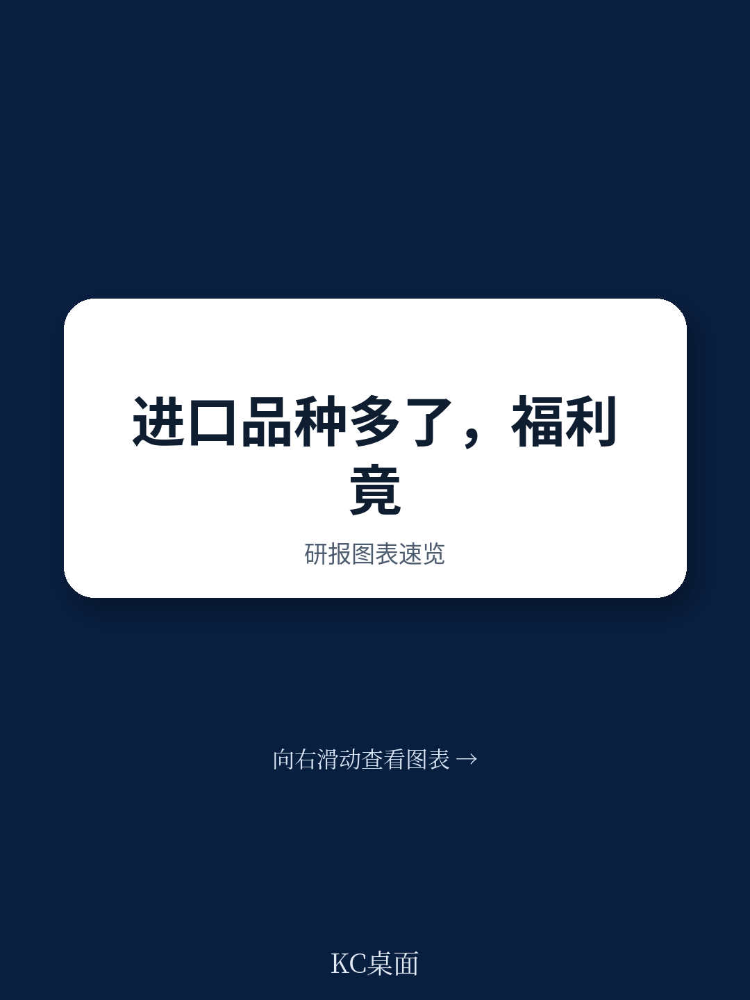
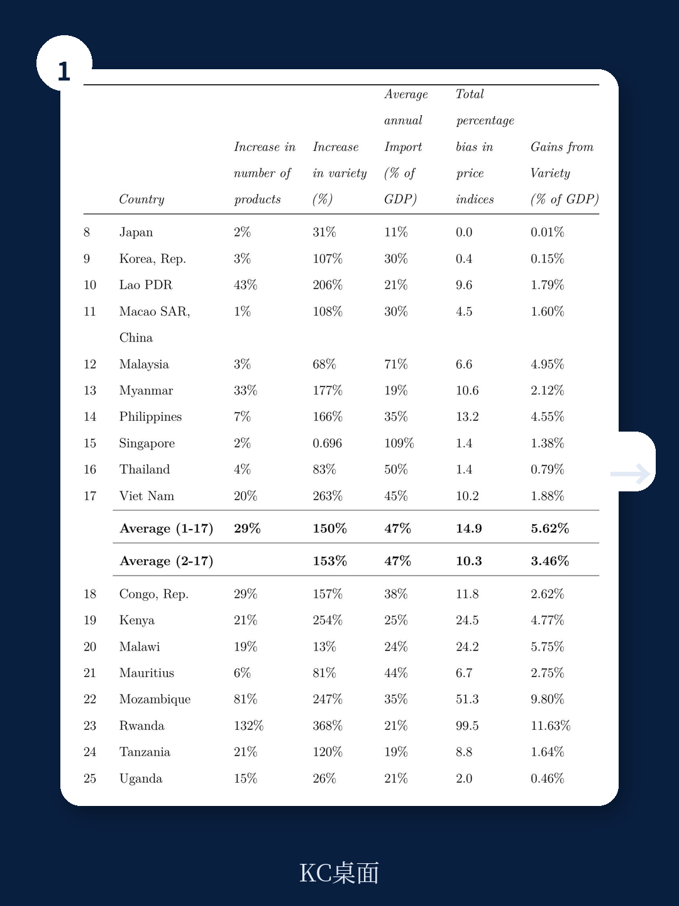
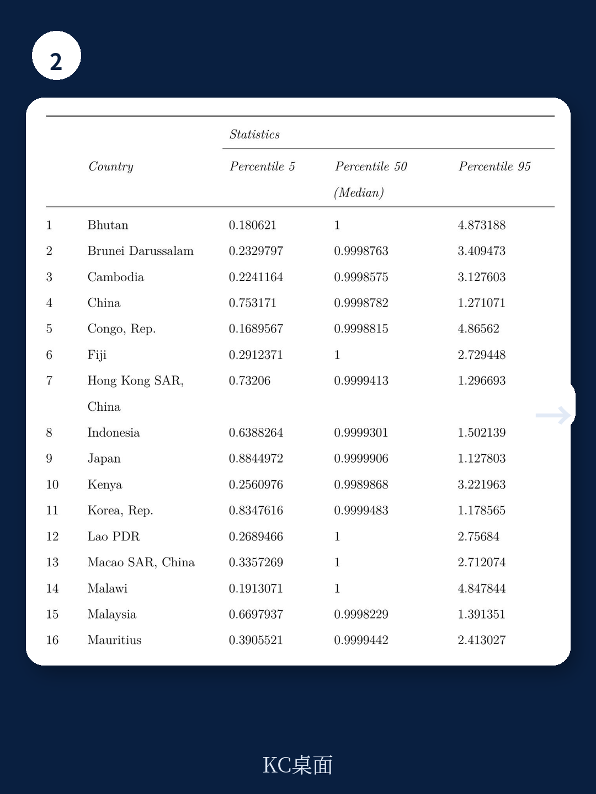

# 世界银行：小国正在从贸易中获得远超预期的隐性红利

当一个国家的消费者能够买到来自13个不同国家的同一款起泡酒，而不是只有一个选择时，这个国家的经济到底获得了多少好处？

世界银行最新发布的工作论文（Policy Research Working Paper 11072）给出了一个令人意外的量化答案：从1995年到2021年，28个东亚和东非发展中国家因进口商品种类增加而获得的福利收益，平均相当于GDP的5.49%。其中非洲国家平均获益5.47%，亚洲国家（不含不丹）平均获益3.46%。

这个数字意味着什么？它意味着贸易带来的好处，远不止教科书上说的“比较优势”和“规模经济”。在传统贸易理论往往忽视的角落里，一个更隐蔽、更持久的福利源泉正在发挥作用——进口品种的爆炸式增长。

这份报告的核心判断是：**对于小型和转型经济体而言，建立和扩展贸易联系本身就是一种重要的福利来源。** 这个观点在关于全球化和经济一体化的讨论中，常常被低估甚至忽视。

## 1. 品种扩张的规模远超预期，传统统计方法严重低估了贸易收益

大多数关于贸易收益的研究，都假设产品种类是固定不变的。这个假设看似无害，实则造成了系统性低估。

看看这组数据就能明白问题的严重性。1995年到2021年间，卢旺达进口的产品种类（按HS-6位码计算）从1608种增加到3731种，翻了2.3倍；柬埔寨从2446种增至4270种；蒙古从2074种增至3639种。更惊人的是品种数的增长——卢旺达的进口品种（同一产品来自不同国家被算作不同品种）增长了超过10倍，蒙古增长了8倍，柬埔寨增长了7倍。

如果按固定篮子计算价格指数，这些新出现的品种根本不会被纳入。而恰恰是这些新品种，构成了福利收益的主要来源。

> **KC评论：** 这就像只统计你常去的三家超市的价格变化，却完全忽略了你家旁边新开的十家进口超市。最终得出的“物价指数”看似稳定，但你的实际选择范围和福利水平已经大幅提升。完整报告中的Table 1详细列出了28个国家27年间的品种增长数据，这些原始表格是理解各国差异的第一手资料。

## 2. 收益的分布极不均匀，小型开放经济体是最大赢家

平均数字5.49%掩盖了巨大的国别差异。报告显示，不丹、蒙古、卢旺达和莫桑比克是样本期内收益最高的国家。

为什么是这些国家？报告给出了两个关键解释。

第一，这些国家的进口占GDP比重本身就很高。根据报告数据，样本国家在1995-2021年间平均每年将41%的支出用于进口，而日本仅有11%，香港则高达163%。进口份额越高，品种增长带来的福利效应就越显著。

第二，也是最核心的原因：这些国家不仅品种数量在增长，产品类别本身也在快速扩张。以不丹为例，其进口的HS-6位产品数量从519种增加到1537种，增幅达196%；同时平均每个产品对应的出口国数量从1.7个增加到3.4个。这种“双重扩张”使得价格指数中的lambda比率（衡量新旧品种重叠程度的指标）显著降低，从而推高了福利收益。

与之形成鲜明对比的是中国、日本、韩国等经济体。它们虽然品种也在增加，但产品类别的扩张幅度相对温和。这并非因为这些国家贸易不活跃，而是因为它们已经处于一个较高的起点。

> **KC评论：** 这个发现对理解当前全球供应链重构的争论有直接意义。当讨论“脱钩”或“去风险”时，人们往往只关注贸易量的变化，却忽略了贸易品种的增减。对于小国而言，失去一个贸易伙伴可能意味着失去整个品种，其福利损失远大于贸易额所反映的。完整报告中包含了各国弹性估计值的详细分布，超过10万个弹性系数是理解不同产品差异化程度的关键数据。

## 3. 替代弹性揭示了品种扩张的“隐性价值”究竟有多大

报告的核心方法论来自Feenstra（1994）和Broda & Weinstein（2006）的开创性工作。他们构建了一个“精确价格指数”，能够将新品种的进入和老品种的退出纳入价格度量。

这个方法论的关键在于估计每种产品的替代弹性。替代弹性越低，意味着产品之间的差异化程度越高，新品种带来的福利增量就越大。报告估计了28个国家超过10万个HS-6位产品的替代弹性，平均值为13.0，中位数为4.1。

中位数远低于平均值，说明大部分产品的替代弹性集中在较低区间——这意味着大多数进口产品是高度差异化的，新品种的引入确实能带来显著的消费者效用提升。

这个方法论框架本身就是一个重要的学术贡献。报告中估计的数千个弹性系数，可以被其他研究用于分析进口产品对需求冲击或汇率变动的响应程度。

## 4. 报告尚未完全回答的关键问题：品种扩张的代价与边界

任何收益都有其边界。报告坦诚地指出了几个尚未完全展开的问题。

第一，报告将所有进口商品视为最终消费品，但现实中大量进口品种是作为中间品投入生产的。如果区分消费品种和生产品种，福利收益的分配可能会有显著差异。对于企业而言，获得更多种类的中间投入品可能意味着更高的生产率和更多的创新机会，这部分收益的量化目前仍是开放问题。

第二，品种扩张是否存在“过度多样化”的边界？当某个产品的进口来源国从1个增加到13个，消费者的确获得了更多选择。但来源国的增加是否也意味着供应链的碎片化和效率损失？报告没有讨论这个问题。

第三，也是最重要的：福利收益的分配问题。品种扩张带来的消费者剩余增加，是否足以弥补特定群体（如国内同类产品生产者）的损失？报告提到了“财政成本（收入损失）”的可能性，但没有展开分析。

> **KC评论：** 这恰恰是完整报告最有价值的地方——它不仅给出了结论，更留下了可以深入追问的线索。比如，报告中Figure 1展示了各国进口占GDP比重的巨大差异，Table 7详细列出了品种和产品数量的增长率。这些数据本身就可以支撑多个维度的独立分析。加入社群后，你可以获取完整报告中的全部原始图表和我们的逐项解读。

## 5. 对决策者的观察框架：如何判断一个经济体是否在真正“获益”

基于这份报告的分析逻辑，我们可以提炼出一个实用的观察框架，用于评估不同经济体的贸易福利状况。

第一，看“品种广度”而非“贸易总额”。一个经济体进口总额的增长，可能仅仅来自价格上涨或数量增加，未必代表福利提升。真正需要关注的是进口品种的增长率和产品类别的扩张速度。

第二，看“替代弹性”的分布。如果一个经济体的进口产品主要集中在低替代弹性品类（如精密仪器、特种化学品），那么新品种引入的福利效应会更大。反之，如果进口以大宗商品为主（高替代弹性），品种扩张的收益相对有限。

第三，看“起点效应”。小型经济体从低起点开始的品种扩张，其边际福利收益远高于已经高度多样化的大型经济体。这解释了为什么不丹、卢旺达的收益显著高于中国和日本。

第四，关注“贸易联系的可逆性”。品种扩张带来的福利收益是路径依赖的——一旦建立起来的贸易联系断裂，损失的不仅是当前的贸易流量，还有未来可能的新品种引入机会。这对当前地缘政治背景下的小国外交选择具有直接的政策含义。

---

这份世界银行的工作论文提供了一个被主流贸易讨论长期忽视的视角：对于小型和发展中经济体，贸易的真正价值不仅在于“买得更便宜”，更在于“买得更丰富”。当我们争论贸易战的输赢、关税的高低时，品种扩张带来的隐性福利正在悄然改变无数消费者的实际生活水平。

但报告也留下了一个悬而未决的问题：当全球供应链从“效率优先”转向“安全优先”，小国还能否继续享受品种扩张的红利？贸易联系的建立需要数十年，而断裂可能只需数月。这或许才是决策者最应该警惕的风险。

---

如果你想深入理解这些结论背后的数据逻辑、查看完整的替代弹性分布表，以及获取我们每日更新的国际投行研报摘要，欢迎加入我们的社群。每天，我们的AI agent会结合人工审核，生成约10-40页的国际投行中文摘要与KC评论，包含当天最新数据图表合集。这些内容既方便直接喂给AI模型，也适合人工快速把握市场动态和学术前沿。

Personal reading notes and learning share only. Not investment advice.

