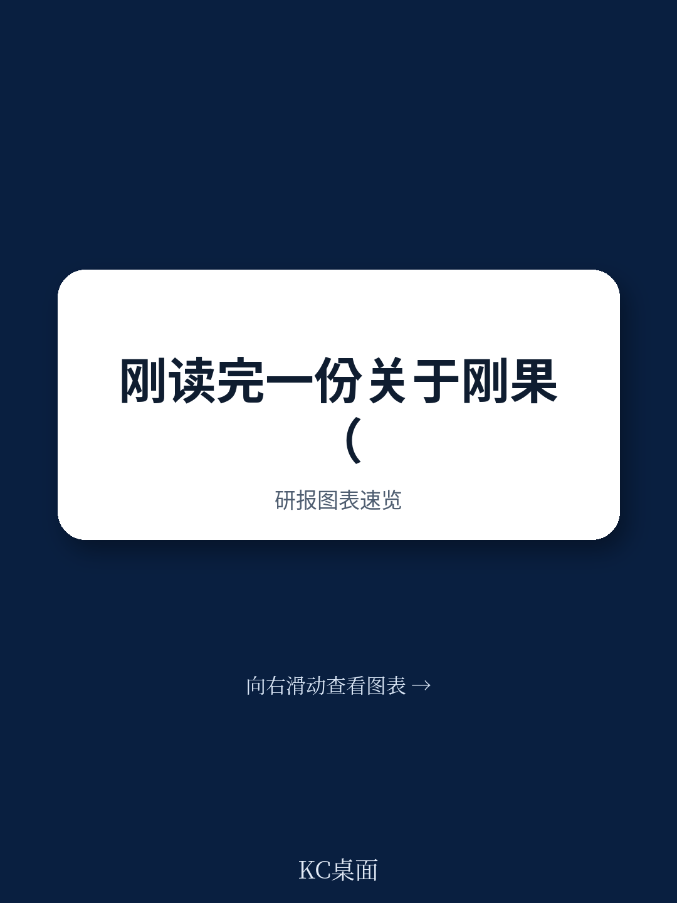
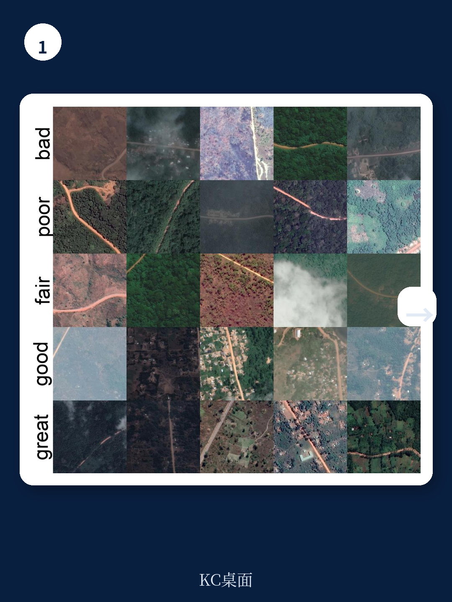
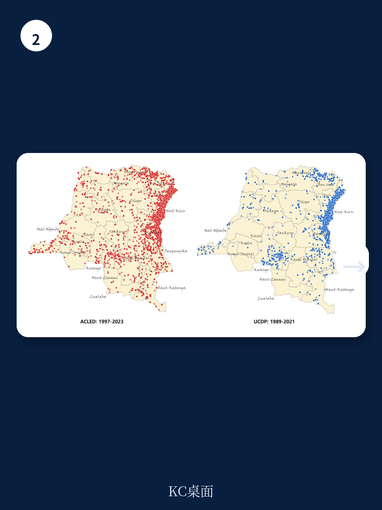

# 世界银行：刚果金的修路和平红利，三年就过期

刚果金每年收到数十亿美元的国际援助用于修复公路，目的是通过改善交通来终结冲突。世界银行最新工作论文给出了一个反直觉但极其务实的答案：修路确实能降低暴力事件，但这个“和平红利”平均只能维持三年。

刚果金东部至今活跃着超过120个武装组织，近一半的暴力事件发生在公路附近或公路沿线。国际社会长期将“修路”视为稳定战略的核心工具——公路能降低物流成本、促进经济发展、延伸国家权力。世界银行的这份报告首次用严谨的因果识别方法检验了这个假设，结果令人深思。

报告的核心发现有两个。第一，公路修复完成后，项目所在区域的暴力事件发生率显著下降，降幅约为5至10个百分点，其中针对平民的暴力减少最为明显。第二，也是更重要的发现：这个和平效应是“易腐品”。随着公路在缺乏养护的情况下逐渐退化，暴力事件在三年内反弹至修复前的水平。

这意味着，国际社会投入巨资修建的公路，如果不同时解决“谁来养护”这个根本问题，其安全效益只能维持一个中短期周期。对于所有在脆弱地区从事基础设施投资的政策制定者和投资者，这是一个必须正视的硬约束。

## 1. 修路确实能降低暴力，但前提是路是好的

世界银行的这份研究首次系统回答了“修路能否降低冲突”这个长期悬而未决的问题。此前的学术文献对公路与暴力的关系存在完全相反的两种理论：一种认为公路是政府控制力的延伸，能压制叛乱；另一种则认为公路便利了武装分子的后勤，反而加剧暴力。

该报告利用刚果金2003年以来的192个大型城际公路修复项目数据，采用匹配双重差分法识别因果关系。结果显示，公路修复完成后，项目所在区域的暴力事件显著下降。这个效应在处理“针对平民的暴力”时最为显著，降幅可达10个百分点。

> **KC评论：** 报告的因果识别策略值得关注。研究者发现，公路项目并没有刻意选择和平区域进行修复——这意味着，修路本身确实带来了安全改善，而不是“因为安全好转了才去修路”。这个发现对理解基础设施投资的“外溢效应”有直接意义。完整报告中还包含了详细的动态处理效应图表，展示了暴力在修复前后如何变化。

## 2. 和平红利三年就耗尽的“易腐性”才是真正的问题

如果和平红利是永久的，那修路就是一本万利的稳定投资。但报告的第二项发现打破了这种乐观预期。

研究者利用机器学习分析遥感数据，追踪修复后公路质量的退化速度。他们计算出一个“公路折旧因子”：每年约为0.735。这意味着，一条修复后的公路，三年后其质量平均下降60%。与此同步，暴力事件在三年内完全反弹至修复前的水平。

这个“易腐和平红利”的发现，直接挑战了当前国际援助中“修完就走”的项目模式。刚果金历史上就有深刻的教训：1960年独立后，当地民众立即放弃了殖民时期强制劳动维护公路的做法，短短几个月内60%的公路网无法使用。今天，国际援助项目同样面临竣工后养护资金和机制缺失的问题。

> **KC评论：** 这个“三年窗口期”对投资者和援助方意味着什么？简单说，如果修路带来的安全改善只有三年有效期，那么任何基于“路修好了就能稳定”的长期经济规划都需要重新评估。完整报告中的遥感数据图表展示了不同区域公路退化的具体速度差异，以及这种退化与暴力事件回升的空间对应关系——这些细节对理解“哪里最需要持续维护”至关重要。

## 3. 为什么公路会成为暴力争夺的“磁铁”？

刚果金的公路不仅是交通工具，更是权力和资源的争夺场。报告背景部分揭示了一个深刻的历史结构：从殖民时期的强制劳役修路，到后殖民时代地方当局通过路障抽取农民财富，再到今天武装组织通过控制公路收取“通行费”——公路始终是刚果金暴力政治经济的核心载体。

2017年的数据显示，北基伍省70%的政府军路障设在国家级或省级公路上，而79%的反叛军路障设在乡村支线公路上。这意味着，公路修复不仅改变了物理连接，更直接改变了武装行为体的“商业模式”。当路况改善，通行量增加，武装组织争夺公路控制权的收益也随之上升。

> **KC评论：** 这解释了为什么和平红利是“易腐”的：路刚修好的时候，原有武装组织的路障和收费模式被暂时打破，暴力下降；但随着公路开始退化，武装组织重新建立控制，暴力也回来了。报告没有完全展开的一个问题是：不同级别的公路（主干道vs支线）的和平红利衰减速度是否不同？这个问题对精准设计干预方案至关重要——完整报告中的分类型分析值得细读。

## 4. 报告没有完全回答的关键问题：养护谁来买单？

报告的结论指向一个明确但棘手的政策建议：延长和平红利的唯一途径是提高公路的耐久性和建立系统性养护机制。

然而，刚果金的现实是，养护资金和能力的缺口巨大。世界银行在项目执行报告中反复提到“机构能力薄弱”“采购延误”“环境与社会标准执行不力”等问题。其中一个项目因为“性别暴力管理不达标”被暂停支付28个月。另一个项目因“市长和省长频繁更换”导致执行团队领导层动荡。

更根本的问题是：在年财政收入极低、腐败问题严重的国家，谁来为每年0.735的折旧率买单？国际援助方是否愿意从“新建项目”转向“长期养护合同”？这不仅是财政问题，也是治理问题——养护资金能否不被挪用，养护工程能否不被地方势力绑架，都是悬而未决的挑战。

## 5. 对投资者的观察框架：三个必须追问的指标

对于关注非洲基础设施投资或脆弱国家重建的读者，这份报告提供了一个实用的分析框架。在评估类似项目时，至少需要追问三个问题：

第一，项目的“养护承诺”是否嵌入制度设计？如果项目计划中没有明确的养护资金安排和问责机制，那么和平红利大概率是短命的。

第二，公路周边的“暴力经济”结构是什么？如果公路沿线存在大量依赖路障收费的武装行为体，修路本身可能只是暂时打破平衡，而不是消除冲突根源。

第三，项目的地理位置与资源分布的关系？报告提到，刚果金的公路投资和暴力事件都集中在矿产资源丰富的省份。如果修路是为了改善资源运输，那么它可能同时加剧对资源的争夺——这是一个需要纳入风险评估的二阶效应。

---

世界银行的这份报告没有给出修路就能带来和平的简单结论，而是揭示了基础设施投资在冲突环境中的真实因果链条：修路有效，但前提是你愿意持续投入养护。这个“三年窗口期”既是对政策制定者的警示，也是对投资者的提醒——在脆弱国家，任何“一次性投入”的假设都可能被现实证伪。

这份报告还包含大量未在本文中展开的数据：不同捐赠方（中国、世界银行、比利时等）的项目分布与效果差异、公路退化速度的遥感数据可视化、以及世界银行项目执行延迟的详细案例分析。完整报告的中文摘要与原始图表，以及每日更新的国际投行研报解读，将在社群中持续分享。

``

Personal reading notes and learning share only. Not investment advice.

