# Rural Non-Farm Employment in Rajasthan

Determinants, Welfare Effects, and Enterprise Performance

Francis Addeah Darko

Akankshita Dey

S. K. Ritadhi

Policy Research Working Paper 11080

## Abstract

This paper examines rural non-farm employment in Rajasthan, India, using multiple surveys and administrative data. The analysis covers three key aspects: individual and district-level determinants of participation in non-farm activities, the relationship between non-farm employment and household welfare, and barriers faced by rural enterprises. The findings show that secondary education strongly predicts participation in non-farm activities, particularly in skilled service sector jobs. However, women and socially marginalized groups face significant barriers in accessing non-farm employment, especially in higher-paying occupations. Households with members in regular non-farm employment, particularly in services, show significantly higher consumption levels, while casual non-farm work yields welfare levels similar to agricultural labor. Rural enterprises face multiple constraints, with lack of local demand and limited access to credit emerging as key barriers to business performance. The results suggest that although non-farm employment can substantially improve household welfare, access to better-paying opportunities remains highly unequal. Policy interventions should ad-dress both human capital development and structural barriers to create more inclusive access to non-farm employment opportunities.

# Rural Non-Farm Employment in Rajasthan: Determinants, Welfare Effects, and Enterprise Performance

Francis Addeah Darko\*

Akankshita Dey $^{\dagger}$

S. K. Ritadhi $^{\dagger}$

JEL: J43, O17, R23  
Keywords: Non-farm employment, welfare, enterprise, rural

## 1 Introduction

Rural non-farm employment (RNFE) has emerged as a critical pathway for economic development and poverty reduction in developing countries, particularly in regions where agricultural productivity growth alone cannot sustain rising rural incomes and living standards (Haggblade et al., 2010). The structural transformation literature has long recognized that the transition from a predominantly agrarian economy to one with a more diversified rural economy is fundamental to the development process (Timmer, 2009), with several key mechanisms explaining RNFE's vital role in development. At the household level, income diversification and risk management represent primary channels through which RNFE contributes to development. RNFE provides rural households with opportunities to diversify income sources beyond agriculture, reducing vulnerability to weather shocks and crop failures (Barrett et al., 2001). This diversification is particularly valuable in contexts where formal insurance markets are underdeveloped, as non-farm income can help smooth consumption across agricultural seasons and during periods of low farm productivity (Ellis, 2000). The poverty reduction and economic mobility impacts of such diversification are well-documented, with evidence showing that households with access to non-farm income have higher consumption levels and lower poverty rates (Lanjouw and Murgai, 2009). For landless households and those with marginal landholdings, non-farm employment, particularly in salaried positions, provides higher and more stable returns compared to agricultural labor (Reardon et al., 2007).

At the macro level, RNFE plays a crucial role in rural-urban linkages and structural transformation by facilitating the development of economic connections through trade, services, and labor mobility (Tacoli, 2004). The growth of rural non-farm activities helps reduce rural-urban migration pressures by creating local employment opportunities (de Janvry and Sadoulet, 2001) while absorbing surplus agricultural labor as farming productivity increases. Furthermore, rural non-farm enterprises stimulate local economic development by generating demand for goods and services, creating multiplier effects in the rural economy (Hazell and Haggblade, 1993) and strengthening agricultural value chains through processing, transport, and marketing services. RNFE also drives important social development outcomes through multiple channels. It enhances women's economic empowerment by providing opportunities, particularly in contexts where cultural norms restrict female participation in agriculture (Kabeer, 2012), leading to greater household decision-making power and resource control. Additionally, the non-farm sector's higher skill requirements create incentives for rural households to invest in education (Foster and Rosenzweig, 2004), fostering human capital accumulation with positive intergenerational effects on poverty reduction.

However, several interrelated constraints impede RNFE development. Infrastructure and market access limitations, including poor electricity access, inadequate roads, and limited telecommunications, increase operating costs and reduce the competitiveness of rural enterprises. These physical constraints are compounded by credit constraints arising from limited collateral and underdeveloped rural financial markets, which restrict investment and growth potential. Skills and education gaps further hinder development by preventing rural workers from accessing higher-productivity non-farm employment, with the skills mismatch being particularly acute for marginalized groups. Finally, social and institutional barriers, including gender and social discrimination, along with weak governance, create additional obstacles for rural enterprises, especially those operated by women and marginalized groups.

India's rural economy has witnessed a remarkable transformation since independence, with the share of agricultural employment declining from over 80 percent in the 1950s to approximately 58 percent by 2011-12 (Thomas, 2020). This structural shift has been particularly pronounced after the economic liberalization of the 1990s, driven by rising agricultural productivity, declining farm sizes, and expanding non-farm opportunities (Binswanger-Mkhize, 2013). The pattern of this transformation has varied significantly across states, influenced by factors such as agro-climatic conditions, infrastructure development, and proximity to urban centers (Himanshu et al., 2018). While some states like Gujarat and Punjab have seen a shift towards manufacturing, others have experienced growth primarily in construction and services (Mehrotra and Parida, 2021). Within this national context, Rajasthan presents a unique case study of rural transformation, shaped by its distinct geographical, social, and economic characteristics.

Rajasthan's rural economy has undergone significant structural transformation in recent decades, characterized by a steady decline in agricultural employment and a concurrent rise in non-farm activities. This transition has been particularly notable in a state where agricultural productivity is constrained by arid conditions, with approximately 60 percent of the state's land area covered by the Thar Desert (Varghese et al., 2019). The share of agricultural employment in rural Rajasthan declined from 75 percent in the early 1980s to approximately 62 percent by 2011-12 (Joshi and Kumar, 2019). This shift reflects multiple underlying factors, including limited agricultural potential due to water scarcity, with the state receiving an average annual rainfall of only $574\mathrm{mm}$ compared to the national average of $1,186\mathrm{mm}$ (Sharma and Singh, 2021). Additionally, declining average farm sizes—from 4.1 hectares in 1970-71 to 1.8 hectares in 2015-16—have made agricultural income increasingly inadequate for sustaining rural households (Mathur and Rathore, 2020).

The growth in rural non-farm employment in Rajasthan has been notably heterogeneous across sectors, regions, and social groups. Traditional handicrafts and artisanal activities, deeply rooted in Rajasthan's cultural heritage, have emerged as significant employers, contributing approximately 12 percent to rural non-farm employment (Vyas and Mehta, 2018). Construction has shown substantial growth, particularly in regions surrounding urban centers like Jaipur, Udaipur, and Jodhpur, with its share in rural employment increasing from 4.5 percent in 1993-94 to over 15 percent by 2011-12 (Kumar and Sharma, 2020). Tourism-related activities have created significant non-farm opportunities in rural areas near heritage sites and wildlife sanctuaries, though these opportunities often exhibit seasonal variations (Rathore and Singh, 2019).

However, access to non-farm opportunities remains highly unequal. Education plays a crucial role, with workers having secondary education being three times more likely to secure regular non-farm employment compared to those with primary education only (Sharma et al., 2018). Gender disparities are particularly pronounced in Rajasthan, with female labor force participation in rural areas declining from 35 percent in 1993-94 to 28 percent in 2011-12, despite male workers' increasing movement into non-farm employment (Gaur and Joshi, 2021). This gendered trend reflects both cultural norms and limited suitable employment opportunities for women. Regional variations within Rajasthan are stark. Eastern Rajasthan, benefiting from better connectivity to Delhi-NCR and relatively better rainfall, has seen faster growth in rural non-farm employment compared to western regions (Singh and Mathur, 2022). Districts with better infrastructure and proximity to urban centers show significantly higher non-farm employment growth, with rural areas within $50\mathrm{km}$ of major cities having 40 percent higher non-farm employment rates compared to more remote regions (Sharma and Kumar, 2021). State-specific initiatives like the Rajasthan Rural Non-Farm Development Programme (RNFDP) and various tourism-based livelihood programs have attempted to address these disparities, though significant challenges remain in ensuring equitable access to quality non-farm employment opportunities.

Despite extensive research on rural non-farm employment (RNFE), significant knowledge gaps persist that limit our understanding and ability to design effective policies. These gaps span multiple dimensions of the rural non-farm sector and its role in development, particularly in how individual characteristics interact with local economic conditions. While research has separately examined the roles of education, gender, and social identity in determining access to non-farm employment (Lanjouw and Murgai, 2016), we have limited understanding of how these individual characteristics interact with district-level factors such as infrastructure, market access, and financial development. This interaction is crucial for understanding why similar individuals might experience different outcomes across locations. The operational dynamics of rural enterprises represent another critical area requiring further investigation. While we understand broad constraints facing rural enterprises, we lack detailed evidence on enterprise lifecycle dynamics, including factors determining their growth trajectories and survival rates (Banerjee and Duflo, 2014). This gap is particularly acute for informal enterprises, which constitute the majority of rural non-farm businesses but are often excluded from standard enterprise surveys. Additionally, the role of technology and digitalization in transforming rural non-farm opportunities remains understudied. While digital technologies are rapidly penetrating rural areas, we have limited understanding of how they affect non-farm employment opportunities and enterprise performance (Foster and Rosenzweig, 2022).

The human capital dimension of RNFE presents several interconnected challenges. Our understanding of skill requirements and returns to different types of skills in rural non-farm employment remains incomplete. While education's importance is well-documented, we lack detailed evidence on which specific skills are most valuable for different types of non-farm employment and how these skill requirements are evolving (Klasen, 2019). This knowledge gap extends to gender-specific challenges. While women's lower participation in non-farm employment is well-documented, we lack comprehensive understanding of how household responsibilities, social norms, and local economic conditions interact to influence women's participation decisions (Chatterjee et al., 2015). The broader economic context of RNFE also requires deeper examination, particularly regarding its relationship with agricultural transformation and migration patterns. While theoretical links between agricultural transformation and non-farm employment are well-established, empirical evidence on how changes in agricultural productivity and commercialization affect local non-farm employment opportunities remains limited (Barrett et al., 2017). Similarly, while rural-urban migration is extensively studied, we lack detailed understanding of how temporary migration affects household decisions regarding non-farm enterprise creation and employment (de Janvry and Sadoulet, 2019). Emerging challenges and policy effectiveness represent the final frontier in RNFE research. The impact of climate change on rural non-farm employment is particularly concerning. While climate change's effects on agriculture are well-studied, its implications for rural non-farm activities and their role in climate adaptation strategies remain poorly understood (Carleton and Hsiang, 2016). Furthermore, while numerous programs aim to promote rural non-farm employment, evidence on their relative effectiveness and cost-efficiency remains limited (Mansuri and Rao, 2013), hampering our ability to design and implement successful interventions.

This research addresses several interconnected questions about rural non-farm employment in India. The primary inquiry examines the determinants of rural non-farm employment by investigating how individual characteristics interact with district-level factors, with particular attention to historically understudied complementarities between personal attributes (such as education, gender, and social identity) and local economic conditions. A second key question explores whether participation in non-farm activities leads to improved household welfare, specifically focusing on consumption patterns and poverty reduction. The study also investigates the constraints faced by rural micro-enterprises, seeking to understand both the qualitative and quantitative measures of enterprise performance and the various barriers that might impede their growth. Finally, the research examines whether the historical predictors of rural non-farm employment identified in earlier periods (1999-2011) remain relevant in more recent years, utilizing contemporary data from 2015 to assess the stability and evolution of these relationships. This multi-faceted approach allows for a comprehensive understanding of both the historical patterns and contemporary dynamics of rural non-farm employment in India.

## 2 Data

This analysis uses data from five distinct sources. The historical data on individual employment and household consumption is obtained from nationally representative employment surveys (focusing on the Rajasthan component); an alternate household and individual employment survey is used to gauge the more recent relationship between individual characteristics and rural non-farm employment. The data on micro-enterprise performance is gathered from an establishment level survey of micro-enterprises. Data on bank branches and bank credit are obtained from the Basic Statistical Returns (BSR) published annually by the Reserve Bank of India; and finally, data on annual district-level rainfall is obtained from the ICRISAT's district-level database.

## 2.1 Employment-Unemployment Surveys

Our primary analysis exploits rich data collected by various rounds of the National Sample Survey Organization's (NSS) household surveys. These are nationally representative surveys conducted every 5 years, covering every state and district in India, with a sample size exceeding 80,000 households in each round. The data includes individual characteristics such as labor force participation, sector of employment, and employment type, in addition to gender, age and education levels. Household characteristics such as household location (urban or rural), landholdings, religion, caste and size are also included. Each household (individual) is accorded a weight, reflecting the inverse of the frequency of being sampled. We use the sampling weights to aggregate the individual (household) data to the level of districts and construct district-level characteristics of interest such as urbanization, and the fraction of manufacturing and public employment in the district. The latter in particular permits us to test for complementarities between individual and district characteristics.

We use four rounds of the NSS data – namely data from the “thick” rounds conducted in 1999-00, 2004-05, 2009-10 and 2010-11. $^{1}$ Since there has been a significant change in the number of districts during this period, we aggregate district boundaries corresponding to those in 1991.

## 2.2 Micro-Enterprise Survey

We consider the survey on unincorporated non-agricultural enterprises to gauge the problems faced by micro-enterprises. This is a rich dataset covering enterprises which are not registered under either the Factories Act of 1948, or the Companies Act of 1956 – the two premier law statutes which govern corporate entities in India. The enterprises by definition thus operate in the informal sector. The operation of these enterprises are of particular interest as a third of the rural non-farm labor force during the period of our study report being “self-employed” (engaged in proprietorship), while a fourth report being employed as “casual workers”. This suggests that informal small and micro-enterprises are accounting for a substantial fraction of the rural non-farm employment observed in the data.

The micro-enterprise survey is also conducted by the NSS and covers all states and districts in India, accounting for over 50 million establishments, providing employment to 100 million individuals. The survey includes data on key measures of enterprise performance such as operating expenses, raw materials, fixed capital, workers, wage payments, revenues and gross-value addition. Qualitative measures of enterprise performance such as whether the establishment is expanding, shrinking or a recent entrant, in addition to outstanding credit (and its source) are also provided. Finally, the survey enquires enterprise owners regarding select problems faced by the enterprise. Our study exploits these qualitative questions to analyze how problems faced by enterprises affects enterprise performance, conditional on key enterprise parameters such as capital and labor.

## 2.3 Consumer Pyramids

The last NSS employment-unemployment survey was conducted in 2011-12. In this regard, we use the four rounds of the NSS surveys between 1999 and 2011 to gauge the historical predictors of rural non-farm employment, and then use data from 2015 from the Consumer

Pyramids (CP) to assess whether the historical predictors of rural non-farm employment retain their relevance with more recent data.

The Consumer Pyramids is a large household level survey conducted by the Centre for Monitoring the Indian Economy (CMIE). The surveys were initiated in 2014 and covers 170,000 households. Unlike the NSS, the surveys are of the form of a panel with each household being visited once every four months, aggregating to three surveys per year. The data includes individual characteristics such as age, gender, years of education, and nature of employment. Unlike the NSS which provides detailed employment sectors, the CP data only provides broad occupational categories among non-farm workers. We consider the year 2015 for our analysis since a number of significant macro-economic policy interventions were initiated since 2016 (starting with the “demonetization” episode in November 2016), which can affect non-farm employment.

## 2.4 Descriptive Trends

Basic summary statistics corresponding to the three surveys are shown in Tables 1A, 1B and 1C. We discuss some key descriptive trends using the NSS data in this section prior to a more rigorous empirical analysis.

## 2.4.1 Rural Employment

Figure 1 shows the broad trends in labor force participation and employment in the farm sector for rural individuals over this period, disaggregated by gender. Although rural males have significantly higher levels of LFP than rural females, there is a marginal decline in male LFP over this period. This decline is significantly accentuated for rural females, whose LFP decline from 47 percent in 1999-00, to 37 percent in 2011-12. Conditional on participation in the labor force, there has also been a steady decline in employment in farm activities. Thus, while 70 (85) of rural male (female) workers were engaged in farm work in 1999-00, this reduced to 58 (74) percent in 2011-12.

Figure 2 shows the fraction of rural workers engaged in non-farm activities by occupation type (left panel) and sector (right panel). While there has been a steady increase across all occupational categories over time, the most substantial increase has been in the fraction of non-farm casual workers, irrespective of gender. Thus, 16 (9) percent of rural men (women) were engaged as casual workers in 2011-12, relative to 8 (3) percent in 1999-00. The increase in the fraction of salaried workers – the most well-paying occupations – is a lot more modest: from 7 (3) percent of rural men in 1999-00 to 9 (5) percent in 2011-12. In terms of sectors, the largest increase has been in the construction (manufacturing) sector for men (women).

Figure 3 splits the sample by rural workers who have completed secondary education and shows that the sharp increase in non-farm casual workers and employment in the construction sector is driven by workers lacking secondary education. Rural workers who have completed secondary or higher education are more likely to be employed as salaried workers in the service sector.

## 2.4.2 Rural Consumption

The top left panel of Figure 4 shows the evolution of rural households' monthly per capita consumption between 1999 and 2011. In real terms (1993 values), rural monthly per capita consumption displayed an average annual growth of 2.7 percent – from INR 324 to INR 445. The latter two figures in the top panel splits households by whether they have any a) secondary educated individual and b) non-farm worker. The middle panel splits household consumption by whether there is at least one household member participating in non-farm self-employed, casual or salaried work. The bottom panel splits rural households by whether they have some worker employed in either the manufacturing or service sector.

Figure 4, we see that rural households with some non-farm worker had 8-24 percent higher average monthly per capita consumption. This is driven by almost entirely by the presence of salaried workers – household with at least one salaried worker had per capita expenditures between 33 and 50 percent higher than households without any salaried worker. A large divergence in household per capita consumption is also observed for households with at least one secondary educated worker: monthly per capita consumption for these households is twice the per capita monthly consumption for households without any secondary worker. Finally, households with at least 1 worker employed in the service sector has 25 percent higher monthly consumption levels across this entire period.

## 3 Results

We begin by discussing the predictors of rural non-farm employment using the historical NSS data. We subsequently study whether rural non-farm employment affects household well-being. Next, we explore barriers to informal micro-enterprise performance, which comprises a main source of rural non-farm employment. We conclude the empirical analysis by studying the relationship between individual characteristics and rural non-farm employment using the more recent CP data from 2015.

## 3.1 Historical Predictors of Rural Non-Farm Employment

We begin by estimating the following specification to estimate the role of individual characteristics on rural non-farm employment:

$$
P r (Y _ {i d t} ^ {j} = 1) = \alpha_ {d} + \delta_ {t} + \beta {\bf X} _ {i d t} + \gamma {\bf Z} _ {d t} + \epsilon_ {i d t}\tag{1}
$$

The unit of observation in equation(1) is the individual i, located in district d, and observed in year t. We aggregate the NSS data across the four rounds in the spirit of a repeated cross-section and restrict the sample to rural individuals aged between 15 and 65. X contains a host of individual characteristics such as a quadratic in age, dummies for literacy, secondary education, gender, religion and caste. $^{2}$ Z contains time-varying district-level predictors of interest such as the level of urbanization, fraction of manufacturing workers, contemporaneous and lagged rainfall shocks, and banking infrastructure. $^{3}$

Y denotes our outcome of interest. We consider two categories of outcomes: the first is broad employment type – namely dummies indicating whether the individual is a participant in the labor force (LFP), and conditional on participation, whether the individual is self-employed, or works as a casual or salaried worker. We also use an aggregate indicator of any non-farm employment. In addition to these broad employment categories, we also consider dummies indicating sectoral employment in the farm, manufacturing, trade, construction and service sectors. As all our outcomes of interest in this section are binary, we estimate linear probability models, with the $\beta$ and $\gamma$ coefficients capturing the change in the likelihood of observing a “success” – namely, whether the individual is employed in the non-farm employment categories of interest. All specifications include district ( $\alpha$ ) and survey round ( $\delta$ ) fixed effects. The former flexibly captures time-invariant district-specific unobservable factors predicting non-farm employment such as soil fertility, societal attitudes or institutional quality in the district. The latter captures time-varying factors which equally affect all individuals in a year such as global demand for farm products or aggregate GDP growth. Finally, all specifications use individual weights to make the results representative of the population being studied. Standard errors are clustered by district, allowing for employment outcomes to be correlated across individuals residing in the same district.

## 3.1.1 Predictors of Rural Non-Farm Employment

Tables 2 to 4 present the baseline results studying the relationship between individual and district-level characteristics and rural non-farm employment. In Tables 2 and 3, the odd-numbered columns do not include time-varying district covariates, while the even-numbered columns include them. As the inclusion of district-specific time-varying factors do not affect the coefficients corresponding to the individual-level covariates, we focus on the results which include both individual and district covariates. We begin with labor force participation (LFP) for rural working age individuals. Column (2) of Table 2 shows that gender, education, age and social identity affect LFP. Conditional on other factors, rural females have a 44 percent less likelihood of participating in the workforce relative to rural males. Considering that the average LFP of rural working age males in this period was 87 percent, it implies that the average LFP of rural working age females was 43 percent (conditional on district and other individual factors). Being literate or educated (secondary education or better) negatively predicts LFP, although this is likely to be a combination that a) these individuals are more likely to be engaged in higher education and henceforth mechanically absent from the labor force and b) these individuals choose to opt out of participating in the workforce in the absence of an appropriate match of employment opportunities to their respective skills.

Age expectedly shares a concave relationship with LFP: LFP increases for younger individuals but declines for the elderly, with the inflection point occurring at the age of 49 years (all else equal). $^{4}$ District characteristics have little impact on LFP with the only major impact being the fraction of rural population in the district: a 10 percent increase in the same reduces the likelihood of LFP for rural individuals by 1 percentage point. This points to the role of urbanization in stimulating rural LFP.

Column (6) studies our main outcome of interest: the likelihood of rural individuals being engaged in non-farm employment. For this and all subsequent employment specifications, we restrict the sample to those participating in the labor force – collectively termed as “rural workers”. Similar to LFP, we see that rural females (conditional on LFP) have a significantly lower likelihood of participating in non-farm activities, relative to rural males. Thus, while 28 percent of rural males were engaged in non-farm activities (conditional on LFP), the corresponding figure is 20 percent for rural females. Thus, rural females are both less likely to be engaged in the workforce, and conditional on participation, significantly less likely to be engaged in non-farm activities.

Education has a positive and significant impact on rural non-farm employment. Thus, literates are 9 percentage points more likely to be employed in non-farm activities relative to non-literates, while those having completed secondary education are 11 percentage points more likely to be engaged in non-farm activities relative to those without secondary education. We can reject the equality of the coefficients corresponding to Literate and Educated in column (6) of Table 2, confirming that the completion of secondary education has a significantly larger impact on non-farm employment for rural workers than just being literate.

The impact of hailing from a socially marginalized or minority group has an ambiguous impact on non-farm employment: thus, while SC/STs have a significantly lower likelihood of participating in non-farm activities, rural Muslims have a significantly higher likelihood of being engaged in such activities.

Aside from these, a major household level predictor of rural non-farm employment is landownership: rural workers from households classified as marginal landowners (land less than 0.5 acres) have a 23 percentage point higher likelihood of participating in non-farm activities. The coefficient is extremely large in magnitude when considering that the average rural worker had a 23 percent chance of participating in non-farm activities during this period. This suggests that many of the rural non-farm workers are possibly those with marginal land holdings, who are pushed into non-farm employment in the absence of land endowments. This implies limited selection into non-farm employment, with the choice being determined by the presence (or absence) of household endowments. Moreover, as land is the most common form of collateral in both formal and informal credit markets, the strong positive correlation between marginal landownership and rural non-farm employment suggests that many of the rural non-farm workers are also likely to face credit constraints.

Contrary to column (2) where we see little impact of district characteristics on an individual's decision to participate in the labor force, we find in column (6) a significant impact of a number of district characteristics on rural workers' participation in non-farm activities. Thus, the fraction of rural population, salaried workers, public employment and manufacturing workers are all positively correlated with an individual's likelihood of being engaged in non-farm activities. Since each of these variables have different supports, an appropriate method of comparing the relatively importance of each would be to compare the impact of a 1 standard deviation increase in each on the outcome of interest. $^{5}$ Based on this comparison, local manufacturing employment has the largest impact on the likelihood of rural workers being engaged in non-farm activities. Thus, a 1 standard deviation – or 9 percentage points – increase in the fraction of manufacturing workers in a district increases the likelihood of a rural worker to be engaged in non-farm activities by 6 percentage points – or .14 standard deviations. $^{6}$ Finally, financial infrastructure (measured using bank branches per capita) is positively correlated with the likelihood of being employed in rural non-farm sectors, but not district bank credit.

## 3.1.2 Predictors of Rural Non-Farm Employment Type

Table 3 expands the analysis by considering the type of rural non-farm employment. We focus on three main categories – self-employment or proprietorship, casual work, and salaried work. We follow the same structure as Table 2 where the odd-numbered columns exclude district covariates, while the even-numbered columns include covariates. Adding time-varying district covariates changes little in terms of the individual-level predictors' coefficient size and significance. Henceforth, we focus on the specifications which include district covariates. Again, the sample is restricted to rural individuals aged 15-65 and participating in the labor force.

Comparing individual-level predictors across columns (2), (4) and (6), we find some intriguing patterns. First, women have a lower likelihood of being employed in all three of the non-farm employment categories. Second, marginalized individuals – Muslims, and SC/STs – have a significantly higher likelihood of being employed in casual work. While hailing from the SC/ST community reduces the likelihood of a rural worker being both self-employed and engaged in salaried non-farm work, Muslims are more likely to be engaged in non-farm self-employment. The most striking results are with respect to education: being educated positively affects the likelihood of being self-employed and working in salaried occupations, but has no effect on casual work. In fact, rural workers having completed secondary education have a near 3 percentage point lower likelihood of being engaged in casual work. These workers however have a significantly higher likelihood of being employed in rural salaried positions – an increase of 12 percentage points. $^{7}$

We also find variation in terms of the impact of district-level characteristics on rural nonfarm employment categories. Thus, a district's manufacturing employment has the largest impact on self-employment, but relatively less impact on the likelihood of being employed in salaried work (although the coefficient is positive and statistically significant). The likelihood of rural workers being engaged in salaried occupations is most significantly affected by the fraction of salaried workers in a district, and the fraction of rural households in a district. Surprisingly, neither district bank branches per capita, nor bank credit per capita positively affects the likelihood of rural workers being employed in salaried occupations. However, district bank branches per capita have a positive and significant impact on the likelihood of rural workers being self-employed, or engaged in casual non-farm work. Finally, the fraction of workers employed in the public sector has a large positive impact of the likelihood of rural workers being employed in casual non-farm work.

## 3.1.3 Predictors of Rural Non-Farm Employment Sectors

Table 4 explores the relationship between individual and district-level characteristics and sectoral rural employment. Columns (1) and (2) considers agricultural activities, while columns (3)-(6) considers employment in the manufacturing, trade, construction and service sectors. Consistent with the results in Table 3, we find that with the exception of the manufacturing sector, women have a lower likelihood (relative to men) in participating in non-farm activities across all three remaining sectors. They do however have a significantly higher likelihood of being employed in farm activities. Thus, while rural women in general have a significantly lower likelihood of entering the workforce, conditional on entry, they are likely to work in agricultural activities.

We see a similar relationship for rural SC/ST workers, who have a significantly higher likelihood of working in farm activities, but particularly so as casual farm labor. Thus, a rural SC/ST worker has a 15 percentage point higher likelihood of working as a casual agricultural laborer – an almost 50% increase when considering that 32 percent of rural workers are employed as farm labor. This is consistent with the coefficient observed on marginal landowners – thus individuals hailing from households with marginal landholdings have a 25 percentage point higher likelihood of working as farm labor. The coefficients are particularly relevant when one considers than almost half of rural workers are either SC/ST, or have marginal landholdings.

The only non-farm sector where rural SC/ST workers have a relatively higher likelihood of participation is the construction sector. Both construction, and casual farm laborers are typically underpaid, suggesting limited opportunities for upward mobility for rural workers hailing from these historically underprivileged groups. The fact that they have relatively low landholdings possibly also exclude them from access to credit, limiting their potential

for entrepreneurship.

Expectedly, education has a negative impact on being employed in farm activities, and in the construction sector, but a positive and significant impact of being employed in the remaining three non-farm employment categories. In particular, being secondary educated (or better) increases the likelihood of being engaged in service activities by 10 percentage points – a significant jump when one considers that only 8 percent of rural workers are engaged in service activities. Secondary education (unlike literacy) however has no impact on being employed in the manufacturing sector. This indicates that rural manufacturing activities possibly do not require a very high level of skills (assuming secondary education measures a higher degree of worker skills).

In summary, our baseline results offer some key correlations. First, education serves as a key predictor of rural non-farm employment. However, as opposed to basic literacy, completion of secondary education or better is the strongest predictor of employment in salaried occupations in the service sector – occupations which offer the highest remuneration in terms of wages. Women and individuals from socially marginalized groups have a significantly lower likelihood of participating in non-farm employment. The case is particularly stark for rural SC/ST workers, who have a higher likelihood of participating in the labor force, but are engaged in low-paying casual farm labor and construction work. Finally, supply side interventions such as financial infrastructure have limited impact on rural non-farm employment.

## 3.1.4 Rainfall Shocks and Rural Non-Farm Employment

A large body of studies in development and macroeconomics have documented a robust relationship between weather events and economic outcomes (see for instance Dell et al. 2012 and Kaur, 2019). The impact of precipitation on economic outcomes is of particular interest given the extensive reliance of agricultural production on rainfall. This subsequently causes the rural labor market to also respond to variations in local precipitation. We take cognizance of this by including contemporaneous and lagged rainfall incidence in our set of district-level controls. In this sub-section, we briefly discuss the impact of precipitation on rural non-farm employment.

Consistent with the existing literature which has found extreme precipitation events to have a more robust impact on economic outcomes (see for instance Jayachandran 2006; Shah and Steinberg 2017; and Kaur 2019), we also convert local annual rainfall incidence into binary rainfall shock measures. Specifically, we define the dummy Positive Shock to equal 1 if the annual rainfall incidence in district d in year t exceeds the 80th percentile of the district's historical rainfall distribution. $^{8}$ Similarly, the dummy Zero Shock equals 1 if the district's annual rainfall incidence falls between the 20th and the 80th percentile of the district's historical rainfall distribution.

Table 5 explores how contemporaneous and lagged rainfall shocks affect rural non-farm employment. Panel A examines broad employment categories and employment type, while Panel B considers sectoral employment outcomes. In each instance, the reference category is Negative Shock – years in which the district’s annual rainfall incidence falls in the bottom 20th percentile of the district’s historical rainfall distribution. Unlike the results discussed so far where the regression coefficients capture conditional correlations, we can attribute a causal interpretation to the coefficients corresponding to the rainfall shocks since annual local precipitation is exogenous.

Table 5 shows that rainfall shocks act as shifters between farm and non-farm employment for rural workers. Thus, column (1) of Panel B shows that relative to a negative shock, a positive rainfall shock increases the likelihood of rural workers to participate in farm activities by 3 percentage points, driven primarily through an increase in farm labor [Panel B, column (2)]. This increase comes at the expense of non-farm activities [column (3) of Panel A] – mostly through a reduction in participation in the manufacturing and service sectors [Panel B, columns (3) and (6)], amongst self-employed workers [Panel A, column (4)]. There is however little impact of contemporary or lagged rainfall shocks on labor force participation for rural individuals [Panel A, column (1)], although there is a small decline in the likelihood of being unemployed in response to a positive rainfall shock. Table 5 thus points to the presence of rural workers who shift between the farm and non-farm sectors in response to employment opportunities generated by exogenous increases in precipitation, which positively affects agricultural production and increases the demand for farm labor. In the absence of such labor demand, these workers opt to remain self-employed in manufacturing and service activities.

## 3.2 Heterogeneity of Individual Predictors of Rural Non-Farm Employment across District Characteristics

## 3.2.1 Heterogeneity by Secondary Education

The empirical findings in Section 3.1 documented education and social identity to be key predictors of non-farm employment for rural workers. In particular, while secondary education had a strong positive correlation with the likelihood of rural workers being employed in salaried non-farm positions in the service sector, being female or hailing from a socially marginalized community reduced rural workers' likelihood of being engaged in non-farm activities, particularly in salaried positions offering higher returns to labor. As only 15 percent of rural females and SC/STs have completed secondary education, the results however raise the question of whether the reduced likelihood of rural non-farm employment for women and social minorities is due to the lack of adequate human capital skills. To this effect, we test whether the attainment of secondary education alleviates the limited participation of rural females and SC/STs in non-farm activities.

The empirical specification applied for this test of heterogeneity is:

$$
\begin{array}{r} P r (Y _ {i d t} ^ {j} = 1) = \alpha_ {d} + \delta_ {t} + \beta_ {1} M i n o r i t y _ {i d t} + \beta_ {2} S e c e d _ {i d t} + \beta_ {3} \beta M i n o r i t y _ {i d t} \times S e c e d _ {i d t} \\ + p i \mathbf {X} _ {i d t} + \gamma \mathbf {Z} _ {d t} + \epsilon_ {i d t} \end{array}\tag{2}
$$

Minority in (2) is a dummy equaling 1 if the individual is either a gender or social minority, while Seced is a dummy equaling 1 if the individual has completed secondary or higher education. The remaining variables are defined as in equation (1). $\beta_{1}$ thus estimates the participation likelihood in non-farm employment for gender or social minorities who have not completed secondary education. $\beta_{3}$ estimates the differential effect of completion of secondary education on rural minorities' participation in non-farm activities. If the key barrier to non-participation in non-farm activities is the lack of educational skills, we would expect $\beta_{3} > 0$ .

The results from this exercise are shown in Tables A1 and A2 (Appendix A.1). There is however little evidence of educational attainment reversing the lower likelihood of rural minorities' participation in the workforce. While secondary educated rural SC/ST workers exhibit no additional likelihood of participating in non-farm activities, secondary educated rural females in fact have a significantly lower likelihood of participating in non-farm activities [columns (3) and (4), Table A2, (Appendix A.1)]. While the completion of secondary education makes rural women or SC/STs no more likely to be engaged in salaried occupations or service activities, it does increase the engagement of rural SC/ST workers in casual work in the construction sector [columns (7)-(8), Table A1; column (6)-(8), Table A2, Appendix A.1]. The results point to deep structural disadvantages restricting labor market opportunities for gender and social minorities in rural areas, which are neither explained, nor offset, by the attainment of secondary or higher education.

## 3.2.2 Heterogeneity by District Characteristics

The previous section showed that education does not improve the reduced participation of women and SC/STs in non-farm activities. We now examine whether select district characteristics serve as complementary factors with respect to rural non-farm employment. We consider five district characteristics: namely urbanization, manufacturing employment, public employment, per capita bank branches, and per capita bank credit. The latter two characteristics represent supply side factors which might aid the growth of rural non-farm employment, either by directly supporting investments in manufacturing and service activities, or indirectly by increasing farm credit and aiding the process of structural transformation (see Bustos et al. 2019). This achieves greater salience when one considers that the Indian banking system is dominated by government-owned banks and all commercial banks are obligated to allot 40 percent of their credit towards priority sectors – namely activities aiding agriculture, or the operation of small and micro-enterprises. Urbanization allows for the exploration of rural-urban linkages, particularly if urban areas offer a greater number of non-farm opportunities, or an increased demand for manufactured products and services due to higher incomes. The aggregate demand channel also holds for areas with high manufacturing and public employment.

For each characteristic of interest $Char^{k}$ , we define the dummy $HighChar_{dt}^{k}$ to equal 1 if $Char_{dt}^{k} > \mu_{dt}^{Char_{k}}$ , where $\mu$ represents the median value of $Char^{k}$ across all districts in year t. We subsequently test heterogeneity across districts with relatively high values of $Char^{k}$ using a specification akin to equation (2). If we expect complementarities between individual characteristics such as education and the district characteristics of interest, educated rural workers would have a significantly higher likelihood of being employed in non-farm activities in districts with relatively high values of $Char^{k}$ .

Appendix A.1 explores heterogeneity across gender, social minorities and educational attainment. Similar to individual educational attainment, Tables A1-A6 offer little evidence of complementarities across district characteristics for gender and social minorities. Thus, the likelihood of engaging in non-farm employment continue to be significantly lower in districts with relatively high levels of urbanization, public employment, bank branches and bank credit for both rural women and SC/ST workers. In conjunction with the findings in Section 3.2.1, this shows that district-level factors – including supply-side factors such as financial infrastructure – have a muted role in alleviating historical barriers to rural non-farm employment faced by women and social minorities. This implies that the combination of societal barriers and limited access to education deprives almost half of the rural working age population from pursuing more remunerative occupations.

Tables A7-A10 (Appendix A.1) explores the complementarity between education and district-level characteristics. Unlike the case for gender and social minorities, we see instead evidence of strong complementarities between educational attainment and district characteristics in terms of rural non-farm employment – particularly for salaried workers in the service sector. Thus, in districts with relatively high per capita bank branches or bank credit (Tables A9 and A10, Appendix A.1), rural workers with secondary education have an additional 6 percentage point higher likelihood of being employed in non-farm activities, driven almost exclusively by an additional 4 percentage point increase in the likelihood of being employed as a salaried worker (across both the manufacturing and service sectors).

## 3.3 Rural Non-Farm Employment and Household Consumption

This section examines whether rural non-farm employment affects household consumption using the same specification outlined in equation (1). We have two outcomes of interest: logged household monthly per capita consumption, and a dummy which equals 1 if the household falls below the poverty line (BPL). $^{9}$ A key distinction from the specifications undertaken till now is that the unit of observation for the consumption regressions is the household, instead of the individual. To this extent, we aggregate the individual level employment data to create binary indicators for farm and non-farm employment types and sectors at the level of household. To account for mechanical increases in consumption due to price inflation, we deflate all consumption values to 1993 prices using the aggregate annual wholesale price index.

Table 6 documents the impact of household and district characteristics on household consumption. The outcome of interest in columns (1)-(3) is logged per capita monthly household consumption; in columns (4)-(6) a dummy equaling 1 if the household is situated below the poverty line. Columns (1) and (4) include dummies indicating whether any household member is engaged in non-farm activities. Columns (2) and (5) disaggregates non-farm employment by employment type, while columns (3) and (6) does likewise for employment sectors. All specifications restrict the sample to rural households, and use household weights. Standard errors continue to be clustered by district, allowing for arbitrary correlation in consumption/poverty outcomes across households located in the same district.

Table 6 shows robust correlations between non-farm employment, education and household consumption. Column (1) shows that while having a literate member in the household increases per capita monthly consumption by almost 7 percent, the presence of a member with secondary education (or better) does so by almost 14 percent. In 1993 values, this amounts to an additional monthly consumption of nearly INR 50 per person – over a fifth of the standard deviation in the outcome variable – or an increase in annual per capita household consumption by INR 600. On the contrary, a household member engaged in farm activities reduces monthly per capita consumption by 7 percent, while a household member engaged in non-farm activity increases monthly per capita consumption by over 3 percent.

Looking within employment types in column (2), we find that the increase in household consumption from participation in non-farm activities is driven completely by salaried occupations. Thus, having a member in casual non-farm work actually reduces household per capita income by 7 percent – statistically indistinguishable from the impact of a household member being engaged in farm activities. Thus, a household with both a member in farm activities, and a member engaged in non-farm casual labor would be expected to have 15% lower monthly per capita consumption. Importantly though, the sum of the non-farm salaried work and the farm/non-farm casual labor are statistically distinguishable from 0: thus, a household with a member in non-farm salaried work and non-farm casual labor (or farm activities) has 3 percent higher monthly per capita consumption than a household which is only engaged in casual non-farm work or farm activities.

Column (3) shows that a household member employed in either of the trade or service sectors increase per capita monthly household consumption by 3 and 4 percent respectively. Alternately, employment in the construction sector significantly reduces household monthly per capita consumption by 5 percent. The results indicate that salaried work in the service sector is strongly predictive of economic well-being.

The positive effect of occupation type on household consumption is seen from the large positive impact of public employment – thus, a household with any member employed in the public sector sees 21 percent higher monthly per capita consumption – almost INR 60 per person per month or INR 720 per person per year. Interestingly, employment in private enterprises has no impact on household consumption.

Conditional on household education and employment type, minority (Muslim and SC/ST) households have significantly lower per capita monthly consumption. Select district characteristics also affect household consumption – thus, while financial infrastructure has a negative impact on household consumption, per capita bank credit has a positive and significant impact on household consumption. Thus, a 10 percent increase in per capita bank credit increases monthly per capita household consumption by 0.7 percent. Consumption outcomes are also higher in districts with a relatively high fraction of salaried workers. Interestingly, the correlation between the fraction of public employment in a district and household per capita consumption is strongly negative, alluding to a negative selection in the location of

public employment.

Columns (4)-(6) of Table 6 estimate the impact of individual and district predictors on the likelihood of a rural household being BPL –situated below the poverty line. The results are fairly consistent with those found in columns (1)-(3). Thus, a secondary educated member in the household reduces a household's likelihood of being BPL by 10 percentage points, while a member engaged in salaried non-farm work does so by 8 percentage points. The coefficients are sizeable when one considers that on average, 30 percent of rural households fell below the poverty line during our period of analysis. Interestingly, while engagement in trade or service activities did not have any positive impact on per capita consumption, they tend to have modest poverty-reducing attributes as seen from column (6). Neither per capita district bank branches, nor per capita bank credit however affects households' poverty status, although district public employment continues to be positively correlated with a rural household being poor. This suggests a targeting of public employment to poorer districts, possibly to compensate for the lack of private opportunities.

## 3.3.1 Rainfall Shocks and Household Consumption

Similar to Section 3.1.4, we identify the impact of rainfall shocks on household consumption, given the robust results in the literature on weather events predicting household consumption. We see from Table 7 that while contemporaneous rainfall has little impact on household consumption, lagged rainfall has a positive and significant impact on household consumption. Thus, conditional on household and district characteristics, a positive shock in the prior year increases monthly per capita household consumption by almost 6 percent. The results in this regard are on the whole consistent with the findings in Table 5, which showed that contemporaneous rainfall shocks result in a shift away of rural workers from non-farm to farm activities, and farm work is negatively correlated with household per capita consumption (Table 6).

## 3.3.2 Heterogeneity in Household Consumption by Household and District Characteristics

The findings in the prior section showed that household consumption is positively correlated with education of household members, and their type of rural non-farm employment. We also saw little correlation of district characteristics – particularly supply side factors such as financial infrastructure – with household consumption with the exception of public employment. This section explores complementarity between employment, education and district characteristics.

We begin with Table B1 (Appendix A.2) where we explore heterogeneity of members' education with employment type and sector. In the spirit of the analysis undertaken in Section 3.2.2, we ask whether employment in select non-farm occupations is sufficient to positively affect household consumption, or are there other complementary factors such as educational or district characteristics which require to be satisfied.

The odd numbered columns in Table B1 (Appendix A.2) explore heterogeneity by whether the household has any literate member; even numbered columns do the same for members with secondary education or better. The results suggest that education acts as a “force multiplier” with regard to household consumption. Thus, while households with a member employed in non-farm salaried work have on average 4 percent higher monthly per capita consumption, this increases by an additional 10 percent if the household also has a secondary educated member [column (2)]. On the other hand, employment in the service sector has a positive impact on household consumption if the household has a literate or secondary educated individual [columns (3) and (4)]. However, education is unable to reverse the negative impact of casual non-farm work on household consumption: households with some educated member, and also with some member engaged in casual non-farm work see their monthly per capita consumption fall by an additional 8 percent. Surprisingly, employment in the manufacturing sector has no impact on rural households’ consumption, even when the household has a secondary educated member. This again points to the relatively unskilled nature and low income generating potential of rural manufacturing.

Table B2 (Appendix A.2) shows that there is limited heterogeneity in the impact of rural non-farm employment on household consumption across district characteristics. Thus, the presence of a non-farm salaried worker in the household continues to have a robust positive effect on monthly per capita consumption for rural households, regardless of whether the district has a relatively high urban population, manufacturing workers, or public employment. We also find no evidence of heterogeneity in non-farm employment's effect on rural consumption across district bank branches, suggesting a limited role for aggregate supply-side factors such as financial infrastructure.

## 3.4 Barriers to the Performance of Rural Non-Farm Enterprises

Panel B of Table 1A shows that 60 percent of rural non-farm workers are either self-employed, or engaged as casual workers. This forms the motivation to briefly consider the performance of rural non-farm enterprises, and examine the impact of constraints faced by such enterprises on their performance. We exploit the rich enterprise level data provided by the Survey on Unincorporated Enterprises, undertaken in 2010-11 by the NSS. As described in Section

2.2, the data for micro and small enterprises by design covers only informal enterprises. In addition to quantitative and qualitative measures of firm performance, the survey also inquires from establishment owners about problems faced in enterprise operation. To this effect, we examine how these (self-reported) problems affect enterprise performance using the following regression:

$$
\ln (Y _ {i j d}) = \mu_ {j} + \sum_ {j = 1} ^ {6} \beta_ {j} P r o b l e m _ {i d} ^ {j} + \theta \mathbf {X} _ {i d} + \delta \mathbf {Z} _ {d} + \epsilon_ {i d}\tag{3}
$$

The unit of observation in (3) is the enterprise i, operating in industry j, and located in district d. Our independent variables of interest are $Problem^{j}$ ; $j \in \{1, 2, 3, 4, 5, 6\}$ , corresponding to each of the 6 problems queried in the survey. These are binary variables, and cover problems faced by the enterprise in terms of a) low demand; b) accessing raw materials; c) accessing credit d) electric power; e) labor; f) recovering financial dues. X includes establishment specific covariates, while Y contains district specific covariates. $^{10}$ We also consider specifications where replace the district covariates with district fixed effects. $\mu$ denotes industry (4-digit) fixed effects. As the establishment data is sourced from a single cross-section, the industry fixed effects control for factors such as industry-level demand or industry-specific regulations/government policies which are common to all establishments operating in the industry. All specifications include establishment-specific weights to make the data nationally representative, and standard errors continue to be clustered by district.

Our primary outcomes of interest are logged revenues and logged value addition. $^{11}$ $\beta^{j}$ thereby estimates the effect of each problem on enterprise performance, conditional on the controls and the fixed effects. In addition to quantitative measures of enterprise performance, the survey also provides qualitative measures of enterprise performance, recording whether the establishment is expanding, stagnating, or a new entrant (formed in the past 3 years). Finally, the enterprise data also records outstanding credit, and the source of enterprise credit, permitting us to test whether enterprises in districts with relatively more bank branches or bank credit per capita also have increased access to formal credit.

We begin by analyzing the effect of various problems reported by enterprises and their impact on quantitative measures of enterprise performance. The outcome of interest in the first four columns of Table 8 is logged revenues; in the last four columns, logged value addition. Columns (1) and (5) only includes the 6 problem dummies; columns (2) and (5) add in district covariates, while columns (3) and (6) include enterprise covariates; columns (4) and (8) exclude district covariates and include instead district fixed effects to flexibly control for both district-specific observables and unobservables.

From columns (1) and (5) of Table 8, we find that problems related to electricity, local demand, financial recovery and labor significantly affect enterprise revenues and value addition, but with the exception of local demand, the coefficient signs are counter-intuitive. For instance, enterprises self-reporting problems in terms of recovering financial also report 18 (14) percent higher revenues (value addition). For local demand however, we see the expected sign: thus, enterprises reporting a lack of local demand for their products see 23 (21) percent lower revenues (value addition).

We attempt to understand these unanticipated results by further controlling for district and establishments-specific factors. For instance, it is possible that larger enterprises require more electric power and face problems in power sourcing. However, these enterprises might also have higher revenues (value-addition), leading to a spurious positive correlation in the coefficient of interest. To this effect, columns (2) and (5) add in district covariates, while columns (3) and (6) include establishment-specific covariates. While the district covariates have little impact on the coefficients, the enterprise-specific covariates causes some major changes to our results. Thus, problems related to electricity no longer affects enterprise performance, with the coefficient being significantly attenuated towards zero. The same can be said about problems related to the availability of labor – while the coefficients remain weakly significant, they are significantly attenuated in size. This confirms our hypothesis that establishment-level factors were generating a spurious positive correlation between problems faced by enterprises and enterprise revenues (value-addition).

Problems in terms of local demand continue to have a strong negative impact on enterprise performance, even after controlling for district and enterprise-specific factors. While there is a minor attenuation in coefficient size, enterprises reporting low local demand see 16 percent lower revenues and value-addition [columns (3) and (7)]. Surprisingly, enterprises facing problems in terms of financial recovery of dues continue to see higher revenues and value addition. This points to the presence of establishment-level unobservables which are positively correlated with enterprise performance but negatively correlated with the ability to recover financial dues. For instance, if institutions are weak, and the enterprise owner invests significant effort in operating the enterprise, it can improve enterprise performance, but limit the owner's time to recover financial dues. Columns (4) and (8) add in district fixed effects in lieu of select district-specific covariates to flexibly control for district-specific factors affecting enterprise performance: the negative impact of local demand on enterprise performance remains unaffected by this.

Finally, similar to Section 3.1 where we found that women and socially marginalized groups were particularly disadvantaged in terms of rural non-farm employment, we see that enterprises owned by women and SC/STs also perform much poorer. Thus, female owned rural micro-enterprises have 50 percent lower revenues and value addition than enterprises owned by men, whereas enterprises owned by SC/STs have 12 (7) percent lower revenues (value-addition).

Table 9 considers qualitative measures of enterprise performance. Problems concerning local demand continue to have a negative and significant impact on an enterprise's likelihood of expansion and entry, and a positive impact on an enterprise's likelihood of stagnating. Thus, enterprises reporting problems in terms of local demand are 20 percentage points more likely to be stagnating or shrinking – a 40 percent increase when considering that over half the rural enterprises in our sample self-report to be stagnating or shrinking. Contrary to the quantitative measures of performance, problems regarding access to raw materials have a negative (positive) correlation with enterprise expansion (stagnation). Problems concerning financial recovery do not affect enterprise expansion or contraction, but do affect the likelihood of being an entrant. This suggests that older enterprises are more likely to be affected by problems of financial recovery.

We end by examining whether the presence of financial infrastructure affects the access to credit of rural small and micro-enterprises. The results are shown in Table 10. The outcome of interest in all four specifications are dummies indicating credit access. Column (1) considers any credit, while column (2) considers bank credit. Column (3) examines informal credit (credit from money lenders and co-operative societies) while column (4) looks at business credit. First, we see that formal financial institutions have little impact on credit access for these rural unincorporated non-farm enterprises – either in terms of per capita bank branches in the district, or per capita bank credit. There is only a very weak correlation between district per capita bank credit and credit received from informal sources, suggesting that any credit transmission from banks to these enterprises occurs through additional intermediaries as opposed to direct finance. Aside from that, the other result of interest is that enterprises reporting problems in accessing credit are also more likely to have outstanding credit from informal sources, indicating the presence of credit constraints. The positive correlation between fixed assets and credit suggests that larger enterprises are more likely to have outstanding credit.

## 3.5 Contemporary Predictors of Rural Non-Farm Employment

## 3.5.1 Individual Predictors of Rural Non-Farm Employment

We close our analysis of the predictors of rural non-farm employment by exploring the role of education, gender and community identity in predicting non-farm employment with contemporary data. As the last NSS employment survey was undertaken in 2011, we rely on household survey data from the Consumer Pyramids (CP), which began its household surveys in 2014. Unlike the NSS which is a repeated cross-section, undertaken once every 5 years, the CP tracks households over time in a panel framework, with each household surveyed thrice every year. We select the year 2015 for our analysis, as starting towards the end of 2016, a number of policy interventions affected the functioning of the economy.

Unlike the NSS, the CP data provides only a coarse mapping of individuals to their respective occupations. Thus, instead of precise sectoral employment outcomes, we explore whether the individual is a) employed as a wage laborer or industrial worker; b) operates a small business; c) engaged in formal business activity; d) a qualified self-employed entrepreneur; or e) a white-collar professional. The empirical specification is similar to equation (1), with flexible controls for district-level factors through district and town/village fixed effects. $^{12}$ We also use survey-month fixed effects to account for any seasonality based on the timing of the survey. All specifications include sample weights to make the data representative. $^{13}$ Standard errors continue to be clustered by district.

We start by studying the predictors of LFP, unemployment and participation in non-farm activities (Table 11). The outcome of interest in the first three columns is a dummy equaling 1 if the individual participates in the labor force; in columns (4)-(6), a dummy equaling 1 if the rural worker is unemployed; and in columns (6)-(9), a dummy equaling 1 if the rural worker is engaged in some non-farm activity. For each outcome of interest, we first estimate a specification where we only include individual and household covariates, in addition to a survey month fixed effect. Subsequently, we saturate the specification with district (town/village) effect to flexibly account for local factors affecting labor market choices.

The results are remarkably consistent with those obtained from the historical NSS data. First, we note that the coefficients are stable to the inclusion of district or town fixed effects, indicating that after controlling for individual and household predictors, district-level factors have limited predictive power. Nonetheless, we focus on the most restrictive specification which includes town fixed effects. Column (3) shows that women continue to have significantly lower rates of participation in the labour force: thus, working age rural women were 50 percent less likely to participate in the labor force than men. As 71 percent of males were engaged in the labor force for the year under consideration, this suggests that LFP for women in 2015 was just above 20 percent, conditional on individual and district characteristics. While literacy has a modest positive impact on LFP (only after including town FE), the completion of secondary education (or better) continues to have a negative and significant impact on LFP.

When we restrict the sample to rural workers and gauge the predictors of non-farm employment [column (9), Table 11], we see that females continue to have a significantly lower likelihood of engaging in non-farm activities, conditional on participation in the labor force. $^{14}$ Thus, rural women continue to have lower rates of participation in the labor force and conditional on participation, significantly lower rates of participation in non-farm activities.

A major departure from the prior results with the NSS data is that marginalized rural workers (SC/ST individuals) have a higher likelihood of being engaged in non-farm activities. The coefficient is economically meaningful, suggesting that a rural SC/ST worker has a 10 percent higher likelihood of being engaged in non-farm activities, relative to non-SC/ST workers. We will discuss this finding in greater detail when considering the specific types of non-farm employment. Finally, while literacy does not predict rural non-farm employment, being secondary educated or better does. The coefficient on literacy is attenuated towards zero, while the coefficient on secondary educated indicates that the completion of secondary education increases the likelihood of being employed in non-farm activities by over 12 percentage points for rural workers.

Moving to the various employment categories in Table 12, we see that secondary education significantly reduces the likelihood of rural workers being employed in farm or informal non-farm activities – the two major sources of employment for rural workers. $^{15}$ Expectedly, it has a large impact on being employed in formal non-farm jobs – in particular, as a white collar worker, operating a business, or being a qualified self-employed professional. The coefficient is particularly large for being employed in white collar activities – obtaining a secondary or higher education increases a rural worker's likelihood of being employed in a white collar occupation by 8 percentage points. Literacy on the other hand does not affect the likelihood of being employed in farm activities, but reduces (increases) the likelihood of being engaged in informal (farm) non-farm activities. The positive impact of literacy however is mostly in small business, business and being self-employed. While literacy does have a positive impact on white collar activities, the coefficient is an eighth in magnitude to that of secondary education. In conjunction with the limited impact of literacy on being engaged in any non-farm work, this points to a higher demand for skills (measured using educational attainment) in non-farm activities over time, even amongst rural workers.

Considering the effect of being a gender or social minority, we note that consistent with the historical data from the NSS, women have a significantly higher likelihood of being employed in the farm sector. Thus, conditional on participating in the labor force, women have a 7 percentage point higher likelihood of being engaged in farm activities than men. In a departure from the findings using the NSS data, women however have a higher likelihood of being employed in formal non-farm activities, driven in particular by white collar occupations.

This is contrary to the situation for religious or social minorities (Muslims and SC/ST), who have a significantly lower likelihood of being employed in farm activities, and a significantly higher likelihood of being engaged in informal non-farm activities. For SC/STs, this takes the form of wage labor – thus, hailing from the SC/ST community increases a rural worker's likelihood of working as a non-farm wage laborer by over 30 percentage points. Rural Muslim workers, in addition to having a higher likelihood of being employed as wage laborers, also have a higher likelihood of operating a small business. Workers from both groups continue to be excluded from more remunerative occupations such as business ownership, qualified self-employment, and white collar jobs. In conjunction with our findings in Section 3.1, this indicates significant limitations on upward mobility for individuals hailing from gender and social minorities.

## 3.5.2 Heterogeneity by Education and Bank Account

Section 3.5.1 established the positive and significant impact of education on rural workers' likelihood of being engaged in non-farm activities. Alternatively, it showed that women and minorities are significantly less likely to be engaged in such activities. Similar to the historical data from the NSS, only 25 (28) percent of rural women (minorities) aged above 20 have completed secondary education, raising concerns as to whether these individuals are unable to engage in non-farm activities due to the lack of human capital skills (as measured by education), or due to structural barriers which impede their participation. We conclude our empirical analysis by testing for heterogeneity across educational attainment using 2015 data to understand whether education can ameliorate the social disadvantages faced by these individuals. In addition to education, we also test heterogeneity by bank account ownership. This is motivated by the rollout of a large federal program designed to provide every adult with a low cost bank account. $^{16}$ Recent research in development economics have shown that bank accounts by providing a safe mechanism to save as well as access to credit can influence entrepreneurial activity (see Prina 2015). We thereby test whether access to bank accounts positively impacted participation in non-farm employment for women and minorities.

The results are quite distinct across gender and minorities. Panel A of Table C1 (Appendix A.3) shows that secondary education indeed aids women to participate in the labor force, and engage in formal non-farm activities. Thus, while working age rural females lacking secondary education are 60 percent less likely to participate in the labor force than their male counterparts, secondary educated rural females are 40 percent less likely to enter the labor force. While the difference remains stark, secondary education nonetheless reduces the likelihood of females' non-participation in the labor force by over a fourth. Conditional on participation, secondary educated females are significantly more likely to be engaged in formal non-farm activities – white collar occupations to be precise. Thus, while secondary and higher education is unable to reverse the reduced labor force participation of women, it is able to partially aid their placement in skilled occupations, offering higher returns to work (conditional on entering the workforce).

The evidence concerning the role of bank accounts is however more mixed. Thus, Panel B of Table C1 (Appendix A.3) shows that females with bank accounts are significantly less likely to participate in the labor force, and conditional on participation, are significantly more (less) likely to participate in informal (formal) non-farm activities. A possible explanation for this is that since the bank account expansion policy targeted adults lacking a bank account and women were one of the largest beneficiaries of the PMJDY, many of the women with bank accounts due to the policy are negatively selected and possibly lack the human capital skills required in the labor market.

Contrary to women, social minorities seem to gain little from either education, or access to bank accounts [Table C2 (Appendix A.3)]. Thus being secondary educated actually increases (decreases) rural SC/ST workers' likelihood of being engaged in informal (formal) non-farm activities. The same is observed in terms of access to bank accounts – SC/ST individuals with bank accounts are significantly less likely to be engaged in formal non-farm activities. The results in particular reflect that returns to secondary or higher education are significantly lower for social minorities and education by itself is not sufficient to dismantle the structural barriers faced by members of these communities to avail of remunerative employment opportunities.

## 4 Policy Recommendations

On the basis of the empirical findings, we offer the following three major policy recommendations concerning education, financial infrastructure and structural barriers for minorities in society.

## 4.1 Education

The empirical analysis showed that the completion of secondary education was a robust consistent predictor of non-farm employment for rural workers. Importantly, secondary education was positively correlated with employment in rural salaried work, and in service occupations. Salaried work, particularly in service occupations, are typically white collar positions which offer significantly higher returns to labor. This is confirmed in the analysis using the Consumer Pyramids database where we see that secondary education has a strong impact on the likelihood of rural workers being engaged in white-collar activities. Additionally, we see that households with a secondary educated worker have 14 percent higher monthly per capita consumption. If secondary education is reflective of skill endowments and serve as a necessary pre-condition for employment in non-farm salaried occupations offering higher wages, a plausible public intervention would be to invest in secondary and tertiary education of rural workers. This attains particular relevance when considering that in 2015, only a third of rural adults aged between 25 and 65 had completed secondary education.

## 4.2 Financial Infrastructure

The empirical findings find a limited role of financial infrastructure in affecting rural non-farm employment. This is despite the fact that public sector banks continue to account for two-thirds of formal credit disbursement in the Indian economy and banks are obligated to channel 40 percent of their aggregate loan portfolios towards “priority sectors”, which include credit extensions to agriculture, small and micro-enterprises, and marginalized populations. Despite this, we see limited predictive power of either bank branch density, or per capita bank credit for rural non-farm employment. While there is a positive correlation of per capita bank credit (although not branch density) with rural micro-enterprise revenues, this is possibly not through the credit channel as per capita bank credit in a district does not affect the likelihood of micro-enterprises receiving credit. Similarly, while local bank branch density affects rural non-farm employment, it only affects casual non-farm work and not salaried employment, suggesting that banking infrastructure is either serving as a proxy for overall infrastructure development, or areas with higher banking infrastructure have higher aggregate demand, which indirectly affects the demand for casual off-farm labor. The empirical evidence thus calls for improved targeting of banking and credit services to facilitate the process of structural transformation.

## 4.3 Structural Barriers

The empirical results show that gender and social minorities are significantly less likely to be employed in non-farm activities. Thus, historically discriminated social groups, while comprising over a third of the rural labor force are significantly more likely to be employed as farm labor, or in low-skilled and low wage construction activities. Rural micro-enterprises owned by entrepreneurs from these communities also have significantly lower revenues and value-addition. Adding to that, women are also more likely to not participate in the labor force. While less than a fourth of rural female workers or those from historical marginalized communities have completed secondary education, our results show that these workers continue to be excluded from non-farm activities in general, and skilled non-farm activities in particular, even after the completion of secondary education. This suggests that educational attainment does not overcome the significant structural and societal barriers faced by these individuals, and result in their continued exclusion from high wage non-farm activities. The starkness of the situation is reflected in the fact that households belonging to historically marginalized communities have 20 percent lower monthly per capita consumption and significantly lower land holdings. In summary, our analysis indicate that existing social barriers are keeping these communities in a low income poverty trap and education alone is insufficient to extract them from this poverty trap. This calls for increased public interventions and a strengthening of laws against social and gender discrimination to ensure that two-thirds of the rural labor force are able to engage in profitable non-farm activities.

## 5 References

Banerjee, A. V., Duflo, E. (2014). Do Firms Want to Borrow More? Testing Credit Constraints Using a Directed Lending Program. Review of Economic Studies, 81(2), 572-607.

Barrett, C. B., Christiaensen, L., Sheahan, M., Shimeles, A. (2017). On the Structural Transformation of Rural Africa. Journal of African Economies, 26(suppl $_{1}$ ), i11 – i35.

Barrett, C. B., Reardon, T., Webb, P. (2001). Nonfarm income diversification and household livelihood strategies in rural Africa: concepts, dynamics, and policy implications. Food Policy, 26(4), 315-331.

Binswanger-Mkhize, H. P. (2013). The Stunted Structural Transformation of the Indian Economy: Agriculture, Manufacturing and the Rural Non-Farm Sector. Economic and Political Weekly, 48(26-27), 5-13.

Carleton, T. A., Hsiang, S. M. (2016). Social and Economic Impacts of Climate. Science, 353(6304), aad9837.

Chatterjee, U., Murgai, R., Rama, M. (2015). Job Opportunities along the Rural-Urban Gradation and Female Labor Force Participation in India. World Bank Policy Research Working Paper 7412.

de Janvry, A., Sadoulet, E. (2001). Income strategies among rural households in Mexico: The role of off-farm activities. World Development, 29(3), 467-480.

de Janvry, A., Sadoulet, E. (2019). Rural Development: From Vision to Action. World Bank Publications.

Ellis, F. (2000). Rural livelihoods and diversity in developing countries. Oxford University Press.

Foster, A. D., Rosenzweig, M. R. (2004). Agricultural productivity growth, rural economic diversity, and economic reforms: India, 1970–2000. Economic Development and Cultural Change, 52(3), 509-542.

Foster, A. D., Rosenzweig, M. R. (2022). Are There Too Many Farms in the World? Labor-Market Transaction Costs, Machine Capacities and Optimal Farm Size. Journal of Political Economy, 130(3), 636-680.

Gaur, K., Joshi, M. (2021). Gender and Rural Non-Farm Employment in Rajasthan: Patterns and Determinants. Economic and Political Weekly, 56(15), 45-52.

Haggblade, S., Hazell, P., Reardon, T. (2010). The rural non-farm economy: Prospects for growth and poverty reduction. World Development, 38(10), 1429-1441.

Hazell, P., Haggblade, S. (1993). Farm-nonfarm growth linkages and the welfare of the poor. Including the poor, 190-204.

Himanshu, Lanjouw, P., Stern, N. (2018). How Lives Change: Palanpur, India, and

Development Economics. Oxford University Press.

Joshi, R., Kumar, S. (2019). Structural Transformation in Rural Rajasthan: Evidence from Panel Data Analysis. Indian Journal of Agricultural Economics, 74(3), 347-361.

Kabeer, N. (2012). Women's economic empowerment and inclusive growth: labour markets and enterprise development.

International Development Research Centre, 44(10), 1-70. Klasen, S. (2019). What Explains Uneven Female Labor Force Participation Levels and Trends in Developing Countries? The World Bank Research Observer, 34(2), 161-197.

Kumar, A., Sharma, P. (2020). Construction Sector and Rural Employment in Rajasthan: A District-Level Analysis. Journal of Rural Development, 39(2), 256-278.

Lanjouw, P., Murgai, R. (2009). Poverty decline, agricultural wages, and nonfarm employment in rural India: 1983–2004. Agricultural Economics, 40(2), 243-263.

Mansuri, G., Rao, V. (2013). Localizing Development: Does Participation Work? World Bank Policy Research Report.

Mathur, L., Rathore, S. (2020). Changing Patterns of Land Ownership in Rural Rajasthan: Implications for Agricultural Productivity. Agricultural Economics Research Review, 33(1), 61-72.

Mehrotra, S., Parida, J. K. (2021). India’s Employment Crisis: Rising Education Levels and Falling Non-agricultural Job Growth. Centre for Sustainable Employment Working Paper 39, Azim Premji University.

Rathore, N., Singh, R. (2019). Tourism and Rural Livelihoods in Rajasthan: A Study of Employment Generation. Tourism Management Perspectives, 31, 174-183.

Sharma, M., Kumar, R. (2021). Urban Proximity and Rural Non-Farm Employment: Evidence from Rajasthan. Indian Journal of Labour Economics, 64(2), 367-382.

Sharma, R., Singh, K. (2021). Climate Variability and Agricultural Transformation in Rajasthan: Implications for Rural Livelihoods. Economic and Political Weekly, 56(32), 54-61.

Sharma, S., Rajput, N., Jain, R. (2018). Education and Non-Farm Employment in Rural Rajasthan. Journal of Social and Economic Development, 20(2), 249-267.

Singh, M., Mathur, P. (2022). Regional Disparities in Rural Non-Farm Employment: A Study of Eastern and Western Rajasthan. Indian Journal of Regional Science, 54(1), 78-92.

Tacoli, C. (2004). Rural-urban linkages and pro-poor agricultural growth: An overview. OECD DAC POVNET Agriculture and Pro-Poor Growth Task Team.

Thomas, J. J. (2020). Labour Market Changes in India, 2005-18: Missing the Demographic Window of Opportunity. Economic Political Weekly, 55(34), 57-63.

Timmer, C. P. (2009). A World without Agriculture: The Structural Transformation in

Historical Perspective. American Enterprise Institute Press.

Varghese, S., Kumar, R., Singh, P. (2019). Aridity and Rural Development: A Case Study of Western Rajasthan. Arid Land Research and Management, 33(2), 123-142.

Vyas, A., Mehta, R. (2018). Traditional Handicrafts and Rural Employment in Rajasthan. Journal of Rural Studies, 42, 156-169.

## 6 Figures

Figure 1: Trends in Labour Force Participation and Farm Work by Gender  
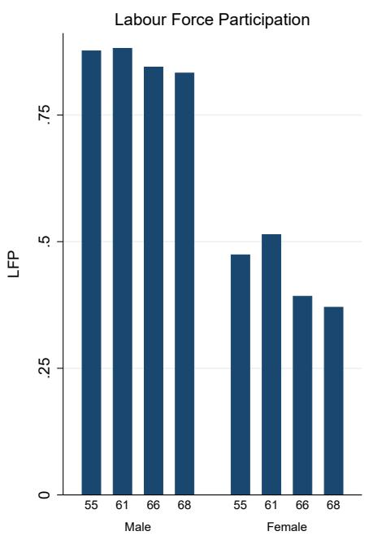

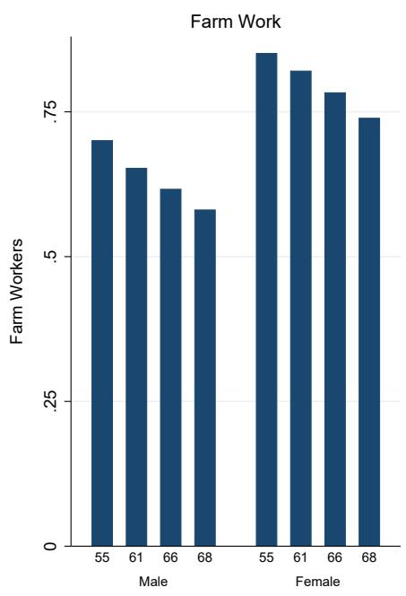  
Notes: The above figures shows trends in labour force participation and engagement in farm work (conditional on participating in labour force) over time, and disaggregated by gender. NSS survey rounds 55, 61, 66 and 68 correspond to the 1999-00, 2004-05, 2009-10 and 2011-12 years.

Figure 2: Trends in Non-Farm Employment by Gender  
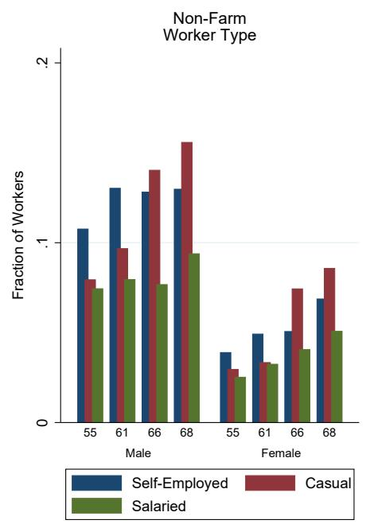

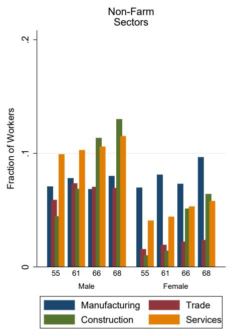  
Notes: The above figures shows trends in non-farm employment categories and sectors, conditional on participation in the labour force, and disaggregated by gender. NSS survey rounds 55, 61, 66 and 68 correspond to the 1999-00, 2004-05, 2009-10 and 2011-12 years.

Figure 3: Trends in Non-Farm Employment by Gender and Secondary Education  
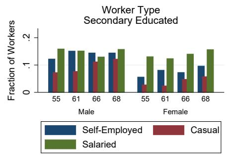

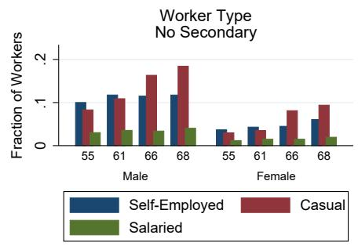

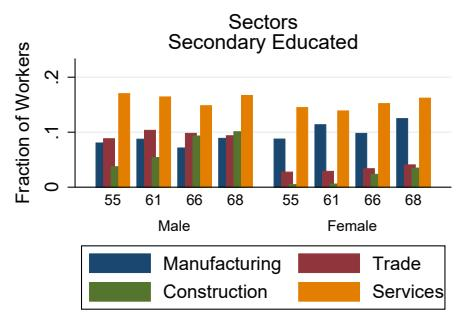

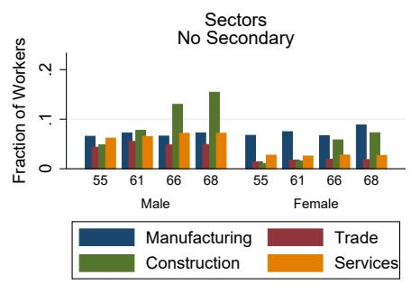  
Notes: The above figures shows trends in non-farm employment categories and sectors, conditional on participation in the labour force, and disaggregated by gender and secondary education. The left-hand figures restrict the sample to rural workers who have completed secondary education; the right-hand panel restricts the sample to rural workers without secondary education. NSS survey rounds 55, 61, 66 and 68 correspond to the 1999-00, 2004-05, 2009-10 and 2011-12 years.

Figure 4: Trends in Household Monthly Per Capita Expenditures  
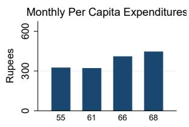

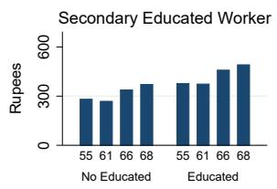

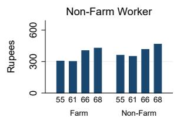

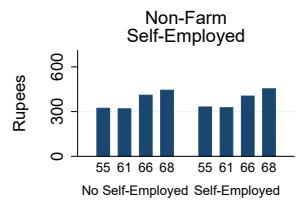

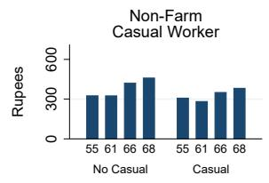

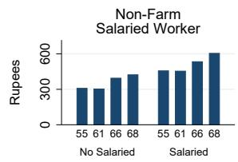

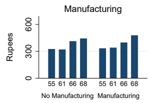

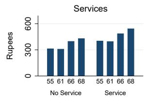  
Notes: The above figures shows trends in monthly per capita consumption for rural households over time. The data is disaggregated by the type of worker present in the household. NSS survey rounds 55, 61, 66 and 68 correspond to the 1999-00, 2004-05, 2009-10 and 2011-12 years.

## 7 Tables

Table 1A: Rural Individual Characteristics: Summary Statistics

<table><tr><td colspan="6">Panel A: Rural Adults</td></tr><tr><td>Variable</td><td>Mean</td><td>Std. Dev.</td><td>Min.</td><td>Max.</td><td>N</td></tr><tr><td>LFP</td><td>0.68</td><td>0.47</td><td>0</td><td>1</td><td>710787</td></tr><tr><td>Literate</td><td>0.5</td><td>0.5</td><td>0</td><td>1</td><td>710787</td></tr><tr><td>Secondary +</td><td>0.28</td><td>0.45</td><td>0</td><td>1</td><td>710787</td></tr><tr><td>Age</td><td>34.15</td><td>13.74</td><td>15</td><td>65</td><td>710787</td></tr><tr><td>SC/ST</td><td>0.32</td><td>0.47</td><td>0</td><td>1</td><td>710787</td></tr><tr><td>Muslim</td><td>0.1</td><td>0.29</td><td>0</td><td>1</td><td>710787</td></tr><tr><td>Female</td><td>0.5</td><td>0.5</td><td>0</td><td>1</td><td>710787</td></tr><tr><td colspan="6">Panel B: Rural Workers</td></tr><tr><td>Variable</td><td>Mean</td><td>Std. Dev.</td><td>Min.</td><td>Max.</td><td>N</td></tr><tr><td>Unemployed</td><td>0.02</td><td>0.12</td><td>0</td><td>1</td><td>453161</td></tr><tr><td>Non-Farm</td><td>0.23</td><td>0.42</td><td>0</td><td>1</td><td>453161</td></tr><tr><td>Non-Farm Self-Employed</td><td>0.08</td><td>0.28</td><td>0</td><td>1</td><td>453161</td></tr><tr><td>Non-Farm Casual Work</td><td>0.06</td><td>0.24</td><td>0</td><td>1</td><td>453161</td></tr><tr><td>Non-Farm Salaried Work</td><td>0.06</td><td>0.23</td><td>0</td><td>1</td><td>453161</td></tr><tr><td>Farm</td><td>0.75</td><td>0.43</td><td>0</td><td>1</td><td>453161</td></tr><tr><td>Farm Worker</td><td>0.32</td><td>0.47</td><td>0</td><td>1</td><td>453161</td></tr><tr><td>Manufacturing</td><td>0.07</td><td>0.26</td><td>0</td><td>1</td><td>453161</td></tr><tr><td>Trade</td><td>0.04</td><td>0.2</td><td>0</td><td>1</td><td>453161</td></tr><tr><td>Construction</td><td>0.03</td><td>0.18</td><td>0</td><td>1</td><td>453161</td></tr><tr><td>Services</td><td>0.08</td><td>0.27</td><td>0</td><td>1</td><td>453161</td></tr></table>

Notes: This table presents summary statistics for rural individuals using the four rounds of the NSS data. Panel A restricts the sample to all rural individuals aged between 15 and 65; panel B restricts the sample to rural individuals aged 15-65 who participate in the labour force.

Table 1B: Rural Household Characteristics: Summary Statistics

<table><tr><td>Variable</td><td>Mean</td><td>Std. Dev.</td><td>Min.</td><td>Max.</td><td>N</td></tr><tr><td>Monthly per capita expenditure (INR)</td><td>323.88</td><td>219.73</td><td>0.69</td><td>39717.62</td><td>224368</td></tr><tr><td>Below Poverty Line (BPL)</td><td>0.3</td><td>0.46</td><td>0</td><td>1</td><td>224368</td></tr><tr><td>Household Size</td><td>5.12</td><td>5.16</td><td>1</td><td>601</td><td>224368</td></tr><tr><td>Any Literate</td><td>0.68</td><td>0.47</td><td>0</td><td>1</td><td>224368</td></tr><tr><td>Any Secondary +</td><td>0.45</td><td>0.5</td><td>0</td><td>1</td><td>224368</td></tr><tr><td>Marginal Landowner</td><td>0.49</td><td>0.5</td><td>0</td><td>1</td><td>224368</td></tr><tr><td>HH not in LF</td><td>0.04</td><td>0.19</td><td>0</td><td>1</td><td>224368</td></tr><tr><td>Any Non-Farm</td><td>0.34</td><td>0.47</td><td>0</td><td>1</td><td>224368</td></tr><tr><td>Any Farm</td><td>0.76</td><td>0.43</td><td>0</td><td>1</td><td>224368</td></tr><tr><td>Any Non-Farm Self-Employed</td><td>0.15</td><td>0.36</td><td>0</td><td>1</td><td>224368</td></tr><tr><td>Any Non-Farm Casual Worker</td><td>0.1</td><td>0.29</td><td>0</td><td>1</td><td>224368</td></tr><tr><td>Any Non-Farm Salaried Worker</td><td>0.1</td><td>0.3</td><td>0</td><td>1</td><td>224368</td></tr><tr><td>Any Manufacturing</td><td>0.1</td><td>0.3</td><td>0</td><td>1</td><td>224368</td></tr><tr><td>Any Trade</td><td>0.07</td><td>0.26</td><td>0</td><td>1</td><td>224368</td></tr><tr><td>Any Construction</td><td>0.05</td><td>0.22</td><td>0</td><td>1</td><td>224368</td></tr><tr><td>Any Service</td><td>0.13</td><td>0.34</td><td>0</td><td>1</td><td>224368</td></tr></table>

Notes: This table presents summary statistics for rural households using the four rounds of the NSS data. Household consumption is measured in 1993 values.

Table 1C: Summary Statistics: Non-Farm Unincorporated Enterprises

<table><tr><td>Variable</td><td>Mean</td><td>Std. Dev.</td><td>Min.</td><td>Max.</td><td>N</td></tr><tr><td>Revenues</td><td>15253.28</td><td>25981.57</td><td>0</td><td>800000</td><td>139182</td></tr><tr><td>Value Addition</td><td>4449.28</td><td>5027.72</td><td>0</td><td>151220</td><td>139182</td></tr><tr><td>Fixed Assets</td><td>117136.3</td><td>358223.3</td><td>0</td><td>6097000</td><td>139182</td></tr><tr><td>Own Account Enterprise</td><td>0.92</td><td>0.27</td><td>0</td><td>1</td><td>139182</td></tr><tr><td>Enterprise Expanding</td><td>0.32</td><td>0.46</td><td>0</td><td>1</td><td>139182</td></tr><tr><td>Enterprise Stagnating</td><td>0.53</td><td>0.5</td><td>0</td><td>1</td><td>139182</td></tr><tr><td>Age &lt; 3 years</td><td>0.15</td><td>0.36</td><td>0</td><td>1</td><td>139182</td></tr><tr><td>Any Credit</td><td>0.1</td><td>0.3</td><td>0</td><td>1</td><td>139182</td></tr><tr><td>Any Bank Loans</td><td>0.03</td><td>0.18</td><td>0</td><td>1</td><td>139182</td></tr><tr><td>Any Informal Credit</td><td>0.04</td><td>0.2</td><td>0</td><td>1</td><td>139182</td></tr><tr><td>Any Business Credit</td><td>0</td><td>0.07</td><td>0</td><td>1</td><td>139182</td></tr><tr><td>Enterprise Registered</td><td>0.21</td><td>0.4</td><td>0</td><td>1</td><td>139182</td></tr><tr><td>Female Owner</td><td>0.18</td><td>0.38</td><td>0</td><td>1</td><td>139182</td></tr><tr><td>SC/ST Owner</td><td>0.21</td><td>0.41</td><td>0</td><td>1</td><td>139182</td></tr><tr><td>Age</td><td>10.63</td><td>8.57</td><td>0</td><td>120</td><td>139176</td></tr><tr><td>Keeps Accounts</td><td>0.07</td><td>0.25</td><td>0</td><td>1</td><td>139182</td></tr><tr><td>Problem - power</td><td>0.05</td><td>0.22</td><td>0</td><td>1</td><td>139182</td></tr><tr><td>Problem - raw materials</td><td>0.03</td><td>0.18</td><td>0</td><td>1</td><td>139182</td></tr><tr><td>Problem - demand</td><td>0.12</td><td>0.32</td><td>0</td><td>1</td><td>139182</td></tr><tr><td>Problem - financial recovery</td><td>0.11</td><td>0.31</td><td>0</td><td>1</td><td>139182</td></tr><tr><td>Problem - credit</td><td>0.09</td><td>0.28</td><td>0</td><td>1</td><td>139182</td></tr><tr><td>Problem - labour</td><td>0.01</td><td>0.12</td><td>0</td><td>1</td><td>139182</td></tr></table>

Notes: This table presents summary statistics for rural unincorporated non-farm enterprises based on the NSS survey undertaken in 2010-11. Revenues and Value Addition refer to monthly enterprise revenues and value addition in current values. Own account enterprises are enterprises which do not hire any workers.

<table><tr><td colspan="6">Panel A: Rural Adults</td></tr><tr><td>Variable</td><td>Mean</td><td>Std. Dev.</td><td>Min.</td><td>Max.</td><td>N</td></tr><tr><td>Female</td><td>0.47</td><td>0.5</td><td>0</td><td>1</td><td>388273</td></tr><tr><td>Literate</td><td>0.73</td><td>0.44</td><td>0</td><td>1</td><td>388273</td></tr><tr><td>Age</td><td>35.33</td><td>13.97</td><td>15</td><td>65</td><td>388273</td></tr><tr><td>LFP</td><td>0.43</td><td>0.5</td><td>0</td><td>1</td><td>388273</td></tr><tr><td>Muslim</td><td>0.1</td><td>0.3</td><td>0</td><td>1</td><td>388273</td></tr><tr><td>SC/ST</td><td>0.34</td><td>0.47</td><td>0</td><td>1</td><td>388273</td></tr><tr><td>Unhealthy Individual</td><td>0.02</td><td>0.14</td><td>0</td><td>1</td><td>388273</td></tr><tr><td>On Medication</td><td>0.02</td><td>0.12</td><td>0</td><td>1</td><td>388273</td></tr><tr><td>Has Cell Phone</td><td>0.56</td><td>0.5</td><td>0</td><td>1</td><td>388273</td></tr><tr><td>Has Health Insurance</td><td>0.03</td><td>0.18</td><td>0</td><td>1</td><td>388273</td></tr><tr><td>Has Bank Account</td><td>0.68</td><td>0.46</td><td>0</td><td>1</td><td>388273</td></tr><tr><td>Has Credit Card</td><td>0.01</td><td>0.08</td><td>0</td><td>1</td><td>388273</td></tr><tr><td colspan="6">Panel B: Rural Workers</td></tr><tr><td>Variable</td><td>Mean</td><td>Std. Dev.</td><td>Min.</td><td>Max.</td><td>N</td></tr><tr><td>Unemployed</td><td>0.01</td><td>0.09</td><td>0</td><td>1</td><td>167582</td></tr><tr><td>Farm</td><td>0.53</td><td>0.5</td><td>0</td><td>1</td><td>167582</td></tr><tr><td>Non-Farm</td><td>0.47</td><td>0.5</td><td>0</td><td>1</td><td>167582</td></tr><tr><td>Non-Farm Informal</td><td>0.3</td><td>0.46</td><td>0</td><td>1</td><td>167582</td></tr><tr><td>Non-Farm Formal</td><td>0.16</td><td>0.37</td><td>0</td><td>1</td><td>167582</td></tr><tr><td>Wage Labour</td><td>0.31</td><td>0.46</td><td>0</td><td>1</td><td>167582</td></tr><tr><td>Small Business</td><td>0.02</td><td>0.15</td><td>0</td><td>1</td><td>167582</td></tr><tr><td>Business Owner</td><td>0.04</td><td>0.2</td><td>0</td><td>1</td><td>167582</td></tr><tr><td>Self-Employed Professional</td><td>0.04</td><td>0.18</td><td>0</td><td>1</td><td>167582</td></tr><tr><td>White Collar</td><td>0.05</td><td>0.22</td><td>0</td><td>1</td><td>167582</td></tr></table>

Table 1D: Summary Statistics: Consumer Pyramids Data  
Notes: This table presents summary statistics based on the Consumer Pyramids data in 2015. Panel A restricts the sample to rural individuals aged between 15 and 65; Panel B restricts the sample to rural individuals aged 15-65, who also participate in the labour force. Wage Labour combines wage labourers and industrial workers; Non-Farm Informal includes wage labourers and small business owners; Non-Farm Formal includes industrial workers, business owners, self-employed professions and white collar workers.

Table 2: Predictors of LFP and Broad Employment Categories

<table><tr><td></td><td>(1)Pr(LFP = 1)</td><td>(2)</td><td>(3)Pr(Unemployed= 1)</td><td>(4)</td><td>(5)Pr(Rural Non Farm = 1)</td><td>(6)</td></tr><tr><td>Female</td><td>-.447***(.013)</td><td>-.447***(.013)</td><td>.003*(.002)</td><td>.003*(.002)</td><td>-.082***(.008)</td><td>-.082***(.008)</td></tr><tr><td>Literate</td><td>-.056***(.004)</td><td>-.056***(.004)</td><td>-.002**(.001)</td><td>-.002**(.001)</td><td>.087***(.005)</td><td>.087***(.005)</td></tr><tr><td>Educated</td><td>-.091***(.005)</td><td>-.091***(.005)</td><td>.036***(.003)</td><td>.036***(.003)</td><td>.112***(.005)</td><td>.112***(.005)</td></tr><tr><td>Age</td><td>.049***(.001)</td><td>.049***(.001)</td><td>-.005***(.000)</td><td>-.005***(.000)</td><td>.009***(.001)</td><td>.009***(.001)</td></tr><tr><td>Sq. Age</td><td>-.001***(.000)</td><td>-.001***(.000)</td><td>.000***(.000)</td><td>.000***(.000)</td><td>-.000***(.000)</td><td>-.000***(.000)</td></tr><tr><td>SC/ST</td><td>.056***(.004)</td><td>.056***(.004)</td><td>-.000(.001)</td><td>-.000(.001)</td><td>-.045***(.006)</td><td>-.045***(.006)</td></tr><tr><td>Muslim</td><td>-.038***(.007)</td><td>-.038***(.007)</td><td>.002(.003)</td><td>.002(.003)</td><td>.090***(.014)</td><td>.090***(.014)</td></tr><tr><td>Marginal Landowner</td><td>-.031***(.005)</td><td>-.031***(.005)</td><td>.005***(.001)</td><td>.005***(.001)</td><td>.233***(.007)</td><td>.233***(.007)</td></tr><tr><td>Fraction rural</td><td></td><td>-.124***(.048)</td><td></td><td>.004(.008)</td><td></td><td>.170***(.052)</td></tr><tr><td>Fraction salaried workers</td><td></td><td>-.368***(.054)</td><td></td><td>.022(.020)</td><td></td><td>.343***(.088)</td></tr><tr><td>Fraction public employment</td><td></td><td>.048(.052)</td><td></td><td>-.012(.009)</td><td></td><td>.295***(.066)</td></tr><tr><td>Fraction manufacturing</td><td></td><td>.042(.066)</td><td></td><td>-.005(.016)</td><td></td><td>.652***(.075)</td></tr><tr><td>Fraction educated</td><td></td><td>.144**(.066)</td><td></td><td>-.002(.015)</td><td></td><td>.017(.065)</td></tr><tr><td>Branch per capita (Log)</td><td></td><td>-.004(.015)</td><td></td><td>-.002(.003)</td><td></td><td>.035***(.013)</td></tr><tr><td>Credit per capita (Log)</td><td></td><td>.002(.013)</td><td></td><td>.000(.003)</td><td></td><td>-.026*(.015)</td></tr><tr><td>Observations</td><td>710787</td><td>710787</td><td>453161</td><td>453161</td><td>453161</td><td>453161</td></tr><tr><td> $R^2$ </td><td>.34</td><td>.34</td><td>.07</td><td>.07</td><td>.19</td><td>.19</td></tr><tr><td>Dep Var Mean</td><td>.68</td><td>.68</td><td>.02</td><td>.02</td><td>.23</td><td>.23</td></tr><tr><td>Dist Controls</td><td>N</td><td>Y</td><td>N</td><td>Y</td><td>No</td><td>Yes</td></tr></table>

This table shows the impact of individual and district characteristics on labour force participation, unemployment and rural non-farm employment. The unit of observation is rural individuals aged 15-65. Columns (3)-(6) restrict the sample to rural individuals aged 15-65 who are in the labour force. Educated refers to individuals with secondary education or better. Maginal landowners are workers in households with less than 0.5 acres of land holding. Standard errors in parentheses, clustered by district.

Table 3: Predictors of Rural Non-Farm Employment

<table><tr><td></td><td colspan="2">(1)Pr(Self-Employed = 1)</td><td colspan="2">(3)Pr(Casual Work= 1)</td><td colspan="2">(5)Pr(Salaried Work = 1)</td></tr><tr><td>Female</td><td>-.043***(.004)</td><td>-.043***(.004)</td><td>-.059***(.004)</td><td>-.059***(.004)</td><td>-.015***(.003)</td><td>-.015***(.003)</td></tr><tr><td>Literate</td><td>.044***(.003)</td><td>.044***(.003)</td><td>.002(.003)</td><td>.002(.003)</td><td>.034***(.003)</td><td>.034***(.003)</td></tr><tr><td>Educated</td><td>.011***(.004)</td><td>.011***(.004)</td><td>-.025***(.003)</td><td>-.025***(.003)</td><td>.117***(.004)</td><td>.117***(.004)</td></tr><tr><td>Age</td><td>.008***(.001)</td><td>.008***(.001)</td><td>-.001***(.000)</td><td>-.001***(.000)</td><td>.007***(.001)</td><td>.007***(.001)</td></tr><tr><td>Sq. Age</td><td>-.000***(.000)</td><td>-.000***(.000)</td><td>-.000(.000)</td><td>-.000(.000)</td><td>-.000***(.000)</td><td>-.000***(.000)</td></tr><tr><td>SC/ST</td><td>-.032***(.003)</td><td>-.032***(.003)</td><td>.015***(.004)</td><td>.015***(.004)</td><td>-.009***(.003)</td><td>-.009***(.003)</td></tr><tr><td>Muslim</td><td>.053***(.009)</td><td>.053***(.009)</td><td>.016**(.007)</td><td>.016**(.007)</td><td>.000(.004)</td><td>.000(.004)</td></tr><tr><td>Marginal Landowner</td><td>.086***(.003)</td><td>.086***(.003)</td><td>.066***(.004)</td><td>.066***(.004)</td><td>.048***(.003)</td><td>.048***(.003)</td></tr><tr><td>Fraction rural</td><td></td><td>.018(.023)</td><td></td><td>.022(.039)</td><td></td><td>.105***(.018)</td></tr><tr><td>Fraction salaried workers</td><td></td><td>-.092**(.036)</td><td></td><td>-.098(.065)</td><td></td><td>.586***(.051)</td></tr><tr><td>Fraction public employment</td><td></td><td>-.033(.022)</td><td></td><td>.335***(.053)</td><td></td><td>.002(.019)</td></tr><tr><td>Fraction manufacturing</td><td></td><td>.307***(.044)</td><td></td><td>.102*(.059)</td><td></td><td>.084***(.031)</td></tr><tr><td>Fraction educated</td><td></td><td>.048(.034)</td><td></td><td>.017(.055)</td><td></td><td>-.064***(.022)</td></tr><tr><td>Branch per capita (Log)</td><td></td><td>.016**(.007)</td><td></td><td>.024**(.011)</td><td></td><td>-.002(.005)</td></tr><tr><td>Credit per capita (Log)</td><td></td><td>-.001(.007)</td><td></td><td>-.030**(.012)</td><td></td><td>.007*(.004)</td></tr><tr><td>Observations</td><td>453161</td><td>453161</td><td>453161</td><td>453161</td><td>453161</td><td>453161</td></tr><tr><td> $R^2$ </td><td>.08</td><td>.08</td><td>.09</td><td>.09</td><td>.11</td><td>.11</td></tr><tr><td>Dep Var Mean</td><td>.08</td><td>.08</td><td>.06</td><td>.06</td><td>.06</td><td>.06</td></tr><tr><td>Dist Controls</td><td>No</td><td>Yes</td><td>No</td><td>Yes</td><td>No</td><td>Yes</td></tr></table>

This table shows the impact of individual and district characteristics on rural non-farm employment by employment type. The unit of observation is rural individuals aged 15-65, who participate in the labour force. Educated refers to individuals with secondary education or better. Maginal landowners are workers in households with less than 0.5 acres of land holding. Standard errors in parentheses, clustered by district.

Table 4: Sectoral Predictors of Rural Non-Farm Employment

<table><tr><td></td><td>(1)Farm</td><td>(2)FarmLabour</td><td>(3)Manufacturing</td><td>(4)Trade</td><td>(5)Construction</td><td>(6)Service</td></tr><tr><td>Female</td><td>.078***(.009)</td><td>-.010(.009)</td><td>.014**(.006)</td><td>-.025***(.002)</td><td>-.041***(.004)</td><td>-.023***(.003)</td></tr><tr><td>Literate</td><td>-.085***(.005)</td><td>-.111***(.006)</td><td>.034***(.004)</td><td>.023***(.002)</td><td>.001(.002)</td><td>.030***(.003)</td></tr><tr><td>Educated</td><td>-.148***(.006)</td><td>-.118***(.007)</td><td>-.005(.003)</td><td>.026***(.003)</td><td>-.015***(.002)</td><td>.104***(.004)</td></tr><tr><td>Age</td><td>-.004***(.001)</td><td>.001(.001)</td><td>-.002***(.000)</td><td>.001***(.000)</td><td>.001***(.000)</td><td>.008***(.000)</td></tr><tr><td>Sq. Age</td><td>.000***(.000)</td><td>-.000***(.000)</td><td>.000***(.000)</td><td>-.000**(.000)</td><td>-.000***(.000)</td><td>-.000***(.000)</td></tr><tr><td>SC/ST</td><td>.045***(.006)</td><td>.150***(.008)</td><td>-.020***(.004)</td><td>-.024***(.002)</td><td>.013***(.003)</td><td>-.015***(.003)</td></tr><tr><td>Muslim</td><td>-.092***(.015)</td><td>-.025**(.011)</td><td>.031***(.010)</td><td>.044***(.006)</td><td>.005(.005)</td><td>.011*(.006)</td></tr><tr><td>Marginal Landowner</td><td>-.238***(.007)</td><td>.250***(.009)</td><td>.073***(.004)</td><td>.045***(.003)</td><td>.034***(.003)</td><td>.075***(.003)</td></tr><tr><td>Fraction rural</td><td>-.173***(.053)</td><td>-.173***(.051)</td><td>.095***(.017)</td><td>.021(.017)</td><td>.002(.032)</td><td>.044*(.024)</td></tr><tr><td>Fraction salaried workers</td><td>-.366***(.089)</td><td>-.329***(.104)</td><td>-.007(.035)</td><td>.012(.027)</td><td>-.037(.049)</td><td>.340***(.049)</td></tr><tr><td>Fraction public employment</td><td>-.283***(.066)</td><td>.083(.064)</td><td>-.033*(.017)</td><td>-.015(.017)</td><td>.283***(.050)</td><td>.052*(.030)</td></tr><tr><td>Fraction manufacturing</td><td>-.647***(.077)</td><td>-.215***(.078)</td><td>.834***(.040)</td><td>-.017(.026)</td><td>-.084**(.040)</td><td>-.074*(.040)</td></tr><tr><td>Fraction educated</td><td>-.015(.066)</td><td>.059(.091)</td><td>.068***(.021)</td><td>-.001(.023)</td><td>-.052(.037)</td><td>.018(.036)</td></tr><tr><td>Branch per capita (Log)</td><td>-.034**(.013)</td><td>-.034**(.017)</td><td>.002(.004)</td><td>.011**(.005)</td><td>.018**(.008)</td><td>.006(.006)</td></tr><tr><td>Credit per capita (Log)</td><td>.026*(.015)</td><td>.026(.017)</td><td>.009*(.005)</td><td>-.006(.005)</td><td>-.026***(.010)</td><td>-.003(.007)</td></tr><tr><td>Observations</td><td>453161</td><td>453161</td><td>453161</td><td>453161</td><td>453161</td><td>453161</td></tr><tr><td> $R^2$ </td><td>.21</td><td>.28</td><td>.08</td><td>.05</td><td>.06</td><td>.09</td></tr><tr><td>Dep Var Mean</td><td>.75</td><td>.32</td><td>.07</td><td>.04</td><td>.03</td><td>.08</td></tr></table>

This table shows the impact of individual and district characteristics on rural non-farm employment by employment sector. The unit of observation is rural individuals aged 15-65, who participate in the labour force. Farm labour refers to workers who are employed as casual workers in the agricultural activities. Educated refers to individuals with secondary education or better. Maginal landowners are workers in households with less than 0.5 acres of land holding. Standard errors in parentheses, clustered by district.

<table><tr><td rowspan="2"></td><td colspan="6">Panel A: Broad Categories</td></tr><tr><td>(1) LFP</td><td>(2) Unemployed</td><td>(3) Non Farm</td><td>(4) Self Employed</td><td>(5) Casual Work</td><td>(6) Salaried Work</td></tr><tr><td>Positive Shock</td><td>-.000(.009)</td><td>-.004***(.001)</td><td>-.023**(.009)</td><td>-.012**(.005)</td><td>-.008(.006)</td><td>-.005*(.003)</td></tr><tr><td>Zero Shock</td><td>-.003(.005)</td><td>-.001(.001)</td><td>-.011**(.005)</td><td>-.001(.002)</td><td>-.007*(.004)</td><td>-.004*(.002)</td></tr><tr><td>Positive Shock, Lag1</td><td>-.015(.011)</td><td>.002(.001)</td><td>.012(.010)</td><td>.003(.005)</td><td>.002(.009)</td><td>.003(.003)</td></tr><tr><td>Zero Shock, Lag1</td><td>-.005(.009)</td><td>.001(.001)</td><td>.016**(.008)</td><td>.006(.004)</td><td>.005(.007)</td><td>.003(.003)</td></tr><tr><td>Positive Shock, Lag2</td><td>-.015*(.009)</td><td>-.004***(.001)</td><td>-.044***(.009)</td><td>-.006(.005)</td><td>-.028***(.007)</td><td>-.006*(.003)</td></tr><tr><td>Zero Shock, Lag2</td><td>-.011*(.006)</td><td>-.002**(.001)</td><td>-.013**(.006)</td><td>-.001(.003)</td><td>-.010**(.005)</td><td>-.003(.002)</td></tr><tr><td>Observations</td><td>710787</td><td>453161</td><td>453161</td><td>453161</td><td>453161</td><td>453161</td></tr><tr><td> $R^2$ </td><td>.34</td><td>.03</td><td>.19</td><td>.08</td><td>.09</td><td>.11</td></tr><tr><td>Dep Var Mean</td><td>.68</td><td>.01</td><td>.23</td><td>.08</td><td>.06</td><td>.06</td></tr><tr><td rowspan="2"></td><td colspan="6">Panel B:Sectors</td></tr><tr><td>(1) Farm</td><td>(2) Farm Labour</td><td>(3) Manufacturing</td><td>(4) Trade</td><td>(5) Construction</td><td>(6) Service</td></tr><tr><td>Positive Shock</td><td>.029***(.009)</td><td>.032***(.010)</td><td>-.008**(.003)</td><td>.001(.004)</td><td>-.005(.005)</td><td>-.009**(.004)</td></tr><tr><td>Zero Shock</td><td>.012**(.005)</td><td>.012*(.006)</td><td>-.003(.002)</td><td>-.001(.002)</td><td>-.009***(.003)</td><td>.003(.003)</td></tr><tr><td>Positive Shock, Lag1</td><td>-.016(.010)</td><td>-.006(.012)</td><td>.007**(.003)</td><td>.009***(.003)</td><td>-.002(.007)</td><td>-.000(.004)</td></tr><tr><td>Zero Shock, Lag1</td><td>-.019**(.009)</td><td>.002(.011)</td><td>.005*(.003)</td><td>.010***(.003)</td><td>.001(.006)</td><td>.003(.003)</td></tr><tr><td>Positive Shock, Lag2</td><td>.051***(.009)</td><td>.008(.011)</td><td>-.005(.003)</td><td>-.007*(.004)</td><td>-.027***(.005)</td><td>-.006(.005)</td></tr><tr><td>Zero Shock, Lag2</td><td>.017***(.006)</td><td>-.011(.008)</td><td>-.001(.002)</td><td>.000(.002)</td><td>-.012***(.004)</td><td>-.001(.003)</td></tr><tr><td>Observations</td><td>453161</td><td>453161</td><td>453161</td><td>453161</td><td>453161</td><td>453161</td></tr><tr><td> $R^2$ </td><td>.21</td><td>.28</td><td>.08</td><td>.05</td><td>.06</td><td>.09</td></tr><tr><td>Dep Var Mean</td><td>.75</td><td>.32</td><td>.07</td><td>.04</td><td>.03</td><td>.08</td></tr></table>

Table 5: Rainfall and Rural Non-Farm Employment Categories

Notes: This table shows the impact of rainfall shocks on rural non-farm employment by employment type and sector. The unit of observation is rural individuals aged 15-65. Except for column (1) of Panel A, the sample is restricted to individuals who participate in the labour force. Positive Shock is a dummy equaling 1 if the district's annual rainfall incidence falls in the top 20th percentile of the district's historical rainfall distribution; Zero Shock is a dummy equaling 1 if the district's annual rainfall incidence falls between the 20th and the 80th percentile of the district's historical rainfall distribution. Standard errors in parentheses, clustered by district.

Table 6: Predictors of Household Consumption

<table><tr><td></td><td colspan="3">(1) Monthly Per Capita Consumption (Log)</td><td colspan="3">(4) Pr(BPL = 1)</td></tr><tr><td>Literate</td><td>.066***(.005)</td><td>.065***(.005)</td><td>.067***(.005)</td><td>-.057***(.006)</td><td>-.056***(.006)</td><td>-.057***(.006)</td></tr><tr><td>Educated</td><td>.149***(.006)</td><td>.139***(.006)</td><td>.144***(.006)</td><td>-.103***(.006)</td><td>-.098***(.006)</td><td>-.101***(.006)</td></tr><tr><td>HH not in LF</td><td>-.004(.025)</td><td>-.012(.025)</td><td>-.008(.025)</td><td>.051***(.014)</td><td>.054***(.014)</td><td>.052***(.014)</td></tr><tr><td>Any farm</td><td>-.073***(.009)</td><td>-.082***(.009)</td><td>-.077***(.009)</td><td>.033***(.008)</td><td>.035***(.008)</td><td>.033***(.008)</td></tr><tr><td>Any non-farm</td><td>.036***(.011)</td><td></td><td></td><td>-.046***(.011)</td><td></td><td></td></tr><tr><td>Any non-farm self-employed</td><td></td><td>-.008(.010)</td><td></td><td></td><td>-.033***(.011)</td><td></td></tr><tr><td>Any non-farm casual labour</td><td></td><td>-.068***(.011)</td><td></td><td></td><td>.005(.012)</td><td></td></tr><tr><td>Any non-farm salaried work</td><td></td><td>.116***(.012)</td><td></td><td></td><td>-.079***(.011)</td><td></td></tr><tr><td>Any manufacturing</td><td></td><td></td><td>-.011(.012)</td><td></td><td></td><td>-.030**(.012)</td></tr><tr><td>Any trade</td><td></td><td></td><td>.033***(.011)</td><td></td><td></td><td>-.071***(.011)</td></tr><tr><td>Any construction</td><td></td><td></td><td>-.050***(.012)</td><td></td><td></td><td>.002(.013)</td></tr><tr><td>Any service</td><td></td><td></td><td>.039***(.010)</td><td></td><td></td><td>-.037***(.009)</td></tr><tr><td>Any public employment</td><td>.252***(.019)</td><td>.181***(.020)</td><td>.212***(.019)</td><td>-.091***(.013)</td><td>-.059***(.014)</td><td>-.081***(.013)</td></tr><tr><td>Any private employment</td><td>-.012(.011)</td><td>.016*(.009)</td><td>-.001(.010)</td><td>.018*(.010)</td><td>.008(.009)</td><td>.019**(.009)</td></tr><tr><td>SC/ST</td><td>-.184***(.010)</td><td>-.178***(.010)</td><td>-.180***(.010)</td><td>.119***(.009)</td><td>.116***(.009)</td><td>.115***(.009)</td></tr><tr><td>Muslim</td><td>-.098***(.012)</td><td>-.095***(.012)</td><td>-.096***(.012)</td><td>.064***(.011)</td><td>.063***(.011)</td><td>.064***(.011)</td></tr><tr><td>Marginal Landowner</td><td>-.105***(.006)</td><td>-.102***(.006)</td><td>-.092***(.008)</td><td>.095***(.007)</td><td>.094***(.007)</td><td>.084***(.009)</td></tr><tr><td>Rural Population</td><td>.117(.095)</td><td>.104(.094)</td><td>.125(.095)</td><td>-.041(.083)</td><td>-.035(.082)</td><td>-.043(.083)</td></tr><tr><td>Salaried Workers</td><td>.502***(.136)</td><td>.394***(.132)</td><td>.484***(.134)</td><td>-.137(.132)</td><td>-.090(.131)</td><td>-.132(.131)</td></tr><tr><td>Public Employment</td><td>-.584***(.127)</td><td>-.434***(.126)</td><td>-.606***(.126)</td><td>.406***(.106)</td><td>.338***(.106)</td><td>.419***(.106)</td></tr><tr><td>Manufacturing Workers</td><td>.024(.128)</td><td>.028(.128)</td><td>.023(.127)</td><td>.227*(.123)</td><td>.228*(.124)</td><td>.233*(.123)</td></tr><tr><td>Pop. Secondary/Higher Education</td><td>.310*(.181)</td><td>.308*(.180)</td><td>.307*(.180)</td><td>.026(.164)</td><td>.027(.163)</td><td>.027(.164)</td></tr><tr><td>Branch Per Capita (Log)</td><td>-.071**(.030)</td><td>-.068**(.029)</td><td>-.068**(.030)</td><td>-.001(.029)</td><td>-.003(.028)</td><td>-.003(.029)</td></tr><tr><td>Bank Credit Per Capita (Log)</td><td>.072**(.028)</td><td>.068**(.028)</td><td>.068**(.028)</td><td>-.005(.023)</td><td>-.003(.023)</td><td>-.003(.023)</td></tr><tr><td>Observations</td><td>224368</td><td>224368</td><td>224368</td><td>224368</td><td>224368</td><td>224368</td></tr><tr><td> $R^2$ </td><td>.35</td><td>.36</td><td>.36</td><td>.23</td><td>.23</td><td>.23</td></tr><tr><td>Dep Var Mean</td><td>323.88</td><td>323.88</td><td>323.88</td><td>.30</td><td>.30</td><td>.30</td></tr></table>

This table shows the impact of individual and district characteristics on household consumption and the likelihood of a household being situated below the poverty line (BPL). The unit of observation is rural household. Educated refers to individuals with secondary education or better. Maginal landowners are households with less than 0.5 acres of land holding. Standard errors in parentheses, clustered by district.

Table 7: Rainfall Shock and Household Consumption

<table><tr><td></td><td colspan="3">(1) Monthly Per Capita Consumption (Log)</td><td colspan="3">(4) Pr(BPL = 1)</td></tr><tr><td>Positive Shock</td><td>-.005(.016)</td><td>-.006(.016)</td><td>-.007(.016)</td><td>.042***(.016)</td><td>.043***(.016)</td><td>.044***(.016)</td></tr><tr><td>Zero Shock</td><td>.024**(.011)</td><td>.023**(.011)</td><td>.021*(.011)</td><td>.009(.009)</td><td>.009(.009)</td><td>.010(.009)</td></tr><tr><td>Positive Shock, Lag1</td><td>.056***(.020)</td><td>.056***(.020)</td><td>.055***(.020)</td><td>.008(.017)</td><td>.008(.017)</td><td>.009(.017)</td></tr><tr><td>Zero Shock, Lag1</td><td>.030*(.016)</td><td>.030*(.016)</td><td>.029*(.016)</td><td>-.003(.016)</td><td>-.003(.016)</td><td>-.002(.016)</td></tr><tr><td>Positive Shock, Lag2</td><td>-.012(.019)</td><td>-.013(.019)</td><td>-.014(.019)</td><td>.011(.017)</td><td>.012(.017)</td><td>.013(.017)</td></tr><tr><td>Zero Shock, Lag2</td><td>.017(.012)</td><td>.018(.012)</td><td>.016(.012)</td><td>-.004(.011)</td><td>-.004(.011)</td><td>-.004(.011)</td></tr><tr><td>Observations</td><td>224368</td><td>224368</td><td>224368</td><td>224368</td><td>224368</td><td>224368</td></tr><tr><td> $R^2$ </td><td>.35</td><td>.36</td><td>.36</td><td>.23</td><td>.23</td><td>.23</td></tr><tr><td>Dep Var Mean</td><td>323.88</td><td>323.88</td><td>323.88</td><td>.30</td><td>.30</td><td>.30</td></tr></table>

This table shows the impact of rainfall shocks on rural households' consumption and the likelihood of a household being situated below the poverty line (BPL). The unit of observation is rural households. Positive Shock is a dummy equaling 1 if the district's annual rainfall incidence falls in the top 20th percentile of the district's historical rainfall distribution; Zero Shock is a dummy equaling 1 if the district's annual rainfall incidence falls between the 20th and the 80th percentile of the district's historical rainfall distribution. Standard errors in parentheses, clustered by district.

Table 8: Barriers to Micro-Enterprise Performance

<table><tr><td></td><td>(1)</td><td>(2) Revenues (Log)</td><td>(3)</td><td>(4)</td><td>(5) Gross Value</td><td>(6) Addition (Log)</td><td>(7)</td><td>(8)</td></tr><tr><td>Problem - power</td><td>.293***(.048)</td><td>.286***(.047)</td><td>.047(.039)</td><td>.061(.037)</td><td>.325***(.046)</td><td>.319***(.043)</td><td>.116***(.035)</td><td>.122***(.033)</td></tr><tr><td>Problem - raw materials</td><td>-.005(.070)</td><td>.002(.067)</td><td>.001(.058)</td><td>.056(.060)</td><td>-.038(.058)</td><td>-.033(.057)</td><td>-.037(.051)</td><td>.008(.051)</td></tr><tr><td>Problem - demand</td><td>-.229***(.034)</td><td>-.219***(.031)</td><td>-.166***(.029)</td><td>-.150***(.029)</td><td>-.213***(.034)</td><td>-.204***(.032)</td><td>-.163***(.031)</td><td>-.149***(.031)</td></tr><tr><td>Problem - financial recovery</td><td>.181***(.036)</td><td>.171***(.035)</td><td>.116***(.029)</td><td>.111***(.027)</td><td>.144***(.035)</td><td>.132***(.034)</td><td>.085***(.029)</td><td>.080***(.026)</td></tr><tr><td>Problem - credit</td><td>.028(.032)</td><td>.039(.032)</td><td>.036(.031)</td><td>.079**(.031)</td><td>-.080**(.039)</td><td>-.066**(.026)</td><td>-.070***(.023)</td><td>-.020(.020)</td></tr><tr><td>Problem - labour</td><td>.931***(.111)</td><td>.902***(.107)</td><td>.134*(.069)</td><td>.184***(.067)</td><td>.819***(.097)</td><td>.793***(.093)</td><td>.114*(.063)</td><td>.159***(.060)</td></tr><tr><td>Fixed Assets (Log)</td><td></td><td></td><td>.184***(.009)</td><td>.183***(.009)</td><td></td><td></td><td>.145***(.010)</td><td>.141***(.010)</td></tr><tr><td>Wages (Log)</td><td></td><td></td><td>.206***(.018)</td><td>.206***(.016)</td><td></td><td></td><td>.194***(.022)</td><td>.193***(.019)</td></tr><tr><td>Female Own</td><td></td><td></td><td>-.595***(.032)</td><td>-.585***(.033)</td><td></td><td></td><td>-.546***(.026)</td><td>-.542***(.026)</td></tr><tr><td>SC/ST Own</td><td></td><td></td><td>-.134***(.021)</td><td>-.119***(.020)</td><td></td><td></td><td>-.078***(.019)</td><td>-.072***(.018)</td></tr><tr><td>Age</td><td></td><td></td><td>.006***(.002)</td><td>.007***(.002)</td><td></td><td></td><td>.010***(.002)</td><td>.010***(.002)</td></tr><tr><td>Age Square</td><td></td><td></td><td>-.000***(.000)</td><td>-.000***(.000)</td><td></td><td></td><td>-.000***(.000)</td><td>-.000***(.000)</td></tr><tr><td>Own Account</td><td></td><td></td><td>.732***(.141)</td><td>.734***(.123)</td><td></td><td></td><td>.653***(.172)</td><td>.648***(.151)</td></tr><tr><td>Keeps Accounts</td><td></td><td></td><td>.305***(.052)</td><td>.336***(.045)</td><td></td><td></td><td>.221***(.083)</td><td>.236***(.075)</td></tr><tr><td>Registered</td><td></td><td></td><td>.219***(.027)</td><td>.228***(.028)</td><td></td><td></td><td>.117***(.038)</td><td>.121***(.039)</td></tr><tr><td>Fraction Rural</td><td></td><td>.270(.192)</td><td>.138(.160)</td><td></td><td></td><td>.127(.246)</td><td>.016(.222)</td><td></td></tr><tr><td>District Consumption (Log)</td><td></td><td>-.103(.115)</td><td>-.106(.102)</td><td></td><td></td><td>-.102(.119)</td><td>-.098(.109)</td><td></td></tr><tr><td>Fraction Public</td><td></td><td>-.280(.340)</td><td>-.101(.274)</td><td></td><td></td><td>-.444(.368)</td><td>-.296(.316)</td><td></td></tr><tr><td>Fraction Manufacturing</td><td></td><td>-.879***(.300)</td><td>-.778***(.267)</td><td></td><td></td><td>-.735**(.292)</td><td>-.637**(.251)</td><td></td></tr><tr><td>Fraction Marginal Land</td><td></td><td>-.209(.146)</td><td>-.092(.125)</td><td></td><td></td><td>-.310**(.155)</td><td>-.204(.138)</td><td></td></tr><tr><td>Fraction Literate</td><td></td><td>-.122(.286)</td><td>-.364(.254)</td><td></td><td></td><td>-.485(.332)</td><td>-.743**(.307)</td><td></td></tr><tr><td>Fraction Educated</td><td></td><td>.400(.320)</td><td>.465*(.275)</td><td></td><td></td><td>.740**(.370)</td><td>.827**(.331)</td><td></td></tr><tr><td>Bank Branch Per Capita (Log)</td><td></td><td>-.220**(.090)</td><td>-.252***(.080)</td><td></td><td></td><td>-.054(.098)</td><td>-.073(.089)</td><td></td></tr><tr><td>Bank Credit Per Capita (Log)</td><td></td><td>.213***(.056)</td><td>.169***(.049)</td><td></td><td></td><td>.143**(.058)</td><td>.104*(.054)</td><td></td></tr><tr><td>Observations</td><td>139182</td><td>139182</td><td>139175</td><td>139175</td><td>139182</td><td>139182</td><td>139175</td><td>139175</td></tr><tr><td> $R^2$ </td><td>.49</td><td>.49</td><td>.62</td><td>.64</td><td>.33</td><td>.34</td><td>.47</td><td>.49</td></tr><tr><td>Dep Var Mean</td><td>15253.28</td><td>15253.28</td><td>15253.28</td><td>15253.28</td><td>4449.28</td><td>4449.28</td><td>4449.28</td><td>4449.28</td></tr><tr><td>District Fixed Effect</td><td>N</td><td>N 49</td><td>N</td><td>Y</td><td>N</td><td>N</td><td>N</td><td>Y</td></tr></table>

This table estimates the impact of self-reported problems faced by micro-enterprises on quantitative measures of micro-enterprise performance. The unit of observation is the micro-enterprise. Revenues and value addition refer to monthly values. Standard errors in parentheses, clustered by district.

Table 9: Barriers to Micro-Enterprise Performance: Qualitative Measures of Performance

<table><tr><td></td><td colspan="3">(1)Pr(Expansion = 1)</td><td colspan="3">(4)Pr(Stagnation = 1)</td><td colspan="3">(7)Pr(Entry = 1)</td></tr><tr><td>Problem - power</td><td>-.012(.027)</td><td>-.015(.029)</td><td>-.035(.027)</td><td>.026(.027)</td><td>.030(.029)</td><td>.052*(.030)</td><td>-.015(.010)</td><td>-.015(.010)</td><td>-.017*(.010)</td></tr><tr><td>Problem - raw materials</td><td>-.063**(.028)</td><td>-.053**(.026)</td><td>-.058**(.026)</td><td>.072**(.028)</td><td>.061**(.026)</td><td>.051**(.025)</td><td>-.010(.012)</td><td>-.008(.011)</td><td>.007(.011)</td></tr><tr><td>Problem - demand</td><td>-.206***(.011)</td><td>-.199***(.011)</td><td>-.199***(.011)</td><td>.225***(.013)</td><td>.219***(.012)</td><td>.204***(.012)</td><td>-.020***(.007)</td><td>-.020***(.007)</td><td>-.006(.007)</td></tr><tr><td>Problem - financial recovery</td><td>.022(.018)</td><td>.008(.016)</td><td>-.002(.016)</td><td>.013(.019)</td><td>.023(.017)</td><td>.020(.017)</td><td>-.035***(.009)</td><td>-.031***(.009)</td><td>-.017**(.007)</td></tr><tr><td>Problem - credit</td><td>-.022(.021)</td><td>-.007(.023)</td><td>-.010(.023)</td><td>.021(.030)</td><td>.014(.028)</td><td>.009(.027)</td><td>.002(.014)</td><td>-.006(.011)</td><td>.001(.009)</td></tr><tr><td>Problem - labour</td><td>.087***(.027)</td><td>.094***(.028)</td><td>.040(.027)</td><td>-.066**(.028)</td><td>-.074***(.028)</td><td>.001(.027)</td><td>-.021(.013)</td><td>-.020(.013)</td><td>-.041***(.015)</td></tr><tr><td>Fixed Assets (Log)</td><td></td><td></td><td>.023***(.004)</td><td></td><td></td><td>-.025***(.004)</td><td></td><td></td><td>.002(.002)</td></tr><tr><td>Wages (Log)</td><td></td><td></td><td>.017***(.004)</td><td></td><td></td><td>-.020***(.004)</td><td></td><td></td><td>.002(.002)</td></tr><tr><td>Female Own</td><td></td><td></td><td>-.019(.016)</td><td></td><td></td><td>-.007(.017)</td><td></td><td></td><td>.025***(.008)</td></tr><tr><td>SC/ST Own</td><td></td><td></td><td>-.020*(.012)</td><td></td><td></td><td>.015(.013)</td><td></td><td></td><td>.005(.006)</td></tr><tr><td>Age</td><td></td><td></td><td>.016***(.002)</td><td></td><td></td><td>.024***(.002)</td><td></td><td></td><td>-.040***(.003)</td></tr><tr><td>Age Square</td><td></td><td></td><td>-.000***(.000)</td><td></td><td></td><td>-.000***(.000)</td><td></td><td></td><td>.001***(.000)</td></tr><tr><td>Own Account</td><td></td><td></td><td>.092***(.031)</td><td></td><td></td><td>-.107***(.034)</td><td></td><td></td><td>.015(.017)</td></tr><tr><td>Keeps Accounts</td><td></td><td></td><td>.052**(.022)</td><td></td><td></td><td>-.017(.020)</td><td></td><td></td><td>-.034***(.011)</td></tr><tr><td>Registered</td><td></td><td></td><td>.023*(.012)</td><td></td><td></td><td>-.023*(.012)</td><td></td><td></td><td>.000(.006)</td></tr><tr><td>Fraction Rural</td><td></td><td>.034(.112)</td><td>-.003(.109)</td><td></td><td>.008(.111)</td><td>-.009(.113)</td><td></td><td>-.042(.047)</td><td>.012(.037)</td></tr><tr><td>District Consumption (Log)</td><td></td><td>-.172***(.056)</td><td>-.176***(.054)</td><td></td><td>.158***(.058)</td><td>.161***(.056)</td><td></td><td>.014(.026)</td><td>.014(.021)</td></tr><tr><td>Fraction Public</td><td></td><td>.098(.163)</td><td>.083(.156)</td><td></td><td>-.103(.145)</td><td>-.150(.152)</td><td></td><td>.005(.083)</td><td>.067(.058)</td></tr><tr><td>Fraction Manufacturing</td><td></td><td>-.226(.187)</td><td>-.225(.179)</td><td></td><td>.208(.170)</td><td>.208(.178)</td><td></td><td>.018(.071)</td><td>.016(.050)</td></tr><tr><td>Fraction Marginal Land</td><td></td><td>.340***(.090)</td><td>.349***(.088)</td><td></td><td>-.340***(.086)</td><td>-.342***(.087)</td><td></td><td>.000(.034)</td><td>-.007(.029)</td></tr><tr><td>Fraction Literate</td><td></td><td>-.326*(.178)</td><td>-.415**(.173)</td><td></td><td>.495***(.170)</td><td>.384**(.171)</td><td></td><td>-.169**(.074)</td><td>.031(.053)</td></tr><tr><td>Fraction Educated</td><td></td><td>.333**(.162)</td><td>.373**(.159)</td><td></td><td>-.370**(.161)</td><td>-.307*(.161)</td><td></td><td>.037(.070)</td><td>-.066(.053)</td></tr><tr><td>Bank Branch Per Capita (Log)</td><td></td><td>-.105**(.051)</td><td>-.110**(.050)</td><td></td><td>.091*(.050)</td><td>.094*(.050)</td><td></td><td>.014(.023)</td><td>.015(.018)</td></tr><tr><td>Bank Credit Per Capita (Log)</td><td></td><td>.056*(.030)</td><td>.050*(.029)</td><td></td><td>-.047*(.028)</td><td>-.044(.028)</td><td></td><td>-.008(.012)</td><td>-.006(.009)</td></tr><tr><td>Observations</td><td>139182</td><td>139182</td><td>139175</td><td>139182</td><td>139182</td><td>139175</td><td>139182</td><td>139182</td><td>139175</td></tr><tr><td> $R^2$ </td><td>.09</td><td>.11</td><td>.14</td><td>.09</td><td>.11</td><td>.17</td><td>.08</td><td>.09</td><td>.36</td></tr><tr><td>Dep Var Mean</td><td>.32</td><td>.32</td><td>.32</td><td>.53</td><td>.53</td><td>.53</td><td>.15</td><td>.15</td><td>.15</td></tr></table>

This table estimates the impact of self-reported problems faced by micro-enterprises on qualitative measures of micro-enterprise performance. The unit of observation is the micro-enterprise. Entry is a dummy equaling 1 if the enterprise age is less than 3 years. Standard errors in parentheses, clustered by district.

Table 10: Financial Infrastructure and Access to Credit for Unincorporated Non-Farm Enterprises

<table><tr><td rowspan="3"></td><td>(1)</td><td>(2)</td><td>(3)</td><td>(4)</td></tr><tr><td colspan="4">Pr(Any Credit = 1)</td></tr><tr><td>Any Credit</td><td>Bank Credit</td><td>Informal Credit</td><td>Business Credit</td></tr><tr><td>Problem - power</td><td>.011(.011)</td><td>-.004(.004)</td><td>.002(.005)</td><td>.007*(.004)</td></tr><tr><td>Problem - raw materials</td><td>.001(.012)</td><td>.005(.006)</td><td>-.016**(.008)</td><td>.002(.002)</td></tr><tr><td>Problem - demand</td><td>.012(.007)</td><td>.007***(.003)</td><td>.004(.006)</td><td>-.000(.001)</td></tr><tr><td>Problem - financial recovery</td><td>.050***(.012)</td><td>.015***(.004)</td><td>.025***(.008)</td><td>.003(.002)</td></tr><tr><td>Problem - credit</td><td>.036***(.011)</td><td>.000(.003)</td><td>.035***(.011)</td><td>.003(.002)</td></tr><tr><td>Problem - labour</td><td>.055**(.024)</td><td>.037**(.015)</td><td>.012(.012)</td><td>-.005*(.003)</td></tr><tr><td>Fixed Assets (Log)</td><td>.015***(.002)</td><td>.007***(.001)</td><td>.006***(.001)</td><td>.000(.000)</td></tr><tr><td>Wages (Log)</td><td>.017***(.005)</td><td>.012***(.004)</td><td>.003(.002)</td><td>-.002(.002)</td></tr><tr><td>Female Own</td><td>-.020***(.007)</td><td>-.002(.003)</td><td>-.008(.005)</td><td>-.002(.001)</td></tr><tr><td>SC/ST Own</td><td>.003(.005)</td><td>-.000(.002)</td><td>.001(.004)</td><td>.000(.001)</td></tr><tr><td>Age</td><td>-.002***(.001)</td><td>-.000(.000)</td><td>-.001**(.000)</td><td>-.000(.000)</td></tr><tr><td>Age Square</td><td>.000*(.000)</td><td>-.000(.000)</td><td>.000(.000)</td><td>.000(.000)</td></tr><tr><td>Own Account</td><td>.089**(.039)</td><td>.067*(.036)</td><td>.011(.015)</td><td>-.018(.016)</td></tr><tr><td>Keeps Accounts</td><td>.054***(.018)</td><td>.032**(.014)</td><td>-.006(.010)</td><td>.004(.004)</td></tr><tr><td>Registered</td><td>.064***(.010)</td><td>.022***(.008)</td><td>.037***(.006)</td><td>.004**(.002)</td></tr><tr><td>Bank Branch Per Capita (Log)</td><td>.018(.024)</td><td>.018(.011)</td><td>.000(.018)</td><td>.002(.006)</td></tr><tr><td>Bank Credit Per Capita (Log)</td><td>.013(.013)</td><td>-.004(.005)</td><td>.018*(.011)</td><td>-.001(.003)</td></tr><tr><td>Observations</td><td>139175</td><td>139175</td><td>139175</td><td>139175</td></tr><tr><td> $R^2$ </td><td>.20</td><td>.21</td><td>.08</td><td>.02</td></tr><tr><td>Dep Var Mean</td><td>.10</td><td>.03</td><td>.04</td><td>.04</td></tr></table>

This table estimates the impact of financial infrastructure and access to credit. The unit of observation is the micro-enterprise. Informal credit includes credit from money-lenders, family members and co-operatives. Standard errors in parentheses, clustered by district.

Table 11: Broad Predictors of Labour Force Participation and Non-Farm Employment

<table><tr><td></td><td colspan="3">(1)Pr(LFP = 1)</td><td colspan="3">(4)Pr(Unemployed = 1)</td><td colspan="3">(7)Pr(Non-Farm = 1)</td></tr><tr><td>Female</td><td>-.509***(.008)</td><td>-.512***(.008)</td><td>-.506***(.008)</td><td>.007***(.003)</td><td>.010***(.003)</td><td>.009***(.003)</td><td>-.169***(.018)</td><td>-.078***(.011)</td><td>-.068***(.011)</td></tr><tr><td>SC/ST</td><td>.045***(.006)</td><td>.044***(.004)</td><td>.029***(.004)</td><td>-.005***(.001)</td><td>-.004***(.001)</td><td>-.004***(.001)</td><td>.061***(.017)</td><td>.075***(.012)</td><td>.047***(.010)</td></tr><tr><td>Muslim</td><td>-.014**(.006)</td><td>.008(.005)</td><td>.000(.007)</td><td>-.001(.001)</td><td>-.001(.001)</td><td>.001(.002)</td><td>.223***(.028)</td><td>.137***(.018)</td><td>.097***(.017)</td></tr><tr><td>Age</td><td>.039***(.001)</td><td>.039***(.001)</td><td>.039***(.001)</td><td>-.003***(.000)</td><td>-.003***(.000)</td><td>-.003***(.000)</td><td>-.008***(.002)</td><td>-.009***(.001)</td><td>-.008***(.001)</td></tr><tr><td>Age Sq.</td><td>-.000***(.000)</td><td>-.000***(.000)</td><td>-.000***(.000)</td><td>.000***(.000)</td><td>.000***(.000)</td><td>.000***(.000)</td><td>.000(.000)</td><td>.000(.000)</td><td>.000(.000)</td></tr><tr><td>Literate</td><td>-.002(.006)</td><td>.006(.005)</td><td>.021***(.004)</td><td>.004***(.001)</td><td>.003**(.001)</td><td>.002*(.001)</td><td>-.001(.013)</td><td>-.002(.007)</td><td>.004(.005)</td></tr><tr><td>Educated</td><td>-.053***(.004)</td><td>-.052***(.004)</td><td>-.048***(.004)</td><td>-.007***(.001)</td><td>-.007***(.001)</td><td>-.008***(.001)</td><td>.073***(.008)</td><td>.047***(.007)</td><td>.058***(.006)</td></tr><tr><td>On Medication</td><td>-.080***(.014)</td><td>-.075***(.014)</td><td>-.076***(.014)</td><td>.008(.008)</td><td>.010(.008)</td><td>.011(.009)</td><td>-.025(.025)</td><td>.006(.024)</td><td>-.002(.023)</td></tr><tr><td>Bank Account</td><td>.116***(.009)</td><td>.105***(.008)</td><td>.112***(.008)</td><td>-.026***(.003)</td><td>-.026***(.003)</td><td>-.029***(.004)</td><td>-.042***(.016)</td><td>-.017*(.010)</td><td>-.017**(.008)</td></tr><tr><td>Cell Phone</td><td>.194***(.008)</td><td>.193***(.007)</td><td>.193***(.007)</td><td>-.018***(.003)</td><td>-.020***(.003)</td><td>-.021***(.003)</td><td>.053***(.012)</td><td>.017**(.008)</td><td>.009(.006)</td></tr><tr><td>Observations</td><td>387972</td><td>387972</td><td>387972</td><td>167419</td><td>167419</td><td>167419</td><td>167419</td><td>167419</td><td>167419</td></tr><tr><td> $R^2$ </td><td>.54</td><td>.55</td><td>.57</td><td>.03</td><td>.05</td><td>.08</td><td>.09</td><td>.29</td><td>.43</td></tr><tr><td>Dep Var Mean</td><td>.43</td><td>.43</td><td>.43</td><td>.01</td><td>.01</td><td>.01</td><td>.47</td><td>.47</td><td>.47</td></tr><tr><td>District FE</td><td>No</td><td>Yes</td><td>No</td><td>No</td><td>Yes</td><td>No</td><td>No</td><td>Yes</td><td>No</td></tr><tr><td>Town FE</td><td>No</td><td>No</td><td>Yes</td><td>No</td><td>No</td><td>Yes</td><td>No</td><td>No</td><td>Yes</td></tr></table>

This table presents the impact of individual characteristics on individuals' broad employment choices using Consumer Pyramids data from 2015. The unit of observation is the individual. The sample is restricted to rural individuals aged between 15 and 65. In columns (4)-(9), the sample is restricted to rural individuals aged between 15 and 65 and participating in the labour force. Educated refers to individuals who have completed secondary or higher education. Standard errors in parentheses, clustered by district.

Table 12: Sectoral Employment Predictors

<table><tr><td rowspan="3"></td><td>(1)</td><td>(2)</td><td>(3)</td><td>(4)</td><td>(5)</td><td>(6)</td><td>(7)</td><td>(8)</td></tr><tr><td colspan="8">Any Employment in</td></tr><tr><td>Farm</td><td>Non-Farm Informal</td><td>Non-Farm Formal</td><td>Labour</td><td>Small Business</td><td>Business</td><td>Self Employed</td><td>White Collar</td></tr><tr><td>Female</td><td>.068***(.011)</td><td>-.094***(.010)</td><td>.017**(.007)</td><td>-.112***(.009)</td><td>.004(.003)</td><td>-.013***(.003)</td><td>-.013***(.003)</td><td>.057***(.006)</td></tr><tr><td>SC/ST</td><td>-.047***(.010)</td><td>.092***(.010)</td><td>-.041***(.005)</td><td>.099***(.009)</td><td>-.011***(.003)</td><td>-.022***(.003)</td><td>-.014***(.003)</td><td>-.001(.003)</td></tr><tr><td>Muslim</td><td>-.097***(.017)</td><td>.087***(.017)</td><td>.008(.015)</td><td>.064***(.018)</td><td>.023***(.008)</td><td>.006(.010)</td><td>.006(.009)</td><td>-.004(.005)</td></tr><tr><td>Age</td><td>.008***(.001)</td><td>-.010***(.001)</td><td>.005***(.001)</td><td>-.014***(.001)</td><td>.000(.000)</td><td>.003***(.000)</td><td>.002***(.000)</td><td>.003***(.001)</td></tr><tr><td>Age Sq.</td><td>-.000(.000)</td><td>.000***(.000)</td><td>-.000***(.000)</td><td>.000***(.000)</td><td>-.000(.000)</td><td>-.000***(.000)</td><td>-.000***(.000)</td><td>-.000***(.000)</td></tr><tr><td>Literate</td><td>-.004(.005)</td><td>-.036***(.006)</td><td>.038***(.005)</td><td>-.041***(.006)</td><td>.007***(.002)</td><td>.016***(.002)</td><td>.011***(.002)</td><td>.009***(.002)</td></tr><tr><td>Educated</td><td>-.058***(.006)</td><td>-.064***(.005)</td><td>.130***(.006)</td><td>-.046***(.005)</td><td>-.001(.002)</td><td>.018***(.003)</td><td>.011***(.002)</td><td>.083***(.005)</td></tr><tr><td>On Medication</td><td>.002(.023)</td><td>.007(.025)</td><td>-.019(.021)</td><td>-.014(.024)</td><td>.020*(.012)</td><td>.012(.013)</td><td>-.031**(.012)</td><td>.001(.012)</td></tr><tr><td>Bank Account</td><td>.017**(.008)</td><td>-.037***(.009)</td><td>.048***(.005)</td><td>-.017*(.009)</td><td>.002(.003)</td><td>.008***(.003)</td><td>.004(.003)</td><td>.015***(.003)</td></tr><tr><td>Cell Phone</td><td>-.009(.006)</td><td>.011(.007)</td><td>.018***(.005)</td><td>.005(.007)</td><td>.004(.003)</td><td>-.003(.002)</td><td>.004**(.002)</td><td>.019***(.003)</td></tr><tr><td>Observations</td><td>167419</td><td>167419</td><td>167419</td><td>167419</td><td>167419</td><td>167419</td><td>167419</td><td>167419</td></tr><tr><td> $R^2$ </td><td>.43</td><td>.43</td><td>.29</td><td>.43</td><td>.10</td><td>.15</td><td>.11</td><td>.22</td></tr><tr><td>Dep Var Mean</td><td>.53</td><td>.30</td><td>.16</td><td>.31</td><td>.02</td><td>.04</td><td>.04</td><td>.05</td></tr></table>

his table presents the impact of individual characteristics on individuals' sectoral employment choices using Consumer Pyramids data from 2015. The unit of observation is the individual. The sample is restricted to rural individuals aged between 15 and 65 and participating in the labour force. Educated refers to individuals who have completed secondary or higher education. Informal activities include being employed as wage labourer or in a small business; formal activities include employment as an industrial worker, operating a business, being a qualified self-employed professional, or a white collar worker; labour includes wage labour and industrial workers. Standard errors in parentheses, clustered by district.

## A Appendix

## A.1 Rural Non-Farm Employment: Heterogeneity by Individual and District Characteristics

Table A1: Broad Categories of Rural Non-Farm Employment: Heterogeneity by Relatively Urban Districts

<table><tr><td></td><td>(1)Pr(LFP = 1)</td><td>(2)</td><td>(3)Pr(Non-Farm= 1)</td><td>(4)Pr(Self-Employed= 1)</td><td>(5)Pr(Casual Work= 1)</td><td>(6)Pr(Casual Work= 1)</td><td>(7)Pr(Casual Work= 1)</td><td>(8)Pr(Salaried Work= 1)</td><td>(9)Pr(Salaried Work= 1)</td></tr><tr><td>Female</td><td>-.436***(.014)</td><td>-.447***(.013)</td><td>-.073***(.009)</td><td>-.082***(.008)</td><td>-.042***(.004)</td><td>-.044***(.004)</td><td>-.056***(.004)</td><td>-.059***(.004)</td><td>-.013***(.002)</td></tr><tr><td>SC/ST</td><td>.056***(.004)</td><td>.069***(.005)</td><td>-.045***(.006)</td><td>-.048***(.007)</td><td>-.032***(.003)</td><td>-.029***(.003)</td><td>.015***(.004)</td><td>.010**(.004)</td><td>-.009***(.003)</td></tr><tr><td>Educated</td><td>-.077***(.005)</td><td>-.079***(.005)</td><td>.121***(.006)</td><td>.108***(.006)</td><td>.014***(.004)</td><td>.015***(.004)</td><td>-.022***(.004)</td><td>-.030***(.003)</td><td>.119***(.004)</td></tr><tr><td>Female*Educated</td><td>-.043***(.010)</td><td></td><td>-.055***(.011)</td><td></td><td>-.010*(.005)</td><td></td><td>-.018***(.007)</td><td></td><td>-.012(.008)</td></tr><tr><td>SC/ST*Educated</td><td></td><td>-.056***(.010)</td><td></td><td>.015(.010)</td><td></td><td>-.011**(.005)</td><td></td><td>.022***(.006)</td><td></td></tr><tr><td>Observations</td><td>710787</td><td>710787</td><td>453161</td><td>453161</td><td>453161</td><td>453161</td><td>453161</td><td>453161</td><td>453161</td></tr><tr><td> $R^2$ </td><td>.34</td><td>.34</td><td>.19</td><td>.19</td><td>.08</td><td>.08</td><td>.09</td><td>.09</td><td>.11</td></tr><tr><td>Dep Var Mean</td><td>.68</td><td>.68</td><td>.23</td><td>.23</td><td>.08</td><td>.08</td><td>.06</td><td>.06</td><td>.06</td></tr></table>

This table shows the heterogeneity in individual employment choices for gender and social minorities across completion of secondary education. The unit of observation is rural individuals aged 15-65. The sample in columns (3)-(10) is restricted to rural individuals aged 15-65 who are also participating in the labour force. Educated includes individuals who have completed both secondary and higher education. Standard errors in parentheses, clustered by district.

Table A2: Rural Non-Farm Employment Sectors: Heterogeneity by Completion of Secondary Education

<table><tr><td></td><td>(1)Pr(Manufacturing = 1)</td><td>(2)Pr(Trade = 1)</td><td>(3)Pr(Trade = 1)</td><td>(4)Pr(Construction = 1)</td><td>(5)Pr(Construction = 1)</td><td>(6)Pr(Service = 1)</td><td>(7)Pr(Service = 1)</td><td>(8)Pr(Service = 1)</td></tr><tr><td>Female</td><td>.016**(.006)</td><td>.014**(.006)</td><td>-.018***(.002)</td><td>-.025***(.002)</td><td>-.041***(.004)</td><td>-.041***(.004)</td><td>-.024***(.002)</td><td>-.023***(.003)</td></tr><tr><td>SC/ST</td><td>-.020***(.004)</td><td>-.022***(.004)</td><td>-.024***(.002)</td><td>-.019***(.002)</td><td>.013***(.003)</td><td>.010***(.003)</td><td>-.015***(.003)</td><td>-.017***(.003)</td></tr><tr><td>Educated</td><td>-.002(.004)</td><td>-.007*(.004)</td><td>.033***(.003)</td><td>.032***(.003)</td><td>-.014***(.003)</td><td>-.018***(.003)</td><td>.104***(.004)</td><td>.101***(.004)</td></tr><tr><td>Female*Educated</td><td>-.013**(.006)</td><td></td><td>-.041***(.004)</td><td></td><td>-.002(.005)</td><td></td><td>.004(.008)</td><td></td></tr><tr><td>SC/ST*Educated</td><td></td><td>.009(.006)</td><td></td><td>-.023***(.005)</td><td></td><td>.014***(.005)</td><td></td><td>.012(.008)</td></tr><tr><td>Observations</td><td>453161</td><td>453161</td><td>453161</td><td>453161</td><td>453161</td><td>453161</td><td>453161</td><td>453161</td></tr><tr><td> $R^2$ </td><td>.08</td><td>.08</td><td>.05</td><td>.05</td><td>.06</td><td>.06</td><td>.09</td><td>.09</td></tr><tr><td>Dep Var Mean</td><td>.07</td><td>.07</td><td>.04</td><td>.04</td><td>.03</td><td>.03</td><td>.08</td><td>.08</td></tr></table>

This table shows the heterogeneity in non-farm employment sectors for gender and social minorities across completion of secondary education. The unit of observation is rural individuals aged 15-65 who are also participating in the labour force. Educated includes individuals who have completed both secondary and higher education. Standard errors in parentheses, clustered by district.

A.2 Household Consumption: Heterogeneity by Individual and District Characteristics

Table A3: Heterogeneity of Rural Non-Farm Employment for Marginalized Community and Females by District Characteristics

<table><tr><td colspan="11">Panel A: Urban</td></tr><tr><td></td><td>(1) LFP</td><td>(2)</td><td>(3) Non Farm</td><td>(4)</td><td>(5) Self Employed</td><td>(6)</td><td>(7) Casual Work</td><td>(8)</td><td>(9) Salaried Work</td><td>(10)</td></tr><tr><td>Female</td><td>-.463*** (.018)</td><td>-.447*** (.013)</td><td>-.061*** (.012)</td><td>-.082*** (.008)</td><td>-.040*** (.006)</td><td>-.044*** (.004)</td><td>-.055*** (.006)</td><td>-.059*** (.004)</td><td>-.002 (.003)</td><td>-.015*** (.003)</td></tr><tr><td>SC/ST</td><td>.056*** (.004)</td><td>.059*** (.005)</td><td>-.045*** (.006)</td><td>-.032*** (.007)</td><td>-.032*** (.003)</td><td>-.024*** (.004)</td><td>.015*** (.004)</td><td>.010** (.005)</td><td>-.009*** (.003)</td><td>-.003 (.002)</td></tr><tr><td>Female*High Urban</td><td>.038 (.026)</td><td></td><td>-.048*** (.015)</td><td></td><td>-.009 (.008)</td><td></td><td>-.007 (.007)</td><td></td><td>-.029*** (.006)</td><td></td></tr><tr><td>SC/ST*High Urban</td><td></td><td>-.007 (.008)</td><td></td><td>-.030** (.013)</td><td></td><td>-.018*** (.006)</td><td></td><td>.011 (.007)</td><td></td><td>-.015*** (.005)</td></tr><tr><td>Observations</td><td>710787</td><td>710787</td><td>453161</td><td>453161</td><td>453161</td><td>453161</td><td>453161</td><td>453161</td><td>453161</td><td>453161</td></tr><tr><td>R2</td><td>.34</td><td>.34</td><td>.19</td><td>.19</td><td>.08</td><td>.08</td><td>.09</td><td>.09</td><td>.11</td><td>.11</td></tr><tr><td colspan="11">Panel B: Industry</td></tr><tr><td></td><td>(1) LFP</td><td>(2)</td><td>(3) Non Farm</td><td>(4)</td><td>(5) Self Employed</td><td>(6)</td><td>(7) Casual Work</td><td>(8)</td><td>(9) Salaried Work</td><td>(10)</td></tr><tr><td>Female</td><td>-.410*** (.017)</td><td>-.447*** (.013)</td><td>-.088*** (.008)</td><td>-.081*** (.008)</td><td>-.047*** (.003)</td><td>-.044*** (.004)</td><td>-.052*** (.005)</td><td>-.059*** (.004)</td><td>-.011*** (.003)</td><td>-.015*** (.003)</td></tr><tr><td>SC/ST</td><td>.056*** (.004)</td><td>.052*** (.005)</td><td>-.045*** (.006)</td><td>-.041*** (.007)</td><td>-.032*** (.003)</td><td>-.031*** (.003)</td><td>.015*** (.004)</td><td>.008* (.005)</td><td>-.009*** (.003)</td><td>-.001 (.002)</td></tr><tr><td>Female*High Mfg</td><td>-.084*** (.026)</td><td></td><td>.016 (.018)</td><td></td><td>.007 (.009)</td><td></td><td>-.015** (.007)</td><td></td><td>-.010 (.006)</td><td></td></tr><tr><td>SC/ST*High Mfg</td><td></td><td>.008 (.008)</td><td></td><td>-.011 (.014)</td><td></td><td>-.001 (.007)</td><td></td><td>.017** (.007)</td><td></td><td>-.021*** (.005)</td></tr><tr><td>Observations</td><td>710787</td><td>710787</td><td>453161</td><td>453161</td><td>453161</td><td>453161</td><td>453161</td><td>453161</td><td>453161</td><td>453161</td></tr><tr><td>R2</td><td>.34</td><td>.34</td><td>.19</td><td>,19</td><td>.08</td><td>.08</td><td>.09</td><td>.09</td><td>.11</td><td>.11</td></tr><tr><td colspan="11">Panel C: Public Sector</td></tr><tr><td></td><td>(1) LFP</td><td>(2)</td><td>(3) Non Farm</td><td>(4)</td><td>(5) Self Employed</td><td>(6)</td><td>(7) Casual Work</td><td>(8)</td><td>(9) Salaried Work</td><td>(10)</td></tr><tr><td>Female</td><td>-.458*** (.018)</td><td>-.447*** (.013)</td><td>-.044*** (.011)</td><td>-.082*** (.008)</td><td>-.036*** (.007)</td><td>-.044*** (.004)</td><td>-.046*** (.004)</td><td>-.059*** (.004)</td><td>-.001 (.004)</td><td>-.015*** (.003)</td></tr><tr><td>SC/ST</td><td>.056*** (.004)</td><td>.061*** (.005)</td><td>-.045*** (.006)</td><td>-.039*** (.007)</td><td>-.032*** (.003)</td><td>-.026*** (.004)</td><td>.015*** (.004)</td><td>.007* (.004)</td><td>-.009*** (.003)</td><td>-.003 (.003)</td></tr><tr><td>Female*High Public</td><td>.023 (.027)</td><td></td><td>-.083*** (.015)</td><td></td><td>-.019** (.007)</td><td></td><td>-.027*** (.007)</td><td></td><td>-.031*** (.005)</td><td></td></tr><tr><td>SC/ST*High Public</td><td></td><td>-.012 (.008)</td><td></td><td>-.013 (.013)</td><td></td><td>-.013** (.006)</td><td></td><td>.018** (.008)</td><td></td><td>-.015*** (.005)</td></tr><tr><td>Observations</td><td>710787</td><td>710787</td><td>453161</td><td>453161</td><td>453161</td><td>453161</td><td>453161</td><td>453161</td><td>453161</td><td>453161</td></tr><tr><td>R2</td><td>.34</td><td>.23</td><td>.19</td><td>.19</td><td>.08</td><td>.08</td><td>.09</td><td>.09</td><td>.11</td><td>.11</td></tr><tr><td>Dep Var Mean</td><td>.68</td><td>.68</td><td>.23</td><td>.23</td><td>.08</td><td>.08</td><td>.06</td><td>.06</td><td>.06</td><td>.06</td></tr></table>

Notes: This table shows the heterogeneity in individual employment choices for gender and social minorities across district characteristics. The unit of observation is rural individuals aged 15-65. The sample in columns (3)-(10) is restricted to rural individuals aged 15-65 who are also participating in the labour force. High Urban, High Mfg and High Public are dummies referring to districts with a relatively high (above median) share of urban population, manufacturing workers, and public employment respectively. Standard errors in parentheses, clustered by district.

Table A4: Heterogeneity of Sectoral Rural Non-Farm Employment for Marginalized Individuals and Females by District Characteristics

<table><tr><td colspan="9">Panel A: Urban</td></tr><tr><td></td><td>(1) Manufacturing</td><td>(2) Trade</td><td>(3) Trade</td><td>(4) Trade</td><td>(5) Construction</td><td>(6) Construction</td><td>(7) Services</td><td>(8) Services</td></tr><tr><td>Female</td><td>.026*** (.009)</td><td>.014** (.006)</td><td>-.023*** (.002)</td><td>-.025*** (.002)</td><td>-.039*** (.005)</td><td>-.041*** (.004)</td><td>-.019*** (.003)</td><td>-.023*** (.003)</td></tr><tr><td>SC/ST</td><td>-.020*** (.004)</td><td>-.013*** (.005)</td><td>-.024*** (.002)</td><td>-.019*** (.003)</td><td>.013*** (.003)</td><td>.008* (.004)</td><td>-.015*** (.003)</td><td>-.010*** (.003)</td></tr><tr><td>Female*High Urban</td><td>-.027** (.012)</td><td></td><td>-.005 (.003)</td><td></td><td>-.004 (.006)</td><td></td><td>-.009* (.005)</td><td></td></tr><tr><td>SC/ST*High Urban</td><td></td><td>-.018** (.008)</td><td></td><td>-.012*** (.004)</td><td></td><td>.013** (.006)</td><td></td><td>-.010* (.005)</td></tr><tr><td>Observations</td><td>453161</td><td>453161</td><td>453161</td><td>453161</td><td>453161</td><td>453161</td><td>453161</td><td>453161</td></tr><tr><td>R2</td><td>.08</td><td>.08</td><td>.05</td><td>.05</td><td>.06</td><td>.06</td><td>.09</td><td>.09</td></tr><tr><td colspan="9">Panel B: Industry</td></tr><tr><td></td><td>(1) Manufacturing</td><td>(2) Trade</td><td>(3) Trade</td><td>(4) Trade</td><td>(5) Construction</td><td>(6) Construction</td><td>(7) Services</td><td>(8) Services</td></tr><tr><td>Female</td><td>-.003 (.003)</td><td>.014** (.006)</td><td>-.020*** (.002)</td><td>-.025*** (.002)</td><td>-.039*** (.005)</td><td>-.041*** (.004)</td><td>-.020*** (.003)</td><td>-.023*** (.003)</td></tr><tr><td>SC/ST</td><td>-.021*** (.004)</td><td>-.017*** (.003)</td><td>-.024*** (.002)</td><td>-.021*** (.003)</td><td>.013*** (.003)</td><td>.010** (.004)</td><td>-.015*** (.003)</td><td>-.013*** (.003)</td></tr><tr><td>Female*High Mfg</td><td>.042*** (.015)</td><td></td><td>-.011*** (.004)</td><td></td><td>-.006 (.005)</td><td></td><td>-.008 (.005)</td><td></td></tr><tr><td>SC/ST*High Mfg</td><td></td><td>-.010 (.009)</td><td></td><td>-.008* (.005)</td><td></td><td>.008 (.006)</td><td></td><td>-.003 (.005)</td></tr><tr><td>Observations</td><td>453161</td><td>453161</td><td>453161</td><td>453161</td><td>453161</td><td>453161</td><td>453161</td><td>453161</td></tr><tr><td>R2</td><td>.08</td><td>.08</td><td>.05</td><td>.05</td><td>.06</td><td>.06</td><td>.09</td><td></td></tr><tr><td colspan="9">Panel C: Public Sector</td></tr><tr><td></td><td>(1) Manufacturing</td><td>(2) Trade</td><td>(3) Trade</td><td>(4) Trade</td><td>(5) Construction</td><td>(6) Construction</td><td>(7) Services</td><td>(8) Services</td></tr><tr><td>Female</td><td>.027*** (.010)</td><td>.014** (.006)</td><td>-.023*** (.002)</td><td>-.025*** (.002)</td><td>-.031*** (.002)</td><td>-.041*** (.004)</td><td>-.012*** (.003)</td><td>-.023*** (.003)</td></tr><tr><td>SC/ST</td><td>-.021*** (.004)</td><td>-.014*** (.005)</td><td>-.024*** (.002)</td><td>-.020*** (.003)</td><td>.013*** (.003)</td><td>.006** (.003)</td><td>-.015*** (.003)</td><td>-.013*** (.003)</td></tr><tr><td>Female*High Public</td><td>-.028** (.012)</td><td></td><td>-.005 (.004)</td><td></td><td>-.021*** (.006)</td><td></td><td>-.025*** (.005)</td><td></td></tr><tr><td>SC/ST*High Public</td><td></td><td>-.015* (.008)</td><td></td><td>-.010** (.004)</td><td></td><td>.017** (.007)</td><td></td><td>-.004 (.005)</td></tr><tr><td>Observations</td><td>453161</td><td>453161</td><td>453161</td><td>453161</td><td>453161</td><td>453161</td><td>453161</td><td>453161</td></tr><tr><td>R2</td><td>.08</td><td>.08</td><td>.05</td><td>.05</td><td>.06</td><td>.06</td><td>.09.</td><td>.09</td></tr><tr><td>Dep Var Mean</td><td>.07</td><td>.07</td><td>.04</td><td>.04</td><td>.03</td><td>.03</td><td>.08</td><td>.08</td></tr></table>

Notes: This table shows the heterogeneity in individual non-farm employment sectors for gender and social minorities across district characteristics. The unit of observation is rural individuals aged 15-65 who are also participating in the labour force. High Urban, High Mfg and High Public are dummies referring to districts with a relatively high (above median) share of urban population, manufacturing workers, and public employment respectively. Standard errors in parentheses, clustered by district.

Table A5: Heterogeneity of Rural Non-Farm Employment for Marginalized Community and Females by District Financial Infrastructure

<table><tr><td></td><td colspan="10">Panel A: Bank Branch</td></tr><tr><td></td><td>(1) LFP</td><td>(2)</td><td>(3) Non Farm</td><td>(4)</td><td>(5) Self Employed</td><td>(6)</td><td>(7) Casual Work</td><td>(8)</td><td>(9) Salaried Work</td><td>(10)</td></tr><tr><td>Female</td><td>-.503*** (.019)</td><td>-.447*** (.013)</td><td>-.049*** (.012)</td><td>-.082*** (.008)</td><td>-.042*** (.007)</td><td>-.044*** (.004)</td><td>-.046*** (.004)</td><td>-.059*** (.004)</td><td>-.000 (.003)</td><td>-.015*** (.003)</td></tr><tr><td>SC/ST</td><td>.055*** (.004)</td><td>.061*** (.005)</td><td>-.045*** (.006)</td><td>-.033*** (.008)</td><td>-.032*** (.003)</td><td>-.026*** (.005)</td><td>.015*** (.004)</td><td>.013*** (.004)</td><td>-.009*** (.003)</td><td>-.005 (.003)</td></tr><tr><td>Female*High Bank</td><td>.117*** (.025)</td><td></td><td>-.062*** (.015)</td><td></td><td>-.005 (.008)</td><td></td><td>-.023*** (.006)</td><td></td><td>-.027*** (.005)</td><td></td></tr><tr><td>SC/ST*High Bank</td><td></td><td>-.011 (.008)</td><td></td><td>-.024* (.013)</td><td></td><td>-.012* (.006)</td><td></td><td>.003 (.007)</td><td></td><td>-.009* (.005)</td></tr><tr><td>Observations</td><td>710787</td><td>710787</td><td>453161</td><td>453161</td><td>453161</td><td>453161</td><td>453161</td><td>453161</td><td>453161</td><td>453161</td></tr><tr><td>R2</td><td>.35</td><td>.34</td><td>.19</td><td>.19</td><td>.08</td><td>.08</td><td>.09</td><td>.09</td><td>.11</td><td>.11</td></tr><tr><td></td><td colspan="10">Panel B: Bank Credit</td></tr><tr><td></td><td>(1) LFP</td><td>(2)</td><td>(3) Non Farm</td><td>(4)</td><td>(5) Self Employed</td><td>(6)</td><td>(7) Casual Work</td><td>(8)</td><td>(9) Salaried Work</td><td>(10)</td></tr><tr><td>Female</td><td>-.480*** (.019)</td><td>-.447*** (.013)</td><td>-.048*** (.013)</td><td>-.082*** (.008)</td><td>-.038*** (.006)</td><td>-.044*** (.004)</td><td>-.048*** (.006)</td><td>-.059*** (.004)</td><td>-.001 (.003)</td><td>-.015*** (.003)</td></tr><tr><td>SC/ST</td><td>.056*** (.004)</td><td>.060*** (.005)</td><td>-.045*** (.006)</td><td>-.027*** (.007)</td><td>-.032*** (.003)</td><td>-.023*** (.004)</td><td>.015*** (.004)</td><td>.013** (.005)</td><td>-.009*** (.003)</td><td>-.002 (.002)</td></tr><tr><td>Female*High Credit</td><td>.072*** (.026)</td><td></td><td>-.068*** (.016)</td><td></td><td>-.013 (.008)</td><td></td><td>-.022*** (.007)</td><td></td><td>-.029*** (.006)</td><td></td></tr><tr><td>SC/ST*High Credit</td><td></td><td>-.009 (.008)</td><td></td><td>-.041*** (.013)</td><td></td><td>-.020*** (.006)</td><td></td><td>.003 (.007)</td><td></td><td>-.016*** (.005)</td></tr><tr><td>Observations</td><td>710787</td><td>710787</td><td>453161</td><td>453161</td><td>453161</td><td>453161</td><td>453161</td><td>453161</td><td>453161</td><td>453161</td></tr><tr><td>R2</td><td>.34</td><td>.34</td><td>.19</td><td>.19</td><td>.08</td><td>.08</td><td>.09</td><td>.09</td><td>.11</td><td>.11</td></tr><tr><td>Dep Var Mean</td><td>.68</td><td>.68</td><td>.23</td><td>.23</td><td>.08</td><td>.08</td><td>.06</td><td>.06</td><td>.06</td><td>.06</td></tr></table>

Notes: This table shows the heterogeneity in non-farm employment type for gender and social minorities across district financial infrastructure. The unit of observation is rural individuals aged 15-65. With the exception of columns (1) and (2), the sample is restricted to rural individuals aged 15-65 who are also participating in the labour force. High Bank and High Credit are dummies equaling 1 if the district bank branches and bank credit per capita exceed the median bank branches and bank credit per capita across all districts. Standard errors in parentheses, clustered by district.

Table A6: Heterogeneity of Sectoral Rural Non-Farm Employment for Marginalized Individuals and Females by District Financial Infrastructure

<table><tr><td colspan="5"></td><td colspan="4">Panel A: Bank Branch</td></tr><tr><td></td><td colspan="2">(1) Manufacturing</td><td colspan="2">(3) Trade</td><td colspan="2">(5) Construction</td><td colspan="2">(7) Services</td></tr><tr><td>Female</td><td>.025**(.011)</td><td>.014**(.006)</td><td>-.023***(.002)</td><td>-.025***(.002)</td><td>-.032***(.002)</td><td>-.041***(.004)</td><td>-.013***(.003)</td><td>-.023***(.003)</td></tr><tr><td>SC/ST</td><td>-.020***(.004)</td><td>-.010*(.005)</td><td>-.024***(.002)</td><td>-.022***(.003)</td><td>.013***(.003)</td><td>.006*(.003)</td><td>-.015***(.003)</td><td>-.009**(.003)</td></tr><tr><td>Female*High Bank</td><td>-.020(.013)</td><td></td><td>-.004(.003)</td><td></td><td>-.017***(.005)</td><td></td><td>-.019***(.005)</td><td></td></tr><tr><td>SC/ST*High Bank</td><td></td><td>-.022***(.008)</td><td></td><td>-.004(.004)</td><td></td><td>.015**(.006)</td><td></td><td>-.012**(.005)</td></tr><tr><td>Observations</td><td>453161</td><td>453161</td><td>453161</td><td>453161</td><td>453161</td><td>453161</td><td>453161</td><td>453161</td></tr><tr><td> $R^2$ </td><td>.08</td><td>.08</td><td>.05</td><td>.05</td><td>.06</td><td>.06</td><td>.09</td><td>.09</td></tr><tr><td colspan="5"></td><td colspan="4">Panel B: High Credit</td></tr><tr><td></td><td colspan="2">(1) Manufacturing</td><td colspan="2">(3) Trade</td><td colspan="2">(5) Construction</td><td colspan="2">(7) Services</td></tr><tr><td>Female</td><td>.028***(.010)</td><td>.014**(.006)</td><td>-.022***(.002)</td><td>-.025***(.002)</td><td>-.036***(.005)</td><td>-.041***(.004)</td><td>-.014***(.003)</td><td>-.023***(.003)</td></tr><tr><td>SC/ST</td><td>-.021***(.004)</td><td>-.010**(.005)</td><td>-.024***(.002)</td><td>-.020***(.003)</td><td>.013***(.003)</td><td>.010**(.005)</td><td>-.015***(.003)</td><td>-.008**(.003)</td></tr><tr><td>Female*High Credit</td><td>-.029**(.013)</td><td></td><td>-.006*(.004)</td><td></td><td>-.011*(.006)</td><td></td><td>-.018***(.005)</td><td></td></tr><tr><td>SC/ST*High Credit</td><td></td><td>-.022***(.008)</td><td></td><td>-.008*(.004)</td><td></td><td>.007(.006)</td><td></td><td>-.015***(.005)</td></tr><tr><td>Observations</td><td>453161</td><td>453161</td><td>453161</td><td>453161</td><td>453161</td><td>453161</td><td>453161</td><td>453161</td></tr><tr><td> $R^2$ </td><td>.08</td><td>.08</td><td>.05</td><td>.05</td><td>.06</td><td>.06.</td><td>.09</td><td>.09</td></tr><tr><td>Dep Var Mean</td><td>.07</td><td>.07</td><td>.04</td><td>.04</td><td>.03</td><td>.03</td><td>.08</td><td>.08</td></tr></table>

Notes: This table shows the heterogeneity in non-farm employment sectors for gender and social minorities across district financial infrastructure. The unit of observation is rural individuals aged 15-65 who are also participating in the labour force. High Bank and High Credit are dummies equaling 1 if the district bank branches and bank credit per capita exceed the median bank branches and bank credit per capita across all districts. Standard errors in parentheses, clustered by district.

Table A7: Heterogeneity of Rural Non-Farm Employment for Educated Individuals by District Characteristics

<table><tr><td colspan="11">Panel A:Urban</td></tr><tr><td></td><td>(1) LFP</td><td>(2)</td><td>(3) Non Farm</td><td>(4)</td><td>(5) Self Employed</td><td>(6)</td><td>(7) Casual Work</td><td>(8)</td><td>(9) Salaried Work</td><td>(10)</td></tr><tr><td>Literate</td><td>-.058*** (.007)</td><td>-.056*** (.004)</td><td>.067*** (.006)</td><td>.087*** (.005)</td><td>.041*** (.004)</td><td>.045*** (.003)</td><td>.003 (.003)</td><td>.002 (.003)</td><td>.020*** (.003)</td><td>.034*** (.003)</td></tr><tr><td>Educated</td><td>-.091*** (.005)</td><td>-.089*** (.007)</td><td>.112*** (.005)</td><td>.097*** (.008)</td><td>.012*** (.004)</td><td>.013*** (.005)</td><td>-.025*** (.003)</td><td>-.022*** (.004)</td><td>.117*** (.004)</td><td>.101*** (.005)</td></tr><tr><td>Literate*High Urban</td><td>.006 (.013)</td><td></td><td>.046*** (.011)</td><td></td><td>.008 (.005)</td><td></td><td>-.001 (.005)</td><td></td><td>.032*** (.007)</td><td></td></tr><tr><td>Educated*High Urban</td><td></td><td>-.004 (.014)</td><td></td><td>.033*** (.011)</td><td></td><td>-.002 (.006)</td><td></td><td>-.007 (.006)</td><td></td><td>.035*** (.008)</td></tr><tr><td>Observations</td><td>710787</td><td>710787</td><td>453161</td><td>453161</td><td>453161</td><td>453161</td><td>453161</td><td>453161</td><td>453161</td><td>453161</td></tr><tr><td> $R^2$ </td><td>.34</td><td>.34</td><td>.19</td><td>.19</td><td>.08</td><td>.08</td><td>.09</td><td>.09</td><td>.11</td><td>.11</td></tr><tr><td colspan="11">Panel B:Industry</td></tr><tr><td></td><td>(1) LFP</td><td>(2)</td><td>(3) Non Farm</td><td>(4)</td><td>(5) Self Employed</td><td>(6)</td><td>(7) Casual Work</td><td>(8)</td><td>(9) Salaried Work</td><td>(10)</td></tr><tr><td>Literate</td><td>-.071*** (.007)</td><td>-.055*** (.004)</td><td>.074*** (.006)</td><td>.087*** (.005)</td><td>.042*** (.004)</td><td>.045*** (.003)</td><td>-.000 (.003)</td><td>.002 (.003)</td><td>.025*** (.004)</td><td>.034*** (.003)</td></tr><tr><td>Educated</td><td>-.092*** (.005)</td><td>-.109*** (.008)</td><td>.112*** (.005)</td><td>.105*** (.007)</td><td>.012*** (.004)</td><td>.013*** (.004)</td><td>-.025*** (.003)</td><td>-.023*** (.004)</td><td>.116*** (.004)</td><td>.105*** (.005)</td></tr><tr><td>Literate*High Mfg</td><td>.033** (.013)</td><td></td><td>.032*** (.012)</td><td></td><td>.006 (.006)</td><td></td><td>.006 (.005)</td><td></td><td>.022*** (.007)</td><td></td></tr><tr><td>Educated*High Mfg</td><td></td><td>.036*** (.013)</td><td></td><td>.014 (.012)</td><td></td><td>-.001 (.006)</td><td></td><td>-.005 (.006)</td><td></td><td>.026*** (.008)</td></tr><tr><td>Observations</td><td>710787</td><td>710787</td><td>453161</td><td>453161</td><td>453161</td><td>453161</td><td>453161</td><td>453161</td><td>453161</td><td>453161</td></tr><tr><td> $R^2$ </td><td>.34</td><td>.34</td><td>19</td><td>.19</td><td>.08</td><td>.08</td><td>.09</td><td>.09</td><td>.11</td><td>.11</td></tr><tr><td colspan="11">Panel C:PublicSector</td></tr><tr><td></td><td>(1) LFP</td><td>(2)</td><td>(3) Non Farm</td><td>(4)</td><td>(5) Self Employed</td><td>(6)</td><td>(7) Casual Work</td><td>(8)</td><td>(9) Salaried Work</td><td>(10)</td></tr><tr><td>Literate</td><td>-.059*** (.007)</td><td>-.056*** (.004)</td><td>.069*** (.008)</td><td>.088*** (.005)</td><td>.042*** (.004)</td><td>.045*** (.003)</td><td>.002 (.003)</td><td>.002 (.003)</td><td>.021*** (.004)</td><td>.035*** (.003)</td></tr><tr><td>Educated</td><td>-.091*** (.005)</td><td>-.093*** (.008)</td><td>.112*** (.005)</td><td>.090*** (.007)</td><td>.012*** (.004)</td><td>.009* (.005)</td><td>-.025*** (.003)</td><td>-.021*** (.003)</td><td>.116*** (.004)</td><td>.096*** (.005)</td></tr><tr><td>Literate*High Public</td><td>.006 (.013)</td><td></td><td>.041*** (.010)</td><td></td><td>.007 (.005)</td><td></td><td>.001 (.005)</td><td></td><td>.029*** (.006)</td><td></td></tr><tr><td>Educated*High Public</td><td></td><td>.004 (.014)</td><td></td><td>.044*** (.011)</td><td></td><td>.006 (.006)</td><td></td><td>-.007 (.006)</td><td></td><td>.042*** (.008)</td></tr><tr><td>Observations</td><td>710787</td><td>710787</td><td>453161</td><td>453161</td><td>453161</td><td>453161</td><td>453161</td><td>453161</td><td>453161</td><td>453161</td></tr><tr><td> $R^2$ </td><td>.34</td><td>.34</td><td>-19</td><td>.19</td><td>.08</td><td>.08</td><td>.09</td><td>.09</td><td>.11</td><td>.11</td></tr><tr><td>Dep Var Mean</td><td>.68</td><td>.68</td><td>.23</td><td>.23</td><td>.08</td><td>.08</td><td>.06</td><td>.06</td><td>.06</td><td>.06</td></tr></table>

Notes: This table shows the heterogeneity in individual employment choices for educated individuals across district characteristics. The unit of observation is rural individuals aged 15-65. The sample in columns (3)-(10) is restricted to rural individuals aged 15-65 who are also participating in the labour force. Educated is a dummy equaling 1 if the individual has completed secondary or higher education. High Urban, High Mfg and High Public are dummies referring to districts with a relatively high (above median) share of urban population, manufacturing workers, and public employment respectively. Standard errors in parentheses, clustered by district.

Table A8: Heterogeneity of Sectoral Rural Non-Farm Employment for Educated Individuals by District Characteristics

<table><tr><td colspan="9">Panel A:Urban</td></tr><tr><td></td><td>(1) Manufacturing</td><td>(2)</td><td>(3) Trade</td><td>(4)</td><td>(5) Construction</td><td>(6)</td><td>(7)</td><td>(8) Services</td></tr><tr><td>Literate</td><td>.021***(.005)</td><td>.034***(.004)</td><td>.021***(.002)</td><td>.023***(.002)</td><td>.003(.002)</td><td>.000(.002)</td><td>.022***(.003)</td><td>.030***(.003)</td></tr><tr><td>Educated</td><td>-.005(.003)</td><td>-.013***(.004)</td><td>.026***(.003)</td><td>.025***(.004)</td><td>-.015***(.002)</td><td>-.010***(.003)</td><td>.104***(.004)</td><td>.095***(.005)</td></tr><tr><td>Literate*High Urban</td><td>.029***(.008)</td><td></td><td>.005(.004)</td><td></td><td>-.006*(.003)</td><td></td><td>.017***(.006)</td><td></td></tr><tr><td>Educated*High Urban</td><td></td><td>.019***(.007)</td><td></td><td>.004(.005)</td><td></td><td>-.010**(.004)</td><td></td><td>.020***(.007)</td></tr><tr><td>Observations</td><td>453161</td><td>453161</td><td>453161</td><td>453161</td><td>453161</td><td>453161</td><td>453161</td><td>453161</td></tr><tr><td> $R^2$ </td><td>.08</td><td>.08</td><td>.05</td><td>.05</td><td>.06</td><td>.06</td><td>.09</td><td>.09</td></tr><tr><td colspan="9">Panel B:Industry</td></tr><tr><td></td><td>(1) Manufacturing</td><td>(2)</td><td>(3) Trade</td><td>(4)</td><td>(5) Construction</td><td>(6)</td><td>(7)</td><td>(8) Services</td></tr><tr><td>Literate</td><td>.025***(.004)</td><td>.034***(.004)</td><td>.020***(.002)</td><td>.023***(.002)</td><td>.003(.002)</td><td>.000(.002)</td><td>.026***(.004)</td><td>.030***(.003)</td></tr><tr><td>Educated</td><td>-.005(.003)</td><td>-.003(.004)</td><td>.026***(.003)</td><td>.025***(.004)</td><td>-.015***(.002)</td><td>-.011***(.003)</td><td>.104***(.004)</td><td>.094***(.005)</td></tr><tr><td>Literate*High Mfg</td><td>.021**(.009)</td><td></td><td>.007*(.004)</td><td></td><td>-.006*(.003)</td><td></td><td>.010*(.005)</td><td></td></tr><tr><td>Educated*High Mfg</td><td></td><td>-.004(.008)</td><td></td><td>.003(.005)</td><td></td><td>-.008**(.004)</td><td></td><td>.021***(.007)</td></tr><tr><td>Observations</td><td>453161</td><td>453161</td><td>453161</td><td>453161</td><td>453161</td><td>453161</td><td>453161</td><td>453161</td></tr><tr><td> $R^2$ </td><td>.08</td><td>.08</td><td>.05</td><td>.05</td><td>.06</td><td>. 06</td><td>.09</td><td>.09</td></tr><tr><td colspan="9">Panel C:PublicSector</td></tr><tr><td></td><td>(1) Manufacturing</td><td>(2)</td><td>(3) Trade</td><td>(4)</td><td>(5) Construction</td><td>(6)</td><td>(7)</td><td>(8) Services</td></tr><tr><td>Literate</td><td>.025***(.006)</td><td>.034***(.004)</td><td>.024***(.002)</td><td>.023***(.002)</td><td>.002(.002)</td><td>.000(.002)</td><td>.018***(.003)</td><td>.031***(.003)</td></tr><tr><td>Educated</td><td>-.005(.003)</td><td>-.013***(.004)</td><td>.026***(.003)</td><td>.029***(.005)</td><td>-.015***(.002)</td><td>-.012***(.002)</td><td>.104***(.004)</td><td>.086***(.005)</td></tr><tr><td>Literate*High Public</td><td>.020**(.008)</td><td></td><td>-.001(.004)</td><td></td><td>-.004(.003)</td><td></td><td>.026***(.005)</td><td></td></tr><tr><td>Educated*High Public</td><td></td><td>.017**(.007)</td><td></td><td>-.005(.005)</td><td></td><td>-.006(.004)</td><td></td><td>.037***(.007)</td></tr><tr><td>Observations</td><td>453161</td><td>453161</td><td>453161</td><td>453161</td><td>453161</td><td>453161</td><td>453161</td><td>453161</td></tr><tr><td> $R^2$ </td><td>.08</td><td>.08</td><td>.05</td><td>.05</td><td>.06</td><td>. .06</td><td>. .09</td><td>. .09</td></tr><tr><td>Dep Var Mean</td><td>.07</td><td>.07</td><td>.04</td><td>.04</td><td>. .03</td><td>. .03</td><td>. .08</td><td>. .08</td></tr></table>

Notes: This table shows the heterogeneity in individual non-farm employment sectors for educated individuals across district characteristics. The unit of observation is rural individuals aged 15-65 who are also participating in the labour force. Educated refers to individuals who have completed either secondary or higher education. High Urban, High Mfg and High Public are dummies referring to districts with a relatively high (above median) share of urban population, manufacturing workers, and public employment respectively. Standard errors in parentheses, clustered by district.

Table A9: Heterogeneity of Rural Non-Farm Employment for Educated Individuals by District Financial Infrastructure

<table><tr><td rowspan="2"></td><td colspan="10">Panel A: Bank Branch</td></tr><tr><td>(1) LFP</td><td>(2)</td><td>(3) Non Farm</td><td>(4)</td><td>(5) Self Employed</td><td>(6)</td><td>(7) Casual Work</td><td>(8)</td><td>(9) Salaried Work</td><td>(10)</td></tr><tr><td>Literate</td><td>-.044*** (.008)</td><td>-.057*** (.004)</td><td>.067*** (.007)</td><td>.089*** (.005)</td><td>.044*** (.004)</td><td>.045*** (.003)</td><td>.000 (.004)</td><td>.002 (.003)</td><td>.019*** (.004)</td><td>.035*** (.003)</td></tr><tr><td>Educated</td><td>-.091*** (.005)</td><td>-.074*** (.008)</td><td>.112*** (.005)</td><td>.081*** (.008)</td><td>.012*** (.004)</td><td>.009* (.005)</td><td>-.025*** (.003)</td><td>-.027*** (.003)</td><td>.117*** (.004)</td><td>.095*** (.006)</td></tr><tr><td>Literate*High Bank</td><td>-.026** (.013)</td><td></td><td>.042*** (.010)</td><td></td><td>.001 (.005)</td><td></td><td>.005 (.005)</td><td></td><td>.031*** (.006)</td><td></td></tr><tr><td>Educated*High Bank</td><td></td><td>-.033** (.014)</td><td></td><td>.058*** (.011)</td><td></td><td>.006 (.006)</td><td></td><td>.003 (.006)</td><td></td><td>.040*** (.008)</td></tr><tr><td>Observations</td><td>710787</td><td>710787</td><td>453161</td><td>453161</td><td>453161</td><td>453161</td><td>453161</td><td>453161</td><td>453161</td><td>453161</td></tr><tr><td>R2</td><td>.34</td><td>.34</td><td>.19</td><td>.19</td><td>.08</td><td>.08</td><td>.09</td><td>.09</td><td>.11</td><td>.11</td></tr><tr><td></td><td colspan="10">Panel B: Bank Credit</td></tr><tr><td></td><td>(1) LFP</td><td>(2)</td><td>(3) Non Farm</td><td>(4)</td><td>(5) Self Employed</td><td>(6)</td><td>(7) Casual Work</td><td>(8)</td><td>(9) Salaried Work</td><td>(10)</td></tr><tr><td>Literate</td><td>-.055*** (.007)</td><td>-.056*** (.004)</td><td>.061*** (.007)</td><td>.089*** (.005)</td><td>.042*** (.004)</td><td>.045*** (.003)</td><td>-.001 (.004)</td><td>.002 (.003)</td><td>.018*** (.004)</td><td>.035*** (.003)</td></tr><tr><td>Educated</td><td>-.091*** (.005)</td><td>-.087*** (.008)</td><td>.112*** (.005)</td><td>.081*** (.007)</td><td>.012*** (.004)</td><td>.011** (.005)</td><td>-.025*** (.003)</td><td>-.027*** (.003)</td><td>.116*** (.004)</td><td>.092*** (.005)</td></tr><tr><td>Literate*High Credit</td><td>-.002 (.013)</td><td></td><td>.058*** (.010)</td><td></td><td>.007 (.005)</td><td></td><td>.008 (.005)</td><td></td><td>.036*** (.006)</td><td></td></tr><tr><td>Educated*High Credit</td><td></td><td>-.008 (.014)</td><td></td><td>.061*** (.010)</td><td></td><td>.002 (.006)</td><td></td><td>.004 (.006)</td><td></td><td>.049*** (.008)</td></tr><tr><td>Observations</td><td>710787</td><td>710787</td><td>453161</td><td>453161</td><td>453161</td><td>453161</td><td>453161</td><td>453161</td><td>453161</td><td>453161</td></tr><tr><td>R2</td><td>.34</td><td>.34</td><td>.19</td><td>,19</td><td>.08</td><td>.08</td><td>.09</td><td>.09</td><td>.11</td><td>.11</td></tr><tr><td>Dep Var Mean</td><td>.68</td><td>.68</td><td>.23</td><td>.23</td><td>.08</td><td>.08</td><td>.06</td><td>.06</td><td>.06</td><td>.06</td></tr></table>

Notes: This table shows the heterogeneity in non-farm employment type for educated individuals across district financial infrastructure. The unit of observation is rural individuals aged 15-65. With the exception of columns (1) and (2), the sample is restricted to rural individuals aged 15-65 who are also participating in the labour force. Educated includes individuals who have completed both secondary and higher education. High Bank and High Credit are dummies equaling 1 if the district bank branches and bank credit per capita exceed the median bank branches and bank credit per capita across all districts. Standard errors in parentheses, clustered by district.

Table A10: Heterogeneity of Sectoral Rural Non-Farm Employment for Educated Individuals by District Financial Infrastructure

<table><tr><td colspan="2"></td><td colspan="8">Panel A: Bank Branch</td></tr><tr><td></td><td colspan="2">(1) Manufacturing</td><td colspan="2">(3) Trade</td><td colspan="2">(5) Construction</td><td colspan="2">(7) Services</td><td>(8)</td></tr><tr><td>Literate</td><td>.021***(.005)</td><td>.035***(.004)</td><td>.025***(.003)</td><td>.023***(.002)</td><td>.001(.002)</td><td>.000(.002)</td><td>.019***(.005)</td><td>.031***(.003)</td><td></td></tr><tr><td>Educated</td><td>-.004(.003)</td><td>-.019***(.005)</td><td>.026***(.003)</td><td>.024***(.004)</td><td>-.015***(.002)</td><td>-.013***(.002)</td><td>.104***(.004)</td><td>.087***(.005)</td><td></td></tr><tr><td>Literate*High Bank</td><td>.027***(.008)</td><td></td><td>-.004(.004)</td><td></td><td>-.002(.003)</td><td></td><td>.022***(.005)</td><td></td><td></td></tr><tr><td>Educated*High Bank</td><td></td><td>.026***(.007)</td><td></td><td>.004(.005)</td><td></td><td>-.003(.004)</td><td></td><td>.032***(.007)</td><td></td></tr><tr><td>Observations</td><td>453161</td><td>453161</td><td>453161</td><td>453161</td><td>453161</td><td>453161</td><td>453161</td><td>453161</td><td></td></tr><tr><td> $R^2$ </td><td>.08</td><td>.08</td><td>.05</td><td>.05</td><td>.06</td><td>.06</td><td>.09</td><td>.09</td><td></td></tr><tr><td colspan="2"></td><td colspan="8">Panel B: Bank Credit</td></tr><tr><td></td><td colspan="2">(1) Manufacturing</td><td colspan="2">(3) Trade</td><td colspan="2">(5) Construction</td><td colspan="2">(7) Services</td><td>(8)</td></tr><tr><td>Literate</td><td>.018***(.005)</td><td>.035***(.004)</td><td>.023***(.003)</td><td>.023***(.002)</td><td>.001(.003)</td><td>.000(.002)</td><td>.019***(.004)</td><td>.031***(.003)</td><td></td></tr><tr><td>Educated</td><td>-.005(.003)</td><td>-.019***(.004)</td><td>.026***(.003)</td><td>.025***(.004)</td><td>-.015***(.002)</td><td>-.013***(.003)</td><td>.104***(.004)</td><td>.087***(.005)</td><td></td></tr><tr><td>Literate*High Credit</td><td>.035***(.008)</td><td></td><td>.001(.004)</td><td></td><td>-.001(.003)</td><td></td><td>.023***(.005)</td><td></td><td></td></tr><tr><td>Educated*High Credit</td><td></td><td>.029***(.007)</td><td></td><td>.002(.005)</td><td></td><td>-.004(.004)</td><td></td><td>.033***(.007)</td><td></td></tr><tr><td>Observations</td><td>453161</td><td>453161</td><td>453161</td><td>453161</td><td>453161</td><td>453161</td><td>453161</td><td>453161</td><td></td></tr><tr><td> $R^2$ </td><td>.08</td><td>.08</td><td>.05</td><td>.05</td><td>.06</td><td>,06</td><td>.09</td><td>.09</td><td></td></tr><tr><td>Dep Var Mean</td><td>.07</td><td>.07</td><td>.04</td><td>.04</td><td>.03</td><td>.03</td><td>.08</td><td>.08</td><td></td></tr></table>

Notes: This table shows the heterogeneity in non-farm employment sectors for educated individuals across district financial infrastructure. The unit of observation is rural individuals aged 15-65 who are also participating in the labour force. Educated includes individuals who have completed both secondary and higher education. High Bank and High Credit are dummies equaling 1 if the district bank branches and bank credit per capita exceed the median bank branches and bank credit per capita across all districts. Standard errors in parentheses, clustered by district.

Table B1: Heterogeneity in Household Consumption by Type of Non-Farm Employment and Education

<table><tr><td></td><td colspan="4">(1) Monthly Per Capita Consumption (Log)</td><td colspan="4">(5) Pr(BPL = 1)</td></tr><tr><td>Literate</td><td>.065***(.006)</td><td>.068***(.005)</td><td>.061***(.006)</td><td>.068***(.005)</td><td>-.057***(.007)</td><td>-.057***(.006)</td><td>-.055***(.007)</td><td>-.057***(.006)</td></tr><tr><td>Educated</td><td>.138***(.006)</td><td>.135***(.007)</td><td>.143***(.006)</td><td>.136***(.007)</td><td>-.098***(.006)</td><td>-.098***(.007)</td><td>-.100***(.006)</td><td>-.099***(.007)</td></tr><tr><td>Any non-farm self-employed</td><td>-.024(.015)</td><td>-.019(.012)</td><td></td><td></td><td>-.027(.018)</td><td>-.028**(.014)</td><td></td><td></td></tr><tr><td>Any non-farm casual labour</td><td>-.041***(.015)</td><td>-.034***(.012)</td><td></td><td></td><td>-.001(.017)</td><td>-.007(.014)</td><td></td><td></td></tr><tr><td>Any non-farm salaried work</td><td>.048(.030)</td><td>.044**(.018)</td><td></td><td></td><td>-.087***(.030)</td><td>-.067***(.018)</td><td></td><td></td></tr><tr><td>Self Emp*Literate</td><td>.020(.014)</td><td></td><td></td><td></td><td>-.008(.016)</td><td></td><td></td><td></td></tr><tr><td>Casual Work*Literate</td><td>-.037**(.016)</td><td></td><td></td><td></td><td>.009(.017)</td><td></td><td></td><td></td></tr><tr><td>Salaried Work*Literate</td><td>.073**(.030)</td><td></td><td></td><td></td><td>.009(.030)</td><td></td><td></td><td></td></tr><tr><td>Self Emp*Educated</td><td></td><td>.022*(.012)</td><td></td><td></td><td></td><td>-.010(.012)</td><td></td><td></td></tr><tr><td>Casual Work*Educated</td><td></td><td>-.075***(.015)</td><td></td><td></td><td></td><td>.027*(.015)</td><td></td><td></td></tr><tr><td>Salaried Work*Educated</td><td></td><td>.095***(.020)</td><td></td><td></td><td></td><td>-.015(.018)</td><td></td><td></td></tr><tr><td>Any manufacturing</td><td></td><td></td><td>-.005(.019)</td><td>-.011(.014)</td><td></td><td></td><td>-.031(.022)</td><td>-.033**(.015)</td></tr><tr><td>Any trade</td><td></td><td></td><td>.022(.020)</td><td>.032**(.015)</td><td></td><td></td><td>-.114***(.022)</td><td>-.086***(.015)</td></tr><tr><td>Any construction</td><td></td><td></td><td>-.036*(.019)</td><td>-.025*(.015)</td><td></td><td></td><td>.004(.023)</td><td>-.002(.017)</td></tr><tr><td>Any service</td><td></td><td></td><td>-.052***(.016)</td><td>-.032**(.012)</td><td></td><td></td><td>.010(.019)</td><td>-.008(.014)</td></tr><tr><td>Manufacturing*Literate</td><td></td><td></td><td>-.009(.018)</td><td></td><td></td><td></td><td>.003(.019)</td><td></td></tr><tr><td>Trade*Literate</td><td></td><td></td><td>.010(.020)</td><td></td><td></td><td></td><td>.051**(.022)</td><td></td></tr><tr><td>Construction*Literate</td><td></td><td></td><td>-.022(.020)</td><td></td><td></td><td></td><td>-.001(.023)</td><td></td></tr><tr><td>Service*Literate</td><td></td><td></td><td>.109***(.016)</td><td></td><td></td><td></td><td>-.056***(.019)</td><td></td></tr><tr><td>Manufacturing*Educated</td><td></td><td></td><td></td><td>-.004(.015)</td><td></td><td></td><td></td><td>.007(.014)</td></tr><tr><td>Trade*Educated</td><td></td><td></td><td></td><td>-.004(.018)</td><td></td><td></td><td></td><td>.024(.015)</td></tr><tr><td>Construction*Educated</td><td></td><td></td><td></td><td>-.065***(.017)</td><td></td><td></td><td></td><td>.011(.019)</td></tr><tr><td>Service*Educated</td><td></td><td></td><td></td><td>.109***(.014)</td><td></td><td></td><td></td><td>-.045***(.014)</td></tr><tr><td>Observations</td><td>224368</td><td>224368</td><td>224368</td><td>224368</td><td>224368</td><td>224368</td><td>224368</td><td>224368</td></tr><tr><td> $R^2$ </td><td>.36</td><td>.36</td><td>.36</td><td>.36</td><td>.23</td><td>.23</td><td>.23</td><td>.23</td></tr><tr><td>Dep Var Mean</td><td>323.88</td><td>323.88</td><td>323.88</td><td>323.88</td><td>.30</td><td>.30</td><td>.30</td><td>.30</td></tr></table>

This table tests for heterogeneity in the impact of non-farm employment on household consumption across educational attainment. The unit of observation is the household. Educated refers to the household having some member who has completed secondary or higher education. Standard errors in parentheses, clustered by district.

Table B2: Heterogeneity in Household Consumption by District Urbanization and Labour Force Characteristics

<table><tr><td></td><td>(1) Monthly</td><td colspan="2">(2) Per Capita Consumption (Log)</td><td colspan="2">(4) Pr(BPL = 1)</td><td>(6)</td></tr><tr><td>Any non-farm self-employed</td><td>-.016(.011)</td><td>-.009(.012)</td><td>-.020*(.012)</td><td>-.015(.013)</td><td>-.029**(.013)</td><td>-.013(.013)</td></tr><tr><td>Any non-farm casual labour</td><td>-.066***(.013)</td><td>-.069***(.012)</td><td>-.056***(.014)</td><td>.006(.014)</td><td>.008(.015)</td><td>.011(.016)</td></tr><tr><td>Any non-farm salaried work</td><td>.114***(.016)</td><td>.121***(.015)</td><td>.106***(.016)</td><td>-.090***(.013)</td><td>-.091***(.013)</td><td>-.078***(.014)</td></tr><tr><td>Self-Emp.*High Urban</td><td>.019(.014)</td><td></td><td></td><td>-.039***(.013)</td><td></td><td></td></tr><tr><td>Casual Worker*High Urban</td><td>-.002(.018)</td><td></td><td></td><td>-.001(.019)</td><td></td><td></td></tr><tr><td>Salaried Worker*High Urban</td><td>.004(.021)</td><td></td><td></td><td>.022(.016)</td><td></td><td></td></tr><tr><td>Self-Emp.*High Mfg</td><td></td><td>.001(.013)</td><td></td><td></td><td>-.007(.013)</td><td></td></tr><tr><td>Casual Worker*High Mfg</td><td></td><td>.003(.017)</td><td></td><td></td><td>-.004(.019)</td><td></td></tr><tr><td>Salaried Worker*High Mfg</td><td></td><td>-.008(.021)</td><td></td><td></td><td>.021(.016)</td><td></td></tr><tr><td>Self-Emp.*High Public</td><td></td><td></td><td>.026**(.013)</td><td></td><td></td><td>-.044***(.013)</td></tr><tr><td>Casual Worker*High Public</td><td></td><td></td><td>-.019(.018)</td><td></td><td></td><td>-.012(.019)</td></tr><tr><td>Salaried Worker*High Public</td><td></td><td></td><td>.019(.022)</td><td></td><td></td><td>-.002(.016)</td></tr><tr><td>Observations</td><td>224368</td><td>224368</td><td>224368</td><td>224368</td><td>224368</td><td>224368</td></tr><tr><td> $R^2$ </td><td>.36</td><td>.36</td><td>.36</td><td>.23</td><td>.23</td><td>.23</td></tr><tr><td>Dep Var Mean</td><td>323.88</td><td>323.88</td><td>323.88</td><td>.30</td><td>.30</td><td>.30</td></tr></table>

This table tests for heterogeneity in the impact of non-farm employment on household consumption across district characteristics. The unit of observation is the household. Educated is a dummy equaling 1 if the individual has completed secondary or higher education. High Urban, High Mfg and High Public are dummies referring to districts with a relatively high (above median) share of urban population, manufacturing workers, and public employment respectively. Standard errors in parentheses, clustered by district.

Table B3: Heterogeneity in Household Consumption by District Bank Branches and Credit

<table><tr><td></td><td colspan="4">(1) Monthly Per Capita Consumption (Log)</td><td colspan="4">(5) Pr(BPL = 1)</td></tr><tr><td>Any non-farm self-employed</td><td>-.017(.012)</td><td></td><td>-.018(.012)</td><td></td><td>-.021(.013)</td><td></td><td>-.019(.014)</td><td></td></tr><tr><td>Any non-farm casual labour</td><td>-.044***(.014)</td><td></td><td>-.062***(.013)</td><td></td><td>.005(.017)</td><td></td><td>.025(.015)</td><td></td></tr><tr><td>Any non-farm salaried work</td><td>.115***(.017)</td><td></td><td>.126***(.017)</td><td></td><td>-.106***(.014)</td><td></td><td>-.108***(.015)</td><td></td></tr><tr><td>Self-Emp.*High Bank</td><td>.016(.013)</td><td></td><td></td><td></td><td>-.024*(.013)</td><td></td><td></td><td></td></tr><tr><td>Casual Worker*High Bank</td><td>-.041**(.018)</td><td></td><td></td><td></td><td>.001(.019)</td><td></td><td></td><td></td></tr><tr><td>Salaried Worker*High Bank</td><td>.001(.022)</td><td></td><td></td><td></td><td>.046***(.016)</td><td></td><td></td><td></td></tr><tr><td>Any farm</td><td>-.082***(.009)</td><td>-.047***(.013)</td><td>-.082***(.009)</td><td>-.048***(.013)</td><td>.035***(.008)</td><td>.036***(.012)</td><td>.035***(.008)</td><td>.039***(.012)</td></tr><tr><td>Any manufacturing</td><td></td><td>.006(.015)</td><td></td><td>.001(.015)</td><td></td><td>-.017(.017)</td><td></td><td>-.007(.016)</td></tr><tr><td>Any trade</td><td></td><td>.033**(.013)</td><td></td><td>.039***(.014)</td><td></td><td>-.069***(.014)</td><td></td><td>-.067***(.015)</td></tr><tr><td>Any service</td><td></td><td>.051***(.014)</td><td></td><td>.055***(.014)</td><td></td><td>-.043***(.013)</td><td></td><td>-.042***(.013)</td></tr><tr><td>Any construction</td><td></td><td>-.009(.016)</td><td></td><td>-.037**(.017)</td><td></td><td>.006(.019)</td><td></td><td>.024(.020)</td></tr><tr><td>Ag*High Bank</td><td></td><td>-.057***(.020)</td><td></td><td></td><td></td><td>-.005(.015)</td><td></td><td></td></tr><tr><td>Mfg*High Bank</td><td></td><td>-.030(.019)</td><td></td><td></td><td></td><td>-.025(.018)</td><td></td><td></td></tr><tr><td>Trade*High Bank</td><td></td><td>.007(.018)</td><td></td><td></td><td></td><td>-.003(.016)</td><td></td><td></td></tr><tr><td>Construction*High Bank</td><td></td><td>-.068***(.022)</td><td></td><td></td><td></td><td>-.006(.024)</td><td></td><td></td></tr><tr><td>Services*High Bank</td><td></td><td>-.020(.017)</td><td></td><td></td><td></td><td>.012(.014)</td><td></td><td></td></tr><tr><td>Self-Emp.*High Credit</td><td></td><td></td><td>.019(.013)</td><td></td><td></td><td></td><td>-.029**(.013)</td><td></td></tr><tr><td>Casual Worker*High Credit</td><td></td><td></td><td>-.011(.018)</td><td></td><td></td><td></td><td>-.034*(.019)</td><td></td></tr><tr><td>Salaried Worker*High Credit</td><td></td><td></td><td>-.018(.022)</td><td></td><td></td><td></td><td>.049***(.016)</td><td></td></tr><tr><td>Ag*High Credit</td><td></td><td></td><td></td><td>-.056***(.021)</td><td></td><td></td><td></td><td>-.012(.015)</td></tr><tr><td>Mfg*High Credit</td><td></td><td></td><td></td><td>-.020(.019)</td><td></td><td></td><td></td><td>-.044**(.018)</td></tr><tr><td>Trade*High Credit</td><td></td><td></td><td></td><td>-.007(.018)</td><td></td><td></td><td></td><td>-.007(.016)</td></tr><tr><td>Construction*High Credit</td><td></td><td></td><td></td><td>-.024(.022)</td><td></td><td></td><td></td><td>-.039(.025)</td></tr><tr><td>Services*High Credit</td><td></td><td></td><td></td><td>-.026(.017)</td><td></td><td></td><td></td><td>.012(.014)</td></tr><tr><td>Observations</td><td>224368</td><td>224368</td><td>224368</td><td>224368</td><td>224368</td><td>224368</td><td>224368</td><td>224368</td></tr><tr><td> $R^2$ </td><td>.36</td><td>.36</td><td>.36</td><td>.36</td><td>.23</td><td>.23</td><td>.23</td><td>.23</td></tr><tr><td>Dep Var Mean</td><td>323.88</td><td>323.88</td><td>323.88</td><td>323.88</td><td>.30</td><td>.30</td><td>.30</td><td>.30</td></tr></table>

This table presents the heterogeneity in the impa66 of non-farm employment on household consumption across district financial infrastructure. High Bank and High Credit are dummies equaling 1 if the district bank branches and bank credit per capita exceed the median bank branches and bank credit per capita across all districts. Standard errors in parentheses, clustered by district.

## A.3 Contemporary Predictors of Rural Non-Farm Employment: Heterogeneity by Individual Characteristics

Table C1: Heterogeneity of Rural Non-Farm Employment for Females by Education and Bank Ownership

<table><tr><td colspan="10">Panel A: Education</td></tr><tr><td></td><td>(1) LFP</td><td>(2) Non Farm</td><td>(3) Informal Non-Farm</td><td>(4) Formal Non-Farm</td><td>(5) Labour</td><td>(6) Small Business</td><td>(7) Business</td><td>(8) Self Employed</td><td>(9) White Collar</td></tr><tr><td>Educated</td><td>-.106*** (.005)</td><td>.053*** (.006)</td><td>-.064*** (.006)</td><td>.124*** (.006)</td><td>-.044*** (.005)</td><td>-.000 (.002)</td><td>.022*** (.003)</td><td>.012*** (.002)</td><td>.071*** (.004)</td></tr><tr><td>Female</td><td>-.578*** (.010)</td><td>-.089*** (.010)</td><td>-.094*** (.010)</td><td>-.006 (.006)</td><td>-.107*** (.009)</td><td>.006* (.003)</td><td>.001 (.002)</td><td>-.010*** (.003)</td><td>.011*** (.003)</td></tr><tr><td>Female*Educated</td><td>.154*** (.008)</td><td>.082*** (.015)</td><td>.001 (.010)</td><td>.090*** (.017)</td><td>-.020** (.009)</td><td>-.007* (.004)</td><td>-.057*** (.006)</td><td>-.012* (.006)</td><td>.185*** (.018)</td></tr><tr><td>Observations</td><td>387972</td><td>167419</td><td>167419</td><td>167419</td><td>167419</td><td>167419</td><td>167419</td><td>167419</td><td>167419</td></tr><tr><td>R2</td><td>.57</td><td>.43</td><td>.43</td><td>.29</td><td>.43</td><td>.10</td><td>.15</td><td>.11</td><td>.23</td></tr><tr><td colspan="10">Panel B: Bank</td></tr><tr><td></td><td>(1) LFP</td><td>(2) Non Farm</td><td>(3) Informal Non-Farm</td><td>(4) Formal Non-Farm</td><td>(5) Labour</td><td>(6) Small Business</td><td>(7) Business</td><td>(8) Self Employed</td><td>(9) White Collar</td></tr><tr><td>Bank Account</td><td>.255*** (.012)</td><td>-.010 (.009)</td><td>-.050*** (.010)</td><td>.055*** (.006)</td><td>-.025** (.010)</td><td>.002 (.003)</td><td>.010*** (.003)</td><td>.010*** (.003)</td><td>.009*** (.003)</td></tr><tr><td>Female</td><td>-.357*** (.011)</td><td>-.045*** (.016)</td><td>-.138*** (.014)</td><td>.040*** (.009)</td><td>-.138*** (.013)</td><td>.003 (.004)</td><td>-.005 (.003)</td><td>.006 (.005)</td><td>.036*** (.005)</td></tr><tr><td>Female*Bank</td><td>-.219*** (.015)</td><td>-.027 (.017)</td><td>.052*** (.014)</td><td>-.027*** (.009)</td><td>.031** (.014)</td><td>.002 (.004)</td><td>-.010*** (.003)</td><td>-.023*** (.005)</td><td>.025*** (.006)</td></tr><tr><td>Observations</td><td>387972</td><td>167419</td><td>167419</td><td>167419</td><td>167419</td><td>167419</td><td>167419</td><td>167419</td><td>167419</td></tr><tr><td>R2</td><td>.58</td><td>.43</td><td>.43</td><td>.29</td><td>.43</td><td>.10</td><td>.15</td><td>.11</td><td>.22</td></tr><tr><td>Dep Var Mean</td><td>.43</td><td>.47</td><td>.30</td><td>.16</td><td>.31</td><td>.02</td><td>.04</td><td>.04</td><td>.05</td></tr></table>

Notes: This table presents heterogeneity in the impact of gender on rural non-farm employment across educational attainment and access to bank accounts, using 2015 data from the Consumer Pyramids. The unit of observation is rural individuals aged between 15 and 65. With the exception of column (1), the sample is restricted to individuals participating in the labour force. Educated is a dummy equaling 1 if the individual has completed secondary or higher education; Bank is a dummy equaling 1 if the individual has a bank account. Standard errors in parentheses, clustered by district.

Table C2: Heterogeneity of Rural Non-Farm Employment for Marginalized Individuals by Education and Bank Ownership

<table><tr><td colspan="10">Panel A: Education</td></tr><tr><td></td><td>(1)LFP</td><td>(2)Non Farm</td><td>(3)Informal Non-Farm</td><td>(4)Formal Non-Farm</td><td>(5)Labour</td><td>(6)Small Business</td><td>(7)Business</td><td>(8)Self Employed</td><td>(9)White Collar</td></tr><tr><td>SC/ST</td><td>.045***(.005)</td><td>.051***(.010)</td><td>.081***(.010)</td><td>-.025***(.006)</td><td>.090***(.010)</td><td>-.013***(.003)</td><td>-.013***(.003)</td><td>-.012***(.004)</td><td>.003(.003)</td></tr><tr><td>Educated</td><td>-.036***(.005)</td><td>.062***(.006)</td><td>-.074***(.006)</td><td>.143***(.007)</td><td>-.053***(.005)</td><td>-.002(.002)</td><td>.025***(.003)</td><td>.013***(.003)</td><td>.086***(.005)</td></tr><tr><td>SC/ST*Educated</td><td>-.041***(.008)</td><td>-.011(.008)</td><td>.030***(.009)</td><td>-.041***(.008)</td><td>.023***(.008)</td><td>.004(.003)</td><td>-.022***(.004)</td><td>-.006(.004)</td><td>-.009*(.005)</td></tr><tr><td>Observations</td><td>387972</td><td>167419</td><td>167419</td><td>167419</td><td>167419</td><td>167419</td><td>167419</td><td>167419</td><td>167419</td></tr><tr><td> $R^2$ </td><td>.57</td><td>.43</td><td>.43</td><td>.29</td><td>.43</td><td>.10</td><td>.15</td><td>.11</td><td>.22</td></tr><tr><td colspan="10">Panel B: Bank</td></tr><tr><td></td><td>(1)LFP</td><td>(2)Non Farm</td><td>(3)Informal Non-Farm</td><td>(4)Formal Non-Farm</td><td>(5)Labour</td><td>(6)Small Business</td><td>(7)Business</td><td>(8)Self Employed</td><td>(9)White Collar</td></tr><tr><td>Bank Account</td><td>.118***(.009)</td><td>-.026**(.011)</td><td>-.049***(.010)</td><td>.057***(.007)</td><td>-.028***(.010)</td><td>.000(.004)</td><td>.014***(.004)</td><td>.009**(.004)</td><td>.013***(.004)</td></tr><tr><td>SC/ST</td><td>.041***(.006)</td><td>.030**(.014)</td><td>.068***(.013)</td><td>-.023***(.008)</td><td>.077***(.014)</td><td>-.014***(.004)</td><td>-.008*(.005)</td><td>-.005(.004)</td><td>-.005(.004)</td></tr><tr><td>SC/ST*Bank</td><td>-.018***(.007)</td><td>.019(.013)</td><td>.027**(.012)</td><td>-.019**(.008)</td><td>.024*(.013)</td><td>.003(.004)</td><td>-.015***(.004)</td><td>-.010**(.004)</td><td>.004(.004)</td></tr><tr><td>Observations</td><td>387972</td><td>167419</td><td>167419</td><td>167419</td><td>167419</td><td>167419</td><td>167419</td><td>167419</td><td>167419</td></tr><tr><td> $R^2$ </td><td>.57</td><td>.43</td><td>.43</td><td>.29</td><td>.43</td><td>10</td><td>.15</td><td>.11</td><td>.22</td></tr><tr><td>Dep Var Mean</td><td>.43</td><td>.47</td><td>.30</td><td>.16</td><td>.31</td><td>.02</td><td>.04</td><td>.04</td><td>.05</td></tr></table>

Notes: This table presents heterogeneity in the impact of being a social minority on rural non-farm employment across educational attainment and access to bank accounts, using 2015 data from the Consumer Pyramids. The unit of observation is rural individuals aged between 15 and 65. With the exception of column (1), the sample is restricted to individuals participating in the labour force. Educated is a dummy equaling 1 if the individual has completed secondary or higher education; Bank is a dummy equaling 1 if the individual has a bank account. Standard errors in parentheses, clustered by district.