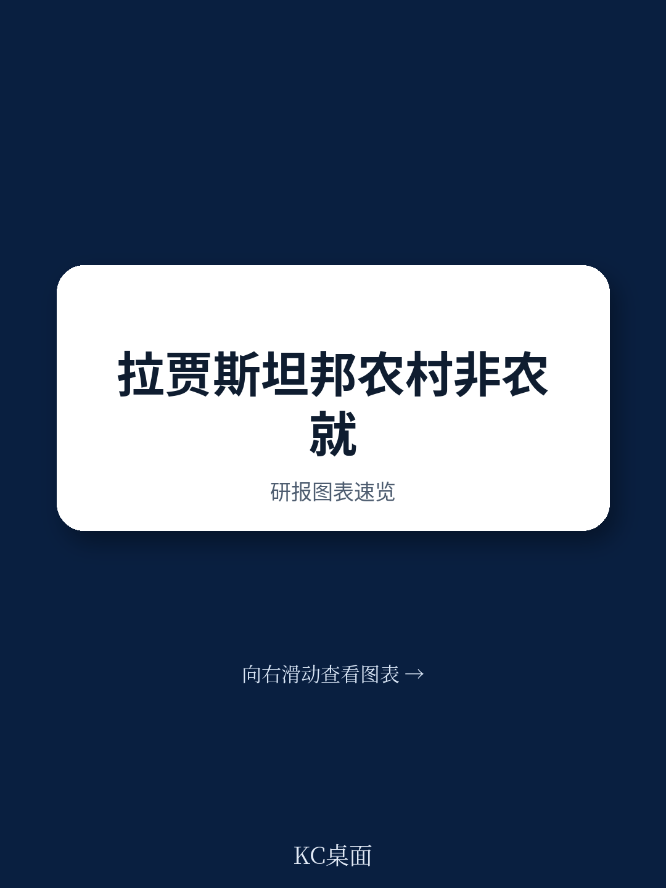
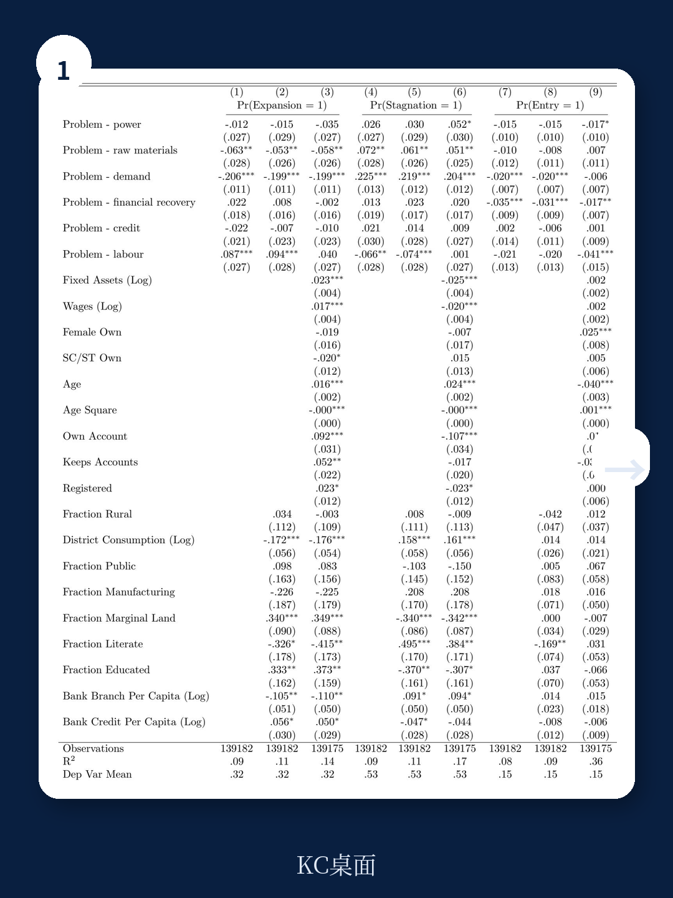
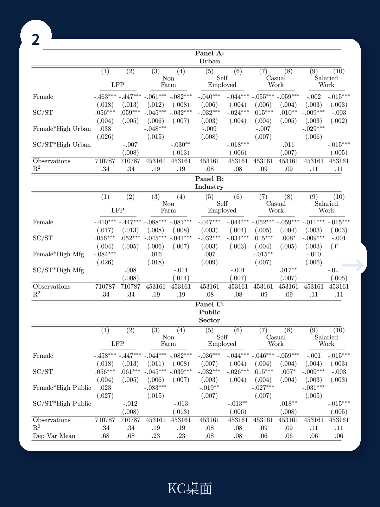

# 世界银行：印度农村非农就业的真正瓶颈不是机会，是教育与社会身份

这份来自世界银行的政策研究工作论文，聚焦印度拉贾斯坦邦的农村非农就业问题，但其核心发现对理解所有发展中经济体的农村转型都具有参考意义。报告的核心判断并不复杂：农村非农就业确实能显著提升家庭福利，但通向高质量非农岗位的路径，被教育、性别和社会身份这三重门槛牢牢卡住。机会在增长，但分配机制远未公平。

为什么现在要关注这份报告？因为全球正在经历一轮新的供应链重构与制造业迁移，而印度被普遍视为受益者之一。但农村劳动力能否从低附加值的农业或零工，顺利转入高附加值的正规非农岗位，决定了这一轮红利能否转化为可持续的内需增长。拉贾斯坦邦的案例，恰好提供了一个微观视角，让我们看清这个转化过程卡在了哪里。

报告选取了拉贾斯坦邦作为研究对象，并非偶然。这个邦有60%的土地被塔尔沙漠覆盖，年均降雨量仅为574毫米，远低于印度全国平均的1186毫米。农业的自然瓶颈极其明显，非农就业的转型压力远大于其他邦。报告利用1999年至2015年的多轮全国性调查数据，从个体、家庭、企业三个层面，系统分析了非农就业的决定因素、福利效应以及企业面临的约束。

**世界银行这份报告的真正价值，不在于告诉你非农就业有多重要，而在于它用数据证明了：教育、性别和种姓这三重变量，如何在看似相同的经济环境中，制造出截然不同的就业结果。**

> **KC评论：** 这里需要特别留意报告的一个关键设计——它不仅分析了个体特征（如教育水平）对就业的影响，还检验了个体特征与地区特征（如该地区的银行密度、制造业占比）之间的交互效应。这意味着，同样的教育水平，在基础设施好的地区和差的地区，回报率可能完全不同。这份报告为这种“环境乘数”效应提供了实证支撑。完整报告中的Table 2和Table 3详细展示了这些交互项的具体系数，值得细看。

## 1. 教育是进入正规非农就业最硬的通行证，但对弱势群体的回报存在明显折价

报告最清晰的结论之一是：完成中学教育（secondary education）是预测一个人能否进入非农就业，尤其是正规服务部门就业的最强个体变量。数据显示，拥有中学及以上学历的农村劳动者，获得正规非农工作的概率是仅受过小学教育者的三倍。

但这份报告没有止步于这个已知结论。它进一步检验了教育与社会身份（种姓）的交互作用。结果令人警惕：对于表列种姓和表列部落（SC/ST）的劳动者，即使完成了中学教育，他们进入正规非农就业的概率提升幅度，显著低于高种姓群体。换句话说，教育对弱势群体的回报率是打折的。

在2015年的数据中，教育变量的系数显示，受教育者进入正规非农就业的概率提升约14.3个百分点，但SC/ST群体与受教育变量的交互项系数为-0.041，意味着这一提升效应被显著削弱。教育并没有完全抹平社会身份的差距，只是在同一阶层内部制造了分化。

> **KC评论：** 报告中的Table C2给出了这一交互效应的具体回归结果。对于关注社会公平与人力资本投资回报率的读者，这张表是必读的。它揭示了一个残酷的现实：仅仅投资教育是不够的，如果不同时解决劳动力市场的结构性歧视，教育的扶贫效果会被稀释。完整报告还进一步区分了“正规非农就业”与“非正规非农就业”，两者的教育回报率差异巨大。

## 2. 女性的非农就业参与率不仅低，而且被“银行账户”这样的金融包容性指标反向锁定

报告对性别维度的分析同样提供了反直觉的洞察。拉贾斯坦邦的女性劳动力参与率从1993-94年的35%下降到了2011-12年的28%，这与男性向非农领域转移的趋势完全相反。报告认为，这背后既有文化规范的约束，也有缺乏适合女性就业岗位的结构性原因。

更值得关注的是报告对金融包容性（拥有银行账户）与女性就业关系的分析。直觉上，拥有银行账户应该有助于女性参与经济活动。但报告发现，对于女性而言，拥有银行账户与进入正规非农就业之间呈现负相关（交互项系数为-0.027）。报告给出的解释是：在拉贾斯坦邦的语境下，拥有银行账户的女性，更可能来自经济状况较好的家庭，而这些家庭的女性反而更少外出工作——因为文化规范允许她们“不工作”。

这意味着，金融包容性指标在女性就业问题上，可能不是一个简单的正向促进工具，它反映的是家庭经济地位与文化观念的复合影响。

> **KC评论：** 这个发现对于设计针对女性的就业促进政策非常重要。如果简单地认为给女性开个银行账户就能推动她们进入劳动力市场，可能会落空。报告中的Panel B表格详细展示了这一交互效应。完整报告对女性就业的讨论还涉及了家庭责任、季节性劳动需求等更细致的维度，这些在摘要中没有展开。

## 3. 非正规非农就业的福利效应与农业劳动几乎无异，真正的福利改善来自正规岗位

报告对福利效应的分析，区分了两种非农就业：正规就业（regular employment）和临时就业（casual employment）。结果非常明确：只有正规非农就业才能显著提升家庭消费水平。临时性的非农工作，其福利效应与农业劳动几乎没有差别。

这个结论对政策制定者来说是一个警示。过去很多农村发展政策鼓励“离土不离乡”，通过发展本地非农产业来吸纳剩余劳动力。但如果这些非农岗位都是低技能、低收入的临时工，那么它们并不能真正改善家庭福利，只是在统计上改变了就业结构。

报告在描述拉贾斯坦邦的非农就业结构时提到，传统手工艺和建筑业的就业增长很快，但大量岗位是季节性的、非正规的。这意味着，很多农村劳动力只是从“隐性失业”的农业转向了“显性低薪”的非农领域，福利改善有限。

## 4. 报告没有完全回答：正规就业的增量从哪里来？企业成长的天花板在哪里？

报告详细讨论了农村企业面临的约束，指出“缺乏本地需求”和“融资渠道有限”是两大核心瓶颈。但报告也坦诚，关于企业生命周期、成长轨迹和生存率的证据仍然不足。

这是报告的一个关键未解问题：既然正规非农就业的福利效应远超非正规就业，那么这些正规岗位的增量从哪里来？是现有企业扩张，还是新企业诞生？如果是现有企业扩张，它们需要什么样的政策环境？如果是新企业诞生，创业者的教育、社会资本和融资渠道如何匹配？

报告在数据部分提到，拉贾斯坦邦的农村非农企业中，大量是未注册的微型企业，它们游离于正规金融体系之外，也难以获得政府扶持。这些企业构成了非农就业的“长尾”，但它们中的大多数可能永远无法成长为能够提供正规就业的中型企业。

> **KC评论：** 报告的Table 4（在完整版中）展示了企业面临的各种约束的排序。但报告没有深入探讨的是：这些约束之间是否存在因果关系？例如，是否因为缺乏本地需求，才导致企业没有动力去申请贷款？还是因为贷不到款，才导致企业无法开拓市场？这个因果链条的梳理，对于政策设计的优先级排序至关重要。完整报告中的企业调查问卷和原始数据，或许能提供进一步拆解的线索。

## 5. 一个观察框架：用“教育-身份-地区”三维坐标，判断一个农村劳动力能否完成非农跃迁

综合报告的发现，我们可以提炼出一个用于观察和判断农村非农就业潜力的框架。这个框架包含三个维度：

第一，教育维度。中学教育是分水岭。低于这个门槛，劳动者大概率只能停留在农业或临时非农岗位。高于这个门槛，才有机会进入正规非农领域，但回报率受制于其他两个维度。

第二，社会身份维度。性别和种姓构成了第二道筛选。即使教育达标，女性和SC/ST群体进入正规岗位的概率仍然显著偏低。这意味着，任何只关注教育投入、不关注劳动力市场歧视的政策，都会产生“漏出效应”。

第三，地区维度。距离城市中心的远近、基础设施的完善程度、银行网点的密度，这些地区特征会放大或缩小个体教育和社会身份的效应。报告提到，距离主要城市50公里以内的农村地区，非农就业率比偏远地区高出40%。这说明，地理区位是一个乘数因子，而不是一个独立变量。

用这个三维坐标去评估一个区域的非农就业潜力，可以更精准地识别政策干预的优先级：是在教育端加大投入，还是在市场端消除歧视，还是在基建端缩短距离？不同地区、不同群体的答案应该不同。

**世界银行这份报告的核心贡献，不是提出了一个全新的理论，而是用严谨的实证方法，把那些我们“隐约知道但不精确”的直觉，变成了可量化的系数。它告诉我们：教育投资是必要的，但如果不解决社会身份和地区差异带来的回报率折价，投资效率会大打折扣。**

报告的结论对政策制定者和投资者都有启发。对于政策制定者，这意味着农村发展政策不能只盯着“就业数量”，更要关注“就业质量”和“就业公平”。对于投资者，这意味着在评估印度农村市场的消费潜力时，不能只看人均收入增长，还要看收入增长的结构——正规就业的增长才意味着稳定的消费升级，临时工的收入增长可能只是昙花一现。

但报告也留下了一个悬而未决的问题：正规非农就业的增量供给，究竟从哪里来？是依靠现有企业的转型升级，还是依靠新企业的涌现？如果是前者，需要什么样的金融和制度环境？如果是后者，创业者的教育、社会资本和融资渠道如何匹配？这些问题，报告没有完全回答。

每天，我们的AI agent会结合人工review，生成国际投行的中文摘要与KC评论，涵盖当天最新的数据图表合集，约10-40页。这些内容既方便喂给AI进行二次分析，也方便人工快速把握全球市场动态。如果你对这份世界银行报告中关于企业成长约束的详细回归结果、或者对教育-身份交互效应的原始数据感兴趣，欢迎加入我们的社群，领取完整研报解读与原始图表，与更多产业决策者一起讨论。

Personal reading notes and learning share only. Not investment advice.

