# Seeds of Change

## The Impact of Ethiopia's Direct Seed Marketing Approach on Smallholders' Seed Purchases and Productivity

Dawit Mekonnen

Gashaw T. Abate

Seid Yimam

Rui Benfica

David J. Spielman

Frank Place

POLICY RESEARCH WORKING PAPER 11078

## Abstract

Several factors contribute to the limited use of improved seed varieties in Ethiopia. Among those, on the supply side, is the restricted availability of seeds in the volume, quality, and timeliness required by farmers, partly due to inadequate public and private investment in the sector. Beginning in 2011, the Government of Ethiopia introduced a novel experiment—the direct seed marketing approach—to reduce some of the centralized, state-run attributes of the country's seed market and rationalize the use of public resources. Direct seed marketing was designed to incentivize private and public seed producers to sell directly to farmers rather than through the state apparatus. This study is the first quantitative evaluation of the impact of direct seed marketing on indicators of a healthy seed system: access to quality seeds and farm-level productivity. Using a quasi-experimental difference-in-differences approach suitable to handling variation in treatment timing, the study finds that direct seed marketing led to an increase of 15 percentage points in the proportion of farmers purchasing maize seed, an increase of 45 percent in the quantity of maize seed purchased per hectare, and an increase of 18 percent in maize yield. However, there are differences across crops, with the effects of direct seed marketing on wheat seed purchases and yields being statistically insignificant. These crop-specific differences in performance are likely explained by differences in the reproductive biology of maize (particularly maize hybrids) and wheat, which tend to incentivize commercial activity in hybrid maize seed markets more than in self-pollinating wheat or open-pollinated maize markets. These differences suggest a need for nuanced policy responses, institutional arrangements, and market development strategies to accelerate the adoption of improved varieties.

# Seeds of Change: The Impact of Ethiopia's Direct Seed Marketing Approach on Smallholders' Seed Purchases and Productivity $^{1}$

Dawit Mekonnen, Gashaw T. Abate, Seid Yimam, Rui Benfica, David J. Spielman, and Frank Place

Keywords: Crop yield, Direct seed marketing, Ethiopia, seed system.

JEL classification: Q120; Q130

## 1 Introduction

As in much of Sub-Saharan Africa, agriculture is a critical sector in the Ethiopian economy. One of the key challenges the sector faces is low crop productivity, partly due to low adoption rates of improved crop technologies (Dorosh and Rashid 2013), notably productivity-enhancing improved varieties, quality seeds, complementary inputs, and management practices. Although Ethiopia experienced an increase in the adoption of improved varieties for its main cereal crops between 2010 and 2019, less than a quarter of all smallholders were using improved varieties in 2019, with a relatively higher concentration among maize producers (57 percent) and wheat producers (17 percent) (CSA 2020). Both improved variety adoption and seed replacement rates are lower for most other crops in Ethiopia (Mekonen et al. 2019). $^{2}$

Low rates of improved variety adoption and seed replacement are often associated with demand and supply constraints in the seed market. On the demand side, seed market performance is often constrained by farmers' limited awareness of traits embodied in an improved variety or by other well-documented factors such as credit and liquidity constraints, their perceptions of production and market risks or climate uncertainty, and a range of behavioral factors (Alemu, 2011; Alemu, Rashid, and Tripp 2010; Spielman and Mekonnen 2013). On the supply side, improved varieties or quality seeds are either not available at all, not supplied at the right quantity, time, or location, or do not embody the traits desired by the farmer (Alemu and Tripp 2010; Cavatassi, Lipper, and Narloch 2011; EIAR 2020; Mekonen et al. 2019; Singh et al. 2020; Spielman and Mekonnen 2013).

Ethiopia's seed market faces additional, distinct supply-side constraints. The seed sector remains largely state-controlled, with public enterprises managing crop breeding, multiplication, and seed distribution to farmers in an end-to-end system that historically offered few opportunities for private investment at any point in the supply chain (Spielman and Mekonnen 2013). Since 2011, the Government of Ethiopia, working closely with Wageningen UR, CGIAR, and other partners, has experimented with seed market liberalization to allow firms to market seed directly to farmers rather than through the state's rural administrative apparatus. This Direct Seed Marketing (DSM) approach aimed to increase and sustain the supply of improved varieties and quality seed to farmers while rationalizing the use of public resources allocated to the distribution of seed to fragmented, spatially dispersed, resource-poor smallholders that make up the vast majority of farmers (MoA/ATA 2016).

Since DSM's launch in 2011, several governmental entities—the Agricultural Transformation Agency (ATA), the Ministry of Agriculture (MoA), the regional bureaus of agriculture, development projects such as the Integrated Seed Sector Development (ISSD) initiative—have promoted and closely monitored its implementation. Benson, Spielman, and Kasa (2014) conducted an operational evaluation of the pilot DSM program and found encouraging results, ultimately recommending that the government stay the course and advance the seed sector reform process. Mekonen et al. (2019) conducted a descriptive analysis of DSM's key performance indicators, including seed availability, quality, sufficiency, price competitiveness, supply timeliness, and accountability. Their analysis documented mixed results, including differences in performance across regions and crops.

However, to date, there has been no rigorous assessment of DSM's impact on the amount of fresh seed purchased by farmers, a first-order performance indicator. Nor has there been any assessment of DSM's impact on key outcomes, such as changes in farm-level productivity. The availability of three rounds of household-level panel data from DSM and non-DSM woredas (districts) in 2012 (the beginning of DSM's pilot phase), 2016, and 2019 (after the program had expanded to more than two hundred districts) provides an opportunity to fill this gap in the evaluative literature on DSM.

This study exploits the staggered scale-up of the DSM approach over time, across districts, and in crop coverage. Using a quasi-experimental difference-in-differences econometric approach, the study finds that DSM led to a 14-percentage-point increase in the proportion of farmers purchasing maize seed, a 45 percent increase in the quantity of maize seed purchased per hectare, and an 18 percent increase in maize yield. However, the effects of DSM on seed purchase and yields are not statistically significant for wheat. The results suggest caution in scaling the DSM approach, particularly for self-pollinating crops such as wheat and open-pollinated varieties (OPVs) of maize (as opposed to hybrid maize), especially in the initial stages of implementation. While the pro-market dimension of these findings is relatively straightforward for maize—DSM for hybrid maize succeeds because farmers need to purchase fresh seed each season to capture the yield gains conferred by heterosis, a trait absent in other major crops in Ethiopia—it raises important questions about how markets for other crops will attract private investment from seed companies and how the government can reallocate budgetary resources to other development priorities.

This paper is structured as follows. Section 2 describes the conventional public seed distribution system and the key features and evolution of the DSM approach. Section 3 discusses the data and presents descriptive results. Section 4 outlines the econometric model underlying the evaluation, and section 5 presents the empirical results. Section 6 discusses the findings, and section 7 concludes with a discussion of policy implications and final remarks.

## 2 Public Seed Distribution and DSM in Ethiopia

Following the reforms to agricultural input systems and markets that began in the 1990s in Ethiopia (Dorosh and Rashid 2013), seed production and distribution were, at least in principle, opened to the private sector. In reality, however, Ethiopia's seed sector remained highly concentrated and heavily dominated by public actors such that, by 2004, no more than eight firms were active in seed production (Alemu et al., 2007), with most of them involved exclusively in hybrid maize seed multiplication and not in distribution or retail activities (Langyintuo et al. 2010). Even Pioneer, the sole multinational company present in Ethiopia's seed market for nearly three decades, $^{3}$ produced its hybrids locally and relied primarily on the public distribution system to reach farmers (Spielman and Mekonnen, 2013). Federal and regional extension and input supply agencies accounted for 80 percent of total sales of improved varieties, mostly financed with credit disbursed against public guarantees (World Bank 2006). Most private sector seed producers acted as subcontractors to the state-owned Ethiopian Seed Enterprise (ESE), which distributed seed through the regional extension system, cooperatives, and local administration.

The entire seed system supplied seed to farmers based on official demand projections, which were formally estimated at the local administrative level, aggregated upward through official channels to the regional level, and then further consolidated at the national level. These projections determined the type of varieties and quantity of seed to be produced by ESE and its partners and subsequently distributed back to farmers (Spielman and Mekonnen 2013).

Likewise, promoting new varieties and certified seeds were largely the mandate of public extension and administrative entities at the district and kebele levels (Alemu and Bishaw 2016; Spielman and Mekonnen 2013). $^{4}$ Many studies of Ethiopia’s seed system highlight the numerous bottlenecks and challenges associated with intensive state management. These include inaccurate and often ad hoc demand assessments resulting in persistent mismatches between demand and supply, large carryovers of unsold seed between seasons and years, late seed delivery to farmers, high seed prices relative to farmers’ purchasing power, and seed quality issues, among other problems (Alemu, Rashid, and Tripp 2010; Atilaw and Korbu 2012; DSA 2006; EEA/EEPRI 2006; EIAR 2020; Sahlu and Kahsay 2002; Spielman and Mekonnen 2013).

Despite the eventual emergence of a somewhat favorable policy and regulatory environment for private sector development—including a plant breeders’ rights law that came into effect in 2006 (FDRE 2006)—efforts to attract private investors to Ethiopia’s seed sector to address public sector shortcomings have been severely constrained by several factors. The primary constraint to attracting private investment is the continued existence of the state-led seed system, including the introduction of several state-owned regional seed enterprises in the early 2010s, in addition to ESE, which has effectively crowded out private sector participation. To compete in this market, private investors must invest not only in seed production but also in building distribution and marketing networks capable of competing with the public sector’s system, the low nominal prices (and declining real prices) of ESE seed, and the indirect costs of navigating the regulatory system, accessing financing from a risk-averse banking sector, and meeting high collateral requirements in financial markets (ESA, 2018; Husmann 2015; Spielman et al. 2010, 2012).

Aware of these constraints and the burden the state-run system imposed on scarce public budgetary resources, the Government of Ethiopia began experimenting with the DSM approach in the early

2010s. The DSM approach was piloted by the Integrated Seed Sector Development (ISSD) initiative, a project led by Wageningen UR, in two districts of the Amhara region. In 2012, seven additional districts were brought under DSM, while the two original districts in Amhara briefly suspended the program in 2012 but resumed it in 2013 (Mekonen et al. 2019). In 2013, the ATA and MoA expanded the approach to cover additional districts.

The DSM rollout coincided with three rounds of the Ethiopian Agricultural Commercialization Clusters (ACC) survey, the main data source used in this study (and described in the next section). The first ACC round was conducted in 2012, followed by a second round in 2016 and a third in 2019. By 2016, the number of DSM districts had reached 100, and by 2019, it had expanded to 290 across Ethiopia's four main agricultural regions (Amhara, Oromia, Tigray, and the Southern Nations, Nationalities, and Peoples (SNNP) regional state), covering about 43 percent of Ethiopia's 670 rural districts. Only one district from the initial DSM rollout in 2011-12 was included in the 2012 ACC survey round. Due to the lack of pre-intervention data, this district was excluded from the analysis.

The number of crops covered by DSM increased from one crop (maize) in 2011 to ten crops in 2019 (barley, chickpea, faba bean, horse bean, lentil, maize, sesame, sorghum, teff, and wheat), even though maize and wheat represented 98 percent of seed marketed through DSM. DSM has also grown considerably in the number of private agents (individual input dealers) participating in seed marketing over the years, from 29 in 2012 to about 1,400 in 2019 (Table 1). The approach continues to be used today.

Table 1. Evolution of the DSM approach (2011 - 2019)

<table><tr><td>Year</td><td>2011</td><td>2012</td><td>2013</td><td>2014</td><td>2015</td><td>2016</td><td>2017</td><td>2018</td><td>2019</td></tr><tr><td>No. of districts</td><td>2</td><td>7</td><td>33</td><td>54</td><td>83</td><td>100</td><td>132</td><td>228</td><td>290</td></tr><tr><td>No. of seed providers/agents</td><td>NA</td><td>29</td><td>124</td><td>294</td><td>456</td><td>650</td><td>800</td><td>1163</td><td>1400</td></tr><tr><td>No. of crops</td><td>1</td><td>1</td><td>1</td><td>4</td><td>6</td><td>6</td><td>7</td><td>8</td><td>10</td></tr></table>

Source: ATA (2020).  
Note: NA = not available.

DSM aims to develop a dynamic, effective, and well-regulated seed sector that provides farmers with timely access to varied, sufficient, affordable, and high-quality seed at competitive prices (Benson, Spielman, and Kasa 2014). Under DSM, both public and private seed producers are authorized to market seed directly to farmers through multiple channels such as primary cooperatives, individual or private agents, and their own trading outlets.

The model distinguishes itself from the conventional seed marketing system in many ways. First, it allows both public and private seed producers to conduct their own demand assessments and then multiply and sell seed in accordance with their assessment of the market. This is intended to address demand and supply mismatches and costly inventory carryovers and shortfalls. Second, DSM aims to considerably shorten the seed distribution chain by allowing seed producers to market directly to farmers, thereby reducing transaction costs associated with the public distribution system. Third, DSM seeks to create a competitive seed market at the final stage of distribution by allowing seed producers to promote their seed and to compete with other seed producers based on price, traits, quality, timeliness of delivery, after-sales service, and other attributes. Fourth, DSM potentially improves seed traceability, providing an accountability mechanism that renders seed producers (instead of extension agents) directly responsible to farmers for seed quality. This accountability mechanism is as important for extension agents as it is for farmers and seed providers: by removing extension agents from the seed exchange equation, extension agents reduce their exposure to reputational risks that accompany the distribution of poor-quality seed to farmers under the conventional state-led distribution system (Benson, Spielman, and Kasa 2014; Mekonen et al. 2019).

DSM's commercial orientation also aims to free up scarce public resources and reduce the time demands on seed system experts, allowing them to focus on improving the overall seed system and broaden the extension service in Ethiopia (Mekonen et al. 2019). For instance, DSM removes extension agents from assessing seed demand and distributing seed to farmers, allowing them to focus on providing better quality and more timely advisory services. Similarly, DSM removes seed system experts in the public sector from similar tasks, providing opportunities to reassign them to varietal development, quality assurance, and other necessary functions. Thus, DSM offers an opportunity to reallocate scarce public resources to activities necessary to make seed markets work effectively and efficiently for farmers and seed producers.

Since its inception, the DSM program's performance has been frequently monitored and assessed to gauge its impact on the timely provision of quality seed to farmers in appropriate quantities and at competitive prices. While results from operational assessments have been critical in informing government actors—who were initially hesitant to concede seed marketing responsibilities to private agents and facilitate the program’s expansion—these assessments do not examine higher-order outcomes such as crop productivity. This study aims to fill this important empirical gap.

## 3 Data and Descriptive Statistics

We used three rounds of the Ethiopian Agricultural Commercialization Clusters (ACCs) panel survey, which interviewed a total of 13,302 rural households in 221 districts across the four agriculturally important regions (Amhara, Oromia, Tigray, and SNNP) in 2012, 2016, and 2019. The coverage of the ACC survey expanded between 2012 and 2019 both across districts and households following the program expansion. The number of sample districts increased from 99 in 2012 to 153 in 2016 and 154 in 2019. Similarly, the number of sample households increased from 3,000 in 2012 to 4,991 in 2016 and 5,311 in 2019. Despite the gradual expansion of the sample, about 74 percent of the households (9,769 observations) were re-interviewed in at least two survey rounds. The sample households were selected following a three-stage sampling procedure. First, the districts were stratified into ACCs defined by the ATA, and five sample districts were randomly selected from each ACC. Second, two kebeles were randomly selected from each district to be part of the surveys. Finally, in the third stage, 15 farm households were randomly selected from each sample kebele based on household lists maintained by local administrations. In addition, about 20 percent of the sample was selected from neighboring districts outside the ACCs using the same three-stage sampling procedure. Thus, the survey was designed with the secondary aim of generating results that are representative at the national level, at least for the four main regions that account for more than 90 percent of the agricultural production in Ethiopia (Bachewe, Koru, and Taffesse 2018). The analysis in this study uses data from 4,315 distinct households in 206 districts that produced maize or wheat at least twice in any of the three survey rounds. We also used administrative records from the ATA to define DSM adoption cohorts in the survey districts by crops.

Table A1 in the appendix presents the characteristics of sample households. Most households are male headed (about 90 percent), and the average household head is about 47 years old and completed less than four years of formal education. The average household consists of six members, owns 1.8 hectares of land, and keeps two oxen. On average, about 46 percent of sample households are members of agricultural cooperatives and use 82 kgs of fertilizer each year. The mean comparison tests between treatment (DSM) and control (non-DSM) households show statistically significant differences for several household characteristics, especially among DSM cohorts from 2014 to 2019. We account for those variables in the main analysis, which is discussed in the next section.

Next, we examine the descriptive statistics for our outcomes of interest—seed purchases and crop yields. Table 2 summarizes the descriptive results for the binary measure of fresh seed purchases (extensive margin) and the quantity of seed purchased per hectare (intensive margin) for maize and wheat, disaggregated by DSM status, cohorts, and survey rounds. Two key insights emerge here. First, post-treatment differences relative to the pre-treatment 2012 baseline are more pronounced and strongly significant in 2019 compared to 2016. For example, four out of the seven treated cohorts reported a higher quantity of maize seed purchases per hectare in 2019 compared to 2012, whereas only one treated cohort showed an increase in 2016. On the extensive margin, all but one treated cohort reported an increase in the share of farmers purchasing maize seed in 2019 compared to 2012, while three cohorts showed no change in 2016. Second, increases in seed purchases, both on the extensive and intensive margins, are more common and strongly significant for maize than for wheat. For instance, none of the treated cohorts showed increases in wheat seed purchases on the extensive margin in 2019 compared to 2012, while only two cohorts exhibited increases in 2016. On the intensive margin, only one treated cohort in 2016 and one in 2019 demonstrated higher wheat seed purchases per hectare compared to 2012.

Table 2. Seed purchased over the survey years and DSM cohorts

<table><tr><td rowspan="3">Cohorts</td><td rowspan="3">Statistics</td><td colspan="6">Seed purchase (binary)</td><td colspan="6">Seed purchase (kg/ha)</td></tr><tr><td colspan="3">Maize</td><td colspan="3">Wheat</td><td colspan="3">Maize</td><td colspan="3">Wheat</td></tr><tr><td>2012</td><td>2016</td><td>2019</td><td>2012</td><td>2016</td><td>2019</td><td>2012</td><td>2016</td><td>2019</td><td>2012</td><td>2016</td><td>2019</td></tr><tr><td rowspan="3">Control</td><td>Mean</td><td>0.38</td><td>0.49***</td><td>0.44***</td><td>0.22</td><td>0.24</td><td>0.19*</td><td>12.9</td><td>12.8</td><td>12.1</td><td>35.2</td><td>28.5</td><td>25.5**</td></tr><tr><td>SD</td><td>0.48</td><td>0.50</td><td>0.49</td><td>0.4</td><td>0.43</td><td>0.39</td><td>30.4</td><td>23.4</td><td>19.9</td><td>114.0</td><td>66.6</td><td>66.9</td></tr><tr><td>Obs.</td><td>651</td><td>977</td><td>712</td><td>435</td><td>702</td><td>946</td><td>651</td><td>977</td><td>712</td><td>435</td><td>702</td><td>946</td></tr><tr><td rowspan="3">2013</td><td>Mean</td><td>0.73</td><td>0.68</td><td>0.81</td><td></td><td></td><td></td><td>15.6</td><td>16.0</td><td>23.9**</td><td></td><td></td><td></td></tr><tr><td>SD</td><td>0.44</td><td>0.46</td><td>0.39</td><td></td><td></td><td></td><td>20.7</td><td>25.5</td><td>29.1</td><td></td><td></td><td></td></tr><tr><td>Obs.</td><td>42</td><td>67</td><td>59</td><td></td><td></td><td></td><td>42</td><td>67</td><td>59</td><td></td><td></td><td></td></tr><tr><td rowspan="3">2014</td><td>Mean</td><td>0.71</td><td>0.82*</td><td>0.95***</td><td>0.05</td><td>0.28**</td><td>0.00</td><td>16.8</td><td>22.3*</td><td>24.4**</td><td>8.0</td><td>36.9*</td><td>0.0</td></tr><tr><td>SD</td><td>0.45</td><td>0.38</td><td>0.20</td><td>0.22</td><td>0.45</td><td>0.00</td><td>19.1</td><td>23.8</td><td>18.5</td><td>35.7</td><td>76.2</td><td>0.0</td></tr><tr><td>Obs.</td><td>46</td><td>134</td><td>96</td><td>20</td><td>25</td><td>22</td><td>46</td><td>134</td><td>96</td><td>20</td><td>25</td><td>22</td></tr><tr><td rowspan="3">2015</td><td>Mean</td><td>0.69</td><td>0.70</td><td>0.92***</td><td>0.28</td><td>0.33</td><td>0.33</td><td>16.2</td><td>15.7</td><td>17.8</td><td>44.1</td><td>54.2</td><td>72.4***</td></tr><tr><td>SD</td><td>0.46</td><td>0.4</td><td>0.25</td><td>0.45</td><td>0.47</td><td>0.47</td><td>18.9</td><td>16.8</td><td>14.8</td><td>83.0</td><td>94.8</td><td>129.4</td></tr><tr><td>Obs.</td><td>81</td><td>110</td><td>167</td><td>152</td><td>149</td><td>191</td><td>81</td><td>110</td><td>167</td><td>152</td><td>149</td><td>191</td></tr><tr><td rowspan="3">2016</td><td>Mean</td><td>0.53</td><td>0.67**</td><td>0.75***</td><td>0.31</td><td>0.66***</td><td>0.44</td><td>26.0</td><td>17.8</td><td>17.1</td><td>48.0</td><td>109.3**</td><td>68.0</td></tr><tr><td>SD</td><td>0.50</td><td>0.4</td><td>0.43</td><td>0.47</td><td>0.47</td><td>0.50</td><td>101.4</td><td>28.8</td><td>14.2</td><td>81.3</td><td>112.4</td><td>97.9</td></tr><tr><td>Obs.</td><td>62</td><td>78</td><td>105</td><td>16</td><td>66</td><td>45</td><td>62</td><td>78</td><td>105</td><td>16</td><td>66</td><td>45</td></tr><tr><td rowspan="3">2017</td><td>Mean</td><td>0.52</td><td>0.55</td><td>0.78***</td><td>0.33</td><td>0.32</td><td>0.35</td><td>12.8</td><td>13.7</td><td>15.6</td><td>61.0</td><td>50.1</td><td>50.9</td></tr><tr><td>SD</td><td>0.50</td><td>0.49</td><td>0.41</td><td>0.47</td><td>0.46</td><td>0.48</td><td>19.4</td><td>17.1</td><td>12.7</td><td>108.0</td><td>94.2</td><td>97.6</td></tr><tr><td>Obs.</td><td>109</td><td>158</td><td>87</td><td>90</td><td>149</td><td>70</td><td>109</td><td>158</td><td>87</td><td>90</td><td>149</td><td>70</td></tr><tr><td rowspan="3">2018</td><td>Mean</td><td>0.23</td><td>0.38***</td><td>0.61***</td><td>0.48</td><td>0.38</td><td>0.45</td><td>7.9</td><td>10.4</td><td>15.5***</td><td>66.5</td><td>64.6</td><td>78.6</td></tr><tr><td>SD</td><td>0.42</td><td>0.48</td><td>0.48</td><td>0.50</td><td>0.48</td><td>0.50</td><td>20.3</td><td>24.1</td><td>19.2</td><td>85.0</td><td>96.0</td><td>101.0</td></tr><tr><td>Obs.</td><td>108</td><td>181</td><td>168</td><td>52</td><td>112</td><td>91</td><td>108</td><td>181</td><td>168</td><td>52</td><td>112</td><td>91</td></tr><tr><td rowspan="3">2019</td><td>Mean</td><td>0.30</td><td>0.48***</td><td>0.50***</td><td>0.33</td><td>0.31</td><td>0.25</td><td>11.4</td><td>13.9</td><td>15.4*</td><td>63.2</td><td>33.5*</td><td>47.0</td></tr><tr><td>SD</td><td>0.46</td><td>0.50</td><td>0.50</td><td>0.48</td><td>0.46</td><td>0.43</td><td>35.5</td><td>19.3</td><td>24.6</td><td>114.2</td><td>62.0</td><td>86.4</td></tr><tr><td>Obs.</td><td>160</td><td>206</td><td>283</td><td>21</td><td>76</td><td>48</td><td>160</td><td>206</td><td>283</td><td>21</td><td>76</td><td>48</td></tr><tr><td rowspan="3">All DSM</td><td>Mean</td><td>0.47</td><td>0.58***</td><td>0.71***</td><td>0.32</td><td>0.37*</td><td>0.34</td><td>13.9</td><td>15.2</td><td>17.5**</td><td>51.1</td><td>58.1</td><td>64*</td></tr><tr><td>SD</td><td>0.50</td><td>0.49</td><td>0.45</td><td>0.47</td><td>0.48</td><td>0.48</td><td>40.44</td><td>22.1</td><td>20.3</td><td>91.1</td><td>94.7</td><td>110.4</td></tr><tr><td>Obs.</td><td>608</td><td>934</td><td>965</td><td>351</td><td>577</td><td>467</td><td>608</td><td>934</td><td>965</td><td>351</td><td>577</td><td>467</td></tr></table>

Note: \*, \*\*, \*\*\* indicate t statistical significance at the 10%, 5%, and 1% level, respectively, for differences between 2012 and 2016, and between 2012 and 2019, in the proportion of farmers who purchased seed (1 = yes, 0 = no) and the amount of seed purchase (kg/ha). SD refers to standard deviation. 2012 refers to the baseline period before the DSM approach was scaled up.

The descriptive results on crop yields show clear differences across survey rounds (Table 3). While the results show a significant improvement in both maize and wheat yields in 2019 compared to 2012, yields declined or improved only marginally for most cohorts in 2016. The El Niño drought of 2015-16 may have contributed to the lack of improvements in crop yields in the 2016 survey round. In addition, although wheat yields improved significantly in 2019 compared to 2012 for all cohorts except one, similar improvements were also observed among the control groups, suggesting drivers of yield growth other than DSM. In contrast, maize yield improvements were observed across all treated cohorts in at least one post-treatment survey year, with no similar yield increases in the control group.

Table 3. Crops' yield (kg/ha) over the survey years and DSM cohorts

<table><tr><td rowspan="2">Cohorts</td><td rowspan="2">Statistics</td><td colspan="3">Maize</td><td colspan="3">Wheat</td></tr><tr><td>2012</td><td>2016</td><td>2019</td><td>2012</td><td>2016</td><td>2019</td></tr><tr><td rowspan="3">Control</td><td>Mean</td><td>2288.1</td><td>2338.4</td><td>2187.2</td><td>2087.1</td><td>2086.7</td><td>2396.6***</td></tr><tr><td>SD</td><td>1716.7</td><td>1789.3</td><td>1661.6</td><td>1725.8</td><td>1699.1</td><td>1725.6</td></tr><tr><td>Obs.</td><td>651</td><td>977</td><td>712</td><td>435</td><td>702</td><td>946</td></tr><tr><td rowspan="3">2013</td><td>Mean</td><td>3646.3</td><td>2899.6**</td><td>3700.6</td><td></td><td></td><td></td></tr><tr><td>SD</td><td>2287.9</td><td>1900.8</td><td>2060.7</td><td></td><td></td><td></td></tr><tr><td>Obs.</td><td>42</td><td>67</td><td>59</td><td></td><td></td><td></td></tr><tr><td rowspan="3">2014</td><td>Mean</td><td>3414.6</td><td>2949.5*</td><td>3661.0</td><td>2162.0</td><td>2347.2</td><td>2603.0**</td></tr><tr><td>SD</td><td>1980.3</td><td>2134.6</td><td>2032.1</td><td>1301.1</td><td>1799.1</td><td>1787.4</td></tr><tr><td>Obs.</td><td>46</td><td>134</td><td>96</td><td>20</td><td>25</td><td>22</td></tr><tr><td rowspan="3">2015</td><td>Mean</td><td>2972.5</td><td>3108.9</td><td>3868.0***</td><td>2317.9</td><td>2232.0</td><td>2714.7**</td></tr><tr><td>SD</td><td>2022.6</td><td>1740.1</td><td>2074.1</td><td>1810.1</td><td>1742.8</td><td>1918.1</td></tr><tr><td>Obs.</td><td>81</td><td>110</td><td>167</td><td>152</td><td>149</td><td>191</td></tr><tr><td rowspan="3">2016</td><td>Mean</td><td>2326.0</td><td>2770.1*</td><td>3241.2***</td><td>1455.0</td><td>1658.8</td><td>2320.6**</td></tr><tr><td>SD</td><td>1641.3</td><td>1620.1</td><td>1869.8</td><td>1424.7</td><td>1343.8</td><td>1536.9</td></tr><tr><td>Obs.</td><td>62</td><td>78</td><td>105</td><td>16</td><td>66</td><td>45</td></tr><tr><td rowspan="3">2017</td><td>Mean</td><td>2556.3</td><td>2895.8*</td><td>2816.9</td><td>1800.7</td><td>2090.7*</td><td>2939.9**</td></tr><tr><td>SD</td><td>1695.2</td><td>1815.7</td><td>1879.5</td><td>1082.5</td><td>1645.3</td><td>2117.6</td></tr><tr><td>Obs.</td><td>109</td><td>158</td><td>87</td><td>90</td><td>149</td><td>70</td></tr><tr><td rowspan="3">2018</td><td>Mean</td><td>2145.6</td><td>2097.0</td><td>2692.7***</td><td>2524.2</td><td>1301.9***</td><td>2039.8**</td></tr><tr><td>SD</td><td>1507.3</td><td>1642.0</td><td>1620.7</td><td>1687.5</td><td>1282.3</td><td>1478.1</td></tr><tr><td>Obs.</td><td>108</td><td>181</td><td>168</td><td>52</td><td>112</td><td>91</td></tr><tr><td rowspan="3">2019</td><td>Mean</td><td>1979.8</td><td>2221.8*</td><td>2520.1***</td><td>1407.7</td><td>1601.7</td><td>2088.8***</td></tr><tr><td>SD</td><td>1490.4</td><td>1813.9</td><td>1715.6</td><td>999.1</td><td>1183.0</td><td>1536.1</td></tr><tr><td>Obs.</td><td>160</td><td>206</td><td>283</td><td>21</td><td>76</td><td>48</td></tr><tr><td rowspan="3">All DSM</td><td>Mean</td><td>2503.9</td><td>2615.0</td><td>3074.4***</td><td>2113.2</td><td>1871.4**</td><td>2509.4***</td></tr><tr><td>SD</td><td>1797.1</td><td>1850.9</td><td>1924.5</td><td>1575.0</td><td>1564.5</td><td>1817.0</td></tr><tr><td>Obs.</td><td>608</td><td>934</td><td>965</td><td>351</td><td>577</td><td>467</td></tr></table>

Note: \*, \*\*, \*\*\* indicate statistical significance at the 10%, 5%, and 1% levels, respectively, for the difference between 2012 and 2016 and 2012 and 2019, in crop yields. SD refers to standard deviation. 2012 refers to the baseline period before DSM.

Overall, these descriptive findings suggest that the impact of DSM on seed purchases and yields may be greater for maize than for wheat and more evident in the 2019 survey round than in 2016. However, it is essential to account for changes in the comparison groups relative to the treated cohorts, rather than focusing solely on the progression of the outcome variables for a cohort over time. We explore this in the next section.

## 4 Empirical Model

The ACC survey covers districts introduced to DSM at different times: five in 2013, eight in 2014, seven each in 2015 and 2016, nine in 2017, and 20 each in 2018 and 2019. This staggered rollout allows us to use the Callaway and Sant'Anna (2021) Difference-in-Differences method (CSDID), which accommodates variation in treatment timing, a defining characteristic of our sample. CSDID also allows the parallel trends assumption to hold, conditional on a vector of pre-treatment covariates that explain the evolution of outcomes without DSM treatment.

Following Callaway and Sant'Anna (2021), the basic CSDID framework is presented as follows. Let $Y_{it}$ denote the outcome variable (such as seed purchases or yield) for household i at time t, for i=1, 2, ..., N and t=1, 2, ..., T. Define $D_{it}$ as the treatment status, taking a value of 1 if household i resides in a DSM district at time t, and 0 otherwise. $G_{ig}$ indicates treatment cohorts or groups, equaling 1 if the household lives in a district first treated to DSM at time g, and 0 otherwise. C represents a “never-treated” comparison group, identifying households that were never treated between 2012 and 2019. Once treated, districts remain under DSM, satisfying the CSDID assumption of treatment persistence.

$X_{i}$ denotes pre-treatment control variables (fertilizer use, oxen ownership, household size, gender, and age of the household head) that are either time-invariant or, in the case of continuous variables, refer to the pre-treatment period. The parallel trend assumption under CSDID will be conditional on $X_{i}$ , and the use of pre-treatment levels as controls ensures that their values are not affected by the treatment. This conditional parallel trend assumption adjusts for the fact that outcome variables are likely to evolve differently across households with different observed pre-treatment characteristics in the absence of DSM.

With the availability of the $X_{i}$ variables, several options exist to estimate average treatment effects. The first is the regression adjustment procedure, in which the difference in the outcome variable in the post- and pre-treatment periods of the comparison group is modeled as a function of $X_{i}$ , and the fitted values are used to compute the average treatment effect on the treated units of cohort g at time t, ATT (g, t). The second is the inverse probability weighting procedure, which models the propensity score—the probability of units being in the group—as a function of the variables without directly modeling outcome evolution. The third is the doubly robust DID estimator, which is used in this study and relies on the correct specification of either regression adjustments or inverse probability weighting (Callaway and Sant'Anna, 2021). CSDID assumes “no treatment anticipation,” that is, DSM does not affect the outcome variables before the intervention starts. This assumption allows us to focus on post-treatment (t > g) effects. The average treatment effect of DSM at time t for households in districts first introduced to the program at time g, ATT (g, t), can be given as:

$$
A T T (g, t) = E \big [ Y _ {t} (g) - Y _ {t} (0) \big | G _ {g} = 1 \big ], f o r t \geq g.\tag{1}
$$

The outcome variable for the $g^{th}$ cohort at time t post-treatment ( $E[Y_{t}(g)|G_{g}=1]$ ) is observable, but the counterfactual outcome for the same cohort without treatment ( $E[Y_{t}(0)|G_{g}=1]$ ) cannot be directly observed. Estimating this value requires a reliance on the parallel trend assumption. The conditional parallel trend assumption, based on a “never-treated” group (C=1) for each $t\in\{2,\ldots,T\}$ and post-treatment period ( $t\geq g$ ) can be given as follows:

$$
E \big [ Y _ {t} (0) - Y _ {(t - 1)} (0) \big | X, G _ {g} = 1 \big ] = E \big [ Y _ {t} (0) - Y _ {(t - 1)} (0) \big | X, C = 1 \big ].\tag{2}
$$

The parallel trend assumption states that the outcome variable's trajectory for cohort $g$ , without treatment, is the same as that of the never-treated group. The use of the “never-treated” control group does not make parallel pre-trend assumptions, making it a preferred control over the “not-yet-treated” group. The CSDID approach then simplifies the estimation to a 2x2 canonical DID. If the parallel trend assumption holds unconditionally, for example, $ATT(g, t)$ can be derived as:

$$
A T T (g, t) = E \big [ Y _ {t} - Y _ {(g - 1)} \big | G _ {g} = 1 \big ] - E \big [ Y _ {t} - Y _ {(g - 1)} \big | C = 1 \big ].\tag{3}
$$

This reduces the sample to two groups (cohort $G_{g}$ and the never-treated group, C = 1) and two periods, t and g-1 (the pre-treatment period). With the conditional parallel trend assumption, Callaway and Sant'Anna (2021) show that the calculation of $ATT(g, t)$ with the doubly robust treatment of the conditioning variables X changes as follows:

$$
A T T _ {d r} (g, t) = E \left[ \left(\frac {G _ {g}}{E [ G _ {g} ]} - \frac {\frac {p _ {g} (X) C}{1 - p _ {g} (X)}}{E [ \frac {p _ {g} (X) C}{1 - p _ {g} (X)} ]}\right) (Y _ {t} - Y _ {g - 1} - m _ {g, t} (X)) \right],\tag{4}
$$

where $m_{g,t}(X) = E[Y_t - Y_{(g-1)}|X, C = 1]$ , modeling the outcome evolution of the never-treated group. We have two groups ( $G_g$ and C) and two time periods (t and g-l). The propensity score model, $p_g(X)$ , estimates the probability of belonging to $G_g$ and puts more weight on the comparison group that resembles $G_g$ . The terms in the first parenthesis are the weights of the DID estimation in the second parenthesis. The denominators, $E[G_g]$ and $E\left[\frac{p_g(X)C}{1-p_g(X)}\right]$ , ensure that the weights integrate to 1. The dummy variables $G_g$ and C ensure that weights are zero for any group or cohort that does not belong to $G_g$ or C. The outcome regression equation ( $m_{g,t}(X)$ ) is estimated with OLS, while the propensity score function, $p_g(X)$ , is estimated using logistic regression. Both are then incorporated into the $ATT_{dr}(g, t)$ function above.

The $ATT(g, t)$ estimates can be aggregated across cohorts (districts introduced to DSM within the same year), calendar time (survey years), or length of exposure to the treatment (event-study type aggregation). Aggregation by cohorts provides the effect of DSM for households in districts introduced to DSM at time g and is computed as:

$$
A T T (g) = \frac {1}{T - g + 1} \sum_ {t = 2} ^ {T} A T T (g, t) \mathrm{forall} g \leq t.\tag{5}
$$

Calendar time aggregation provides the average effect of DSM in period t, for households in districts that were under DSM by period t, which is computed as:

$$
A T T (t) = \sum_ {g = 2} ^ {T} A T T (g, t) P (G = g | G \leq t, C \neq 1) \text {for all} g \leq t,\tag{6}
$$

where P refers to the share of observations in cohort g out of those that were treated by time t. Event-study (or dynamic treatment effects) aggregation captures the impact of DSM for households in districts that were under DSM for exactly e time periods, which is computed as:

$$
A T T (e) = \sum_ {g = 2} ^ {T} A T T (g, g + e) P (G = g | G + e \leq T, C \neq 1)
$$

$$
g + e \leq T\tag{7}
$$

The average treatment effects on the treated units of cohort g at time t (ATT(g,t) for each outcome of interest) were estimated using the att\_gt function in the R package developed by Callaway and Sant'Anna (2021). The results are discussed below.

## 5 Results

## 5.1 The impact of DSM on the quantity of seed purchases

Table 4 presents the DID results for the impact of DSM on farmers' purchases of maize and wheat seed, with different types of aggregation across cohorts (districts introduced to DSM within the same year) and survey years. The statistical test does not reject the assumption of pre-treatment parallel trends in DSM and non-DSM districts before the DSM intervention for both maize and wheat estimates. Results from cohort aggregation indicate that DSM led to a 15-percentage-point increase in the share of farmers purchasing maize seed across different cohorts, i.e., significant effects on the extensive margin. The impact of DSM on maize seed purchases is particularly strong in the 2017 and 2018 cohorts, showing a 27-percentage-point increase in the share of farmers purchasing maize seed. The results for the share of farmers purchasing maize seed are not statistically significant in the other cohorts.

The aggregation of the ATTs across districts under DSM in the two post-treatment survey years shows that the effect of DSM is positive and statistically significant in the 2019 survey year but not in 2016. Specifically, the impact of DSM on the percentage of farmers purchasing maize seed increased by 21 percentage points in the 2019 survey round. For wheat, while the estimates of DSM's impact on the percentage of farmers purchasing seed are positive, none are statistically significant (Table 4).

Table 4. The impact of DSM on farmers' decision to purchase maize and wheat seeds, by cohort and survey year aggregations

<table><tr><td colspan="4">Maize</td><td colspan="4">Wheat</td></tr><tr><td>Cohort</td><td>ATT(g)</td><td>Survey year</td><td>ATT(t)</td><td>Cohort</td><td>ATT(g)</td><td>Survey year</td><td>ATT(t)</td></tr><tr><td>2013</td><td>-0.073(0.062)</td><td>2016</td><td>-0.041(0.072)</td><td>2013</td><td></td><td>2016</td><td>0.102(0.137)</td></tr><tr><td>2014</td><td>0.169*(0.086)</td><td>2019</td><td>0.208*(0.061)</td><td>2014</td><td>0.066(0.160)</td><td>2019</td><td>0.094(0.088)</td></tr><tr><td>2015</td><td>0.056(0.072)</td><td></td><td></td><td>2015</td><td>0.046(0.115)</td><td></td><td></td></tr><tr><td>2016</td><td>0.172(0.236)</td><td></td><td></td><td>2016</td><td>0.349(0.186)</td><td></td><td></td></tr><tr><td>2017</td><td>0.271*(0.063)</td><td></td><td></td><td>2017</td><td>0.089(0.096)</td><td></td><td></td></tr><tr><td>2018</td><td>0.272*(0.113)</td><td></td><td></td><td>2018</td><td>0.135(0.094)</td><td></td><td></td></tr><tr><td>2019</td><td>0.095(0.079)</td><td></td><td></td><td>2019</td><td>-0.024(0.113)</td><td></td><td></td></tr><tr><td>ATT</td><td>0.153*(0.054)</td><td></td><td>0.084(0.057)</td><td>ATT</td><td>0.092(0.079)</td><td></td><td>0.098(0.099)</td></tr></table>

Source: Authors estimation based on the ACC 2012, 2016, and 2019 survey data.  
Note: P-value for a pre-test of parallel trends assumption is 0.192 for maize and 0.169 for wheat. Comparison group: “never treated.” Anticipation periods: 0. Estimation method: Doubly Robust. Standard errors are reported in parenthesis. \* p < 0.10.

Figure 1 presents a summary of ATTs based on the event-study (dynamic) aggregation and shows results nearly identical to those from aggregation by cohort and survey year. On average, DSM led to a 14-percentage-point increase in the proportion of farmers purchasing maize seed during post-treatment years. Specifically, DSM significantly increased the share of farmers buying maize seed in the second, fourth, and fifth years after its introduction in a district. Though positive, the effect during the same year and the year after is estimated with noise, making it difficult to statistically distinguish from zero. Consistent with the discussion above, the event-study aggregation indicates no evidence of DSM's impact on the percentage of farmers purchasing fresh wheat seed.

Figure 1. The impact of DSM on farmers' decision to purchase maize and wheat seeds, event study aggregation  
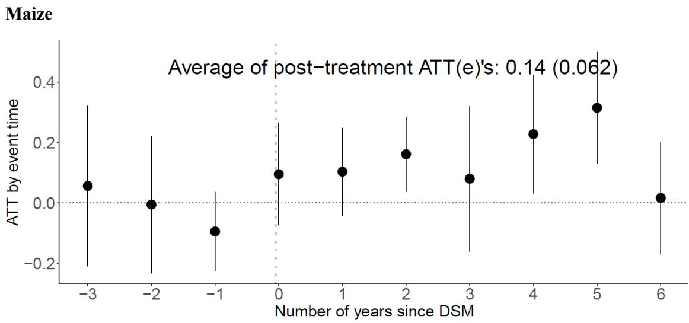

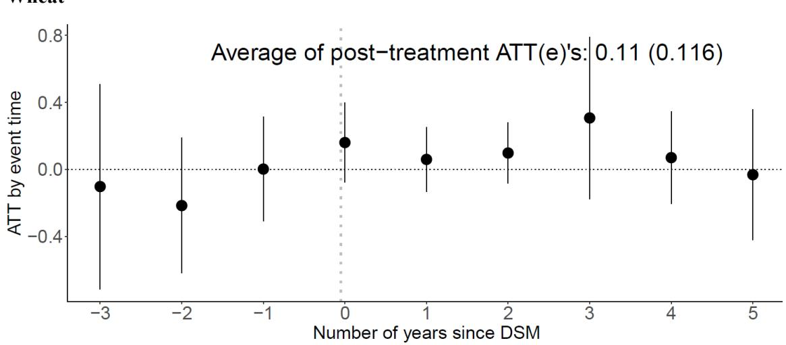  
Source: Authors' estimation based on the ACC 2012, 2016, and 2019 survey data.

Table 5 presents the results of the impact of DSM on the intensive margin of seed purchases, specifically focusing on the quantity of maize and wheat seed that farmers purchased per hectare. Similar to findings on the extensive margin, findings on the intensive margin reveal comparable patterns, albeit with varying magnitudes. Cohort-level aggregation indicates that DSM resulted in a 45 percent increase in the quantity of maize seed purchased per hectare. This effect is particularly pronounced in the 2014, 2017, and 2018 cohorts, with DSM increasing maize seed purchases by approximately 60 percent, 68 percent, and 84 percent, respectively. When aggregating the ATT estimates across survey years, the effect of DSM is positive and statistically significant in the 2019 survey year (61 percent) but not in 2016. For wheat seed purchases, consistent with the lack of impact on the extensive margin, there is no statistically significant impact on the intensive margin.

Table 5. The impact of DSM on the quantity of maize and wheat seeds farmers purchase per hectare, by cohort and survey year aggregations

<table><tr><td colspan="4">Maize</td><td colspan="4">Wheat</td></tr><tr><td>Cohort</td><td>ATT(g)</td><td>Survey year</td><td>ATT(t)</td><td>Cohort</td><td>ATT(g)</td><td>Survey year</td><td>ATT(t)</td></tr><tr><td>2013</td><td>0.024(0.184)</td><td>2016</td><td>-0.080(0.269)</td><td>2013</td><td></td><td>2016</td><td>0.536(0.667)</td></tr><tr><td>2014</td><td>0.602*(0.230)</td><td>2019</td><td>0.605*(0.186)</td><td>2014</td><td>0.331(0.785)</td><td>2019</td><td>0.469(0.413)</td></tr><tr><td>2015</td><td>0.090(0.214)</td><td></td><td></td><td>2015</td><td>0.284(0.534)</td><td></td><td></td></tr><tr><td>2016</td><td>0.479(0.991)</td><td></td><td></td><td>2016</td><td>1.648(0.961)</td><td></td><td></td></tr><tr><td>2017</td><td>0.683*(0.203)</td><td></td><td></td><td>2017</td><td>0.339(0.509)</td><td></td><td></td></tr><tr><td>2018</td><td>0.835*(0.291)</td><td></td><td></td><td>2018</td><td>0.656(0.461)</td><td></td><td></td></tr><tr><td>2019</td><td>0.261(0.300)</td><td></td><td></td><td>2019</td><td>0.064(0.507)</td><td></td><td></td></tr><tr><td>ATT</td><td>0.449*(0.192)</td><td></td><td>0.263(0.190)</td><td>ATT</td><td>0.464(0.370)</td><td></td><td>0.503(0.474)</td></tr></table>

Source: Authors' estimation based on the ACC 2012, 2016, and 2019 survey data.  
Note: P-value for a pre-test of parallel trends assumption is 0.230 for maize and 0.278 for wheat. Comparison group: "never treated." Anticipation periods: 0. Estimation method: Doubly Robust. Standard errors are reported in parenthesis. \* $p < 0.10$ .

The results from the event-study (dynamic) aggregation on the quantity of maize and wheat seed purchased by farmers show coefficients similar to those from the cohort and survey year aggregations. DSM led to a 46 percent increase in the quantity of maize seed purchased per hectare, while no statistically significant impact was observed for wheat seed purchases (Figure 2).

Figure 2. The impact of DSM on the quantity of maize and wheat seeds farmers purchase, event study aggregation  
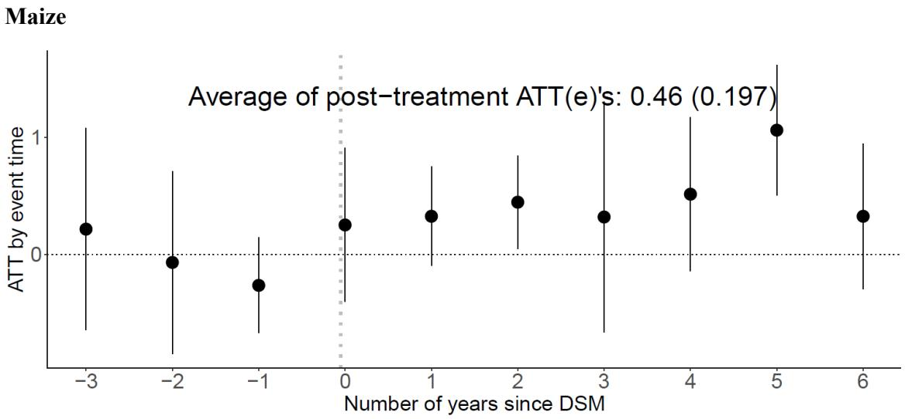

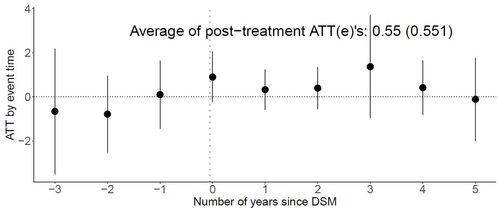  
Source: Authors' estimation based on the ACC 2012, 2016, and 2019 survey data.

## 5.2 The impact of DSM on crop yields

Table 6 presents the DID results for the impact of DSM on maize and wheat yields across cohorts and survey years. Aggregation of treatment effects across cohorts indicates that DSM has led to an 18 percent increase in maize yield. The impact of DSM on maize yield is particularly strong in the 2016 and 2018 cohorts, with 31 percent and 38 percent yield improvements, respectively. Aggregation of the ATTs across districts under DSM in the two post-treatment survey years indicates a positive and statistically significant impact on maize yield in the 2019 survey year but not in 2016, with the effect averaging 25 percent in districts under DSM by the 2019 survey round.

Aggregation of the average treatment effects across cohorts and survey years indicates no evidence that DSM affects wheat yield. Given that DSM has not led to increases in seed purchases for wheat (Tables 5 and 6; Figures 1 and 2), the lack of yield effects can also be interpreted as evidence that DSM did not impact other attributes of the wheat seed system, such as availability and quality, that could have affected crop yield levels. $^{5}$

Table 6. The impact of DSM on maize and wheat yields

<table><tr><td colspan="4">Mize</td><td colspan="4">Wheat</td></tr><tr><td>Cohort</td><td>ATT(g)</td><td>Survey year</td><td>ATT(t)</td><td>Cohort</td><td>ATT(g)</td><td>Survey year</td><td>ATT(t)</td></tr><tr><td>2013</td><td>-0.042(0.123)</td><td>2016</td><td>-0.049(0.135)</td><td>2013</td><td></td><td>2016</td><td>-0.098(0.182)</td></tr><tr><td>2014</td><td>-0.069(0.156)</td><td>2019</td><td>0.246*(0.082)</td><td>2014</td><td>-0.117(0.196)</td><td>2019</td><td>0.167(0.152)</td></tr><tr><td>2015</td><td>0.163(0.128)</td><td></td><td></td><td>2015</td><td>-0.063(0.139)</td><td></td><td></td></tr><tr><td>2016</td><td>0.305*(0.119)</td><td></td><td></td><td>2016</td><td>0.064(0.223)</td><td></td><td></td></tr><tr><td>2017</td><td>-0.006(0.100)</td><td></td><td></td><td>2017</td><td>0.323(0.240)</td><td></td><td></td></tr><tr><td>2018</td><td>0.377*(0.111)</td><td></td><td></td><td>2018</td><td>0.390(0.195)</td><td></td><td></td></tr><tr><td>2019</td><td>0.263(0.142)</td><td></td><td></td><td>2019</td><td>0.147(0.387)</td><td></td><td></td></tr><tr><td>ATT</td><td>0.183*(0.073)</td><td></td><td>0.098(0.078)</td><td>ATT</td><td>0.141(0.124)</td><td></td><td>0.034(0.107)</td></tr></table>

Source: Authors' calculation based on the ACC 2012, 2016, and 2019 survey data.  
Note: P-value for a pre-test of parallel trends assumption is 0.682 for maize and 0.0 for wheat. Comparison group: "never treated." Anticipation periods: 0. Estimation method: Doubly Robust. Standard errors are reported in parenthesis. \* $p < 0.10$ .

Figure 3 provides a summary of the ATTs on maize and wheat yields based on event-study (dynamic) aggregation, showing results consistent with those from cohort-based aggregation. The average treatment effect of DSM on maize yields, based on event-study aggregation, shows a 15 percent increase in maize yield. Figure 3 further indicates that improvements in maize yield occurred during the year DSM was introduced and the following year. For wheat, however, the average treatment effect based on event-study aggregation provides no evidence of a DSM impact on yield, consistent with the cohort and survey year aggregations (Figure 2b).

Figure 3. The impact of DSM on maize and wheat yields, event study aggregation  
(a) Maize  
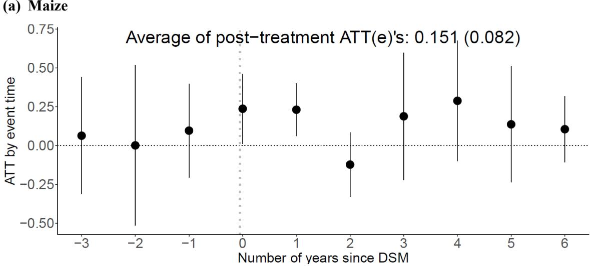

(b) Wheat  
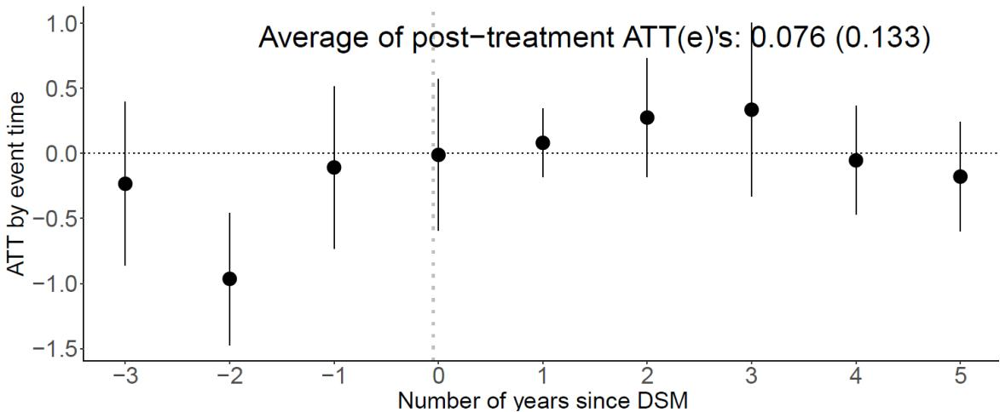  
Source: Authors' estimation based on the ACC 2012, 2016, and 2019 survey data.

Given the lack of a significant impact of DSM on wheat seed purchases and productivity, we extend our analysis to examine whether DSM has any effect on seed purchases and productivity for teff—the most important grain in Ethiopia’s agricultural economy, accounting for nearly a quarter of the total cultivated area by private smallholders (Hassen et al. 2018). However, administrative data reveal that teff seed accounted for less than one percent of the total seed supply made available to the market through DSM by 2019. Consequently, it is unlikely that

DSM had a measurable impact on the use or adoption of fresh teff seed and its productivity. We estimated the impact of DSM on teff following the same strategy as a falsification test. Indeed, the aggregation of average treatment effects based on cohorts and survey years (Appendix Table A2), as well as event-study aggregation (Appendix Figure A1), provides no evidence that DSM influences the amount of teff seed farmers purchase, the quantity of seed purchased per hectare, or teff yield.

## 6 Discussion

This study finds that the DSM approach increased maize yields by enabling more farmers to purchase seed and by increasing the quantity of seed sown per hectare. This, in itself, is a desirable productivity outcome for Ethiopia and offers encouraging evidence in support of the DSM approach and, more broadly, the role of competitive markets in Ethiopia's agricultural transformation. However, the study also finds no impact of DSM on the quantity of wheat seed purchased or on wheat yields. We explore several factors that might explain these differential effects.

The primary explanation for these crop-specific differences in findings is likely linked to the well-known differences in the reproductive biology of maize (particularly hybrid maize) and wheat. Typically, for farmers to realize the full productivity benefits conferred by hybrid vigor (heterosis), which results from crossing inbred parent lines, they must purchase fresh seed each season—seed that is the first-generation (F1) progeny of these parent lines. This recurring need for fresh seed sustains demand and provides private firms with an opportunity to sell seed each season. This unique characteristic associated with hybrid vigor also allows seed companies an opportunity to recoup a share of their investments in breeding, production, and marketing from repeat seed sales. In contrast to hybrid maize, OPV maize and self-pollinating wheat present limited opportunities for profit-maximizing firms because farmers can use saved seed or rely on farmer-to-farmer exchanges of seed for several years without significant genetic deterioration that might affect yields or output (Belay 2004; Benson, Spielman, and Kasa 2014).

The unique profitability function associated with the crop reproductive biology of hybrid maize is a key factor explaining the large levels of global private investment in maize breeding and seed marketing relative to other major field crops (Fuglie et al. 2011; Morris 1998). The same is true for Ethiopia: the profitability of hybrid maize incentivizes private sector entry into the maize seed sector and encourages seed companies to develop a profitable portfolio of products—maize hybrids with different traits such as yield, time to maturity, and resistance to biotic and abiotic stresses—and then market them directly to farmers.

A related explanation for the differences in crop-specific outcomes stems from the historical evolution of DSM in Ethiopia. Even before the introduction of DSM, there was considerable accumulated experience in maize seed production and marketing, along with clear evidence of farmers' preference for high-quality traits and seeds. While similar experience in wheat seed production also existed in Ethiopia alongside farmer demand for similarly high-quality traits and seeds, willingness to pay for such attributes may have been significantly lower due to farmers' ability to save seed across multiple years without significant genetic deterioration, their access to traditional farmer-to-farmer exchange mechanisms, and other such factors. This has an intrinsic influence on how private firms view the opportunities in seed markets beyond hybrid maize and may explain the differences in our findings.

In fact, data on the DSM approach indicate that the initial emphasis was placed exclusively on maize beginning in 2011, with the expansion to wheat following in 2013 (Figure 4). The resulting supply response for maize occurred more rapidly than for wheat: whereas maize seed production increased steadily across the nine years for which we have data, wheat seed supply remained low until an inflection point emerged in 2018. Several factors might explain these different supply responses.

This delay may be attributable to the adjustment time required for private firms—most of which were likely more experienced with the production and marketing of maize than with wheat seed, or had fixed investments in land, capital, and technical expertise more suited to maize than wheat—to assess and respond to increased demand and changes in demand for specific traits. Adjustment times in seed production are particularly challenging because seed multiplication and bulking processes can take several years for a new variety and depend on the availability and quality of early-generation seed. This challenge is especially pronounced in Ethiopia, where the limited availability and use of irrigation for off-season (dry season) seed production restrict the ability to accelerate supply responses (Alemu, Rashid, and Tripp 2010). The delay may also be attributable to the time required to establish new distribution channels, marketing strategies, and logistics operations to directly reach farmers with wheat seed.

Figure 4. Trends in the number of DSM districts and total quantity of seed supplied by DSM, by crop (2011 – 2019)  
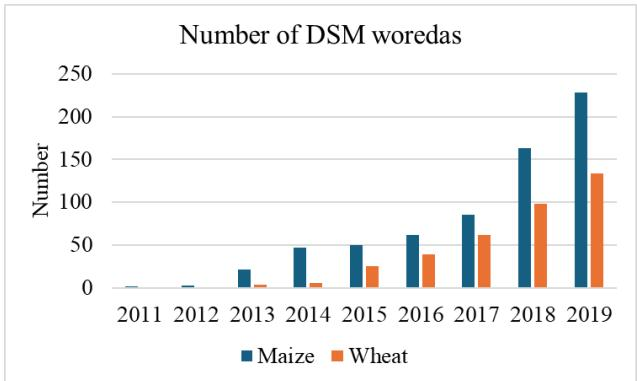

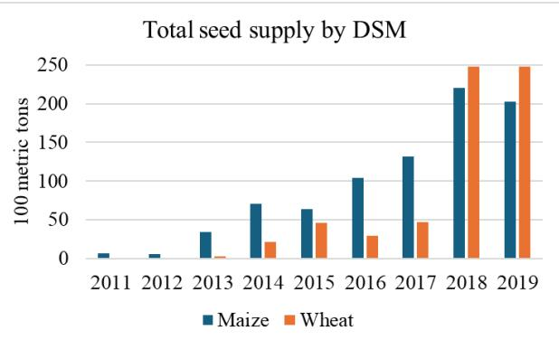  
Source: Authors' calculation based on administrative data provided by the ATA.

As the seed sector transitions from a state-managed operation to a market-led system, seed suppliers need to invest in production and marketing to calibrate their supply responses with changes in demand. During this transition period, there is a risk of disruption to the availability and quality of seed, as well as the timeliness of its delivery, potentially leading to adverse yield effects. The fact that the positive impacts of DSM on maize seed purchases and yields were observed in 2019 but not in 2016 supports this hypothesis, suggesting that even for maize, the transition process was not instantaneous. The same may be a plausible explanation for the null effects for wheat, exacerbated by the earlier hypothesis on crop reproductive biology.

## 7 Conclusions and Policy Implications

Ethiopia's seed supply system underwent a gradual transformation over the last decade, shifting from a system where the state was predominantly responsible for all aspects of the seed sector—from breeding to demand assessment to production and distribution—to a system in which private actors are playing an increasingly important role in production, marketing, and sales. This is no small feat, given the long history of state control over all aspects of agricultural production in Ethiopia, dating back to the feudal monarchy period and continuing through the socialist military dictatorship that ended in the early 1990s. The DSM program represents an important break from the past: what started with the direct marketing of maize seed in two pilot districts in 2011 has expanded in both volume and value across multiple crops and a large share of the country's agricultural production area. As of 2019, DSM was being implemented in 290 districts—close to half the country's districts—and covered 10 major crops. However, the absence of a rigorous evaluation to highlight its impacts on key seed system indicators means that DSM's proponents have had very little to show, apart from achievements in coverage extracted from standard monitoring data.

This study addressed this gap by examining the impact of DSM on seed purchases and yield for two crops that were the program's initial focus. It used a quasi-experimental difference-in-differences approach that leverages the staggered scale-up of DSM to demonstrate how the approach led to increased maize yield, primarily by improving farmers' purchase of hybrid maize seed. Specifically, the study finds that DSM has resulted in a 15-percentage-point increase in the proportion of farmers purchasing maize seed, a 45 percent increase in the quantity of maize seed purchased per hectare, and an 18 percent increase in maize yield. However, DSM's effects on seed purchases and yields are not statistically significant for wheat.

These crop-specific differences may be partly attributable to differences in the reproductive biology of maize compared to wheat—a difference that incentivizes private participation in maize seed markets more readily than in wheat seed markets. These implications suggest a need for more nuanced policies, institutional arrangements, and market development strategies to accelerate the adoption of improved varieties across a wider range of crops. Clearly, the hybrid maize market will remain more attractive to private investment as DSM becomes the standard channel for distribution. This market may even expand and improve more rapidly—with greater investment, newer traits, better seed traceability, and lower prices for farmers—if state-owned enterprises withdraw or reallocate their resources to other functions, such as early-generation seed production and seed sector capacity development. The same may be possible for other crops where hybrid vigor plays a role, for example, in certain vegetable crops. For OPV maize, wheat, teff, and other crops, there will still be a need for public investment in seed sector development, given the limited impact of DSM. The same may be the case for many other grain and legume crops, where weak returns to private investment are common.

However, this should not be taken to suggest that continued state governance, management, and operation of the seed market of these crops is the only alternative. Several studies explore this topic with forward-looking scenarios that include specific policy recommendations aimed at integrating public, commercial, and farmer-managed seed systems (Hassena, Hospes, and De Jonge 2016; Sisay, Verhees, and Van Trijp 2017), realigning public and private sector roles and responsibilities (Spielman et al. 2010), encouraging more pluralistic seed systems (Mulesa et al. 2021), and strengthening regulatory coherence (Kuhlmann et al. 2022) to simultaneously address the needs of farmers, entrepreneurs, agribusinesses, and government. Further empirical analyses and policy discussions on these alternatives are warranted if improved varieties and quality seeds remain central to the discourse on Ethiopia’s agricultural transformation process.

## References

Alemu, D. 2011. “The Political Economy of Ethiopian Cereal Seed Systems: State Control, Market Liberalization and Decentralization.” IDS Bulletin 42 (4): 69–77.

Alemu, D., and Z. Bishaw. 2016. “Commercial Behavior, Varietal Preferences and Wheat Seed Markets in Ethiopia.” ICARDA Working Paper 30, International Center for Agricultural Research in the Dry Areas (ICARDA), Addis Ababa.

Alemu, D., W. Mwangi, M. Nigussie, and D. J. Spielman. 2007. “An Analysis of Maize Seed Production and Distribution Systems in Ethiopia’s Rift Valley.” EIAR Research Report, Ethiopian Institute of Agricultural Research, Addis Ababa.

Alemu, D., S. Rashid, and R. Tripp. 2010. “Seed System Potential in Ethiopia: Constraints and Opportunities for Enhancing the Seed Sector.” Diagnostic report, International Food Policy Research Institute (IFPRI), Washington, DC.

Alemu, D., and R. Tripp. 2010. “Seed System Potential in Ethiopia: Constraints and Opportunities for Enhancing Production.” International Food Policy Research Institute Working Paper, Washington, DC.

Atilaw, A., and L. Korbu. 2012. “Roles of Public and Private Seed Enterprises. In The Defining Moments in Ethiopian Seed System, edited by A. Teklewold, A. Fikre, D. Alemu, L. Desalegn, and A. Kirub, 181–96. Addis Ababa: Ethiopia Institute of Agricultural Research.

Bachewe, N. F., B. Koru, and A. S. Taffesse 2018. Productivity and Efficiency in High-potential Areas. In The Economics of Teff: Exploring Ethiopia's Biggest Cash Crop, edited by B. Minten, A. S. Taffesse, and P. Brown, 11–38. Washington, DC: IFPRI.

Belay, S. 2004. “The Seed Regulations and Standards of Ethiopia: The Way Forward.” Draft report. Eastern and Central Africa Program for Agricultural Policy Analysis, Addis Ababa/Entebbe.

Benson, T., D. Spielman, and L. Kasa. 2014. “Direct Seed Marketing Program in Ethiopia in 2013: An Operational Evaluation to Guide Seed Sector Reform.” International Food Policy Research Institute Discussion Paper 1350, Washington, DC.

Bishaw, Z., P. C. Struik, and A. J. Van Gastel. 2014. “Assessment of On-Farm Diversity of Wheat Varieties and Landraces: Evidence from Farmer’s Fields in Ethiopia in Ethiopia.” African Journal of Agricultural Research 9 (39): 2948–63.

Brennan, J. P., and D. Byerlee. 1991. “The Rate of Crop Varietal Replacement on Farms: Measures and Empirical Results for Wheat.” Plant Varieties and Seeds (United Kingdom) 4(3).

Callaway, B., and P. H. Sant'Anna. 2021. "Difference-in-differences with Multiple Time Periods." Journal of Econometrics 225 (2): 200–30.

Cavatassi, R., L. Lipper, and U. Narloch. 2011. “Modern Variety Adoption and Risk Management in Drought Prone Areas: Insights from the Sorghum Farmers of Eastern Ethiopia.” Agricultural Economics 42 (3): 279–92.

CSA (Central Statistical Agency). 2020. “Agricultural Sample Survey: Report on Farm Management Practices.” Statistical Bulletin, Volume III, Addis Ababa.

Dorosh, P., and S. Rashid. 2013. Food and Agriculture in Ethiopia: Progress and Policy Challenges. Philadelphia: University of Pennsylvania Press.

DSA (Development Studies Associates). 2006. “A Study on Improving the Efficiency of Input Markets.” Ministry of Agriculture and Rural Development, Federal Democratic Republic of Ethiopia, Addis Ababa.

EEA/EEPRI (Ethiopian Economics Association/Ethiopian Economic Policy Research Institute). 2006. “Evaluation of the Ethiopian Agricultural Extension with Particular Emphasis on the Participatory Demonstration and Training Extension System (PADETES).” EEA/EEPRI, Addis Ababa.

EIAR (Ethiopian Institute of Agricultural Research). 2020. Status of Seed Quality Control and Assurance in Ethiopia: Required Measures for Improved Performance. EIAR, Addis Ababa.

ESA (Ethiopian Seed Association). 2018. An Assessment and Identification of Policy Constraints to Private Seed Sector Development in Ethiopia. Report, supported by the AGRA-Micro Reform for African Agribusiness (MIRA) Policy Advocacy Program. ESA, Addis Ababa.

FDRE (Federal Democratic Republic of Ethiopia). 2006. “Plant Breeders’ Right Proclamation.” Proclamation No. 481/2006 Negarit Gazeta 12: 3339–52.

Fuglie, K. O., P. W. Heisey, J. L. King, C. E. Pray, K. Day-Rubenstein, D. Schimmelpfennig, S. L. Wang, and R. Karmarkar-Deshmukh. 2011. Research Investments and Market Structure in the Food Processing, Agricultural Input, and Biofuel Industries Worldwide. Economic Research Report 130. USDA, Washington, DC.

Hassen, I. W., Regassa, M. D., Berhane, G., Minten, B., Taffesse, A. S., 2018. Teff and Its Role in the Agricultural and Food Economy. In The Economics of Teff: Exploring Ethiopia's Biggest Cash Crop, edited by B. Minten, A. S. Taffesse, and P. Brown, 11–38. Washington, DC: IFPRI.

Hassena, M., D. Alemu, and B. Dey. 2023. Seed Policy Provisions and Operational Challenges in Ethiopia. Feed the Future Global Supporting Seed Systems for Development Activity (S34D) Report. Baltimore: Catholic Relief Services.

Hassena, M., O. Hospes, and B. De Jonge. 2016. “Reconstructing Policy Decision-Making in The Ethiopian Seed Sector: Actors and Arenas Influencing Policymaking Process.” Public Policy and Administration Research, 6(2): 84–95.

Husmann, C. 2015. “Transaction Costs on the Ethiopian Formal Seed Market and Innovations for Encouraging Private Sector Investments.” Quarterly Journal of International Agriculture 54 (1): 59–76.

Kuhlmann, K., B. Dey, M. Mekuria, A. N. Nalinya, and T. Francis. 2022. Development and Comparison of Seed Regulatory Systems Maps in Ethiopia. Feed the Future Global Supporting Seed Systems for Development Activity (S34D) Report. Baltimore: Catholic Relief Services.

Langyintuo, A. S., W. Mwangi, A. O. Diallo, J. MacRobert, J. Dixon, and M. Bänziger. 2010. "Challenges of the Maize Seed Industry in Eastern and Southern Africa: A Compelling Case for Private–Public Intervention to Promote Growth." Food Policy 35 (4): 323–31.

Mekonen, L. K., N. Minot, J. Warner, and G. T. Abate. 2019. Performance of Direct Seed Marketing Pilot Program in Ethiopia: Lessons for Scaling-up. Ethiopia Strategy Support Program Working paper 132. IFPRI, Addis Ababa.

MoA/ATA (Ministry of Agriculture/Agricultural Transformation Agency, Federal Democratic Republic of Ethiopia). 2016. Seed System Development Strategy: Vision, Systematic Challenges, and Prioritized Interventions. MoA/ATA, Addis Ababa.

Morris, M. L. 1998. Maize Seed Industries in Developing Countries. Boulder, CO: Lynne Rienner.

Mulesa, T. H., S. P. Dalle, C. Makate, R. Haug, R. and O.T. Westengen. 2021. “Pluralistic Seed System Development: A Path to Seed Security?” Agronomy 11 (2): 372.

Negari, A. and M. Admasu. 2012. The Use of Pioneer Maize Hybrid Seeds and its Impact on Small Scale Farmers of Ethiopia. In Meeting the Challenges of Global Climate Change and Food Security through Innovative Maize Research, edited by M. Worku, S. Twumasi Afriyie, L. Wolde, B. Tadesse, G. Demisie, G. Bogale, D. Wegary, and B.M. Prasanna. Addis Ababa: Ethiopian Institute of Agricultural Research and International Maize and Wheat Improvement Center.

Sahlu, Y., and M. Kahsay. 2002. Maize Seed Production and Distribution in Ethiopia. In Enhancing the Contribution of Maize to Food Security in Ethiopia, edited by M. Nigussie, D. Tanner, and S. Twumasi-Afriyie (eds.), 160–165. Addis Ababa: Ethiopian Agricultural Research Organization and International Maize and Wheat Improvement Center.

Singh, R. P., A. D. Chintagunta, D. K. Agarwal, R. S. Kureel, and S. J. Kumar. 2020. “Varietal Replacement Rate: Prospects and Challenges for Global Food Security.” Global Food Security, 25, p.100324.

Sisay, D. T., F. J. Verhees, and H. C. Van Trijp. 2017. “Seed Producer Cooperatives in the Ethiopian Seed Sector and their Role in Seed Supply Improvement: A Review.” Journal of Crop Improvement 31 (3): 323–55.

Spielman, D. J., D. Kelemework, and D. Alemu. 2012. Seed, Fertilizer, and Agricultural Extension in Ethiopia. In Food and Agriculture in Ethiopia: Progress and Policy Challenges, edited by P. Dorosh and S. Rashid, 84–122. Philadelphia: University of Pennsylvania Press.

Spielman, D. J., D. Byerlee, D. Alemu, and D. Kelemework. 2010. “Policies to Promote Cereal Intensification in Ethiopia: The Search for Appropriate Public and Private Roles.” Food Policy 35(3): 185–94.

Spielman, D. J., and D. K. Mekonnen. 2013. Transforming Demand Assessment and Supply Responses in Ethiopia's Seed System and Market. Unpublished report prepared for the Ethiopian Agricultural Transformation Agency. IFPRI, Addis Ababa.

Spielman, D. J., and M. Smale. 2017. “Policy Options to Accelerate Variety Change among Smallholder Farmers in South Asia and Africa South of the Sahara.” IFPRI Discussion Paper 1666, Available at SSRN: https://ssrn.com/abstract=3029612

Thijssen, M. H., Z. Bishaw, A. Beshir, and W. S. de Boef. 2008. Farmers, Seeds and Varieties: Supporting Informal Seed Supply in Ethiopia. Wageningen: Wageningen UR.

World Bank. 2006. World Bank Support to the Ethiopian Seed Sector. Unpublished document. World Bank, Addis Ababa.

Table A1. Summary statistics of pre-treatment levels of control variables across DMS cohorts

<table><tr><td rowspan="2">Variables</td><td colspan="2">All sample</td><td colspan="7">DSM Cohorts</td></tr><tr><td>Mean</td><td>Control</td><td>2013</td><td>2014</td><td>2015</td><td>2016</td><td>2017</td><td>2018</td><td>2019</td></tr><tr><td>Household size (#)</td><td>5.9</td><td>5.8</td><td>6.0</td><td>5.756</td><td>6.3***</td><td>6.1**</td><td>5.5**</td><td>6.1***</td><td>6.1***</td></tr><tr><td>Number of oxen owned (#)</td><td>1.8</td><td>1.8</td><td>1.7</td><td>1.5**</td><td>2.2***</td><td>1.6*</td><td>1.7</td><td>2.0</td><td>2.0*</td></tr><tr><td>Chemical fertilizers (kg)</td><td>82.5</td><td>68.4</td><td>127.1***</td><td>107.6***</td><td>165.2***</td><td>79.4</td><td>83.2</td><td>77.9</td><td>78.0</td></tr><tr><td>Age of household (years)</td><td>46.5</td><td>46.5</td><td>44*</td><td>46.5</td><td>47</td><td>48.4*</td><td>47</td><td>47</td><td>45**</td></tr><tr><td>Gender of the head (1=female)</td><td>0.1</td><td>0.09</td><td>0.07</td><td>0.1</td><td>0.09</td><td>0.17***</td><td>0.15***</td><td>0.1</td><td>0.1</td></tr><tr><td>Education of the head (grades completed)</td><td>3.3</td><td>3.2</td><td>3.6</td><td>3.7</td><td>3.0</td><td>3.6</td><td>3.7**</td><td>3.8***</td><td>3.3</td></tr><tr><td>Farmland owned (in hectares)</td><td>1.8</td><td>1.7</td><td>1.9</td><td>1.2***</td><td>1.8</td><td>1.5**</td><td>1.8</td><td>1.9*</td><td>2.2***</td></tr><tr><td>Agricultural cooperative member (1=yes)</td><td>0.46</td><td>0.45</td><td>0.43</td><td>0.40</td><td>0.59***</td><td>0.45</td><td>0.48</td><td>0.4**</td><td>0.43</td></tr><tr><td>Number of observations</td><td>4,919</td><td>2784</td><td>96</td><td>164</td><td>468</td><td>191</td><td>370</td><td>415</td><td>428</td></tr></table>

Note: \*, \*\*, \*\*\* indicate statistical significance at 10%, 5%, and 1% level, respectively, for the differences in the variables' mean values between each treated cohort and the control group. The values of the variables from the earliest of the three survey rounds in which they appear are used to condition our parallel trend assumption.

Table A2. The impact of DSM on teff seed purchase and yield

<table><tr><td colspan="4">Impact on teff seed purchase</td><td colspan="4">Impact on the quantity of teff seed purchases per hectare</td><td colspan="4">Impact on teff yield</td></tr><tr><td>Cohort</td><td>ATT(g)</td><td>Survey year</td><td>ATT(t)</td><td>Cohort</td><td>ATT(g)</td><td>Survey year</td><td>ATT(t)</td><td>Cohort</td><td>ATT(g)</td><td>Survey year</td><td>ATT(t)</td></tr><tr><td>2015</td><td>0.056(0.087)</td><td>2016</td><td>0.008(0.092)</td><td>2015</td><td>0.164(0.324)</td><td>2016</td><td>0.032(0.322)</td><td>2015</td><td>-0.028(0.127)</td><td>2016</td><td>-0.125(0.164)</td></tr><tr><td>2017</td><td>0.024(0.121)</td><td>2019</td><td>-0.011(0.163)</td><td>2017</td><td>0.053(0.439)</td><td>2019</td><td>-0.049(0.661)</td><td>2017</td><td>0.070(0.167)</td><td>2019</td><td>0.208(0.144)</td></tr><tr><td>2018</td><td>-0.214(0.147)</td><td></td><td></td><td>2018</td><td>-0.587(0.564)</td><td></td><td></td><td>2018</td><td>0.159(0.267)</td><td></td><td></td></tr><tr><td>2019</td><td>-0.015(0.374)</td><td></td><td></td><td>2019</td><td>-0.082(1.468)</td><td></td><td></td><td>2019</td><td>0.355(0.193)</td><td></td><td></td></tr><tr><td>ATT</td><td>-0.020(0.161)</td><td></td><td>-0.002(0.083)</td><td>ATT</td><td>-0.073(0.656)</td><td></td><td>-0.009(0.346)</td><td>ATT</td><td>0.190(0.131)</td><td></td><td>0.042(0.091)</td></tr></table>

Note: ATT refers to the Average Treatment Effect on the Treated group. P-value for a pre-test of parallel trends assumption is 0.151 for seed purchase, 0.087 for quantity of seed purchase, and 0.119 for yield estimates. Control group: “never treated.” Anticipation periods: 0. Estimation method: Doubly Robust. Standard errors are reported in parentheses. Source: Authors’ calculation based on Agricultural Commercialization Clusters 2012, 2016, and 2019 survey data.

Figure A1. The impact of DSM on teff seed purchases and yield: Event study aggregation

(a) Impact on farmers' decision to purchase teff seed  
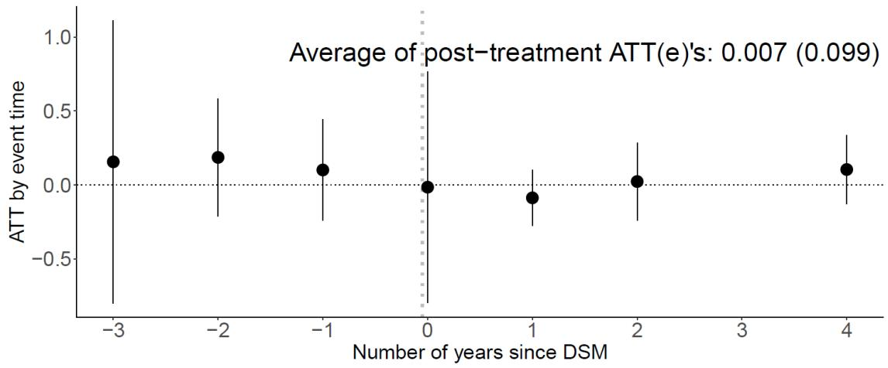

(b) Impact on the quantity of teff seed farmers' purchase  
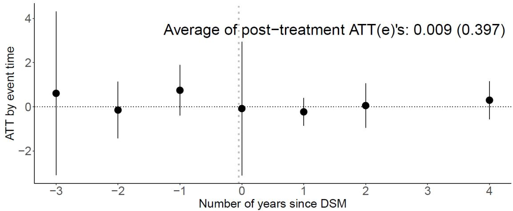  
(c) Impact on the teff yield

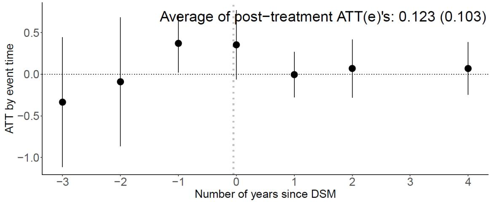  
Note: ATT refers to the Average Treatment Effect on the Treated. DSM refers to Direct Seed Marketing. Source: Authors' estimation based on the ACC 2012, 2016, and 2019 survey data.