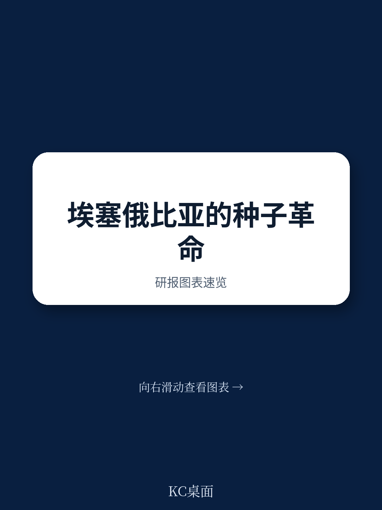
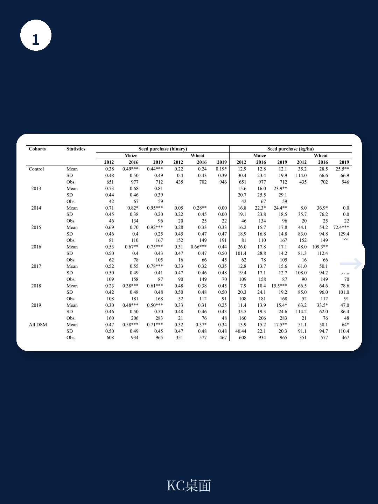
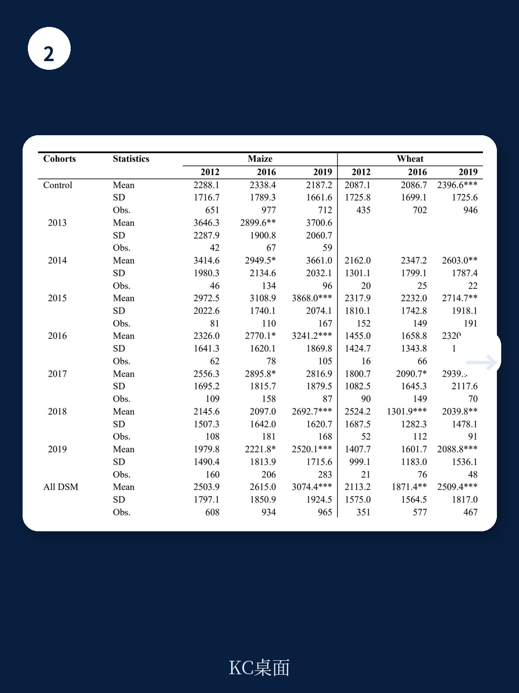

# 世界银行：埃塞俄比亚的种子革命，玉米赢了，小麦输了

埃塞俄比亚的农业改革实验，正在揭示一个被忽视的真相：市场化的种子分销体系，对不同作物的效果完全相反。

世界银行最新发布的工作论文，首次对埃塞俄比亚2011年启动的直接种子营销（DSM）改革进行了严格的量化评估。结论清晰且反直觉：DSM使农民购买玉米种子的比例提高了15个百分点，每公顷玉米种子购买量增加45%，玉米单产提升18%。但对小麦，所有效果在统计上均不显著。

这意味着什么？一个经过精心设计的市场化改革，在同一个国家、同一套制度框架下，对两种主要粮食作物产生了截然不同的结果。这不是政策的成功或失败，而是对“种子市场改革”这一宏大叙事的深度拆解——改革的成效，取决于作物本身的生物学特性。

## 1. 改革的核心逻辑：用市场化替代行政化，但只对杂交作物有效

埃塞俄比亚的传统种子分销体系，是一个高度中央集权的系统。国有种子企业负责从品种培育到种子分销的全链条，农户通过行政渠道获取种子。这个系统的核心问题是：需求评估不准确、供应与需求长期错配、种子交付延迟、价格偏高。

DSM改革的逻辑很清晰：允许公共和私营种子生产者直接向农民销售种子，而不是通过国家行政体系。改革者希望借此缩短分销链条、降低交易成本、引入竞争机制，并让种子生产者直接对种子质量负责，从而将公共部门的稀缺资源从种子分销中释放出来，转向品种研发和质量监管。

但世界银行的实证研究揭示了一个关键差异：DSM对玉米的效果显著，对小麦却无效。原因在于两种作物的繁殖生物学特性。玉米主要使用杂交品种，农民每季都需要购买新种子以获取杂交优势带来的产量增益。小麦是自花授粉作物，农民可以留种，对购买新种子的需求天然较低。

> **KC评论：** 这不是政策执行的问题，而是作物经济学的问题。DSM的激励机制——让种子公司直接面对农民——对需要持续购买种子的杂交玉米市场有效，因为这里有真实的商业循环。对小麦这种可以自留种子的作物，市场化改革的边际收益天然有限。完整报告中的事件研究图和异质性分析，详细展示了不同作物、不同年份的效果差异，这些图表比文字更能说明问题。

## 2. 玉米市场的三重正向反馈：购买、用量、产量同步改善

世界银行的研究采用了准实验的双重差分方法，利用DSM在不同地区、不同时间逐步推广的准自然实验特征，控制了不可观测的时变因素。结果显示，DSM对玉米种子市场产生了三个层面的正向影响。

第一，购买行为的改变。DSM使农民购买玉米种子的概率提高了14-15个百分点。这意味着更多农民从自留种或非正规渠道转向了正规种子市场。

第二，购买强度的提升。每公顷玉米种子的购买量增加了45%。这不仅是“买或不买”的决策变化，更是“买多少”的深度变化。农民在DSM体系下购买了更多种子，可能意味着更高的种植密度或更频繁的品种更换。

第三，生产效率的改善。玉米单产提升了18%。这是前两个变化的自然结果——更好的种子、更合理的用量，最终体现为产量增长。

这三个层面的改善，形成了一个正向反馈循环：市场化分销让农民更容易获得优质种子，优质种子带来更高产量，高产量激励农民继续购买种子，从而维持了种子市场的商业可持续性。

> **KC评论：** 18%的单产提升，在农业经济学中是一个相当可观的效应量。但报告也明确指出，这个效应可能部分来自选择效应——DSM率先推广的地区，可能是农业基础更好、农民接受度更高的地区。完整报告中的平衡性检验和稳健性分析，详细讨论了这些可能的偏误来源，值得仔细阅读。

## 3. 小麦市场的“市场化失灵”：为什么相同改革对小麦无效

小麦的结果与玉米形成鲜明对比。DSM对小麦种子购买和单产的影响，在所有统计检验中均不显著。这不是“效果不大”，而是“基本没有效果”。

原因不在于DSM的设计，而在于小麦市场的结构性特征。小麦是自花授粉作物，农民可以自己留种，对商业化种子市场的依赖度天然较低。即使DSM让种子更容易获得，农民也没有强烈的动机去购买新种子——除非新品种能带来足够大的产量优势。

但埃塞俄比亚的小麦品种改良进展相对缓慢，新品种与农民自留种的产量差距不足以激励农民更换种子。这就形成了一个“低需求-低供给-低需求”的均衡陷阱：因为农民不买，种子公司不愿意投入；因为没有好的商业化品种，农民更不愿意购买。

世界银行的报告还指出，DSM覆盖的作物从2011年的1种（玉米）扩展到2019年的10种，但玉米和小麦占了DSM销售量的98%。这意味着对其他8种作物的效果，基本可以忽略不计。

> **KC评论：** 这里的政策含义很微妙。如果市场化改革对小麦无效，那么政府应该继续投入公共资源来推广小麦种子，还是接受“小麦市场天然不适合商业化”的现实，把资源转向其他领域？报告没有给出明确答案，但提出了一个值得追问的问题：如何设计差异化的政策组合，让市场化改革和公共干预在不同作物上各司其职。完整报告的政策建议部分，对这种“差异化策略”有更深入的讨论。

## 4. 报告尚未完全回答的关键问题：规模化的边界在哪里

DSM的推广速度很快。从2011年的2个地区、1种作物，到2019年的290个地区、10种作物，参与的私人代理商从29家增加到1400家。但规模化的边界在哪里？

第一个未解问题是：DSM的效应是否随着规模扩大而递减。2011-2012年的早期试点地区，可能因为政策关注度高、执行力度大而效果更好。随着DSM扩展到更多地区，平均处理效应可能会下降。世界银行的论文识别了不同“处理队列”的异质性效应，但并未给出明确的递减模式判断。

第二个问题是：私人代理商的质量控制。DSM允许私人代理商直接销售种子，这降低了进入门槛，但也引入了质量风险。当代理商从29家增加到1400家，监管能力是否同步跟上？报告提到了“种子可追溯性”作为问责机制，但没有评估这一机制的实际执行效果。

第三个问题是：DSM对公共部门资源配置的“释放效应”是否真实发生。改革的初衷之一是让公共部门的种子专家从分销事务中解放出来，专注于品种研发和质量监管。但报告没有提供这方面的数据验证。这可能是下一轮评估需要回答的问题。

> **KC评论：** 规模化是市场化改革最常见的陷阱。小规模试点成功，不等于大规模推广也能成功。DSM从2个地区到290个地区的过程中，平均处理效应是否发生了变化？完整报告中按处理队列分组的事件研究图，提供了初步证据，但远不足以给出定论。这正是值得继续深挖的方向。

## 5. 对读者的观察框架：如何判断一场种子市场改革的真实效果

基于世界银行这份报告的分析框架，可以提炼出一个评估种子市场改革的通用观察框架。

第一，区分作物的生物学特性。杂交作物的种子市场天然具有商业可持续性，市场化改革更容易见效。自花授粉作物和无性繁殖作物，需要不同的政策组合。不要用玉米的成功去复制到小麦。

第二，关注购买行为，而不仅仅是产量。种子市场改革的第一阶效应是农民的购买决策变化。如果农民不买，产量改善无从谈起。世界银行的研究从“是否购买”“购买多少”“产量如何”三个层次递进分析，这种结构本身就值得借鉴。

第三，警惕“平均效应”的误导。DSM对玉米有效、对小麦无效，这个“平均”结果掩盖了关键的异质性。任何改革评估，都需要追问：对谁有效？在什么条件下有效？为什么对某些群体无效？

第四，关注供给侧的反应。DSM的参与者从29家增加到1400家，但其中有多少是真正活跃的？有多少是“名义参与者”？种子公司的利润率、品种更新速度、售后服务等指标，比参与数量更能反映市场的健康度。

## 6. 改革的下一个前沿：从种子到整个农业投入品市场

世界银行的这份报告，表面上是在评估一个种子市场改革项目，但实际上提出了一个更根本的问题：在农业投入品市场中，哪些环节适合市场化，哪些环节需要公共干预？

DSM的经验表明，种子分销环节的市场化可以取得显著成效，但前提是作物本身具有“可商业化”的特征。对于小麦、苔麸等自花授粉作物，可能需要在品种研发端加大公共投入，创造足够大的品种优势，才能激活商业化种子市场。

这个框架可以延伸到其他农业投入品市场。化肥、农药、农机、灌溉设备——每一种投入品的市场结构都不同，都面临“什么环节应该市场化、什么环节需要公共干预”的问题。世界银行的报告没有回答这些问题，但它提供了一个方法论模板：用严谨的因果识别方法，评估具体改革措施在不同作物、不同地区的异质性效果。

> **KC评论：** 这份报告的价值，不在于它证明了“市场化是对的”或“市场化是错的”，而在于它证明了“市场化在某些条件下有效，在另一些条件下无效”。这种“条件性结论”才是真正有政策指导意义的。报告中的异质性分析和稳健性检验，提供了识别这些条件的具体方法。完整报告包含完整的计量模型设定、数据描述和敏感性分析，是理解“如何做政策评估”的绝佳案例。

---

这份世界银行工作论文揭示的核心判断是：种子市场改革的效果，取决于作物的生物学特性。玉米成功了，小麦失败了。这个结论看似简单，但它的政策含义远比表面看起来复杂。它意味着，未来的农业改革需要从“一刀切的市场化”转向“作物差异化的政策组合”。

报告没有给出所有答案。DSM的规模化边界在哪里？私人代理商的质量如何管控？公共部门的资源是否真的被释放出来？这些问题，正是继续阅读完整报告的价值所在。

在我们的社群中，每天会由AI agent结合人工review，生成国际投行和顶级研究机构的中文摘要与评论，涵盖全球农业、粮食安全、大宗商品等领域的深度研报。每日更新，约10-40页，既适合喂给AI模型进行二次分析，也方便人工快速把握全球农业市场的最新动态和关键数据。

如果你对世界银行这份报告的完整图表、计量模型设定、以及分作物异质性分析感兴趣，欢迎加入社群，获取完整研报解读与原始数据图表。

Personal reading notes and learning share only. Not investment advice.

