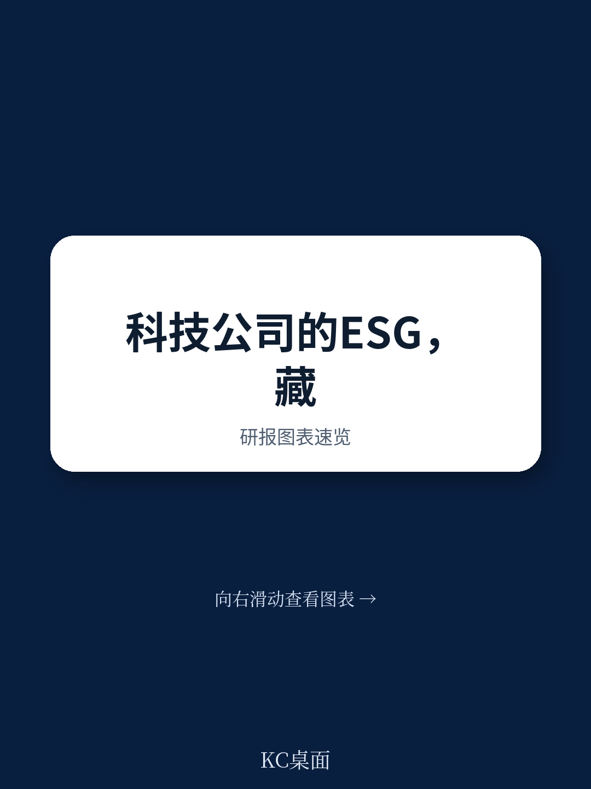
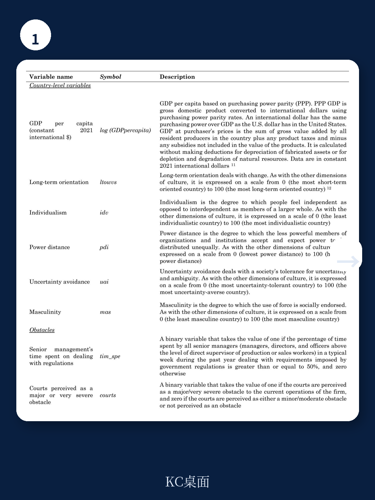
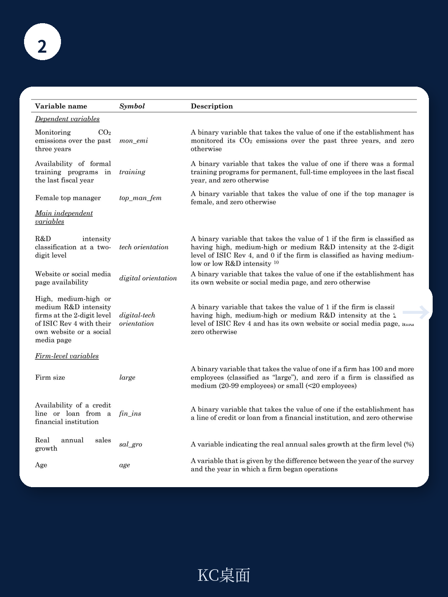

# 世界银行：数字化企业更环保、更培训员工，但女性高管更少

数字化和科技，究竟是推动企业伦理进步的引擎，还是加剧了某些结构性不平等？世界银行一份覆盖158个国家、近20万家企业、跨度17年的最新研究，给出了一个令人不安的答案：数字科技企业在环境和社会责任方面表现更优，但在公司治理的性别维度上，却显著落后于传统企业。

这份报告的核心结论，并非简单的“科技企业更道德”或“科技企业更歧视”。它揭示了一个更复杂的三角关系：当企业同时具备“技术密集型”和“数字化运营”两个特征时，其对ESG的不同维度产生了截然相反的影响。这一发现，直接挑战了市场对科技公司“天然向善”的普遍叙事。

对于关注产业趋势、企业治理和投资组合构建的高净值读者和决策者而言，这份报告的真正价值在于：它迫使我们去追问，为什么同一个“科技驱动力”，会在环境和社会层面带来正面效应，却在领导层性别平等方面造成负面结果？这背后是技术本身的属性，还是更深层的社会文化与制度环境在起作用？

本文基于世界银行这份最新工作论文，提炼出五个关键洞察，并尝试回答上述追问。

## 1. 科技企业的ESG表现并非铁板一块：环境和社会维度领先，治理维度落后

报告将企业的伦理实践拆解为三个可测量的维度：环境维度（是否监测二氧化碳排放）、社会维度（是否为员工提供正式培训）、治理维度（是否雇佣女性高管）。研究结论清晰且具有分化性。

在环境与社会维度上，数字科技企业（同时具备高技术密集度和数字化运营的企业）展现出更强的积极性。例如，这类企业监测自身碳排放的概率显著高于传统企业，也更倾向于为员工提供正规培训。这表明，技术本身，尤其是数字化工具（如网站、社交媒体），确实为企业在环境管理和人力资本投资方面提供了便利和动力。一个拥有官网和社交媒体的科技企业，更有可能将其环保承诺和员工发展计划公之于众，从而形成一种正向的自我约束和外部监督机制。

然而，在治理维度，情况完全相反。数字科技企业雇佣女性高管的比例显著更低。这一负相关关系，在控制了企业规模、年龄、盈利能力、所在国家GDP水平等一系列因素后，依然稳健。这意味着，科技行业的“性别天花板”并非仅仅是入门级岗位的问题，而是延伸到了企业的最高决策层。

> **KC评论：**
> 这份报告最犀利的判断在于，它告诉我们不能笼统地谈论“科技企业的ESG”。同一个企业，在环境上可能是优等生，在性别平等方面却可能是后进生。对于投资者而言，如果只看一个企业或行业的“E”或“S”分数，而忽略“G”中的性别维度，可能会错过一个重要的结构性风险信号。完整报告中对这三个维度的回归结果和边际效应图表，是理解这一分化的关键。

## 2. 文化是“隐形的手”：男性化文化与短期导向放大了科技企业的性别鸿沟

为什么数字科技企业在雇佣女性高管上表现更差？报告并未止步于“STEM领域女性人才不足”这一表层解释，而是深入挖掘了国家文化的调节作用。

研究发现，在“男性化倾向”更强（即社会更推崇竞争、成就和物质成功）的国家，以及“短期导向”更强（即社会更注重传统和眼前利益）的国家，数字科技企业与女性高管比例之间的负向关系被显著放大。换句话说，技术本身并不必然导致性别不平等，但它在一个不鼓励性别平等的社会文化环境中，会成为一种“放大器”。

这一发现极具政策含义。它意味着，单纯通过技术培训或企业激励来解决科技行业的性别失衡问题，可能效果有限。根本性的变革，需要触及更深层的社会文化规范。例如，改变对女性在技术和管理岗位上能力的刻板印象，以及建立更长远的社会价值评价体系。

> **KC评论：**
> 很多讨论将科技行业的性别问题归咎于“管道问题”（Pipeline Problem），即女性选择STEM专业的人数太少。但世界银行这份报告指出，即使在控制了教育背景和行业分布后，文化因素依然在起作用。这提醒我们，投资于女性STEM教育固然重要，但如果不改变企业内部的晋升文化和社会的性别角色预期，管道末端的管理层性别失衡问题可能依然无解。报告中关于不同文化维度下调节效应的具体系数表格，值得仔细研读。

## 3. 监管负担是一把双刃剑：降低官僚成本促进环保，却可能加剧性别差距

监管环境对企业伦理行为的影响，是这份报告另一个令人深思的发现。

研究显示，当“监管负担”（以高管花在应对政府法规上的时间衡量）较轻时，数字科技企业更倾向于监测碳排放和提供员工培训。这符合直觉：过度的官僚主义和繁琐的合规要求，会挤占企业用于战略性、主动性ESG投入的资源。

然而，在性别问题上，同样的逻辑却产生了相反的效应。研究发现，当监管负担较轻时，数字科技企业雇佣女性高管的比例反而更低。报告作者推测，这可能是因为女性高管在应对复杂监管环境方面可能更具优势或投入更多时间，因此当监管负担减轻时，这种“比较优势”也随之消失，反而对女性晋升产生了负面影响。

这一发现极具颠覆性。它说明，旨在“放松管制、激发活力”的政策，在环境和社会领域可能带来正面效果，但在性别平等方面却可能产生意想不到的副作用。政策制定者需要在不同目标之间进行审慎的权衡。

## 4. 司法效率的悖论：当法院不再构成障碍，科技企业的性别鸿沟反而加深

报告还考察了企业对司法系统（法院）的看法如何影响其行为。一个高效、公正的司法系统通常被视为良好商业环境的核心要素。

然而，研究结果再次出人意料。当企业认为“法院不构成主要商业障碍”时，数字科技企业雇佣女性高管的比例反而更低。作者认为，这可能与女性在冲突解决和关系维护方面的角色有关。在一个司法不完善、商业纠纷需要通过非正式渠道解决的环境中，女性管理者可能因其沟通和协调能力而更受青睐。而当司法系统高效运转，商业规则变得清晰透明时，这种基于“软技能”的竞争优势可能被削弱，导致企业更倾向于选择传统上被认为更“强硬”的男性管理者。

这个发现并非在否定司法改革的价值，而是揭示了一个深刻的现实：商业环境的改善，并不总是自动惠及所有群体。某些结构性不平等，可能根植于更深层的社会分工和性别角色认知之中，单纯依靠工具理性的制度优化，反而可能固化甚至加剧这些不平等。

## 5. 报告尚未回答的关键问题：技术变革的“二阶效应”如何定价？

这份世界银行的研究为我们提供了一个极为宝贵的实证基础，但它也留下了几个悬而未决的关键问题。

首先，研究使用的是企业层面的截面数据，虽然控制了诸多因素，但仍然难以完全排除反向因果和遗漏变量的问题。例如，是数字化导致了更少的女性高管，还是本身就不太倾向于雇佣女性高管的行业更数字化？报告本身也承认，这是一种“相关性”而非“因果性”的分析。

其次，研究对“数字化企业”的定义主要依赖于“是否有网站或社交媒体”。在人工智能、云计算、大数据等新一代技术快速渗透的今天，这种定义可能已经过时。更深层的问题是，不同技术（例如，自动化技术 vs. 协作性技术）对性别结构的影响可能是截然不同的。报告尚未对这些“技术内部”的差异进行拆解。

最后，也是最关键的问题：投资者和决策者应该如何为这种“结构性分化”定价？一个在E和S上表现优异、但在G（性别）上存在系统性偏差的科技公司，其长期价值是更高还是更低？市场是否已经意识到了这种风险？当监管和社会舆论开始“纠正”这种偏差时，这类公司是否会面临更大的转型成本和声誉风险？

这些问题，正是这份报告留给我们的思考题，也是我们继续深入探究的方向。

---

关于科技企业ESG表现的完整实证图表、各国文化维度的详细数据、以及回归结果的稳健性检验，均在原报告中有详尽展示。这些第一手数据和严谨的分析框架，对于构建自己的投资判断和决策逻辑，具有不可替代的价值。

每天，我们都会通过AI agent和人工review，从全球顶级投行和研究机构的最新报告中，筛选出最具洞察力的核心观点，并制作成约10-40页的中文摘要和KC评论，包含当日最新数据图表合集。这份材料既方便您快速把握市场动态，也适合作为素材喂给您的AI模型进行二次分析。

如果您希望获取这份世界银行报告的完整解读和原始图表，或者希望每天收到这样的高质量投研内容，欢迎加入我们的社群，与志同道合的决策者一同探讨。

Personal reading notes and learning share only. Not investment advice.

