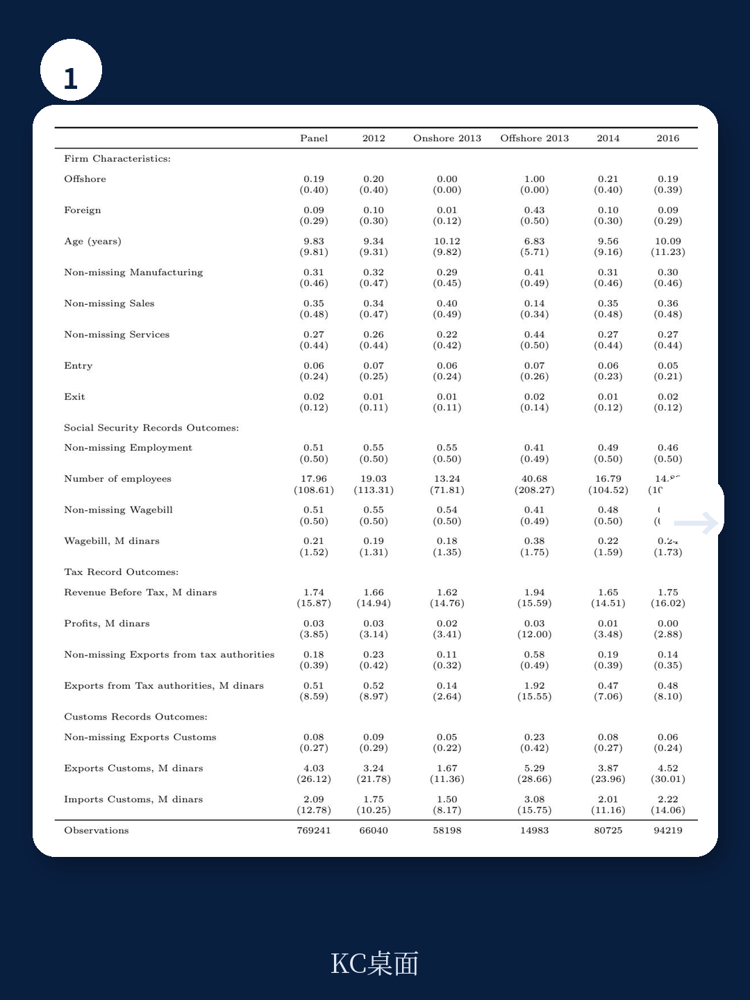
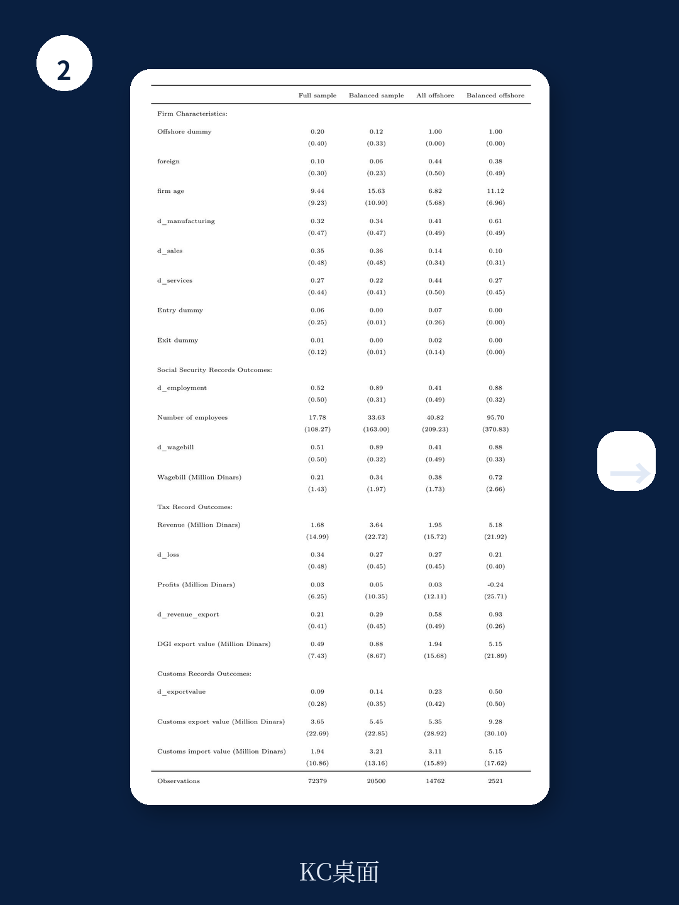

# 世界银行：减税吸引不来投资，真正决定企业去留的是这些

当全球各国竞相用税收优惠争夺企业时，世界银行一份基于突尼斯二十万家企业数据的实证研究给出了一个反直觉的结论：减税可能只改变了企业的注册形式，却没有改变经济活动本身。

这份由世界银行经济学家Massimiliano Cali、Giorgio Presidente和Thiago Scot共同完成的工作论文，利用突尼斯2014年取消出口企业免税政策的自然实验，揭示了企业税收激励的真实效果。研究显示，当出口企业的所得税率从0%提升至10%后，新企业进入数量骤降20%，但就业、工资总额和营收等核心经济指标纹丝不动。

这个发现直击全球产业政策的核心矛盾：各国每年花费GDP的1.4%用于企业税收减免，但这些真金白银的激励究竟换来了什么？

## 1. 突尼斯的自然实验揭示了税收激励的边界效应

突尼斯长期实行双轨税制：出口导向的“离岸企业”享受零所得税，而服务内销市场的“在岸企业”需缴纳30%的所得税。这种制度设计本意是吸引外资、促进出口，但到2013年，离岸企业的免税政策每年耗费的财政收入相当于GDP的6.8%。

2014年的税制改革将离岸企业税率从0%提升至10%，同时在岸企业税率从30%降至25%。这一变化并非渐进式的政策调整——此前近十年间，政府曾多次宣布取消免税但反复推迟执行，直到2013年才真正落地。这种突然的政策转向，为研究者提供了一个近乎理想的准自然实验环境。

世界银行团队利用突尼斯全国企业登记数据、社保数据、海关数据和税务申报数据，构建了2009年至2018年近20万家企业面板数据，采用双重差分法比较离岸企业与在岸企业在改革前后的表现差异。

结果显示，改革后四年内，离岸企业数量相对于在岸企业下降了约20%。但更关键的是，这一下降完全由新企业进入减少驱动，存量企业的退出率并未改变。这意味着，税收优惠真正影响的是“要不要注册”的决策，而不是“要不要经营”的决策。

> **KC评论：** 对于产业政策制定者而言，这个发现值得反复咀嚼。如果税收优惠只能改变企业的注册地或注册形式，而无法影响实际投资和就业，那么各国每年耗费数千亿美元的税收竞争，可能只是制造了一场统计上的“繁荣幻觉”。完整报告中包含了对不同规模企业、不同行业的细分分析，这些异质性结果揭示了税收敏感度的真实分布。

## 2. 新企业进入的减少没有传导至经济产出，关键在于存量企业的韧性

如果新企业进入骤降20%，按照直觉推理，经济活动应该受到显著冲击。但世界银行的研究给出了相反的结论：离岸部门的就业、工资总额和营收均未出现统计上显著的变化。

这一看似矛盾的结果，在更细粒度的数据分析中得到了解释。

首先，进入市场的离岸新企业通常规模极小，平均雇佣人数不足10人，对整体经济活动的贡献微乎其微。其次，离岸部门的经济活动高度集中在少数大型存量企业手中——这些企业才是就业和产出的主要来源。在平衡面板分析中，研究者发现存量离岸企业在改革后的就业、工资和营收均未受到显著影响。

这意味着，税收优惠对经济活动的边际影响，在存量企业面前几乎可以忽略不计。一家已经建厂、拥有供应链和客户关系的企业，不会因为税率从0%升至10%就关闭工厂或大规模裁员。但一个潜在的创业者，可能会因为税负增加而放弃注册一家新公司。

> **KC评论：** 这一发现对投资决策有直接含义。当评估一个市场的税收环境时，存量企业的稳定性比新进入者的活跃度更能反映真实的经济韧性。完整报告中对不同行业、不同所有权结构的企业进行了分组分析，这些细分结论可以帮助投资者更精确地判断特定行业的税收敏感度。

## 3. 税收不是企业投资决策的首要因素，基础设施和劳动力成本才是

世界银行的研究并非孤例。论文作者引用了大量文献支持一个正在形成的共识：税收优惠对企业投资的拉动作用被高估了。

Frick和Rodriguez-Pose（2023）对多国经济特区企业管理层的访谈显示，基础设施、劳动力成本和政治稳定性才是投资决策的核心因素，税收优惠排在次要位置。针对中小企业的调查也表明，融资约束和监管负担对企业决策的影响远超税负水平。

更重要的是，即使企业确实对税率变化有反应，这种反应也未必转化为真实的经济活动。Gordon和Li（2009）发现，公司税率的改变可能影响企业家是否选择注册公司的决策，但这不意味着新的经济活动被创造出来——只是收入从非公司形式转移到了公司形式。类似地，Damgaard等人（2024）区分了“幽灵FDI”（投资于空壳公司）和真实FDI后发现，低税率确实能吸引更多的FDI总量，但对真实FDI毫无影响。

这些证据指向一个更根本的问题：当各国通过税收竞争争夺企业时，它们可能只是在争夺一个法律实体，而不是经济活动本身。

## 4. 报告尚未完全回答的关键问题：税收激励何时真正有效

尽管世界银行的研究提供了有力的因果证据，但仍有几个关键问题尚未得到充分回答。

第一，研究聚焦于突尼斯这样一个中低收入国家，其制度环境、基础设施水平和市场规模与发达经济体存在显著差异。税收激励在发达经济体中的效果是否不同？当前文献中确实存在一些相反的证据：Ohrn（2018）发现美国制造业税收优惠每降低1个百分点有效税率，能带动投资增长超过4%。这种差异可能源于制度质量、金融深化程度或产业配套能力的差异，但这些机制尚未被充分解释。

第二，研究考察的是从0%到10%的税率变化，但税收激励的效果可能是非线性的。是否存在一个临界点，低于这个临界点的税率变化对企业决策没有影响，而高于这个临界点的变化则会产生显著效果？对于正在设计税收政策的发展中国家来说，这个临界值至关重要。

第三，研究主要关注了企业层面的短期反应，但税收政策对经济增长的长期影响可能通过创新、生产率提升等渠道显现。一个税负更高的环境是否反而会激励企业提升效率？这个问题超出了当前研究的时间范围。

这些未解问题意味着，我们不能简单地将突尼斯的结论推广到所有情境，但它们确实提供了值得警惕的信号：税收竞争可能是一个高成本、低回报的政策工具。

## 5. 对产业政策制定者和投资者的观察框架

基于世界银行的发现，我们建议从三个维度重新审视税收激励的实际价值。

第一，区分“注册效应”和“活动效应”。当评估一个地区的税收政策变化时，不仅要看企业注册数量的变化，更要追踪就业、投资和产出的实际变动。如果只有前者变化而后者不变，那么税收优惠只是改变了企业的法律形式，而非经济活动本身。

第二，关注存量企业的行为模式。存量企业是经济产出的主要来源，它们对税收变化的敏感度远低于新进入者。这意味着，如果政策目标是稳定现有就业和产出，税收优惠并非必要工具；但如果目标是刺激创业和创新，那么税收环境确实可能产生影响。

第三，将税收政策放在更广泛的营商环境框架中评估。基础设施质量、劳动力技能、法律确定性、融资便利性等因素对企业投资决策的影响可能远大于税率。一个税率较低但营商环境恶劣的地区，对企业的吸引力可能反而不如税率较高但制度完善的地区。

对于跨境投资者而言，这一框架意味着：不要被低税率或税收优惠所迷惑，而应将税收政策视为整体投资环境的一个组成部分。真正决定企业长期回报的，是市场规模、供应链效率、人才储备和制度稳定性。

---

**沿着这些未解问题继续深入，你会发现更多值得警惕的信号：哪些行业对税收敏感，哪些完全免疫？存量企业的“韧性”是否会在更长时间维度上被侵蚀？税收竞争是否存在一个“囚徒困境”式的均衡，让所有参与者都受损？**

**我们的社群每天会由AI agent配合人工review，生成国际投行的中文摘要与KC评论，涵盖当日最新数据图表合集，约10-40页。这些内容既方便喂给AI进行深度分析，也方便你快速把握全球市场的动态变化。如果你对完整报告中的细分图表、稳健性检验结果或方法论细节感兴趣，欢迎加入社群继续讨论。**

Personal reading notes and learning share only. Not investment advice.

