11057

# The Exposure of Workers to Artificial Intelligence in Low- and Middle-Income Countries

Gabriel Demombynes

Jörg Langbein

Michael Weber

POLICY RESEARCH WORKING PAPER 11057

## Abstract

Research on the labor market implications of artificial intelligence has focused principally on high-income countries. This paper analyzes this issue using microdata from a large set of low- and middle-income countries, applying a measure of potential artificial intelligence occupational exposure to a harmonized set of labor force surveys for 25 countries, covering a population of 3.5 billion people. The approach advances work by using harmonized microdata at the level of individual workers, which allows for a multivariate analysis of factors associated with exposure. Additionally, unlike earlier papers, the paper uses highly detailed (4 digit) occupation codes, which provide a more reliable mapping of artificial intelligence exposure to occupation. Results within countries, show that artificial intelligence exposure is higher for women, urban workers, and those with higher education. Exposure decreases by country income level, with high exposure for just 12 percent of workers in low-income countries and 15 percent of workers in lower-middle-income countries. Furthermore, lack of access to electricity limits effective exposure in low-income countries. These results suggest that for developing countries, and in particular low-income countries, the labor market impacts of artificial intelligence will be more limited than in high-income countries. While greater exposure to artificial intelligence indicates larger potential for future changes in certain occupations, it does not equate to job loss, as it could result in augmentation of worker productivity, automation of some tasks, or both.

# The Exposure of Workers to Artificial Intelligence in Low- and Middle-Income Countries

Gabriel Demombynes, $^{1}$ Jörg Langbein, $^{2}$ and Michael Weber $^{3}$

JEL classification: J24, J21, O33

Keywords: Jobs and Development, Human Capital and Growth, Digital Economy Strategy

## 1. Introduction

The field of artificial intelligence (AI) has undergone remarkable development in recent years. Most notable has been the takeoff of generative AI since the introduction of ChatGPT 3.5 in November 2022. Investment in the sector has exploded, and the topic of AI has become a focus in debates worldwide (Maslej et al. 2024). While the future of AI is unpredictable (Brynjolfsson et al. 2024), many observers expect that AI will lead to fundamental changes in jobs, skills requirements, and economic structures like those set in motion by the Industrial Revolution and the advent of the digital age (Cazzaniga et al. 2024). The ultimate effects on workers and jobs, however, remain highly uncertain.

Most economic research on the effects of generative AI on workers has focused on high-income countries (HICs). Only a few papers have considered what AI will mean for low- and middle-income countries (LMICs) (Comunale and Manera, 2024, Gmyrek et al. 2024). AI's overall impacts may differ in LMICs from HICs due to differences in three principal areas: infrastructure, human capital, and economic structure. First, the basic foundations for AI use—consistent access to electricity and affordable internet—are not universally available in some developing countries. In low-income countries, less than half of the people have access to electricity and just over one in four (27 percent) use the internet. Second, the levels of human capital needed to work effectively with AI are much lower in LMICs. Around 70 percent of children in low- and middle-income countries are “learning poor,” meaning that they cannot read and comprehend a simple text by age 10 (World Bank 2022). Third, LMICs typically have a different economic structure, with a large share of workers in agriculture and low-skilled service jobs and fewer in knowledge-intensive sectors and occupations, which may be most affected by AI.

In this paper we analyze how differences in occupational composition may affect AI's impact on jobs, with a focus on middle- and low-income countries and including the United States for comparison. We advance over the existing nascent literature in a number of ways. First, we apply the AI Occupational Exposure (AIOE) index developed by Felten et al. (2021) to labor force surveys covering a population of 3.5 billion people or around 45 percent of the world's population. The AIOE relies on the O\*NET classification of occupations originally developed for the US labor market. Second, we use detailed microdata from a larger set of low-, lower-middle-, and upper-middle-income countries than employed in earlier studies like Cazzaniga et al. (2024) and Pizzinelli et al. (2023). The use of harmonized individual-level data for 25 countries across all income groups allows the identification of systematic differences and stylized facts. The dataset includes occupation-level data at the more granular four-digit International Standard Classification of Occupation (ISCO) level. Third, we exploit that microdata to explore how AI exposure varies by different socio-demographic groups in a multivariate framework. This allows us to provide a more differentiated view than earlier studies.

We find large differences in exposure to AI occupations by country income level. We normalize exposure at the individual worker level on a scale that ranges from 0 (no exposure) to 100 (full exposure). Mean exposure across workers is greatest in our high-income country (the United States) at 62. This is followed by upper-middle-income countries with an average exposure level of 49, and lower-middle-income countries with a mean of 44. Workers in low-income countries have an exposure value to AI of 37. At the worker level, education level is strongly associated with AI occupation exposure in middle-income countries. Female workers are more exposed to AI in all country income levels, but the gap is much more pronounced in high- and upper middle-income countries. Urban workers are generally more exposed to AI than rural workers. Overall, we find general support for the notion that advances in AI will disproportionately affect white-collar occupations.

We also overlay the measure of AI exposure at the worker level with household-level data on electricity access. This analysis shows that energy access is a further constraint to AI exposure, principally for rural residents of low-income countries.

The paper is structured as follows: Section 2 provides a literature review on AI and the labor market with a focus on low- and middle-income countries and introduces the data and approach used in the analysis. Section 3 reports stylized facts about cross-country AI occupation exposure for the country sample. Section 4 concludes.

## 2. Measuring AI exposure and labor market impacts

Artificial intelligence (AI) may transform labor markets and the nature of work in a manner analogous to the Industrial Revolution (Cazzaniga et al. 2024). With its capacity to automate tasks, optimize processes, and augment human capabilities, AI is poised to reshape job roles, the skills required, and the composition of the economy. In contrast to previous episodes of technological change, this process is not characterized only by the automation of routine, repetitive tasks. Generative AI models can learn from data and create new things on their own, affecting diverse sectors of the economy. As a result, AI could fundamentally alter the nature of work. To gauge the potential effects of AI, the literature has used a “task model” approach following Autor et al. (2003). These models consider each occupation as a set of tasks. Linking this to AI, tasks are classified by their level of “exposure” to AI, and then these measures are aggregated into a measure of exposure at the occupation level. Definitions of exposure and its interpretation vary across studies.

It is important to note that exposure does not necessarily mean that a task or job will be replaced by AI. It could also mean that AI will augment productivity of the task or result in a reconfiguration of the composition of occupations or jobs.

The following section describes approaches to measure the exposure of occupations to AI before reviewing some of the current empirical literature on AI.

## 2.1. Measuring AI exposure

A task model approach has been employed by numerous research efforts to assess the impact of digital technologies and AI on occupations, utilizing the US-based O\*NET database (e.g., Autor and Handel 2013). The O\*NET database has most often been used for analysis of the labor market of the United States and other high-income countries. Originally developed by the US Department of Labor, the database provides detailed information on a wide range of occupations, including job duties, required skills, educational qualifications and labor market trends. The primary goal of the database is to help individuals make informed decisions about career paths based on their skills and interests. It does this by providing a detailed description of current occupations and the tasks and skills required to perform them. It is updated regularly, and the job definitions have been used in research to provide insights into job trend analysis and workforce development.

One of the most prevalent indicators utilized in AI-related analysis is the "Artificial Intelligence Occupation Exposure" (AIOE) index developed by Felten, Raj, and Seanmans (2021). This index is predicated on the O\*NET classification of occupations and defines AI exposure by linking the human tasks in an occupation with AI applications, continuing the work by Frey and Osborne (2017) who focused on computerization. Pizzinelli et al. (2023) further developed this index by incorporating additional information from the O\*NET database. This included the social, ethical, and physical context of occupations, as well as the required skill level. Another similar research approach was developed by Webb (2020). This approach identified the intersection between AI capabilities described in patents and the job descriptions provided by O\*NET. Occupations with a higher fraction of tasks that overlap with patented AI capabilities are classified as more exposed to AI. This index provides a patent-based perspective on AI exposure, offering a unique lens on how emerging AI technologies might impact various job roles. Both Felten et al. (2021) and Webb (2020) underscore the capabilities of AI within existing tasks. Separately, Brynjolfsson et al. (2018) evaluate the suitability of specific tasks for machine learning and connect these assessments to O\*NET occupations.

## 2.2. AI impacts in the labor market worldwide

The body of work on potential AI-related impacts in the labor market is growing, with a particular focus on the United States. $^{4}$ A stylized economic model assumes that AI-related tasks increase the productivity of workers, either substituting or complementing current work. Research has been conducted within firms, at the macroeconomic level, and considering overall effects of AI on workers.

On the firm level, many assume that productivity may increase following the introduction of AI (e.g. Agrawal et al. 2019), viewing it as an additional input to a firm's production function. However, firms will need time to adapt to the new technology and the impact on productivity may only be observed with a delay (Brynjolfsson et al. 2019). Researchers have linked firm economic performance to AI patent registration (e.g. van Roy et al. 2020, Behrens and Truschke 2020), analyzed online job vacancies (e.g. Acemoglu et al. 2022, Babina et al. 2024), and used a survey-based approach to assess the prevalence of AI usage within firms (Czarnitzki et al. 2023). Svanberg et al. (2024) estimate that firms will introduce AI gradually and at a much slower pace than originally anticipated given the introduction costs firms face. A synthesis of several academic studies estimates the overall impact of AI adoption on annual worker productivity growth within a firm to be between 1.7 and 2.7 percentage points (Hatzius et al. 2023).

There is some evidence that highly skilled workers will be particularly affected by recent AI developments (e.g., Felten et al. 2021, Felten et al. 2023). Some recent studies on generative AI have demonstrated that for a given task, productivity gains are primarily observed in lower-skilled, less experienced workers (Brynjolfsson et al. 2023, Noy and Zhang 2023).

In a study on the United States, Eloundou et al. (2023) used the O\*NET database to gauge the impacts of large language models (LLMs) and calculate the potential for AI and automation. The authors conclude that approximately 20 percent of jobs are exposed to LLM in more than 50 percent of their tasks, suggesting that the impact of AI is pervasive and has significant effects on economic activities. A McKinsey study (2024) obtains similar results and estimates that about 27 percent of tasks in European countries and around 30 percent of tasks in the US will be AI-based in the near future (Hazan et al. 2024). Hatzius et al. (2023) conclude that generative AI could substitute up to one-quarter of current work, thereby raising US labor productivity growth by approximately 1.5 percentage points over the next ten years.

To date, only a few papers have considered the potential impacts of AI on low- and middle-income countries. The most recent and prominent examples are Pizzinelli et al. (2023) and Cazzaniga et al. (2024). Pizzinelli et al. (2023) expanded the AIOE index with a measure of complementarity and applied it to two high-income countries (the United Kingdom and the United States) and four middle-income countries (Brazil, Colombia, India, and South Africa). The authors identified differences between countries when examining AI occupation exposure due to disparate employment structures. However, when accounting for complementarity, these differences diminished. In all countries, the authors detect a higher occupational exposure to AI for women and highly educated workers, as well as for workers with higher earnings. Cazzaniga et al. (2024) further develop this approach and find that, using ILO employment indicators, nearly 40 percent of workers worldwide are exposed to AI. Additionally, they conclude that AI may exacerbate inequality. Overall, they conclude that the degree of AI exposure varies across economies, with advanced economies reporting a higher prevalence of AI-impacted jobs, reaching up to 60 percent compared to 40 percent in emerging markets and 26 percent in low-income countries.

Gmyrek et al. (2023) employ a distinct methodology, prompting ChatGPT-4 to gauge occupational and task-level exposure to AI. The resulting estimates are then applied to country-level data from 59 countries, comprising eight low-income countries, 24 lower-middle-income countries, 19 upper-middle-income countries, and eight high-income countries. The authors conclude that the effect of AI on labor markets varies across country income groups. Focusing only on workers in Latin America, Gmyrek et al. (2024) further estimate that it is mostly younger, urban-based and better educated workers that are exposed to AI. Workers in high-income countries have the highest exposure to automation and augmentation. Focusing on China as an example of a middle-income country, Lou et al. (2024) demonstrate that the occupational exposure to AI is lower than in the United States. The effects of AI are still pervasive throughout the Chinese economy, but the magnitude of these effects varies by geographic location within China.

Other researchers have used simulations or theoretical frameworks to assess AI's potential impacts. Acemoglu and Restrepo (2019), for example, provide a framework for AI-related or automation technologies. The framework's core concept is that labor demand for workers in occupations susceptible to automation-induced displacement may decline due to the accrual of productivity gains. Accordingly, the overall effects on job displacement then depend on the workers' ability to move to other occupations and the potential to create new jobs. Depending on what magnitude of the two opposing effects prevails, this could overall result in either more jobs being created (World Economic Forum 2023) or more jobs disappearing (Acemoglu and Johnson 2023). $^{5}$ There is also the risk of linking humanoid robots to generative AI appliances, which could further expand the effects of AI on the workforce (Acemoglu and Restrepo 2020). Importantly, certain demographic groups may encounter greater challenges in adapting to this process. For instance, younger workers may be more readily able to adjust to AI than older workers.

## 2.3. Data and methodology

We rely on two different types of data to examine AI exposure:

(1) Worker-level information: We use the global labor database (GLD) that provides access to harmonized labor force surveys for 25 countries. The surveys are harmonized on all levels for a set of key variables and give access to the 4-digit International Standard Classification of Occupations (ISCO). The countries included in the database are predominantly low- and middle-income countries. To enable comparisons with high income countries, we also include household survey data for the United States and Chile. $^{6}$ We rely on the latest labor force survey data collected from 2014 to 2023 for these 25 countries. Overall, the analysis encompasses data from approximately 3 million workers.

(2) Indicator on AI occupational exposure (AIOE): This study adopts the AIOE index, developed by Felten et al. (2021) to explore the potential for AI exposure on occupations. The construction of the index is twofold. In a first step, Felten et al. (2021) identified a set of applications of AI building on the information provided by the Electronic Frontier Foundation AI Progress Measurement Project. In a second step, Felten et al (2021) combine information on the AI applications with the tasks and abilities as listed in the Occupational Information Network (O\*NET). This yields the AIOE, a measure of occupational exposure to AI applications. This measure ranges from the lowest AIOE of -2.67, which is for “Dancers”, to the highest calculated AIOE of 1.58 for “Genetic Counselors”. The occupations the index reports stem from the Standard Occupational Classification (SOC) system in the 2018 version. As our harmonized surveys are stored in the International Standard Classification of Occupations (ISCO), we map the SOC level information to ISCO 2008. We then normalize the original values spanning from -2.67 to 1.58 to the range from 0 to 100 and interpret them as the occupational exposure to AI. $^{7}$ As an example in our dataset the occupations with the lowest AIOE of 0 is the ISCO 2008 category for “Dancers and Choreographers”, the ISCO 2008 category “Weaving and knitting machine operators” has an AIOE value of around 25, examples for ISCO 2008 categories with a value at around 50 are “Bus and Tram drivers” and “Aircraft Engine mechanics and repairers”. Further up the scale, “Medical records and health information technicians” report a value of around 75 and the highest AIOE value in our dataset is 100 for “Financial Managers”.

Overall, the AIOE provides information on the impact that AI may have on specific tasks and skills that make up an occupation. The importance of AI to the occupation may be higher or lower, but we do not make any argument as to how it might complement or replace the occupation or relate it to productivity. The results can therefore be interpreted as the average exposure of a particular occupation to AI.

One limitation of this and other studies that map occupations to AI exposure using O\*NET is that its occupation-specific tasks and abilities are based on the US labor market. A given occupation in the United States is likely to involve a more sophisticated set of tasks and abilities than the same occupation in a developing country. This is particularly the case if occupations are defined very broadly. As a result, this kind of analysis will tend to overestimate the AI exposure of workers in LMICs. We partially address this concern and improve upon previous analyses by using highly detailed 4-digit occupation codes. These provide a closer and more accurate mapping between occupations and AI exposure and reduce the tendency to over-estimate AI exposure in LMICS.

The 4-digit ISCO codes enable the analysis of AI occupational exposure information for 572 different occupations compared to 49 occupational categories if we were to use 2-digit ISCO codes or 9 categories for 1-digit ISCO codes (Table 1). This provides not only more categories but also a greater depth of information as shown in a graphical representation of all AIOE values plotted by 4-digit and 2-digit ISCO codes (Figure 12). The information gain from more detailed ISCO codes can express through entropy measures such as the Shannon or Simpson indices. Both can indicate whether a 4-digit ISCO classification is merely a "finer disaggregation" in a nominal sense or adds information on the occupational structure. The increasing values for the Shannon index and the Simpson index confirm the added value of using the 4-digit occupational information index compared to the 1-digit or 2-digit indices. For example, the extension of the occupational categories from 2 digits (49 categories) to 4 digits (572 categories) represents a 55 percent increase in the information gain as measured by the Shannon index. The information gain more than doubles when deepening the ISCO categories from a 1-digit to a 4-digit level as per the Shannon Index (Table 1).

Table 1: Entropy information gain measures

<table><tr><td></td><td>1 digit ISCO code</td><td>2 digit ISCO code</td><td>4 digit ISCO code</td></tr><tr><td>Number of categories</td><td>9</td><td>49</td><td>572</td></tr><tr><td>Shannon index</td><td>2.01</td><td>3.16</td><td>4.90</td></tr><tr><td>Simpson index (1/n sum of squared probabilities)</td><td>6.54</td><td>14.92</td><td>55.32</td></tr></table>

To get a better picture, we further explore potential concerns about the transferability of the O\*NET-based AI Occupational Exposure Index by comparing occupations in the agriculture sector in the United States with occupations in the agriculture sector in low-income countries. The AIOE different between the two groups with a value of 27 for LICs and 41 for the United States. This suggests that although workers are employed in the same sector, they are actually employed in distinctly different occupations within agriculture in LIC compared to the United States. This is further confirmed by looking at the main occupations in the agriculture sector for the two groups: In the United States, half of the workers (47%) are "Agricultural and forestry production managers", while in the LICs, half of the workers are employed as "Subsistence mixed crop and livestock farmers" (31%) and "Crop farm laborers" (16%). In sum, we recognize the caveat that the AIOE results for LMICs are likely to provide an upper bound, but the change in occupations and AIOE across income groups gives us confidence in our approach.

To summarize the characteristics associated with AI occupation exposure, we pool data from the latest survey for each country and apply the following simple regression model at the level of the individual worker with AIOE as the independent variable:

$$
y _ {t, c, i} = X \beta x _ {t, c, i} + \varepsilon_ {t, c, i}
$$

Where i is worker i in year t and country c, and $y_{t,c,i}$ is the AI occupation exposure for that worker. The matrix X has dimension $n \times p$ , where n refers to the number of workers and p to the variables. The variables include 1-digit ISCO occupation information, sector, gender, region of residence, employment status, age group, survey year, and country. All results use individual weights to ensure country representativeness. Robust standard errors are clustered at the level of country (c) and survey year (t), and all analyses are restricted to workers aged 15-64. The role of the regression is to describe the descriptive relationship between the AIOE and the independent variables in a multivariate framework. Its values are of a correlational nature and so is its interpretation.

For bivariate representations we divide the values of AIOE in quartiles with cuts at 23, 35, 51 and 82: “Low exposure”, “Moderate low exposure”, “Moderate high exposure”, “High exposure”. The sample consists of 4 low-income countries, 12 lower-middle-income countries, 7 upper-middle-income countries, and 2 high-income countries as per World Bank country income classifications.

## 3. Stylized facts about AI in low-, middle-, and high-income countries

## 3.1. One in two jobs is potentially affected by AI, varying by income and country

Our analysis examines the distribution of AI Occupation Exposure (AIOE) among different groups and socio-demographic categories. Figure 1 provides a first insight into the overall AIOE distribution for all countries in our sample and presents the values of selected occupations. Overall, the AIOE is a normalized index ranging from 0 (no AI exposure) to 100 (high AI exposure). The average value for all countries covered is 47. $^{8}$ On the left side of the distribution, with an AIOE value of 10 are roofers where AIOE is likely to not play a major role in the near future. Compared to this are customs and border inspectors (AIOE value 58) already experiencing a high exposure to AI and it is assumed that the work of payroll clerks, who are on the right side of the distribution with a value of 95, are highly exposed to AI and its development.

Figure 1: AI Occupation Exposure distribution for all countries  
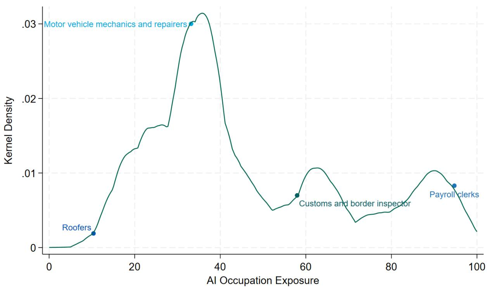  
Note: Results are population weighted and include workers aged 15 to 64. For a list of the income category per country, survey coverage and number of observations, please see Table 1 in the appendix. For country values for this category and other socio-demographic characteristics see Table 2.

Plotting the AIOE for low-, lower-middle-, upper-middle- and high-income countries on the basis of the normalized AIOE rate confirms that high-income countries have by far the highest occupational exposure to AI. The mean exposure in high-income countries is 63 (on the normalized 0 to 100 scale), followed by upper-middle, lower-middle and low-income countries with mean exposure of 49, 44 and 37 respectively (Figure 2, upper figure). Further inspecting the distributions of the AI occupation exposure measures demonstrates a distribution that is focused on the right side, i.e. where higher AIOE values are, for high income countries, and a then wandering further and further to the left for upper-middle income to lower-middle income countries before the distribution is left-sided for low-income countries (Figure 2, lower figure). This suggests that the potential for occupations and tasks to be enhanced by AI and related technologies is already higher in high-income countries, while the potential is significantly lower in particularly low-income countries.

Figure 2: AI Occupational Exposure by Country Income Group  
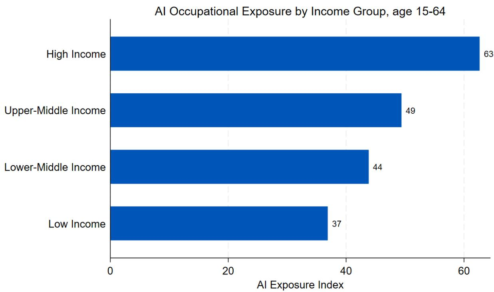

AI Occupation Exposure by Income group  
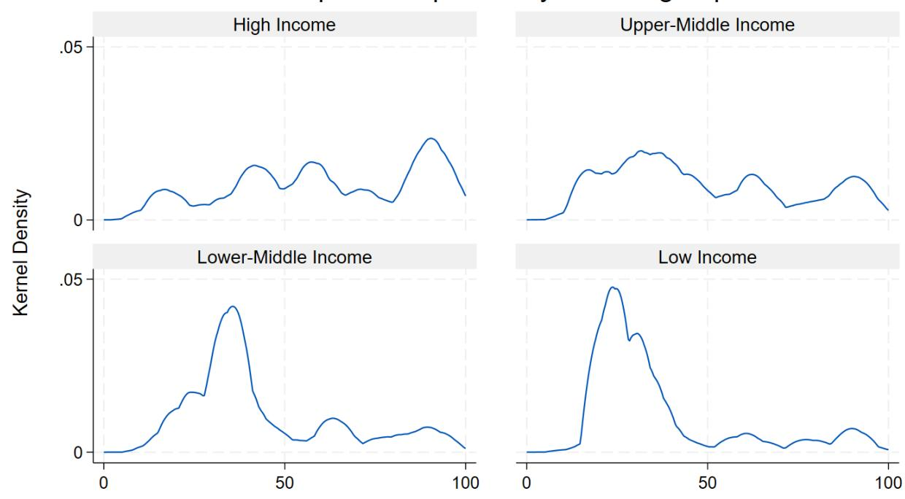  
Note: Results are population weighted and include workers aged 15 to 64. For a list of the income category per country, survey coverage and number of observations, please see Table 1 in the appendix. For country values for this category and other socio-demographic characteristics see Table 2.

Plotting each country's AIOE against logged GNI per capita confirms the general trend for the different income groups. Countries with a higher GNI per capita generally also have a higher AIOE. However, the analysis also shows that some countries can have different AIOE despite similar levels of logged GNI per capita. This is particularly the case for low and lower middle-income countries, but also for high income countries (Figure 3). Consider the examples of Tanzania and Mongolia, both lower middle-income countries: Tanzania has an AIOE of 39, the second lowest in our sample. At the same time, Mongolia has an AIOE of 54, the third highest AIOE in the sample (Table 2, Appendix). This documents significant differences between countries, even within the same income group, in terms of the potential role that AI can play.

Figure 3: AI Occupational Exposure by GNI per capita  
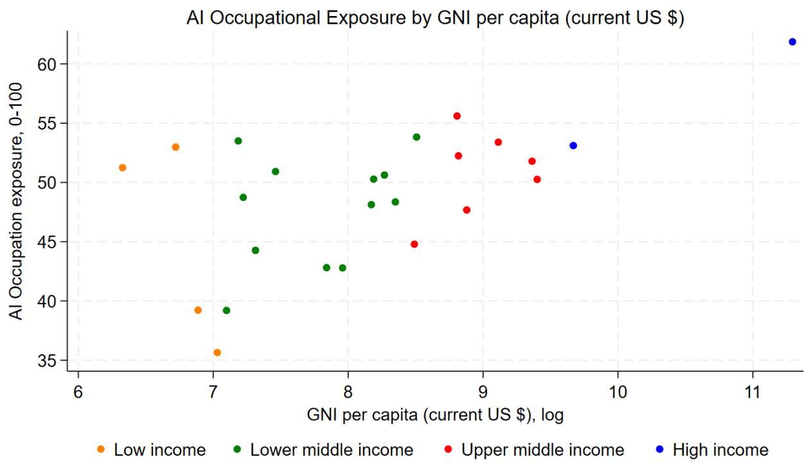  
Note: Results are population weighted and include workers aged 15-64. For a list of the income category per country, survey coverage and number of observations, please see Table 1 in the appendix.

We categorize the AIOE scores into four exposure levels (high, moderately high, moderately low and low exposure) and analyze these across country income groups and sub-groups such as age, gender, location and education. This provides additional distributional information besides the average value of the AIOE for each country, unmasking heterogeneities on the country level. (Figure 4).

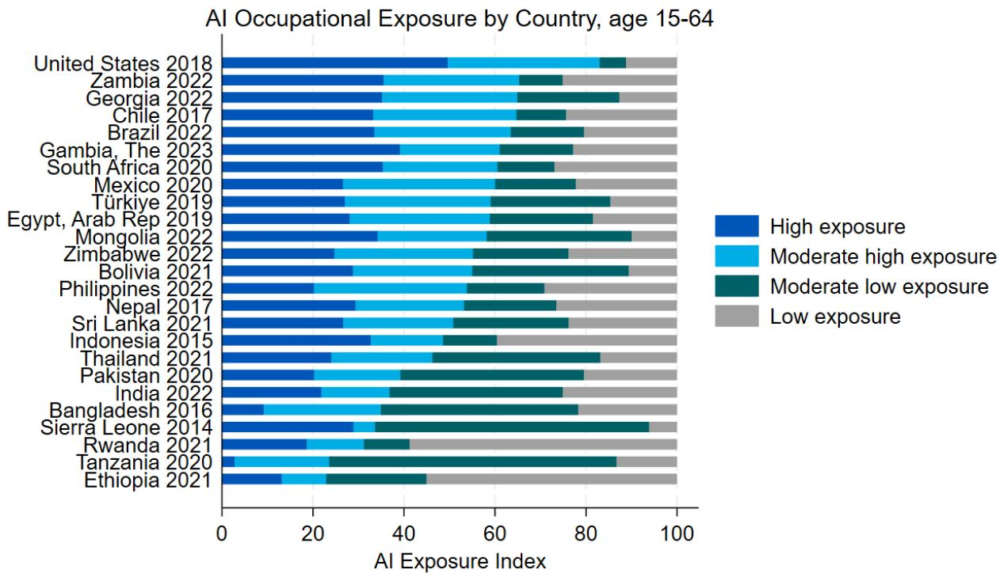  
Note: Results are population weighted and include workers aged 15 to 64. For a list of the income category per country, survey coverage and number of observations, please see Table 1 in the appendix. For country values for this category and other socio-demographic characteristics see Table 2.

## 3.2. The role of worker characteristics in determining AI occupational exposure

There is no clear difference in the age pattern across income groups. Younger workers, aged 15-24, tend to have left school earlier and are not employed in occupations with AI exposure (Figure 5). This may be explained by the fact that workers who leave education at a very early age are more likely to be employed in manual occupations.

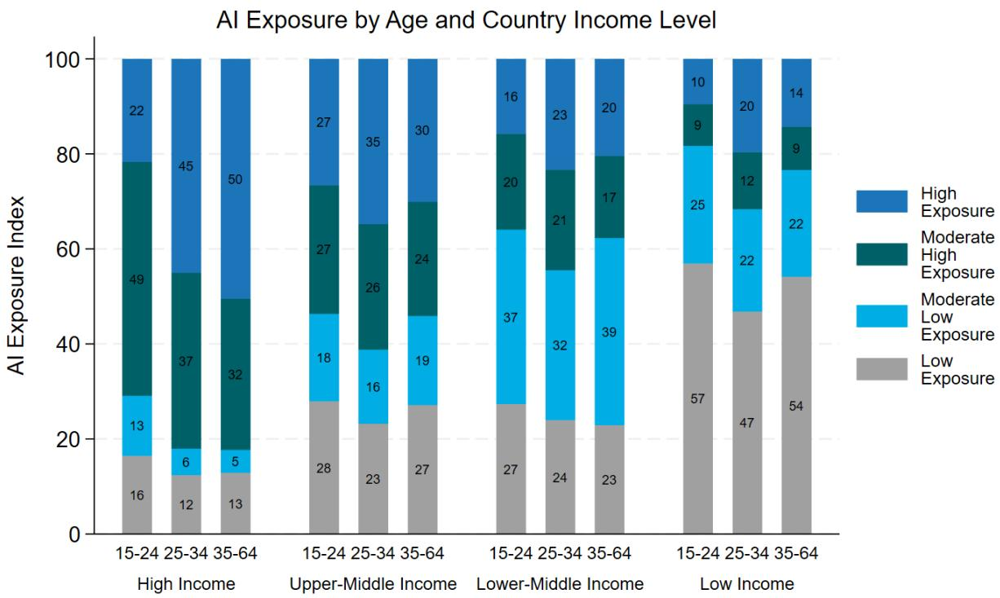  
Note: Results are population weighted and include workers aged 15 to 64. For a list of the income category per country, survey coverage and number of observations, please see Table 1 in the appendix. For country values for this category and other socio-demographic characteristics see Table 2.

Both male and female workers in low-income countries have much lower average occupational exposure to AI than those in LMIC, UMIC and HIC. At higher income levels, relatively more women are affected by and exposed to AI, widening the gender gap. For example, the difference is 9 points in HICs and 14 points in UMICs for the group of the highly exposed (Figure 6). A country-level disaggregation for men and women shows similar patterns in almost all countries: Women are more often highly exposed to AI their occupations in all countries.

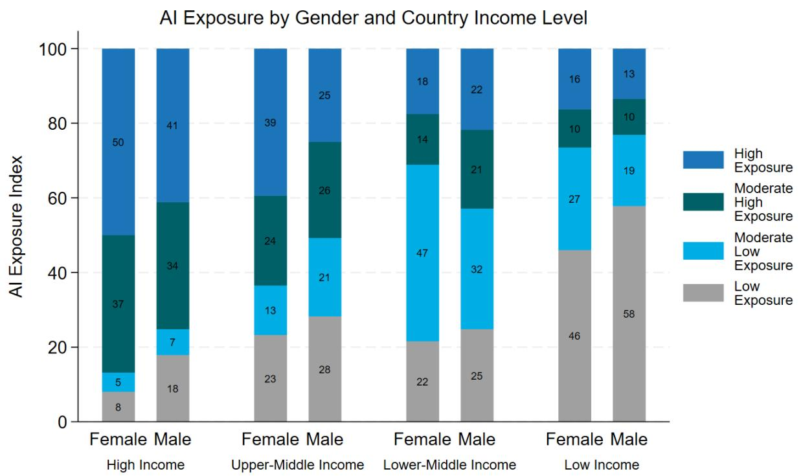

AI Occupational Exposure by Country and Gender, age 15-64  
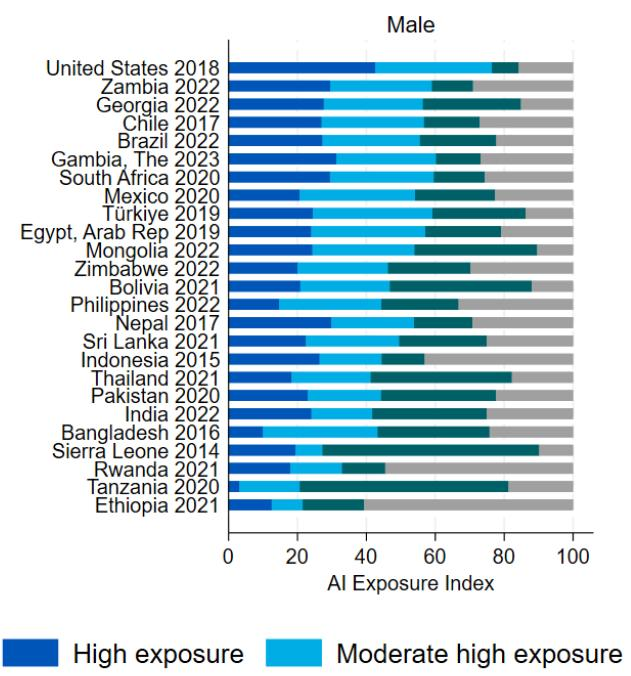

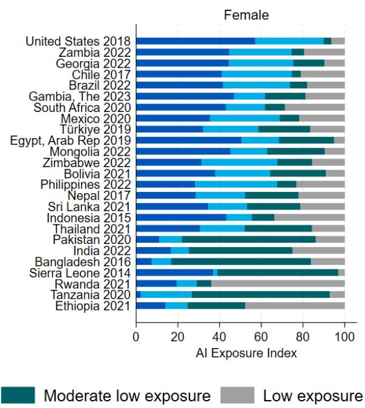  
Note: Results are population weighted and include workers aged 15 to 64. For a list of the income category per country, survey coverage and number of observations, please see Table 1 in the appendix. For country values for this category and other socio-demographic characteristics see Table 2.

Urban workers are much more exposed to AI than rural workers. The biggest difference between income groups is for workers in low-income countries: 62 percent of workers in rural areas of low-income countries have low exposure to AI, compared with only 19 percent in urban areas of low-income countries. The urban workers most exposed to AI are in high-income countries (Figure 7).

Figure 7: AI Exposure by Location and Country Income Level  
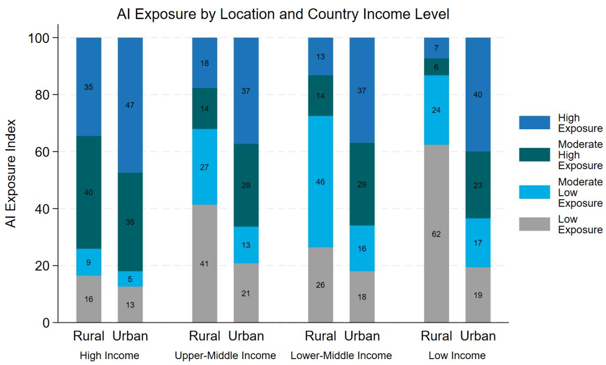  
Note: Results are population weighted and include workers aged 15 to 64. For a list of the income category per country, survey coverage and number of observations, please see Table 1 in the appendix. For country values for this category and other socio-demographic characteristics see Table 2.

When analyzing the relationship between income group, exposure to AI in the workplace and education, two patterns emerge: In all countries, the more educated workers are, the more likely they are to be exposed to AI in their daily work. And exposure increases slightly with income level. In low-income countries, around 80 percent of workers are exposed to AI in their jobs, rising to 82 percent in lower-middle-income countries, 91 percent in upper-middle-income countries and 90 percent in high-income countries. This is consistent with other research showing that better educated workers are in jobs that are more likely to be affected by AI (Figure 8).

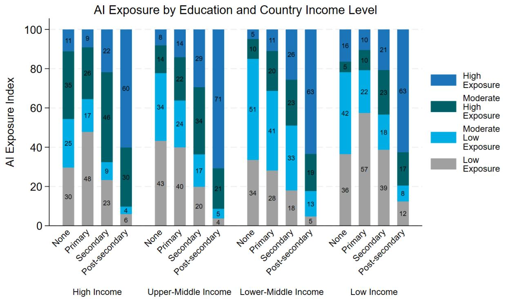  
Note: Results are population weighted and include workers aged 15 to 64. For a list of the income category per country, survey coverage and number of observations, please see Table 1 in the appendix. For country values for this category and other socio-demographic characteristics see Table 2.

## 3.3. The importance of job choice for AI occupational exposure around the world

High-skilled occupations are more exposed to AI than medium- and low-skilled occupations. The ILO defines high-skilled occupations as ISCO categories for "Managers", "Professionals" and "Technicians", low-skilled occupations as ISCO categories for "Elementary occupations" and all other occupations as medium-skilled. $^{9}$ A comparison of skill levels and occupations with the AIOE exposure categories shows that high-skilled workers are much more exposed to AI than medium-skilled workers (Figure 9). Low-skilled workers, or those in elementary occupations, have very low exposure to AI. This confirms the general notion that higher-skilled workers will be more affected by the development of AI (e.g. Felten et al. 2021). Looking at the effects by sector, white collar industries are most exposed to AI overall. This includes commerce, public administration, and financial and business services. The least AI exposed occupations are in blue collar industries such as construction or mining (Figure 12, Appendix).

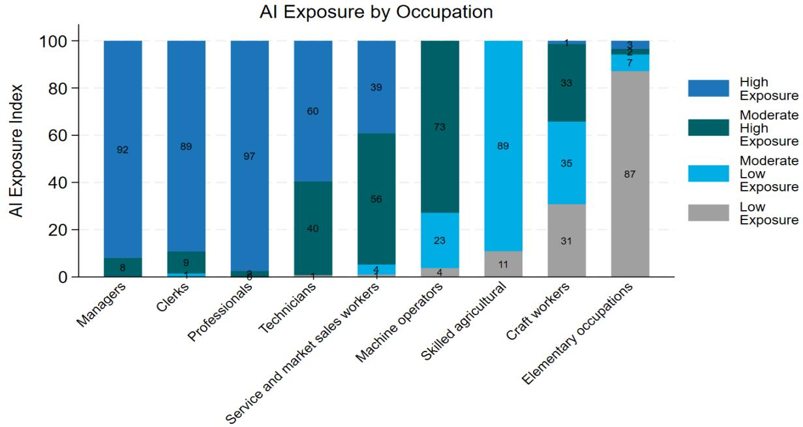  
Note: Results are population weighted and include workers aged 15 to 64. For a list of the income category per country, survey coverage and number of observations, please see Table 1 in the appendix. For country values for this category and other socio-demographic characteristics see Table 2.

## 3.4. Occupation and industry sector are the strongest predictors of AI occupation exposure

In addition to the bivariate analysis described in the previous section, we also estimate a multivariate regression model that includes the same variables. This provides descriptive insights into the relationship between all variables and AIOE.

The general trend is similar as to the bivariate results, but a few things stand out:

1) Working as a professional compared to working in elementary occupations increases exposure to AIOE by 66 points for high income countries, 56 points for upper middle-income countries, 60 points for lower middle-income countries and 56 points for low-income countries. While the result is partly by construction, as the AIOE is constructed by the different occupations, it nonetheless highlights how occupations are differentially affected by AI at a more aggregated level, even after controlling for survey year, country fixed effects and variables on economic structure and worker characteristics. Similar results, although not as large and significant as for occupations, are found for economic activities (Table 3, appendix).

2) Overall, age appears to be related to exposure to AI occupations only in lower-middle and high-income countries. This finding is consistent with Cazzaniga et al. (2024), who find for a smaller set of five advanced and emerging countries that age differences between workers do not follow a consistent pattern in their relative exposure. At the same time, workers with post-secondary education are more exposed to AI than uneducated workers in low- and upper-middle-income countries. Note that this is different from the bivariate analysis (Figure 7), where post-secondary education was strongly associated with high exposure to AI occupations. Thus, the introduction of other variables into the regression framework suggests that there are other, likely correlated, variables that influence AI occupation exposure. For example, better educated workers are also more likely to work as professionals and therefore have a higher AIOE, but it is not education per se that is driving high AI occupation exposure (see Table 3 in the appendix).

3) In terms of employment status, self-employment and unpaid work are significantly associated with higher exposure to AI compared to paid work in low, lower-middle and upper-middle income countries, according to the multivariate regression results (Table 3, Appendix). This suggests a large difference in the task structure of self-employed compared to paid workers, with the former having a higher potential for adopting AI technologies. Gender and location differences play a smaller role in the multivariate results. Living in an urban area is only significantly associated with higher AIOE in high-income and lower-middle-income countries.

## 3.5. Lack of electricity infrastructure as a barrier to AI applications

In the previous analysis, we assumed that AI is ready for use in occupations. This assumption is in line with previous analyses such as Felten et al. (2021, 2023). However, almost all of these analyses are conducted in high-income countries, mostly in the US, where the infrastructural prerequisites for AI, namely access to electricity, access to the internet and ownership of a smartphone/laptop, are in place. This is not always the case in the developing world, where access to electricity, Sustainable Development Goal 7, is lacking for around 760 million people, most of whom live in Sub-Saharan Africa (IEA 2023). This figure rises to 1.2 billion if households with theoretical access to electricity are included, meaning that the electricity is there but often not working, unreliable or too expensive to use (Min et al. 2024). In terms of internet users, the World Bank (2024) reports 5.3 billion internet users in 2022, with a world population of 8 billion. High- and middle-income countries have made significant progress in recent years, but low-income countries are lagging behind, with only one in four using the internet.

To shed light on access to electricity we included access to electricity at the household level in the analysis, assuming that access to electricity at the household level is similar to access to electricity in the occupations in which workers work. $^{10}$ For a better presentation, the high and medium high exposure categories are grouped together as “higher exposure” and the low and medium low exposure categories are grouped together as “lower exposure”. Overall, there are no differences between high-income and upper-middle-income countries. However, this changes drastically for low-income countries, where around 41 percent of occupations do not have access to electricity. The figure is lower for lower-middle income countries, with 5 percent. (Figure 10).

Figure 10: AI Exposure by Electricity Access and Country Income Level  
AI Exposure by Electricity Access and Country Income Level  
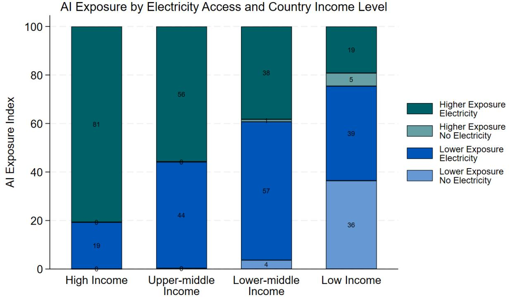  
Note: Results are population weighted and include workers aged 15 to 64. For a list of the income category per country, survey coverage and number of observations, please see Table 1 in the appendix. For country values for this category and other socio-demographic characteristics see Table 2.

When the results are further broken down into urban and rural areas, a clear and unsurprising pattern emerges: Rural areas are much more likely to be without electricity. Rural occupations in low-income countries report exposure to AI but no access to electricity for 51 percent of workers, compared with 9 percent in urban areas in low-income countries. The trend is again smaller but similar for lower middle-income countries (Figure 11). Bearing in mind that there is a significant number of households that have access to electricity but cannot use it for various reasons, also more likely in rural areas, our results can be interpreted as an upper bound.

Figure 11: AI Exposure by Electricity Access, Location and Country Income Level  
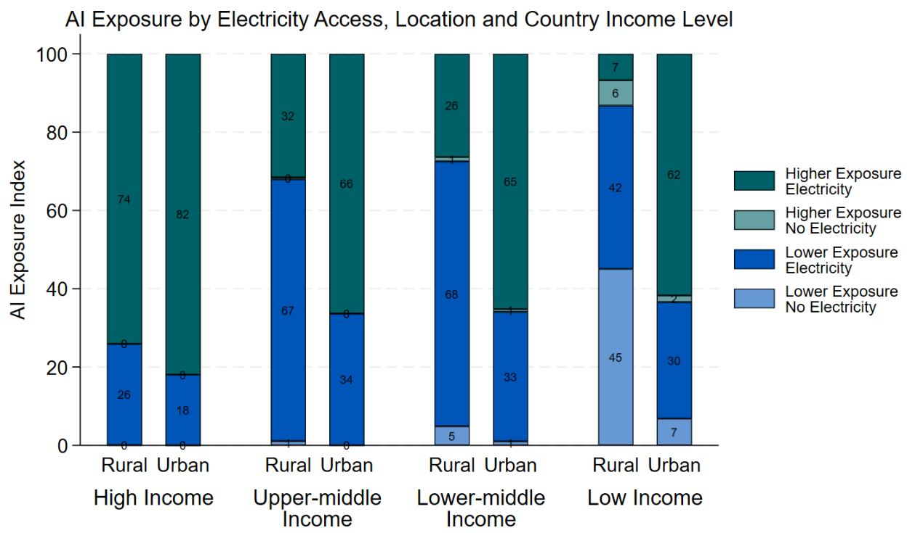  
Note: Results are population weighted and include workers aged 15 to 64. For a list of the income category per country, survey coverage and number of observations, please see Table 1 in the appendix. For country values for this category and other socio-demographic characteristics see Table 2.

## 4. Conclusion

This paper discusses the potential of artificial intelligence for the next generation of work. While most previous economic research has focused on high-income countries, this is one of the first papers to look specifically at middle- and low-income countries. The analysis applies information from the AI occupation exposure index developed by Felten et al. (2021) to a harmonized set of representative labor force surveys for 25 countries across income groups. The total sample contains about 3 million observations and represents a population of 3.5 billion people. The results show that substantial disparities persist across income groups: High-income countries have the highest exposure to AI, with more than one in two workers exposed, 62 percent. This is followed by upper-middle-income countries with an exposure level of 49, lower-middle-income countries with 44, and low-income countries with lower exposure levels of 37. The persistent gap underscores the uneven global distribution of the potential benefits and challenges of AI. The result suggests heterogeneity in the impact of AI on labor markets across national contexts, which may have important policy implications.

The multivariate analysis of worker characteristics on occupational exposure to AI underlines the need for a more nuanced perspective across income levels: Education has a pronounced effect in lower- and upper-middle-income countries. This suggests that better educated individuals in these regions may be able to adopt or adapt more quickly to AI-induced changes in the labor market. Gender differences in AI exposure exist and are particularly pronounced in middle-income countries. Urban workers are generally more exposed to AI than rural workers, emphasizing the role of urbanization and occupational choice for a possible effect of AI technologies on employment, productivity, and earnings. We find further support for the idea that advances in AI will disproportionately affect professionals and technicians compared to those in elementary occupations. This notion is also supported by a sectoral analysis, which shows that white-collar industries are more exposed to AI, especially in low- to upper-middle-income countries, while blue-collar industries are less exposed.

Often, analyses build on AI approaches without considering the needed infrastructure. We find that workers in low-income countries, and particularly in rural areas, do not have access to electricity, a prerequisite to any AI development. This needs to be considered in any future AI policy response. Households in low-income countries and in rural areas are often at the very last end of development and instead of bridging the gap, AI has the potential to even further exacerbate the gap between rural and urban areas, but also between low income and other income countries.

Overall, these findings underscore the importance of tailored policy responses to manage the impact of AI on the workforce. The labor market structure in low- and middle-income countries calls for a different policy response to the recent AI advancements than in high-income countries. The observed within-group differences further suggest more nuanced, country-specific strategies to effectively harness the productive potential of AI while mitigating its risks. The results in this paper can act as an early baseline to start a discussion on AI investments and opportunities in low- and middle-income countries.

Our results suggest that fears that AI will generate large labor-market disruptions in many LMICs may be exaggerated, at least in the near term. They are compatible with the view of Björkegren (2023) that the more immediate impact of AI in low- and middle-income countries may be an improvement in access to higher quality services, particularly in health and education. An AI strategy that lifts the economic opportunities and mitigates downside risks on employment and incomes needs information on the possible effects of AI in these countries.

## Literature

Acemoglu, D., Autor, D., Hazell, J., & Restrepo, P. 2022. Artificial intelligence and jobs: Evidence from online vacancies. Journal of Labor Economics, 40(S1), S293-S340.

Acemoglu, D. and Johnson, S. 2023. Rebalancing AI, IMF: F&D, p. 26-29.

Acemoglu, D., and Restrepo, P. 2019. Automation and new tasks: How technology displaces and reinstates labor. Journal of Economic Perspectives, 33(2), 3-30.

Acemoglu, D., and Restrepo, P. 2020. Robots and jobs: Evidence from US labor markets. Journal of Political Economy, 128(6), 2188-2244.

Agrawal, A., Gans, J., and Goldfarb, A. 2019. Economic policy for artificial intelligence. Innovation policy and the economy, 19(1), 139-159.

Autor, D., Chin, C., Salomons, A. and Seegmiller, B. 2024. New frontiers: The origins and content of new work, 1940–2018. The Quarterly Journal of Economics, 139(3): 1399-1465.

Autor, D. H., & Handel, M. J. 2013. Putting tasks to the test: Human capital, job tasks, and wages. Journal of labor Economics, 31(S1), S59-S96.

Autor, D.H., Levy, F., Murnane, R.J. 2003. The Skill Content of Recent Technological Change: An Empirical Exploration, The Quarterly Journal of Economics, 118(4): 1279–1333.

Behrens, V., and Trunschke, M. 2020. Industry 4.0 related innovation and firm growth. ZEW-Centre for European Economic Research Discussion Paper, (20-070).

Babina, T., Fedyk, A., He, A., and Hodson, J. 2024. Artificial intelligence, firm growth, and product innovation. Journal of Financial Economics, 151, 103745.

Björkegren, D. 2023. Artificial Intelligence for the Poor." Foreign Affairs, August 2023, available at: Artificial Intelligence for the Poor | Foreign Affairs

Brynjolfsson, E., Li, D., and Raymond, L. R. 2023. Generative AI at work (No. w31161). National Bureau of Economic Research.

Brynjolfsson, E., Mitchell, T., and Rock, D. 2018. What Can Machines Learn, and What Does It Mean for Occupations and the Economy? AEA Papers and Proceedings, 108: 43–47.

Brynjolfsson, E., Thierer, A., Acemoglu, D. 2024. Navigating the future of work – Perspectives on automation, AI, and economic prosperity, American Enterprise Institute for Public Policy Research.

Brynjolfsson, E., Rock, D., and Syverson, C. 2019. Artificial intelligence and the modern productivity paradox. The Economics of Artificial Intelligence: An agenda, 23, 23-57.

Comunale, M. and Manera, A. 2024. The Economic Impacts and the Regulation of AI: A Review of the Academic Literature and Policy Actions., IMF Working Paper No. 2024/65.

Cazzaniga, M., Jaumotte, F., Li, L., Melina, G., Panton, A.J., Pizzinelli, C., Rockall, E., and Tavares, M.M. 2024. Gen-AI: Artificial Intelligence and the Future of Work. IMF Staff Discussion Note, SDA/2024/001, 2024.

Czarnitzki, D., Fernandez, G.P., Rammer, C., 2023. Artificial intelligence and firm-level productivity. Journal of Economic Behavior and Organization, Vol. 211.

Eloundou, T., Manning, S., Mishkin, P. and Rock, D. 2023. Gpts are gpts: An early look at the labor market impact potential of large language models, arXiv preprint arXiv:2303.10130.

Felten, E., Raj, M. and Seamans, R. 2018. A method to link advances in artificial intelligence to occupational abilities. AEA Papers and Proceedings 108:54–57.

Felten, E., M. Raj, and Seamans, R. 2021. Occupational, Industry, and Geographic Exposure to Artificial Intelligence: A Novel Dataset and Its Potential Uses. Strategic Management Journal 42(12): 2195–217.

Felten, E., Raj, M., & Seamans, R. 2023. How will language modelers like chatgpt affect occupations and industries?. arXiv preprint arXiv:2303.01157.

Frey, C.B. and Osborne, M.A. 2017. The Future of Employment: How susceptible are jobs to computerisation?, Technological Forecasting and Social Change, 114, pp. 254-280.

Gmyrek, P., Berg, J., and Bescon, D. 2023. Generative AI and jobs: A global analysis of potential effects on job quantity and quality, ILO Working Paper 96.

Gmyrek, P., Winkler-Seales, H.J., and Garganta, S. 2024. Buffer or Bottleneck? Employment Exposure to Generative AI and the Digital Divide in Latin America (English). Policy Research working paper; Washington, D.C.: World Bank Group.

Hazan, E., Madgavkar, A., Chui, M., Smit, S., Maor, D., Dandona, G.S., and Huyghues-Despointes, H. 2024. A new future of work: The race to deploy AI and raise skills in Europe and beyond, McKinsey Global Institute.

Hatzius, J., Briggs, J., Kodnani, D., and Pierdomenico, G. (2023). The potentially large effects of Artificial Intelligence on Economic Growth, Goldman Sachs Economics Research.

IEA 2023. World Energy Outlook 2023, IEA, Paris, available online: https://www.iea.org/reports/world-energy-outlook-2023.

Lou, B., Sun, H., and Sun, T. 2024. GPTs in the Developing Economy: Impact on the Labor Market and the Role of Geography and Policy. Available at SSRN 4786527.

Min, B., O'Keeffe, Z.P., Abidoye, B., Gaba, K.M, Monroe, T. Stewart, B.P., Baugh, K., Sánchez-Andrade Nuño, B. 2024. Lost in the dark: A survey of energy poverty from space, Joule, Volume 8, Issue 7.

Maslej, N., Fattorini, L., Perrault, R., Parli, V., Reuel, A., Brynjolfsson, E., Etchemendy, J., Ligett, K., Lyons, T., Manyika, J., Niebles, J.C., Shoham, Y., Wald, R., and Clark, J. 2024.

The AI Index 2024 Annual Report, AI Index Steering Committee, Institute for Human-Centered AI, Stanford University, Stanford, CA, April 2024.

Noy, S., and Zhang, W. 2023. Experimental evidence on the productivity effects of generative artificial intelligence. Science, 381(6654), 187-192.

Pizzinelli, C., Panton, A., Tavares, M.M., Cazzaniga, M., and Li, L. 2023 Labor Market Exposure to AI: Cross-country Differences and Distributional Implications. IMF Working Paper, WP/23/216.

Svanberg, M.S., Li, W., Fleming, M., Goehring, B.C., and Thompson, N. 2024. “Beyond AI Exposure: Which Tasks are Cost-Effective to Automate with Computer Vision?” MIT FutureTech, Working Paper. http://dx.doi.org/10.2139/ssrn.4700751

Van Roy, V., Vertesy, D., and Damioli, G. 2020. AI and robotics innovation. Handbook of labor, human resources and population economics, 1-35.

Webb, M. 2019. The Impact of Artificial Intelligence on the Labor Market. SSRN Scholarly Paper. Rochester, NY.

World Bank 2022. The State of Global Learning Poverty: 2022 Update. Washington, DC: World Bank.

World Bank 2024. Digital Progress and Trends Report 2023. Washington, DC: World Bank.

World Economic Forum 2023. Future of jobs report.

Country, survey, and sample size overview

Table 2: Sample information

<table><tr><td>Country Name</td><td>Income Level</td><td>Year of Survey</td><td>Sample Size</td></tr><tr><td>Bangladesh</td><td>Lower middle income</td><td>2016</td><td>181,415</td></tr><tr><td>Bolivia</td><td>Lower middle income</td><td>2021</td><td>113,136</td></tr><tr><td>Brazil</td><td>Upper middle income</td><td>2022</td><td>162,694</td></tr><tr><td>Chile</td><td>High income</td><td>2017</td><td>91,679</td></tr><tr><td>Egypt, Arab Rep.</td><td>Lower middle income</td><td>2019</td><td>84,260</td></tr><tr><td>Ethiopia</td><td>Low income</td><td>2021</td><td>68,462</td></tr><tr><td>Gambia, The</td><td>Low income</td><td>2023</td><td>15,212</td></tr><tr><td>Georgia</td><td>Upper middle income</td><td>2022</td><td>26,016</td></tr><tr><td>India</td><td>Lower middle income</td><td>2022</td><td>163,939</td></tr><tr><td>Indonesia</td><td>Upper middle income</td><td>2015</td><td>332,697</td></tr><tr><td>Mexico</td><td>Upper middle income</td><td>2020</td><td>181,922</td></tr><tr><td>Mongolia</td><td>Lower middle income</td><td>2022</td><td>20,574</td></tr><tr><td>Nepal</td><td>Lower middle income</td><td>2017</td><td>16,727</td></tr><tr><td>Pakistan</td><td>Lower middle income</td><td>2020</td><td>168,521</td></tr><tr><td>Philippines</td><td>Lower middle income</td><td>2022</td><td>691,262</td></tr><tr><td>Rwanda</td><td>Low income</td><td>2021</td><td>19,001</td></tr><tr><td>Sierra Leone</td><td>Low income</td><td>2014</td><td>7,650</td></tr><tr><td>South Africa</td><td>Upper middle income</td><td>2020</td><td>49,306</td></tr><tr><td>Sri Lanka</td><td>Lower middle income</td><td>2021</td><td>28,881</td></tr><tr><td>Tanzania</td><td>Lower middle income</td><td>2020</td><td>28,461</td></tr><tr><td>Thailand</td><td>Upper middle income</td><td>2021</td><td>115,614</td></tr><tr><td>Türkiye</td><td>Upper middle income</td><td>2019</td><td>161,300</td></tr><tr><td>United States</td><td>High income</td><td>2018</td><td>42,733</td></tr><tr><td>Zambia</td><td>Lower middle income</td><td>2022</td><td>7,501</td></tr><tr><td>Zimbabwe</td><td>Lower middle income</td><td>2022</td><td>66,112</td></tr></table>

Figure 12: AI occupation exposure for the 2- and 4-digit occupation codes

## AI occupation exposure information detail for 2 digit and 4 digit ISCO codes

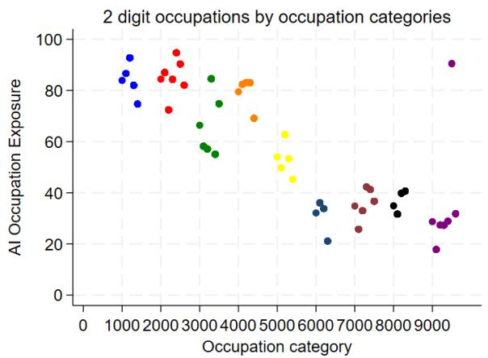

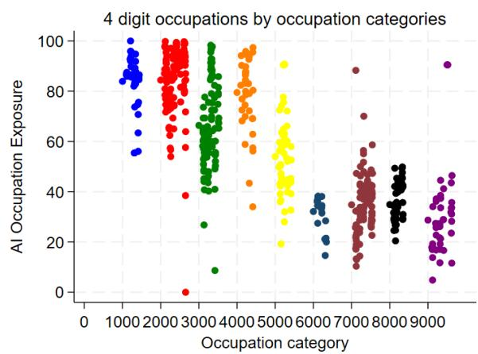  
- Professionals

• Technicians and associate professionals

• Service and sales workers

• Craft and related trades workers

\- Clerical support worker

\- Skilled agricultural, forestry and fishery workers

\- Plant and machine operators and assemblers

• Elementary occupations

Figure 13: AI exposure and industry sector  
AI Exposure by Industry Sector  
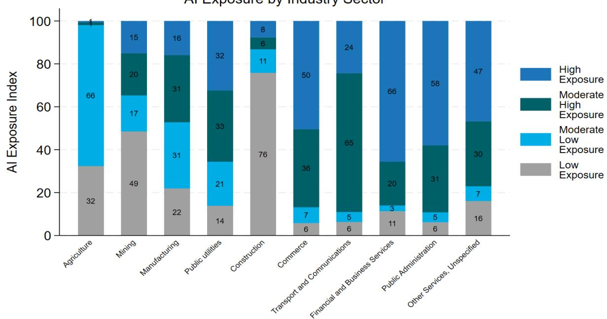

AI Occupation Exposure by Country  
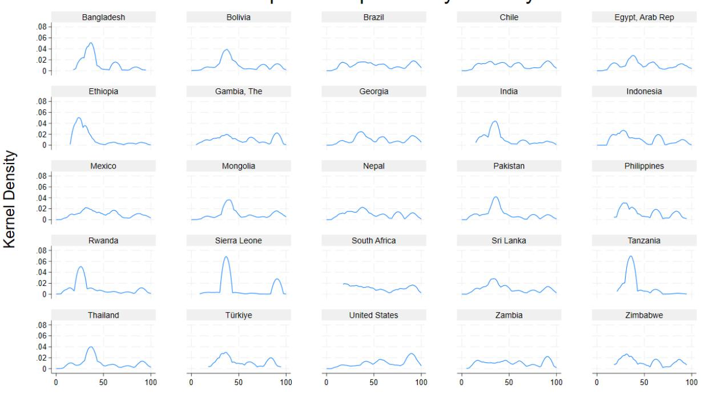

Table 3: Summary statistics on AIOE for socio-economic characteristics

<table><tr><td rowspan="2">Country Name</td><td rowspan="2">Average</td><td rowspan="2">Female</td><td rowspan="2">Male</td><td rowspan="2">Rural</td><td rowspan="2">Urban</td><td colspan="7">AI Occupation Exposure</td></tr><tr><td>No Education</td><td>Primary Education</td><td>Secondary Education</td><td>Post-secondary Education</td><td>Age 15-24</td><td>Age 25-34</td><td>Age 35-64</td></tr><tr><td>Bangladesh</td><td>43</td><td>39</td><td>44</td><td>41</td><td>48</td><td>36</td><td>40</td><td>50</td><td>68</td><td>42</td><td>43</td><td>43</td></tr><tr><td>Bolivia</td><td>50</td><td>55</td><td>46</td><td>41</td><td>54</td><td>43</td><td>42</td><td>46</td><td>62</td><td>47</td><td>52</td><td>51</td></tr><tr><td>Brazil</td><td>53</td><td>59</td><td>49</td><td>40</td><td>55</td><td>37</td><td>38</td><td>51</td><td>76</td><td>53</td><td>56</td><td>52</td></tr><tr><td>Chile</td><td>53</td><td>58</td><td>49</td><td>42</td><td>55</td><td>38</td><td>38</td><td>47</td><td>70</td><td>49</td><td>57</td><td>52</td></tr><tr><td>Egypt, Arab Rep.</td><td>51</td><td>63</td><td>48</td><td>46</td><td>57</td><td>41</td><td>39</td><td>48</td><td>75</td><td>40</td><td>49</td><td>54</td></tr><tr><td>Ethiopia</td><td>36</td><td>37</td><td>35</td><td>31</td><td>53</td><td>30</td><td>33</td><td>41</td><td>67</td><td>33</td><td>39</td><td>35</td></tr><tr><td>Gambia, The</td><td>53</td><td>56</td><td>50</td><td>46</td><td>57</td><td>51</td><td>49</td><td>55</td><td>74</td><td>45</td><td>54</td><td>56</td></tr><tr><td>Georgia</td><td>56</td><td>62</td><td>51</td><td>47</td><td>61</td><td>35</td><td>41</td><td>45</td><td>71</td><td>56</td><td>59</td><td>55</td></tr><tr><td>India</td><td>43</td><td>40</td><td>44</td><td>38</td><td>55</td><td>33</td><td>37</td><td>45</td><td>68</td><td>41</td><td>45</td><td>42</td></tr><tr><td>Indonesia</td><td>45</td><td>49</td><td>43</td><td>36</td><td>52</td><td>32</td><td>37</td><td>50</td><td>76</td><td>44</td><td>47</td><td>44</td></tr><tr><td>Mexico</td><td>50</td><td>56</td><td>47</td><td>40</td><td>53</td><td>35</td><td>40</td><td>52</td><td>72</td><td>45</td><td>53</td><td>50</td></tr><tr><td>Mongolia</td><td>54</td><td>58</td><td>50</td><td>45</td><td>58</td><td>38</td><td>39</td><td>45</td><td>61</td><td>52</td><td>58</td><td>52</td></tr><tr><td>Nepal</td><td>49</td><td>49</td><td>48</td><td>44</td><td>51</td><td>38</td><td>41</td><td>52</td><td>72</td><td>45</td><td>51</td><td>49</td></tr><tr><td>Pakistan</td><td>44</td><td>41</td><td>45</td><td>40</td><td>53</td><td>35</td><td>43</td><td>58</td><td>79</td><td>41</td><td>45</td><td>45</td></tr><tr><td>Philippines</td><td>48</td><td>55</td><td>43</td><td>44</td><td>52</td><td>35</td><td>40</td><td>42</td><td>64</td><td>44</td><td>52</td><td>48</td></tr><tr><td>Rwanda</td><td>39</td><td>39</td><td>39</td><td>35</td><td>50</td><td>30</td><td>33</td><td>41</td><td>68</td><td>32</td><td>40</td><td>42</td></tr><tr><td>Sierra Leone</td><td>51</td><td>56</td><td>46</td><td>46</td><td>68</td><td>48</td><td>55</td><td>64</td><td>81</td><td>49</td><td>52</td><td>52</td></tr><tr><td>South Africa</td><td>52</td><td>55</td><td>50</td><td>45</td><td>55</td><td>38</td><td>41</td><td>54</td><td>74</td><td>48</td><td>52</td><td>53</td></tr><tr><td>Sri Lanka</td><td>48</td><td>52</td><td>46</td><td>46</td><td>60</td><td>34</td><td>38</td><td>57</td><td>85</td><td>46</td><td>54</td><td>47</td></tr><tr><td>Tanzania</td><td>39</td><td>40</td><td>38</td><td>37</td><td>44</td><td>36</td><td>38</td><td>44</td><td>66</td><td>38</td><td>40</td><td>39</td></tr><tr><td>Thailand</td><td>48</td><td>51</td><td>45</td><td>43</td><td>53</td><td>33</td><td>39</td><td>47</td><td>69</td><td>44</td><td>51</td><td>47</td></tr><tr><td>Türkiye</td><td>52</td><td>54</td><td>51</td><td>N/A</td><td>N/A</td><td>37</td><td>39</td><td>48</td><td>74</td><td>48</td><td>57</td><td>50</td></tr><tr><td>United States</td><td>62</td><td>65</td><td>59</td><td>56</td><td>63</td><td>41</td><td>33</td><td>49</td><td>70</td><td>51</td><td>62</td><td>64</td></tr><tr><td>Zambia</td><td>54</td><td>59</td><td>50</td><td>44</td><td>59</td><td>48</td><td>48</td><td>55</td><td>76</td><td>46</td><td>55</td><td>55</td></tr><tr><td>Zimbabwe</td><td>51</td><td>57</td><td>46</td><td>45</td><td>56</td><td>N/A</td><td>N/A</td><td>N/A</td><td>N/A</td><td>43</td><td>50</td><td>54</td></tr><tr><td>Overall Mean</td><td>47</td><td>49</td><td>46</td><td>39</td><td>55</td><td>34</td><td>38</td><td>48</td><td>70</td><td>43</td><td>49</td><td>47</td></tr></table>

Note: Results are population weighted and include workers aged 15 to 64

Table 4: AIOE regression output

<table><tr><td></td><td>High Income</td><td>Upper-middle Income</td><td>Lower-middle Income</td><td>Low Income</td></tr><tr><td>Elementary occupations</td><td>Base</td><td>Base</td><td>Base</td><td>Base</td></tr><tr><td>Professionals</td><td>66.28**(36.61)</td><td>56.27***(22.66)</td><td>59.63***(77.39)</td><td>56.34***(22.66)</td></tr><tr><td>Technicians</td><td>53.62**(29.62)</td><td>39.71***(11.95)</td><td>39.65***(29.39)</td><td>37.34***(25.32)</td></tr><tr><td>Clerks</td><td>52.94**(42.42)</td><td>50.43***(9.29)</td><td>52.40***(41.91)</td><td>46.23***(31.18)</td></tr><tr><td>Service and market sales workers</td><td>36.05**(19.57)</td><td>21.92**(3.55)</td><td>25.29***(24.67)</td><td>21.84***(5.87)</td></tr><tr><td>Skilled agricultural</td><td>22.83(2.71)</td><td>11.48***(6.53)</td><td>4.039**(2.91)</td><td>-5.570***(-22.82)</td></tr><tr><td>Craft workers</td><td>20.88(6.24)</td><td>4.083(1.12)</td><td>6.219***(8.17)</td><td>7.611(1.01)</td></tr><tr><td>Machine operators</td><td>23.26*(9.95)</td><td>8.303*(2.15)</td><td>10.06***(12.83)</td><td>6.451*(2.44)</td></tr><tr><td>Managers</td><td>62.62**(26.17)</td><td>49.86***(12.12)</td><td>51.26***(25.14)</td><td>49.46***(18.74)</td></tr><tr><td>Agriculture</td><td>Base</td><td>Base</td><td>Base</td><td>Base</td></tr><tr><td>Mining</td><td>6.305(0.78)</td><td>3.084(0.94)</td><td>-2.952**(-2.87)</td><td>-4.697(-1.65)</td></tr><tr><td>Manufacturing</td><td>6.809(1.02)</td><td>9.010(1.71)</td><td>-0.600(-0.38)</td><td>0.875(0.19)</td></tr><tr><td>Public utilities</td><td>7.603(1.22)</td><td>10.87**(2.80)</td><td>1.639(1.70)</td><td>6.291**(3.92)</td></tr><tr><td>Construction</td><td>7.668(0.97)</td><td>1.002(0.19)</td><td>-5.899***(-6.34)</td><td>-0.113(-0.13)</td></tr></table>

<table><tr><td>Commerce</td><td>8.108(1.28)</td><td>17.01*(2.04)</td><td>8.305***(5.58)</td><td>17.24***(8.12)</td></tr><tr><td>Transport and Communications</td><td>7.484(1.18)</td><td>12.74*(2.49)</td><td>4.454***(3.61)</td><td>10.42**(3.90)</td></tr><tr><td>Financial and Business Services</td><td>12.52(1.79)</td><td>11.70*(2.04)</td><td>4.251***(3.37)</td><td>9.439*(2.81)</td></tr><tr><td>Public Administration</td><td>6.322(0.98)</td><td>10.91*(2.20)</td><td>1.153(0.84)</td><td>5.327*(2.84)</td></tr><tr><td>Other Services</td><td>1.274(0.19)</td><td>4.475(0.88)</td><td>-3.788**(-2.82)</td><td>3.980(1.31)</td></tr><tr><td>15-24</td><td>Base</td><td>Base</td><td>Base</td><td>Base</td></tr><tr><td>25-34</td><td>1.682**(19.10)</td><td>0.121(0.43)</td><td>0.173**(2.93)</td><td>0.379(1.36)</td></tr><tr><td>35-64</td><td>3.614**(31.18)</td><td>0.272(1.04)</td><td>0.241**(3.09)</td><td>0.719(0.93)</td></tr><tr><td>Female</td><td>Base</td><td>Base</td><td>Base</td><td>Base</td></tr><tr><td>Male</td><td>-2.520**(-49.21)</td><td>-0.478***(-5.48)</td><td>-0.123(-0.91)</td><td>0.176(0.24)</td></tr><tr><td>Rural</td><td>Base</td><td>Base</td><td>Base</td><td>Base</td></tr><tr><td>Urban</td><td>0.960**(57.85)</td><td>-0.310(-1.14)</td><td>0.363***(3.32)</td><td>-0.0351(-0.05)</td></tr><tr><td>No education</td><td>Base</td><td>Base</td><td>Base</td><td>Base</td></tr><tr><td>Primary</td><td>-0.800(-0.81)</td><td>0.197(0.44)</td><td>0.249(1.30)</td><td>-0.246(-0.26)</td></tr><tr><td>Secondary</td><td>-0.245(-0.30)</td><td>0.577(1.55)</td><td>0.0924(0.38)</td><td>-0.287(-0.30)</td></tr><tr><td>Post-secondary</td><td>3.241(3.57)</td><td>3.750***(5.76)</td><td>1.767***(5.05)</td><td>0.975(1.61)</td></tr></table>

<table><tr><td>Paid employee</td><td>Base</td><td>Base</td><td>Base</td><td>Base</td></tr><tr><td rowspan="2">Non-paid employee</td><td>4.704*</td><td>2.038**</td><td>3.209***</td><td>4.817***</td></tr><tr><td>(12.46)</td><td>(3.44)</td><td>(4.94)</td><td>(18.61)</td></tr><tr><td rowspan="2">Employer</td><td>-3.701</td><td>2.822**</td><td>1.550</td><td>4.898**</td></tr><tr><td>(-2.67)</td><td>(2.99)</td><td>(1.09)</td><td>(5.75)</td></tr><tr><td rowspan="2">Self-employed</td><td>-1.357</td><td>5.191***</td><td>4.075***</td><td>6.913***</td></tr><tr><td>(-1.21)</td><td>(11.07)</td><td>(6.24)</td><td>(32.86)</td></tr><tr><td rowspan="2">Other worker</td><td></td><td>-3.842</td><td>1.963***</td><td>4.099**</td></tr><tr><td></td><td>(-1.32)</td><td>(3.93)</td><td>(4.60)</td></tr><tr><td>Country Dummies</td><td>Yes</td><td>Yes</td><td>Yes</td><td>Yes</td></tr><tr><td>Survey Dummies</td><td>Yes</td><td>Yes</td><td>Yes</td><td>Yes</td></tr><tr><td rowspan="2">Constant</td><td>10.50</td><td>18.65***</td><td>26.46***</td><td>24.19***</td></tr><tr><td>(1.26)</td><td>(6.56)</td><td>(30.59)</td><td>(19.99)</td></tr><tr><td>Observations</td><td>123780</td><td>814562</td><td>1269224</td><td>82189</td></tr></table>