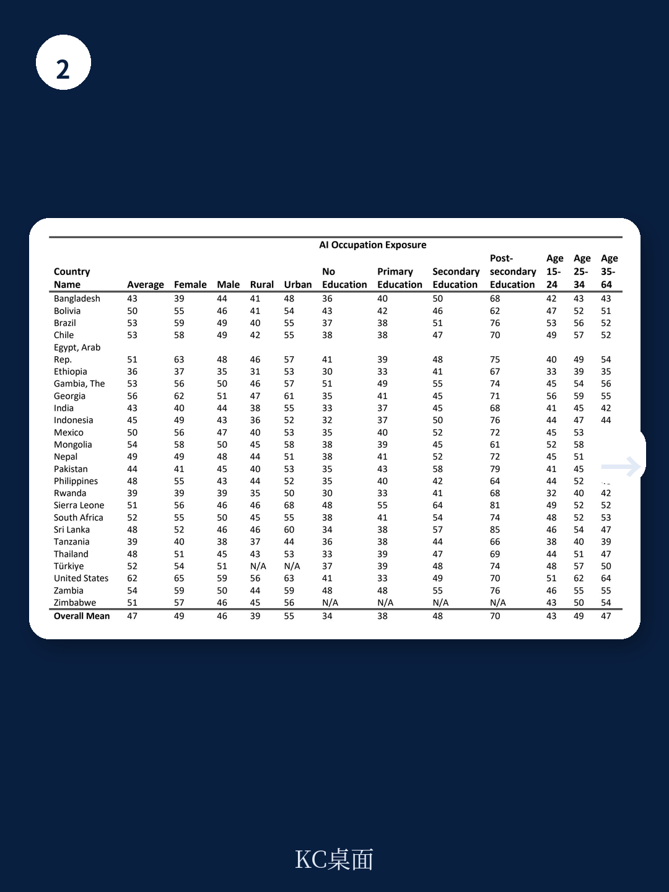

# 世界银行：AI对低收入国家劳动力的冲击，远比你想象的有限

关于人工智能如何重塑劳动力市场的讨论，过去两年几乎全部集中在发达经济体。硅谷的每一次模型发布、华尔街的每一份自动化报告，都在强化一个叙事：白领工作将被颠覆，知识工作者首当其冲。

但世界银行最新发布的工作论文提出了一个被严重忽视的问题：如果全球70%的劳动力生活在低收入和中等收入国家，那么基于美国O*NET职业分类得出的AI暴露度结论，有多大意义？

这份由Gabriel Demombynes、Jorg Langbein和Michael Weber撰写的研究报告，覆盖了25个国家、覆盖35亿人口、约300万工人的微观数据。它的核心判断值得每一位关注全球产业链和新兴市场投资的读者认真对待：**AI对全球劳动力市场的影响，不是均匀分布的。低收入国家的大部分工人，甚至还没有进入AI的“有效暴露”范围。**

这不是一个关于“谁会被替代”的故事，而是一个关于“谁会被真正触及”的结构性真相。

## 1. 低收入国家只有12%的工人处于高AI暴露区间，而美国这一比例超过60%

这是报告最直接也最反常识的发现。研究团队使用Felten等人开发的AI职业暴露指数（AIOE），将每个职业的暴露程度标准化为0到100的刻度。结果显示：

- 美国工人的平均暴露值为62。
- 上中等收入国家为49。
- 下中等收入国家为44。
- 低收入国家仅为37。

更直观的数字是：在低收入国家，只有12%的工人处于高暴露区间；而在美国，这个比例超过60%。

这意味着什么？不是低收入国家的工人“更安全”，而是他们的经济结构和职业分布决定了AI的触角尚未延伸过去。大量劳动力集中在农业、低技能服务业和手工制造业——这些领域的任务目前与AI能力重叠度极低。

> **KC评论：** 这个数字对投资者和跨国企业决策者而言，是一个重要的“分层信号”。如果你在评估自动化对东南亚或非洲供应链的影响，不要套用美国的暴露率。低收入国家的“低暴露”既是缓冲，也是滞后——当AI真正开始渗透农业和低端服务业时，这些经济体的调整能力也最弱。完整报告中的详细职业暴露分布表，可以帮助你按国家、按行业、按职业精准锁定风险区间。

## 2. 性别、教育和城乡差距在AI暴露中持续扩大，但方向与发达国家不同

在发达国家，AI暴露的性别差距——女性高于男性——已经被广泛讨论。世界银行的这份报告证实了这一趋势在全球范围内存在，但给出了更精细的图景：

在高收入和上中等收入国家，女性的AI暴露值显著高于男性。但在低收入国家，性别差距几乎消失。这不是因为女性变得更安全，而是因为低收入国家的女性劳动力大量集中在农业和家庭服务领域，这些职业的AI暴露度本身就很低。

教育维度上的分化更为关键。在上中等收入和下中等收入国家，拥有高等教育背景的工人，其AI暴露值比未受教育者高出3到4个点。但在低收入国家，教育带来的暴露溢价几乎为零。

城乡差距同样呈现非线性特征：在高收入国家，城市工人的暴露值比农村高近1个点；但在低收入国家，城乡差距不显著——因为城市和农村的职业结构差异尚未大到能体现AI的差异化影响。

> **KC评论：** 这些数据指向一个容易被忽略的判断：AI对发展中国家的影响，不是“冲击”，而是“分层”。最先被触及的，是那些已经有电、有网、有教育、有白领岗位的城市中产。而农村和低教育群体，不是被保护了，而是被暂时排除在AI经济之外。这种“选择性暴露”可能加剧发展中国家内部的不平等。报告中有按国家、按性别、按教育水平的详细回归表格，可以帮助你量化每个维度的边际效应。

## 3. 电力接入是AI有效暴露的硬约束，这被几乎所有讨论忽略了

报告最被低估的洞察之一，是将AI暴露度与家庭层面的电力接入数据进行了叠加分析。

研究团队发现，在低收入国家，大约一半的人口没有稳定的电力接入。如果只考虑“有电”的工人，AI暴露值会显著上升。换句话说，当前的低暴露部分原因不是职业结构“免疫”，而是基础设施未能支撑AI技术的有效渗透。

当一个工人没有稳定的电力供应时，讨论“AI是否会替代他的工作”在当下几乎没有意义。但反过来看，一旦电力基础设施改善，这部分劳动力的暴露度将迅速上升——而他们几乎没有技能缓冲。

报告给出的数据是：在低收入国家，农村地区的电力接入率远低于城市，而农村劳动力的AI暴露度本身又最低。这意味着，即便AI技术快速进步，它触及这些工人的路径也受制于物理基础设施的改善速度。

这对政策制定者和基础设施投资者意味着什么？AI的劳动力影响曲线，在低收入国家不是平滑的，而是阶梯式的——每一步电力普及，都会把一批新工人带入AI的“有效暴露区”。

## 4. 报告尚未完全回答的问题：AI对发展中国家的“替代”与“增强”如何平衡

报告明确区分了“暴露”与“替代”的概念。高暴露不等于失业，它可能意味着任务增强、效率提升或职业重构。但报告也承认，现有数据无法区分在发展中国家，AI更可能是替代还是增强。

这是一个关键但悬而未决的问题。

在发达国家，高技能工人往往能从AI增强中受益，低技能工人则面临替代风险。但在发展中国家，职业结构更扁平，知识密集型岗位更少，AI增强的受益面可能更窄。如果AI主要替代的是那些为数不多的白领岗位——比如会计、行政、客服——那么它对发展中国家的冲击将集中在少数城市精英阶层，而不是广泛扩散。

但另一种可能性也存在：如果AI通过移动端应用渗透到农业咨询、小微金融、远程教育等领域，它可能成为一种“跳跃式增强工具”，帮助低收入国家的工人绕过传统技能门槛。

报告没有给出答案，因为它需要更细颗粒度的任务级数据以及更长时间跨度的跟踪研究。这恰恰是完整报告中最值得继续深挖的部分——作者在方法论部分详细讨论了O*NET与ISCO职业编码的映射方式，以及AI暴露指数的构建逻辑，这些技术细节决定了结论的可靠性边界。

## 5. 对决策者的观察框架：从“AI会做什么”转向“AI能触及谁”

基于世界银行这份报告的逻辑，我们可以提炼出一个更实用的分析框架。

过去两年，绝大多数关于AI与劳动力的讨论都围绕“能力”——AI能做什么？能替代哪些任务？但现在，这份报告提醒我们，在全球化背景下，更关键的问题是“触及”——AI能触及哪些工人？哪些经济体？

这个框架包含三个层次：

第一层是基础设施约束。电力、互联网、移动设备覆盖率决定了AI技术的物理可达性。在低收入国家，这个约束是硬性的。

第二层是技能互补性。即使AI技术可以触及一个工人，该工人是否具备与AI协作的基本技能？报告数据显示，低收入国家70%的儿童在10岁时无法阅读简单文本，这意味着未来的劳动力供给与AI的互补性可能持续偏低。

第三层是职业结构。即使前两层条件满足，如果经济体中大部分岗位是农业和低技能服务业，AI的渗透速度也会慢于发达国家。

这三个层次叠加，得出的结论是：AI对全球劳动力市场的冲击将呈现“中心-外围”结构。中心是发达国家和新兴市场的白领集群，外围是低收入国家的农村和低技能劳动力。两者之间的鸿沟，不是AI能否替代的问题，而是AI能否触及的问题。

---

世界银行这份报告的价值，不在于它预测了AI的未来，而在于它揭示了当前讨论的盲区。当硅谷和华尔街的叙事聚焦于“谁会被替代”时，全球大部分劳动力甚至还没有进入AI的“有效暴露区”。

这不是一个安慰性的结论。低收入国家不是被保护了，而是被滞后了。当AI的基础设施约束逐步解除，当电力、网络和智能设备渗透到更广泛的劳动力群体时，这些经济体将面临一次集中的、缺乏缓冲的冲击。而那时，发达国家可能已经完成了第一轮技能重构。

**如果你想进一步研究：** 完整报告包含25个国家的详细AI暴露度数据表、按职业大类分组的回归结果、以及电力接入与暴露度的交叉分析。这些原始图表和数据是理解全球AI劳动力影响地图的基础材料。我们每天会由AI agent结合人工review，生成国际投行与多边机构的最新报告中文摘要与KC评论，约10-40页，也包含当天最新数据图表合集，既方便喂给AI，也方便人工快速把握全球市场动态。欢迎加入社群，获取完整研报解读与原始图表。

Personal reading notes and learning share only. Not investment advice.

