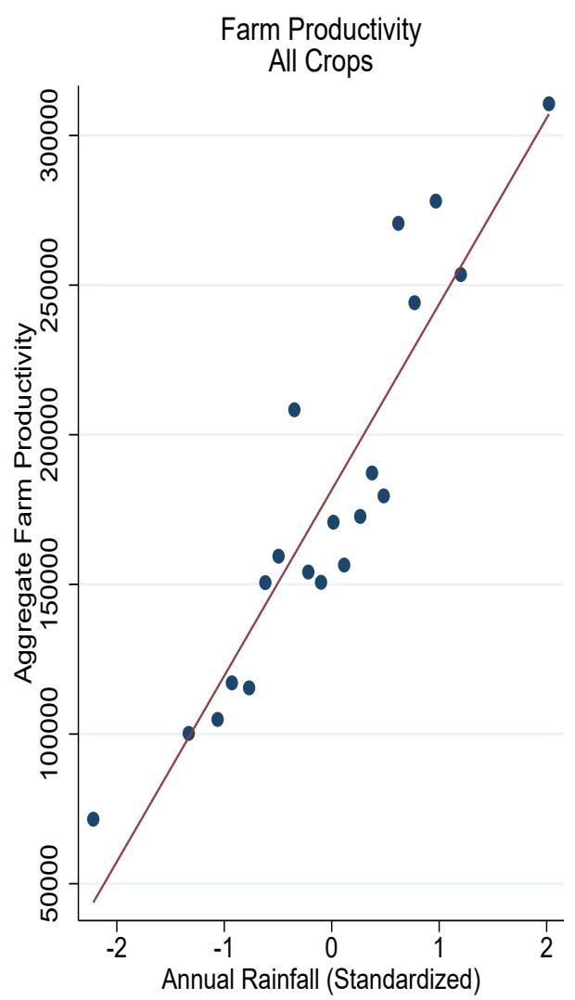
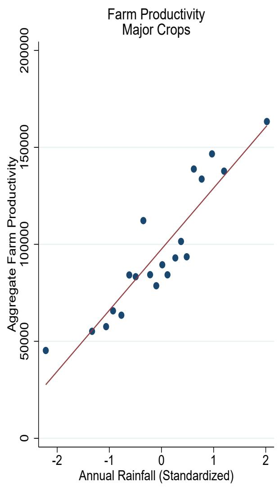
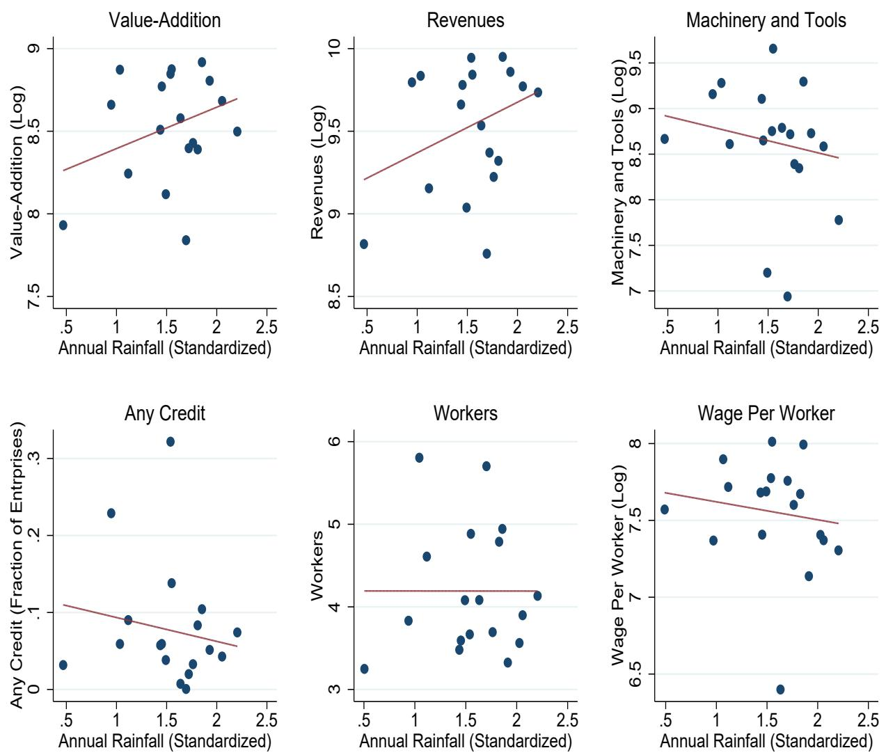
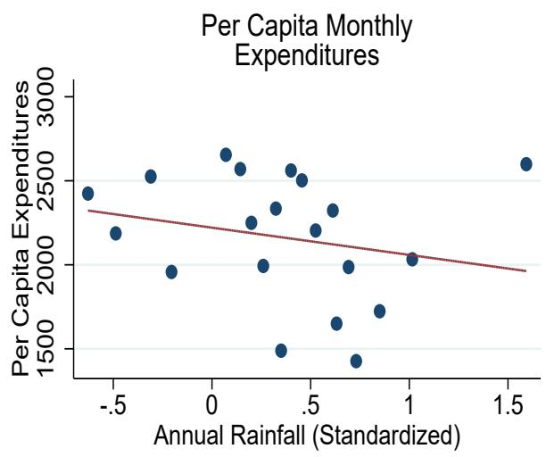
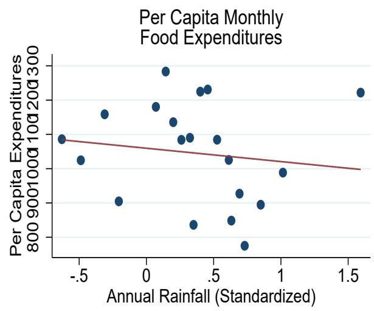
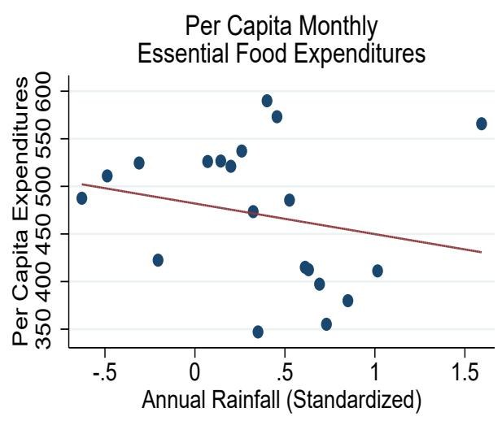
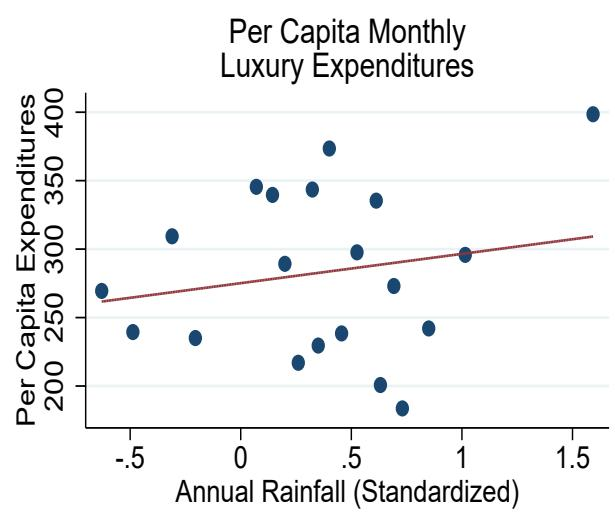

# Weather Shocks and Rural Economic Linkages

Evidence from Rajasthan's Agricultural and Non-Agricultural Sectors

Francis Addeah Darko

Akankshita Dey

S. K. Ritadhi

POLICY RESEARCH WORKING PAPER 11079

## Abstract

This study examines the complex relationships between rainfall shocks, agricultural productivity, and rural economic activity in Rajasthan, India's largest state. Using district-level agricultural data from 1990 to 2015, enterprise surveys from 2010 to 2016, and household consumption data from 2014 to 2016, the research analyzes three key relationships. First, positive rainfall shocks increase agricultural productivity by approximately 7 percent compared to negative shocks, with irrigation infrastructure significantly moderating this effect. Second, these weather-induced agricultural productivity changes have substantial spillover effects on rural non-farm enterprises, particularly those engaged in retail trade. Specifically, positive rainfall shocks in-crease enterprise revenues by 25.7 percent and value-addition by

30.3 percent, primarily through increased local demand for non-tradable goods. Third, rural household consumption responds positively to favorable rainfall conditions, with monthly per capita expenditures increasing by 6 percent during positive rainfall shocks. This increase is predominantly driven by higher spending on luxury goods rather than essential items, supporting the demand-side channel through which weather shocks affect non-farm enterprise performance. These findings highlight the strong interconnections between agricultural conditions and non-farm economic activity in rural areas, with important implications for policies aimed at building rural economic resilience in the context of increasing weather variability.

# Weather Shocks and Rural Economic Linkages: Evidence from Rajasthan's Agricultural and Non-Agricultural Sectors

Francis Addeah Darko\*

Akankshita Dey $^{\dagger}$

S. K. Ritadhi $^{\dagger}$

JEL: Q54, O13, Q12
Keywords: Rainfall shock, agricultural productivity, non-farm enterprise, rural economy

## 1 Introduction

Agriculture continues to be a vital sector in the rural economy of India. It contributed around 18 percent of India's GDP in 2021 to 2022 (Reserve Bank of India, 2022) and engaged nearly 42 percent of the total workforce (Ministry of Statistics and Program Implementation, 2022). Despite the relatively low share of agriculture in GDP, the high share of employment still indicates its importance in the rural economy and its low productivity. Empirical evidence finds that agricultural growth has a strong impact on rural poverty reduction in India. Dev and Muntashir (2019) showed that a 1 percent rise in the growth of agriculture reduces rural poverty by 0.45 percent, which was the highest impact compared to growth in other sectors. Agriculture has a strong multiplier effect owing to backward and forward linkages. It generates effective demand for inputs and services such as fertilizers, machinery, and industrial goods and it also stimulates agro-processing and rural services (Pingali, 2019). Around half of the rural households still derive their major source of income from agriculture, according to the latest estimates (NSSO, 2021).

Rajasthan, the largest state in terms of area, is one of the most diverse agricultural systems in India. The state has unique geo-climatic conditions that influence its agricultural contribution to the Indian economy, with a preponderance of oilseed, pulses and coarse cereals (Swain et al., 2012). ICRISAT estimates suggest that 54 percent of Rajasthan's total area is cultivated, with 20 percent considered less cultivated, and the rest unsuitable for agricultural production, and the sequelae for farmers' condition in various climatic zones it has from the arid Thar desert to the eastern plains (Rathore, 2004). Among the major constraints to meeting the agricultural potential present in Rajasthan, the limitations of water stand out; with less than half of the cultivated area is irrigated, and the tutelary rains differ from $300\mathrm{mm}$ in the western region to more $1000\mathrm{mm}$ on the eastern border (Rathore et al., 2013). A study of the long-term rain data indicates that the districts face 15 percent positive rain shock probability and 19 percent negative shock probability. The crops are diversified, and at least seven crops characterize the agricultural system: wheat, millets, maize, chickpeas, pulses, mustard and soybean (Singh et al., 2016). The variability in rainfall and the consequent weather shocks not only affect crop yields, but also significantly hinder the potential for economic diversification in rural communities, exacerbating vulnerabilities across both agricultural and non-farm sectors.

The relationship between weather patterns and agricultural productivity has become increasingly critical to understand as climate variability intensifies. Research demonstrates that rainfall variations significantly influence agricultural output through multiple pathways. Auffhammer et al. (2012) found that changes in monsoon timing and intensity can reduce rice yields by up to 23 percent in major growing regions of India, while Zaveri et al. (2020) documented that rainfall variability explains approximately 20 percent of year-to-year crop yield fluctuations across India's semi-arid regions. The impact operates through several mechanisms: rainfall directly affects soil moisture content, temperature variations influence crop phenology and growing season length, and extreme weather events can cause both immediate crop damage and longer-term effects on soil quality and water availability (Ray et al., 2015). Kumar et al. (2021) demonstrated that even in years with normal total rainfall, irregular distribution during critical growth stages can reduce crop yields by 15-30 percent. Birthal et al. (2015) showed that factors such as soil organic matter content, irrigation access, and crop diversification strategies can moderate these impacts, though implementing such measures often requires substantial investment and technical capacity.

The interconnections between farm and non-farm sectors represent another crucial dimension of rural economic development. Haggblade et al. (2010) documented that agricultural growth typically generates significant multiplier effects, with each dollar of additional agricultural income generating 0.60 to 0.80 dollars in second-round income gains in rural non-farm activities. Foster and Rosenzweig (2004) showed that agricultural productivity growth creates substantial positive spillovers for rural non-farm enterprises, particularly in areas with well-developed market access. These relationships significantly influence rural household welfare and operate through various channels, including increased demand for agricultural inputs, processing services, and consumer goods. Rising agricultural incomes often translate into increased demand for locally produced non-farm goods and services (Reardon et al., 2007). Davis et al. (2017) found that regions with stronger intersectoral linkages demonstrate greater resilience to economic shocks and more inclusive patterns of growth, making this understanding crucial for policymakers designing rural development interventions.

The relationship between weather shocks and the incidence and performance of rural non-farm enterprises is a critical knowledge gap in the literature on rural economic development, particularly with regard to developing countries where the rural economy and livelihoods are highly dependent on the weather. While there is much literature on the effects of weather, particularly temperature and precipitation, on agriculture and farming, there is much less literature on the effects, or spillover impacts of these shocks on rural non-farm enterprises. In their 2014 paper, Dell, et al. cite various studies demonstrating the effects of temperature and precipitation on agricultural productivity and incomes, but they acknowledge a lack of understanding of the transmission pathways to other rural economic sectors. This knowledge gap is a particularly critical concern in light of the fact that non-farm enterprises account for from 35 percent to as high as 50 percent of rural household income in developing country contexts (Binswanger-Mkhize, 2013). In the very few studies that have been conducted, the relationships are complex. For example, Santangelo (2019) find that shocks to the productivity of agricultural activities can have widespread and consequential impacts on rural enterprises as a result of shifts in local demand and labor supply. Dercon (2014) similarly argues that identifying the wider effects of weather shocks, in addition to their impact on agricultural systems, is critical for the development of effective rural policies.

The current analysis addresses three key linkages associated with the rural economy in the state of Rajasthan. First is the impact of rainfall or weather variability on agricultural productivity wherein a farm productivity variable is constructed at the aggregate level which combines both the crop yields and the corresponding monetary values. The second is the impact of weather shocks on the non-farm enterprise in particular with respect to its total revenue, the value added by it and its distinctive operational characteristics. The third key link is how household consumption responds to agricultural productivity losses due to weather shocks, wherein this linkage is explored at the aggregate consumption level and at its individual expenditure variety. The analysis utilizes three key datasets, namely, the district-level ICRISAT database for 14 crops from 1990 to 2015, two rounds of the nationally-representative survey on unincorporated enterprises from the National Sample Survey Organisation (2010-11 and 2015-16), and the Consumer Pyramids survey datasets from the Centre for Monitoring Indian Economy (2014-2016).

This research makes several significant contributions to understanding rural economic resilience in the context of weather variability. As climate change intensifies the frequency and severity of weather shocks, understanding their comprehensive economic impacts becomes crucial for policy design. The study's findings on how weather variations affect both farm and non-farm sectors provide valuable insights for developing integrated rural development policies, particularly important for regions like Rajasthan where agricultural vulnerability to climate variability is high (Auffhammer and Carleton, 2018). By quantifying the relationships between agricultural conditions and non-farm enterprise performance, it provides evidence-based guidance for designing interventions that can enhance rural economic resilience, addressing a critical gap identified by Pingali et al. (2019) regarding the need for policies that support both agricultural adaptation and rural economic diversification.

New insights are added locally: The current study supports the existing literature on the interdependence of the rural economy with evidence on the specific channels for and magnitude of agricultural-nonagricultural linkages affected by weather shocks. Most notably, past studies ascribed this commonality to weather variables in general. The current study moves forward by examining potentially-weather dependent relationships, such as those related to agricultural economics and climate adaptation strategies. In addition, significant methodological contributions are made through the linking of multiple data sources to produce a nuanced understanding of rural economic development under climate conditions. These insights hold potential for informing climate adaptation strategies in rural economies, filling a “critical gap” identified by Barrett et al. (2017) in the need for combination strategies relying on evidence that relate solely to agricultural activities but also to climate developments in sectors engaged in non-grain-related activities. The ultimate translated goal supports the need to inform policymakers of the need to rethink the clear economic interdependence of rural activity with climactic realities.

## 2 Data and Summary Statistics

This paper combines data from three sources: namely data on non-farm enterprises based on a nationally representative enterprise survey; agricultural statistics and rainfall data from the district-level ICRISAT database; and household consumption data from a nationally representative household survey. Additional district-level covariates are sourced from the Census of India and representative household employment surveys.

## 2.1 Agricultural Productivity Data

We obtain data on district-level farm productivity and rainfall from the district-level database maintained by the International Crops Research Institute for the Semi-Arid Tropics (ICRISAT). This database contains extensive crop-wise data on acreage and output for 14 crops at the district-level, in addition to data on fertilizer usage, cultivable land, irrigation and monthly precipitation. While the data is available for a 26 year period between 1990 and 2015, we use data from 1997 to maintain consistency in the number of districts used in the analysis. $^{1}$ We use this data to construct an aggregate district-level measure for annual farm productivity. Specifically, we define FarmProd for district d and year t as:

$$
F a r m P r o d _ {d t} = \sum_ {c = 1} ^ {n} M S P _ {c t} * \frac {P r o d _ {c t}}{A r e a _ {c t}}\tag{1}
$$

In (1), c refers to the crop while Prod denotes the output, measured in thousands of tons for each crop. Area denotes the area allotted to the crop in the district for that year, measured in thousand of hectares. As we are aggregating across 14 crops, we use the federally administered minimum support price (MSP) as the crop-specific weight to convert the crop-specific yields into an uniform monetary value (scaled by area). The MSP provides the minimum price for 22 major crops in India, including both food and non-food crops. The prices are set by the federal government each year prior to the cropping season, allowing producers to know in advance the minimum price guaranteed by the government for their output. As the MSP is binding across all states and districts in India, it provides a national measure of prices which we use to convert the crop-specific yield measure into an uniform monetary value. As the MSP prices are measured as rupees per quintal, our productivity measure is scaled accordingly and measured as rupees per quintal.

Monthly data on district rainfall is also provided by ICRISAT. We aggregate the monthly data into annual data by summing monthly rainfall across all months. We use the two-decade long rainfall data for each district to obtain district-specific rainfall distributions, which we subsequently use to define positive and negative shocks for each district-year combination in Section 3.

Table 1A shows the summary statistics from the ICRISAT data. We see that $54\%$ of district area is used for agricultural activities while $20\%$ of the area in the average district is unsuited for agricultural production. On average, almost $50\%$ of a district's area under cultivation is irrigated. Over this period, a district's probability of receiving a positive rainfall shock was 0.15, and a negative rainfall shock, 0.19.

## 2.2 Non-Farm Enterprise Data

Our data on non-farm enterprises comes from two rounds of a nationally representative survey on unincorporated enterprises. These surveys are conducted by the National Sample Survey Organisation (NSS) in 2010-11, and 2010-15, and includes data from every state and district in India. The surveys are in the form of repeated cross-sections and the enterprises covered are enterprises not registered under the Companies Act of 1956. Loosely, the survey can be considered to cover informal enterprises in India.

Each survey covers in excess of 290,000 enterprises and we restrict our sample to a total of 13,000 enterprises located in the state of Rajasthan. The surveys provide enterprise weights which can be applied to make the figures representative at the national level. Based on the enterprise weights, the 2010-11 survey covered a total of 50 million enterprises and 100 million workers, reflecting approximately a fifth of the national workforce.

As our analysis is based on two survey rounds, we use the wholesale price index to inflate all monetary values to 2015-16 rupees. As we want to discern the impact of structural transformation on the performance of rural non-farm enterprises, we focus on rural enterprises in Rajasthan. This provides a final sample covering over 13,000 enterprises across the two survey rounds. The summary statistics based on this sample are presented in Table 1B. We see that the median monthly enterprise revenue is INR 15,000 (2015-16 INR), which amounts to a little over 220 USD at the prevailing nominal exchange rate. Lacking an accurate measure of enterprise profits, we instead use value-addition as a measure of profitability where value-addition is defined as revenues less operating costs. Based on this formulation, monthly value-addition is INR 5,650 or 85 USD. The median enterprise has a stock of productive capital (machinery and tools) equal to INR 7,000 or a little in excess of 100 USD.

The vast majority of the enterprises covered are own-account enterprises, implying that the owner is also the sole worker. For enterprises which hire workers, the median enterprise size is 3 workers and the median monthly wage per worker is INR 2,500 (USD 35). Most of the enterprises are owned by males and have a median age of 6 years. Only 14% of the enterprises are registered with either state or local authorities. Forty percent are trading enterprises while almost 30% are engaged in manufacturing, with the remaining operating in other service activities. Surprisingly, only 10% of the enterprises have any outstanding credit, while only 2% have any outstanding bank credit. As the second wave of the survey was undertaken in 2015-16, covering the period following the large expansion of bank accounts provided under the PMJDY scheme since 2014. $^{2}$ . This indicates that the provision of a bank account alone was possibly not sufficient to increase credit access to micro-enterprises.

Almost half the enterprises reported facing some problem in this period, mainly the lack of demand and the inability to recover financial dues. However, less than 6% mentioned facing problems due to the unavailability of electricity and less than 8% mentioned problems in accessing credit. Less than 1% of the enterprises claimed to have receive any assistance from the government over the past year.

## 2.3 Household Consumption Data

Our data on household consumption is sourced from the household surveys conducted by the Centre for Monitoring the Indian Economy (CMIE). The surveys, collectively known as Consumer Pyramids (CP), were initiated in 2014, with a sample size exceeding 170,000 households. Households are surveyed thrice a year and information on their consumption, investment and borrowing over the past three months are obtained, in addition to household demographic characteristics. While the CP data oversamples urban households, we apply household-specific weights to make the data nationally representative. For the state of Rajasthan, the sample size is based on almost 2,500 rural and over 6,000 urban households. We restrict our sample to October 2016, prior to the “demonetization” episode. As the “demonetization” intervention is perceived by many economists to have started the current slowdown in the Indian economy, we restrict ourselves to the pre-demonetization period. Our final sample thereby comprises of a 3 year household panel.

As our explanatory variable of interest is measured on an annual basis, we scale the monthly consumption data by household size and aggregate the monthly consumption data by averaging it across all months in the year. The CMIE also disaggregates household consumption into various food and non-food categories. This allows us to decompose household expenditures into aggregate food, essential food and luxury expenditures. $^{3}$

Table 1C shows the summary statistics corresponding to the household survey data. Average per capita monthly household expenditures were INR 2,253 (USD 35) during this period, of which a little under a half went towards food expenditures. Essential food expenditures accounted for 45% of food expenditures while luxury expenditures comprised 13% of monthly per capita expenditures. We see that 75% of the households in the state reside in rural areas and have low levels of education – a third of the households have no adult member who has completed secondary education, while all adults have completed secondary education in only 12% of the households. Over half the households have some member employed in the informal sector while only a third of the households have any member employed in the formal sector. $^{4}$ A third of the households have some member employed in agricultural activities and almost half the households have some member employed as a wage laborer.

## 3 Empirical Strategy

This section describes the empirical strategy used in the paper.

## 3.1 Rainfall Shocks and Farm Productivity

We use a very standard empirical framework in development economics exploiting plausibly exogenous variations in district annual rainfall from its long-term mean (see for instance, Jayachandran 2006; Shah and Steinberg 2017; and Kaur 2019). The primary intuition is that in developing economies with much of the workforce (rural workforce in particular) employed in the farm sector, agricultural output is significantly determined by seasonal fluctuations in rainfall. This is particularly true in the absence of major public infrastructure in irrigation. Positive rainfall draws increase farm output, and subsequently farm incomes, which can increase the demand for local non-tradables. Recent research (see for instance Dell et al. 2012) has also shown that precipitation shocks can have aggregate effects on growth through it's positive impact on worker productivity. As local rainfall draws are essentially random, it can therefore be used as a quasi-exogenous shifter of agricultural productivity and household consumption.

Specifically, for each district d and year t, we define the binary variable $PosShock_{dt}$ equal to 1 if the annual rainfall in year t falls in the top quintile of the district's long-term rainfall distribution. $^{5}$ $NegShock_{dt}$ is defined analogously, where the dummy equals 1 if the annual rainfall falls in the bottom quintile of the district's long-term rainfall distribution. Annual rainfall incidences falling in the 2nd, 3rd and 4th quintiles of the district's long-term rainfall distributions are classified as ZeroShock. Based on this formulation of PosShock, NegShock, and ZeroShock, we use the following empirical specification to identify the causal impact of quasi-exogenous weather shocks on farm productivity.

$$
l n (F a r m P r o d _ {d t}) = \alpha_ {d} + \delta_ {t} + \beta_ {1} P o s S h o c k _ {d t} + \beta_ {2} Z e r o S h o c k _ {d t} + \psi {\bf X} _ {d t} + \epsilon_ {d t}\tag{2}
$$

In (2), our outcome of interest is logged aggregate district farm productivity where FarmProd is calculated as specified in (1). $\alpha$ and $\delta$ denote district and year fixed effects, controlling for time-invariant unobservable factors affecting a district's productivity (such as underlying soil quality), as well as time-varying shocks common to all districts (such as fluctuations in international crop prices). X is a vector of district-specific time-varying covariates such as fertilizer usage, share of cultivable land, population density, share of crop area that is irrigated, number of banks and a Simpson's index in crop diversification which serves as a proxy for agricultural diversification. $^{6}$

Our coefficient of interest is $\beta_{1}$ – the impact of a positive rainfall shock on district farm productivity. Since the outcome variable is measured in logs, $\beta_{1}$ reflects a percentage change in district farm productivity in response to a positive rainfall shock. As we directly control for the impact of the zero-shock situation on farm productivity (ZeroShock), $\beta_{1}$ is benchmarked against years in which the district receives a negative rainfall shock.

## 3.2 Rainfall Shocks and Non-Farm Enterprise Performance

The following empirical specification is used to identify the causal impact of quasi-exogenous weather shocks on enterprise performance:

$$
Y _ {i d t} = F E + \beta P o s S h o c k _ {d t} + \psi \mathbf {X} _ {i d t} + \epsilon_ {i d t}\tag{3}
$$

FE in specification (3) denotes our battery of fixed effects – namely district, quarter, survey-year, and 4-digit industry fixed effects. These control for time-invariant district and industry specific characteristics, and common time-specific shocks affecting enterprise performance. X includes district and enterprise-specific covariates. Enterprise covariates include a quadratic in enterprise age and other enterprise characteristics. District covariates include district literacy, financial infrastructure, monthly per capita consumption, labor force participation rate, employment in public and private enterprises and number of census towns in the district. With the exception of financial infrastructure – measured as bank branches per capita – the remaining covariates are sourced from the 2009 employment survey conducted by the NSS and we interact each covariate with a 2015 indicator to avoid collinearity with the district fixed effects.

Our primary enterprise outcomes of interest are value-addition, revenues, employment and wage per worker. In additional specifications, we also identify the impact of rainfall shocks on binary measures of credit, registration status, and qualitative measures of firm performance. Our coefficient of interest is $\beta$ – the impact of a positive rainfall shock on enterprise outcomes. We exclude NegShock as no district in our sample faced a negative shock in the years 2010 and 2015. $\beta$ therefore estimates the change in firm outcomes if the district receives a positive rainfall shock, relative to the “zero shock” case – when the district receives neither a positive, nor a negative rainfall shock.

## 3.3 Rainfall Shocks and Household Consumption

The empirical specification used to identify the impact of weather-induced shocks on household consumption is:

$$
\ln (Y _ {h d t}) = \alpha_ {h} + \delta_ {t} + \beta P o s S h o c k _ {d t} + \phi \mathbf {X} _ {d t} + \epsilon_ {d t}\tag{4}
$$

The unit of observation in (4) is the household with $\alpha$ and $\delta$ now denoting household and year fixed effects. PosShock is defined as before while X denotes household-specific time-varying covariates such as average years of education, average age, household size, and employment characteristics.

The outcome of interest is logged per capita monthly expenditures, where monthly expenditures are computed after taking the average across all months in the year. Additional outcomes of interest are monthly food, essential food and luxury expenditures per capita. As the outcomes are logged, the $\beta$ coefficient estimates the percentage change in per capita monthly household expenditures due to a positive rainfall shock, relative to years in which there is neither a positive nor negative shock. As no district faced a negative shock in the years 2014, 2015 and 2016, we do not have negative rainfall shocks in this specification.

## 4 Results

## 4.1 Precipitation Shocks and Farm Productivity

We begin by identifying the impact of precipitation shocks on farm productivity, estimated using specification (2). We start by depicting the raw correlation in the data in the form of binned scatterplots in Figure 1. The horizontal axis represents 20 equally spaced bins of standardized annual district rainfall and the vertical axis denotes aggregate district farm productivity. Aggregate farm productivity in the left-hand figure is measured using all crops while aggregate farm productivity in the right hand figure includes only 7 major crops. Each point on the figure represents the unconditional mean farm productivity corresponding to that bin of standardized annual rainfall. In both figures, we see (expectedly) a strong positive correlation between annual rainfall and farm productivity.

Table 2 applies the regression specification described in specification (2) to identify the impact of precipitation shocks on farm productivity. The outcome variable in the first three columns is logged aggregate farm productivity, measured using all crops; the outcome variable in the last three columns is aggregate farm productivity computed using 7 major crops. $^{7}$ All specifications contain district and year fixed effects and standard errors are clustered by district, adjusting for serial correlation in the outcome variable over time.

The results are quite consistent across both our outcome measures. Column (1) includes only the contemporaneous shock and no covariates. Positive and zero rainfall shock has a positive impact on farm productivity but the coefficients are not statistically significant. While the coefficient on positive shock is twice in magnitude to that of zero shock, they are not statistically distinguishable from one another. Column (2) controls for the lagged impact of rainfall shocks in the past year, as factors such as moisture content in the soil could be driven by the prior year's precipitation and also drive contemporary farm productivity. The inclusion of lagged positive and zero shock does not affect the coefficient size or precision of contemporary positive and zero shocks. Finally, column (3) includes district-level covariates. The inclusion of covariates results in an increase in the coefficient of interest from .04 to .067, and also improves its precision. The coefficient is now significant at the 10% level (p-value 0.084) and we can reject the null that a positive and zero shock has comparable effect on farm productivity at the 15% level (p-value 0.11). The omitted variable whose inclusion drives both the increase in coefficient size and improvement in precision is the share of irrigated crop area in the district. This is plausible if public policy respond to negative rainfall shocks by expanding irrigation facilities, inducing a downward bias in our coefficient of interest.

The coefficient implies that a positive rainfall shock increases aggregate productivity by almost 7 percent, relative to negative rainfall shocks. As mean farm productivity when the district experiences a negative rainfall shock is 96,398 INR per hectare, the coefficient implies that a positive rainfall shock increases aggregate productivity by an additional 6,700 INR per hectare. The results are quite similar if we consider the outcome to be aggregate productivity measured using the 7 major crops. The coefficient of interest achieves statistical significance only after we include covariates (column (6)) and the coefficient is very similar in magnitude to that observed in column (3). Interesting though, lagged positive shocks also have a positive and statistically significant impact on aggregate farm productivity when it is measured using 7 major crops (although the impact of a contemporary and lagged positive shock are not statistically distinguishable from one another). Collectively, the results confirm our preliminary hypothesis – positive precipitation shocks increase farm productivity.

## 4.2 Precipitation Shocks and Rural Non-Farm Enterprise Performance

We now present the results for our primary question of interest – the impact of quasi-exogenous rainfall shocks on the performance of rural non-farm enterprises. We begin by showing the descriptive trends in Figure 2 where firm outcomes are plotted against annual standardized rainfall using a binned scatterplot. We use two rounds of the NSS survey data on unincorporated enterprises for this exercise, conducted in 2010-11 and 2015-16, and restrict our sample to 13,010 enterprises located in rural areas. Based on the unconditional correlations, we discern a strong positive effect of higher annual rainfall incidences on enterprise revenues and value-addition, and weak negative effects on machinery and tools, credit (along the extensive margin) and wage per worker.

We next rigorously examine these descriptive trends using specification (3). All specifications apply enterprise weights and include district and firm level covariates. Standard errors are clustered by district. Table 3 shows our baseline results. Consistent with the results seen in Figure 2, we see that a positive rainfall shock has a large and statistically significant impact on enterprise revenues and value addition, and a limited effect on productive capital (machinery and tools). The coefficients are economically significant – compared to average enterprise revenue and value addition when there is neither a positive or negative shock (the reference case), a positive rainfall shock increases monthly enterprise revenues (value-addition) by an additional INR 9,000 (INR 3,038). $^{8}$ The lack of an impact on enterprise capital is expected – precipitation shocks are temporal fluctuations while investments in machinery and tools are lumpy investments which yield returns over the medium and long-term.

Columns (5)-(7) of Table 3 investigate whether positive rainfall shocks affect hiring, wages or wage per worker. We find no effect on either of these outcomes. If anything, there is a negative impact on total workers, which could occur if these enterprises are competing with the farm sector for labor, and positive rainfall shocks increase the demand for farm labor (see Colmer (2019)).

Table 4 shows the impact of precipitation shocks on qualitative measures of enterprise performance and credit usage. The NSS survey asks enterprises whether they are expanding, stagnating or shrinking, and whether the enterprise is registered with state or local authorities. We combine stagnation and shrinkage into a single category and run linear probability models to identify the impact of rainfall shocks on these binary outcome measures. As seen from columns (1)-(3), a positive rainfall shock has a significant positive impact on the likelihood of enterprises registering with a local or state body, and a weak negative impact on their probability of stagnating or shrinking. We however find no impact of precipitation shocks on enterprise expansion.

Columns (4)-(9) of Table 4 identifies the impact of rainfall shocks on enterprise credit. Our survey captures credit both along extensive and intensive margins, and also identifies the source of credit – bank, or non-bank. Across both the extensive and intensive margins, we find little impact of a positive rainfall shock on access to credit. While the coefficient on non-bank credit along the extensive margin is positive, the confidence intervals are too large to draw any meaningful conclusions.

We next undertake a set of heterogeneity tests to identify the mechanism through which rainfall shocks affect enterprise performance. The development and growth literature has identified a few key mechanisms at play: the first is aggregate productivity effects, whereby higher precipitation results in lower temperatures, which in turn increases worker productivity. However, if worker productivity was the primary mechanism through which rainfall shocks affected enterprise performance, we would have expected an increase in worker wages, which we did not observe in Table 3.

A second mechanism is an aggregate demand effect, whereby positive rainfall shocks increase agricultural productivity, which increases agricultural wages and income, which in turn translates into a higher aggregate demand for local non-tradables. If this channel is at play, we would expect the impact of rainfall shocks on the performance of rural non-farm enterprises to be concentrated amongst enterprises engaged in retail trade. Concurrently, we would also expect an increase in the consumption of rural households. We test for the presence of this channel by examining heterogeneity to rainfall shocks across own account enterprises and sector of operation. We select own account enterprises as almost 40% of own account enterprises are engaged in retail trade (as opposed to 25% own account enterprises engaged in tradable manufacturing activities). For sector, we examine heterogeneity by manufacturing and retail trade activities.

The results from this exercise are shown in Table 5. We only look at the impact on enterprise revenues and value addition. Columns (1) and (2) identify no differential impact across own account enterprises, although the interaction term is positive. Columns (3) and (4) however identify a positive and significant impact on the interaction between positive rainfall shocks and enterprises engaged in retail trade. Importantly, the interaction between rainfall shock and manufacturing enterprises is small and statistically insignificant, while the uninteracted rainfall shock term is also not statistically significant. The uninteracted rainfall term identifies the impact of rainfall shocks on enterprises in service activities (including wholesale trade), implying that the positive impact of rainfall shocks on rural non-farm enterprises is driven by enterprises engaged in retail trade. We infer from this that rainfall shocks boost local demand for non-tradables, which in turn increases the revenue and value-addition of trading enterprises.

## 4.3 Precipitation Shocks and Household Consumption

We begin by showing the raw correlation between annual district precipitation and rural households' per capita consumption in Figure 3. The correlations are shown as binned scatter plots and only luxury expenditures exhibit a positive correlation with standardized annual rainfall incidence. For the remaining consumption categories – including total monthly per capita consumption – the figures suggest, if anything, an unexpected negative correlation.

We augment the raw correlations with household and year fixed effects and also household covariates, akin to specification (4). We weigh our regressions with the sample weights, cluster the standard errors by district, and restrict the sample to rural households. As household consumption is observed across three years – 2014-2016 – we deflate all monetary values to 2015 INR to maintain consistency with the enterprise estimates. Table 6 shows the impact of annual precipitation shocks on household consumption. Column (1) shows that relative to a “zero-shock”, a positive shock increases per monthly capita consumption by 6 percent and the coefficient is significant at the 1% level. The coefficient is also economically significant – as household per capita consumption when households do not receive a positive precipitation shock is INR 2,211 (USD 33.5), the coefficient implies that a positive rainfall shock increases per capita monthly household consumption by INR 133. As the average household size is 5, this implies an increase of INR 8,000 (USD 121) per household on an annual basis.

Columns (2)-(6) use the occupation classifications in the CP data to identify which households drive the consumption response to positive rainfall shocks. We interact a dummy for each occupational classification of interest with the indicator of positive rainfall shock to test for differential responses to positive rainfall shocks. We see that except for households where at least one adult is self-employed or engaged in small business, the remaining households do not exhibit any differential consumption response to positive rainfall shocks. As the sum of the coefficients is not statistically significant in columns (4) and (5), it suggests consumption in households with individuals engaged as qualified self-employed professionals, or business owners, do not respond to precipitation shocks. The sum of the coefficients in the remaining columns are all statistically significant at the $5\%$ level, confirming an aggregate increase in per capita monthly household expenditures for these households.

Table 7 shows the corresponding impact for urban households. We note that while the coefficient on positive rainfall shock is positive, it does not achieve statistical significance in any of the specifications. The only category of urban households for which a positive rainfall shock disproportionately increases household spending is households with at least 1 member employed in the informal sector. This signifies that positive rainfall shocks in our sample affect household consumption in rural areas, but have a muted impact for urban households.

Tables 8, 9 and 10 focus solely on rural households and examine the source of increase in average monthly per capita expenditures identified in Table 6. We note that consistent with the evidence shown in the binned scatter plots, rainfall shocks have little impact on household food and essential food expenditures (Tables 8 and 9). Only households with any member employed as a wage laborer or employed in informal activities register a significant increase in either of these expenditure categories in response to a positive rainfall shock. On the contrary, consistent with the descriptive evidence in Figure 3, Table 10 records a positive and statistically significant impact of a positive rainfall shock on luxury expenditures. As seen in columns (2)-(6) of Table 10, this increase is observed amongst all categories of households, suggesting that the increase in monthly per capita consumption for rural households is driven by luxury expenditures. As luxury expenditures include snacks, beverages, packaged foods, sweets and dry fruits, the findings in this section are consistent with those in Section 4.2, where we saw that rainfall shocks had a positive impact on the revenues of rural non-farm enterprises engaged in retail trade.

## 5 Policy Implications

Our empirical results allow us to draw four clear policy implications. The first is that rural non-farm enterprises comprise a major source of employment in the rural economy. Applying the survey weights to the 2015 survey round, the sample indicates the presence of 2.6 million enterprises, providing employment to 4 million workers – approximately 16% of the rural workforce as per Census 2011. Despite being such a large component of the economy, these enterprises receive almost no support from the government, but report facing problems, particularly in terms of inadequate demand and the recovery of financial dues. In this regard, a first policy implication to be considered is a strengthening of legal mechanisms for such enterprises to ease their cash flows. This would be particularly relevant as these enterprises are most likely to be cash and credit-constrained and their operations would no doubt benefit from timely receipt of payments.

The second point to note is that the revenues and value-addition of these enterprises respond sharply to increases in rural demand. Combining the results from our consumption and enterprise surveys, a 6% increase in monthly per capita household expenditures lead to a 25% increase in enterprise revenues. In our empirical design, consumption increases are driven by rainfall shocks, which are both idiosynratic, and short-term. Indeed, we find little impact of past rainfall shocks on household consumption or enterprise revenues. This suggest that government policies boosting aggregate rural growth and consumption would have significant spillovers on the performance of rural non-farm enterprises.

Third, an interesting facet from the data is the role of credit for these enterprises. While existing literature in development economics has shown that unincorporated micro-enterprises are most likely to be credit constrained, in our sample, only 10% of the enterprises have any outstanding credit and 8% report facing problems in accessing credit. This suggests that the scale of operation for these enterprises is too small to warrant the usage of credit. Nonetheless, it seams that only 2% of the enterprises have access to bank credit, suggesting that the majority of enterprises requiring credit have to rely on non-bank sources of credit, which are typically costlier. While the numbers are small in terms of percentages, scaling up, this implies that over 200,000 enterprises in the state of Rajasthan operate on non-bank credit. Bringing these enterprises within the formal banking channel can result in significant reductions in the cost of credit faced by these enterprises, and an increase in their overall profitability.

Fourth, our results on rainfall shocks and farm productivity suggest that the presence of irrigation mitigates the negative impact of a negative rainfall shock on agricultural productivity by almost 3 percentage points. However, as seen from the summary statistics, less than 50% of the cropping area in Rajasthan is irrigated. Given that climate change is predicted to increase the probability of extreme rainfall events in the near future, it warrants significant increases in irrigation investment.

## 6 References

Auffhammer, M., Carleton, T. A. (2018). "Regional Crop Diversity and Weather Shocks in India." Asian Development Review, 35(2), 113-130.

Auffhammer, M., Ramanathan, V., Vincent, J. R. (2012). "Climate change, the monsoon, and rice yield in India." Climatic Change, 111(2), 411-424.

Barrett, C. B., Christiaensen, L., Sheahan, M., Shimeles, A. (2017). "On the Structural Transformation of Rural Africa." Journal of African Economies, 26(suppl $_{1}$ ), i11 – i35.

Binswanger-Mkhize, H. P. (2013). "The Stunted Structural Transformation of the Indian Economy: Agriculture, Manufacturing and the Rural Non-Farm Sector." Economic and Political Weekly, 48(26-27), 5-13.

Birthal, P. S., Khan, M. T., Negi, D. S., Agarwal, S. (2015). "Impact of climate change on yields of major food crops in India: Implications for food security." Agricultural Economics Research Review, 27(2), 145-155.

Davis, B., Di Giuseppe, S., Zezza, A. (2017). "Are African households (not) leaving agriculture? Patterns of households' income sources in rural Sub-Saharan Africa." Food Policy, 67, 153-174.

Dell, M., Jones, B. F., Olken, B. A. (2014). "What Do We Learn from the Weather? The New Climate-Economy Literature." Journal of Economic Literature, 52(3), 740-798.

Dercon, S. (2014). "Climate Change, Green Growth, and Aid Allocation to Poor Countries." Oxford Review of Economic Policy, 30(3), 531-549.

Dev, S.M., Muntashir, M. (2019). "Agricultural Growth and Rural Poverty Reduction in India: Targeting Investments and Input Subsidies." Economic and Political Weekly, 54(15), 35-43.

Foster, A. D., Rosenzweig, M. R. (2004). "Agricultural Productivity Growth, Rural Economic Diversity, and Economic Reforms: India, 1970–2000." Economic Development and Cultural Change, 52(3), 509-542.

Haggblade, S., Hazell, P., Reardon, T. (2010). "The Rural Non-farm Economy: Prospects for Growth and Poverty Reduction." World Development, 38(10), 1429-1441.

Kumar, K. K., Prasanna, V., Kodanda Rao, B. (2021). "Climate Change and Indian Agriculture: Impacts, Adaptation and Mitigation." Indian Journal of Agricultural Sciences, 91(2), 245-256.

Ministry of Statistics and Programme Implementation. (2022). Annual Report: Periodic Labour Force Survey (PLFS) 2021-22. Government of India, New Delhi.

National Sample Survey Organization. (2021). Situation Assessment of Agricultural Households and Land Holdings of Households in Rural India, 2019. Ministry of Statistics and Programme Implementation, Government of India.

Pingali, P. (2019). "Transforming Food Systems for a Rising India." Palgrave Studies in Agricultural Economics and Food Policy. Palgrave Macmillan, Cham.

Pingali, P., Aiyar, A., Abraham, M., Rahman, A. (2019). "Transforming Food Systems for a Rising India." Palgrave Studies in Agricultural Economics and Food Policy. Palgrave Macmillan.

Rathore, M. S. (2004). State Level Analysis of Drought Policies and Impacts in Rajasthan, India. IWMI Working Paper 93: Drought Series Paper No. 6. Colombo, Sri Lanka: International Water Management Institute.

Rathore, N.S., Singh, N., Singh, Y. (2013). Temporal Variation of Rainfall in Rajasthan. Journal of Agrometeorology, 15(2), 142-144.

Ray, D. K., Gerber, J. S., MacDonald, G. K., West, P. C. (2015). "Climate variation explains a third of global crop yield variability." Nature Communications, 6(1), 1-9.

Reardon, T., Stamoulis, K., Pingali, P. (2007). "Rural nonfarm employment in developing countries in an era of globalization." Agricultural Economics, 37(s1), 173-183.

Reserve Bank of India. (2022). Handbook of Statistics on Indian Economy 2021-22.

RBI, Mumbai. Santangelo, G. (2019). "Firms and Farms: The Impact of Agricultural Productivity on the Local Indian Economy." World Bank Economic Review, 33(1), 1-29.

Singh, N.P., Bantilan, C., Kumar, A.A. (2016). Vulnerability Assessment of Rajasthan Agriculture to Climate Change. Current Science, 110(10), 1939-1946.

Swain, M., Kalamkar, S.S., Ojha, M. (2012). State of Agriculture in Rajasthan. Research Report. Ahmedabad: Agro-Economic Research Centre.

Zaveri, E., Russ, J., Damania, R. (2020). "Rainfall shocks and agricultural productivity: Implications for rural household consumption." Agricultural Economics, 51(1), 31-49.

## 7 Figures

Figure 1: Annual Rainfall Shocks and Farm Productivity  

  
Notes: This figure shows the raw correlation between annual rainfall incidence (standardized) and aggregate agricultural productivity. The horizontal axis is divided into 20 equally spaced bins of rainfall incidence. Each point shows the unconditional mean of agricultural productivity corresponding to each bin. Agricultural productivity in the right-hand figure includes all crops; in the left-hand figure, 7 major crops.

  
Notes: This figure shows the raw correlation between annual rainfall incidence in 2010 (standardized) and rural enterprise outcomes. The horizontal axis is divided into 20 equally spaced bins of rainfall incidence. Each point shows the unconditional mean for each outcome of interest, corresponding to that bin.

Figure 3: Annual Rainfall Shocks and Household Expenditures  

  
Notes: This figure shows the raw correlation between annual rainfall incidence (standardized) and household per capita expenditures. The horizontal axis is divided into 20 equally spaced bins of rainfall incidence. Each point shows the unconditional mean for each outcome of interest, corresponding to that bin.

## 8 Tables

<table><tr><td></td><td>N</td><td>Mean</td><td>SD</td><td>P25</td><td>P50</td><td>P75</td></tr><tr><td>Age</td><td>13010</td><td>8.795</td><td>8.935</td><td>3</td><td>6</td><td>11</td></tr><tr><td>Female Owned</td><td>13010</td><td>0.113</td><td>0.316</td><td>0.000</td><td>0.000</td><td>0.000</td></tr><tr><td>Own account enterprise</td><td>13010</td><td>0.910</td><td>0.286</td><td>1</td><td>1</td><td>1</td></tr><tr><td>Any problems</td><td>13010</td><td>0.456</td><td>0.498</td><td>0</td><td>0</td><td>1</td></tr><tr><td>Problems due to Power</td><td>13010</td><td>0.058</td><td>0.234</td><td>0</td><td>0</td><td>0</td></tr><tr><td>Problems due to Financial Dues</td><td>13010</td><td>0.156</td><td>0.363</td><td>0</td><td>0</td><td>0</td></tr><tr><td>Problems due to Lack of Demand</td><td>13010</td><td>0.248</td><td>0.432</td><td>0</td><td>0</td><td>0</td></tr><tr><td>Problems due to Credit</td><td>13010</td><td>0.076</td><td>0.265</td><td>0.000</td><td>0.000</td><td>0.000</td></tr><tr><td>Any Government Assistance</td><td>13010</td><td>0.004</td><td>0.066</td><td>0</td><td>0</td><td>0</td></tr><tr><td>Any Registration</td><td>13010</td><td>0.141</td><td>0.348</td><td>0</td><td>0</td><td>0</td></tr><tr><td>Manufacturing</td><td>13010</td><td>0.274</td><td>0.446</td><td>0</td><td>0</td><td>1</td></tr><tr><td>Trading</td><td>13010</td><td>0.396</td><td>0.489</td><td>0</td><td>0</td><td>1</td></tr><tr><td>Total Monthly Revenues</td><td>13010</td><td>34370.295</td><td>85180.025</td><td>6100</td><td>15000</td><td>35000</td></tr><tr><td>Monthly Value-Addition</td><td>13010</td><td>9627.099</td><td>18446.757</td><td>2730</td><td>5650</td><td>10550</td></tr><tr><td>Machinery and Tools</td><td>13010</td><td>26224.176</td><td>77484.856</td><td>2100</td><td>7000</td><td>20300</td></tr><tr><td>Any Credit</td><td>13010</td><td>0.093</td><td>0.290</td><td>0</td><td>0</td><td>0</td></tr><tr><td>Any Bank Credit</td><td>13010</td><td>0.020</td><td>0.141</td><td>0</td><td>0</td><td>0</td></tr></table>

<table><tr><td></td><td>N</td><td>Mean</td><td>SD</td><td>P25</td><td>P50</td><td>P75</td></tr><tr><td>District Area ('000 hectares)</td><td>570</td><td>1142.216</td><td>909.354</td><td>518</td><td>779</td><td>1233</td></tr><tr><td>Fraction Cultivated</td><td>570</td><td>0.543</td><td>0.295</td><td>0.366</td><td>0.586</td><td>0.749</td></tr><tr><td>Aggregate Farm Productivity</td><td>570</td><td>177543.618</td><td>108917.200</td><td>90799</td><td>138653</td><td>251060</td></tr><tr><td>Fraction Uncultivable</td><td>570</td><td>0.186</td><td>0.130</td><td>0</td><td>0</td><td>0</td></tr><tr><td>Fraction Irrigated</td><td>510</td><td>0.460</td><td>0.207</td><td>0</td><td>0</td><td>1</td></tr><tr><td>Fertilizer Usage Per Capita</td><td>570</td><td>61.258</td><td>59.486</td><td>22</td><td>50</td><td>82</td></tr><tr><td>Crop Diversification Index</td><td>570</td><td>0.757</td><td>0.124</td><td>1</td><td>1</td><td>1</td></tr><tr><td>Annual Rainfall ('00cms)</td><td>570</td><td>0.531</td><td>0.245</td><td>0.332</td><td>0.535</td><td>0.707</td></tr><tr><td>Positive Rainfall Shock</td><td>570</td><td>0.151</td><td>0.358</td><td>0</td><td>0</td><td>0</td></tr><tr><td>Negative Rainfall Shock</td><td>570</td><td>0.188</td><td>0.391</td><td>0</td><td>0</td><td>0</td></tr><tr><td>Banks</td><td>570</td><td>99.647</td><td>89.638</td><td>51</td><td>72</td><td>128</td></tr><tr><td>Per capita expenditures</td><td>25869</td><td>2253.245</td><td>1290.673</td><td>1464</td><td>1961</td><td>2693</td></tr><tr><td>Per capita food expenditures</td><td>25869</td><td>1071.993</td><td>449.209</td><td>763.919</td><td>965.920</td><td>1259.479</td></tr><tr><td>Per capita essential food expenditures</td><td>25869</td><td>484.281</td><td>217.145</td><td>332</td><td>431</td><td>583</td></tr><tr><td>Per capita luxury expenditures</td><td>25869</td><td>285.136</td><td>162.680</td><td>178</td><td>245</td><td>346</td></tr><tr><td>Fraction Rural</td><td>25869</td><td>0.743</td><td>0.437</td><td>0</td><td>1</td><td>1</td></tr><tr><td>Average age</td><td>25869</td><td>46.936</td><td>12.215</td><td>38</td><td>45</td><td>55</td></tr><tr><td>Household size</td><td>25869</td><td>5.373</td><td>2.759</td><td>4</td><td>5</td><td>6</td></tr><tr><td>Total children</td><td>25869</td><td>1.006</td><td>1.138</td><td>0.000</td><td>1.000</td><td>2.000</td></tr><tr><td>All adults with secondary education</td><td>25869</td><td>0.122</td><td>0.327</td><td>0</td><td>0</td><td>0</td></tr><tr><td>No adult with secondary education</td><td>25869</td><td>0.335</td><td>0.472</td><td>0</td><td>0</td><td>1</td></tr><tr><td>Any adult engaged in farm activities</td><td>25869</td><td>0.325</td><td>0.468</td><td>0</td><td>0</td><td>1</td></tr><tr><td>Any adult a business owner</td><td>25869</td><td>0.094</td><td>0.292</td><td>0</td><td>0</td><td>0</td></tr><tr><td>Any adult a small business owner</td><td>25869</td><td>0.043</td><td>0.204</td><td>0</td><td>0</td><td>0</td></tr><tr><td>Any member a wage labourer</td><td>25869</td><td>0.486</td><td>0.500</td><td>0</td><td>0</td><td>1</td></tr><tr><td>Any member self-employed</td><td>25869</td><td>0.096</td><td>0.294</td><td>0</td><td>0</td><td>0</td></tr><tr><td>Any member in white collar activities</td><td>25869</td><td>0.138</td><td>0.345</td><td>0</td><td>0</td><td>0</td></tr><tr><td>Any member in formal sector</td><td>25869</td><td>0.314</td><td>0.464</td><td>0</td><td>0</td><td>1</td></tr><tr><td>Any member in informal sector</td><td>25869</td><td>0.517</td><td>0.500</td><td>0</td><td>1</td><td>1</td></tr><tr><td>Any member unemployed</td><td>25869</td><td>0.028</td><td>0.165</td><td>0</td><td>0</td><td>0</td></tr><tr><td>Household not in labour force</td><td>25869</td><td>0.060</td><td>0.238</td><td>0</td><td>0</td><td>0</td></tr></table>

Table 2: Rainfall Shocks and Agricultural Productivity

<table><tr><td></td><td>(1) Aggregate</td><td>(2) Farm Productivity (Logged)</td><td>(3)</td><td>(4)</td><td>(5) Aggregate</td><td>(6) Productivity Major Crops (Logged)</td></tr><tr><td>Positive Shock</td><td>.040(.032)</td><td>.040(.032)</td><td>.067*(.037)</td><td>.044(.038)</td><td>.043(.038)</td><td>.073*(.042)</td></tr><tr><td>Zero Shock</td><td>.024(.026)</td><td>.024(.026)</td><td>.025(.027)</td><td>.022(.034)</td><td>.025(.034)</td><td>.031(.035)</td></tr><tr><td>Positive Shock, Lag 1</td><td></td><td>.024(.032)</td><td>.054(.039)</td><td></td><td>.047(.039)</td><td>.091**(.041)</td></tr><tr><td>Zero Shock, Lag 1</td><td></td><td>.011(.024)</td><td>.017(.025)</td><td></td><td>.038(.028)</td><td>.049*(.027)</td></tr><tr><td>Observations</td><td>570</td><td>570</td><td>510</td><td>570</td><td>570</td><td>510</td></tr><tr><td> $R^2$ </td><td>.96</td><td>.96</td><td>.96</td><td>.94</td><td>.94</td><td>.94</td></tr></table>

Table 3: Rainfall Shock and Unincorporated Non-Farm Enterprise Performance

<table><tr><td></td><td>(1) Revenues (Log)</td><td>(2) Expenditures (Log)</td><td>(3) Value Added (Log)</td><td>(4) Machinery and Tools (Log)</td><td>(5) Workers</td><td>(6) Wages (Log)</td><td>(7) Wage Per Worker (Log)</td></tr><tr><td>Positive Shock</td><td>.257**(.108)</td><td>.127(.120)</td><td>.303**(.125)</td><td>-.124(.185)</td><td>-.542*(.309)</td><td>.242(.221)</td><td>.184(.182)</td></tr><tr><td>Observations</td><td>13010</td><td>13010</td><td>13010</td><td>13010</td><td>4004</td><td>4004</td><td>3999</td></tr><tr><td> $R^2$ </td><td>.50</td><td>.67</td><td>.34</td><td>.44</td><td>.63</td><td>.45</td><td>.31</td></tr><tr><td>Dep Var Mean</td><td>34370.30</td><td>24192.29</td><td>9627.10</td><td>26224.18</td><td>1.25</td><td>34.81</td><td>18.92</td></tr></table>

Table 4: Rainfall Shock and Unincorporated Non-Farm Enterprises

<table><tr><td rowspan="3"></td><td>(1)</td><td>(2)</td><td>(3)</td><td>(4)</td><td>(5)</td><td>(6)</td><td>(7)</td><td>(8)</td><td>(9)</td></tr><tr><td colspan="3">Qualitative Performance Measures</td><td colspan="6">Enterprise Credit</td></tr><tr><td>Enterprise Registered</td><td>Enterprise Expanding</td><td>Enterprise Stagnating</td><td>Any Credit</td><td>Bank Credit</td><td>Non-Bank Credit</td><td>Credit Amount</td><td>Bank Credit Amount</td><td>Non-Bank Credit Amount</td></tr><tr><td>Positive Shock</td><td>.057***(.016)</td><td>.095(.074)</td><td>-.117*(.063)</td><td>.029(.045)</td><td>-.019(.015)</td><td>.047(.036)</td><td>33533.577(25880.775)</td><td>1194.012(10209.345)</td><td>11510.850(9983.278)</td></tr><tr><td>Observations</td><td>13010</td><td>13010</td><td>13010</td><td>13010</td><td>13010</td><td>13010</td><td>4004</td><td>4004</td><td>4004</td></tr><tr><td> $R^2$ </td><td>.47</td><td>.21</td><td>.30</td><td>.14</td><td>.10</td><td>.11</td><td>.24</td><td>.17</td><td>.23</td></tr><tr><td>Dep Var Mean</td><td>.14</td><td>.22</td><td>.55</td><td>.09</td><td>.02</td><td>.07</td><td>8967.99</td><td>3051.81</td><td>5376.12</td></tr></table>

Table 5: Rainfall Shock and Unincorporated Non-Farm Enterprises

<table><tr><td rowspan="3"></td><td>(1)</td><td>(2)</td><td>(3)</td><td>(4)</td></tr><tr><td colspan="2">Heterogeneity by Own Account Enterprises</td><td colspan="2">Heterogeneity by Sector</td></tr><tr><td>Revenues (Log)</td><td>Value Added (Log)</td><td>Revenues (Log)</td><td>Value Added (Log)</td></tr><tr><td>Positive Shock</td><td>.206* (.121)</td><td>.210* (.122)</td><td>.124 (.134)</td><td>.170 (.161)</td></tr><tr><td>Positive Shock*Own Enterprise</td><td>.056 (.110)</td><td>.102 (.072)</td><td></td><td></td></tr><tr><td>Positive Shock*Manufacturing</td><td></td><td></td><td>.007 (.133)</td><td>.052 (.134)</td></tr><tr><td>Positive Shock*Retail Trade</td><td></td><td></td><td>.360** (.138)</td><td>.320** (.141)</td></tr><tr><td>Observations</td><td>13010</td><td>13010</td><td>13010</td><td>13010</td></tr><tr><td> $R^2$ </td><td>.51</td><td>.34</td><td>.51</td><td>.35</td></tr></table>

Table 6: Rainfall Shock and Rural Household Expenditures

<table><tr><td></td><td>(1)</td><td>(2)Average</td><td>(3)Monthly Per</td><td>(4)Capita</td><td>(5)Expenditures</td><td>(6)(Log)</td></tr><tr><td>Positive Shock</td><td>.059***(.018)</td><td>.058**(.024)</td><td>.059***(.020)</td><td>.062***(.017)</td><td>.060***(.018)</td><td>.062**(.023)</td></tr><tr><td>Positive Shock*Any Farm</td><td></td><td>.003(.028)</td><td></td><td></td><td></td><td></td></tr><tr><td>Positive Shock*Any Wage Labour</td><td></td><td></td><td>-.000(.033)</td><td></td><td></td><td></td></tr><tr><td>Positive Shock*Any Self-Employed</td><td></td><td></td><td></td><td>-.096**(.044)</td><td></td><td></td></tr><tr><td>Positive Shock*Any Small Business</td><td></td><td></td><td></td><td></td><td>-.092(.055)</td><td></td></tr><tr><td>Positive Shock*Any Business</td><td></td><td></td><td></td><td></td><td>.026(.103)</td><td></td></tr><tr><td>Positive Shock*Any Informal Sector</td><td></td><td></td><td></td><td></td><td></td><td>-.005(.039)</td></tr><tr><td>Observations</td><td>7440</td><td>7440</td><td>7440</td><td>7440</td><td>7440</td><td>7440</td></tr><tr><td> $R^2$ </td><td>.85</td><td>.85</td><td>.85</td><td>.85</td><td>.85</td><td>.85</td></tr><tr><td>Dep Var Mean</td><td>2166.78</td><td>2166.78</td><td>2166.78</td><td>2166.78</td><td>2166.78</td><td>2166.78</td></tr></table>

Table 7: Rainfall Shock and Urban Household Expenditures

<table><tr><td></td><td>(1)</td><td>(2) Average</td><td>(3) Monthly Per</td><td>(4) Capita</td><td>(5) Expenditures (Log)</td></tr><tr><td>Positive Shock</td><td>.065(.082)</td><td>.044(.080)</td><td>.077(.079)</td><td>.073(.086)</td><td>.040(.082)</td></tr><tr><td>Positive Shock*Any Wage Labour</td><td></td><td>.054(.033)</td><td></td><td></td><td></td></tr><tr><td>Positive Shock*Any Self-Employed</td><td></td><td></td><td>-.046(.053)</td><td></td><td></td></tr><tr><td>Positive Shock*Any Small Business</td><td></td><td></td><td></td><td>.007(.031)</td><td></td></tr><tr><td>Positive Shock*Any Business</td><td></td><td></td><td></td><td>-.036(.039)</td><td></td></tr><tr><td>Positive Shock*Any Informal Sector</td><td></td><td></td><td></td><td></td><td>.058*(.029)</td></tr><tr><td>Observations</td><td>18429</td><td>18429</td><td>18429</td><td>18429</td><td>18429</td></tr><tr><td> $R^2$ </td><td>.82</td><td>.82</td><td>.82</td><td>.82</td><td>.82</td></tr><tr><td>Dep Var Mean</td><td>2503.07</td><td>2503.07</td><td>2503.07</td><td>2503.07</td><td>2503.07</td></tr></table>

Table 8: Rainfall Shock and Rural Household Expenditures

<table><tr><td rowspan="2"></td><td>(1)</td><td>(2)</td><td>(3)</td><td>(4)</td><td>(5)</td><td>(6)</td></tr><tr><td colspan="6">Average Monthly Per Capita Food Expenditures (Log)</td></tr><tr><td>Positive Shock</td><td>.018(.011)</td><td>.019*(.011)</td><td>-.005(.013)</td><td>.019(.012)</td><td>.018(.011)</td><td>-.008(.014)</td></tr><tr><td>Positive Shock*Any Farm</td><td></td><td>-.004(.022)</td><td></td><td></td><td></td><td></td></tr><tr><td>Positive Shock*Any Wage Labour</td><td></td><td></td><td>.035**(.015)</td><td></td><td></td><td></td></tr><tr><td>Positive Shock*Any Self-Employed</td><td></td><td></td><td></td><td>-.036(.027)</td><td></td><td></td></tr><tr><td>Positive Shock*Any Small Business</td><td></td><td></td><td></td><td></td><td>-.002(.034)</td><td></td></tr><tr><td>Positive Shock*Any Business</td><td></td><td></td><td></td><td></td><td>-.025(.050)</td><td></td></tr><tr><td>Positive Shock*Any Informal Sector</td><td></td><td></td><td></td><td></td><td></td><td>.039**(.015)</td></tr><tr><td>Observations</td><td>7440</td><td>7440</td><td>7440</td><td>7440</td><td>7440</td><td>7440</td></tr><tr><td> $R^2$ </td><td>.89</td><td>.89</td><td>.89</td><td>.89</td><td>.89</td><td>.89</td></tr><tr><td>Dep Var Mean</td><td>1046.62</td><td>1046.62</td><td>1046.62</td><td>1046.62</td><td>1046.62</td><td>1046.62</td></tr></table>

Table 9: Rainfall Shock and Rural Household Expenditures

<table><tr><td></td><td>(1)Average</td><td>(2)Monthly</td><td>(3)Per Capita</td><td>(4)Essential Food Expenditures (Log)</td><td>(5)</td><td>(6)</td></tr><tr><td>Positive Shock</td><td>.017(.024)</td><td>.027(.026)</td><td>-.033(.023)</td><td>.018(.024)</td><td>.016(.024)</td><td>-.039(.025)</td></tr><tr><td>Positive Shock*Any Farm</td><td></td><td>-.033(.031)</td><td></td><td></td><td></td><td></td></tr><tr><td>Positive Shock*Any Wage Labour</td><td></td><td></td><td>.077**(.027)</td><td></td><td></td><td></td></tr><tr><td>Positive Shock*Any Self-Employed</td><td></td><td></td><td></td><td>-.037(.030)</td><td></td><td></td></tr><tr><td>Positive Shock*Any Small Business</td><td></td><td></td><td></td><td></td><td>.068(.049)</td><td></td></tr><tr><td>Positive Shock*Any Business</td><td></td><td></td><td></td><td></td><td>-.013(.049)</td><td></td></tr><tr><td>Positive Shock*Any Informal Sector</td><td></td><td></td><td></td><td></td><td></td><td>.085**(.030)</td></tr><tr><td>Observations</td><td>7440</td><td>7440</td><td>7440</td><td>7440</td><td>7440</td><td>7440</td></tr><tr><td> $R^2$ </td><td>.82</td><td>.82</td><td>.82</td><td>.82</td><td>.82</td><td>.82</td></tr><tr><td>Dep Var Mean</td><td>471.23</td><td>471.23</td><td>471.23</td><td>471.23</td><td>471.23</td><td>471.23</td></tr></table>

Table 10: Rainfall Shock and Rural Household Expenditures

<table><tr><td rowspan="2"></td><td>(1)</td><td>(2)</td><td>(3)</td><td>(4)</td><td>(5)</td><td>(6)</td></tr><tr><td colspan="6">Average Monthly Per Capita Luxury Expenditures (Log)</td></tr><tr><td>Positive Shock</td><td>.052***(.009)</td><td>.073***(.017)</td><td>.063**(.029)</td><td>.054***(.009)</td><td>.057***(.009)</td><td>.067*(.033)</td></tr><tr><td>Positive Shock*Any Farm</td><td></td><td>-.065(.046)</td><td></td><td></td><td></td><td></td></tr><tr><td>Positive Shock*Any Wage Labour</td><td></td><td></td><td>-.017(.036)</td><td></td><td></td><td></td></tr><tr><td>Positive Shock*Any Self-Employed</td><td></td><td></td><td></td><td>-.053(.069)</td><td></td><td></td></tr><tr><td>Positive Shock*Any Small Business</td><td></td><td></td><td></td><td></td><td>-.167*(.087)</td><td></td></tr><tr><td>Positive Shock*Any Business</td><td></td><td></td><td></td><td></td><td>-.052(.087)</td><td></td></tr><tr><td>Positive Shock*Any Informal Sector</td><td></td><td></td><td></td><td></td><td></td><td>-.023(.041)</td></tr><tr><td>Observations</td><td>7440</td><td>7440</td><td>7440</td><td>7440</td><td>7440</td><td>7440</td></tr><tr><td> $R^2$ </td><td>.78</td><td>.78</td><td>.78</td><td>.78</td><td>.78</td><td>.78</td></tr><tr><td>Dep Var Mean</td><td>282.30</td><td>282.30</td><td>282.30</td><td>282.30</td><td>282.30</td><td>282.30</td></tr></table>