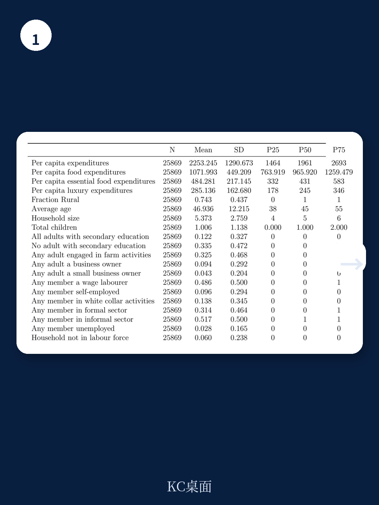
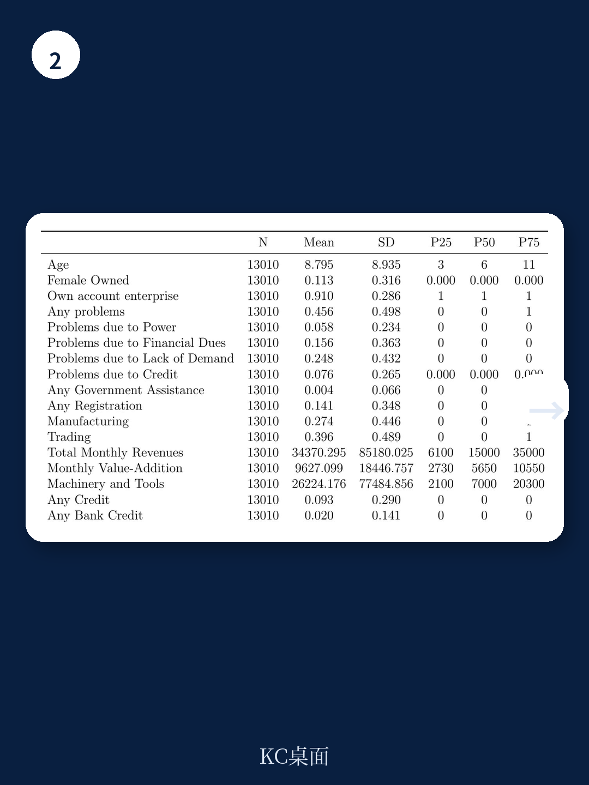

# 世界银行：一场好雨，印度农村非农经济的“乘数”密码

当印度拉贾斯坦邦迎来一场超出正常水平的降雨，会发生什么？最直观的答案是农作物增产。但世界银行一份最新工作论文揭示了一个更深层、也更值得关注的事实：这场好雨的真正经济价值，并不止于田间地头。

它通过一条清晰的传导链条，撬动了农村非农企业的营收和利润，并最终体现在家庭消费的结构性升级上。这份基于拉贾斯坦邦1990年至2015年农业数据、2010年至2016年企业调查以及2014年至2016年家庭消费数据的研报，为我们拆解了天气冲击如何通过农业-非农业经济链条，重塑农村经济的微观图景。

核心判断是：**农业的天气脆弱性，并非农村经济的终点，而是理解其内部“乘数效应”的起点。对于政策制定者和产业投资者而言，忽视农业波动对非农部门的涟漪效应，就是低估了农村市场的真实韧性与风险。**

## 1. 正降雨冲击使农业生产力提升约7%，但灌溉才是真正的“稳定器”

报告首先用数据验证了一个常识性判断：正向的降雨冲击（相对于该地区历史平均水平）能显著提升农业生产力。在拉贾斯坦邦，这一正向冲击带来的农业生产力增长约为7%。这个数字本身并不令人意外，但报告接下来的发现才是关键。

灌溉基础设施的存在，极大地缓冲了这种冲击。在灌溉条件较好的地区，降雨冲击对生产力的影响大幅减弱。这意味着，灌溉不仅是增产手段，更是农村经济系统对抗气候波动的“减震器”。它让农业产出不再严重依赖“老天爷的脸色”，从而为下游的非农经济活动提供了一个更稳定的上游供给和收入预期。

> **KC评论：** 7%的增产是平均值，但真正有意义的是“谁在波动中损失更少”。对于投资于农业科技或农村基础设施的资本而言，这份报告的数据暗示：灌溉覆盖率高的地区，农业产出的可预测性更强，以此为依托的农资、农机、仓储等非农服务业的经营风险也更低。完整报告中关于灌溉如何调节不同作物对降雨敏感度的详细图表，是理解这一机制的关键。

## 2. 农业好年景，农村小商贩营收猛增25.7%——需求侧传导清晰可见

这是整份报告最具冲击力的发现之一。当农业因好雨而增产，农村非农企业，尤其是零售贸易类企业，获得了远超预期的增长。具体来看，正向降雨冲击使这类企业的总营收增加25.7%，增加值（营收减去运营成本）更是飙升30.3%。

报告论证了这背后的核心驱动力并非劳动力转移，而是**本地需求的增长**。农业收入增加后，农民有了更多可支配收入，这些钱首先流向了本地提供的非贸易商品和服务，比如小卖部的日用品、修理铺的服务等。这是一个典型的“乘数效应”：农业部门每多赚的一块钱，有相当一部分会迅速转化为非农部门的收入。

> **KC评论：** 这个数据点对理解农村消费市场至关重要。它告诉我们，农村非农经济的景气度，很大程度上是农业收入的“影子”。投资于农村零售、物流或本地服务的企业，其风险评估模型必须将农业产出的波动性作为核心变量。报告中关于不同类型非农企业（制造、贸易、服务）对农业冲击反应差异的细分拆解，是判断具体赛道机会与风险的核心。

## 3. 家庭消费的“奢侈品”倾向，暴露了农村需求的真实弹性

农业好年景带来的收入增加，最终落到了家庭消费上。报告显示，正向降雨冲击使农村家庭月人均消费支出增加6%。更值得关注的是消费结构的变化：**增加的部分几乎全部来自“奢侈品”支出，而非必需品支出。**

这里的“奢侈品”并非指豪车名表，而是相对于基本食物而言的非必需消费品，如电子产品、服装、外出就餐、娱乐等。这一发现有力地支持了“需求侧传导”的假说。当基本生存得到保障后，新增收入会迅速流向能提升生活品质的领域。这意味着，农村消费升级的“弹簧”被压得有多低，其释放时的弹性就有多大。

> **KC评论：** 6%的总消费增长背后，是奢侈品支出更大幅度的跃升。这给消费品公司一个清晰的信号：农村市场的消费潜力，不在于“让农民多买米”，而在于“让农民在好年景时，愿意尝试更好的洗发水、更耐穿的鞋”。报告中关于不同收入阶层和职业背景的家庭，其奢侈品消费对天气冲击敏感度的详细数据，是制定渠道下沉和产品策略时不可多得的参考。

## 4. 报告尚未完全回答的关键问题：这种“乘数”是单向的，还是可逆的？

这份报告精妙地刻画了“好雨”带来的正向传导链条。但一个悬而未决的关键问题是：这个机制是**对称**的吗？当遭遇负向降雨冲击（干旱）时，非农部门的营收和家庭消费是否会以同等甚至更大的幅度萎缩？

从逻辑上推断，由于农业收入的波动性更大，且农村家庭缺乏有效的金融缓冲工具（报告数据显示，仅10%的企业有未偿信贷，2%有银行贷款），负向冲击的破坏力可能远超正向冲击的收益。如果“乘数效应”在衰退期变成了“加速器效应”，那么农村经济的脆弱性将比我们想象的更为严峻。

报告虽然提到了负向冲击的概率（19%）高于正向冲击（15%），但其分析重点放在了正向冲击的传导上。对于负向冲击下的非农企业倒闭率、家庭消费的“断崖式”下跌以及借贷行为的变化，这份研究并未给出同等深度的量化结论。这恰恰是理解农村经济真正韧性的“最后一公里”。

## 5. 对读者的观察框架：评估农村市场，不能只看农业，更要看“连接”

基于这份世界银行的研究，一个更有效的分析框架应当是“连接导向”的。评估一个地区农村市场的潜力或风险，至少需要关注三个层次的连接：

第一，**农业与非农的连接强度**。零售贸易类企业受农业影响最大，而制造类企业可能相对较小。一个地区的非农经济结构，决定了它对农业波动的整体敏感度。

第二，**消费与收入的连接弹性**。奢侈品消费的高弹性，意味着农村消费市场的“天花板”远未到来，但也意味着其在坏年景时收缩更快。企业需要根据自身产品定位，判断是押注“弹性”还是追求“韧性”。

第三，**金融与风险的连接深度**。信贷的可及性是农村经济能否平滑冲击的关键。报告揭示的极低信贷渗透率，既是风险，也是机会——谁能填补这个空白，谁就能在帮助农村家庭对冲风险的同时，获得稳定的客户关系。

这份世界银行的报告提供了一个极为扎实的微观基础，但它更像是一幅“静态切片”的X光片，揭示了经济结构的内在连接。真正的动态演化，比如这种连接如何随着气候变化加剧、金融渗透率提升或数字技术普及而改变，还需要更多的数据和更长期的观察。

我们每天会由AI agent结合人工review，生成国际投行与顶级智库的最新中文摘要与深度评论。内容覆盖宏观、策略、行业及新兴市场，约10-40页，既包含当天最新数据图表合集，也提炼出可供直接喂给AI的分析框架，方便您快速把握全球市场dynamics。如果您希望获取这份世界银行报告的完整图表与详细计量模型解读，或希望与更多产业决策者一同探讨农村经济的投资逻辑，欢迎加入我们的社群，获取每日更新的完整研报解读包。

Personal reading notes and learning share only. Not investment advice.

