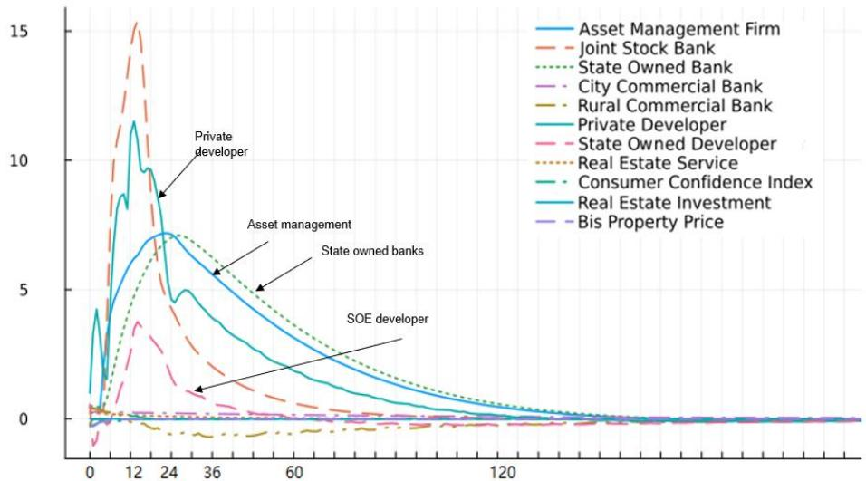
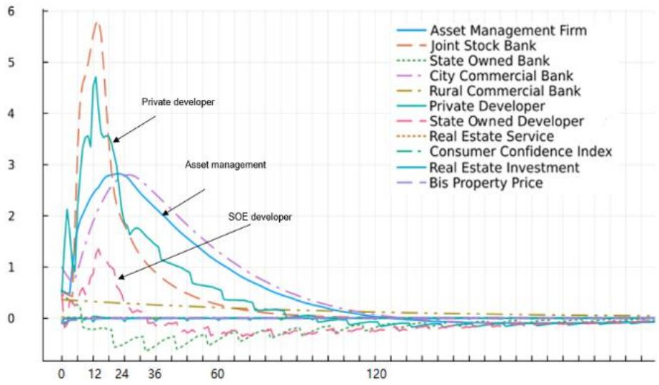
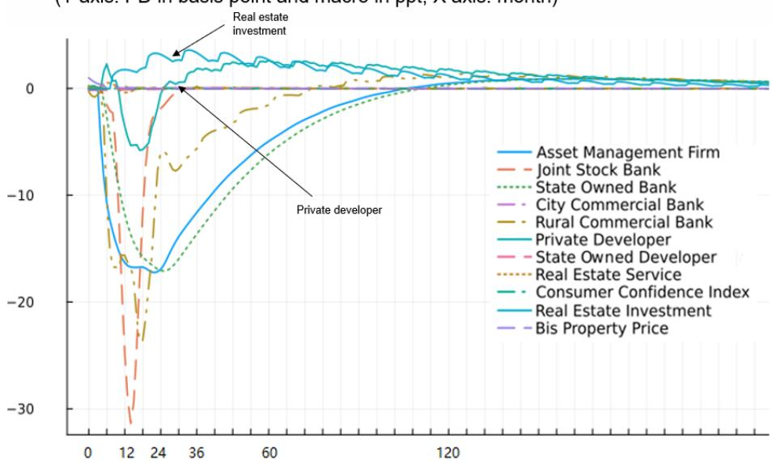
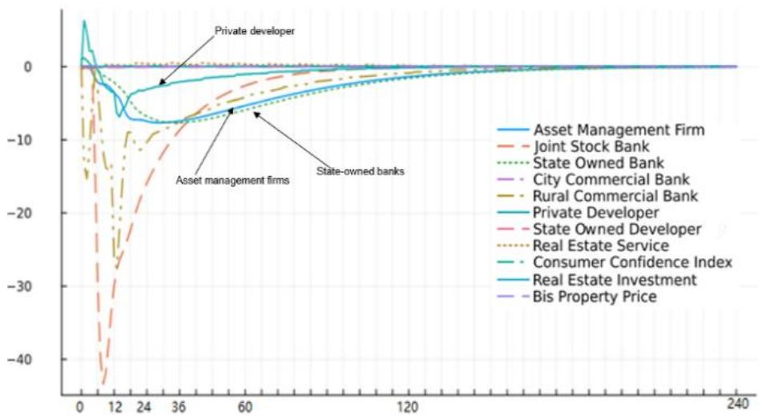

# Assessing Macrofinancial Linkages in China Using a Machine-Learned Parsimonious VAR Model

Prepared by Jin-Chuan Duan, Dimitrios Laliotis, and Wei Sun

WP/26/134

IMF Working Papers describe research in progress by the author(s) and are published to elicit comments and to encourage debate. The views expressed in IMF Working Papers are those of the author(s) and do not necessarily represent the views of the IMF, its Executive Board, or IMF management.

2026
JUN

# IMF Working Paper Monetary and Capital Markets Department

Assessing Macrofinancial Linkages in China Using a Machine-Learned Parsimonious VAR Model Prepared by Jin-Chuan Duan\*, Dimitrios Laliotis\*\*, and Wei Sun\*\*,

Authorized for distribution by Hiroko Oura
June 2026

IMF Working Papers describe research in progress by the author(s) and are published to elicit comments and to encourage debate. The views expressed in IMF Working Papers are those of the author(s) and do not necessarily represent the views of the IMF, its Executive Board, or IMF management.

ABSTRACT: This paper examines macrofinancial linkages between property developers, financial institutions, and macroeconomic outcomes in China. Using a parsimonious vector autoregressive (VAR) model enabled by a machine learning algorithm, it quantifies how idiosyncratic shocks can propagate and be amplified across sectors, with potential implications for financial stability. Stress originating from privately owned developers and regionally focused financial institutions—though relatively limited in scale—can generate persistent spillovers through lending relationships, common exposures, shared markets, and changes in market sentiment. A decline in property prices may undermine investment, weaken consumer confidence, and adversely affect the health of both the property and financial sectors, thereby disrupting financial intermediation and weighing on broader economic growth. Policy considerations should take into account these feedback loops. Market- and exposure-based tools can be helpful for monitoring macrofinancial linkages and assessing the transmission of shocks.

<table><tr><td>JEL Classification Numbers:</td><td>C3, E44, G2, R3</td></tr><tr><td>Keywords:</td><td>Macrofinancial linkage; property development; financial system; machine learning; model selection</td></tr><tr><td>Authors&#x27; email addresses:</td><td>wsun@IMF.org</td></tr></table>

WORKING PAPERS

# Assessing Macrofinancial Linkages in China Using a Machine-Learned Parsimonious VAR Model

Prepared by Jin-Chuan Duan, Dimitrios Laliotis, and Wei Sun

## Contents

I. Introduction .... 3
II. Literature Review .... 5
III. Methodological Design.... 6
Data .... 7
Model Selection .... 9
IV. Empirical Results.... 10
Model Estimation .... 10
Impulse Response .... 13
V. Conclusion .... 17
References.... 18

## FIGURES

1. Impulse Response: 1 Basis Point Shock to PD of Privately-owned Developers....14
2. Impulse Response: 1 Basis Point Shock to PD of City Commercial Banks....15
3. Impulse Response: 1 Percentage Point Shock to Property Prices....16
4. Impulse Response: 1 Percentage Point Shock to Consumer Confidence Index....16

## TABLES

1. Intertemporal Relationships: Regression Coefficients .... 12
2. Contemporaneous Relationships: Covariance of Disturbance.... 13

## I. Introduction

Macrofinancial stability is a central objective of the global policy agenda. A succession of banking and financial crises since the 1980s has underscored that financial stability—alongside price stability—is essential for macroeconomic resilience. The global financial crisis of 2007-09 highlighted the profound impact of macrofinancial linkages, prompting a shift in global economic policy toward a more macroprudential direction (Claeseens, 2015; Adrian, 2017b; and IMF-FSB-BIS, 2016). These efforts aim to address propagation and amplification effects through complex linkages that traditional monetary and exchange rate tools cannot fully manage (Borio et al., 2022).

Macrofinancial linkages refer to the two-way interactions between the macroeconomy and the financial sector (Claessens and Kose, 2018). Economic shocks can impair the balance sheets of households, firms, and financial intermediaries. Amplified by financial market imperfections, such impairments can disrupt both the demand (e.g., financial accelerator effects) and supply (e.g., bank lending, capital, leverage, liquidity constraints) of financial intermediation, intensifying economic fluctuations. Financial imbalances—such as rapid credit growth and asset price swings—can distort macroeconomic equilibrium and often precede or deepen recessions if not addressed promptly (Claessens et al., 2012a).

While research on macrofinancial linkages continues to advance, challenges persist due to data limitations and methodological constraints. Large gaps remain in balance sheet data, bilateral exposures, and high-frequency asset price series critical for systemic risk assessment (Brunnermeier and Krishnamurthy, 2014). Theoretical models, including dynamic stochastic general equilibrium (DSGE) frameworks, struggle to capture agent heterogeneity, demonstrate transmission channels, or yield robust predictions under different institutional setups (Blanchard, 2017a).

This paper contributes to the evolving literature by assessing macrofinancial linkages in China—now the world’s second-largest economy and home to the second-largest financial system. China’s growth model, heavily reliant on real estate investment until recently and supported by increasingly complex and interconnected financial intermediation that does not fully reflect risk-return relationships (IMF, 2025), has given rise to intricate macrofinancial linkages with potentially profound macroeconomic consequences.

Conjunctural shocks have made this analysis particularly timely. Since 2021, China's property market has experienced its most severe adjustment in decades. Sales and prices in the primary market have declined. Secondary market corrections have been more pronounced, despite a temporary rebound around early 2025. Defaults among property developers—varying in size and ownership structure—have increased. The accumulation of unused land, unfinished projects, and undelivered housing units has inflicted significant socioeconomic costs.

This paper uncovers the interconnectedness among key economic agents and activities influenced by and impactful for property market performance. A vector autoregressive (VAR) model is used to capture general equilibrium features and endogenous responses. Through identified transmission and amplification channels, we quantify the extent to which an idiosyncratic shock can generate far-reaching and long-lasting effects.

A key feature of the paper is to analyze macrofinancial linkages founded on microeconomic behaviors (Claessens and Kose, 2018). The model includes three property development and five financial sectors, each facing distinct constraints in responding to shocks. State-owned developers have easier access to bank financing, while privately owned developers often rely on costlier funding and lose market access during periods of stress. State-owned banks are relatively stably funded and serve safer borrowers, while smaller banks engage in riskier financial market transactions and lend to developers. Non-bank financial institutions support capital allocation to non-state-owned sectors, often offering implicit guarantees until recent regulatory tightening (Allen et al., 2023).

To address data limitations related to balance sheets and bilateral exposures, we use probability of defaults (PD) metrics from the Credit Research Initiative (CRI) of the National University of Singapore (NUS-CRI, 2023). The CRI database covers 92,000 companies globally, including all publicly listed property developers and financial institutions in China. As a composite index encompassing market indicators (e.g., stock returns and volatility) and fundamentals (e.g., liquidity, profitability, and leverage), PD co-movements imply bilateral exposures better than purely market-based metrics such as CDS spreads or stock prices (Craig et al., 2024). They also reflect interdependence through sentiment and market perceptions, beyond direct borrowing-lending relationships.

Modeling eight sectoral and three macro variables in a VAR framework presents a high-dimensional challenge. To identify meaningful macrofinancial linkages, we apply a zero-norm penalty to regularize the number of non-zero coefficients (Duan, 2024). Operationally, a 10-fold cross-validated seemingly unrelated regression likelihood is solved using a sequential Monte Carlo (SMC) optimization technique. This novel machine learning approach offers several advantages. It yields a parsimonious model, retains only significant relationships, and does not require a priori specification of directional links. It is fully interpretable, avoiding the “black box” nature of many models and supporting transparent policy analysis (Duan, 2025).

Our empirical analysis reveals critical linkages between macroeconomic performance, property developers, and financial institutions. Vicious cycles can emerge through these linkages, amplifying idiosyncratic shocks. Notably, stress among privately owned developers can affect state-owned developers and financial institutions in subsequent periods. Even smaller, regionally focused banks can have systemic implications. Property prices lie at the core of these linkages, with declines triggering adverse effects on investment, sentiment and financial sector health.

The empirical analysis suggests that a well-capitalized and stably funded financial system is associated with a greater capacity to sustain credit and liquidity provision. Potential trade-offs could arise between measures affecting property developers and broader considerations of financial sector resilience. Stabilizing property prices is more effective when aligned with broader efforts to restore business and consumer confidence durably. A sustainable recovery in the property market is typically characterized by organic transaction growth supported by the financial health of key market participants. Accounting for complex feedback effects helps characterize macrofinancial dynamics over the business cycle.

Market- and composite-index-based analyses offer timely insights into macrofinancial linkages and shock-induced outcomes. They also go beyond lending-borrowing relationships and incorporate business model similarities, common exposures, and market sentiment, increasingly important factors in modern contagion dynamics. Developing comprehensive toolkits to regularly monitor linkages and assess macrofinancial impacts can enhance risk management. Complementary efforts to collect granular cross-sectoral exposures could further deepen the understanding China's macrofinancial complexity.

The remainder of the paper is structured as follows. Section II provides a short survey of the related literature. Section III introduces the design of the methodology. Section IV discusses empirical results. Section V concludes.

## II. Literature Review

This paper builds on two strands of literature. First, it contributes to the study of macrofinancial linkages, which gained prominence following the global financial crisis. The two-way interactions between the financial sector and real economy can propagate and amplify shocks, leaving long-lasting economic scars. Policymakers have struggled to counteract these effects using conventional fiscal, monetary, and financial instruments (Claessens and Kose, 2018).

The literature on macrofinancial linkages highlights the central role of asset prices in driving economic outcomes. In frictionless Arrow-Debreu markets, asset prices provide signals to economic agents for optimal consumption and investment decisions (Geanakoplos, 2008). Asset price movements affect household wealth over the life cycle, therefore influencing consumption and saving patterns (Deaton, 1992; Guiso and Sodini, 2013). They also inform future corporate profitability (Allen, 1993) and influence investment plans. Recessions accompanied by asset price busts tend to be deeper and longer (Claessens et al., 2012a; Drehmann et al., 2012; and Muir, 2017). Among asset classes, house prices have a more pronounced impact on consumption than equity prices (Carroll et al., 2011; Case et al., 2005, 2013; Kim, 2004; Gan 2010).

Financial imperfections amplify the impact of shocks on real economy due to information asymmetry and enforcement difficulty. On the demand side, the financial accelerator theory explains how initial shocks affect credit demand and subsequent spending and investment decisions. Most notably, weakening balance sheets and cash flows disrupt access to finance or increase costs. The additional premiums reduce income and profitability, postpone consumption or productive activities, which in turn makes it even more challenging to secure future financing (Antony and Broer, 2010; BCBS, 2011; Coric, 2011; Quadrini, 2011).

On the supply side, banks may curtail lending during distress due to uncertainty (e.g., Bernanke and Blinder, 1988; Stein, 1998). They may shun the risky borrowers for capital preservation motives (Bernanke and Lown, 1991; Holmström and Tirole, 1997; Repullo and Suarez, 2000; Van den Heuvel, 2006, 2008). Procyclical leverage (Adrian and Shin, 2008, 2011a; Geanakoplos, 2010) can constrain access to finance, affecting both banks and non-bank financial institutions. Interbank market freezes can induce credit crunches (Freixas and Jorge, 2008; Bruche and Suarez, 2010), and deleveraging and liquidity hoarding can exacerbate financial and economic stress.

In China, property market fluctuations significantly influence business cycles (Ge et al., 2022). Rising property prices in the past decades have supported fiscal spending via local governments land sales and off-balance sheet borrowing with land collaterals (Chen et al., 2020). Rising prices have also supported

consumption via wealth effects because households invest vast savings in this preferred vehicle yielding outstanding returns (Fang et al., 2015). The traditional banking sector supported property development until the contractionary monetary policies post-2009 (Chen, et al., 2018). Non-bank financial institutions later filled the gap, offering implicit guarantees until recent regulatory changes (Allen et al., 2023).

The second strand of literature focuses on model selection for high dimensional data. Regularization techniques address the challenge of too many regressors and too few observations. The Least Absolute Shrinkage and Selection Operator (LASSO) method (Tibshirani, 1996) introduces an $L^{1}$ -norm penalty to the original optimization problem. It optimizes the target function by shrinking the sum of the absolute values of the coefficients, leaving many of them to zero.

Later efforts advanced the $L^{1}$ -norm based methodology by achieving the oracle properties, meaning they perform as well as if the underlying model were known in advance (Fan and Li, 2001). Examples include the Smoothly Clipped Absolute Deviation (SCAD) method by Fan (1997). Fan and Li (2001) generalized the SCAD method to more parametric and nonparametric models and developed an algorithm to improve its computational efficiency. Different from applying fixed weights in the original LASSO method, the Adaptive Lasso of Zou (2006) used different weights to penalize the coefficients based on their relative importance, while also producing consistent model estimates.

Regressions with zero-norm penalty restrict directly the number of non-zero coefficients rather than the sum of the absolute values. These types of models are conceptually natural for tackling high dimensionality but are computationally demanding (Natarajan, 1995). With modern machine learning techniques, Duan (2024) introduced the Stable Combinatorially-optimized Feature Selector (SCOFS) suitable for various high-dimensional parametric models. SCOFS mitigates multilinearity and overfitting more effectively than LASSO-type methods.

This paper applies SCOFS to assess macrofinancial linkages in China. Empirical evidence suggests that property market shocks have persistent macroeconomic effects. At a micro level, financial and property sectors are interconnected in ways that amplify shocks.

## III. Methodological Design

We designed a penalized VAR model to study the macrofinancial linkages in China. A reduced-form VAR model is not identified without specifying directional relationships a priori. To avoid over-simplified assumptions on a very complex system, we introduced a zero-norm penalty to regularize the number of non-zero coefficients. This approach enables a high-dimensional model with persistent lagged effects. Recent advances in machine learning make this regularization computationally feasible and fully interpretable, unlike “black box” alternatives.

An impulse response exercise subsequently quantifies the impact of idiosyncratic shocks on interested variables over time. It differs from but complements forecast error variance decomposition, which measures volatility spillovers (Diebold and Yilmaz, 2012).

We select 11 macro and sectoral variables to underpin the VAR. They represent economic agents and activities that can be highly dependent on or impactful for the property market. Property prices, consumer sentiment, and real estate investment are proxies to capture the market and macroeconomic conditions. These monthly series are closely related to but are much more frequent and forward-looking than national account data. Prices reflect cash flow expectations and investment opportunities, while consumer sentiment reflects demand pressures and could shape future consumption behaviors.

The sectoral variables comprise probability of defaults (PD) metrics for eight groups of property developers and financial institutions. Unlike exposure or price-based metrics, the composite PD indices incorporate both market and fundamental information, reflecting sectoral health. Our PD-based interlinkage analysis does not aim to isolate a single shock transmission channel. Rather, it captures co-movements that could be driven by both common exposures, business model similarities, market sentiment and lending-borrowing relationships (Craig et al., 2024), revealing an intricate system of interconnected micro sectors.

The choice of 11 variables aims to focus on the basic feedback effects among critical sectors. Given that several variables are composite indices reflecting multiple underlying forces—e.g., policy shifts, common macro shocks, and sentiment—the impulse analysis does not aim to capture the effects of any specific structural disturbance. Instead, it relies on propagation dynamics implied by the reduced-form model.. That said, this high-dimensional VAR framework can accommodate additional policy indicators to support more nuanced discussions, including regime shifts, in future work.

## Data

We use monthly time series from 2011 to 2023. The rich time dimension allows up to 12 lags in the VAR model to capture persistent time effects.

## Sectoral PDs

We use eight PD series at the sectoral level to reflect the creditworthiness of selected property developers and financial institutions. PD measures the probability that an entity cannot fulfil its financial obligations over a future horizon. The PDs are generated based on the forward intensity model of Duan et al. (2012), published by the Credit Research Initiative of the National University Singapore (NUS-CRI, 2023). The model is calibrated against about 7,500 publicly listed Chinese companies, including those that have defaulted or exited the market due to reasons such as mergers and acquisitions.

In the forward intensity model, events such as filing for bankruptcy and delay of principal or interest payment for more than 30 days are treated as defaults, while drastic drop in bond prices alone are not classified as such (NUS-CRI, 2023). The model uses two sets of explanatory variables: (i) financial conditions—interest rates, stock market returns, and credit cycle indicators; and (ii) entity-level fundamentals—leverage, liquidity, profitability, size, and stock market volatility. The PD metric has demonstrated strong predictive accuracy for Chinese entities (NUS-CRI, 2023). PDs correlations reflect direct and indirect exposures better than other popular price-based measures, such as equity returns and CDS spreads (Craig et al., 2024).

We classify 222 publicly listed property developers into three groups: private owned (110), state-owned (51), and property services companies (61). The three sectoral PDs are calculated as the median of constituent entities $^{1}$ . While not exhausting the universe of Chinese developers, the sample includes the biggest and major firms that influence market sentiment. This paper does not include household as a separate sector despite a large share of mortgage in the banking loans. The healthy loan-to-value ratios and low default rates have so far posted limited financial stability risks. We only consider the impact on household consumption via the macro consumer sentiment index discussed later.

The distinction of ownership structures aims to capture any heterogeneous reaction to shocks. Privately owned property developers were first to experience sales declines and defaults. State-owned developers maintained sales initially, likely due to perceived state backing. Property services companies, e.g. property managers, may follow broader market trends or remain acyclical, depending on income from managed properties.

We group 119 listed financial institutions into five categories—state-owned commercial banks (6), joint stock banks (10), city commercial banks (30), rural commercial banks (13), and non-bank financial institutions (60). These segments may differ in sensitivity to shocks and systemic impact due to differences in business model and market perception. Median PDs are calculated similarly.

State-owned and joint stock banks are national institutions, representing about 60 percent of China's total banking system assets. State-owned banks have relatively stable deposit bases and lend to safer households and corporates. Joint stock banks represent a higher share of private ownership, rely more on wholesale funding, e.g., corporate deposits and interbank borrowing, and lend to riskier corporates. City and rural commercial banks are regionally focused, smaller, and at least partially government-funded. Many joint stock and city commercial banks allocate sizable assets to high-return, low-capital-charge “other investment”, which comprises asset management products offered by non-bank financial institutions.

Non-bank financial institutions are relatively small but prevalent in China's bank-centric financial system. Our sample includes the exchange-listed asset management companies, trust companies, and securities firms (i.e., broker-dealers), thereafter “asset management companies” for simplicity. These entities borrow from banks, tap credit lines, and intermediate resources to riskier sectors, such as property development. They offer similar investment products under purview of different regulators. Implicit guarantees associated with these products serve as a second-best solution to supporting capital allocations to non-state-owned entities (Allen et al., 2023).

## Macroeconomic indicators

We used three variables—property price, consumer confidence, and real estate investment—to capture key macroeconomic outcomes. Property prices are at the core of macrofinancial linkages (Claessens and Kose, 2018) and play a central role in China’s business-cycle dynamics (Ge et al., 2022). Property prices influence consumption through wealth effects, because real estate assets remain the primary household savings vehicle (Fang et al., 2015). They also shape fiscal performance, as local governments heavily rely on land-sale revenues to supplement the budget (Chen et al., 2020). Developers and local government financing vehicles make pervasive use of land and property as collateral to borrow from financial intermediaries. Therefore, any shifts in collateral valuations directly affect leverage and investment decisions.

We included the consumer sentiment index to capture demand pressures, which can generate self-reinforcing cycles through expectation channels (Chen and Wen, 2017). We also used real estate investment—which closely reflects developer activity—to track near-term economic momentum (Fang et al., 2015). These two monthly indicators move closely with consumption and growth patterns in the national accounts, while their frequency provides richer variation and facilitates model implementation by maintaining consistency with the PD dataset.

## Model Selection

We specify a standard VAR model in the following form:

$$
\boldsymbol {X} _ {t} = \boldsymbol {A} + \sum_ {j = 1} ^ {1 2} \boldsymbol {B} _ {j} \boldsymbol {X} _ {t - j} + \boldsymbol {\epsilon} _ {t}\tag{1}
$$

Here, $X_{t}$ represents a vector of 11 variables—sectoral PDs for three developer groups, five financial institution groups, and three macroeconomic indicators. Each of the variables is explained by its own lags and those of the other variables up to 12 months. A and $B_{j}$ are the intercept and slope coefficients. $B_{j}$ , once identified, implies Granger causality. Disturbance terms $\epsilon_{t}$ may be cross-sectionally correlated.

This system of 11 equations has 1,463 coefficients and 66 residual covariances to estimate and is not identified without regularization. To avoid arbitrary assumptions, we apply a zero-norm penalty, selecting the best combination of features under a fixed and also the best number of non-zero coefficients. The optimal solution will force the not-so-relevant coefficients to zero, leaving only the significant and meaningful ones. Although computationally more demanding, the zero-norm regularization is conceptually superior to the $L^1$ -norm, which indirectly achieves this goal by shrinking the numerical sum of the non-zero coefficients as in LASSO and adaptive LASSO methods (Fan, 1997; Fan and Li, 2001; Zou, 2006)

We use the Stable Combinatorially-optimized Feature Selector (SCOFS) method developed by Duan (2024) to solve the penalized VAR model. Specifically, SCOFS maximizes a k-fold cross-validated seemingly unrelated regression target function:

$$
a r g m a x _ {\{p _ {l} \leq p _ {s} \leq p _ {u}, \mathbf {X} _ {t - 1} ^ {(p _ {s})} \}} \exp \left\{\lambda \sum_ {j = 1} ^ {k} L \left(\hat {\theta} _ {j -}; [ \mathbf {X} _ {t}, \mathbf {X} _ {t - 1} ^ {(p _ {s})} ] _ {j -}, t \in T\right) \right\}\tag{2}
$$

Here, $\mathbf{X}_{t-1}^{(p_{s})}$ denotes a subset of $p_{s}$ elements in $\{1, X_{t-1}, X_{t-2}, ..., X_{t-l_{max}}\}$ . $\hat{\theta}$ is the optimal set of parameters. $L(\cdot; \cdot)$ is the log-likelihood function of the VAR model. $\lambda$ is a positive self-adaptive device for numerical accuracy which tunes the totally discrete target function. We set k=10, meaning dividing the observations into 10 subsamples for training and testing purchases. In each validation exercise, the cross-validation technique maximizes the out-of-sample fit for the jth fold (i.e., the testing data), while using the parameters trained by

everything but, i.e., $j$ -. The multiple validation exercises also enhance the robustness and stability of the estimation as shown in Duan (2024).

The SCOFS technique selects the optimal number of non-zero coefficients $p_{s}$ , and the optimal $p_{s}$ -variable combination out of all permissible combinations of variables bounded by $p_{l}$ and $p_{u}$ . It addresses the potential over-fitting problem by allowing no insignificant regressors in the selected model. These features make SCOFS an ideal technique for selecting a parsimonious and stable VAR model amenable to typical operational needs. Its transparency and interpretability are conducive to supporting policy interpretation and deliberation.

Operationally, Duan (2024) applied a distribution-tempered Sequential Monte Carlo (SMC) sampling approach to machine learn the optimal parsimonious model set up by SCOFS. The SMC is a simulation-based algorithm by first converting the target function, either statistical or non-statistical, into a distribution/density function, which in turn enable Monte Carlo sampling in a sequential manner. In our context, the SMC algorithm initializes by assigning a probability, or importance weight, to each potential combination of $p_{s}$ lagged regressors. Hence, a sampler with $p_{s}$ variables is associated with an initial probability distribution. These importance weights are naturally uneven and require resampling to level the weights. The algorithm thus boosts the empirical support by Metropolis-Hastings moves to remove duplicate particles arising from resampling. The three steps continue until the target function stabilizes and reaches its maximum value. A comprehensive review of SMC optimization on various familiar models is available in Duan et al. (2022).

The empirical design concludes with a suite of impulse response analyses once the optimal model is selected and coefficients estimated. These analyses quantify the impact over time of an idiosyncratic shock to the variable of interest, say property price, on macrofinancial outcomes through endogenous responses. The total impact combines the amplification effects through intertemporal (i.e., regression coefficients) and contemporaneous (i.e., correlation among disturbance terms) linkages.

## IV. Empirical Results

This section presents the machine-learned model and several impulse response analyses. The selected model is sparse because it removes the minuscule and insignificant relationships and addresses any potential overfitting problem. The model is also optimal because it achieves a $R^{2}$ close to the theoretical maximum among all possible permutations of variable selections. In each impulse response analysis, we prescribe one idiosyncratic shock at a time to the health of developers, financial institutions, property prices, or consumer sentiment, respectively. We subsequently quantify the combined impact over time on each other variable through their intertemporal and contemporaneous relationships.

## Model Estimation

The machine learning algorithm reduces the 1,463-dimensional VAR to 32 significant relationships. They explain a substantial share of variation in the dependent variables, as indicated by the high $R^2$ values (Table 1). Some key findings below will shape the system's responses to macrofinancial shocks of various natures:

Persistent lagged effects dominate. Most variables are significantly explained by their own recent lags.

Privately owned property developers are highly sensitive to macro and financial conditions. A weak consumer sentiment increases their default risk, likely through waning demand and subsequently declining profitability. Deteriorating financial sector soundness also decreases their creditworthiness, likely through constrained credit supply. Significant influence comes not only from state-owned and joint stock banks, but also from asset management companies, which channel credits from the banking sector to riskier property sectors (Allen et al., 2023).

\- Private developer stress spills over to state-owned developers and financial institutions. State-owned developers may have benefited initially from favorable consumer sentiment due to perceived (implicit) state backing but eventually face similar market pressures. Once the prospect of future revenue and profitability dims and consumer sentiment sours, their access to finance could be interrupted (e.g., financial accelerator effect), making the business operations hard to sustain. Joint stock banks appear particularly vulnerable to the private developer stress, likely reflecting their disproportionate exposures to riskier sectors through loans and asset management products (IMF, 2025).

The property market condition is central to macro and financial outcomes. Rising property prices Granger cause the joint stock bank credit quality to improve, reflecting their disproportionate exposures to property development sectors. Rising property prices also suggest better market and economic prospects, boosting real estate investment and consumer sentiment via wealth effect (Fang et al., 2015).

Joint stock bank weakness spills over to city commercial banks. This intertemporal connection likely reflects their similar business models, lending-borrowing relationships, financial market transactions, synchronized sentiment toward them, and common exposure to risky sectors, including the property developers.

Table 1. Intertemporal Relationships: Regression Coefficients

<table><tr><td>Dependent Variable:</td><td>AM</td><td>JS</td><td>SOE Bank</td><td>CC</td><td>RC</td><td>Private developer</td><td>SOE Developer</td><td>RE Service</td><td>Consumer Confidence RE Investment</td><td>PP</td></tr><tr><td colspan="11">Regressors:</td></tr><tr><td>AM_Lag1</td><td>0.91</td><td></td><td></td><td></td><td></td><td></td><td>0.75</td><td></td><td></td><td></td></tr><tr><td>(std error)</td><td>0.02</td><td></td><td></td><td></td><td></td><td></td><td>0.05</td><td></td><td></td><td></td></tr><tr><td>AM_Lag4</td><td></td><td></td><td></td><td></td><td></td><td></td><td></td><td></td><td>0</td><td></td></tr><tr><td>(std error)</td><td></td><td></td><td></td><td></td><td></td><td></td><td></td><td></td><td>0</td><td></td></tr><tr><td>AM_Lag6</td><td></td><td></td><td></td><td></td><td></td><td>0.7</td><td></td><td></td><td></td><td></td></tr><tr><td>(std error)</td><td></td><td></td><td></td><td></td><td></td><td>0.07</td><td></td><td></td><td></td><td></td></tr><tr><td>JS_Lag1</td><td></td><td>0.95</td><td></td><td>0.22</td><td></td><td></td><td></td><td></td><td></td><td></td></tr><tr><td>(std error)</td><td></td><td>0.02</td><td></td><td>0.06</td><td></td><td></td><td></td><td></td><td></td><td></td></tr><tr><td>JS_Lag2</td><td></td><td></td><td></td><td></td><td></td><td>0.88</td><td></td><td></td><td></td><td></td></tr><tr><td>(std error)</td><td></td><td></td><td></td><td></td><td></td><td>0.06</td><td></td><td></td><td></td><td></td></tr><tr><td>SOE Bank_Lag1</td><td></td><td></td><td>0.95</td><td></td><td></td><td>0.28</td><td></td><td></td><td></td><td></td></tr><tr><td>(std error)</td><td></td><td></td><td>0.02</td><td></td><td></td><td>0.03</td><td></td><td></td><td></td><td></td></tr><tr><td>CC_Lag1</td><td></td><td></td><td></td><td>0.79</td><td></td><td></td><td></td><td></td><td></td><td></td></tr><tr><td>(std error)</td><td></td><td></td><td></td><td>0.06</td><td></td><td></td><td></td><td></td><td></td><td></td></tr><tr><td>CC_Lag7</td><td></td><td></td><td></td><td></td><td></td><td>-0.19</td><td></td><td></td><td></td><td></td></tr><tr><td>(std error)</td><td></td><td></td><td></td><td></td><td></td><td>0.05</td><td></td><td></td><td></td><td></td></tr><tr><td>RC_Lag1</td><td></td><td></td><td></td><td></td><td>0.99</td><td></td><td></td><td></td><td></td><td></td></tr><tr><td>(std error)</td><td></td><td></td><td></td><td></td><td>0.01</td><td></td><td></td><td></td><td></td><td></td></tr><tr><td>RC_Lag4</td><td></td><td></td><td></td><td></td><td></td><td></td><td></td><td></td><td>0</td><td></td></tr><tr><td>(std error)</td><td></td><td></td><td></td><td></td><td></td><td></td><td></td><td></td><td>0</td><td></td></tr><tr><td>Private developer_Lag1</td><td></td><td></td><td></td><td></td><td></td><td></td><td>0.21</td><td></td><td></td><td></td></tr><tr><td>(std error)</td><td></td><td></td><td></td><td></td><td></td><td></td><td>0.03</td><td></td><td></td><td></td></tr><tr><td>Private developer_Lag3</td><td>0.04</td><td></td><td></td><td></td><td></td><td></td><td></td><td></td><td></td><td></td></tr><tr><td>(std error)</td><td>0.02</td><td></td><td></td><td></td><td></td><td></td><td></td><td></td><td></td><td></td></tr><tr><td>SOE Developer_Lag3</td><td></td><td></td><td></td><td></td><td></td><td></td><td>0.34</td><td></td><td></td><td></td></tr><tr><td>(std error)</td><td></td><td></td><td></td><td></td><td></td><td></td><td>0.04</td><td></td><td></td><td></td></tr><tr><td>RE Service_Lag1</td><td></td><td></td><td></td><td></td><td></td><td></td><td></td><td>0.96</td><td></td><td></td></tr><tr><td>(std error)</td><td></td><td></td><td></td><td></td><td></td><td></td><td></td><td>0.02</td><td></td><td></td></tr><tr><td>RE Service_Lag2</td><td></td><td></td><td></td><td></td><td></td><td>0.15</td><td></td><td></td><td></td><td></td></tr><tr><td>(std error)</td><td></td><td></td><td></td><td></td><td></td><td>0.04</td><td></td><td></td><td></td><td></td></tr><tr><td>Consumer Confidence_Lag1</td><td></td><td></td><td></td><td></td><td></td><td>-13.2</td><td>6.56</td><td></td><td>1.16</td><td></td></tr><tr><td>(std error)</td><td></td><td></td><td></td><td></td><td></td><td>2.29</td><td>1.68</td><td></td><td>0.07</td><td></td></tr><tr><td>Consumer Confidence_Lag2</td><td></td><td></td><td></td><td></td><td></td><td></td><td></td><td></td><td>-0.51</td><td></td></tr><tr><td>(std error)</td><td></td><td></td><td></td><td></td><td></td><td></td><td></td><td></td><td>0.06</td><td></td></tr><tr><td>Consumer Confidence_Lag5</td><td></td><td></td><td>-13.94</td><td></td><td></td><td></td><td></td><td></td><td></td><td></td></tr><tr><td>(std error)</td><td></td><td></td><td>2.35</td><td></td><td></td><td></td><td></td><td></td><td></td><td></td></tr><tr><td>Consumer Confidence_Lag12</td><td></td><td></td><td></td><td></td><td></td><td>-13.91</td><td></td><td></td><td></td><td></td></tr><tr><td>(std error)</td><td></td><td></td><td></td><td></td><td></td><td>3.14</td><td></td><td></td><td></td><td></td></tr><tr><td>RE Investment_Lag8</td><td>5.23</td><td></td><td></td><td></td><td></td><td></td><td></td><td></td><td></td><td></td></tr><tr><td>(std error)</td><td>1.13</td><td></td><td></td><td></td><td></td><td></td><td></td><td></td><td></td><td></td></tr><tr><td>RE Investment_Lag12</td><td></td><td></td><td></td><td></td><td></td><td></td><td></td><td></td><td>0.89</td><td></td></tr><tr><td>(std error)</td><td></td><td></td><td></td><td></td><td></td><td></td><td></td><td></td><td>0.01</td><td></td></tr><tr><td>PP_Lag1</td><td></td><td></td><td></td><td></td><td></td><td></td><td></td><td></td><td>0.08</td><td>0.77</td></tr><tr><td>(std error)</td><td></td><td></td><td></td><td></td><td></td><td></td><td></td><td></td><td>0.01</td><td>0.05</td></tr><tr><td>PP_Lag4</td><td></td><td>-4.8</td><td></td><td></td><td></td><td></td><td></td><td>0.24</td><td></td><td></td></tr><tr><td>(std error)</td><td></td><td>1.44</td><td></td><td></td><td></td><td></td><td></td><td>0.06</td><td></td><td></td></tr><tr><td>PP_Lag9</td><td></td><td></td><td></td><td></td><td></td><td></td><td></td><td></td><td>0.07</td><td></td></tr><tr><td>(std error)</td><td></td><td></td><td></td><td></td><td></td><td></td><td></td><td></td><td>0.01</td><td></td></tr><tr><td>PP_Lag10</td><td></td><td></td><td></td><td></td><td></td><td></td><td></td><td>-0.18</td><td></td><td></td></tr><tr><td>(std error)</td><td></td><td></td><td></td><td></td><td></td><td></td><td></td><td>0.05</td><td></td><td></td></tr><tr><td>R^2</td><td>0.98</td><td>0.99</td><td>0.95</td><td>0.98</td><td>0.99</td><td>0.99</td><td>0.99</td><td>0.97</td><td>0.83</td><td>1</td></tr></table>

SOURCE: Credit Research Initiative, National University of Singapore; BIS property price database; Haver Analytics.  
NOTE: AM=asset management companies, JS=joint stock banks, CC=city commercial banks, RC=rural commercial banks, RE=real estate investment, PP=property price.

In addition to the intertemporal relationships manifested by the regression coefficients (Table 1), the covariance matrix of the disturbance terms (Table 2) shows the contemporaneous connections. These contemporaneous correlations reveal strong connections among financial institutions and between developers and banks. They could reflect the financial accelerator effect, lending relationships, shared exposure, market conditions and sentiment.

Table 2. Contemporaneous Relationships: Covariance of Disturbance

<table><tr><td>Res Corr</td><td>AM</td><td>JS</td><td>SOE Bank</td><td>CC</td><td>RC</td><td>Private developer</td><td>SOE Developer</td><td>RE Service</td><td>Consumer Confidence</td><td>RE Investment</td><td>PP</td></tr><tr><td>AM</td><td></td><td>1.00</td><td>0.51</td><td>0.43</td><td>0.47</td><td>0.34</td><td>0.45</td><td>0.70</td><td>0.09</td><td>-0.31</td><td>0.09</td></tr><tr><td>JS</td><td></td><td>0.51</td><td>1.00</td><td>0.50</td><td>0.54</td><td>0.35</td><td>0.43</td><td>0.43</td><td>0.12</td><td>0.06</td><td>0.06</td></tr><tr><td>SOE Bank</td><td></td><td>0.43</td><td>0.50</td><td>1.00</td><td>0.52</td><td>0.50</td><td>0.41</td><td>0.42</td><td>0.07</td><td>-0.12</td><td>-0.02</td></tr><tr><td>CC</td><td></td><td>0.47</td><td>0.54</td><td>0.52</td><td>1.00</td><td>0.36</td><td>0.51</td><td>0.46</td><td>0.02</td><td>-0.10</td><td>-0.07</td></tr><tr><td>RC</td><td></td><td>0.34</td><td>0.35</td><td>0.50</td><td>0.36</td><td>1.00</td><td>0.27</td><td>0.35</td><td>0.05</td><td>-0.02</td><td>0.03</td></tr><tr><td>Private developer</td><td></td><td>0.45</td><td>0.43</td><td>0.41</td><td>0.51</td><td>0.27</td><td>1.00</td><td>0.55</td><td>0.23</td><td>-0.24</td><td>0.01</td></tr><tr><td>SOE Developer</td><td></td><td>0.70</td><td>0.43</td><td>0.42</td><td>0.46</td><td>0.35</td><td>0.55</td><td>1.00</td><td>0.10</td><td>0.02</td><td>0.20</td></tr><tr><td>RE Service</td><td></td><td>0.09</td><td>0.12</td><td>0.07</td><td>0.02</td><td>0.05</td><td>0.23</td><td>0.10</td><td>1.00</td><td>-0.12</td><td>-0.07</td></tr><tr><td>Consumer Confidenc</td><td></td><td>-0.31</td><td>0.06</td><td>-0.12</td><td>-0.10</td><td>-0.02</td><td>-0.24</td><td>0.02</td><td>-0.12</td><td>1.00</td><td>0.07</td></tr><tr><td>RE Investment</td><td></td><td>0.09</td><td>0.06</td><td>-0.02</td><td>-0.07</td><td>0.03</td><td>0.01</td><td>0.20</td><td>-0.07</td><td>0.07</td><td>1.00</td></tr><tr><td>PP</td><td></td><td>-0.05</td><td>0.04</td><td>0.11</td><td>-0.10</td><td>0.08</td><td>-0.31</td><td>-0.04</td><td>-0.17</td><td>0.05</td><td>0.23</td></tr><tr><td colspan="12">Res Corr SE</td></tr><tr><td>AM</td><td></td><td>0.00</td><td>0.09</td><td>0.09</td><td>0.09</td><td>0.10</td><td>0.09</td><td>0.07</td><td>0.10</td><td>0.10</td><td>0.10</td></tr><tr><td>JS</td><td></td><td>0.09</td><td>0.00</td><td>0.09</td><td>0.09</td><td>0.10</td><td>0.09</td><td>0.09</td><td>0.10</td><td>0.10</td><td>0.10</td></tr><tr><td>SOE Bank</td><td></td><td>0.09</td><td>0.09</td><td>0.00</td><td>0.09</td><td>0.09</td><td>0.09</td><td>0.09</td><td>0.10</td><td>0.10</td><td>0.10</td></tr><tr><td>CC</td><td></td><td>0.09</td><td>0.09</td><td>0.09</td><td>0.00</td><td>0.10</td><td>0.09</td><td>0.09</td><td>0.10</td><td>0.10</td><td>0.10</td></tr><tr><td>RC</td><td></td><td>0.10</td><td>0.10</td><td>0.09</td><td>0.10</td><td>0.00</td><td>0.10</td><td>0.10</td><td>0.10</td><td>0.10</td><td>0.10</td></tr><tr><td>Private developer</td><td></td><td>0.09</td><td>0.09</td><td>0.09</td><td>0.09</td><td>0.10</td><td>0.00</td><td>0.09</td><td>0.10</td><td>0.10</td><td>0.10</td></tr><tr><td>SOE Developer</td><td></td><td>0.07</td><td>0.09</td><td>0.09</td><td>0.09</td><td>0.10</td><td>0.09</td><td>0.00</td><td>0.10</td><td>0.10</td><td>0.10</td></tr><tr><td>RE Service</td><td></td><td>0.10</td><td>0.10</td><td>0.10</td><td>0.10</td><td>0.10</td><td>0.10</td><td>0.10</td><td>0.00</td><td>0.10</td><td>0.10</td></tr><tr><td>Consumer Confidenc</td><td></td><td>0.10</td><td>0.10</td><td>0.10</td><td>0.10</td><td>0.10</td><td>0.10</td><td>0.10</td><td>0.10</td><td>0.00</td><td>0.10</td></tr><tr><td>RE Investment</td><td></td><td>0.10</td><td>0.10</td><td>0.10</td><td>0.10</td><td>0.10</td><td>0.10</td><td>0.10</td><td>0.10</td><td>0.10</td><td>0.10</td></tr><tr><td>PP</td><td></td><td>0.10</td><td>0.10</td><td>0.10</td><td>0.10</td><td>0.10</td><td>0.10</td><td>0.10</td><td>0.10</td><td>0.10</td><td>0.00</td></tr></table>

SOURCE: Credit Research Initiative, National University of Singapore; BIS property price database; Haver Analytics.
NOTE: AM=asset management companies, JS=joint stock banks, CC=city commercial banks, RC=rural commercial banks, RE=real estate investment, PP=property price.

## Impulse Response

We simulate idiosyncratic shocks to individual variables and trace their amplification through the system over time. The impacts are driven by the contemporaneous correlations and endogenous responses implied by intertemporal relationships. In all exercises, a shock to PD-based variables is 1 basis point, meaning a deterioration in credit quality. A shock to macrofinancial variables is 1 percentage point, meaning improvement in property prices, consumer sentiment, or real estate investment. Perhaps not surprisingly, the 1-basis-point shock to the PD is proportionately smaller than the 1 percentage shock to the macro variables. As a result, the impact of shock to the financial and developer sectors on macro performance appears small in several exercises even though the macrofinancial linkages are strong.

## Shock to Privately-owned Developers

In the first exercise, we prescribe a one-time shock to the private developers to reflect a sudden shortfall in their sales and stock market performance. Balance sheet impairment could limit their access to finance, constrain business operations, and weaken future cash flows. The one-basis-point shock propagates through macrofinancial linkages and causes amplified and persistent damage, with effects roughly 10 times larger within a year (Figure 1).

State-owned developers initially benefit from the weakening performance of their private competitors. However, as market sentiment, sales, and profitability decline, their creditworthiness also deteriorates, although the overall impact remains much milder.

The spillover effects on the financial system are sizable. State-owned banks are affected gradually. Given their business model—favoring state-owned borrowers—they tend to recognize losses only when state-owned developers begin to default several periods later. By contrast, joint stock banks experience immediate and pronounced impact. These banks have higher risk appetite and are disproportionately exposed to the property sector loans and investment assets that ultimately fund property development activities.

In theory, asset managers fully pass the developer credit risk to banks and other end investors through trust and investment products. However, in practice they historically absorbed partial losses through implicit guarantees, a practice curtailed by the 2018 New Asset Management Rules (Allen et al., 2023). The deterioration of their credit quality may also reflect the loss of viable real estate investment projects and income generating opportunities.

Figure 1. Impulse Response: 1 Basis Point Shock to PD of Privately-owned Developers (Y axis: PD in basis point and macro in ppt; X axis: month)  
  
SOURCE: Credit Research Initiative, National University of Singapore; BIS property price database; Haver Analytics.

## Shock to City Commercial Banks

A one-basis-point deterioration in city commercial bank PD mimics a temporary liquidity shock or capital shortfall. Despite their smaller size and regional orientation, stress at these banks could cause systemic impacts (Figure 2).

Joint stock banks and asset management companies appear particularly affected likely due to their balance sheet connections with city commercials and shared market sentiment dynamic. Joint stock and city commercial banks share a similar business model: they are dependent on wholesale funding, active in interbank transactions, and exposed to riskier borrowers (IMF, 2025). Temporary stress experienced at city commercial banks may weaken market sentiment and encourage liquidity hoarding by others, disrupting their access to funding markets. The resulting liquidity and credit contraction could also pass on to asset management companies, which channel bank resources to risky sectors.

By contrast, the state-owned banks perform better almost immediately after the initial shock. Positive sentiment toward a safer business model may divert liquidity from risker parts of the financial system and temporarily boost their performance, although some overshooting can occur and later reverse.

Both privately and state-owned developers become less creditworthy, although to different degrees. Private developers suffer prolonged and pronounced stress, likely due to interrupted funding flows—directly from city commercial banks and indirectly from broader liquidity contraction. State-owned developers are less affected, likely reflecting their more diverse funding sources.

Figure 2. Impulse Response: 1 Basis Point Shock to PD of City Commercial Banks  
(Y axis: PD in basis point and macro in ppt; X axis: month)  
  
SOURCE: Credit Research Initiative, National University of Singapore; BIS property price database; Haver Analytics.

## Shock to Property Prices

Property prices are at the core of the macrofinancial linkages in China (Ge et al., 2022). Rising prices directly improve private developer creditworthiness in subsequent periods (Figure 3). They support stronger sales and profitability, strengthening developers' balance sheets. In addition, they strengthen consumer sentiment, which encourages home purchase and investment (Figure 4, Table 1). They also contribute to more favorable financial conditions, sustaining funding flows to developers and home buyers.

At a macro level, favorable price dynamics encourage real estate investments in subsequent periods due to improved return prospects (Allen, 1993). Healthier balance sheets for developers and financial institutions further enable these entities to expand investment when price conditions remain supportive.

Figure 3. Impulse Response: 1 Percentage Point Shock to Property Prices (Y axis: PD in basis point and macro in ppt; X axis: month)  
  
SOURCE: Credit Research Initiative, National University of Singapore; BIS property price database; Haver Analytics.

## Shock to Consumer Sentiment

A positive boost to consumer sentiment improves the performance of many other sectors (Figure 4). The improved willingness to purchase homes raises sales and strengthens financial positions of private developers, thereby improving their creditworthiness. Buoyant economic activity also bolsters the positions of several financial sectors, reflecting stronger credit demand, improved asset quality, and a more supportive operating environment.

Figure 4. Impulse Response: 1 Percentage Point Shock to Consumer Confidence Index (Y axis: PD in basis point and macro in ppt; X axis: month)  
  
SOURCE: Credit Research Initiative, National University of Singapore; BIS property price database; Haver Analytics.

## V. Conclusion

Macrofinancial stability remains a core objective for policymakers. Past crises have highlighted the importance of understanding macrofinancial linkages and their role in amplifying shocks. In response, the global policy agenda has increasingly embraced a macroprudential approach.

In China, a complex and interconnected financial system underpins a growth model reliant on real estate and infrastructure investment. Macrofinancial linkages are pronounced, and the ongoing property market adjustment raises significant concerns about broader macroeconomic implications.

This paper uses a machine-learned VAR model with granular and high-frequency time series to quantify the two-way interactions between real and financial sectors. By incorporating PD metrics for developers and financial institutions, the analysis reveals heterogeneous effects of macrofinancial shocks. A novel, fully interpretable machine learning methodology addresses high dimensionality and captures persistent time dynamics without relying on any opaque 'black box' models.

Findings show that even temporary shocks can trigger large and persistent macrofinancial consequences. Stress from privately owned developers and regionally focused banks can spill over to other sectors through lending relationships, common exposures, shared markets, and sentiment. Property prices lie at the heart of these linkages. Sharp corrections can undermine real estate investment, erode consumer confidence, and weaken both property and financial sectors—disrupting financial intermediation through demand and supply channels and dampening broader economic prospects.

The empirical analysis suggests that well-capitalized and stably funded financial institutions are associated with a greater capacity to sustain credit and liquidity provision. Stabilizing property prices tends to be more effective when aligned with broader efforts to restore durable business and consumer confidence. The results point to potential trade-offs between measures affecting property developers and broader considerations of financial sector resilience. A sustainable recovery in the property market is typically characterized by organic transaction growth supported by the financial health of key market participants. Accounting for complex feedback effects helps characterize macrofinancial dynamics over the business cycle.

A comprehensive toolkit to monitor macrofinancial linkages and regularly assess shock-induced outcomes can enhance risk management. Modern contagion dynamics are increasingly shaped by business model similarities, common exposures, and market sentiment, extending beyond bilateral exposures. High-frequency, publicly available market indicators—supported by modern technology—offer timely, forward-looking insights. Improved collection of cross-sectoral exposures could deepen the understanding of China’s macrofinancial complexity.

## References

Adrian, T. (2017b), “Macroprudential Policy and Financial Vulnerabilities,” Speech at the European Systemic Risk Board Annual Conference, September 22, Frankfurt am Main.

Adrian, T., and H. S. Shin (2008), “Liquidity, Monetary Policy, and Financial Cycles”, Current Issues in Economics and Finance, Vol. 14, No. 1, Federal Reserve Bank of New York, New York.

Adrian, T., and H. S. Shin (2010a), “Liquidity and Leverage”, Journal of Financial Intermediation, Vol. 19, No. 3, pp. 418–37.

Allen, F. (1993), “Stock Markets and Resource Allocation,” in Capital Markets and Financial Intermediation, C. Mayer and X. Vives (eds), pp. 81–108, New York: Cambridge University Press.

Allen, F., X. Gu, C.W. Li, J. Qian, and Y. Qian (2023), “Implicit Guarantees and the Rise of Shadow Banking: The Case of Trust Products”, Journal of Financial Economics, 149(2), 115-141.

Antony, J., and P. Broer (2010), “Linkages between the Financial and the Real Sector of the Economy: A Literature Survey”, CPB Document, 216, CPB Netherlands Bureau for Economic Policy Analysis, Hague.

Basel Committee on Banking Supervision (BCBS, 2011), “The Transmission Channels between the Financial and Real Sectors: A Critical Survey of the Literature”, BCBS Working Paper 18, Bank for International Settlements, Basel.

Bernanke, B. S., and A. Blinder (1988), “Credit, Money, and Aggregate Demand”, American Economic Review, Vol. 78, No. 2, pp. 435–9.

Bernanke, B. S., and C. S. Lown (1991), “The Credit Crunch”, Brookings Papers on Economic Activity, Vol. 1991, No. 2, pp. 205–39.

Blanchard, O. (2017a), “Distortions in Macroeconomics”, Paper submitted to NBER Macroeconomics Annual, June 18, Peterson Institute for International Economics, Washington, DC.

Borio, C., I. Shim, and H.S. Shin (2022), “Macro-financial Stability Frameworks: Experience and Challenges”, BIS Working Papers No 1057.

Bruche, M., and J. Suarez (2010), “Deposit Insurance and Money Market Freezes”, Journal of Monetary Economics, Vol. 57, No. 1, pp. 45–61.

Brunnermeier, M., and A. Krishnamurthy (eds) (2014), “Risk Topography: Systemic Risk and Macro Modeling”, Chicago: University of Chicago Press.

Carroll, C. D., M. Otsuka, and J. Slacalek (2011), “How Large Are Housing and Financial Wealth Effects? A New Approach”, Journal of Money, Credit and Banking, Vol. 43, No. 1, pp. 55–79.

Case, K. E., J. M. Quigley, and R. J. Shiller (2005), “Comparing Wealth Effects: The Stock Market versus the Housing Market”, Advances on Macroeconomics, Vol. 5, No. 1, Article 1.

Case, K. E., J. M. Quigley, and R. J. Shiller (2013), “Wealth Effects Revisited 1975–2012”, Critical Finance Review, Vol. 2, No. 1, pp. 101–28.

Chen, K., J. Ren, and T. Zha (2018), “The Nexus of Monetary Policy and Shadow Banking in China”, American Economic Review, 108(12), 3891-3936.

Chen, K. and Y. Wen (2017), "The Great Housing Boom of China", American Economic Journal: Macroeconomics, 9(2), 73-114.

Chen, Z., Z. He, and C. Liu (2020), “The Financing of Local Government in China: Stimulus Loan Wanes and Shadow Banking Waxes”, Journal of Financial Economics, 137(1), 42-71.

Claessens, S. (2015), “An Overview of Macroprudential Policy Tools”, Annual Review of Financial Economics, Vol. 7, pp. 397–422.

Claessens, S. and M.A., Kose (2018), “Frontiers of Macrofinancial Linkages”, BIS Papers, No. 95.

Claessens, S., M. A. Kose, and M. E. Terrones (2012a), “How do Business and Financial Cycles Interact?” Journal of International Economics, Vol. 87, No. 1, pp. 178–90.

Coric, B. (2011), “The Financial Accelerator Effect: Concept and Challenges”, Financial Theory and Practice, Vol. 35, No. 2, pp. 171–96.

Craig, B., M. Karamysheva, and D. Salakhova (2024), "Do Market-based Networks Reflect True Exposures Between Banks?" ECB Working Paper Series, No 2867.

Credit Research Initiative, National University of Singapore (NUS-CRI, 2023), “NUS Credit Research Initiative Technical Report, 2023 Update 1”.

Deaton, A. (1992), “Understanding Consumption”, Oxford: Clarendon Press.

Diebold, F. and K. Yilmaz (2012), “Better to Give Than to Receive: Predictive Directional Measurement of Volatility Spillover”, International Journal of Forecasting 28, 57-66.

Drehmann, M., C. Borio, and K. Tsatsaronis (2012), “Characterising the Financial Cycle: Don’t Lose Sight of the Medium Term!”, BIS Working Paper 380, Bank for International Settlements, Basel.

Duan, J-C. (2024), “Stable Combinatorially-Optimized Features Selection via Sequential Monte Carlo Optimization”, Working Paper. https://adbiza.com/static/docs/PublishFiles/VariableSelection-SMC\_October-25-2024.pdf

Duan, J-C. (2025), “Interpretable vs Black-box AI in Action”, ADBIZA Whitepaper.
https://adbiza.com/static/docs/PublishFiles/Interpretable%20vs%20Black-box%20AI%20in%20Action.pdf

Duan, J.-C., S. Li, and Y. Xu, 2022, Sequential Monte Carlo Optimization and Statistical Inference, Wiley Integrative Reviews: Computational Statistics, e1598. https://doi.org/10.1002/wics.1598

Duan, J.C., J. Sun and T. Wang, 2012, Multiperiod Corporate Default Prediction – A Forward Intensity Approach, Journal of Econometrics 170, 191-209.

Fan, J. (1997), “Comments on “Wavelets in Statistics: a Review” by A. Antoniadis”, Journal of the Italian Statistical Society, 6(20), 131-138.

Fan, J. and R. Li (2001), “Variable Selection via Nonconcave Penalized Likelihood and its Oracle Properties”, Journal of the American Statistical Association, 96, 1348-1360.

Fang, H., Q. Gu, W. Xiong, and L. Zhou (2015), “Demystifying the Chinese Housing Boom”, NBER Macroeconomics Annual, Vol 30.

Freixas, X., and J. Jorge (2008), “The Role of Interbank Markets in Monetary Policy: A Model with Rationing”, Journal of Money, Credit and Banking, Vol. 40, No. 6, pp. 1151–76.

Gan, J. (2010), “Housing Wealth and Consumption Growth: Evidence from a Large Panel of Households”, Review of Financial Studies, Vol. 23, No. 6, pp. 2229–67.

Ge, X., X. Li, Y. Li, and Y. Liu (2022), “The Driving Forces of China’s Business Cycles: Evidence from an Estimated DSGE Model with Housing and Banking”, China Economic Review.

Geanakoplos, J. (2008), “Arrow Debreu Model of General Equilibrium,” in The New Palgrave Dictionary of Economics, 2nd edition, S. N. Durlauf and L. E. Blume (eds), Palgrave Macmillan.

Geanakoplos, J. (2010), “The Leverage Cycle” in NBER Macroeconomic Annual 2009, Vol. 24, D. Acemoglu, K. Rogoff, and M. Woodford (eds), pp. 1–65, Chicago: University of Chicago Press.

Guiso, L., and P. Sodini (2013), “Household Finance: An Emerging Field,” in Handbook of the Economics of Finance, Vol. 2, G. M. Constantinides, M. Harris, and R. M. Stulz (eds), pp. 1397–532, Amsterdam: North-Holland.

Holmström, B., and J. Tirole (1997), “Financial Intermediation, Loanable Funds, and the Real Sector”, Quarterly Journal of Economics, Vol. 112, No. 3, pp. 663–91.

IMF (2025), “Financial System Stability Assessment”, People’s Republic of China.

IMF-FSB-BIS (2016), “Elements of Effective Macroprudential Policies: Lessons from International Experience”, Report to the G-20, August 31.

Kim, K. H. (2004), “Housing and the Korean Economy”, Journal of Housing Economics, Vol. 13, pp. 321–41.

Muir, T. (2017), “Financial Crises and Risk Premia”, Quarterly Journal of Economics, Vol. 132, No. 2, pp. 765–809.

Natarajan, B.K. (1995), “Sparse Approximate Solutions to Linear Systems”, SIAM Journal on Computing, 24(2), 227-234.

Quadrini, V. (2011), “Financial Frictions in Macroeconomic Fluctuations”, Economic Quarterly, Vol. 97, No. 3, pp. 209–54, Federal Reserve Bank of Richmond, Richmond.

Repullo, R., and J. Suarez (2000), “Entrepreneurial Moral Hazard and Bank Monitoring: A Model of the Credit Channel”, European Economic Review, Vol. 44, No. 10, pp. 1931–50.

Stein, J. C. (1998), “An Adverse-Selection Model of Bank Asset and Liability Management with Implications for the Transmission of Monetary Policy”, RAND Journal of Economics, Vol. 29, No. 3, pp. 466–86.

Tibshirani, R. (1996), “Regression Shrinkage and Selection via the Lasso”, Journal of the Royal Statistical Society, Ser. B, 58(1), 267-288.

Van den Heuvel, S. J. (2006), “The Bank Capital Channel of Monetary Policy”, Society for Economic Dynamics, Meeting Paper 512.

Van den Heuvel, S. J. (2008), “The Welfare Cost of Bank Capital Requirements”, Journal of Monetary Economics, Vol. 55, No. 2, pp. 298–320.

Zou, H. (2006), “The Adaptive Lasso and Its Oracle Properties”, Journal of the American Statistical Association, 101(476), 1418-1429.

