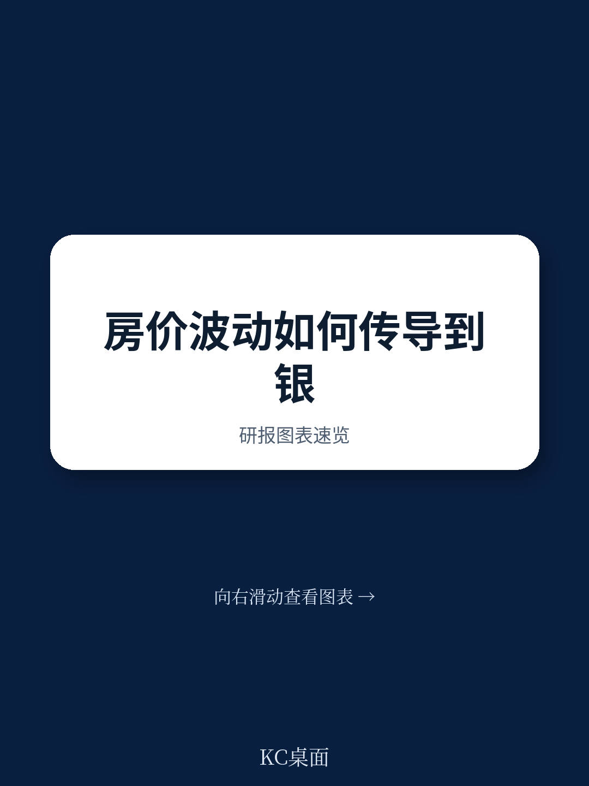
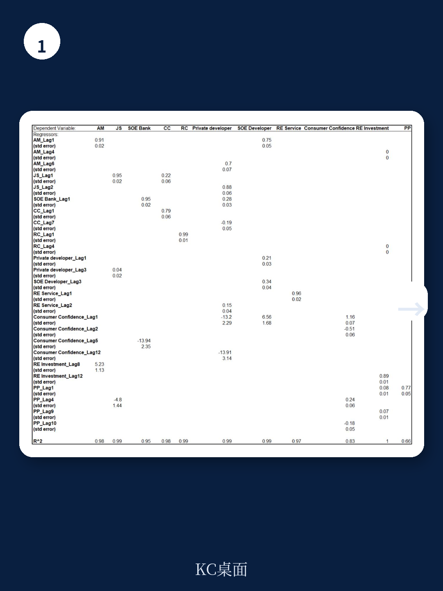
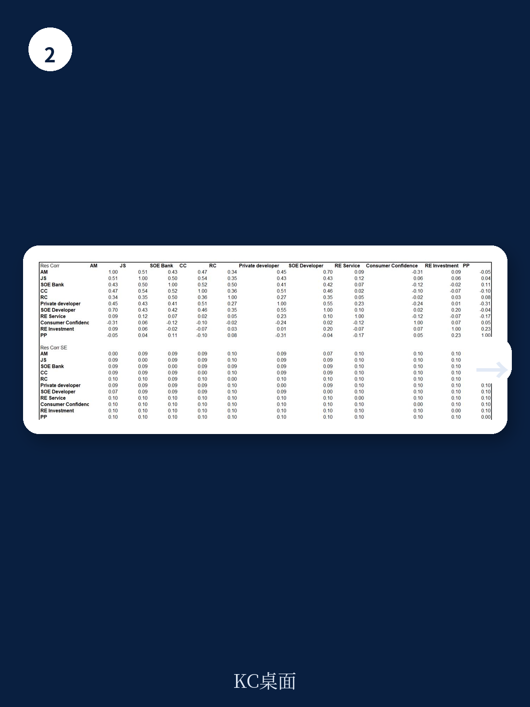

# 国际货币基金组织：IMF：中国房地产的“小冲击”为什么会有大后果

中国房地产市场的调整已经持续了近五年。多数市场参与者已经接受了“行业规模收缩”这个事实，但真正值得追问的问题是：当风险集中在特定类型的开发商和区域性金融机构时，这些看起来“体量不大”的压力点，会不会通过金融体系内部的连锁反应，演变成宏观经济的系统性冲击？

国际货币基金组织（IMF）在2026年6月发布的一份工作论文，给出了一个反直觉的回答：是的，而且这种传导机制比大多数人想象的更隐蔽、更持久。这篇题为《Assessing Macrofinancial Linkages in China Using a Machine-Learned Parsimonious VAR Model》的报告，由三位经济学家运用机器学习优化的向量自回归模型，精确量化了从微观压力到宏观冲击的传导链条。

核心结论值得每一个关注中国资产定价的人认真对待：中国金融体系与房地产之间的“宏观金融关联”，远比资产负债表上显示的贷款敞口更复杂。压力可以通过共同风险暴露、市场情绪传染、以及业务模式相似性等非贷款渠道传播，而后者恰恰是目前监管和市场分析中最容易被忽视的部分。

## 1. 模型揭示的真相：压力传导不靠贷款，靠“看不见的网”

传统上，分析房地产与金融体系之间的关联，主要依赖银行对开发商的贷款敞口数据。但这篇报告指出，这种分析框架存在严重盲区。IMF团队采用的是一种基于违约概率（PD）的复合指数，覆盖了中国所有上市房地产开发商和金融机构。与CDS利差或股价等纯市场指标不同，PD指数同时包含了市场信号（股价、波动率）和基本面信息（流动性、盈利能力、杠杆率），更能反映真实的部门健康度。

更重要的是，PD指数的共同波动能捕捉到超越借贷关系的关联性——包括共同风险暴露、业务模式相似性以及市场情绪传染。换句话说，即使A银行没有直接贷款给B开发商，如果它们都重仓了同一类资产，或者市场对两者持有类似的悲观预期，压力同样会迅速传递。

> **KC评论：** 这里的洞见在于，传统风控模型只看“借了多少钱”，而IMF的模型事实上在问“市场认为你们谁和谁是一类人”。一旦市场开始用“标签”定价——比如“民营开发商”或“城商行”——压力就可以绕过贷款合同，通过预期和情绪直接传导。完整报告中还包含了对8个部门之间同时期和跨期关联的回归系数表，这些数字直接给出了“谁最容易被谁传染”的量化答案，值得仔细研究。

## 2. 民营开发商是“放大器”，而不是“震源”

报告中的一个关键发现是：压力从民营开发商出发，不仅会影响到其他类型的开发商，还会在随后的时期波及金融机构。这一点与直觉不同——很多人认为民营开发商体量小、系统重要性低，但模型显示，它们恰恰是金融体系中最活跃的“压力放大器”。

原因在于民营开发商的融资结构。它们通常依赖成本更高的非银行融资，在压力时期更容易失去市场融资渠道。当它们的违约概率上升时，市场会重新评估所有与它们有类似业务模式或共同风险暴露的实体——包括国有开发商和各类金融机构。这种“标签传染”效应，使得一个看似局部的压力事件，能够迅速扩散到整个体系。

报告同时指出，即使是规模较小、区域集中度高的城商行，也可能产生系统性影响。这一点在中国当前的金融格局中尤其值得关注——大量中小银行深度参与了地方房地产融资，它们的健康度与区域经济高度绑定，一旦出现问题，传统“大而不能倒”的救助框架可能并不适用。

## 3. 房价是“核心枢纽”，但政策工具箱里只有一把钥匙

报告通过脉冲响应分析，量化了四类冲击的传导效果：民营开发商违约率上升、城商行违约率上升、房价下跌、以及消费者信心下降。其中，房价下跌被证实是影响最广、持续性最强的冲击。

房价下跌会同时打击投资、削弱消费者信心、并恶化房地产和金融两个部门的资产负债表。更重要的是，这种冲击会通过金融中介渠道进一步放大——银行在资产质量恶化时会收紧信贷，企业融资成本上升，投资和消费进一步收缩，形成负反馈循环。

> **KC评论：** 这解释了为什么政策层面如此执着于“稳房价”。但问题在于，稳房价的工具——放松限购、降低首付、降息——本质上都是在“托市”，而不是在修复资产负债表。报告暗示，一个可持续的房地产市场复苏，需要的是“由市场参与者的财务健康支撑的有机交易增长”，而不是政策驱动的短期反弹。完整报告中的脉冲响应图表给出了每个冲击在不同时间维度上的量化影响，这些曲线的形状直接决定了政策窗口期的长短。

## 4. 报告没有完全回答的关键问题：资本充足率足够吗？

报告在结论部分提到，一个资本充足、资金来源稳定的金融体系，更有能力维持信贷和流动性供给。这是一个重要的政策暗示：银行体系的资本缓冲，是阻断宏观金融负反馈的关键防线。

但报告没有完全展开的是：在当前中国银行体系的实际资本充足率水平下，这种缓冲是否真的足够？特别是在中小银行层面，资本质量的差异可能很大。报告所用的PD指数虽然能捕捉市场对银行健康度的判断，但无法直接回答“如果房价再跌10%，有多少银行会跌破监管红线”这类具体问题。

此外，报告提出的“市场-和暴露-基础的工具”用于监测宏观金融关联，是一个有价值的分析框架，但如何将这些工具转化为可操作的政策指标，还需要更深入的研究。比如，监管机构应该以多高的频率监测PD指数的跨部门相关性？当相关性突破什么阈值时，需要启动宏观审慎工具？这些问题在报告中只是点到为止。

## 5. 对投资者的观察框架：从“看规模”转向“看关联”

这篇报告为关注中国资产的投资者提供了一个新的分析视角。传统上，判断房地产风险主要看销售额、开工量、库存等规模指标。但IMF的模型提示，真正决定风险传染强度的，是“谁和谁绑在一起”，而不是“谁有多大”。

具体来说，投资者可以建立三个维度的观察框架：

第一，追踪不同部门PD指数的相关性变化。当民营开发商与城商行的PD指数开始同步上升时，意味着“标签传染”已经启动，即使没有直接的贷款违约。

第二，关注房价与消费者信心的联动关系。报告显示，这两个变量之间存在双向反馈：房价下跌打击信心，信心低迷又进一步压制房价。一旦这种反馈固化，政策干预的难度会成倍增加。

第三，留意监管对非银行贷款渠道的态度变化。报告提到，非银行金融机构在房地产融资中扮演了重要角色，尤其是在民营开发商领域。如果监管开始收紧这类融资渠道，可能会在短期内加剧流动性压力，但长期看有助于切断不透明的风险传导链条。

---

这份IMF工作论文的核心价值，不在于它给出了一个“房价会跌多少”的预测，而在于它提供了一个理解中国金融体系脆弱性的分析框架。房地产与金融之间的关联，不是简单的“贷款-抵押品”关系，而是一张由共同风险暴露、市场情绪和业务模式相似性编织而成的复杂网络。在这个网络里，一个看起来不大的压力点，可能通过意想不到的路径，引发远超预期的连锁反应。

这些未解的问题——银行资本缓冲的真实充足度、跨部门PD相关性的预警阈值、非银行融资渠道的监管走向——恰恰是深入理解中国宏观金融风险的关键。在我们的社群中，每天由AI agent结合人工审核生成的国际投行中文摘要与深度评论，会持续跟踪这些变量的最新变化，并提供10-40页的每日数据图表合集，既方便投喂给AI模型，也适合人工快速把握市场动态。如果你对这些尚未完全打开的问题感兴趣，欢迎加入社群，领取完整研报解读与原始图表，与我们一起持续追踪这些关键变量的演变。

Personal reading notes and learning share only. Not investment advice.

