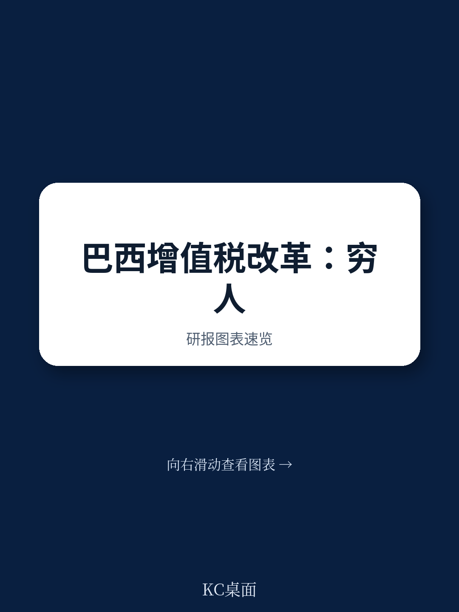
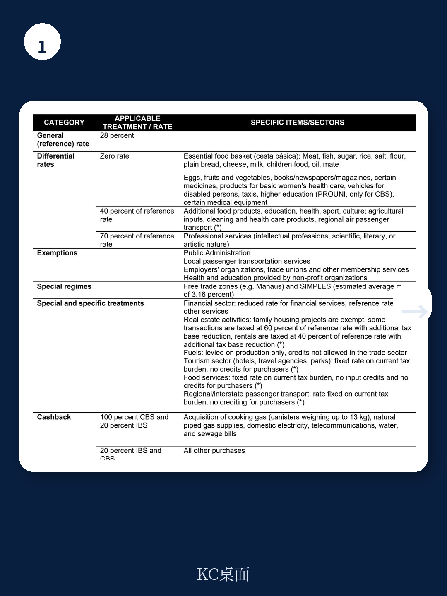
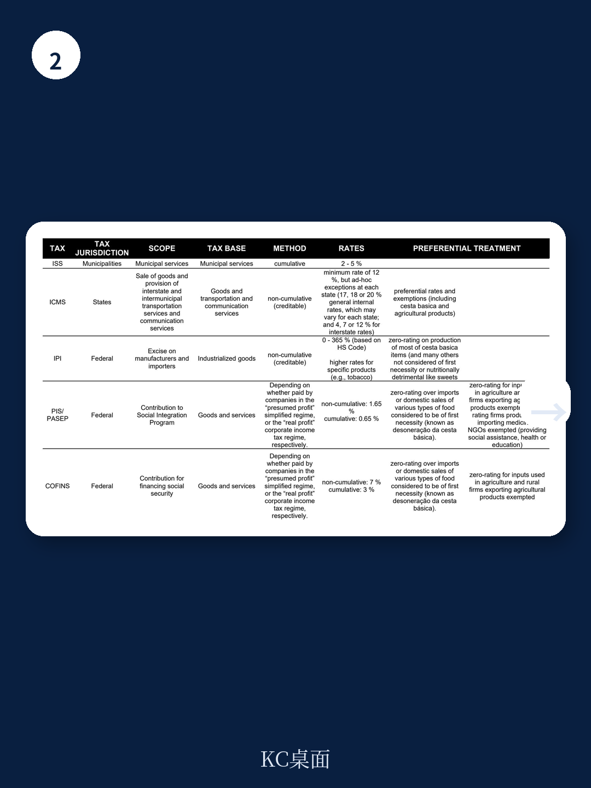

# 国际货币基金组织：IMF：巴西增值税改革的最大受益者不是穷人，而是服务税

巴西2023年通过的增值税改革，被广泛视为一项里程碑式的税制简化工程。然而，国际货币基金组织（IMF）最新发布的Working Paper WP/26/132揭示了一个更值得关注的判断：这项改革虽然旨在改善税制公平，但其最显著的公平性改善并非来自对穷人的直接减税，而是来自税负从商品向服务的结构性转移——这实际上是向高收入群体征税。

这份报告的核心价值在于，它用微观模拟数据拆解了每一项政策工具的真实分配效应，并给出了一个反直觉的结论：如果只关注改革已批准的减税措施，反而会加剧累退性；真正改善公平的，是那些不直接针对穷人的结构性变化。

## 1. 改革后的税负分布：穷人依然最重，但差距在缩小

报告基于2018年巴西家庭调查数据，模拟了改革后不同收入分位组的增值税负担变化。核心发现是：改革后，最贫困的10%家庭仍然承担着最高的相对税负——其增值税支出占可支配收入的比重约为25%，而最富裕的10%家庭这一比例仅为10%左右。

但这并不意味着改革无效。与改革前的税制相比，最贫困的三个分位组的税负下降了约7个百分点。更重要的是，这种改善并非均匀分布：中低收入群体（第2至第5分位组）的税负下降最为明显，而最贫困10%家庭的改善幅度相对有限。

> **KC评论：** 这意味着改革在公平性上的“边际改善”主要惠及了“接近贫困线”的群体，而非最底层的极端贫困人口。完整报告中的图6清晰展示了这种非线性改善，值得仔细对比改革前后的税负曲线形状变化。

## 2. 减税措施的真实效果：零税率和现金返还有效，但低税率适得其反

报告将改革中的各项政策工具拆开分析，发现了一个关键矛盾：改革批准的“低税率”措施（对部分商品和服务适用低于标准税率28%的税率）实际上加剧了累退性。原因在于，这些低税率商品更多被中高收入群体消费——例如某些加工食品和家用电器。

真正有效的是两项措施：零税率和现金返还。

零税率主要适用于“基本食品篮”（Cesta Basica）中的必需品，这些商品在贫困家庭消费中占比更高。报告测算，仅此项措施就能使最贫困的三个分位组的税负下降约7%。

现金返还机制则更为直接。改革设计了对最贫困家庭的部分增值税返还机制，涵盖水、污水、燃气、电力和电信等基本服务。报告显示，这项措施使最贫困家庭的税负下降了近10%。

但问题在于：为了维持税收中性，这些减税措施带来的收入损失必须通过提高标准税率来弥补。标准税率每提高1个百分点，对所有家庭的税负都是均匀增加的，这反而削弱了减税措施对贫困家庭的相对受益。

> **KC评论：** 这揭示了一个经典的税制设计困境：减税措施越多，标准税率越高，最终反而可能伤害最需要帮助的群体。完整报告中的图7将各项政策工具的分配效应并列展示，是理解这一矛盾的最佳入口。

## 3. 真正的公平性改善来自“服务税”：向富人征税的结构性转移

这是报告最值得关注的核心洞察。改革的一个重要结构性变化是：由于统一了税基并消除了累积征税，税负从制造业商品向服务业转移。而低收入家庭的消费结构中，商品的比重远高于服务；高收入家庭的消费则更多集中于服务。

报告测算，仅此一项结构性转移，就使得最富裕的10%家庭的税负增加了约3个百分点，而最贫困的10%家庭的税负下降了约1.5个百分点。这种“自动”的再分配效果，比任何直接针对穷人的减税措施都更为有效。

这不是政策制定者有意为之的设计，而是税制简化的副产品。但它恰恰说明了：税制改革的公平性改善，有时来自于消除扭曲本身，而非刻意设计的再分配工具。

## 4. 进一步优化的路径：扩大现金返还，取消其他减免

报告模拟了两种改进方案。第一种是维持税收中性，但调整政策工具组合：扩大现金返还的覆盖范围和返还比例，同时取消低税率和部分零税率措施。模拟结果显示，这一方案可以使最贫困家庭的税负下降25%（相对于无任何减免的增值税），同时还能将标准税率从28%降至26%左右。

第二种方案是放松税收中性约束，允许增值税收入占GDP比重下降至接近国际平均水平。这将进一步改善税负的累进性，但代价是政府收入减少，可能影响公共服务支出。

> **KC评论：** 这里有一个重要的隐含假设：现金返还的行政效率。报告假设了100%的返还率，但现实中巴西的行政能力和贫困识别能力可能无法完全实现这一目标。完整报告的图9展示了不同返还方案下的分配效果，以及对应的行政成本假设，这是判断方案可行性的关键。

## 5. 报告尚未完全回答的关键问题：现金返还的实施细节与动态效应

尽管报告在微观模拟上做得非常扎实，但仍有几个关键问题没有充分展开：

第一，现金返还机制的行政设计。报告假设了理想的实时返还机制，但巴西目前的数字基础设施能否支撑？报告引用了Swistak和de la Feria（2024）的研究，但并未针对巴西的具体情况进行测算。

第二，动态效应。报告是静态模拟，没有考虑税制改革对企业行为、就业和经济增长的反馈效应。报告在引言中提到了生产力提升和正规化效应，但并未将这些动态效应纳入公平性分析。

第三，州级补偿基金的长期影响。改革设计了长达近50年的州级补偿机制，这意味着部分扭曲可能长期存在，并影响税负的最终分配。

## 6. 对决策者的观察框架：三个维度判断改革成败

基于这份报告，我们可以提炼一个三阶段观察框架，用于跟踪巴西增值税改革的实际效果：

第一阶段（短期，1-3年）：关注现金返还的覆盖率与实际返还率。报告的核心建议是扩大现金返还，但前提是行政能力能够支撑。如果实际返还率低于模拟假设，那么改革的公平性改善将大打折扣。

第二阶段（中期，3-5年）：关注税负从商品向服务的转移是否如期发生。这取决于服务业的税基确定和征管能力。如果服务业逃税严重，结构性转移的效果将被削弱。

第三阶段（长期，5-10年）：关注经济增长和正规化对公平性的间接影响。如果改革确实提升了生产力和正规化率，那么最贫困群体的实际收入增长可能比静态模拟显示的更大。但这一效应需要更长时间才能显现。

---

这份IMF报告的价值，不仅在于它提供了巴西增值税改革的精确分配效应测算，更在于它揭示了一个普遍适用的税制设计原则：简化税基、消除扭曲，往往比精心设计的再分配政策更能改善公平。而现金返还机制，作为直接且精准的补偿工具，可能是连接效率与公平的最佳桥梁。

然而，报告中的许多关键假设、图表细节和替代方案模拟，受限于篇幅无法在这里完全展开。如果你想获取完整的报告解读、原始图表以及每日更新的国际投行研报摘要，欢迎加入我们的社群。每天，我们会通过AI agent加人工审核的方式，整理10-40页的国际投行与IMF最新研报中文摘要，既方便您快速把握市场动态，也适合作为AI模型的训练素材。

Personal reading notes and learning share only. Not investment advice.

