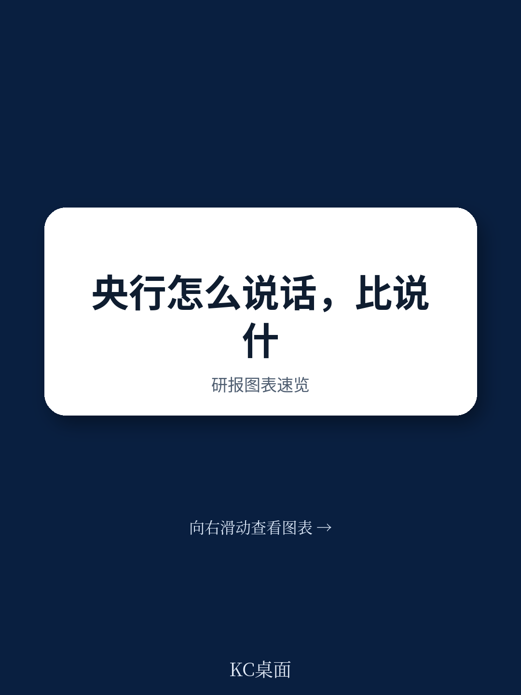
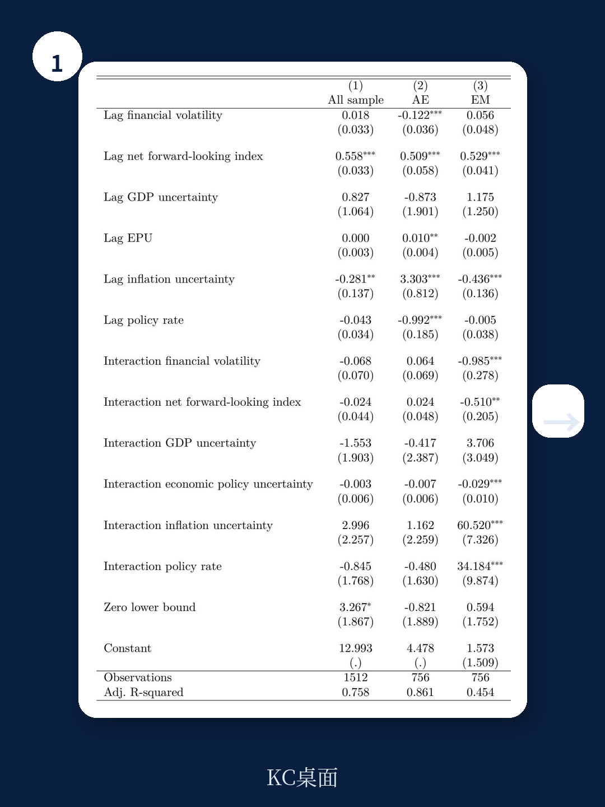
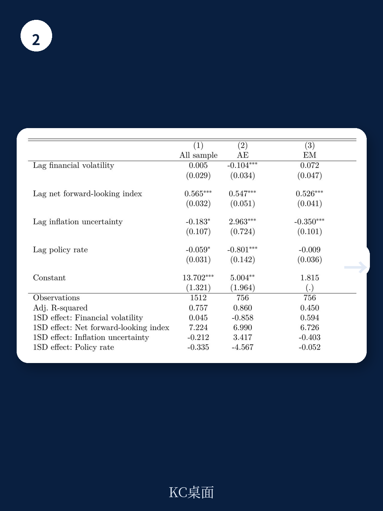

# 国际货币基金组织：IMF：欧洲央行正在分裂——先进经济体向前看，新兴经济体向后看

央行沟通，正在成为比利率本身更重要的政策工具。这是国际货币基金组织（IMF）最新工作论文的核心判断。在连续经历疫情、战争、地缘分裂和贸易摩擦之后，欧洲央行体系内部出现了一个被多数市场参与者忽视的分化：面对通胀不确定性，发达经济体的央行选择用更前瞻的语言锚定预期，而新兴经济体的央行却在向后看——更多依赖数据依赖和回溯性解释。这不是工具选择的差异，而是信用和制度能力的根本分野。

这篇论文由IMF欧洲部的八位经济学家完成，基于2009年至2025年间二十家欧洲央行的沟通实践，结合AI文本挖掘构建了量化指标。它回答的核心问题是：当不确定性成为新常态，央行的沟通策略究竟在如何演化？而答案，对全球资产定价和利率路径判断有直接影响。

## 1. 沟通工具趋同，但透明度差距在扩大

表面上看，欧洲各国央行的沟通工具箱已经高度一致：货币政策声明、新闻发布、在线平台几乎成为标配。但IMF的调查揭示了一个关键差异——发达经济体央行更愿意使用“前瞻性工具”：发布会议纪要、召开新闻发布会、公布利率路径预测、情景分析和扇形图。新兴经济体央行在这些工具的使用上明显保守。

这不仅是技术问题。会议纪要和利率路径预测意味着更明确的政策信号，也意味着更少的政策灵活性。发达经济体央行之所以敢于使用这些工具，是因为它们有更高的制度信用作为背书——市场相信它们能兑现承诺。而新兴经济体央行一旦给出前瞻指引却无法兑现，代价是信用折价，这是它们承受不起的。

> **KC评论：** 这一发现直接挑战了一个流行观点——“新兴市场央行沟通更灵活、更适应实时条件”。IMF的数据表明，灵活性有时不是优势，而是制度约束的产物。如果央行无法让市场相信它的前瞻指引，那么“向后看”就是唯一理性的选择。完整报告中的工具使用频率图表值得细看，它会让你重新评估不同央行声明的信号强度。

## 2. 通胀不确定性是唯一驱动央行的力量

IMF分离了四种不确定性来源：金融市场波动、经济政策不确定性、GDP增长不确定性和通胀不确定性。结果高度集中——只有通胀不确定性对央行沟通策略有显著影响。其他三种不确定性对央行语言选择的解释力几乎为零。

这个结论本身并不意外。通胀是央行的核心使命，通胀不确定性直接威胁央行信用。但IMF的进一步分析揭示了更微妙的机制：发达经济体央行在面对通胀不确定性上升时，会系统性地增加前瞻性语言的使用；而新兴经济体央行的反应恰恰相反——它们会减少前瞻性语言，转向更多回溯性表述。

这背后的逻辑是：当通胀路径变得不可预测，发达经济体央行选择“主动锚定”——用更清晰的未来路径声明来引导市场预期。而新兴经济体央行选择“保持灵活”——不承诺具体路径，留出随时调整的空间。两种策略都有合理性，但后果不同：前者在成功时能迅速稳定预期，但失败时信用受损更大；后者在不确定性消退时，市场对央行的理解框架仍然模糊。

> **KC评论：** 这一发现对利率交易有直接含义。如果你跟踪的是欧洲发达经济体央行，当通胀不确定性指标上升时，应该预期央行会给出更多前瞻指引，这通常意味着利率路径更可预测。而如果你关注的是新兴经济体央行，同样的通胀不确定性反而意味着央行会模糊化，市场需要更多依赖数据本身来定价。报告中对这一机制的回归结果非常扎实，值得完整阅读。

## 3. 央行沟通正在经历“结构性转向”

IMF的滚动窗口回归显示，欧洲发达经济体央行的沟通策略并非一成不变。在欧元区债务危机后的低通胀、低通胀不确定性环境中，前瞻性沟通更多受到低利率和零利率下限的约束。直到最近几年，随着通胀不确定性重新上升，这些央行才开始真正将前瞻性沟通作为主动管理预期的工具。

这意味着什么？意味着当前欧洲央行、英国央行等机构的“数据依赖”表述，可能不是一种临时策略，而是结构性转向的一部分。2022年7月，欧洲央行明确放弃了承诺式前瞻指引，转向“逐次会议、数据依赖”的模式。IMF的分析表明，这种转向在发达经济体央行中正在系统性地扩散。

但关键区别在于：发达经济体央行的“数据依赖”是建立在高度透明和前瞻性框架之上的。它们仍然提供详细的经济预测、情景分析和政策反应函数。而在新兴经济体，同样的“数据依赖”往往意味着更少的透明度——因为没有足够的制度能力来支撑更复杂的沟通。

> **KC评论：** 这里有一个市场容易忽视的细节。欧洲央行虽然放弃了承诺式前瞻指引，但IMF的文本分析显示，它并没有减少整体前瞻性语言的使用，只是改变了使用方式——从“我承诺未来做什么”变成了“根据这些条件，我未来可能做什么”。这种细微差别对利率衍生品定价有重要影响。报告中对欧洲央行沟通的专门分析（附录A.5）提供了更细致的分类，值得关注。

## 4. 报告没有完全回答的问题：信用如何从“缺失”到“建立”

IMF的论文清晰地指出了信用和制度能力是前瞻性沟通的前提条件，但它没有完全回答一个更根本的问题：信用如何建立？对于新兴经济体央行而言，如果前瞻性沟通需要信用，但信用又只能通过成功的前瞻性沟通来积累，这就是一个“鸡生蛋”的问题。

报告暗示了答案可能在于渐进式策略：先通过回溯性沟通建立基本信用，在保持通胀稳定的过程中逐步引入有限的前瞻性元素，再根据市场反应逐步扩大。但这一机制在论文中只是被提及，并没有被系统检验。

另一个未被充分讨论的问题是：央行沟通策略的跨国溢出效应。在一个高度关联的欧洲金融体系中，欧洲央行的前瞻性沟通是否会影响新兴经济体央行的沟通策略？如果欧洲央行给出明确的利率路径，新兴经济体央行的政策空间是否会因此被压缩？这些问题的答案，将直接影响资产配置者对不同国家债券的定价。

## 5. 一个实用的观察框架

对于读者而言，这份报告提供了一个可操作的框架来评估央行沟通质量：关注三个维度——前瞻性语言占比、通胀不确定性响应方向、以及沟通工具的透明度。如果一家央行在通胀不确定性上升时增加前瞻性语言，同时公开会议纪要和利率路径预测，那么它的沟通可信度更高，市场对它的利率路径定价也会更有效。反之，如果一家央行在相同环境下转向更多回溯性表述，且不提供详细的前瞻工具，那么市场应该对它的政策路径保持更大警惕。

这个框架不仅适用于欧洲，也适用于全球。美联储、日本央行、新西兰联储等机构的沟通策略，都可以用同样的维度来评估。IMF的这篇论文虽然没有覆盖非欧洲央行，但其方法论和分析框架具有普适性。

---

这篇IMF工作论文提供了近年来对央行沟通策略最系统的量化分析。它揭示的分化——发达经济体与新兴经济体在沟通策略上的结构性差异——正在深刻影响全球利率市场的定价效率。但报告中的很多细节，包括具体的文本分析指标构建、不同不确定性来源的乘数效应、以及ECB沟通的专门案例，因篇幅限制无法在这里完全展开。

这些内容，以及完整的原始图表和回归结果，我们已经在知识星球中做了完整的中文解读和拆解。每天，我们的AI agent会结合人工review，生成10-40页的国际投行中文摘要与KC评论，覆盖当天最新数据图表合集，既方便喂给AI，也方便人工快速把握市场动态。如果你对央行沟通、利率路径和全球资产定价的微观机制有持续兴趣，欢迎加入社群继续讨论。

Personal reading notes and learning share only. Not investment advice.

