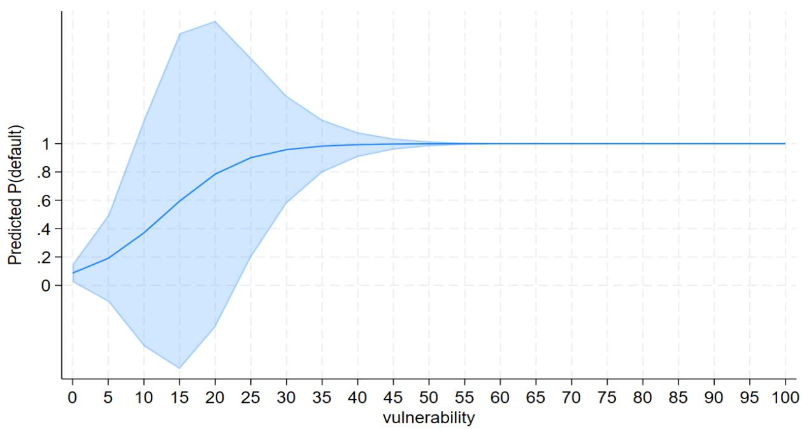
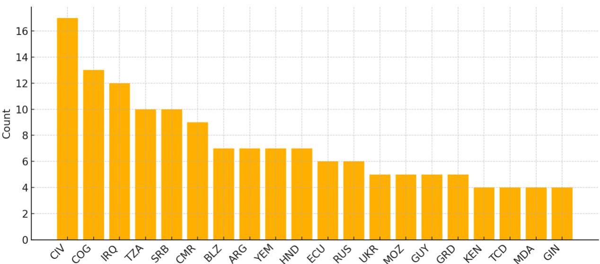
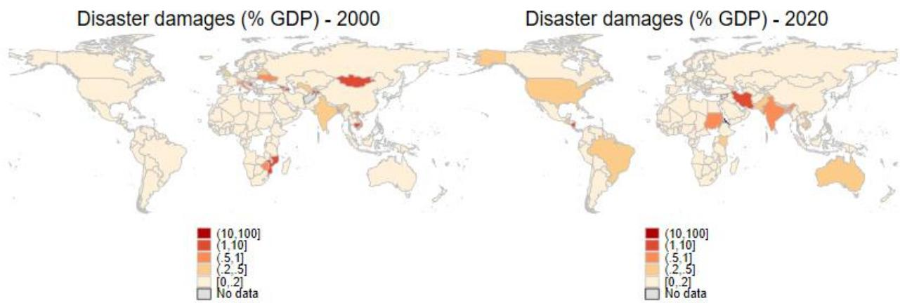
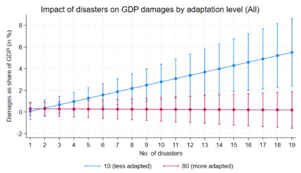
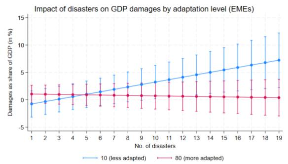
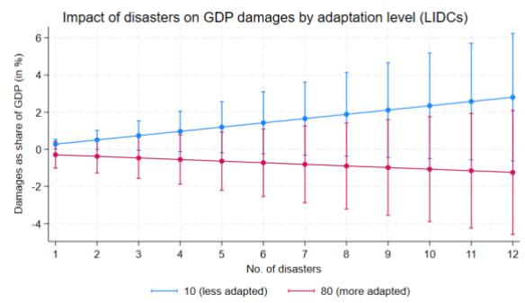
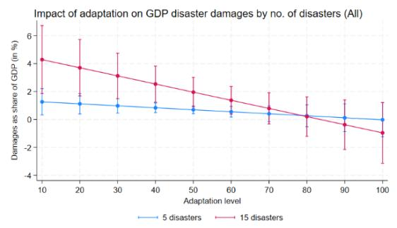
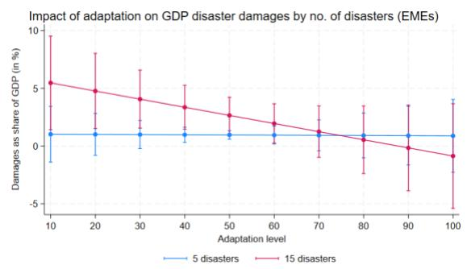
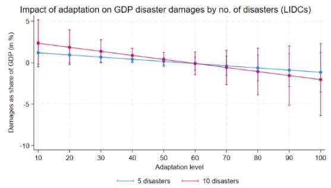
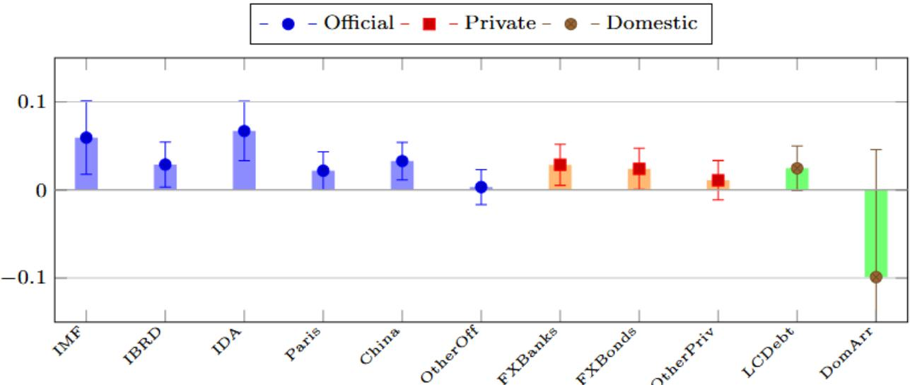

# Climate Shocks, Debt Defaults and Investment in Climate Adaptation – Squaring an Impossible Trilemma

Constance de Soyres, Emmanuella Obeng, and Joanne Tan
WP/26/128

IMF Working Papers describe research in progress by the author(s) and are published to elicit comments and to encourage debate. The views expressed in IMF Working Papers are those of the author(s) and do not necessarily represent the views of the IMF, its Executive Board, or IMF management.

2026
JUN

# IMF Working Paper African Department

# Climate Shocks, Debt Defaults and Investment in Climate Adaptation – Squaring an Impossible Trilemma Prepared by Constance de Soyres, Emmanuella Obeng and Joanne Tan

Authorized for distribution by Pablo Lopez
June 2026

IMF Working Papers describe research in progress by the author(s) and are published to elicit comments and to encourage debate. The views expressed in IMF Working Papers are those of the author(s) and do not necessarily represent the views of the IMF, its Executive Board, or IMF management.

ABSTRACT: Climate disasters tend to be associated with increased sovereign default risk. Countries face an “impossible trilemma”: scale up adaptation investment, keep debt sustainable amidst high borrowing costs and avoid the higher risk of default from delayed adaptation. Using a global panel of disaster event-level shocks, we find that a 1pp increase in disaster related losses as a share of GDP raises the odds of sovereign default by approximately 2-3 percent. An additional US\$1 billion in cumulative Official Development Assistance (ODA) is associated with a 0.13 point gain in a country’s adaptive capacity. Using average marginal effects and our predicted margins we then map concessional ODA finance to default probability and translate these relationships into a practical budgeting yardstick for calibrating needed ODA to sovereign default risk reduction targets. In a context of declining ODA, our findings highlight the crucial role of well-designed support in climate adaptation policies.

JEL Classification Numbers:

Q54; H63; O19; C23

Keywords:

Climate shocks; sovereign defaults; climate adaptation; concessional finance

Author's E-Mail Address:

cdesoyres@imf.org; eobeng@colorado.edu; jtan@imf.org

## Contents

Abstract....2   
Introduction....4   
Literature Review....5   
Data....6   
Stylized Facts....8   
Empirical Strategy and Results....11   
Conclusion....17   
References....18   
Appendix....20

## 1. Introduction

Climate disasters are increasing in both frequency and severity. The impact of these climate shocks on sovereign debt defaults remains an important research topic. Volz et al. (2020) map the transmission channels from what they term physical and transition risks to sovereign risk through: (i) macroeconomic impacts, (ii) fiscal impacts of disasters and fiscal pressures from adaptation and mitigation policies, (iii) climate related risks and financial sector stability, (iv) depletion of natural capital, and (v) impacts of climate change on trade and political stability. Because debt typically rises after disasters via financing recovery and reconstruction costs (Mejia, 2014), any combination of these channels can amplify sovereign risk and push climate vulnerable countries toward default. In fact, recent analysis revealed that climate shocks would further hurt long-term debt sustainability unless countries invest in adaptation (Calcaterra et al., 2025b) to reduce future damages. However, adaptation is costly and generally involves high upfront costs. If adaptation is financed by debt at market terms, it could increase debt ratios today and accentuate debt vulnerabilities. On the contrary, delaying investments in adaptation could preserve debt ratios today but at the cost of increased vulnerabilities to these shocks in the future. Hence, an “impossible trilemma” is faced by countries that cannot strengthen their resilience to climate shocks without an impact on debt sustainability.

Recent disaster episodes show how large the associated economic and fiscal losses can be. In the wake of Hurricane Ivan, which struck Grenada in 2004, total losses were estimated at about US\$1.1 billion representing 200 percent of GDP. As a result, debt levels spiraled from 80 percent of GDP in 2003 to 95 percent of GDP in 2004, and the country undertook a debt restructuring over 2004-2006. More recently, Hurricane Beryl (2024) was estimated to have cost about a third of Grenada's GDP. $^{1}$ In Dominica, Hurricane Maria (2017) caused about US\$931 million in damages and US\$380 million in losses, which represented about 226 percent of 2016 GDP, leading to significant negative effects on the performance of their economy, a surge in debt and a projected 21 percent external current account deficit for 2018. $^{2}$ In 2019, Cyclones Idai and Kenneth devastated Mozambique, Malawi and Zimbabwe with losses amounting to over \$873 million in buildings, equipment, infrastructure and crops. $^{3}$ The World Bank mounted a \$191.7 million emergency recovery and resilience operation in an attempt to cut fiscal losses from these cyclones. $^{4}$ The impact of climate-related events is not limited to the developing world. They caused an estimated €208 billion in economic losses across Europe between 1980 and 2024, with over one quarter of the cost incurred between 2021 and 2024. $^{5}$ There have been more than 400 climate-related events in the U.S. since 1980, with total damages exceeding US\$2.9 trillion. $^{6}$ These episodes reveal how climate shocks can strain sovereign balance sheets in advanced and developing economies alike, with significant fiscal consequences: damaging physical assets and infrastructure and requiring substantial expenditures on relief programs and reconstruction costs. The Global Commission on the Economy and Climate (2016) estimated that roughly US\$90 trillion in sustainable climate resilient infrastructure will be needed by 2030, underscoring the sizeable fiscal challenge. $^{7}$

Climate disasters tend to depress output growth and cause losses that countries do not fully recover from (Felbermayr & Gröschl, 2014; Strobl, 2011; Hsiang & Jina, 2014) and raise consumer price inflation with persistent effects on food prices (Parker, 2017). They also widen fiscal gaps through recovery and reconstruction costs (Mejia, 2014), affect firm-level productivity and the cost of debt (Cevik & Miryugin, 2023; Kling et al., 2021) and cause sovereign distress (Agarwala et al., 2021; Beirne et al., 2021; Cevik & Jalles, 2022a; Kling et al., 2018; Klusak et al., 2023; Seghini, 2024a) which may lead to debt defaults. Against this backdrop, we examine whether investing in climate adaptation using concessional financing can help build resilience, reduce disaster-induced damages and lower default probability without imperiling debt sustainability.

To address this question, the paper proceeds in three steps. First, we revisit the relationship between climate shocks and sovereign debt defaults by estimating the impact of shocks on default probabilities with a methodology adapted for rare events. Using a cross-country database of climate shocks merged with default episodes (Asonuma & Trebesch, 2016), we find that climate shocks have a positive statistically and economically significant impact on default probability, robust across different estimations, income groups and to the use of an alternative default dataset from the Bank of Canada/Bank of England which allows splits by creditor type. $^{8}$ Second, we assess whether a country's adaptive capacity (the ability to absorb and recover from climate shocks) mitigates the economic damages from climate disasters. Holding other factors constant, higher adaptive capacity is associated with a reduced marginal economic impact of additional disasters. Finally, we examine whether access to concessional financing contributes to building adaptive capacity by estimating panel regressions of adaptive capacity on Official Development Assistance (ODA) disbursements. We find that ODA (in both nominal US\$ terms and in percent of GDP) tends to be positively associated with improvements in adaptive capacity. We then map the estimated coefficients to implied changes in damages and default probabilities using a partial equilibrium, back-of-the-envelope calculation. We find that ODA is associated with stronger adaptive capacity, which in turn tends to attenuate damages and lower default probability. Given that ODA disbursements are likely endogenous, despite the inclusion of controls, our results should be interpreted as associations, rather than causal effects.

Our contributions are threefold: First, we replace broad structural vulnerability measures used in past empirical work with climate event-level macroeconomic loss measures tying the climate-default link to realized shocks. Second, we address rare event bias in sovereign default estimations by using a methodology tailored to such events. Third, we extend the empirical contribution by pricing the policy lever. We translate the estimated coefficients into budget relevant US dollar magnitudes and ODA to GDP ratios required to offset the climate disaster-induced increases in default probability. This allows us to evaluate how access to concessional financing can strengthen adaptive capacity and attenuate the effect of climate shocks on sovereign default probabilities. The remainder of the paper is structured as follows: we give an overview of the literature in Section 2, discuss our data and methodology in Section 3, and some stylized facts in Section 4. Section 5 presents the empirical strategy and results. Section 6 concludes.

## 2. Literature Review

This paper is related to the following strands of literature. First, our paper is related to the growing literature that documents how climate vulnerability is priced into sovereign risk premia via bond spreads and ratings. Using the ND-GAIN vulnerability indices, Beirne et al. (2021), Cevik & Jalles (2022a, 2022b, 2023), and Kling et al. (2018) show that climate risk is a first-order driver of sovereign credit conditions, with more exposed sovereigns facing higher borrowing costs. For developing countries, Cevik & Jalles (2022b) quantify an effect of about 15.55 basis points on spreads, while Kling et al. (2018) estimate that for the V20 group, the sovereign debt cost is about 1.174 percent higher, translating to over US\$62 billion in the past decade. $^{9}$ Klusak et al. (2023) project systematic climate induced downgrades to sovereign credit ratings under warming scenarios as early as 2030. Using monthly Emerging Market Economies (EME) data, Boehm (2022) finds that rising temperatures undermines sovereign credit. A $1^{\circ}\mathrm{C}$ anomaly lowers EMBI returns by about 0.46 percentage points on average, implying higher borrowing costs. We build on this strand by shifting the outcome from spreads/ratings to the default event itself, employing a robust methodology and exploiting realized economic damages (in percent of GDP) as the climate shock.

A second strand of the literature studies sovereign debt sustainability in the context of climate shocks and how adaptation can reshape debt dynamics. Cheng & Chang (2025) highlight that disaster shocks raise sovereign risk through higher external debt service or government expenditure; Agarwala et al. (2021) emphasize that disasters destroy assets and public infrastructure which require significant expenditure on repair and reconstruction; Seghini (2024b) shows that climate-related costs can tip highly indebted countries into unsustainable territory. Stress testing and debt sustainability frameworks indicate that higher disaster frequency strain public finances. For a global sample of countries, Calcaterra et al. (2025b) find that expected debt servicing costs increase by up to 3 percent of GDP under high climate impact scenarios, with considerable country heterogeneity and that long-run debt trajectories of highly impacted countries become unsustainable. They also show that appropriately calibrated adaptation can lower these debt pressures and the implied risk premia. However, if financed on non-concessional terms, it can tighten the primary balance and push up the debt stabilizing fiscal adjustment. $^{10}$ To extend the analysis, this paper focuses on adaptation investment financed on concessional terms using ODA as a share of GDP. Model-based papers formalize the mechanism. Mallucci (2022) embeds adaptation capital into a sovereign default environment for seven Caribbean countries and finds that countries exposed to climate shocks may need contractual innovations like disaster clauses and concessional finance to continually access financial markets as risks increase. A complementary literature (Duffy, 2025) augments a standard sovereign default framework for emerging economies with endogenous public adaptation capital that accumulates over time and reduces disaster damages, showing that higher disaster frequency raises default risks and spreads while adaptation lowers both. They highlight that default risk tightens the fiscal space and budget, and this may in turn increase the costs of climate change by limiting investments in adaptation. They argue that debt relief type instruments like low-cost loans and adaptation linked bonds could expand the fiscal space, raise adaptation and lower disaster induced losses. In these frameworks, adaptation is not merely a resilience policy but a tool that can be used to reduce future damages that tighten sovereign balance sheets and constrain nations. This paper shows empirically, in a broad cross-country panel, that adaptation can dampen disaster damages.

Finally, our paper complements papers and policy reports that highlight the importance of concessional financing to raise adaptation at the scale necessary for sovereigns subject to climate shocks and debt vulnerabilities. Inger Anderson (United Nations Environment Programme, UNEP) underscores that scaling climate finance must begin with investing in adaptation and prioritizing grants, concessional and non-debt creating instruments to avoid adding to vulnerable countries' debt burden. $^{11}$ Complementing this, the UNEP Adaptation Gap Report (2025) cautions that although about 70 percent of international public adaptation in 2022–2023 was concessional, nonconcessional debt instruments still dominated flows, raising affordability and equity concerns and risking an adaptation investment trap that could deepen vulnerabilities. $^{12}$ Bhattacharya et al., (2023) argue that concessional finance, while scarce, is the most vital resource for a climate resilient society, calling for a fivefold increase by 2030. Echoing this, the IMF's 2023 Climate Staff Note quantifies the 2030 concessional adaptation finance needs at about US\$30 billion for Low-Income Countries (LICs) and US\$10 billion for Small Developing States (SDS) with total grant requirements for mitigation and adaptation at around US\$42 billion per year. $^{13}$ We contribute to this strand of literature by translating our empirical results into a policy relevant implication for ODA, by linking cumulative ODA and ODA as a share of GDP to improvements in adaptive capacity, reductions in disaster damages and implied declines in debt default probability of vulnerable countries.

## 3. Data and methodology

This paper uses a variety of data sources. To implement our research strategy, we create a sovereign default variable using the comprehensive default database by Asonuma and Trebesch (2016). We define sovereign default as a failure to meet debt service obligations and a non-honoring of original debt agreements. This includes missed coupon payments and event-type restructurings with either no legal default or no unilateral default episode. While the database is at a monthly frequency, we convert default episodes to an annual basis and mark a country “in default” throughout the duration of the default spell. The default variable is equal to one when the country is considered in default, and zero otherwise. In total, there are 196 default events. A complementary default measure was constructed using the sovereign default database from the Bank of Canada/Bank of England. This dataset provides estimates of the nominal value of government debt in default by type and creditor and includes foreign and local currency denominated bank loans, bonds and debt by multilateral organizations, Paris Club and other private creditors. For each country, in a given year, the country is considered in default when the stock of arrears increases by more than 100 percent compared to the previous year, provided the previous year’s stock of arrears is positive. The default variable is set at one in those years, and zero otherwise. As robustness, we also split the default dataset by creditor (official – IMF, IBRD, IDA, Paris Club, China, other official; private – foreign currency (FX) banks, FX bonds, other private; domestic – local currency (LC) debt, domestic arrears). $^{14}$

Disaster events-level data are obtained from the Emergency Events Database (EM-DAT). EM-DAT contains data compiled from different sources on the occurrence of natural disasters, including meteorological, hydrological, climatological, geophysical and biological events across the world since 1900. A record enters the EM-DAT database if it has at least one of the following: 10 fatalities, 100 affected people, a state of emergency declared or a call for international assistance. The disasters of interest for this analysis are meteorological and hydrological disaster events: drought, extreme temperature, flood, landslide and storms. Multi-year disasters, such as droughts, enter the panel according to the year in which EM-DAT records the event and its associated damages. Our variable of interest is the economic impact variable, “Total Economic Damage”, which we aggregate across all events in a given country and year and scale by nominal GDP. $^{15, 16}$ This naturally scales the shock by the size of the economy and captures the intensity of the impact. This method also aggregates the different disasters into one severity metric per year. $^{17}$ Disaster counts ranges from 0 to 34 events per country-year. About 44 percent of country-year observations record no disasters while only a small share record more than 19 in a year. The EM-DAT database also reports data on human impact metrics (total deaths, number injured, total number of people affected) and other economic impact variables (reconstruction costs, insured damage). We proxy adaptive capacity using the ND-GAIN's adaptive capacity component indicators from the following components: (i) Food, with Agricultural capacity, (ii) Water, with Dam capacity and Access to reliable water, (iii) Ecosystems, with Ecological footprint and Engagement in international environmental conventions, (iv) Habitat, with Paved roads, and (v) Infrastructure, with Projected change of hydropower generation capacity. We construct the adaptive capacity index by averaging across the indicators for each country's observation. Higher index values denote more adapted countries.

Concessional financing refers to below market rate financing (grants, low to zero interest loans with longer maturities or grace periods) that can be used to finance development projects (World Bank, 2021). $^{18}$ We proxy concessional financing with ODA disbursements from the Organization for Economic Co-operation and Development - Development Assistance Committee's (OECD-DAC) Creditor Reporting System (CRS). ODA is mainly composed of government aid grants or soft loans from bilateral and multilateral donors to aid recipients in areas such as sustainable development, health, sanitation, education and infrastructure. $^{19}$ The OECD is the only official source of detailed, granular, reliable and consistent ODA from donors. Since 2018, OECD-DAC reports ODA on a grant equivalent basis. This provides a measure of loan concessionality which enables the comparison of aid flows between grants and concessional loans. $^{20}$ Consistent with this, recent DAC statistics indicate that about 85 percent of ODA and 64 percent of bilateral concessional financing are provided as grants, underscoring ODA's suitability as an operative proxy for concessional financing. $^{21}$ At the same time, ODA should be interpreted as an imperfect proxy for concessional resources that may support adaptive capacity. ODA serves as a primary channel for climate finance for vulnerable countries, supporting adaptation and mitigation, enhancing resilience and sustainable development (Rauniyar et al., 2025). Despite this, not all ODA is adaptation-related and only a part of it is likely to be directly connected to climate resilience. While adaptation targeted ODA would likely be more effective in this scenario, consistent long-run data on such targeted flows are not available for our full sample period. $^{22}$ For this analysis, we use disbursements rather than commitments to capture actual financial flows. $^{23}$ For each country year, we construct (i) the cumulative flow of ODA up to year t and (ii) the cumulative ODA stock as a share of GDP, with the latter used in step 3 of our empirical strategy to scale financing needs to country size. $^{24}$

Macroeconomic variables are drawn from the International Monetary Fund's (IMF) World Economic Outlook (WEO), International Financial Statistics (IFS) data and the World Bank's World Development Indicators (WDI). Following Cevik & Jalles (2022a) and the solvency literature (e.g. Manasse and Roubini, 2005), we include real GDP growth and GDP per capita, inflation, debt as a share of GDP, financial development measured by domestic credit to the private sector as a share of GDP, terms of trade, and real effective exchange rate (REER) index (where available). We also include disaster frequency as a control. With these variables, we create a panel dataset spanning 1995–2020 for 178 countries.

## 4. Stylized Facts

We document a set of descriptive patterns in our dataset that motivates our empirical strategy.

Stylized Fact 1: Countries with a higher vulnerability measure face significantly higher predicted default probability.

A conditional fixed effects logit of default probability on the ND-GAIN vulnerability index shows that as vulnerability increases, the predicted probability of default rises steeply. Figure 1 plots predicted default probabilities from a country fixed effects logit as vulnerability varies with 95 percent confidence intervals. As vulnerability rises from 5 to 40 percent (0–100 scale), the model-implied probability rises from about 0.2 to over 0.8. Beyond a vulnerability measure of 45 percent, default probability remains elevated. These are descriptive correlations and are not to be interpreted as causal effects. A conditional logit while robust to time invariant heterogeneity can still suffer small sample bias in rare events. $^{25}$ The ND-GAIN vulnerability measure may also embed economic variables that raise endogeneity concerns (Kling et al., 2021). $^{26}$ This is in line with other findings, such as the Intercontinental Exchange (ICE) Sustainable Finance which posits that, conditional on standard development and macroeconomic controls, sovereigns with a higher ICE Physical Risk Scores tend to face higher default risk. They document that moving from a score of 0 to 5 is associated with an 18.5 percent higher probability of default on average, which translates to about 3.7 percent per point increase in their score. $^{27}$

  
Figure 1. Predicted default probability from a conditional fixed-effects logit model with 95 percent confidence intervals. Note: The figure plots predicted default probabilities as the ND-GAIN vulnerability index varies. Higher values indicate greater climate vulnerability. The specification used is $Pr(default_{i,t} = 1) = \Lambda (\beta vulnerability_{i,t-1} + \mu_i + \lambda_t)$ . Sources: Asonuma & Trebesch (2016) sovereign default database; ND-GAIN; authors' calculations.

## Stylized Fact 2: Defaults are rare and differ by creditor type.

In our panel, default occurs in about 4 percent of country year datapoints. Evidence among 178 countries shows that a small set of sovereigns (e.g., Cote d'Ivoire, Republic of Congo, Iraq, Tanzania, Serbia etc.) features repeated defaults, accounting for roughly half of all observed episodes. $^{28}$ In the BoC/BoE creditor disaggregated panel (also from 1995 to 2020), official creditors are most commonly involved in default episodes largely via “other official” creditors (about 59.4 percent) and Paris Club (about 9 percent) with IDA, China, IMF and IBRD each less frequent. On the private side, “other private” and foreign currency banks feature more often. $^{29}$ Figure 2 shows the Top 20 countries by number of default episodes. This is in line with the literature finding that defaults are infrequent events. D’Erasmo and Mendoza (2019) simulate a quantitative model that yielded a 1.21 percent long-run frequency of domestic defaults aligning with the 1.1 percent evidence from Reinhart-Rogoff (2008) sovereign dataset. $^{30}$

  
Figure 2. Distribution of Sovereign Defaults: top 20 countries by frequency. Notes: The figure reports the number of sovereign default episodes by country in the Asonuma and Trebesch (2016) database and shows the 20 countries with the highest frequency of defaults in the sample. Sources: Asonuma & Trebesch (2016) sovereign default database; authors' calculations.

## Stylized Fact 3: Disaster losses are highly clustered and unevenly distributed.

In our dataset, most countries lose well under 1 percent of GDP to disasters in a typical year, but a small subset repeatedly faces large macroeconomic losses. Figure 3 compares annual total disaster damages as a share of GDP across countries in 2000 and 2020. The geographic pattern is uneven, with Central America and the Caribbean, South and East Asia and parts of Sub-Saharan Africa having a disproportionate share of high damage observations. These cross-sectional maps of realized damages reinforce forward-looking projections of the uneven burden of climate damages. Using country-level data and temperature growth estimates, Kahn et al. (2019) and Volz et al. (2020) project global GDP per capita losses from climate change by 2030, 2050, and 2100 under standard IPCC pathways. They project global GDP per capita to be between 1.07 and 7.2 percent lower by 2100. These projections imply sizable long-run GDP per capita losses under high warming paths, with marked heterogeneity across regions and especially large projected losses in parts of Southeast Asia. $^{31\ 32}$

  
Figure 3. Annual total disaster damages as a share of GDP across the world, 2000 vs. 2020. Notes: For each country-year, damages are constructed by aggregating all relevant climate-related EM-DAT losses within the year and scaling by nominal GDP. Sources: EM-DAT; IMF; authors' calculations.

Stylized Fact 4: ODA is modest on average, concentrated in Low-Income Developing Countries (LIDCs)

ODA inflows are modest for most countries, more concentrated in LIDCs than in EMEs. Over 1995–2020, the median ODA to GDP ratio is 1.72 percent for the full sample, 0.59 percent for EMEs and 4.85 percent for LIDCs. The means are higher, 4.45, 2.27 and 7.16 percent respectively. In terms of dollar amount, the median (mean) annual ODA is US\$231 million (US\$655 million) overall, US\$158 million (US\$543 million) for EMEs with LIDCs reaching US\$386 million (US\$770 million). $^{33}$

Official Development Assistance (ODA), 1995–2020

<table><tr><td></td><td colspan="3">ODA Summary</td></tr><tr><td>Metric</td><td>All</td><td>EMEs</td><td>LIDCs</td></tr><tr><td>ODA as Share of GDP (%)</td><td></td><td></td><td></td></tr><tr><td>Median</td><td>1.72</td><td>0.59</td><td>4.85</td></tr><tr><td>Mean</td><td>4.45</td><td>2.27</td><td>7.16</td></tr><tr><td>Maximum</td><td>90.99</td><td>77.13</td><td>90.99</td></tr><tr><td>ODA Disbursements (USD millions)</td><td></td><td></td><td></td></tr><tr><td>Median Annual Value</td><td>231</td><td>158</td><td>386</td></tr><tr><td>Mean Annual Value</td><td>655</td><td>543</td><td>770</td></tr><tr><td>Maximum Annual Value</td><td>21,700</td><td>21,700</td><td>12,400</td></tr></table>

Notes: Figures summarize country-year observations of ODA from 1995-2020. Sources: OECD-DAC CRS; authors' calculations.

## 5. Empirical Strategy and Results

Our strategy proceeds with the following three steps. We begin by employing a logit specification to investigate how climate shocks affect sovereign debt default probability. We follow Cevik and Jalles (2022a) in modeling sovereign default as a binary outcome and in using conventional macroeconomic controls. We depart from their approach in two different ways: by measuring climate risk using realized economic damages rather than the ND-

GAIN vulnerability indices and introducing a specific treatment for rarity (we also use a different sovereign default database). $^{34}$ These adjustments improve the interpretability of our coefficient estimates. Sovereign defaults are indeed rare events as they make up only about 4 percent of our sample. In this context, standard logit estimates would suffer from a small sample bias. We therefore use Firth's bias reduced logit to handle the infrequent events. Specifically, rarity can coincide with quasi-separation and Firth's bias reduced logit introduces a Jeffreys prior penalty to the maximum log likelihood, correcting small sample bias and stabilizing estimates when separation is a risk. Firth is therefore useful not only for the rarity of events, but for the possibility of a small number of cases on the rarer of the two outcomes. $^{35}$ In this model, we estimate the following:

$$
P r \big (d e f a u l t _ {i, t} = 1 \big) = \Lambda \big (\alpha + \beta d a m a g e _ {i, t - 1} + \gamma^ {\prime} X _ {i, t - 1} + \mu_ {i} + \lambda_ {t} \big)\tag{1}
$$

where $default_{i,t}$ is the indicator equal to 1 if country i is in default in year t, $damage_{i,t-1}$ is the climate shock measure in i at t-1 with total economic damages from climate related hazards (drought, extreme temperature, flood, landslide, storm) scaled by nominal GDP, $X_{i,t-1}$ is the vector of lagged macroeconomic controls (i.e., real GDP growth, log real GDP per capita, inflation, debt as a share of GDP, financial development and terms of trade), $\mu_{i}$ and $\lambda_{t}$ are country/income group and year fixed effects. Given that disasters depress GDP on impact (Felbermayr & Gröschl 2014), we expect default stress and fiscal strains to typically emerge in the following budget cycle following the disaster year. Since the extent of economic damages caused by natural disasters may be correlated with other omitted economic variables, we introduce the lag structure to illustrate the time evolution of disaster effects. Our standard errors are clustered at the country level where applicable.

Table 1 presents rare events logit model for the full sample of countries and separately for EMEs and LIDCs. The results from the standard logit are also presented for comparison. The odds of default tend to be higher for countries that experienced larger disaster losses in the previous year. Depending on the sample, a one percentage point increase in disaster related losses raises the odds of default by approximately 2-3 percent, robust across logit and rare events logit models. When we focus on EMEs, the results remain significant. However, they are no longer significant when focusing on LIDCs, despite a positive coefficient. $^{36}$ For context, long horizon studies show that average global default rates are about 7 percent for advanced economies and about 17 percent for developing countries (Qian & Roch, 2024). Fitch ratings (2025) noted that default rate fell to 1.9 percent in 2024 from 5.5 percent for speculative grade debt while overall sovereign default rate is 0.9 percent from 2.6 percent in 2023. The ICE Physical Risk Score predicts an increase in sovereign default probability of about 3.7 percent with estimates in a similar range in related work (Cevik & Jalles, 2022a). Our estimated probability of default from climate shocks is thus a sensible yardstick for policy work. As a robustness check, we re-estimate our baseline default regressions excluding pre-2000 observations to address possible time bias documented in earlier EM-DAT data. The results are essentially unchanged: the coefficient on damages (% of GDP) remains positive and statistically significant for the full sample and for EMEs, while remaining positive by statistically insignificant for LIDCs. The effects of disaster damages on sovereign default probabilities also remain robust when we split defaults by creditor type in the Appendix (Figure A.1) and when we control for IMF-supported programs that coincide with debt restructuring episodes (Table A.2).

Table 1. Logit and Rare-Events Logit Specifications of default indicator on lagged disaster damages

<table><tr><td>Default dummy</td><td>(1) Logit ALL</td><td>(2) Rare Logit ALL</td><td>(3) Rare Logit EME</td><td>(4) Rare Logit LIDC</td></tr><tr><td>damage (% GDP)</td><td>0.025**(0.010)</td><td>0.026**(0.011)</td><td>0.021*(0.012)</td><td>0.097(0.120)</td></tr><tr><td>GDP growth</td><td>-0.119*(0.070)</td><td>-0.101***(0.023)</td><td>-0.125***(0.048)</td><td>-0.053(0.037)</td></tr><tr><td>log (GDP per capita)</td><td>2.830(3.554)</td><td>0.583***(0.194)</td><td>0.014(0.335)</td><td>1.413***(0.334)</td></tr><tr><td>inflation</td><td>0.079*(0.047)</td><td>0.000(0.011)</td><td>0.046***(0.017)</td><td>-0.087***(0.030)</td></tr><tr><td>debt (% GDP)</td><td>0.051***(0.010)</td><td>0.006***(0.002)</td><td>0.021***(0.004)</td><td>0.002(0.002)</td></tr><tr><td>financial development indicator</td><td>0.052(0.035)</td><td>-0.005(0.006)</td><td>0.001(0.007)</td><td>-0.068**(0.027)</td></tr><tr><td>log (terms of trade)</td><td>-3.646*(2.108)</td><td>-1.848***(0.434)</td><td>-0.665(0.772)</td><td>-1.952***(0.606)</td></tr><tr><td>Observations</td><td>466</td><td>3031</td><td>1469</td><td>939</td></tr><tr><td>Country FE</td><td>Yes</td><td>No</td><td>No</td><td>No</td></tr><tr><td>Year FE</td><td>Yes</td><td>Yes</td><td>Yes</td><td>Yes</td></tr><tr><td>Income Group FE</td><td>No</td><td>Yes</td><td>No</td><td>No</td></tr></table>

Notes: Table 1 presents estimates from Equation (1). Column (1) reports the standard logit benchmark and columns (2)-(4) report the preferred rare events logit specification. Standard errors in parentheses. Robust standard errors clustered at the country level. \* p < 0.10, \*\* p < 0.05, \*\*\* p < 0.01

Having established the baseline effect of climate disasters on sovereign default, we now look at whether investments in adaptation can attenuate the macroeconomic damage these disasters inflict. We regress economic damages from climate shocks on adaptive capacity, with adaptive capacity both as a standalone variable and as an interaction term with disaster frequency in a fixed effects panel regression of the form:

$$
d a m a g e _ {i, t} = \alpha_ {i} + \lambda_ {t} + \beta d i s _ {i, t} + \theta a d a p t _ {i, t} + \phi \cdot (a d a p t _ {i, t} \times d i s _ {i, t}) + \gamma^ {\prime} X _ {i, t} + \varepsilon_ {i, t}\tag{2}
$$

where $damage_{i,t}$ is the economic damage variable used as the main explanatory variable in equation 1, $dis_{i,t}$ is disaster frequency across the five types of climate events considered (droughts, heat episodes, floods, landslides and storms) in country i at time t, $adapt_{i,t}$ is the adaptive capacity index constructed, $adapt_{i,t} \times dis_{i,t}$ is the interaction term. $X_{i,t}$ is the vector of macroeconomic controls (i.e., real GDP growth, log real GDP per capita, inflation, debt as a share of GDP, financial development and terms of trade), $\alpha_{i}$ and $\lambda_{t}$ are country and year fixed effects respectively. In this specification, we expect the interaction term's coefficient $\phi$ to be < 0, implying that higher adaptation dampens the marginal damage of an additional disaster. $\beta + \phi$ is the marginal effect of disasters at a particular adaptation level and $\beta$ is the change in damages per unit increase when adaptation level is zero. These results are presented in Table 2. An additional disaster increases damages by approximately 0.35 percentage points of GDP at very low adaptation for all countries and by approximately 0.51 percentage points of GDP for EMEs, but the effect shrinks by 0.04 percentage points for every 10-point increase in the adaptation index for the full sample. In EMEs, the attenuation is stronger (0.07 percentage points shrinkage per 10 points). In Figure 2, we illustrate the results by plotting the predicted margins from the interaction specification. The top row holds the adaptation levels fixed at 10 and 80 (for less vs. more adapted) and varies the number of disasters along the x-axis. Disaster damages increase with disaster frequency under low adaptation levels, but the slope is flatter under higher adaptation, illustrating the attenuation effect. In the second row we have disaster frequency fixed at 5 and 15 for the full sample and EMEs (it is fixed at 5 and 10 for LIDCs) and varies the adaptation level. Damages decline monotonically with adaptation, and the decline is steeper when disaster frequency is higher. The confidence interval bars indicate that these patterns are statistically distinguishable over most of the range for the full sample and for EMEs. For LIDCs, the difference is not statistically significant, in line with the interaction coefficient reported in Table 2. $^{37}$

Table 2. Panel regression of disaster damages on disaster frequency and adaptation capacity

<table><tr><td>Damages</td><td>(1)All</td><td>(2)EME</td><td>(3)LIDC</td></tr><tr><td>adaptive_capacity</td><td>0.008(0.010)</td><td>0.033(0.029)</td><td>-0.004(0.005)</td></tr><tr><td>disaster_frequency</td><td>0.346***(0.103)</td><td>0.513***(0.161)</td><td>0.275(0.187)</td></tr><tr><td>interaction</td><td>-0.004***(0.002)</td><td>-0.007***(0.002)</td><td>-0.005(0.004)</td></tr><tr><td>Observations</td><td>3031</td><td>1469</td><td>939</td></tr><tr><td>Country FE</td><td>Yes</td><td>Yes</td><td>Yes</td></tr><tr><td>Year FE</td><td>Yes</td><td>Yes</td><td>Yes</td></tr></table>

Notes: Table 2 reports estimates from Equation (2). Standard errors in parentheses. Controls are included but not reported.
\* p < 0.10, \*\* p < 0.05, \*\*\* p < 0.01

a. Impact of disasters on damage loss by adaptation level  

  
b. Impact of adaptation level on damage loss by disaster frequency

  
Figure 2. Margins plot to illustrate Table 2

Finally, we look at whether ODA concessional finance can contribute to build adaptive capacity and through the attenuation channel documented above, help lower default probabilities. In that case, concessional financing could offer a way out of the ‘impossible trilemma’, by allowing countries to finance investments in adaptation that ultimately help reduce climate shock induced default risk. We proceed in two steps: (i) study the relationship between ODA disbursements and adaptive capacity, (ii) do a back-of-the envelope calculation to map those estimates via the adaptation-damage and damage-default links into implied changes in default probability. We estimate two parallel fixed effects panel regression:

$$
a d a p t _ {i, t} = \alpha_ {i} + \lambda_ {t} + \beta t o t \_ o d a _ {i, t - 1} + \gamma^ {\prime} X _ {i, t - 1} + \varepsilon_ {i, t}\tag{3a}
$$

$$
a d a p t _ {i, t} = \alpha_ {i} + \lambda_ {t} + \beta \mathrm {tot\_ {o} da\_ {G} DP} _ {i, t - 1} + \gamma^ {\prime} X _ {i, t - 1} + \varepsilon_ {i, t}\tag{3b}
$$

where $adapt_{i,t}$ is the adaptive capacity index used in equation (2), $tot\_oda_{i,t-1}$ is the cumulative stock of ODA disbursements lagged by one year and $tot\_oda\_GDP_{i,t-1}$ is the same cumulative stock of ODA as a share of GDP lagged by one year, $X_{i,t-1}$ , $\alpha_{i}$ , $\lambda_{t}$ are the lagged vector of controls (i.e., disaster frequency, log GDP, real GDP per capita), country and year fixed effects respectively. We expect both $\beta > 0$ , implying that greater concessional financing as proxied by ODA is associated with stronger adaptive capacity. We present results from both specifications in Table 3a and b.

In (3a), because tot\_oda is in millions of USD, a beta coefficient of 0.00013 means 1 billion more in total ODA accumulated since 1995 is associated with a 0.13 point increase in adaptive capacity. The average annual ODA inflow is \$632 million and cumulative ODA received since 1995 is \$4.3 billion. The effect estimated is meaningful across all income groups. Even modest increases in ODA are associated with improvements in adaptive capacity, which tend to lower disaster damages, as shown in Table 2.

Table 3a. Panel regression of adaptive capacity on lagged ODA disbursements

<table><tr><td>Adaptive Capacity</td><td>(1)All</td><td>(2)EME</td><td>(3)LIDC</td></tr><tr><td>total ODA</td><td>0.00013***(0.00003)</td><td>0.00009**(0.00004)</td><td>0.00015**(0.00006)</td></tr><tr><td>disaster frequency</td><td>-0.0081(0.0501)</td><td>-0.0334(0.0502)</td><td>0.2838*(0.1426)</td></tr><tr><td>log (GDP)</td><td>0.3321**(0.1440)</td><td>0.3515**(0.1621)</td><td>0.5079(0.4640)</td></tr><tr><td>log (GDP per capita)</td><td>3.0560**(1.4527)</td><td>0.6900(1.5991)</td><td>8.3325***(2.4687)</td></tr><tr><td>Observations</td><td>4319</td><td>2172</td><td>1256</td></tr><tr><td>Country FE</td><td>Yes</td><td>Yes</td><td>Yes</td></tr><tr><td>Year FE</td><td>Yes</td><td>Yes</td><td>Yes</td></tr></table>

Notes: Table 3a reports estimates from Equation (3a). Standard errors in parentheses \* p < 0.10, \*\* p < 0.05, \*\*\* p < 0.01

In (3b), a 1 pp increase in ODA/GDP is associated with a 0.66-point increase in adaptive capacity for the full sample and a 1.64-point increase in LIDCs. Economically, this is sizable and comparable across sizes. Using both estimates, we proceed with inferring the associated change in default probability from both concessional ODA measures.

Table 3b. Panel regression of adaptive capacity on ODA as a share of GDP

<table><tr><td>Adaptive Capacity</td><td>(1)All</td><td>(2)EME</td><td>(3)LIDC</td></tr><tr><td>total ODA/GDP</td><td>0.0066*(0.0038)</td><td>0.0049(0.0041)</td><td>0.0164**(0.0075)</td></tr><tr><td>disaster frequency</td><td>0.0635(0.0629)</td><td>0.0369(0.0548)</td><td>0.2660*(0.1493)</td></tr><tr><td>log (GDP)</td><td>0.5969***(0.2076)</td><td>0.5323**(0.2283)</td><td>0.9355*(0.5154)</td></tr><tr><td>log (GDP per capita)</td><td>4.4561**(1.8247)</td><td>1.4548(2.0100)</td><td>9.4559***(2.6151)</td></tr><tr><td>Observations</td><td>2821</td><td>1614</td><td>1207</td></tr><tr><td>Country FE</td><td>Yes</td><td>Yes</td><td>Yes</td></tr><tr><td>Year FE</td><td>Yes</td><td>Yes</td><td>Yes</td></tr></table>

Notes: Table 3b reports estimates from Equation (3b). Standard errors in parentheses \* p < 0.10, \*\* p < 0.05, \*\*\* p < 0.01

Combining equation (3) (ODA - adaptive capacity link) with the damage attenuation in equation (2) and the climate shock – default link in equation (1), we map concessional ODA disbursements to default probability. The chain rule is:

$$
\Delta p (d i s) \approx \psi . \Delta d a m (\kappa ; d i s)\tag{4}
$$

where $\Delta p$ is the change in default probability for every US1billion of ODA (1pp increase in ODA/GDP) evaluated at the disaster exposure level, $\psi$ is the average marginal effect of disaster damages on default probability from Table 1 (2.6 higher odds per 1 percentage point of disaster damages) and $\Delta$ dam( $\kappa$ ; dis) is the model predicted change in damages (% of GDP) per $\kappa$ point increase in adaptive capacity from a US1 billion of ODA or pp increase in ODA/GDP in Table 2 (this is evaluated at a given disaster frequency dis). From Table 3a, our estimates imply that a US1 billion of ODA raises adaptive capacity by $\kappa = 0.13$ , which lowers damages (% of GDP) from a change in adaptive capacity by 4.3pp at a 10 disaster frequency and 2.1pp at a disaster frequency of 5, using equation (2) margins. With $\psi = 2.6pp$ , this would translate to about 11 pp (for 10 disasters and 5.5 pp for 5 disasters) reduction in default probability per US1bn of ODA. Using the ODA/GDP specification in Table 3b, a 1 pp increase in cumulative ODA/GDP is associated with a $\kappa = 0.66$ point rise in adaptive capacity. Plugging that into equation 2 lowers disaster damages (% of GDP) by 3.9pp (1.7pp) at a 10 (5) disaster frequency. Again, using $\psi = 2.6pp$ higher default probability per 1pp increase in damages from equation (1), this maps into a change in default probability of approximately -10pp (disaster frequency = 10) and -4.4pp (disaster frequency = 5). All these effects are back of the envelope calculations and use estimated average marginal effects from our sample set. They should be read as economically relevant magnitudes rather than causal effects.

## 6. Conclusion

In this paper, we investigate how climate shocks can affect sovereign debt default probability, how a country's ability to withstand these shocks can dampen the macroeconomic damages from these shocks and how concessional lending can help strengthen adaptive capacity and subsequently lower the probability of sovereign defaults. Using a rare events logit specification for defaults and panel designs for disaster damages and adaptive capacity, we quantify this simple chain of relationships. First, countries tend to face higher odds of default following a larger disaster the previous year. Second, building adaptive capacity can help dampen disaster damages. Our interaction term between adaptive capacity and disaster frequency from this specification is negative and economically significant: higher adaptation levels flatten the damage to disaster slope, with the effect strongest in EMEs. Finally, ODA can help build adaptation. Our results show that ODA disbursements are associated with higher adaptive capacity, and the estimated coefficients permit direct translation into economically relevant magnitudes. This finding is especially concerning given the decline and uncertain outlook of ODA projections (OECD, June 2025). As concessional flows shrink and public budget tighten, policymakers may deprioritize adaptation investment, especially because its returns accrue over time rather than immediately.

Two conclusions follow. First, concessional financing may mitigate climate-induced debt distress. Second, ODA enables countries to strengthen their adaptive capacity, and this reduces the odds of sovereign debt defaults. Our mappings provide a practical budgeting yardstick, linking target reductions in default probability to annual concessional (ODA) needs by country and disaster frequency for fiscal frameworks and donor programs. The “impossible trilemma” can be solved with access to concessional financing which allows countries to invest in adaptation without worsening debt ratios excessively while lowering climate shock-induced debt default probabilities. In the context of constrained concessional financing, concessional lending instruments, such as the RSF, that catalyze private climate financing play a significant role in building climate resilience while maintaining debt sustainability (Diallo et al, IMF 2026).

To the best of our knowledge, our research is the first to empirically price the policy lever needed to solve the climate shock – default link. We posit that adaptation could compress the sovereign risk impact from climate shocks; if financed concessionally, it operates as a debt stabilizing tool in addition to being a resilience tool. We estimate these three relationships sequentially rather than as a simultaneous system because our chain is recursive: ODA builds adaptive capacity, which attenuates damages, which lowers default probability. In recursive systems, sequential estimation yields transparent estimates. We mitigate confounding factors by controlling for standard macroeconomic determinants and using country and year fixed effects throughout. Our results should therefore be read as reduced form associations and back of the envelope magnitudes. EM-DAT economic losses are likely to be underreported. Future work could more precisely capture heterogeneity in climate shock impacts by constructing a robust measure that combines disaster intensity, frequency and exposure. Our proxy for concessional finance is ODA. The ODA – adaptation link is associational and invites stronger identification. ODA may be used for other purposes and donor allocation is not random and responds to need. This may raise endogeneity concerns. In future work, one could explore exogenous variations in lending terms as instruments for adaptation finance.

## 7. References

Agarwala, M., Burke, M., Klusak, P., Mohaddes, K., Volz, U., & Zenghelis, D. (2021). Climate change and fiscal sustainability: Risks and opportunities. National Institute Economic Review, 258, 28-46.

Allison, P. (2012, February 13). Logistic regression for rare events. Statistical Horizons. https://statisticalhorizons.com/logistic-regression-for-rare-events/

Arellano, C. (2008). Default risk and income fluctuations in emerging economies. American Economic Review, 98(3), 690-712.

Asonuma, T., & Trebesch, C. (2016). Sovereign debt restructurings: preemptive or post-default. Journal of the European Economic Association, 14(1), 175-214.

Beers, D., Jones, E., & Walsh, J.F. (2021a). BoC–BoE Sovereign Default Database: Methodology, Assumptions and Sources. Bank of England.

Beers, D., Jones, E., Quiviger, Z., & Walsh, J. F. (2021b). The BoC-BoE sovereign default database: What's new in 2021? Bank of England.

Beguería, S., Vicente Serrano, S. M., Reig-Gracia, F., & Latorre Garcés, B. (2023). SPEIbase v. 2.7 [Data set]. DIGITAL.CSIC. https://doi.org/10.20350/digitalCSIC/14612

Beirne, J., Renzhi, N., & Volz, U. (2021). Feeling the heat: Climate risks and the cost of sovereign borrowing. International Review of Economics & Finance, 76, 920-936.

Bhattacharya, A., Songwe, V., Soubeyran, E., & Stern, N. (2023). A climate finance framework: decisive action to deliver on the Paris Agreement – Summary. Grantham Research Institute on Climate Change and the Environment, London School of Economics and Political Science.

Black, M. S., Parry, I. W., & Zhunussova, K. (2023). Is the Paris agreement working? A Stocktake of global climate mitigation. International Monetary Fund.

Boehm, H. (2022). Physical climate change and the sovereign risk of emerging economies. Journal of Economic Structures, 11(1), 31.

Calcaterra, M., Consiglio, A., Martorana, V., Tavoni, M., & Zenios, S. (2025a). Climate change could trigger debt crises, with adaptation providing only partial relief.

Calcaterra, M., Consiglio, A., Tavoni, M., & Zenios, S. A. (2025b). Sovereigns on thinning ice: Debt sustainability, climate impacts, and adaptation. SSRN.

Cevik, S., & Jalles, J. T. (2022a). An apocalypse foretold: Climate shocks and sovereign defaults. Open Economies Review, 33(1), 89-108.

Cevik, S., & Jalles, J. T. (2022b). This changes everything: Climate shocks and sovereign bonds. Energy Economics, 107, 105856.

Cevik, S., & Jalles, J. T. (2023). Feeling the heat: Climate shocks and credit ratings. Review of Development Finance, 13(2), 21-34.

Cevik, S., & Miryugin, F. (2023). Rogue waves: Climate change and firm performance. Comparative Economic Studies, 65(1), 29-59.

Choirat, C., Gandrud, C., Honaker, J., Imai, K., King, G., & Lau, O. (2025). relogit: Rare events logistic regression for dichotomous dependent variables [Software]. Zelig. https://zeligproject.org/

Cruces, J. J., & Trebesch, C. (2013). Sovereign defaults: The price of haircuts. American Economic Journal: Macroeconomics, 5(3), 85-117.

D'Erasmo, P., & Mendoza, E. G. (2021). History remembered: Optimal sovereign default on domestic and external debt. Journal of Monetary Economics, 117, 969-989.

Delforge, D., Wathelet, V., Below, R., Lanfredi Sofia, C., Tonnelier, M., van Loenhout, J. A. F., & Speybroeck, N. (2025). EM-DAT: The Emergency Events Database. International Journal of Disaster Risk Reduction, 124, 105509. https://doi.org/10.1016/j.ijdrr.2025.105509

Diallo, Y., Escalante, P. L., Kaltani, L., Kapan, T., Langowski, F., & Nyberg, D. (2026). The Catalytic Impact of Resilience and Sustainability Arrangements. International Monetary Fund Working Paper 26/38.

Duffy, S. (2025, October). Climate change, adaptation, and sovereign risk [Unpublished job market paper].

European Environment Agency. (2024, October 14). Economic losses from weather- and climate-related extremes in Europe. https://www.eea.europa.eu/en/analysis/indicators/economic-losses-from-climate-related?activeAccordion=ecdb3bcf-bbe9-4978-b5cf-0b136399d9f8

Felbermayr, G., & Gröschl, J. (2014). Naturally negative: The growth effects of natural disasters. Journal of Development Economics, 111, 92-106.

Fitch Ratings. (2025, April 3). Sovereigns credit stability in 2024 strengthens amid decreasing defaults. https://www.fitchratings.com/research/sovereigns/sovereigns-credit-stability-in-2024-strengthens-amid-decreasing-defaults-03-04-2025

Gahtan, J., Knapp, K. R., Schreck, C. J., Diamond, H. J., Kossin, J. P., Kruk, M. C. (2024). International Best Track Archive for Climate Stewardship (IBTrACS) Project, Version 4r01. [Data set]. NOAA National Centers for Environmental Information. doi:10.25921/82ty-9e16 [Accessed on 17 $^{th}$ July 2025].

Global Commission on the Economy and Climate. (2016). The sustainable infrastructure imperative: Financing for better growth and development (New Climate Economy Report 2016). World Resources Institute. https://newclimateeconomy.net/Downloaded\_Pdf/Global\_report/2016/The-Sustainable-Infrastructure-Imperative/Global-Report-and-Sections/NCE\_2016Report.pdf

Government of the Commonwealth of Dominica. (2017, September 18). Post-Disaster Needs Assessment: Hurricane Maria. https://www.gfdrr.org/sites/default/files/publication/Dominica\_mp\_012418\_web.pdf

Hatchondo, J. C., & Martinez, L. (2009). Long-duration bonds and sovereign defaults. Journal of International Economics, 79(1), 117-125.

Heinze, G., & Schemper, M. (2002). A solution to the problem of separation in logistic regression. Statistics in Medicine, 21(16), 2409-2419.

Hsiang, S. M., & Jina, A. S. (2014). The causal effect of environmental catastrophe on long-run economic growth: Evidence from 6,700 cyclones. National Bureau of Economic Research Working Paper No. 20352.

ICE Sustainable Finance. (2024). The link between physical climate risk and sovereign default. ICE. https://www.ice.com/insights/sustainable-finance/the-link-between-physical-climate-risk-and-sovereign-default

International Monetary Fund. (2018). Dominica: 2018 Article IV consultation—Press release and staff report (IMF Country Report No. 18/265). International Monetary Fund.

International Monetary Fund. (2019, April 4). Building resilience in developing countries vulnerable to large natural disasters (IMF Policy Paper). International Monetary Fund.

International Monetary Fund & World Bank. (2024). Debt sustainability framework for low-income countries. https://www.imf.org/en/publications/dsa

International Monetary Fund. (2025). World Economic Outlook database, April 2025. https://www.imf.org/en/Publications/WEO/weo-database/2025/april

Joint Research Centre. (2024). Global river flood hazard maps. European Commission, Joint Research Centre. http://data.europa.eu/89h/jrc-floods-floodmapgl\_rp50y-tif

Kahn, M. E., Mohaddes, K., Ng, R. N. C., Pesaran, M. H., Raissi, M., & Yang, J. C. (2019). Long-term macroeconomic effects of climate change: A cross-country analysis. National Bureau of Economic Working Paper No. 26167.

King, G., & Zeng, L. (2001). Logistic regression in rare events data. Political Analysis, 9(2), 137-163.

Kirschbaum, D.B., Adler, R., Hong, Y., Hill, S., & Lerner-Lam, A. (2010). A global landslide catalog for hazard applications: Methods, results, and limitations. Natural Hazards, 52, 561-575. doi:10.1007/s11069-009-9401-4

Kirschbaum, D.B., Stanley, T., & Zhou, Y. (2015). Spatial and temporal analysis of a global landslide catalog. Geomorphology, 249, 4-15. doi:10.1016/j.geomorph.2015.03.016

Kling, G., Lo, Y. C., Murinde, V., & Volz, U. (2018). Climate vulnerability and the cost of debt. Oxford Open Economics, 4, odaf003.

Kling, G., Volz, U., Murinde, V., & Ayas, S. (2021). The impact of climate vulnerability on firms' cost of capital and access to finance. World Development, 137, 105131. https://doi.org/10.1016/j.worlddev.2020.105131

Klusak, P., Agarwala, M., Burke, M., Kraemer, M., & Mohaddes, K. (2023). Rising temperatures, falling ratings: The effect of climate change on sovereign creditworthiness. Management Science, 69(12), 7468-7491.

Knapp, K. R., Kruk, M. C., Levinson, D. H., Diamond, H. J., & Neumann, C. J. (2010). The International Best Track Archive for Climate Stewardship (IBTrACS): Unifying tropical cyclone best track data. Bulletin of the American Meteorological Society, 91, 363-376. doi:10.1175/2009BAMS2755.1

Mallucci, E. (2022). Natural disasters, climate change, and sovereign risk. Journal of International Economics, 139, 103672.

Masum, S. J. H. (2018). The Need for a Climate-related Official Development Assistance (CODA) Framework to Improve Climate Finance Status Quo. Coastal Development Partnership (Bangladesh) / The Reality of Aid. https://www.realityofaid.org/wp-content/uploads/2018/12/1-The-Need-for-A-Climate-related-Official-Development-Assistance-CODA-Framework-to-Improve-Climate-Finance-Status-Quo-1.pdf

Mejia, S. A. (2014). Debt, growth and natural disasters: A Caribbean trilogy. International Monetary Fund.

Mihalache, G. (2025). Solving Default Models. Oxford Research Encyclopedia of Economics and Finance.

Muñoz Sabater, J. (2019). ERA5-Land monthly averaged data from 1950 to present [Data set]. Copernicus Climate Change Service (C3S) Climate Data Store (CDS). DOI: 10.24381/cds.68d2bb30 (Accessed on 16-07-2025)

NOAA National Centers for Environmental Information (NCEI) U.S. Billion-Dollar Weather and Climate Disasters (2025). https://www.ncei.noaa.gov/access/billions/, DOI: 10.25921/stkw-7w73

Notre Dame Global Adaptation Initiative Country Index (ND-GAIN). (2025). ND-GAIN Country Index [Data set]. University of Notre Dame.

Parker, M. (2018). The impact of disasters on inflation. Economics of Disasters and Climate Change, 2(1), 21-48.

Phan, T., & Schwartzman, F. (2024). Climate defaults and financial adaptation. European Economic Review, 170, 104866.

Qian, R. (2012). Why do some countries default more often than others? The Role of Institutions. World Bank Policy Research Working Paper No 5993.

Rauniyar, S. K., Shiiba, N., Yamasaki, L., Tomoi, H., Tomoi, H., West, M. K., Watanabe, A., & Nomura, S. (2025). Climate-related bilateral official development assistance (ODA) and vulnerability: A comparative study of allocation and effectiveness. PLOS Climate, 4(2), e0000382.

Reinhart, C., & Rogoff, K. S. (2008). The forgotten history of domestic debt. National Bureau of Economic Research Working Paper No.13946.

Reinhart, C. M., & Trebesch, C. (2016). Sovereign debt relief and its aftermath. Journal of the European Economic Association, 14(1), 215-251.

Seghini, C. (2024a). Climate and sovereign debt sustainability: A literature review. SSRN 4766658.

Seghini, C. (2024b). Sovereign debt sustainability, the carbon budget and climate damages. Swiss Finance Institute Research Paper, (24-15).

Strobl, E. (2011). The economic growth impact of hurricanes: Evidence from US coastal counties. Review of Economics and Statistics, 93(2), 575-589.

United Nations Environment Programme (2025). Adaptation Gap Report 2025: Running on empty. The world is gearing up for climate resilience — without the money to get there [Neufeldt, H., Hammill, A., Leiter, T., Magnan, A., Watkiss, P., Bakhtiari, F., Bueno Rubial, P., Butera, B., Canales, N., Chapagain, D., Christiansen, L., Dale, T., Milford, F., Niles, K., Njuguna, L., Pauw, P., Singh, C. and Yang, G.]. Nairobi. https://wedocs.unep.org/20.500.11822/48798.

Volz, U., Beirne, J., Ambrosio Preudhomme, N., Fenton, A., Mazzacurati, E., Renzhi, N., & Stampe, J. (2020, October 12). Climate change and sovereign risk. SOAS University of London, Asian Development Bank Institute, World Wide Fund for Nature Singapore, Four Twenty Seven. https://doi.org/10.25501/SOAS.00033524

World Bank. (2019, September 30). Restructuring paper on a proposed project restructuring of Mozambique: Cyclone Idai & Kenneth emergency recovery and resilience project. World Bank.

World Bank. (2024, May 9). Heavily Indebted Poor Countries (HIPC) Initiative. https://www.worldbank.org/en/topic/debt/brief/hipc

World Bank. (n.d.). Global Financial Development Database. World Bank DataBank. Retrieved July 2, 2025, from https://databank.worldbank.org/source/global-financial-development#

World Bank. (n.d.). World Development Indicators. World Bank DataBank. Retrieved July 2, 2025, from https://databank.worldbank.org/source/world-development-indicators#

## 8. Appendix

The table below summarizes the variables of interest of the full sample from 1995 to 2020 across 178 countries.

Table A.1. Summary statistics of the full sample (1995–2020)

<table><tr><td>Variable</td><td>Observations</td><td>Mean</td><td>Std. Dev.</td><td>Min</td><td>Max</td></tr><tr><td>Disaster damage (% GDP)</td><td>4574</td><td>0.30</td><td>3.53</td><td>0.00</td><td>148.41</td></tr><tr><td>GDP growth (%)</td><td>4556</td><td>3.50</td><td>5.98</td><td>-50.34</td><td>147.98</td></tr><tr><td>log (GDP per capita)</td><td>4500</td><td>9.36</td><td>1.16</td><td>6.30</td><td>11.87</td></tr><tr><td>Inflation rate (%)</td><td>4528</td><td>29.40</td><td>1019.19</td><td>-72.73</td><td>65374.08</td></tr><tr><td>Debt-to-GDP ratio (%)</td><td>4182</td><td>55.60</td><td>45.11</td><td>0.00</td><td>657.84</td></tr><tr><td>Private credit (% GDP)</td><td>3713</td><td>48.25</td><td>42.64</td><td>0.00</td><td>304.58</td></tr><tr><td>log (Terms of Trade)</td><td>4059</td><td>4.59</td><td>0.22</td><td>3.00</td><td>5.61</td></tr><tr><td>log (REER)</td><td>2334</td><td>4.59</td><td>0.18</td><td>3.76</td><td>6.61</td></tr><tr><td>Default dummy</td><td>4628</td><td>0.041</td><td>0.198</td><td>0.00</td><td>1</td></tr></table>

Notes: Table A.1 reports summary statistics for the full sample over 1995–2020. The sample is an unbalanced country-year panel.

For the purposes of robustness, we consider the BoC/BoE sovereign debt database. Below is default probability by creditor type. Bars show the effect of our climate shock (damages, % of GDP) on the default indicator constructed from the BoC/BoE database. The estimates are from creditor specific rare events logit specification. Controls included but not shown; country income-group and year fixed effects included.

  
Figure A.1. Default probability split by creditor type, full sample. Notes: The figure plots predicted default probabilities separately by creditor type for the full sample. Sources: BoC/BoE sovereign default database, compiled by Authors.

As a diagnostic control, we controlled for IMF program episodes that coincided with country debt restructuring episodes. The results showed that disaster shocks continue to predict higher default probability. Disaster losses remain positively associated with next year's default, even after conditioning on IMF program status in the previous year. The IMF program dummy is included to account for programs that occur in periods of acute stress, sometimes overlapping with restructurings. We interpret this as a diagnostic control and not a causal control.

Table A.2. Rare events logit specification with a Diagnostic Control

<table><tr><td>Default dummy</td><td>(1) ALL</td><td>(2) EME</td><td>(3) LIDC</td></tr><tr><td>damage (% GDP)</td><td>0.029**(0.011)</td><td>0.023*(0.012)</td><td>0.091(0.128)</td></tr><tr><td>IMF program dummy</td><td>1.201***(0.268)</td><td>1.041***(0.384)</td><td>1.198***(0.438)</td></tr><tr><td>Observations</td><td>3031</td><td>1469</td><td>939</td></tr><tr><td>Income Group FE</td><td>Yes</td><td>No</td><td>No</td></tr><tr><td>Year FE</td><td>Yes</td><td>Yes</td><td>Yes</td></tr></table>

Notes: Table A.2 reports rare events logit estimates from Equation (1) including an indicator for IMF-supported programs.  
Standard errors in parentheses. Controls included but not shown. \* p < 0.10, \*\* p < 0.05, \*\*\* p < 0.01.

To address heterogeneity across disasters that differ in type and intensity, we construct an exogenous precision-weighted climate shock index à la Felbermayr & Gröschl (2014) by combining hazard-specific measures and indicators on droughts, extreme temperature events, floods, landslides and storms. $^{1}$ Following their methodology, each hazard component is defined as the deviation of an annual climate variable from its long run mean and the anomalies are aggregated using inverse-variance weights to prevent dominance by any single hazard. The components are drawn from established climatological sources. Drought intensity is measured using data from the Standardized Precipitation Evapotranspiration Index (SPEI-12). These are monthly gridded data at 0.5° spatial resolution, averaged over the year and sign-flipped for larger values to signify drier years. For extreme temperature/heat, we use the 2m temperature anomaly against the 1981-2010 climatology baseline from the European Center for Medium Range Weather Forecasts Reanalysis v5 (ERA5-Land). Flooding was constructed using the product of long-term floodable land share from the Joint Research Center of the European Commission 50 return period (JRC RP50 map) and precipitation anomaly vs. a 2000-2020 baseline (ERA5). Some places have a structural long-term feature and are naturally more flood prone because of topography and coastal exposure. This is captured by the JRC RP50 map. Because rainfall patterns are less stationary than extreme temperature, we anchored that to a modern satellite era to help capture the contemporary climate system better. We use the National Aeronautics and Space Administration (NASA) as the primary data source for landslide intensity. The International Best Track Archive for Climate Stewardship (IBTrACS v4) records data on individual hurricane events at 6-hour intervals. From this data source, we constructed the annual Accumulated Cyclone Energy (ACE) for storm intensity. Landslide and storm measures are normalized by land area (per 100km²) before applying precision weighting.

Below are results for the climate shock index by individual physical intensity measures (drought, heat, flood, landslide, storm) in a rare events logit specification. Only lagged storm intensity measure raises next-year default odds. Other hazards and the combined composite index created are not predictive for the full sample, EME or LIDCs. $^{2}$ In contrast, damage (% of GDP) is robustly predictive. We keep it as the baseline shock measure.

Table A.3. Default probability by individual disaster intensity measures

<table><tr><td></td><td>(1) drought</td><td>(2) heat</td><td>(3) flood</td><td>(4) landslide</td><td>(5) storm</td></tr><tr><td rowspan="2">default dummy</td><td>-0.296**</td><td>-0.337</td><td>0.009</td><td>-0.641**</td><td>0.306*</td></tr><tr><td>(0.131)</td><td>(0.275)</td><td>(0.180)</td><td>(0.276)</td><td>(0.157)</td></tr><tr><td>Observations</td><td>2638</td><td>1920</td><td>1862</td><td>2156</td><td>387</td></tr><tr><td>Country FE</td><td>Yes</td><td>Yes</td><td>Yes</td><td>Yes</td><td>Yes</td></tr><tr><td>Year FE</td><td>Yes</td><td>Yes</td><td>Yes</td><td>Yes</td><td>Yes</td></tr></table>

Notes: Table A.3 reports estimates using separate disaster intensity measures for drought, heat, flood, landslide, and storm, in place of the aggregate damage variable. Standard errors in parentheses. Controls included but not reported. Country and Year FE included. \* p < 0.10, \*\* p < 0.05, \*\*\* p < 0.01

