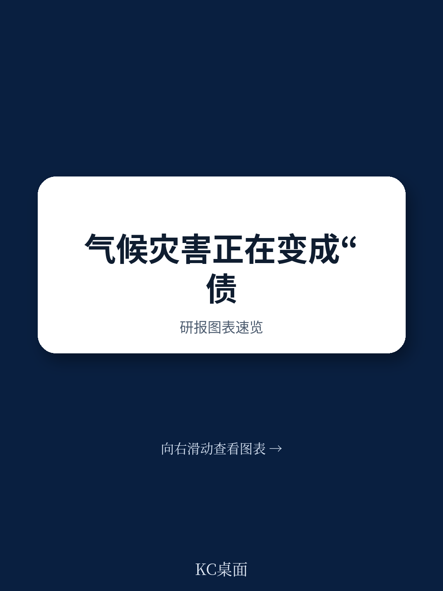
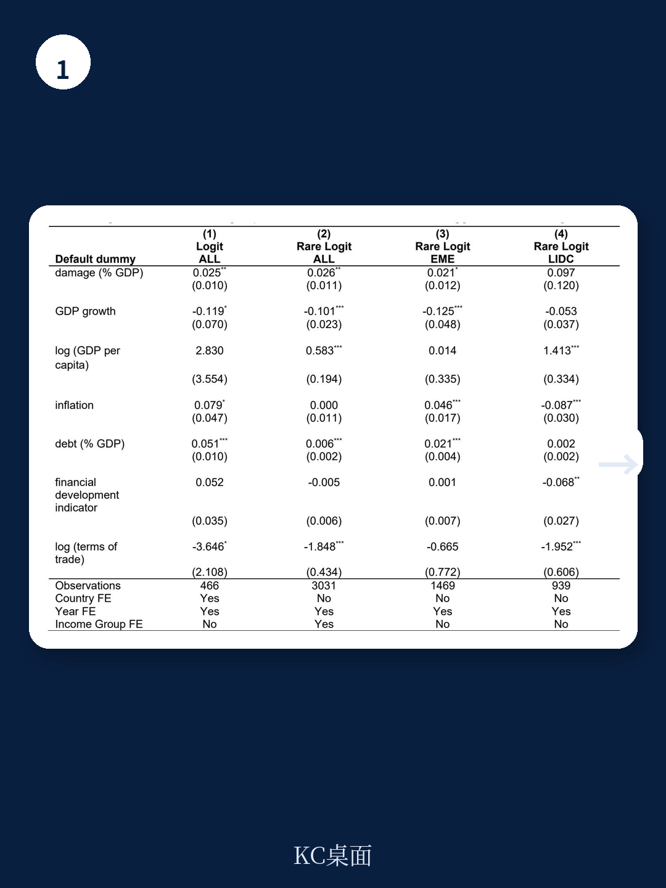
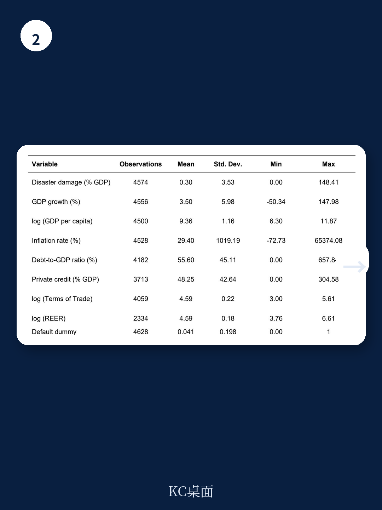

# 国际货币基金组织：IMF：气候灾难正在改写主权债务违约的定价逻辑

一份来自国际货币基金组织（IMF）的最新工作论文，揭示了一个被市场严重低估的风险传导链条：气候灾难不是单纯的“自然灾害”，而是主权债务违约的独立驱动因子。报告用全球面板数据证明，当灾害损失占GDP比重每上升1个百分点，主权违约概率将增加约2-3%。更关键的是，报告提出了一个“不可能三角”——脆弱国家无法在不影响债务可持续性的前提下，完成气候适应的必要投资。

这不是远期的ESG叙事，而是正在发生的资产负债表重构。

## 1. 灾害损失对违约概率的影响，比市场定价更直接

传统主权信用分析中，气候风险往往被归入“尾部风险”或“长期结构性因素”，很少被直接纳入违约概率模型。而IMF这篇论文做了三件事：第一，用灾害事件层面的实际经济损失（而非ND-GAIN等结构性脆弱性指数）作为冲击变量；第二，采用专门针对“稀有事件”的logit估计方法，纠正传统模型对违约这类低频事件的低估；第三，将违约定义从信用评级下调或利差走阔，直接落到债务违约事件本身。

结果非常清晰：灾害损失占GDP比重每提高1个百分点，下一年违约概率上升约2-3%。这个效应在控制了IMF项目干预、收入组别和年份固定效应后仍然稳健。更重要的是，分债权人类型的分析显示，违约风险上升并非均匀分布——对官方债权人（IMF、世界银行、巴黎俱乐部）的违约概率上升幅度，显著高于对私人债权人的违约。

> **KC评论：** 这意味着，气候灾难后的债务重组不再是“市场选择”，而可能演变为“体制性违约”。对官方债权人的违约概率更高，说明脆弱国家在灾难后会优先保护商业债权人，而将官方债务作为缓冲垫。这对持有新兴市场主权债券的机构投资者而言，是一个需要重新定价的信号。

## 2. 适应能力是唯一的“减震器”，但它的积累需要时间

报告的核心发现之一是：更高的适应能力（adaptive capacity）能够显著降低灾害对经济的边际损害。换句话说，同样是遭遇一场超级台风，适应能力强的国家损失更小，违约概率上升也更少。

问题在于，适应能力的积累极其缓慢。IMF用官方发展援助（ODA）作为代理变量，发现每增加10亿美元累计ODA，只能带来0.13个点的适应能力指数提升。这个弹性非常低——要显著改变一个国家的适应能力，需要的不是一次性援助，而是持续十年以上的系统性投入。

这解释了为什么许多小岛国和发展中国家在经历一次重大灾害后，债务轨迹就再也无法回到灾难前水平。适应能力的“存量”不足以吸收冲击，而“流量”又不足以快速补足缺口。

> **KC评论：** 适应能力建设不是“买保险”，而是“修堤坝”。保险可以在灾后赔付，但堤坝必须在灾前建成。IMF的数据揭示了当前国际援助体系的根本矛盾：ODA的存量远不足以支撑脆弱国家完成适应能力的“基建”投资，而灾后援助又往往以贷款形式出现，进一步加重债务负担。

## 3. 不可能三角：适应投资、债务可持续性与违约风险

报告最核心的洞察是“不可能三角”框架。脆弱国家面临三个互相冲突的目标：扩大适应投资、在高借贷成本下维持债务可持续性、避免因延迟适应而增加的未来违约风险。

三个目标无法同时达成。如果选择现在大规模借债搞适应，债务比率今天就会飙升；如果选择推迟适应，明天灾害来了违约风险更高。IMF的模型显示，用市场利率融资的适应投资，反而可能推高债务稳定所需的财政调整力度，形成“适应陷阱”——越投资越脆弱。

唯一的出路是“优惠融资”（concessional finance）。报告用ODA作为代理变量，构建了一个从ODA到适应能力、从适应能力到灾害损失、从灾害损失到违约概率的传导链条。结论是：每增加1个百分点的ODA/GDP比率，可以通过提升适应能力，间接降低违约概率约0.5-1个百分点。

但这个传导链条有两个关键假设：第一，ODA必须被有效用于适应投资而非一般性财政支出；第二，ODA必须是“额外”的，而非替代现有援助。报告坦诚，由于内生性问题，这些结果应被解释为“关联性”而非“因果性”。

## 4. 报告没有完全回答的关键问题：谁该为适应投资买单？

IMF这篇论文在实证层面贡献显著，但在政策分配层面留下了一个未被充分讨论的问题：适应投资的融资责任应该如何分配？

按照“受益者付费”原则，全球变暖的主要责任在发达国家，而适应投资的主要需求在发展中国家。但现实中，ODA正在下降而非上升。报告引用的数据显示，尽管联合国环境规划署呼吁到2030年将优惠气候融资增加五倍，但实际ODA流量在过去五年中持续萎缩。

更微妙的问题是，适应投资的“回报”具有高度不对称性。对投资国而言，帮助一个小岛国修建海堤的经济回报，远不如帮助一个中等收入国家修建电网。但从全球公共品角度看，前者可能更具系统重要性——因为主权违约可能引发区域金融传染。

> **KC评论：** 这篇报告实际上提出了一个隐含的“道德风险”问题。如果国际社会继续以贷款方式提供气候援助，脆弱国家可能陷入“借债适应、灾害违约、再借债重建”的循环。IMF的模型暗示，只有将部分适应投资转化为赠款或债务减免，才能打破这个循环。但报告没有展开讨论的是：谁来决定哪些国家“值得”被救？

## 5. 对投资者和决策者的观察框架

这篇报告提供了一个可以嵌入投资决策的分析框架，包含三个层次：

第一层，监测灾害损失/GDP比率的阈值。当这个比率超过5%时，违约概率的上升开始变得非线性。投资者需要关注那些“一次灾害就能吃掉全年财政空间”的国家。

第二层，评估适应能力的“存量”。IMF使用的ND-GAIN适应能力指数虽然粗糙，但提供了一个跨国产出。适应能力排名后20%的国家，在遭遇同等规模灾害时，违约概率上升幅度是前20%国家的3-5倍。

第三层，跟踪ODA的“质量”而非“总量”。不是所有ODA都能提升适应能力。那些被用于一般预算支持而非专项适应项目的ODA，对降低违约概率几乎没有贡献。

对于持有新兴市场主权债券的机构投资者，这个框架意味着：气候风险不再是一个可以被“分散化”的外部冲击，而是一个需要被逐一评估的国家级信用因子。那些适应能力薄弱、ODA流入不稳定、且处于高灾害频率地区的国家，其主权信用评级可能面临系统性下调风险。

---

这篇IMF报告的核心价值，在于它把“气候适应”从一个发展议题，重新定义为“主权信用定价”的核心变量。它没有给出完美的解决方案，但提供了一个清晰的传导链条和可量化的分析工具。

报告全文包含更详细的边际效应测算、按债权人类型拆分的违约概率图表，以及ODA到违约概率的完整映射关系。这些图表和假设背后的二阶影响，是这篇3000字导读无法完全覆盖的。

如果你希望获取完整研报的原始数据图表和每日国际投行摘要，欢迎加入我们的社群。我们会由AI agent加人工审核，每天生成约10-40页的国际投行中文摘要与KC评论，涵盖当天最新数据图表合集。既方便喂给AI进行深度分析，也方便人工快速把握市场动态。社群内每天更新，助你在信息过载的时代，优先抓住那些真正改变资产定价逻辑的结构性信号。

Personal reading notes and learning share only. Not investment advice.

