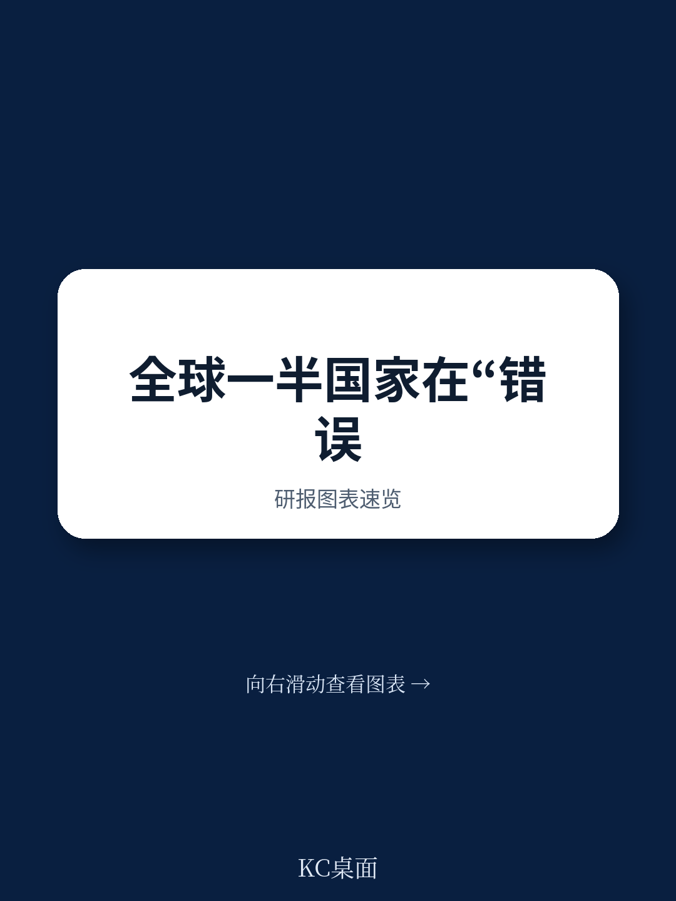
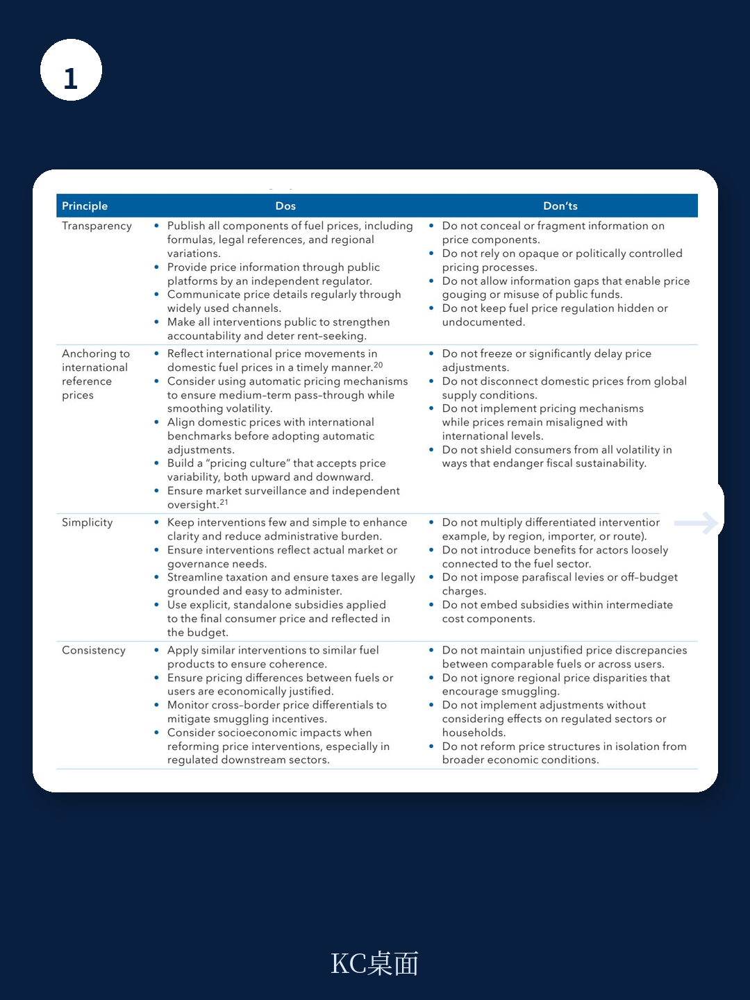
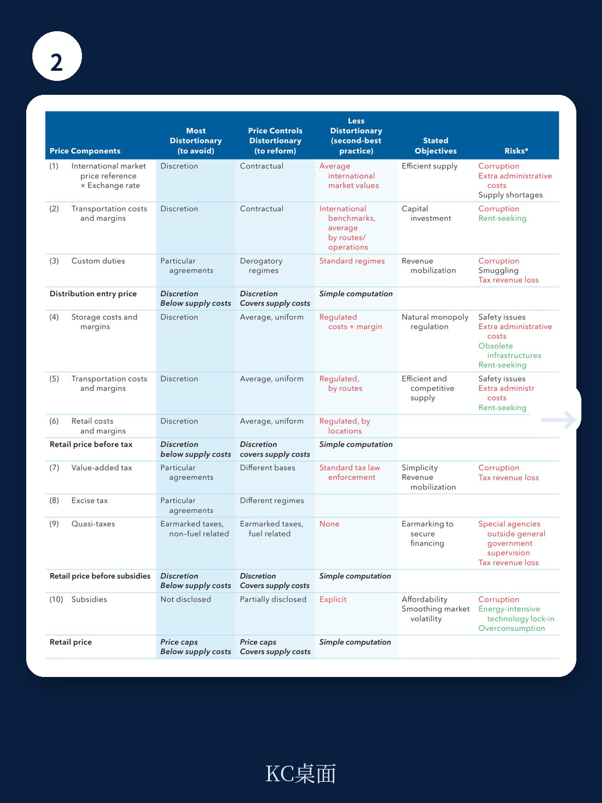

# 国际货币基金组织：IMF：全球一半国家都在错误地定价燃油

当全球能源市场剧烈波动时，超过95个国家的政府选择用行政之手干预燃油价格。国际货币基金组织（IMF）最新发布的技术指南直接指出：这些干预措施几乎从未达成其宣称的目标，反而制造了隐蔽的财政黑洞、扭曲了市场信号，并催生了难以根除的寻租行为。

这份题为《如何（不）为燃油产品定价》的报告，并非讨论是否应该对燃油征税或补贴，而是聚焦一个更基础、也更被忽视的问题：当政府决定干预燃油定价时，什么样的机制设计是有效的，什么样的做法注定失败。

报告的核心判断简洁而有力：燃油定价的成功，不在于干预的力度，而在于干预的结构。透明、锚定国际价格、简单、一致——这四个原则决定了定价机制是帮助还是伤害一个经济体。

这不仅仅是一份给财政部长或能源监管者的技术手册。对于任何关注宏观经济稳定、财政可持续性，或者希望通过理解政策设计逻辑来把握市场方向的人来说，这份报告提供了一个极具价值的分析框架。

## 1. 燃油定价的“标准答案”与全球现实之间的巨大鸿沟

IMF报告首先构建了一个“参考价格”框架，作为判断各国燃油定价是否合理的基准。这个框架将燃油的最终消费价格分解为三个核心组成部分：产品可获得性（availability）、产品可及性（access）、产品销售（sale）。

在理想状态下，一个完全自由化的燃油市场，其价格应该等于国际基准价格（如FOB价格）加上运输、保险、分销、零售等环节的供应链成本，再加上合法的关税、增值税和消费税。这个价格会随国际市场波动，向消费者传递准确的供需信号。

然而现实是，全球一半国家通过各种方式干预这个价格形成过程。报告数据显示，2015年至2024年间，实施价格管制的国家，其柴油、高辛烷值汽油和煤油的平均消费价格，分别比自由定价国家低了约32%、26%和21%。

> **KC评论：** 这个价差背后隐藏着两个截然不同的故事。对于高收入国家，价差主要源于它们对燃油征收了更重的税，而管制国家为了压低价格而减税。但对于低收入国家，价差往往意味着政府正在用财政资金填补国际价格与国内价格之间的缺口——这是一种隐性补贴，通常不会出现在预算报告里，却实实在在地侵蚀着本就紧张的财政空间。

更值得关注的是，这种干预并非低收入国家的专利。比利时从1974年起就通过公式设定零售价格上限，马拉维能源监管局则采用自动调整机制——当到岸成本偏离超过正负5%时触发调价。这说明，燃油价格管制是一种跨越发展阶段的普遍现象。

## 2. 价格干预的三个环节：每个选择都对应一种财政风险

IMF报告将价格干预按照供应链环节分为三类：对产品可获得性的干预、对产品可及性的干预、对产品销售环节的干预。每一类干预都对应着不同的政策目标和财政风险。

对产品可获得性的干预，通常表现为政府直接控制进口或生产环节的成本。例如，政府可能要求国有炼油厂以低于国际市场的价格向国内市场供应燃油，或者通过配额制度限制进口商的利润空间。这种做法看似能保护消费者，实则会产生一个严重后果：当国内价格被人为压低时，需求被刺激，而供给端因为利润微薄而缺乏扩大生产的动力，最终导致供应短缺和排队现象。

对产品可及性的干预，主要涉及分销和存储环节。一些国家通过区域性价格管制，试图确保偏远地区也能以与城市相同的价格买到燃油。这种政策初衷良善，但代价高昂——它实际上是在用财政资金补贴物流成本，而且往往难以精准识别真正的受益者。

对产品销售环节的干预，是最常见也是问题最突出的领域。政府通过设定零售价格上限、减免特定税种、或者对特定用户群体（如渔民、农民）提供定向补贴，直接干预消费者支付的价格。报告特别警告，当这种干预嵌入到税收体系内部时——例如通过消费税的差异化征收——其财政影响变得极不透明，而且极易被利益集团利用。

> **KC评论：** 这三种干预有一个共同特征：它们都在试图用行政决策替代市场信号。但问题在于，市场信号是动态的、分散的，而行政决策是静态的、集中的。当国际油价在几个月内翻倍或腰斩时，任何预设的公式都会面临巨大的调整压力。报告没有完全展开的一个问题是：在政治周期约束下，政府是否有足够的制度能力去及时调整这些公式？历史经验表明，大多数国家做不到。

## 3. 四个“必须做”与四个“不能做”：定价机制设计的原则

报告的核心贡献，是提出了一个四原则框架，用于指导任何形式的燃油价格干预设计。

第一，透明度。政府必须定期、完整地公布燃油价格的各个构成部分，包括国际基准价格、运输成本、分销利润、各类税费。报告指出，许多国家的燃油定价机制复杂到连监管者自己都说不清最终价格是如何构成的。这种不透明性为寻租和腐败提供了温床。

第二，锚定国际价格。国内价格必须反映国际市场波动。报告明确反对“脱离国际价格”的定价策略，认为这会切断价格信号，导致消费者无法根据真实成本调整消费行为。IMF建议建立一个自动调整机制，让价格随国际市场变化而平滑变动，而不是等到财政压力不可持续时才被迫调整。

第三，简化。价格干预应该尽可能少、尽可能简单。报告特别批评了“准财政税”（parafiscal levies）——那些由特定机构征收、专门用于特定用途的附加费用。这些费用往往没有经过正常的预算审批程序，使用情况不透明，而且容易被滥用。在税收方面，报告建议只保留少数几种税种，避免复杂的税制结构。

第四，一致性。相似的产品应该受到相似的定价干预。报告指出，许多国家对汽油、柴油、煤油的税收政策存在巨大差异，而这些差异往往缺乏经济上的合理依据，更多是历史遗留问题或利益集团游说的结果。这种不一致性会激励欺诈和走私——例如，当柴油税远低于汽油税时，就会出现将汽油染色伪装成柴油销售的行为。

> **KC评论：** 这四个原则看起来像是常识，但全球一半国家的实践恰好是它们的反面。这本身就是一个值得深思的问题：为什么明知更好的做法，却难以实施？报告暗示了答案：燃油定价干预往往服务于多重目标——保护消费者、保障供应、维持社会稳定、实现再分配——而这些目标之间本身就存在冲突。当政治逻辑压倒经济逻辑时，再好的设计原则也会被搁置。这也是为什么报告建议，任何改革都需要考虑社会经济影响，不能孤立推进。

## 4. 报告尚未完全回答的关键问题

尽管IMF报告提供了极其实用的分析框架，但它也留下了一些悬而未决的关键问题。

第一个问题是：如何定义“适当”的调整速度？报告建议国内价格应反映国际波动，但也承认完全传递所有波动可能带来政治风险。那么，什么样的平滑机制是合适的？三个月调整一次？还是半年？报告提到了“自动调整机制”，但并没有给出具体的参数设计建议。

第二个问题是：如何在低收入国家建立执行这些原则的制度能力？透明度、简化、一致性——这些原则的实现都需要一个高效、廉洁的官僚体系。但在许多低收入国家，燃油定价本身就是财政系统中最不透明的环节之一。先有改革还是先有能力，这是一个典型的鸡生蛋蛋生蛋问题。

第三个问题是：燃油定价改革的政治经济学。报告提到了“公众情绪”在能源改革中的重要性，但没有深入分析如何设计补偿机制来缓解改革对脆弱群体的冲击。历史经验表明，燃油补贴改革是导致政府倒台的最常见触发因素之一。

这些问题，恰恰是理解燃油定价改革成败的关键。它们超出了技术手册的范围，进入了政治经济学和制度设计的领域。

## 5. 对观察者和投资者的启示

对于关注宏观经济的读者，这份报告提供了一个有价值的视角：燃油定价机制的质量，是一个国家治理能力的重要指标。那些能够建立透明、自动调整机制的政府，往往在其他经济管理领域也表现更好。反之，那些长期依赖隐性补贴和复杂管制的国家，可能隐藏着更大的财政风险。

从投资角度看，燃油定价机制的变化是一个重要的政策变量。当一国从隐性补贴转向透明定价，或者从行政定价转向自动调整机制时，往往意味着价格将向国际水平收敛。对于能源公司、运输企业、甚至消费品公司来说，这都意味着成本结构的变化。

这份报告没有讨论的一个层面是：在全球能源转型的大背景下，燃油定价机制的设计将如何影响化石燃料的退出速度？如果燃油价格被人为压低，那么向清洁能源转型的动力就会被削弱。反之，如果价格能够反映环境外部性，就会加速替代进程。这是一个值得继续深挖的方向。

---

燃油定价看似是一个技术性极强、与普通人距离较远的话题。但IMF报告的结论恰恰相反：它关系到每一个人的出行成本、每一家企业的能源账单、每一个国家的财政健康。

全球一半国家正在用错误的方式定价燃油。而纠正这些错误，需要的不是更复杂的公式，而是回归四个基本原则：透明、锚定国际价格、简化、一致。

这些原则说起来简单，做起来却需要巨大的政治勇气和制度能力。对于那些正在阅读这份报告的政策制定者来说，IMF给出的建议是明确的：不要再试图用复杂的干预来掩盖政治上的困难。燃油定价改革的成功，不在于你设计了多么精巧的公式，而在于你是否敢于让价格回归真实。

Personal reading notes and learning share only. Not investment advice.

