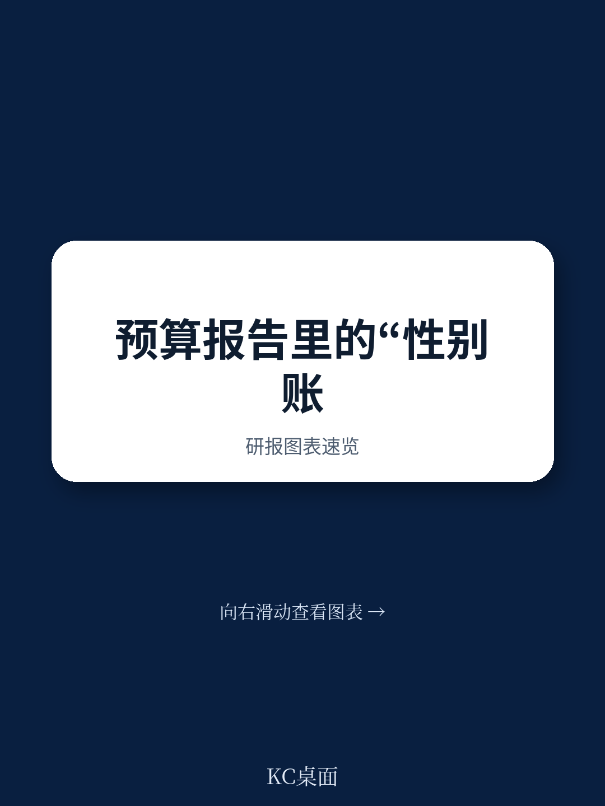
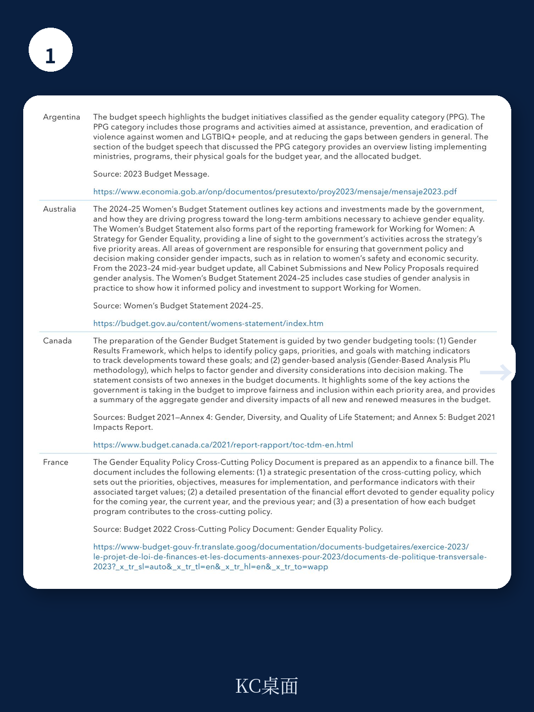
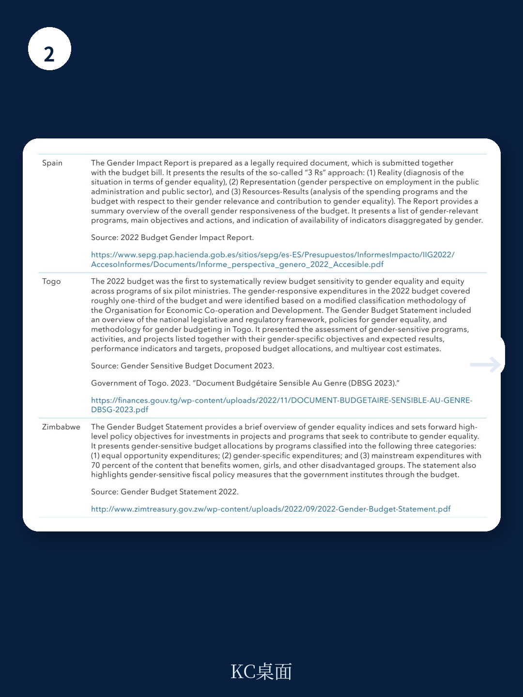

# 国际货币基金组织：性别预算声明正在成为财政透明度的新标尺

当全球超过100个国家的财政部长在年度预算中，越来越多地加入一份名为“性别预算声明”的文件时，一个值得关注的趋势已经形成：财政透明度正在从“钱花在哪里”延伸到“钱对不同群体的影响是什么”。国际货币基金组织（IMF）在其最新发布的《如何准备性别预算声明》技术指南中，系统梳理了这一工具的设计逻辑、全球实践与实施路径。这份报告的核心判断是：性别预算声明不仅是一项社会政策工具，更正在成为衡量政府财政管理成熟度的新维度。

对于关注公共财政改革、ESG投资以及政府治理效率的读者而言，这份报告提供了一个观察政府预算透明度和问责机制演进的独特窗口。它揭示了一个重要信号：当越来越多的政府承诺将性别平等纳入预算决策时，财政数据的颗粒度、政策评估的深度以及公众监督的广度都在发生结构性变化。

## 1. 性别预算声明的本质不是“女性预算”，而是财政透明度的升级

IMF报告开宗明义：性别预算声明是一份透明度和问责文件，政府通过它向立法机构和公众沟通预算如何致力于改善性别平等。它并非另起炉灶的“女性预算”，而是将性别视角嵌入现有预算流程的产物。

从全球实践来看，截至2024年，IMF调查的100多个国家中，约三分之一的国家已开始编制某种形式的性别预算声明，其中超过四分之三的声明已公开出版。亚太地区（如澳大利亚、印度、韩国）和非洲（如多哥、津巴布韦）是主要实践者，分别占32%和28%。这一分布本身就说明：性别预算声明的推广并不完全与经济发展水平正相关，政治意愿和制度设计才是关键变量。

> **KC评论：** 对于投资者而言，这一趋势意味着什么？当政府预算开始系统性地披露性别影响时，公共支出数据的透明度和可预测性将提高。那些能够率先建立高质量性别预算声明的国家，其财政管理能力往往更为成熟，主权信用评估中可能获得额外加分。

## 2. 四块“积木”搭建起一份可操作的性别预算声明

IMF将性别预算声明的核心内容归纳为四个组件，这为任何希望起步的政府提供了清晰的操作框架：

**第一块：性别平等现状与差距分析。** 这不是泛泛的统计数据罗列，而是精准识别关键性别差距——例如女性劳动参与率、男女薪酬差距、女性在领导岗位的比例等。报告特别强调，这部分需要引用可信的数据来源，如世界银行、联合国开发计划署等国际机构的指标。

**第二块：政府承诺、目标与战略。** 政府需要明确列出其在性别平等领域的优先事项，并说明这些目标如何与国家发展战略或国际承诺（如可持续发展目标）相衔接。这一组件实际上是在回答“政府打算做什么”以及“为什么这是优先级”。

**第三块：预算措施与资源配置。** 这是最具“硬约束”的部分。政府需要逐项列出为缩小性别差距而设计的政策与项目，并明确标注其预算拨款。例如，针对女性创业的专项贷款计划、针对女童教育的奖学金项目等，都需要在预算中体现具体金额。

**第四块：影响评估与绩效指标。** 这是最先进但也是最难的部分。政府需要评估预算措施对性别平等的预期影响（事前评估），并设定可衡量的绩效指标来追踪进展（事后评估）。目前，只有少数国家（如韩国、法国）能够真正实现这一环节。

> **KC评论：** 这四块积木的递进关系值得关注。大多数国家从第一、二块起步，逐步过渡到第三、四块。对于政策研究者而言，这意味着评估一个国家性别预算声明的质量，不应只看它是否出版了声明，更要看它是否包含了资源配置和影响评估。完整报告中包含了多国实践对比表，可以帮助读者快速判断不同国家的成熟度。

## 3. 从“试点”到“全面实施”：分阶段策略是最务实的路径

IMF报告明确指出，性别预算声明的实施不需要对现有预算程序进行激进改革。相反，它建议采取分阶段、渐进式的方法。

第一阶段：试点。从少数部门或特定主题开始，例如只聚焦“女性经济参与”或“女性安全”等议题。韩国在2006-2010年间、印尼在2010年、多哥在2021年都采用了这一路径。试点阶段的优点是降低行政负担，积累经验，同时为后续全面推广建立政治共识。

第二阶段：扩展。将性别预算声明从试点部门扩展至所有部门，从单一主题扩展至多主题。此时，政府需要建立跨部门的协调机制，确保各部委提交的性别预算信息具有可比性和一致性。

第三阶段：深化。引入事前和事后影响评估，将性别预算声明与绩效预算制度挂钩。这一阶段对数据质量和分析能力的要求最高，也是实现“预算影响性别平等”的关键一步。

报告特别强调，每个阶段都不要求完美。即使只是初步的、不完整的性别预算声明，也比没有好。关键在于“开始做”，并在实践中不断迭代。

> **KC评论：** 这一分阶段策略对任何改革者都有启发意义。它揭示了一个重要原则：制度创新不必追求一步到位，而是可以通过“最小可行产品”逐步建立公信力和技术能力。报告中没有展开的是，如何评估不同阶段的政治风险与行政成本——这正是完整报告中值得深入阅读的部分。

## 4. 三个尚未完全回答的关键问题

尽管IMF报告提供了详尽的框架，但仍有几个关键问题悬而未决，值得读者在阅读完整报告时重点关注：

**第一，政治承诺的可持续性如何保证？** 报告提到，澳大利亚在1980年代率先推出性别预算声明，但在2014-2021年间曾中断。这说明性别预算声明并非一劳永逸，其存续高度依赖执政党的政治意愿和公众关注度。当政府更迭或财政紧缩时，这一工具是否会被优先牺牲？

**第二，数据质量与问责机制之间的鸿沟如何弥合？** 报告承认，性别预算声明的质量高度依赖性别分类数据的可获得性和准确性。但在许多发展中国家，基础数据尚且缺失，更不用说事前影响评估。当数据不充分时，声明是否可能沦为“形式主义”？

**第三，性别预算声明与宏观经济政策如何衔接？** 报告主要聚焦于预算编制环节，但性别平等目标与税收政策、货币政策、贸易政策等宏观经济政策之间存在复杂的互动关系。例如，累进税制对女性就业的影响、贸易自由化对女性密集型产业的影响等，都尚未在声明框架中得到充分讨论。

这些问题的存在，恰恰说明性别预算声明仍处于发展初期。对于政策制定者和研究者而言，这既是挑战，也是机会——谁能率先在数据建设、制度设计和政治沟通上取得突破，谁就能在这一领域建立先发优势。

## 5. 对观察者的框架：如何评估一份性别预算声明的质量

对于不需要亲自编写声明、但需要评估政府治理质量的读者，IMF报告提供了一套隐含的评估框架。我们可以将其提炼为三个核心维度：

**维度一：完整性。** 声明是否包含了上述四块积木中的至少前两块？是否明确列出了预算拨款？如果只有承诺没有资源，那么声明更像政治宣言而非预算工具。

**维度二：可验证性。** 声明中引用的数据是否来自公开、可信的来源？绩效指标是否具体、可衡量？如果指标过于模糊（如“促进女性发展”），则无法进行后续追踪。

**维度三：可问责性。** 声明是否提交给立法机构审议？是否公开出版？是否包含对上一周期承诺执行情况的回顾？只有公开且可被外部监督的声明，才能真正发挥问责功能。

这套框架不仅适用于评估性别预算声明，也可以迁移到其他领域的财政透明度评估中。

## 结语：性别预算声明的下一步

IMF这份技术指南的价值，不仅在于它提供了一个可操作的“操作手册”，更在于它揭示了一个正在发生的制度变迁：财政透明度正在从“钱数”的公开，走向“影响”的公开。性别预算声明是这个趋势中最具代表性的工具之一。

但正如报告所暗示的，真正的挑战不在于“写一份声明”，而在于“让声明影响决策”。当预算资源按照性别平等的逻辑重新配置时，它必然会触及既有的利益格局和行政惯性。这需要政治领导力、技术能力和公众参与的三重配合。

对于希望深入了解这一领域的读者，完整报告还包含了多国实践案例（如多哥的渐进式引入、韩国的长期演变）、详细的实施步骤以及术语表。这些内容无法在一篇导读中穷尽，但它们是理解性别预算声明从“理念”走向“制度”的关键拼图。

---

**加入我们的社群，获取完整研报解读与原始图表。** 每天，我们的AI agent与人工编辑团队会从国际货币基金组织、高盛、摩根士丹利等顶级机构的最新报告中，精选最具洞察力的内容，生成约10-40页的中文摘要与数据合集。这些内容既方便您快速把握市场动态，也适合作为AI分析的输入材料。在社群中，您还可以与同行讨论上述未解问题——性别预算声明的政治可持续性、数据质量瓶颈、与宏观经济政策的衔接——这些正是当前全球公共财政改革的前沿议题。

Personal reading notes and learning share only. Not investment advice.

