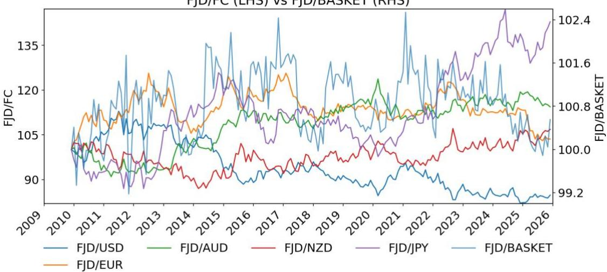
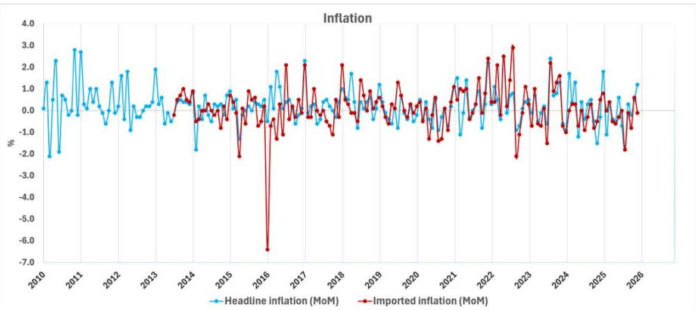
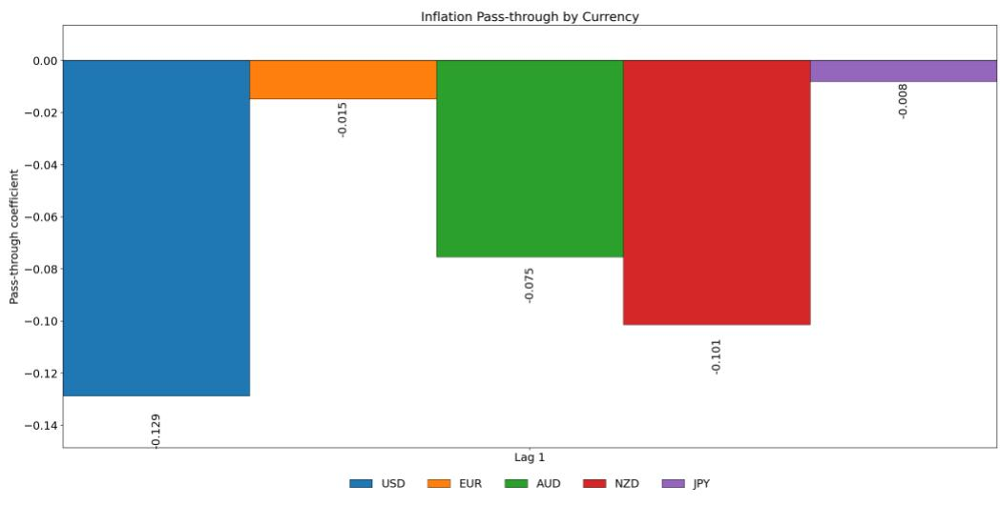
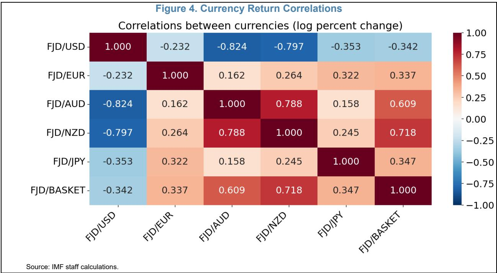

# Optimal Currency Basket Estimation

Prepared by Etienne Vaccaro-Grange

WP/26/131

IMF Working Papers describe research in progress by the author(s) and are published to elicit comments and to encourage debate. The views expressed in IMF Working Papers are those of the author(s) and do not necessarily represent the views of the IMF, its Executive Board, or IMF management.

2026
APR

# IMF Working Paper Monetary and Capital Markets

Optimal Currency Basket Estimation
Prepared by Etienne Vaccaro-Grange

Authorized for distribution by Romain Veyrune
April 2026

IMF Working Papers describe research in progress by the author(s) and are published to elicit comments and to encourage debate. The views expressed in IMF Working Papers are those of the author(s) and do not necessarily represent the views of the IMF, its Executive Board, or IMF management.

ABSTRACT: Small open economies often anchor their exchange rate to a basket of foreign currencies, with weights typically set from trade shares or financial exposure. Such schemes ignore the heterogeneity of pass-through across currencies and the covariance structure of bilateral rates, and therefore do not minimize the volatility of imported inflation, the central bank's mandate. This paper proposes a minimum-variance framework — formally analogous to a Markowitz portfolio problem in pass-through space — in which basket weights minimize the variance of exchange-rate-driven imported inflation, subject to a constraint that preserves the basket's cumulative pass-through. Applied to the case of Fiji, an import-intensive island economy with a five-currency basket, the optimization reduces the variance of imported inflation by close to twenty percent, with results robust across alternative specifications.

RECOMMENDED CITATION: E. Vaccaro-Grange, “Optimal Currency Basket Estimation”, IMF Working Paper No. 26/131, International Monetary Fund, Washington DC.

<table><tr><td>JEL Classification Numbers:</td><td>E31, E52, F31, F41</td></tr><tr><td>Keywords:</td><td>currency basket; exchange rate pass-through; minimum-variance portfolio; small open economies; monetary policy.</td></tr><tr><td>Authors&#x27; email addresses:</td><td>evaccaro-grange@IMF.org</td></tr></table>

# Optimal Currency Basket Estimation

Prepared by Etienne Vaccaro-Grange $^{1}$

## Contents

Acronyms....3   
Introduction....4   
Model....5   
Application to a Small Open Economy....10   
Conclusion....16   
Annex I. Derivation....17   
References....19

## FIGURES

1. Historical Exchange Rates (Normalized January 1999=100)....11
2. Inflation....11
3. Inflation Pass-throughs....12
4. Currency Return Correlations....13

TABLES
1. Currency Basket Weights (percent)....14
2. Robustness—Models Specification....14
3. Currency Basket Weights (percent)....15

## Acronyms

AUD Australian Dollar

CPI    Consumer Price Index

EUR Euro

FC Foreign Currency

FX Foreign Exchange

GBP British Pound

JPY Japanese Yen

LC Local Currency

MOM Month-On-Month

NZD New Zealand Dollar

PPP Purchasing Power Parity

USD US Dollar

## INTRODUCTION

A currency basket peg is an exchange rate regime in which the domestic currency is anchored to a weighted average of several foreign currencies rather than to a single anchor. By spreading exchange rate risk across multiple partners, a basket peg offers intermediate flexibility between a hard peg and a managed float and provides a degree of insulation from volatility in any single cross-rate (Williamson, 1998). Such arrangements are often adopted by small open economies for which a freely floating regime is impractical—typically because of thin foreign exchange markets, underdeveloped financial systems, or the desire to import credibility from a more stable monetary jurisdiction (Imam, 2010; Yoshino, Helble, and Prasetyo, 2017). Pacific island economies such as Fiji, Samoa, Tonga, and the Solomon Islands, as well as other small open economies including Kuwait and Morocco, currently operate basket regimes of this kind.

The central design question for any basket peg is how to determine the weights assigned to its constituent currencies. The most widely used approach relies on trade shares, with weights reflecting the geographical distribution of exports and imports, sometimes supplemented by flows of services, remittances, or external debt service (Edison and Vårdal, 1990; Yoshino, Helble, and Prasetyo, 2017). While transparent and intuitive, trade-based weights describe only the structure of external transactions and do not, in general, coincide with the weights that best support a central bank's price-stability mandate. In particular, they exploit neither the heterogeneity of exchange rate pass-through across currencies nor the covariance structure of bilateral exchange rate movements—two features that are central to the behavior of imported inflation.

A substantial literature has sought to derive optimal basket weights under explicit macroeconomic objectives. Flanders and Helpman (1979) provided an early framework linking basket weights to balance-of-payments and real income stability, extended by Branson and Katseli (1981), Turnovsky (1982), and Bhandari (1985). Edison and Vårdal (1990) derived optimal weights that minimize the variance of tradable-goods production and applied them to the Nordic countries. Yoshino, Kaji, and Suzuki (2004) developed a three-country basket model, later extended by Yoshino, Helble, and Prasetyo (2017) to a four-country setting with tourism flows that minimized the volatility of the exchange rate and of output. They apply the model to Pacific Island economies. Ma and Cheng (2014) proposed a two-stage model in which the basket is chosen to minimize a weighted average of output and inflation volatility, taking into account ex-post fiscal adjustment, and applied it to Hong Kong SAR

. A parallel strand of work by Slavov (2005), Teo (2009), Shioji (2006), Xu (2011), and Zhang, Shi, and Zhang (2011) embed basket choice in general-equilibrium settings that incorporate trade invoicing, net international investment position, and foreign-currency debt. A separate but closely related literature has documented that exchange rate pass-through into import prices is partial, heterogeneous across currencies and industries, and shaped by pricing-to-market, nominal rigidities, and strategic complementarities (Krugman, 1987; Knetter, 1989; Betts and Devereux, 2000; Campa and Goldberg, 2005; Gopinath and Itskhoki, 2010; Gopinath, Itskhoki, and Rigobon, 2010).

This paper contributes to the literature by bringing these two strands together. We propose a basket-weight optimization framework whose objective is to minimize the variance of the exchange-rate-driven component of imported inflation—he basket's inflation pass-through—rather than balance-of-payments or aggregate output volatility. In contrast to trade-weighted schemes, the procedure exploits both the currency-specific pass-through coefficients estimated from a standard import price equation and the covariance structure of bilateral exchange rate returns. The resulting problem is formally analogous to a Markowitz minimum-variance portfolio, with currencies as “assets”, pass-through-adjusted exchange rate changes as “returns”, and basket weights as

portfolio shares. A structural constraint preserves the cumulative pass-through implied by the current basket, so that the optimized weights reduce the volatility of imported inflation without altering the average sensitivity of domestic prices to basket movements. To the best of our knowledge, this is the first paper to cast optimal basket design explicitly as a minimum-variance pass-through problem subject to an invariant structural pass-through.

We illustrate the framework with an application to a small, import-intensive island economy that has operated a five-currency basket since the 1980s: Fiji. We show that the newly optimized weights would reduce variance of inflation by about 20 percent relative to the current weights, while preserving the basket's structural pass-through. A series of robustness exercises confirms the stability of the main results across alternative specifications of the pass-through equation.

Two additional determinants of optimal basket design deserve mention but lie outside the scope of this paper. First, the degree of business cycle synchronization between the home economy and each currency area provides a complementary argument for anchoring: a higher degree of co-movement strengthens the case for assigning greater weight to the corresponding currency. Second, financial dollarization — through foreign-currency-denominated deposits or external debt obligations — introduces balance-sheet stability constraints that neither trade- nor price-based schemes capture. We abstract from both dimensions and focus strictly on minimizing the variance of exchange-rate-driven imported inflation, in line with the central bank's price-stability mandate. Integrating cycle synchronization and balance-sheet considerations into the optimization problem is left for future work.

The rest of the paper is structured as follows: Section 1 presents the model, Section 2 its application to a small open economy, and Section 3 concludes.

## MODEL

From the law of one price, an imported good's domestic currency price is:

$$
P _ {t} ^ {m} = E _ {t} P _ {t} ^ {x}\tag{1}
$$

where $E_{t}$ is the nominal exchange rate (units of domestic currency per unit of foreign currency; up equals depreciation), $P_{t}^{m}$ is the domestic currency-denominated import price, and $P_{t}^{x}$ is the foreign currency-denominated export price. In log-differences, we obtain: $^{2}$

$$
\Delta p _ {t} ^ {m} = \Delta e _ {t} + \Delta p _ {t} ^ {\mathrm{x}}
$$

(2)

Or with usual notations $\pi_t^m = \Delta p_t^m$ , $\pi_t^x = \Delta p_t^x$ :

$$
\pi_ {t} ^ {m} = \Delta e _ {t} + \pi_ {t} ^ {\mathrm{x}}\tag{3}
$$

This equation holds for a single trading partner j:

$$
\pi_ {j, t} ^ {m} = \Delta e _ {j, t} + \pi_ {j, t} ^ {\mathrm{x}}\tag{4}
$$

Aggregate imported inflation is the trade-weighted sum across all n partners:

$$
\pi_ {t} ^ {m} = \sum_ {j = 1} ^ {n} w _ {j} \pi_ {j, t} ^ {m}\tag{5}
$$

$$
\pi_ {t} ^ {m} = \sum_ {j = 1} ^ {n} w _ {j} \Delta e _ {j, t} + \sum_ {j = 1} ^ {n} w _ {j} \pi_ {j, t} ^ {\mathrm{x}}\tag{6}
$$

where $w_{j}$ is the import share of partner j and $\sum_{j=1}^{n} w_{j}=1$ .

In theory, the law of one price implies that exchange rate movements are fully and instantaneously reflected in domestic currency-denominated import prices. In practice, however, a well-documented set of microeconomic frictions attenuates this transmission. We say that the pass-through is incomplete.

Under local currency pricing (Betts and Devereux, 2000), exporters set prices in the destination currency, rendering import prices mechanically insensitive to exchange rate fluctuations between repricing episodes. Even upon repricing, firms operating in imperfectly competitive markets may optimally absorb part of the exchange rate change into their markups rather than pass it through to final prices, a behavior formalized in the pricing-to-market literature (Krugman, 1987; Knetter, 1989). This markup adjustment is reinforced by strategic complementarity in price setting: when importers' demand depends on their price relative to domestic competitors, optimal pricing tilts toward the domestic price level, dampening the response to exchange rate shocks (Gopinath and Itskhoki, 2010). Nominal rigidities in the form of menu costs or staggered price adjustment à la Calvo (1983) introduce additional delays in the transmission process. Collectively, these frictions imply that only a fraction of any given exchange rate movement is ultimately transmitted to import prices, a result consistently supported by the empirical evidence (Campa and Goldberg, 2005; Gopinath, Itskhoki, and Rigobon, 2010). This motivates an empirical specification in which the incomplete pass-through is freely estimated rather than imposed at unity.

In that framework, Equation (6) becomes:

$$
\pi_ {t} ^ {m} = \sum_ {j = 1} ^ {n} \beta_ {j} \Delta e _ {j, t} + \sum_ {j = 1} ^ {n} \delta_ {j} \pi_ {j, t} ^ {\mathrm{x}} + \varepsilon_ {t}\tag{7}
$$

where the $\beta_{j}$ are no longer constrained to equal $w_{j}$ — they capture they capture the effective pass-through of each bilateral exchange rate into aggregate import prices, reflecting both trade shares and the degree of passthrough specific to each partner. Similarly, $\delta_{j}$ may differ from $w_{j}$ since the same pricing frictions that attenuate exchange rate pass-through — markup absorption, nominal rigidities, and strategic complementarity — also apply to the transmission of foreign cost changes (though to a lesser extent as firms have stronger incentives to pass through increases in their own production costs). Both coefficients are expected to be lower than the trade weight $w_{j}$ , so that $\sum_{j=1}^{n}\beta_{j}<1$ and $\sum_{j=1}^{n}\delta_{j}<1$ .

The empirical specification includes several standard features motivated by theory. Lags of the bilateral exchange rate returns and exported price inflation capture the gradual adjustment of import prices under nominal rigidities. Indeed, as firms reprice at discrete intervals, the full pass-through of an exchange rate shock materializes over several periods rather than instantaneously, so that the sum of contemporaneous and lagged coefficients measures the cumulative long-run pass-through while individual coefficients trace the dynamic adjustment profile (Campa and Goldberg, 2005). Lags of imported inflation are included for the same reason — under staggered price-setting à la Calvo (1983), only a fraction of importers reprice each period, generating intrinsic persistence in the aggregate import price level that the autoregressive terms capture. The constant absorbs any secular trend in imported inflation unrelated to exchange rate movements, such as a persistent differential between domestic and foreign trend inflation or a systematic evolution in importers' markups over time.

Equation (7) becomes:

$$
\pi_ {t} ^ {m} = \mu + \sum_ {k = 1} ^ {p} \rho_ {k} \pi_ {t - k} ^ {m} + \sum_ {j = 1} ^ {n} \sum_ {k = 1} ^ {q} \beta_ {j, k} \Delta e _ {j, t - k} + \sum_ {j = 1} ^ {n} \sum_ {k = 1} ^ {l} \delta_ {j, k} \pi_ {j, t - k} ^ {\mathrm{x}} + \varepsilon_ {t}\tag{8}
$$

where $\mu$ is a constant, $\rho_{k}$ captures the persistence in imported inflation arising from staggered price-setting, $\beta_{j,k}$ is the pass-through of currency j at lag k, and $\delta_{j,k}$ captures the lagged transmission of partner j's export price inflation. Further, we assume that foreign exported inflation is approximately equal to foreign inflation for the tractability of the model: $\pi_{j,t}^{x} \approx \pi_{j,t}^{*}$ .³

Equation (8) can be further simplified under relative PPP condition, since: $\Delta e_{j,t} = \pi_{t} - \pi_{j,t}^{*} \approx \pi_{t}^{m} - \pi_{j,t}^{x}$ . That is, the difference between domestic inflation and foreign inflation is roughly the difference between imported inflation and foreign exported inflation.

Therefore,

$$
\pi_ {t} ^ {m} = \mu + \sum_ {k = 1} ^ {p} \rho_ {k} \pi_ {t - k} ^ {m} + \sum_ {j = 1} ^ {n} \sum_ {k = 1} ^ {q} \beta_ {j, k} \Delta e _ {j, t - k} + \sum_ {j = 1} ^ {n} \sum_ {k = 1} ^ {l} \delta_ {j, k} (\pi_ {t - k} ^ {m} - \Delta e _ {j, t - k}) + \varepsilon_ {t}\tag{9}
$$

$$
\pi_ {t} ^ {m} = \mu + \left(\sum_ {k = 1} ^ {p} \rho_ {k} + \sum_ {j = 1} ^ {n} \sum_ {k = 1} ^ {l} \delta_ {j, k}\right) \pi_ {t - k} ^ {m} + \sum_ {j = 1} ^ {n} \sum_ {k = 1} ^ {q} \beta_ {j, k} \Delta e _ {j, t - k} - \sum_ {j = 1} ^ {n} \sum_ {k = 1} ^ {l} \delta_ {j, k} \Delta e _ {j, t - k} + \varepsilon_ {t}
$$

(10)

$$
\pi_ {t} ^ {m} = \mu + \left(\sum_ {k = 1} ^ {p} \rho_ {k} + \sum_ {j = 1} ^ {n} \sum_ {k = 1} ^ {l} \delta_ {j, k}\right) \pi_ {t - k} ^ {m} + \sum_ {j = 1} ^ {n} \left(\sum_ {k = 1} ^ {q} \beta_ {j, k} - \sum_ {k = 1} ^ {l} \delta_ {j, k}\right) \Delta e _ {j, t - k} + \varepsilon_ {t}\tag{11}
$$

$$
\pi_ {t} ^ {m} = \mu + \sum_ {k = 1} ^ {\tilde {p}} \tilde {\rho} _ {k} \pi_ {t - k} ^ {m} + \sum_ {j = 1} ^ {n} \sum_ {k = 1} ^ {\tilde {q}} \tilde {\beta} _ {j, k} \Delta e _ {j, t - k} + \varepsilon_ {t}\tag{12}
$$

with $\sum_{k=1}^{\tilde{p}}\tilde{\rho}_k = \sum_{k=1}^p\rho_k + \sum_{j=1}^n\sum_{k=1}^l\delta_{j,k}$ and $\sum_{k=1}^{\tilde{q}}\tilde{\beta}_{j,k} = \sum_{k=1}^q\beta_{j,k} - \sum_{k=1}^l\delta_{j,k}$ . For simplicity, we will drop the $\sim$ and retain the following pass-through equation:

$$
\boxed {\pi_ {t} ^ {m} = \mu + \sum_ {k = 1} ^ {p} \rho_ {k} \pi_ {t - k} ^ {m} + \sum_ {j = 1} ^ {n} \sum_ {k = 1} ^ {q} \beta_ {j, k} \Delta e _ {j, t - k} + \varepsilon_ {t}}\tag{13}
$$

Another less strict specification consists in assuming that foreign exported inflation is approximately equal to foreign inflation: $\pi_{j,t}^{\mathrm{x}}\approx \pi_{j,t}^{*}$ . Equation (7) then becomes:

$$
\boxed {\pi_ {t} ^ {m} = \mu + \sum_ {k = 1} ^ {p} \rho_ {k}   \pi_ {t - k} ^ {m} + \sum_ {j = 1} ^ {n} \sum_ {k = 1} ^ {q} \beta_ {j, k}   \Delta e _ {j, t - k} + \sum_ {j = 1} ^ {n} \sum_ {k = 1} ^ {l} \delta_ {j, k}   \pi_ {j, t - k} ^ {*} + \varepsilon_ {t}}\tag{14}
$$

An alternative modeling approach consists in defining the cumulative pass-through given by $\bar{\beta}_{j} = \sum_{k=0}^{q} \beta_{j,k}$

Assuming that $\beta_{j,k}$ is constant over time for country j, so that $\beta_{j,1} = \beta_{j,2} = \ldots = \beta_{j,q}$ , we can then re-write Equation (13) as:

$$
\boxed {\pi_ {t} ^ {m} = \mu + \sum_ {k = 1} ^ {p} \rho_ {k} \pi_ {t - k} ^ {m} + \sum_ {j = 1} ^ {n} \bar {\beta} _ {j} \sum_ {k = 1} ^ {q} \Delta e _ {j, t - k} + \varepsilon_ {t}}\tag{15}
$$

Equation (13), (14), and (15) are three different versions of the pass-through regression equations. Let's now define, $z_{j,t}$ , the total pass-through contribution of currency $j$ :

$$
z _ {j, t} = \sum_ {k = 1} ^ {q} \beta_ {j, k} \Delta e _ {j, t - k}\tag{16}
$$

Further, let's define the basket rate as the weighted geometric average of $n$ currencies:

$$
e _ {t} ^ {B} = \prod_ {j = 1} ^ {n} e _ {j, t} ^ {\theta_ {j}}\tag{17}
$$

Where $e_{t}^{B}$ is the basket rate per unit of domestic currency, $e_{j,t}$ is the exchange rate of foreign currency j per unit of domestic currency, and $\theta_{j}$ its weight in the basket. Besides, we have: $\theta_{j} \in [0, 1]$ and $\sum_{j=1}^{n} \theta_{j} = 1$ .

In that framework, the total inflation pass-through from the currency basket, $z_{t}^{B}$ , is the weighted average of the total pass-through contributions of all currencies:

$$
z _ {t} ^ {B} = \sum_ {j = 1} ^ {n} \theta_ {j} z _ {j, t}\tag{18}
$$

Note that if the basket rate is calculated using the weighted arithmetic average:

$$
e _ {t} ^ {B} = \sum_ {j = 1} ^ {n} \theta_ {j} e _ {j, t}\tag{19}
$$

Then,

$$
z _ {t} ^ {B} \approx \sum_ {j = 1} ^ {n} \theta_ {j} z _ {j, t}\tag{20}
$$

Equation (20) is only an approximation because of Jensen's inequality:

$$
\Delta e _ {t} ^ {B} = e _ {t} ^ {B} - e _ {t - 1} ^ {B} = \log \left(\sum_ {j = 1} ^ {n} \theta_ {j} e _ {j, t}\right) - \log \left(\sum_ {j = 1} ^ {n} \theta_ {j} e _ {j, t - 1}\right) \neq \log \left(\sum_ {j = 1} ^ {n} \theta_ {j} e _ {j, t} - \sum_ {j = 1} ^ {n} \theta_ {j} e _ {j, t - 1}\right)\tag{21}
$$

Now, we are looking for the weights $\theta_{j}$ that minimize the variance of the inflation pass-through $z_{t}^{B}$ . That is, (see proof in Annex 1):

$$
a r g m i n _ {\theta} \left[ V a r (z _ {t} ^ {B}) \right] = a r g m i n _ {\theta} \left[ V a r \left(\sum_ {j = 1} ^ {n} \theta_ {j} z _ {j, t}\right) \right]\tag{22}
$$

It can be expressed in matrix form as:

$$
a r g m i n _ {\theta} [ V a r (z _ {t} ^ {B}) ] = a r g m i n _ {\theta} [ \theta^ {\prime} B V a r (\Delta E _ {t}) B \theta ]\tag{23}
$$

Where $\Delta E_{t}=\left\{\Delta e_{j,t}\right\}$ for $j\in[1,n]$ is the vector of log currency returns, B is diagonal matrix of cumulative currency-specific pass-throughs $\bar{\beta}_{j}=\sum_{k=0}^{q}\beta_{j,k}$ (one line per currency), and $\theta=\left\{\theta_{j}\right\}$ for $j\in[1,n]$ is the vector of basket weights.

Note that if all currencies have the same pass-through, so that $B = c * I_{n}$ , then:

$$
a r g m i n _ {\theta} [ \theta^ {\prime} B V a r (\Delta E _ {t}) B \theta ] = a r g m i n _ {\theta} [ \theta^ {\prime} V a r (\Delta E _ {t}) \theta ]\tag{24}
$$

That is, minimizing the variance of the pass-through weighted log change in exchange rates is equivalent to simply minimizing the variance of the log change in exchange rates. However, each $e_{j,t}$ is expressed as the price of currency j in unit of domestic currency. So, all series share the domestic currency as a common numeraire. This creates a spurious covariance problem. Indeed, any movement in the domestic currency simultaneously shifts all bilateral rates in the same direction and by a common magnitude. This mechanical co-movement renders the pairwise covariance between exchange rates uninformative about the true cross-rate relationships between basket currencies. One therefore needs to rebase all currency pairs in units of a base currency, not present in the basket.

This adjustment introduces correction terms. It can be shown (see Annex I), that:

$$
a r g m i n _ {\theta} \left[ V a r (z _ {t} ^ {B}) \right] = a r g m i n _ {\theta} [ \theta^ {\prime} \Sigma_ {\overline {{Z}}} \theta ]\tag{25}
$$

where $\Sigma_{\overline{Z}}$ is a corrected covariance matrix of $z_{t}^{B}$ .

In addition, as the total basket pass-through of the economy can be considered as a structural parameter (i.e., that is constant on the short-term), we look for optimal weights $\theta^{opt}$ that preserve the pass-through. That is, we have the constraint:

$$
\theta^ {o p t} \bar {\beta} = \theta^ {c u r r} \bar {\beta}\tag{26}
$$

where $\theta^{opt}=\left\{\theta_{j}^{opt}\right\}$ is the vector of newly optimized basket weights, $\theta^{curr}=\left\{\theta_{j}^{curr}\right\}$ is the vector of current basket weights, $^{4}$ and $\bar{\beta}=\left\{\beta_{j}^{cum}\right\}$ is the vector of cumulative pass-through for all currencies j: $\bar{\beta}_{j}=\sum_{k=1}^{p}\beta_{j,k}$ for $j\in[1,n]$ .

The optimization exercise is therefore:

$$
a r g m i n _ {\theta} [ \theta^ {\prime} \Sigma_ {\overline {{Z}}} \theta ] \text {   such   that   } \left\{ \begin{array}{c} \theta_ {j} ^ {o p t} \in [ 0, 1 ] \text {   with   } \sum_ {j = 1} ^ {n} \theta_ {j} ^ {o p t} = 1 \\ \theta^ {o p t} \bar {\beta} = \theta^ {c u r r} \bar {\beta} \end{array} \right.\tag{27}
$$

This framework is formally analogous to a Markowitz portfolio problem: currencies are “assets”, pass-through-adjusted exchange rate changes are “returns” $\theta^{curr}\bar{\beta}$ , and the central bank’s objective is to choose weights that minimize variance $\theta'\Sigma_{\overline{Z}}\theta$ rather than maximize expected return. In this sense, a price-stability-oriented basket corresponds to the minimum-variance portfolio in pass-through space.

## APPLICATION TO A SMALL OPEN ECONOMY

We apply the model to an import intensive small island open economy. The currency of this country is in a basket peg with five currencies: the USD, NZD, AUD, EUR, and JPY (Figure 1). The country has been managing a basket peg since the 80s. The basket has served the country development well, contributing to hedge the country's foreign currency exposure to exchanges rate fluctuations and improving external

competitiveness stability. However, this has not been always translated into price stability. Year-on-year headline inflation is volatile and has swung a lot post-COVID-19, from 6.9 percent in April 2024 to -3.8 percent in September 2025. Similarly, headline and imported inflation Month-on-Month have shown a high volatility, swinging between plus and minus two over the past few years (Figure 2).

Figure 1. Historical Exchange Rates (Normalized January 1999=100)
FJD/FC (LHS) vs FJD/BASKET (RHS)  
  
Source: Authorities' data and IMF staff calculations.

Figure 2. Inflation  
  
Source: Authorities' data.

The central bank of the country is basing the weights of its basket on the overall currency balance of the economy. The authorities update the currency weights once a year, based on trade in goods, tourism, remittance-related flows, and debt service.

Aligning the weights of a currency basket with trade shares or financial exposure is a traditional and intuitive approach, as it mirrors the structure of the economy's external transactions. However, this method does not fully satisfy a central bank's mandate of price stability. Trade or financial exposure weights are not equivalent to the weights that minimize the variance of exchange-rate pass-through to domestic prices. Because imported inflation depends not only on exposure but also on the magnitude and covariance structure of currency-specific pass-through coefficients, a basket constructed solely on trade shares may generate avoidable volatility in imported inflation. Achieving price stability instead requires selecting weights that minimize the variance of pass-through-adjusted exchange rate movements—that is, the variance of imported inflation—which is not guaranteed under traditional exposure-based weighting schemes.

Minimizing the variance of imported inflation through the exchange rate pass-through presents several benefits. First, stabilizing imported inflation contributes to the mandate of general price stability, i.e. low variance of inflation. Second, reducing the unpredictability of imported inflation helps anchor domestic inflation expectations, especially in small open economies like small islands where most consumed goods are imported. That contributes to improving monetary policy transmission. Third, minimizing the variance of the exchange rate-driven imported inflation goes hand in hand with reducing the variance of the basket rate.

We apply the model to this small open economy. We run Equation (14) using cumulative currency returns over twelve months, to capture the gradual impact on import prices in an economy with import-heavy CPI baskets and high price rigidities. Besides, one lag of imported inflation (month-on-month) and one lag of foreign headline inflations are included in the regression, run over the period July 2013–December 2025. $^{5}$ Pass-through estimates are presented in Figure 3.

Figure 3. Inflation Pass-throughs  

The pass-throughs are of expected sign for all the currencies. That is, a one percent depreciation of the Fijian Dollar vis-à-vis the USD leads to a 0.13 percentage point increase in imported inflation after 12 months. The pass-throughs estimates (in absolute values) are also sensible for the NZD, at 0.10 and AUD, at 0.08, the two other main trading partners. Pass-through estimates are the lowest for the EUR and JPY, at 0.02 and 0.01 respectively.

Overall, the pass-through coefficients estimated are much smaller than one but in line with the literature. Jayaraman and Choong (2011) find a total exchange rate pass-through of 0.183 over the period 1982-2009 using a cointegration regression with broad money and interest rates, while Paul, Tang, and Bhatt (2014) find a significant long-run pass-through of approximately 0.3 after a year, using a Vector Error Correction Model with Fijian CPI, the nominal exchange rate, domestic demand, and Australian prices over the period 1975 to 2010. Relatedly, Peiris and Ding (2012) estimate a panel-VAR model with six Pacific Islands and estimate the pass-through of oil prices and food prices to domestic inflation to be about 0.05 in 2012. Furthermore, the pass-through coefficients might be lower as foreign inflations are used in place of foreign export inflations.

We now run the optimization exercise of Equation (27), based on the currency return over the last three years of exchange rate series (2023-2025), to capture post-COVID-19 behaviors. Figure 4 shows that the AUD/FJD and NZD/FJD are strongly negatively correlated with the USD/FJD, while the historical basket rate is positively correlated with all currencies except the USD. The correlations of different signs will be exploited to minimize the variance of the pass-through weighted basket rate

The total basket pass-through of the economy can be considered as a structural parameter (i.e., that is constant on the short-term). Using the current weights, it is estimated to be 0.10. That is, a one percent depreciation of the FJD vis-à-vis the basket leads to a 0.10 percentage point increase in imported inflation after 12 months. We now run the optimization algorithm targeting this structural pass-through level.

<table><tr><td colspan="6">Table 1. Currency Basket Weights (percent)</td></tr><tr><td></td><td>USD</td><td>EUR</td><td>AUD</td><td>NZD</td><td>JPY</td></tr><tr><td>Average(1999-2025)</td><td>32.66</td><td>8.68</td><td>33.17</td><td>20.0</td><td>5.48</td></tr><tr><td>Average(2010-2025)</td><td>37.37</td><td>5.36</td><td>31.75</td><td>20.97</td><td>4.50</td></tr><tr><td>Current</td><td>42.41</td><td>3.56</td><td>30.75</td><td>19.72</td><td>3.05</td></tr><tr><td>Optimized</td><td>36.77</td><td>0.00</td><td>37.82</td><td>22.83</td><td>2.58</td></tr></table>

Newly optimized weights are in line with the current weights but suggest rebalancing some of the USD weight to the AUD, while removing the EUR from the basket (Table 1). The weight optimization leads to the following allocation for an optimal basket: 36.77 percent for USD (vs. 42.41 percent currently), 0 percent for EUR (vs. 3.56 percent), 37.82 percent for AUD (vs. 30.75 percent), 22.83 percent for NZD (vs. 19.72 percent), 2.58 percent for JPY (vs. 3.05 percent). These new weights preserve the structural pass-through of the current basket estimated at -0.10, while minimizing the variance of the inflation pass-through. The zero weight on the EUR reflects the little importance this currency has for domestic inflation as seen by its positive estimated pass-through and the little role it plays in trade, tourism and financial exposure. Besides, the optimized weights are also broadly in line with their historical averages.

The weight optimization enables to reduce the variance of the inflation pass-through by 44.7 percent. $^{6}$ The variance of the pass-through normalized as an index decreased from a value of 100 with the current basket weights applied by the central bank, to a value 55.3 with the newly optimized weights, given the structural basket pass-through. As a comparison, optimizing the weights to minimize the variance of the basket rate only (i.e., assuming that all currencies have the same unit cumulative pass-through, $\bar{\beta} = -1$ ), only enables to decrease the variance of the total pass-through (and also the variance of the basket rate), by 28 percent. Furthermore, running the optimization with only the USD, AUD, and NZD as basket currencies enables to reduce the variance by 40.4 percent. There is therefore little gain in having the EUR and the JPY in the basket, as this gain needs to be put in the perspective of the additional complexity and transparency of the nominal anchor.

<table><tr><td colspan="7">Table 2. Robustness—Models Specification</td></tr><tr><td>Model</td><td>1</td><td>2</td><td>3</td><td>4</td><td>5</td><td>6</td></tr><tr><td>Cumulative pass-through</td><td>YES</td><td>NO</td><td>YES</td><td>YES</td><td>YES</td><td>NO</td></tr><tr><td>Lag of domestic inflation</td><td>YES</td><td>YES</td><td>YES</td><td>NO</td><td>NO</td><td>NO</td></tr><tr><td>Lag of foreign inflations</td><td>YES</td><td>YES</td><td>NO</td><td>YES</td><td>NO</td><td>NO</td></tr></table>

We now run some robustness analysis to validate the stability of the results (Table 2). Aside from the previous optimization (let's call it Model 1), we also estimate the model with a non-cumulative pass-through with 12 lags of exchange rate returns this time (Model 2). A third exercise consists in not including a lag of foreign inflations on the right-hand-side of the equation (Model 3). A fourth specification consists in not including a lag of domestic inflation on the right-hand-side of the equation (Model 4), A fifth specification removed both the lags of domestic and of foreign inflations. Last, a sixth specification is estimated with a non-cumulative pass-through and no lags of domestic and foreign inflations. Results from the optimizations are presented on Table 3.

<table><tr><td colspan="7">Table 3. Currency Basket Weights (percent)</td></tr><tr><td></td><td>USD</td><td>EUR</td><td>AUD</td><td>NZD</td><td>JPY</td><td>Normalized Variance</td></tr><tr><td>Current</td><td>42.91</td><td>3.56</td><td>30.75</td><td>19.72</td><td>3.05</td><td>100</td></tr><tr><td>Model 1</td><td>36.77</td><td>0.00</td><td>37.82</td><td>22.83</td><td>2.58</td><td>55.29</td></tr><tr><td>Model 2</td><td>40.77</td><td>5.03</td><td>28.52</td><td>25.68</td><td>0.00</td><td>89.27</td></tr><tr><td>Model 3</td><td>37.37</td><td>4.73</td><td>35.27</td><td>22.63</td><td>0.00</td><td>60.34</td></tr><tr><td>Model 4</td><td>36.66</td><td>0.00</td><td>37.77</td><td>23.06</td><td>2.51</td><td>54.39</td></tr><tr><td>Model 5</td><td>37.40</td><td>4.75</td><td>35.28</td><td>22.57</td><td>0.00</td><td>60.67</td></tr><tr><td>Model 6</td><td>39.83</td><td>4.87</td><td>31.62</td><td>23.68</td><td>0.00</td><td>86.52</td></tr><tr><td>Models Average</td><td>38.13</td><td>3.23</td><td>34.68</td><td>23.41</td><td>0.85</td><td>67.74</td></tr></table>

Across all six specifications, three robust patterns emerge relative to the current basket and its historical averages. First, USD is consistently overweighted in the current allocation: every model places the USD between 36.66 percent and 40.77 percent, systematically below the current 42.91% and closely aligned with the 2010–2025 historical average of 37.37 percent, indicating that the current basket has drifted toward USD beyond what inflation-variance minimization would justify. Second, the NZD is systematically underweighted: all specifications assign NZD a share above 22 percent, well above the current 19.72 percent as well as the historical averages of 20.00 percent (1999–2025) and 20.97 percent (2010–2025), which suggests that the stabilizing role of NZD is understated regardless of how the pass-through is specified. Third, the AUD allocations uniformly exceed the current 30.75 percent, though the magnitude is sensitive to specification: cumulative pass-through specifications cluster AUD between 35 percent and 38 percent, while non-cumulative specifications return AUD to roughly 28–32 percent, a range more consistent with historical trade weights. The EUR–JPY allocation displays a striking substitution pattern: EUR is excluded in Models 1 and 4 and allocated between 4.73 percent and 5.03 percent in the remaining four specifications, while JPY exhibits the mirror image, appearing only in Models 1 and 4 at 2.51–2.58 percent and being eliminated elsewhere. Notably, the EUR weights in the four specifications where it is retained hover close to the 2010–2025 historical average of 5.36 percent, suggesting that the historical trade-based treatment of EUR was broadly consistent with inflation stabilization, whereas the collapse of EUR to zero in two specifications reflects the model reallocating its role to JPY rather than a genuine redundancy. On balance, the robustness exercise strengthens the two central conclusions of the baseline—that USD is overweighted and NZD underweighted in the current basket—while pointing to the EUR–JPY split as the dimension most sensitive to the treatment of foreign inflation and the cumulative-versus-distributed-lag choice.

Given that EUR and JPY together never exceed roughly 8 percent of the basket in any specification and that the two currencies behave as near-perfect substitutes across models—with one being excluded whenever the other is retained — the authorities could consider simplifying the basket by removing both and reallocating their combined weight across USD, AUD, and NZD. This would yield a more parsimonious three-currency basket aligned with the country's dominant trade and invoicing partners, reduce the operational complexity of basket management, and sacrifice little in terms of inflation-variance minimization given the marginal and specification-sensitive role these two currencies play. The trade-off is a modest loss of diversification against euro- and yen-denominated import shocks, which the authorities should weigh against the transparency and simplicity gains of a streamlined basket.

## Conclusion

This paper proposes a framework for the design of an optimal currency basket aligned with a central bank's price-stability mandate. Rather than allocating weights according to trade shares or external financial exposure, we select the basket composition that minimizes the variance of the exchange-rate-driven component of imported inflation, subject to a constraint that preserves the basket's cumulative pass-through. The problem takes the form of a Markowitz minimum-variance portfolio in pass-through space, in which the variance-covariance structure of bilateral exchange rate returns and the heterogeneity of currency-specific pass-through coefficients jointly determine the optimal weights.

Applying the framework to a small, import-intensive island economy operating a five-currency basket, we find that re-weighting its composition reduces the variance of imported inflation by close to twenty percent relative to the current allocation, while leaving the structural pass-through unchanged. The optimized weights remain broadly consistent with the historical averages of the current scheme but reallocate exposure away from currencies whose estimated pass-through is economically small or statistically weak, and toward currencies whose combination of pass-through magnitude and covariance properties contributes more to stabilizing imported inflation.

Although transparent and intuitive, trade-share weights are not generally optimal for price stability. Non-negligible gains in the volatility of imported inflation can be obtained at little additional informational cost by tilting the trade-share weights according to estimated pass-through coefficients and exchange rate covariances. The approach is operationally simple, relies on data already available to most central banks, and yields weights that can be updated at the same annual frequency typically used for trade-based reviews. Two natural extensions are left for future work: incorporating business cycle synchronization between the home economy and each currency area, and accounting for balance-sheet effects arising from financial dollarization of deposits and external debt. Integrating these dimensions into the minimum-variance framework would deliver a more complete characterization of the optimal basket for small open economies.

## ANNEX I. Derivation

We start from the definition of the inflation pass-through of the basket:

$$
z _ {t} ^ {B} = \sum_ {j = 1} ^ {n} \theta_ {j} z _ {j, t}\tag{1}
$$

Our optimization exercise is:

$$
\operatorname{argmin} _ {\theta} \left[ \operatorname{Var} \left(z _ {t} ^ {B}\right) \right] = \operatorname{argmin} _ {\theta} \left[ \operatorname{Var} \left(\sum_ {j = 1} ^ {n} \theta_ {j} z _ {j, t}\right) \right]\tag{2}
$$

where $z_{j,t} = \sum_{k=1}^{q}\beta_{j,k}\Delta e_{j,t-k}$

Each $e_{j,t-k}$ is expressed as the price of currency $j$ in unit of domestic currency. Let's rebase all currency pairs in unit of a base currency, not present in the basket.

In particular, we have:

$$
\Delta e _ {j, t} ^ {F C / L C} = \Delta e _ {j, t} ^ {F C / F C _ {0}} + \Delta e _ {t} ^ {F C _ {0} / L C}\tag{3}
$$

Where FC stands for foreign currency within the basket (e.g.: {USD, AUD, NZD, EUR, JPY}), LC stands for local currency, and $FC_{0}$ stands for foreign currency base not in the basket (e.g.: GBP).

Therefore,

$$
V a r \left(\sum_ {j = 1} ^ {n} \theta_ {j} z _ {j, t}\right) = V a r \left(\sum_ {j = 1} ^ {n} \theta_ {j} \sum_ {k = 1} ^ {q} \beta_ {j, k} \Delta e _ {j, t - k} ^ {F C / L C}\right)\tag{4}
$$

$$
V a r \left(\sum_ {j = 1} ^ {n} \theta_ {j} z _ {j, t}\right) = V a r \left(\sum_ {j = 1} ^ {n} \theta_ {j} \sum_ {k = 1} ^ {q} \beta_ {j, k} \left(\Delta e _ {j, t - k} ^ {F C / F C _ {0}} + \Delta e _ {t - k} ^ {F C _ {0} / L C}\right)\right)\tag{5}
$$

$$
V a r \left(\sum_ {j = 1} ^ {n} \theta_ {j} z _ {j, t}\right) = V a r \left(\sum_ {j = 1} ^ {n} \theta_ {j} \sum_ {k = 1} ^ {q} \beta_ {j, k} \Delta e _ {j, t - k} ^ {F C / F C _ {0}} + \sum_ {j = 1} ^ {n} \theta_ {j} \sum_ {k = 1} ^ {q} \beta_ {j, k} \Delta e _ {t - k} ^ {F C _ {0} / L C}\right)\tag{6}
$$

$$
V a r \left(\sum_ {j = 1} ^ {n} \theta_ {j} z _ {j, t}\right) = V a r \left(\sum_ {j = 1} ^ {n} \theta_ {j} \sum_ {k = 1} ^ {q} \beta_ {j, k} \Delta e _ {j, t - k} ^ {F C / F C _ {0}} + \sum_ {j = 1} ^ {n} \theta_ {j} \sum_ {k = 1} ^ {q} \beta_ {j, k} \Delta e _ {t - k} ^ {F C _ {0} / L C}\right)\tag{7}
$$

Define $c_{j,t} = \sum_{k=1}^{p}\beta_{j,k}\Delta e_{t-k}^{FC_0/LC}$ , then:

$$
V a r \left(\sum_ {j = 1} ^ {n} \theta_ {j} z _ {j, t}\right) = V a r \left(\sum_ {j = 1} ^ {n} \theta_ {j} z _ {j, t} ^ {F C / F C _ {0}} + \sum_ {j = 1} ^ {n} \theta_ {j} c _ {j, t}\right)\tag{8}
$$

$$
\begin{array}{l} V a r \left(\sum_ {j = 1} ^ {n} \theta_ {j} z _ {j, t}\right) = V a r \left(\sum_ {j = 1} ^ {n} \theta_ {j} z _ {j, t} ^ {\mathrm{FC/FC} _ {0}}\right) + V a r \left(\sum_ {j = 1} ^ {n} \theta_ {j} c _ {j, t}\right) + \operatorname{cov} \left(\sum_ {j = 1} ^ {n} \theta_ {j} z _ {j, t} ^ {\mathrm{FC/FC} _ {0}}, \sum_ {j = 1} ^ {n} \theta_ {j} c _ {j, t}\right) \\ + \operatorname{cov} \left(\sum_ {j = 1} ^ {n} \theta_ {j} z _ {j, t} ^ {\mathrm{FC/FC} _ {0}}, \sum_ {j = 1} ^ {n} \theta_ {j} c _ {j, t}\right) ^ {T} \end{array}\tag{9}
$$

Let's define $Z_{t}^{FC/FC_{0}} = \left\{ z_{j,t}^{FC/FC_{0}} \right\}$ , $\Sigma_{z}^{FC/FC_{0}} = \text{Var}(Z^{FC/FC_{0}})$ , $\Sigma_{c} = \text{Var}(c_{t})$ , and $\Gamma = \text{Cov}(Z_{t}^{FC/FC_{0}}, c_{t})$ . Then,

$$
\operatorname{Var} \left(\sum_ {j = 1} ^ {n} \theta_ {j} z _ {j, t}\right) = \theta^ {\prime} \Sigma_ {\mathrm{z}} ^ {\mathrm{FC/FC} _ {0}} \theta + \theta^ {\prime} \Sigma_ {\mathrm{c}} \theta + \theta^ {\prime} \Gamma \theta + \theta^ {\prime} \Gamma^ {\prime} \theta\tag{10}
$$

$$
\operatorname{Var} \left(\sum_ {j = 1} ^ {n} \theta_ {j} z _ {j, t}\right) = \theta^ {\prime} \left(\Sigma_ {\mathrm{z}} ^ {\mathrm{FC/FC} _ {0}} + \Sigma_ {\mathrm{c}} + \Gamma + \Gamma^ {\prime}\right) \theta\tag{11}
$$

Define, $\Sigma_{\overline{Z}} = \Sigma_{z}^{\mathrm{FC / FC_0}} + \Sigma_c + \Gamma +\Gamma '$

Therefore,

$$
\boxed {a r g m i n _ {\theta} \left[ V a r (z _ {t} ^ {B}) \right] = a r g m i n _ {\theta} \left[ V a r \left(\sum_ {j = 1} ^ {n} \theta_ {j} z _ {j, t}\right) \right] = a r g m i n _ {\theta} [ \theta^ {\prime} \Sigma_ {\overline {{Z}}} \theta ]}\tag{12}
$$

## REFERENCES

Betts, Caroline, and Michael B. Devereux. 2000. “Exchange Rate Dynamics in a Model of Pricing-to-Market.” Journal of International Economics, 50(1): 215–244.

Bhandari, Jagdeep S. 1985. "Experiments with the Optimal Currency Composite." Southern Economic Journal, 51(3): 711–730.

Branson, William H., and Louka T. Katseli, 1981. "Currency Baskets and the Real Effective Exchange Rates." NBER Working Paper 0666, National Bureau of Economic Research, Inc.

Calvo, Guillermo A. 1983. “Staggered Prices in a Utility-Maximizing Framework.” Journal of Monetary Economics, 12(3): 383–398.

Campa, José Manuel, and Linda S. Goldberg. 2005. "Exchange Rate Pass-Through into Import Prices." Review of Economics and Statistics, 87(4): 679–690.

Edison, Hali J., and Erling Vårdal. 1990. “Optimal Currency Baskets for Small, Developed Economies.” Scandinavian Journal of Economics, 92(4): 559–571.

Flanders, M. June, and Elhanan Helpman. 1979. “An Optimal Exchange Rate Peg in a World of General Floating.” Review of Economic Studies, 46(3): 533–542.

Gopinath, Gita, and Oleg Itskhoki. 2010. “Frequency of Price Adjustment and Pass-Through.” Quarterly Journal of Economics, 125(2): 675–727.

Gopinath, Gita, Oleg Itskhoki, and Roberto Rigobon. 2010. "Currency Choice and Exchange Rate Pass-Through." American Economic Review, 100(1): 304–336.

Imam, Patrick A. 2010. “Exchange Rate Choices of Microstates.” IMF Working Paper No. 10/12. Washington, DC: International Monetary Fund.

Jayaraman, T. K., and C-K., Choong. 2011. "Impact of Exchange Rate Changes on Domestic Inflation: A Study of a Small Pacific Island Economy." MPRA Paper No. 33719, University Library of Munich.

Knetter, Michael M. 1989. "Price Discrimination by U.S. and German Exporters." American Economic Review, 79(1): 198–210.

Krugman, Paul. 1986. "Pricing to Market When the Exchange Rate Changes.", NBER Working Paper 1926, National Bureau of Economic Research, Inc.

Ma, Zihui, and Leonard K. Cheng. 2014. “An Optimal Currency Basket to Minimize Output and Inflation Volatility: Theory and an Application to Hong Kong.” Pacific Economic Review, 19(1): 90–111.

Peiris, S. J., and D. Ding. 2012. "Global Commodity Prices, Monetary Transmission, and Exchange Rate Pass Through in the Pacific Islands."

Shioji, Etsuro. 2006. “Invoicing Currency and the Optimal Basket Peg for East Asia: Analysis Using a New Open Economy Macroeconomic Model.” Journal of the Japanese and International Economies, 20(4):569–589.

Slavov, Slavi T. 2005. “Should Small Open Economies in East Asia Keep All Their Eggs in One Basket? The Role of Balance Sheet Effects.” Journal of the Korean Economy, 9(1): 1–43.

Teo, Wing Leong. 2009. "Should East Asia's Currencies Be Pegged to the Yen? The Role of Invoice Currency." Journal of the Japanese and International Economies, 23(3): 283–308.

Turnovsky, Stephen J. 1982. "A Determination of the Optimal Currency Basket: A Macroeconomic Analysis." Journal of International Economics, 12(3–4): 333–354.

Williamson, John. 1998. “Crawling Bands or Monitoring Bands: How to Manage Exchange Rates in a World of Capital Mobility.” International Finance, 1(1): 59–79.

Xu, Juanyi. 2011. "Optimal Currency Basket with Vertical Trade." Journal of International Money and Finance, 30(7): 1323–1340.

Yoshino, Naoyuki, Matthias Helble, and Ahmad Danu Prasetyo. 2017. “Exchange Rate Policy in the Pacific: An Evaluation of Currency Basket Regimes.” Asian-Pacific Economic Literature, 31(1): 3–20.

Yoshino, Naoyuki, Sahoko Kaji, and Ayako Suzuki. 2004. “The Basket-Peg, Dollar-Peg, and Floating: A Comparative Analysis.” Journal of the Japanese and International Economies, 18(2): 183–217.

Zhang, Zhichao, Nan Shi, and Xiaoli Zhang. 2011. “China’s New Exchange Rate Regime, Optimal Basket Currency and Currency Diversification.” MPRA Paper No. 32642. Munich: University Library of Munich.

