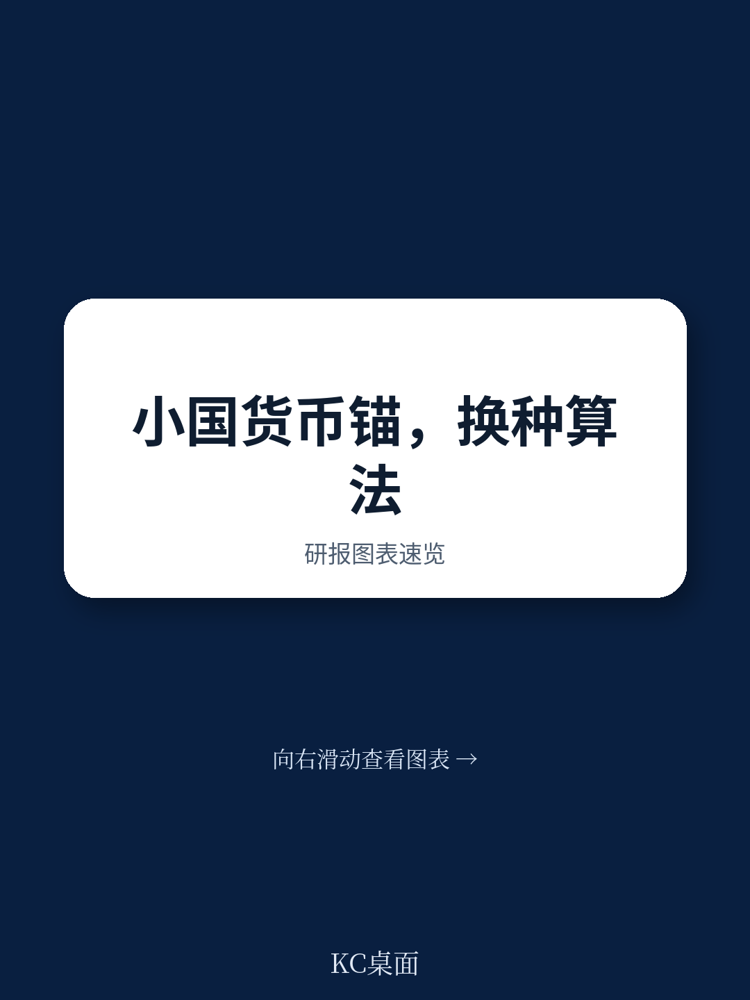
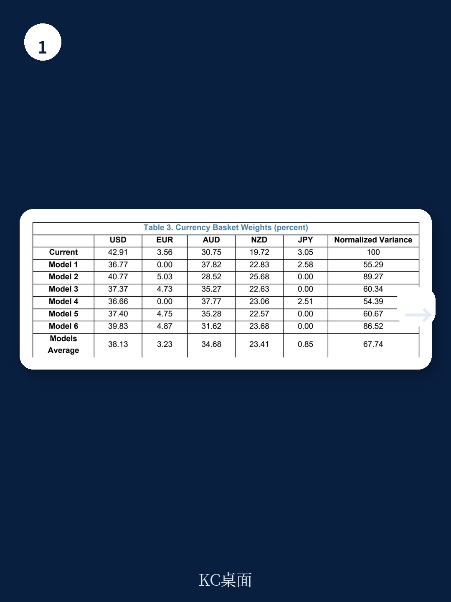
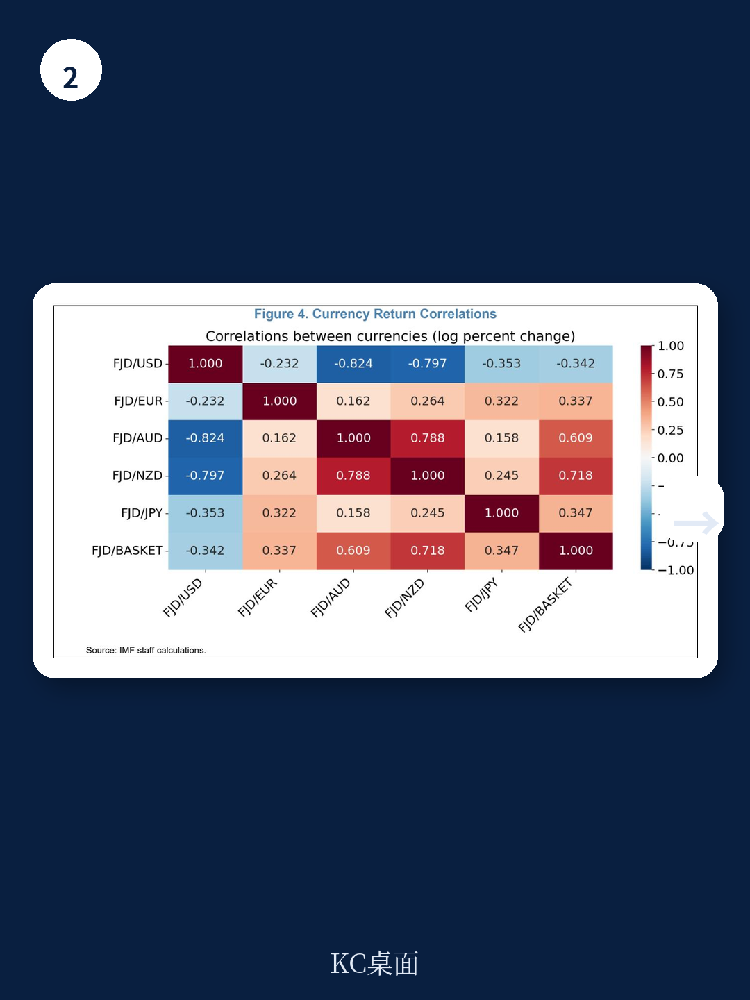

# 国际货币基金组织：IMF：汇率篮子不该只看贸易权重，波动才是真正的成本

国际货币基金组织（IMF）最新工作论文（WP/26/131）提出一个反直觉的判断：当前多数小国开放经济体采用的贸易权重汇率篮子，并非最优设计。论文作者Etienne Vaccaro-Grange将现代投资组合理论中Markowitz最小方差框架，移植到汇率传导空间，证明一个核心结论——通过优化篮子权重，可以在不改变汇率对国内物价长期传导总量的前提下，将进口通胀的波动性降低约20%。

这个结论的意义远不止于太平洋岛国斐济的案例。它指向一个更深层的追问：在全球化退潮、供应链重构、各国央行重新审视物价稳定目标的大背景下，汇率制度设计是否正在经历一次范式转换？贸易权重这个看似“客观”的锚，是否正在成为通胀管理中的盲点？

## 1. 贸易权重是“过去的结构”，而非“最优的解”

当前主流做法是将汇率篮子权重与贸易伙伴的进出口份额挂钩。这种做法有三个直观优势：透明、可操作、与实体经济结构对应。但IMF这篇论文指出，贸易权重只描述了“从哪里买”，却没有回答“买来的价格波动有多大”以及“这种波动如何传导到国内物价”。

问题的核心在于：不同货币的汇率波动对国内进口通胀的传导效率并不相同。美元波动对斐济进口价格的影响，与澳元波动的影响，存在系统性差异。更重要的是，各货币之间的汇率变动存在复杂的协方差结构——当某种货币升值时，另一种可能贬值，这种相关性能否被用来对冲通胀风险，在贸易权重框架下完全被忽略。

> **KC评论：** 这就像用一个只看营收占比的指数基金去配置资产，完全不考虑各资产的风险和相关性。贸易权重是“外生的结构”，而通胀管理需要“内生的风险优化”。完整报告中对斐济案例的实证分析，展示了这种差异究竟有多大。

## 2. 最小方差框架：将汇率篮子变成通胀对冲工具

论文的核心创新在于将汇率篮子设计问题重构为一个Markowitz最小方差问题。具体来说，作者将各货币的汇率变化视为“资产”，将汇率对进口通胀的传导系数视为“收益率”，将篮子权重视为“组合配置”，目标是最小化进口通胀的方差。

这个框架与投资组合理论的相似性并非比喻，而是严格的数学同构。论文中推导的优化问题，本质上就是寻找一个权重向量，使得汇率驱动的进口通胀波动最小。关键约束在于：优化后的篮子必须保留与当前篮子相同的累计传导总量——这意味着不是通过降低传导效率来减少波动，而是通过更聪明的货币组合来实现。

> **KC评论：** 这个约束条件非常关键。它意味着优化不是通过“让国内物价对汇率更不敏感”来实现，而是通过“让汇率篮子本身的波动更小”来实现。这避开了货币政策独立性的争论，纯粹在汇率制度设计层面寻找改进空间。报告中对这个约束条件的实证检验，以及不同规格下的稳健性测试，值得仔细阅读。

## 3. 斐济案例：20%的波动削减来自哪里

论文以斐济为例进行实证应用。斐济自1980年代起实行五货币篮子制度，包含美元、澳元、新西兰元、日元和英镑。当前权重主要基于贸易份额。作者利用1999年至2023年的数据，估计了各货币对斐济进口通胀的传导系数，并计算了优化后的权重。

结果显示：优化后的篮子可以在保持累计传导总量不变的前提下，将进口通胀的方差降低约20%。这个数字在多种规格检验下保持稳健。

20%的来源是什么？论文的实证部分揭示了几个关键机制。首先，不同货币的传导系数差异显著——澳元和新西兰元的传导系数高于美元，但它们的汇率波动与美元存在不完全相关性。其次，日元和英镑在波动性和相关性上提供了分散化收益。优化权重本质上是在“高传导但低相关”和“低传导但高稳定”之间寻找最优平衡。

> **KC评论：** 20%是一个可观的数字。对于斐济这样进口依赖度高、经济规模小的国家，通胀波动直接关系到消费稳定、投资决策和货币政策空间。如果这个框架被验证适用于其他小国开放经济体，那么现有的汇率制度评估标准可能需要重写。报告中对斐济各货币传导系数的具体估计值，以及优化前后权重的对比表，是理解这个20%来源的核心数据。

## 4. 报告尚未完全回答的关键问题：可移植性与动态调整

这个框架的吸引力在于其通用性。从方法论上看，它适用于任何采用篮子制度的国家——从太平洋岛国到中东产油国，甚至可能为部分亚洲新兴市场提供参考。但报告本身坦诚指出了两个尚未解决的问题。

第一，框架目前只考虑“进口通胀波动最小化”这一个目标。现实中，央行的汇率制度选择还涉及产出稳定、金融稳定、资本流动管理等多重目标。论文承认，将商业周期同步性和金融美元化纳入优化框架是未来研究的方向。这意味着，当前20%的改进空间可能是一个“局部最优”，而非“全局最优”。

第二，优化权重是静态的还是动态的？论文中使用的传导系数和协方差矩阵基于历史数据估计。如果全球经济结构发生重大变化——比如供应链重组、贸易伙伴切换、货币政策框架调整——历史参数是否仍然适用？报告没有给出动态调整的机制设计。

> **KC评论：** 这两个未解问题恰恰是这篇报告最有价值的部分。它给出了一个清晰的方法论框架，同时划定了当前结论的边界。对于正在考虑汇率制度调整的经济体来说，这个框架可以作为第一阶段的评估工具，但必须结合自身的结构性特征进行扩展。报告中对传导系数估计的计量细节，以及不同规格下的稳健性测试，是评估框架可移植性的关键参考。

## 5. 对读者的观察框架：从“贸易结构”到“风险结构”

对于关注全球宏观和资产配置的读者来说，这篇报告提供了一个新的分析视角：不要只看一个经济体的贸易伙伴分布，要看汇率波动如何通过传导机制影响其通胀稳定性。

具体来说，可以建立三个层次的观察框架。第一层：该经济体的进口来源结构是什么？第二层：各来源货币的汇率波动性及其对国内通胀的传导系数是多少？第三层：当前汇率制度是否利用了货币间的协方差结构来对冲通胀风险？

这个框架可以用于评估新兴市场的汇率制度风险。例如，对于高度依赖单一货币（如美元）锚定的经济体，其通胀波动可能被低估——因为美元与其他货币的相关性结构没有被利用。反之，对于采用一篮子货币的经济体，如果权重仅基于贸易份额，可能存在优化空间。

> **KC评论：** 这个观察框架的实用性在于，它不要求读者具备复杂的计量经济学知识。贸易数据、汇率数据和通胀数据都是公开可得的。关键在于思维方式的转变：从“贸易结构决定权重”到“风险结构决定权重”。完整报告中对斐济案例的实证操作流程，包括数据选择、模型设定和结果解读，可以作为其他经济体的分析模板。

---

这篇IMF工作论文的价值，不在于给出了一个“标准答案”，而在于提供了一个“更好的问题”：在通胀目标制成为全球央行共识的今天，汇率制度设计是否应该从“贸易便利化”转向“通胀风险管理”？

对于斐济这样的经济体，20%的波动削减意味着更稳定的消费价格、更可预测的货币政策环境。对于更大范围的新兴市场，这个框架可能成为重新评估汇率制度效率的起点。

但正如报告明确指出的，这个框架目前只回答了“进口通胀波动最小化”这一个问题。产出稳定、金融稳定、资本流动管理——这些更复杂的维度，需要更深入的研究。这恰恰是这篇报告最值得继续追问的地方。

如果你对斐济案例的具体优化权重、各货币传导系数的估计值、以及不同规格下的稳健性测试感兴趣，欢迎加入我们的社群。我们每天由AI agent和人工review生成国际投行中文摘要与KC评论，每日更新约10-40页，包含当天最新数据图表合集，既方便喂给AI，也方便人工快速把握市场动态。在社群中，我们将提供这篇IMF报告的完整解读版本，包含论文中的原始图表、数据表格和计量细节，并持续跟踪相关讨论和后续研究。

Personal reading notes and learning share only. Not investment advice.

