# Production Networks and the (Asymmetric) Transmission of Monetary Policy

Francesco Grigoli

WP/26/127

IMF Working Papers describe research in progress by the author(s) and are published to elicit comments and to encourage debate. The views expressed in IMF Working Papers are those of the author(s) and do not necessarily represent the views of the IMF, its Executive Board, or IMF management.

2026
JUN

# IMF Working Paper Research Department

# Production Networks and the (Asymmetric) Transmission of Monetary Policy

Prepared by Francesco Grigoli\*

Authorized for distribution by Antonio Spilimbergo
June 2026

IMF Working Papers describe research in progress by the author(s) and are published to elicit comments and to encourage debate. The views expressed in IMF Working Papers are those of the author(s) and do not necessarily represent the views of the IMF, its Executive Board, or IMF management.

ABSTRACT: I study how the production network shapes monetary policy transmission to prices. Using U.S. data, I show that industries farther upstream from final demand exhibit larger cumulative price responses to monetary shocks, while downstream industries absorb shocks through output. A calibrated multi-sector New Keynesian model rationalizes these patterns: upstream sectors, which sell predominantly to other firms, reprice more frequently and therefore exhibit less price rigidity. A counterfactual decomposition of the price response shows that this heterogeneity in price rigidity---rather than cost-cascade propagation through input-output linkages---is the primary driver of the cross-sectional responses. The upstreamness differential is strongly asymmetric, large following expansionary shocks but nearly absent following contractionary ones, consistent with asymmetric price rigidity compounding across production stages. Together, these findings suggest that monetary policy's potency depends on the production network's architecture.

RECOMMENDED CITATION: Grigoli, Francesco “Production Networks and the (Asymmetric) Transmission of Monetary Policy” IMF Working Paper No. 26/127, June 2026

JEL Classification Numbers:

E31, E52, L14, C67

Keywords:

production networks; price rigidity; monetary policy transmission; input-output linkages; asymmetric price adjustment

Author's E-Mail Address:

francesco.grigoli@georgetown.edu

## 1 Introduction

Every dollar of GDP passes through an average of 2.1 intermediate transactions before reaching a final consumer. $^{1}$ This production network structure is a powerful propagation mechanism for real shocks, as idiosyncratic sectoral disturbances can cascade through input-output (IO) linkages and generate aggregate fluctuations (Acemoglu et al., 2012; Baqaee and Farhi, 2019; Carvalho and Tahbaz-Salehi, 2019). Whether production networks also shape the transmission of nominal shocks is far less understood. When the Federal Reserve changes the federal funds rate, the impulse must travel through the web of buyer-seller relationships, encountering a distinct pricing decision—and a distinct degree of nominal rigidity—at each node. Yet the workhorse New Keynesian model collapses this structure into a single representative firm facing a single Calvo friction; and, despite the evidence that prices adjust more readily upward than downward (Peltzman, 2000; Nakamura and Steinsson, 2008), it assumes symmetric price adjustment for rate hikes and cuts. This paper asks whether the architecture of the production network shapes the transmission of monetary policy to prices, and whether it does so differently for expansionary and contractionary shocks.

I develop a multi-sector New Keynesian model in which industries are connected through an IO network and each faces Calvo-style nominal rigidity. The key theoretical result is that aggregate monetary non-neutrality depends on a network-weighted rigidity index rather than the simple average of sectoral price stickiness. As a result, two economies with identical average price rigidity but different production structures will exhibit different degrees of monetary non-neutrality. $^{2}$ The model delivers a sharp cross-sectional prediction: more upstream industries—those farther from final demand, as measured by the upstreamness index of Antràs et al. (2012)—should exhibit larger cumulative price responses to monetary shocks. This is because upstream producers sell predominantly to other firms rather than to consumers, and business-to-business prices are renegotiated more frequently than consumer-facing prices (Nakamura and Steinsson, 2008). Network position thus generates a systematic correlation between upstreamness and intrinsic price rigidity, with more upstream sectors having lower Calvo parameters. $^{3}$

I test that more upstream industries exhibit larger cumulative price responses to monetary shocks using a panel of monthly producer price indices for 271 U.S. industries at the six-digit NAICS level and the orthogonalized high-frequency monetary policy surprises of Bauer and Swanson (2023). Local projections of cumulative industry price changes on the interaction of the monetary shocks with upstreamness reveal that the differential price response per unit of upstreamness is statistically and economically significant starting from one year after the shock up to over two years after the shock, peaking one year and a half after the shock. The empirical results imply that an industry at the 75th percentile of upstreamness exhibits a peak cumulative price response 2.8 percentage points larger than one at the 25th percentile, in response to a one percentage point monetary policy shock. Feeding the Bureau of Economic Analysis (BEA) IO matrix into the model with an externally measured rigidity differential—calibrated from industry-level PPI price adjustment frequencies—generates the correct qualitative pattern of interaction coefficients across horizons and captures a substantial share of the quantitative magnitude, providing a credible link between the theoretical mechanism and the reduced-form evidence.

A counterfactual decomposition of the calibrated model confirms that this network-determined rigidity heterogeneity—which I call the flexibility channel—is the primary driver of the cross-sectional pattern. Instead, the cost propagation, or cost-cascade channel, usually emphasized in multi-sector models—through which upstream price adjustments propagate to downstream marginal costs—plays only a secondary, and partially offsetting, role. The intuition is that, holding rigidity fixed, a sector’s price tracks the flexible wage in proportion to its labor share, so cost linkages would reinforce the upstreamness pattern only if upstream sectors were labor-intensive. In U.S. data they are the opposite—intermediate-input intensive, with marginal costs tied to other, themselves sticky, prices rather than to wages. The cost-cascade channel therefore tilts the larger price responses toward downstream sectors, working against the upstream flexibility advantage rather than amplifying it. This decomposition clarifies that the production network’s primary role is to determine which sectors are flexible, rather than to propagate price adjustments across stages.

I highlight a stark asymmetry in the cross-sectional pattern. Extending the model to allow for asymmetric price rigidity—the empirical regularity that prices adjust more readily upward than downward—I show that the upstreamness differential in price responses is substantially larger following expansionary shocks than contractionary ones. The data are consistent with this prediction. In response to a rate cut, the peak interaction coefficient is more than twice the pooled peak; cumulating over the one-to-two-year window where the responses diverge most, the upstreamness differential is large and negative following rate cuts but near zero following rate hikes, providing evidence of downward nominal rigidity. This corroborates the ‘rockets and feathers’ phenomenon long documented at the aggregate level, indicating that inflation is easier to generate than deflation. For central banks, the implication is that rate cuts generate larger cross-sectional price dispersion than rate hikes—a structural asymmetry in the transmission mechanism that is invisible in representative-firm models.

These price dynamics in response to monetary policy shocks have implications for the real economy. The model highlights that industries whose prices adjust more flexibly absorb monetary shocks primarily through price changes, preserving real output; industries with sticky prices instead absorb shocks through quantity changes. The empirical results match these predictions. Upstream sectors, whose prices are more flexible, exhibit less negative real effects than downstream sectors. Examining contractionary and expansionary shocks separately reveals patterns mirroring the price-side asymmetry. That is, I do not find statistically significant real effects in response to expansionary shocks. However, contractionary shocks lead upstream industries to cut prices more aggressively and preserve real output, and downstream industries to absorb the shock through quantity rationing. In sum, price flexibility substitutes for quantity adjustment, generating cross-sectional dispersion in both prices and output that is concentrated in contractionary episodes, consistent with the asymmetric price rigidity mechanism in the model.

Although the decomposition shows that the cost-cascade channel is not the primary driver of the upstreamness differential, costs do propagate through the network, and this propagation is detectable in the data. Three auxiliary tests support the view that buyer-seller price linkages play a role in transmitting price adjustments across sectors, even if they do not generate the cross-sectional pattern on their own. First, controlling for input-cost-weighted supplier prices absorbs most of the upstreamness interaction, consistent with the effect operating partly through cost linkages rather than omitted industry characteristics. Second, the interaction between upstreamness and the monetary shock is significantly stronger for industries with higher intermediate input shares. Third, an industry's suppliers' network positions predict its own price response.

These findings survive extensive robustness checks. Alternative network measures (eigenvector centrality, intermediate input share) and monetary policy shocks (Jarociński and Karadi, 2020) yield significant interaction coefficients of comparable magnitude. Similarly, controlling for industry characteristics potentially correlated with industry upstreamness delivers consistent results. The results are also robust to constraining the sample to the manufacturing sector or to removing one industry at a time. Finally, permutation-based placebo tests indicate that upstreamness—not an arbitrary industry ranking—generates the differential price response.

The results of this paper have implications for monetary policy analysis. If the cross-sectional distribution of price rigidity is shaped by the production network, then structural changes in the network can alter the potency of monetary policy even if average price rigidity remains unchanged. Any policy or structural shift that alters the IO matrix—trade agreements, vertical integration, platform-mediated disintermediation—changes the composition of B2B versus B2C activity across the economy, reshaping the distribution of rigidity across network positions. The secular increase in the services share of GDP shifts economic activity toward sectors that are both more downstream and more price-rigid, increasing the wedge between upstream and downstream rigidity and potentially strengthening the asymmetry documented in this paper.

## 1.1 Related literature and contributions

This paper contributes to three strands of the literature. The first is the literature on production networks and nominal rigidities. A large body of work has established that IO linkages shape the propagation of real shocks (Long and Plosser, 1983; Acemoglu et al., 2012; Gabaix, 2011; Barrot and Sauvagnat, 2016; Carvalho et al., 2021; Baqaee and Farhi, 2019). $^{4}$ A separate literature has studied how heterogeneity in nominal price rigidity affects aggregate monetary non-neutrality (Carvalho, 2006; Nakamura and Steinsson, 2010; Kehoe and Midrigan, 2015). $^{5}$

The intersection of these two strands of literature—how nominal rigidities interact with production network structure—has received less attention. The theoretical foundation was laid by Basu (1995), who showed that when firms use other firms' outputs as intermediate inputs, each firm's marginal cost depends on its suppliers' prices, so that upstream price rigidity propagates downstream and amplifies aggregate monetary non-neutrality. Building on this insight, Nakamura and Steinsson (2010) develop a multi-sector menu cost model with intermediate inputs calibrated to 14 U.S. sectors, showing that the combination of heterogeneous price stickiness and roundabout production substantially amplifies monetary non-neutrality. Pasten et al. (2020) calibrate a multi-sector Calvo model with sector-specific adjustment probabilities and find that heterogeneity in price-adjustment frequency is the dominant driver of monetary non-neutrality while IO linkages contribute only marginally—the aggregate counterpart of the cross-sectional decomposition I develop below. Relatedly, Pastén et al. (2024) show that heterogeneity in sectoral price stickiness amplifies the aggregate effects of idiosyncratic productivity shocks and reshapes which sectors matter for aggregate fluctuations. Rubbo (2023) demonstrates that IO linkages propagate rigidity across stages, flattening the aggregate Phillips curve. More recently, Afrouzi and Bhattarai (2024) derive closed-form sufficient statistics for inflation and GDP dynamics in this class of models, showing that all dynamics are governed by a duration-adjusted Leontief matrix and that, as in my decomposition, an upstream sector's contribution depends on whether it is flexible or sticky, not on its network position alone. My theoretical contribution relative to this literature, which uniformly assumes symmetric price adjustment, is to extend the propagation matrix to sign-dependent rigidity. That is, asymmetric rigidity splits the duration-adjusted Leontief into distinct expansionary and contractionary matrices, whose gap generates a network-amplified asymmetry that is absent from all symmetric frameworks.

All these papers focus on aggregate statistics—the level of GDP volatility, the slope of the Phillips curve. Ghassibe (2023) is the first to provide empirical evidence on network amplification of monetary policy, estimating that at least 30% of the effect of monetary shocks on U.S. aggregate final consumption comes from amplification through IO linkages. His analysis uses sectoral consumption data for up to 161 BEA sectors and focuses on the aggregate contribution of networks. I shift the lens from the aggregate to the cross-section, asking not how much total non-neutrality production networks generate but which industries bear the largest price and output responses and through what mechanism. I provide direct empirical evidence for the cross-sectional anatomy of monetary transmission through production chains and document a novel asymmetry that is absent from all three frameworks.

The second strand of literature this paper relates to is the one on asymmetric price adjustment and production networks. Micro-level evidence has long documented that prices rise faster than they fall (Peltzman, 2000; Nakamura and Steinsson, 2008). In a representative-firm model, such asymmetric rigidity merely shifts the level of price adjustment. I show that in a production network, asymmetric rigidity shifts the differential across upstream and downstream sectors: the asymmetry compounds through K - 1 intermediate pricing decisions along a chain of length K, so the direction of the shock matters multiplicatively. The data are in line with this prediction. This result connects to the broader literature on nonlinearities in monetary transmission (Tenreyro and Thwaites, 2016) and provides a micro-founded, cross-sectional mechanism for the aggregate observation that inflation is easier to generate than deflation.

Finally, this paper also speaks to the empirical evidence on networks and monetary policy. Ozdagli and Weber (2025) document that network-central firms exhibit stronger stock-price responses to monetary surprises, and Ghassibe (2023) provides consumption-side evidence that network amplification accounts for a substantial share of aggregate monetary non-neutrality. I focus on goods prices, providing a more direct test of the New Keynesian pricing mechanism. $^{6}$ Moreover, I provide suggestive evidence that costs propagate through buyer-seller price linkages, confirming that the IO network transmits price signals across production stages even though the cross-sectional differential is primarily driven by the flexibility channel. Closest in spirit on the empirical side is Minton and Wheaton (2023), who use sectoral PPI data and the BEA IO tables to show that commodity-price shocks propagate downstream with delays that depend on sectoral price flexibility. My focus differs in the shock (identified monetary surprises rather than commodity prices), the object (the cross-sectional response by upstreamness), and the asymmetry between expansionary and contractionary shocks. Relatedly, the paper connects to the empirical literature on substantial heterogeneity in price adjustment frequencies (Bils and Klenow, 2004; Nakamura and Steinsson, 2008). I show that this heterogeneity is systematically—though imperfectly—related to production chain position: upstream sectors tend to be more flexible because they sell predominantly to other firms, but the relationship is far from deterministic, as some upstream sectors (e.g., semiconductor manufacturing) are among the stickiest while some downstream sectors (e.g., food) are among the most flexible (Pasten et al., 2020).

Outline Section 2 develops the theoretical model. Section 3 describes the data. Section 4 presents the empirical strategy. Section 5 reports the main results of the paper and mechanism tests. Section 6 presents the results of the robustness tests. Section 7 concludes.

## 2 Model

I develop a multi-sector New Keynesian model with IO linkages, building on the canonical framework of Woodford (2003) and Galí (2015). The model is deliberately stylized to isolate two mechanisms: (i) network-determined heterogeneity in nominal rigidity, whereby upstream sectors—selling predominantly to other firms—have more flexible prices, which generates a cross-sectional pattern of price responses with respect to upstreamness, and (ii) asymmetric nominal rigidity interacting with this network-determined rigidity differential, which causes the cross-sectional pattern to differ sharply between inflationary and deflationary shocks. The second mechanism is the model’s most distinctive prediction and cannot arise in representative-firm models. $^{7}$

## 2.1 Environment

Households A representative household maximizes lifetime utility

$$
\mathbb {E} _ {0} \sum_ {t = 0} ^ {\infty} \beta^ {t} \left[ \frac {C _ {t} ^ {1 - \sigma}}{1 - \sigma} - \frac {L _ {t} ^ {1 + \varphi}}{1 + \varphi} \right],\tag{1}
$$

where $C_{t}$ is a composite consumption good, $L_{t}$ is labor supply, $\sigma > 0$ is the coefficient of relative risk aversion, $\varphi > 0$ is the inverse Frisch elasticity, and $\beta \in (0,1)$ is the discount factor. The composite consumption good aggregates output from N sectors:

$$
C _ {t} = \left(\sum_ {i = 1} ^ {N} \omega_ {i} ^ {1 / \eta} c _ {i t} ^ {(\eta - 1) / \eta}\right) ^ {\eta / (\eta - 1)},\tag{2}
$$

where $c_{it}$ is consumption of sector-i output, $\omega_{i}$ is the expenditure weight on sector i in final demand, and $\eta > 0$ is the elasticity of substitution across sectors.

Firms Each sector $i \in \{1, \ldots, N\}$ contains a continuum of monopolistically competitive firms indexed by $j \in [0, 1]$ . Firm j in sector i produces output using labor and intermediate inputs from all N sectors:

$$
y _ {i j t} = z _ {i t} \ell_ {i j t} ^ {\alpha_ {i}} \prod_ {k = 1} ^ {N} m _ {i j k, t} ^ {\gamma_ {i k}},\tag{3}
$$

where $z_{it}$ is a sector-wide productivity shifter, $\ell_{ijt}$ is labor input, $m_{ijk,t}$ is the quantity of sector-k output used as an intermediate input, and the production parameters satisfy $\alpha_{i} + \sum_{k=1}^{N} \gamma_{ik} = 1$ for all i.

The matrix $\Gamma = [\gamma_{ik}]$ is the IO matrix, where $\gamma_{ik}$ is sector $i$ 's cost share of inputs from sector $k$ . This matrix encodes the production network.

Price setting Firms face Calvo-style nominal rigidity (Calvo, 1983). $^{8}$ In each period, a fraction $1 - \theta_{i}$ of firms in sector i can reset their price; the remaining fraction $\theta_{i}$ must keep their price unchanged. The parameter $\theta_{i}$ varies across sectors, capturing the well-documented heterogeneity in price adjustment frequencies (Nakamura and Steinsson, 2008; Bils and Klenow, 2004). I initially present the symmetric Calvo case for transparency, then extend the model to allow the reset probability to depend on the direction of the desired price change. This extension is central to the paper's main result. Since asymmetric rigidity interacts with the systematic variation in price rigidity across network positions, the cross-sectional effect operates more strongly for inflationary than for deflationary shocks.

When a firm in sector i can reset its price, it chooses $p_{ijt}^{*}$ to maximize the expected discounted sum of profits:

$$
\mathbb {E} _ {t} \sum_ {s = 0} ^ {\infty} (\beta \theta_ {i}) ^ {s} \left[ p _ {i j t} ^ {*} y _ {i j, t + s} - \mathrm{TC} _ {i j, t + s} (y _ {i j, t + s}) \right],\tag{4}
$$

where $TC_{ij,t+s}(\cdot)$ is the total cost function at date $t + s$ , taking input prices as given.

Monetary authority The central bank sets the nominal interest rate according to a Taylor rule with monetary policy shocks: $^{9}$

$$
i _ {t} = \rho_ {r} i _ {t - 1} + (1 - \rho_ {r}) [ \phi_ {\pi} \pi_ {t} ^ {\mathrm{agg}} + \phi_ {y} \hat {y} _ {t} ] + \varepsilon_ {t} ^ {m},\tag{5}
$$

where $i_{t}$ is the nominal interest rate, $\pi_{t}^{agg}$ is aggregate inflation, the Domar-weighted average of sectoral inflation, $\hat{y}_{t}$ is the output gap, and $\varepsilon_{t}^{m}$ is an exogenous monetary policy shock.

## 2.2 Log-linearized equilibrium

Log-linearizing around the zero-inflation steady state yields a system of sectoral New Keynesian Phillips curves linked through the IO structure.

Proposition 1 (Sectoral Phillips Curves). The log-linearized inflation rate in sector i satisfies

$$
\pi_ {i t} = \beta \mathbb {E} _ {t} \pi_ {i, t + 1} + \lambda_ {i} \left[ \alpha_ {i} \hat {w} _ {t} + \sum_ {k = 1} ^ {N} \gamma_ {i k} \hat {p} _ {k t} - \hat {p} _ {i t} \right],\tag{6}
$$

where $\hat{w}_{t}$ is the log deviation of the nominal wage from steady state, $\hat{p}_{it}$ is the log deviation of sector i's price index, and $\lambda_{i} \equiv \frac{(1-\theta_{i})(1-\beta\theta_{i})}{\theta_{i}}$ is the slope of sector i's Phillips curve—a decreasing function of the Calvo parameter $\theta_{i}$ .

The result follows from standard Calvo aggregation applied to each sector. Firms that can reset choose $p_{ijt}^{*}$ to equate the present-value-weighted average of expected markups to the desired markup. Log-linearizing the optimal reset price and aggregating across resetting and non-resetting firms using the CES price index yields Equation 6. The Cobb-Douglas production function in Equation 3 delivers the log-linear marginal cost expression in brackets, which corresponds to the log deviation of sector $i$ 's real marginal cost from its flexible-price level. It depends on the wage (through the labor share $\alpha_i$ ) and on the prices of all intermediate inputs (through the IO weights $\gamma_{ik}$ ). This is the channel through which the production network enters the inflation dynamics, as sector $i$ 's marginal cost depends on the prices set by its suppliers, which in turn depend on their suppliers' prices, and so on through the chain.

Matrix representation Stacking the sectoral Phillips curves, define the vectors $\pi_t = (\pi_{1t}, \ldots, \pi_{Nt})'$ and $\hat{\mathbf{p}}_t = (\hat{p}_{1t}, \ldots, \hat{p}_{Nt})'$ . Let $\boldsymbol{\Lambda} = \mathrm{diag}(\lambda_1, \ldots, \lambda_N)$ and $\boldsymbol{\mathcal{A}} = \mathrm{diag}(\alpha_1, \ldots, \alpha_N)$ . Then:

$$
\pmb {\pi} _ {t} = \beta \mathbb {E} _ {t} \pmb {\pi} _ {t + 1} + \pmb {\Lambda} \left[ \pmb {\mathcal {A}} \hat {w} _ {t} \mathbf {1} + (\Gamma - \mathbf {I}) \hat {\mathbf {p}} _ {t} \right].\tag{7}
$$

This system reveals how the network enters the inflation dynamics. The IO matrix $\Gamma$ creates cross-equation linkages among the sectoral Phillips curves, so that even with identical Calvo parameters across sectors, the network structure would generate heterogeneous inflation dynamics. This observation connects directly to the “network Phillips curve” of Rubbo (2023), who shows that in the aggregate the trade-off between inflation and output depends on the entire spectrum of the IO matrix, not merely on the average rigidity parameter. $^{10}$

## 2.3 Aggregate non-neutrality and network structure

The central theoretical result characterizes how aggregate monetary non-neutrality depends on the production network.

Definition 1 (Domar weights). The Domar weight of sector i, denoted $\xi_{i}$ , is the ratio of sector i's total sales (to both final consumers and other firms) to aggregate GDP. In the steady state, the vector of Domar weights satisfies $\boldsymbol{\xi} = (\mathbf{I} - \Gamma')^{-1}\boldsymbol{\omega}$ , where $\omega$ is the vector of final demand shares. $^{11}$

Definition 2 (Upstreamness). The upstreamness of sector i, following Antràs et al. (2012), is the expected number of production stages between sector i and final demand:

$$
U _ {i} = \mathbf {e} _ {i} ^ {\prime} (\mathbf {I} - \mathbf {A}) ^ {- 1} \mathbf {1},\tag{8}
$$

where $e_{i}$ is the i-th unit vector and A is the output-allocation matrix, with $a_{ik} = Z_{ik} / Y_{i}$ denoting the share of sector i's output sold to sector k (as intermediate input or final demand). A sector with $U_{i} = 1$ sells entirely to final consumers; higher values indicate more upstream positions. $^{12}$

Proposition 2 (Network-adjusted rigidity). The aggregate price level response to a monetary shock $\varepsilon_{t}^{m}$ at horizon h is

$$
\frac {\partial \hat {P} _ {t + h}}{\partial \varepsilon_ {t} ^ {m}} = \sum_ {i = 1} ^ {N} \xi_ {i} \frac {\partial \hat {p} _ {i , t + h}}{\partial \varepsilon_ {t} ^ {m}},\tag{9}
$$

where $\hat{P}_{t} = \sum_{i} \xi_{i} \hat{p}_{it}$ is the Domar-weighted aggregate price level. The real output effect of the monetary shock is, to a first-order approximation,

$$
\hat {Y} _ {t + h} \approx \hat {D} _ {t + h} - \hat {P} _ {t + h},\tag{10}
$$

so that output non-neutrality is larger when $\hat{P}_{t+h}$ responds slowly to the monetary shock—that is, when the network-weighted rigidity is high.

The aggregate price index $\hat{P}_{t} = \sum_{i} \xi_{i} \hat{p}_{it}$ is the Domar-weighted gross-output price index. $^{13}$ Equation 9 follows by linearity. The output approximation uses the aggregate demand identity in log-deviations: $\hat{Y}_{t+h} \equiv \hat{D}_{t+h} - \hat{P}_{t+h}$ , where $\hat{D}_{t+h}$ denotes the nominal aggregate demand impulse from the monetary shock (i.e., the path of nominal spending implied by the Taylor rule and Euler equation, not a money stock).

Corollary 1 (Centrality-rigidity alignment). The aggregate price level is slowest to adjust—and monetary non-neutrality is greatest—when the correlation between sectoral rigidity $\theta_{i}$ and Domar weight $\xi_{i}$ is positive. That is, monetary policy has the largest real effects when the stickiest-price sectors are also the most central in the production network.

This result generalizes the standard Calvo model in that in a one-sector economy, the single $\theta$ parameter determines non-neutrality. In a network economy, what matters is not $\bar{\theta}$ but the Domar-weighted average $\tilde{\theta} \equiv \sum_{i} \xi_{i} \theta_{i}$ . The insight that the alignment between Domar weights and sectoral rigidity governs aggregate non-neutrality is closely related to the decomposition in Pasten et al. (2020), who separate the contributions of IO linkages and Calvo heterogeneity to aggregate monetary non-neutrality.

Whether the alignment condition in Corollary 1 holds empirically is an important quantitative question. In U.S. data, the evidence suggests that retail-facing sectors (food, apparel) tend to have both higher Domar weights and stickier consumer prices, while upstream commodity-producing sectors (chemicals, primary metals) have lower Domar weights and more flexible prices. Nakamura and Steinsson (2008) and Bils and Klenow (2004) document substantial heterogeneity in the frequency of price changes, and cross-referencing their estimates with the BEA IO tables suggests a positive but moderate correlation between $\theta_{i}$ and $\xi_{i}$ . The model therefore predicts that the U.S. production network amplifies monetary non-neutrality relative to a counterfactual economy with the same average rigidity but no network structure.

Cross-sectional predictions The model generates testable predictions about the cross-section of sectoral price responses. These predictions rest on a maintained assumption, motivated by the empirical regularity that inter-firm (i.e., B2B) prices are renegotiated more frequently than consumer-facing prices (Nakamura and Steinsson, 2008):

Assumption 1. More upstream sectors have weakly more flexible prices: $\theta_{i}$ is weakly decreasing in $U_{i}$ , so that $\lambda_{i} = (1 - \theta_{i})(1 - \beta\theta_{i})/\theta_{i}$ is weakly increasing in $U_{i}$ .

Equivalently, the price-adjustment probability $r_{i} \equiv \lambda_{i}/(1 + \lambda_{i})$ is weakly increasing in upstreamness. The assumption is motivated by the observation that upstream sectors sell predominantly to other firms, and B2B prices are more flexible. An important caveat is that the share of sales to other firms is not identical to upstreamness. That is, two sectors can both sell entirely to firms yet differ in upstreamness if they sit at different positions in the production chain. The assumption therefore requires that flexibility is monotone in the upstreamness index $U_{i}$ —not only in the B2B sales share—which is an empirical restriction.

Proposition 3 (Upstreamness and price dynamics). Under Assumption 1 and in the static case $(\beta = 0)$ , following a contractionary monetary shock $(\varepsilon_t^m > 0)$ :

(i) General network. The impact price response of sector i decomposes as

$$
\frac {\partial \hat {p} _ {i t}}{\partial \varepsilon_ {t} ^ {m}} = r _ {i} \times \widehat {m c} _ {i},\tag{11}
$$

where $r_{i} = \lambda_{i}/(1 + \lambda_{i})$ is sector i's price-adjustment probability and $\widehat{mc}_{i} > 0$ is its marginal cost response. The flexibility term $r_{i}$ is increasing in $U_{i}$ by Assumption 1, which provides a force toward larger price responses for more upstream sectors. Whether the total response $r_{i} \times \widehat{mc}_{i}$ is monotone in $U_{i}$ also depends on how the marginal cost response $\widehat{mc}_{i}$ varies with network position, which is a quantitative question I resolve in the calibration.

(ii) Chain economy: prices. In a chain of K sectors with uniform input share $\gamma$ and uniform r, the price response of sector k is

$$
x _ {k} = \frac {r \left[ (1 - \gamma) + \gamma (1 - r) (\underbrace {r \gamma} _ {\phi}) ^ {k - 1} \right]}{1 - r \gamma},\tag{12}
$$

which is strictly decreasing in $k$ (the sector's position toward final demand). The upstream-downstream price differential $x_{1} - x_{K}$ is

$$
D _ {K} = \frac {r \gamma (1 - r) [ 1 - \phi^ {K - 1} ]}{1 - \phi},\tag{13}
$$

where $\phi = r\gamma$ is the cascade factor. The differential is increasing in $K$ and converges to $r\gamma(1 - r) / (1 - \phi)$ as $K \to \infty$ .

(iii) Chain economy: output. The real output response of sector k satisfies $\hat{y}_{kt} \approx \hat{d}_{kt} - \hat{p}_{kt}$ , where $\hat{d}_{kt}$ is the demand impulse. More downstream sectors (higher k) have smaller $|\hat{p}_{kt}|$ , so their output gap remains open longer and the peak real effect occurs at a later horizon.

Part (i) holds for an arbitrary IO matrix $\Gamma$ . The factorization in Equation 11 follows from the static Phillips curve, so that sector $i$ 's price adjusts by a fraction $r_i$ of its marginal cost deviation. The marginal cost $\widehat{mc}_i = \alpha_i \hat{w}_t + \sum_k \gamma_{ik} \hat{p}_{kt}$ is strictly positive because both the wage and all input prices respond in the same direction as the monetary shock, and $\alpha_i > 0$ . Two conceptually distinct channels shape the cross-sectional pattern. The flexibility channel operates through $r_i$ : upstream sectors have steeper Phillips curves (higher $\lambda_i$ , hence higher $r_i$ ), so a given marginal cost deviation translates into a larger price response. The cost-cascade channel operates through $\widehat{mc}_i$ : sector $i$ 's marginal cost depends on its suppliers' prices, which are themselves sticky, so the marginal cost response varies across sectors depending on their IO linkages.

Proposition 4 (Sign of the cost-cascade channel). Hold flexibility homogeneous at $\bar{r}$ and consider the impact price response to a nominal demand impulse $\Delta\hat{w}$ . To first order in $\bar{r}$ , the cross-sectional regression slope of the price response on upstreamness attributable to the IO cost-cascade channel is

$$
\frac {\partial}{\partial U} \hat {p} _ {i} ^ {c o s t} = \bar {r} \Delta \hat {w} \frac {\operatorname{Cov} \left(\alpha_ {i} , U _ {i}\right)}{\operatorname{Var} \left(U _ {i}\right)} + O \left(\bar {r} ^ {2}\right).\tag{14}
$$

Hence the cost-cascade channel reinforces the flexibility channel if $\operatorname{Cov}(\alpha_{i}, U_{i}) > 0$ and offsets it if $\operatorname{Cov}(\alpha_{i}, U_{i}) < 0$ .

The result follows from the Neumann expansion $\bar{r}(\mathbf{I}-\bar{r}\Gamma)^{-1}\boldsymbol{\alpha}=\bar{r}\boldsymbol{\alpha}+\bar{r}^{2}\Gamma\boldsymbol{\alpha}+\cdots$ . The leading term is $\bar{r}\alpha_{i}$ , whose cross-sectional slope on $U_{i}$ is $\bar{r}\operatorname{Cov}(\alpha,U)/\operatorname{Var}(U)$ . With homogeneous rigidity, a sector's price response is governed by how directly its marginal cost moves with the wage—its labor share $\alpha_{i}$ —so the cost-cascade channel raises upstream responses relative to downstream ones only if upstream sectors are more labor intensive.

## 2.4 Special cases and intuition

To build intuition for the general results, consider a two-sector economy $(N = 2)$ with a simple chain structure: sector 1 (upstream) sells only to sector 2 (downstream), which sells only to final consumers. Let $\gamma$ denote the cost share of sector-1 inputs in sector 2's production, so the IO matrix is

$$
\Gamma = \left( \begin{array}{c c} 0 & 0 \\ \gamma & 0 \end{array} \right).\tag{15}
$$

Sector 1 uses only labor ( $\alpha_{1} = 1$ ), while sector 2 uses labor and sector-1 output ( $\alpha_{2} = 1 - \gamma$ ). The output-allocation matrix has $a_{12} = \gamma$ (the share of sector 1's output sold to sector 2) and all other entries zero, so the Ghosh inverse is $(\mathbf{I} - \mathbf{A})^{-1} = \begin{pmatrix} 1 & \gamma \\ 0 & 1 \end{pmatrix}$ and the upstreamness values are $U_{1} = 1 + \gamma$ and $U_{2} = 1$ . $^{14}$

In this two-sector chain, the system of Phillips curves reduces to:

$$
\pi_ {1 t} = \beta \mathbb {E} _ {t} \pi_ {1, t + 1} + \lambda_ {1} (\hat {w} _ {t} - \hat {p} _ {1 t}),\tag{16}
$$

$$
\pi_ {2 t} = \beta \mathbb {E} _ {t} \pi_ {2, t + 1} + \lambda_ {2} \left[ (1 - \gamma) \hat {w} _ {t} + \gamma \hat {p} _ {1 t} - \hat {p} _ {2 t} \right].\tag{17}
$$

Equation 16 is a standard single-sector Phillips curve for the upstream industry. Equation 17 shows that downstream inflation depends on both the wage and the upstream price $\hat{p}_{1t}$ , the network linkage. Two distinct forces shape the relative price response of the two sectors, and it is useful to separate them at the outset.

The flexibility force is the primary driver. Because sector 1 sells to another firm rather than to consumers, its prices are renegotiated more frequently (Assumption 1), so $\lambda_1 > \lambda_2$ . A sector with a steeper Phillips curve passes a larger share of any marginal cost change into its price. This force makes the upstream sector respond more, and it operates regardless of the IO structure. The cost-linkage force is secondary. The downstream sector's marginal cost depends on the sticky upstream price $\hat{p}_{1t}$ , so a fraction $\gamma$ of its costs adjusts only as the upstream price moves. Whether this force makes the upstream or the downstream sector respond more depends on the relative labor intensities of the two sectors.

Solving the two-sector system in closed form under the simplifying assumption that both Phillips curves are static ( $\beta = 0$ ) yields the impact responses. $^{15}$ Setting $\Delta\hat{w} \equiv \partial\hat{w}_{t}/\partial\varepsilon_{t}^{m}$ for brevity, the static Phillips curve for sector 1 gives $\hat{p}_{1} = \lambda_{1}(\Delta\hat{w} - \hat{p}_{1})$ , so:

$$
\frac {\partial \hat {p} _ {1 t}}{\partial \varepsilon_ {t} ^ {m}} = \frac {\lambda_ {1}}{1 + \lambda_ {1}} \hat {\Delta w},\tag{18}
$$

$$
\frac {\partial \hat {p} _ {2 t}}{\partial \varepsilon_ {t} ^ {m}} = \frac {\lambda_ {2}}{1 + \lambda_ {2}} \left[ (1 - \gamma) \hat {\Delta w} + \gamma \cdot \frac {\lambda_ {1}}{1 + \lambda_ {1}} \hat {\Delta w} \right].\tag{19}
$$

The term $\lambda_{i}/(1+\lambda_{i})=r_{i}$ is the flexibility force, which is larger for the upstream sector under Assumption 1, directly raising sector 1's response. The bracketed term in the downstream response is the cost-linkage force, with the input price $\hat{p}_{1t}$ entering with weight $\gamma$ and itself attenuated by upstream stickiness.

The labor-share structure of the chain determines the sign of the cost-linkage force. In this stylized chain, the most upstream sector uses only labor ( $\alpha_{1} = 1$ ), so its marginal cost moves one-for-one with the wage while the downstream sector's cost is partly the sticky upstream price; the cost-linkage force then reinforces the flexibility force, making the upstream sector respond more. If instead upstream sectors are more intermediate-input intensive and carry lower labor shares, their marginal cost depends more on other sticky prices and less on the flexible wage, so the cost-linkage force works in the opposite direction and partially offsets the flexibility force. The chain is thus useful for seeing how stickiness compounds across stages, but whether the cost-linkage force reinforces or offsets the flexibility force—and hence which dominates the upstreamness differential—depends on the labor-share structure of the network, a quantitative question I take to the calibration in Subsection 5.2.

For the asymmetry results that follow, define the cascade factor $\phi \equiv \gamma r = \gamma \lambda / (1 + \lambda)$ , the per-stage rate at which a cost change passes through a sticky downstream price. In a chain with K stages this factor is applied at each node, and as shown in Proposition 3(ii) the upstream-downstream price differential $D_{K}$ is increasing in K. The general N-sector model replaces the chain with the full IO matrix $\Gamma$ , but the two forces are the same, namely the flexibility variation across network positions and cost linkages whose sign depends on the labor-share structure.

This cascade factor reveals why asymmetric rigidity is consequential. If $\lambda$ differs between upward and downward price adjustment—as the micro evidence strongly suggests—then $\phi$ differs by sign of the shock. In a single sector, the asymmetry is a level effect; in a K-stage chain, the asymmetry is amplified because longer chains compound the difference in cascade factors across more stages. I formalize this insight in the next subsection.

## 2.5 Asymmetric price rigidity and network amplification

The results so far characterize how network-determined rigidity heterogeneity shapes the cross-section of price responses under symmetric Calvo pricing. The central theoretical contribution of this paper is to show that asymmetric price rigidity—the empirical regularity that prices adjust more readily upward than downward—interacts with the production network to generate a qualitatively new prediction: the upstreamness differential in price responses is substantially larger following expansionary shocks than contractionary ones. This prediction is absent from all existing multi-sector NK models (Pasten et al., 2020; Rubbo, 2023), which maintain symmetric Calvo pricing, and it cannot arise in representative-firm models regardless of the pricing assumption.

The extension is motivated by a large empirical literature documenting that prices adjust asymmetrically. Peltzman (2000) finds that retail prices respond more quickly and fully to cost increases than to cost decreases across a broad range of products. Nakamura and Steinsson (2008) document that the fraction of price increases exceeds the fraction of price decreases for most product categories, and that the hazard of price adjustment depends on the sign of the gap between the actual and desired price. $^{16}$

Asymmetric Calvo pricing I introduce a parsimonious reduced-form extension of the Calvo framework in which the probability of price resetting depends on the direction of the desired adjustment. Let $\hat{p}_{it}^{*}$ denote the flexible-price optimum for sector i at time t. A firm in sector i can reset its price with probability

$$
1 - \theta_ {i} ^ {s}, \qquad s \in \{+, - \},\tag{20}
$$

where $s = +$ if the desired reset price exceeds the current price $(\hat{p}_{it}^{*} > \hat{p}_{it})$ and $s = -$ if $\hat{p}_{it}^{*} < \hat{p}_{it}$ . Asymmetric price rigidity corresponds to $\theta_{i}^{-} > \theta_{i}^{+}$ , meaning firms are less likely to lower their price than to raise it. The baseline Calvo model is the special case $\theta_{i}^{+} = \theta_{i}^{-} = \theta_{i}$ . This specification assigns a common sign state $s_{t}$ to all sectors based on the direction of the aggregate shock, which is a simplification as, in practice, idiosyncratic shocks would cause some firms to wish to raise prices while others wish to cut them. The reduced-form approach captures the dominant direction of desired adjustment following a common monetary shock and is best interpreted as characterizing the average behavior of the cross-section conditional on the aggregate state.

State-dependent Phillips curves Under asymmetric Calvo pricing, the slope of the sectoral Phillips curve becomes state-dependent. Define the state-dependent slope parameters

$$
\lambda_ {i} ^ {s} = \frac {(1 - \theta_ {i} ^ {s}) (1 - \beta \theta_ {i} ^ {s})}{\theta_ {i} ^ {s}}, \qquad s \in \{+, - \}.\tag{21}
$$

Since $\lambda_{i}^{s}$ is decreasing in $\theta_{i}^{s}$ , asymmetric rigidity ( $\theta_{i}^{-} > \theta_{i}^{+}$ ) implies $\lambda_{i}^{-} < \lambda_{i}^{+}$ , so the Phillips curve is flatter when firms need to cut prices than when they need to raise them.

The sectoral Phillips curve becomes

$$
\pi_ {i t} = \beta \mathbb {E} _ {t} \pi_ {i, t + 1} + \lambda_ {i} ^ {s _ {t}} \left[ \alpha_ {i} \hat {w} _ {t} + \sum_ {k = 1} ^ {N} \gamma_ {i k} \hat {p} _ {k t} - \hat {p} _ {i t} \right],\tag{22}
$$

where $s_{t} \in \{+, -\}$ depends on the sign of the aggregate demand impulse.

Network amplification of the asymmetry The key insight is that asymmetric rigidity interacts multiplicatively with network structure. Return to the two-sector chain of Subsection 2.4. After an expansionary shock ( $\varepsilon_{t}^{m} < 0$ ), demand rises and firms wish to raise prices. Both sectors face the “upward” slope $\lambda_{i}^{+}$ , which is relatively steep. The upstream sector’s price increases quickly, and this increase cascades to the downstream sector through input costs. At each stage, the Phillips curve slope is $\lambda^{+}$ , so the cascade operates at full force.

After a contractionary shock $(\varepsilon_{t}^{m}>0)$ , demand falls and firms wish to cut prices. Now both sectors face the “downward” slope $\lambda_{i}^{-}<\lambda_{i}^{+}$ . The cascade is attenuated at every stage. Even the upstream sector adjusts more slowly, and the downstream sector’s input costs move less, compounding the attenuation through the production chain.

The following result formalizes this logic for an arbitrary production network, before specializing to the chain. Let $r_{i}^{s} \equiv \lambda_{i}^{s}/(1 + \lambda_{i}^{s})$ denote the sign-dependent price-adjustment probability and $\mathbf{R}^{s} \equiv \text{diag}(r_{1}^{s}, \ldots, r_{N}^{s})$ , for $s \in \{+, -\}$ .

Proposition 5 (Sign-dependent network propagation). In the static economy ( $\beta = 0$ ), the impact response of the sectoral price vector to a nominal demand impulse of sign s is

$$
\hat {\mathbf {p}} ^ {s} = \mathbf {M} ^ {s}   \boldsymbol {\alpha}   \Delta \hat {w}, \qquad \mathbf {M} ^ {s} \equiv (\mathbf {I} - \mathbf {R} ^ {s} \Gamma) ^ {- 1}   \mathbf {R} ^ {s},\tag{23}
$$

where $M^{s}$ is the sign-dependent dampened Leontief matrix. This matrix satisfies:

(i) Nesting. If $r_{i}^{+} = r_{i}^{-}$ for all i (symmetric rigidity), then $M^{+} = M^{-}$ and price responses are independent of the sign of the shock.

(ii) Asymmetry. If $r_{i}^{+} \geq r_{i}^{-}$ for all i, with strict inequality for some i, then $M^{+} \geq M^{-}$ elementwise, so $|\hat{p}_{i}^{+}| \geq |\hat{p}_{i}^{-}|$ for every sector: price responses are uniformly larger following expansionary shocks, and the cross-sectional dispersion of responses with respect to upstreamness is wider.

The proof of part (ii) uses the Neumann series $\mathbf{M}^{s} = \sum_{k=0}^{\infty} (\mathbf{R}^{s}\Gamma)^{k} \mathbf{R}^{s}$ , which converges because $R^{s}\Gamma$ is non-negative with spectral radius below one ( $r_{i}^{s} < 1$ and $\Gamma$ has row sums below one). Each term is elementwise non-decreasing in every $r_{i}^{s}$ , so $R^{+} \geq R^{-}$ implies $M^{+} \geq M^{-}$ entrywise. The matrix $M^{s}$ is the static, sign-dependent analog of the duration-adjusted Leontief sufficient statistic of Afrouzi and Bhattarai (2024). In the symmetric case it collapses to a single propagation matrix governing all responses, as in their framework and in Rubbo (2023) and Pasten et al. (2020); asymmetric rigidity splits it into an expansionary matrix $M^{+}$ with shorter effective price durations and a contractionary matrix $M^{-}$ with longer ones. The rockets-and-feathers asymmetry is governed by the gap $M^{+} - M^{-}$ , an object absent from the symmetric multi-sector literature. The chain economy delivers a closed-form characterization of this gap.

Proposition 6 (Asymmetric network amplification: chain economy). Under asymmetric Calvo pricing with $\theta_{i}^{-} > \theta_{i}^{+}$ for all i, in a chain of K sectors with uniform input share $\gamma$ and $\beta = 0$ :

(i) The upstream-downstream price differential under shock sign $s \in \{+, -\}$ is

$$
D _ {K} ^ {s} = \frac {r ^ {s} \gamma (1 - r ^ {s}) [ 1 - (\phi^ {s}) ^ {K - 1} ]}{1 - \phi^ {s}},\tag{24}
$$

where $r^{s} = \lambda^{s} / (1 + \lambda^{s})$ , $\phi^{s} = r^{s}\gamma$ , and the differential is expressed per unit of the wage impulse $\hat{\Delta w}$ .

(ii) The ratio of the expansionary to the contractionary differential is

$$
\mathcal {R} _ {K} = \frac {r ^ {+} (1 - r ^ {+})}{r ^ {-} (1 - r ^ {-})} \times \frac {\sum_ {j = 0} ^ {K - 2} (\phi^ {+}) ^ {j}}{\sum_ {j = 0} ^ {K - 2} (\phi^ {-}) ^ {j}}.\tag{25}
$$

Under the restriction $r^+, r^- < \frac{1}{2}$ with $r^+ > r^-$ : (a) $\mathcal{R}_K > 1$ for all $K \geq 2$ ; (b) $\mathcal{R}_K$ is strictly increasing in $K$ ; and (c) $\mathcal{R}_K$ converges to the finite limit $\mathcal{R}_\infty = r^+(1 - r^+)(1 - \phi^-) / [r^-(1 - r^-)(1 - \phi^+)]$ .

The ratio $R_{K}$ has a clean two-factor decomposition. The first factor, $r^{+}(1-r^{+})/[r^{-}(1-r^{-})]$ , captures the own-flexibility asymmetry: the upstream-downstream differential is proportional to $r(1-r)$ , which is larger for $r^{+}$ than for $r^{-}$ when both lie below $\frac{1}{2}$ . This factor operates even in a two-sector chain (K=2). The second factor, the ratio of partial geometric sums, captures the network amplification of the asymmetry: it equals one at K=2, increases with K, and converges to $(1-\phi^{-})/(1-\phi^{+})>1$ . Longer chains amplify the asymmetry because the stronger expansionary cascade ( $\phi^{+}>\phi^{-}$ ) cumulates over more stages, but the amplification is bounded.

The model thus makes a testable prediction. The interaction between upstreamness and monetary shocks should be driven predominantly by expansionary episodes. Moreover, the asymmetry should be stronger for industries that are more deeply embedded in the production network (higher upstreamness), because the difference in cascade factors cumulates over more stages. $^{17}$

## 3 Data

The empirical analysis combines three data sources: industry-level producer prices, the U.S. IO tables, and a measure of monetary policy stance. $^{18}$

## 3.1 Producer price indices

I use monthly Producer Price Index (PPI) data from the Bureau of Labor Statistics. The baseline sample covers all industries with BLS Producer Price Index coverage at the six-digit NAICS level over the period February 1998 to December 2024. This includes manufacturing (NAICS 311–339), mining, utilities, wholesale trade, retail trade, transportation, information, and selected service sectors. The panel is unbalanced: some PPI series (e.g., Food Manufacturing, NAICS 311) are available from the late 1990s, while others (e.g., Wholesale Trade subsectors) begin around 2003 when the BLS expanded PPI coverage.

Table 1: Industries in the sample and network position

<table><tr><td colspan="2">Industry</td><td>Upstreamness</td><td>Centrality</td></tr><tr><td colspan="2">Q1 (Most downstream) (N = 69)</td><td></td><td></td></tr><tr><td>Min</td><td>Direct life insurance carriers</td><td>1.00</td><td>0.00</td></tr><tr><td>Max</td><td>Fan, blower, air purification equipment mfg</td><td>1.03</td><td>0.00</td></tr><tr><td colspan="2">Q2 (N = 68)</td><td></td><td></td></tr><tr><td>Min</td><td>Cut stone and stone product manufacturing</td><td>1.03</td><td>0.00</td></tr><tr><td>Max</td><td>Clay product and refractory manufacturing</td><td>1.11</td><td>0.00</td></tr><tr><td colspan="2">Q3 (N = 68)</td><td></td><td></td></tr><tr><td>Min</td><td>Dry, condensed, and evaporated dairy products</td><td>1.11</td><td>0.00</td></tr><tr><td>Max</td><td>Architectural &amp; structural metals mfg</td><td>1.28</td><td>0.01</td></tr><tr><td colspan="2">Q4 (Most upstream) (N = 69)</td><td></td><td></td></tr><tr><td>Min</td><td>Portfolio management and investment advice</td><td>1.28</td><td>0.06</td></tr><tr><td>Max</td><td>Iron and steel mills and ferroalloy mfg</td><td>3.77</td><td>0.08</td></tr><tr><td colspan="2">Total industries: 274</td><td>1.23</td><td>0.02</td></tr></table>

Notes: For each upstreamness quartile, the table reports the industries with the minimum and maximum upstreamness values. Upstreamness is computed following Antràs et al. (2012) from the BEA Detailed IO tables. Centrality refers to eigenvector centrality, computed as the dominant eigenvector of the direct requirements matrix; it captures an industry's importance based on the centrality of the industries it supplies. N is the number of industries in the quartile. The full sample includes all industries with BLS PPI coverage.

## 3.2 IO tables and network position

I construct the production network using the BEA 2012 Detailed IO tables. $^{19}$ Specifically, I use the Detailed-level Use table, which records the dollar value of each commodity used as an intermediate input by each industry at the six-digit NAICS level. I match the BEA Detailed industries to the six-digit NAICS industries in the PPI sample using a crosswalk that maps BEA commodity codes to individual six-digit NAICS codes. After matching, I normalize the rows to obtain the technical coefficients matrix $\Gamma = [\gamma_{ik}]$ , where $\gamma_{ik}$ is the cost share of inputs from sector $k$ in sector $i$ 's total intermediate expenditure.

Following Antràs et al. (2012), I define the upstreamness of industry i as

$$
U _ {i} = 1 \times \frac {F _ {i}}{Y _ {i}} + 2 \times \frac {\sum_ {k} a _ {i k} F _ {k}}{Y _ {i}} + 3 \times \frac {\sum_ {k} \sum_ {j} a _ {i j} a _ {j k} F _ {k}}{Y _ {i}} + \dots = \mathbf {e} _ {i} ^ {\prime} (\mathbf {I} - \mathbf {A}) ^ {- 1} \mathbf {1},\tag{26}
$$

where $F_{i}$ is final demand for industry i's output, $Y_{i}$ is total output, and A is the output-allocation matrix with $a_{ik} = Z_{ik} / Y_{i}$ (the share of industry i's output sold to industry k). $^{20}$ Hence, an industry that sells entirely to final consumers has $U_{i} = 1$ ; higher values indicate more intermediate steps to final demand. In the full sample of industries with BLS PPI coverage, upstreamness ranges from 1.00 to 3.77, with substantial variation in production chain position, as shown in Table 1. As an alternative measure of network position, I compute the eigenvector centrality of each industry from the IO matrix. The centrality $v_{i}$ is proportional to the weighted sum of the centralities of the industries it supplies: $v_{i} = \frac{1}{\lambda_{\max}} \sum_{k} \gamma_{ki} v_{k}$ , where $\lambda_{\max}$ is the largest eigenvalue of $\Gamma'$ . An additional raw measure of network position is the share of intermediate inputs in total purchases, which I use later in robustness tests.

Figure 1 summarizes the production network and the cross-sectional variation in network position. Panel (a) visualizes the network aggregated to the three-digit NAICS level for legibility. Node size is proportional to eigenvector centrality, color indicates the upstreamness quartile (lighter shades for downstream, darker for upstream), and directed edges point from supplier to customer. Two features stand out. First, the network is dense: most sectors are connected to multiple suppliers and customers, generating the inter-industry cost linkages through which monetary shocks propagate. Second, while node centrality and upstreamness are positively correlated, such correlation is imperfect, warranting some robustness analysis.

Panel (b) shows the cross-sectional distribution of upstreamness. The distribution is right-skewed, with a modal value near 1.0 and a long right tail extending beyond 3.5. The right skew implies that a relatively small number of industries sit at the upstream end of the production chain (e.g., basic chemicals, primary metals), while the majority are positioned closer to final demand. The quartile boundaries—marked by dashed vertical lines—divide the sample into four groups with meaningfully different positions in the production chain. The substantial spread between the first and fourth quartiles provides ample cross-sectional variation to identify how network position shapes the transmission of monetary policy shocks.

## 3.3 Monetary policy shocks

My preferred monetary policy shock measure is the orthogonalized monetary policy surprise (MPS) of Bauer and Swanson (2023), which is available up to December 2023. These shocks are constructed in two steps. First, high-frequency changes in federal funds futures prices in a narrow window around FOMC announcements isolate the market's revision of the expected path of policy rates. Second, the raw surprises are orthogonalized with respect to a set of macroeconomic and financial variables to purge the “Fed information effect”—the concern that surprise rate changes partly reflect the Fed’s superior information about the state of the economy rather than exogenous shifts in the policy rule. The resulting MPS series is available at the FOMC-meeting frequency. I aggregate to monthly frequency by summing surprises within each calendar month (months without FOMC meetings receive a shock of zero). $^{21}$

Figure 1: The U.S. production network and upstreamness distribution  
(a) Production network  
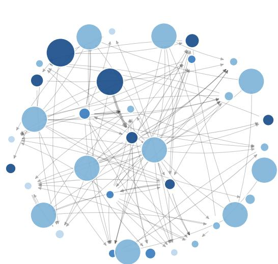

(b) Upstreamness distribution  
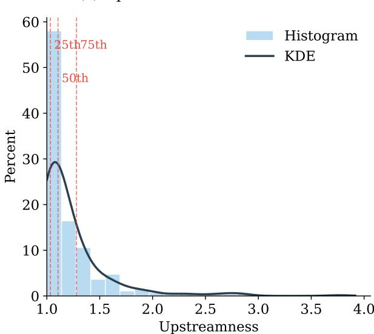  
Notes: Panel (a): Each node represents an industry aggregated to the three-digit NAICS level. Node size is proportional to eigenvector centrality; color indicates upstreamness quartile (lighter = more downstream, darker = more upstream). A directed edge from industry i to industry j indicates that i supplies intermediate inputs to j; edge width is proportional to the value of the flow from the BEA Detailed IO tables. Panel (b): Cross-sectional distribution of upstreamness across all industries in the sample, computed from BEA Detailed IO tables following Antràs et al. (2012); vertical dashed lines indicate quartile boundaries.

As a robustness check, I also use the monetary policy shocks of Jarociński and Karadi (2020), which is available up to December 2024. Their approach applies a sign-restriction identification scheme to a high-frequency VAR of interest rate and stock price changes around FOMC announcements. The key identifying assumption is that a pure monetary policy shock moves interest rates and stock prices in opposite directions (higher rates, lower stocks), whereas a central bank information shock moves them in the same direction (higher rates, higher stocks, because the rate increase reflects good economic news). The median-rotation estimator from this decomposition isolates the monetary policy component, purging the information effect through an alternative channel to the Bauer-Swanson orthogonalization. $^{22}$

## 3.4 Sample construction and descriptive statistics

The estimation sample is a monthly panel of 271 industries observed from February 1998 through December 2023. It gets extended to end-2024 when using the monetary policy shocks of Jarociński and Karadi (2020). Of the 274 industries in the BEA IO tables, three are excluded for having less than 10 years of PPI data. $^{23}$ Table A2 of Appendix A-IV reports summary statistics. Monthly PPI inflation averages 0.16% with a standard deviation of 1.8%, and industries display substantial heterogeneity in upstreamness.

## 4 Empirical strategy

This section presents the estimation approach, the identification assumptions and their plausibility, and the interpretation of estimates.

## 4.1 Estimation

The empirical strategy exploits the interaction of time-series variation in monetary policy shocks with cross-sectional variation in production network position. Specifically, I estimate impulse response functions using the local projection method of Jordà (2005). For each horizon $h = 0, 1, \ldots, H$ (with H = 36 months), I estimate:

$$
\Delta^ {h} p _ {i t} = \alpha_ {i} ^ {h} + \mu_ {s (i), t} ^ {h} + \beta^ {h} (U _ {i} \times \varepsilon_ {t} ^ {m}) + \rho^ {h} \Delta p _ {i, t - 1} + u _ {i t} ^ {h},\tag{27}
$$

where $\Delta^{h}p_{it} = \ln(\mathrm{PPI}_{i,t+h}) - \ln(\mathrm{PPI}_{it})$ is the cumulative log price change in six-digit NAICS industry i from month t to $t + h$ (at h = 0, the dependent variable is the contemporaneous monthly PPI inflation $\pi_{it}$ ), $U_{i}$ is the upstreamness of industry i, $\varepsilon_{t}^{m}$ is the Bauer-Swanson monetary policy shock, $\alpha_{i}^{h}$ are the six-digit NAICS industry fixed effects, $\mu_{s(i),t}^{h}$ are three-digit NAICS sector × month fixed effects, and $\Delta p_{i,t-1}$ denotes the lagged PPI inflation. $^{24,25}$

The coefficient of interest is $\beta^h$ , which captures how the cumulative price response to a monetary shock varies with a sector's position in the production network. Under the model's prediction (Proposition 3), such coefficient is negative at medium-to-long horizons—meaning that more upstream sectors exhibit larger cumulative price declines following a contractionary monetary policy shock, consistent with the amplification mechanism operating through multi-stage production chains. The horizon choice of H = 36 months is guided by the model's prediction that the full price adjustment takes several years, while balancing the loss of observations at long horizons in the unbalanced panel. The industry fixed effects absorb any time-invariant differences in average price growth across industries. The sector×time fixed effects $\mu_{s(i),t}^{h}$ absorb all time-varying shocks common to industries within the same three-digit NAICS sector. The monetary shock effect $\varepsilon_{t}^{m}$ is absorbed by the sector×time fixed effects, so $\beta^{h}$ is identified purely from within-sector variation in upstreamness across six-digit industries interacted with the time-series monetary shock variation. $^{26}$

Identification The identification strategy rests on two assumptions. The first is the exogeneity of monetary policy shocks. That is, conditional on industry fixed effects and lagged macroeconomic controls, the interaction $U_{i} \times \varepsilon_{t}^{m}$ is uncorrelated with the error term. The second is the stability of network position, namely that the upstreamness $U_{i}$ of each industry is stable over the sample period, reflecting technological characteristics of the industry's product rather than endogenous responses to monetary conditions. These assumptions have several distinct components, each of which I now discuss.

The key requirement for identification is that the FOMC does not target sectoral PPI developments. This is plausible because the FOMC targets aggregate inflation (CPI or PCE), not sector-specific producer prices. Moreover, the Bauer-Swanson shocks are constructed from high-frequency changes in federal funds futures around FOMC announcements, then orthogonalized with respect to macroeconomic and financial variables. By construction, the shock is the component of the policy surprise that is orthogonal to both the systematic policy rule and the market's inference about the Fed's private economic information. Nakamura and Steinsson (2018) demonstrate that the information effect is quantitatively important, and the Bauer-Swanson orthogonalization directly addresses this concern by removing the component of the surprise that is correlated with the Fed's private information about economic conditions.

Even if the monetary policy shocks are exogenous, however, identification of $\beta^{h}$ requires that the interaction $U_{i} \times \varepsilon_{t}^{m}$ be exogenous. The main threat would be if the monetary shock were systematically correlated with shocks that differentially affect upstream versus downstream industries. For example, if oil price shocks simultaneously caused the Fed to tighten policy and disproportionately affected upstream commodity-producing sectors, the interaction term would be endogenous. The sector×time fixed effects directly address this concern by absorbing all time-varying shocks that are common within three-digit NAICS sectors, including for example sectoral demand shifts, commodity price movements, and trade shocks that could potentially correlate with monetary policy actions. The orthogonalization in the Bauer-Swanson shock provides additional protection, as it removes the correlation between the policy surprise and contemporaneous macroeconomic conditions.

The network stability assumption requires that upstreamness reflects technological characteristics rather than endogenous responses to monetary conditions. This is supported by the fact that the IO structure of an industry—who its customers and suppliers are, and in what proportions—is determined by the physical nature of its product and by long-standing supply relationships. Antràs et al. (2012) document that industry-level upstreamness rankings are highly stable over time. The rank correlation of industry-level upstreamness between the BEA annual IO tables for 2002 and 2022 is 0.94. I use the 2012 BEA Detailed table, which postdates the start of the sample, further reducing concerns about endogeneity. $^{27}$

Three potential threats deserve explicit discussion. First, if upstream and downstream industries face systematically different demand elasticities, the differential price response could reflect demand rather than network structure. I address this by controlling for industry fixed effects and focusing on the interaction term between upstreamness and monetary policy shocks. Second, the estimates could be biased if industry demand, productivity, or cost shocks are correlated with both the monetary shock and upstreamness. The Bauer-Swanson orthogonalization mitigates this concern by removing the endogenous component of the policy surprise. Also, the sector-time fixed effects absorb time-varying factors that are common to the industries in the same sector. Yet, I recognize that time-varying industry-specific demand shocks remain a potential confound. Third, while the manufacturing cross-section (N = 209) is substantially larger than samples common in the literature, concerns about influential observations remain; I address this in the robustness section by examining outlier sensitivity.

Relationship with the model The coefficient $\beta^h$ in Equation 27 measures how the cumulative price response to a monetary shock varies across industries with different upstreamness values. Proposition 3 predicts a negative coefficient at medium-to-long horizons, with two forces shaping its magnitude. The first, and quantitatively dominant, is the systematic relationship between network position and intrinsic price rigidity. Upstream sectors sell to other firms, and B2B prices adjust more frequently than consumer-facing prices. This generates a correlation between upstreamness and the Calvo parameter, such that more upstream sectors are inherently more flexible. The second force operates through the cost-cascade channel, whereby each sector's marginal cost depends on its suppliers' prices, which are themselves sticky, introducing an additional source of

cross-sectional variation.

Two features of the theory-to-empirics mapping deserve comment. First, the estimating Equation 27 is a reduced-form specification, not a structural equation derived from the model. The model motivates the choice of regressors—the interaction between upstreamness and the monetary shock—and delivers qualitative predictions about the sign and horizon profile of $\beta^{h}$ , but the local projection does not impose the model’s cross-equation restrictions. This reduced-form approach has the advantage of being robust to misspecification of the model’s specific functional forms (Calvo vs. menu cost, log-linear vs. nonlinear) while still providing a direct test of the model’s cross-sectional prediction. Second, the model is cast in terms of gross-output prices, while the empirical literature on monetary transmission typically studies CPI or GDP deflator responses. The PPI data used here are a natural empirical counterpart to the model’s gross-output price indices, as they measure the price of a sector’s output inclusive of intermediate input costs, which is precisely the object that the sectoral Phillips curve in Equation 6 describes. A value-added price index—which strips out intermediate input costs—would be the appropriate measure for studying sectoral real value added, but would lose the cost-cascade channel that the model emphasizes. $^{28}$

## 4.2 Asymmetric effects of expansionary and contractionary shocks

The baseline specification constrains the interaction coefficient $\beta^h$ to be the same for positive and negative monetary policy shocks. However, the model's mechanism—network-determined flexibility interacting with asymmetric price adjustment—may generate different cross-sectional patterns depending on the direction of the shock. Asymmetric price rigidity implies that price increases propagate more readily than price decreases: when the Fed cuts rates and demand rises, upstream firms—being more flexible—raise prices readily, and the upstreamness differential is large. When the Fed tightens and demand contracts, the flatter downward Phillips curve slope attenuates the cross-sectional differential.

To test for asymmetry, I augment Equation 27 with indicator variables for the sign of the shock. Define $D_{t}^{+} = 1\{\varepsilon_{t}^{m} > 0\}$ to identify months in which monetary policy was predominantly contractionary and $D_{t}^{-} = 1\{\varepsilon_{t}^{m} < 0\}$ to identify months in which it was mainly expansionary. Then, for each horizon $h = 0, 1, \ldots, H$ , I estimate the local projection:

$$
\Delta^ {h} p _ {i t} = \alpha_ {i} ^ {h} + \mu_ {s (i), t} ^ {h} + \beta^ {h, +} \left(U _ {i} \times \varepsilon_ {t} ^ {m} \times D _ {t} ^ {+}\right) + \beta^ {h, -} \left(U _ {i} \times \varepsilon_ {t} ^ {m} \times D _ {t} ^ {-}\right) + \rho^ {h} \Delta p _ {i, t - 1} + u _ {i t} ^ {h},\tag{28}
$$

The key coefficients are $\beta^{h,+}$ , which captures the upstreamness effect on price responses during contractionary episodes, and $\beta^{h,-}$ , which captures the effect during expansionary episodes. $^{29}$ Under the null of symmetric effects, $\beta^{h,+} = \beta^{h,-}$ at all horizons.

## 5 Results

This section presents the empirical findings. I first report the baseline interaction estimates. Second, I discuss the link between the empirical estimates and the model. Third, I examine asymmetric effects across expansionary and contractionary shocks. Fourth, I provide evidence of the real activity implications. Finally, I present auxiliary evidence that costs propagate through buyer-seller linkages in the data.

## 5.1 Network position and price dynamics

I first present the results about the differential effect of a monetary policy shock according to the network position of a given industry. Panel (a) of Figure 2 shows the estimated impulse response of the interaction coefficient $\hat{\beta}_{h}$ of Equation 27, tracing out how the differential price response between upstream and downstream industries evolves over time following a monetary policy shock. $^{30}$ I find that following a contractionary monetary shock, industries with higher upstreamness experience larger cumulative price declines. The interaction coefficient is near zero at impact, becomes progressively more negative and significant, reaching the peak one year and a half after the shock. The effect begins to dissipate after 27 months, consistent with eventual full pass-through across all sectors. $^{31}$

These results are consistent with upstream prices being more flexible—or equivalently, downstream prices being stickier due to the accumulation of nominal rigidities across successive production stages. The magnitude buildup is in line with the model's prediction that the rigidity differential across network positions cumulates over time as more flexible upstream sectors progressively complete their price adjustment while downstream sectors remain sticky. The hump-shaped pattern matches the theoretical prediction from Proposition 3: the upstreamness effect is transient, operating precisely in the medium-run window where nominal rigidities bind differentially across network positions, before long-run price flexibility restores uniform adjustment. $^{32}$

Panel (b) presents impulse response functions estimated separately for each upstreamness quartile. The four quartiles display a monotonic ordering in their price responses. Industries in the most upstream quartile (Q4)—which includes petroleum refining, basic chemicals, iron and steel mills, and other primary materials producers—show the largest cumulative price adjustment, while the most downstream quartiles (Q1 and Q2)—which include food manufacturing,

(b) Responses by upstreamness quartile

apparel, furniture, and retail-facing sectors—show responses that are small and statistically indistinguishable from zero at all horizons. The pattern—Q4 > Q3 > Q2 $\approx$ Q1 $\approx$ 0—is precisely what the model predicts. $^{33}$ The differential timing across quartiles is informative. The most upstream industries begin showing cumulative responses around the 6-month horizon, while downstream industries remain flat. The gap between Q4 and Q1 widens progressively through 12 months before narrowing at longer horizons, consistent with eventual full pass-through.

Figure 2: Upstreamness and monetary policy transmission  
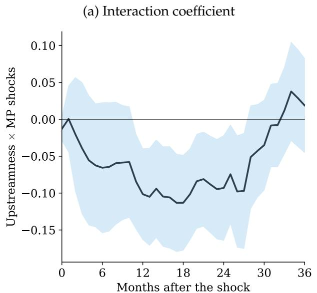

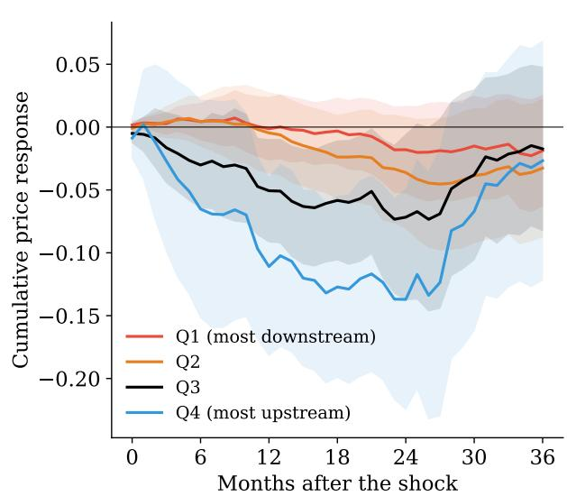  
Notes: Panel (a) plots the coefficient on the interaction between upstreamness and monetary policy shocks from Equation 27. Panel (b) plots the cumulative price response to a one-pp monetary shock for industries in each upstreamness quartile, estimated from separate local projections. Shaded bands are 90% confidence intervals based on Driscoll-Kraay standard errors.

The interpretation of the coefficients in economic magnitudes is as follows. The peak interaction coefficient is -0.113 one year and a half after the shock, and the interquartile range of upstreamness is approximately 0.25 units. Thus, per unit of the monetary shock, an industry at the 75th percentile of upstreamness exhibits a peak cumulative price response that is about 2.8 percentage points larger than an industry at the 25th percentile. The quartile estimates provide an even sharper comparison: the most upstream quartile (Q4) shows large and significant cumulative responses, while the most downstream quartile (Q1) is statistically indistinguishable from zero.

## 5.2 Quantitative fit

Having established the baseline empirical facts, I now ask whether the model from Section 2 can qualitatively capture the cross-sectional pattern. I calibrate the multi-sector model using the actual

BEA IO matrix and simulate the implied path of interaction coefficients $\beta^{h,model}$ for comparison with the estimated $\hat{\beta}^{h}$ . The calibration has two pricing parameters and a demand path. First, $\bar{\theta}$ is the average Calvo parameter governing the baseline frequency of price adjustment. Second, $\delta$ captures the cross-sectional variation in price rigidity with respect to network position $\theta_{i} = \bar{\theta} + \delta(U_{i} - \bar{U})$ , where $\bar{U}$ is the mean upstreamness. A negative $\delta$ means more upstream sectors have more flexible prices, consistent with Assumption 1. Third, the model must be fed a path for the nominal demand impulse $\hat{w}_{t}$ , which is the channel through which the monetary shock reaches sectoral marginal costs.

I discipline both $\bar{\theta}$ and $\delta$ externally, using the sectoral price-adjustment frequencies of Pasten et al. (2020), computed from the confidential micro data underlying the BLS Producer Price Index for 341 sectors. Mapping these frequencies to the upstreamness measure, I regress each sector's monthly frequency of price adjustment on its upstreamness. The slope is positive and statistically significant, implying $\hat{\delta} = -0.152$ , which means that more upstream sectors reprice more frequently. The average monthly frequency of 14.8% implies $\hat{\theta} = 0.85$ , a mean price duration of about seven months, in the range of existing producer-price estimates (Nakamura and Steinsson, 2008). Reassuringly, the same regression run on my own PPI panel yields a nearly identical slope ( $\hat{\delta} = -0.166$ ), confirming that the flexibility–upstreamness relationship is robust across the standard external dataset and the panel used in the empirical analysis. $^{34}$

For the demand impulse, rather than impose a monotone decay, I discipline its path to the empirical transmission of the monetary shock to real activity. A monetary shock affects demand with a hump-shaped, delayed profile. Estimating the cumulative response of aggregate industrial production to the Bauer-Swanson shock in my sample yields a trough at seventeen months, consistent with the well-documented hump-shaped output response to monetary shocks (e.g., Christiano et al., 2005; Romer and Romer, 2004). I therefore feed the model a demand impulse $\hat{w}_t$ with this empirically-disciplined shape (a smooth hump troughing at seventeen months). This matters because the price response inherits the timing of the demand impulse that drives it. That is, a monotone-decaying impulse mechanically produces an early price peak, whereas the empirically hump-shaped impulse produces a delayed one. The demand path is a feature of the monetary-transmission block (the Euler equation and Taylor rule with interest-rate smoothing in Subsection 2.1), not of the cross-sectional pricing mechanism.

Figure 3 presents the fit and the decomposition of the upstreamness effect. Panel (a) plots the model-implied interaction coefficient against the empirical estimates. The model reproduces all three salient features of the data: the near-zero response on impact, the gradual build-up to a peak at eighteen months, and the subsequent reversion. The model peak of -0.105 captures 93% of the empirical peak of -0.113, with both peaking at roughly one and a half years. The near-zero impact response is itself informative. It arises because the demand impulse is small on impact and builds over time, so that early on there is little for either upstream or downstream sectors to respond to. A model driven by an impulse that peaks on impact would instead counterfactually generate its largest cross-sectional dispersion at short horizons. That an externally-disciplined model—with the rigidity differential measured from independent sectoral frequencies and the demand path measured from the output response—reproduces the sign, timing, and magnitude of the cross-sectional response without fitting any parameter to it provides a credible link between the theoretical mechanism and the reduced-form evidence.

Panel (b) turns to the mechanism, decomposing the model-implied interaction coefficient into the two channels through which the network can operate. The flexibility channel—the systematic variation in price rigidity across network positions—is isolated by keeping the heterogeneous $\theta_{i}$ but removing IO linkages ( $\Gamma = 0$ ); the cost-cascade channel—the propagation of cost shocks along the production structure—is isolated by retaining $\Gamma$ but homogenizing rigidity ( $\theta_{i} = \bar{\theta}$ ). At the peak horizon the flexibility channel accounts for roughly 120% of the total interaction coefficient, while the cost-cascade channel contributes about -50%. This means that holding rigidity constant, the IO network attenuates the upstreamness differential rather than amplifying it, with the interaction of the two channels making up the remaining +30%. This sign is not an artifact of the calibration. By Proposition 4, the cost-cascade channel's cross-sectional contribution is proportional to $\mathrm{Cov}(\alpha_{i}, U_{i})$ , and in U.S. data upstream sectors are intermediate-input intensive rather than labor intensive ( $\mathrm{Corr}(U_{i}, \alpha_{i}) = -0.90$ ), so cost linkages work against the flexibility advantage of upstream sectors. The heterogeneous rigidity channel must therefore dominate for the observed pattern to emerge.

This decomposition clarifies the mechanism. The production network determines the cross-sectional distribution of nominal rigidity—network position governs whether a sector sells primarily to other firms or to final consumers, and B2B prices are empirically more flexible. This network-determined rigidity heterogeneity, rather than cost-cascade propagation, is the primary driver of the cross-sectional price response pattern. The network, however, remains essential—without it, there is no structural reason for $\theta_{i}$ to vary systematically with upstreamness—but its role is to shape the distribution of rigidity rather than to propagate price adjustments across stages. This distinction matters for policy, because structural changes that alter the composition of B2B versus B2C activity (e.g., vertical integration, platform-mediated disintermediation) change the distribution of rigidity across the network, with first-order consequences for how monetary policy transmits to prices.

The calibrated model also speaks to the aggregate implication that motivates the paper. Two economies with identical average price rigidity but different production structures display different degrees of monetary non-neutrality. I compare the aggregate (Domar-weighted) price response to a contractionary shock under the network calibration—the full BEA matrix $\Gamma$ and heterogeneous rigidity $\theta_{i} = \hat{\theta} + \hat{\delta}(U_{i} - \bar{U})$ —against a representative-firm benchmark that holds average rigidity fixed but shuts down the network ( $\Gamma = 0$ , homogeneous $\theta_{i} = \hat{\theta}$ ). The network economy generates modestly more non-neutrality. At the point of widest divergence, around one year after the shock, its cumulative price response is roughly 8% smaller in magnitude, though the two adjust at a similar pace. The gap is modest precisely because, as the decomposition above shows, the IO cost-cascade channel offsets much of the amplification coming from rigidity heterogeneity.

The Calvo framework is analytically convenient but imposes a constant, exogenous probability of price adjustment, missing the nonlinear selection channel captured by menu cost models. That is, a monetary shock pushes some firms past their adjustment thresholds and the resulting price changes can push downstream buyers past their own thresholds, triggering further adjustments. This extensive-margin selection effect is distinct from the intensive-margin cost-cascade channel analyzed in the decomposition above. The cost-cascade channel is partially offsetting in U.S. data because upstream sectors have low labor shares; the extensive-margin selection effect, by contrast, reinforces the flexibility channel because it operates more strongly for sectors that adjust more frequently, which are the upstream ones. Appendix A-III shows that a multi-sector menu cost model with Ss pricing, strategic complementarities, and IO linkages generates peak interaction coefficient of -0.125, compared to -0.105 for the externally-calibrated Calvo model and -0.113 in the data. The two pricing frictions bracket the data from below and above, indicating that the cross-sectional pattern is robust to the choice of pricing friction. $^{35}$ Both time-dependent and state-dependent models generate the hump-shaped interaction between upstreamness and monetary non-neutrality, confirming that the result is driven by the network-determined distribution of rigidity rather than the specific form of nominal rigidity. The menu cost model's primary role in the paper is not to improve the baseline fit—the Calvo model already matches the data well—but to give the asymmetry of Subsection 2.5 a structural foundation: the sign-dependent rigidity assumed there in reduced form arises endogenously from asymmetric Ss adjustment bands, under which firms are more willing to raise prices than to cut them.

Figure 3: Quantitative fit and decomposition of the upstreamness effect  
(a) Empirical estimates vs. calibrated model  
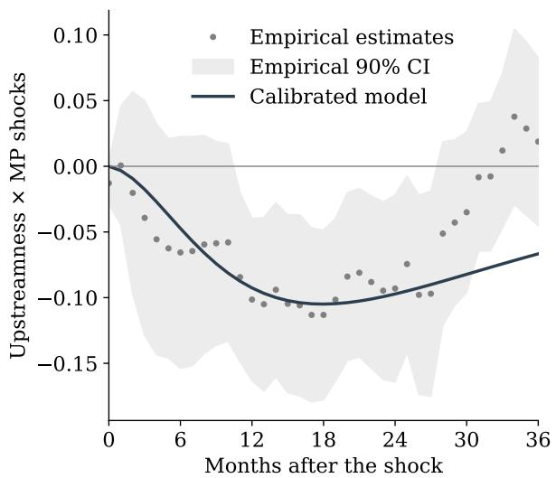

(b) Decomposition: flexibility vs. cost-cascade channel  
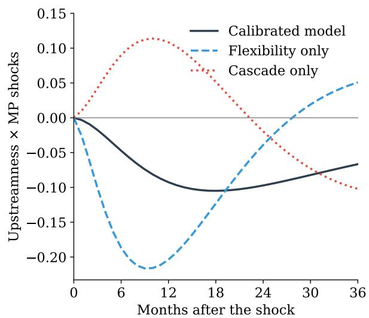  
Notes: Panel (a) plots the model-implied interaction coefficient between upstreamness and monetary policy shocks from the multi-sector Calvo model with externally calibrated rigidity differential, alongside the empirical estimate with 90% confidence band from Equation 27 ( $\bar{\theta} = 0.85$ and $\delta = -0.152$ , both disciplined externally from the Pasten et al. (2020) sectoral price-adjustment frequencies; the nominal demand impulse is disciplined to the estimated aggregate output response to the monetary shock). Panel (b) decomposes the model-implied interaction coefficient $\hat{\beta}^{h}$ into “flexibility only”, which keeps the heterogeneous $\theta_{i}$ but sets $\Gamma = 0$ ; and “cascade only”, which uses homogeneous $\theta_{i} = \bar{\theta}$ but retains the full IO matrix.

## 5.3 Asymmetric network amplification

I now turn to examine the differential effects of expansionary and contractionary monetary policy shocks. Figure 4 presents the results of the asymmetric specification in Equation 28. The point estimates suggest an asymmetry consistent with the theoretical prediction of Proposition 6: the upstreamness differential is driven predominantly by expansionary shocks. Panel (a) shows that the expansionary interaction coefficient is negative and significant at medium-to-long horizons, reaching a peak of -0.25 about 27 months after the shock. The effect builds gradually, displaying the same hump-shaped profile as the pooled baseline but with substantially larger point estimates. By contrast, the contractionary interaction coefficient is generally not significant and considerably noisier. $^{36}$

The pattern at medium horizons is consistent with the model's prediction. When the Fed eases and demand rises, upstream prices—being more flexible—increase readily. At each stage, the Phillips curve slope is the “upward” parameter $\lambda^{+}$ , which is relatively steep, so the cross-sectional differential between upstream and downstream industries is large. When the Fed tightens and demand falls, each stage faces the flatter “downward” slope $\lambda^{-} < \lambda^{+}$ , attenuating the differential response. Proposition 6 shows that the ratio of the expansionary to contractionary differential exceeds one and is increasing in the number of production stages, so the asymmetry is amplified along longer supply chains.

Figure 4: Asymmetric effects from expansionary and contractionary monetary shocks  
(a) Asymmetric interaction coefficients  
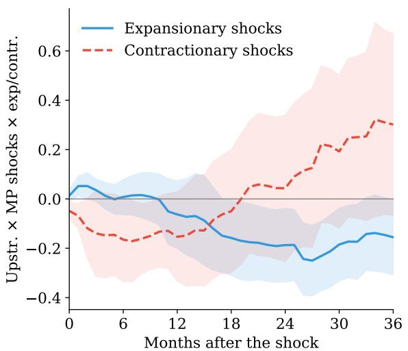

(b) Cross-sectional evidence  
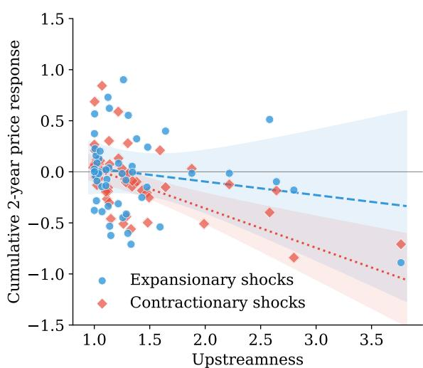  
Notes: Panel (a) plots the coefficient on the interaction term between upstreamness and monetary policy shocks with a dummy for whether the shock is expansionary or contractionary from the asymmetric specification in Equation 28. Panel (b) plots each industry's cumulative price response two years after the shock against its upstreamness, estimated separately on months with expansionary shocks and contractionary shocks; the vertical axis is truncated at $\pm 1.5$ ; three observations fall outside this range (two expansionary, one contractionary). Shaded bands are $90\%$ confidence intervals based on Driscoll-Kraay standard errors.

Panel (b) of Figure 4 provides cross-sectional corroboration. For each industry, I estimate the cumulative 2-year price response to a one-unit monetary shock separately for expansionary and contractionary shocks. During expansionary episodes, the negative relationship between upstreamness and the price response is clearly visible, with more upstream industries exhibiting larger cumulative price changes. During contractionary episodes, the cross-sectional relationship is flatter and noisier, consistent with the panel results in panel (a).

The finding of asymmetry provides micro-founded, cross-sectional evidence for a pattern that has long been documented at the aggregate level: prices rise more readily than they fall. My results show that when price flexibility varies systematically with network position, the cross-sectional dispersion in price responses is larger following expansionary shocks than contractionary ones. The mechanism speaks to the broader macroeconomic puzzle of why disinflation is costly while inflation can accelerate rapidly. Rate cuts generate large cross-sectional price dispersion as more flexible upstream prices increase readily; rate hikes encounter the flatter downward Phillips curve slope, muting the cross-sectional differential. This asymmetry in the transmission mechanism implies that central banks face a harder task when tightening than when easing—a feature that standard models abstracting from production structure cannot capture. $^{37}$

The asymmetric estimates can be used to back out implied structural parameters under the model's restrictions. Under the asymmetric Calvo model, the asymmetry ratio $\mathcal{R}_K$ from Equation 25 decomposes into an own-flexibility factor $r^+(1-r^+)/[r^-(1-r^-)]$ and a network factor that grows with the effective chain length $\bar{K}$ . The ratio of the expansionary peak coefficient (at $h=27$ ) to the pooled peak (at $h=18$ ), $|\hat{\beta}_{27}^{h,-}|/|\hat{\beta}_{18}^h| \approx 2.2$ , combined with the median upstreamness $\bar{K} \approx 2$ , implies an own-flexibility factor of roughly 2.2 (since the network factor equals one at $\bar{K}=2$ ). This back-of-the-envelope calculation is illustrative rather than an estimate, since the two coefficients are measured at different horizons. Solving $r^+(1-r^+)/[r^-(1-r^-)] = 2.2$ for the ratio of adjustment probabilities suggests that the probability of upward price adjustment is roughly twice the probability of downward adjustment, in line with the central estimates in Peltzman (2000) and Nakamura and Steinsson (2008), who document ratios close to two.

## 5.4 Real activity implications

The preceding analysis documents that upstream industries exhibit larger cumulative price adjustments following monetary shocks. A natural question is whether this differential price flexibility also shapes the cross-sectional distribution of real activity responses. The New Keynesian framework predicts that industries whose prices adjust more flexibly should absorb monetary shocks primarily through price changes, preserving real output; industries with sticky prices instead absorb shocks through quantity rationing. Because upstream industries have more flexible prices, they should experience smaller output declines following a contractionary monetary shock and smaller output expansions following an easing—a mirror image of the price results.

To test this prediction, I estimate the same local projection interaction specification using cumulative log growth in sector-level industrial production (IP) as the dependent variable:

$$
\Delta^ {h} y _ {i t} ^ {I P} = \alpha_ {i} ^ {h} + \beta^ {h, I P} (U _ {i} \times \varepsilon_ {t} ^ {m}) + \gamma^ {h} U _ {i} + \delta^ {h} \varepsilon_ {t} ^ {m} + \rho^ {h} \Delta y _ {i, t - 1} ^ {I P} + u _ {i t} ^ {h},\tag{29}
$$

where $\Delta^{h}y_{it}^{IP} = \log IP_{i,t+h} - \log IP_{i,t}$ is the cumulative log IP growth from t to $t + h$ . Sector-level IP indices are available from FRED for all 20 three-digit NAICS manufacturing sectors (311–339), providing a direct real-side counterpart to the PPI-based price regressions. $^{38}$ Because IP is measured at the three-digit NAICS level—a coarser classification than the six-digit level used in the price analysis—the sector × time fixed effects used in the price regressions cannot be included here (they would be collinear with the industry fixed effects). The specification therefore uses industry fixed effects only, with the monetary shock main effect included as a regressor. The coarser IP classification reduces the cross-sectional sample from 271 to 20 industries and limits the within-sector variation in upstreamness available for identification, so the IP results should be interpreted as providing directional evidence rather than precise estimates. The model predicts that, conditional on the aggregate shock, more upstream industries should exhibit relatively larger (i.e., less negative) output responses, because their greater price flexibility shields real activity from quantity adjustment. I also estimate the asymmetric version of Equation 29, replacing the single interaction with separate expansionary and contractionary terms as in Equation 28.

Figure 5: Effects on industrial production  
(a) Symmetric specification  
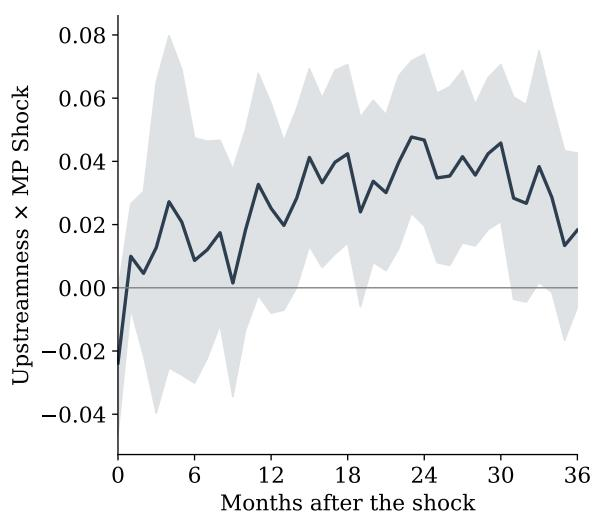

(b) Asymmetric specification  
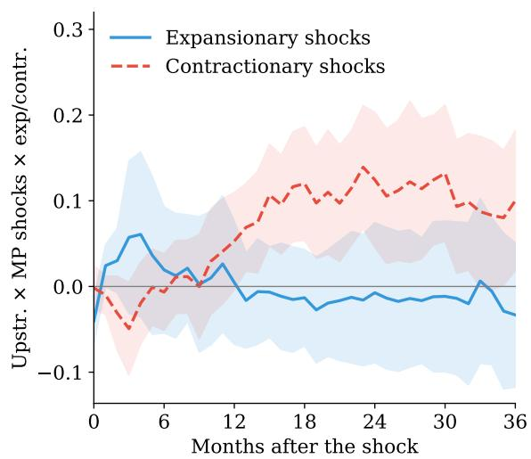  
Notes: Panel (a) plots the coefficient on the interaction coefficient between upstreamness and monetary policy shocks from Equation 29. Panel (b) plots the coefficient on the interaction term between upstreamness and monetary policy shocks with a dummy for whether the shock is expansionary or contractionary. Shaded bands are $90\%$ confidence intervals based on Driscoll-Kraay standard errors. IP indices are winsorized at the 1st and 99th percentiles within each industry.

Figure 5 presents the results. Panel (a) shows the symmetric interaction coefficient for industrial production. The point estimates are positive and statistically significant at medium-to-long horizons. At the peak, the coefficient implies that a manufacturing sector at the 75th percentile of upstreamness experiences a cumulative output decline roughly 1.8 percentage points smaller than one at the 25th percentile, in response to a one percentage point contractionary monetary shock. The direction is consistent with the model's prediction that upstream industries—whose prices adjust more quickly—experience relatively smaller output declines following monetary shocks. The estimates are noisier than the price regressions, which is expected as the IP cross-section contains only 20 three-digit NAICS sectors versus 271 six-digit industries in the price analysis, reducing statistical power. $^{39}$

Panel (b) decomposes the IP interaction into expansionary and contractionary episodes. The contractionary interaction is large and significant one year after the shock. By contrast, the expansionary interaction is uniformly small and insignificant. This pattern is the real-side complement of the price asymmetry in Subsection 5.3, not its repetition. In line with the New Keynesian framework, during contractions upstream industries cut prices more aggressively and, because they adjust through prices, they preserve real output. Downstream industries, whose prices are rigid, instead absorb the shock through quantity rationing—their output falls more. Price flexibility substitutes for quantity adjustment, so cross-sectional dispersion shows up on the price side under expansionary shocks (when prices move readily) and on the output side under contractionary shocks (when downward price rigidity forces output to bear the adjustment), consistent with the asymmetric price rigidity mechanism in the model.

## 5.5 Supply chain price cascades

I have established that upstream industries exhibit larger cumulative price responses to monetary shocks and that the cross-sectional pattern is primarily driven by network-determined rigidity heterogeneity rather than cost-cascade propagation through IO linkages. Nevertheless, the model predicts that upstream price adjustments do propagate to downstream industries through intermediate input costs, even if this channel is not the primary driver of the upstreamness differential. I provide auxiliary evidence on this cost pass-through channel using a cascade regression that controls for realized supplier prices. $^{40}$

For each industry i and month t, I construct the input-cost-weighted cumulative change in supplier prices:

$$
\Delta^ {h} \bar {p} _ {i t} ^ {\mathrm{supplier}} = \sum_ {k = 1} ^ {N} \gamma_ {i k} \Delta^ {h} p _ {k t},\tag{30}
$$

where $\gamma_{ik}$ is the cost share of inputs from sector $k$ in industry $i$ 's production (from the IO table) and $\Delta^h p_{kt}$ is the cumulative log price change in sector $k$ over horizon $h$ . For each horizon $h = 0,1,\ldots ,H$ , I estimate the local projection:

$$
\Delta^ {h} p _ {i t} = \alpha_ {i} ^ {h} + \mu_ {s (i), t} ^ {h} + \phi^ {h} \Delta^ {h} \bar {p} _ {i t} ^ {\mathrm{supplier}} + \beta^ {h, \mathrm{net}} (U _ {i} \times \varepsilon_ {t} ^ {m}) + \rho^ {h} \Delta p _ {i, t - 1} + u _ {i t} ^ {h}.\tag{31}
$$

The coefficient $\phi^{h}$ captures the pass-through from upstream supplier prices to downstream industry prices—the supply chain cascade. The coefficient $\beta^{h,net}$ captures any residual effect of network position beyond what operates through the supplier price channel.

Figure 6 visualizes the cascade results. $^{41}$ Panel (a) shows a large, positive supplier price coefficient, indicating that upstream price changes pass through to downstream industries via the cost-cascade channel. A one-unit increase in the input-cost-weighted supplier price index raises the downstream industry's own price by 0.18–0.40 units over the first six months and reaches about 0.74 by eighteen months—substantial but incomplete pass-through, dampened initially by nominal rigidities and reverting somewhat thereafter as the monetary impulse dissipates. $^{42}$ The residual upstreamness interaction—any effect beyond the supplier price channel—remains negative and statistically significant at intermediate horizons, even on the much smaller IO-coverage sample. That a pure input-output construct like the input-cost-weighted supplier price enters strongly and predicts downstream price changes points to genuine network propagation rather than an omitted industry characteristic. At the same time, the upstreamness interaction is not fully absorbed by the supplier price, indicating that the differential does not operate solely through measured input-cost pass-through—consistent with the flexibility channel being its primary driver (Subsection 5.2). The supplier price variable itself reflects both the flexibility channel (more flexible upstream sectors adjust faster) and the cost-cascade channel that transmits those adjustments downstream, so it cannot by itself distinguish between them.

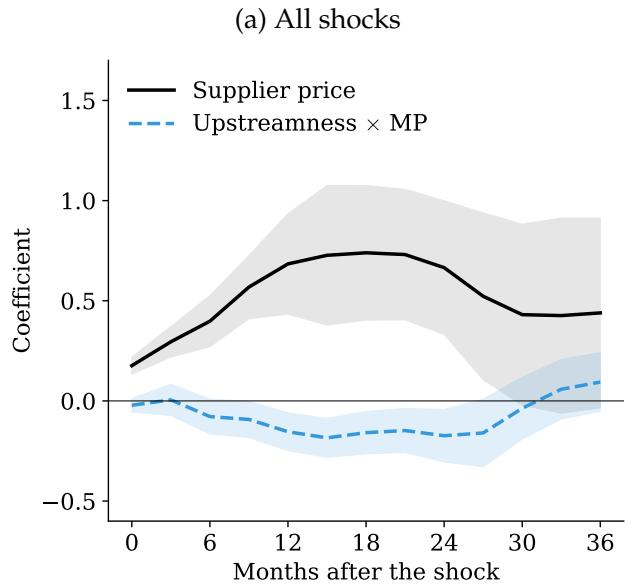

(b) Expansionary vs. contractionary shocks  
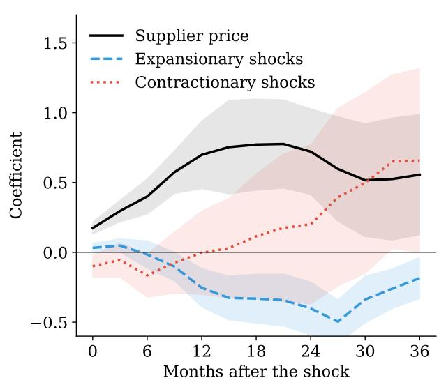  
Notes: Panel (a) plots the coefficient on supplier prices and the coefficient on the interaction term between upstreamness and monetary policy shocks capturing any residual effect of the network position from the cascade regression in Equation 31. Panel (b) plots the coefficient on supplier prices and the coefficient on the interaction term between upstreamness and monetary policy with a dummy for whether the shock is expansionary or contractionary. Shaded bands are 90% confidence intervals based on Driscoll-Kraay standard errors.

Panel (b) examines the residual interaction in response to expansionary and contractionary monetary policy shocks. Consistent with the asymmetric results from Subsection 5.3, the cascade mechanism is driven almost entirely by expansionary shocks. The expansionary interaction coefficient is large, negative, and significant at horizons beyond 10 months, while the contractionary interaction is statistically insignificant. Together, the two panels of Figure 6 are consistent with costs propagating through buyer-seller linkages, with the propagation concentrated in expansionary episodes where upward price flexibility allows rapid cost pass-through.

## 5.6 Input intensity and network neighbors

The cost-propagation channel predicts two further testable implications. First, the upstreamness effect should be amplified for industries with higher intermediate input shares, since these industries are more exposed to upstream cost pass-through. Second, an industry's price response should depend not only on its own upstreamness but also on the upstreamness of its suppliers—a direct test of network propagation.

To test for input share amplification, I augment the baseline specification with a triple interaction between upstreamness, intermediate input share, and the monetary shock:

$$
\Delta^ {h} p _ {i t} = \alpha_ {i} ^ {h} + \mu_ {s (i), t} ^ {h} + \beta_ {1} (U _ {i} \times \varepsilon_ {t} ^ {m}) + \beta_ {2} (U _ {i} \times \alpha_ {i} ^ {I I} \times \varepsilon_ {t} ^ {m}) + \beta_ {3} (\alpha_ {i} ^ {I I} \times \varepsilon_ {t} ^ {m}) + \rho^ {h} \Delta p _ {i, t - 1} + u _ {i t} ^ {h}.\tag{32}
$$

The specification includes the lower-order interaction $\alpha_{i}^{II} \times \varepsilon_{t}^{m}$ to ensure that $\hat{\beta}_{2}$ captures the marginal effect of input intensity conditional on the direct effect of intermediate input share on monetary transmission. If cost pass-through operates through buyer-seller linkages, $\hat{\beta}_{2}$ should be negative, as higher input intensity amplifies the transmission of upstream price changes. Panel (a) of Figure 7 plots the triple interaction coefficient $\hat{\beta}_{2}$ . The estimates are generally negative and statistically significant during the second year after the shock. Industries that are both upstream and input-intensive respond more strongly, and the amplification builds over medium horizons as cost pass-through accumulates through the production chain.

I now turn to the effect of the upstreamness of the suppliers. To test for it, I replace the industry's own upstreamness with the input-cost-weighted average upstreamness of its suppliers:

$$
\bar {U} _ {i} ^ {\mathrm{supplier}} = \sum_ {k} \gamma_ {i k} U _ {k},\tag{33}
$$

where $\gamma_{ik}$ is the share of industry i's intermediate inputs purchased from industry k. I then estimate the local projection with $\bar{U}_{i}^{supplier} \times \varepsilon_{t}^{m}$ as the interaction variable. If the network mechanism operates through supplier linkages rather than some omitted industry characteristic correlated with own upstreamness, this “network neighbor” variable should predict price responses. Panel (b) of Figure 7 is consistent with the supplier-weighted prediction: the interaction is negative and statistically significant during the second year after the shock. The fact that supplier network position—a variable determined entirely by the IO structure of the economy—predicts own-industry price responses is suggestive of network propagation rather than an omitted characteristic of individual sectors. $^{43}$

Figure 7: Amplification of network effects  
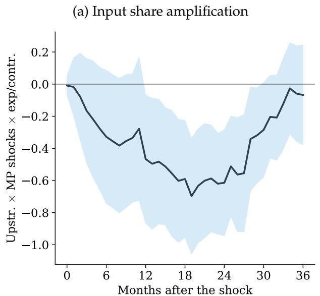

(b) Supplier-weighted upstreamness  
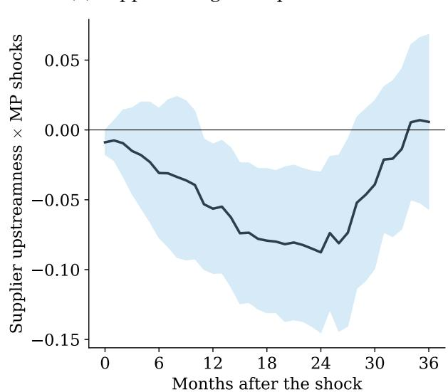  
Notes: Panel (a) plots the coefficient on the interaction term between upstreamness, input share, and monetary policy shocks. Panel (b) plots the coefficient on the interaction term between supplier-weighted upstreamness and monetary policy shocks. Shaded bands are 90% confidence intervals based on Driscoll-Kraay standard errors.

## 6 Robustness and extensions

I assess the robustness of the main findings along several dimensions.

Lags, controls, and functional form I start by examining the robustness of the coefficient on the interaction term between upstreamness and monetary policy shocks to using a richer lag structure for the dependent variable and adding lags of the monetary policy shocks. The results are virtually unchanged. Also, I include some typical macro controls (i.e., CPI inflation, industrial production growth, the change in unemployment, and M2 growth), and find similar results. Finally, I also find consistent results when I replace the measure of upstreamness with its log, confirming that the linear specification is not imposing an overly restrictive functional form. Table A8 of Appendix A-V reports all the estimates.

Measurement I then test the robustness of the results to using other network measures and identification strategies of monetary policy shocks. Table 2 reports results using alternative specifications at the 18-month horizon, which corresponds to the peak of the cumulative price response. Columns (1) through (3) use the Bauer-Swanson shock interacted with alternative network position measures: upstreamness (column 1, baseline), eigenvector centrality (column 2), and the intermediate input share (column 3). Column (4) uses the Jarociński and Karadi (2020) monetary policy shock, which separates pure monetary policy surprises from central bank information effects using sign restrictions on the co-movement of interest rates and stock prices around FOMC announcements, on an extended sample through December 2024. These estimates confirm that the interaction is not driven by a particular choice of network measure or shock identification.

Table 2: Alternative network measures and monetary policy identification

<table><tr><td></td><td>Upstreamness(1)</td><td>Centrality(2)</td><td>Intm. Share(3)</td><td>JK MP Shocks(4)</td></tr><tr><td>Network measure × MP shocks</td><td>-0.113***(0.039)</td><td>-0.384***(0.131)</td><td>-0.728***(0.280)</td><td>-0.153**(0.059)</td></tr><tr><td>Observations</td><td>69,772</td><td>69,772</td><td>69,772</td><td>69,772</td></tr><tr><td> $R^2$ </td><td>0.003</td><td>0.003</td><td>0.003</td><td>0.004</td></tr></table>

Notes: The dependent variable is the 18-month cumulative price change. Columns (1)–(3) use the Bauer-Swanson shock interacted with alternative network position measures: upstreamness (column 1, baseline), eigenvector centrality (column 2), and intermediate input share (column 3). Column (4) uses the Jarociński and Karadi (2020) monetary policy shocks, which decomposes high-frequency FOMC surprises into pure monetary policy and central bank information components, on an extended sample through 2024. All specifications include industry fixed effects, sector-time fixed effects, and a PPI inflation lag. Driscoll-Kraay standard errors in parentheses. \*\*\*p < 0.01; \*\*p < 0.05; \*p < 0.10.

Industry characteristics A natural concern is that upstreamness may proxy for other industry characteristics. For example, labor intensity, energy cost exposure, intermediate input dependence, or international trade exposure can independently generate differential price responses to monetary shocks. Table 3 addresses this through horse-race regressions that include competing interaction terms alongside the upstreamness interaction. Columns (2)–(5) add each confounder individually, and the final column includes all confounders simultaneously. The coefficient on the interaction between upstreamness and monetary policy shocks remains significant across all specifications, indicating that the network position effect is not driven by these industry characteristics. In particular, the inclusion of trade exposure mitigates the concern that the differential price response merely reflects upstream industries' greater exposure to global commodity markets and exchange rate pass-through. $^{44}$ The energy cost share control is especially relevant for the concern that upstream industries' prices respond to monetary shocks through commodity-price channels rather than through the network mechanism. In a separate specification that includes only the energy share interaction alongside upstreamness (not reported in the table), the upstreamness coefficient retains roughly 80% of its baseline magnitude at the peak horizon, while the energy share interaction is not significant at any horizon. This mitigates the concern that commodity-price exposure is the primary driver of the cross-sectional pattern.

Table 3: Including controls for industry characteristics

<table><tr><td></td><td>(1)</td><td>(2)</td><td>(3)</td><td>(4)</td><td>(5)</td><td>(6)</td></tr><tr><td>Upstreamness × MP shocks</td><td>-0.113***(0.039)</td><td>-0.104***(0.037)</td><td>-0.105***(0.038)</td><td>-0.102***(0.036)</td><td>-0.112***(0.039)</td><td>-0.090***(0.034)</td></tr><tr><td>Labor share × MP shocks</td><td></td><td>0.619***(0.232)</td><td></td><td></td><td></td><td>0.468**(0.205)</td></tr><tr><td>Energy share × MP shocks</td><td></td><td></td><td>-0.153(0.122)</td><td></td><td></td><td>-0.148(0.120)</td></tr><tr><td>Intm. share × MP shocks</td><td></td><td></td><td></td><td>-0.537**(0.227)</td><td></td><td>-0.361*(0.201)</td></tr><tr><td>Trade exposure × MP shocks</td><td></td><td></td><td></td><td></td><td>-0.034(0.094)</td><td>-0.041(0.091)</td></tr><tr><td>Observations</td><td>69,772</td><td>69,772</td><td>69,772</td><td>69,772</td><td>69,772</td><td>69,772</td></tr><tr><td> $R^2$ </td><td>0.003</td><td>0.004</td><td>0.003</td><td>0.004</td><td>0.003</td><td>0.004</td></tr></table>

Notes: The dependent variable is the 18-month cumulative price change. Column (1) is the baseline (upstreamness × MP shock only). Columns (2)–(5) add one confounder at a time: labor share, energy cost share, intermediate input share, and trade exposure, each interacted with the monetary policy shock. Column (6) includes all confounders simultaneously. All specifications include industry fixed effects, sector-time fixed effects, and a PPI inflation lag. Driscoll-Kraay standard errors in parentheses. \*\*\* p < 0.01; \*\* p < 0.05; \* p < 0.10.

While the results in Table 3 are reassuring, upstreamness might still proxy for some other industry characteristic that is harder to control for and that generates differential price dynamics even absent monetary shocks. To mitigate this concern, I estimate the interaction term between upstreamness and the monetary policy shocks at negative horizons (starting in $h = -12, \ldots, -2$ ). Under the null hypothesis that upstreamness is pre-determined with respect to the monetary shock, $\beta^{h}$ should be zero at negative horizons. Finding significant pre-trends would indicate that the interaction of network position with the monetary shock captures pre-existing differences in price dynamics rather than causal effects. $^{45}$ At all negative horizons, the estimated coefficients are small in magnitude and statistically indistinguishable from zero, with point estimates clustered near zero and confidence bands comfortably covering the null (Table A9 of Appendix A-V). This suggests that the differential price response after the monetary policy shock is triggered by the shock itself rather than by any pre-existing trend in relative prices across upstream and downstream sectors.

Manufacturing subsample and industry outliers The baseline specification pools all 271 industries with available PPI data, including both manufacturing and non-manufacturing sectors. A natural question is whether the upstreamness effect is specific to manufacturing. I repeat the main analysis on the manufacturing subsample (209 industries, NAICS 311–339), finding consistent results (Table A10 of Appendix A-V).

The full cross-section provides substantial protection against the influence of individual industries on the results. However, there could be industries that drive the results. For example, one candidate for concern is “Petroleum and Coal Products”, which has high upstreamness and is subject to large oil-price-driven price swings. Thus, I perform a leave-one-out analysis, re-estimating the baseline specification 271 times, each time dropping a different industry. The distribution of leave-one-out estimates one year and a half after the shock is tightly concentrated around the baseline point estimate (Figure A3 of Appendix A-V), confirming that no single industry drives the results.

Placebo test To ensure that the results are not an artifact of the empirical methodology, I randomly permute the upstreamness rankings across industries 200 times and re-estimate Equation 27. At the horizons where the main results are significant (6–24 months), the actual estimate lies far in the tail of the permutation distribution, well beyond the 5th and 95th percentile bounds (Figure A4 of Appendix A-V). This confirms that it is the specific pattern of upstreamness in the real IO table—not an arbitrary industry ranking—that generates the differential price response.

Sub-samples I also verify that the results are not driven by any particular episode. Table A11 of Appendix A-V reports the estimates a year and a half after the shock across different sub-samples. The pre-crisis sub-sample (through 2010) yields a coefficient of -0.073, the post-crisis sub-sample (2011 onward) yields -0.118, and the sub-sample excluding the COVID period (through December 2019) yields -0.104, all statistically significant. The stability of the estimates across sub-periods supports the interpretation that the network amplification mechanism is a structural feature of the economy.

Demand cyclicality A concern is that upstream industries within a 3-digit sector may have inherently more volatile demand—for example, because their customers in capital goods are more interest-rate sensitive—and this demand cyclicality, rather than the network mechanism, drives the interaction coefficient. To address this, I compute each industry's PPI volatility in the early sample (1998–2002) and include its interaction with the monetary shock as an additional control. The sample drops to 42,000 observations because some industries entered BLS PPI coverage after 2002; in this restricted sample, the upstreamness interaction retains its sign, though it falls to roughly half its baseline size (-0.055 at h = 18, compared to -0.113 in the baseline), and the PPI volatility control itself is not significant at any horizon. The reduction in both magnitude and precision reflects the much smaller sample; the insignificance of the volatility control indicates that demand cyclicality does not account for the upstreamness effect.

## 7 Conclusion

This paper shows that the production network is a first-order determinant of how monetary policy transmits to prices. More upstream industries—those farther from final demand in the IO tables—exhibit significantly larger cumulative price responses to identified monetary shocks. A multi-sector New Keynesian model with IO linkages rationalizes this finding by showing that the network position determines each sector's customer composition (B2B versus B2C), which in turn determines its price flexibility. A counterfactual decomposition shows that this network-determined rigidity heterogeneity, rather than cost-cascade propagation through IO linkages, is the primary driver of the cross-sectional pattern.

The paper also shows that this cross-sectional pattern operates asymmetrically. Cumulated over the one-to-two-year window, the upstreamness differential following expansionary shocks is large and negative while the contractionary differential is near zero. This asymmetry, driven by asymmetric price rigidity interacting with the network-determined rigidity differential, provides micro-founded, cross-sectional evidence for why inflation accelerates more easily than it decelerates. For central banks, the production network creates a structural asymmetry in the transmission mechanism, whereby rate cuts generate larger cross-sectional price dispersion than rate hikes.

Because the distribution of price rigidity is endogenous to network structure, average rigidity is no longer a sufficient statistic for monetary potency, and tracking how the network evolves over time becomes part of the inflation-monitoring problem. In this regard, two long-running shifts are particularly relevant. As the services share of GDP continues to rise, the economy moves toward sectors that are both more downstream and stickier, widening the upstream-downstream wedge that drives the patterns documented here. As global value chains lengthen or re-shore, the number of intermediate links between producers and consumers changes, and with it the room for asymmetric rigidity to compound stage by stage.

## References

ACEMOGLU, D., CARVALHO, V. M., OZDAGLAR, A. and TAHBAZ-SALEHI, A. (2012). The network origins of aggregate fluctuations. Econometrica, 80 (5), 1977–2016.

AFROUZI, H. and BHATTARAI, S. (2024). Inflation and GDP dynamics in production networks: A sufficient statistics approach. NBER Working Paper No. 31218.

ANTRÀS, P., CHOR, D., FALLY, T. and HILLBERRY, R. (2012). Measuring the upstreamness of production and trade flows. American Economic Review, 102 (3), 412–416.

ATALAY, E. (2017). How important are sectoral shocks? American Economic Journal: Macroeconomics, 9 (4), 254–280.

BAQAEE, D. R. and FARHI, E. (2019). The macroeconomic impact of microeconomic shocks: Beyond Hulten's theorem. Econometrica, 87 (4), 1155–1203.

— and — (2020). Productivity and misallocation in general equilibrium. The Quarterly Journal of Economics, 135 (1), 105–163.

BARROT, J.-N. and SAUVAGNAT, J. (2016). Input specificity and the propagation of idiosyncratic shocks in production networks. The Quarterly Journal of Economics, 131 (3), 1543–1592.

BASU, S. (1995). Intermediate goods and business cycles: Implications for productivity and welfare. American Economic Review, 85 (3), 512–531.

BAUER, M. D. and SWANSON, E. T. (2023). An alternative explanation for the “Fed information effect”. American Economic Review, 113 (3), 664–700.

BILS, M. and KLENOW, P. J. (2004). Some evidence on the importance of sticky prices. Journal of Political Economy, 112 (5), 947–985.

CABALLERO, R. J. and ENGEL, E. M. R. A. (1999). Explaining investment dynamics in U.S. manufacturing: A generalized (S,s) approach. Econometrica, 67 (4), 783–826.

CALVO, G. A. (1983). Staggered prices in a utility-maximizing framework. Journal of Monetary Economics, 12 (3), 383–398.

CARVALHO, C. (2006). Heterogeneity in price stickiness and the real effects of monetary shocks. The B.E. Journal of Macroeconomics, 6 (1), 1–58.

CARVALHO, V. M. (2014). From micro to macro via production networks. Journal of Economic Perspectives, 28 (4), 23–48.

—, NIREI, M., SAITO, Y. U. and TAHBAZ-SALEHI, A. (2021). Supply chain disruptions: Evidence from the great East Japan earthquake. The Quarterly Journal of Economics, 136 (2), 1255–1321.

— and SCHWARTZMAN, F. (2015). Selection and monetary non-neutrality in time-dependent pricing models. Journal of Monetary Economics, 76, 141–156.

— and TAHBAZ-SALEHI, A. (2019). Production networks: A primer. Annual Review of Economics, 11, 635–663.

CAVALLO, A., LIPPI, F. and MIYAHARA, K. (2024). Large and small price changes. American Economic Review, forthcoming.

CHRISTIANO, L. J., EICHENBAUM, M. and EVANS, C. L. (2005). Nominal rigidities and the dynamic effects of a shock to monetary policy. Journal of Political Economy, 113 (1), 1–45.

GABAIX, X. (2011). The granular origins of aggregate fluctuations. Econometrica, 79 (3), 733–772.

GALÍ, J. (2015). Monetary Policy, Inflation, and the Business Cycle: An Introduction to the New Keynesian Framework and Its Applications. Princeton, NJ: Princeton University Press, 2nd edn.

GHASSIBE, M. (2023). Monetary policy and production networks: An empirical investigation. Journal of Monetary Economics, 133, 140–159.

— (2025). Endogenous Production Networks and Non-Linear Monetary Transmission. Tech. rep., University of Oxford, working paper.

GOLOSOV, M. and LUCAS, R. E., JR. (2007). Menu costs and Phillips curves. Journal of Political Economy, 115 (2), 171–199.

GOPINATH, G. and ITSKHOKI, O. (2010). Frequency of price adjustment and pass-through. The Quarterly Journal of Economics, 125 (2), 675–727.

JAROCIŃSKI, M. and KARADI, P. (2020). Deconstructing monetary policy surprises—the role of information shocks. American Economic Journal: Macroeconomics, 12 (2), 1–43.

JORDÀ, O. (2005). Estimation and inference of impulse responses by local projections. American Economic Review, 95 (1), 161–182.

KEHOE, P. and MIDRIGAN, V. (2015). Prices are sticky after all. Journal of Monetary Economics, 75, 35–53.

LA'O, J. and TAHBAZ-SALEHI, A. (2022). Optimal monetary policy in production networks. Econometrica, 90 (3), 1295–1336.

LONG, J. B., JR. and PLOSSER, C. I. (1983). Real business cycles. Journal of Political Economy, 91 (1), 39–69.

MANKIW, N. G. and REIS, R. (2002). Sticky information versus sticky prices: A proposal to replace the New Keynesian Phillips Curve. Quarterly Journal of Economics, 117 (4), 1295–1328.

MIDRIGAN, V. (2011). Menu costs, multiproduct firms, and aggregate fluctuations. Econometrica, 79 (4), 1139–1180.

MINTON, R. and WHEATON, B. (2023). Delayed inflation in supply chains: Theory and evidence. Working Paper.

NAKAMURA, E. and STEINSSON, J. (2008). Five facts about prices: A reevaluation of menu cost models. The Quarterly Journal of Economics, 123 (4), 1415–1464.

— and — (2010). Monetary non-neutrality in a multisector menu cost model. The Quarterly Journal of Economics, 125 (3), 961–1013.

— and — (2018). High-frequency identification of monetary non-neutrality: The information effect. The Quarterly Journal of Economics, 133 (3), 1283–1330.

OZDAGLI, A. K. and WEBER, M. (2025). Monetary policy through production networks: Evidence from the stock market. The Review of Financial Studies, advance article.

PASTEN, E., SCHOENLE, R. and WEBER, M. (2020). The propagation of monetary policy shocks in a heterogeneous production economy. Journal of Monetary Economics, 116, 1–22.

PASTÉN, E., SCHOENLE, R. and WEBER, M. (2024). Sectoral heterogeneity in nominal price rigidity and the origin of aggregate fluctuations. American Economic Journal: Macroeconomics, 16 (2), 1–41.

PELTZMAN, S. (2000). Prices rise faster than they fall. Journal of Political Economy, 108 (3), 466–502.

PLAGBORG-M∅LLER, M. and WOLF, C. K. (2021). Local projections and VARs estimate the same impulse responses. Econometrica, 89 (2), 955–980.

ROMER, C. D. and ROMER, D. H. (2004). A new measure of monetary shocks: Derivation and implications. American Economic Review, 94 (4), 1055–1084.

RUBBO, E. (2023). Networks, Phillips curves, and monetary policy. Econometrica, 91 (4), 1417–1455.

TENREYRO, S. and THWAITES, G. (2016). Pushing on a string: US monetary policy is less powerful in recessions. American Economic Journal: Macroeconomics, 8 (4), 43–74.

WOODFORD, M. (2003). Interest and Prices: Foundations of a Theory of Monetary Policy. Princeton, NJ: Princeton University Press.

## A-I Proofs

This appendix provides formal proofs of the propositions stated in the main text.

## A-I.1 Proof of Proposition 1: sectoral Phillips curves

Consider sector i with Calvo parameter $\theta_{i}$ . In each period, a fraction $1 - \theta_{i}$ of firms reset their price. A resetting firm j chooses $p_{ijt}^{*}$ to maximize

$$
\mathbb {E} _ {t} \sum_ {s = 0} ^ {\infty} (\beta \theta_ {i}) ^ {s} \left[ p _ {i j t} ^ {*} y _ {i j, t + s} - \mathrm{TC} _ {i j, t + s} (y _ {i j, t + s}) \right].\tag{34}
$$

The first-order condition equates the expected present value of the markup to the desired markup. Log-linearizing around the zero-inflation steady state:

$$
\hat {p} _ {i j t} ^ {*} = (1 - \beta \theta_ {i}) \sum_ {s = 0} ^ {\infty} (\beta \theta_ {i}) ^ {s} \mathbb {E} _ {t} \left[ \widehat {m c} _ {i, t + s} + \hat {p} _ {i, t + s} \right],\tag{35}
$$

where $\widehat{mc}_{i,t+s}$ is the log deviation of real marginal cost.

The Cobb-Douglas production function in Equation 3, evaluated at the zero-inflation steady state with $\hat{z}_{it} = 0$ (no sectoral productivity shocks), implies that the log-linearized nominal marginal cost is

$$
\widehat {n m c} _ {i t} = \alpha_ {i} \hat {w} _ {t} + \sum_ {k = 1} ^ {N} \gamma_ {i k} \hat {p} _ {k t},\tag{36}
$$

so the real marginal cost relative to sector $i$ 's own price is $\widehat{mc}_{it} = \alpha_i \hat{w}_t + \sum_k \gamma_{ik} \hat{p}_{kt} - \hat{p}_{it}$ .

The CES price index for sector i evolves as $\hat{p}_{it} = \theta_{i}\hat{p}_{i,t-1} + (1 - \theta_{i})\hat{p}_{it}^{*}$ . Combining the optimal reset price, the marginal cost expression, and the price index law of motion yields the sectoral Phillips curve in Equation 6 with slope $\lambda_{i} = (1 - \theta_{i})(1 - \beta\theta_{i})/\theta_{i}$ .

## A-I.2 Proof of Proposition 2: network-adjusted rigidity

The aggregate gross-output price index is defined as the Domar-weighted sum of sectoral prices: $\hat{P}_{t} = \sum_{i=1}^{N} \xi_{i} \hat{p}_{it}$ , where the Domar weight $\xi_{i} = Y_{i}/GDP$ is the ratio of sector i's gross output to GDP.

Differentiating with respect to the monetary shock $\varepsilon_{t}^{m}$ :

$$
\frac {\partial \hat {P} _ {t + h}}{\partial \varepsilon_ {t} ^ {m}} = \sum_ {i = 1} ^ {N} \xi_ {i} \cdot \frac {\partial \hat {p} _ {i , t + h}}{\partial \varepsilon_ {t} ^ {m}},\tag{37}
$$

which is Equation 9. The output effect follows from the quantity theory in log-deviations: $\hat{Y}_{t+h} = \hat{D}_{t+h} - \hat{P}_{t+h}$ , where $\hat{D}_{t+h}$ captures the nominal demand impulse. Output non-neutrality ( $\hat{Y}_{t+h} \neq 0$ ) requires $\hat{P}_{t+h} \neq \hat{D}_{t+h}$ , which obtains when the Domar-weighted price level adjusts slowly.

The alignment result (Corollary 1) follows from the observation that sectors with higher $\theta_{i}$ (more rigid prices) have smaller $\lambda_{i}$ (flatter Phillips curves) and hence slower price adjustment. When these high- $\theta_{i}$ sectors also have high Domar weights $\xi_{i}$ , the Domar-weighted aggregate price $\hat{P}_{t + h}$ adjusts slowly, maximizing the gap $\hat{D}_{t + h} - \hat{P}_{t + h}$ and hence aggregate output non-neutrality.

## A-I.3 Proof of Proposition 3: upstreamness and price dynamics

The proof proceeds under Assumption 1, stated in the main text: $r_i \equiv \lambda_i / (1 + \lambda_i)$ is weakly increasing in $U_i$ .

Part (i): general-network factorization. In the static case $(\beta = 0)$ , the sectoral Phillips curve for sector i is

$$
\hat {p} _ {i t} = \lambda_ {i} \left[ \alpha_ {i} \hat {w} _ {t} + \sum_ {k} \gamma_ {i k} \hat {p} _ {k t} - \hat {p} _ {i t} \right].\tag{38}
$$

Rearranging: $(1 + \lambda_{i})\hat{p}_{it} = \lambda_{i}[\alpha_{i}\hat{w}_{t} + \sum_{k} \gamma_{ik}\hat{p}_{kt}]$ , so

$$
\hat {p} _ {i t} = r _ {i} \underbrace {\left[ \alpha_ {i} \hat {w} _ {t} + \sum_ {k = 1} ^ {N} \gamma_ {i k} \hat {p} _ {k t} \right]} _ {\equiv \widehat {n m c} _ {i t}},\tag{39}
$$

where $r_i = \lambda_i / (1 + \lambda_i)$ and $\widehat{nmc}_{it}$ is sector $i$ 's nominal marginal cost deviation.

In matrix form, defining $\mathbf{R} = \mathrm{diag}(r_1,\ldots ,r_N)$ and $\alpha = (\alpha_{1},\dots ,\alpha_{N})^{\prime}$ :

$$
\hat {\mathbf {p}} _ {t} = (\mathbf {I} - \mathbf {R} \Gamma) ^ {- 1} \mathbf {R} \boldsymbol {\alpha} \hat {w} _ {t}.\tag{40}
$$

The matrix $(\mathbf{I}-\mathbf{R}\Gamma)^{-1}$ exists and has non-negative entries because $R\Gamma$ is a non-negative matrix with spectral radius strictly less than one (since $r_{i}<1$ and $\sum_{k}\gamma_{ik}<1$ for all i). It follows that $\hat{p}_{it}/\hat{w}_{t}>0$ for all i: every sector's price moves in the same direction as the wage. Hence $\widehat{nmc}_{it}=\alpha_{i}\hat{w}_{t}+\sum_{k}\gamma_{ik}\hat{p}_{kt}$ has the same sign as $\hat{w}_{t}$ and is strictly nonzero.

The factorization in Equation 39 shows that sector $i$ 's price response is the product of two positive terms: its own flexibility $r_i$ and its marginal cost response $|\widehat{nmc}_{it}|$ . Under Assumption 1, $r_i$ is increasing in $U_{i}$ , so the flexibility channel generates a positive cross-sectional association between upstreamness and $|\hat{p}_{it}|$ .

The input-cost structure creates a second channel operating through $\widehat{nmc}_{it}$ . Since $\hat{p}_{kt}$ enters sector i's marginal cost with weight $\gamma_{ik}$ , the marginal cost response varies across sectors with their IO linkages. The sign of this channel's contribution to the upstreamness differential depends on the joint distribution of labor shares and network position. In the stylized chain of Part (ii), where the most upstream sector is the most labor-intensive ( $\alpha_{1}=1$ ), it reinforces the flexibility channel. In U.S. data, where upstream sectors have lower labor shares ( $\text{Corr}(U_{i},\alpha_{i})=-0.90$ ), their marginal cost depends more on other sticky prices and less on the flexible wage, so this channel partially offsets the flexibility channel, as the decomposition in Subsection 5.2 shows. In both cases the flexibility channel is the quantitatively dominant force.

Part (ii): chain-economy closed form. Consider a chain of K sectors where sector 1 uses only labor $(\alpha_{1}=1)$ and sector $k\geq2$ uses sector $k-1'$ s output with cost share $\gamma(\alpha_{k}=1-\gamma,\gamma_{k,k-1}=\gamma)$ . Assume uniform flexibility r across sectors. Note that this chain assigns the most upstream sector the highest labor share, the reverse of the U.S. pattern; it isolates the cost-compounding geometry by shutting off the flexibility channel.

Define $x_{k}\equiv \hat{p}_{kt} / \hat{w}_{t}$ .From Equation 39:

$$
x _ {1} = r, \quad x _ {k} = r [ (1 - \gamma) + \gamma x _ {k - 1} ] \quad \text { for } k \geq 2.\tag{41}
$$

This is a first-order linear recursion $x_{k} = \phi x_{k-1} + r(1 - \gamma)$ with $\phi \equiv r\gamma \in (0,1)$ . The solution is

$$
x _ {k} = \frac {r [ (1 - \gamma) + \gamma (1 - r) \phi^ {k - 1} ]}{1 - \phi}.\tag{42}
$$

Verification: $x_{1}=r[(1-\gamma)+\gamma(1-r)]/(1-\phi)=r(1-r\gamma)/(1-r\gamma)=r.$

Since $\phi^{k-1}$ is strictly decreasing in k and enters with a positive coefficient $\gamma(1-r)>0$ , the sequence $x_{k}$ is strictly decreasing: more downstream sectors have smaller price responses.

The upstream-downstream differential is

$$
D _ {K} \equiv x _ {1} - x _ {K} = \frac {r \gamma (1 - r) [ 1 - \phi^ {K - 1} ]}{1 - \phi}.\tag{43}
$$

Verification: $D_{2}=r\gamma(1-r)(1-\phi)/(1-\phi)=r\gamma(1-r)$ . With r=0.3, $\gamma=0.5$ : $D_{2}=0.3\times0.5\times0.7=0.105=0.3-0.195$ . √

Since $\phi^{K-1}$ is decreasing in $K$ , $D_K$ is increasing in $K$ and converges to $r\gamma(1-r)/(1-\phi) < \infty$ .

Part (iii): delayed peak output effect in a chain economy. The real output response of sector k satisfies $\hat{y}_{kt} \approx \hat{d}_{kt} - \hat{p}_{kt}$ , where $\hat{d}_{kt}$ is the demand impulse. From Part (ii), $|\hat{p}_{kt}|$ is decreasing in k: downstream sectors have smaller price responses. Holding the demand impulse constant across sectors, a smaller $|\hat{p}_{kt}|$ means that the output gap $\hat{d}_{kt} - \hat{p}_{kt}$ is larger and persists longer for downstream sectors. The peak real effect therefore occurs at a later horizon for more downstream sectors.

Remark on general networks. Parts (ii) and (iii) are proven for chain economies. In the calibrated model using the full BEA IO matrix (Subsection 5.2), I verify numerically that the cross-sectional price response is strongly positively correlated with upstreamness and that the peak output timing is later for downstream sectors, confirming that the chain-economy predictions extend to the empirically relevant network structure.

## A-I.4 Proof of Proposition 5: sign-dependent network propagation

In the static case $(\beta = 0)$ , the sectoral Phillips curve $\hat{p}_{it} = \lambda_{i}^{s}[\alpha_{i}\hat{w}_{t} + \sum_{k} \gamma_{ik}\hat{p}_{kt} - \hat{p}_{it}]$ rearranges to $\hat{p}_{it} = r_{i}^{s}[\alpha_{i}\hat{w}_{t} + \sum_{k} \gamma_{ik}\hat{p}_{kt}]$ with $r_{i}^{s} = \lambda_{i}^{s}/(1 + \lambda_{i}^{s})$ . In matrix form, $(\mathbf{I} - \mathbf{R}^{s}\Gamma)\hat{\mathbf{p}}^{s} = \mathbf{R}^{s}\boldsymbol{\alpha}\Delta\hat{w}$ , which gives Equation 23 provided $(\mathbf{I} - \mathbf{R}^{s}\Gamma)$ is invertible.

Existence and the Neumann series. The matrix $R^{s}\Gamma$ is non-negative. Its row sums are $r_{i}^{s}\sum_{k}\gamma_{ik}=r_{i}^{s}(1-\alpha_{i})<1$ , since $r_{i}^{s}<1$ and $\alpha_{i}>0$ . A non-negative matrix with all row sums below one has spectral radius below one, so $(\mathbf{I}-\mathbf{R}^{s}\Gamma)^{-1}=\sum_{k=0}^{\infty}(\mathbf{R}^{s}\Gamma)^{k}$ exists with non-negative entries, and

$$
\mathbf {M} ^ {s} = \left(\mathbf {I} - \mathbf {R} ^ {s} \Gamma\right) ^ {- 1} \mathbf {R} ^ {s} = \sum_ {k = 0} ^ {\infty} \left(\mathbf {R} ^ {s} \Gamma\right) ^ {k} \mathbf {R} ^ {s}.\tag{44}
$$

Part (i): nesting. If $r_{i}^{+} = r_{i}^{-}$ for all i, then $R^{+} = R^{-}$ and hence $M^{+} = M^{-}$ termwise in Equation 44. Price responses are then identical across shock signs.

Part (ii): elementwise monotonicity. Each term $(\mathbf{R}^{s}\Gamma)^{k}\mathbf{R}^{s}$ in Equation 44 is a product of the non-negative diagonal matrix $R^{s}$ (appearing $k+1$ times) and the non-negative matrix $\Gamma$ (k times). Every entry of such a product is a sum of monomials in $\{r_{i}^{s}\}$ and $\{\gamma_{ik}\}$ with non-negative coefficients, and is therefore non-decreasing in each $r_{i}^{s}$ , holding $\Gamma$ fixed. Consequently, if $r_{i}^{+} \geq r_{i}^{-}$ for all i, then every term satisfies $(\mathbf{R}^{+}\Gamma)^{k}\mathbf{R}^{+} \geq (\mathbf{R}^{-}\Gamma)^{k}\mathbf{R}^{-}$ elementwise, and summing over k gives $M^{+} \geq M^{-}$ elementwise. Since $\alpha \geq 0$ , it follows that $|\hat{p}_{i}^{+}| = (\mathbf{M}^{+}\alpha)_{i}|\hat{\Delta w}| \geq (\mathbf{M}^{-}\alpha)_{i}|\hat{\Delta w}| = |\hat{p}_{i}^{-}|$ for every sector i.

Remark. Elementwise dominance $M^{+} \geq M^{-}$ implies a uniformly larger response but does not by itself order the cross-sectional regression slopes of $\hat{p}_{i}^{s}$ on $U_{i}$ . The chain economy below shows the slope (upstream-downstream differential) is steeper under expansionary shocks in closed form, and Subsection 5.2 verifies numerically that the same ordering holds for the calibrated BEA network.

## A-I.5 Proof of Proposition 6: asymmetric network amplification

Consider a chain of K sectors indexed $1, \ldots, K$ , where sector k uses only sector k - 1's output (and labor) as inputs, and sector 1 uses only labor. The IO matrix has $\gamma_{k,k-1} = \gamma$ for $k \geq 2$ and all other entries zero.

Under asymmetric Calvo pricing with $\beta = 0$ , the state-dependent price-adjustment probability is $r^s = \lambda^s / (1 + \lambda^s)$ and the cascade factor is $\phi^s = r^s\gamma$ , where $s \in \{+, -\}$ .

Part (i): derivation of $D_{K}^{s}$ . Define $x_{k}^{s} \equiv \hat{p}_{k}^{s}/\Delta\hat{w}$ . Sector 1 (pure labor): $x_{1}^{s} = r^{s}$ . For $k \geq 2$ : $x_{k}^{s} = r^{s}[(1 - \gamma) + \gamma x_{k-1}^{s}]$ . This is the same recursion as in the proof of Proposition 3(ii), with r replaced by $r^{s}$ . The solution is

$$
x _ {k} ^ {s} = \frac {r ^ {s} \left[ (1 - \gamma) + \gamma (1 - r ^ {s}) (\phi^ {s}) ^ {k - 1} \right]}{1 - \phi^ {s}}.\tag{45}
$$

Verification: $x_1^s = r^s (1 - \phi^s) / (1 - \phi^s) = r^s$ . √

The upstream-downstream differential is

$$
D _ {K} ^ {s} \equiv x _ {1} ^ {s} - x _ {K} ^ {s} = \frac {r ^ {s} \gamma (1 - r ^ {s}) [ 1 - (\phi^ {s}) ^ {K - 1} ]}{1 - \phi^ {s}}.\tag{46}
$$

Verification ( $K = 2, r^{+} = 0.4, r^{-} = 0.2, \gamma = 0.5$ ): $D_{2}^{+} = 0.4 \times 0.5 \times 0.6 = 0.12; D_{2}^{-} = 0.2 \times 0.5 \times 0.8 = 0.08$ . Direct calculation: $x_{1}^{+} = 0.4, x_{2}^{+} = 0.4(0.5 + 0.5 \times 0.4) = 0.28, D_{2}^{+} = 0.12$ . √

Part (ii): the asymmetry ratio $R_{K}$ . Using the identity $[1 - (\phi^{s})^{K-1}] / (1 - \phi^{s}) = \sum_{j=0}^{K-2} (\phi^{s})^{j}$ , the differential simplifies to

$$
D _ {K} ^ {s} = r ^ {s} \gamma (1 - r ^ {s}) \sum_ {j = 0} ^ {K - 2} (\phi^ {s}) ^ {j}.\tag{47}
$$

The ratio of the expansionary to the contractionary differential is therefore

$$
\mathcal {R} _ {K} = \frac {D _ {K} ^ {+}}{D _ {K} ^ {-}} = \underbrace {\frac {r ^ {+} (1 - r ^ {+})}{r ^ {-} (1 - r ^ {-})}} _ {\text {own - flexibility factor}} \times \underbrace {\frac {\sum_ {j = 0} ^ {K - 2} (\phi^ {+}) ^ {j}}{\sum_ {j = 0} ^ {K - 2} (\phi^ {-}) ^ {j}}} _ {\equiv \mathcal {G} (K): \text {network factor}}.\tag{48}
$$

The $\gamma$ terms cancel exactly, so $\mathcal{R}_K$ is independent of the input share.

Verification $(r^{+} = 0.4, r^{-} = 0.2, \gamma = 0.5)$ : $\mathcal{R}_2 = [0.24 / 0.16] \times 1 = 1.5$ ; $\mathcal{R}_3 = 1.5 \times (1.2 / 1.1) = 1.636$ . Direct: $D_3^+ / D_3^- = 0.144 / 0.088 = 1.636$ .

Properties of $R_{K}$ under $r^{+}, r^{-} < \frac{1}{2}$ with $r^{+} > r^{-}$ . (a) $R_{K} > 1$ . The function $f(r) = r(1 - r)$ is strictly increasing on $[0, \frac{1}{2}]$ , so the own-flexibility factor exceeds one. At K = 2, $\mathcal{G}(2) = 1$ , so $\mathcal{R}_{2} = r^{+}(1 - r^{+}) / [r^{-}(1 - r^{-})] > 1$ . For K > 2, $\mathcal{G}(K) \geq 1$ (shown below), so $R_{K} \geq R_{2} > 1$ .

(b) $\mathcal{G}(K)$ is strictly increasing in K. Define $S_{n}^{s} = \sum_{j=0}^{n} (\phi^{s})^{j}$ . Then $\mathcal{G}(K) = S_{K-2}^{+} / S_{K-2}^{-}$ . The claim $\mathcal{G}(K+1) > \mathcal{G}(K)$ holds if and only if $(\phi^{+} / \phi^{-})^{K-1} > \mathcal{G}(K)$ . Now $\mathcal{G}(K)$ is a weighted average of $(\phi^{+} / \phi^{-})^{j}$ for $j = 0, \ldots, K-2$ , with weights $(\phi^{-})^{j} / S_{K-2}^{-}$ that are decreasing in j (since $\phi^{-} < 1$ ).

A weighted average with decreasing weights is bounded above by its largest term, $(\phi^{+}/\phi^{-})^{K-2}$ . Since $\phi^{+}/\phi^{-}>1$ , it follows that $(\phi^{+}/\phi^{-})^{K-1}>(\phi^{+}/\phi^{-})^{K-2}\geq\mathcal{G}(K)$ , completing the argument.

(c) Finite limit. As $K \to \infty$ , $S_{K-2}^{s} \to 1 / (1 - \phi^{s})$ , so $\mathcal{G}(\infty) = (1 - \phi^{-}) / (1 - \phi^{+})$ and $\mathcal{R}_{\infty} = r^{+}(1 - r^{+})(1 - \phi^{-}) / [r^{-}(1 - r^{-})(1 - \phi^{+})]$ .

## A-II The network Phillips curve

Return to the matrix system of sectoral Phillips curves from Proposition 1:

$$
\pmb {\pi} _ {t} = \beta \mathbb {E} _ {t} \pmb {\pi} _ {t + 1} + \pmb {\Lambda} \left[ \pmb {\mathcal {A}} \hat {w} _ {t} \mathbf {1} + (\Gamma - \mathbf {I}) \hat {\mathbf {p}} _ {t} \right].\tag{49}
$$

To derive the aggregate Phillips curve, define aggregate inflation as the Domar-weighted average $\pi_{t}^{agg} = \xi' \pi_{t}$ , where $\xi$ is the vector of Domar weights from Corollary 1.

The derivation of the aggregate slope proceeds in three steps. First, note that the sectoral price vector and sectoral inflation are linked by $\pi_{t} = \hat{p}_{t} - \hat{p}_{t-1}$ . In the static version of the model (setting $\beta = 0$ for clarity; the full dynamic result follows by identical algebra with $\beta > 0$ ), Equation 49 reduces to

$$
\boldsymbol {\pi} _ {t} = \boldsymbol {\Lambda} \left[ \boldsymbol {\mathcal {A}} \hat {w} _ {t} \mathbf {1} + (\Gamma - \mathbf {I}) \hat {\mathbf {p}} _ {t} \right].\tag{50}
$$

Second, since $\hat{p}_{t}$ is a function of the history of sectoral inflation rates, consider the impact response to a nominal demand impulse $\hat{w}_{t} = x_{t}$ (where $x_{t}$ denotes the aggregate output gap). Solving Equation 50 for the price vector yields

$$
\hat {\mathbf {p}} _ {t} = [ \mathbf {I} + \boldsymbol {\Lambda} (\mathbf {I} - \Gamma) ] ^ {- 1} \boldsymbol {\Lambda} \pmb {\mathcal {A}} x _ {t} \mathbf {1} = [ \mathbf {I} - (\mathbf {I} - \boldsymbol {\Lambda}) \Gamma ] ^ {- 1} \boldsymbol {\Lambda} \alpha x _ {t},\tag{51}
$$

where $\boldsymbol{\alpha} = (\alpha_{1}, \ldots, \alpha_{N})'$ is the vector of labor shares, and the second equality uses the matrix identity $[\mathbf{I} + \boldsymbol{\Lambda}(\mathbf{I} - \Gamma)]^{-1}\boldsymbol{\Lambda}\boldsymbol{\mathcal{A}} = [\mathbf{I} - (\mathbf{I} - \boldsymbol{\Lambda})\Gamma]^{-1}\boldsymbol{\Lambda}\boldsymbol{\mathcal{A}}$ , which holds because both expressions invert the same mapping from marginal costs to prices. $^{46}$

Third, aggregate using Domar weights. Since $\pi_{t}^{agg} = \xi' \pi_{t}$ and each $\pi_{it}$ equals $\hat{p}_{it}$ in the impact period, the aggregate Phillips curve takes the form

$$
\pi_ {t} ^ {\mathrm{agg}} = \beta \mathbb {E} _ {t} \pi_ {t + 1} ^ {\mathrm{agg}} + \kappa_ {\mathrm{net}} x _ {t},\tag{52}
$$

where the network slope is

$$
\kappa_ {\mathrm{net}} = \pmb {\xi} ^ {\prime} \left[ \mathbf {I} - (\mathbf {I} - \boldsymbol {\Lambda}) \Gamma \right] ^ {- 1} \boldsymbol {\Lambda} \pmb {\alpha}.\tag{53}
$$

The matrix $(\mathbf{I}-\mathbf{\Lambda})\Gamma$ captures the interaction between nominal rigidity and the IO structure. Its $(i,k)$ entry is $(1-\lambda_{i})\gamma_{ik}$ : sector i's reliance on sector k's output, discounted by sector i's rigidity. The Neumann series expansion of the inverse, $[\mathbf{I}-(\mathbf{I}-\mathbf{\Lambda})\Gamma]^{-1}=\sum_{n=0}^{\infty}[(\mathbf{I}-\mathbf{\Lambda})\Gamma]^{n}$ , shows that $\kappa_{net}$ sums the cost pass-through across all production chain lengths, with rigidity attenuating the pass-through at each stage.

Proposition 7 (Network Phillips Curve). The aggregate Phillips curve Equation 52 has slope $\kappa_{net}$ given

by Equation 53. This slope satisfies:

(i) $\kappa_{net} = \kappa_{standard}$ when $\Gamma = 0$ : with no intermediate input linkages, the network Phillips curve reduces to the standard single-sector New Keynesian Phillips curve with slope $\kappa_{standard} = \xi' \Lambda \alpha$ .

(ii) $\kappa_{net} < \kappa_{standard}$ when Domar-weighted upstream sectors are more rigid (i.e., when sectors with high $\xi_{i}$ and high $U_{i}$ have high $\theta_{i}$ ): the production network flattens the aggregate Phillips curve.

(iii) $\partial\kappa_{\mathrm{net}}/\partial\rho(\Gamma)<0$ : a denser IO network (higher spectral radius of $\Gamma$ ) reduces the slope of the aggregate Phillips curve.

The formal proof iterates the sectoral Phillips curves through the Neumann series and aggregates using Domar weights; the argument parallels the derivation above with $\beta > 0$ . Part (i) is immediate: when $\Gamma = 0$ , the inverse in Equation 53 reduces to the identity and $\kappa_{net} = \xi' \Lambda \alpha$ , which is the weighted-average sectoral slope. For part (ii), observe that inserting a positive $\Gamma$ into $[\mathbf{I} - (\mathbf{I} - \boldsymbol{\Lambda})\Gamma]^{-1}$ amplifies the contribution of rigid sectors (high $1 - \lambda_i$ ) that sit upstream. When these rigid sectors also carry large Domar weights, the inverse tilts $\kappa_{net}$ below its no-network benchmark. Part (iii) follows because the spectral radius $\rho(\Gamma)$ governs the rate at which the Neumann series decays: a higher $\rho(\Gamma)$ means that longer production chains contribute more to the sum, and each additional stage applies the rigidity discount $(1 - \lambda_i)$ , further attenuating the slope.

Remark 1 (Policy implication). Proposition 7 shows that the production network does not merely redistribute the price response across sectors—it changes the aggregate trade-off between inflation and output. A longer, more interconnected supply chain flattens the aggregate Phillips curve, meaning that monetary policy must move interest rates by more to achieve a given change in inflation. This result complements Rubbo (2023), who derives the aggregate Phillips curve in a multi-sector model with strategic complementarities. The contribution here is to provide the explicit dependence on the spectral radius of the rigidity-weighted IO matrix and to show that the slope is a decreasing function of network density. While Rubbo's framework emphasizes the role of markup complementarities, Equation 53 isolates the purely mechanical channel through which the IO structure attenuates cost pass-through across production stages, compounding the effect of sectoral rigidities into a flatter aggregate trade-off.

## A-III Menu cost model with production networks

This appendix develops a multi-sector menu cost model with IO linkages as an alternative to the Calvo framework in the main text, building on Nakamura and Steinsson (2010) and Golosov and Lucas (2007). The model replaces random Calvo adjustment with an Ss pricing rule and adds strategic complementarities in price setting. The goal is to assess whether the network amplification mechanism is robust to state-dependent pricing, and to identify additional channels—absent from Calvo models—through which the production network amplifies monetary non-neutrality.

## A-III.1 Environment and pricing

The production side is identical to Subsection 2.1: N sectors connected by an IO matrix $\Gamma = [\gamma_{ik}]$ , each containing a continuum of monopolistically competitive firms. Log nominal marginal cost for firm j in sector i is $mc_{ijt} = \alpha_i w_t + \sum_k \gamma_{ik} P_{kt} - z_{ijt}$ , where $z_{ijt}$ follows a random walk with volatility $\sigma_z$ .

Each firm's desired price incorporates strategic complementarities following Gopinath and Itskhoki (2010):

$$
p _ {i j t} ^ {*} = (1 - \psi) m c _ {i j t} + \psi P _ {i t},\tag{54}
$$

where $\psi\in[0,1)$ is the strategic complementarity parameter and $P_{it}$ is the sectoral price index. The price gap $g_{ijt}\equiv p_{ijt}^{*}-p_{ijt}$ evolves as

$$
\Delta g _ {i j t} = (1 - \psi) [ \alpha_ {i} \Delta w _ {t} + I O _ {i t} + \mu - \Delta z _ {i j t} ] + \psi \Delta P _ {i t},\tag{55}
$$

where $\mu > 0$ is trend inflation and $IO_{it} = \sum_{k} \gamma_{ik} \Delta P_{kt}$ is the IO-weighted upstream cost signal.

Firms face a fixed menu cost $F_{i}$ of adjusting their nominal price. With trend inflation, the optimal policy is an asymmetric Ss rule: the firm adjusts when $g_{ijt}$ exceeds an upper threshold $y_{i}^{*} + b_{i}^{u}$ or falls below $y_{i}^{*} - b_{i}^{\ell}$ , where $y_{i}^{*} < 0$ is the return point and $b_{i}^{u} > b_{i}^{\ell}$ . After adjustment, the gap resets to $y_{i}^{*}$ .

## A-III.2 Calibration

Table A1 reports the parameter values. The Ss bands are calibrated to match the Calvo-equivalent adjustment frequencies from the main text $(\theta_{i} = \bar{\theta} + \delta(U_{i} - \bar{U})$ , with $\bar{\theta} = 0.85$ and $\delta = -0.152$ from Pasten et al. (2020)). The IO matrix is the BEA Use Table aggregated to N = 36 summary sectors.

Impulse responses are computed using the MIT shock approach: the economy is simulated for 2,000 periods to reach the ergodic distribution, then shocked and baseline paths (with identical idiosyncratic draws) are compared over 36 months. Interaction coefficients are obtained from cross-sectional regressions of sectoral IRFs on upstreamness, exactly mirroring the empirical local

Table A1: Menu cost model parameters

<table><tr><td>Parameter</td><td>Value</td><td>Description</td><td>Source</td></tr><tr><td> $\sigma_z$ </td><td>0.04</td><td>Idiosyncratic volatility (monthly)</td><td>Golosov and Lucas (2007)</td></tr><tr><td> $\mu$ </td><td>0.002</td><td>Trend inflation (monthly, ≈ 2.4% annual)</td><td>Sample mean PPI inflation</td></tr><tr><td>demand path</td><td>hump, trough h=17</td><td>Nominal demand impulse</td><td>Estimated IP response to shock</td></tr><tr><td> $\psi$ </td><td>0.55</td><td>Strategic complementarity</td><td>Gopinath and Itskhoki (2010)</td></tr><tr><td> $\bar{\theta}$ </td><td>0.85</td><td>Avg. Calvo parameter (for Ss calibration)</td><td>Pasten et al. (2020) frequencies</td></tr><tr><td> $\delta$ </td><td>-0.152</td><td>Upstreamness–flexibility slope</td><td>Pasten et al. (2020) frequencies</td></tr></table>

projection.

## A-III.3 Results

Figure A1 compares the interaction coefficients from the menu cost model, the Calvo model, and the empirical estimates.

Figure A1: Menu cost model vs. Calvo: interaction coefficients  
(a) Interaction coefficient $\hat{\beta}_h$  
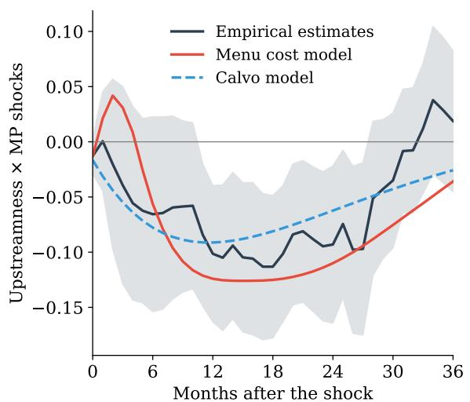  
(b) Adjustment frequency by horizon

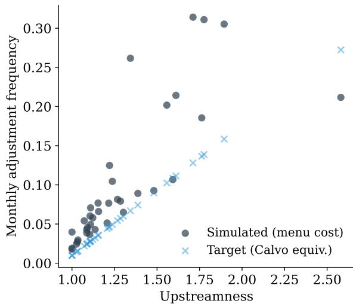  
Notes: Panel (a) plots the interaction coefficient $\hat{\beta}_{h}$ from the menu cost model with strategic complementarities ( $\psi = 0.55$ ), the Calvo model (from Subsection 5.2), and the empirical estimates with 90% confidence band. Panel (b) shows the average fraction of firms adjusting prices at each horizon for upstream (top quartile) and downstream (bottom quartile) sectors, illustrating the endogenous rigidity dispersion generated by the Ss pricing rule.

The menu cost model generates a peak interaction coefficient of -0.125 at h = 15, compared to -0.105 for the externally-calibrated Calvo model and -0.113 in the data. Two mechanisms contribute to the slightly larger response. First, endogenous rigidity dispersion: even with identical menu costs, upstream sectors adjust more frequently because they face larger and more volatile cost shocks—driven by their position further from final demand and fewer downstream customers to average over. This generates the cross-sectional variation in rigidity that must be imposed exogenously through the parameter $\delta$ in the Calvo model. Panel (b) of Figure A1 illustrates this mechanism: upstream sectors (top quartile of upstreamness) exhibit a higher fraction of adjusting firms at every horizon, and this gap widens in the months following the monetary shock as the cascade propagates. Second, cascade amplification: when an upstream firm adjusts its price, the cost change propagates through the IO matrix to downstream buyers, potentially pushing them past their own Ss thresholds and triggering additional adjustments. This extensive-margin cascade is absent from Calvo models, where the fraction of adjusting firms is fixed at $1 - \theta_{i}$ regardless of the shock. It is also distinct from—and opposite in sign to—the intensive-margin cost-cascade channel in the linear Calvo decomposition of Subsection 5.2: there, the cost channel offsets the upstreamness differential because upstream sectors have low labor shares, whereas here the extensive-margin selection effect reinforces it because threshold-crossing is more likely for the frequently-adjusting upstream sectors. The two are not in conflict; they are different margins of adjustment, and the net contribution of the menu cost extension is to raise the peak interaction modestly above the Calvo benchmark.

The two frameworks have complementary strengths. The Calvo model offers analytical tractability and clean identification of the network mechanism: the closed-form expressions in Section 2 make transparent how the Leontief inverse, sectoral rigidity, and upstreamness interact to generate cross-sectional variation. With the rigidity differential disciplined externally and the demand impulse disciplined to the estimated output response, it captures 93% of the empirical peak and matches its timing. The menu cost model adds the extensive-margin selection channel and strategic complementarities, raising the peak slightly, but at the cost of one additional parameter ( $\psi$ ) and the loss of closed-form expressions; its main role is as the vehicle for the asymmetry result rather than to improve the baseline fit. The impulse response is also noisier at short horizons, reflecting the state-dependent nature of the model: the exact timing of the cascade depends on the initial distribution of price gaps, which varies across Monte Carlo replications. Crucially, both models generate the same qualitative pattern: a hump-shaped interaction coefficient that peaks at medium horizons and reverts toward zero. This confirms that the network amplification mechanism documented in the main text is a robust feature of multi-sector economies with heterogeneous rigidity and IO linkages, rather than an artifact of the specific pricing friction assumed.

## A-IV Data construction

This appendix provides additional details on the construction of the dataset used in the empirical analysis.

PPI series and FRED codes The Producer Price Index series are obtained from the Bureau of Labor Statistics via FRED. Each industry corresponds to a six-digit NAICS code, and the PPI series ID in FRED follows the convention PCU{NAICS}{NAICS} where NAICS is the six-digit code. The full estimation sample includes 209 manufacturing industries (NAICS 311–339) and 62 non-manufacturing industries spanning mining, utilities, trade, transportation, and services.

BEA IO table construction The IO data are from the BEA Detailed Use table, which covers industries at the six-digit NAICS level. I match BEA Detailed codes to six-digit NAICS using a crosswalk. The matching yields 271 industries with both PPI data and IO network measures used in the baseline analysis, spanning manufacturing, mining, utilities, wholesale and retail trade, transportation, and services. The upstreamness measure is computed from the full Detailed Use table to avoid understating the number of production stages. The output-allocation matrix A is computed by normalizing each row of the Use table by the industry's total output, so that $a_{ik} = Z_{ik} / Y_i$ gives the share of sector i's output sold to sector k. The Ghosh inverse $(\mathbf{I} - \mathbf{A})^{-1}$ is then computed, and upstreamness for each industry is the row sum of this matrix. The correlation of upstreamness with eigenvector centrality is 43%, confirming that these measures capture distinct aspects of network position.

Monetary policy shock The baseline monetary policy shock is from Bauer and Swanson (2023). The raw data contain FOMC-meeting-level monetary policy surprises measured from high-frequency changes in federal funds futures in a 30-minute window around FOMC announcements. The "MPS\_ORTH" variable orthogonalizes these raw surprises with respect to macroeconomic and financial variables to address the Fed information effect. I aggregate the FOMC-level shocks to monthly frequency by summing all surprises within each calendar month. Months without FOMC meetings receive a shock of zero. The resulting monthly series covers 1988–2023 and is matched to the panel by year-month. As an alternative measure of monetary policy shocks, I employ the dataset of Jarociński and Karadi (2020), which is available up to end-2024.

Figure A2 displays both shock series. The Bauer-Swanson shocks exhibit the largest contractionary surprises during the 2004–2006 and 2022–2023 tightening cycles. The Jarociński-Karadi shocks are highly correlated with the Bauer-Swanson series ( $\rho = 0.76$ ) during the overlapping period, while also capturing the large shocks of the 2022–2023 tightening cycle. $^{47}$

Figure A2: Monetary policy shocks  
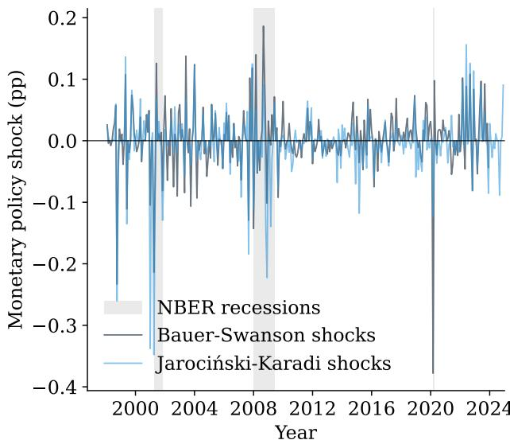  
Notes: The figure shows the monetary policy shock series: the Bauer-Swanson orthogonalized shocks and the Jarociński and Karadi (2020) information-purged shocks, at monthly frequency. Shaded areas indicate NBER recession dates.

## A-IV.1 Summary statistics

Table A2 reports summary statistics for the key variables.

Table A2: Summary statistics

<table><tr><td>Variable</td><td>N</td><td>Mean</td><td>Std. Dev.</td><td>P10</td><td>P50</td><td>P90</td></tr><tr><td>Monthly PPI inflation</td><td>75,073</td><td>0.002</td><td>0.018</td><td>-0.006</td><td>0.001</td><td>0.013</td></tr><tr><td>CPI inflation</td><td>75,073</td><td>0.002</td><td>0.003</td><td>-0.001</td><td>0.002</td><td>0.005</td></tr><tr><td>Bauer-Swanson orthogonalized MP surprises</td><td>71,857</td><td>0.003</td><td>0.049</td><td>-0.038</td><td>0.000</td><td>0.053</td></tr><tr><td>Jarociński-Karadi MP surprises</td><td>75,073</td><td>-0.004</td><td>0.047</td><td>-0.042</td><td>0.000</td><td>0.039</td></tr><tr><td>Upstreamness</td><td>75,073</td><td>1.222</td><td>0.352</td><td>1.009</td><td>1.103</td><td>1.566</td></tr><tr><td>Eigenvector centrality</td><td>75,073</td><td>0.016</td><td>0.067</td><td>0.000</td><td>0.002</td><td>0.028</td></tr><tr><td>Industrial production growth</td><td>75,073</td><td>0.000</td><td>0.012</td><td>-0.006</td><td>0.001</td><td>0.008</td></tr><tr><td>Change in Unemployment</td><td>75,073</td><td>-0.004</td><td>0.675</td><td>-0.200</td><td>0.000</td><td>0.200</td></tr><tr><td>M2 growth</td><td>75,073</td><td>0.005</td><td>0.006</td><td>0.000</td><td>0.004</td><td>0.009</td></tr></table>

Notes: The sample covers 271 six-digit NAICS industries over the baseline period 1998:02–2023:12 (extended to 2024:12 only for the Jarociński-Karadi robustness check). Monthly PPI inflation is the log first-difference of the industry-level producer price index. Upstreamness and eigenvector centrality are computed from BEA Detailed IO tables following Antràs et al. (2012). Industrial production growth is the log first-difference of the industrial production index from FRED, available at the three-digit NAICS level and assigned to all six-digit industries within each sector. Bauer-Swanson Orth. MPS is the Bauer and Swanson (2023) orthogonalized monetary policy surprise aggregated to monthly frequency. Jarociński-Karadi MPS is the information-purged monetary policy shock of Jarociński and Karadi (2020). The baseline estimation sample ends in December 2023, when the Bauer-Swanson shock series ends; the extended sample through December 2024 is used for the Jarociński-Karadi robustness check.

## A-V Results

This appendix presents the full set of estimates for the results referenced in the main text.

Baseline estimates Table A3 reports the full set of baseline estimates at horizons $h = 0, 3, 6, \ldots, 36$ months. Panel A reports the interaction coefficient $\hat{\beta}_{h}$ from the symmetric specification. Panel B reports the impulse response coefficients by upstreamness quartile. Panel C reports the asymmetric decomposition.

Real effects Table A4 reports the results about the real effects, both for the symmetric and the asymmetric specification. The specification controls for one lag of own-industry IP growth. The underlying data are based on sector-level industrial production indices from FRED for all available manufacturing sectors (NAICS 311–339). The log indices are winsorized at the 1st and 99th percentiles within each industry.

Mechanisms Table A5 reports the full set of supply chain cascade estimates at all horizons, for both the symmetric specification and the asymmetric one. Table A6 reports estimates from the triple interaction of upstreamness, intermediate input share, and the monetary policy shock. The coefficient captures whether the upstreamness effect is amplified in industries with higher intermediate input shares—a prediction of the network transmission mechanism. Table A7 reports estimates from the interaction of supplier-weighted upstreamness with the monetary policy shock. For each industry i, supplier-weighted upstreamness is defined as the input-cost-weighted average of upstream suppliers' upstreamness, computed from the BEA detailed use matrix. A significant negative coefficient indicates that industries whose suppliers are more upstream exhibit faster price adjustment, consistent with the network cascade mechanism.

Specification tests Table A8 reports the interaction coefficient $\hat{\beta}_{h}$ across five alternative specifications varying the lag structure, control set, and functional form. Specification A—all 271 industries with one PPI lag, zero monetary shock lags, and no macro controls—is the baseline throughout the paper.

Pre-trend Table A9 reports the estimated coefficient $\hat{\beta}_{h}$ of the baseline specification at negative horizons $h = -12, \ldots, -1$ .

Manufacturing industries Table A10 reports the set of estimates for the manufacturing sector. Both the results of the symmetric and the asymmetric specifications are reported.

Table A3: Baseline estimates

<table><tr><td></td><td>h = 0</td><td>h = 3</td><td>h = 6</td><td>h = 9</td><td>h = 12</td><td>h = 15</td><td>h = 18</td><td>h = 21</td><td>h = 24</td><td>h = 27</td><td>h = 30</td><td>h = 33</td><td>h = 36</td></tr><tr><td colspan="14">Panel A: Symmetric specification</td></tr><tr><td>Upstreamness × MP shocks</td><td>-0.013(0.010)</td><td>-0.039(0.054)</td><td>-0.066(0.054)</td><td>-0.059(0.047)</td><td>-0.101***(0.038)</td><td>-0.105**(0.041)</td><td>-0.113***(0.039)</td><td>-0.081**(0.039)</td><td>-0.093**(0.043)</td><td>-0.097**(0.048)</td><td>-0.035(0.037)</td><td>0.012(0.036)</td><td>0.019(0.039)</td></tr><tr><td>Observations</td><td>71,578</td><td>71,545</td><td>71,512</td><td>71,479</td><td>71,446</td><td>70,609</td><td>69,772</td><td>68,935</td><td>68,099</td><td>67,267</td><td>66,436</td><td>65,608</td><td>64,780</td></tr><tr><td> $R^2$ </td><td>0.015</td><td>0.001</td><td>0.001</td><td>0.001</td><td>0.002</td><td>0.002</td><td>0.003</td><td>0.004</td><td>0.005</td><td>0.009</td><td>0.013</td><td>0.012</td><td>0.007</td></tr><tr><td colspan="14">Panel B: Estimates by upstreamness quartile</td></tr><tr><td>Q4 (Most Upstream)</td><td>-0.009(0.010)</td><td>-0.027(0.044)</td><td>-0.065(0.053)</td><td>-0.066(0.053)</td><td>-0.111**(0.043)</td><td>-0.120***(0.043)</td><td>-0.127***(0.044)</td><td>-0.117**(0.047)</td><td>-0.137***(0.053)</td><td>-0.124*(0.064)</td><td>-0.067(0.058)</td><td>-0.036(0.055)</td><td>-0.027(0.058)</td></tr><tr><td>Observations</td><td>16,783</td><td>16,768</td><td>16,753</td><td>16,738</td><td>16,723</td><td>16,510</td><td>16,297</td><td>16,084</td><td>15,871</td><td>15,660</td><td>15,450</td><td>15,240</td><td>15,030</td></tr><tr><td> $R^2$ </td><td>0.025</td><td>0.001</td><td>0.001</td><td>0.002</td><td>0.003</td><td>0.003</td><td>0.005</td><td>0.006</td><td>0.008</td><td>0.013</td><td>0.016</td><td>0.013</td><td>0.006</td></tr><tr><td>Q3</td><td>-0.005(0.005)</td><td>-0.016(0.017)</td><td>-0.030(0.021)</td><td>-0.030(0.027)</td><td>-0.051**(0.025)</td><td>-0.063**(0.028)</td><td>-0.058**(0.029)</td><td>-0.051*(0.030)</td><td>-0.072*(0.040)</td><td>-0.069(0.046)</td><td>-0.038(0.041)</td><td>-0.021(0.038)</td><td>-0.017(0.040)</td></tr><tr><td>Observations</td><td>17,995</td><td>17,995</td><td>17,995</td><td>17,995</td><td>17,995</td><td>17,794</td><td>17,593</td><td>17,392</td><td>17,192</td><td>16,994</td><td>16,796</td><td>16,598</td><td>16,400</td></tr><tr><td> $R^2$ </td><td>0.012</td><td>0.005</td><td>0.003</td><td>0.002</td><td>0.003</td><td>0.002</td><td>0.001</td><td>0.001</td><td>0.002</td><td>0.003</td><td>0.005</td><td>0.004</td><td>0.001</td></tr><tr><td>Q2</td><td>-0.001(0.002)</td><td>0.004(0.008)</td><td>0.004(0.012)</td><td>0.002(0.018)</td><td>-0.005(0.019)</td><td>-0.015(0.020)</td><td>-0.024(0.020)</td><td>-0.024(0.023)</td><td>-0.036(0.027)</td><td>-0.045(0.032)</td><td>-0.039(0.032)</td><td>-0.032(0.033)</td><td>-0.033(0.033)</td></tr><tr><td>Observations</td><td>18,350</td><td>18,341</td><td>18,332</td><td>18,323</td><td>18,314</td><td>18,104</td><td>17,894</td><td>17,684</td><td>17,474</td><td>17,264</td><td>17,054</td><td>16,847</td><td>16,640</td></tr><tr><td> $R^2$ </td><td>0.008</td><td>0.027</td><td>0.030</td><td>0.021</td><td>0.019</td><td>0.014</td><td>0.010</td><td>0.007</td><td>0.006</td><td>0.004</td><td>0.003</td><td>0.002</td><td>0.002</td></tr><tr><td>Q1 (Most Downstream)</td><td>0.002(0.002)</td><td>0.003(0.005)</td><td>0.004(0.009)</td><td>0.007(0.013)</td><td>-0.001(0.015)</td><td>-0.003(0.015)</td><td>-0.003(0.016)</td><td>-0.007(0.018)</td><td>-0.018(0.021)</td><td>-0.019(0.023)</td><td>-0.015(0.024)</td><td>-0.014(0.024)</td><td>-0.019(0.027)</td></tr><tr><td>Observations</td><td>18,450</td><td>18,441</td><td>18,432</td><td>18,423</td><td>18,414</td><td>18,201</td><td>17,988</td><td>17,775</td><td>17,562</td><td>17,349</td><td>17,136</td><td>16,923</td><td>16,710</td></tr><tr><td> $R^2$ </td><td>0.007</td><td>0.024</td><td>0.030</td><td>0.027</td><td>0.034</td><td>0.024</td><td>0.018</td><td>0.012</td><td>0.013</td><td>0.009</td><td>0.008</td><td>0.006</td><td>0.007</td></tr><tr><td colspan="14">Panel C: Asymmetric specification</td></tr><tr><td>Upstr. × MP shocks × exp. dummy</td><td>0.013(0.014)</td><td>0.035(0.028)</td><td>0.008(0.043)</td><td>0.009(0.059)</td><td>-0.063(0.083)</td><td>-0.087(0.110)</td><td>-0.158*(0.093)</td><td>-0.178*(0.091)</td><td>-0.187**(0.091)</td><td>-0.250***(0.087)</td><td>-0.185**(0.090)</td><td>-0.142(0.089)</td><td>-0.155*(0.093)</td></tr><tr><td>Upstr. × MP shocks × contr. dummy</td><td>-0.048**(0.021)</td><td>-0.140(0.106)</td><td>-0.165(0.103)</td><td>-0.150*(0.083)</td><td>-0.153(0.110)</td><td>-0.128(0.137)</td><td>-0.050(0.152)</td><td>0.058(0.175)</td><td>0.043(0.181)</td><td>0.126(0.196)</td><td>0.192(0.189)</td><td>0.253(0.207)</td><td>0.301(0.224)</td></tr><tr><td>Observations</td><td>71,578</td><td>71,545</td><td>71,512</td><td>71,479</td><td>71,446</td><td>70,609</td><td>69,772</td><td>68,935</td><td>68,099</td><td>67,267</td><td>66,436</td><td>65,608</td><td>64,780</td></tr></table>

Notes: Each column reports local projection estimates at the indicated horizon h (months). The dependent variable is the cumulative log price change. Panel A reports the interaction coefficient from the symmetric specification in Equation 27. Panel B reports the cumulative PPI response to a one standard deviation monetary policy shock for each upstreamness quartile, estimated as four separate subsample regressions. Panel C reports estimates from the asymmetric specification in Equation 28. All specifications include industry fixed effects, sector-time fixed effects, and one lag of own-industry PPI inflation. Driscoll-Kraay standard errors in parentheses. \*\*\* p < 0.01; \*\* p < 0.05; \* p < 0.10.

Table A4: Estimates for industrial production

<table><tr><td></td><td>h = 0</td><td>h = 3</td><td>h = 6</td><td>h = 9</td><td>h = 12</td><td>h = 15</td><td>h = 18</td><td>h = 21</td><td>h = 24</td><td>h = 27</td><td>h = 30</td><td>h = 33</td><td>h = 36</td></tr><tr><td colspan="14">Panel A: Symmetric specification</td></tr><tr><td rowspan="2">Upstreamness × MP shocks</td><td>-0.024*</td><td>0.013</td><td>0.009</td><td>0.002</td><td>0.025</td><td>0.041**</td><td>0.042**</td><td>0.030**</td><td>0.047***</td><td>0.041**</td><td>0.046***</td><td>0.038*</td><td>0.018</td></tr><tr><td>(0.014)</td><td>(0.032)</td><td>(0.024)</td><td>(0.022)</td><td>(0.020)</td><td>(0.017)</td><td>(0.017)</td><td>(0.015)</td><td>(0.017)</td><td>(0.017)</td><td>(0.015)</td><td>(0.022)</td><td>(0.015)</td></tr><tr><td>Observations</td><td>56,356</td><td>56,353</td><td>56,350</td><td>56,347</td><td>56,344</td><td>55,720</td><td>55,096</td><td>54,472</td><td>53,848</td><td>53,225</td><td>52,601</td><td>51,977</td><td>51,353</td></tr><tr><td> $R^2$ </td><td>0.012</td><td>0.001</td><td>0.004</td><td>0.004</td><td>0.002</td><td>0.003</td><td>0.004</td><td>0.003</td><td>0.004</td><td>0.003</td><td>0.004</td><td>0.003</td><td>0.004</td></tr><tr><td colspan="14">Panel B: Asymmetric specification</td></tr><tr><td rowspan="2">Upstr. × MP shocks × exp. dummy</td><td>-0.040**</td><td>0.057</td><td>0.019</td><td>0.002</td><td>0.005</td><td>-0.007</td><td>-0.013</td><td>-0.017</td><td>-0.007</td><td>-0.014</td><td>-0.012</td><td>0.006</td><td>-0.033</td></tr><tr><td>(0.016)</td><td>(0.054)</td><td>(0.045)</td><td>(0.048)</td><td>(0.044)</td><td>(0.032)</td><td>(0.034)</td><td>(0.042)</td><td>(0.050)</td><td>(0.049)</td><td>(0.053)</td><td>(0.058)</td><td>(0.051)</td></tr><tr><td rowspan="2">Upstr. × MP shocks × contr. dummy</td><td>-0.002</td><td>-0.049</td><td>-0.007</td><td>-0.000</td><td>0.053</td><td>0.107***</td><td>0.120***</td><td>0.097**</td><td>0.124***</td><td>0.122**</td><td>0.132***</td><td>0.087</td><td>0.100**</td></tr><tr><td>(0.016)</td><td>(0.033)</td><td>(0.027)</td><td>(0.037)</td><td>(0.034)</td><td>(0.036)</td><td>(0.040)</td><td>(0.041)</td><td>(0.048)</td><td>(0.057)</td><td>(0.048)</td><td>(0.054)</td><td>(0.050)</td></tr><tr><td rowspan="2">Observations</td><td>56,356</td><td>56,353</td><td>56,350</td><td>56,347</td><td>56,344</td><td>55,720</td><td>55,096</td><td>54,472</td><td>53,848</td><td>53,225</td><td>52,601</td><td>51,977</td><td>51,353</td></tr><tr><td>0.046</td><td>0.015</td><td>0.019</td><td>0.019</td><td>0.018</td><td>0.018</td><td>0.016</td><td>0.009</td><td>0.008</td><td>0.005</td><td>0.005</td><td>0.004</td><td>0.006</td></tr></table>

Notes: Each column reports local projection estimates at the indicated horizon h (months). The dependent variable is the cumulative log industrial production growth. Panel A reports the symmetric interaction coefficient from the symmetric specification in Equation 29. Panel B reports estimates from the corresponding asymmetric specification. All specifications include industry fixed effects and one lag of IP growth. Driscoll-Kraay standard errors in parentheses. \*\*\*p < 0.01; \*\*p < 0.05; \*p < 0.10.

Table A5: Supply chain cascade

<table><tr><td></td><td>h = 0</td><td>h = 3</td><td>h = 6</td><td>h = 9</td><td>h = 12</td><td>h = 15</td><td>h = 18</td><td>h = 21</td><td>h = 24</td><td>h = 27</td><td>h = 30</td><td>h = 33</td><td>h =</td></tr><tr><td colspan="14">Panel A: Symmetric specification</td></tr><tr><td>Supplier price</td><td>0.176***(0.026)</td><td>0.295***(0.047)</td><td>0.398***(0.078)</td><td>0.568***(0.096)</td><td>0.684***(0.153)</td><td>0.727***(0.212)</td><td>0.739***(0.204)</td><td>0.731***(0.198)</td><td>0.665***(0.203)</td><td>0.522**(0.253)</td><td>0.431(0.275)</td><td>0.426(0.296)</td><td>0.43(0.28)</td></tr><tr><td>Upstreamness × MP shocks</td><td>-0.022(0.020)</td><td>0.005(0.048)</td><td>-0.078(0.053)</td><td>-0.092*(0.055)</td><td>-0.154***(0.057)</td><td>-0.184***(0.059)</td><td>-0.158**(0.064)</td><td>-0.148**(0.067)</td><td>-0.174**(0.080)</td><td>-0.160(0.103)</td><td>-0.037(0.094)</td><td>0.058(0.091)</td><td>0.09(0.08)</td></tr><tr><td>Observations</td><td>29,695</td><td>29,689</td><td>29,682</td><td>29,676</td><td>29,670</td><td>29,184</td><td>28,698</td><td>28,212</td><td>27,727</td><td>27,255</td><td>26,784</td><td>26,313</td><td>25,8</td></tr><tr><td> $R^2$ </td><td>0.027</td><td>0.018</td><td>0.017</td><td>0.023</td><td>0.025</td><td>0.022</td><td>0.018</td><td>0.016</td><td>0.015</td><td>0.012</td><td>0.011</td><td>0.010</td><td>0.00</td></tr><tr><td colspan="14">Panel B: Asymmetric specification</td></tr><tr><td>Supplier price</td><td>0.174***(0.027)</td><td>0.296***(0.047)</td><td>0.400***(0.077)</td><td>0.574***(0.094)</td><td>0.698***(0.148)</td><td>0.753***(0.204)</td><td>0.772***(0.199)</td><td>0.776***(0.193)</td><td>0.722***(0.187)</td><td>0.597***(0.228)</td><td>0.516**(0.246)</td><td>0.525**(0.266)</td><td>0.556(0.26)</td></tr><tr><td>Upstr. × MP shocks × exp. dummy</td><td>0.033(0.020)</td><td>0.049*(0.030)</td><td>-0.015(0.060)</td><td>-0.102(0.063)</td><td>-0.254***(0.084)</td><td>-0.326***(0.096)</td><td>-0.331***(0.107)</td><td>-0.342***(0.114)</td><td>-0.402***(0.116)</td><td>-0.496***(0.096)</td><td>-0.337***(0.102)</td><td>-0.260***(0.087)</td><td>-0.18(0.09)</td></tr><tr><td>Upstr. × MP shocks × contr. dummy</td><td>-0.099**(0.048)</td><td>-0.055(0.075)</td><td>-0.165*(0.095)</td><td>-0.074(0.133)</td><td>-0.003(0.182)</td><td>0.030(0.217)</td><td>0.115(0.271)</td><td>0.175(0.322)</td><td>0.200(0.347)</td><td>0.395(0.388)</td><td>0.497(0.394)</td><td>0.650*(0.379)</td><td>0.65(0.40)</td></tr><tr><td>Observations</td><td>29,695</td><td>29,689</td><td>29,682</td><td>29,676</td><td>29,670</td><td>29,184</td><td>28,698</td><td>28,212</td><td>27,727</td><td>27,255</td><td>26,784</td><td>26,313</td><td>25,8</td></tr><tr><td> ${R}^{2}$ </td><td>0.029</td><td>0.019</td><td>0.018</td><td>0.024</td><td>0.028</td><td>0.028</td><td>0.025</td><td>0.025</td><td>0.027</td><td>0.030</td><td>0.032</td><td>0.034</td><td>0.03</td></tr></table>

Notes: Each column reports local projection estimates at the indicated horizon h (months). The table reports estimates from the cascade regression in Equation 31. The dependent variable is the cumulative log price change. “Supplier Price” is the input-cost-weighted average of upstream industries’ PPI inflation. Panel A reports the estimates of the symmetric specific Panel B reports the estimates of the asymmetric specification, where the interaction is split by sign of the shock. All specifications include industry fixed effects, sector-time fixed effects and one lag of own-industry PPI inflation. Driscoll-Kraay standard errors in parentheses. \*\*\* p < 0.01; \*\* p < 0.05; \* p < 0.10.

Table A6: Input share amplification

<table><tr><td></td><td>h = 0</td><td>h = 3</td><td>h = 6</td><td>h = 9</td><td>h = 12</td><td>h = 15</td><td>h = 18</td><td>h = 21</td><td>h = 24</td><td>h = 27</td><td>h = 30</td><td>h = 33</td><td>h = 36</td></tr><tr><td>Upstr. × int. input sh. × MP Shock</td><td>-0.009(0.035)</td><td>-0.166(0.197)</td><td>-0.328(0.252)</td><td>-0.355(0.252)</td><td>-0.466*(0.243)</td><td>-0.513**(0.222)</td><td>-0.591***(0.221)</td><td>-0.601***(0.217)</td><td>-0.614***(0.200)</td><td>-0.555**(0.222)</td><td>-0.284(0.179)</td><td>-0.122(0.173)</td><td>-0.067(0.190)</td></tr><tr><td>Observations</td><td>71,578</td><td>71,545</td><td>71,512</td><td>71,479</td><td>71,446</td><td>70,609</td><td>69,772</td><td>68,935</td><td>68,099</td><td>67,267</td><td>66,436</td><td>65,608</td><td>64,780</td></tr><tr><td> $R^2$ </td><td>0.015</td><td>0.001</td><td>0.001</td><td>0.001</td><td>0.002</td><td>0.003</td><td>0.004</td><td>0.005</td><td>0.006</td><td>0.009</td><td>0.013</td><td>0.012</td><td>0.007</td></tr></table>

Notes: Each column reports local projection estimates at the indicated horizon h (months). The dependent variable is the cumulative log price change. The table reports estimates of the coefficient on the triple interaction Upstreamness × Intermediate Input Share × MP Shock. The specification controls for all lower-order interactions. All specifications include industry fixed effects, sector-time fixed effects, and one lag of own-industry PPI inflation. Driscoll-Kraay standard errors in parentheses. $^{***}p < 0.01$ ; $^{**}p < 0.05$ ; $^{*}p < 0.10$ .

Table A7: Supplier-weighted upstreamness

<table><tr><td></td><td>h = 0</td><td>h = 3</td><td>h = 6</td><td>h = 9</td><td>h = 12</td><td>h = 15</td><td>h = 18</td><td>h = 21</td><td>h = 24</td><td>h = 27</td><td>h = 30</td><td>h = 33</td><td>h = 36</td></tr><tr><td>Suppl. weighted upstr. ×MP shocks</td><td>-0.009(0.005)</td><td>-0.015(0.019)</td><td>-0.031(0.028)</td><td>-0.036(0.035)</td><td>-0.056**(0.028)</td><td>-0.074**(0.031)</td><td>-0.079**(0.031)</td><td>-0.081**(0.034)</td><td>-0.088**(0.035)</td><td>-0.074*(0.041)</td><td>-0.039(0.037)</td><td>-0.014(0.035)</td><td>0.006(0.038)</td></tr><tr><td>Observations</td><td>57,324</td><td>57,300</td><td>57,276</td><td>57,252</td><td>57,228</td><td>56,565</td><td>55,902</td><td>55,239</td><td>54,577</td><td>53,919</td><td>53,262</td><td>52,605</td><td>51,948</td></tr><tr><td> $R^2$ </td><td>0.030</td><td>0.003</td><td>0.001</td><td>0.001</td><td>0.001</td><td>0.001</td><td>0.001</td><td>0.001</td><td>0.002</td><td>0.004</td><td>0.006</td><td>0.005</td><td>0.001</td></tr></table>

Notes: Each column reports local projection estimates at the indicated horizon h (months). The dependent variable is the cumulative log price change. The table reports estimates of the coefficient on the interaction of supplier-weighted upstreamness with the monetary policy shock, where the supplier-weighted upstreamness is the input-cost-weighted average of suppliers' upstreamness computed from the BEA detailed use matrix. All specifications include industry fixed effects, sector-time fixed effects, and one lag of own-industry PPI inflation. Driscoll-Kraay standard errors in parentheses. $^{***}p < 0.01$ ; $^{**}p < 0.05$ ; $^{*}p < 0.10$ .

Table A8: Interaction coefficient across specifications

<table><tr><td></td><td>h = 0</td><td>h = 3</td><td>h = 6</td><td>h = 9</td><td>h = 12</td><td>h = 15</td><td>h = 18</td><td>h = 21</td><td>h = 24</td><td>h = 27</td><td>h = 30</td><td>h = 33</td><td>h = 36</td></tr><tr><td colspan="14">Spec A: Baseline</td></tr><tr><td>Upstreamness × MP shocks</td><td>-0.013(0.010)</td><td>-0.039(0.054)</td><td>-0.066(0.054)</td><td>-0.059(0.047)</td><td>-0.101***(0.038)</td><td>-0.105**(0.041)</td><td>-0.113***(0.039)</td><td>-0.081**(0.039)</td><td>-0.093**(0.043)</td><td>-0.097**(0.048)</td><td>-0.035(0.037)</td><td>0.012(0.036)</td><td>0.019(0.039)</td></tr><tr><td>Observations</td><td>71,578</td><td>71,545</td><td>71,512</td><td>71,479</td><td>71,446</td><td>70,609</td><td>69,772</td><td>68,935</td><td>68,099</td><td>67,267</td><td>66,436</td><td>65,608</td><td>64,780</td></tr><tr><td> $R^2$ </td><td>0.015</td><td>0.001</td><td>0.001</td><td>0.001</td><td>0.002</td><td>0.002</td><td>0.003</td><td>0.004</td><td>0.005</td><td>0.009</td><td>0.013</td><td>0.012</td><td>0.007</td></tr><tr><td colspan="14">Spec B: 1 PPI lag, 0 MP lags, macro controls.</td></tr><tr><td>Upstreamness × MP shocks</td><td>-0.013(0.010)</td><td>-0.039(0.054)</td><td>-0.066(0.054)</td><td>-0.059(0.047)</td><td>-0.102***(0.037)</td><td>-0.104**(0.041)</td><td>-0.113***(0.039)</td><td>-0.081**(0.039)</td><td>-0.093**(0.043)</td><td>-0.096**(0.047)</td><td>-0.034(0.037)</td><td>0.013(0.035)</td><td>0.020(0.038)</td></tr><tr><td rowspan="2">Observations</td><td rowspan="2">71,578</td><td rowspan="2">71,545</td><td rowspan="2">71,512</td><td rowspan="2">71,479</td><td rowspan="2">71,446</td><td rowspan="2">70,609</td><td rowspan="2">69,772</td><td rowspan="2">68,935</td><td rowspan="2">68,099</td><td rowspan="2">67,267</td><td rowspan="2">66,436</td><td rowspan="2">65,608</td><td rowspan="2">64,780</td></tr><tr></tr><tr><td> $R^2$ </td><td>0.016</td><td>0.001</td><td>0.001</td><td>0.002</td><td>0.002</td><td>0.003</td><td>0.004</td><td>0.005</td><td>0.006</td><td>0.010</td><td>0.015</td><td>0.014</td><td>0.008</td></tr><tr><td colspan="14">Spec C: 6 PPI lags, 0 MP lags, no macro controls</td></tr><tr><td>Upstreamness × MP shocks</td><td>-0.013(0.010)</td><td>-0.039(0.054)</td><td>-0.064(0.053)</td><td>-0.057(0.046)</td><td>-0.099***(0.037)</td><td>-0.103***(0.040)</td><td>-0.111***(0.038)</td><td>-0.076**(0.037)</td><td>-0.087**(0.043)</td><td>-0.087*(0.048)</td><td>-0.026(0.038)</td><td>0.018(0.038)</td><td>0.027(0.037)</td></tr><tr><td rowspan="2">Observations</td><td rowspan="2">70,183</td><td rowspan="2">70,150</td><td rowspan="2">70,117</td><td rowspan="2">70,084</td><td rowspan="2">70,051</td><td rowspan="2">69,214</td><td rowspan="2">68,377</td><td rowspan="2">67,544</td><td rowspan="2">66,713</td><td rowspan="2">65,884</td><td rowspan="2">65,056</td><td rowspan="2">64,228</td><td rowspan="2">63,400</td></tr><tr></tr><tr><td> $R^2$ </td><td>0.020</td><td>0.005</td><td>0.006</td><td>0.006</td><td>0.010</td><td>0.017</td><td>0.025</td><td>0.031</td><td>0.045</td><td>0.061</td><td>0.059</td><td>0.044</td><td>0.039</td></tr><tr><td colspan="14">Spec D: 1 PPI lag, 0 MP lags, log(upstreamness)</td></tr><tr><td>Upstreamness × MP shocks</td><td>-0.022(0.017)</td><td>-0.065(0.093)</td><td>-0.119(0.092)</td><td>-0.107(0.080)</td><td>-0.176***(0.063)</td><td>-0.176***(0.068)</td><td>-0.190***(0.066)</td><td>-0.137**(0.067)</td><td>-0.160**(0.073)</td><td>-0.157*(0.080)</td><td>-0.051(0.064)</td><td>0.023(0.062)</td><td>0.033(0.067)</td></tr><tr><td>Observations</td><td rowspan="2">71,578</td><td rowspan="2">71,545</td><td rowspan="2">71,512</td><td rowspan="2">71,479</td><td rowspan="2">71,446</td><td rowspan="2">70,609</td><td rowspan="2">69,772</td><td rowspan="2">68,935</td><td rowspan="2">68,099</td><td rowspan="2">67,267</td><td rowspan="2">66,436</td><td rowspan="2">65,608</td><td rowspan="2">64,780</td></tr><tr><td></td></tr><tr><td> $R^2$ </td><td>0.015</td><td>0.001</td><td>0.001</td><td>0.001</td><td>0.002</td><td>0.002</td><td>0.003</td><td>0.004</td><td>0.005</td><td>0.009</td><td>0.013</td><td>0.012</td><td>0.007</td></tr></table>

Notes: Each column reports local projection estimates at the indicated horizon h (months). The dependent variable is the cumulative log price change. All specifications include industry fixed effects and sector-time fixed effects, except Spec B that features macro controls. Macro controls include CPI inflation, industrial production growth, the change in unemployment, and M2 growth. Driscoll-Kraay standard errors in parentheses. \*\*\*p < 0.01; \*\*p < 0.05; \*p < 0.10.

Table A9: Interaction coefficient at negative horizons

<table><tr><td></td><td>h = -12</td><td>h = -11</td><td>h = -10</td><td>h = -9</td><td>h = -8</td><td>h = -7</td><td>h = -6</td><td>h = -5</td><td>h = -4</td><td>h = -3</td><td>h = -2</td></tr><tr><td>Upstreamness × MP shocks</td><td>-0.004(0.041)</td><td>0.002(0.040)</td><td>0.001(0.039)</td><td>-0.003(0.037)</td><td>-0.008(0.032)</td><td>-0.015(0.028)</td><td>-0.020(0.024)</td><td>-0.013(0.020)</td><td>-0.002(0.016)</td><td>0.002(0.014)</td><td>-0.000(0.010)</td></tr><tr><td>Observations</td><td>68,509</td><td>68,788</td><td>69,067</td><td>69,346</td><td>69,625</td><td>69,904</td><td>70,183</td><td>70,462</td><td>70,741</td><td>71,020</td><td>71,299</td></tr></table>

Notes: Each row reports the estimated coefficient on Upstreamness × MP Shock at the indicated negative horizon. The dependent variable is the cumulative log price change. Driscoll-Kraay standard errors. All specifications include industry fixed effects, sector-time fixed effects, and one lag of own-industry PPI inflation. 90% confidence intervals reported. \*\*\*p < 0.01; \*\*p < 0.05; \*p < 0.10.

Table A10: Estimates for the manufacturing sector

<table><tr><td></td><td>h = 0</td><td>h = 3</td><td>h = 6</td><td>h = 9</td><td>h = 12</td><td>h = 15</td><td>h = 18</td><td>h = 21</td><td>h = 24</td><td>h = 27</td><td>h = 30</td><td>h = 33</td><td>h = 36</td></tr><tr><td colspan="14">Panel A: Symmetric specification</td></tr><tr><td>Upstreamness × MP shocks</td><td>-0.012(0.012)</td><td>-0.056(0.071)</td><td>-0.089(0.070)</td><td>-0.078(0.063)</td><td>-0.138***(0.052)</td><td>-0.141**(0.057)</td><td>-0.151***(0.052)</td><td>-0.116**(0.052)</td><td>-0.129**(0.058)</td><td>-0.132**(0.065)</td><td>-0.049(0.050)</td><td>0.008(0.048)</td><td>0.017(0.052)</td></tr><tr><td>Observations</td><td>56,803</td><td>56,779</td><td>56,755</td><td>56,731</td><td>56,707</td><td>56,059</td><td>55,411</td><td>54,763</td><td>54,115</td><td>53,469</td><td>52,824</td><td>52,179</td><td>51,534</td></tr><tr><td> $R^2$ </td><td>0.040</td><td>0.002</td><td>0.001</td><td>0.001</td><td>0.002</td><td>0.003</td><td>0.004</td><td>0.006</td><td>0.007</td><td>0.012</td><td>0.017</td><td>0.015</td><td>0.009</td></tr><tr><td colspan="14">Panel B: Asymmetric specification</td></tr><tr><td>Upstr. × MP shocks × exp. dummy</td><td>0.021(0.018)</td><td>0.042(0.038)</td><td>0.004(0.060)</td><td>0.007(0.080)</td><td>-0.093(0.117)</td><td>-0.123(0.155)</td><td>-0.215(0.135)</td><td>-0.250*(0.130)</td><td>-0.262**(0.130)</td><td>-0.337***(0.127)</td><td>-0.246**(0.123)</td><td>-0.192(0.120)</td><td>-0.216*(0.122)</td></tr><tr><td>Upstr. × MP shocks × contr. dummy</td><td>-0.058**(0.029)</td><td>-0.188(0.140)</td><td>-0.214(0.141)</td><td>-0.193(0.119)</td><td>-0.200(0.154)</td><td>-0.165(0.190)</td><td>-0.062(0.209)</td><td>0.075(0.239)</td><td>0.061(0.245)</td><td>0.166(0.265)</td><td>0.246(0.256)</td><td>0.316(0.278)</td><td>0.386(0.301)</td></tr><tr><td rowspan="3">Observations</td><td rowspan="3">56,803</td><td rowspan="3">56,779</td><td rowspan="3">56,755</td><td rowspan="3">56,731</td><td rowspan="3">56,707</td><td rowspan="3">56,059</td><td rowspan="3">55,411</td><td rowspan="3">54,763</td><td rowspan="3">54,115</td><td rowspan="3">53,469</td><td rowspan="3">52,824</td><td rowspan="3">52,179</td><td rowspan="3">51,534</td></tr><tr></tr><tr></tr></table>

Notes: Each column reports local projection estimates at the indicated horizon h (months). The sample is restricted to manufacturing sectors. The dependent variable is the cumulative log price change. Panel A reports the interaction coefficient from the symmetric specification in Equation 27. Panel B reports estimates from the asymmetric specification in Equation 28. All specifications include industry fixed effects, sector-time fixed effects, and one lag of own-industry PPI inflation. Driscoll-Kraay standard errors in parentheses. \*\*\*p < 0.01; \*\*p < 0.05; \*p < 0.10.

Outliers Figure A3 plots the distribution of leave-one-out estimates at selected horizons. Each panel shows the distribution of the coefficient on the interaction term between upstreamness and monetary policy shocks obtained by re-estimating Equation 27 after dropping one industry from the sample. The estimates are tightly concentrated around the baseline at all horizons, confirming that no single industry drives the results.

## Figure A3: Leave-one-out distribution

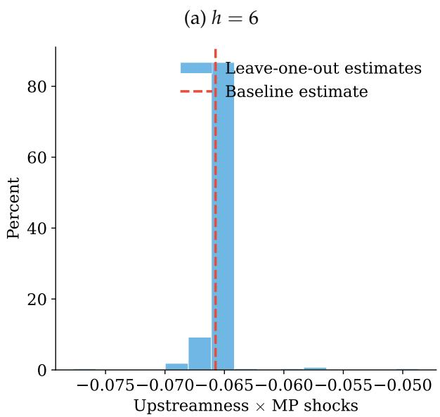

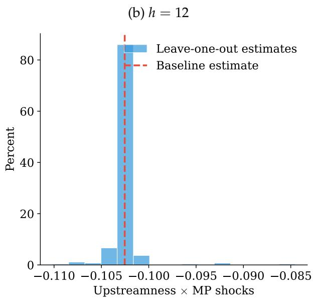

(c) h = 18  
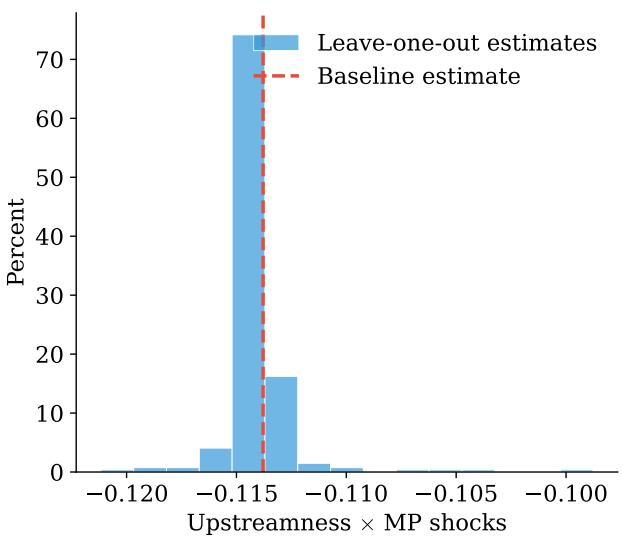

(d) h = 24  
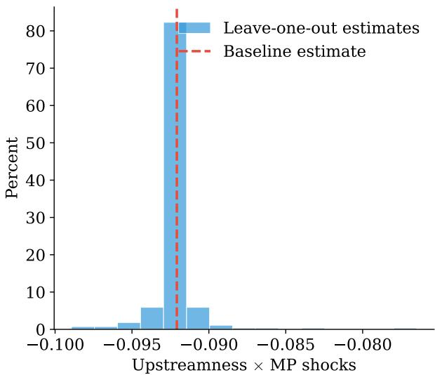  
Notes: Each panel shows the distribution of the coefficient on the interaction term between upstreamness and monetary policy shocks from 271 leave-one-out re-estimations at the indicated horizon. The vertical dashed line marks the baseline estimate using all industries. All specifications include industry fixed effects, sector×time fixed effects, and one lag of own-industry PPI inflation.

Placebo test I randomly reassign the upstreamness measure across industries and re-estimate the baseline interaction coefficient, repeating the procedure 200 times to build a placebo distribution under the null that network position is unrelated to price responsiveness. Figure A4 plots this distribution against the actual estimate at each horizon. The placebo distribution is centered near zero, whereas the baseline estimate lies far in its left tail at every horizon, indicating that the result is specific to the observed upstreamness ranking.

Figure A4: Distribution of permutation estimates  
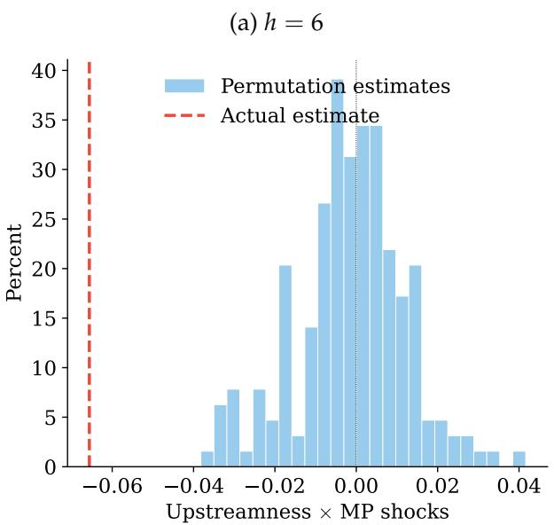  
(c) h = 18

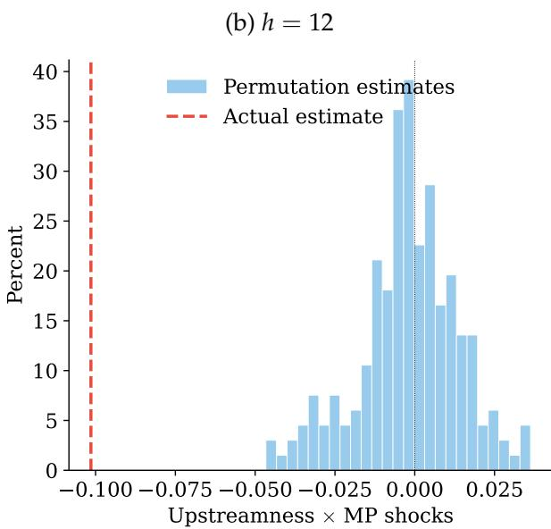  
(d) h = 24

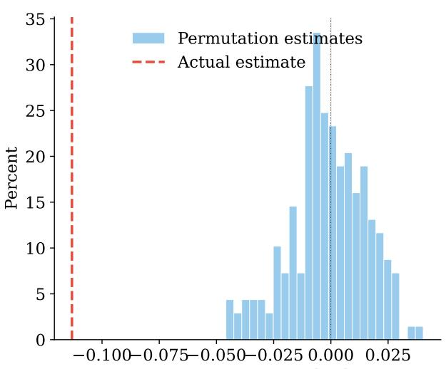  
Upstreamness × MP shocks

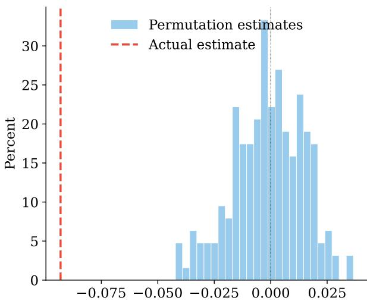  
Upstreamness × MP shocks  
Notes: Each panel shows the distribution of the coefficient on the interaction term between upstreamness and the monetary policy shocks from 200 permutations of upstreamness across industries at the indicated horizon, along with the actual estimate from the baseline specification.

Sub-samples Table A11 verifies that the main interaction coefficient is stable across sub-samples. The first column reports the full-sample baseline, while the remaining columns split the sample into the period up to the Global Financial Crisis (2010), the post-crisis period (2011 onward), and the full sample excluding the COVID period (through December 2019).

Table A11: Interaction coefficient across sub-periods

<table><tr><td></td><td>Full sample</td><td>Up to GFC</td><td>Post-GFC</td><td>Excl. COVID-19</td></tr><tr><td>Upstreamness × MP shocks</td><td>-0.113***(0.039)</td><td>-0.083*(0.048)</td><td>-0.118**(0.060)</td><td>-0.103***(0.037)</td></tr><tr><td>Observations</td><td>69,772</td><td>25,592</td><td>39,622</td><td>53,795</td></tr><tr><td> $R^2$ </td><td>0.003</td><td>0.011</td><td>0.004</td><td>0.004</td></tr></table>

Notes: Each column reports the estimated interaction coefficient $\hat{\beta}_{18}$ for the indicated sub-period. The dependent variable is the cumulative log price change. The pre-crisis sub-period ends in December 2010; the post-crisis sub-period begins in January 2011; the excluding-COVID sub-sample ends in December 2019. All specifications include industry fixed effects, sector-time fixed effects, and one lag of own-industry PPI inflation. Driscoll-Kraay standard errors in parentheses. \*\*\* $p < 0.01$ ; \*\* $p < 0.05$ ; \* $p < 0.10$ .

