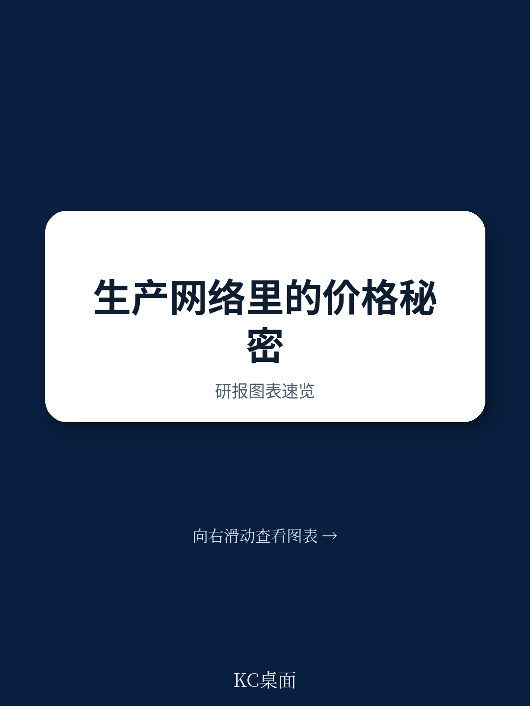
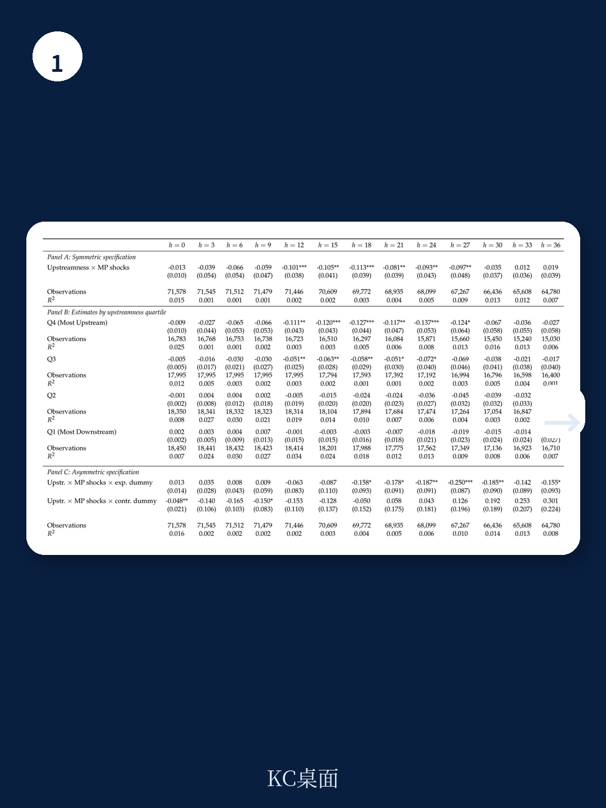
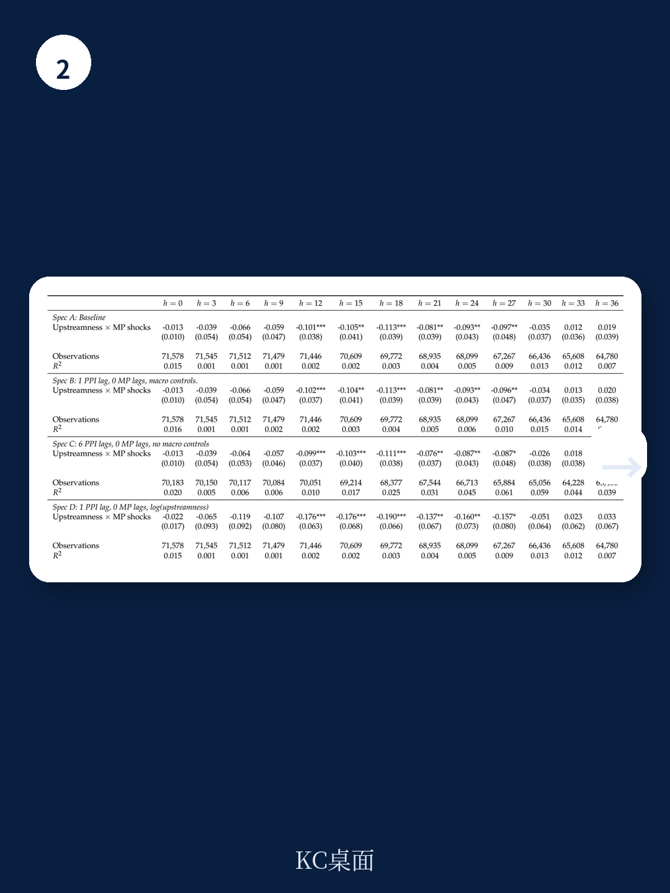

# 国际货币基金组织：产业链位置决定了美联储加息与降息谁更有效

货币政策传导机制的研究，长期以来都隐含着一个假设：无论利率上升还是下降，其作用于经济的路径是对称的。但现实世界的价格调整从来不是对称的——汽油价格“火箭般”上涨、却“羽毛般”下跌的现象，早已被经济学家记录为“火箭与羽毛”效应。

国际货币基金组织最新发布的工作论文（WP/26/127）将这一不对称性嵌入到生产网络框架中，得出了一个对产业决策者和投资者都极具冲击力的结论：产业链上游与下游企业对货币政策的反应存在系统性差异，而这种差异在加息和降息时截然不同。降息带来的价格效应是加息的数倍，而加息对下游企业的真实产出冲击却远大于上游。

这份报告的核心贡献在于：它不仅仅是发现了“产业链位置影响货币政策传导”这一现象，更通过精巧的反事实分解，揭示了背后的主导机制并非通常认为的成本传导链条，而是由产业链位置决定的价格调整频率差异。这意味着，任何改变产业链结构的政策或趋势——贸易协定、垂直整合、平台经济——都在悄然改变货币政策的效力。

## 1. 上游企业价格更灵活，因为它们的客户不是消费者

报告首先建立了一个基础事实：在美国经济中，越远离最终消费者的上游产业，其价格调整频率越高。这一结论来自对271个六位数NAICS行业月度生产者价格指数的分析。

为什么上游企业调价更频繁？原因并不复杂。上游企业的主要客户是其他企业，而非终端消费者。企业客户在采购谈判中更关注价格条款，价格粘性天然更低。相反，面向消费者的下游企业面临菜单成本更高，调价更为谨慎。

> **KC评论：** 这一发现看似直观，但其政策含义常被忽视。当美联储加息时，上游企业可以更快地将成本压力转嫁出去，而下游企业只能通过压缩利润或减少产出应对。这意味着，加息对下游企业的真实产出冲击更大。反之，降息时上游企业更容易降价让利，而下游企业的价格粘性则延缓了通缩压力。

报告通过局部投影法验证了这一机制：在应对一个百分点的货币政策冲击时，处于上游程度75分位的行业，其累积价格响应比25分位的行业高出2.8个百分点。这一差异在冲击发生一年后开始显现，并在一年半时达到峰值。

## 2. 成本传导并非主因，真正重要的是“谁更灵活”

多部门模型通常强调一个直觉：上游企业的价格调整会通过投入产出链条传导至下游，形成“成本瀑布”效应。但这份报告的反事实分解给出了一个反直觉的结论：成本传导机制在解释跨行业价格响应差异中仅起次要作用，甚至部分抵消了上游优势。

原因在于，美国的上游产业恰恰是中间投入密集型，而非劳动密集型。它们的边际成本主要挂钩于其他（本身也是粘性的）中间品价格，而非灵活调整的工资。因此，成本传导渠道实际上将更大的价格响应推向下游，与上游的灵活性优势形成对冲。

真正主导跨行业差异的是“灵活性渠道”——即由产业链位置决定的价格调整频率差异。报告通过校准模型量化显示，即使完全切断投入产出联系，仅保留行业间价格粘性的差异，就能复现绝大部分实证结果。

这一发现对产业分析框架有重要启示：在评估货币政策对不同行业的影响时，关键变量不是该行业在产业链中的“位置”，而是该行业面向企业客户还是消费者客户的销售结构。后者决定了其价格粘性，进而决定了其吸收货币冲击的方式——是通过价格还是通过数量。

## 3. 降息效应是加息的两倍，不对称性在产业链中逐级放大

报告最引人注目的发现，是货币政策传导的不对称性。在应对降息冲击时，上游与下游的价格响应差异是加息时的两倍以上。在冲击后12至24个月的窗口期内，降息带来的上游程度交互系数是总样本峰值系数的两倍多，而加息时的该系数几乎为零。

这一现象的理论基础在于：价格存在向下的刚性，即企业更容易涨价而非降价。在产业链中，这种不对称性会随着生产阶段逐级放大。一条长度为K的产业链，需要经过K-1次中间定价决策，每一次决策都倾向于更快地传导涨价、更慢地传导降价，最终导致整体不对称性呈乘数级增长。

> **KC评论：** 这一发现对资产定价和行业配置有直接含义。如果降息时上游企业的价格响应远大于下游，那么降息周期中上游行业的利润率波动将更大，而下游行业的真实产出和就业将承受更多压力。反之，加息周期中下游行业的收缩效应更为显著。传统的“行业轮动”框架可能需要纳入产业链位置这一维度。

报告进一步验证了这种不对称性对真实经济的影响。上游企业由于价格更灵活，在加息时可以通过降价来保护真实产出；下游企业价格粘性更强，只能通过削减产量来吸收冲击。这种“价格灵活性替代数量调整”的模式，使得加息对下游企业的真实产出冲击远大于上游。

## 4. 服务业占比上升正在改变货币政策的效力

报告在结语部分提出了一个对长期政策制定至关重要的推论：如果产业链结构决定了价格粘性的分布，那么任何改变投入产出矩阵的结构性变化，都将改变货币政策的效力——即使平均价格粘性保持不变。

服务业占GDP比重持续上升是一个典型案例。服务业通常更接近最终消费者（更下游），且价格粘性更高。这一趋势扩大了上游与下游之间的价格粘性差距，从而放大了货币政策传导的不对称性。换言之，同样的加息幅度，在服务业占比更高的经济体中，对下游产业的真实产出冲击可能更大。

这一推论的政策含义深远。如果美联储在制定货币政策时仅关注平均价格粘性，而忽视了产业链结构的变化，其对货币政策效力的判断可能存在系统性偏差。同样，对于产业投资者而言，理解自己所处行业的“产业链位置”及其价格粘性特征，可能比跟踪宏观数据本身更为重要。

## 5. 报告尚未完全回答的关键问题

尽管这份报告在理论和实证层面都做出了重要贡献，但它也留下了一些值得进一步探讨的问题。

首先，报告使用的美国投入产出表是年度数据，无法捕捉产业链在货币政策冲击期间的动态调整。企业可能在经济下行时重新谈判供应商合同、改变中间投入组合，从而改变自身的产业链位置。这种内生性调整是否会影响报告的结论，仍需要更高频的数据验证。

其次，报告对不对称性的解释依赖于“价格向上调整比向下调整更频繁”这一经验事实，但并未深入探讨这种不对称性的微观基础。究竟是菜单成本的不对称、消费者的损失厌恶，还是企业面临的不对称需求弹性？不同的微观基础可能产生不同的政策含义。

最后，报告的样本期涵盖了全球金融危机和新冠疫情，这两个时期都伴随着非常规货币政策。非常规政策是否改变了产业链传导机制？报告对此未做专门讨论。

> **KC评论：** 这些问题恰恰是深入理解货币政策传导机制的关键。例如，如果产业链确实存在内生调整，那么美联储的加息周期本身就在改变货币政策的传导效率——这是一个二阶效应，但可能对长期政策效果产生显著影响。

---

这份报告打开了一个新的分析维度：货币政策的效力不仅取决于总量条件，还取决于经济的“网络拓扑结构”。对于关注宏观经济与产业动态的决策者而言，理解产业链位置如何塑造价格粘性、进而影响货币政策的传导路径，可能比跟踪下一个CPI数据点更具前瞻价值。

我们每天通过AI agent与人工审核相结合的方式，将国际货币基金组织、高盛、摩根士丹利等国际投行的最新研报转化为中文摘要与深度评论，包含当日最新数据图表合集，既方便喂给AI模型，也方便人工快速把握全球市场动态。欢迎加入我们的社群，获取这份报告的完整解读与原始图表。

Personal reading notes and learning share only. Not investment advice.

