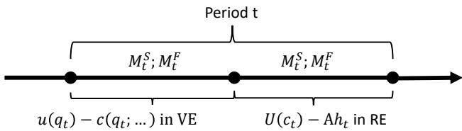
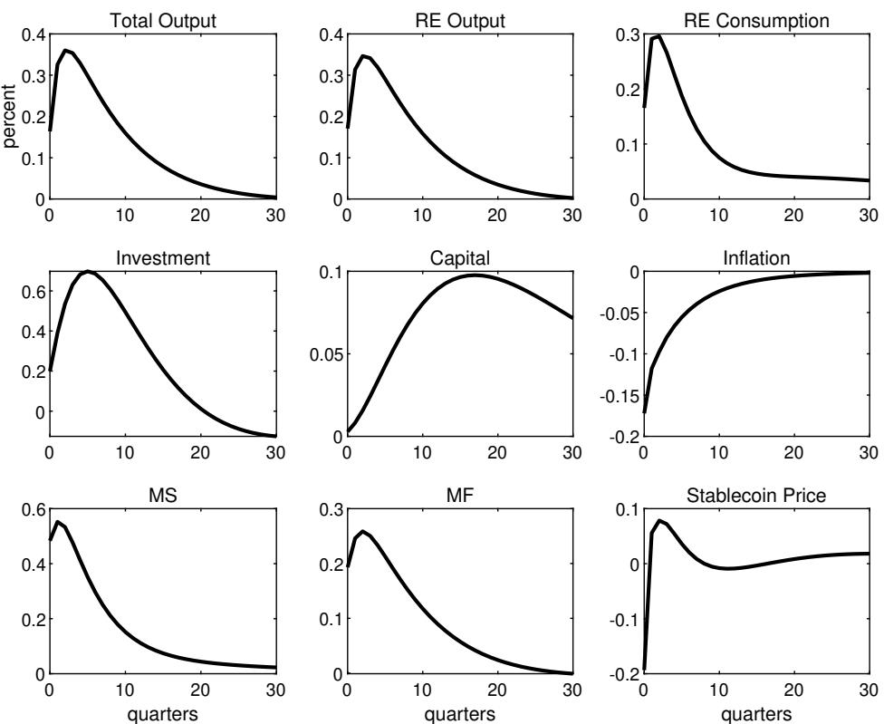
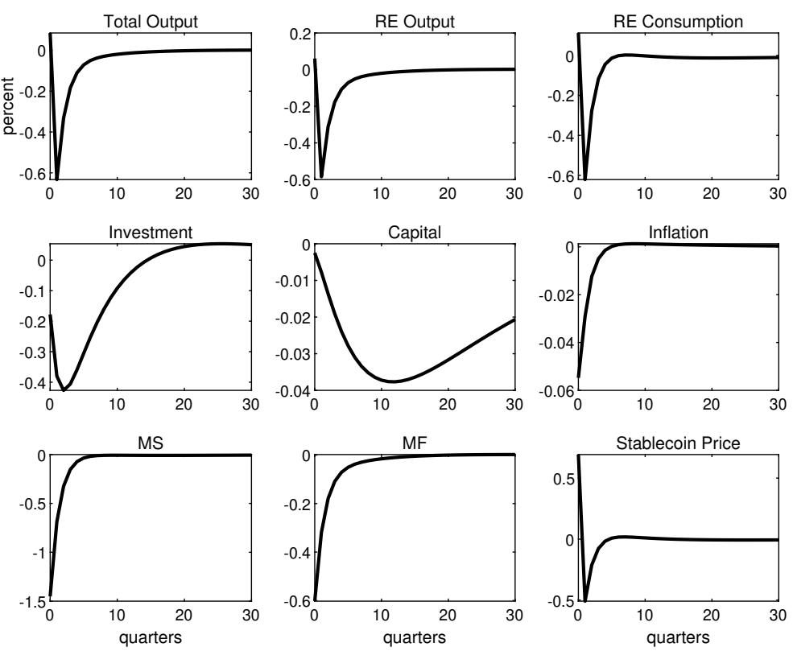
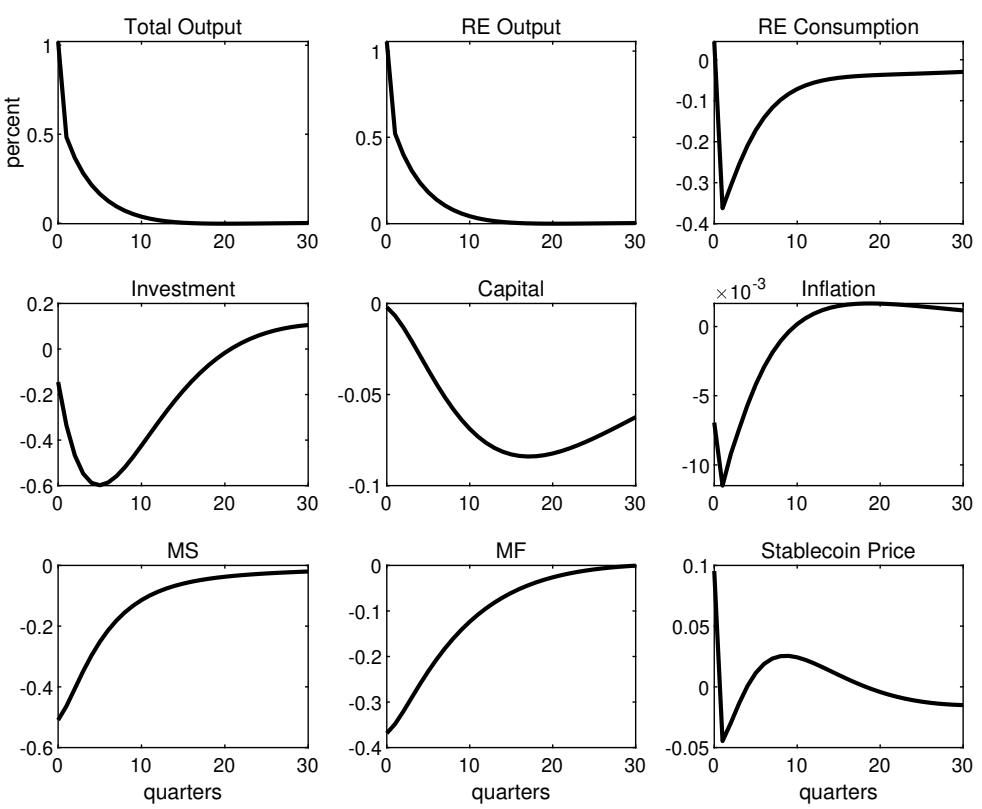
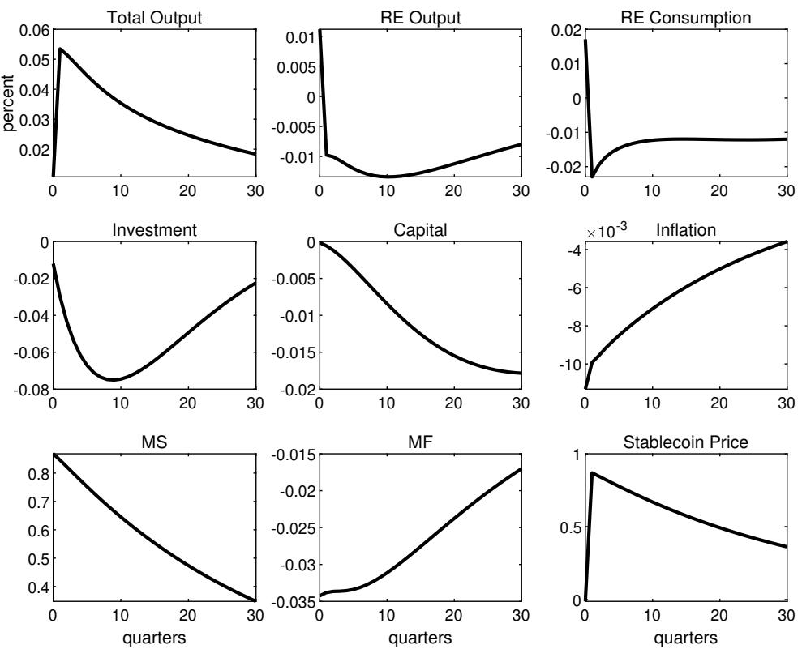

# Stablecoins and Macroeconomic Stability: A DSGE Investigation

Hui He, Yao Zhao, and Dayong Zhou

WP/26/129

IMF Working Papers describe research in progress by the author(s) and are published to elicit comments and to encourage debate. The views expressed in IMF Working Papers are those of the author(s) and do not necessarily represent the views of the IMF, its Executive Board, or IMF management.

2026
JUN

# IMF Working Paper Monetary and Capital Markets Department

Stablecoins and Macroeconomic Stability: A DSGE Investigation Prepared by Hui He, Yao Zhao, and Dayong Zhou

Authorized for distribution by Oana Croitoru
June 2026

IMF Working Papers describe research in progress by the author(s) and are published to elicit comments and to encourage debate. The views expressed in IMF Working Papers are those of the author(s) and do not necessarily represent the views of the IMF, its Executive Board, or IMF management.

ABSTRACT: The paper develops a new monetarist DSGE model to examine the macroeconomic implications of fiat-money-backed stablecoins and the effectiveness of prudential policies in mitigating associated risks. The model features two segmented sectors: a centralized real economy where fiat money facilitates consumption and investment, and a decentralized virtual economy characterized by anonymous bilateral search and matching, in which transactions are exclusively conducted using stablecoins. Calibrated to the U.S. economy, the simulation results reveal that stablecoins amplify the propagation of exogenous shocks to key macroeconomic variables by weakening the effectiveness of monetary policy. However, prudential regulations—specifically those governing the backing ratio of stablecoins to fiat-denominated reserve assets, analogous to banking liquidity requirements—can serve as stabilizing instruments, dampening volatility and enhancing macroeconomic resilience in the presence of stablecoins.

RECOMMENDED CITATION: He, H., Zhao, Y., and Zhou, D. (2026). “Stablecoins and Macroeconomic Stability: A DSGE Investigation.” IMF Working Paper No. 26/129, International Monetary Fund, Washington DC.

JEL Classification Numbers:

E12, E32, E41, E42, E52

Keywords:

Stablecoin; DSGE; Monetary Search; Currency

Competition; Prudential Regulation

Author's E-Mail Address:

hhe@imf.org; bnuer0011@gmail.com; zdy669782@gmail.com

WORKING PAPERS

# Stablecoins and Macroeconomic Stability: A DSGE Investigation

Prepared by Hui He, Yao Zhao, and Dayong Zhou $^{12}$

## Contents

1. Introduction .... 3
2. Model .... 6
2.1 Households .... 7
2.2 Firms .... 14
3. Model parameterization and calibration .... 17
3.1 Parameter parameterization .... 17
3.2 Calibration .... 18
3.3 Solution method .... 19
4. Dynamic Analysis .... 19
4.1 Impulse responses of various shocks .... 19
4.2 Stablecoins, macro stability, and prudential regulation .... 24
4.3 Sensitivity Analysis .... 26
5. Conclusions .... 28
References .... 28
Annex 1: General Equilibrium Conditions .... 31
Annex 2: Sensitivity Analysis .... 33

## 1 Introduction

In the digital era, the global financial landscape has rapidly evolved, as has the nature of money. In June 2019, Facebook, a big tech company, released a white paper proposing a simple and borderless stablecoin named Libra. $^{1}$ Libra, first global stablecoin as identified by Adachi et al. (2020), would fall into the category of digital money issued by the private sector (Adrian and Mancini-Griffoli, 2019; G7, 2019). On August 7, 2023, the global payment conglomerate PayPal launched a native stablecoin, PYUSD. This marked the first time a USD-denominated stablecoin was issued by a licensed financial institution, in collaboration with a public blockchain platform (Paxos), following the path of the pioneering USD stablecoin USDT, issued by the startup Tether, which is now the largest stablecoin globally. $^{2}$

Today, various digital forms of money have emerged, $^{3}$ including government-run central bank digital currencies (CBDC), blockchain-based bank deposits (tokenized deposits), stablecoins run by big tech or private platforms, and crypto assets based on public blockchains (for example, Bitcoin and Ethereum). $^{4}$

In the spectrum of digital assets, a stablecoin is unique since it is designed to be backed/pegged by a specific asset or a pool/basket of assets. Therefore, it aims to maintain a stable value compared to other forms of crypto assets. A stablecoin is minted on the blockchain and is typically identifiable by one of four underlying collateral structures: fiat-backed, crypto-backed, commodity-backed, or algorithmic. While underlying collateral structures can vary, stablecoins always aim for the same goal: stability (Bullmann et al., 2019). $^{5}$

Against the backdrop of fast-changing financial landscape, stablecoins brought several important perspectives to academia and industry:

(1) Stablecoins are digital assets that aim to maintain a stable value relative to a reference asset. Eichengreen (2019) defines stablecoins and raises doubts about whether these private digital assets can successfully meet the challenges required to scale and maintain their peg over time. He suggests that private stablecoins will face challenges during periods of financial stress, when investors could panic and trigger a “run” on the stablecoin issuers, similar to a bank run. Catalini and Massari (2021) argue that stablecoins can offer some advantages over traditional crypto assets, such as lower volatility, faster transactions, lower costs, and greater accessibility. Lyons and Viswanath-Natraj (2020) take Tether stablecoin (USDT) as an example to explore the theoretical mechanism of stablecoins to stabilize Bitcoin prices and conduct empirical tests. Intriguingly, the quest for stable money is not new, with historical precedents offering valuable insights into the governance challenges inherent in such systems. Frost et al. (2020) examine the erstwhile Bank of Amsterdam, a predecessor to the stablecoins, to show whether the early institutional attempt can provide a stable medium of exchange. They highlight how historical endeavors faced challenges in maintaining trust, managing reserves, and navigating the complexities of monetary governance. This historical lens underscores that the economic and governance issues confronting modern stablecoins are deeply rooted in the persistent challenge of creating reliable, stable forms of money. Uhlig (2022) provides a novel theory accounting for a recent price collapse—a failure algorithm stablecoin named Terra’s UST coin—and quantifies the model’s explanations using the real-world market collapse data.

(2) Despite their design features, stablecoins are susceptible to various forms of risks, such as regulatory uncertainty, consumer protection, and financial instability. Ma et al. (2025) observe that the largest stablecoin issuer, Tether, limits redemption to a concentrated group of agents (around six agents per month). This centralization of arbitrage, coupled with the backing of stablecoins by imperfectly liquid USD assets, introduces significant risks to financial stability, as the ability to maintain the peg under stress relies on the timely and full convertibility of these reserves, and this convertibility would be undermined by “stablecoin runs.” Gross and Senner (2026) provide a detailed analysis of risks faced by stablecoin issuers and by the financial systems in which they operate. They show that systemically large fiat-backed stablecoins can amplify financial stress through redemption-driven fire sales that spill over into sovereign bond markets. Using a structural model, they demonstrate that capital and liquidity buffers are the most effective tools for reducing run risk and market volatility, with redemption gates and shorter asset duration providing additional mitigation. Iyer (2022) studies the transmission between crypto asset markets (particularly Bitcoin and USDT) and traditional financial equity markets. She finds that the transmission effect among crypto assets has been strengthened, and spillovers from crypto asset markets to financial markets are on the significant rise. The findings support calls for global coordination in crypto regulation to mitigate systemic risks. Therefore, stablecoins need to be regulated and supervised by appropriate authorities and comply with relevant standards and rules, as recommended by the IMF (Bains et al. 2022), IMF-FSB (2023) and international standard setting bodies (SSBs, various publications, see footnote 7).

(3) The fast proliferation of stablecoin market holds significant implications for monetary policy transmission in the competitive landscape of the banking sector. The IMF, in its Finance and Development magazine (2025), notes that the demand for U.S. Treasuries could increase due to rising dollar-backed stablecoins, while also highlighting potential risks to banking sectors and fiscal accounts. Currency competition between private digital currencies, such as stablecoins, and traditional fiat money, particularly in countries facing monetary instability or high inflation, also emerges. This competition can exert pressure on central banks which aim to maintain financial stability and the value of their fiat currencies. Benigno et al. (2022) provide a theoretical framework for understanding the concept they term “Crypto-Enforced Monetary Policy Synchronization (CEMPS),” implying that the classic Impossible Trinity (where a country can not simultaneously have independent monetary policy, a fixed exchange rate, and free capital movement) becomes even less reconcilable in a two-country economy with a global cryptocurrency. This leads to tight restrictions on central banks’ monetary policy autonomy. The competition is further nuanced by the rivalry between privately issued stablecoins and CBDCs (Choi and Kim, 2024). $^{6}$

(4) Understanding the cross-border movement of stablecoins is essential for evaluating their global economic implications and for fostering effective international policy coordination. Reuter (2025) introduces a novel methodology to estimate the geographic distribution of international stablecoin flows. Cardozo et al. (2024) explore the channels through which cross-border crypto flows materialize and review various approaches to measure them. Azzimonti and Quadrini (2025) explore how stablecoins, as part of the broader digital economy, could reshape international financial markets using a multi-country model. They postulate that the “reserve demand effect” (stablecoins backed by dollar-denominated assets increase demand for U.S. Treasuries) might, in the long run, lead to lower U.S. interest rates and a rise in U.S. foreign borrowing. A key takeaway from their work is that the design of stablecoins—particularly their collateral backing—plays a pivotal role in shaping international financial flows.

(5) Stablecoins have also gained significant attention from policymakers. In 2019, concerns over regulatory and data gaps led G20 countries to agree that no stablecoin project should proceed until its associated risks and challenges are adequately addressed. Since then, extensive work has been issued by the IMF, the Financial Stability Board (FSB), and international standard setting bodies (SSBs) on the macroeconomic and financial stability implications of crypto-assets, including stablecoins. These organizations have put forward comprehensive recommendations and standards guided by the principle of “same activity, same risk, same regulation.” This establishes a minimum baseline that jurisdictions should aim to meet, addressing a range of issues common across most regions. The recommendations and standards cover financial stability, financial integrity, market integrity, investor protection, prudential, and other risks associated with crypto-assets. $^{7}$ On legal side, GENIUS Act (Guiding and Establishing National Innovation for U.S. Stablecoins) was signed into law by President Trump in July 2025, marking the first major federal framework for stablecoins in the US where its two largest stablecoins (USDT and USDC) represent around 90% of the stablecoin market capitalization. $^{8}$ Hong Kong enacted its stablecoin law, the Stablecoins Ordinance, on August 1, 2025, requiring fiat-referenced stablecoin issuers to obtain licenses from the Hong Kong Monetary Authority (HKMA). These legislative developments mark a turning point in crypto regulation, aiming to balance innovation with consumer protection and financial stability. They are expected to encourage further stablecoin issuance in the long run.

Despite the active policy discourse and regulatory advances, fundamental economic questions about stablecoins remain unresolved. For instance, Can stablecoins help stabilizing economies against shocks and fostering a stable environment for cryptocurrency adoption? What would be the macroeconomic impacts on an economy if both fiat money and stablecoins co-exist as a mean-of-payment? Would monetary policies be affected by the introduction of stablecoins? And if so, how shall we address to it? The current paper seeks to address these gaps by presenting the first comprehensive DSGE model of stablecoins, with focus on fiat-backed stablecoins. We then can quantify the model to answer the questions raised above.

To do so, we build up a DSGE model with two currencies. Based on the monetary search model as in Aruoba and Schorfheide (2011, hereafter AS) which is rooted in Lagos and Wright (2005, hereafter LW), we incorporate a stablecoin which is backed by fiat money reserve assets into a rather standard New Keynesian (NK) DSGE setting. In this model, cash-in-advance (CIA) constraint justifies the need for the fiat money. In contrast, the demand of a stablecoin comes from households who have to use the stablecoins to purchase goods with their price exclusively denominated in stablecoins. $^{9}$ Three model features distinguish a stablecoin from a fiat currency. First, stablecoins are fully digital and are anonymously traded in Decentralized Finance (DeFi) environment, aligning naturally with the Lagos-Wright framework. Fiat money $^{10}$ , by contrast, is physical legal tender. Second, the production and transaction cost of a stablecoin is much less than that of a fiat money since it is a digital currency. Third, private issuers of stablecoins peg their coins to fiat currency and try to comply this peg, in the spirit of recently passed acts such as GENIUS and HKMA Stablecoin Bill; While fiat currency relies on the trust in government and does not peg to anything.

We calibrate the model to represent the US economy in a forward-looking fashion, with particular attention to stablecoin-related parameters, which are informed by data and projections from major U.S. fiat-backed stablecoins. By feeding in multiple shocks to the model, we find that a higher stablecoin penetration rate amplifies volatilities of all major macroeconomic variables. This suggests that, as a by-product of their design, stablecoins may not contribute to macroeconomic stability. Furthermore, the model reveals a significant currency switching effect between fiat money and stablecoins, indicating the presence of currency competition in the payment system. $^{11}$

The policy implications of our findings are clear: They lend support to regulatory frameworks targeting stablecoins. Our analysis further demonstrates that well-designed prudential regulations—particularly those governing the backing ratio between stablecoins and fiat assets—can mitigate the additional macroeconomic volatility associated with stablecoin adoption. By limiting amplification effects on output and financial conditions, such regulations operate as effective “stabilizers”, helping to smooth business cycle fluctuations.

Our contributions to the literature are twofold: (a) Model innovation: this is the first paper to incorporate a micro-founded monetary search framework to endogenously justify demand for stablecoins within a New Keynesian DSGE model. We explicitly model the coexistence of fiat money and stablecoins in a unified macroeconomic setting; (b) Policy framework: We develop a theoretical foundation for applying prudential regulations to address the macroeconomic instabilities caused by stablecoins. This provides a new lens through which to evaluate digital currency policy interventions. In doing so, our paper responds to the concerns outlined in items (1), (2), (3), and (5) above. Item (4), which relates to the international dimension of stablecoin flows, remains outside the scope of this paper and would require an open-economy extension of our model.

Our paper builds closely on AS (2011) who were the first to integrate monetary search model (LW, 2005) into a rather standard NK-DSGE model with sticky price. They demonstrate that monetary frictions are as important as price stickiness in shaping optimal monetary policy, challenging the traditional emphasis on price rigidity alone. We extend their framework by introducing stablecoins, showing that monetary search frictions are also critical in understanding the role of digital currencies. More importantly, we provide a theoretical basis for using prudential regulation tools to address the intrinsic instabilities that stablecoins may introduce—an innovation beyond the original AS (2011) model.

Our paper challenges a well-known conclusion Woodford drew regarding the effectiveness of monetary policy and “cashless economy.” In his influential book Interest and Prices (2003), Woodford argues that the effectiveness of monetary policy does not rely on money as a medium of exchange but on the central bank’s ability to control the expected path of short-term nominal interest rates that anchor intertemporal prices in a given unit of account. In his New Keynesian framework, aggregate demand and inflation are determined by forward-looking Euler and Phillips-curve relations that make no reference to money demand, implying that even in a cashless economy a credible interest-rate rule suffices to influence real activity and inflation through expectations. However, this irrelevance result may fail once stablecoins are introduced in environments with money search frictions, even this movement would push the economy towards more “cashless.” In such settings, stablecoins can weaken monetary transmission by fragmenting the medium of exchange or competing for unit-of-account functions, rendering monetary policy effectiveness contingent on payment frictions and monetary dominance rather than solely on expectations management.

The paper is organized as follows: Session 2 introduces our two-sector two-currency DSGE model, which establishes the demand for a stablecoin through the monetary search framework and integrates it into a NK-DSGE setting. Session 3 describes calibration of model parameters, with particular emphasis on those related to stablecoin behavior and usage. Session 4 presents the quantitative dynamic analysis of the model, including impulse response functions and variance decompositions. We also explore the effects of key policy instruments, demonstrating how well-designed prudential tools can mitigate macroeconomic instabilities arising from stablecoin adoption. Sensitivity analysis is also provided to assess the robustness of our quantitative results. Finally, Session 5 concludes.

## 2 The Model

Several strands of literature have employed monetary search theory to model privately issued fiat currencies within dynamic frameworks—for example, Fernández-Villaverde and Sanches (2019). Others, such as Sockin and Xiong (2020), have explored stablecoins in partial equilibrium settings. However, there remains a notable gap in the literature: no existing research has jointly modeled stablecoins and fiat currency within a dynamic general equilibrium framework. This paper aims to fill that void.

In this paper, We try to seriously model three distinguished features of a fiat-backed stablecoin: i) Pseudonymity: Stablecoin transactions are recorded on public blockchains using pseudonymous wallet addresses rather than real-world identities. This makes it difficult to trace the actual buyers and sellers involved in transactions. $^{12}$ ii) Digitization: Stablecoins are inherently digital assets. Their technological nature enables significantly lower issuance cost and transaction cost compared to fiat money, making them highly efficient instruments in DeFi ecosystems. iii) Fiat-backing: Stablecoins are typically pegged to fiat currencies, which underpins their perceived stability. However, our model allows private issuers to deviate from this peg (“de-pegging”), subject to a penalty, reflecting real-world practices and regulatory concerns.

With these three features in mind, we now describe our model in more details.

## 2.1 Households

There is a continuum of infinitely lived households with unit measure in the model economy. Prior to transactions, all households are ex ante identical. Households derive utility from their economic activities in two segmented markets: a decentralized “virtual economy (VE)” market and a centralized “real economy (RE)” market. In decentralized VE, households engage in anonymous bilateral matching in the spirit of LW (2005). In contrast, the centralized RE is modeled using a standard NK DSGE framework, where production is carried out by firms and transactions occur in centralized goods and labor markets. Importantly, households can only use stablecoins $M_{t}^{S}$ in VE and can only use fiat money $M_{t}^{F}$ in RE. This segmentation introduces a dual-currency structure and reflects the differentiated roles of digital and traditional currencies in modern economies. $^{13}$

The timing of each period in the model economy is as follows. First, at the beginning of each period, affected by an exogenous shock that is applicable to all households, the previously identical households (they carry end-of-last-period amount of stablecoins $M_{t}^{S}$ and fiat money $M_{t}^{F}$ into period t) are divided into three different types: sellers, buyers, and households that do not participate in transactions, with probabilities of $\sigma$ , $\sigma$ , and $1 - 2\sigma$ , respectively. Second, during the first sub-period, buyers and sellers will use stablecoins $M_{t}^{S}$ as the sole medium of exchange in the decentralized VE to conduct consumer goods transactions ( $q_{t}$ ) in the form of search-matching. And together they gain utility $u(q_{t}) - c(q_{t}, \ldots)$ , where $u(q_{t})$ denotes utility of buyers derived from consumption in VE and $c(q_{t}, \ldots)$ is the cost of sellers transacting stablecoins in VE (hence a disutility for sellers). We assume that buyers and sellers are interchangeable in the model. Third, after the completion of transactions in VE, still in this period, all households leave and then enter the second sub-period—centralized RE (carrying amount of moneys $M_{t}^{S}$ and fiat money $M_{t}^{F}$ ). Fiat money $M_{t}^{F}$ is used for conventional economic decisions such as RE consumption ( $c_{t}$ ), labor supply ( $h_{t}$ ), and asset holding to gain utility $U(c_{t}) - Ah_{t}$ in RE (illustrated by Figure 1).

  
Figure 1: Timeline for sequential economic decisions in VE and RE
Source: the authors

## 2.1.1 Household behavior in RE

We present households' mathematical decision problems using backward induction, consistent with the solution method employed for the dynamic model.

In each period, the three types of households enter RE after completing transactions between the sellers and the buyers in VE. The preferences of all households become identical again after VE. In the RE market, the price level $P_{t}$ is taken as given, as well as the nominal gross interest rate of one-period government bonds $R_{t}$ , the real wage rate $W_{t}$ , the real capital return $R_{t}^{k}$ , and the aggregate shocks $S_{t}$ . The value function of households in the RE market $V_{t}^{RE}$ is expressed as follows:

$$
\begin{array}{l} V _ {t} ^ {R E} (M _ {t} ^ {S}, M _ {t} ^ {F}, k _ {t}, i _ {t - 1}, B _ {t}, \mathcal {S} _ {t}) \\ = \max _ {M _ {t + 1} ^ {S}, M _ {t + 1} ^ {F}, k _ {t + 1}, i _ {t}, B _ {t + 1}} \Big \{U (c _ {t}) - A h _ {t} + \beta \mathbb {E} _ {t} V _ {t + 1} ^ {V E} (M _ {t + 1} ^ {S}, M _ {t + 1} ^ {F}, k _ {t + 1}, i _ {t}, B _ {t + 1}, \mathcal {S} _ {t + 1}) \Big \}, \end{array}\tag{1}
$$

where $c_{t}$ is the real consumption in VE by households at period t, $k_{t}$ is the real capital owned by households at the beginning of period t, $i_{t-1}$ is the real capital investment in the pervious period, and $B_{t}$ is the nominal balance of government bonds held from the previous period. $U(c_{t})$ refers to the utility derived from the consumption $c_{t}$ , and $h_{t}$ is the labor supplied by households to the market at time t. Constant A > 0 measures the utility loss (disutility) brought by one unit of labor supply. $0 < \beta < 1$ is the discount rate. The equation $V_{t+1}^{VE}$ is the value function of households in VE at the next period $t+1$ . Notice that in this two-sector segmented markets setting, we introduce two currencies: $M_{t}^{S}$ presents the real balance of stablecoins held by households entering VE with $\chi_{t}$ being their price (nominal balance is $\chi_{t}M_{t}^{S}$ ); $^{14}$ and $M_{t}^{F}$ represents the nominal balance of fiat money held by households at the beginning of VE (and carry through to RE).

In RE, the representative household faces three constraints:

$$
P _ {t} c _ {t} + P _ {t} i _ {t} + B _ {t + 1} + \chi_ {t} M _ {t + 1} ^ {S} + M _ {t + 1} ^ {F} = P _ {t} W _ {t} h _ {t} + P _ {t} R _ {t} ^ {k} k _ {t} + R _ {t - 1} B _ {t} + \chi_ {t} M _ {t} ^ {S} + M _ {t} ^ {F} + \Pi_ {t} - T _ {t},\tag{2}
$$

$$
k _ {t + 1} = (1 - \delta) k _ {t} + [ 1 - \Phi (\frac {i _ {t}}{i _ {t - 1}}) ] i _ {t},\tag{3}
$$

$$
c _ {t} + i _ {t} = \frac {M _ {t} ^ {F}}{P _ {t}}.\tag{4}
$$

Equation (2) is the budget constraint for the household. $\Pi_t$ refers to the profits obtained by the household that come from production. $T_t$ represents the government's lump-sum tax/transfer to the household. Equation (3) is the law of motion for capital stock where $\Phi(\cdot)$ is the adjustment cost of capital. Finally, equation (4) is the cash-in-advance (CIA) constraint, indicating that one has to use fiat money (cash) to purchase for consumption and investment goods. The Lagrangian multipliers of constraints (2)-(4) are expressed by $\lambda_t$ , $\Psi_t$ , and $\phi_t$ , respectively. Notice that $\lambda_t$ represents marginal utility of income and $\phi_t$ is marginal utility of the liquidity services provided by fiat money.

## 2.1.2 Household behavior in VE

As described in Figure 1, at the beginning of each period t, before the type shock is revealed, the value function of households in VE has the following probability-weighted form:

$$
\begin{array}{r l} & V _ {t} ^ {V E} \big (M _ {t} ^ {S}, M _ {t} ^ {F}, k _ {t}, i _ {t - 1}, B _ {t}, \mathcal {S} _ {t} \big) = \sigma V _ {t} ^ {V E, s e l l e r} \big (M _ {t} ^ {S}, M _ {t} ^ {F}, k _ {t}, i _ {t - 1}, B _ {t}, \mathcal {S} _ {t} \big) \\ & \qquad + \sigma V _ {t} ^ {V E, b u y e r} \big (M _ {t} ^ {S}, M _ {t} ^ {F}, k _ {t}, i _ {t - 1}, B _ {t}, \mathcal {S} _ {t} \big) \\ & \qquad + (1 - 2 \sigma) V _ {t} ^ {R E} \big (M _ {t} ^ {S}, M _ {t} ^ {F}, k _ {t}, i _ {t - 1}, B _ {t}, \mathcal {S} _ {t} \big). \end{array}\tag{5}
$$

Three possible cases of household characteristics after the realization of the idiosyncratic type shock are presented in equation (5). $1-2\sigma$ is the fraction of households not participating in the VE transactions, and hence the value function of such households remains the same as the value function in the “flat money (RE) economy". $\sigma$ is the fraction of households becoming either a buyer or a seller, and the value functions of these two types of households are denoted as $V_{t}^{VE,buyer}$ and $V_{t}^{VE,seller}$ , respectively,

$$
V _ {t} ^ {V E, b u y e r} (M _ {t} ^ {S}, M _ {t} ^ {F}, k _ {t}, i _ {t - 1}, B _ {t}, \mathcal {S} _ {t}) = z _ {t} ^ {S} u (q _ {t} ^ {b}) + V _ {t} ^ {R E} (M _ {t} ^ {S} - d _ {t} ^ {b}, M _ {t} ^ {F}, k _ {t}, i _ {t - 1}, B _ {t}, \mathcal {S} _ {t}),\tag{6}
$$

$$
V _ {t} ^ {V E, s e l l e r} (M _ {t} ^ {S}, M _ {t} ^ {F}, k _ {t}, i _ {t - 1}, B _ {t}, \mathcal {S} _ {t}) = - c (q _ {t} ^ {s}, k _ {t}, z _ {t} ^ {P}) + V _ {t} ^ {R E} (M _ {t} ^ {S} + d _ {t} ^ {s}, M _ {t} ^ {F}, k _ {t}, i _ {t - 1}, B _ {t}, \mathcal {S} _ {t}),\tag{7}
$$

where $q_{t}^{b}$ and $d_{t}^{b}$ ( $q_{t}^{s}$ and $d_{t}^{s}$ ) respectively represent the consumption and the amount of stablecoins used in transactions for the buyer (seller) in VE, which both will be finally determined by anonymous bilateral bargaining. Accordingly, $u(q_{t}^{b})$ represents the utility for the buyer after the acquisition of $q_{t}^{b}$ , and $c(.)$ represents the cost of the seller producing digital goods of $q_{t}^{s}$ . This cost is also affected by capital $k_{t}$ and aggregate productivity $z_{t}^{P}$ . We incorporate aggregate productivity into the seller's cost function to reflect the technological nature of stablecoin transactions. These transactions are enabled by cutting-edge IT technology, which plays a crucial role in reducing the cost of using stablecoins. Equipment such as computers and hardware, along with infrastructure like fiber-optic cables and internet networks, significantly influence the efficiency and cost of stablecoin-based exchanges. To capture this, we also include capital stock in the cost function, recognizing its role in facilitating digital transactions. Finally, $z_{t}^{S}$ represents the buyer's preference for stablecoins. An increase $z_{t}^{S}$ reflects a stronger desire by buyers to consume goods in the virtual economy ( $q_{t}^{b}$ ), which in turn requires a higher spending of stablecoins. This mechanism effectively models $z_{t}^{S}$ as a demand shock for stablecoins, influencing both transaction volume and price dynamics in the decentralized VE.

Notice that our setting of VE versus RE is similar to the decentralized market (DM) versus centralized market (CM) setting as in LW (2005). LW (2005) show that the value function of households in DM, $V_{t}^{DM}$ , has a linear relationship with fiat money, the only currency in their model. $^{15}$ We inherit this nice property for stablecoins and VE (equivalent to their DM) in our two-currency model. Therefore, in our model, disutility (utility) for buyer (seller) can be measured by the shadow price of fiat money $\lambda_{t}$ multiplying the transaction volume $d_{t}^{b}$ ( $d_{t}^{s}$ ) and the nominal price of stablecoins ( $\chi_{t}$ ). Taking (6) and (7) into (5), and after some rearrangements, we have the following expression of the value function for households in the VE:

$$
\begin{array}{r} V _ {t} ^ {V E} (M _ {t} ^ {S}, M _ {t} ^ {F}, k _ {t}, i _ {t - 1}, B _ {t}, \mathcal {S} _ {t}) = V _ {t} ^ {R E} (M _ {t} ^ {S}, M _ {t} ^ {F}, k _ {t}, i _ {t - 1}, B _ {t}, \mathcal {S} _ {t}) \\ + \sigma [ z _ {t} ^ {S} u (q _ {t} ^ {b}) - \lambda_ {t} \chi_ {t} d _ {t} ^ {b} ] + \sigma [ \lambda_ {t} \chi_ {t} d _ {t} ^ {s} - c (q _ {t} ^ {s}, k _ {t}, z _ {t} ^ {P}) ]. \end{array}\tag{8}
$$

## 2.1.3 Bilateral negotiation between buyers and sellers in VE

In the VE, after the type shock is realized, some households are divided into buyers and sellers and they are engaged in anonymous bilateral negotiation/matching. Their subsequent transactions determine the demand for stablecoins and the output of the virtual economy accordingly. The bilateral negotiation is described by the following constrained Nash bargaining problem:

$$
\max _ {q _ {t}, d _ {t} ^ {b}, d _ {t} ^ {s}} [ z _ {t} ^ {S} u (q _ {t}) - \frac {A \chi_ {t} d _ {t} ^ {b}}{W _ {t} P _ {t}} ] ^ {\theta} [ \frac {A \chi_ {t} d _ {t} ^ {s}}{W _ {t} P _ {t}} - c (q _ {t}, k _ {t}, z _ {t} ^ {P}) ] ^ {1 - \theta}.\tag{9}
$$

The first term in equation (9) captures buyers' surplus and the second term represents sellers' surplus. Notice that according to LW (2005), in equilibrium, we have:

$$
d _ {t} ^ {b} = d _ {t} ^ {s} \equiv d _ {t} = M _ {t} ^ {s}.\tag{10}
$$

The parameters $\theta$ and $1 - \theta$ , respectively, denote the bargaining power of the buyers and the sellers, who maximize their own surplus through the bilateral trade. The First-Order Condition (FOC) for the maximization problem is (with $q_{t}^{s} = q_{t}^{b} = q_{t}$ ):

$$
\frac {A}{W _ {t} P _ {t}} \chi_ {t} M _ {t} ^ {S} = g (q _ {t}, k _ {t}, z _ {t} ^ {S}, z _ {t} ^ {P}),\tag{11}
$$

where function $g(\cdot)$ takes the specification below:

$$
g (q _ {t}, k _ {t}, z _ {t} ^ {S}, z _ {t} ^ {P}) = \frac {\theta z _ {t} ^ {S} u ^ {\prime} (q _ {t}) c (q _ {t} , k _ {t} , z _ {t} ^ {P}) + (1 - \theta) c _ {q} (q _ {t} , k _ {t} , z _ {t} ^ {P}) z _ {t} ^ {S} u (q _ {t})}{\theta z _ {t} ^ {S} u ^ {\prime} (q _ {t}) + (1 - \theta) c _ {q} (q _ {t} , k _ {t} , z _ {t} ^ {P})}.\tag{12}
$$

Notice that $c_{q}(q_{t}, k_{t}, z_{t}^{p})$ is the first order derivative of function $c(.)$ with respect to $q_{t}$ . The left-hand side of equation (11) is the real marginal cost for stablecoins (used to purchase consumption goods in VE) in terms of fiat money (and ultimately in terms of goods in RE) because $\lambda_{t} = \frac{A}{W_{t}P_{t}}$ is the shadow price for RE's budget constraint. The right-hand side of equation (11) is the marginal benefit of using the stablecoins to consume, which can be decomposed into two parts (see equation (12)). One is the weighted cost of producing VE consumption goods and the other is the weighted utility of consuming the goods, with weights reflecting the bargaining power of buyers and sellers tuned by both marginal utility of buyers and marginal cost of sellers.

Alternative to the Nash bargaining solution, the Kalai solution to bilateral trading (as a special case of Nash solution) requires that at equilibrium the marginal utility of buyers is equal to the marginal cost of sellers (i.e. $z_{t}^{S}u'(q_{t}^{*}) = c_{q}(q_{t}^{*})$ ). Therefore, $g(q_{t}, k_{t}, z_{t}^{S}, z_{t}^{P})$ in equation (12) is reduced to a weighted mean of buyers' utility and sellers' cost of production, namely,

$$
g (q _ {t} ^ {*}) = \theta c (q _ {t} ^ {*}) + (1 - \theta) z _ {t} ^ {S} u (q _ {t} ^ {*}).\tag{13}
$$

Finally, Rubinstein solution to the bargaining problem assumes buyers occupy all the bargaining power $(\theta = 1)$ , which enables buyers to take all sellers' surplus. In this case, function $g(\cdot)$ is utterly simplified to the producing cost function for sellers, i.e., $g(q_{t}) = c(q_{t})$ . More details can be seen in Rocheteau and Wright (2005).

## 2.1.4 Optimal conditions for household behaviors

We now finish describing household behaviors in the two markets. Take all FOCs and the envelope condition together, and let $\mu_{t} = \frac{\Psi_{t}}{U'(c_{t})}$ denote the shadow price of installed capital and $\pi_{t+1} = \frac{P_{t+1}}{P_{t}}$ be the gross inflation rate in RE, we can obtain the following system of non-linear equations:

$$
W _ {t} = \frac {A}{u ^ {\prime} (c _ {t}) - \phi_ {t}},\tag{14}
$$

$$
1 = \beta \mathbb {E} _ {t} \bigg [ \bigg (\frac {u ^ {\prime} (c _ {t + 1}) - \phi_ {t + 1}}{u ^ {\prime} (c _ {t}) - \phi_ {t}} \bigg) \frac {R _ {t}}{\pi_ {t + 1}} \bigg ],\tag{15}
$$

$$
1 = \mu_ {t} \left[ 1 - \Phi \left(\frac {i _ {t}}{i _ {t - 1}}\right) + \frac {i _ {t}}{i _ {t - 1}} \Phi^ {\prime} \left(\frac {i _ {t}}{i _ {t - 1}}\right) \right]
$$

$$
+ \beta \mathbb {E} _ {t} \left[ \mu_ {t} \frac {u ^ {\prime} (c _ {t + 1})}{u ^ {\prime} (c _ {t})} \left(\frac {i _ {t + 1}}{i _ {t}}\right) ^ {2} \Phi^ {\prime} \left(\frac {i _ {t + 1}}{i _ {t}}\right) \right],\tag{16}
$$

$$
\mu_ {t} = \beta \mathbb {E} _ {t} \bigg [ \bigg (\frac {u ^ {\prime} (c _ {t + 1})}{u ^ {\prime} (c _ {t})} \bigg) \big (R _ {t + 1} ^ {k} + (1 - \delta) \mu_ {t + 1} \big) - \frac {\phi_ {t + 1} R _ {t + 1} ^ {k}}{u ^ {\prime} (c _ {t})} - \frac {\sigma \Gamma (q _ {t} , k _ {t} , z _ {t} ^ {S} , z _ {t} ^ {P})}{u ^ {\prime} (c _ {t})} \bigg ],\tag{17}
$$

$$
1 = \beta \mathbb {E} _ {t} \bigg [ \frac {u ^ {\prime} (c _ {t + 1}) - \phi_ {t + 1}}{u ^ {\prime} (c _ {t}) - \phi_ {t}} \frac {1}{\pi_ {t + 1}} \bigg (\frac {\sigma u ^ {\prime} (q _ {t + 1}) z _ {t + 1} ^ {S}}{g _ {q} (q _ {t + 1} , k _ {t + 1} , z _ {t + 1} ^ {S} , z _ {t + 1} ^ {P})} + 1 - \sigma \bigg) \bigg ],\tag{18}
$$

$$
m _ {t} ^ {s} \equiv \frac {M _ {t} ^ {s}}{P _ {t - 1}} = \frac {g (q _ {t} , k _ {t} , z _ {t} ^ {S} , z _ {t} ^ {P}) \pi_ {t} W _ {t}}{A \chi_ {t}},\tag{19}
$$

$$
\lambda_ {t} - \phi_ {t} = \beta \frac {\lambda_ {t + 1}}{\pi_ {t + 1}}.\tag{20}
$$

Equation (14) is the standard intra-temporal optimal condition for labor supply. Equation (15) is the intertemporal Euler equation for government bond. Equation (16) is the Euler equation for investment. Equation (17) is the key Euler equation for capital stock, which defines the dynamic relationship between the consumption of households in RE and their consumption in VE $\left(\Gamma(q_{t}, k_{t}, z_{t}^{S}, z_{t}^{P})\right)$ is a composition of functions which is defined in equation (A.13) in Appendix A). Equation (18) is another key Euler equation for holding stablecoins in VE where $g_{q}(q, k, z^{s}, z^{p})$ is the first order derivative of function $g(\cdot)$ with respect to $q_{t}$ . Equation (19) is a rephrase of FOC for Nash bargaining problem (equation (11)) by defining real stablecoin balance $m_{t}^{s}$ . Finally, equation (20) is the Euler equation for fiat money holding.

Notice that both equations $(18)$ and $(19)$ are unique due to the presence of VE market and stablecoins compared to previous literature. Combining equations $(18)$ and $(19)$ yields equation $(21)$ , which outlines a demand function for stablecoins:

$$
M _ {t + 1} ^ {s} = \beta \mathbb {E} _ {t} \bigg [ \frac {g (q _ {t + 1} , k _ {t + 1} , z _ {t + 1} ^ {S} , z _ {t + 1} ^ {P})}{\chi_ {t + 1} (u ^ {\prime} (c _ {t}) - \phi_ {t})} \bigg (\frac {\sigma z _ {t + 1} ^ {S} u ^ {\prime} (q _ {t + 1})}{g _ {q} (q _ {t + 1} , k _ {t + 1} , z _ {t + 1} ^ {S} , z _ {t + 1} ^ {P})} + 1 - \sigma \bigg) \bigg ].\tag{21}
$$

As a demand function for stablecoins, equation (21) has some nice features: 1) ceteris paribus, the demand for stablecoins is decreasing at their own price of $\chi_{t+1}$ ; 2) as marginal benefit of holding stablecoins $(g(\cdot))$ increases, the demand for stablecoins also increases; 3) when the share of bilateral traders in the VE $(\sigma)$ increases, the demand for stablecoins increases; and finally 4) when preference for stablecoins $(z^S)$ increases, the demand for stablecoins naturally increases as well.

## 2.1.5 Supply of stablecoins

We now turn to supply side of stablecoins. Referring as a private money (King, 1983; Williamson, 1999), a positive spread of the market price of stablecoins over $R_{t}$ would incentivize the private issuers to mint more stablecoins. Conversely, if the spread turns negative, issuers are motivated to reduce the supply—melting stablecoins—to preserve profitability.

Issuers are also subject to a regulatory requirement that the ratio of stablecoins in circulation to fiat reserves and government bonds remains close to a predetermined threshold ("peg"), denoted by $\nu$ . $^{16}$ Compliance with this regulation imposes a cost on the issuers, particularly when the actual ratio deviates from the target. We model this regulatory cost as a quadratic loss/penalty function, reflecting increasing marginal costs of deviation. Importantly, this penalty is denominated in fiat currency, meaning the issuers must pay the cost in fiat terms. $^{17}$

Under these assumptions, the profit from issuing stablecoins is proportional to the spread $(\chi_t - R_t)$ . The issuers' profit maximization problem can thus be expressed in a tractable form as follows:

$$
\max _ {M _ {t} ^ {S}} (\chi_ {t} - R _ {t}) M _ {t} ^ {s} - \phi \bigg (\frac {M _ {t} ^ {S}}{M _ {t} ^ {F} + B _ {t}} - \nu \bigg) ^ {2} \frac {M _ {t} ^ {F} + B _ {t}}{2}.\tag{22}
$$

And the first order condition to the maximization problem gives rise to a rule for stablecoin supply:

$$
\chi_ {t} - R _ {t} = \phi \bigg (\frac {M _ {t} ^ {S}}{M _ {t} ^ {F} + B _ {t}} - \nu \bigg).\tag{23}
$$

The economic intuition underlying equation (23) is straightforward. The left-hand side of the equation captures the spread between holding stablecoins and fiat money. This spread is directly linked to deviations from the “peg,” defined by the target backing ratio $\nu$ . When the spread is positive and relatively high, the private issuer has a stronger incentive to issue additional stablecoins beyond the base level. As a result, the ratio of stablecoins to their fiat-denominated reserve assets, $\frac{M_{t}^{S}}{M_{t}^{F}+B_{t}}$ , tends to exceed the target backing ratio $\nu$ .

## 2.1.6 Real interest rate of stablecoins

Having established the supply and demand functions for stablecoins, we proceed to derive their implied interest rate. It is well known that the implicit interest rate of fiat money is the opportunity cost of holding cash, which is $R_{t}$ . Due to its crypto nature of stablecoins (and hence it can be only used in VE in the model), the implicit interest rate of stablecoins $^{18}$ would be different from that of fiat money and it can be derived from equation (18).

We first rewrite Euler equation for stablecoins—equation (18):

$$
\lambda_ {t} = \beta \mathbb {E} _ {t} \bigg [ \lambda_ {t + 1} + \sigma \bigg [ z _ {t + 1} ^ {S} u ^ {\prime} (q _ {t + 1}) \frac {\partial q _ {t}}{\partial M _ {t} ^ {S}} - \lambda_ {t + 1} \frac {\partial d _ {t}}{\partial M _ {t} ^ {S}} \bigg ] \bigg ].\tag{24}
$$

Notice that the equation above is tantamount to the one below:

$$
\beta \mathbb {E} _ {t} \frac {\lambda_ {t + 1}}{\lambda_ {t}} \bigg [ (1 - \sigma) + \sigma \frac {z _ {t + 1} ^ {S} u ^ {\prime} (q _ {t + 1})}{g _ {q _ {t + 1}}} \bigg ] = 1.\tag{25}
$$

Equation (25) serves as a pricing equation for stablecoins. Its economic intuition is straightforward: the real value of a stablecoin today reflects the expected real value of holding it into the next period—weighted by the probability of not spending it today $(1-\sigma)$ —plus the expected utility or transactional benefit derived from spending it today, which occurs with probability $\sigma$ . This formulation thus captures the dual role of stablecoins as both a store of value and a medium of exchange within the model.

Rearranging terms in equation (25) can lead to:

$$
z _ {t} ^ {S} \frac {u ^ {\prime} (q _ {t})}{g _ {q _ {t}}} = 1 + \frac {R _ {t} / \pi_ {t + 1} - 1}{\sigma}.\tag{26}
$$

Equation (26) defines the real interest rate for holding stablecoins (gross term). Therefore, the second term of the right-hand side of equation (26) is the net real interest rate of stablecoins, which we denote it as $r_{t}^{VE}$ :

$$
r _ {t} ^ {V E} \equiv \frac {R _ {t} / \pi_ {t + 1} - 1}{\sigma}.\tag{27}
$$

It is important to note that the maximum value of $\sigma$ —the probability that households use stablecoins for transactions—is 0.5 since $1 - 2\sigma \geq 0$ . This implies that the implicit real interest rate on stablecoins, $r_{t}^{VE}$ , is at least twice as high as the real interest rate on fiat money. Moreover, $r_{t}^{VE}$ is inversely related to $\sigma$ : as the environment for transacting in stablecoins becomes more restricted (i.e., $\sigma$ decreases), the implicit interest rate rises. Conversely, in a more flexible transactional environment (higher $\sigma$ ), the implicit rate declines. $^{19}$

As a result, the gap between the implicit real net interest rate on stablecoins, $r_{t}^{VE}$ , and the real net interest rate on fiat money, $R_{t}/\pi_{t+1}-1$ , widens as fewer agents use stablecoins for transactions. In other words, when stablecoins become more difficult to use, households must be compensated with a higher return for holding them.

Another important implication of equation (27) is that the variability of stablecoins' implicit real interest rate, $r_{t}^{VE}$ , can stem from fluctuations in their trading activity. Specifically, volatility in the transaction probability $\sigma$ can lead to corresponding volatility in $r_{t}^{VE}$ . For instance, the introduction of riskier DeFi protocols—such as “Wildcat” on the Ethereum ecosystem—could increase uncertainty and reduce the frequency with which agents use stablecoins for transactions, thereby amplifying fluctuations in $\sigma$ , and in turn leads to higher volatility of stablecoin interest rate. $^{20}$

This insight highlights a key takeaway: the volatility of stablecoin usage, particularly in decentralized and less regulated environments, can translate into significant variability in their implicit returns. This dynamic will become especially relevant in Section 4, where we present our quantitative results.

Additionally, a special case of equation (26) arises when $z_{t}^{S}u'(q_{t}) = g_{q}(q_{t}, k_{t}, z_{t}^{P})$ . Under this condition, equation (26) holds with equality only when the net real interest rate on fiat money is zero—that is, when $(R_{t}/\pi_{t+1} = 1)$ —which coincides with a zero real interest rate on stablecoins. This boundary case underscores the tight linkage between the opportunity cost of fiat money and the valuation of stablecoins in equilibrium.

## 2.2 Firms

We now turn to the production side of the model economy. Firms only exist in RE. Following the framework of Smets and Wouters (2003, 2007), firms are divided into two types: those that produce differentiated intermediate goods, and those that aggregate these intermediates into a final consumption good. To introduce nominal rigidity, we adopt the Calvo (1983) pricing, whereby only a constant fraction of intermediate goods producers are allowed to re-optimize their prices in each period. This setup captures the sluggish adjustment of prices observed in real-world economies and plays a central role in the transmission of monetary policy within the model.

## 2.2.1 Final product producer

The final product producer purchases intermediate inputs from the intermediate input producers and aggregates them into the final product $Y_{t}$ according to the technology in equation (28). And then it sells the final good to consumers. Notice that $\epsilon > 1$ represents the elasticity of substitution among different intermediate inputs:

$$
Y _ {t} = \left(\int_ {0} ^ {1} Y _ {t} (i) ^ {\frac {\epsilon - 1}{\epsilon}} d i\right) ^ {\frac {\epsilon}{\epsilon - 1}}.\tag{28}
$$

Taking intermediate input price $P_{t}(i)$ for good i as given, the final good firm maximizes profits and the FOC to its profit-maximization problem yields the standard demand function of intermediate good i which we skip here for the sake of space.

## 2.2.2 Intermediate input producers

The intermediate input producers, indexed by i, act in a monopolistic competition environment. We assume that all intermediate input producers use constant return to scale technology to produce (by hiring capital and labor):

$$
Y _ {t} (i) = z _ {t} ^ {P} k _ {t} (i) ^ {\alpha} h _ {t} (i) ^ {1 - \alpha},\tag{29}
$$

where $z_{t}^{P}$ is the total factor productivity (TFP). The price rigidity is introduced according to Calvo (1983): at any period t, each intermediate input producer has a probability of $1 - \zeta$ to not reset its optimal price. If a firm chooses to set a new price (the probability is $\zeta$ ), the optimal price is denoted by $P_{t}^{*}(i)$ . In addition, if a firm chooses not to reset its price, $P_{t}(i)$ will be updated according to the following price adjustment factor as in AS (2011):

$$
\pi_ {t + s | t} ^ {a d j} = \Pi_ {l = 1} ^ {s} \pi_ {t + l - 1} ^ {\iota} \pi_ {* *} ^ {1 - \iota},\tag{30}
$$

which is a geometric weighted average of the fixed inflation rate $\pi_{**}$ and of last period's inflation $\pi_{t-1}$ with weights $1 - \iota$ and $\iota$ , respectively. And we have $\pi_{t|t}^{adj} = 1$ . Hence, the profit maximization problem faced by firm $i$ which gets its price reset is as follows:

$$
\max _ {P _ {t} ^ {*} (i)} \left[ \sum_ {s = 0} ^ {\infty} \zeta^ {s} \beta^ {s} \Xi_ {t + s | t} \bigg (P _ {t + s | t} ^ {*} \pi_ {t + s | t} ^ {a d j} - P _ {t + s} M C _ {t + s} \bigg) Y _ {t + s} (i) \right],\tag{31}
$$

subject to the demand function for good i, where the stochastic discount factor used by the price-reset firm is denoted by:

$$
\Xi_ {t + s | t} = \frac {u ^ {\prime} (x _ {t + s})}{u ^ {\prime} (x _ {t}) \pi_ {t + s}}.\tag{32}
$$

The FOCs of the problem (31) are as follows, which describe a dynamic relationship between the optimal price set by the firm $P_{t}^{*}$ and marginal cost $MC_{t}$ :

$$
X _ {1, t} = \left(\frac {P _ {t} ^ {*}}{P _ {t}}\right) ^ {- \epsilon} Y _ {t} \frac {P _ {t} M C _ {t}}{P _ {t} ^ {*}} + \zeta \beta (\pi_ {t} ^ {\iota} \pi_ {* *} ^ {1 - \iota}) ^ {- \epsilon} \mathbb {E} _ {t} \bigg [ \left(\frac {P _ {t} ^ {*}}{P _ {t + 1} ^ {*}}\right) ^ {- \epsilon - 1} \Lambda_ {t, t + 1} X _ {1, t + 1} \bigg ],\tag{33}
$$

$$
X _ {2, t} = \left(\frac {P _ {t} ^ {*}}{P _ {t}}\right) ^ {- \epsilon} Y _ {t} + \zeta \beta (\pi_ {t} ^ {\iota} \pi_ {* *} ^ {1 - \iota}) ^ {\epsilon - 1} \mathbb {E} _ {t} \bigg [ \left(\frac {P _ {t} ^ {*}}{P _ {t + 1} ^ {*}}\right) ^ {- \epsilon} \Lambda_ {t, t + 1} X _ {2, t + 1} \bigg ],\tag{34}
$$

$$
P _ {t} ^ {*} = \frac {\varepsilon}{\varepsilon - 1} \frac {X _ {1 , t}}{X _ {2 , t}}.\tag{35}
$$

All equations (33)-(35) above, together with aggregate price dynamics derived from firms' problem which link inflation to marginal cost as below:

$$
\pi_ {t} = [ (1 - \zeta) (\pi_ {t} P _ {t} ^ {*}) ^ {1 - \epsilon} + \zeta (\pi_ {t - 1} ^ {\iota} \pi_ {* *} ^ {1 - \iota}) ^ {1 - \epsilon} ] ^ {\frac {1}{1 - \epsilon}},\tag{36}
$$

lead to the standard New Keynesian Phillips Curve (NKPC). We skip it here for the sake of space.

## 2.2.3 General equilibrium

## 2.2.4 Aggregations

To close the model, we now introduce the government sector. Without loss of generality, in the model economy, we assume that the government imposes a lump-sum tax $T_{t}$ , purchases $G_{t}$ amount of goods in RE, issues one-period nominal government bond $B_{t+1}$ which pays gross interest $R_{t}$ , and provides monetary services through the issuance of fiat money. In each period, the consolidated government budget is given by:

$$
P _ {t} G _ {t} + R _ {t - 1} B _ {t} + M _ {t} ^ {F} = T _ {t} + B _ {t + 1} + M _ {t + 1} ^ {F}.\tag{37}
$$

Take the government budget equation (37) into the constraint (2) faced by households in RE and simplify, we obtain:

$$
P _ {t} c _ {t} + P _ {t} i _ {t} + P _ {t} G _ {t} + \chi_ {t} M _ {t + 1} ^ {S} = P _ {t} W _ {t} h _ {t} + P _ {t} R _ {t} ^ {k} k _ {t} + \chi_ {t} M _ {t} ^ {S} + \Pi_ {t}.\tag{38}
$$

In line with the market clearing condition as in Fernández-Villaverde and Sanches (2019), for stablecoins, we have $M_{t+1}^{S} = M_{t}^{S}$ . Equation (38) can be further simplified:

$$
P _ {t} c _ {t} + P _ {t} i _ {t} + P _ {t} G _ {t} = P _ {t} W _ {t} h _ {t} + P _ {t} R _ {t} ^ {k} k _ {t} + \Pi_ {t}.\tag{39}
$$

Substitute the profit earned by households in RE (i.e., $\Pi_{t}=P_{t}Y_{t}-P_{t}W_{t}h_{t}-P_{t}R_{t}^{k}k_{t}$ ) into (39), we can obtain the aggregate resource constraint of the model economy in RE:

$$
c _ {t} + i _ {t} + G _ {t} = Y _ {t}.\tag{40}
$$

After aggregating the production technologies, the total real output of intermediate product producers is given by:

$$
\int_ {0} ^ {1} Y _ {t} (i) d i = z _ {t} ^ {P} \int_ {0} ^ {1} k _ {t} (i) ^ {\alpha} h _ {t} (i) ^ {1 - \alpha} d i = z _ {t} ^ {P} k _ {t} ^ {\alpha} h _ {t} ^ {1 - \alpha}.\tag{41}
$$

In addition, price dispersion for intermediate input producers is denoted as

$$
D _ {t} = \int_ {0} ^ {1} \left(\frac {P _ {t} (i)}{P _ {t}}\right) ^ {- \epsilon} d i,\tag{42}
$$

which evolves according to:

$$
D _ {t} = \zeta \bigg [ \bigg (\frac {\pi_ {t - 1}}{\pi_ {t}} \bigg) ^ {\iota} \bigg (\frac {\pi_ {* *}}{\pi_ {t}} \bigg) ^ {1 - \iota} \bigg ] ^ {- \epsilon} D _ {t - 1} + (1 - \zeta) (P _ {t} ^ {*}) ^ {- \epsilon}.\tag{43}
$$

Then, the relationship between the final real output in RE $Y_{t}$ and the aggregated production factors is expressed as:

$$
Y _ {t} D _ {t} = z _ {t} ^ {P} k _ {t} ^ {\alpha} h _ {t} ^ {1 - \alpha}.\tag{44}
$$

So far, the aggregations in RE are completed, with aggregate quantity and price are described by equations (40)-(44). However, output in VE also needs to be included in the aggregate supply of the model economy. Notice that in VE, the real output and nominal output are $\sigma q_{t}$ and $\sigma \chi_t M_t^s$ , respectively. Therefore, the price level in VE is denoted by:

$$
P _ {t} ^ {V E} = \frac {\chi_ {t} M _ {t} ^ {s}}{q _ {t}}.\tag{45}
$$

Adding up the respective nominal outputs in the two markets, we obtain the nominal total output of the model economy:

$$
\mathbb {Y} _ {t} ^ {N} = P _ {t} Y _ {t} + \sigma \chi_ {t} M _ {t} ^ {S}.\tag{46}
$$

Using the final good produced in RE as numeraire, the real total output of the model economy is defined as:

$$
\mathbb {Y} _ {t} = Y _ {t} + \sigma \frac {\chi_ {t} m _ {t} ^ {s}}{\pi_ {t}}.\tag{47}
$$

## 2.2.5 Monetary and fiscal policies

After gearing all variables and equations, monetary and fiscal policies are introduced into the model economy following AS (2011). As usual, monetary policy is implemented through the Taylor rule:

$$
\frac {R _ {t}}{R} = \left(\frac {R _ {t - 1}}{R}\right) ^ {\rho_ {r}} \left[ \left(\frac {\pi_ {t} ^ {G D P}}{\pi}\right) ^ {\varphi_ {\pi}} \left(\frac {\mathbb {Y} _ {t}}{\mathbb {Y}}\right) ^ {\varphi_ {y}} \right] ^ {1 - \rho_ {r}} \exp (\sigma_ {r} \epsilon_ {t} ^ {r}),\tag{48}
$$

where $\epsilon_{t}^{r}$ is the (short-run) monetary policy shock, $\sigma_{r}$ is the standard deviation of the shock which will be defined later, and $0 < \rho_{r} < 1$ measures the degree of interest rate smoothing in the policy rule. The policy parameters $\varphi_{\pi} > 0$ and $\varphi_{y} > 0$ represent the response intensity of interest rate to inflation and output gaps, respectively.

The fiscal policy in the model economy is implemented through the changes of government expenditure. We assume that the relationship between government expenditure and output is:

$$
G _ {t} = \left(1 - \frac {1}{g _ {t}}\right) \mathbb {Y} _ {t},\tag{49}
$$

where $g_{t}$ measures gross growth rate of government spending share in GDP and it is assumed to be exogenous.

## 2.2.6 Exogenous aggregate shocks

Finally, we complete the description of our model section by presenting exogenous aggregate shocks of the model economy. There are four aggregate shocks to the economy. First, we have the standard TFP shock to productivity $z^{P}$ in both RE and VE markets. Second, we have shock to the preference for stablecoins $z^{S}$ , which essentially is a digital money demand shock. Third, we have monetary policy shock as described in equation (48). And finally, there is also a fiscal policy shock to exogenous $g_{t}$ as shown in equation (49). Each shock generates exogenous disturbance around its long-run steady state value, following a stochastic AR(1) process as described below (except the monetary policy shock which is already described in equation (48)):

$$
\ln \left(\frac {z _ {t} ^ {P}}{z ^ {P}}\right) = \rho_ {z ^ {P}} \ln \left(\frac {z _ {t - 1} ^ {P}}{z ^ {P}}\right) + \sigma_ {z ^ {P}} \varepsilon_ {t} ^ {z ^ {P}},\tag{50}
$$

$$
\ln \left(\frac {z _ {t} ^ {S}}{z ^ {S}}\right) = \rho_ {z ^ {S}} \ln \left(\frac {z _ {t - 1} ^ {S}}{z ^ {S}}\right) + \sigma_ {z ^ {S}} \varepsilon_ {t} ^ {z ^ {S}},\tag{51}
$$

$$
\ln \left(\frac {g _ {t}}{g}\right) = \rho_ {g} \ln \left(\frac {g _ {t - 1}}{g}\right) + \sigma_ {g} \varepsilon_ {t} ^ {g}.\tag{52}
$$

Notice that all $\sigma_{X}$ measures the standard deviation of each shock X, and $\rho_{X}$ denotes the persistence of each shock X. And $\varepsilon^{X}$ is the innovation of each shock. Stacking all four shocks together in one vector, it follows a multi-variate standard normal distribution.

## 3 Model parameterization and calibration

## 3.1 Parameter parameterization

To quantify the model and put it in computer to solve, we need to assign functional forms to a series of functions appear in a rather complicated model as shown in Section 2. First, the utility function for households in RE, $u(c_{t})$ , and the utility function for buyers in VE, $u(q_{t})$ , are all in line with specifications in AS (2011):

$$
u (x _ {t}) = B \frac {x _ {t} ^ {1 - \gamma}}{1 - \gamma},\tag{53}
$$

$$
u (q _ {t}) = \ln (q _ {t} + \kappa) - \ln \kappa .\tag{54}
$$

Next, we parameterize seller's transaction cost function as follows:

$$
c (q _ {t}, k _ {t}, z _ {t} ^ {P}) = \frac {1}{(z _ {t} ^ {P}) ^ {1 / (1 - \psi)}} q _ {t} ^ {1 / (1 - \psi)} k _ {t} ^ {- \psi / (1 - \psi)}.\tag{55}
$$

Finally, we assign a standard quadratic functional form to capital adjustment cost:

$$
\Phi (\frac {i _ {t}}{i _ {t - 1}}) = \frac {\kappa_ {i}}{2} \bigg (\frac {i _ {t}}{i _ {t - 1}} - 1 \bigg) ^ {2}.\tag{56}
$$

## 3.2 Calibration

We calibrate model parameters to match selected data targets in the US economy. Unless otherwise specified, our data are from World Bank. Among them, a key data moment we would like to match is the penetration rate of stablecoins, i.e., the ratio of nominal balance of stablecoins to the nominal GDP, denoted by $\chi_{t}M_{t}^{s}/Y^{N}$ in the model. We set $\chi_{t}M_{t}^{s}/Y^{N}=0.18$ as a benchmark to target the predicted GDP share of stablecoin market cap in next 10-15 years. $^{21}$ We also further investigate the sensitivity of our quantitative results to changes in $\chi_{t}M_{t}^{s}/Y^{N}$ in different scenarios.

On preference side, we calibrate discount factor $\beta$ to be 0.99 (notice that one model period corresponds to one quarter in real life) to match nominal annual interest rate 4%. We set CRRA coefficient $\gamma = 1$ for the utility function in RE (equation (53)) so that it reduces to a log form. We calibrate scale factor B = 2.28 to match steady state consumption-GDP ratio 0.64 in the US economy (average ratio for 1972-2023, data are taken from World Bank). We set preference parameter $\kappa$ to be 0.0001, following AS (2011), to make sure the utility function can handle the case of $q_{t} = 0$ as a threat point for Nash bargaining problem. Finally, the disutility parameter linked to labor supply A is set to be 71.249 to match the average inverse of labor productivity $h/\mathbb{Y} = 0.03$ (ratio taken from AS, 2011).

On stablecoins, for transaction cost function of equation (55), we set parameter $\psi$ to be 0.32, motivated by AS (2011). $^{22}$ For regulation of stablecoins embodied in equation (22), we set the key prudential instrument—the backing ratio between stablecoins and fiat reserve assets $\nu$ to be 1, which is consistent to the mainstream practice nowadays. And we set scale parameter $\phi$ to be 1 to match steady state GDP share of stablecoins as mentioned above. Finally, for the key model-specific parameter—the share of buyer/seller in VE $\sigma$ , we set its value to be 0.2, which implies about 40% of households participate in transaction of stablecoins and 60% do not. $^{23}$

On bilateral bargaining, the key parameter is the share of bargaining power of buyers $\theta$ . We set it to be 0.95 following the Bayesian estimate in AS (2011).

Turning to production side, we set share of capital in the Cobb-Douglas production function in equation (29) $\alpha$ to be 0.33 to match capital-to-output ratio in the US economy. The (quarterly) depreciation rate of capital $\delta$ is set to be 0.014, following AS (2011). In addition, the scale factor of capital adjustment cost in equation (56) $\kappa_{i}$ is set to be 4 as in Rannenberg (2016). For final good production function equation (28), we set the coefficient of elasticity substitution $\epsilon$ to be 8, which is close to the estimate obtained in AS (2011). We calibrate the sticky price parameter $\zeta$ to be 0.83, following AS (2011). Finally, price adjustment factor $\iota$ in equation (30) is set to be 0.72, following the Bayesian estimate in AS (2011).

For policies, we start with Taylor Rule equation (48). We set $\varphi_{\pi}=1.5$ and $\varphi_{y}=0.125$ , which are standard values widely used in the NK DSGE literature (see Galí (2015)). For interest rate smoothing parameter $\rho_{r}$ , we set it to be 0.61 following the Bayesian estimate in AS (2011). For fiscal policy, we calibrate parameter of gross growth rate of government expenditure share g=1.22 to match the long-run (1972-2023) average ratio of government expenditure to GDP G/Y=0.21 as in the US data.

Finally, for exogenous aggregate shocks, we take all our innovations (series of $\sigma_{X}$ ) from Bayesian estimates in AS (2011). So are the AR(1) persistence parameters $\rho_{X}$ . $^{24}$ Table 1 summarizes our calibration exercise.

## 3.3 Solution method

We summarize the model in a system of 40 simultaneous non-linear equations with 40 unknown variables (see Appendix A for full details). To begin, we solve for the model's steady state. Thanks to the tractability of LW (2005) setting and key assumptions on functional forms, we are able to derive closed-form solutions for all unknowns except three- $q_{t}, \chi_{t}, k_{t}$ . These remaining variables are solved numerically.

Using the steady state values as a starting point, we then write a Dynare code to simulate the model economy. This allows us to analyze the dynamic responses of key macroeconomic variables to different disturbances. The results of these simulations, along with a detailed discussion of their implications, are presented in the next section.

## 4 Dynamic Analysis

In this section, we present the quantitative results derived from the model introduced earlier. We begin by illustrating the impulse responses to all shocks incorporated in the framework, followed by a variance decomposition analysis.

With a clearer understanding of the model's transmission mechanisms, we then explore how the growing prevalence of stablecoins influences the propagation of these shocks. We delve into the underlying mechanisms that explain why stablecoins may, paradoxically, cause instability. Finally, we examine the role of prudential regulations (embodied in $\nu$ ) in supporting macroeconomic stabilization within the model economy.

## 4.1 Impulse responses of various shocks

## 4.1.1 Responses to productivity shock

We begin with the TFP shock. Figure 2 displays the responses of key macroeconomic and monetary variables to a one-standard-deviation positive productivity shock in the model economy (y-axis in each panel represents the percentage deviation of each variable from its steady-state value induced by the shock).

Table 1: Parameter calibration (U.S.)

<table><tr><td>Description</td><td>Parameter</td><td>Value</td><td>Source</td></tr><tr><td colspan="4">Preference</td></tr><tr><td>Discount factor</td><td> $\beta$ </td><td>0.990</td><td>target to ann. int. rate (4%)</td></tr><tr><td>Scale factor</td><td> $B$ </td><td>2.280</td><td>target to  $C/\mathbb{Y}$  ratio 0.64</td></tr><tr><td>Preference parameter</td><td> $\kappa$ </td><td>0.0001</td><td>AS (2011)</td></tr><tr><td>Weight on labor disutility</td><td> $A$ </td><td>71.249</td><td>target to  $h/\mathbb{Y}$  ratio 0.03 (AS(2011))</td></tr><tr><td>Stablecoin trans. cost</td><td> $\psi$ </td><td>0.320</td><td>AS (2011)</td></tr><tr><td>Buyers&#x27; barg. power</td><td> $\theta$ </td><td>0.950</td><td>AS (2011)</td></tr><tr><td>Share of buyer/seller</td><td> $\sigma$ </td><td>0.200</td><td>AS (2011)</td></tr><tr><td colspan="4">Production</td></tr><tr><td>Capital income share</td><td> $\alpha$ </td><td>0.330</td><td>AS (2011)</td></tr><tr><td>Depreciation rate</td><td> $\delta$ </td><td>0.014</td><td>AS (2011)</td></tr><tr><td>Investment adjustment cost</td><td> $\kappa_i$ </td><td>4</td><td>Rannenberg (2016)</td></tr><tr><td colspan="4">Price setting</td></tr><tr><td>Elasticity substitution</td><td> $\epsilon$ </td><td>8</td><td>AS (2011)</td></tr><tr><td>Sticky price parameter</td><td> $\zeta$ </td><td>0.830</td><td>AS (2011)</td></tr><tr><td>Price adjustment parameter</td><td> $\iota$ </td><td>0.720</td><td>AS (2011)</td></tr><tr><td colspan="4">Policy / Regulation</td></tr><tr><td>Taylor rule, infl. coef.</td><td> $\varphi_\pi$ </td><td>1.500</td><td>Galí (2015)</td></tr><tr><td>Taylor rule, output coef.</td><td> $\varphi_y$ </td><td>0.125</td><td>Galí (2015)</td></tr><tr><td>Interest rate smoothing</td><td> $\rho_r$ </td><td>0.610</td><td>AS (2011)</td></tr><tr><td>Reg. intensity param.</td><td> $\nu$ </td><td>1</td><td>business practice</td></tr><tr><td>Reg. scale parameter</td><td> $\phi$ </td><td>1</td><td>target to  $\chi M^S/\mathbb{Y}^N$  ratio 0.18</td></tr><tr><td>Gross gr. rate, gov. exp. share</td><td> $g$ </td><td>1.22</td><td>target to  $G/\mathbb{Y}$  ratio 0.21</td></tr><tr><td colspan="4">Shock persistence</td></tr><tr><td>Gov spending shock</td><td> $\rho_g$ </td><td>0.840</td><td>AS (2011)</td></tr><tr><td>Preference shock</td><td> $\rho_{zs}$ </td><td>0.970</td><td>AS (2011)</td></tr><tr><td>Productivity shock</td><td> $\rho_{z^P}$ </td><td>0.830</td><td>AS (2011)</td></tr><tr><td colspan="4">Shock standard deviations</td></tr><tr><td>Monetary policy shock</td><td> $\sigma_r$ </td><td>0.360</td><td>AS (2011)</td></tr><tr><td>Gov spending shock</td><td> $\sigma_g$ </td><td>1.010</td><td>AS (2011)</td></tr><tr><td>Preference shock</td><td> $\sigma_{zs}$ </td><td>1.800</td><td>AS (2011)</td></tr><tr><td>Productivity shock</td><td> $\sigma_{z^P}$ </td><td>1.040</td><td>AS (2011)</td></tr></table>

The nine panels in the figure are organized as follows: the first five panels present impulse responses (IRFs) of major real variables—real total output ( $\mathbb{Y}$ as in equation (47)), real RE output (Y), real RE consumption (c), real investment (i), and real capital (k). Panel six shows the response of RE inflation ( $\pi$ ). The final three panels illustrate the IRFs for the real balances of stablecoins ( $M^{S}$ ) and fiat money ( $M^{F}$ ), and stablecoin price ( $\chi$ ).

As a supply-side shock, a positive TFP shock leads to an increase in GDP both in the RE sector and in the overall economy. This expansion is accompanied by rises in consumption and investment. The hump-shaped impulse responses are driven by capital adjustment cost. Consistent with the nature of a supply shock, inflation declines.

Higher output and consumption also raise the demand for both stablecoins in the VE sector and fiat money in the RE sector, as shown in panels seven and eight. Notably, as the productivity level $z^{P}$ increases, equation (55) implies a reduction in the transaction cost associated with stablecoins. Consequently, the price of stablecoins initially falls, as illustrated in panel nine. It then raises due to a higher demand of stablecoin holding.

  
Figure 2: Responses to Productivity Shock

## 4.1.2 Responses to monetary policy shock

Figure 3 presents the IRFs to a one-standard-deviation positive monetary policy shock in the model economy. An unexpected increase in the policy interest rate causes nominal interest rates to rise sharply, which in turn leads to a pronounced decline in investment in RE. This contractionary monetary policy shock has two key macroeconomic consequences: a sharp drop in real GDP and consumption, and a deflationary response. The tightening of monetary policy, as a aggregate demand shock, also dampens output in the VE sector, resulting in a decrease in the price of stablecoins and a reduction in their real balances, as shown in the corresponding panels. $^{25}$

## 4.1.3 Responses to fiscal policy shock

Figure 4 illustrates the IRFs to a one-standard-deviation positive government expenditure shock in the model economy. A sudden increase in government spending—representing expansionary fiscal policy—leads to a rise in GDP. However, this expansion is accompanied by a “crowding out” effect, whereby private investment and consumption are partially displaced, as shown in the figure. Inflation declines in response to the weakening of private consumption demand. Additionally, agents reduce their holdings of both stablecoins and fiat money, reflecting the contraction in private sector demand for liquidity.

## 4.1.4 Responses to stablecoin preference shock

Figure 5 displays the IRFs to a one-standard-deviation positive shock to stablecoin preference in the model economy. This demand-side shock increases agents' preference for stablecoins, shifting real fiat money balances toward stablecoin holdings and generating a “currency competition” effect. The heightened demand also drives up the price of stablecoins.

As transactions shift from the real economy (RE) to the digital economy (VE), consumption and investment in the RE sector decline, leading to a reduction in RE inflation. However, the expansion of activity in the digital economy offsets the contraction in the RE sector, resulting in an overall increase in total output following the preference shock.

  
Figure 3: Responses to Monetary Policy Shock

  
Figure 4: Responses to Government Spending Shock

  
Figure 5: Responses to Stablecoin Preference Shock

## 4.1.5 Variance decomposition

While the previous subsections examined the dynamic effects of individual exogenous shocks, this subsection takes a broader view by analyzing the contribution of each shock to the volatility of key macroeconomic variables in the model economy. $^{26}$ This variance decomposition exercise helps identify the relative importance of different shocks in driving fluctuations across output, consumption, investment, inflation, and monetary aggregates.

Table 2 shows variance decomposition of all four exogenous shocks. We find: (1) Fiscal policy shock plays the most important role in explaining volatilities in real output and consumption. $^{27}$ It also accounts for about 42% of the variation in the real balance of fiat money. (2) TFP shock primarily drives fluctuations in investment and capital, and explains about 93% of the volatility in inflation. (3) Monetary policy shock plays an important role in affecting consumption volatility, but contributes less to fluctuations in real output and investment compared to the fiscal policy shock. (4) Preference shock is the dominant source of variation in the real balance of stablecoins and almost entirely explains the volatility in stablecoin prices. $^{28}$

<table><tr><td></td><td> $\epsilon^z$ </td><td> $\epsilon^r$ </td><td> $\epsilon^g$ </td><td> $\epsilon^{zs}$ </td></tr><tr><td>Y (total)</td><td>28.69</td><td>18.55</td><td>51.52</td><td>1.24</td></tr><tr><td>Y (RE)</td><td>27.14</td><td>15.92</td><td>56.78</td><td>0.15</td></tr><tr><td>Consumption</td><td>32.76</td><td>34.32</td><td>32.24</td><td>0.68</td></tr><tr><td>Investment</td><td>50.78</td><td>10.67</td><td>37.49</td><td>1.06</td></tr><tr><td>Capital</td><td>51.44</td><td>6.73</td><td>38.52</td><td>3.31</td></tr><tr><td>Inflation</td><td>92.53</td><td>5.00</td><td>0.54</td><td>1.93</td></tr><tr><td> $m^S$  balance</td><td>9.14</td><td>14.81</td><td>5.99</td><td>70.06</td></tr><tr><td> $m^F$  balance</td><td>27.37</td><td>29.15</td><td>41.93</td><td>1.54</td></tr><tr><td> $m^S$  price</td><td>0.47</td><td>5.72</td><td>0.16</td><td>93.65</td></tr></table>

Table 2: Variance decomposition for four shocks

## 4.2 Stablecoins, macro stability, and prudential regulation

## 4.2.1 Stablecoins and macroeconomic stability

With the model now robustly calibrated to the U.S. economy and prior dynamic analyses yielding internally consistent results, we proceed to address the central research question of this paper: “Can stablecoins help to stabilize economy in the face of economic shocks?” To investigate this, we vary the key parameter $\sigma$ which governs the proportion of consumers utilizing stablecoins for transactions within the VE.  
Table 3 reports the standard deviations of key macroeconomic variables in the model economy across four values of $\sigma$ , with all four shocks are turned on. $^{29}$ As $\sigma$ increases from its benchmark value 0.2 to 0.3 and 0.4, the volatility of all variables rises—except for the stablecoin balance and its price. This suggests that greater adoption of stablecoins tends to amplify macroeconomic fluctuations. Specifically, when $\sigma = 0.4$ , corresponding to an increase in the share of consumers transacting with stablecoins from 40% to 80%, the standard deviation of aggregate real output rises by 1.7%. The impact for real economy output is even bigger (3.5%). While the stablecoin itself exhibits greater stability in terms of both real balances and price as adoption increases, $^{30}$ this effect does not extend to the broader economy. In contrast, higher usage of stablecoins appears to exacerbate macroeconomic volatility in response to exogenous shocks.

<table><tr><td></td><td> $\sigma = 0.1$ </td><td> $\sigma = 0.2$ </td><td> $\sigma = 0.3$ </td><td> $\sigma = 0.4$ </td></tr><tr><td>Y (total)</td><td>1.7553</td><td>1.7614</td><td>1.7727</td><td>1.7910</td></tr><tr><td>Y (RE)</td><td>1.7405</td><td>1.7664</td><td>1.7956</td><td>1.8284</td></tr><tr><td>Consumption</td><td>1.1917</td><td>1.2003</td><td>1.2122</td><td>1.2276</td></tr><tr><td>Investment</td><td>2.9866</td><td>3.0161</td><td>3.0578</td><td>3.1116</td></tr><tr><td>Capital</td><td>0.6682</td><td>0.6798</td><td>0.6983</td><td>0.7238</td></tr><tr><td>Inflation</td><td>0.2828</td><td>0.2844</td><td>0.2875</td><td>0.2924</td></tr><tr><td> $m^{S}$  balance</td><td>4.9521</td><td>4.2813</td><td>4.0397</td><td>3.8894</td></tr><tr><td> $m^{F}$  balance</td><td>1.3193</td><td>1.3355</td><td>1.3592</td><td>1.3906</td></tr><tr><td> $m^{S}$  price</td><td>4.0028</td><td>3.7217</td><td>3.6732</td><td>3.6536</td></tr></table>

Table 3: Macro stability for different values of $\sigma$ : Updated results

Intuitions developed in subsection 2.1.6 “Real interest rate of stablecoins”, especially in equations (26)-(27), can help to understand results shown in Table 3. As equation (27) demonstrates, the real net interest rate of stablecoins ( $r_t^{VE}$ ) is inversely related to the key parameter $\sigma$ . A straightforward derivation from this equation reveals that (under certain conditions) the variance of $r_{t}^{VE}$ is equal to the variance of the real net interest rate on fiat money ( $R_{t}/\pi_{t+1}-1$ ), scaled by $\frac{1}{\sigma^{2}}$ . Holding all else constant, an increase in $\sigma$ therefore leads to a reduction in the variance of the stablecoin interest rate, which in turn driving down volatility of stablecoin balance and price. Nonetheless, given $\sigma$ is less than 0.5 in the calibrated model, the variance of $r_{t}^{VE}$ remains strictly greater than that of the real net interest rate on fiat money.

Table 4 provides quantitative confirmation of the theoretical intuition derived from equation (27). It presents the standard deviations of both real interest rates—those associated with stablecoins ( $r_t^{VE}$ ) and fiat money ( $R_t/\pi_{t+1}$ )—under the influence of all exogenous shocks. Consistent with the model's predictions, the volatility of $r_t^{VE}$ is substantially greater than that of the fiat real interest rate. Moreover, as $\sigma$ increases, the volatility of $r_t^{VE}$ corresponding to shocks decreases, reflecting the inverse relationship between $\sigma$ and the variance of the stablecoin interest rate. This reduction in volatility also extends to the real balance and price of stablecoins, as shown in Table 3. Interestingly, however, the volatility of the fiat real interest rate rises with higher $\sigma$ . Given that the majority of output in the model economy is generated within the RE, heightened fluctuations in $R_t/\pi_{t+1}$ contribute to increased macroeconomic instability, as evidenced in Table 3.

<table><tr><td></td><td> $\sigma = 0.1$ </td><td> $\sigma = 0.2$ </td><td> $\sigma = 0.3$ </td><td> $\sigma = 0.4$ </td></tr><tr><td>real interest rate</td><td>0.4634</td><td>0.4651</td><td>0.4677</td><td>0.4711</td></tr><tr><td>Stablecoin interest rate</td><td>4.2981</td><td>2.1542</td><td>1.4399</td><td>1.0829</td></tr></table>

Table 4: Real interest rate fluctuations for different values of $\sigma$

Moreover, the amplification of macroeconomic instability in the presence of stablecoins can be attributed to the asymmetry in regulation/supervision between fiat and stablecoins. While the nominal interest rate on fiat money is subject to regulation via a Taylor rule (see equation $(48)$ ), stablecoins operate outside the scope of any comparable monetary policy framework. This institutional gap introduces a form of “currency competition” that undermines the effectiveness of conventional monetary policy, which exclusively targets fiat instruments. As the share of consumers transacting with stablecoins ( $\sigma$ ) increases, the central bank’s ability to stabilize the nominal interest rate $R_{t}$ diminishes. In effect, the traction of monetary policy in influencing aggregate demand is sapped, as its jurisdiction over the interest rate becomes increasingly constrained. Consequently, the rise in $\sigma$ leads to greater volatility in $R_{t}$ , which propagates instability throughout the real economy, as evidenced in the model’s output dynamics in Table 3. $^{31}$

## 4.2.2 Stablecoins and prudential regulation

Given the destabilizing effects of stablecoins on the macroeconomy, this subsection explores the potential role of prudential regulation policies in mitigating such risks. In the model, the parameter $\nu$ serves as a key policy tool to regulate the ratio of stablecoins to reserve assets. By adjusting $\nu$ , regulators can influence the degree of monetary anchoring and thereby enhance macroeconomic stability. The loss function specified in equation (22) adopts a quadratic form, implying that the optimal—or “bliss”—point for the ratio $\frac{M_{t}^{S}}{M_{t}^{F}+B_{t}}$ aligns with the value of $\nu$ . A higher $\nu$ reflects a regulatory preference for a greater volume of stablecoins backed by a given amount of fiat money reserve assets, signaling a more accommodative stance toward stablecoin issuance. Conversely, a lower $\nu$ would correspond to tighter supervisory constraints, aimed at curbing the unregulated stablecoin issuance.

Table 5 presents the standard deviations of key macroeconomic variables under three alternative values of the policy parameter $\nu$ , with all four exogenous shocks activated. $^{32}$ It is important to note that, with the exception of the monetary policy shock, a one-standard-deviation positive innovation in each of the other three shocks represents an expansionary impulse that raises output. In contrast, a one-standard-deviation monetary policy shock increases the policy rate unexpectedly, thereby tightening monetary conditions. To ensure comparability, we introduce a negative monetary policy shock in this exercise, rendering all four shocks expansionary in nature.

The results in Table 5 illustrate how adjustments to $\nu$ —which governs the desired ratio of stablecoins to fiat money reserve assets—can influence macroeconomic stability in the face of expansionary shocks, effectively simulating central bank oversight. When $\nu$ is increased from its benchmark value of 1 to 1.2, the standard deviations of all macro variables (except for consumption which remains unchanged) decline, with the sole exception of the stablecoin price which increases. Notably, the standard deviation of aggregate real output falls by $1.0\%$ . This suggests that the macroeconomic instability induced by a higher $\sigma$ (as shown in Table 3) can potentially be offset through a deliberately calibrated increase in $\nu$ .

The analysis in this section yields a critical policy implication: stablecoins must be subject to regulatory oversight to preserve macroeconomic stability. Specifically, a well-designed prudential regulation framework targeting the backing ratio parameter $\nu$ can serve as an effective tool to achieve the goal. As demonstrated in Table 5, $\nu$ functions as a stabilizer or buffer, mitigating volatility induced by procyclical shocks. Symmetrically, in the presence of contractionary shocks, a lower $\nu$ can help contain macroeconomic fluctuations. In this respect, adjusting $\nu$ plays a role analogous to liquidity requirements in the fiat-based financial system—standard instruments in macro-pru policy regimes such as Basel III (e.g., liquidity coverage ratio). The similarity comes from in both cases, ex-ante liquidity constraints are imposed to support confidence in par convertibility and to reduce the likelihood of self-fulfilling runs, which could lead to macro instability (Gorss and Senner 2026). In summary, by actively regulating the issuance and backing of stablecoins, central banks can reassert their influence over monetary conditions and restore the effectiveness of traditional policy tools in the face of digital currency competition.

<table><tr><td></td><td> $\nu = 0.8$ </td><td> $\nu = 1$ </td><td> $\nu = 1.2$ </td></tr><tr><td>Y (total)</td><td>1.7843</td><td>1.7614</td><td>1.7431</td></tr><tr><td>Y (RE)</td><td>1.7874</td><td>1.7664</td><td>1.7469</td></tr><tr><td>Consumption (RE)</td><td>1.2018</td><td>1.2003</td><td>1.2005</td></tr><tr><td>Investment</td><td>3.0242</td><td>3.0161</td><td>3.0145</td></tr><tr><td>Capital</td><td>0.6890</td><td>0.6798</td><td>0.6750</td></tr><tr><td>Inflation</td><td>0.2880</td><td>0.2844</td><td>0.2819</td></tr><tr><td> $m^{S}$  balance</td><td>4.8234</td><td>4.2813</td><td>3.4549</td></tr><tr><td> $m^{F}$  balance</td><td>1.3433</td><td>1.3355</td><td>1.3321</td></tr><tr><td> $m^{S}$  price</td><td>3.0921</td><td>3.7217</td><td>4.7814</td></tr></table>

Table 5: Macro stability for different values of $\nu$

## 4.3 Sensitivity Analysis

In this subsection, we assess the robustness of our two main quantitative findings under alternative assumptions. We focus on two key dimensions: (i) the calibration target for the ratio of nominal stablecoin balances to nominal GDP, denoted by $\chi_{t}M_{t}^{s}/Y^{N}$ ; and (ii) an alternative solution to the bilateral bargaining problem specified in equation (9).

## 4.3.1 Different adoption scenarios

Regarding the first dimension, our benchmark calibration sets $\chi_{t}M_{t}^{s}/Y^{N}=0.18$ , reflecting a forward-looking long-run scenario for stablecoin adoption. To evaluate the sensitivity of our results to this key assumption, we first consider a much more aggressive scenario with this ratio increases to 0.30, reflecting a possible exploding stablecoin adoption in next 10-15 years. We then consider another scenario with a conservative value of 0.02 for this ratio, which more or less reflects status quo of current situation of stablecoin penetration. We replicate the full set of quantitative exercises presented in Section 4, and report the corresponding results in Appendix B (Tables 6 to 9), which mirror the structure of Tables 3 and 5.

The findings in Tables 6 and 7 confirm that our qualitative results remain intact. Specifically: 1) An increase in $\sigma$ continues to amplify macroeconomic volatility across non-monetary variables and fiat money balances, while dampening the volatility of stablecoin balances and prices. 2) A higher backing ratio $\nu$ retains its role as a stabilizing mechanism, mitigating the excess fluctuations introduced by stablecoins. However, the magnitude of these effects is notably much more significant relative to the benchmark case. For example, when $\sigma$ increases from 0.2 to 0.4, now the volatility of total real output increases by $5.9\%$ , marking a significant impact of stablecoins on macro-stability. Such a bigger impact of course might require bigger intervention in prudential regulations.

Tables 8 and 9 show a status quo scenario with $\chi_{t}M_{t}^{s}/Y^{N}=0.02$ . Table 8 exhibits that a higher $\sigma$ is still associated with higher volatilities of non-monetary macro variables. However, the difference is negligible. Especially when we further reduce $\sigma$ to 0.02, which is a good proximity of current stablecoin usage, $^{33}$ compared to other much bigger values of $\sigma$ , the changes of volatilities of all non-stablecoin variables are very small, indicating with its current penetration rate, stablecoins' impact on macro-stability is not macro-critical. Therefore, in its current situation, prudential regulations would not as desired as shown in Table 9: when $\nu$ increases from 1 (benchmark value) to 1.2, although volatilities of RE output and total output decrease slightly, consumption, capital, and investment become more volatile.

## 4.3.2 Alternative bargaining solution

Our benchmark model adopts the Nash bargaining solution (see Section 2.1.3), a widely used approach in the literature, to solve the bilateral bargaining problem in the VE, as specified in equation (9). Given that this bargaining framework plays a central role in endogenously generating demand for stablecoins, it is essential to examine the robustness of our quantitative results to alternative solution concepts.

To this end, we consider the Kalai bargaining solution—a popular alternative to the Nash framework—and re-solve the model accordingly (see equation 13 for the corresponding FOC). We then replicate the full set of quantitative exercises presented in the previous two subsections. The results are reported in Tables 10 and 11 in Appendix B.

The findings under the Kalai solution confirm the persistence of our qualitative results. As in the benchmark case, an increase in $\sigma$ leads to heightened volatility in all macroeconomic variables except for stablecoin balances and prices, whose volatilities decline due to increased usage. Notably, the magnitude of these effects is even more pronounced under the Kalai solution compared to the Nash case (see Table 10), suggesting that the choice of bargaining solution can amplify the macroeconomic implications of stablecoin adoption.

In summary, our qualitative conclusions remain robust across different calibration strategy and modeling assumptions. In certain cases when stablecoins are macro-critical, the quantitative effects are even stronger, reinforcing the validity of our main findings.

## 5 Conclusion

This paper develops a novel new monetarist DSGE framework to examine the macroeconomic implications of fiat-money-backed stablecoins and the potential role of prudential regulation in mitigating associated instabilities. The model features two segmented sectors: a centralized real economy, where fiat money facilitates consumption and investment, and a decentralized virtual economy, characterized by anonymous bilateral search and matching, in which transactions are exclusively conducted using stablecoins.

We calibrate the model to the U.S. economy, where USD-denominated stablecoins currently represent approximately 97 percent of the global stablecoin market capitalization. Simulation results indicate that the significant presence of stablecoins amplifies the transmission of exogenous shocks to key macroeconomic variables. However, prudential regulation policies—specifically, those that adjust the backing ratio between stablecoins and fiat reserve assets (analogous to liquidity requirements in banking supervision $^{34}$ )—can effectively dampen the cyclical volatility introduced by rapid stablecoin adoption.

In conclusion, our findings support the need of a consistent implementation of regulatory standards for stablecoins. We advocate for continued incorporation of timely and rigorous research into the design of digital currency regulatory frameworks that can ensure macro and financial stability as digital currency usage grows.

## References

Adachi, M., Cominetta, M., Kaufmann, C., & van der Kraaij, A. (2020). A regulatory and financial stability perspective on global stablecoins (Working Paper). European Central Bank.

Adrian, T., Bains, P., Bechara, M., Cerutti, E., Forte, S., Grinberg, F., Gullo, A., Hengge, M., Jekabsone, A., Kao, K., Mancini-Griffoli, T., Peria, S. M., Miccoli, M., Reuter, M., & Sugimoto, N. (2025). Understanding stablecoins (Departmental Paper). International Monetary Fund.

Adrian, T., & Mancini-Griffoli, T. (2019). The rise of digital money (FinTech Notes 19/01). International Monetary Fund.

Aruoba, S. B., & Schorfheide, F. (2011). Sticky prices versus monetary frictions: An estimation of policy trade-offs. American Economic Journal: Macroeconomics, 3, 60–90.

Assenmacher, K., Bitter, L., & Ristiniemi, A. (2023). CBDC and business cycle dynamics in a new monetarist new keynesian model (Working Paper). European Central Bank.

Azzimonti, M., & Quadrini, V. (2025). Digital economy, stablecoins, and the global financial system (Working Paper). National Bureau of Economic Research.

Bains, P., Ismail, A., Melo, F., & Sugimoto, N. (2022). Regulating the crypto ecosystem: The case of stablecoins and arrangements (Working Paper). International Monetary Fund.

Basel Committee on Banking Supervision. (2022). Prudential treatment of cryptoasset exposures (Policy Paper). Bank for International Settlements.

Benigno, P., Schilling, L. M., & Uhlig, H. (2022). Cryptocurrencies, currency competition, and the impossible trinity. Journal of International Economics, 136, 103601.

Bullmann, D., Klemm, J., & Pinna, A. (2019). In search for stability in crypto-assets: Are stablecoins the solution? (Tech. rep. No. 230). ECB Occasional Paper.

$^{34}$ Notice that Basel Committee on Banking Supervision (BCBS) 2022 policy paper cited above already details the prudential treatment of stablecoins to be consistent with existing Basel framework. Our findings here echoed the importance of this treatment.

Calvo, G. (1983). Staggered prices in a utility-maximizing framework. Journal of Monetary Economics, 12(3), 383–398.

Cardozo, P., Fernández, A., Jiang, J., & Rojas, F. (2024). On cross-border crypto flows: Measurement, drivers, and policy implications (Working Paper). International Monetary Fund.

Catalini, C., & Massari, J. (2021). Stablecoins and the future of money. Harvard Business Review.

Choi, J., & Kim, H. H. (2024). Stablecoins and central bank digital currency: Challenges and opportunities. SSRN Electronic Journal.

Citi Bank. (2025). Stablecoins 2030: Web3 to wall street (Report). Citi Institute.

Committee on Payments and Market Infrastructures. (2022). Application of the principles for financial market infrastructures to stablecoin arrangements (Policy Paper). Bank for International Settlements.

Copestake, A., Englander, C., Martinez Peria, M. S., & Villegas-Bauer, G. (2026). Stablecoins and the future of payments: Evidence from financial markets (Working Paper). International Monetary Fund.

Eichengreen, B. (2019). From commodity to fiat and now to crypto: What does history tell us? DIGITAL CURRENCY, 18.

Fernández-Villaverde, J., & Sanches, D. (2019). Can currency competition work? Journal of Monetary Economics, 106, 1–15.

Financial Stability Board. (2021). Regulation, supervision and oversight of 'global stablecoin' arrangements: Progress report on the implementation of the fsb high-level recommendations (tech. rep.). Financial Stability Board.

Frost, J., Shin, H. S., & Wiert, P. (2020). An early stablecoin? the bank of amsterdam and the governance of money (tech. rep.). De Nederlandsche Bank Working Paper.

G7 Working Group. (2019). Investigating the impact of global stablecoins. G7, International Monetary Fund; Committee on Payments; Market Infrastructures.

Galí, J. (2015). Monetary policy, inflation, and the business cycle: An introduction to the new keynesian framework and its applications. Princeton University Press.

Gertler, M., & Karadi, P. (2011). A model of unconventional monetary policy. Journal of Monetary Economics, 58(1), 17-34.

Gross, M., & Letizia, E. (2023). To demand or not to demand: On quantifying the future appetite for cbdc (Working Paper). International Monetary Fund.

Gross, M., & Senner, R. (2026). From par to pressure: Liquidity, redemptions, and fire sales with a systemic stablecoin (Working Paper). International Monetary Fund.

IMF-FSB. (2023). IMF-FSB synthesis paper: Policies for crypto-assets (Policy Paper). Financial Stability Board and the International Monetary Fund.

Iyer, T. (2022). Cryptic connections: Spillovers between crypto and equity markets (Working Paper). International Monetary Fund.

King, R. G. (1983). On the economics of private money. Journal of Monetary Economics, 12(1), 127–158.

Lagos, R., & Wright, R. (2005). A unified framework for monetary theory and policy analysis. Journal of Political Economy, 113(3), 463-484.

Lyons, R., & Viswanath-Natraj, G. (2023). What keeps stablecoins stable? Journal of International Money and Finance, 131, 102777.

Ma, Y., Zeng, Y., & Zhang, A. L. (2025). Stablecoin runs and the centralization of arbitrage (Working Paper). National Bureau of Economic Research.

Rannenberg, A. (2016). Bank leverage cycles and the external finance premium. Journal of Money, Credit and Banking, 48(8), 1569–1612.

Reuter, M. (2025). Decrypting crypto: How to estimate international stablecoin flows (Working Paper). International Monetary Fund.

Rocheteau, G., & Wright, R. (2005). Money in search equilibrium, in competitive equilibrium, and in competitive search equilibrium. Econometrica, 73(1), 175-202.

Smets, F., & Wouters, R. (2003). An estimated dynamic stochastic general equilibrium model of the euro area. Journal of the European Economic Association, 1(5), 1123-1175.

Smets, F., & Wouters, R. (2007). Shocks and frictions in us business cycles: A bayesian DSGE approach. American Economic Review, 97(3), 586-606.

Sockin, M., & Xiong, W. (2023). A model of cryptocurrencies. Management Science, 69(11), 6684-6707.

Sun, T., & Rizaldy, R. (2023). Some lessons from asian e-money schemes for the adoption of central bank digital currency (Working Paper). International Monetary Fund.

The International Organization of Securities Commissions. (2023). Policy recommendations for crypto and digital asset markets final report (Policy Paper). International Organization of Securities Commissions.

Uhlig, H. (2022). A luna-tic stablecoin crash (Working Paper). National Bureau of Economic Research.

Walsh, C. E. (2017). Monetary theory and policy, 4th edition. The MIT Press.

Wang, J. X. (2025). Banks in the age of stablecoins: Some possible implications for deposits, credit, and financial intermediation (FEDS Notes). Federal Reserve Board.

Williamson, S. D. (1999). Private money. Journal of Money, Credit and Banking, 31(3), 469–491.

Woodford, M. (2003). Interest and prices: Foundations of a theory of monetary policy. Princeton University Press.

Zhang, A., Ma, Y., & Zeng, Y. (2023). Stablecoin runs and the centralization of arbitrage. Paper presented at DeFi and digital currencies conference.

## Appendix

## A General Equilibrium Conditions

In this appendix, we list all 39 equations in the model economy that we use to solve the steady state:

$$
U ^ {\prime} (c _ {t}) = B c _ {t} ^ {- \gamma}\tag{A.1}
$$

$$
u (q _ {t}) = \ln (q _ {t} + \kappa) - \ln \kappa\tag{A.2}
$$

$$
u _ {q _ {t}} = \frac {1}{q _ {t} + \kappa}\tag{A.3}
$$

$$
u _ {q q _ {t}} = - \frac {1}{(q _ {t} + \kappa) ^ {2}}\tag{A.4}
$$

$$
c (q _ {t}, k _ {t}, z _ {t} ^ {P}) = (z _ {t} ^ {P}) ^ {- \frac {1}{1 - \psi}} q _ {t} ^ {\frac {1}{1 - \psi}} k _ {t} ^ {- \frac {\psi}{1 - \psi}}\tag{A.5}
$$

$$
c _ {q _ {t}} = \frac {1}{1 - \psi} (z _ {t} ^ {P}) ^ {- \frac {1}{1 - \psi}} q _ {t} ^ {\frac {\psi}{1 - v}} k _ {t} ^ {- \frac {\psi}{1 - \psi}}\tag{A.6}
$$

$$
c _ {k _ {t}} = - \frac {\psi}{1 - \psi} (z _ {t} ^ {P}) ^ {\frac {\psi}{1 - \psi}} q _ {t} ^ {\frac {1}{1 - \psi}} k _ {t} ^ {- \frac {\psi}{1 - \psi} - 1}\tag{A.7}
$$

$$
c _ {q k _ {t}} = \frac {1}{1 - \psi} (z _ {t} ^ {P}) ^ {- \frac {1}{1 - \psi}} \left(- \frac {1}{1 - \psi}\right) q _ {t} ^ {\frac {\psi}{1 - \psi}} k _ {t} ^ {- \frac {\psi}{1 - \psi} - 1}\tag{A.8}
$$

$$
c _ {q q _ {t}} = \frac {\psi}{1 - \psi} (z _ {t} ^ {P}) ^ {- \frac {1}{1 - \psi}} q _ {t} ^ {\frac {2 \psi - 1}{1 - \psi}} k _ {t} ^ {- \frac {\psi}{1 - \psi}}\tag{A.9}
$$

$$
g (q _ {t}, k _ {t}, z _ {t} ^ {s}, z _ {t} ^ {p}) = \frac {\theta z _ {t} ^ {s} c (q _ {t} , k _ {t} , z _ {t} ^ {p}) u ^ {\prime} (q _ {t}) + (1 - \theta) z _ {t} ^ {s} c _ {q} (q _ {t} , k _ {t} , z _ {t} ^ {p}) u (q _ {t})}{\theta z _ {t} ^ {s} u ^ {\prime} (q _ {t}) + (1 - \theta) c _ {q} (q _ {t} , k _ {t} , z _ {t} ^ {p})}\tag{A.10}
$$

$$
g _ {q _ {t}} = \frac {z _ {t} ^ {s} u _ {q _ {t}} c _ {q _ {t}} [ \theta z _ {t} ^ {s} u _ {q _ {t}} + (1 - \theta) c _ {q _ {t}} ]}{[ \theta z _ {t} ^ {s} u _ {q _ {t}} + (1 - \theta) c _ {q _ {t}} ] ^ {2}} + \frac {\theta (1 - \theta) (u (q _ {t}) - c (q _ {t} , k _ {t} , z _ {t} ^ {P})) (z _ {t} ^ {s} u _ {q _ {t}} c _ {q q _ {t}} - z _ {t} ^ {s} c _ {q _ {t}} u _ {q q _ {t}})}{[ \theta z _ {t} ^ {s} u _ {q _ {t}} + (1 - \theta) c _ {q _ {t}} ] ^ {2}}\tag{A.11}
$$

$$
g _ {k _ {t}} = \frac {(\theta z _ {t} ^ {s} u _ {q _ {t}} + (1 - \theta) c _ {q _ {t}}) (\theta z _ {t} ^ {s} c _ {k _ {t}} u _ {q _ {t}} + (1 - \theta) z _ {t} ^ {s} c _ {q k _ {t}} u (q _ {t}))}{[ \theta z _ {t} ^ {s} u _ {q _ {t}} + (1 - \theta) c _ {q _ {t}} ] ^ {2}} - \frac {(\theta z _ {t} ^ {s} c (q _ {t} , k _ {t} , z _ {t} ^ {P}) u _ {q _ {t}} + (1 - \theta) z _ {t} ^ {s} c _ {q _ {t}} u (q _ {t})) (1 - \theta) c _ {q k _ {t}}}{[ \theta z _ {t} ^ {s} u _ {q _ {t}} + (1 - \theta) c _ {q _ {t}} ] ^ {2}}\tag{A.12}
$$

$$
\Gamma (q _ {t}, k _ {t}, z _ {t} ^ {p}, z _ {t} ^ {s}) = \frac {c _ {k} (q _ {t} , k _ {t} , z _ {t} ^ {p}) g _ {q} (q _ {t} , k _ {t} , z _ {t} ^ {s} , z _ {t} ^ {p}) - c _ {q} (q _ {t} , k _ {t} , z _ {t} ^ {p}) g _ {k} (q _ {t} , k _ {t} , z _ {t} ^ {s} , z _ {t} ^ {p})}{g _ {q} (q _ {t} , k _ {t} , z _ {t} ^ {s} , z _ {t} ^ {p})}\tag{A.13}
$$

$$
W _ {t} = \frac {A}{U ^ {\prime} (c _ {t}) - \phi_ {t}}\tag{A.14}
$$

$$
1 = \beta E _ {t} \left[ \frac {U ^ {\prime} (c _ {t + 1}) - \phi_ {t + 1}}{U ^ {\prime} (c _ {t}) - \phi_ {t}} \frac {R _ {t}}{\pi_ {t + 1}} \right]\tag{A.15}
$$

$$
1 = \mu_ {t} \Big [ 1 - \Phi (i _ {t} / i _ {t - 1}) + \frac {i _ {t}}{i _ {t - 1}} \Phi^ {\prime} (i _ {t} / i _ {t - 1}) \Big ] + \beta E _ {t} \left[ \mu_ {t + 1} \frac {U ^ {\prime} (c _ {t + 1})}{U ^ {\prime} (c _ {t})} \left(\frac {i _ {t + 1}}{i _ {t}}\right) ^ {2} \Phi^ {\prime} (i _ {t + 1} / i _ {t}) \right]\tag{A.16}
$$

$$
k _ {t + 1} = (1 - \delta) k _ {t} + [ 1 - \Phi (i _ {t} / i _ {t - 1}) ] i _ {t}\tag{A.17}
$$

$$
\mu_ {t} = \beta E _ {t} \left[ \frac {U ^ {\prime} (c _ {t + 1})}{U ^ {\prime} (c _ {t})} (R _ {t + 1} ^ {k} + (1 - \delta) \mu_ {t + 1}) - \frac {\phi_ {t + 1} R _ {t + 1} ^ {k}}{U ^ {\prime} (c _ {t})} - \frac {\sigma \Gamma (q _ {t} , k _ {t} , z _ {t} ^ {p} , z _ {t} ^ {s})}{U ^ {\prime} (c _ {t})} \right]\tag{A.18}
$$

$$
m _ {t} ^ {s} = \frac {g (q _ {t} , k _ {t} , z _ {t} ^ {s} , z _ {t} ^ {p}) W _ {t} \pi_ {t}}{A \chi_ {t}}\tag{A.19}
$$

$$
\lambda_ {t} - \phi_ {t} = \beta \frac {\lambda_ {t + 1}}{\pi_ {t + 1}}\tag{A.20}
$$

$$
1 = \beta E _ {t} \left[ \frac {U ^ {\prime} (c _ {t + 1}) - \phi_ {t + 1}}{U ^ {\prime} (c _ {t}) - \phi_ {t}} \frac {z _ {t} ^ {\chi} \chi_ {t}}{\pi_ {t + 1}} \left(\frac {\sigma u ^ {\prime} (q _ {t + 1}) z _ {t + 1} ^ {s}}{g _ {q} (q _ {t + 1} , k _ {t + 1} , z _ {t + 1} ^ {s} , z _ {t + 1} ^ {p})} + 1 - \sigma\right) \right]\tag{A.21}
$$

$$
z _ {t} ^ {\chi} \chi_ {t} - R _ {t} = \psi \left(\frac {m _ {t} ^ {S}}{m _ {t} ^ {F} + B _ {t}} - \nu\right)\tag{A.22}
$$

$$
c _ {t} + i _ {t} = \frac {m _ {t} ^ {F}}{\pi_ {t}}\tag{A.23}
$$

$$
W _ {t} = (1 - \alpha) M C _ {t} Y _ {t} / h _ {t}\tag{A.24}
$$

$$
R _ {t} ^ {k} = \alpha M C _ {t} Y _ {t} / k _ {t - 1}\tag{A.25}
$$

$$
Y _ {t} = z _ {t} ^ {P} k _ {t - 1} ^ {\alpha} h _ {t} ^ {1 - \alpha}\tag{A.26}
$$

$$
c _ {t} + i _ {t} + G _ {t} = Y _ {t}\tag{A.27}
$$

$$
P _ {t} ^ {*} = \frac {\varepsilon}{\varepsilon - 1} \frac {X _ {1 , t}}{X _ {2 , t}}\tag{A.28}
$$

$$
X _ {1, t} = \left(\frac {P _ {t} ^ {*}}{P _ {t}}\right) ^ {- \epsilon} Y _ {t} \frac {P _ {t} M C _ {t}}{P _ {t} ^ {*}} + \zeta \beta (\pi_ {t} ^ {\iota} \pi_ {* *} ^ {1 - \iota}) ^ {- \epsilon} \mathbb {E} _ {t} \bigg [ \left(\frac {P _ {t} ^ {*}}{P _ {t + 1} ^ {*}}\right) ^ {- \epsilon - 1} \Lambda_ {t, t + 1} X _ {1, t + 1} \bigg ]\tag{A.29}
$$

$$
X _ {2, t} = \left(\frac {P _ {t} ^ {*}}{P _ {t}}\right) ^ {- \epsilon} Y _ {t} + \zeta \beta (\pi_ {t} ^ {\iota} \pi_ {* *} ^ {1 - \iota}) ^ {\epsilon - 1} \mathbb {E} _ {t} \bigg [ \left(\frac {P _ {t} ^ {*}}{P _ {t + 1} ^ {*}}\right) ^ {- \epsilon} \Lambda_ {t, t + 1} X _ {2, t + 1} \bigg ]\tag{A.30}
$$

$$
\pi_ {t} = [ (1 - \zeta) (\pi_ {t} P _ {t} ^ {*}) ^ {1 - \epsilon} + \zeta (\pi_ {t - 1} ^ {\iota} \pi_ {* *} ^ {1 - \iota}) ^ {1 - \epsilon} ] ^ {\frac {1}{1 - \epsilon}}\tag{A.31}
$$

$$
\pi_ {t} ^ {V E} = \frac {m _ {t} ^ {s} q _ {t}}{m _ {t - 1} ^ {s} q _ {t - 1}} \pi_ {t - 1}\tag{A.32}
$$

$$
\pi_ {t} ^ {G D P} = \pi_ {t} ^ {1 - s ^ {*}} (\pi_ {t} ^ {V E}) ^ {s ^ {*}}\tag{A.33}
$$

$$
\mathbb {Y} _ {t} = Y _ {t} + \sigma \frac {\chi_ {t} m _ {t} ^ {s}}{\pi_ {t}}\tag{A.34}
$$

$$
\frac {R _ {t}}{R} = \left(\frac {R _ {t - 1}}{R}\right) ^ {\rho_ {R}} \left[ \left(\frac {\pi_ {t} ^ {G D P}}{\pi}\right) ^ {\phi_ {1}} \left(\frac {\mathbb {Y} _ {t}}{\mathbb {Y}}\right) ^ {\phi_ {2}} \right] ^ {1 - \rho_ {R}} \exp (\sigma_ {r} \varepsilon_ {t} ^ {r})\tag{A.35}
$$

$$
\ln \left(\frac {z _ {t} ^ {p}}{z ^ {p}}\right) = \rho_ {z ^ {p}} \ln \left(\frac {z _ {t - 1} ^ {p}}{z ^ {p}}\right) + \sigma_ {z ^ {p}} \varepsilon_ {t} ^ {z ^ {p}}\tag{A.36}
$$

$$
\ln \left(\frac {g _ {t}}{g}\right) = \rho_ {g} \ln \left(\frac {g _ {t - 1}}{g}\right) + \sigma_ {g} \varepsilon_ {t} ^ {g}\tag{A.37}
$$

$$
\ln \left(\frac {z _ {t} ^ {s}}{z ^ {s}}\right) = \rho_ {z ^ {s}} \ln \left(\frac {z _ {t - 1} ^ {s}}{z ^ {s}}\right) + \sigma_ {z ^ {s}} \varepsilon_ {t} ^ {z ^ {s}}\tag{A.38}
$$

$$
G _ {t} = \left(1 - \frac {1}{g _ {t}}\right) \mathbb {Y} _ {t}\tag{A.39}
$$

$$
B _ {t} = 0\tag{A.40}
$$

The 40 unknown variables are: $W_{t}, U^{\prime}(c_{t}), R_{t}, \pi_{t}, \mu_{t}, i_{t}, R_{t}^{k}, \Gamma_{t}, g_{t}, m_{t}^{s}, g_{q_{t}}MC_{t}, h_{t}, Y_{t}, \mathbb{Y}_{t}, G_{t}, B_{t}, c_{t}, X_{1,t}, X_{2,t}, P_{t}^{*}, \pi_{t}^{VE}, \pi_{t}^{GDP}, c(q_{t}, k_{t}, z_{t}^{P}), g(q_{t}, k_{t}, z_{t}^{s}, z_{t}^{P}), u(q_{t}), c_{q_{t}}, c_{q_{t}}, c_{q_{k t}}, u_{q_{t}}, u_{q_{t}}, c_{k _{t}}, g_{k _{t}}, m _{t}^{F}, q _{t}, \chi _{t}, k _{t}, z _{t}^{p}, z _{t}^{s}, \phi_{t}.$

## B Sensitivity Analysis

<table><tr><td></td><td> $\sigma = 0.1$ </td><td> $\sigma = 0.2$ </td><td> $\sigma = 0.3$ </td><td> $\sigma = 0.4$ </td></tr><tr><td>Y (total)</td><td>1.7810</td><td>1.8016</td><td>1.8412</td><td>1.9073</td></tr><tr><td>Y (RE)</td><td>1.7539</td><td>1.8013</td><td>1.8594</td><td>1.9319</td></tr><tr><td>Consumption</td><td>1.1863</td><td>1.2043</td><td>1.2328</td><td>1.2746</td></tr><tr><td>Investment</td><td>2.9690</td><td>3.0331</td><td>3.1339</td><td>3.2781</td></tr><tr><td>Capital</td><td>0.6671</td><td>0.6969</td><td>0.7472</td><td>0.8200</td></tr><tr><td>Inflation</td><td>0.2852</td><td>0.2906</td><td>0.3012</td><td>0.3182</td></tr><tr><td> $m^{S}$  balance</td><td>4.8902</td><td>4.1887</td><td>3.8954</td><td>3.6768</td></tr><tr><td> $m^{F}$  balance</td><td>1.3139</td><td>1.3508</td><td>1.4110</td><td>1.4997</td></tr><tr><td> $m^{S}$  price</td><td>4.0556</td><td>3.7597</td><td>3.7056</td><td>3.6848</td></tr></table>

Table 6: Macro stability for different values of $\sigma$ : $\chi M^{S} / \mathbb{Y}^{N} = 0.30$

<table><tr><td></td><td> $\nu = 0.8$ </td><td> $\nu = 1$ </td><td> $\nu = 1.2$ </td></tr><tr><td>Y (total)</td><td>1.8428</td><td>1.8016</td><td>1.7686</td></tr><tr><td>Y (RE)</td><td>1.8328</td><td>1.8013</td><td>1.7726</td></tr><tr><td>Consumption (RE)</td><td>1.2110</td><td>1.2043</td><td>1.2012</td></tr><tr><td>Investment</td><td>3.0602</td><td>3.0331</td><td>3.0183</td></tr><tr><td>Capital</td><td>0.7195</td><td>0.6969</td><td>0.6820</td></tr><tr><td>Inflation</td><td>0.2980</td><td>0.2906</td><td>0.2853</td></tr><tr><td> $m^{S}$  balance</td><td>4.6085</td><td>4.1887</td><td>3.5908</td></tr><tr><td> $m^{F}$  balance</td><td>1.3720</td><td>1.3508</td><td>1.3379</td></tr><tr><td> $m^{S}$  price</td><td>3.2832</td><td>3.7597</td><td>4.4732</td></tr></table>

Table 7: Macro stability for different values of $\nu$ : $\chi M^{S}/Y^{N}=0.30$

<table><tr><td></td><td> $\sigma = 0.02$ </td><td> $\sigma = 0.1$ </td><td> $\sigma = 0.2$ </td><td> $\sigma = 0.3$ </td><td> $\sigma = 0.4$ </td></tr><tr><td>Y (total)</td><td>1.7243</td><td>1.7254</td><td>1.7256</td><td>1.7258</td><td>1.7260</td></tr><tr><td>Y (RE)</td><td>1.7217</td><td>1.7237</td><td>1.7265</td><td>1.7292</td><td>1.7320</td></tr><tr><td>Consumption</td><td>1.1999</td><td>1.2002</td><td>1.2011</td><td>1.2020</td><td>1.2031</td></tr><tr><td>Investment</td><td>3.0153</td><td>3.0156</td><td>3.0180</td><td>3.0207</td><td>3.0235</td></tr><tr><td>Capital</td><td>0.6738</td><td>0.6738</td><td>0.6743</td><td>0.6749</td><td>0.6756</td></tr><tr><td>Inflation</td><td>0.2805</td><td>0.2805</td><td>0.2805</td><td>0.2804</td><td>0.2804</td></tr><tr><td> $m^{S}$  balance</td><td>10.5336</td><td>5.4845</td><td>4.7730</td><td>4.5507</td><td>4.4432</td></tr><tr><td> $m^{F}$  balance</td><td>1.3297</td><td>1.3301</td><td>1.3314</td><td>1.3328</td><td>1.3343</td></tr><tr><td> $m^{S}$  price</td><td>7.5864</td><td>4.2227</td><td>4.1276</td><td>4.1463</td><td>4.1640</td></tr></table>

Table 8: Macro stability for different values of $\sigma:\chi M^{S}/Y^{N}=0.02$

<table><tr><td></td><td> $\nu = 0.8$ </td><td> $\nu = 1.0$ </td><td> $\nu = 1.2$ </td></tr><tr><td>Y (total)</td><td>1.7277</td><td>1.7243</td><td>1.7210</td></tr><tr><td>Y (RE)</td><td>1.7218</td><td>1.7217</td><td>1.7216</td></tr><tr><td>Consumption</td><td>1.1984</td><td>1.1999</td><td>1.2014</td></tr><tr><td>Investment</td><td>3.0101</td><td>3.0153</td><td>3.0206</td></tr><tr><td>Capital</td><td>0.6726</td><td>0.6738</td><td>0.6750</td></tr><tr><td>Inflation</td><td>0.2807</td><td>0.2805</td><td>0.2802</td></tr><tr><td> $m^{S}$  balance</td><td>13.3477</td><td>10.5336</td><td>3.5714</td></tr><tr><td> $m^{F}$  balance</td><td>1.3275</td><td>1.3297</td><td>1.3320</td></tr><tr><td> $m^{S}$  price</td><td>4.5187</td><td>7.5864</td><td>22.3285</td></tr></table>

Table 9: Macro stability for different values of $\nu$ : $\chi M^{S}/\mathbb{Y}^{N}=0.02$

<table><tr><td></td><td> $\sigma = 0.1$ </td><td> $\sigma = 0.2$ </td><td> $\sigma = 0.3$ </td><td> $\sigma = 0.4$ </td></tr><tr><td>Y (total)</td><td>1.7422</td><td>1.7680</td><td>1.7970</td><td>1.8296</td></tr><tr><td>Y (RE)</td><td>1.7398</td><td>1.7461</td><td>1.7582</td><td>1.7778</td></tr><tr><td>Consumption</td><td>1.1989</td><td>1.2077</td><td>1.2199</td><td>1.2354</td></tr><tr><td>Investment</td><td>3.0105</td><td>3.0399</td><td>3.0807</td><td>3.1332</td></tr><tr><td>Capital</td><td>0.6736</td><td>0.6850</td><td>0.7030</td><td>0.7277</td></tr><tr><td>Inflation</td><td>0.2818</td><td>0.2835</td><td>0.2869</td><td>0.2921</td></tr><tr><td> $m^{S}$  balance</td><td>4.4450</td><td>4.1137</td><td>3.9640</td><td>3.8530</td></tr><tr><td> $m^{F}$  balance</td><td>1.3298</td><td>1.3465</td><td>1.3705</td><td>1.4023</td></tr><tr><td> $m^{S}$  price</td><td>3.8132</td><td>3.7476</td><td>3.7317</td><td>3.7186</td></tr></table>

Table 10: Macro stability for different values of $\sigma$ : Kalai solution

<table><tr><td></td><td> $\nu = 0.8$ </td><td> $\nu = 1$ </td><td> $\nu = 1.2$ </td></tr><tr><td>Y (total)</td><td>1.7896</td><td>1.7680</td><td>1.7479</td></tr><tr><td>Y (RE)</td><td>1.7622</td><td>1.7461</td><td>1.7344</td></tr><tr><td>Consumption (RE)</td><td>1.2125</td><td>1.2077</td><td>1.2047</td></tr><tr><td>Investment</td><td>3.0577</td><td>3.0399</td><td>3.0282</td></tr><tr><td>Capital</td><td>0.6960</td><td>0.6850</td><td>0.6781</td></tr><tr><td>Inflation</td><td>0.2868</td><td>0.2835</td><td>0.2814</td></tr><tr><td> $m^{S}$  balance</td><td>4.6389</td><td>4.1137</td><td>3.3035</td></tr><tr><td> $m^{F}$  balance</td><td>1.3589</td><td>1.3465</td><td>1.3383</td></tr><tr><td> $m^{S}$  price</td><td>3.0998</td><td>3.7476</td><td>4.8342</td></tr></table>

Table 11: Macro stability for different values of $\nu$ : Kalai solution

