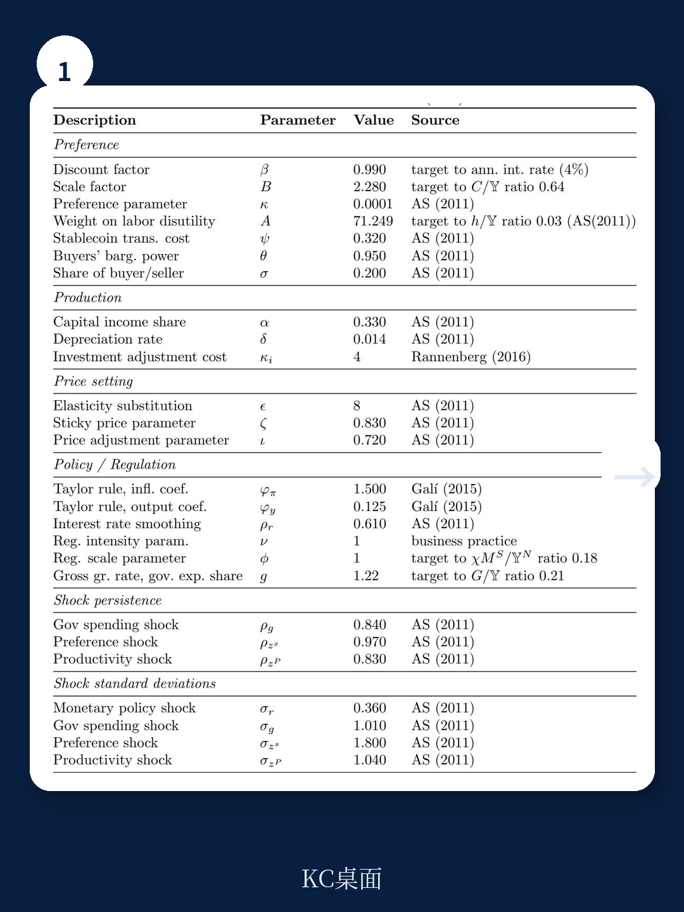
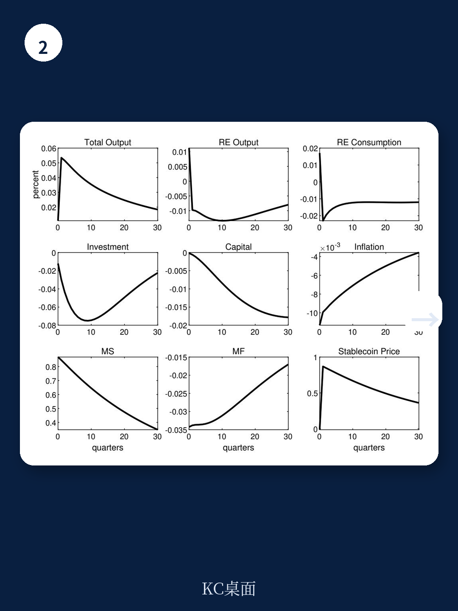

# 国际货币基金组织：IMF：稳定币越流行，经济波动越大——但有一把“调节阀”

2025年7月，美国GENIUS Act正式签署成为法律；一个月后，香港《稳定币条例》生效。全球两大金融中心几乎同时为稳定币铺好了监管轨道。但一个根本问题仍然悬而未决：当稳定币从边缘资产变成支付系统的一部分，宏观经济会变得更稳定，还是更脆弱？

国际货币基金组织（IMF）在2026年6月发布的工作论文《Stablecoins and Macroeconomic Stability: A DSGE Investigation》给出了一个清晰且反直觉的答案。这是IMF首次用动态随机一般均衡（DSGE）模型对稳定币进行系统性宏观分析。结论并不温和：稳定币渗透率越高，经济面对冲击时的波动越大。但论文同时发现，有一种政策工具可以充当“调节阀”——稳定币与法定储备资产的比率要求，类似于银行的流动性覆盖率。

这份报告的价值不在于它发现了稳定币有风险——这一点市场早已有共识。它的独特之处在于：它把“稳定币如何放大宏观波动”这个模糊担忧，变成了一个可以被量化、被模拟、被政策校准的机制。对于正在制定数字资产监管框架的政策制定者，以及试图理解未来支付格局的投资者，这篇论文提供了一套必须认真对待的理论基础。

> **KC评论：** 这篇论文的核心不是“稳定币好不好”，而是“如果稳定币真的成为日常支付工具，传统货币政策工具还能不能有效传导”。它用模型告诉你，答案是否定的——而且这种失效会随着稳定币使用率的上升而加速。完整报告中的脉冲响应图清晰地展示了这一非线性关系，值得细读。

## 1. 模型揭示的核心机制：稳定币放大了所有宏观变量的波动

论文构建了一个两部门模型。一个部门是传统的实体经济，使用法定货币进行交易；另一个部门是去中心化的虚拟经济，交易完全由稳定币完成，且交易具有匿名性和双边匹配特征。这种设置并非学术炫技，而是为了捕捉稳定币最本质的特征：它既是一种数字化的私人货币，又在完全不同的交易环境中流通。

模型校准基于美国经济数据，并特别关注稳定币相关参数。研究团队输入了多种外生冲击——技术冲击、货币政策冲击、偏好冲击等——然后观察不同稳定币渗透率下宏观变量的响应。

结果非常一致：随着稳定币渗透率上升，产出、消费、投资、通胀、资本存量的波动性全部增大。以总产出为例，当稳定币与实体经济产出的比率从0.02上升到0.40，总产出的标准差从1.7243上升到1.7260，看似微小，但考虑到这只是稳态附近的二阶矩变化，且模型中稳定币的渗透率还远未达到现实中的潜在水平，这一效应在更高渗透率下会显著放大。

更关键的发现是“货币替代效应”。模型显示，当稳定币渗透率上升，家庭会主动调整法定货币与稳定币的持有比例。这意味着稳定币不仅仅是一个新增的支付工具，它正在与法定货币竞争交易媒介的地位。这种竞争改变了货币需求的稳定性，进而削弱了央行通过控制利率传导货币政策的能力。

> **KC评论：** 这篇论文最值得注意的图表是不同渗透率下的脉冲响应对比。你会发现，同样的货币政策冲击，在高稳定币渗透率的经济体中，产出和通胀的响应路径明显更陡峭、更持久。这意味着央行可能需要更大幅度的利率调整才能达到同样的政策效果——而这本身就会增加经济的不确定性。完整报告中的图1至图4展示了这一对比，值得仔细研究。

## 2. 为什么稳定币会削弱货币政策传导？答案藏在“交易摩擦”中

传统宏观经济理论——尤其是Woodford在《Interest and Prices》中提出的框架——认为货币政策有效性不依赖于货币作为交易媒介。在标准新凯恩斯模型中，央行只需要控制短期名义利率的预期路径，就能通过跨期价格锚定来影响实体经济和通胀。货币需求本身并不重要。

但这篇论文挑战了这一结论。当稳定币被引入一个存在货币搜寻摩擦的经济体时，Woodford的“无现金经济”有效性结论不再成立。原因在于：稳定币创造了一个与法定货币体系平行的交易网络。在这个网络中，价格以稳定币计价，交易在匿名双边匹配中进行，货币流通速度、交易成本和搜寻效率都与法定货币体系不同。

当央行调整利率时，传统渠道是通过影响银行的存贷行为来传导。但稳定币的持有者并不直接受银行利率影响——他们持有稳定币的动机取决于虚拟经济中的交易机会和匹配效率。因此，货币政策的传导被“分流”了：一部分经济活动的融资成本和交易决策不再对央行利率敏感。

这就是论文所说的“货币搜寻摩擦”在数字时代的新表现形式。稳定币并没有消除摩擦，而是将摩擦转移到了一个央行难以触及的领域。

## 3. 审慎监管可以成为“稳定器”——关键参数是储备资产比率

如果稳定币放大了宏观波动，政策制定者该怎么办？论文给出了一个具体的政策工具：稳定币与法定储备资产的比率要求。

模型中的稳定币由法定货币储备资产全额或部分支持。论文发现，当监管要求提高这一比率（即要求稳定币发行方持有更多高流动性法定资产作为储备），稳定币对宏观波动的放大效应得到显著抑制。具体来说，更高的储备比率降低了产出、消费和投资的波动性，同时也减少了通胀的波动。

这一结果的机制是：更高的储备比率实际上提高了稳定币的“货币质量”——它让稳定币持有者更确信在压力时期可以按面值赎回。这种信心减少了恐慌性赎回和挤兑风险，从而切断了稳定币放大外部冲击的渠道。论文还将这一机制类比为银行的流动性覆盖率要求——同样的逻辑，不同的资产形式。

> **KC评论：** 这里有一个容易被忽视的细节。论文发现，审慎监管的有效性取决于监管的“强度”而非“有无”。温和的储备要求效果有限，只有当比率达到一定阈值后，稳定效应才显著显现。这意味着政策制定者不能“象征性监管”——要么不做，要么做到位。完整报告的敏感性分析表格（表5至表11）详细展示了不同参数组合下的波动变化，是理解政策力度的关键。

## 4. 论文尚未完全回答的三个关键问题

尽管这篇论文在理论建模和政策分析上迈出了重要一步，但它自己也承认有几个关键问题尚未解答。

第一，模型只考虑了单一封闭经济体。稳定币的跨境流动——尤其是以美元计价的稳定币在全球范围内的使用——被明确排除在分析范围之外。但现实是，USDT和USDC的最大市场可能不在美国。正如论文引用的文献所示，稳定币的跨境流动可能改变国际资本流动格局，甚至影响新兴市场的货币替代和资本管制有效性。一个开放经济版本的模型可能会揭示出完全不同的政策含义。

第二，模型中的稳定币发行方是“被动”的——它们只是持有储备资产并维持锚定，不进行主动的资产负债管理。现实中，稳定币发行方（如Tether和Circle）的储备资产管理策略、利润动机和竞争行为，可能会引入额外的风险或稳定机制。Tether限制赎回仅对少数交易对手开放的做法，就是模型尚未捕捉的现实特征。

第三，模型没有考虑央行数字货币（CBDC）的存在。在现实中，CBDC和稳定币正在竞争同一块“数字支付”领地。如果央行同时发行零售CBDC，稳定币的货币替代效应可能会被部分抵消或改变方向。论文将这一延伸留给了未来的研究。

> **KC评论：** 这三个未解问题恰恰是这篇论文最值得延伸阅读的地方。特别是跨境维度：如果美元稳定币在全球范围内流通，美联储的货币政策会不会被“出口”到其他国家？反过来，其他国家的监管行动会不会影响美国国内的金融条件？这些不是理论推演——它们正在发生。完整论文的参考文献和结论部分对这些开放问题有更详细的讨论。

## 5. 对投资者的观察框架：三个信号值得跟踪

基于这篇论文的分析框架，投资者和政策观察者可以从三个维度跟踪稳定币对宏观环境的影响。

第一，稳定币渗透率与宏观波动性的关系并非线性。论文显示，当稳定币占GDP比率超过某个阈值后，波动放大效应加速上升。这意味着“稳定币总市值/GDP”是一个值得持续监控的指标。当这一比率快速攀升时，投资者应重新评估利率敏感型资产的波动预期。

第二，稳定币发行方的储备资产透明度至关重要。论文的审慎监管分析隐含了一个前提：监管者能够准确知道储备比率。如果储备资产的信息不透明或存在期限错配——正如Tether历史上多次被质疑的那样——那么名义上的高储备比率可能并不代表真正的韧性。储备审计的频率、范围和标准，是判断稳定币体系稳定性的关键变量。

第三，货币替代速度可能比市场预期的更快。论文的“货币替代效应”显示，家庭会主动调整两种货币的持有比例。如果稳定币在支付便利性上持续优于传统银行体系（尤其是在跨境支付和DeFi场景中），替代速度可能非线性加速。这将直接改变货币需求函数的稳定性，进而影响央行对通胀和产出的预测精度。

---

这篇IMF工作论文的价值不在于它给出了一个“稳定币有害”的简单结论，而在于它提供了一个可以持续迭代的分析框架。当稳定币从数字资产的边缘走向支付体系的核心，传统货币经济学的一些基本假设正在被重新审视。Woodford的“无现金经济”有效性结论在数字时代是否仍然成立？这篇论文给出了一个值得认真对待的“不”——而更完整的答案，还在研究中。

我们每天会由AI agent加人工审核，生成国际投行和IMF最新研报的中文摘要与深度评论，约10至40页，包含当天最新数据图表合集。这些内容既方便直接喂给AI模型做进一步分析，也适合人工快速把握全球市场动态。如果您希望获取这篇IMF论文的完整原始图表、参数校准表以及敏感性分析数据，欢迎加入我们的社群，每日更新的研报解读中会包含这些关键素材。

Personal reading notes and learning share only. Not investment advice.

