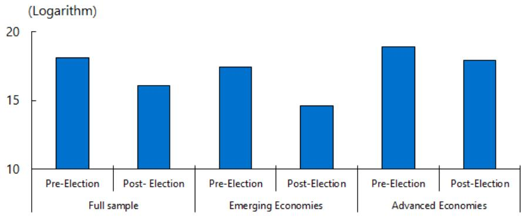
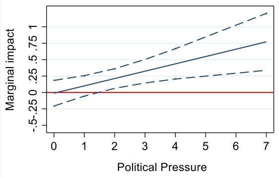
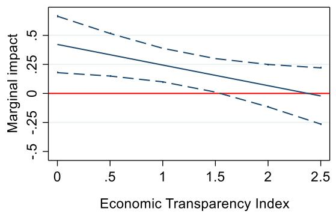
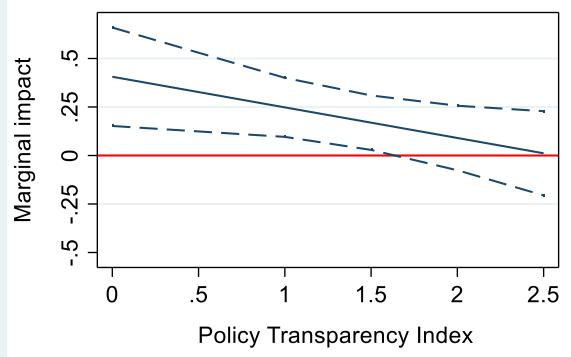
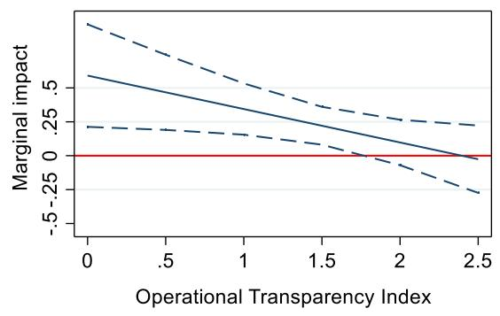

# The Political Economy of Foreign Exchange Interventions

Kodjovi M. Eklou

WP/26/130

IMF Working Papers describe research in progress by the author(s) and are published to elicit comments and to encourage debate. The views expressed in IMF Working Papers are those of the author(s) and do not necessarily represent the views of the IMF, its Executive Board, or IMF management.

2026
JUN

# IMF Working Paper Asia and Pacific Department

The Political Economy of Foreign Exchange Interventions Prepared by Kodjovi M. Eklou

Authorized for distribution by Lamin Leigh
June 2026

IMF Working Papers describe research in progress by the author(s) and are published to elicit comments and to encourage debate. The views expressed in IMF Working Papers are those of the author(s) and do not necessarily represent the views of the IMF, its Executive Board, or IMF management.

ABSTRACT: Exchange rate movements have implications for the purchasing power of residents or voters. Given that the exchange rate is often seen as a barometer of government performance, there could be strong incentives to influence exchange rate valuation during elections. This paper investigates whether political economy factors affect Foreign Exchange Intervention (FXI) policy across countries. It investigates whether central banks tend to implement FX sales, leaning against depreciations, during electoral periods in a sample of 28 countries including both advanced (AEs) and emerging (EMs) economies over the period 2000-2019. The results show that EMs with competitive elections tend to implement more and larger FX sales in pre-electoral period, compared to post-election period, given their political popularity. Further, this result is driven by countries where political pressures on central bank governors are more prevalent. Furthermore, the paper also finds that monetary policy transparency has the potential to mitigate this politically driven FXI during electoral period. Finally, the paper discusses policy implications given that politically motivated FX sales could hamper the ability of central banks to effectively respond to large shocks.

JEL Classification Numbers:

E02; E52; E58; F31, P51

Keywords:

Foreign Exchange Interventions; Electoral Cycles; Monetary Policy; Political Economy; Transparency.

Author's E-Mail Address:

keklou@imf.org

WORKING PAPERS

# The Political Economy of Foreign Exchange Interventions

Prepared by Kodjovi M. Eklou $^{1}$

## Contents

Introduction .... 3
I. Data and Stylized Facts .... 5
A. Data .... 5
B. Stylized Facts .... 7
II. The Political Economy of Foreign Exchange Intervention: Empirical Analysis .... 8
A. Empirical Strategy .... 8
B. Results and Policy Discussions .... 10
III. Conclusion .... 15
Appendix .... 16
References .... 23
BOXES
No table of figures entries found.
FIGURES
No table of figures entries found.
TABLES
No table of figures entries found.

## Introduction

The merit of an independent central bank, that is a central bank that can implement policies without political interference is well established. However, in practice, de facto central bank independence is challenging because central bank governors are often politically appointed and the policy of central banks affects the aggregate economy performance, for which, only politicians may be held (electorally) accountable $^{2}$ . For instance, recent evidence (Binder, 2021) finds that even central banks that have high de jure independence scores face frequent political pressures. $^{3}$ More recently, Bianchi et al. (2023) show that even in the US, political forces have played a role in shaping the Fed's monetary policy decisions. Political economy forces could therefore be present in the arena of monetary policy even in countries where the central bank is perceived to enjoy some degree of (de jure) independence.

In this paper, we investigate whether political economy factors influence the implementation of Foreign Exchange Intervention (FXI) policies. Previous evidence shows that governments tend to maintain appreciated currencies before elections, delaying a depreciation/devaluation until after the election (Klein and Marion 1997; Frieden, Ghezzi, and Stein 2001) because depreciation-induced reduction in national purchasing power are politically unpopular (Broz and Frieden, 2008). $^{4}$ More recently, the role of political factors has been highlighted by Jäger (2016) showing that democracies tend to deplete reserves before an election. We ask the following research question: Do central banks tend to implement FX sales, leaning against depreciation, during electoral periods? If yes, under what conditions are these electoral cycles in FXI policy are more prevalent, and is there any mitigating factor?

Using monthly data covering 28 countries including both advanced (AEs) and emerging (EMs) economies over the period 2000-2019, the paper finds evidence of larger and more frequent FX sales in pre-electoral periods compared to post-election periods. This result is driven by EMs with competitive elections and where political pressures on central bank governors are plausibly more prevalent. The findings suggest therefore that central banks in these EMs tend to lean against depreciations in pre-electoral periods which could preserve or boost the purchasing power of voters. Indeed, the exchange rate is such an important price that politicians may wish to manipulate it for the purpose of winning elections (Broz and Frieden, 2008). The paper also provides suggestive evidence that FX sales are followed by an increase in government popularity, reinforcing the finding on the existence of a political business cycle in FX policy. Lastly, given that transparency by enhancing central bank accountability, is a foundation stone of central bank independence (Dincer et al., 2022), we investigate whether it could mitigate the political cycle in FX sales observed in the data. $^{5}$ We find that transparency mitigates the magnitude of electorally motivated FX sales.

This paper provides novel findings on electoral cycle in FXI policy. These findings have important policy implications given that politically motivated FX sales could hamper the ability of central banks to effectively respond to large shocks if reserves are depleted to temporary boost voters' purchasing power. The results point to specific areas where improvement in transparency could help mitigate or curb electorally driven FX sales. Improving monetary policy transparency, specifically in the areas of economic, policy and operational transparency could contribute to dampen the influence of political pressures on FX sales. First, in practice, improving economic transparency could involve disclosing the economic data that policy makers rely on for their forecasts and the evaluation of their decisions. Second, policy transparency refers to whether the central bank discloses its policy decisions and provides the associated explanation and rationale, and whether or not it provides forward guidance. Third, operational transparency captures whether the central bank provides information about challenges of policy implementation and execution, for instance if it discloses disturbances that affect monetary policy transmission.

In addition, in the context of the old debate on rule vs discretion and the issue of time inconsistency of optimal monetary policy (Kydland and Prescott 1977, Calvo 1978), there could be room for FX policy intervention rules to curb potential pressures on central banks to draw down on reserves during electoral periods. $^{6}$ More specifically, for instance setting a predetermined range or threshold for exchange rate depreciations, could make FXI policies more transparent and thus mitigate political pressures. $^{7}$ Further, these rules could be guided more broadly by the use cases of FXI as outlined in the Fund’s Integrated Policy Framework -Principles for Use of Foreign Exchange Intervention. FXI rules could also reinforce specifically the dimensions of economic transparency and policy transparency by providing for instance a clear information on triggers of policy actions. Finally, the IMF’s Central Bank’s Transparency Code (IMF, 2020) which provides an international code that allows central banks and their stakeholders to map transparency practices of the central bank to international best practices, could help steer reforms in the right direction. The purpose of IMF’s Central Bank’s Transparency Code is to enhance transparency and accountability of central banks and contribute to policy effectiveness.

The paper is related to the literature on the political economy of exchange rate highlighting that politicians could be tempted to manipulate exchange rate for electoral purpose (see for instance Klein and Marion 1997; Frieden, Ghezzi, and Stein 2001, Broz and Frieden, 2008, Jäger, 2016). $^{8}$ There is however scant evidence on the political economy aspects of exchange rate valuation. $^{9}$ This paper bridges the gap by providing novel empirical evidence on FXI policy (which ultimately affects exchange rate valuation), around electoral period, by taking advantage of recent advancement in data availability in this area. The paper is closely related to Jäger (2016) showing that democratic governments tend to significantly reduce their reserves before an election. We add to this work by estimating a FX policy reaction function which accounts for the size of reserves (as a determinant of FX sales) and suggesting policy reforms that could mitigate the electoral cycle. It also relates to the recent work on the Integrated Policy Framework, underlying frictions that warrant FXI including destabilizing premia from FX market frictions, countering financial stability risks from FX mismatches and prevent the de-anchoring of inflation expectations. However, the aim of this paper is rather to take a positive approach to investigate whether political factors play a role in FX policy in practice.

The paper also relates to a recent literature showing that central banks (de facto) independence may be under threat as political pressures are found to be prevalent (see for instance, Binder, 2021; Bianchi et al., 2023, Goncharov et al., 2023 and Ioannidou et al., 2023). We contribute to this literature by providing evidence that reforms toward monetary policy transparency are key to mitigate political interference in central bank decisions. The rest of the paper is organized as follows. Section I discusses the data and some stylized facts. Section II is dedicated to the empirical analysis including, the empirical strategy, the results, and their policy implications. Finally, section III concludes.

## I. Data and Stylized Facts

## A. Data

To investigate the political economy aspects of Foreign Exchange Intervention (FXI) policies, we use cross-country data covering 28 countries including 17 emerging markets (EMs) and 11 Advanced Economies (AEs) over the period 2000 - 2019. Given the focus in this paper on the political economy of FXI, we exclude countries that are members of monetary unions from our analysis, as it is implausible to see national political developments such as an election affecting policy decisions at the level of the monetary union. Table A1 in Appendix presents a summary of all variables used in the paper.

## Foreign Exchange Intervention.

We start by describing the dependent variable, FXI. Data on FXI are taken from Adler et al (2021). They define FXI as 'any transaction that changes the central bank's foreign-currency position'. The definition of FXI by Adler et al. (2021) implies for instance i) a focus on active transactions meaning that it excludes variations in foreign currency positions not driven by contemporaneous actions of the central bank, ii) focuses on the central bank as the main entity implementing FXI. This proxy further accounts for weaknesses in coarse measures of changes in reserve by adjusting for valuation changes, returns on investment induced changes in reserves. This proxy for FXI is a major improvement over the use of change in FX reserves, and data is available from 2000. $^{10}$ We use monthly series on FX sales, the focus in this paper, which is then expressed in percent of yearly GDP. In the empirical setting, we also use an alternative measure of FX sales as a dummy that takes the value 1 if in a given month, if there was an FX sale and 0 otherwise. Other alternative measures include scaling FX sales by reserves and imports in robustness checks (see Table A4 in Appendix). While Adler et al (2021) show that the proxy is highly correlated with published data, they highlighted few limitations including for instance the sole focus on central bank's operations and the possibility that definitions of FX operations may differ across countries. The focus on central bank's operation is appropriate and is an advantage in the context of our research question in this paper. We also run robustness checks using the subset of the sample with published FX data (See Table A5 in Appendix). Indeed, during the election period, particularly in emerging economies macroeconomic uncertainty is particularly high for various reasons including, concerns about social unrest and rising political tensions. Countries with sufficient foreign reserves could then use the FXI to withstand non-fundamental depreciation in the short-term. We control for exchange rate volatility as well as the size of reserves in that regard in some of our specifications.

## Election dates.

The second key variable in our empirical analysis is the month of elections. The data on the month of elections are drawn from the Data of Political Institutions (DPI, 2020). Following a long tradition in the literature on political budget cycles we include only legislative elections for countries with parliamentary political systems and executive election for presidential systems (see for instance Shi and Svensson, 2006). These are elections that are more likely to affect macroeconomic policy decisions. The sample includes 140 elections (See Table A2 in Appendix for more details).

## FXI reaction function variables.

We also include other controls based on FX policy reaction function following related literature (see for instance Kim and Sheen, 2002) in some specifications. The central bank can intervene to smooth exchange rate volatility or disorderly conditions in foreign exchange markets, leaning against short-term exchange rate movements (depreciations or appreciations), interest rates differentials as they may lead to the well-known overshooting of the spot exchange rate and depending on the size of reserves. To account for these potential arguments of FXI reaction function, we control for the volatility of the bilateral exchange rate of countries against the US dollar. $^{11}$ We use monthly data on USD per local currency from the International Financial Statistics (IFS) and obtain the volatility as the standard deviation over the calendar year. Next, we also control for short-term movement in exchange rate, by using the monthly change in the logarithm of the bilateral exchange rate of countries against the US dollar (USD/local currency). This measure captures therefore, appreciations against the USD.

Next, we use the monthly difference between countries' policy rates and US policy rates to control for interest rate differentials. The data on policy rates are drawn from the monthly BIS central bank policy rate statistics. Finally, we control for the size of reserves using monthly data from the IFS. We calculate the data as share of the yearly GDP. We also used alternative scaling approach including expressing the reserves in terms of months of imports, to capture reserve adequacy in robustness checks (see Table A6 in Appendix). Estimating an FX reaction function is a major departure from previous related work (see for instance Jäger, 2016) which focused on the size of reserves. This paper focuses indeed on FX policy by i) using data on FX intervention and ii) controlling for FX policy reaction function arguments, including the size of reserves.

## Other political economy variables.

Finally, we employ other political economy variables in our empirical analysis. First, we use the Boix-Miller-Rosato indicator of democracy that takes the value 1 in a given year if a country is classified as a democracy and zero otherwise (Boix et al., 2013, Boix et al., 2022). A country is considered democratic if political leaders are chosen through free and fair elections. Second, we use a measure of frequency of irregular central bank turnover as a proxy for political pressures. We use data from Dreher et al. (2008, 2010). The data is available over 1970-2018.

We calculate the number of irregular central bank governor turnovers, that is the number of central bank governors' terms that ended before the legal term (premature exits), over the period 2000-2018. Frequent irregular central bank governor turnover could be a sign of the presence of political pressures on central bank governors, given governments tend to remove “disobedient” governors with more “docile” ones (see Vuletin and Zhu, 2011).

Third, we use data on central bank transparency which is seen as a pillar of central bank independence (see Dincer et al., 2022) but also is found as mitigating exchange rate volatility (see Aftab and Mehmood, 2023). Yearly data on monetary policy transparency is taken from Dincer et al. (2022). For each dimension of transparency (discussed in more detail in the empirical section below), the authors created a sub-index consisting of three items, each of which receives a score of 0,1/2, or 1. The dimensions of transparency are therefore captured by an index ranging between 0 and 3. The overall index equals the sum of the scores across all items, ranging from 0 to a maximum of 15. The higher the index, the higher is the degree of the transparency. Finally, we use data on government popularity. Given the unavailability of time-series of government popularity index across countries, we use the change in the International Country Risk Guide (ICRG) index of government stability as a proxy for government popularity following Herrera et al. (2020). The authors demonstrate that the change in this government stability index captures very well the evolution of government popularity because the variation in index is mainly driven by change in the popularity. $^{12}$

## B. Stylized Facts

In this section we turn to a description of the data focusing on the size of FX sales in the sample, around the election date. Figure 1 below depicts the cumulative size of FX sales 12-months before the election compared to 12-months after the election in the full sample, but also in the sub-samples of EMs and AEs.

The Figure 1 shows that the size of FX sales tends to be larger in pre-electoral period compared to post-electoral period and this is likely driven by emerging market economies. Indeed, the difference between the pre-electoral and post-electoral FX sales is larger in EMs compared to AEs. In the empirical analysis we will investigate this further. An implication of this finding is that FX sales decisions are likely to be influenced by political considerations. For instance, politicians could put pressure on central bank governors to draw down on FX reserves to shore up the purchasing power of households in pre-electoral periods to maximize their chance of re-election. The exchange rate is indeed known to play an important role in Emerging Market economies (EMs) for different reasons including for instance the sizeable influence on demand in small open economies, and the fact that the exchange rate often constitutes a key variable for private sector expectations about inflation (BIS, 2008).

## Figure 1: Size of FX Sales Around Elections

## FX Sales and Elections

  
Notes: Data shows cumulative sum of the average logarithm of FX sales as share of GDP over pre-electoral period (12-months before elections) and post-electoral period (12-months after elections). Data source: Adler et al. (2021), Database of Political Institutions (DPI2020) and Author's calculations.

## II. The Political Economy of Foreign Exchange Intervention: Empirical Analysis

## A. Empirical Strategy

To empirically investigate whether political economy factors drive FX interventions, we follow a three-steps approach. In the first step, we estimate the following equation:

$$
F X \text {   sales } _ {c m y} = \beta \text {   Pre   -   elec } _ {c m y} + \mu_ {c} + \mu_ {y} + \mu_ {m y} + \varepsilon_ {c m y} (1)
$$

Where $FX\ sales_{cmy}$ is either the logarithm of the size of FX sales as share of GDP or a dummy capturing whether FX sales took place in country c, in month m and year y. $\mu_{c}$ , $\mu_{y}$ and $\mu_{my}$ are respectively, country fixed effects, year fixed effects and year x month fixed effects, while $\varepsilon_{cmy}$ is the error term. The specification includes $\mu_{my}$ to ensure we do not capture an artifact of a common election shock in the sample. This controls for common macroshocks, such as international financial flows, that affect all countries in a given month, within a year. Pre – $elec_{cmy}$ is an indicator variable taking the value 1 over the twelve-months running up to the election month and 0 over the 12 months post-election. In some specifications in robustness checks we include a set of controls that are determinants of FX sales as discussed in section II (exchange rate volatility, the size of FX reserves, exchange rate appreciation and interest rate differential with the US). We also present robustness checks using a six-months window rather than the 12-months (See Table A7 in the Appendix).

The identification strategy relies on the mostly pre-determined (or exogenous) aspect of the date of elections. The specification is similar to an event-study approach, with the election being the event and so, $\beta$ captures the impact of the 12-months pre-electoral period on the FX sales compared to the 12-month post-election. $^{13}$ We test whether $\beta > 0$ , that is whether central banks tend to implement more FX sales, leaning against exchange rate depreciations, in pre-electoral period. This would imply that political factors play an important role in FX policy decisions. In the case of FX sales, this could imply that central banks tend to implement policies that are likely to strengthen their currency in pre-electoral period, akin to a political cycle in FX policies, in order to preserve or boost voters' purchasing power ((Klein and Marion 1997; Frieden, Ghezzi, and Stein 2001; Broz and Frieden, 2008). Indeed, previous evidence shows that FXI are effective in moving the exchange rate in the desired direction in EMs (Daude et al., 2016) with a persistent impact over months (see for instance Adler et al., 2019). Using monthly data allows to capture the granularity of FX policy decisions as they change on a monthly basis and could switch from sales to purchase over months. Annual data would mask this within-year dynamic that is crucial to capture these political economy developments in the context of elections. We estimate equation (1) mainly using fixed effect estimator but also probit estimator (for the indicator of FX sale policy) in some robustness checks.

In a second step, we propose to investigate further the political economy aspects of FX intervention by estimating the following equation:

$$
F X s a l e s _ {c m y} = \beta P r e - e l e c _ {c m y} + \theta P r e - e l e c _ {c m y} * P o l i t i c a l + \mu_ {c} + \mu_ {y} + \mu_ {m y} + \varepsilon_ {c m y} (2)
$$

Where Political is a variable capturing a political economy mechanism including whether the election is competitive, the likelihood of political pressure and the degree central bank transparency. First, in line with the literature on political budget cycles, if there is a political cycle in FX policy, we would expect it to be driven by democratic countries with competitive elections ( $\theta > 0$ ). Indeed, in democratic countries with competitive elections, a signal of strength of domestic currency as a way to shore up voters purchasing power would matter most as there is a probability of losing power (Broz and Frieden, 2008). The basic rationale of an electoral cycle finds its foundation indeed in democratic institutions making elections competitive. Second, in addition to using the electoral period to capture potential political forces playing a role in FX policies, we test whether these forces are more likely to be prevalent in countries where political pressures on the central bank governor are more frequent ( $\theta > 0$ ). We use the frequency of irregular central bank governor turnover at the country level to proxy the likelihood of political pressures. Indeed, Vuletin and Zhu (2011) show that irregular turnover of central bank governors provides a good measure for de facto central bank independence. Finally, we explore the role of the degree of transparency in the central bank operations. $^{14}$ Given that the transparency of central banks is seen as a foundation of central bank independence by enhancing accountability (Dincer et al., 2022) but also as a mitigator of exchange rate volatility (Aftab and Mehmood, 2023), which is a determinant of FX interventions, we expect the degree of transparency to mitigate the impact of political factors ( $\theta < 0$ ).

Finally, to complement the previous analysis on the role of political factors, we test whether there could be political gains from FX sales. In order to test this, we use yearly data across the sample to test whether FX sales are popular. More specifically we test whether government popularity increases following FX sales ( $\delta > 0$ ) in Equation (3) below, where $Govpop_{cy}$ , is the government popularity in country c and year y measured as the change in the government stability index (as discussed previously).

$$
G o v p o p _ {c y} = \gamma G o v p o p _ {c y - 1} + \delta F X s a l e s _ {c y - 1} + \mu_ {c} + \mu_ {y} + \varepsilon_ {c y} (3)
$$

## B. Results and Policy Discussions

Table 1 shows the results of our baseline estimates of equation (1) focusing on how FX sales policy decisions are affected by the electoral period. Columns (1) – (3) show estimates with the dependent variable being the logarithm of FX sales in percentage of GDP, while columns (4) – (6) show estimates with the dependent taking value 1 if FX sale takes place in the given month. The results show that FX sales are about 22 percent larger in pre-electoral period compared to the post-electoral period, in particular in the sub-sample of EMs. $^{15}$ This is a sizeable difference. Looking at column (4), results show that the probability of an FX sale is about 3 percent higher in pre-electoral period compared to post-election period. This effect is driven by EMs, where this probability is about 5.5 (percent higher), while we do not find any statistically significant effect in the sub-sample of AEs. These results are therefore suggestive that there is a political cycle in FX policies in EMs. $^{16}$ Our findings suggest therefore that political factors play an important role in driving FX policy choices in EMs. They are also consistent with previous evidence that governments tend to maintain appreciated currencies before elections, delaying a depreciation/devaluation until after the election (Klein and Marion 1997; Frieden, Ghezzi, and Stein 2001).

Table 1: FX sales and Elections - Baseline

<table><tr><td rowspan="2"></td><td colspan="3">Dep: Log FX Sales</td><td colspan="3">Dep: Dummy FX Sales</td></tr><tr><td>Full [1]</td><td>EMs [2]</td><td>AEs [3]</td><td>Full [4]</td><td>EMs [5]</td><td>AEs [6]</td></tr><tr><td>Pre-Election</td><td>0.097(0.060)</td><td>0.199**(0.084)</td><td>-0.043(0.096)</td><td>0.034*(0.018)</td><td>0.055**(0.024)</td><td>-0.000(0.028)</td></tr><tr><td>Constant</td><td>1.316***(0.043)</td><td>1.178***(0.056)</td><td>1.496***(0.068)</td><td>0.432***(0.012)</td><td>0.396***(0.017)</td><td>0.481***(0.020)</td></tr><tr><td>Country FE</td><td>Yes</td><td>Yes</td><td>Yes</td><td>Yes</td><td>Yes</td><td>Yes</td></tr><tr><td>Year FE</td><td>Yes</td><td>Yes</td><td>Yes</td><td>Yes</td><td>Yes</td><td>Yes</td></tr><tr><td>Year x Month FE</td><td>Yes</td><td>Yes</td><td>Yes</td><td>Yes</td><td>Yes</td><td>Yes</td></tr><tr><td>Countries</td><td>28</td><td>17</td><td>11</td><td>28</td><td>17</td><td>11</td></tr><tr><td>R-squared</td><td>0.15</td><td>0.24</td><td>0.20</td><td>0.11</td><td>0.21</td><td>0.14</td></tr><tr><td>Observations</td><td>3346</td><td>1837</td><td>1508</td><td>3346</td><td>1837</td><td>1508</td></tr></table>

Notes: Pre-electoral period is captured by a dummy taking the value 1 in the 12-months before election and zero in 12-months after election. Robust standard errors in parentheses.
\*\*\* p<0.01, \*\* p<0.05, \*\*\* p<0.01

Next, we take a deeper dive into the political economy aspect of FX policy, by first turning to an estimate of equation (2) in Table 2 below. We explore three dimensions including the democratic context in column (1) and (2), the likelihood of political pressures in columns (1) – (5) and the role of central bank transparency in columns (6) – (8). First, the results corroborate that the electoral cycle that we discussed in Table 1 is mostly a phenomenon in EMs with competitive elections. This is reassuring given that a democratic context is the one expected to give rise to policy actions during electoral periods to send a signal to voters. A democratic context also implies that incumbents face a credible probability of not getting reelected, given that elections are competitive. $^{17}$ Next, the results show in columns (3) – (5) that the baseline effect, that is the political cycle in FX policy is more likely in EMs with frequent political pressures on the central bank governor. This reinforces the idea that FX policy could be politically motivated in EMs. This result is also consistent with the fact that the electoral cycle is likely to be muted in countries where the central bank has sufficient insulation from political pressures (Broz and Frieden, 2008). Finally, we explore whether central bank transparency could mitigate this political cycle in FX policy. The intuition as discussed is that, given that central bank transparency would imply lower political interference (a foundation of central bank independence – see Dincer et al., 2022). Further, based on the evidence that central bank transparency mitigates exchange rate volatility (Aftab and Mehmood, 2023), it could dampen the need for FX interventions. However, while the sign is negative as expected, in particular in the full sample and in EMs, results are not statistically significant.

Table 2: FX sales and Elections - Cross country Heterogeneity

<table><tr><td rowspan="2"></td><td colspan="2">Competitive Elections</td><td colspan="3">Political Pressures</td><td colspan="3">Monetary Policy Transparency</td></tr><tr><td>Full [1]</td><td>EMs [2]</td><td>Full [3]</td><td>EMs [4]</td><td>AEs [5]</td><td>Full [6]</td><td>EMs [7]</td><td>AEs [8]</td></tr><tr><td>Pre-Election</td><td>-0.455**(0.198)</td><td>-0.266(0.201)</td><td>-0.018(0.088)</td><td>-0.012(0.118)</td><td>0.029(0.177)</td><td>0.381*(0.217)</td><td>0.527*(0.272)</td><td>-0.227(0.582)</td></tr><tr><td>Pre-Election x Democracy</td><td>0.604***(0.207)</td><td>0.551**(0.218)</td><td></td><td></td><td></td><td></td><td></td><td></td></tr><tr><td>Democracy</td><td>-0.141(0.246)</td><td>-0.179(0.258)</td><td></td><td></td><td></td><td></td><td></td><td></td></tr><tr><td>Pre-Election x CB Turnover</td><td></td><td></td><td>0.069*(0.041)</td><td>0.112**(0.046)</td><td>-0.046(0.116)</td><td></td><td></td><td></td></tr><tr><td>Pre-Election x MP Transparency</td><td></td><td></td><td></td><td></td><td></td><td>-0.030(0.022)</td><td>-0.041(0.032)</td><td>0.018(0.053)</td></tr><tr><td>MP Transparency</td><td></td><td></td><td></td><td></td><td></td><td>0.028(0.034)</td><td>-0.005(0.045)</td><td>0.102*(0.061)</td></tr><tr><td>Constant</td><td>1.445***(0.227)</td><td>1.331***(0.222)</td><td>1.345***(0.045)</td><td>1.231***(0.061)</td><td>1.481***(0.069)</td><td>1.055***(0.320)</td><td>1.217***(0.374)</td><td>0.375(0.677)</td></tr><tr><td>Country FE</td><td>Yes</td><td>Yes</td><td>Yes</td><td>Yes</td><td>Yes</td><td>Yes</td><td>Yes</td><td>Yes</td></tr><tr><td>Year FE</td><td>Yes</td><td>Yes</td><td>Yes</td><td>Yes</td><td>Yes</td><td>Yes</td><td>Yes</td><td>Yes</td></tr><tr><td>Year x Month FE</td><td>Yes</td><td>Yes</td><td>Yes</td><td>Yes</td><td>Yes</td><td>Yes</td><td>Yes</td><td>Yes</td></tr><tr><td>Countries</td><td>28</td><td>17</td><td>28</td><td>17</td><td>11</td><td>28</td><td>17</td><td>11</td></tr><tr><td>R-squared</td><td>0.15</td><td>0.24</td><td>0.15</td><td>0.25</td><td>0.20</td><td>0.15</td><td>0.24</td><td>0.20</td></tr><tr><td>Observations</td><td>3346</td><td>1837</td><td>3097</td><td>1648</td><td>1448</td><td>3346</td><td>1837</td><td>1508</td></tr></table>

Notes: The dependent variable is the Log of FX sales. Pre-electoral period is captured by a dummy taking the value 1 in the 12-months before election and and zero in 12-months after election. Democracy is dummy taking the value 1 if a country-year is classified as a free and fair election. Political pressures are captured by the frequency of irregular central bank turnover in a given country. AEs are excluded from the estimation for democratic countries are there is no variation (all country-years are democratic). Robust standard errors in parentheses. \*\*\* p<0.01, \*\* p<0.05, \*\*\* p<0.01

Further, we ask whether there are potential political gains from FX sales by estimating Equation (3). Table 3 below shows using different specifications (fixed effect estimates with dynamic panel specification, columns 1-3, GMM estimates and dynamic panel specification, columns 4-6 and fixed effects estimates in columns 7-9, that FX sales are politically popular, especially in EMs. Government popularity tend to rise following FX sales, providing suggestive evidence of a potential political gain. $^{18}$ This finding is consistent with previous work arguing that governments tend to maintain appreciated currencies before elections, delaying a depreciation/devaluation until after the election (see Klein and Marion 1997; Frieden, Ghezzi, and Stein 2001) because depreciation-induced reduction in national purchasing power is politically unpopular (Broz and Frieden, 2008). It is also consistent with the major role played by the exchange rate in EMs context (BIS, 2008). Altogether results in Table 2 and 3 suggest that political factors play a role in FX sales decisions as we find that pre-electoral periods see more frequent and larger FX sales in democratic EMs with competitive elections, especially where central bank governors are more likely to face political pressures because FX sales are perceived as a popular policy. These results suggest that incumbent politicians could pressure central banks to implement FX sales to temporary boost the purchasing power of voters during elections in order to increase their chances of reelection. Indeed, FX policies are known to be effective in EMs (Daude et al., 2016) with a persistent impact on the exchange rate over months (Adler et al., 2019).

Table 3: FX sales and government popularity

<table><tr><td></td><td>Full [1]</td><td>OLS EMs [2]</td><td>AEs [3]</td><td>Full [4]</td><td>GMM EMs [5]</td><td>AEs [6]</td><td>Full [7]</td><td>OLS EMs [8]</td><td>AEs [9]</td></tr><tr><td>Gov popularity (t-1)</td><td>-0.276*** (0.044)</td><td>-0.281*** (0.051)</td><td>-0.272*** (0.073)</td><td>0.394* (0.217)</td><td>0.325 (0.252)</td><td>0.535 (0.358)</td><td></td><td></td><td></td></tr><tr><td>Log FX sales (t-1)</td><td>0.050** (0.022)</td><td>0.065** (0.028)</td><td>-0.019 (0.044)</td><td>0.067** (0.032)</td><td>0.093** (0.041)</td><td>-0.012 (0.054)</td><td>0.054** (0.024)</td><td>0.074** (0.029)</td><td>-0.021 (0.046)</td></tr><tr><td>Constant</td><td>-0.253*** (0.039)</td><td>-0.263*** (0.049)</td><td>-0.119 (0.084)</td><td></td><td></td><td></td><td>-0.225*** (0.043)</td><td>-0.246*** (0.050)</td><td>-0.087 (0.086)</td></tr><tr><td>Country FE</td><td>Yes</td><td>Yes</td><td>Yes</td><td>Yes</td><td>Yes</td><td>Yes</td><td>Yes</td><td>Yes</td><td>Yes</td></tr><tr><td>Year FE</td><td>Yes</td><td>Yes</td><td>Yes</td><td>Yes</td><td>Yes</td><td>Yes</td><td>Yes</td><td>Yes</td><td>Yes</td></tr><tr><td>Countries</td><td>28</td><td>17</td><td>11</td><td>28</td><td>17</td><td>11</td><td>28</td><td>17</td><td>11</td></tr><tr><td>Observations</td><td>532</td><td>323</td><td>231</td><td>504</td><td>306</td><td>198</td><td>532</td><td>323</td><td>231</td></tr></table>

Notes: The dependent variable is the government popularity measured as the change in the government stability index. Columns (4)-(6) show dynamic panel GMM estimates. These estimates are based on yearly cross-country panel data over the period 2000-2019. Robust standard errors in parentheses. \*\*\* p<0.01, \*\* p<0.05, \*\*\* p<0.01

Finally, we take a more granular look at the various dimensions of monetary policy transparency to test whether they could play a role in mitigating politically motivated FX sales. The monetary policy transparency index from Dincer et al. (2022) captures five different aspects of central bank transparency, including, political transparency, economic transparency, procedural transparency, policy transparency and operational transparency. Political transparency is related to the formal statement of policy objectives. Economic and procedural transparency relate respectively to the economic information used in the formulation of monetary policy and to the way monetary policy decisions are reached. Policy transparency refers to whether the central bank discloses its policy decisions and provides the associated explanation and rationale, and whether it provides forward guidance. Operational transparency captures whether the central bank provides information about challenges of policy implementation and execution, for instance if it discloses disturbances that affect monetary policy transmission.

Table 4 below shows estimates on the role of economic, policy and operational transparency. $^{19}$ Our results show that, while we did not find any statistically significant effect for the overall index of transparency, these three dimensions of transparency are relevant as mitigators of politically motivated FX sales. $^{20}$

Table 4: Dimensions of Monetary Policy Transparency

<table><tr><td rowspan="2"></td><td colspan="3">Economic Transparency</td><td colspan="3">Policy Transparency</td><td colspan="3">Operational Transparency</td></tr><tr><td>Full [1]</td><td>EMs [2]</td><td>AEs [3]</td><td>Full [4]</td><td>EMs [5]</td><td>AEs [6]</td><td>Full [7]</td><td>EMs [8]</td><td>AEs [9]</td></tr><tr><td>Pre-Election</td><td>0.347***(0.130)</td><td>0.422***(0.147)</td><td>0.267(0.436)</td><td>0.251*(0.134)</td><td>0.406***(0.154)</td><td>-0.400(0.327)</td><td>0.542***(0.179)</td><td>0.591***(0.229)</td><td>0.063(0.367)</td></tr><tr><td>Pre-Election x Eco Transp</td><td>-0.149**(0.070)</td><td>-0.177*(0.097)</td><td>-0.140(0.197)</td><td></td><td></td><td></td><td></td><td></td><td></td></tr><tr><td>Economic Transparency Index</td><td>0.246***(0.091)</td><td>0.156(0.112)</td><td>0.455**(0.190)</td><td></td><td></td><td></td><td></td><td></td><td></td></tr><tr><td>Pre-Election x Policy Transp</td><td></td><td></td><td></td><td>-0.088(0.068)</td><td>-0.158*(0.092)</td><td>0.166(0.145)</td><td></td><td></td><td></td></tr><tr><td>Policy Transparency Index</td><td></td><td></td><td></td><td>0.005(0.079)</td><td>-0.081(0.103)</td><td>0.116(0.138)</td><td></td><td></td><td></td></tr><tr><td>Pre-Election x Oper Transp</td><td></td><td></td><td></td><td></td><td></td><td></td><td>-0.254***(0.097)</td><td>-0.247*(0.135)</td><td>-0.057(0.178)</td></tr><tr><td>Operational Transparency Index</td><td></td><td></td><td></td><td></td><td></td><td></td><td>0.116(0.107)</td><td>0.173(0.133)</td><td>-0.259(0.226)</td></tr><tr><td>Constant</td><td>0.908***(0.155)</td><td>0.984***(0.147)</td><td>0.510(0.417)</td><td>1.307***(0.147)</td><td>1.296***(0.160)</td><td>1.247***(0.309)</td><td>1.111***(0.192)</td><td>0.902***(0.216)</td><td>2.006***(0.454)</td></tr><tr><td>Country FE</td><td>Yes</td><td>Yes</td><td></td><td>Yes</td><td>Yes</td><td>Yes</td><td>Yes</td><td>Yes</td><td>Yes</td></tr><tr><td>Year FE</td><td>Yes</td><td>Yes</td><td></td><td>Yes</td><td>Yes</td><td>Yes</td><td>Yes</td><td>Yes</td><td>Yes</td></tr><tr><td>Year x Month FE</td><td>Yes</td><td>Yes</td><td></td><td>Yes</td><td>Yes</td><td>Yes</td><td>Yes</td><td>Yes</td><td>Yes</td></tr><tr><td>Countries</td><td>28</td><td>17</td><td>11</td><td>28</td><td>17</td><td>11</td><td>28</td><td>17</td><td>11</td></tr><tr><td>R-squared</td><td>0.15</td><td>0.24</td><td>0.20</td><td>0.15</td><td>0.24</td><td>0.20</td><td>0.15</td><td>0.24</td><td>0.20</td></tr><tr><td>Observations</td><td>3346</td><td>1837</td><td>1508</td><td>3346</td><td>1837</td><td>1508</td><td>3346</td><td>1837</td><td>1508</td></tr></table>

Notes: The dependent variable is the Log of FX sales. Pre-electoral period is captured by a dummy taking the value 1 in the 12-months before election and and zero in 12-months after election. We examine different dimensions of monetary policy transparency including economic transparency (eco tranp), policy transparency (policy transp) and operational transparency (oper transp). Robust standard errors in parentheses. \*\*\* p<0.01, \*\* p<0.05, \*\*\* p<0.01

These findings have important policy implications. Indeed, policymakers should account for the intertemporal trade-off arising from depleting reserves today that could make it difficult to respond to future shocks. Politically motivated FX sales could be therefore an indication of a divergence between political incentives and social welfare maximization (through macroeconomic stability). Improving monetary policy transparency, specifically in the areas of economic, policy and operational transparency could contribute to dampen the influence of political pressures on FX sales. In practical terms, improving economic transparency could involve disclosing the economic data that policy makers rely on for their forecasts and the evaluation of their decisions. In this context, the IMF's Central Bank's Transparency Code (IMF, 2020) which provides an international code that allows central banks and their stakeholders to map transparency practices of the central bank to international best practices could be helpful to steer reforms in the appropriate direction.

Moreover, in the context of the old debate on rule vs discretion and the issue of time inconsistency of optimal monetary policy (Kydland and Prescott 1977, Calvo 1978), there could be room for FX policy intervention rules to curb potential pressures on central banks to draw down on reserves during electoral periods. Indeed, this debate has also led to the implementation of numerical fiscal rules that have been found to mitigate political budget cycles in developing countries (see for instance Eklou and Joanis, 2019). Similarly, for instance setting a predetermined range or threshold for exchange rate depreciations, could make FXI policies more transparent and thus mitigate political pressures. Rules could more broadly be guided by the use cases of FXI as outlined in the Fund's Integrated Policy Framework -Principles for Use of Foreign Exchange Intervention. FXI rules have the potential to also reinforce the dimensions of economic transparency and policy transparency by providing a clear information on triggers of policy actions.

## III. Conclusion

This paper employs monthly data covering 28 economies including emerging markets and advanced economies, over the period 2000-2019 to examine the political economy aspects of Foreign Exchange Interventions. The paper uncovers that EMs with competitive elections tend to implement more and larger FX sales in pre-electoral periods compared to post-electoral periods. This finding suggests the existence of a political cycle in FX intervention, where central banks lean against depreciations and thus supporting the purchasing power of voters to increase politicians' chances of reelection. Evidence in the paper showing that FX sales are followed by an increase in government popularity, supports this interpretation.

We find that these politically motivated FX interventions are more likely in EMs where political pressures are potentially more prevalent. Further, in line with the fact that transparency is a foundation stone for central bank independence, we find a mitigating role for monetary policy transparency. These findings have an important policy implication in terms of curbing politically motivated FX sales which would imply a drawdown in FX reserves in pre-electoral period, which could in turn hamper the central bank's ability to respond to future shocks. More generally, these results have implications for curbing political interference in monetary policy making. Politically motivated monetary policy actions are likely to create a gap or a divergence between political incentives and social welfare maximization, given that central banks decisions have redistribution consequences. Reforms toward more transparency could contribute to curb political pressures on central bank decisions. In addition to reduce excessive discretionary FX policy, FX intervention rules have the potential to also reinforce the dimensions of economic transparency and policy transparency by providing a clear information on triggers of policy actions.

In a context where central banks' mandates are being enlarged to include areas such as climate finance, digital currencies, financial stability while at the same time, there is more evidence of central bank independence being under threat, more work is needed to understand the political economy aspects of their policies. The question is "if central banks receive broader mandates and use more instruments, will they come under greater political pressure?". $^{21}$ Further, the fact that central bank governors are mostly politically appointed but are not electorally accountable for their policy decisions which have aggregate implications, makes the political economy aspects complex and challenging in democracies. This paper is only a first pass on the issue, in the context of FX policies and there is room for more work to improve our understanding, and to design reforms needed to shield central banks from political pressures as more data become available.

## Appendix

Table A1: Summary Statistics

<table><tr><td>Variable</td><td>Obs.</td><td>Mean</td><td>Std. dev.</td><td>Min</td><td>Max</td></tr><tr><td>Log FX sales (%GDP)</td><td>3,327</td><td>1.364</td><td>1.734</td><td>0</td><td>6.517</td></tr><tr><td>FX sales (Dummy)</td><td>3,327</td><td>0.450</td><td>0.498</td><td>0</td><td>1</td></tr><tr><td>Log FX purchase (%GDP)</td><td>3,327</td><td>1.750</td><td>1.846</td><td>0</td><td>6.921</td></tr><tr><td>Δlog (US/LCU)</td><td>3,327</td><td>0.000</td><td>0.006</td><td>-0.072</td><td>0.037</td></tr><tr><td>Interest rate differential with US</td><td>3,249</td><td>3.908</td><td>7.067</td><td>-5</td><td>81.139</td></tr><tr><td>Log reserves (% GDP)</td><td>3,327</td><td>2.673</td><td>0.671</td><td>0.894</td><td>4.619</td></tr><tr><td>Volatility of USD/LCU</td><td>392</td><td>0.023</td><td>0.014</td><td>0</td><td>0.135</td></tr><tr><td>Competitive election</td><td>392</td><td>0.908</td><td>0.289</td><td>0</td><td>1</td></tr><tr><td>Irregularity of CB governor turnover</td><td>364</td><td>1.489</td><td>1.508</td><td>0</td><td>7</td></tr><tr><td>MP Transparency Index</td><td>392</td><td>9.320</td><td>2.855</td><td>2</td><td>14.5</td></tr><tr><td>Economic Transparency Index</td><td>392</td><td>1.630</td><td>0.853</td><td>0</td><td>3</td></tr><tr><td>Policy Transparency Index</td><td>392</td><td>1.735</td><td>0.924</td><td>0</td><td>3</td></tr><tr><td>Operational Transparency Index</td><td>392</td><td>1.741</td><td>0.620</td><td>0</td><td>3</td></tr><tr><td>Government Popularity</td><td>532</td><td>-0.128</td><td>1.257</td><td>-4.5</td><td>6</td></tr></table>

Table A2: Elections in the sample

<table><tr><td>Argentina</td><td>Australia</td><td>Brazil</td><td>Canada</td><td>Switzerland</td><td>Chile</td><td>Colombia</td><td>Czechia</td></tr><tr><td>2003m12</td><td>2001m11</td><td>2002m10</td><td>2000m11</td><td>2003m10</td><td>2005m12</td><td>2002m5</td><td>2002m6</td></tr><tr><td>2007m10</td><td>2004m10</td><td>2006m10</td><td>2004m6</td><td>2007m10</td><td>2009m12</td><td>2006m5</td><td>2006m6</td></tr><tr><td>2011m10</td><td>2007m11</td><td>2010m10</td><td>2006m1</td><td>2011m10</td><td>2010m1</td><td>2010m5</td><td>2010m10</td></tr><tr><td>2015m11</td><td>2010m8</td><td>2014m10</td><td>2008m10</td><td>2015m10</td><td>2013m12</td><td>2014m6</td><td>2012m10</td></tr><tr><td>2019m10</td><td>2013m9</td><td>2018m10</td><td>2011m5</td><td></td><td>2017m12</td><td>2018m5</td><td>2013m10</td></tr><tr><td></td><td>2016m7</td><td></td><td>2015m10</td><td></td><td></td><td></td><td>2017m10</td></tr><tr><td></td><td>2019m5</td><td></td><td>2019m10</td><td></td><td></td><td></td><td></td></tr><tr><td>Denmark</td><td>Croatia</td><td>Hungary</td><td>Indonesia</td><td>India</td><td>Iceland</td><td>Israel</td><td>Korea</td></tr><tr><td>2001m11</td><td>2003m11</td><td>2002m4</td><td>2004m7</td><td>2004m2</td><td>2003m5</td><td>2001m2</td><td>2002m12</td></tr><tr><td>2005m2</td><td>2007m11</td><td>2006m4</td><td>2009m7</td><td>2009m4</td><td>2007m5</td><td>2003m1</td><td>2007m12</td></tr><tr><td>2007m11</td><td>2011m12</td><td>2010m4</td><td>2014m7</td><td>2014m5</td><td>2009m4</td><td>2006m3</td><td>2012m12</td></tr><tr><td>2011m9</td><td>2015m11</td><td>2014m4</td><td>2019m4</td><td>2019m5</td><td>2013m4</td><td>2009m2</td><td>2017m5</td></tr><tr><td>2015m6</td><td>2016m9</td><td>2018m4</td><td></td><td></td><td>2016m10</td><td>2013m1</td><td></td></tr><tr><td>2019m6</td><td></td><td></td><td></td><td></td><td>2017m10</td><td>2015m3</td><td></td></tr><tr><td></td><td></td><td></td><td></td><td></td><td></td><td>2019m9</td><td></td></tr><tr><td>Mexico</td><td>Malaysia</td><td>Norway</td><td>New Zealand</td><td>Peru</td><td>Philippines</td><td>Poland</td><td>Romania</td></tr><tr><td>2000m7</td><td>2004m3</td><td>2001m9</td><td>2002m7</td><td>2000m4</td><td>2004m5</td><td>2000m10</td><td>2000m11</td></tr><tr><td>2006m7</td><td>2008m3</td><td>2005m12</td><td>2005m9</td><td>2001m4</td><td>2010m5</td><td>2005m10</td><td>2004m11</td></tr><tr><td>2012m7</td><td>2013m5</td><td>2009m9</td><td>2008m11</td><td>2006m6</td><td>2016m5</td><td>2010m7</td><td>2014m11</td></tr><tr><td>2018m7</td><td>2018m5</td><td>2013m9</td><td>2011m11</td><td>2011m6</td><td></td><td>2015m5</td><td>2019m11</td></tr><tr><td></td><td></td><td>2017m9</td><td>2014m9</td><td>2016m4</td><td></td><td></td><td></td></tr><tr><td></td><td></td><td></td><td>2017m9</td><td></td><td></td><td></td><td></td></tr><tr><td>Russia</td><td>Sweden</td><td>Thailand</td><td>Türkiye</td><td></td><td></td><td></td><td></td></tr><tr><td>2000m3</td><td>2002m9</td><td>2005m2</td><td>2002m11</td><td></td><td></td><td></td><td></td></tr><tr><td>2004m3</td><td>2006m9</td><td>2007m12</td><td>2007m7</td><td></td><td></td><td></td><td></td></tr><tr><td>2008m3</td><td>2010m9</td><td>2011m7</td><td>2011m6</td><td></td><td></td><td></td><td></td></tr><tr><td>2012m3</td><td>2014m9</td><td>2019m3</td><td>2015m11</td><td></td><td></td><td></td><td></td></tr><tr><td>2019m3</td><td>2018m9</td><td>2019m3</td><td>2018m6</td><td></td><td></td><td></td><td></td></tr></table>

Table A3: FX sales and Elections - Controlling for FX Reaction Function

<table><tr><td></td><td>Full [1]</td><td>EMs [2]</td><td>AEs [3]</td><td>Full [4]</td><td>EMs [5]</td><td>AEs [6]</td></tr><tr><td>Pre-Election</td><td>0.090(0.060)</td><td>0.188**(0.084)</td><td>-0.052(0.095)</td><td>0.086(0.060)</td><td>0.158*(0.086)</td><td>-0.048(0.095)</td></tr><tr><td> $\Delta log (US/LCU)_{t-1}$ </td><td>-5.070(5.552)</td><td>-23.172***(8.591)</td><td>-5.440(8.172)</td><td>-5.560(5.722)</td><td>-23.203**(9.035)</td><td>-5.700(8.139)</td></tr><tr><td>Exchange rate volatility</td><td>9.308***(3.194)</td><td>7.853**(3.779)</td><td>18.554**(7.978)</td><td>8.707**(3.431)</td><td>6.226(4.083)</td><td>15.174*(8.167)</td></tr><tr><td>Policy rate differential (t-1)</td><td></td><td></td><td></td><td>0.006(0.007)</td><td>0.005(0.008)</td><td>0.068*(0.039)</td></tr><tr><td>Log reserves (% GDP) (t-1)</td><td></td><td></td><td></td><td>0.352***(0.109)</td><td>0.602***(0.186)</td><td>0.138(0.149)</td></tr><tr><td>Constant</td><td>1.103***(0.085)</td><td>0.992***(0.104)</td><td>1.070***(0.194)</td><td>0.149(0.308)</td><td>-0.700(0.543)</td><td>0.708*(0.421)</td></tr><tr><td>Country FE</td><td>Yes</td><td>Yes</td><td>Yes</td><td>Yes</td><td>Yes</td><td>Yes</td></tr><tr><td>Year FE</td><td>Yes</td><td>Yes</td><td>Yes</td><td>Yes</td><td>Yes</td><td>Yes</td></tr><tr><td>Year x Month FE</td><td>Yes</td><td>Yes</td><td>Yes</td><td>Yes</td><td>Yes</td><td>Yes</td></tr><tr><td>Countries</td><td>28</td><td>17</td><td>11</td><td>28</td><td>17</td><td>11</td></tr><tr><td>R-squared</td><td>0.15</td><td>0.24</td><td>0.20</td><td>0.16</td><td>0.26</td><td>0.21</td></tr><tr><td>Observations</td><td>3327</td><td>1821</td><td>1506</td><td>3246</td><td>1740</td><td>1506</td></tr></table>

Notes: Pre-electoral period is captured by a dummy taking the value 1 in the 12-months before election and zero in 12-months after election. Robust standard errors in parentheses.
\*\*\* p<0.01, \*\* p<0.05, \*\*\* p<0.01

Table A4: FX sales and Elections – Robustness (rescaling the dependent variable)

<table><tr><td rowspan="2"></td><td colspan="3">Dep: Log FX sales (% Imports)</td><td colspan="3">Dep: Log FX sales (% Reserves)</td></tr><tr><td>Full [1]</td><td>EMs [2]</td><td>AEs [3]</td><td>Full [4]</td><td>EMs [5]</td><td>AEs [6]</td></tr><tr><td>Pre-Election</td><td>0.164**(0.077)</td><td>0.301***(0.109)</td><td>-0.025(0.120)</td><td>0.179**(0.090)</td><td>0.315**(0.122)</td><td>-0.022(0.150)</td></tr><tr><td>Constant</td><td>1.737***(0.054)</td><td>1.586***(0.073)</td><td>1.937***(0.085)</td><td>2.103***(0.064)</td><td>1.832***(0.082)</td><td>2.455***(0.105)</td></tr><tr><td>Country FE</td><td>Yes</td><td>Yes</td><td>Yes</td><td>Yes</td><td>Yes</td><td>Yes</td></tr><tr><td>Year FE</td><td>Yes</td><td>Yes</td><td>Yes</td><td>Yes</td><td>Yes</td><td>Yes</td></tr><tr><td>Year x Month FE</td><td>Yes</td><td>Yes</td><td>Yes</td><td>Yes</td><td>Yes</td><td>Yes</td></tr><tr><td>Countries</td><td>28</td><td>17</td><td>11</td><td>28</td><td>17</td><td>11</td></tr><tr><td>R-squared</td><td>0.13</td><td>0.22</td><td>0.18</td><td>0.12</td><td>0.22</td><td>0.16</td></tr><tr><td>Observations</td><td>3346</td><td>1837</td><td>1508</td><td>3346</td><td>1837</td><td>1508</td></tr></table>

Notes: Pre-electoral period is captured by a dummy taking the value 1 in the 12-months before election and zero in 12-months after election. Robust standard errors in parentheses. \*\*\* p<0.01, \*\* p<0.05, \*\*\* p<0.01

Table A5: FX sales and Elections – Published Data

<table><tr><td></td><td>Full [1]</td><td>EMs [2]</td><td>Full [3]</td><td>EMs [4]</td><td>Full [5]</td><td>EMs [6]</td></tr><tr><td>Pre-Election</td><td>0.271*** (0.068)</td><td>0.303*** (0.103)</td><td>0.259*** (0.067)</td><td>0.295*** (0.103)</td><td>0.245*** (0.068)</td><td>0.258** (0.109)</td></tr><tr><td>Δlog (US/LCU)t-1</td><td></td><td></td><td>-14.320 (8.865)</td><td>-15.975 (11.508)</td><td>-14.710* (8.841)</td><td>-16.720 (11.426)</td></tr><tr><td>Exchange rate volatility</td><td></td><td></td><td>7.197** (2.990)</td><td>2.433 (3.193)</td><td>6.354* (3.718)</td><td>0.782 (4.085)</td></tr><tr><td>Policy rate differential (t-1)</td><td></td><td></td><td></td><td></td><td>0.000 (0.007)</td><td>0.002 (0.007)</td></tr><tr><td>Log reserves (% GDP) (t-1)</td><td></td><td></td><td></td><td></td><td>-0.093 (0.175)</td><td>-0.139 (0.226)</td></tr><tr><td>Constant</td><td>0.358*** (0.043)</td><td>0.466*** (0.064)</td><td>0.190** (0.082)</td><td>0.400*** (0.105)</td><td>0.464 (0.484)</td><td>0.831 (0.612)</td></tr><tr><td>Country FE</td><td>Yes</td><td>Yes</td><td>Yes</td><td>Yes</td><td>Yes</td><td>Yes</td></tr><tr><td>Year FE</td><td>Yes</td><td>Yes</td><td>Yes</td><td>Yes</td><td>Yes</td><td>Yes</td></tr><tr><td>Year x Month FE</td><td>Yes</td><td>Yes</td><td>Yes</td><td>Yes</td><td>Yes</td><td>Yes</td></tr><tr><td>Countries</td><td>11</td><td>8</td><td>11</td><td>8</td><td>11</td><td>8</td></tr><tr><td>R-squared</td><td>0.37</td><td>0.49</td><td>0.38</td><td>0.50</td><td>0.38</td><td>0.50</td></tr><tr><td>Observations</td><td>1129</td><td>745</td><td>1124</td><td>741</td><td>1098</td><td>699</td></tr></table>

Notes: Pre-electoral period is captured by a dummy taking the value 1 in the 12-months before election and zero in 12-months after election. Robust standard errors in parentheses. This sample includes: Argentina, Brazil, Canada, Colombia, Czechia, India, Israel, Mexico, Peru, Russia and Türkiye. \*\*\* p<0.01, \*\* p<0.05, \*\*\* p<0.01

Table A6: FX sales and Elections - Controlling for FX Reaction Function (Defining Reserves in terms of months of Exports)

<table><tr><td></td><td>Full [1]</td><td>EMs [2]</td><td>AEs [3]</td><td>Full [4]</td><td>EMs [5]</td><td>AEs [6]</td></tr><tr><td>Pre-Election</td><td>0.090(0.060)</td><td>0.188**(0.084)</td><td>-0.052(0.095)</td><td>0.088(0.060)</td><td>0.164*(0.086)</td><td>-0.050(0.095)</td></tr><tr><td> $\Delta log (US/LCU)_{t-1}$ </td><td>-5.070(5.552)</td><td>-23.172***(8.591)</td><td>-5.440(8.172)</td><td>-5.355(5.699)</td><td>-23.803***(9.078)</td><td>-5.504(8.097)</td></tr><tr><td>Exchange rate volatility</td><td>9.308***(3.194)</td><td>7.853**(3.779)</td><td>18.554**(7.978)</td><td>8.271**(3.432)</td><td>6.744*(4.094)</td><td>14.272*(8.170)</td></tr><tr><td>Policy rate differential (t-1)</td><td></td><td></td><td></td><td>0.005(0.007)</td><td>0.003(0.008)</td><td>0.076**(0.038)</td></tr><tr><td>Log reserves (months of exports) (t-1)</td><td></td><td></td><td></td><td>0.208(0.191)</td><td>0.515**(0.243)</td><td>-0.162(0.300)</td></tr><tr><td>Constant</td><td>1.103***(0.085)</td><td>0.992***(0.104)</td><td>1.070***(0.194)</td><td>0.996***(0.135)</td><td>0.688***(0.188)</td><td>1.127***(0.239)</td></tr><tr><td>Country FE</td><td>Yes</td><td>Yes</td><td>Yes</td><td>Yes</td><td>Yes</td><td>Yes</td></tr><tr><td>Year FE</td><td>Yes</td><td>Yes</td><td>Yes</td><td>Yes</td><td>Yes</td><td>Yes</td></tr><tr><td>Year x Month FE</td><td>Yes</td><td>Yes</td><td>Yes</td><td>Yes</td><td>Yes</td><td>Yes</td></tr><tr><td>Countries</td><td>28</td><td>17</td><td>11</td><td>28</td><td>17</td><td>11</td></tr><tr><td>R-squared</td><td>0.15</td><td>0.24</td><td>0.20</td><td>0.15</td><td>0.25</td><td>0.21</td></tr><tr><td>Observations</td><td>3327</td><td>1821</td><td>1506</td><td>3246</td><td>1740</td><td>1506</td></tr></table>

Notes: Pre-electoral period is captured by a dummy taking the value 1 in the 12-months before election and zero in 12-months after election. Robust standard errors in parentheses.
\*\*\* p<0.01, \*\* p<0.05, \*\*\* p<0.01

Table A7: FX sales and Elections – Six months window

<table><tr><td></td><td>Full[1]</td><td>EMs[2]</td><td>AEs[3]</td><td>Full[4]</td><td>EMs[5]</td><td>AEs[6]</td></tr><tr><td>Pre-Election</td><td>0.083(0.085)</td><td>0.238*(0.124)</td><td>-0.031(0.149)</td><td>0.043*(0.025)</td><td>0.077**(0.038)</td><td>0.016(0.043)</td></tr><tr><td>Constant</td><td>1.303***(0.060)</td><td>1.140***(0.081)</td><td>1.470***(0.101)</td><td>0.421***(0.018)</td><td>0.381***(0.025)</td><td>0.463***(0.029)</td></tr><tr><td>Country FE</td><td>Yes</td><td>Yes</td><td>Yes</td><td>Yes</td><td>Yes</td><td>Yes</td></tr><tr><td>Year FE</td><td>Yes</td><td>Yes</td><td>Yes</td><td>Yes</td><td>Yes</td><td>Yes</td></tr><tr><td>Year x Month FE</td><td>Yes</td><td>Yes</td><td>Yes</td><td>Yes</td><td>Yes</td><td>Yes</td></tr><tr><td>Countries</td><td>28</td><td>17</td><td>11</td><td>28</td><td>17</td><td>11</td></tr><tr><td>R-squared</td><td>0.22</td><td>0.35</td><td>0.31</td><td>0.18</td><td>0.30</td><td>0.29</td></tr><tr><td>Observations</td><td>1793</td><td>965</td><td>798</td><td>1793</td><td>965</td><td>798</td></tr></table>

Notes: Pre-electoral period is captured by a dummy taking the value 1 in the 6-months before election and zero in 6-months after election. Robust standard errors in parentheses.
\*\*\* p<0.01, \*\* p<0.05, \*\*\* p<0.01

Table A8: FX sales and Elections – Excluding Denmark

<table><tr><td rowspan="2"></td><td colspan="3">Dep: Log FX Sales</td><td colspan="3">Dep: Dummy FX Sales</td></tr><tr><td>Full [1]</td><td>EMs [2]</td><td>AEs [3]</td><td>Full [4]</td><td>EMs [5]</td><td>AEs [6]</td></tr><tr><td>Pre-Election</td><td>0.105* (0.061)</td><td>0.199** (0.084)</td><td>-0.022 (0.098)</td><td>0.032* (0.018)</td><td>0.055** (0.024)</td><td>0.000 (0.030)</td></tr><tr><td>Constant</td><td>1.282*** (0.043)</td><td>1.178*** (0.056)</td><td>1.423*** (0.069)</td><td>0.431*** (0.013)</td><td>0.396*** (0.017)</td><td>0.479*** (0.021)</td></tr><tr><td>Country FE</td><td>Yes</td><td>Yes</td><td>Yes</td><td>Yes</td><td>Yes</td><td>Yes</td></tr><tr><td>Year FE</td><td>Yes</td><td>Yes</td><td>Yes</td><td>Yes</td><td>Yes</td><td>Yes</td></tr><tr><td>Year x Month FE</td><td>Yes</td><td>Yes</td><td>Yes</td><td>Yes</td><td>Yes</td><td>Yes</td></tr><tr><td>Countries</td><td>25</td><td>15</td><td>10</td><td>25</td><td>15</td><td>10</td></tr><tr><td>R-squared</td><td>0.14</td><td>0.24</td><td>0.20</td><td>0.11</td><td>0.21</td><td>0.15</td></tr><tr><td>Observations</td><td>3202</td><td>1837</td><td>1364</td><td>3202</td><td>1837</td><td>1364</td></tr></table>

Notes: Pre-electoral period is captured by a dummy taking the value 1 in the 12-months before election and zero in 12-months after election. Robust standard errors in parentheses. The sample excludes Denmark with fixed exchange rate.
\*\*\* p<0.01, \*\* p<0.05, \*\*\* p<0.01

## Figure A1: Political Pressures, Monetary Policy Transparency and FX sales during Elections in Emerging Market Economies

FX sales and Election: Political Pressure  
  
FX sales and Election: Policy Transparency

FX sales and Election: Economic Transparency  
  
FX sales and Election: Operational Transparency

  
Notes: This Figure shows the marginal effect of the pre-electoral period (12-month before elections) conditioning on the degree of political pressure seen in each country measured by the frequency of irregular central bank governor turnover and sub-indices of monetary policy transparency (economic transparency, policy transparency and operational transparency). The figure depicts the amplifying role of political pressures and the mitigating role of monetary policy transparency. Marginal impacts are obtained as $(\beta + \theta * \text{Political})$ from equation (2). 95 percent confidence bands are shown in dashed line.

## References

Adler, G., Lisack, N., and Mano, R. C. (2019). Unveiling the effects of foreign exchange intervention: A panel approach. Emerging Markets Review, 40, 100620.

Adler, G., Chang, K. S., Mano, R., and Shao, Y. (2021). Foreign exchange intervention: A dataset of public data and proxies. International Monetary Fund.

Aftab, M., and Mehmood, A. (2023). Does Central bank transparency deter the exchange rate volatility? New evidence from Asian emerging markets. Journal of Central Banking Theory and Practice, 12(2), 133-163.

Bank for International Settlements, BIS. 2008. Transmission Mechanisms for Monetary Policy in Emerging Market Economies, BIS Papers No. 35.

Bianchi, F., Gómez-Cram, R., Kind, T., and Kung, H. (2023). Threats to central bank independence: High-frequency identification with Twitter. Journal of Monetary Economics, 135, 37-54.

Binder, C. C. (2021). Political pressure on central banks. Journal of Money, Credit and Banking, 53(4), 715-744.

Boix, C., Miller, M., and Rosato, S. (2013). A complete data set of political regimes, 1800–2007. Comparative political studies, 46(12), 1523-1554.

Boix, C., Miller, M., and Rosato, S. (2022). "Boix-Miller-Rosato Dichotomous Coding of Democracy, 1800–2020." Version 4. Harvard Dataverse.

Broz, J. L., and Frieden, J. A. (2008). The political economy of exchange rates. In D. A. Wittman and B. R. Weingast (Eds.), The Oxford handbook of political economy. Oxford University Press.

Bush, G., and Noria, G. L. (2021). Uncertainty and exchange rate volatility: Evidence from Mexico. International Review of Economics & Finance, 75, 704-722.

Calvo, G. 1978. On the Time Consistency of Optimal Policy in the Monetary Economy. Econometrica 46 (6): 1411–28

Cruz, C., Keefer, P., and Scartascini, C. (2021). DPI2020 Database of Political Institutions. Inter-American Development Bank Department of Research and Chief Economist.

Daude, C., Yeyati, E. L., and Nagengast, A. J. (2016). On the effectiveness of exchange rate interventions in emerging markets. Journal of International Money and Finance, 64, 239-261.

Dincer, N., Eichengreen, B., and Geraats, P. (2022). Trends in monetary policy transparency: further updates. International Journal of Central Banking, 18(1), 331-348.

Dreher, A., Sturm, J. E., and De Haan, J. (2008). Does high inflation cause central bankers to lose their job? Evidence based on a new data set. European Journal of Political Economy, 24(4), 778-787.

Dreher, A., Sturm, J. E., and De Haan, J. (2010). When is a central bank governor replaced? Evidence based on a new data set. Journal of Macroeconomics, 32(3), 766-781.

Eklou, K. M., and Joanis, M. (2019). Do Fiscal Rules Cause Fiscal Discipline Over the Electoral Cycle? International Monetary Fund.

Frieden, J. A., Ghezzi, P., and Stein, E. (2001). Politics and exchange rates: a cross-country approach to Latin America. Pp. 21–63 in The Currency Game: Exchange Rate Politics in Latin America, ed. J. A. Frieden and E. Stein. Baltimore: Johns Hopkins University Press.

Goncharov, I., Ioannidou, V., and Schmalz, M. C. (2023). (Why) do central banks care about their profits? The Journal of Finance, 78(5), 2991-3045.

Hall, M. G. (2020). The Global Political Economy of Exchange Rates. In Oxford Research Encyclopedia of International Studies.

Herrera, H., Ordoñez, G., C. Trebesch, 2020 “Political booms, financial crises” Journal of Political Economy, Vol.128(2), pp. 507-543.

International Monetary Fund. (2020). “The Central Bank Transparency Code.” IMF Policy Paper No. 2020/038. Washington, D.C., International Monetary Fund.

Ioannidou, V, S Kokas, T Lambert, and A Michaelides (2023), “(In)dependent central banks”, CEPR Discussion Paper No. DP17802

Jäger, K. (2016). The role of regime type in the political economy of foreign reserve accumulation. European Journal of Political Economy, 44, 79-96.

Kim, S. J., and Sheen, J. (2002). The determinants of foreign exchange intervention by central banks: evidence from Australia. Journal of International money and Finance, 21(5), 619-649.

Klein, M. W., and Marion, N. P. (1997). Explaining the duration of exchange-rate pegs. Journal of Development Economics, 54: 387–404.

Kydland, F., and Prescott, E. (1977). Rules Rather than Discretion: The Inconsistency of Optimal Plans. Journal of Political Economy 85 (3): 473–92.

Lafarguette, R., and Veyrune, M. R. M. (2021). Foreign Exchange Intervention Rules for Central Banks: A Risk-based Framework. International Monetary Fund.

Romelli, D. (2022). The political economy of reforms in Central Bank design: Evidence from a new dataset. Economic Policy, 37(112), 641-688.

Sever, C. (2021). Political booms and currency crises. Journal of Macroeconomics, 70, 103373.

Shi, M., and Svensson, J. (2006). Political budget cycles: Do they differ across countries and why? Journal of public economics, 90(8-9), 1367-1389.

Ugurlu, E. N., and Razmi, A. (2023). Political economy of real exchange rate levels. Journal of Comparative Economics.

Vuletin, G., and Zhu, L. (2011). Replacing a “disobedient” central bank governor with a “docile” one: A novel measure of central bank independence and its effect on inflation. Journal of Money, Credit and Banking, 43(6), 1185-1215.

