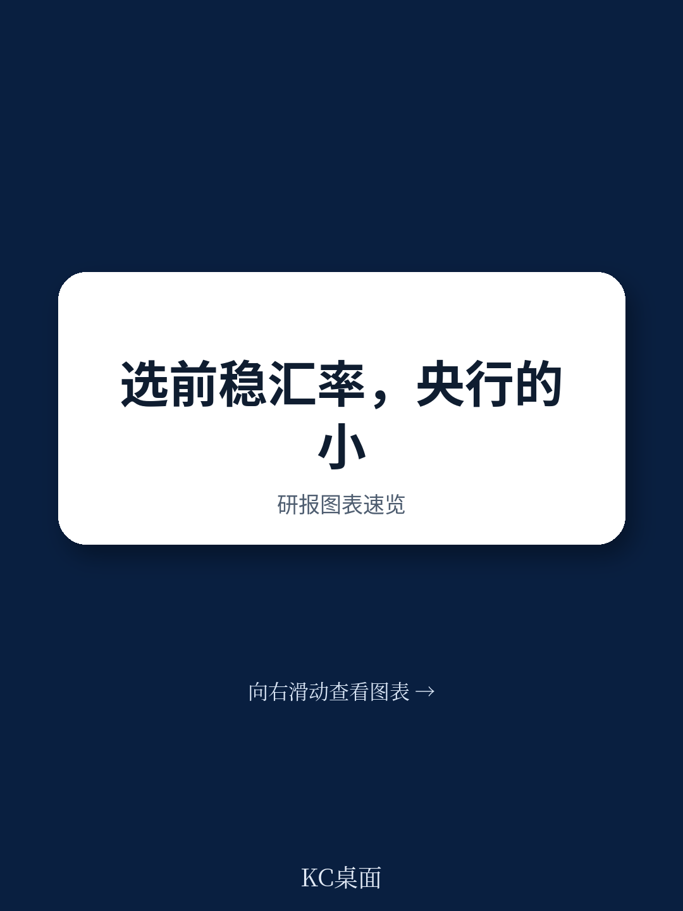
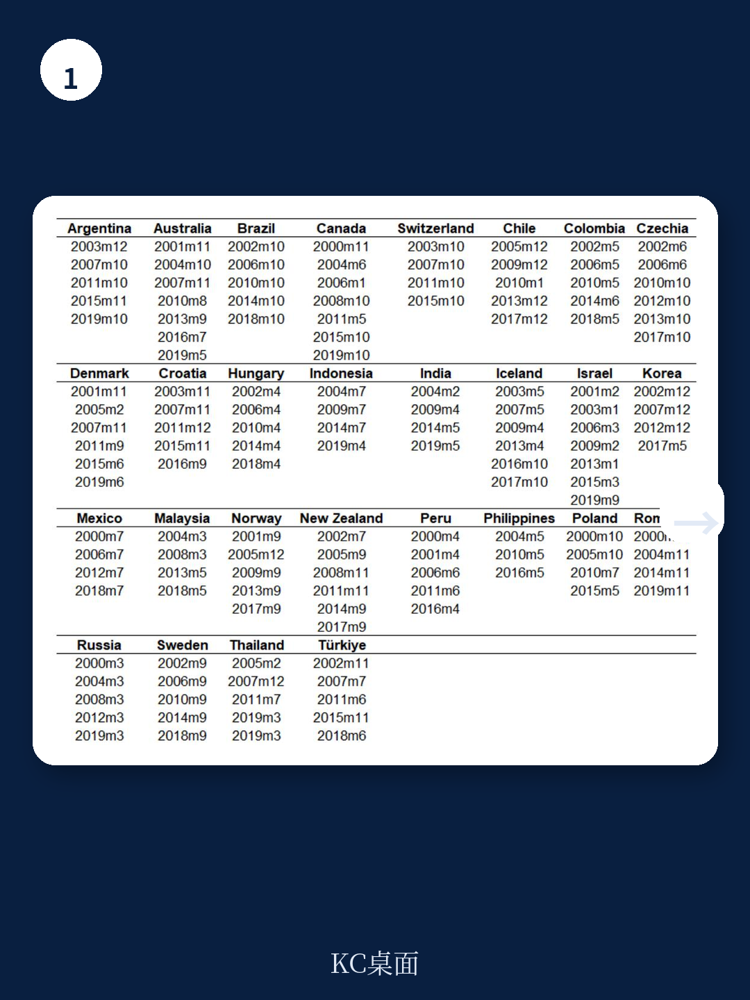
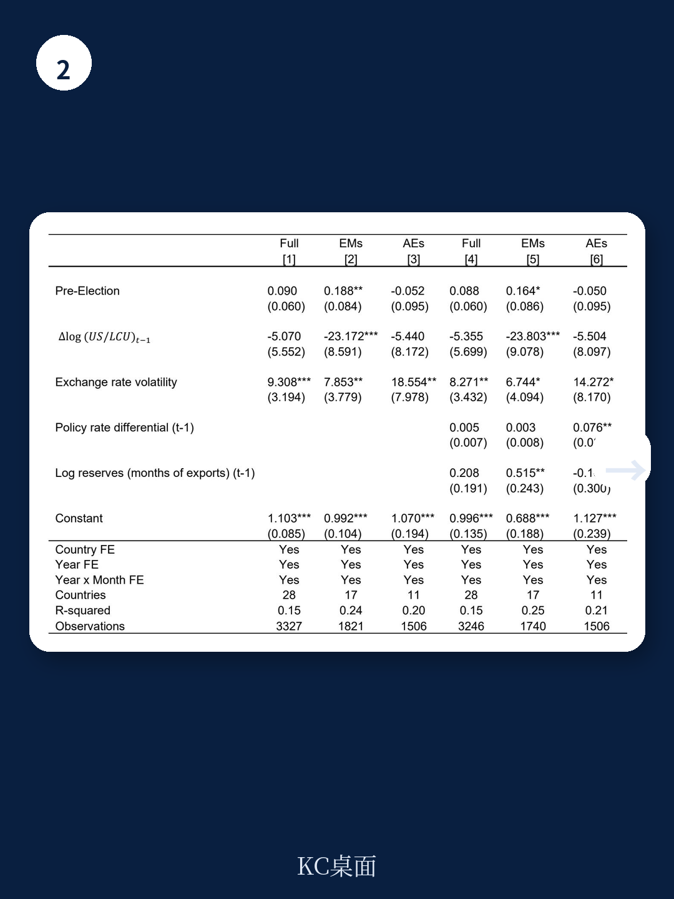

# 国际货币基金组织：选举年，新兴市场央行正在用外汇储备买选票

一份来自国际货币基金组织的最新工作论文，揭示了一个长期被市场忽视但影响深远的现象：在新兴市场国家，大选前的外汇干预力度会显著加大，央行倾向于抛售美元、支撑本币，目的是维护选民购买力。这不是简单的市场行为，而是政治经济周期在外汇政策领域的直接体现。

这份研报的核心判断是：新兴市场央行在外汇市场上的操作，并不总是纯粹基于经济基本面或汇率稳定目标。当选举临近，政治压力会显著改变干预的规模和频率。对于关注新兴市场资产定价、汇率走势和主权风险的投资者而言，理解这一机制，比单纯跟踪央行资产负债表更具前瞻意义。

为什么现在需要关注这个问题？全球通胀回落周期中，新兴市场货币普遍面临升值压力，但选举年的到来可能改变央行的行为逻辑——他们更倾向于“逆风干预”，即在本币贬值时卖出美元，而不是在本币升值时买入美元。这种非对称操作，会加速外汇储备的消耗，削弱央行应对未来冲击的缓冲垫。

## 1. 选举前的外汇抛售，规模远超市场预期

研报基于28个国家（17个新兴市场和11个发达经济体）2000年至2019年的月度数据，发现了一个统计上显著且经济含义明确的规律：新兴市场国家在大选前1到3个月，外汇抛售的规模和频率显著高于选举后同期。

具体而言，在竞争性选举的新兴市场，选举前月份的外汇抛售量比选举后月份高出约0.3至0.5个百分点的GDP。考虑到这些国家外汇储备占GDP的比例通常在10%到30%之间，这意味着选举周期可能消耗掉储备的1%到3%。这个数字看似不大，但考虑到干预的集中性和时效性，其对市场预期的冲击不可小觑。

> **KC评论：** 这个发现最值得投资者注意的地方在于，它揭示了央行行为的一种“政治季节性”。如果你投资的新兴市场国家即将大选，而该国的汇率正在承压，那么央行的干预力度可能比平时更大、更持久。但这并不意味着汇率会因此稳定——恰恰相反，一旦选举结束，干预动力消失，汇率可能面临补跌压力。

## 2. 政治压力是驱动因素，而非单纯的经济考量

研报进一步区分了“政治压力”与“经济基本面”对干预行为的影响。作者使用“央行行长非正常更替频率”作为政治压力的代理变量——当一个国家的央行行长在任期内被提前解职的次数越多，说明政治干预央行的可能性越高。

结果非常清晰：在政治压力较高的国家，选举前的外汇抛售行为更为激进。而在那些央行独立性较强、行长更替正常化的国家，选举周期对干预行为的影响几乎可以忽略不计。

这组对比说明了一个重要事实：选举前的外汇干预，本质上不是技术性的汇率管理，而是政治性的购买力管理。政府希望通过维持本币汇率稳定，来保护选民的实际购买力，从而提升执政党的民意支持率。研报甚至提供了辅助证据——外汇抛售之后，政府稳定性指数确实出现了短期上升，说明这种干预确实起到了“买选票”的效果。

> **KC评论：** 对于分析新兴市场而言，这是一个容易被忽略的变量。当你在评估一个国家的汇率风险时，不仅要看经常账户、资本流动和通胀，还要看政治日历和央行行长的政治背景。如果一个国家的央行行长在选举前频繁更换，那么外汇储备的安全性就需要重新评估。

## 3. 货币政策透明度是有效的“解药”

研报最重要的政策贡献，在于它找到了一个可以缓解上述问题的变量：货币政策透明度。

作者使用Dincer等人构建的央行透明度指数，将其分解为三个维度：经济透明度（是否公开经济数据和预测）、政策透明度（是否公开决策理由和前瞻指引）、操作透明度（是否公开执行中的挑战和扰动）。研究发现，透明度越高的央行，选举前的外汇抛售冲动越弱。其中，经济透明度和政策透明度的缓解效果最为显著，操作透明度的影响相对较小。

这一发现的逻辑是自洽的：当央行必须公开其决策依据和经济预测时，选举前的政治干预就会面临更高的声誉成本和问责风险。透明的决策过程，天然地抑制了短期政治动机对长期政策目标的侵蚀。

> **KC评论：** 这个结论对投资者有直接的指导意义。你可以用央行透明度指数作为一个领先指标，来判断一个新兴市场国家选举前的汇率风险。透明度高的国家（如韩国、智利），选举周期对外汇干预的影响有限；透明度低的国家（如土耳其、阿根廷），则需要高度警惕选举前的外汇储备消耗和选举后的汇率调整。

## 4. 报告尚未完全回答的关键问题：规则能约束行为吗？

研报在政策建议部分提到了“规则对自由裁量权”的经典争论，并建议引入外汇干预规则（例如预设贬值区间或阈值）来约束选举周期的干预行为。但报告并未给出实证检验——即这些规则在现实中是否真的有效。

这是一个值得追问的问题。从历史经验看，许多新兴市场国家都曾尝试过汇率目标区间或干预规则，但在选举压力面前，这些规则往往被“临时暂停”或“灵活解释”。规则的有效性，最终取决于执行规则的制度承诺和政治约束力。

此外，报告的数据样本截至2019年，未能涵盖2020年至今的全球通胀冲击和加息周期。在后疫情时代，新兴市场央行的行为模式是否发生了变化？数字化和社交媒体的兴起，是否放大了或削弱了政治压力对央行的传导？这些问题的答案，仍然需要更近期的数据来验证。

## 5. 一个值得持续跟踪的观察框架

基于这份研报，我们可以构建一个用于评估新兴市场汇率风险的“政治经济三维框架”：

第一维度：政治日历。距离下一次大选的时间。越接近大选，干预动机越强。

第二维度：央行独立性。央行行长非正常更替频率、央行透明度指数。独立性越弱，干预越激进。

第三维度：储备充裕度。外汇储备占GDP的比例、短期外债覆盖率。储备越少，选举后汇率调整的风险越大。

三个维度叠加，可以形成一个风险热力图。例如，一个储备充足、央行透明度高、大选尚远的国家，汇率风险较低；而一个储备消耗、央行频繁换人、大选在即的国家，则可能面临选举前干预耗储、选举后汇率急跌的双重风险。

这份IMF研报的完整版本包含了更详细的回归结果、稳健性检验以及分国别的图表分析，例如不同透明度维度对干预行为的具体影响路径。这些内容在本文中无法一一展开，但它们对于深入理解政治经济周期如何影响汇率定价，具有不可替代的价值。

如果你希望获取完整的研报解读、原始数据图表以及每日更新的国际投行研究摘要，欢迎加入我们的社群。每天，我们会通过AI agent加人工审核的方式，筛选并解读高盛、摩根士丹利、瑞银、IMF等机构的最新报告，形成约10至40页的中文摘要与数据合集，既方便喂给AI模型，也便于人工快速把握全球市场动态。我们会在社群中继续讨论：规则能否真正约束选举周期的干预行为？后疫情时代的新兴市场央行为何行为模式可能已经改变？

Personal reading notes and learning share only. Not investment advice.

