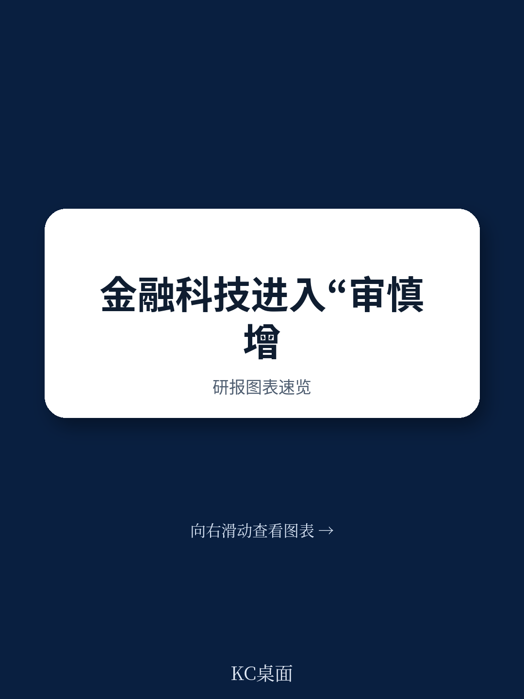
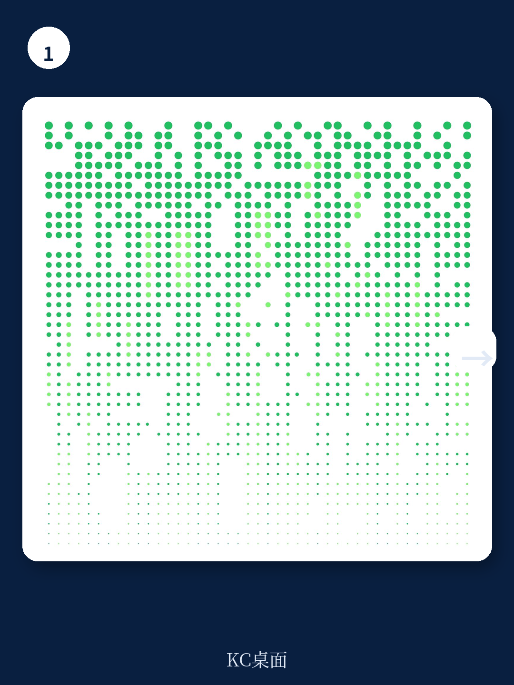
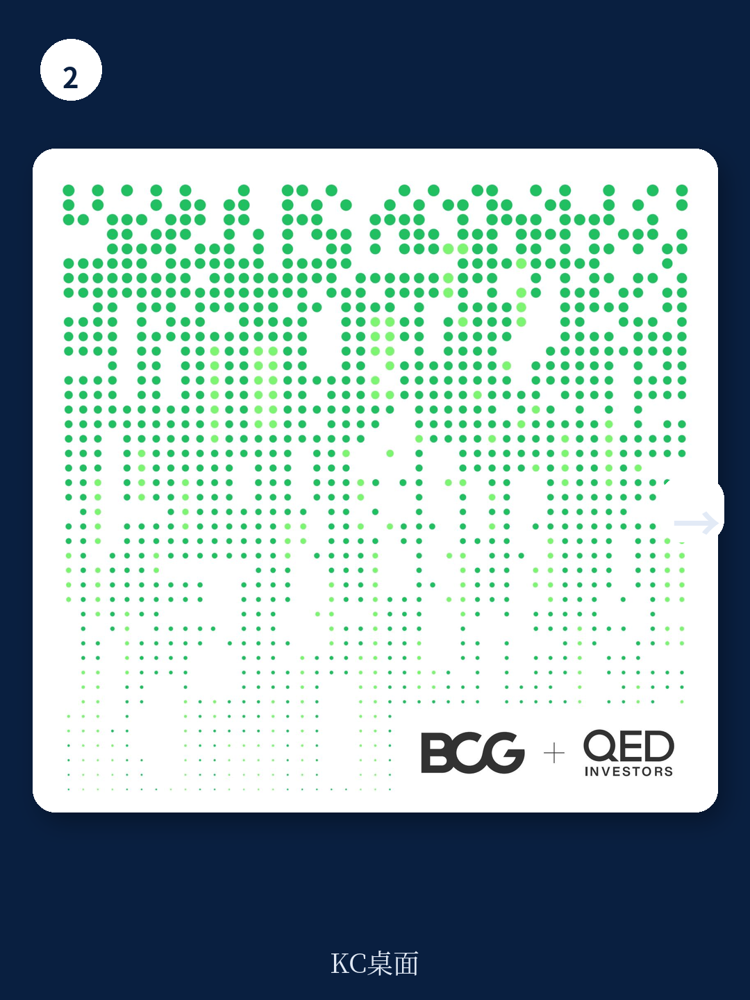

# 波士顿咨询：金融科技的下一个关口不是增长，是“审慎经营”

当一家金融科技公司从“不计成本的增长”转向“盈利性增长”，它面临的最大挑战往往不是融资环境，而是内部能力结构的重塑。波士顿咨询（BCG）与QED Investors联合发布的《2024年全球金融科技报告》给出了一个核心判断：金融科技行业正在从“增长优先”转向“审慎经营优先”，这一转变的深度和速度，将决定哪些公司能够穿越周期，进入下一个十年。

这份报告的一个核心数字值得反复咀嚼：到2030年，全球金融科技市场规模将从目前的3200亿美元增长至1.5万亿美元，接近五倍。但通往这个规模的道路，不再由“烧钱换用户”铺就，而是由“合规能力+单位经济模型+盈利性增长”三重门槛构成。

报告采访了60多位全球金融科技CEO和投资者，梳理出九大趋势、四大发展主题和五项行动呼吁。但最让人印象深刻的，不是这些框架本身，而是报告反复强调的一个看似朴素却极具杀伤力的结论：**审慎经营，即将成为金融科技公司的核心竞争力。**

这意味着什么？意味着过去十年里，金融科技公司赖以生存的“监管套利”窗口正在关闭。监管环境正在趋同，银行与金融科技公司之间的竞争规则正在拉平。当所有人都必须在同样的合规框架下竞争，那些提前把合规能力建造成护城河的公司，将获得结构性优势。

> **KC评论：** 对于关注金融科技赛道的投资者和从业者来说，这份报告最值得记住的不是1.5万亿的远期规模，而是“审慎经营”这四个字背后隐含的竞争逻辑。过去大家比的是谁跑得快，未来比的是谁在合规框架下跑得稳。这意味着，合规部门将从成本中心变成战略部门。完整报告里有大量关于如何构建合规优势的具体案例和框架，包括银行与金融科技公司合作的最佳实践，值得细读。

## 1. 融资寒冬没有杀死金融科技，反而筛选出了真正的玩家

过去三年，金融科技行业经历了严酷的估值回调。平均市销率从20倍降至4倍，融资规模骤减约70%。但报告揭示了一个容易被忽略的事实：**行业营收仍在以14%的年复合增长率稳健增长**，如果排除加密货币和中国市场，增速更高达21%。

更关键的是，排名前四分位的金融科技公司与后四分位之间的营收增速差距极为显著。这意味着，融资寒冬并没有均匀地打击所有公司，而是加速了优胜劣汰。那些商业模式不具规模化能力或盈利能力的企业正在被淘汰，而幸存者正在变得更加强壮。

报告特别提到，2023年行业EBITDA利润率同比平均提高了9个百分点。这标志着整个行业正在从“不计成本的增长”向“盈利性增长”模式转变。但转变尚处于初期阶段——排名前70的上市金融科技公司中的绝大多数仍未达到“40法则”门槛（营收增长率和利润率之和达到40%以上）。

> **KC评论：** 这里有一个容易被忽视的信号：融资寒冬不是终点，而是分水岭。那些在融资宽松时期建立起来的、依赖低成本资金驱动的商业模式正在被清算，而真正解决用户痛点的公司正在通过效率提升来证明自己。完整报告里有详细的图表演示了不同赛道、不同地区的金融科技公司营收增速分化情况，以及上市金融科技公司向盈利性增长的转变路径，这些数据对于判断具体赛道的投资价值非常有帮助。

## 2. 嵌入式金融的利润池将达3200亿美元，但大部分会被成熟玩家拿走

嵌入式金融（Embedded Finance）是整份报告中最具想象力的话题之一。报告预计，到2030年，嵌入式金融将在全球范围内创造3200亿美元营业收入，其中中小企业客群贡献1500亿美元，消费者客群贡献1200亿美元，大企业客群贡献500亿美元。

但报告没有停留在乐观预测上，而是提出了一个关键问题：**这个利润池主要是由金融科技公司独享，还是传统银行也会来分一杯羹？** 答案是：短期内成熟金融科技公司将继续占据绝大多数份额，但未来传统银行将逐渐抢占份额。

原因在于，监管对银行与金融科技合作的审查正在加强，那些拥有健全风险管控能力、能够有效监督金融科技公司并建立牢固合作关系的银行，将更能收获经济效益。这再次呼应了“审慎经营”的主题——合规能力正在成为分蛋糕的关键变量。

报告还特别提到了数字公共基础设施（DPI）在印度和巴西的成功案例。印度的UPI和巴西的Pix不仅扩大了金融服务覆盖，还激发了大量创新。但报告也给出了一个冷静的提醒：DPI的成功取决于其综合水平以及各类系统的全面整合，其他国家能否复制这一模式尚未可知。

> **KC评论：** 嵌入式金融的预测很诱人，但真正的挑战在于如何判断哪些赛道、哪些公司能吃到这波红利。报告里有一个非常实用的分析框架，将嵌入式金融按客户类型（中小企业、消费者、大企业）和软件类型（垂直、水平）进行拆解，并给出了每个细分市场的增长驱动因素和竞争格局。这些细节在完整报告中有更深入的展开，对于产业决策者和投资者来说，是理解这个赛道的关键地图。

## 3. 互联商务：银行终于找到了将客户数据变现的“杀手级”应用

报告提出了一个令人耳目一新的概念：互联商务（Connected Commerce）。传统银行掌握着最富洞察力的客户数据，但长期以来，这些数据并没有被有效变现。随着cookie“贬值”和应用追踪透明化，第一方数据的价值日益凸显，互联商务正逐渐成为银行的“三效合一”战略——创造新收入来源、提高客户忠诚度、为中小企业和大企业客户提供营销渠道。

报告列举了几个代表性案例：摩根大通的Chase Media Solutions、第一资本的Capital One Shopping、花旗银行的Citi Shop。这些大型金融机构正在积极布局互联商务，利用精细化客户数据推送高度定制化的广告内容，形成一个三赢局面：客户得到奖励，商家增加销售，银行获得收入。

但报告也给出了一个重要的提醒：**银行需要警惕风险**——这种精准广告投放可能会把广告商变成客户，而把消费者变成服务广告商需求的产品，从而损害品牌忠诚度。银行在这方面需要谨慎权衡。

> **KC评论：** 互联商务是整份报告中最具“反常识”色彩的洞察之一。传统银行一直被认为是“数据富矿但缺乏开采能力”的典型，而互联商务似乎给出了一个可行的变现路径。但报告没有完全展开的是，银行在数据隐私和合规方面的约束，以及消费者对银行推送广告的接受度。这些问题在完整报告中有更详细的讨论，包括苹果公司可能如何影响这一赛道的发展。

## 4. 生成式AI：金融科技公司的“救命稻草”，但红利窗口有限

生成式AI是报告中另一个亮点。报告认为，生成式AI能为金融科技公司带来巨大的效率提升，特别是在成本集中的领域：代码编写、客户支持、数字营销。相较于其他金融服务机构，金融科技公司在短期内收获的增效红利最大。

原因在于，金融科技公司是“数字优先”的成本结构，其运营成本中代码编写、客户支持和数字营销的占比远高于传统银行。而这三个领域恰恰是生成式AI当前最擅长的。

报告给出了一个具体的数字：金融科技公司需要并且能够将EBITDA利润率提高25个百分点以上。这意味着，对于那些正处于盈利性增长转型关键期的金融科技公司来说，生成式AI可能不是锦上添花，而是雪中送炭。

但报告也提醒，生成式AI在产品创新方面的应用将滞后于效率提升。强调负责任的AI，并确保建立适当的治理机制和风险管控体系，是生成式AI应用的基本要求。**生成式AI风险管理将是企业规模化发展的差异化优势所在。**

> **KC评论：** 生成式AI对金融科技的影响，报告给出了一个非常清晰的“两步走”路径：短期是效率提升，长期是产品创新。但对于投资者来说，真正需要关注的是，哪些公司能够率先将生成式AI带来的效率提升转化为可持续的竞争优势。完整报告里有详细的图表演示了生成式AI在不同成本环节的降本潜力，以及金融科技公司与传统银行在生成式AI应用上的差异，这些数据对于判断具体公司的投资价值很有参考意义。

## 5. 报告尚未完全回答的关键问题：数字公共基础设施能否被复制？

报告对数字公共基础设施（DPI）的讨论非常深入，但也在最后留下了一个悬而未决的问题：印度和巴西的成功模式能否被其他国家复制？

DPI的成功离不开三个条件：国民数字身份系统层、支付层和数据交换层的全面整合；监管机构的积极态度；以及市场参与者的创新活力。巴西央行不仅支持了Pix的建设和运营，还通过灵活的牌照制度（在标准银行牌照之外颁发支付机构牌照）来鼓励创新。

但报告坦承，其他国家，包括发达市场，能否顺利复制这一成功模式尚未可知。这很大程度上取决于当前市场环境和基础设施各层的成熟水平。

对于关注新兴市场的投资者来说，这是一个需要持续跟踪的核心问题。如果DPI能够被复制到更多国家，金融科技的渗透率将迎来新一轮加速；如果DPI的推广受阻，金融科技的增长将更多依赖传统路径。

> **KC评论：** 数字公共基础设施的复制问题，是整份报告中最具“二阶影响”的议题。它直接关系到嵌入式金融、开放银行、乃至整个金融科技生态的底层基础设施。报告里有一个非常有价值的专题，详细拆解了巴西和印度DPI的架构、治理模式和成功要素，这些细节对于理解“为什么某些市场的金融科技发展更快”非常关键。完整报告还包含了更多关于DPI推广的挑战和可能路径的分析。

## 6. 投资者的观察框架：从“增长故事”到“股权故事”

报告在最后一部分给出了五项行动呼吁，其中对投资者最有价值的，是“讲好股权故事”这一条。

报告指出，金融科技IPO市场终将迎来复苏，但金融科技公司现在必须讲好股权故事，包括如何以可持续的成本吸引用户，实现盈利性增长，满足日益严苛的监管要求。

这意味着，投资者评估金融科技公司的框架正在发生变化。过去，投资者关注的是月活用户数、交易量、营收增速等“增长指标”；未来，投资者需要关注的是单位经济模型、EBITDA利润率、合规成本占比、客户获取成本（CAC）与客户生命周期价值（LTV）的比值等“盈利指标”。

报告给出了一个具体的数字：金融科技公司需要将EBITDA利润率提高25个百分点以上。这意味着，对于那些目前仍处于亏损状态的公司来说，实现盈利性增长并非遥不可及，但需要建立支撑规模化发展的成本结构，能够随着公司发展产生复合回报。

> **KC评论：** 对于正在考虑投资金融科技赛道的读者来说，这份报告提供了一个非常实用的评估工具。报告里有一个“40法则”的框架，以及如何通过成本结构优化和收入结构多元化来实现盈利性增长的具体路径。这些内容在完整报告中有更详细的展开，包括70家上市金融科技公司的业绩数据分析和不同赛道的盈利性增长案例。如果你正在寻找一个系统性的金融科技投资分析框架，完整报告值得一读。

---

金融科技行业正在经历一场从“野蛮生长”到“精耕细作”的深刻转型。波士顿咨询的这份报告，给出了一个清晰的路线图：审慎经营为本，单位经济盈利，稳健客户增长。

但报告也在最后留下了一个值得深思的问题：当所有金融科技公司都开始追求盈利性增长，当监管环境趋于一致，当生成式AI带来的效率红利被普遍应用，真正的差异化优势将来自哪里？

答案可能不在于技术本身，而在于组织能力——如何将合规能力、数据能力、AI能力、客户洞察能力整合成一个有机的、可持续的竞争优势体系。

这恰恰是完整报告最有价值的部分：它不仅有宏观的判断和预测，还有具体的行动框架和案例分析。如果你对金融科技赛道的未来走向、投资机会、竞争格局感兴趣，这份报告值得花时间细读。

在我们的社群中，我们每天会由AI agent加上人工review，生成国际投行中文摘要与KC评论，daily更新，约10-40页，也包含当天最新数据图表合集。这些内容既方便喂给AI进行二次分析，也方便人工快速把握market dynamics。如果你希望持续跟踪这份报告中提到的趋势和议题，欢迎加入我们的社群，领取完整研报解读与原始图表。

Personal reading notes and learning share only. Not investment advice.

