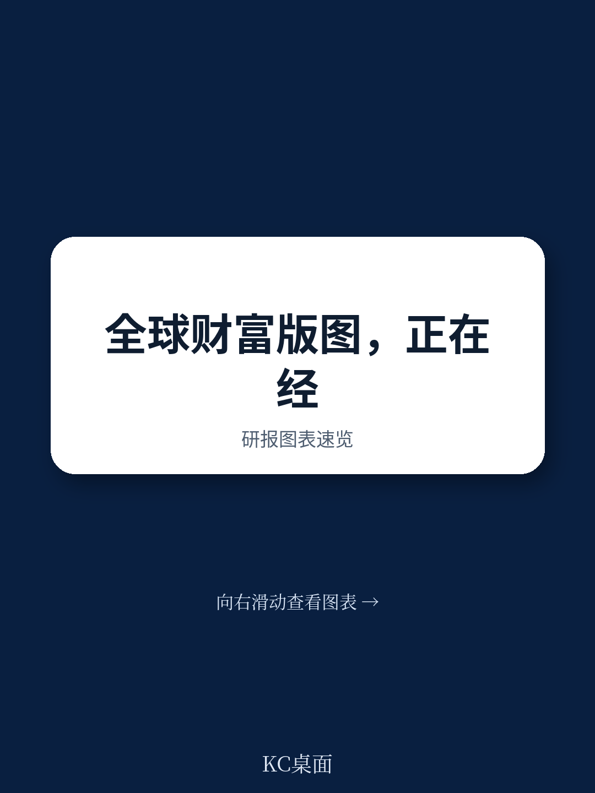

# 波士顿咨询：全球财富正在重新“扎堆”，香港首次超越瑞士

全球金融财富在2025年增长了10.7%，达到333万亿美元，创下2021年以来最快增速。但这份由波士顿咨询（BCG）发布的《2026全球财富报告》真正值得关注的，不是总量数字，而是四个正在同时发生的结构性变化。这些变化正在重新定义财富的流向、持有者、服务模式，以及行业竞争的底层逻辑。

报告的核心判断是：财富管理行业正在进入一个“大重组”时期。那些在过去十年被视为理所当然的竞争位置，正在被不可逆的力量侵蚀。而最大的机会，恰恰藏在行业最不擅长服务的角落。

如果你只读一份关于全球财富趋势的报告，今年应该是这一份。以下是我们从报告中提炼出的四个关键洞察。

> **KC评论：** 这份报告的价值不在于预测，而在于它画出了一张“正在发生的地图”。读完你会发现，很多你以为是“未来趋势”的东西，其实已经在数据里了。完整报告里有大量按地区、按资产类别、按渠道拆分的图表，这些细节才是判断自己所在市场是否被高估或低估的关键。

## 1. 财富增长正在向两个核心“枢纽”集中，香港与瑞士构成新的双极格局

报告最引人注目的发现之一，是跨境财富的集中度正在加速提升。2025年，全球跨境财富增长了8.4%，达到15.7万亿美元，而排名前十的记账中心拿走了近90%的新增跨境资金，并持有超过80%的存量。

更关键的变化在于：香港首次以微弱优势超越瑞士，成为全球最大的跨境财富记账中心。香港的跨境财富在2025年增长了10.7%，达到2.9万亿美元，主要驱动力来自中国大陆的资金流入和活跃的IPO市场。瑞士同样达到2.9万亿美元，但增速为7.6%，其客户基础更偏向西欧市场。

新加坡则扮演了“亚洲最多元化财富枢纽”的角色，成为中美紧张局势下的避险资金受益者。超过2000家单一家族办公室和100多家独立财富管理公司已落户新加坡。

这意味着什么？全球财富的“地理锚点”正在从单一中心转向双极格局。香港和瑞士分别锚定亚太和欧洲-中东两个核心区域。能够在这两个集群中都建立可信服务能力的机构，将获得结构性优势。而那些只在一个区域深耕的机构，则需要重新评估自己的客户覆盖半径。

> **KC评论：** 很多投资者习惯把“财富管理”等同于“私人银行服务”，但这份报告提醒我们，记账中心的选择本质上是一个地缘政治和监管套利的决策。香港的崛起不是偶然，但它对中国大陆的依赖度超过60%，这个集中度本身就是风险。完整报告中对每个主要记账中心的增长假设和风险敞口有更细的拆解。

## 2. 新兴市场是下一个财富增长引擎，但行业目前几乎无法服务它们

报告指出，除中国外，到2030年全球金融财富增长的约10%将来自新兴市场，以印度、巴西和墨西哥为首。这些市场的富裕阶层和新兴高净值人群，是行业中服务最不充分的群体之一。

这个数字听起来不大，但关键在于增量。当北美和欧洲的财富增长趋于稳定（约7%和5%的复合年增长率），新兴市场9%的年均增速意味着，谁先建立起服务能力，谁就能在未来五年内锁定一个高粘性的客户群。

报告特别提到，零售银行和公司银行在这些市场拥有关系和分销网络，但需要改变运营方式才能抓住机会。这意味着，传统的私人银行模式（高门槛、高成本、高度个性化）在新兴市场可能并不适用。更轻、更数字化、更接近“财富管理即服务”的模式，可能是更可行的路径。

## 3. 亚洲正在经历首次大规模代际财富转移，家族治理成为核心命题

报告用“The Succession Reckoning”来形容亚洲正在发生的代际财富转移。这不仅是钱从一代人转到下一代人，更是关于治理、领导权、所有权和目的的重新定义。

报告指出，帮助家族应对这一复杂过渡的财富管理机构，将定义亚洲财富管理行业的下一时代。而未能建立这种能力的机构，可能会在客户生命周期中失去最具价值的一环。

这个判断对行业的意义在于：代际转移不是一次性事件，而是一个持续10-20年的服务周期。那些能在“财富传承规划”之外，提供家族治理、税务优化、跨境法律架构等综合服务的机构，将获得远超单一资产管理费的收入机会。

> **KC评论：** 很多财富管理机构把“服务二代”挂在嘴边，但真正能落地的寥寥无几。报告没有展开的是，二代客户对数字工具、ESG投资、以及独立于家族企业之外的资产配置需求，往往与一代完全不同。完整报告中对“独立财富管理公司”这一快速增长的渠道有专门分析，它们在这一领域可能比传统私人银行更具优势。

## 4. AI正在重新定义财富管理的经济模型，但大多数机构还在“叠加”而非“重构”

报告最具有前瞻性的部分，是对AI在财富管理中应用的分析。它提出了两个核心场景：一是AI重塑了顾问服务的经济性，但人类顾问的核心角色仍然存在；二是AI使顾问变得可替代，对于相当一部分市场，顾问可能不再是必需品。

报告强调，大多数机构目前的做法是“在现有流程上叠加生成式AI工具和代理”，而不是围绕AI重新构建业务流程。这两种方法的差距将迅速拉大。

具体建议包括：攻击最高成本的工作流（财务规划、投资组合管理、合规自动化）；围绕AI重建顾问体验（下一最佳行动提示、留存预警、自动化文档）；将机构知识编码到AI代理中（让最佳顾问的判断成为代理的底层逻辑）。

报告还特别提出，财富管理机构应该引入“解耦数据层”，将运营源系统与数据消费层分离，为AI代理提供实时、API可访问的策展数据，同时确保所有行动受确定性控制层（交易系统、规则引擎、工作流）的约束。

> **KC评论：** 这是整份报告中最值得反复读的部分。它没有给出一个“AI会取代人类”的简单结论，而是提供了一个分析框架：你的机构是在“自动化现有流程”，还是在“重新设计业务流程”？前者是效率提升，后者是商业模式变革。完整报告中对这两个场景有更详细的假设和财务影响测算。

## 报告没有完全回答的关键问题：独立财富管理公司的“规模悖论”

报告用专门篇幅分析了独立财富管理公司（IWMs）的崛起。它们现在控制着美国约四分之一的HNW资产，在瑞士和德国也占据高双位数份额，在阿联酋、印度和新加坡则是最快增长的渠道。

但报告也坦承，这一模式正面临压力。在成熟市场，招募资深银行家和他们的客户组合变得越来越不经济；在新兴市场，人才稀缺是主要瓶颈。更关键的是，IWMs的“个人关系”模式正在变成一种脆弱性：当客户将财富传给下一代时，很多二代客户会选择不同的顾问。而IWMs本身通常是创始人驱动，当资深顾问退休时，许多公司面临连续性危机，往往通过出售或清算来解决。

这意味着，独立财富管理公司面临一个“规模悖论”：不增长，就无法覆盖日益高昂的合规和技术成本；但增长，就可能稀释其最核心的竞争优势——个性化服务和客户粘性。报告没有给出明确的解法，但这恰恰是行业下一步最值得关注的竞争变量。

## 对决策者的三个观察框架

基于这份报告，我们可以提炼出三个用于观察行业变化的框架：

第一，用“记账中心分布”判断地缘政治风险敞口。如果你的客户资产过度集中在某一个记账中心，而该中心又高度依赖单一资金来源（如香港对中国大陆的依赖），就需要考虑分散风险。新加坡的“中立枢纽”定位可能在未来几年持续受益。

第二，用“代际转移准备度”评估客户粘性。不是所有财富管理机构都有能力服务二代客户。那些在数字工具、ESG投资、家族治理方面有明确布局的机构，更有可能在代际转移中保留资产。

第三，用“AI重构深度”判断竞争力。简单地在现有流程上叠加AI工具，和围绕AI重新设计业务流程，是两种完全不同的竞争力。前者是效率提升，后者是商业模式变革。报告的判断是，两者的差距将迅速拉大。

## 顺着这些未解问题继续讨论

这份报告提供了丰富的洞察，但也留下了不少值得追问的问题：独立财富管理公司的“规模悖论”如何破解？AI重构财富管理业务流程的具体路径和财务影响是什么？新兴市场的高净值人群到底需要什么样的服务模式？代际转移中，二代客户的行为模式和资产配置偏好与一代有何不同？

这些问题，在完整报告中都有更细的数据拆解和案例支撑。如果你希望获得完整的研报解读、原始图表，以及每天由AI agent和人工review生成的国际投行中文摘要与KC评论，欢迎加入我们的社群。我们每天更新约10-40页的内容，既方便喂给AI进行二次分析，也方便你快速把握全球市场的动态变化。

Personal reading notes and learning share only. Not investment advice.

