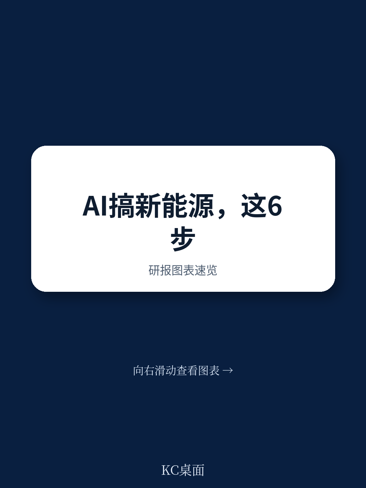
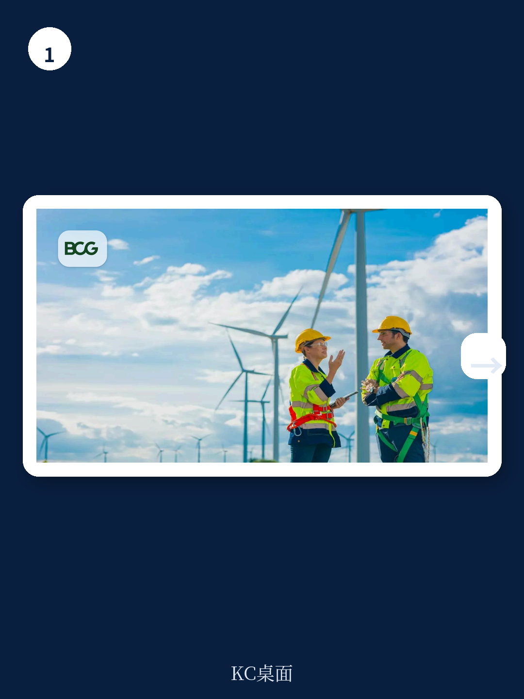
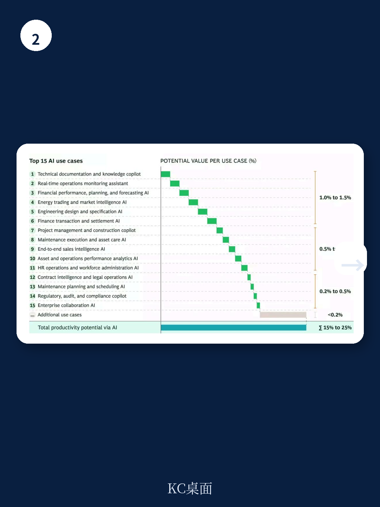

# 波士顿咨询：新能源公司AI投入翻三倍，但多数人正在浪费钱

几乎所有大型企业都在加大AI投入，但能源与公用事业公司的扩张速度远超多数行业。波士顿咨询（BCG）最新AI雷达调查显示，这些公司计划2026年的AI支出较2025年翻三倍，增幅仅次于保险业。

然而，一个残酷的现实正在浮现：尽管热情高涨，综合性能源公司和纯可再生能源玩家，在利用AI创造实际价值方面普遍举步维艰。

这不是技术问题，而是方法问题。BCG基于与多家客户的深度合作，提炼出六条经验教训，核心指向一个判断：**可再生能源企业若不能将AI投入与具体运营指标严格挂钩，并解决真实世界的操作瓶颈，这轮高达数倍的投资浪潮很可能变成一场昂贵的实验。**

这份报告的价值不在于罗列AI能做什么，而在于它揭示了“为什么大多数AI项目在新能源领域无法落地”的结构性原因。对于正在制定AI战略的产业决策者而言，这六条教训中的每一条，都可能是避免数千万资金浪费的关键。

## 1. 不要在“用AI做什么”上浪费时间，先回答“要改哪个KPI”

大多数新能源公司的AI项目启动方式错了。它们往往从宏大愿景或端到端转型开始，而不是从“未来6到12个月内，能否让某个关键指标有实质性改善”出发。

BCG给出了一个极其尖锐的判断标准：**如果你在项目启动第一周内，不能清晰说出要测量哪些KPI，并解释这个用例如何影响资产层面的损益表，那你不是在运行AI项目，你是在做研究。**

可再生能源领域的价值创造，最终要落到几个硬指标上：能量产出、设备可用率、每兆瓦时运营成本、每千瓦时建设成本。AI项目必须直接挂钩其中之一。

报告提供了一个令人振奋的数据：通过构建10到15个用例，企业通常能实现整体价值潜力的60%到70%。但这建立在一个前提上——每个用例都指向一个明确的、可测量的瓶颈。

> **KC评论：** 这条规则对任何资产密集型行业都适用。很多企业把AI项目做成“技术展示”，但CFO不会为炫技买单。BCG的底层逻辑是：AI不是目的，是解决KPI瓶颈的工具。如果你无法在项目启动时就说清楚“这个AI项目能让某台风机的可用率提升多少个百分点”，那这个项目大概率会烂尾。完整报告中包含了如何从运营指标反推AI用例的详细框架，以及一个欧洲综合能源公司的真实案例，其中详细展示了如何将“技术员空档时间”这个微观指标转化为数百万欧元的成本节约。

## 2. 真正的约束不在算法里，而在调度员手里的电话和Excel里

这是整份报告最具洞察力的部分之一。BCG强调，AI解决方案的设计必须基于运营现实，而非理论模型。

报告描述了一个典型场景：一家欧洲综合能源公司面临劳动力问题——任务量在增加，但技术员的招聘和培训跟不上。BCG团队没有直接搭建一个炫酷的AI调度系统，而是花时间观察调度员和技术员的日常工作。他们发现：

- 调度员对技术员的具体位置和任务进度缺乏可见性；
- 调度员使用混合系统，甚至在关键时刻仍通过电话和邮件确认技术员位置；
- 很多“空档时间”不是技术员偷懒造成的，而是由固定客户预约、安全要求等硬约束导致的；
- 系统里的“松弛时间”有些是效率浪费，有些是保护员工身心健康的必要缓冲。

基于这些观察，团队设计的AI调度助手不是要消除所有空档时间，而是专注于：通过更现实的规划减少可避免的空档，并通过动态重新规划应对突发中断。最终，这个方案将技术员平均每日1到2.5小时的空档时间大幅压缩，使运营成本降低数百万欧元。

**核心洞察：** 在可再生能源这类资产密集型行业，价值很少通过漂亮的流程再造来实现；它来自于解决运营瓶颈，让业务更有效地运转。

> **KC评论：** 这个案例揭示了AI落地的第一性原理：不要问“AI能做什么”，要问“现场的人现在卡在哪里”。报告没有展开的是，这种“影子工作”方法需要投入大量时间，而且对咨询团队和客户内部的配合度要求极高。对于想自己尝试的企业，完整报告提供了一个可复用的“约束诊断清单”，包括如何识别真正的瓶颈、如何区分健康缓冲与可避免浪费，以及在MVP阶段如何强制员工放弃旧系统。

## 3. 速度必须服从于纪律，新能源不能“边干边修”

硅谷的“快速行动，打破常规”在能源行业行不通。可再生能源公司是国家能源系统的组成部分，运营稳定性是底线。但同样，它们也不能花大量时间在AI试点上反复打磨，因为商业环境和项目经济性变化很快。

BCG给出的平衡方案是“有纪律的速度”。这意味着：

- 用例排序不依赖高管的热情，而是基于风险敞口和价值创造潜力；
- 从风险最低、价值最高的领域开始，逐步向核心业务扩展；
- 建立“人在回路中”的护栏，设定不可协商的规则、安全边界和停止机制；
- 引入回滚机制，确保坏更新时系统能回到可靠状态；
- 设计优雅降级能力，即使系统部分失效，也能以降低能力的方式继续运行。

**这本质上是一种风险管理的思维方式。** 对于新能源公司而言，AI项目的失败不仅仅是资金损失，还可能影响电网稳定性和客户信任。因此，治理结构不是束缚，而是规模化推广的前提。

## 4. 最小可行产品必须嵌入真实工作流，否则就是摆设

BCG对MVP的定义值得每个产品经理深思：**MVP不是孤立的沙盒演示，而是那个在周一开始时就有可能改变员工行为的最小版本。** 如果员工可以忽略这个解决方案而不失去关键利益，那么这个MVP就没有完成它的工作。

报告特别强调了一个被忽视的障碍：员工可能不愿意放弃旧系统。公司需要有效的沟通和变革管理，有时甚至需要强制停用旧系统，以避免新旧方式并行运作。

这意味着，AI项目的成功与否，最终取决于组织变革能力，而非技术能力。MVP必须由业务用户拥有，并提供支持以促进采纳。运营模式也需要调整——建立新的汇报线、改变角色和责任。

> **KC评论：** 这是整份报告最容易被低估的一条。很多公司花大价钱建AI系统，最后发现没人用。BCG给出的解决方案很直接：如果MVP不能让员工在周一早上就感受到“不用它我会吃亏”，那它就不该被发布。但报告没有完全展开的是，如何衡量“员工是否真正采纳”以及如何应对隐性抵制。完整报告中包含一个“MVP采纳检查清单”和具体的变革管理时间线，这对于任何正在推进AI落地的企业管理者都是必读内容。

## 5. 规模化不是技术问题，而是运营模式问题

BCG明确指出，价值创造不能由创新团队独立完成。任何被赋予规模化任务的小组，都必须与业务部门和其他关键领域建立直接联系。

最有效的运营模式是“中心辐射式”结构：中心由指导委员会负责AI战略和投资决策，一个由高级人员组成的核心团队（围绕变革管理、HR、AI组合管理、技术栈、数据、负责任AI和风险）制定集团标准并充当顾问；各业务单元（辐射点）保留用例所有权和实施责任，确保贴近业务，同时利用共享基础设施和治理。

报告还强调，必须建立有效的节奏，避免在概念验证、MVP和推广各阶段之间出现长时间停顿。每个阶段都要追踪价值创造，保持势头。

**这意味着，AI在新能源领域的竞争，最终将演变为组织能力的竞争。** 那些能快速建立“中心-辐射”架构、并让业务单元真正拥有AI用例的公司，将获得结构性优势。

## 6. 报告尚未完全回答的关键问题：这轮投资能否在政策逆风中回本

尽管BCG给出了令人信服的方法论，但报告也承认，可再生能源公司面临多重外部不确定性：批发能源价格波动、并网时间表不确定、弃风弃光风险。在利润率持续承压的背景下，AI投资需要快速回报。

报告没有深入分析的是：**当补贴退坡、利率上升、项目经济性恶化时，AI带来的效率提升是否足以抵消这些宏观逆风？** 报告估计AI可将工人生产率提高15%到25%，能量产出提升1到3个百分点。但这些数字在不同市场、不同资产类型和不同政策环境下会如何变化，仍有待验证。

此外，报告主要聚焦于运营层面的AI应用，对于更前沿的GenAI（生成式AI）模型在新能源领域的应用，只是点到为止。BCG指出“订阅最前沿的GenAI模型并不能解决问题”，但并未展开说明哪些GenAI用例在新能源领域真正有前景，哪些只是炒作。

**对于产业决策者而言，一个可行的观察框架是：** 将AI投资视为对冲运营不确定性的工具，而非增长引擎。在利润率承压的环境下，任何能提升资产可用率、降低运维成本的AI项目，其价值都会放大。但前提是，这些项目必须严格遵守BCG提出的六条原则，否则很可能变成沉没成本。

我们的社群正在持续跟踪这份报告对应的行业动态，包括主要新能源企业的AI投入节奏、实际案例的财务影响，以及GenAI在能源领域的落地进展。每天会由AI agent结合人工review，生成国际投行最新研报的中文摘要与KC评论，涵盖能源、科技、宏观等多个领域，约10到40页，也包含当天最新数据图表合集，既方便喂给AI，也方便人工快速把握市场动态。

顺着这些未解问题继续深入阅读完整报告，你将看到BCG提供的详细评估框架、案例研究中的具体KPI设定方法，以及如何建立“中心-辐射”式AI治理结构的具体操作指南。

Personal reading notes and learning share only. Not investment advice.

