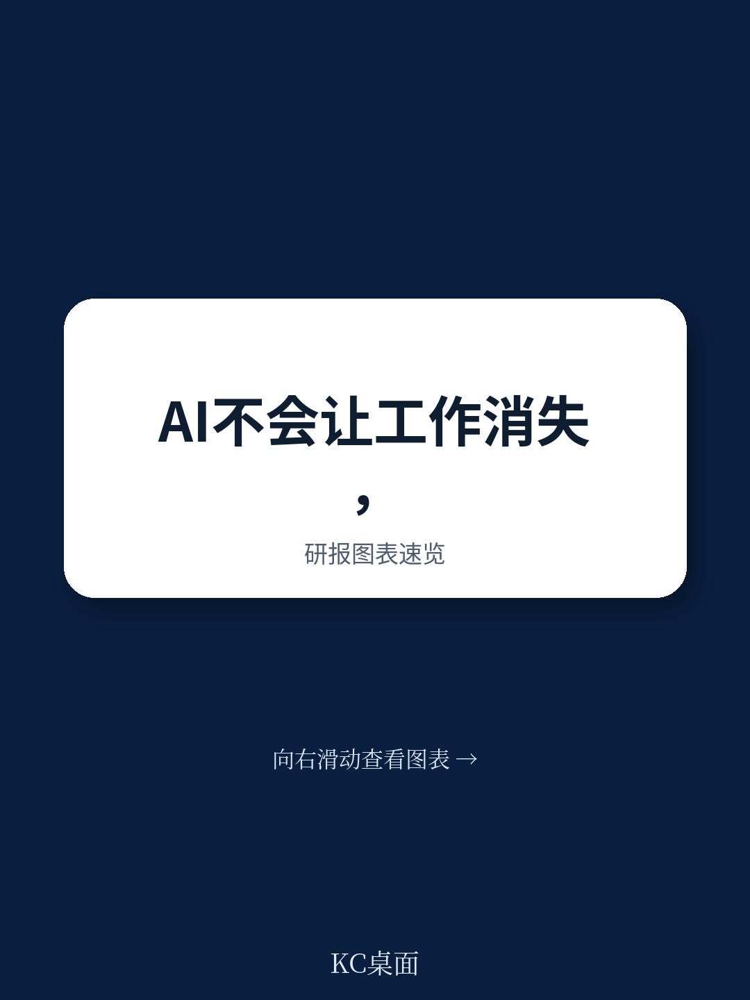
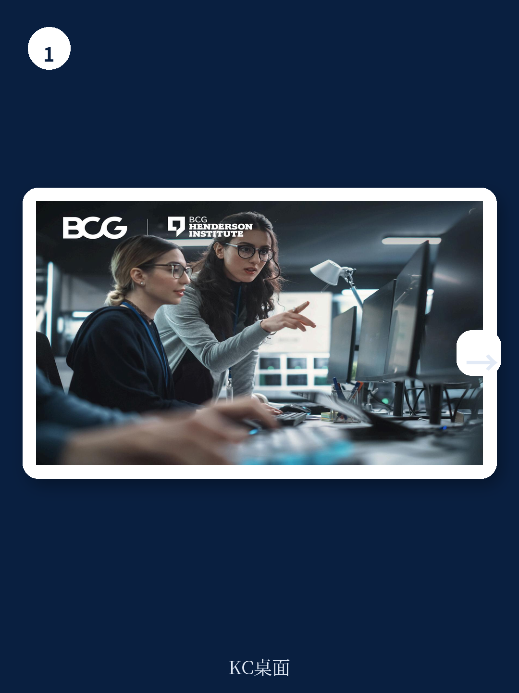
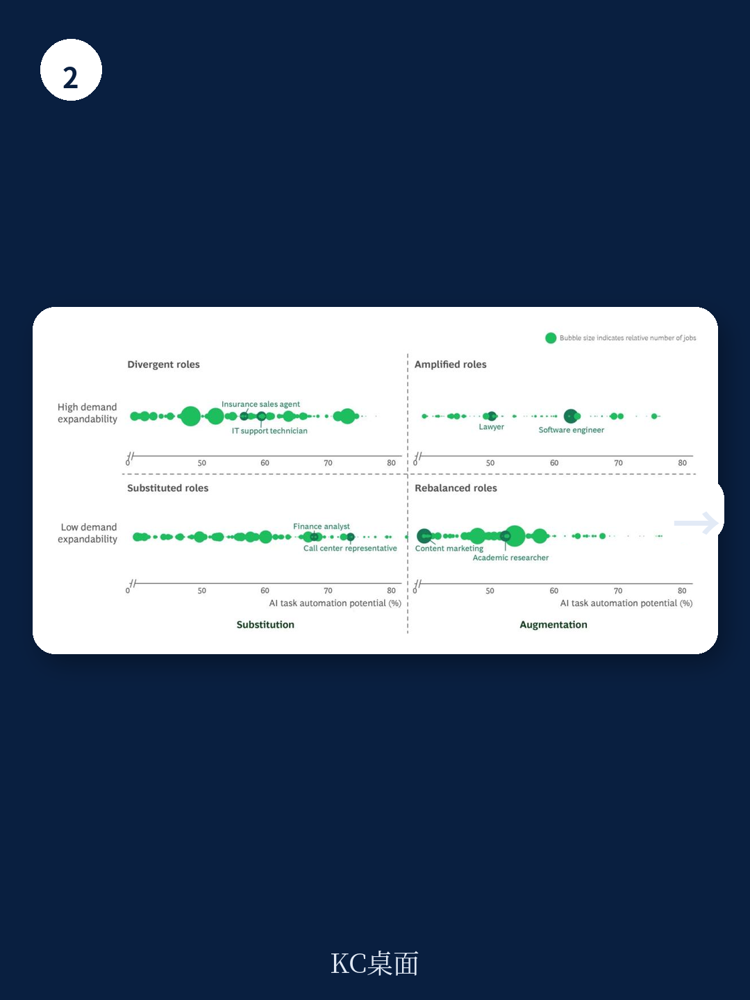

# 波士顿咨询：AI重塑的岗位远超它消灭的岗位，但CEO的决策窗口只有两年

未来两到三年内，美国50%到55%的岗位将被AI重塑。这不是一个遥远的预言，而是波士顿咨询公司（BCG）最新研报给出的量化判断。

这份报告最值得关注的核心结论，不是AI会消灭多少工作，而是它如何改变工作的本质。报告明确指出，未来四到五年内，美国只有10%到15%的岗位可能被AI完全替代。真正的大潮，是剩下那超过一半的岗位——从业者可能保留同样的职位头衔，但工作方式、产出标准和能力要求将发生根本性变化。

对于企业决策者而言，这个时间窗口意味着什么？BCG给出的答案是：今天做出的关于自动化、技能提升和人才规划的选择，将直接决定企业在AI时代是变得更强大，还是被竞争对手甩开。

## 1. 43%的岗位面临高自动化风险，但“替代”不是唯一结局

BCG的分析框架打破了一个常见误区：高自动化潜力不等于高失业风险。报告首先识别出，美国43%的岗位中，超过40%的任务可以被当前AI能力自动化。这个比例看起来惊人，但真正的分野在于，这些岗位中的任务是被AI“替代”还是被“增强”。

以呼叫中心代表和软件工程师这两个已经大规模部署AI的岗位为例，两者的命运截然不同。

呼叫中心代表的工作高度结构化：账户查询、政策解释、脚本化故障排除。当AI系统能端到端处理这些重复性问询时，企业对人工代表的需求必然下降。即使部分代表可以转型为更高价值的客户关系维护角色，整体岗位数量仍将收缩。

软件工程师则完全不同。虽然编码包含常规元素，但角色的核心价值在于系统设计、架构判断、性能与成本的权衡、以及将业务需求转化为技术方案。AI可以极大加速代码生成和测试，但无法替代端到端拥有成果所需的系统级判断。软件开发变成人与AI的持续互动，工程师定义目标、优化输出、验证结果、集成组件。AI支持并加速这些步骤，但没有消除对人类判断和问责的需求。

这个对比揭示了一个关键洞察：判断一个岗位是否会被AI颠覆，不能只看“任务自动化潜力”这一个指标。更需要看的是，这个角色中“人类价值”的嵌入程度——包括情感智能、谈判能力、复杂人际判断，以及工作流程的结构化和可编码程度。

> **KC评论：** 这份报告最有价值的部分，不是给出50%到55%的量化数字，而是提供了一个判断框架。对于企业高管来说，与其焦虑AI会取代多少员工，不如用BCG的框架审视自己公司里的每一个关键岗位：哪些属于“可以被AI增强”的，哪些属于“可能被AI替代”的？这个分类本身，就是制定人才战略的起点。完整报告中的“AI劳动力颠覆细分模型”包含了六个类别，每个类别对应不同的管理策略，值得仔细看。

## 2. 需求弹性：决定就业命运的真正变量

BCG的模型引入了一个经济学概念——需求弹性，这是理解AI对就业影响的另一个关键维度。当AI降低某个业务成果或终端产品的交付成本时，关键在于市场对该产出的需求是否会随之扩大。

如果需求有弹性，成本下降会释放被压抑的需求，增加可及性，加速消费。总产出上升，即使任务层面实现了显著自动化，就业仍可能保持稳定甚至增长。这就是经济学中著名的“杰文斯悖论”：当资源成本下降时，使用量反而会上升。

软件工程是需求弹性的典型例子。各类组织对数字产品、自动化和新功能的需求持续未得到满足。当AI降低构建软件的成本和时间时，组织往往会建设更多软件。产出扩大，整体岗位数量保持稳定甚至增长。BCG的数据显示，自2022年ChatGPT推出以来，软件工程人员数量持续上升，这直观地说明了这一现象。

呼叫中心代表则代表需求无弹性的场景。入站交互量主要由客户群规模和需求频率决定。当AI降低处理常规问询的成本时，交互数量并不会成比例扩张。在这种情况下，生产力提升更可能转化为所需代表数量的减少。

这个框架解释了为什么同样是高自动化潜力，不同岗位的就业前景截然不同。它也揭示了一个更深层的战略问题：如果AI能显著降低某个业务环节的成本，企业是否有能力创造新的需求来吸收释放出来的劳动力？

> **KC评论：** 需求弹性这个维度，是很多AI就业讨论中缺失的。它实际上在问一个更根本的问题：你的行业是否存在“被压抑的需求”？如果答案是肯定的，AI带来的成本下降可能意味着整个市场的扩张，而非岗位的收缩。但如果行业已经饱和，成本下降只会加剧竞争和裁员。报告中对不同行业需求弹性的测算方法，以及具体哪些行业属于“可扩展需求”，是完整报告中最值得细读的部分。

## 3. 报告尚未完全回答的关键问题：软件工程师的终局在哪里？

BCG的报告在分析软件工程师这一角色时，留下了一个悬而未决的问题。报告指出，软件工程目前属于“增强型”角色——AI增强人类能力，需求可扩展，就业稳定或增长。但报告也提出了一个“假设”场景：如果AI系统能够自主执行开放式、判断密集型任务，达到人类水平的能力，那么软件工程可能从“增强型”转向“分化型”。

这个假设并非空穴来风。AI领域的领军人物对此存在根本性分歧：有人认为现在是成为软件工程师的最佳时机，也有人预测这个职业的终结。BCG的模型承认，如果AI能力达到这一临界点，整个分析框架需要重新审视。

这个问题之所以重要，是因为软件工程是目前AI投资和应用最密集的领域之一。如果连这个“增强型”角色的标杆岗位都可能面临根本性质变，那么其他岗位的所谓“增强”可能也只是暂时的。

报告没有给出答案，但它提供了一个思考框架：判断一个岗位是否从“增强”转向“替代”，关键看两个条件是否同时满足——AI能否自主完成开放式、判断密集型任务，以及该岗位的需求是否仍然可扩展。如果两者都发生变化，那么就业预测就需要重新计算。

## 4. 57%的岗位短期内相对安全，但“安全”的定义正在改变

BCG的分析有一个常被忽略的结论：57%的美国岗位自动化潜力低于40%，这些岗位在短期内不太可能被AI显著颠覆。这些岗位高度依赖人类物理在场、动手操作或持续的人际互动。

但这并不意味着这些岗位可以高枕无忧。报告指出，即使自动化潜力低的岗位，如果自动化潜力超过25%，其日常工作也会被AI改变。这些岗位被归入“赋能型”类别——AI不会取代这些工作，但会改变完成工作的方式。

这意味着，即使是那些看起来最“安全”的岗位——比如需要大量物理在场或人际互动的工作——从业者也需要适应新的工作方式。AI不是取代这些岗位，而是成为这些岗位的“标准配置工具”。

对于企业来说，这意味着技能提升和再培训不是针对少数可能被替代的岗位，而是覆盖整个组织。BCG的建议是：大规模、有策略地推进AI技能提升，确保所有员工都能在日常工作中有效使用AI工具。

> **KC评论：** 57%这个数字容易被误解为“大部分岗位安全”。但仔细看报告的定义，这些岗位只是“自动化潜力低”，不等于“不需要改变”。实际上，报告预测50%到55%的岗位将被AI重塑，这个数字本身就包含了大量低自动化潜力的岗位。对从业者来说，真正的风险不是被AI替代，而是你的同事学会了用AI提升效率，而你没有。

## 5. CEO的行动框架：平衡自动化、技能提升与人才规划

BCG报告的核心受众是CEO。报告给出了一个清晰的行动框架，核心是“平衡”二字。

第一，不要过度依赖自动化。报告警告，那些裁员幅度超过AI实际替代能力的企业，会看到生产力下降、机构知识流失、关键人才出走。AI的替代能力是有限的，尤其在高判断力、高人际互动的岗位上。

第二，不要忽视技能提升。报告强调，大规模、策略性的AI技能提升不是可选动作，而是必选动作。这不仅仅是培训员工如何使用AI工具，而是重新设计职业发展阶梯，让员工看到在AI时代成长的可能性。

第三，管理叙事比管理技术更重要。报告有一个深刻的洞察：如果企业首先在高度可替代的岗位上推行自动化，会在组织内部制造恐惧和抵触情绪。当员工将自动化与裁员联系在一起时，参与度下降，技能提升的动力减弱。他们甚至会抵制那些旨在提升他们角色的增强措施。

CEO需要建立一个清晰的叙事：AI在大多数角色中是关于价值创造，而非裁员。这个叙事将决定员工是拥抱转型还是抵制转型。

报告也坦诚地指出，这一切都发生在一个高度敏感的环境中。即使那些与AI无关的、正常商业周期中的重组，也可能被归因于AI，从而加剧社会层面的恐惧。同时，不同公司对AI的运用方向可能截然不同——有的聚焦创新和增长，有的聚焦效率和自动化——这将导致截然不同的人才策略，有的裁员，有的扩招。

对于CEO来说，今天的决策窗口只有两到三年。如何平衡自动化、技能提升和人才规划，将决定企业能否在这个AI重塑劳动力市场的时代，既实现规模化的投资回报，又帮助员工发展在AI时代生存所需的技能。

---

这份BCG报告最值得反复咀嚼的地方，不是那些量化数字，而是它提供的分析框架。它告诉决策者：不要问“AI会取代多少工作”，而要问“我们的哪些岗位会被增强，哪些会被替代，哪些会因需求扩张而增长”。每个问题的答案，都指向不同的管理策略。

报告中的“AI劳动力颠覆细分模型”包含了六个类别，每个类别对应的管理策略、技能提升方式和组织设计原则，在完整报告中有详细展开。此外，报告对不同行业需求弹性的测算方法，以及具体哪些行业属于“可扩展需求”，也是完整版中值得细读的内容。

这些细节和图表，无法在一篇文章中全部展开。如果你希望拿到这份报告的中文精读版本，以及每天由AI Agent和人工审核同步生成的国际投行研报摘要与KC评论，欢迎加入我们的知识星球。我们会每日更新10到40页的研报解读，包含最新数据图表合集，既方便喂给AI快速分析，也方便人工把握市场动态。

Personal reading notes and learning share only. Not investment advice.

