## BCG X | BCG

## BCG AI AT WORK

## Strategy Matters More Than Tools

## Survey parameters

11,749

respondents

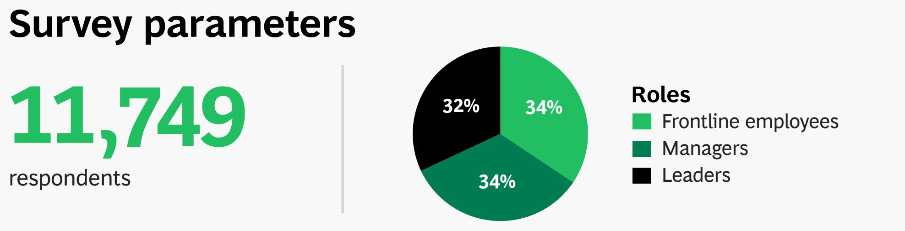

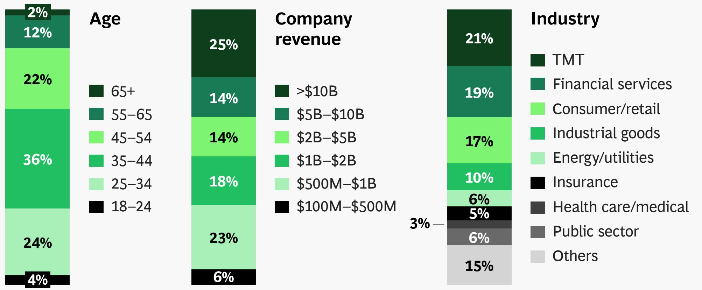  
Sources: AI at Work, 2026 (n=11,749); BCG analysis.

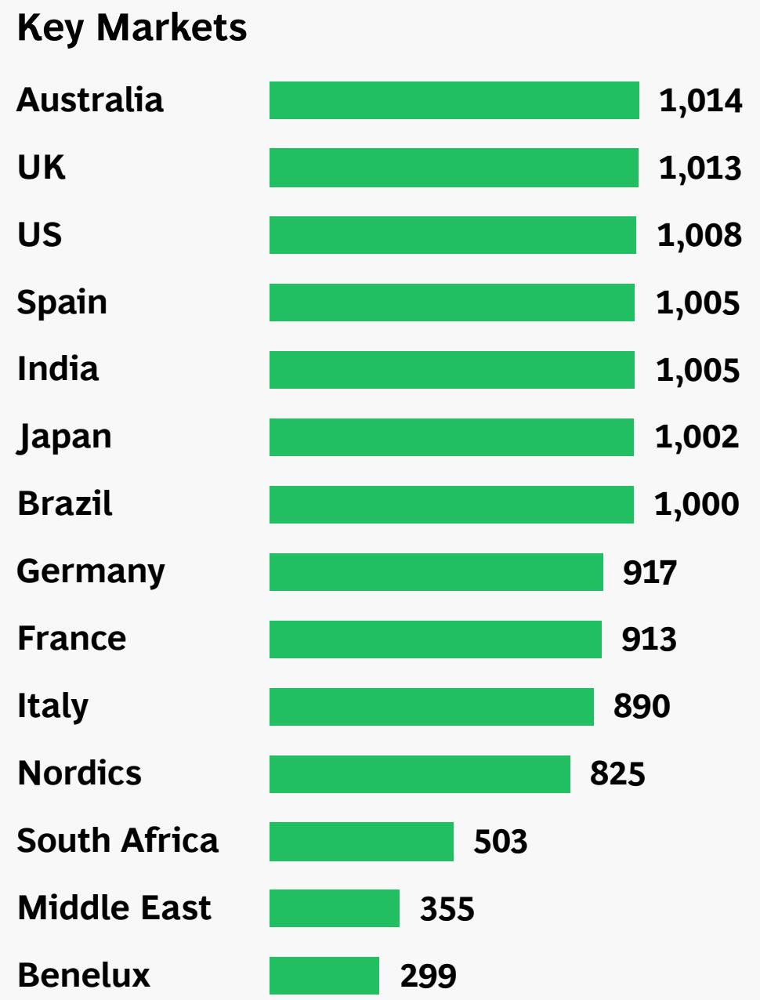  
Notes: Frontline employees = individual white-collar employees with no managerial responsibilities. TMT = technology, media, and telecommunications. Nordics include Sweden, Denmark, Norway, and Finland. Middle East includes UAE, Saudi Arabia, Kuwait, and Qatar. Benelux includes Belgium and the Netherlands.

## New findings reinforce trends observed in 2025

The time individuals save doesn’t automatically translate into value

42% of frontline employees who are regular AI users save a full day or more per week. But 66% still receive limited or no guidance on what to do with time they save, and more than half don’t redirect it to strategic work.

Rethinking work end-to-end is a prerequisite for creating value

More organizations are using AI to “invent,” building new business models. Companies that redesign workflows end-to-end outperform those that only deploy tools on value captured and employee joy. The gap keeps widening, driven by a clearer roadmap and deeper investment in people.

Proper training and leadership support remain the biggest unmet promises and strong levers to unlock AI's potential

72% of respondents say expectations about skills have shifted, yet only 36% feel they received sufficient training, stable vs 2025. Only 33% of frontline employees say leadership communicates clearly about AI, and 28% see strong alignment between what leaders say and what the organization actually does.

## Five key takeaways

## 1

No more “silicon ceiling”: frontline employees have integrated AI into their daily work

74% of frontline employees are now regular AI users, an increase of 23 percentage points from 2025. India and the Middle East lead adoption, while the US, France, and Italy trail behind.

## 2

The real challenge is now organizational and managerial

Everyone talks about time saved, but the real shift is deeper and structural. 72% of respondents report skill expectations have changed, and nearly half say their roles have shifted toward managing and directing AI instead of doing the work itself.

## 3

Business value and employee joy aren't tradeoffs, they're driven by the same forces

67% of regular AI users enjoy work more. The organizations that capture the most business value are also the places where employees enjoy working the most.

## 4

The AI “honeymoon” won’t last unless leaders bring strategic clarity driving sustained impact

AI's novelty and cognitive stretch fuel enjoyment early on. But sustained joy comes from strategic clarity. Employees thrive when the direction is real and the message reaches them with strong CEO involvement.

## 5

AI agents went from concept to reality, but operating models haven't caught up

Integration into workflows more than doubled since 2025, and $61 \%$ of respondents believe agents could do half their job within three years. Yet governance (oversight, accountability) still lags far behind the tech.

## New findings reinforce trends observed in 2025

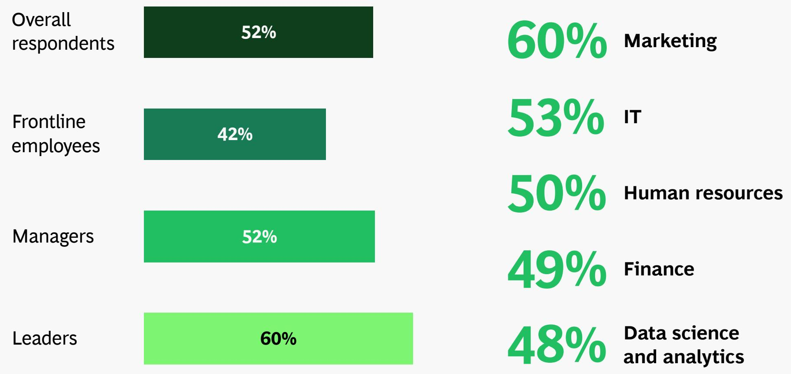  
Respondents saving at least 8 hours per week

Among frontline
employees who
are regular AI
users, 42% report
saving at least a
workday per week

Leaders have the biggest AI payoff, with 60% saving at least a workday per week

## Some job functions are further ahead than others

Top job functions where frontline employees are saving at least 8 hours per week

60% Marketing

50% Human resources

49% Finance

48% Data science and analytics

## The gap is wide: managers and leaders feel guidance is clearer and perceive more impact than frontline employees

Frontline employees report getting the least guidance on how to spend the time AI saves, and more than half of them don’t redirect it into strategic work

Respondents who say their organizations give limited or no guidance on what to do with the time saved

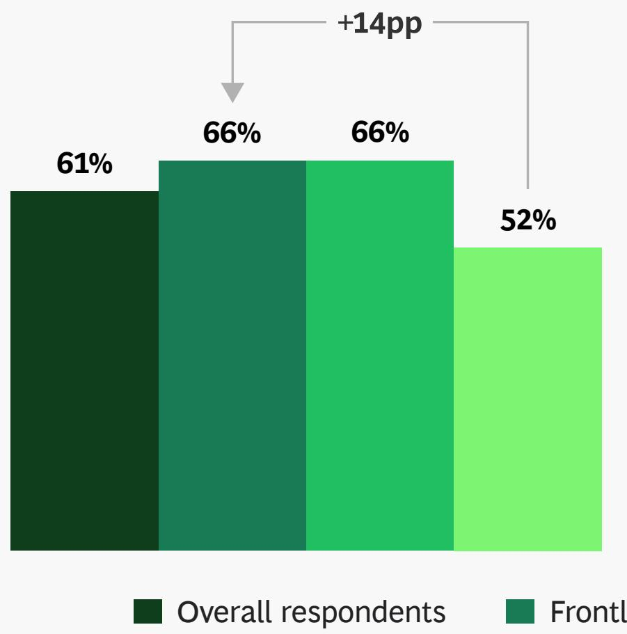  
Respondents who declare not reinvesting time saved into more strategic work

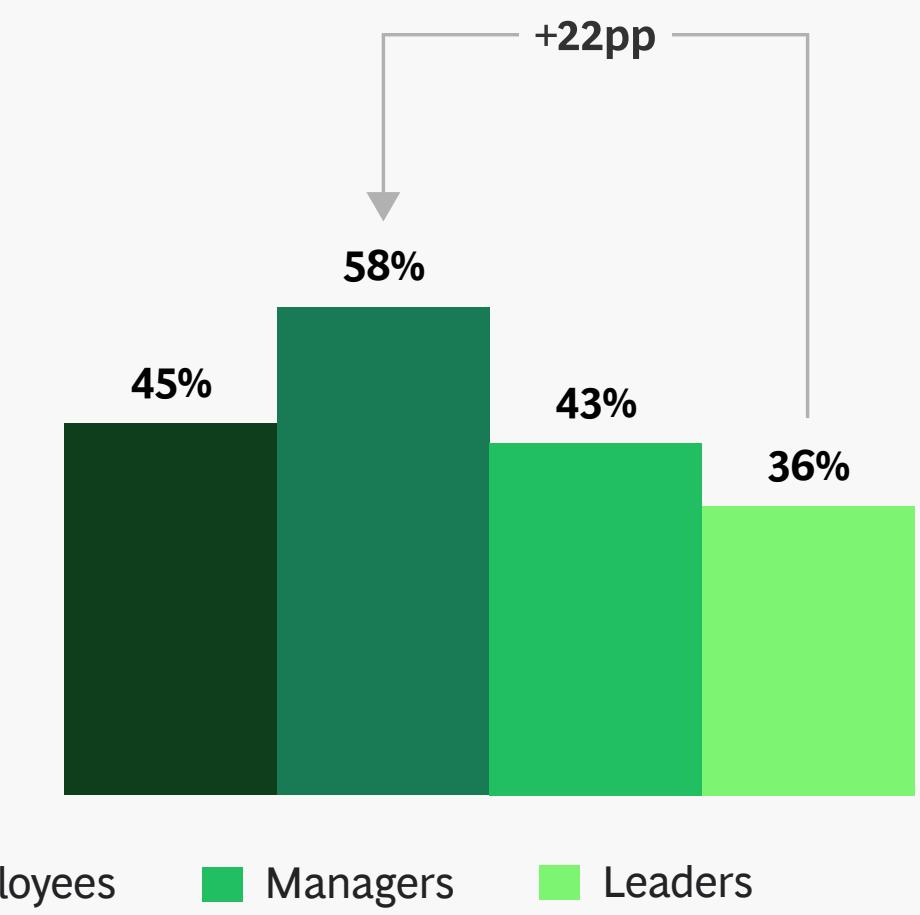  
Sources: AI at Work, 2026 (n=8,989, includes regular AI users, consistent sample with time-saved analysis); BCG analysis. Note: Frontline employees = individual white-collar employees with no managerial responsibilities.

## How organizations are implementing AI tools

Organizations are
moving past
individual use case
deployments; Invent
initiatives have
nearly doubled

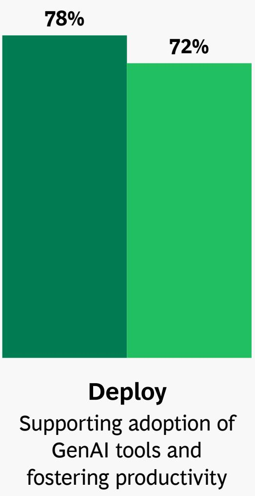  
Deploy
Supporting adoption of
GenAI tools and
fostering productivity

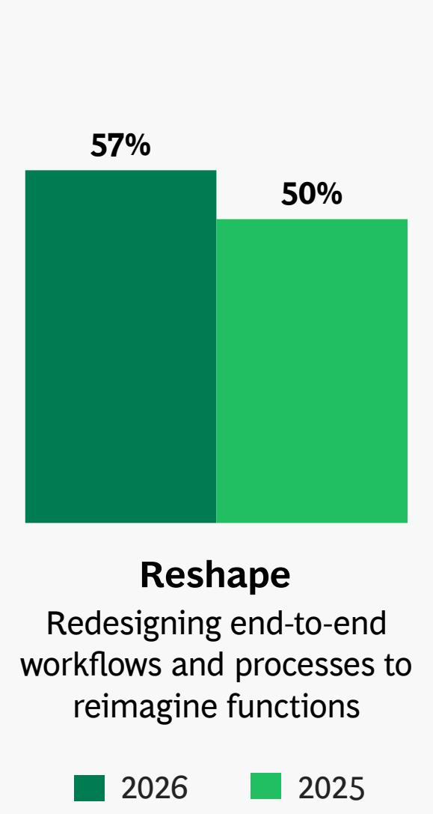

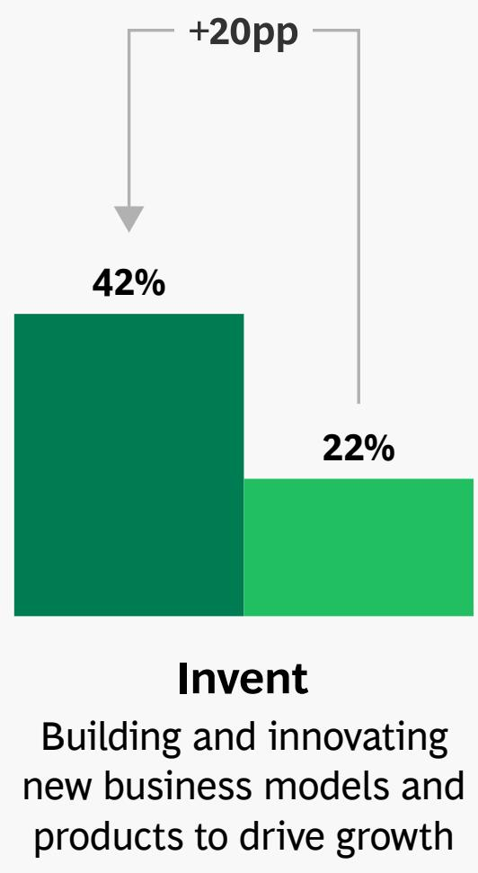  
Invent
Building and innovating
new business models and
products to drive growth

Using AI for
Reshape or Invent
initiatives pays off
by delivering more
value and providing
a better employee
experience

Companies pursuing Reshape or Invent initiatives deliver more value...

Save more time
Employees who
save at least a day
per week

Prove the impact
Employees who see
measurable business
improvement

  
Earn trust
Employees who fully trust leadership's AI communications

... and their employees thrive

  
■ Respondents at companies that only focus on Deploy initiatives  
Enjoy work more
Employees who
report increased
job satisfaction

  
Show their value
Employees who find it
easier to demonstrate
unique value

  
Feel more confident
Employees who feel
confident working
with AI

  
- Respondents at companies that focus on Reshape or Invent initiatives

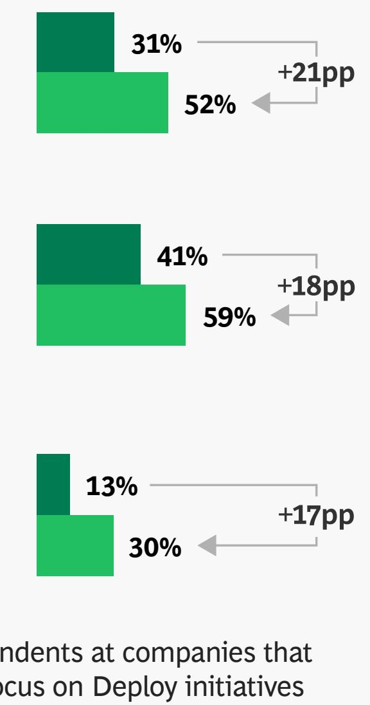

What makes
Reshape or Invent
initiatives more
successful: a clearer
roadmap and
deeper investment
in people

## Companies pursuing Reshape or Invent initiatives build a clearer roadmap...

## ... and invest in the people behind it

Sets the direction
Employees who say
AI strategy is clear

Defines the rules
Employees who see
adequate guardrails
in place

Puts agents to work
Employees who see
agents integrated
into workflows

Brings people in
Employees who
participate in
process redesign

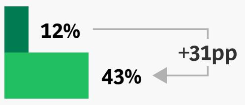  
Measures what matters
Employees who see AI value creation properly tracked  
Invests in skills
Employees who
experience a major
reskilling initiative  
■ Respondents at companies that focus on Reshape or Invent initiatives

Most respondents expect a need for upskilling in the next five years, yet only 36% feel properly trained

Demand for
upskilling is loud
and persistent.
The response still
falls short

88%

Of respondents believe
they need major upskilling
in the next five years

36%

  
Of respondents feel
properly trained

Sources: AI at Work, 2026 (n=11,749); BCG analysis.
Note: Share of respondents for both metrics is unchanged from 2025.

## No more “silicon ceiling”: frontline employees have integrated AI into their daily work

74% of frontline
employees now
describe themselves
as regular AI users,
driving overall
adoption

Regular AI use across worker levels  
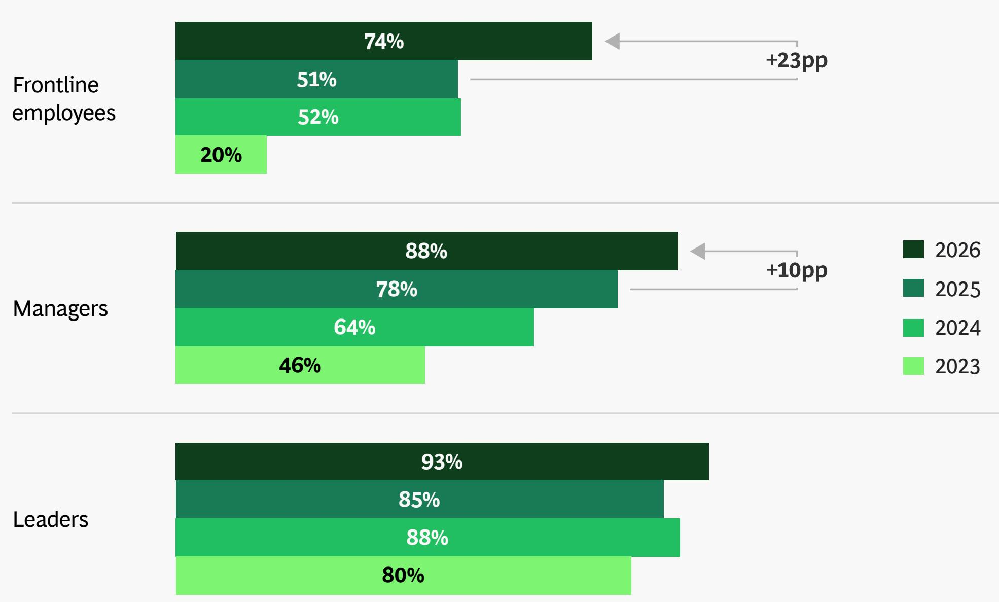

India, the Middle East, and Australia lead adoption for frontline employees, while France, Italy, and US trail the average

Frontline employees who use AI at least several times a week, by market  
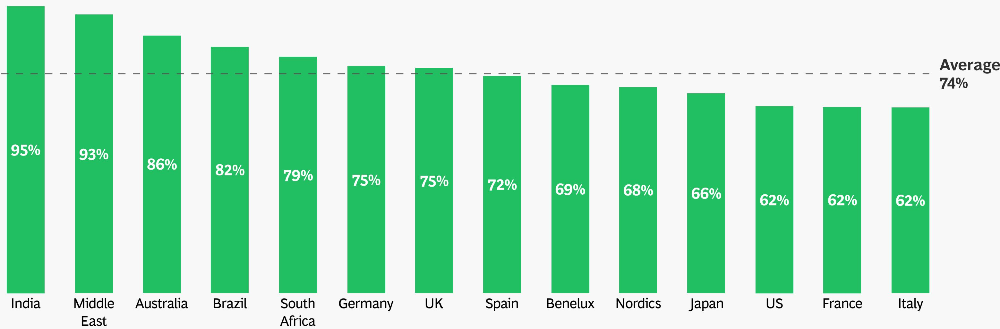  
Sources: AI at Work, 2026 (n=4,040 frontline employees); BCG analysis.  
Note: Frontline employees = individual white-collar employees with no managerial responsibilities. Middle East includes UAE, Saudi Arabia, Kuwait, and Qatar. Benelux includes Belgium and the Netherlands. Nordics include Sweden, Denmark, Norway, and Finland.

Support functions lead adoption among frontline employees, while sales and operations lag behind

Frontline employees who use AI at least several times a week, by function  
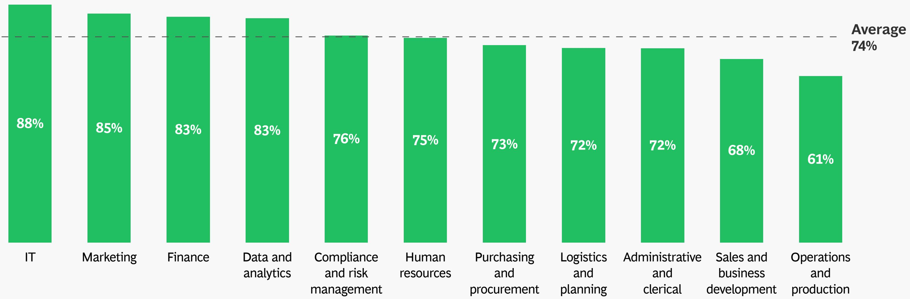  
Sources: AI at Work, 2026 (n=4,040 frontline employees); BCG analysis.  
Note: Frontline employees = individual white-collar employees with no managerial responsibilities.

## The real challenge is now organizational and managerial

AI is reshaping
work, impacting the
very nature of jobs
and management

Aspect of work that respondents say have been changed by AI  
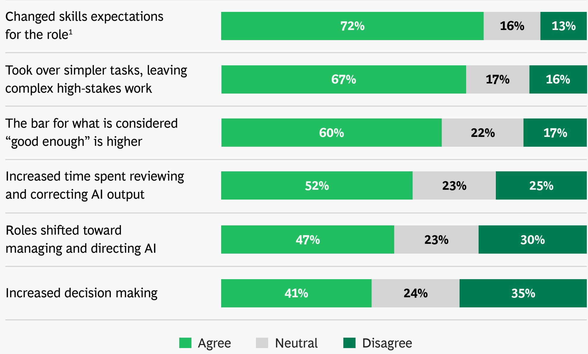  
Sources: AI at Work, 2026 (n=11,749); BCG analysis.  
$^{1}$ Share of respondents who report AI will significantly or moderately change the expectation for the skills needed for the role.

## Business value and employee joy aren’t tradeoffs, they’re driven by the same forces

The “joy paradox” of AI: it makes work both better and harder

## More than two-thirds of regular AI users report an increase in job satisfaction...

Change in day-to-day work enjoyment and satisfaction since adopting AI

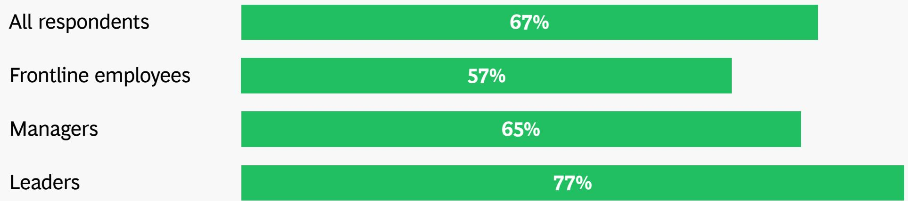  
... but 41% report increased mental strain associated with it  
Change in cognitive load since adopting AI

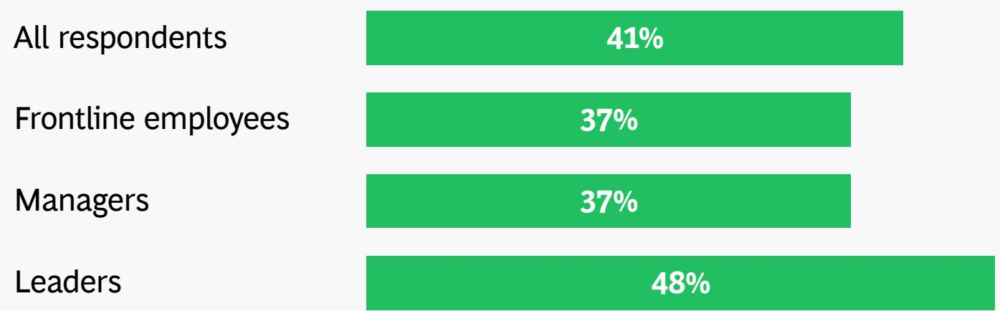  
Sources: AI at Work, 2026 (n=9,923 regular AI users); BCG analysis.  
Note: Frontline employees = individual white-collar employees with no managerial responsibilities.

The actions that
drive business
impact are the same
ones that make
employees thrive

Top 5 organizational levers ranked by uplift across employee joy and measurable impact  
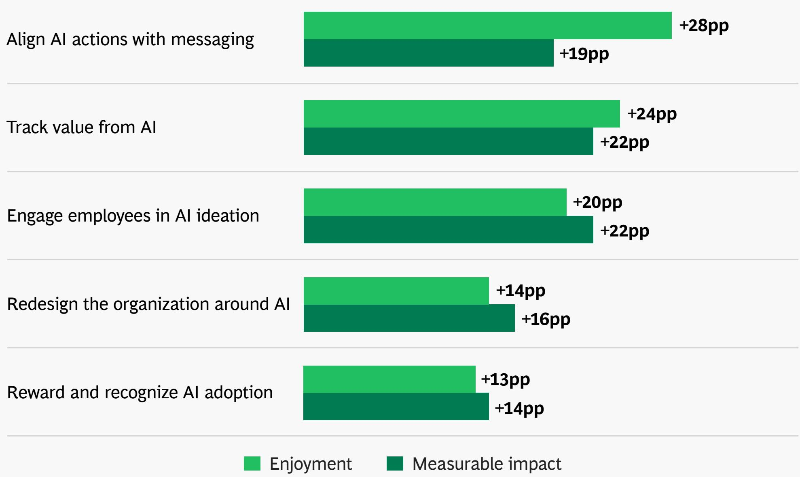  
Sources: AI at Work, 2026 (n=9,923 regular AI users); BCG analysis.
Note: Measurable impact = Improvement in key business metrics attributed to AI.

## Want the AI “honeymoon” to last? Strategic clarity beats tools in driving sustained impact

Strategic clarity
beats tools:
employees with clear
strategy but limited
access to tools
outperform those
with strong access
but no direction

## Respondents reporting measurable impact based on AI strategy clarity and availability of AI tools

Limited strategic clarity and limited access to tools

Limited strategic clarity and strong access to tools

Strong strategic clarity and limited access to tools

Strong strategic clarity and strong access to tools

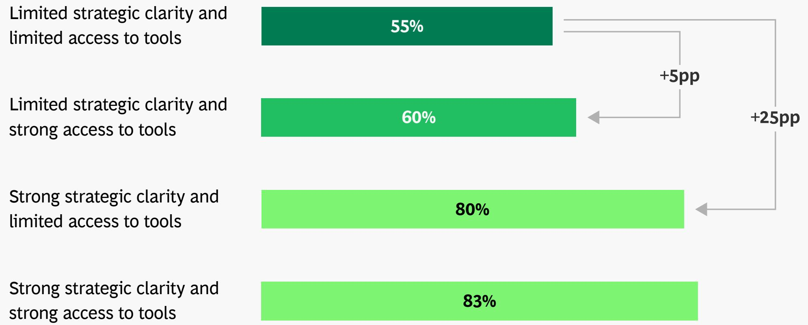

Sources: AI at Work, 2026 (n=6,998 respondents who use AI regularly, less than 6 months vs more than a year); BCG analysis.
Note: +/-pp = the extra share of employees who enjoy work when a driver is present (+) or the share lost when a blocker is present (-).

## The drivers of joy at work when using AI evolve over time...

The AI “honeymoon”? At first employees enjoy the cognitive load, but strategic clarity is the unlock to sustaining joy over time

Regular AI users for less than 6 months

Regular AI users for more than a year

Cognitive load

+43pp

+30pp

Clear AI strategy

Clear AI strategy

+24pp

Clear guidance on saved time

+23pp

Clear guidance on saved time

+25pp

Cognitive load

+21pp

## ...the drivers of toil do not

Regular AI users for less than 6 months

Difficulty showing unique value

-29pp

Regular AI users for more than a year

Difficulty showing unique value

-26pp

Inadequate training

-15pp

Inadequate training

-16pp

## AI agents have evolved from concept to reality, but operating models haven’t caught up

86%

More people are
aware of AI agents
and see their
importance, but few
understand what
they are: a sign for
leaders to make a
better case for what
they can do

Respondents who have heard about AI agents

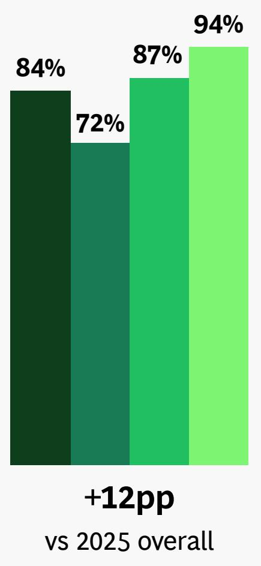

Respondents who have a limited understanding of what AI agents are

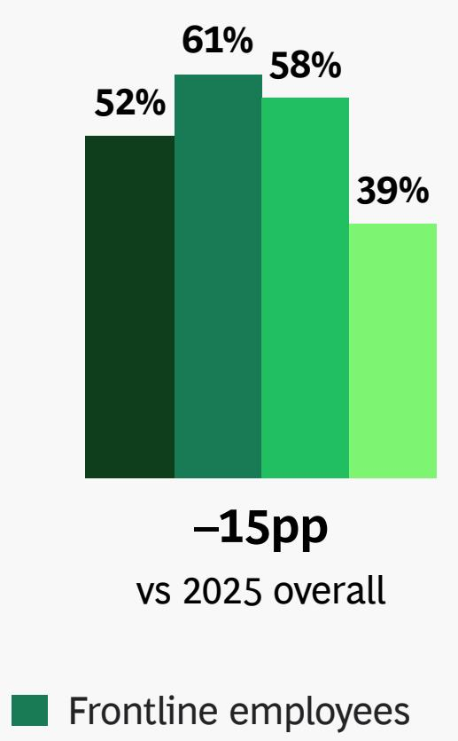  
Sources: AI at Work, 2026 (n=11,749); BCG analysis.
Note: Frontline employees = individual white-collar employees with no managerial responsibilities.  
Respondents who think AI agents will be important in the next 2 to 3 years

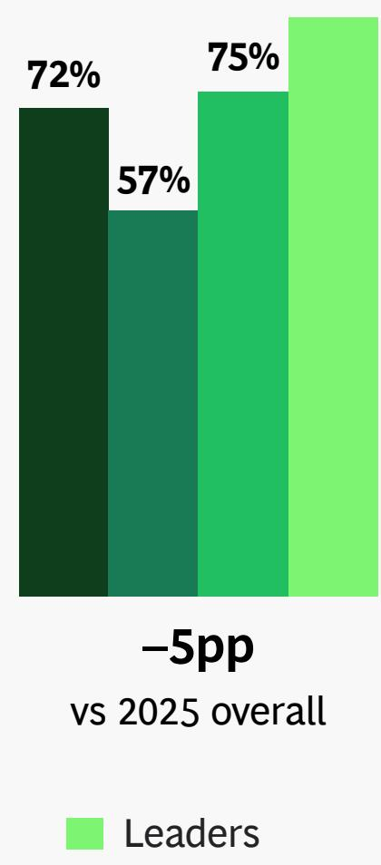

More than double the organizations from 2025 have integrated AI agents into workflows, with meaningful impacts expected at the managerial level

Respondents reporting measurable impact based on AI strategy clarity and availability of AI tools

AI agent use by type

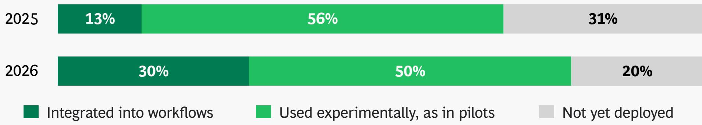

Most people believe agents could do at least half their job in the future, and managers and leaders expect the biggest shift

Respondents who think that in the next three years AI agents could perform at least half of their job

  
Sources: AI at Work, 2026 (n=9,923 regular AI users); BCG analysis.
Note: Frontline employees = individual white-collar employees with no managerial responsibilities.

The missing piece: operating models haven’t caught up with AI agents’ deployment

Half of employees lack clear governance for managing human × AI teams: frontline employees and managers feel it the most

Respondents who say their company has not put in place clear guidance on managing human × AI teams

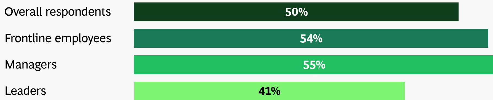

Accountability is a universal concern, equally shared across all levels
Respondents who rank AI-driven accountability as a top 3 concern in the next 2 to 3 years

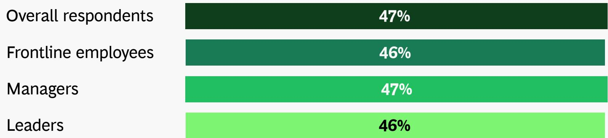  
Sources: AI at Work, 2026 (n=8,849 respondents who have heard of AI agents and regular AI users); BCG analysis.
Notes: Frontline employees = individual white-collar employees with no managerial responsibilities.

## Five CEO imperatives

1

Make strategic clarity your top priority, and own it personally

Change the scoreboard: measure value, not adoption

3

Invest in redesigning work end-to-end, not in more tools

4

Put people at the heart of that redesign

Govern it as a
moving target, not a
one-off program

Strategic clarity is not a communications task, it’s a leadership posture. Set AI as an explicit top priority, be clear about where the company is heading, and make sure everyone gets it, the frontline included. CEOs who personally own the transformation outperform on every dimension: value captured, employee joy, and trust.

Adoption tells you that people use AI, not whether it pays off. The time that individuals save leaks out of the organization unless it is tracked and deliberately reinvested. So, watch business outcomes rather than usage.

Most companies still treat AI as a tool for individual productivity, but the more important change is a collective one: AI is reshaping how teams work together and how tasks flow across the organization. Capturing that value means redesigning a few core processes from end-to-end.

The redesign only works if people are in it. Look ahead at how roles will shift over the next few years, train for the skills that matter most, and bring people into shaping the change rather than presenting it to them. What keeps people engaged is knowing how AI helps them grow, not how much faster they work.

Technology moves faster than any company can. Treat AI as something you keep steering, not a program with a finish line. Put a light, standing governance in place that rechecks what works, remeasures the value, and adjusts as the models and agents evolve.

## BCG X | BCG

bcg.com