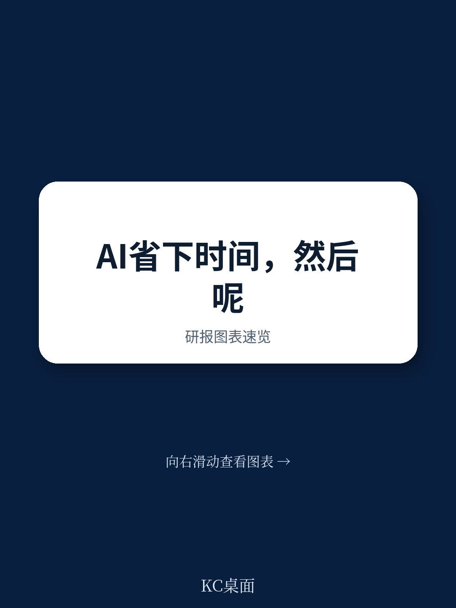
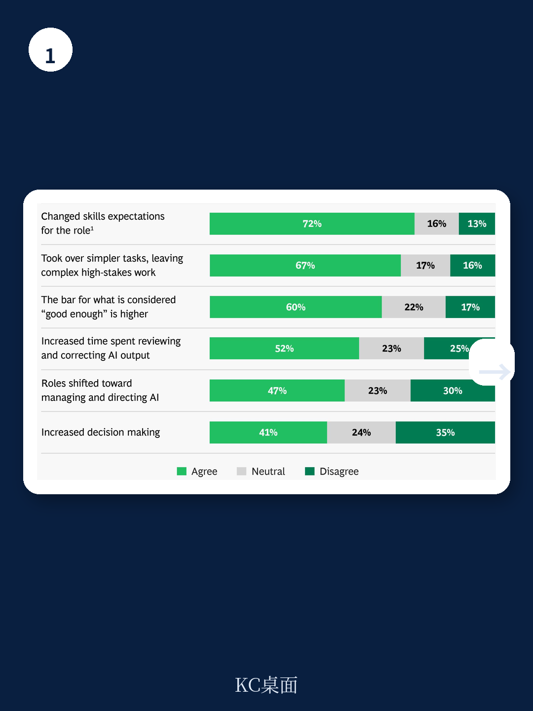
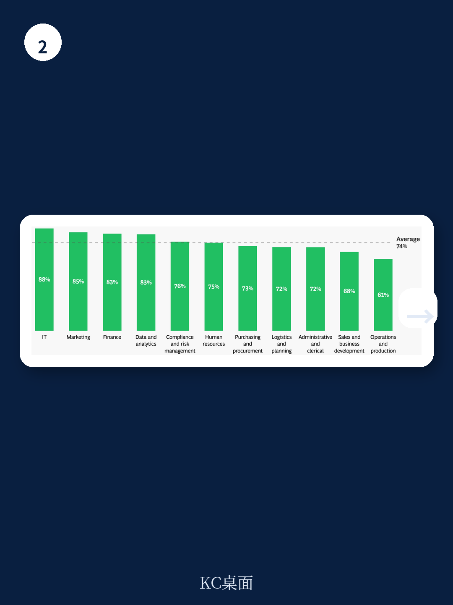

# 波士顿咨询：AI的“蜜月期”即将结束，战略清晰度才是分水岭

2025年，波士顿咨询（BCG）的《AI at Work》报告第一次揭示了一个让许多管理者意外的现象：员工用AI省下的时间，并没有自动转化为战略价值。一年后，2026年的报告给出了更尖锐的判断——这个问题不仅没有解决，反而在恶化。

这份基于全球11,749名受访者的最新调研，核心发现可以浓缩为一句话：**AI的普及已经跨过“硅天花板”，但组织的管理能力远未跟上。** 如果企业继续把AI当作工具来部署，而不是当作工作方式来重构，那么省下的时间越多，浪费的机会成本也越大。

更值得警惕的是，报告揭示了一个“甜蜜陷阱”：员工在初次接触AI时会因为认知新鲜感而享受工作，但这种愉悦感会在6-12个月内消退。唯一能够维持长期员工满意度和业务价值的，不是更先进的模型，而是来自高层的战略清晰度。

这不是一份关于技术趋势的报告，而是一份关于管理短板的诊断书。以下是我们从这份报告中提炼出的五个核心洞察。

> **KC评论：** 这份报告最反常识的发现是：拥有明确AI战略但工具受限的员工，其产出结果反而优于拥有顶级工具但缺乏方向指引的员工。这意味着，在AI时代，“做什么”比“用什么做”重要得多。完整报告中对这一结论的量化拆解，值得每一位高管仔细阅读。

## 1. 一线员工已全面拥抱AI，但管理层尚未准备好迎接这一现实

2026年，74%的一线员工已成为AI的常规使用者，相比2025年大幅上升了23个百分点。印度和中东地区领跑，而美国、法国和意大利则落后于平均水平。

这一数据打破了此前一个流行的担忧——“硅天花板”，即技术精英与普通员工之间的AI使用鸿沟。事实上，一线员工在AI采纳上已经追平甚至超越了部分中层管理者。支持性职能部门（如法务、财务、人力资源）的采用率最高，而销售和运营等一线业务部门反而滞后。

但问题在于，组织管理层的认知和行动远远落后于这一现实。72%的受访者表示，AI已经显著改变了对其岗位技能的要求，但只有36%的人认为自己获得了足够的培训——这个比例与2025年持平，没有任何改善。更令人担忧的是，只有33%的一线员工认为领导层在AI问题上沟通清晰，仅有28%的人认为领导层言行一致。

这意味着，员工已经跑在了前面，而组织还在原地踏步。这种脱节正在制造一种新型的“管理赤字”：员工知道AI能做什么，但不知道组织希望他们用AI做什么。

> **KC评论：** 报告中的一张图表非常直观地展示了这种脱节：60%的管理者认为他们为AI转型提供了足够指导，但只有33%的一线员工同意这一说法。这种认知差距本身就是最大的管理风险。完整报告中按地区、职能和层级拆解的数据，可以帮助企业精准定位自己的“管理赤字”发生在哪里。

## 2. 省下的时间不是红利，而是新的管理考题

42%的一线员工表示，因为AI的使用，他们每周节省了至少一个完整工作日的时间。这个数字在管理者群体中甚至高达60%。市场营销、人力资源和财务职能的员工是最大的时间赢家。

然而，66%的一线员工表示，组织几乎没有提供任何关于如何利用这些省下时间的指导。更糟糕的是，超过一半的人没有将这些时间重新投入到更具战略性的工作中。

报告揭示了一个令人不安的真相：**AI省下的时间，大部分被浪费了，或者被用于同样低价值的工作。** 时间本身不是价值，只有被重新配置到更高产出的活动中，时间才能转化为商业成果。

这背后反映的是一个更深层的问题：大多数组织仍然在用“工具思维”来管理AI，而不是用“工作设计思维”。它们关注的是员工用AI提高了多少效率，而不是员工的工作应该被如何重新定义。当AI把一个人原来需要8小时完成的工作压缩到2小时，剩下的6小时做什么？如果这个问题没有答案，那么AI带来的就不是红利，而是组织效率的另一种损耗。

## 3. 商业价值与员工幸福感不是二选一，而是同一件事的两面

67%的常规AI使用者表示，他们的工作愉悦感提升了。但与此同时，41%的人报告说认知负荷也增加了——AI让工作变得更有趣，但也更累了。

BCG发现了一个关键洞察：那些从AI中获得最大商业价值的组织，恰恰也是员工工作幸福感最高的组织。这不是巧合，而是同一种管理行为的结果。

报告将企业的AI实施策略分为三类：Deploy（部署工具，提高个人效率）、Reshape（重塑流程，改变团队协作方式）、Invent（发明新商业模式，创造增长）。那些专注于Reshape或Invent的企业，在商业价值和员工幸福感两个维度上都显著优于只做Deploy的企业。

这意味着，**“效率”和“体验”不是需要权衡的，而是需要同时追求的。** 当一个组织只关注用AI提高个人效率（Deploy），它可能会牺牲员工的自主性和工作意义感；但当组织开始用AI重新设计工作流程（Reshape），员工反而会感受到更大的创造性和影响力。

> **KC评论：** 报告中的一张对比图非常有力：在“Reshape or Invent”策略下，员工节省时间的比例、信任领导层的比例、以及展示自身独特价值的比例，都远超“只做Deploy”的企业。这告诉我们，AI转型的成功不是技术问题，而是组织设计问题。完整报告中对这三大策略的具体案例和量化对比，是CEO们制定AI战略时最需要参考的。

## 4. AI的“蜜月期”只有6个月，战略清晰度是唯一的解药

这是整份报告中最具管理洞察力的发现。BCG将AI使用者按照使用时长分为两组：少于6个月的新手，和超过1年的老手。结果发现，驱动这两组人工作愉悦感的因素完全不同。

对于新手，最大的愉悦驱动因素是“认知负荷”——AI带来的新鲜感和智力挑战让他们感到兴奋。但对于老手，最大的愉悦驱动因素变成了“清晰的AI战略”——他们需要知道组织对AI的长期方向是什么，以及自己的工作如何融入这个方向。

换句话说，**AI的“蜜月期”大约只有6个月。** 在这之后，新鲜感消退，如果员工发现组织缺乏明确的战略方向，他们的工作愉悦感会迅速下降，甚至低于使用AI之前。

更令人震惊的是，报告还发现了一个“战略优先于工具”的结论：那些拥有清晰AI战略但工具访问受限的员工，其产出结果反而优于那些拥有顶级工具但缺乏战略方向的员工。战略清晰度带来的商业价值提升，是工具访问的2倍以上。

这对企业决策者的启示是明确的：不要沉迷于选择哪个模型、哪个平台。先把战略方向讲清楚，再谈工具选型。

## 5. AI Agent从概念走向现实，但治理体系严重滞后

2026年的报告首次将AI Agent作为一个独立议题进行深入分析。86%的受访者听说过AI Agent，但其中绝大多数人对其理解非常有限。更关键的是，61%的人认为，在未来三年内，AI Agent可以完成他们目前一半以上的工作。

企业已经在行动：将AI Agent集成到工作流程中的组织数量相比2025年翻了一倍多。但治理体系远远落后于技术部署。一半的员工表示，公司没有为管理“人+AI团队”提供明确的指导。问责制成为所有层级员工共同的前三大关切。

这引出了一个未来三年内最棘手的管理问题：**当AI Agent开始自主执行任务时，谁来负责？** 如果Agent犯错了，是开发者、部署者还是使用者承担责任？如果Agent和人类员工组成混合团队，绩效如何评估？晋升通道如何设计？

报告没有给出这些问题的答案，但它清楚地指出：当前绝大多数组织还没有开始思考这些问题。在技术快速迭代的同时，治理框架的缺失正在积累巨大的风险。

> **KC评论：** 报告预测，未来三年内，管理者和领导者将是受AI Agent影响最大的群体——他们预计Agent可以完成其一半以上的工作。这意味着，中层管理者的角色将被彻底重塑。他们的价值将从“监督执行”转向“设计系统、管理例外、构建信任”。完整报告中对Agent部署现状和治理挑战的详细分析，是每位HR总监和COO必读的内容。

## 报告尚未完全回答的三个关键问题

这份报告提供了大量有价值的数据和洞察，但仍有几个关键问题值得进一步探讨：

第一，**“战略清晰度”具体指什么？** 报告将其定义为“领导层对AI方向的明确沟通”，但不同行业、不同规模的企业，战略清晰度的内涵可能完全不同。对于一家制造业企业，它可能意味着“我们将在供应链环节全面部署AI”；对于一家咨询公司，它可能意味着“我们将用AI重构客户交付模式”。报告没有给出不同情境下的最佳实践。

第二，**“工作流程重构”的ROI如何量化？** 报告指出Reshape策略优于Deploy策略，但没有给出具体的投资回报率对比。考虑到流程重构往往需要更大的组织变革成本，企业需要一个更清晰的ROI框架来指导决策。

第三，**AI Agent的治理框架应该是什么样？** 报告指出了治理缺失的问题，但没有提出可操作的建议。这可能是下一份报告的重点，也可能是企业需要自行探索的领域。

---

这些问题恰恰是我们在社群中持续跟踪和讨论的核心议题。每天，我们的AI Agent会结合人工审核，从全球顶级投行和咨询机构的最新报告中提炼关键洞察，形成10-40页的中文摘要和评论。这些内容既方便你快速把握市场动态，也适合直接喂给AI做进一步分析。

如果你希望在AI转型的前沿保持同步，欢迎加入我们的社群。在这里，你不是在阅读一份孤立的报告，而是在参与一个持续更新的知识网络。我们每天都会更新最新的数据图表、投行观点和实战案例，帮助你避免“蜜月期”后的管理困境。

Personal reading notes and learning share only. Not investment advice.

