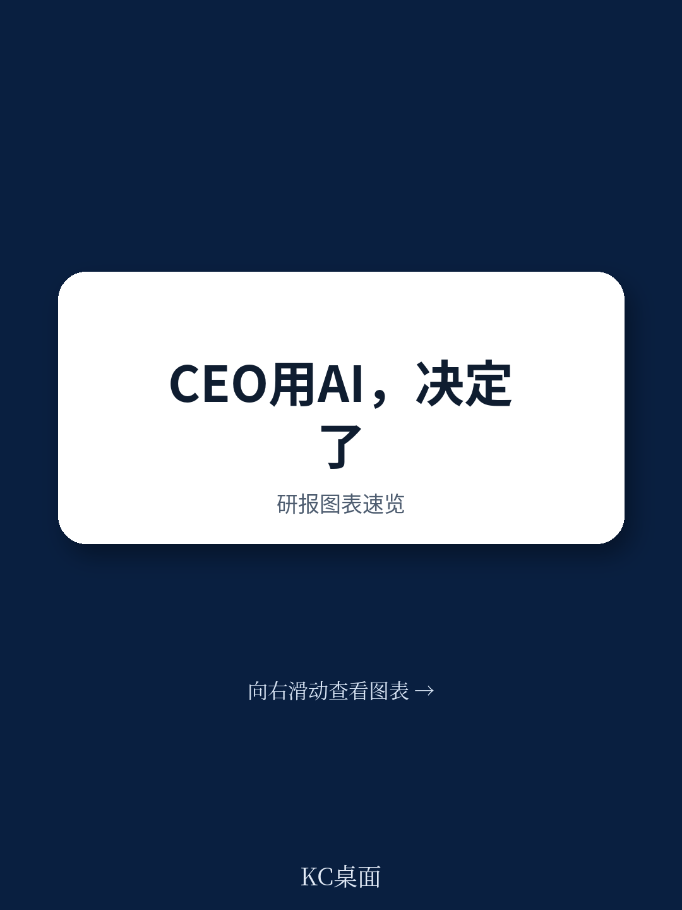
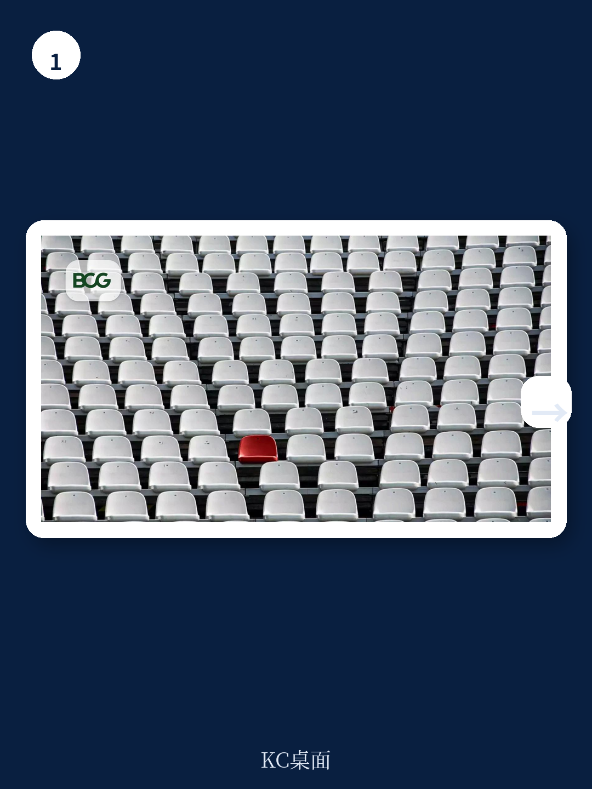

# 波士顿咨询：CEO用AI的真正红利，不是效率，是判断力

当一家公司谈论AI转型时，最诚实的信号不是它的战略文件，而是CEO本人如何使用AI。波士顿咨询在2026年6月发布的一份面向CEO群体的研究报告，提出了一个正在被多数企业忽视的核心判断：AI目前主要被部署在组织中下层，用于优化流程和提升生产率，但真正的价值前沿在顶层——在那里，CEO和核心团队的判断力是公司最稀缺、最昂贵的资源。

这份报告的数据揭示了一个鲜明的反差：72%的CEO现在直接负责公司内部的AI决策，但只有15%正在从中产生有意义的商业价值。造成这一差距的关键变量，不是技术投入的规模，而是CEO个人是否愿意每周至少投入8小时去“自建”AI能力。不是把AI交给CIO或CDO，而是自己动手，亲自使用，亲自感受边界。

这意味着什么？意味着AI在CEO层面的价值，不是靠“部署”完成的，而是靠“使用”完成的。而使用的目标，不是更快地完成任务，而是做出更好的判断。

## 1. 15%的领先者与72%的责任者之间，隔着一个“亲自用”的距离

波士顿咨询的调研结果值得所有企业决策者反复琢磨。七成以上的CEO已经把自己放在了AI决策的第一责任人位置上，但真正跑出价值的只有不到两成。这种落差不能用技术成熟度来解释，因为所有公司面对的技术供给是一样的。

报告给出的解释直指一个管理痛点：多数CEO把AI当作一个“需要管理的项目”，而不是一个“需要亲自使用的工具”。他们批准预算、任命负责人、听取汇报，但自己不碰。而那些创造价值的15%，恰恰是那些每周花至少8小时自己使用AI的CEO。他们用AI快速学习新领域、准备关键对话、压缩复杂信息、压力测试自己的判断、优化表达方式，甚至用它来复盘自己的时间分配是否匹配战略优先级。

这不是一个技术问题，这是一个领导力问题。当CEO自己不用AI，整个组织对AI的感知就是“老板的项目”，而不是“我们的工作方式”。这份报告明确指出，CEO亲自使用AI所发出的信号，比任何演讲或战略文件都更有穿透力。

> **KC评论：** 这里有一个容易被忽略的细节：报告说“至少8小时”，而不是“越多越好”。关键不是计时，而是CEO是否把AI嵌入了自己的决策流程。如果CEO只是让助理用AI整理摘要，自己仍然读原始材料，那本质上还是“别人在管AI”。8小时是一个门槛指标，背后是使用深度和判断依赖度的变化。

## 2. 从“省时间”到“做更好决策”，AI对CEO的价值需要重新定义

目前多数CEO使用AI的方式，仍然停留在“效率工具”的层面：压缩阅读时间、优化日程安排、辅助起草股东信。这些当然有价值，但波士顿咨询认为这只是“刮到了表面”。真正的前沿，是让AI成为CEO判断力的放大器，而不仅仅是时间的节省器。

报告描绘了一个更具想象力的场景：当CEO面临一个重大战略决策时，传统流程是阅读一堆预先准备的材料、参加几场认知对齐的会议、在信息不一致和假设冲突中艰难形成判断。而一个为CEO定制的AI系统，可以在会议开始之前就完成信息整合、矛盾识别、假设测试和风险预警。CEO走进会议室时，不是“准备被汇报”，而是“准备做决策”。

这个场景的核心变化，不是速度，而是决策质量。AI的价值不是替代CEO的判断，而是在CEO做出判断之前，提供更高质量的信息输入、更清晰的权衡取舍、更早的风险暴露。这正是波士顿咨询所说的“把AI瞄准组织顶层”的含义。

> **KC评论：** 很多企业现在最热衷的是用AI做客服、做代码生成、做营销文案，这些当然有ROI。但这份报告提醒了一个容易被忽视的层次：如果CEO和核心团队的决策质量因为AI提升10%，其商业价值可能超过整个中后台效率提升的总和。问题是，定制化程度越高，风险也越大。报告全文对“定制化AI代理系统”的技术架构、实施路径和风险控制有更详细的拆解，值得所有考虑建设CEO决策支持系统的企业仔细阅读。

## 3. 四种AI陷阱：CEO最需要警惕的不是技术失效，而是“看起来太对”

波士顿咨询在报告中用专门篇幅警告了AI可能误导最高决策者的四种方式。这四种风险，每一项都直指领导力判断的脆弱点。

第一，把流畅性当成专业性。AI可以让一个完全陌生的领域显得唾手可得，但一个漂亮的答案可能隐藏着薄弱的假设、缺失的上下文或低置信度的结论。AI的“谄媚”倾向——倾向于给出用户想听的答案——会让CEO把验证感误当作证据。

第二，把速度当成更好的判断。AI压缩了从问题到答案的路径，但CEO仍然需要时间来吸收、挑战和决策。当“快”被等同于“对”，AI就从一个信息工具变成了一个认知陷阱。危险不在于AI有答案，而在于AI总有答案——而没有人应该盲目信任一个“无所不知”的东西。

第三，让AI窄化对话。同样的工具、同样的数据、同样的提示词，会不断强化同样的假设。波士顿咨询的研究发现，生成式AI会让团队思维多样性下降41%。这意味着，AI辅助下的讨论可能更快、更整洁、更难发现盲点，但本质上是一种加速了的群体思维。

第四，创造认知过载。AI可以帮人做更多工作，但不会扩展人的认知容量。人仍然需要审查、判断、修正、调和、决定哪些信息值得信任。当AI生成更多信息、更多视角、更多合成洞察时，它反而可能加剧认知过载，降低决策质量。波士顿咨询的调查显示，14%的AI用户报告了“AI脑疲劳”，其中营销领域高达26%。

这四种风险叠加在一起，构成了一个悖论：AI越强大，越容易让CEO误以为自己比实际更聪明、更全面、更有把握。而最危险的CEO，不是那些拒绝AI的，而是那些信任AI但缺乏批判能力的。

## 4. 报告没有完全回答的关键问题：CEO判断力的“测量困境”

波士顿咨询在报告末尾提出了一个极具洞察力的问题：CEO如何知道自己是否因为AI而变得更好？这个问题之所以关键，是因为CEO的决策质量很难像客服中心那样被实时追踪和量化。一个战略决策的价值，可能要在数年之后才能显现。

报告承认了这种测量困境，但没有给出完整的解决方案。它建议CEO建立对AI推荐质量、决策质量、决策速度的三维评估体系，但同时也坦承“这并不容易”。这恰恰是这份报告最具诚意的部分——它没有假装有一个完美的答案。

对于任何考虑将AI深度嵌入高管决策流程的企业来说，这个测量问题不是技术细节，而是治理前提。如果没有可靠的反馈机制，CEO如何区分AI是在放大自己的判断力，还是在放大自己的偏见？如何避免“自我实现的正确”——即因为AI给出了符合预期的答案，就误以为它是对的？

> **KC评论：** 报告的这部分其实指向了一个更深层的治理挑战：当AI越来越多地参与最高决策层的判断过程，董事会的监督框架应该如何调整？现有的审计和合规体系，很难穿透到“CEO和AI的对话层面”。报告没有展开这个议题，但它是所有决心推进“AI for CEO”的公司必须提前思考的。完整报告中对定制化代理系统的风险控制框架有更具体的讨论，值得参考。

## 5. 给决策者的观察框架：五个问题，而不是一张路线图

波士顿咨询没有给出一个“CEO AI转型三步走”的路线图，而是提出了五个问题，让CEO和核心团队自己回答。这种克制本身就是一种专业判断——因为每个CEO的决策情境、认知风格、组织环境都不同，标准答案不存在。

这五个问题是：我打算如何利用AI来扩展自己和核心团队的能力？AI是在帮助我做出更好的决策，还是仅仅更快的决策？我是否足够了解某个领域，以至于能识别AI什么时候在犯错？谁在挑战AI给出的答案？我如何知道AI是否让我在工作中变得更好？

这些问题看似简单，但每一条都对应着报告前文揭示的陷阱。比如“谁在挑战AI给出的答案”直接回应了思维多样性下降41%的风险；“是否足够了解”对应了把流畅性误认为专业性的陷阱。

对于产业决策者来说，这份报告最有价值的不是技术建议，而是一个认知框架：AI对CEO的价值，不是自动化，而是增强；不是替代判断，而是优化判断的输入环境；不是追求更快，而是追求更好。而实现这一目标的必要条件，是CEO自己成为AI的深度使用者，而不是旁观者。

---

这份报告留下了一个没有完全解答的问题：当CEO的决策越来越多地依赖AI系统时，公司的治理结构、风险偏好、甚至企业文化会发生怎样的变化？这些变化是渐进的，还是可能在某一个临界点突然加速？波士顿咨询在报告中对CEO定制化AI代理系统的技术细节、实施案例和风险控制有更深入的讨论，包括一个EMESA地区工业企业正在建设的“全天候AI代理矩阵”的具体架构。

这些内容超出了本文可以完整呈现的范围。如果你希望获取波士顿咨询这份报告的完整解读，包括原始图表、核心数据表格和KC对“CEO判断力测量”问题的进一步分析，欢迎加入我们的社群。我们每天由AI agent加上人工审核，生成国际顶级投行和咨询机构的中文摘要与KC评论，每日更新，约10-40页，包含当天最新数据图表合集。既方便喂给AI做二次分析，也方便人工快速把握市场动态。

Personal reading notes and learning share only. Not investment advice.

