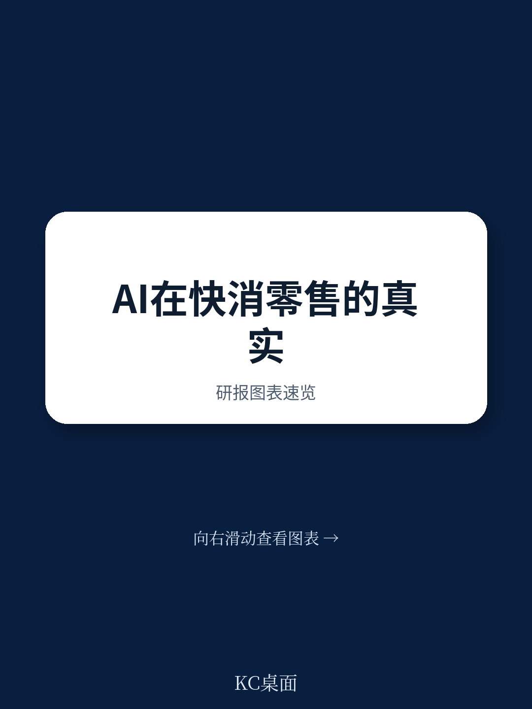
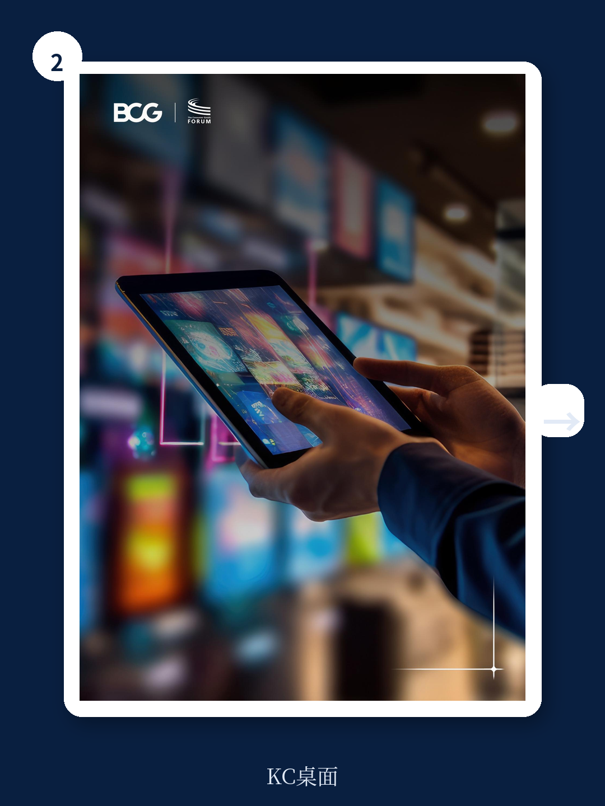

# 波士顿咨询：快消与零售的AI竞赛，赢家不是技术最强者

消费品和零售行业正在经历一场由AI驱动的竞争格局重塑，但波士顿咨询与消费品论坛联合发布的最新报告揭示了一个反直觉的判断：当前行业的AI竞赛，决定胜负的不是技术能力，而是战略聚焦能力。报告调查了39位全球CPG和零售高管，发现75%的CPG企业仍停留在试点探索阶段，而零售行业则呈现出明显的两极分化——45%的企业已实现规模化影响，但另有40%几乎尚未起步。这种分化背后，是赢家与追赶者之间一套截然不同的决策逻辑。

## 1. 规模化AI应用的真正瓶颈不在技术，而在战略聚焦

大多数CPG企业陷入了所谓的“试点陷阱”。波士顿咨询的报告显示，约四分之三的受访企业仍处于试点和探索模式，只有18%实现了规模化影响。问题不在于技术方案不够成熟，而在于这些企业未能将AI活动与核心商业优先级对齐。

报告指出一个关键矛盾：近半数CPG受访者将“从创意到上市”视为最具战略意义的流程，但只有11%在创新领域部署了AI。零售商也呈现类似模式：46%认为“从选品到品类规划”最重要，但仅有34%在该领域实现了AI规模化。

赢家的做法是“先收窄再加速”。他们不会同时铺开几十个AI试点，而是将AI集中在少数几个企业选择要赢的核心商业流程上——更快的创新、更精准的需求感知、更好的货架可得性或更相关的品类规划。这种聚焦本身就是一个战略决策，它要求CEO和领导团队有勇气说“不”。

> **KC评论：** 这份报告揭示了一个行业通病：AI活动与战略重点的错位。许多企业忙于追逐AI的热点应用，却忽视了最需要AI赋能的战略环节。如果你正在评估企业的AI投资组合，不妨先问自己：我们的AI项目是在解决最重要的问题，还是在做最容易做的事？完整报告中的Exhibit 5提供了CEO需要问自己的六个关键问题，值得每一位决策者对照自查。

## 2. 衡量体系的缺失是规模化失败的根本原因

波士顿咨询的调查发现，超过半数的受访企业没有正式衡量消费者AI投资的ROI。这听起来像是一个管理疏忽，但背后有深层次的结构性原因。

在真实的商业环境中，AI同时影响由季节性、供应约束、竞争对手行动和消费者需求共同塑造的决策。这使得结果难以孤立归因，试点阶段的经济效益很难在规模化时复制。一个试点可以在受控环境下成功——使用精选数据、专职团队、简化工作流和有限集成——但规模化时，同样的AI方案必须面对实时数据、遗留系统、一线采用、治理要求和跨职能权衡。

赢家与追赶者的关键区别在于：赢家在试点启动前就建立了衡量体系。他们不是先试点再评估，而是先由财务和业务团队共同建立完整的商业案例，包括价值预期、ROI和领先指标。更重要的是，他们绘制了当前工作流的详细基线，量化了时间和精力在各个环节的分布，以此作为衡量改进的基准。

这种“先建立基线再测试”的方法创造了一个信心循环：基线让衡量具有可信度，试点证据优化了价值假设，每个阶段更新都增加了对可交付成果的信心。到试点结束时，领导者面对的是一个基于测试潜力的修订版商业案例，这为他们决定是否规模化提供了更清晰的依据。

## 3. 从“副驾驶”到“自动驾驶”：赢家正在推进AI的自主决策能力

报告揭示了一个值得关注的数据：67%的受访企业仍将AI主要用作“副驾驶”——AI生成洞察，但人类做出最终决策。只有9%的企业将AI推向了“自动驾驶”模式——AI在预设边界内执行决策，人类管理例外情况。

这种差异直接决定了价值捕获的速度和规模。以需求预测为例，在“副驾驶”模式下，AI整合需求信号、库存位置、客户订单和供应约束，预测团队仍需调整假设、核对结果并决定下一步行动。而在“自动驾驶”模式下，AI持续读取这些信号，在预设边界内自动刷新预测并触发分配和补货行动，人类只在例外情况下介入。

波士顿咨询的报告估算，随着AI能力从决策支持走向工作流编排，规模化后的全潜力机会可能扩大约1.7倍。这意味着，当前停留在“副驾驶”模式的企业，实际上是在放弃一个价值倍增的机会。

> **KC评论：** 从“副驾驶”到“自动驾驶”的转变，本质上是信任边界的扩展。报告没有详细展开的是，这种转变需要的不仅是技术成熟度，还包括组织对AI决策的接受度、风险容忍度和治理框架的完善。完整报告中的“六问”框架对此有更深入的讨论，特别是关于如何在不失去风险控制的前提下快速推进的思考。

## 4. 报告尚未完全回答的关键问题：跨企业协作的价值如何实现

波士顿咨询的报告提出了一个前瞻性的判断：需求价值链的下一个前沿可能需要合法的、自愿的、适度的竞争前协作。更好的补货、更智能的促销规划和更相关的个性化，都可以通过CPG、零售商和平台之间的双边数据共享和更紧密的工作方式得到增强。

然而，报告也诚实地指出，受访高管对AI是否会创造协作机会、强化竞争，或不确定性太大而无法预测未来影响，看法存在分歧。这种不确定性恰恰是行业面临的关键瓶颈。

问题在于，跨企业AI协作面临三重挑战：数据共享的法律和合规边界、竞争敏感信息的保护机制、以及协作价值的分配规则。报告提到了“中立的产品数据分类法、供应和库存信号定义”等潜在的基础要素，但如何将这些要素转化为可操作的协作框架，报告并未给出明确的路线图。

这可能是当前AI在快消和零售领域规模化应用的最大未解问题之一。技术已经准备好，但协作机制和治理框架仍在探索中。

## 5. 一个更值得关注的观察框架：AI如何改变消费者的决策路径

报告提出了一个可能被低估的概念：生成式引擎优化。这不仅是AI在营销端的延伸，而是正在从根本上改变消费者发现、比较和购买产品的方式。

当消费者开始通过AI助手搜索产品、比较选项、甚至让AI代理完成购买时，品牌和零售商与消费者的互动方式将发生结构性变化。传统上，品牌通过货架位置、广告投放和搜索排名来影响消费者决策。而在AI驱动的购物场景中，决定品牌能否被消费者看到的，是AI模型如何理解、评估和推荐产品。

这意味着，CPG和零售商需要建立一套全新的能力：理解AI模型的推荐逻辑、优化产品信息在AI搜索中的呈现方式、以及管理品牌在AI代理购物流程中的存在感。报告将其列为“GEO和代理商务”类别，但这一趋势的影响可能远超一个单独的AI应用领域。

波士顿咨询的报告没有深入展开的是，这种变化对品牌资产、渠道策略和定价权的长期影响。当AI代理成为消费者的购物助手时，品牌忠诚度的定义可能需要重新思考。

---

这份波士顿咨询的报告揭示了一个清晰的信号：快消和零售行业的AI竞赛正在进入第二阶段。第一阶段的主题是“试点和探索”，第二阶段的主题是“聚焦和规模化”。赢家不是那些拥有最多AI试点项目的企业，而是那些能够将AI深度嵌入核心商业流程、建立可靠衡量体系、并敢于推进AI自主决策的企业。

但正如报告所暗示的，真正的价值释放可能取决于行业能否解决跨企业协作的问题。这是一个需要更多讨论、更多实验、也可能需要新的治理框架的领域。

如果你对这份报告的完整框架、六问清单、以及CPG和零售需求价值链的17个AI杠杆感兴趣，欢迎加入我们的社群。我们每天会由AI agent加上人工审阅，生成国际投行最新研报的中文摘要和KC评论，涵盖市场动态、行业趋势和资产定价的即时洞察。每日更新约10-40页，既方便喂给AI模型快速处理，也方便您人工把握市场动态。完整报告中包含波士顿咨询的详细图表、案例分析和落地框架，这些在本文中只能呈现冰山一角。

Personal reading notes and learning share only. Not investment advice.

