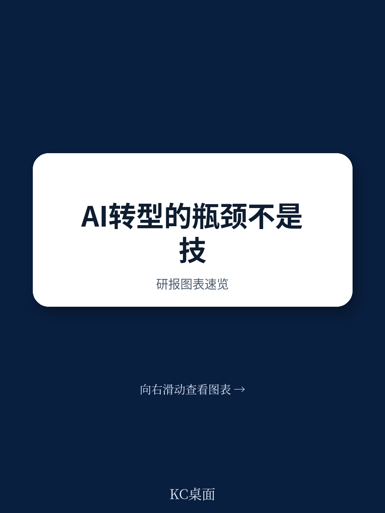
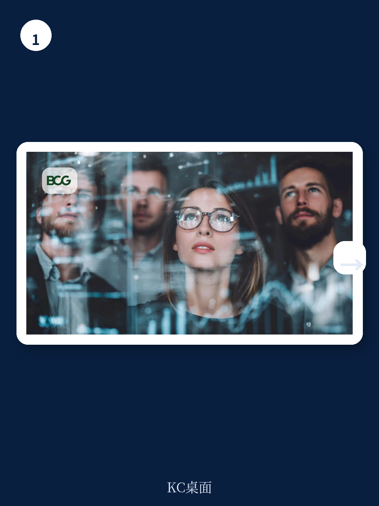
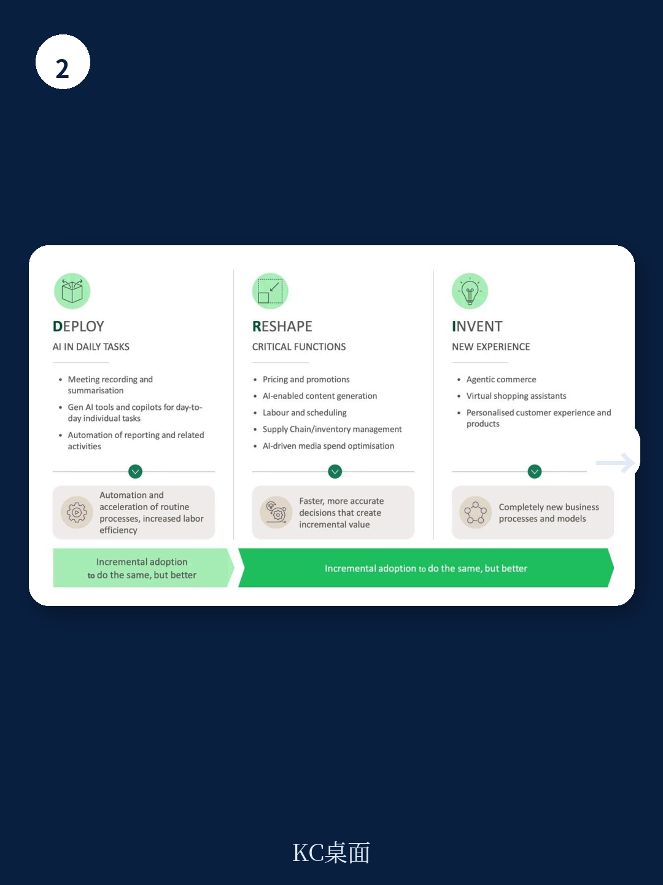

# 波士顿咨询：AI转型的瓶颈不是技术，是团队有没有被允许重新设计工作

当一家市值千亿的零售企业将AI工具分发到每个工程师手中，结果却发现代码部署效率几乎没有提升时，它意识到一个比技术更棘手的问题：团队不知道如何用这些工具重新思考自己的工作方式。

这不是个例。波士顿咨询在2026年6月发布的一份深度报告揭示了一个正在被大量企业忽视的真相。报告指出，生成式AI在三年内已达到70%的企业采用率，但只有16%的澳大利亚高管报告说他们从GenAI中获得了显著价值。这个巨大的落差，正在成为董事会和管理层最焦虑的议题。

这份来自波士顿咨询的报告，由前Woolworths集团首席人力官与BCG多位合伙人联合撰写，提出了一个核心判断：Agentic AI（智能体AI）正在从根本上改变组织变革的方式，而大多数企业的变革逻辑还停留在上一个时代。真正获得价值的组织，不是那些拥有最好技术的，而是那些让团队深度参与重新设计自身工作流程的。

> **KC评论：** 波士顿咨询的这份报告没有把重点放在AI技术选型或架构上，而是聚焦在“组织能力”这个更软、却更关键的变量上。对于正在推动AI落地的决策者来说，这意味着需要把注意力从“如何买工具”转向“如何让团队愿意且有能力使用工具”。完整报告里包含了AWS软件开发生命周期转型的详细案例，以及一个五步执行清单，这些实操细节是这篇文章无法完全展开的。

### 1. 五个结构性变化正在让传统变革模式失效

波士顿咨询的报告识别出五个正在改变组织变革逻辑的结构性变化，它们共同指向一个结论：传统的中央集权式、分阶段推进的转型模式，在Agentic AI时代已经跟不上节奏。

第一，工作变化的速度超过了中央项目能跟进的速度。Agentic AI的能力以周为单位在进化，Anthropic在2026年6月发布了Claude Fable 5，OpenAI在同年4月发布了为智能体工作流重构的GPT-5.5。一个需要层层审批、按季度规划的项目，根本无法应对这种节奏。

第二，创新正在变成自下而上的草根运动。团队自己就能获取生成式AI工具，无论公司有没有指导，创新的火花已经在各个角落自发产生。这些“绿芽”可能带来效率提升，也可能引入未被管控的风险。

第三，转型正在成倍增长。当几乎所有团队都受到Agentic AI影响时，转型不再是通过几个大型项目来规模化，而是通过成百上千个小规模的本地化重塑在同时发生。

第四，团队本身变成了变革的引擎。因为Agentic转型始于重新思考端到端的工作流程，而掌握这些流程专业知识的正是团队本身。领导层的任务变成了如何将这些能力引导向组织的关键战略优先级。

第五，角色在实时被重新定义。每个团队都被要求在继续完成日常工作的同时，重新设计自己的工作方式，同时还要面对未来的不确定性。这不可避免地会引发变革阻力。

这五个变化叠加在一起，意味着“部署一个中央系统，然后让团队适应”的时代已经结束。转型必须更接近团队，必须是分布式的，但又不等于无序的。

### 2. 真正的价值来自“重塑”而非“部署”

波士顿咨询的报告提出了一个关键框架：AI采用的价值创造分为三个阶段——部署、重塑和创造。其中，部署阶段只能创造立竿见影的有限价值，大部分价值来自用AI重塑关键职能和创造全新的AI驱动体验。

“重塑”在实践中的样子是什么？报告给出了一个清晰的场景：一家公司将战略目标设定为大幅提升营销的规模和个性化程度。它部署了Agentic AI来自动化大量活动开发流程——从生成创意素材到为不同受众和渠道定制信息。然后，营销职能围绕这个新能力进行自我重塑，端到端地重新设计工作流程，移除大量手工工作。常规任务被自动化，团队得以专注于策略、创意和实验。

这个例子揭示了“重塑”的核心：不是用AI辅助做原来的事，而是让AI改变“这件事怎么做”。这意味着工作流程、团队结构、甚至衡量成功的指标都需要重新定义。

> **KC评论：** 波士顿咨询将“部署”和“重塑”区分开来，这个框架对决策者非常实用。如果你只是在现有流程上加一个AI工具，你大概率只能获得边际改善。真正的价值来自于重新思考整个工作流——而这需要团队深度参与。完整报告里有更多行业案例来帮助理解这个区别。

### 3. 团队领导力成为新的瓶颈，技术已不是核心约束

报告最犀利的洞察在于，它明确指出AI转型的瓶颈已经从技术转移到了组织能力。这不是技术选型或算力问题，而是团队是否有信心、能力和“许可”去改变他们的工作方式来达成组织目标。

超过70%的CEO表示自己现在是AI的主要决策者，这反映了AI已经从CIO的工具箱上升为战略赋能器。但问题在于，CEO的决策和团队的执行之间，存在着巨大的鸿沟。团队需要的不只是工具，而是一个可以安全试验、有明确目标、并且有资源支持的环境。

波士顿咨询的报告提出了一个核心问题：你是否识别出了那2-3个AI能够真正推动业务指标的领域，而不是仅仅增加活动？这是一个非常务实的切入点。与其在十个领域浅尝辄止，不如在一个领域做到深度重塑。对一个零售商来说，如果其优先级是在每家门店放对商品组合，那么起点就是商品企划——从客户数据和需求信号出发，与品类经理、客户洞察和门店运营团队一起，端到端地重新构想工作流程，生成本地化的商品范围和陈列图。

### 4. 报告尚未完全回答的关键问题：规模化重塑的治理框架

尽管波士顿咨询的报告提供了极具洞察力的框架和案例，但它也留下了一个尚未完全回答的关键问题：当数百个小规模的重塑在组织中同时发生时，如何确保它们不偏离战略方向、不产生系统性风险、不重复造轮子？

报告提到了“分布式变革不等于无序变革”，并指出获得价值的组织不会让每个团队同时随意试验，而是将团队主导的能量引导到那2-3个能推动业务指标的领域。但具体如何实现这种“引导”？如何在不同团队之间协调资源、共享最佳实践、避免互相冲突的AI代理？报告给出了方向性的原则，但在具体的治理机制和组织设计上，仍有值得深入探讨的空间。

例如，当市场部用Agentic AI自动化了活动开发，而销售部也在用另一个AI代理优化客户互动时，这两个系统如何协同？谁来定义它们之间的接口？当出现冲突时，由谁来决定优先级？这些问题的答案，可能需要在实践中逐步摸索，但波士顿咨询的框架至少提供了一个正确的起点。

### 5. 一个实用的观察框架：从五个维度评估你的组织是否准备好

基于波士顿咨询报告的洞察，我们可以提炼出一个实用的观察框架，帮助决策者评估自己的组织是否具备在Agentic AI时代成功转型的条件。

第一，战略对齐度：AI是否真正服务于你的战略，还是仅仅在装饰它？你的数据与AI战略是否服务于业务战略？你是否识别出了那2-3个AI能真正推动业务指标的领域？

第二，组织设计能力：你的CHRO是否被置于AI议程的中心？Agentic AI将组织设计推到了AI议程的核心，CHRO需要作为首席转型与能力官，主动与业务领导者合作，将战略转化为团队结构，将层级扁平化并围绕人机协作工作流进行重组。

第三，采用质量而非访问权限：你是否在追求有质量的采用，而不仅仅是分发工具？访问权限是转型的开始，不是实质。你需要强有力的AI风险治理来管控未经授权的解决方案，投资于真正的AI素养教育，并建立可复用的标准化基础设施。

第四，变革与日常运营的分离：你是否区分了“如何转型”和“如何运营”，并保护了这种区别？转型不能加在已经满负荷的团队身上。领导层的任务是给团队明确的授权，将他们的工作与特定的业务指标挂钩，并通过补充人员或引入临时支持来提供容量，让人们能够从日常运营中抽身出来。

第五，构建、购买还是合作的决策框架：你是否有一个明确的框架来决定是自建、采购还是合作？默认“自己构建一切”的冲动往往是最慢且最昂贵的路径。更好的做法是定义一个明确的框架，让决策变得有意识而非默认。

> **KC评论：** 这个观察框架可以帮助你在阅读完整报告前，先对自己的组织做一个快速诊断。波士顿咨询的报告里有一个更详细的执行清单，包含五个具体问题，每一个都配有实操建议。加入我们的社群，可以获取完整的报告解读和原始图表。

### 结语：转型不是项目，而是持续的能力

波士顿咨询的报告最终落脚在一个深刻的判断上：如果组织只把AI看作是提高生产力的工具，它们将错过其全部潜力。Agentic AI的真正价值不在于将人类从等式中移除，而在于改变我们的工作方式。

大多数规模化Agentic AI所需的工作还在前方。成功需要组织在如何应对变革方面进行根本性的进化。那些成功的组织将不仅仅是部署AI，它们将制度化一种能力——让团队能够持续地重新设计工作的方式。

这份报告没有给出一个简单的成功公式，但它提供了一个思考框架和一系列可操作的问题。对于正在思考AI转型的决策者来说，这些问题本身就是最有价值的产出。

**如果你想深入了解波士顿咨询报告中关于AWS软件开发生命周期转型的完整案例、五个执行清单的详细解读，以及更多行业实践案例，欢迎加入我们的社群。我们每天会由AI Agent加上人工审核，生成国际投行与顶级咨询公司的中文摘要与KC评论，每日更新，约10-40页，也包含当天最新数据图表合集，既方便喂给AI，也方便人工快速把握市场动态。**

Personal reading notes and learning share only. Not investment advice.

