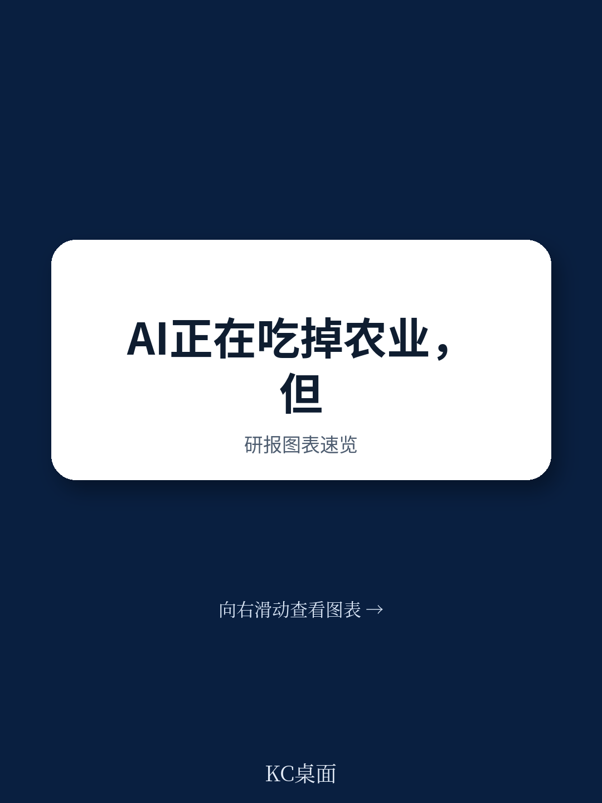
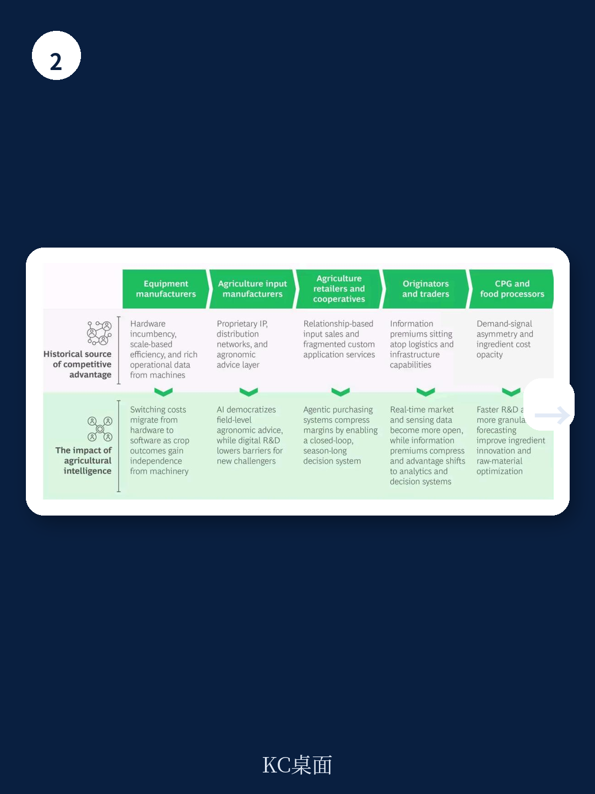

# 波士顿咨询：农业的“氮时刻”重演，但这次赢家不是化肥厂

1898年，英国科学家威廉·克鲁克斯爵士发出警告：地球的氮肥即将耗尽，除非能从空气中合成氮，否则饥荒将不可避免。十一年后，哈伯-博世法诞生，人类突破了自然的硬约束。此后一个多世纪，种子革命、机械化、化学投入品层层叠加，重塑了全球食物体系。今天，全球农业养活的人口是当时的五倍。

但波士顿咨询（BCG）在2025年6月发布的一份报告中指出，农业正面临三重结构性威胁：气候波动、地缘政治重组、以及监管范式迁移。而一个正在加速的第四股力量——农业智能（Agricultural Intelligence）——既是应对这些威胁的手段，也是新一轮价值重分配的开始。

今天，这份报告的核心判断是：AI正在侵蚀农业价值链中几乎所有基于信息不对称和专业知识溢价建立的竞争壁垒。赢家不会是那些把AI当“功能”加上去的公司，而是那些敢于重新定义自己商业模式的企业。就像哈伯-博世法没有拯救化肥厂，而是催生了整个现代农业体系一样，农业智能的窗口已经打开，但它不会一直敞开。

> **KC评论：** 报告的标题很直接——“农业智能如何重塑全球食物体系”。但它的真正判断是：AI不只是让农业更精准，而是让过去几十年农业公司赖以赚钱的“我知道你不知道”的模式失效。这意味着，从种子公司到贸易商，从农机厂到食品零售商，几乎所有玩家的护城河都需要重新审视。

## 1. 三重威胁正在迫使农业从“靠天吃饭”转向“靠数据吃饭”

BCG指出，全球农业食物体系正承受三重压力的叠加。第一是气候波动。降水、温度、季节变化这三个农业的基础输入，正在从“可靠的前提”变成“系统性的风险源”。当天气不再是可预测的常数，农业就需要更精细的监测和更快速的响应。

第二是地缘政治重组。中美关税的结构性调整已经持续了十年，乌克兰战争一夜之间重绘了小麦贸易地图，霍尔木兹海峡的封锁正在影响北半球种植季的化肥供应。供应链冲击已经成为大宗商品市场的永久特征。谁最早读取这些信号、最精确地对冲风险，谁就能获得优势。

第三是监管范式迁移。欧盟的森林砍伐法规、Scope 3碳报告、碳市场协议，加上消费者对透明度、可持续性和可追溯性的需求，正在强制要求农业建立一套从未有过的数据基础设施。食品公司必须能够精确、可验证地知道每一个投入品在哪里种植、在什么条件下、使用了什么方法。

这三重压力的共同点在于：它们都要求农业从“经验驱动”转向“数据驱动”。而农业智能，正是这个转型的核心工具。

## 2. 农业智能的四个维度：从“知道”到“创造”的闭环

BCG将农业智能分解为四个维度：感知（Sensing）、决策（Deciding）、行动（Acting）和创造（Creating）。这不是一个技术层级，而是一个相互增强的闭环系统。

感知将物理世界转化为数据。拖拉机、喷雾器、联合收割机持续生成运营数据，卫星、无人机、物联网传感器和计算机视觉技术将这些数据转化为可查询的信号。对于大多数农业企业来说，感知是最低风险的切入点，也是其他维度的数据基础。

决策将数据转化为正确的建议。在那些专家建议稀缺的市场，AI创造了前所未有的专业知识获取渠道。BCG引用了FarmerChat的例子：这个已在非洲、印度和巴西部署的平台，已经服务了超过83万农民，回答了超过500万个问题，将每次交互的成本从35美元降至35美分。

行动将决策转化为自动化的、针对特定地点的执行，无需在每个步骤进行人工交接。约翰迪尔的See & Spray系统使用计算机视觉以最高15英里/小时的速度区分作物和杂草，平均减少一半的化学品使用。该系统在2025年覆盖了北美500万英亩，而2024年只有100万英亩。

创造是最长期的赌注，也是最接近哈伯-博世法成就的维度。生成式AI模型开始以机器速度设计新性状、新分子和新生物制品。拜耳的Icafolin除草剂是该公司在CropKey方法下开发的第一个作物保护产品。它使用AI和数据科学针对特定目标设计候选分子，而不是筛选数千种化合物。

这四个维度作为网络相互作用。感知的数据基础设施可以增强决策，决策的质量使行动成为可能，行动产生的数据反过来增强感知并反馈给创造。在任何单一维度上投资的公司，正在建立一个后来者可能无法绕过的复合优势。

> **KC评论：** 这四个维度中最容易被忽视的是“创造”。大多数讨论AI在农业中的应用都停留在感知和决策层面——更精准的天气预报、更优化的施肥方案。但BCG暗示，真正颠覆性的力量在于AI能够设计新的输入品本身。拜耳的案例说明，AI正在改变研发范式，从“大海捞针”到“按需设计”。这意味着，未来十年，种子和化学品的创新速度可能会比过去半个世纪还要快。完整报告中对这一维度的技术细节和商业影响有更深入的拆解。

## 3. 信息不对称的溢价正在被压缩，每个玩家的护城河都在变薄

BCG报告最有价值的部分，是它对价值链上每个玩家面临的竞争格局变化进行了逐一分析。

对于农民和牧场主，他们是数据的原点，也是最受气候波动影响和最新传感基础设施监控的对象。但AI工具正在让他们越来越有能力理解自己数据的价值并据此行动。对于种子和投入品公司，它们依赖专利知识产权和农艺建议获取利润。专利保护的分子可能会存活下来，但农业智能正在为性状发现和研发领域打开新的挑战者入口。

对于农业零售商和合作社，它们建立在基于关系的投入品销售和零散的定制应用服务上。农民通常从一家供应商购买田间侦察服务，从另一家购买化肥和作物保护投入品，从第三家购买种子建议。这种碎片化的模式正面临两个方向的压力：一是自主采购系统将跨供应商透明地寻求竞争价格，压缩批发到零售的利润；二是出现整合的、全季节智能的潜力，将感知、决策和行动捆绑成一个闭环。第一个组装出这个闭环的公司，可以重新定义价值主张。

对于设备制造商，它们拥有丰富的运营数据——每一次通过、每一张产量图、每一个施用记录。但结构性风险在于，过去锚定其商业模式的转换成本，可能会从硬件迁移到AI驱动的软件上，因为作物洞察越来越独立于哪个品牌的铁器。

对于贸易商和交易商，它们比任何其他环节都更依赖信息不对称。它们在本地知道哪个农民有粮食、有多少，在全球拥有供需流动的可见性。但这个溢价正在被压缩，因为实时市场数据、AI生成的分析和卫星监测正在深入系统。最敏锐的玩家正在使用AI向上游的智能堆栈移动。

对于食品公司和零售商，它们过去通过需求信号不对称获得优势：比上游玩家更早知道消费者想要什么。这个优势正在压缩，因为农业智能使价值链的每一层都拥有更好的预测能力、更细粒度的供应链可见性，以及验证食品安全和来源的新工具。

> **KC评论：** 这一部分读起来像是一份“谁会被颠覆”的清单。BCG的判断很明确：过去几十年，农业价值链上的利润基本来自于“我知道你不知道”。AI正在把“知道”这件事民主化。那么问题来了：如果你的公司过去赚钱是因为你比别人更懂天气、更懂土壤、更懂市场，当这些知识变成每个农民手机里的一个app时，你的新护城河是什么？报告对每个玩家的应对策略有更具体的建议，但核心是——你必须找到一个新的、AI无法轻易复制的价值来源。

## 4. 报告没有完全回答的问题：数据信任的“最后一公里”

BCG在报告末尾提出了一个关键问题：你是否解决了农民数据问题，还是假设别人会解决？报告承认，当前系统是碎片化和低规模的，需要一个完整的农场视角。这在一定程度上是信任问题，而非数据问题。而且，这个问题正在变得更难解决：农民已经直接获得前沿AI工具，越来越有能力从自己的数据中获得直接、个性化的价值，无需外部平台。

这个判断值得深思。过去，农业科技公司习惯于假设“我收集你的数据，我帮你分析，你得到更好的结果”。但这个模型正在被挑战。当农民自己可以用AI工具分析自己的数据时，中间商的价值在哪里？

报告没有完全展开的是：谁将赢得这场数据信任之战？是农机制造商，因为它们拥有最丰富的运营数据？是投入品公司，因为它们拥有最深厚的农艺知识？还是新进入者，比如那些直接为农民提供AI工具的科技公司？这个问题没有标准答案，但它决定了未来十年农业价值链的权力结构。

## 5. 你的领导团队应该问的三个问题

BCG为每个农业价值链上的领导者提出了三个问题。它们不是假设性的，而是决定未来竞争力的关键。

第一，战略问题：你业务模式中哪一部分是建立在“你知道而对方不知道”的基础上的？不是“关系”或“规模”，而是具体的信息或专业知识优势。然后诚实地回答：当AI民主化知识层、气候波动侵蚀历史模式、地缘政治冲击惩罚最慢的替代方案构建者时，这个优势会变成什么？

第二，数据问题：你是否解决了农民数据问题？这是一个信任问题，而非纯粹的数据问题。而且它正在变得更难解决。最接近农民的组织可能最有条件赢得下一十年的基础设施竞赛，但前提是它们行动够快。

第三，运营问题：你是把农业智能当作一个不错的功能，还是围绕它重构核心运营？你的公司里是否有人能清晰地看到这个时刻对你意味着什么？你是否愿意做出必要的动作，在重组发生在你身上之前，让自己成为未来农场系统中不可或缺的存在？

这三个问题指向同一个核心：农业智能不是技术升级，而是商业模式的重构。那些等待观望的公司，可能会发现窗口已经关闭。

农业的新“氮时刻”窗口已经打开。它不会一直敞开。

---

这份报告的完整版本包含更多细节：每个维度的技术路径、具体公司的案例拆解、以及对不同细分市场的量化影响预测。我们每天会由AI agent加人工review生成国际投行中文摘要与KC评论，daily更新，约10-40页，也包含当天最新数据图表合集，既方便喂给AI，也方便人工快速把握market dynamics。如果你想知道哪个细分市场最可能被颠覆、哪些公司最有可能成为新的赢家，欢迎加入社群，领取完整研报解读与原始图表。

Personal reading notes and learning share only. Not investment advice.

