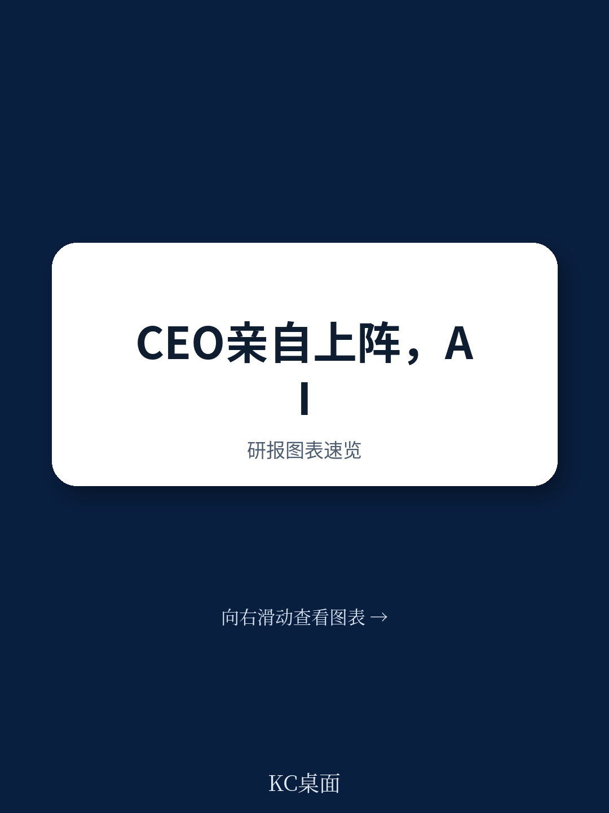
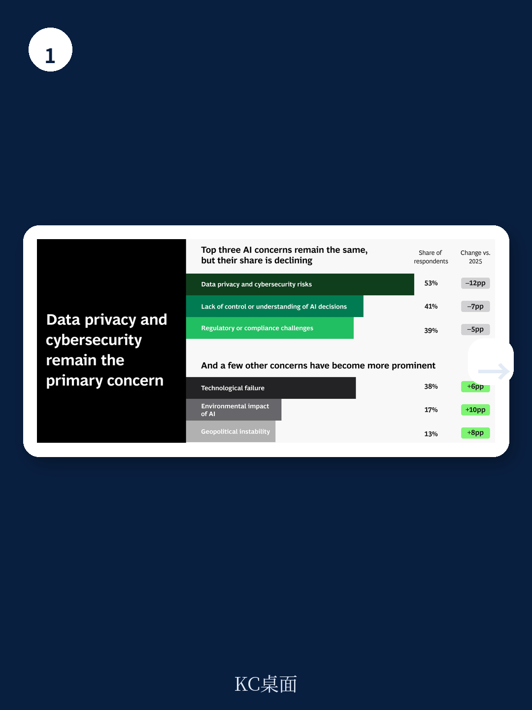
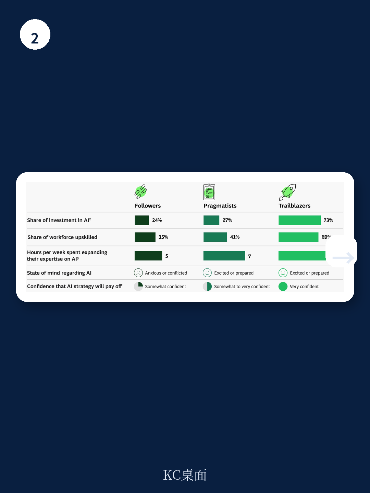

# 波士顿咨询：CEO亲自下场，AI投资翻倍但真正的分化才刚刚开始

2025年，全球企业AI投资占营收比例翻倍至1.7%。这组来自波士顿咨询（BCG）最新AI雷达报告的数据，本身并不令人意外。真正值得关注的判断是：企业AI转型的主导权，正在从CIO办公室转移到CEO办公室，这一权力转移将从根本上改变AI投资的逻辑、节奏和胜败格局。

BCG在2026年AI雷达报告中调查了2360位全球企业高管，其中640位是CEO。结论清晰：72%的CEO表示自己是所在组织AI决策的第一责任人，这一比例是去年的两倍。更关键的是，50%的CEO认为自己的职位稳定性取决于能否把AI战略做对。

这不是一个关于技术选择的报告，而是一个关于组织权力、战略决心和资本配置的报告。对于那些还在把AI当作IT项目来管理的企业，这份报告释放了一个明确的信号：窗口期正在关闭。

## 1. 94%的企业不会因短期回报不达预期而削减AI投资，这轮投入具有刚性

BCG报告中最反直觉的数据是：94%的受访企业表示，即使AI投资在2026年没有产生预期的财务回报，他们仍将继续投入。只有6%的企业计划在短期效果不理想时撤回投资。

这一数据打破了过去企业数字化转型中常见的“试点-观望-收缩”循环。当AI投资从CIO的预算项目变成CEO的战略承诺，退出成本就不再是财务上的沉没成本，而是组织层面的战略失信。

从投资强度看，2026年全球企业AI投资占营收比例预计达到1.7%，较2025年翻倍。横向看，所有行业都在加码。金融和科技行业依然领先，但工业和消费品行业的增速更快。这意味着，AI投入不再是少数领先者的差异化动作，而是全行业的基准配置。

> **KC评论：** 1.7%的营收占比看似不高，但考虑到全球企业营收基数，这是一笔极其庞大的增量资本。对于投资者而言，需要关注的不是“哪些公司在投AI”，而是“哪些公司把AI预算花在了刀刃上”。BCG报告中的行业分布图显示，不同行业的投资结构差异很大，这部分细节在完整报告中有更深入的拆解。

## 2. CEO亲自掌舵AI，但压力分布呈现明显的“东西分化”

当CEO成为AI第一决策人，一个自然的问题是：他们在想什么？BCG的报告给出了一个有趣的全球对比。

全球范围内，82%的CEO对AI的ROI前景比去年更加乐观。但乐观的来源不同。在亚洲，尤其是大中华区和东南亚，CEO的信心主要来自“相信AI会带来回报”。在欧洲和北美，CEO的动力更多来自“如果不做就会落后”的压力。

这种“东西分化”在数据上很清晰。报告中的地图显示，亚太地区CEO的“信心指数”明显高于欧美，而欧美CEO的“压力指数”则远超亚洲同行。这不是简单的文化差异，而是产业结构、竞争环境和资本市场的综合反映。

对投资者而言，这种分化意味着：亚洲企业更有可能在AI应用上采取长期主义，而欧美企业可能在短期压力下出现过度投资或方向摇摆。两种路径各有风险，但BCG的报告暗示，亚洲CEO的“信心驱动型”策略可能更可持续。

> **KC评论：** 这里有一个报告没有完全展开的问题：CEO的信心是否建立在扎实的AI能力基础上？BCG在完整报告中提供了CEO个人AI素养与组织AI成熟度的交叉分析，这部分数据对于判断“信心是否可靠”非常关键。

## 3. 三大CEO原型浮现，只有15%是真正的“开拓者”

BCG通过聚类分析，将640位CEO分为三个原型：开拓者、务实者和跟随者。这一分类基于五个变量：AI投资强度、AI素养投入、组织AI技能重塑程度、对AI回报的信心、以及是否感到压力。

开拓者（约15%）：积极投资、快速重塑组织、高度自信。他们不仅把AI当作效率工具，而是将其嵌入端到端的业务转型。60%的AI预算用于智能体AI。

务实者（约70%）：对AI有信心，但只有在看到明确价值和低风险时才投资。他们是“等待证明”的群体。

跟随者（约15%）：承认AI的潜力，但缺乏全面的信心，只做早期审慎投资。

这一分类的洞察不在于比例，而在于行为差异。开拓者CEO每周花6小时以上学习AI，而务实者和跟随者不到2小时。开拓者将约60%的AI预算用于员工技能重塑，务实者和跟随者分别只有27%和24%。

> **KC评论：** 开拓者CEO的行为模式值得每一个产业决策者对照。BCG的报告显示，开拓者不仅投钱，更投时间。CEO个人AI素养的提升，可能是决定企业AI转型成败的隐藏变量。完整报告中有开拓者CEO的具体行为清单，可以作为自我评估框架。

## 4. 智能体AI成为分水岭，但报告没有完全回答一个关键问题

BCG报告显示，约90%的CEO相信AI智能体将在2026年带来可衡量的ROI。开拓者CEO对智能体AI的投入尤为激进，60%的AI预算流向这一领域。

智能体AI正在从“辅助工具”走向“独立角色”。BCG与MIT Sloan Management Review的联合研究显示，AI系统正在越来越多地承担独立工作，而非仅作为人类决策的辅助。这意味着组织流程、决策权责和治理结构都需要重新设计。

但报告没有完全回答的问题是：智能体AI的ROI如何衡量？当AI系统开始自主完成端到端任务时，传统的投资回报率计算框架可能失效。BCG提到了“新成功标准”的概念，但并未给出具体的衡量方法论。这是留给读者自己去探索的方向。

## 5. 对产业决策者的观察框架：三个维度判断你的组织处在哪个阶段

基于BCG报告的逻辑，我们可以提炼出一个用于自我诊断的观察框架：

第一，看CEO的时间投入。CEO每周花在AI学习上的时间是否超过5小时？如果不是，组织很可能停留在“跟随者”阶段，即使AI预算在增长。

第二，看AI预算的结构。在1.7%的营收投入中，有多少用于技能重塑，多少用于基础设施，多少用于智能体开发？BCG的数据显示，开拓者在这三个维度上的分配比例与务实者、跟随者有显著差异。

第三，看组织治理的变化。AI是否已经开始改变决策权责和汇报线？58%的领先组织预计AI将引发治理结构变化。如果你的组织还没有讨论这个问题，可能已经落后。

## 6. 报告没有展开的追问：当94%的企业都“不退出”，竞争格局会如何演变？

BCG报告的核心数据是94%的企业不会因短期回报不达预期而退出。这本身是一个强烈的信号，但报告没有深入探讨其竞争含义。

当所有人都在加注，那些真正能跑出来的企业，竞争优势来自哪里？是更快的执行，更聪明的资本配置，还是更深厚的组织能力？BCG的CEO原型分类提供了一种思路，但每个原型的内部差异和动态演变，需要读者结合自身行业去判断。

完整报告中包含了按行业、地区、企业规模细分的投资数据，以及开拓者CEO的具体案例。对于正在制定2026年AI预算的决策者，这些细节比宏观判断更有参考价值。

---

AI投资翻倍、CEO亲自下场、智能体走向独立——这些趋势叠加在一起，指向一个结论：2026年可能成为企业AI转型从“实验期”进入“执行期”的转折年。但转折从来不是均匀分布的。那些由开拓者CEO领导、在技能重塑和智能体上重注投入的企业，可能会在12-18个月后拉开与竞争者的差距。

这份报告提供了宏观图景和分类框架，但真正的洞察藏在细分数据和案例中。我们的AI agent每天从国际投行研报中提取关键图表和判断，结合人工review生成中文摘要与KC评论，约10-40页，既方便喂给AI，也方便人工快速把握市场动态。如果你希望获取BCG这份报告的完整图表和更细致的行业拆解，可以加入社群，每天收到更新，与同样关注AI转型的决策者一起讨论。

---

Personal reading notes and learning share only. Not investment advice.

