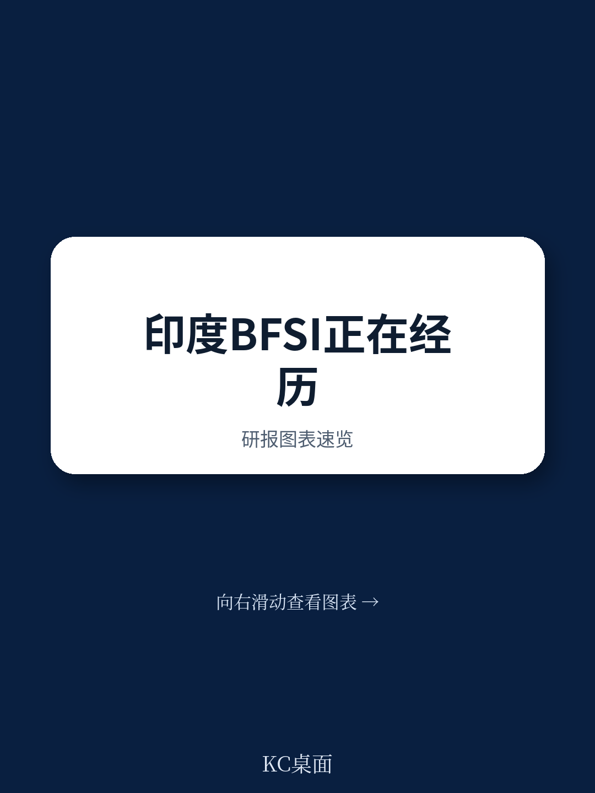
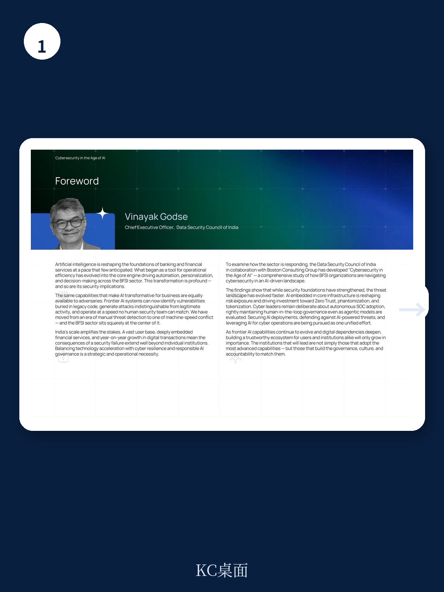
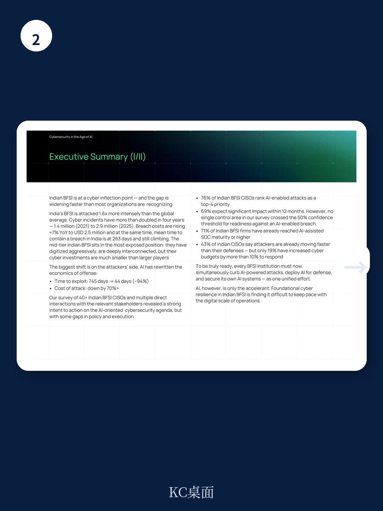

# 波士顿咨询：印度BFSI的网络安全缺口正在加速扩大，AI攻击者已领先12-18个月

这份报告来自波士顿咨询（BCG）与印度数据安全委员会（DSCI）的联合调研，核心判断只有一个：印度金融业的网络安全防线正在被AI加速撕开，而且这个缺口还在以季度为单位扩大。

报告的数据触目惊心。印度BFSI（银行、金融服务与保险）遭受的网络攻击强度是全球平均水平的1.6倍。网络安全事件从2021年的140万起翻倍到2025年的290万起。数据泄露的平均成本以每年7%的速度攀升，达到250万美元。而更令人不安的是，从发现到控制一次数据泄露的平均时间长达263天——比全球平均水平还要多出22天。

但真正让这份报告值得认真研读的，不是这些数字本身，而是波士顿咨询提出的一个根本性判断：AI已经彻底改写了网络攻击的经济学。攻击者的时间成本被压缩了94%，攻击成本下降了70%以上。这意味着，过去只有国家级行为体或顶级黑客组织才能发动的攻击，现在几乎任何有动机的对手都能以极低成本实现。

这不仅仅是威胁升级。这是一场结构性不对称的重新洗牌。

## 1. 攻击者的速度已经超过防御者的响应周期，这是体系性问题而非技术缺口

波士顿咨询的数据显示，AI工具将一次攻击从策划到利用的时间窗口从745天压缩到了44天。而印度BFSI机构平均需要263天才能识别并控制一次数据泄露。

这个数字对比本身就说明了一切。当攻击者以天为单位行动时，防御者仍然以月为单位响应。这不是某个安全产品配置不当的问题，而是整个安全运营体系的节奏已经跟不上对手。

报告特别指出，印度BFSI中76%的CISO将AI驱动的攻击列为2026年的前四大优先事项，69%的人认为AI威胁将在12个月内产生重大影响。但与之形成鲜明对比的是，调查中没有任何一个安全控制领域在应对AI攻击的置信度上超过50%。

> **KC评论：** 这意味着，印度金融业的CISO们已经清楚地知道自己面临什么，但他们的组织还没有做出与之匹配的资源重新配置。这种“认知到位、行动滞后”的状态，可能比单纯的防御不足更危险——因为决策者已经知道风险，却仍然无法改变结果。

这份报告对印度BFSI的技术基础建设给予了肯定，认为其数字化基础已经相当扎实。但问题在于，威胁环境的演化速度已经超过了基础建设的升级速度。波士顿咨询的结论非常明确：未来12到18个月内果断行动的机构，将定义整个行业在本十年的剩余时间里如何运转。

## 2. 中等规模金融机构处于最危险的暴露位置，但预算差距正在制造系统性脆弱

报告提出一个容易被忽视但极其重要的结构性判断：印度BFSI中，中等规模的机构——中等规模的私人银行、小型金融银行、非银行金融公司（NBFCs）、城市合作银行——处于最危险的暴露位置。

这些机构已经积极完成了数字化转型，拥有有价值的数据和支付通道，并且深度嵌入共享基础设施。但它们的网络安全预算只是大型金融机构的一个零头。

数据支撑了这一判断：全球BFSI机构中，76%的网络安全支出占IT预算的比例超过10%。但在印度，这个比例只有38%。超过60%的印度BFSI机构将网络安全支出控制在IT预算的10%以下。

> **KC评论：** 这个差距意味着什么？当一个中等规模的NBFC与一家大型银行共享同一个第三方支付处理商或云服务商时，攻击者可以通过攻破较弱的防守方来渗透整个网络。这不是单个机构的风险问题，而是整个生态系统的脆弱性问题。报告中提到的2024年7月勒索软件攻击导致约300家合作银行和地区农村银行支付服务中断的案例，就是这种系统性风险的现实注脚。

波士顿咨询的调查还显示，55%的印度BFSI机构将第三方风险列为首要关注点，但只有49%已经建立了成熟的控制措施。这中间的鸿沟，正是当前治理和连续性管理的缺口所在。

## 3. AI治理的成熟度严重滞后于AI采纳速度，这是一个危险的时序错配

报告揭示了一个令人不安的时序错配：印度BFSI在AI采纳方面已经走得很远——71%的机构已经达到AI辅助安全运营中心（SOC）的成熟度或更高水平。但在AI安全治理方面，只有29%的机构同时拥有明确的AI安全负责人和成文的AI安全政策。

这意味着，大多数机构在部署AI工具的同时，还没有建立起相应的治理框架和安全边界。这种“先跑后修”的模式在传统IT环境中可能还能承受，但在AI环境下，风险被成倍放大。

报告中提到的8个结构性风险因素中，AI驱动的威胁被列为第二大因素，仅次于数字化规模扩大带来的攻击面扩张。恶意LLM（大语言模型）使得低成本、高针对性的攻击成为可能。攻击者的优势已经发生了根本性转移：利用速度现在超过了防御速度。

> **KC评论：** 波士顿咨询没有在报告中展开的是，这种治理滞后可能带来的具体后果。当AI系统本身成为攻击面时——比如模型投毒、提示注入、训练数据污染——传统的安全控制手段可能完全失效。完整报告中有关于AI安全控制成熟度的详细拆解，包括不同控制领域的置信度评分，这些数据对于理解自身的防御弱点非常关键。

## 4. 报告没有完全回答的关键问题：如何衡量“同步性”的ROI

波士顿咨询提出的核心解决方案是“同步性”（Synchronicity）——将网络安全从一个安全职能的议程转变为一个跨五大前线的同步韧性系统：业务对齐、跨职能团队、供应商管理、人员安全、生态情报共享。

这个框架本身很有洞察力。攻击者已经作为一个协调的经济体在运作。防御者如果不能在五个前线同时实现同步，就永远处于被动响应的状态。

但报告没有完全回答的问题是：如何量化这种“同步性”的投资回报率？当CISO向董事会申请预算时，如何用董事会能理解的语言说明“同步性”的价值？

目前印度BFSI的网络安全投资水平明显偏低——60%以上的机构网络安全支出不到IT预算的10%。但要说服董事会将这一比例提高到全球平均水平的15%甚至20%，需要的不只是风险描述，还需要清晰的财务逻辑。

报告提到，网络攻击的机会成本和损失已经“实质性”超过了防御投资。但波士顿咨询没有给出一个具体的量化框架来帮助机构计算“风险买回”（risk buydown）的ROI。这对于推动决策层行动来说，可能是一个重要的缺失环节。

## 5. 对读者的观察框架：用三个维度评估你自己的机构

基于波士顿咨询的报告逻辑，任何BFSI机构的管理者可以用以下三个维度来快速评估自己的安全态势：

第一，速度匹配度。你的安全运营响应周期是否与攻击者的攻击周期相匹配？如果你仍然以月为单位规划安全升级，而攻击者已经以天为单位行动，那么你的防御节奏从根本上就已经落后。

第二，预算配置的合理性。你的网络安全支出是否与你的数字化暴露程度相匹配？报告显示，印度BFSI的网络安全支出占IT预算的比例远低于全球同行。如果你的数字化程度在提升，但安全预算没有相应增加，那么你的暴露风险就在加速扩大。

第三，AI治理的成熟度。你是否已经建立了与AI采纳速度相匹配的治理框架？如果你已经在使用AI工具，但还没有明确的AI安全负责人和成文的安全政策，那么你的组织可能在无意识中放大了风险敞口。

这三个维度可以帮助管理者快速定位自己机构所处的阶段，并判断下一步最应该采取的行动。

波士顿咨询在报告中强调了四个优先行动领域：投资空间存在（重新审视网络安全防御能力）、第三方风险可控（但需要正确的治理模型）、AI治理需要提升、以及人才缺口需要系统性地解决。但真正的挑战不在于知道该做什么，而在于如何在12到18个月内完成从认知到行动的转变。

这份报告的数据和框架非常扎实，但受限于篇幅，我们只能在这里呈现最核心的判断和逻辑链条。报告中还有大量值得细读的内容——包括印度BFSI与全球同行的详细对标数据、8个结构性风险因素的深入拆解、以及CISO调研的完整结果。

如果你希望获得这份波士顿咨询报告的完整解读版本，包括原始图表和我们的详细评论，可以加入我们的社群。我们每天会由AI agent加上人工review，生成国际投行的中文摘要与KC评论，每天更新，约10到40页，包含当天最新的数据图表合集。既方便喂给AI进行二次分析，也方便人工快速把握市场动态。

Personal reading notes and learning share only. Not investment advice.

