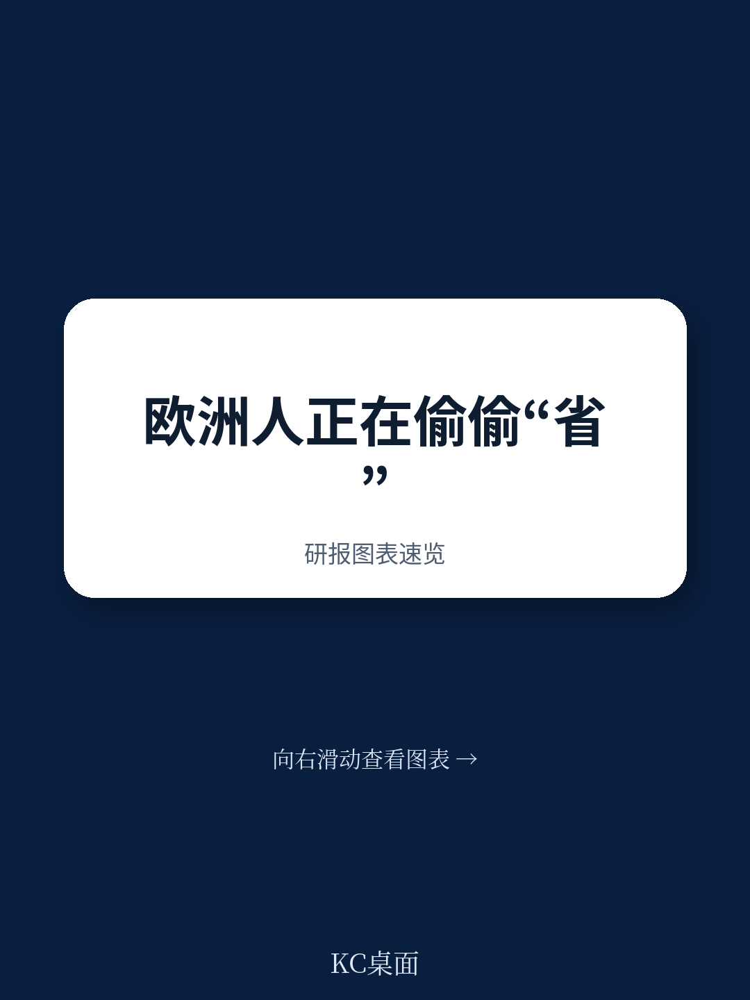
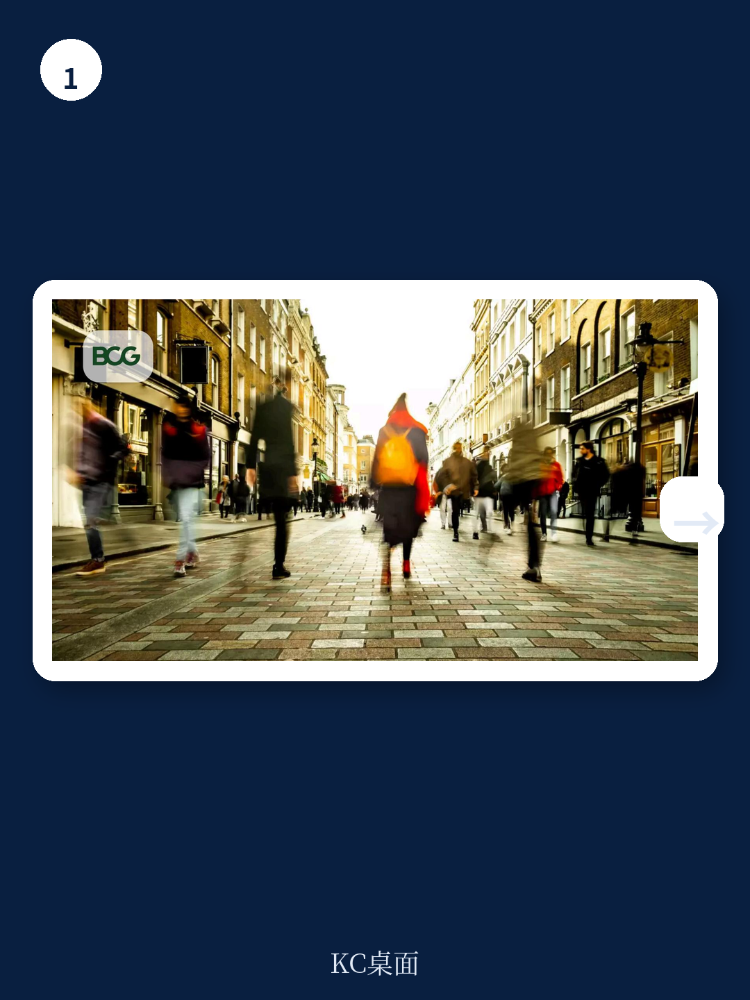
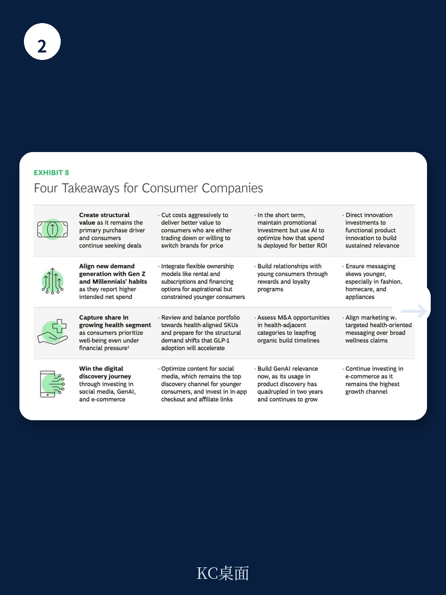

# 波士顿咨询：欧洲消费者削减的不是预算，是品牌忠诚度

欧洲消费者的钱包正在收紧，但这份来自波士顿咨询（BCG）的2026年消费者调研揭示了一个更深层的信号：消费者削减的不是花销本身，而是对品牌的忠诚。超过六成的欧洲消费者表示愿意为更好的价格更换品牌，44%的人在最近一次购买中已经转向了一个他们从未买过的品牌。这不是一次简单的消费降级，而是一次结构性的消费行为重塑——价格成为唯一的信息，健康成为新的刚需，而品牌曾经的护城河正在被折扣和社交媒体同时瓦解。

这份基于对11个欧洲国家超过20000名消费者的年度调研，在2026年4月完成。它告诉我们，消费者悲观情绪仍在加深——对经济感到悲观的消费者比例从2025年的54%上升至56%。但真正值得关注的不是情绪本身，而是情绪如何转化为行为，以及这些行为对产业格局意味着什么。

## 1. 金融压力已成为欧洲消费者的默认状态，而非偶发事件

超过半数的欧洲消费者（53%）表示对日常个人财务状况感到担忧，这一比例较2024年的40%大幅上升。六成消费者担心退休后资金不足。这些数字背后是一个更关键的判断：消费者已经将“财务紧张”内化为一种常态化的生活状态，而非等待经济好转的临时反应。

BCG的调研设计了一个巧妙的思想实验：如果消费者突然获得10%到15%的额外收入，他们会做什么？近半数受访者的首选是增加储蓄，而非消费。这意味着，即便经济出现边际改善，消费反弹的力度也可能远低于市场预期。消费者的第一反应是修补资产负债表，而不是打开钱包。

> **KC评论：** 这张图的价值在于它推翻了“压抑需求终将释放”的乐观假设。完整报告中包含按国家和年龄组细分的储蓄意愿数据，这些细节对于判断不同品类的复苏时序至关重要。一位德国中年消费者和一位西班牙年轻消费者的选择几乎完全不同。

## 2. 品类内部分化比品类间分化更剧烈，健康成为新的“必需品”

过去六个月中，欧洲仅有食品杂货和宠物护理两个品类录得正向净支出（即报告增加支出的人数多于减少支出的人数）。但这一增长主要由价格上涨驱动，而非消费量增加。其他所有品类均持平或下滑。

真正值得深入分析的是品类内部的断裂。以时尚为例，鞋类（净支出-12点）、休闲装（-13点）和运动装（-14点）的表现远好于正装和晚装（-20点）、手袋（-23点）和配饰（-22点）。在宠物护理这个整体表现最好的品类中，消费者在宠物日常食品上增加支出（+19点），却在宠物配饰上减少支出（-10点）。

这种“内部剪刀差”揭示了一个清晰的消费逻辑：消费者在每一个品类内部都在做“必要”与“非必要”的切割。健康相关的子品类正在被重新归类为“必要支出”。近半数消费者报告正在减少饮酒或考虑减少饮酒，功能性零食和清洁标签产品表现优于传统零食，补充剂品类录得增长。

> **KC评论：** 这份报告最精彩的洞察之一，是它把“健康”从一个营销口号变成了一个可量化的消费分类标准。完整报告中有按品类细分的“健康对齐度”与净支出的交叉分析，这些图表可以帮助你判断哪些SKU正在被消费者主动放弃。

## 3. 代际裂痕正在重塑消费版图：年轻消费者不是更有钱，而是更愿意为“生活阶段”买单

代际差异是这份报告中最容易被低估的结构性变量。未来六个月的净支出预期中，Z世代和千禧一代为-2点，而X世代和婴儿潮一代为-13点，差距达到11个百分点，较2025年进一步扩大2个百分点。

在具体品类上，这一差距更为惊人：家具品类中，年轻消费者净支出为+3点，年长消费者为-22点，差距25点；时尚品类差距23点；家电品类差距16点。

但BCG的分析指出，收入差异并非主因。更关键的解释是“生活阶段”——年轻消费者正在组建家庭、养育子女，这些刚性需求即使在财务压力下也难以压缩。而当被问及减少支出的原因时，年轻消费者倾向于“降级消费”（转向更便宜的品牌或商店），年长消费者则倾向于“减少消费总量”。

更值得品牌警惕的是品牌忠诚度的代际断层。仅有28%的年轻消费者表示通常会购买同一品牌，而年长消费者的这一比例为44%。年轻消费者购买二手商品的可能性是年长消费者的两倍以上。

## 4. 折扣已是第一购买驱动力，品牌声誉退居第五

“价值寻求”已从一种短期应对策略演变为深度嵌入的行为习惯。63%的消费者表示只在打折时购买或积极寻找折扣，这一比例与去年持平。在时尚品类，这一比例高达73%。即使在品牌忠诚度最高的非处方药和保健品品类，也有半数消费者在寻找更优价格。

折扣是促使消费者更换品牌的首要因素，而品牌声誉仅排第五。62%的消费者愿意为更好的价格更换品牌，在家具和时尚品类，这一比例超过70%。44%的消费者在最近一次购买中已经转向了一个他们不常买或从未买过的品牌。

自有品牌的渗透率持续上升：39%的消费者经常或总是购买自有品牌食品杂货，30%购买自有品牌家居用品，29%购买自有品牌时尚产品。

> **KC评论：** 这份报告最刺痛品牌经理的发现是：折扣和店内可见度是转化消费者的最强杠杆，而品牌声誉排名第五。这意味着传统“品牌建设”的效率正在被结构性削弱。完整报告中有按品类细分的购买决策因子排名，这些数据对于重新分配营销预算具有直接参考价值。

## 5. 可持续发展正在被“价值”挤出决策框架，但二手市场因经济动机在增长

可持续性在消费决策中的影响力正在下降。2026年，消费者报告在购买时考虑可持续性的比例较去年平均下降3个百分点。但愿意为可持续产品支付溢价的消费者比例稳定在17%。

与此同时，二手市场仍在扩张。47%的消费者表示有时、经常或几乎总是购买二手商品，较去年上升4个百分点。但驱动因素已明确转向经济层面：46%的二手买家出于省钱目的，21%为了以更低价格获得高端品牌，仅17%将可持续性列为首要原因。

这一趋势将二手市场重新定位为一个“价值渠道”和“精明消费”的体现，尤其受到Z世代和千禧一代的青睐——他们购买二手商品的可能性是年长消费者的近两倍。

## 报告尚未完全回答的关键问题：GLP-1药物对消费结构的影响到底有多大？

BCG的调研显示，74%的欧洲消费者知道GLP-1食欲抑制类药物（如Ozempic、Wegovy和Mounjaro），四分之一的人正在使用或认真考虑使用。Z世代和千禧一代考虑使用这些药物的比例（19%）是年长消费者（8%）的两倍以上。

报告明确指出了这一趋势对食品、个人护理和健康品类的潜在影响，但其分析停留在“如果认知转化为消费”的假设层面。关键问题在于：这种转化速度有多快？哪些品类会最先受到冲击？GLP-1药物的普及是否会加速“健康成为必需品”这一趋势，从而在食品饮料行业制造出新的赢家和输家？

报告没有给出量化预测，这恰恰是决策者最需要的信息。波士顿咨询在报告中建议品牌“为GLP-1采纳加速带来的结构性需求转变做好准备”，但具体到投资组合调整的节奏和幅度，仍有待更深入的分析。

## 观察框架：四个维度判断你的品牌是否在“被淘汰”的轨道上

基于这份报告的发现，品牌管理者可以从以下四个维度进行自我诊断：

第一，你的品牌在“价格-忠诚度”矩阵中的位置。如果超过半数消费者愿意为更好价格更换品牌，你的品牌是否拥有足够的转换成本？是产品独特性、渠道锁定还是习惯惯性在维持现有份额？

第二，你的品类内部是否存在“健康对齐度”的差异化。消费者在同一品类内对“必要”和“非必要”子品类的支出分化正在加剧。你的SKU组合是偏向健康对齐还是偏向纯享乐型消费？

第三，你的年轻消费者获取策略是否依赖品牌忠诚度。Z世代和千禧一代的品牌忠诚度只有年长消费者的一半，这意味着传统的“品牌建设-品牌忠诚”路径可能失效。你是否有针对年轻消费者的独立获客和留存体系？

第四，你的数字发现路径是否覆盖了GenAI和社交媒体。GenAI在产品发现中的使用率两年内翻了四倍，社交媒体正在取代搜索引擎成为年轻消费者的首要发现渠道。你的营销投资是否跟上了这一迁移？

---

这份波士顿咨询的调研提供了2026年欧洲消费者行为的全景图，但真正的决策价值在于如何将这些趋势转化为具体的品类策略、投资优先级和竞争定位。完整报告中包含了按11个国家、12个品类、4个年龄段的交叉分析数据，以及BCG为品牌设计的四个优先行动领域的详细执行框架。

如果你想获得完整的中文摘要版报告和原始图表，可以加入我们的社群。每天，我们会通过AI agent结合人工review，筛选并翻译国际顶级投行和咨询机构的最新研报，形成10-40页的中文精华摘要，既方便你快速把握市场动态，也适合直接喂给AI进行二次分析。在消费结构正在被重塑的当下，这些第一手的调研数据可能是你做出正确判断的基础。

Personal reading notes and learning share only. Not investment advice.

