FINANCIAL INSTITUTIONS
GLOBAL FINTECH REPORT 2025
3RD EDITION, COAUTHORED BY BCG AND QED INVESTORS

Fintech's Next Chapter

# Scaled Winners and Emerging Disruptors

June 2025

BCG + QED

Contents
03 12 Key Highlights
04 Introduction
05 Despite Current Volatility, a Fintech Spring Is Underway
09 Fintech Penetration Resembles Swiss Cheese: Plenty of Holes
13 Forecast: Five Trends That Will Shape the Next Chapter in Fintech
31 Where We Go from Here: Calls to Action
35 Conclusion

## 12 Key Highlights

21%

Global fintech revenues grew robustly at 21% in 2024 (versus 13% in 2023), driven by impressive results from challenger banks and trading and investment fintechs.

\$231B

Total revenue generated by fintechs with more than \$500 million in annual revenue—representing approximately 60% of the global fintech industry's total revenue.

3x

The pace at which fintechs outgrew incumbents in 2024.

3%

Share of global banking and insurance revenue pools penetrated by fintechs—with many holes remaining by both vertical and geography.

25%

Increase in average EBITDA margins of public fintechs in 2024—as fintechs continued to shift from a “growth at all costs” to a “sustainable growth” mindset.

5

Segments out of 23 in which fintech success has been concentrated so far: digital wallets, acquiring and vertical SaaS, challenger banking, crypto trading, and BPNL.

150

The number of fintechs, globally, founded before 2016 that have raised more than \$500 million in cumulative equity funding and that have not yet gone public.

24

The number of profitable challenger banks globally with at least \$500 million in annual revenue. Their odds of success are higher in product and customer expansion than in global expansion.

Future fintech growth will be driven by B2B(2X), financial infrastructure, and lending.

49%

The share of equity funding AI-powered fintechs are receiving versus their “fair share” of 23%. While only beginning to take root as a productivity lever, agentic AI will change the fintech game.

Onchain finance has been in search of a killer use case for over a decade. While there is excitement around stablecoins for payments, asset tokenization could be the tipping point use case that brings more economic activity onchain.

\$280B

The white-space opportunity for private credit funds in fintech lending. Combined with declining rates and maturing customer data, there are new tailwinds for lenders.

# Introduction

# The global fintech industry is turning the page to a new chapter—one characterized by the coming of age of a class of scaled fintechs, the emergence and application of new technologies and business models, including AI, and investors’ unrelenting focus on profitable growth.

This class of scaled fintechs can be seen as the “winners” of the first era of fintech. As they continue to entrench themselves into the financial services landscape, they will increasingly be expected to act like mature public companies, navigating increased regulatory scrutiny, public earnings cycles, and intense competition from upstarts. This will require much sharper capital allocation and continuous optimization of their business models in relatively pedestrian domains such as risk management and pricing. Balancing these imperatives with the need to stay agile and innovative will be a key challenge as they seek to expand into product adjacencies and new geographies over the coming years.

Success also means that up-and-coming fintechs will need to seek new competitive ground by addressing pain points thus far unresolved by banks or established fintechs. For example, B2B workflows in areas such as payments and accounting still involve many manual, slow, and costly processes ripe for automation and streamlining. There are also opportunities in areas where fintechs have already gained a foothold. In lending, for instance, they have made some headway in personal unsecured loans, but there is still significant unmet demand for credit from both consumers and businesses.

In many respects, there has never been a better time to be a fintech founder or investor. Only 3% of global banking and insurance revenue pools have been penetrated by fintechs.

Many holes remain, and emerging technologies and business models will empower fintechs to address these gaps. Most notably, AI, which while just beginning to take root as a productivity lever, promises to fuel even greater innovation on the product side.

However, as we established in our 2024 report, fintechs will not be able to successfully pursue these opportunities with a “growth at all costs” mindset. Sustainable growth will be the yardstick of success against which investors will measure them. When capital markets reopen—if perhaps later than some might hope—there will be a reckoning with this reality. Investors will only welcome players with strong unit economics; and as they recycle capital back into the private markets, earlier-stage fintechs will also be required to demonstrate sustainable growth. While fintechs have dramatically reconfigured the financial services landscape over the last two decades, many opportunities remain.

This report is informed by conversations with more than 60 fintech executives and investors from across the globe and by our own experience, research, and primary analyses. We start with an overview of the current state of fintech, looking at where fintechs have won so far, then share five forecasts of trends that will shape the next chapter. Finally, we explore what actions different players in the ecosystem should be taking.

# Despite Current Volatility, a Fintech Spring Is Underway

After coming off record highs in 2021 and 2022, the fintech market showed signs of stabilizing in 2024.

Equity funding was down 13% year over year, compared to 51% the previous year, and revenue multiples were marginally up 3%, compared to a 31% drop in 2023. (See Exhibit 1.) However, the IPO market remained virtually frozen, with only 28 fintechs going public for the year (compared to 20 in 2023)—none of which raised more than \$1 billion.

Fintechs also endured increased regulatory scrutiny in 2024. Examples include fines for Chime (\$2.5 million for failing to return customer funds in a timely manner) and Block (\$86 million for anti-money laundering (AML) failures). And April saw the collapse of Synapse—a platform that enabled other fintechs to offer banking services—and the potential loss of up to \$96 million in customer funds.

The last quarter of 2024 did bring cause for more optimism, and this has continued into 2025, with equity funding in Q1 increasing 34% versus the previous year and revenue multiples up 10%.

## EXHIBIT 1

Funding and Valuations Have Stabilized, While Revenue Growth Is Robust  
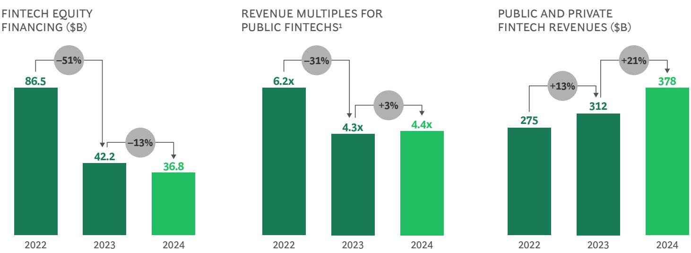  
Sources: S&P Capital IQ; PitchBook; company filings; desktop research; BCG FinTech Control Tower; BCG analysis. 1Average based on market capitalization and last 12 months revenues for each company in the second quarter of each year.

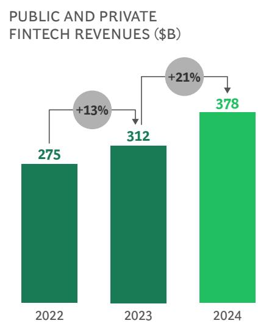

Fintech fundamentals also significantly strengthened in 2024, with revenues growing by a robust 21% year-over-year, compared to 13% in 2023 and 6% for financial services overall. Highlights included growth in the deposits vertical of 23%—driven primarily by challenger banks such as Nubank, Revolut, and Monzo. Revenues for trading and investment fintechs grew 21%, with the resurgence of crypto platforms like Coinbase leading the charge, and the rise of equity markets also proving a boon. Insurance was another strong vertical, primarily driven by service providers and insurance agent/brokers, with growth of 40% overall.

Following on from our key theme in our 2024 report, there was also positive news in terms of profitability, as fintechs continued to shift from a “growth at all costs” mindset to a “profitable growth” approach. (See Exhibit 2.) EBITDA margins improved 4 percentage points to an average of 16%—a 25% increase. Compared to 2023, when less than half of all public fintechs were profitable, fully 69% hit the mark in 2024. And 35% of public fintechs are now above the “rule of 40” threshold (a metric measuring whether the sum of revenue growth (%) and EBITDA margin (%) is greater than 40).

Despite this strengthening in fintech fundamentals and great optimism for the IPO market at the beginning of this year, the current volatility in the macro environment has created uncertainty, with a host of major IPOs now on ice. Many fintechs at the IPO gate are bidding their time, buoyed by an active secondaries market. Nevertheless, the fintech industry is structurally ready for a “spring” and a host of major IPOs. There are 150 fintechs founded before 2016 with at least \$500 million in cumulative equity funding that have not yet gone public, including some of the most well-known names in the sector, such as Stripe, Revolut, PhonePe, and Toss.

"It is hard to read the tea leaves on IPOs. Everyone wants the market to open, but tariffs are roiling the market . . . We really won't know until after the summer. The best candidates are happy and able to sit on the sidelines until there is more certainty."

JAMES LOFTUS
Managing Partner, Paypal Ventures

Fintechs Continue to Shift to a Profitable Growth Mindset

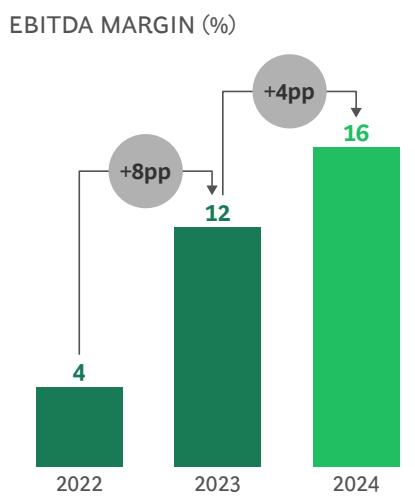

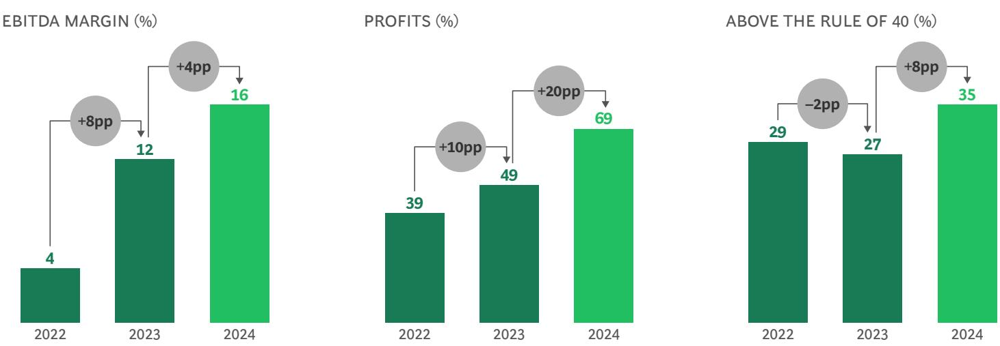

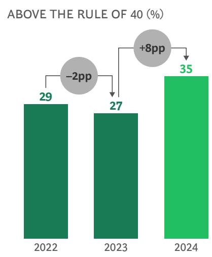  
Sources: S&P Capital IQ; PitchBook; BCG FinTech Control Tower; BCG analysis.
Note: The rule of 40 is a financial metric measuring whether the sum of revenue growth (%) and EBITDA margin (%) is greater than 40.

However, this IPO window will be different from the last, as we expect the capital markets to be much more discriminating, with a sharper focus on sustainable economics, regulatory compliance maturity, and scalability. Examining the relative valuations of public fintechs, we find that 50% of the variation is attributable to forward revenue growth and profitability (consensus EBITDA margin and “rule of 30” premium), and we see no reason why this focus on the fundamentals will change. (See Exhibit 3.) Size (25%) and R&D spend (14%) round out the major factors in public fintech valuation, signaling that scale and innovation also matter to investors.

We also expect an acceleration in M&A activity. Many fintechs—particularly those without a proven and sustainable path to near-term profitability—will struggle to go public and will become potential acquisition targets. Given current macro uncertainty, this trend may accelerate, with struggling fintechs finding it even more challenging to extend their runways.

For stronger fintechs, M&A in the form of consolidation will become a viable path to growth as they seek to leverage their lower cost of capital or gain the scale required for an IPO. Strategic acquisitions to expand product offerings, geographic reach, or internal capabilities will also become levers for stronger fintechs.

As the IPO market eventually thaws and M&A activity picks up, it will create a virtuous loop, with funds being reinvested into the private market, propelling the fintech ecosystem forward once again. Earlier-stage fintechs should also begin to benefit from the \$677 billion in dry powder (unallocated capital that firms have raised but not yet deployed into investments) accumulated by venture capital globally—of which 13% between 2014 and 2024 was allocated to fintechs, on top of approximately \$1.5 trillion in private equity dry powder.

"The fundamentals of fintech are much more stable than market valuations and sentiment . . . Digitally native fintechs continue to be customer centric, more effective at adopting new technologies, and have lower cost structures than incumbent banks."

ANDRES ANAVI
SVP, Mercado Pago

## EXHIBIT 3

Revenue Growth, Size, R&D Spend, and Profitability Drive Variation in Public Fintech Valuations

Relative contribution of the different drivers of valuation among public fintechs (%)

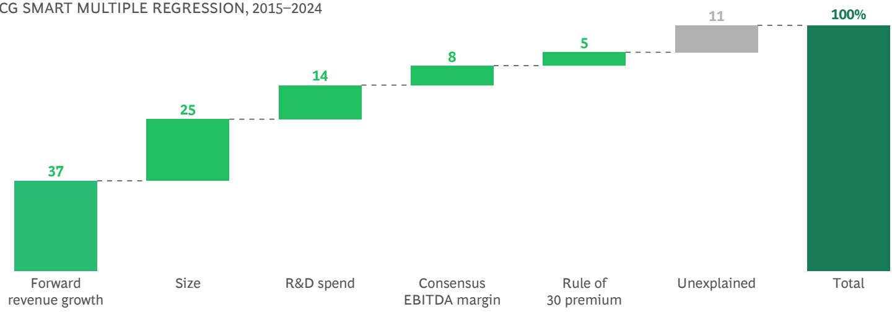  
Sources: S&P Capital IQ; BCG ValueScience Center.  
Note: Outliers removed or normalized. Excludes country factor for peers domiciled in China. The rule of 30 is a financial metric measuring whether the sum of revenue growth (%) and EBITDA margin (%) is greater than 30.

# Fintech Penetration Resembles Swiss Cheese: Plenty of Holes

Scaled fintechs—which we define as those generating more than \$500 million in revenue—account for about \$231 billion out of \$378 billion of global fintech revenues—or roughly 60%.

Out of approximately 37,000 fintechs globally, fewer than 100 meet this threshold. With fintechs capturing only approximately 3% of banking and insurance revenue pools, clearly many holes remain both by vertical and geography (See Exhibit 4.)

To date, success has been largely concentrated in payments, challenger banks, retail crypto trading and brokerage, and buy now pay later (BNPL)/point of sale (POS). (See Exhibit 5.) Payments are the indisputable winner to date, accounting for roughly 55% (or \~\$126 billion) of all scaled fintech revenues in 2024. Within payments specifically, fintechs have had most success scaling in digital wallets (for example, PayPal, WeChat, and Apple Pay) and acquiring and vertical SaaS (Stripe, Adyen, Toast, Shopify, Square). Challenger banks are a distant second, accounting for about 15% (\~\$27 billion) of scaled fintech revenues; notable players include Revolut, Monzo, KakaoBank, Nubank, and Toss. In third place, retail crypto trading and brokerage fintechs—for example, Coinbase and Binance—comprise roughly 7% (\~\$16 billion) of scaled fintech revenues. Finally, while accounting for only about 4% (\~\$8 billion) of scaled fintech revenues today, BNPL/POS lenders are growing at a roughly 42% CAGR and can be seen as the fifth area of success in fintech’s first chapter.

## EXHIBIT 4

# Fintech Penetrates About 3% of Banking and Insurance Revenues but Is Growing Approximately 3x More Quickly

\_ FINTECHS ACCOUNT FOR \~3% OF FINANCIAL SERVICES REVENUES

TOTAL REVENUE, 2024 (\$)

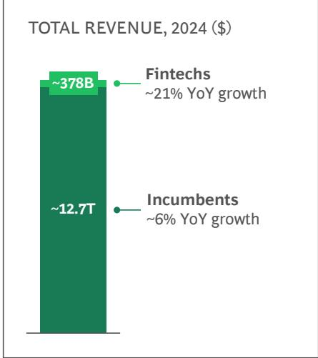  
FINTECH PENETRATION OF INCUMBENT FINANCIAL SERVICES REVENUES, 2024 (\$)

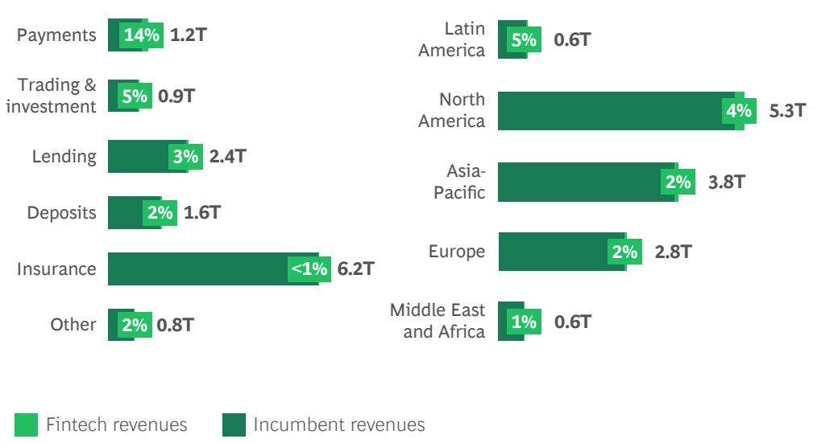  
Sources: BCG Fintech Control Tower; BCG Banking & Insurance Revenue Pools; BCG analysis. Note: Excludes health insurance revenue pools; numbers may not add due to rounding.

Looked at from a competitive perspective, scaled fintechs have won in verticals where these conditions apply:

\- Banks have been uncompetitive. For example, vertical SaaS players addressed an unmet need with better software that enables merchants in sectors like restaurants or retail to run their entire business more efficiently. Similarly, acquirers have enabled merchants to more seamlessly accept payments both on- and offline.

\- Banks have been unwilling to serve. Many fintechs—in particular, challenger banks and BNPL/POS lenders—have found success by focusing on the needs of lower-income consumers. Due to lower unit economics and greater regulatory scrutiny, incumbent banks have struggled to serve this cohort profitably, effectively abdicating the competitive ground.

\- Banks have been unwilling to go. Fintechs have thrived by targeting opportunities where either regulatory risk or strategic constraints limit banks from competing. For example, regulations have made crypto off-limits for banks. Banks have also been unable to make headway in digital wallets, given that the model requires a third party to aggregate different payment methods from various providers.

In other areas, fintechs have struggled to scale. Insurance fintechs have penetrated less than 1% of revenue pools; the high capital requirements to become a full-stack carrier have been the primary challenge here. In wealth management, fintechs have also penetrated less than 1% of the market, largely because banks can typically serve high-net-worth customer segments more profitably than they can serve lower-income segments. As we stated in our 2023 report, fintechs in these verticals remain largely as enablers to incumbents, rather than outright disruptors (although wealth management services for the “mass affluent” is a potential bright spot). Even in verticals where fintechs might be more likely to succeed, like challenger banking, only about 2% of deposit revenue pools have been penetrated, with most revenues coming from fees rather than interest income. And in lending, we see only about 3% penetration, with limited success beyond unsecured personal loans in subprime segments. Evidently, numerous opportunities across many verticals remain for fintechs to further penetrate incumbent revenue pools.

# Scaled Fintechs Are Concentrated in Five Verticals

Revenue distribution of fintechs generating >\$0.5B per year (2024)

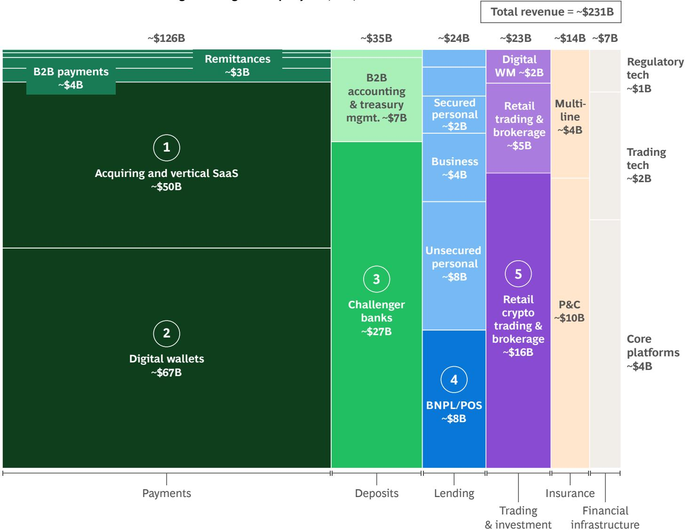  
Sources: S&P Capital IQ; PitchBook; BCG FinTech Control Tower; BCG analysis.  
Note: BNPL = buy now, pay later; POS = point of sale; P&C = property and casualty; WM = wealth management.

## US and China Account for over Two-Thirds of Scaled Fintech Revenues

Looking at where scaled fintechs have succeeded by geography provides another perspective. (See Exhibit 6.) The US accounts for about 52% (or \~\$120 billion) of scaled revenues, thanks to its large addressable market and easy access to capital. Again, payments is king: digital wallet players and acquirers have benefited from a highly consumer-driven market (particularly in e-commerce) and a card-first economy in which both consumers and merchants prioritize seamless acceptance. On the vertical SaaS side, players like Toast and Shopify have tapped into an accessible and fragmented pool of small and medium-size businesses (SMBs) willing to bundle payments into

broader software packages. China, meanwhile, accounts for a further 16% (\~\$38 billion) of scaled fintech revenues, with success also driven by a large addressable market in addition to the rise of “super apps” like WeChat and AliPay, built by Big Tech giants like Tencent and Alibaba.

Success in other geographies is narrower. Europe stands in contrast to the US and China, accounting for only about 8% (\~\$19 billion) of scaled fintech revenues, suggesting that the region's heterogeneity and regulatory regimes have made scaling difficult. Nonetheless, there are a number of scaled successes in challenger banking (for example, Revolut, Starling, and Monzo), remittances (for example, Wise), and BNPL/POS (for example, Klarna). These fintechs have led the charge in Europe by catering to younger consumers seeking superior digital experiences and low foreign exchange fees for traveling.

# Scaled Fintech Revenues Are Concentrated in the US and China

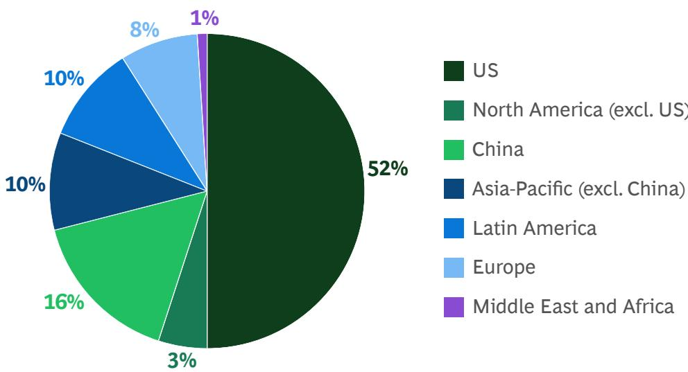  
Sources: BCG Fintech Control Tower; PitchBook; company filings; BCG analysis. Note: Revenues for multiregional fintechs counted in their HQ location.

Asia-Pacific (excluding China) accounts for approximately 10% (\~\$22 billion) of scaled fintech revenues. As in China, super apps in their home markets—including Grab, Toss, PayTM, PhonePe, and GCash—have experienced the most success. The heterogeneity of Asia-Pacific, similarly to Europe, makes scaling across borders difficult. However, unlike Europe, Asia-Pacific includes large markets like India, which are growing rapidly both in terms of population and economic development.

Latin America accounts for about 10% (\~\$22 billion) of scaled fintechs revenues, with players like Nubank succeeding by targeting large un- and underbanked populations and others like Mercado Pago and PagSeguro profiting by facilitating rapid growth in the retail sector.

The Middle East and Africa are still very early in their fintech growth story, accounting for less than 1% (\~\$3 billion) of scaled fintech revenues. Fintechs serving the needs of un- and underbanked consumers through mobile, which is seeing rapid growth in penetration, have gained the most momentum here. Telcos have formed some of the most successful fintech platforms, such as M-PESA and Orange Money.

In many of these regions, proven models from larger markets have also been replicated with some success. For example, in merchant acquiring, the success of Stripe and Adyen has been adapted for local market contexts in regions such as Latin America (for example, StoneCo) and the Middle East and Africa (Flutterwave). Nonetheless, given the variation of penetration by region, many gaps and opportunities also remain when viewed through a geographic lens.

## "The overall market is still underpenetrated by fintechs in the Middle East and Africa, but the demand is there . . . a young, tech-savvy population that is really open to adopting new products. We are seeing the region grow and develop rapidly, with fintechs in the payments and credit space doing well."

ANDREY KAZARINOV
Chief Product Officer, Tabby

# Forecast: Five Trends That Will Shape the Next Chapter in Fintech

With over \$13 trillion in banking and insurance revenues at play, the future looks bright for both established fintechs and those in the next generation.

But success is not a given. Fintechs, investors, and regulators will need to take action to realize the industry's continued promise. We forecast five key trends that will influence the shape, size, and character of the fintech industry in the coming years.

## 1. Agentic AI Will Change the Game . . . Eventually

Great expectations have been raised by AI since its beginnings, particularly following the emergence of GenAI in the last two years. But for all the excitement, many fintechs are still early in the adoption cycle and there has been limited product innovation at scale outside of a few select leaders. Skepticism is a fair response. But while the pace of AI-driven change is often overstated, the transformational impact of this technology should not be.

To date, GenAI in fintech has been largely used to cut costs and boost productivity, with the most common use cases being in software engineering, AML and KYC (know your customer) automation, marketing, and customer support. Many scaled fintechs are still in pilot mode with AI, while others have only just started to move to at-scale deployments. In contrast, earlier-stage fintechs are incorporating the technology more rapidly into the core of their business models, driven in part by investor expectations to do more with less. Indeed, AI-powered fintechs are already raising 15% less equity on average in seed or angel rounds and receiving 49% of total equity funding versus their “fair share” of 23%. And just as fintechs start to incorporate GenAI into their business models, the next phase of the technology is beginning to emerge, with agentic AI.

The Next Phase: Agentic AI. Just as fintechs start to incorporate GenAI into their business models, the next phase of the technology is beginning to emerge—agentic AI. Agentic AI acts autonomously, unlike current iterations of GenAI, which require continuous prompting. Based on rapid advances in large language model (LLM) capabilities over the past two years, this emergent technology moves beyond “copilot” role to agents that act, execute, learn, and adapt on behalf of users.

What does this mean in practical terms? As with all new technologies, initial uses will be basic. To start, human input will be prevalent. Then, as the technology matures, multiple agents will work together with limited user prompting. We are still a way off from this scenario, but the target state will represent a fundamentally different way of doing financial services. (See Exhibit 7).

## EXHIBIT 7

## Example Agentic AI Use Cases in Financial Services

Proactive financial agents monitor a customer's income, behavior, and goals, then take actions like auto-moving funds and adjusting savings goals

Goal-driven portfolio agents monitor the market, rebalance portfolios, and execute trades and align allocations with changing client objectives

Self-executing payment agents manage recurring billing, issue virtual cards, initiate payments, and automatically route transactions for cost optimization

Risk management agents
monitor liquidity, detect anomalies, reallocate capital, and adjust margin or collateral positions in real time

Full-stack lending agents assess creditworthiness, preapprove loans, generate offers, collect documents, and proactively adjust repayment terms if risk changes

Source: BCG analysis.

If we compare the current landscape with the first chapter of fintech, which was powered by seminal technologies like the internet and mobile, we can foresee how agentic AI can accelerate its key trends:

\- From Democratization of Access to Intelligence. If fintech's first chapter broke down barriers to financial access—obviating the need to visit branches or even to speak to a banker directly—agentic AI can move past the limitations of human bandwidth by gathering data, comparing options, and ultimately acting on our behalf. Consider the total volume of deposits held in low-yield savings accounts: in the future, AI agents could do the work of finding the highest-yielding account and, crucially, set up and move funds into the new account on the user's behalf on a continuous basis. This scenario could lead to the erosion of large banking profit pools that are currently reliant on customer inertia.

\- Shift from Automation to Autonomy. The shift to cloud-based software has enabled fintechs to automate a host of manual, slow, and costly processes. But despite clear improvements, many of those processes still require significant human intervention at certain stages, such as approving transactions or adjusting portfolios. Agentic AI will significantly reduce the need for human input. For instance, vertical SaaS platforms could leverage AI agents to autonomously manage much of their customers' business. Working in concert with humans in the loop where they add value, multiple AI agents could monitor inventory, negotiate with suppliers, arrange financing, and even place orders.

## - Shift from Personalization to Hyper-

Personalization. Personalization is one of the hallmarks of the first chapter of fintech, and an advanced level of customization has become the norm. Agentic AI will take this a step further. For example, instead of receiving standard budget insights from a financial app, an AI-powered financial agent could automatically adjust spending limits based on real-time income, recommend tailored investment strategies, and optimize cash flow—all while taking economic conditions and the user’s financial goals into consideration.

How Will Fintechs Leverage Agentic AI? The most immediate and transformative impact of agentic AI will be felt within software development teams. Many early-stage fintechs are already outpacing their scaled peers by leveraging agentic coding tools such as Cursor and Windsurf to develop code far more rapidly. This will enable them to launch new products and features faster and at significantly lower cost. While some large players are already using these tools, many more trail behind, potentially shifting the competitive landscape in the years ahead.

Beyond software development, agentic AI is also poised to drive innovation in three domains:

\- Commerce. Online aggregators and marketplaces have become commonplace ways to shop, enabling easy price comparison and embedding options for financing and payment into the checkout experience. Agentic AI promises to accelerate this dynamic, helping consumers find relevant products based on their preferences, shopping history, and pricing parameters—and even executing payments on the user’s behalf. Nonetheless, the agent’s role in the purchase journey will vary depending on factors such as purchase risk and complexity. For some use cases (for example, food delivery), consumers may be more willing for agents to research, compare, and purchase. For others (for example, high-end jewelry), they may be more limited to the discovery phase. (See Spotlight 1.)

\- Vertical SaaS. B2B still labors under complex and costly workflows such as accounts payable/receivable, taxes, and payroll. While vertical SaaS has automated many of these processes, agentic AI-driven SaaS platforms could significantly reduce the need for human input, affording a huge productivity boost for many businesses.

\- Personal Financial Management. Budgeting applications and robo advisors have brought low-cost wealth management services to a broader segment of the population. However, these services have lacked the ability to tailor offerings to each user. Agentic AI could change this by delivering the kind of service currently reserved for high-net-worth clients to the mass market.

"The convergence of open banking and AI will lead to amazing use cases for consumers. Currently, managing your financial life requires staying on top of thousands of little things. In the future, anyone will be able to connect their account to an AI agent that will help drive their wealth management for them. This will be a game-changer for millions of people."

ERIC SAGER
COO, Plaid

# Agentic AI in Payments: Perplexity and Stripe

Perplexity is the first company to launch an AI shopping agent for paying customers in the US. It can help users browse multiple retail websites, find and compare products based on specific parameters, and even complete the purchase directly.

This can all be done inline from the AI prompt search results—users need only type or speak simple commands for the AI agent to begin executing the task. Stripe provides Perplexity’s AI agent with a one-time virtual card for online payments with capped spending limits—avoiding the need to access the user’s bank account.

"We've seen a generational leap in AI over the past year, and AI companies are now following a familiar trajectory—one we've seen play out on Stripe over the past decade—just like SaaS, marketplaces, and platforms before them. They start broad and horizontal, then go deep and vertical. We're shifting from general-purpose tools to specialized, industry-specific applications. Some call these ‘LLM wrappers,’ but that misses the point. By embedding the right context, data, and workflows, these vertical apps are where real economic impact starts."

EMILY SANDS
Head of Information, Stripe

Challenges for Agentic AI. Despite its enormous potential, there are several significant challenges that need to be overcome if agentic AI is going to scale—and scale safely—in financial services:

\- Regulatory and Compliance. Current regulatory and governance frameworks are designed with human actors and institutions in mind—with clearly delineated liabilities. With AI agents, serious questions arise regarding authentication, fraud prevention, and liability. This is not an abstract concern: criminals are already using GenAI to carry out sophisticated financial fraud. Licensing presents other issues; for example, does an AI agent need regulatory approval to offer advice or make investment decisions? Complex questions like this will need to be addressed in order to reap the benefits of agentic AI in financial services.

\- Infrastructure. To fulfil their promise, AI agents will need the freedom and access to operate across silos. In financial services, data is fragmented, held by banks, insurers, Big Tech, credit bureaus, fintechs, and more, all of which will require integration if agentic AI is to fully deliver on its promise. We thus expect agentic AI to emerge soonest and most consistently in markets where open banking has taken hold (for example, the UK, Brazil, and Singapore).

Privacy and Data Security. Financial data is among the most sensitive kinds of information—breaches can be devastating for all involved. For agentic AI to develop, data shared with third parties must be secure, and there must be clear, codified rules concerning what can and cannot be done with it. This is where regulators will need to provide clarity and guidance.

Given these challenges, the use of agentic AI in financial services may lag other sectors of the economy. Nonetheless, we are already beginning to see its transformational potential in software development, particularly for earlier-stage, AI-native fintechs. While adoption of GenAI tools has been slow for many existing scaled fintechs, this technology is about more than just productivity gains. In the years ahead, we expect this seminal technology to create a level of product innovation akin to the internet and mobile in financial services.

## 2. Onchain Finance Has Promise, but Hurdles Remain

Despite years of promise, onchain finance—financial activities and transactions performed on blockchain—hasn’t yet achieved product market fit at the scale needed to truly disrupt traditional financial infrastructure. However, recent advancements in blockchain scalability and growing regulatory clarity suggest an inflection point is near. Major deals like Stripe’s acquisition of Bridge (\$1.1 billion) and Ripple’s purchase of Hidden Road (\$1.3 billion), along with US ambitions to become a crypto powerhouse and Europe’s implementation of the Markets in Crypto-Assets (MiCA) regulation, underscore this momentum. The crucial next step is to find tipping-point use cases, triggering the network effects needed to initiate a material shift. (See Exhibit 8.)

Stablecoins: What's the Use Case? To date, the primary use cases for stablecoins have been crypto-trading and decentralized finance, but consistent growth in sending wallet addresses, despite crypto market volatility, indicates that stablecoin use is starting to decouple from crypto-native activity. So far, the most evident use case has been as a store of value in high-inflation markets with stronger demand than supply for US dollars due to limited reserves and exchange restrictions. In this context, US dollar-pegged stablecoins ( $>98\%$ of all stablecoins) provide unrestricted access to a global pool of US dollar liquidity— making it cheaper and easier for consumers and SMBs to hold dollars, particularly relative to cash. This helps explain the rapid adoption of stablecoins in high-inflation markets. In Turkey, for example, stablecoin purchases accounted for $4.3\%$ of the country's GDP in the year leading up to March 2024, according to Chainalysis.

In some markets, there is an open question about how sustainable this use case is given the potential for currency substitution. For example, India's Reserve Bank has expressed strong opposition to stablecoins, citing risk to the sovereignty of the Indian rupee. Given that markets with greater than $10\%$ inflation represent a little over $7\%$ of global GDP, while there is evidently strong demand in these markets to access the US dollar, this use case alone is unlikely to be the tipping point needed for wider onchain finance adoption.

## EXHIBIT 8

## Potential Inflection Point Ahead for Onchain Finance

## Required Enablers

Technological scalability

Regulatory clarity

  
Source: BCG analysis.
Note: CBDC = central bank digital currency.

Tipping point use cases

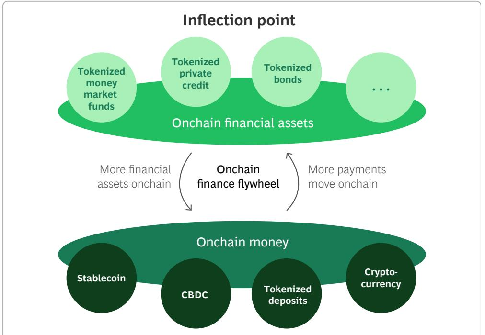

Stablecoins in Payments. The other major use cases for stablecoins are in payments, primarily for merchant acceptance and cross-border payments. For domestic merchant acceptance, they promise greater speed and lower transaction costs. In many markets, where alternative payment methods such as Pix or UPI have not materialized, stablecoins represent a new payment rail unburdened by legacy technology and scheme rules. In markets where credit cards are more entrenched as part of the commerce ecosystem, however, broad-based adoption may prove more challenging. For example, in the US, alternative payment methods such as account-to-account have faced headwinds from consumers who value benefits such as chargeback and fraud protection and cashback rewards, as well as limited adoption from mega merchants that aggressively negotiate down merchant discount rates. Fintechs will therefore need to find ways to incentivize adoption in these markets—one example is PayPal's rewards program, which currently offers a 3.7% annual rewards rate for holders of its PYUSD stablecoin.

For cross-border payments, the value of stablecoins is much more evident and material. In many corridors, particularly those to and from the Global South, $^{1}$ correspondent banks add significant friction and cost. These banks often add \$10 to \$50 in fees to a cross-border payment, which can represent a significant portion of a low-value remittance. And while SWIFT has been investing in speeding up settlement times, with SWIFT gpi settling payments in many of the top routes between Global North countries within minutes or even seconds, there are still regions—including large parts of Africa, Latin America, and Central Asia—where funds can take days to arrive, compounded by banking hour cut-off times. While fintechs such as Wise and Remitly have built their own closed-loop infrastructure using pre-funded accounts to remove these pain points for consumers and SMBs, payment rails built on top of stablecoins could enable remittance fintechs to build and operate this infrastructure at lower cost. We are already seeing the emergence of stablecoin-native remittance fintechs such as Cedar Money and Sling Money.

Nonetheless, two key challenges remain for stablecoins in cross-border payments. Firstly, converting stablecoins into and out of fiat, particularly in less liquid currencies, can be expensive and reintroduce settlement delays. Fiat forex is the most liquid market in the world; the Bank for International Settlements estimates it at over \$7.5 trillion in daily average trading volume compared to approximately \$0.1 trillion for stablecoins. Secondly, despite growing regulatory clarity, there is still work to do to scale the AML and KYC infrastructure needed for stablecoin payments, including identifying the ultimate beneficial owners of wallet addresses. This is crucial to see broader adoption by the banking ecosystem. If these two challenges can be overcome, stablecoins have the potential to become a key part of the cross-border payment mix, filling in the gaps where existing cross-border payments infrastructure is slow and costly. In 2024, according to BCG's global payments model, cross-border payment flows in the Global South represented \$14 trillion out of an approximate total of \$1,637 trillion in global payment volume, domestic and cross-border. While the imperatives of quicker and cheaper cross-border payments will only grow as domestic real-time payments become the norm, it will clearly take more than just stablecoins in cross-border payments to trigger a wider, monumental shift toward onchain finance.

Asset Tokenization Can Be Bigger Than Stablecoins. The tokenization of assets, including financial assets such as bonds and equities, has the potential to be bigger than stablecoins. Although total tokenized volume of assets is small today at about \$600 billion, since early 2023 it has been growing at a double-digit CAGR and could represent the next transformation of capital markets.

“Slow cross-border payments cause a lot of friction and pain. If you were building a banking system today, it would not use correspondent banking—it would probably be built on something like stablecoins.”

DANIEL VOGEL
CEO, Bitso

To date, most of the demand for traditional onchain financial assets has come from virtual asset owners. BlackRock and Franklin Templeton, for example, have both introduced tokenized money market funds to offer virtual asset owners a yield-bearing vehicle in which to park their liquid assets. Combined, the size of these funds has reached about \$3 billion assets under management in a little over two years. However, the promise of asset tokenization goes well beyond serving just this demand. It has the potential to address cumbersome and costly frictions in financial infrastructure, bringing equity market-like efficiency to more illiquid assets such as corporate bonds, private credit, private equity, and real estate. (See Exhibit 9.) Tokenization can alleviate three key pain points:

\- Intermediary Costs. Between issuer and investor, there are typically a host of intermediaries involved in trading, settlement, custody, and asset servicing. These intermediaries add cost through tasks such as manual record-keeping, reconciliation, and processing. A core benefit of asset tokenization is the ability to automate away much of this work and associated costs through smart contracts (sets of instructions coded into tokens issued on a blockchain that can self-execute under specific conditions). We estimate that approximately \$20 billion dollars in intermediary costs could be saved annually across all asset classes through tokenization.

\- Slow Settlement Times. Intermediaries add not only cost but also friction, slowing settlement times as assets move across multiple parties and ledgers. Tokenization promises flexible, instant, 24/7/365 settlement. This has the double benefit of enhancing liquidity, as investors can transfer assets quicker, as well as freeing up potentially trillions of dollars in collateral that financial institutions set aside to mitigate counterparty credit risk during settlement.

\- High Investment Thresholds. Given the high costs associated with current processes, fractionalizing illiquid assets has limited viability, which excludes retail investors from many of these markets. For example, many private equity funds have minimum investment thresholds in the millions of dollars. By fractionalizing ownership of these assets and streamlining processes, tokenization could lower barriers to entry for a new swathe of retail investors, democratizing access and bringing further liquidity to these markets.

## EXHIBIT 9

Viability of Tokenization Varies Significantly by Asset Class  
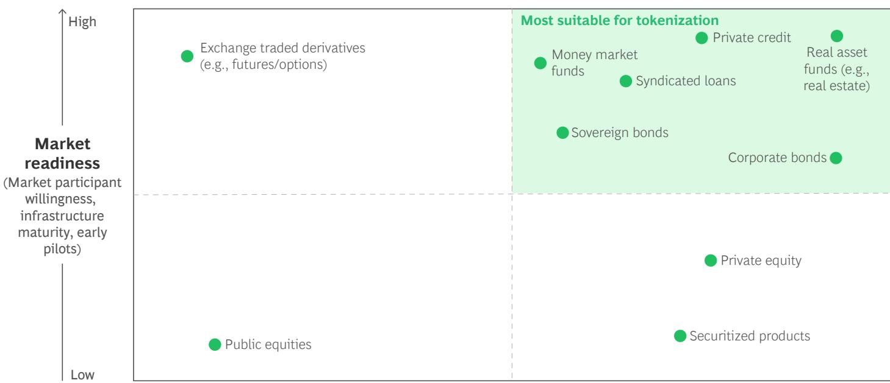  
Source: Adapted from GFMA, BCG, Clifford Chance, and Cravath, "Impact of Distributed Ledger Technology in Global Capital Markets," May 2023.

What Will Enable Onchain Finance to Take Off? Despite the promise of asset tokenization, hurdles remain. Transitioning from pilot projects to large-scale deployments in onchain finance hinges on four conditions: enhanced regulatory clarity, unified standards, bank-grade infrastructure, and a critical mass of early adopters for network effects to take root.

Progress toward regulatory clarity is already underway. Switzerland set a precedent with its comprehensive DLT Act in 2021, establishing a robust legal foundation for distributed ledger technology securities. France has also taken significant steps, being among the first countries to permit blockchain-based fund units and tokenized debt instruments. Similarly, Singapore has positioned itself as innovation-friendly by enabling asset tokenization pilots, notably for bonds, within its regulatory sandbox. In contrast, the US currently lacks a comprehensive regulatory framework tailored explicitly for security tokenization, presenting a challenge given the size of its asset pools.

Addressing fragmented data standards and inconsistent legal definitions is another essential building block. Institutional adoption will require industrywide collaboration to establish unified standards. Regulators like the US Commodity Futures Trading Commission have made progress here, with central utilities like DTCC, Clearstream, and Euroclear also working to harmonize standards across borders.

Building interoperable, institutional-grade infrastructure is another crucial prerequisite, and it represents a significant opportunity for fintechs. Financial institutions require infrastructure capable of securely and seamlessly moving assets across various blockchains.

The final, and arguably most important, enabler for onchain finance is having a critical mass of early adopters moving the highest-priority illiquid assets, such as bonds and syndicated loans, onchain. This will require the largest financial institutions to move first to build scale and network effects, which will lower the switching costs for subsequent adopters. These institutions have already set in motion multiple pilots and real-world use cases that will require scaling up in the coming years. For example, Goldman Sachs's Digital Assets Platform (GS DAP) successfully issued a €100 million European Investment Bank bond, while Clearstream's D7 platform has handled €10 billion worth of tokenized bonds. JPMorgan's Kinexys platform has also brought greater intraday liquidity by tokenizing repo transactions.

The size of these asset pools runs into the hundreds of trillions globally across money market funds, bonds, real estate, private credit, funds, and other alternative investments. If the hurdles can be successfully addressed, this could prove to be the tipping point use case for onchain finance. As these pools of assets move onchain, payments would follow as the natural settlement mechanism—in the form of either stablecoins, tokenized deposits, or central bank digital currencies (CBDCs)—setting the flywheel in motion. (See Spotlight 2.) This could enable onchain finance to finally start realizing its long-held promise to transform the world’s financial infrastructure.

## 3. Challenger Banks: Product and Customer Segment Expansion Have Higher Odds of Success Than Going Global

Challenger banks, once emerging disruptors, have solidified their position within the global banking ecosystem, especially in major markets like Brazil, the UK, South Korea, and China. In each of these markets, challenger banks account for more than 10% of total bank market capitalization. With Revolut and Nubank reporting revenue growth in 2024 of 72% and 58%, respectively, it is clear that challenger banks can no longer be dismissed as inconsequential.

Of course, not all challenger banks are thriving. As of Q1 2025, 92 out of 650 global challenger banks are profitable, with only 24 generating revenues above \$500 million annually. Notably, these 24 are experiencing robust annual revenue growth of around 59%, significantly outperforming the 26% growth rate of their smaller peers. Given the slowing growth rate in new challenger banks—dropping to 8% annually over the last five years (2019–2024) from 28% in the previous five years (2014–2018)—we expect consolidation around a smaller group of scaled leaders.

Despite their scale relative to other fintechs, these leaders still have significant white space to expand into—only 2% of banking deposit revenue pools have been penetrated. As they look for ways to sustain their rapid growth and further disrupt traditional retail banks, we expect challenger banks to focus on four strategies in the coming years: diversifying beyond fee income, growing average deposit balances, moving into more affluent customer segments, and expanding into new geographic markets.

Diversifying Beyond Fee Income. Today, challenger banks typically generate 60-80% of their revenues through fee-based products, starkly higher than the 20%-40% for traditional retail banks. As the leaders seek to sustain growth, we expect them to expand their product suites to generate more spread-based income; credit cards, personal loans, mortgages, and even SMB lending facilities will emerge as offerings. Some challenger banks have already made progress here; for example, Monzo generated about 51% of its revenue from net interest income (less credit losses) in 2024 compared to just 18% in 2022.

# European DLT Trials with CBDCs

As more economic activity moves onchain, stablecoins are not the only option for settlement—a compelling alternative is central bank digital currencies (CBDCs), which can avoid dollarization and by design have greater regulatory oversight. The EU has been a trailblazer in this space with several live trials settling with central bank money.

In November 2024, the European Investment Bank issued a €100 million bond on HSBC's Orion platform that used Banque de France's experimental wholesale CBDC to settle. Société Générale also entered into a repurchasing agreement with Banque de France in December 2024, using a bond on the Ethereum blockchain as collateral and the CBDC for settlement.

While still nascent, these early successes by large institutions indicate the possibility of asset tokenization bringing more forms of money, such as CBDCs and stablecoins, onchain.

Growing Average Deposit Balances. One metric keeping challenger banks firmly in the “challenger” category is average deposit balance. Many of these attackers have impressive user numbers, but the per-user deposit figures heavily favor incumbents: the average challenger bank deposit balance is \$970 globally, compared to traditional retail banks, where the average balance stands at around \$15,000. This disparity suggests that consumers still trust and favor incumbents for large deposits, often relegating challengers to spending or secondary account status. Another reason is that challenger banks have typically targeted lower-income and younger demographics to date. Some challenger banks will continue to build their business models around being the secondary account; many others will increase efforts to get customers to choose them as their primary account—and grow their average deposit balance. For example, Chime is now offering a premium tier for users who direct deposit into their Chime account. Ultimately, as the leading challengers continue to scale and build trust, average deposit balances will grow. Indeed, challenger banks are seeing deposit growth of 37% per year, 29 percentage points higher than traditional retail banks. (See Exhibit 10.)

Targeting More Affluent Customer Segments. The income that challenger banks generate today typically has lower margins and is derived from sources such as interchange. We expect these banks to start targeting more affluent customers, a segment where margins—even on fee-based income—are often higher and where average deposit balances are greater. The most visible example of a challenger bank pursuing this strategy is Revolut. With 72% of its income fee-based in 2024, it is reportedly in the early stages of a push to target wealthier clients with a move into private banking and the launch of a rewards-based credit card. $^{2}$

Expanding into New Geographic Markets. Several challenger banks also plan to sustain or accelerate their growth by expanding internationally. Revolut, for example, is expanding in Mexico, South Africa, and India, among others, while Bunq and Nubank are reportedly looking at entering the US market. South Korea's KakaoBank, meanwhile, is seeking a license in Thailand.

Historically, global expansion has proven difficult, even for traditional banking giants such as Citi. (See Spotlight 3.) Yet challenger banks possess some advantages over incumbents in this scenario, including leaner operating models, cloud-native technology stacks, and digital-first customer engagement strategies.

## EXHIBIT 10

Challenger Banks' Average Deposits Are Lower, but Growing Faster Than Traditional Retail Banks

Estimated average deposit balances by region, traditional retail banks vs. challengers, 2024

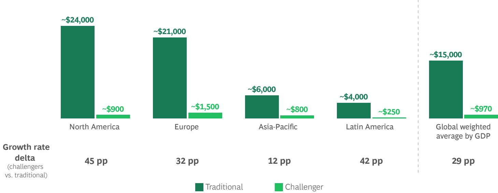

Sources: European Central Bank; FDIC; OECD; RBI; Helgi Library; BCG FinTech Control Tower; BCG analysis. Note: Challenger banks that have reached profitability and have revenues >\$500m have been considered. Africa, Middle East, and Oceania don't yet meet this criterion.

2. Tom Matsuda, “Revolut to Take On American Express with Move into Reward Credit Cards,” Sifted, April 14, 2025.

## Chase Sees Success in the UK

Launched in 2021, Chase UK marked JPMorgan Chase's first retail banking operation outside the US. It is a completely digital offering that, combined with leading customer service and the strength of the Chase brand, has enabled the bank to grow rapidly. So far, it has attracted about £15 billion in deposits and more than 2 million customers, implying an average deposit balance of roughly £7,500 versus Monzo's implied average deposit balance of about £1,200. While not yet profitable, Chase has stated it expects to generate a profit in 2025.

However, it has also been attracting new customers with 1% universal cash back. Given average interchange rates in the UK of roughly 0.3%, it is not clear that this is a sustainable customer acquisition strategy. Indeed, in April, Chase UK began restricting the purchases cardholders can earn 1% cashback on. With plans to expand into Germany, it will be interesting to see if Chase can replicate its success in the UK so far.

## Chase Leads the UK Market for Customer Satisfaction

Likelihood of customers recommending their deposit account provider to friends or family (%)  
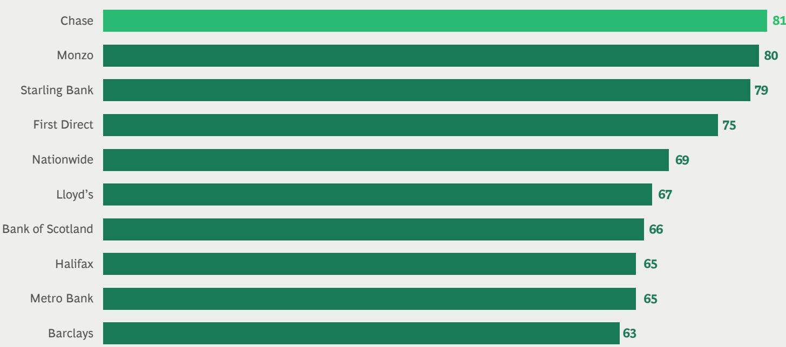  
Sources: Ipsos UK Personal Banking service quality survey, February 2025; BCG analysis.

But there are also reasons to be skeptical, including previous failures. N26 and Monzo each entered and then exited the US market; Revolut tried to make a run in Canada, only to exit in 2021. One of the most significant barriers to international expansion is navigating diverse regulatory frameworks and adapting to local market requirements, a particularly cumbersome and complex challenge for banks. And there is little evidence to suggest this barrier has lowered.

But perhaps the biggest challenge is competition, now more intense than ever. In many markets, traditional retail banks have invested significantly in their digital experiences in the last decade to keep pace with challenger banks. Added to this, there are now a host of scaled challenger banks that themselves represent competition to new entrants; for example, Nubank in Brazil or Monzo, Starling, and Revolut in the UK. And in many markets, digital wallets with large customer bases can now act as pseudo-bank accounts, given their array of offerings, including lending; PhonePe and Paytm in India, and WeChat in China, are examples.

The US as a potential target market exemplifies these challenges. It is quite clear why many challenger banks are eyeing it as an expansion opportunity. It has an adult population of 260 million and high interchange fees (averaging 1.5% vs. 0.4% globally, according to BCG's global payments model). But there are entrenched competitors: behemoth incumbents like Chase; domestic challengers like Chime, Current, SoFi, and Albert; and wallets acting as pseudo-banking apps like CashApp and Venmo. And now other fintech giants like Robinhood are pursuing banking charters. Combine this competition with an entrenched credit card culture that depends on expensive sign-up incentives and rewards rates to acquire new customers (rewards as a percentage of receivables have grown to about 6% in the US versus roughly 4.5% a decade ago), a low unbanked rate of approximately 4%, and a complex regulatory environment—with only six new federal banking charters added on average annually since 2010—and successful market entry appears a daunting task.

While international expansion may well prove difficult for challenger banks, the overall story remains bright for this vertical. There is still ample white space for the leading challenger banks to sustain their rapid growth rates in domestic markets and further entrench themselves as part of the banking landscape, including opportunities to continue growing increasing average deposit balances and diversify into spread-based and higher-margin products.

## 4. Fintech Lending: New Tailwinds, but the Model Remains Untested Through a Credit Cycle

Lending remains a significant opportunity for fintechs, given that they have only penetrated about 3% of the \$2 trillion in global lending revenues. We estimate that there is approximately \$500 billion in outstanding loan balances originated by fintechs globally. For comparison, in the US alone, according to the Federal Reserve Bank of New York, household debt stands at \$18 trillion.

Where fintechs have made inroads in lending, they have seen success only under specific conditions. For example, scaled fintech lenders in China (like Lufax, Ant, WeBank) tend to be part of large conglomerates with massive balance sheets. In North America and Europe, monoline lenders (for example, SoFi and Lending Club) are relatively rare and focus primarily on personal unsecured loans. Vertical SaaS players are offering embedded lending facilities, but it remains a proportionally small revenue stream. A notable exception is BNPL players like Affirm and Klarna, which have been scaling rapidly. Nonetheless, outside of personal unsecured consumer lending, fintech penetration remains less than 1% in other domains such as secured loans and business loans.

This relative lack of penetration in lending is driven in large part by the competitive advantages banks hold: access to low-cost funding via deposits and the ability to leverage these deposits through fractional reserve banking. For fintechs, becoming a depository institution is difficult and costly—not a viable option for a sub-scale entity. This leaves fintech lenders with three options: use of equity capital—feasible in the very earliest stages but not scalable; securitization—which can work well but can also be a slow and inflexible funding source; and bank partnerships, which compress unit economics and can also present challenges when moving into riskier lending segments.

Banks have the added advantages of vast pools of seasoned customer data and a long history of lending activity they can use to optimize their underwriting models. Taken together, it is difficult for fintech lenders to compete, despite their evident ability to acquire customers and originate loans. The challenge is often compounded by the fact that venture capital investors can lack the patience needed to grow lending books while maintaining credit quality.

## The Growing Role of Private Credit Funds in Fintech.

Despite these challenges, the growing trend of private credit funds partnering with fintech lenders is presenting new opportunities. Private credit fund assets under management have reached \$1.7 trillion and has been growing at a 20% CAGR over the last five years, according to Prequin, with the largest funds like Blackstone, Apollo, and KKR now managing hundreds of billions in credit assets. Since the global financial crisis, regulators have required banks to lower risk and increase reserves. Private credit funds have filled the void, shifting the risk from depositors to investors—largely institutional capital (particularly insurance firms) seeking higher-yield fixed income. These private credit funds are highly sophisticated managers of capital, seeking out opportunities for higher returns by structuring more complex or idiosyncratic deals other capital allocators are unwilling or unable to take on.

Partnering with fintechs, which now originate billions of dollars in loans every year, represents one such attractive opportunity for private credit funds. For example, SoFi agreed to a \$2 billion deal with Fortress Investment Group in October 2024, followed by a \$4 billion deal with Blue Owl Capital in March 2025. Similar large deals have been seen in Europe. In June 2024, KKR announced its purchase of €40 billion of European BNPL loans; three months later, Klarna sold £30 billion of its portfolio to Elliot Management. Pagaya has been another active participant in this trend, with a \$2.4 billion forward flow agreement with Blue Owl Capital announced in February of 2025.

"Private credit is the great fuel of growth in the economy in the future, both in fintech lending market and the economy more broadly. It offers greater stability than shorter-term deposit funding, and these funds typically have better risk-adjusted pricing."

GAL KRUBINER
CEO, Pagaya

Secular Tailwinds for Fintech Lenders. As fintechs continue to prioritize deepening customer relationships and growing lifetime value, we expect to see them increasingly add lending to their product portfolio. As incumbents have long recognized, lending is high-margin business and generates customer stickiness. We have already started to observe this with acquirers, vertical SaaS players, and challenger banks expanding their product offerings to include merchant cash advances, credit cards, and personal loans.

Some of these scaled players, particularly in the US, may take advantage of a renewed push from policymakers to make it easier to gain bank charters. This would provide access to yet another source of funding in the form of customer deposits, against which they could lend. While this would add complexity, the improvement in unit economics and decreased reliance on a third parties could justify the business case for scaled fintechs.

In addition, as fintechs' lending matures, so does the customer data used to underwrite the loans they originate. Having been through a period of elevated interest rates in many markets in the last three years, fintechs (and their investors) are increasingly confident in their underwriting capabilities, which serves as a further tailwind. However, perhaps the strongest tailwind for fintech lenders in the coming years could be declining interest rates, which would serve to boost demand for credit from all segments.

"One of the reasons SMB lending for fintechs has been difficult is the lack of quality data needed to underwrite effectively. Most models still typically rely on the credit score of the owner. Getting this right can help drive more B2B lending."

HANY FAM
CEO, Markaaz

Implications for the Fintech Lending Market. The confluence of these tailwinds will impact the fintech lending ecosystem in two ways:

\- Growth in Fintech Lending's Market Share. We expect partnerships with private credit funds to enable fintechs to double down on their competitive advantage in customer acquisition. With a more stable source of funding (even more so than shorter-term deposits), fintechs will be able to make the originate-to-distribute model work more efficiently.

\- Growth in Overall Lending Market. We also expect fintechs to leverage their strength in reaching underserved customer segments, tapping into unmet demand. (See Spotlight 4.) This is particularly likely in subprime segments and SMB lending, where the volume and return profiles better satisfy the return profiles of private credit funds. Nonetheless, as private credit funds continue to expand in size, their cost of capital and return expectations should also continue to decline. This may make them an increasingly viable funding source for more prime segments as well.

For private credit funds themselves, this is a significant opportunity. We estimate that current total fintech-originated loan volume breaks down to \$370 billion in the consumer segment and \$130 billion in the business segment—nearly all SMBs. Of the roughly \$500 billion in outstanding fintech-originated loans, we estimate that \$320 billion is addressable by private credit funds, filtering for return expectations and regional variations in private credit maturity and accessibility, as well as the competitiveness of other sources of funding. Removing existing announced deals, which represent approximately \$40 billion in annual origination volume, leaves a roughly \$280 billion white-space opportunity for private credit funds today, a number we only expect to grow over the coming years. (See Exhibit 11.)

Despite these tailwinds, it is important to note that very few fintech lenders have truly weathered a complete credit cycle; in that sense, the industry is still untested. It is impossible to predict when this may happen, and until it does, some investors will remain wary of the fintech lending model.

## Lending in India

Consumer demand for credit is increasing rapidly in India, driven by robust macroeconomic growth and changing cultural attitudes toward debt. Demand shows no sign of abating: India's affluent middle class, currently $31\%$ of the population, is projected to grow to $40\%$ , or 600 million, by 2031.

Secured credit is unlikely to meet this demand in full, given that many households are in the early stages of the asset formation cycle and lack collateral. Today, only 65% of India’s personal bank credit is secured, compared to 90% in the US. Fortunately, India’s robust credit bureau data ecosystem has enabled unsecured lending to thrive in recent years. Fintech-driven digital lending has played a key role in expanding access to credit, growing at 35% CAGR over the last 11 years. Fintechs such as Paytm and

LendingKart are leveraging alternative data and India's open banking Account Aggregator framework to offer loans to borrowers with no or thin credit histories. Others such as OneCard are simplifying access to unsecured revolving credit, in a market where only 45 million Indians hold credit cards despite the country's over 2 billion bank accounts.

Recently, regulators have become concerned about the accompanying growth in nonperforming loans. Since late 2023, the Reserve Bank of India's measures to increase capital reserve requirements on lenders have slowed unsecured lending growth to $12\%$ between 2023 and 2024 (down from $24\%$ between 2021 and 2023). Despite this decline, demand for unsecured credit remains; fintech lenders can continue to play a key role in expanding financial inclusion if they are able to grow their originations without sacrificing credit quality.

## Secured Lending as Proportion of GDP Lags in India

Outstanding retail debt as a proportion of nominal GDP, 2024 (%)

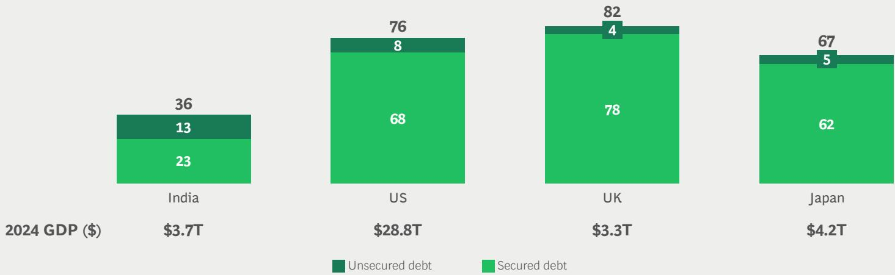  
Sources: Federal Reserve; Reserve Bank of India; UK Parliament; OECD; BCG analysis.

# Private Credit Funds Have a Roughly \$280 Billion Whitespace Opportunity in Fintech

Total outstanding fintech-originated loan balances
GLOBAL MARKET, 2024

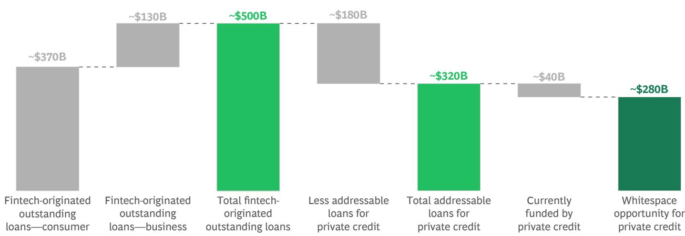  
Sources: S&P Capital IQ; US Federal Reserve; BCG Fintech Control Tower; BCG analysis.

## 5. Emerging Fintechs to Drive Future Fintech Growth in B2B(2X), Financial Infrastructure, and Lending

In the first chapter of the fintech story, successful fintechs scaled in digital wallets, acquiring and vertical SaaS, challenger banking, retail crypto trading and brokerage, and BNPL/POS lending. (See Exhibit 12.) While there is still room for a handful of players to scale in these verticals, it will be increasingly difficult to displace the established winners, as they deepen their market position through M&A and expand into adjacencies.

Three key indicators can help us narrow down where the scaled winners of tomorrow may emerge from: the distribution of scaling fintechs in the \$50 million to \$500 million revenue range by vertical; the allocation of equity investments in the last three years by vertical; and an assessment of where major customer and business pain points remain. Against this backdrop, we expect the following verticals to give rise to significant fintech growth in the coming years:

\- B2B(2X) accounts for 39% of fintech revenues in the \$50 million to \$500 million range. So far, consumers and retail SMBs have been the primary beneficiaries of fintech innovation; however, pain points for businesses of all sizes remain. This is particularly the case in B2B payments and accounting and treasury management, where workflows can still be manual, costly, and slow. Emerging scaling fintechs such as Brex, Ramp, Pleo, Rippling, and Payhawk help automate and solve many of these pain points. GenAI, and eventually agentic AI, should enable these fintechs to go further and faster in their product innovation. In B2B(2X), including acquiring and vertical SaaS, embedded finance also still has plenty of room for growth, as established in last year's report. In the last three years, investors have deployed approximately \$32 billion in equity capital to B2B(2X) fintechs in the Series A–D rounds.

# Where Scaling Fintechs Are Concentrated

Revenue distribution of fintechs generating \$50M–\$500M per year, 2024

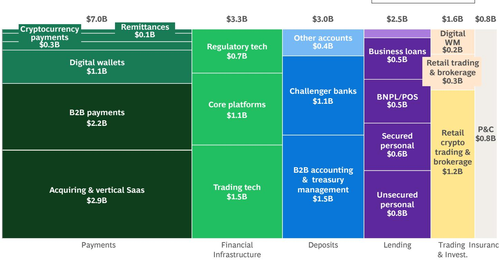  
Sources: S&P Capital IQ; PitchBook; BCG FinTech Control Tower; BCG analysis.  
Note: BNPL = buy now, pay later; POS = point of sale; P&C = property and casualty; WM = wealth management.

\- Financial infrastructure accounts for 18% of fintech revenues in the \$50 million to \$500 million range. There is still a lot of work left to upgrade financial infrastructure for incumbents—and this work will expand once onchain finance gains momentum. Given the longer sales and implementation cycles for many financial infrastructure fintechs, this vertical is taking longer to fully scale. However, fintechs such as Mambu (upgrading core banking platforms to the cloud), Fireblocks (building digital asset infrastructure for players across the ecosystem) and Chainalysis (blockchain regulatory tech) are helping facilitate this transition. In property and casualty insurance, given the complex regulation and capital requirements to be a full-stack carrier, we also see insurtechs acting as service providers to incumbents scaling quickly (for example, Duck Creek Technologies). The financial infrastructure vertical is more broadly representative of a growing trend of incumbents partnering with fintechs, as opposed to directly competing with them. In the last three years, investors have deployed about \$30 billion in equity capital to financial infrastructure fintechs in the Series A–D rounds.

\- Lending accounts for 14% of fintech revenues in the \$50 million to \$500 million range. As discussed earlier, we expect fintech lenders to experience tailwinds. In the last three years, investors have deployed about \$22 billion in equity capital to lending fintechs in the Series A–D rounds.

# Where We Go from Here: Calls to Action

Fintechs, investors,
regulators, and banks will
all have distinct roles to
play, and imperatives to
meet, as the next chapter
of the fintech story unfolds.

The calls to action detailed here are suggestions based on our discussions with industry leaders from across the globe, and from our experience working with leading players in the ecosystem.

## Regulators

In some domains, regulators are beginning to catch up. Digital assets are a good example. Except for some progressive markets (for example, the Monetary Authority of Singapore), it has taken regulators and legislators many years to create comprehensive regulatory frameworks for digital assets. In the EU, for example, the groundwork for the Markets in Crypto-Assets (MiCA) regulation started in 2018 but only came into force in December 2024. In that time, 134 digital asset exchanges were founded in the EU. Open banking is another example, with more than 65 countries having implemented some form of regulation. In both cases, there are concerns about the details of the legislation, but in the main some regulation is preferable to no regulation. Fintechs need clarity to scale. To this end, we would encourage regulators to:

\- Move with greater speed and clarity. Regulatory uncertainty can hinder innovation just as much as overly restrictive regulations. Effective regulators enhance competition by responding promptly and clearly to emerging trends and by focusing on mitigating the most significant consumer and financial stability risks. The fintech ecosystem benefits from the clarity provided by regulators. Given the rapid rate of advancement, AI will be the next test of how swiftly regulators can move, while striking the right balance between enabling innovation and protecting consumers. (See Spotlight 5: "AI Regulation.").

\- Establish clear and consistent rules. Regulators in some domains have leaned on sponsor banks to regulate parts of fintech. With the collapse of Synapse, this model is now under pressure. Many scaled fintechs are too big and multifaceted to “move fast and break things.” Regulators need to establish clear and consistent rules for fintechs and have more direct oversight. Issuing more bank licenses for scaled fintechs is one way to do so.

\- Harmonize frameworks. Harmonizing frameworks at regional, national, and international levels would enable fintechs to scale beyond their home markets. In an increasingly multipolar world of competing political and economic systems, this will admittedly be harder than ever. For example, in the US, a deregulatory push at the federal level may simply give rise to a fragmented patchwork of state-led policies, forcing fintechs to navigate disorganized landscape of regulations. At the international level, we are seeing the balkanization of regulatory frameworks, as many regulators pursue a core mandate of fostering economic competitiveness.

## - Lead the way on critical digital public

infrastructure. Governments can spur private innovation and expand financial access by taking the lead on critical digital public infrastructure (for example, UPI in India). There is also work to do in ensuring that fintechs have equal access to this infrastructure—for instance, real-time payment systems—as incumbents.

“AI is advancing rapidly, and nobody really knows the full potential yet . . . Regulators will need to be nimble and start by establishing top-down principles. They will also need to challenge existing assumptions—does explainability in credit decisioning really matter, for example? Current non-AI decisioning already generates false negatives and false positives; if we could reduce those decision errors dramatically, that might be a better outcome even if perfect explainability were sacrificed.”

RAJ DATE
Managing Partner, Fenway Summer

No AI-specific regulation/framework

√ AI-specific regulation/framework—use case deemed high-risk

## AI Regulation

Global regulators have taken divergent approaches to AI in finance. The EU's AI Act is the first-ever comprehensive legal framework on AI worldwide. In contrast, the US and UK have avoided passing AI legislation to date, instead relying on existing rules and regulations.

These divergent approaches will impact how and where fintech innovation with AI manifests over the coming years. Take the example of credit decisioning. The EU’s AI Act, which started to come into force in August 2024, classifies credit scoring as high-risk, requiring strict controls on data, oversight, and monitoring. In contrast, US and UK regulators require AI-driven credit models to comply with existing laws—for example, the US Equal Credit Opportunity Act, which was passed in 1972. The balance between providing clarity without restricting innovation by fintechs will be a key challenge that regulators will need to rise to in the coming years.

## Approach to AI Regulation Differs by Market

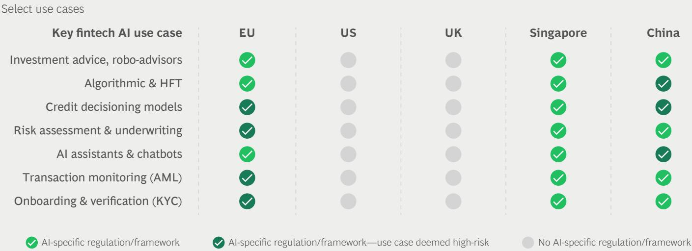

Sources: European Parliament; Council of the European Union; Monetary Authority of Singapore; Cambridge University Press; China Banking and Insurance Regulatory Commission; BCG analysis.
Note: EU's AI Act will be implemented in phases, dependent on risk. Singapore introduced its F.E.A.T principles in 2018; although not legally binding, they set out clear guidelines on AI use. Consumer data protection, antidiscrimination, and data privacy are emphasized across all jurisdictions and categories. AML = anti-money laundering; HFT = high-frequency trading; KYC = know your customer.

## Investors

Many opportunities remain in fintech, and founders will need capital and guidance from investors to realize them. Our calls to action for investors include the following:

\- Capitalize on “holes in the Swiss cheese” by vertical. Fintech remains highly concentrated in payments and challenger banking, yet verticals such as B2B and financial infrastructure remain relatively underpenetrated. Investors should allocate capital to verticals where real pain points exist, as this is where the scaled fintechs of tomorrow are likely to emerge.

\- Capitalize on holes across geographies. Two-thirds of scaled fintech revenues come from the US and China, yet regions like the Middle East and Africa and parts of Latin America and Asia-Pacific are still relatively underpenetrated and ripe for growth. In some scenarios, models of scaled fintechs in the US and China can be successfully replicated in other markets; in others, investors will need a perspective on what models will succeed given local idiosyncrasies.

\- Encourage portfolio companies to speed up adoption of AI. AI is transforming how fintechs build and deliver products, particularly at the early stages. Given that many scaled fintechs lag in their adoption of these tools, investors have a role to play in speeding up adoption across their portfolios by evangelizing best practices and highlighting examples of successful deployments in areas such as code development, customer service chatbots, and customer acquisition.

\- Continue to demand growth discipline. Like fintechs, investors will have to play a crucial part in ensuring that the industry continues to mature and strengthen its fundamentals. Demanding focus on sustainable growth and regulatory and compliance capabilities from potential investments and portfolios will ensure that in the midst of excitement around AI the industry does not revert to a “growth at all costs” mindset.

## Fintechs

For fintechs, there are four imperatives:

\- Relentlessly focus on the fundamentals. Investors continue to value scale, revenue growth, and profitability. This will require a relentless focus on the fundamentals in all domains, including pricing optimization, risk and compliance capabilities, go-to-market strategy, and cost management. Balancing this focus with the need to stay agile and innovative will be a key challenge going forward.

\- Focus first on home markets. There is still ample white space for fintechs to expand in their home markets by broadening product suites and targeting new customer segments. Global expansion into markets with different regulatory frameworks, cultural contexts, and competitive dynamics is more likely a distraction than a viable growth lever.

\- Look out for M&A opportunities. As the IPO market thaws, we expect many fintechs to struggle to go public. Scaled fintechs should keep an eye on the market for M&A opportunities, which can be powerful growth levers—if executed well. Leaders should first identify where they can benefit from expansion, whether in products, markets, or scale, and then create a shortlist of targets to monitor.

\- Put AI at the core of the business model. Fintechs of all sizes should prioritize placing AI at the core of their business models. Not because it is a buzzword—but because it is a lever to drive cost efficiency and eventually product innovation. While many early-stage firms are setting the pace, larger, more established players are falling behind. Nowhere is the urgency to adapt more evident than in software development, where agentic AI is dramatically accelerating delivery at a fraction of the cost of traditional processes. Without rapid transformation of their engineering organizations, scaled fintechs risk falling further behind.

## Banks

Despite being the incumbents, banks have agency in defending their market position and even fostering fintech innovation in areas where it makes strategic sense to collaborate. There are three calls to action here:

\- Embrace AI with purposed experimentation. Banks need to take transformative action on AI. Tentative tweaking will not unlock the competitive edge that the technology can provide for both internal productivity and customer-facing use cases. Leaders in the industry have tracked AI's evolution over the last two decades, but we are now entering a phase of exponential innovation, with a clear line of sight to dramatic productivity boosts. AI also presents the opportunity for innovation and growth. For example, there is potential for banks to leverage agentic AI in their commerce ecosystems to deliver hyper-personalization based on their granular proprietary transaction-level data.

\- Be strategic about fintech collaboration. Not every capability needs to be built in-house. Banks should scan the fintech landscape to identify opportunities for strategic investment, partnerships, or even acquisition. Strategic collaboration with fintechs can accelerate modernization, reduce costs, and enable faster access to next-generation infrastructure and capabilities.

\- Develop a digital assets strategy. Regulatory clarity is no longer an excuse for inaction. Banks must assess where, how, and why digital assets represent a threat or opportunity to their business models. Once they identify “big rock” use cases, banks should launch pilots—partnering with other banks and corporates where relevant. Asset tokenization use cases (for example, of bonds) have particularly high potential, given the potential to significantly reduce intermediary costs.

## Conclusion

Fintech has come of age. Having evolved beyond the initial explosive expansion characterized by a “growth at all costs” mindset, most fintechs have firmly shifted to a “profitable growth” mindset.

Despite recent volatility and macro uncertainty, the industry exhibits robust fundamentals, including strong revenue growth and improved profitability. This is particularly true of the scaled winners of fintech's first chapter—those that have found success in areas where banks have largely ceded the competitive ground. As these fintechs mature, they will now face the dual challenge of meeting heightened expectations around financial performance and regulatory compliance while continuing to innovate in the face of emerging competition.

These emerging upstarts and scaling fintechs need to address pain points thus far unresolved, either by incumbents or the scaled winners, including in markets outside of the US, Europe, and China. In the same way that the internet and mobile defined the first chapter of fintech, technologies such as AI and blockchain-driven onchain finance will define the next one and accelerate innovation. Investors, regulators, and fintechs themselves all have a role to play in realizing these opportunities and sustaining the industry’s renewed momentum. Ultimately, this moment represents not an end but the beginning of fintech’s next compelling chapter.

## About the Authors

## BCG

## Deepak Goyal

Managing Director & Senior Partner, New York Goyal.Deepak@bcg.com

## Inderpreet Batra

Managing Director & Senior Partner, New York Batra.lnderpreet@bcg.com

## Alexander Paddington

Managing Director & Partner, New York Paddington.Alexander@bcg.com

## Stefan Dab

Managing Director & Senior Partner, Brussels
Dab.Stefan@bcg.com

## Peter Ashton

Project Leader, Washington DC
Ashton.Peter@bcg.com

## Priyan Selvakumar

Consultant, New York
Selvakumar.Priyan@bcg.com

## Thomas Lloyd

Senior Analyst, London
Lloyd.Thomas@bcg.com

## Yashraj Erande

India Leader, Financial Institutions Practice, and Global Leader, Fintech Practice, Mumbai Erande.Yashraj@bcg.com

## Kunal Jhanji

Managing Director & Partner, London
Jhanji.Kunal@bcg.com

## Saurabh Tripathi

Managing Director & Senior Partner, Mumbai Tripathi.Saurabh@bcg.com

## For Further Contact

If you would like to discuss this report, please contact the authors.

## Roy Choudhury

Managing Director & Senior Partner, New York Choudhury.Roy@bcg.com

## Matthew Kropp

Managing Director & Senior Partner, San Francisco Kropp.Matthew@bcg.com

## Ted Bonanno

Senior Associate Director, San Francisco Bonanno.Ted@bcg.com

## QED Investors

Nigel Morris
Cofounder & Managing Partner
Nigel@qedinvestors.com

## Amias Gerety

Partner, Head of US Amias@qedinvestors.com

Mike Packer
Partner, Head of Latin America
Mike@qedinvestors.com

Laura Bock
Partner, US
Laura@qedinvestors.com

## Sandeep Patil

Sandeep Path
Partner, Head of Asia
Sandeep@qedinvestors.com

## Nick Gasbarro

Chief of Staff
Nick@qedinvestors.com

## Acknowledgments

This report is a joint initiative of Boston Consulting Group (BCG) and QED Investors (QED). The authors thank their colleagues from each organization for their contributions to the development and production of the report. In addition, the authors are extremely grateful to all the participants in one-on-one interviews and panel discussions for their valuable contributions toward the enrichment of the insights presented here.

## Boston Consulting Group

Boston Consulting Group partners with leaders in business and society to tackle their most important challenges and capture their greatest opportunities. BCG was the pioneer in business strategy when it was founded in 1963. Today, we work closely with clients to embrace a transformational approach aimed at benefiting all stakeholders—empowering organizations to grow, build sustainable competitive advantage, and drive positive societal impact.

Our diverse, global teams bring deep industry and functional expertise and a range of perspectives that question the status quo and spark change. BCG delivers solutions through leading-edge management consulting, technology and design, and corporate and digital ventures. We work in a uniquely collaborative model across the firm and throughout all levels of the client organization, fueled by the goal of helping our clients thrive and enabling them to make the world a better place.

## QED Investors

QED Investors is a global leading venture capital firm based in Alexandria, Va. Founded by Nigel Morris and Frank Rotman in 2007, QED Investors is focused on investing in disruptive financial services companies worldwide. QED Investors is dedicated to building great businesses and uses a unique, hands-on approach that leverages its partners' decades of entrepreneurial and operational experience, helping companies achieve breakthrough growth. Notable investments include AvidXchange, Betterfly, Bitso, Caribou, ClearScore, Creditas, Credit Karma, Current, Flywire, Kavak, Klarna, Konfio, Loft, Mission Lane, Nubank, QuintoAndar, Remitly, SoFi, Wagestream and Wayflyer.

For information or permission to reprint, please contact BCG at permissions@bcg.com. To find the latest BCG content and register to receive e-alerts on this topic or others, please visit bcg.com. Follow Boston Consulting Group on LinkedIn, Facebook, and X (formerly Twitter).

BCG + QED