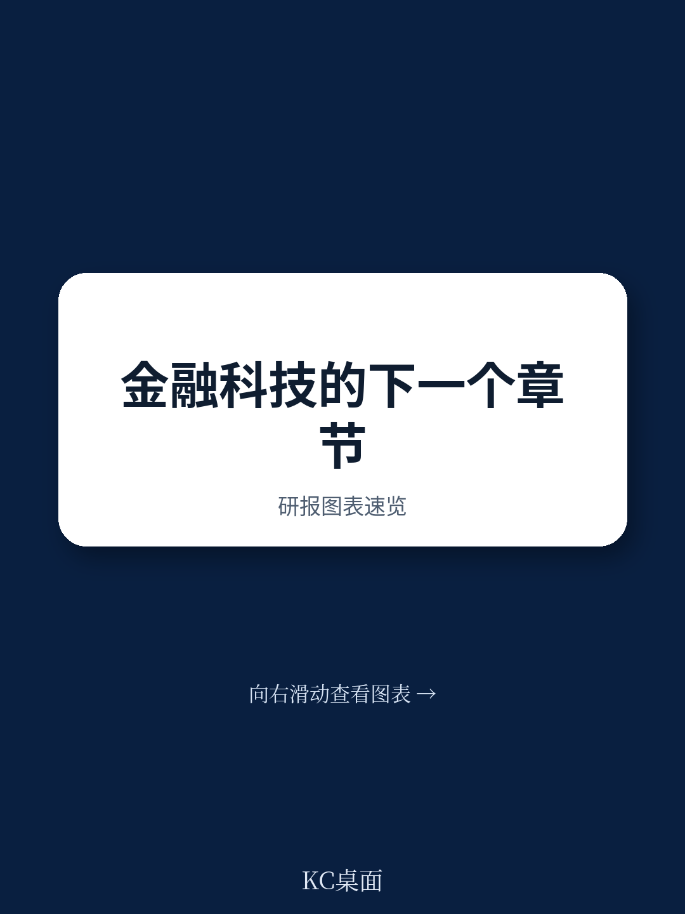

# 波士顿咨询：金融科技只啃下3%的蛋糕，但赢家已不是初创公司

全球金融科技行业正在经历一场静默的“成年礼”。波士顿咨询（BCG）与QED Investors联合发布的《2025全球金融科技报告》给出了一个既令人振奋又充满挑战的核心判断：行业基本面已经显著改善，但未来的竞争逻辑与过去十年截然不同。

2024年，全球金融科技收入同比增长21%，远超2023年的13%和传统金融服务业整体的6%。公开市场金融科技公司的平均EBITDA利润率提升了25%，达到16%，69%的公开金融科技公司实现盈利。这些数字指向一个明确的信号：行业已经走出了“烧钱换增长”的青春期，进入了“可持续增长”的成熟阶段。

但这份报告最有价值的洞察，不在于行业复苏本身，而在于它对“谁在赢、赢在哪里、下一轮机会在哪”的冷静拆解。金融科技仅渗透了全球银行与保险收入池的3%，渗透率分布如同瑞士奶酪——某些区域密集，但绝大多数地方仍是空白。而真正值得关注的，是那些已经跑出来的“规模化赢家”将如何定义下一个十年的竞争规则。

> **KC评论：** 这份报告最反常识的一点是，它并不认为金融科技的下一章属于更多的新创公司。相反，它指出，未来将是少数“规模化赢家”与“新兴颠覆者”之间的博弈。对于投资者和产业决策者而言，理解这两类玩家的边界在哪里，比追逐下一个热点更重要。完整报告中对“赢家”的财务特征和扩张路径有更细致的拆解，这是无法在一篇导读中完全展开的。

## 1. 全球只有不到100家金融科技公司算得上“规模化赢家”，它们贡献了60%的收入

波士顿咨询将“规模化金融科技”定义为年收入超过5亿美元的公司。在全世界约3.7万家金融科技公司中，达到这一门槛的不足100家。但这不到0.3%的群体，在2024年创造了约2310亿美元的收入，占全球金融科技总收入的60%。

这个数字本身就是一个尖锐的提醒：金融科技行业的“长尾”极其漫长。绝大多数公司还停留在小规模或区域运营阶段，而头部玩家的集中度远超多数人的直觉。

这些赢家的成功并非偶然。报告指出，它们集中攻破了银行“不愿、不能、不敢”涉足的三类领域：一是银行缺乏竞争力的垂直场景，如为餐厅、零售商户提供一体化SaaS+支付方案；二是银行不愿服务的低收入客群，如通过挑战者银行和BNPL产品触达的消费者；三是银行受限于监管或战略无法进入的领域，如加密货币交易和数字钱包聚合。

> **KC评论：** 这个分析框架的价值在于，它不是一个静态的“赢家清单”，而是一个动态的竞争地图。投资者可以据此判断：一家金融科技公司所处的赛道，是否属于银行“主动放弃”的领域？如果是，它的护城河可能比想象中更坚固；如果不是，它迟早要面对银行的正面反击。完整报告中对五个赢家赛道的收入分布和增长驱动因素有详细的图表拆解。

## 2. 五大赛道占据了九成“赢家”收入，支付是绝对王者

报告清晰勾勒出金融科技第一阶段的五大成功赛道：数字钱包与收单/SaaS、挑战者银行、零售加密货币交易、以及BNPL/ POS贷款。

支付是毫无争议的王者。仅数字钱包和收单/SaaS两个子赛道，就贡献了约1260亿美元的收入，占所有规模化金融科技收入的55%。PayPal、Stripe、Adyen、Toast、Shopify这些名字，已经深度嵌入全球商业的毛细血管。

挑战者银行以约270亿美元的收入位居第二，代表玩家包括Nubank、Revolut、Monzo、KakaoBank和Toss。值得注意的是，尽管挑战者银行是过去十年最受瞩目的赛道之一，但它们目前仅渗透了约2%的存款收入池，且收入主要来自手续费而非利息收入。这意味着，它们距离真正挑战银行的“核心盈利能力”还有相当距离。

零售加密货币交易（Coinbase、Binance等）和BNPL/POS贷款分别贡献约160亿美元和80亿美元的收入。BNPL虽然规模尚小，但以42%的复合年增长率在扩张，是五个赛道中增速最快的。

## 3. 美国和中国占了超过三分之二，但“下一个增长极”不在那里

从地域分布看，美国贡献了约1200亿美元，占全球规模化金融科技收入的52%；中国以约360亿美元位居第二，占16%。两国合计超过三分之二。

美国的主导地位来自其庞大的可服务市场、充裕的资本以及“卡片优先”的消费经济。中国的故事则截然不同：支付宝和微信支付两大超级应用在移动支付领域建立了几乎不可撼动的地位，但金融科技在其他垂直领域的渗透却远低于美国。

报告隐含的判断是：金融科技的下一个增长极很可能不在美国或中国，而是在那些“尚未被充分渗透”的市场——尤其是拉美、东南亚和非洲。这些地区拥有年轻的人口结构、快速增长的数字化需求，以及传统银行服务覆盖率低的空白地带。Nubank在巴西的成功、Paytm在印度的起伏，已经为后来者提供了可参照的剧本。

> **KC评论：** 这里有一个报告没有完全展开但值得追问的问题：中国金融科技公司出海的最佳路径是什么？是复制支付宝的超级应用模式，还是像Stripe那样专注于B2B基础设施？不同路径对资本、监管和团队能力的要求截然不同。完整报告中对各区域的市场特征和进入策略有更细致的分析。

## 4. 150家“准IPO”公司排队等待，但资本市场已经变了口味

报告揭示了一个被市场低估的“堰塞湖”：全球有150家成立于2016年之前的金融科技公司，累计股权融资超过5亿美元，却至今未能上市。这个名单里包括Stripe、Revolut、PhonePe、Toss等最知名的名字。

这些公司之所以“憋着不上市”，一方面是因为过去两年的IPO窗口几乎关闭——2024年全球仅有28家金融科技公司上市，且没有一家融资超过10亿美元；另一方面，它们通过活跃的二级市场交易获得了流动性，并不急于在估值不利时上市。

但报告明确指出，当IPO窗口重新打开时，资本市场的筛选标准将截然不同。分析显示，公开金融科技公司估值的50%可以由“预期收入增长”和“盈利能力”两个因素解释，规模（25%）和研发投入（14%）紧随其后。这意味着，那些没有清晰盈利路径、依赖“增长故事”融资的公司，将很难获得资本市场的青睐。

“规则40”（收入增长率+EBITDA利润率之和大于40%）正在成为新的基准线。目前仅有35%的公开金融科技公司达到这一标准。对于排队中的150家公司而言，它们中的相当一部分可能会选择被并购，而非独立上市。

## 5. 报告没有完全回答的问题：AI和链上金融的“杀手级应用”何时出现？

报告将AI和链上金融（onchain finance）列为塑造下一章的两大技术趋势，并给出了具体数据：AI驱动的金融科技公司目前获得的股权融资占比为49%，而它们占行业的“公平份额”仅为23%，这意味着资本正在超配AI赛道。链上金融方面，报告认为资产代币化（而非稳定币支付）可能成为真正的“杀手级应用”。

但报告对这些技术的判断仍然保持克制。AI目前主要作为“生产力杠杆”在发挥作用——提升客服效率、优化风控模型、自动化合规流程——真正的产品端创新尚未大规模涌现。链上金融则仍在等待一个能够推动经济活动大规模上链的用例。

这里存在一个报告没有完全展开的关键问题：当AI和链上金融真正进入产品化阶段时，现有的“规模化赢家”能否守住阵地？还是说，新一代技术会催生完全不同的竞争格局？从历史经验看，每一次技术范式转换都会重塑行业版图，但这一次，赢家们已经拥有了更强的数据、资本和客户基础。

---

金融科技的下一章，注定不会重复第一阶段的剧本。规模化赢家需要学会在成熟企业的“平庸”要求——风险定价、合规管理、资本配置——与保持创新锐度之间取得平衡。新兴颠覆者则需要找到那些“赢家”和银行都尚未解决的痛点，而不是在已经被攻占的阵地上硬碰硬。

对于这个行业而言，最令人兴奋的或许不是某个具体的赛道或公司，而是3%的渗透率意味着97%的空白。但如何填补这些空白，将取决于谁能最精准地理解“可持续增长”的真正含义。

> **我们每天会由AI agent + 人工review生成国际投行中文摘要与KC评论，daily更新，约10-40页，也包含当天最新数据图表合集，既方便喂给AI，也方便人工快速把握market dynamics。如果你对这份报告中的“赢家财务特征”“五大区域市场进入策略”“150家准IPO公司清单”等未完全展开的内容感兴趣，欢迎加入社群，领取完整研报解读与原始图表。**

Personal reading notes and learning share only. Not investment advice.

