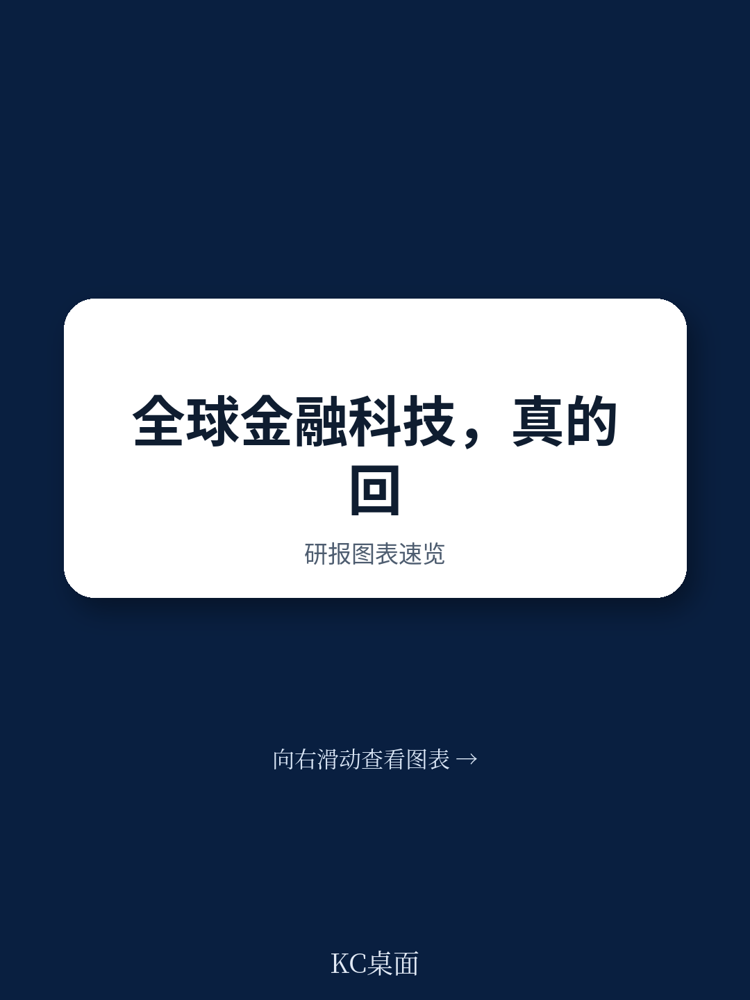

# 波士顿咨询：金融科技进入“精选式复苏”，规模不再自动等于护城河

金融科技行业正在经历一场“无声的升级”。2025年，全球金融科技总收入突破5000亿美元，同比增长22%，增速是传统金融机构的四倍以上。但这份来自波士顿咨询（BCG）与FT Partners联合发布的《2026全球金融科技报告》传递的核心信号，并非简单的“行业回暖”。

真正值得关注的判断是：这轮增长不是普惠性的水涨船高，而是一场高度分化的“精选式复苏”。资本回来了，但只愿意流向那些已经证明自己能够将规模转化为利润、将技术转化为运营效率的公司。行业已经从“证明自己属于这里”的阶段，进入“证明自己能持续创造价值”的阶段。

这份报告对产业决策者的意义在于：它系统性地拆解了金融科技进入新竞争周期的底层逻辑，并给出了七个塑造未来格局的趋势框架。以下是我们从中提炼的核心洞察。

> **KC评论：** 报告最值得先看的一张图是“全球金融科技营收分布”。你会发现，支付依然是绝对主力，但增速最快的是交易与投资（38%）以及存款（30%）。这意味着行业的增长引擎正在从“管道型”业务转向“资产型”业务，这对估值逻辑和竞争壁垒都有根本性影响。完整报告里还附带了按地区、按垂直领域的详细拆解图，值得仔细对照。

## 1. 这轮复苏的真正驱动力不是资本回流，而是运营效率的质变

报告中最具说服力的数据来自公开金融科技公司的利润表。2025年，全球最大的85家上市金融科技公司平均EBITDA利润率提升了4个百分点至20%，盈利公司占比从68%上升至74%。同时，达到“40法则”（营收增速+利润率之和超过40%）的公司比例也从2024年的约三分之一提升至2025年的接近一半。

这些数字说明，行业已经走出了“烧钱换增长”的粗放阶段。资本流入确实在增加——2025年股权融资580亿美元，同比增长53%——但资金分配极度集中。交易与投资类金融科技公司拿走了约三分之一的融资额，而种子轮和天使轮融资则出现萎缩。资本正在加速向已证明商业模式的后期公司集中。

这意味着，对于还在早期阶段的金融科技公司而言，融资门槛比2021年之前更高了。市场不再为“故事”买单，而是为“可复制的盈利路径”买单。

## 2. AI的红利目前集中在运营端，而非客户体验端，这决定了谁先受益

报告对AI在金融科技中的应用给出了一个清醒的判断：AI确实在重塑行业，但近期的价值证明主要集中在运营和工作流密集领域，而非自主化的客户体验。具体来说，在承保、反欺诈、反洗钱、KYC、文档提取、客服、软件开发以及合规流程中，AI正在显著缩短周期、压缩人力任务。

报告提到，使用AI的金融科技公司观察到开发者生产力提升了5倍。但这一提升更多来自“重新设计工作方式”，而非简单的“给现有流程加一个AI助手”。真正受益的是那些愿意围绕AI重构内部运营逻辑的公司，而不是那些仅仅在现有产品上叠加AI功能的公司。

> **KC评论：** 报告中有一张关于“AI在金融科技中的应用成熟度”的图表，它将不同用例按“当前价值”和“未来潜力”做了四象限分类。最有意思的是，很多被媒体热炒的“面向客户的AI金融顾问”目前仍处于低价值、高潜力的左上角，而文档提取和反欺诈则已经进入高价值象限。这张图值得所有金融科技创业者仔细研究，它直接告诉你资源应该优先投在哪里。

## 3. 数字资产的结构性改善被低估了，但采用仍高度集中

报告对数字资产部分的描述值得注意。截至2025年底，加密货币市值约3万亿美元，稳定币约3000亿美元，代币化现实世界资产约300亿美元。稳定币的供应量在2025年增长了约50%。但报告也指出，目前65%的稳定币持有仍与加密货币交易挂钩，说明数字资产的采用仍然高度集中在交易场景，而非支付或结算等更广泛的应用。

这组数据揭示了一个关键矛盾：数字资产的技术基础在增强，监管框架在清晰化，但真正的大规模采用仍取决于能否在非交易场景中证明价值。报告没有给出明确的结论，但隐含的判断是——代币化现实世界资产（RWA）可能是下一个突破口，但前提是解决流动性不足和标准化缺失的问题。

## 4. 监管分化正在重塑全球竞争格局，美国金融科技向“直接监管”靠拢

报告揭示了当前全球监管环境的显著分化。在美国，规模化的金融科技公司越来越倾向于直接申请联邦监管牌照（如OCC的国家信托和银行牌照），以绕过合作银行的中介成本，获得更快的产品创新速度和完整的客户体验所有权。在欧洲，更清晰的牌照和市场规则也在支持金融科技扩张。

而在中国、印度以及海湾合作委员会的部分成员国，严格的监管环境继续使金融科技公司难以规模化。这种分化意味着，金融科技公司的全球化扩张策略不能简单复制，必须根据每个市场的监管“入场券”来设计产品路线和合作模式。

报告中还提到了一个有趣的案例：巴西的Pix、印度的UPI以及肯尼亚的M-PESA，这些基于公共支付基础设施的金融科技模式，在金融包容性方面取得了巨大成功。这提醒我们，在缺乏公共数字基础设施的市场，金融科技公司可能需要先扮演“基础设施搭建者”的角色，这既是挑战也是机会。

## 5. 报告尚未完全回答的一个关键问题：公开市场为何仍对金融科技保持警惕？

尽管金融科技公司的运营指标在改善，但报告坦率地承认，过去五年全球最大的30个金融科技IPO在年度总股东回报上落后于更广泛的金融服务板块约24个百分点。这是一个令人困惑的悖论：行业增长更快、利润更高，但公开市场投资者仍在质疑其增长可持续性、客户集中度、合规成熟度以及竞争壁垒。

报告没有给出明确的解释，但这恰恰是投资者最需要深挖的地方。我们猜测，部分原因可能在于：金融科技公司的收入增长中，有多少来自真正的市场份额夺取，又有多少来自行业整体增长的水涨船高？另外，随着传统银行加速数字化转型，金融科技公司的“技术代差优势”正在缩小。这或许也是报告强调“AI将成为下一个关键差异化来源”的潜台词。

> **KC评论：** 这个未解问题正是我们社群每日讨论的核心主题之一。完整报告中有一张关于“金融科技公司收入倍数与盈利能力的相关性”图表，它揭示了市场如何对不同的增长-利润组合进行定价。这张图对于理解当前金融科技公司的估值逻辑至关重要，我们会在完整解读中做详细拆解。

## 6. 对产业决策者的观察框架：三个维度判断一家金融科技公司是否具备“下一阶段”竞争力

基于报告的框架，我们提炼出三个判断维度，供决策者评估自己或投资标的：

第一，运营效率的可持续性。利润率的提升是一次性的成本削减，还是源于可复制的流程优化？AI的使用是停留在“工具层面”还是已经进入“操作系统层面”？

第二，监管策略的主动性。公司是在被动应对监管，还是主动选择最适合自己的监管框架？在美国，是否有意申请联邦牌照？在新兴市场，是否与当地公共支付基础设施深度整合？

第三，客户价值的纵深。公司是否从单一产品向“更完整的金融平台”扩展？是否在B2B垂直领域找到了未被金融科技渗透的“白空间”？报告特别指出，金融科技目前仅占全球银行和保险收入池的4%，这意味着96%的蛋糕还未被触及，尤其是在B2B领域。

## 7. 结语：金融科技的“春天”已来，但只有那些准备好迎接“夏天”的公司才能活下来

这份报告的主标题是“From Recovery to Resurgence”，从复苏到复兴。但我们更倾向于将其解读为：行业已经从“熬过寒冬”进入“精选式春天”。资本、用户和监管都在重新评估金融科技的价值，但评估标准比以往任何时候都更严格。

报告引用了Creditas创始人Sergio Furio的一句话：“短期内，AI是公司领先的方式；但长期看，每个人都能获得同样的技术，今天的优势可能消失。执行速度可能是少数持久的护城河之一。”这句话点出了金融科技下一个阶段的核心命题：在技术平权的时代，真正的差异化来自执行速度、监管深度和客户信任的积累。

这份报告的价值在于，它提供了一个系统性的分析框架，帮助决策者理解“哪些变化是周期性的，哪些是结构性的”。但报告也留下了许多尚未完全展开的问题——比如，AI在客户体验端的颠覆何时会真正到来？代币化RWA何时能突破交易场景？公开市场的信心何时才能修复？这些问题，正是我们持续追踪和讨论的方向。

如果你希望深入理解这份报告中的每一张图表、每一个细分领域的竞争格局，以及我们基于最新市场动态的每日解读，欢迎加入我们的社群。在这里，我们每天会由AI agent结合人工review，生成国际投行的中文摘要与KC评论，覆盖当天最新数据图表合集，既方便你快速把握市场动态，也适合直接喂给AI做进一步分析。每天约10-40页的内容，帮你持续跟踪金融科技、数字资产与全球金融市场的结构性变化。

Personal reading notes and learning share only. Not investment advice.

