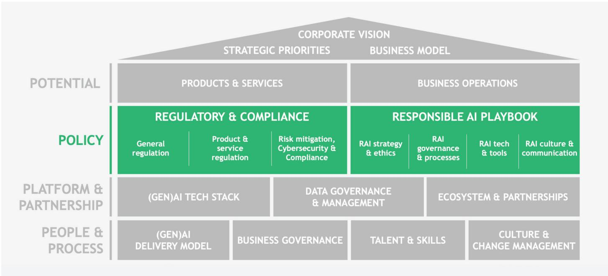
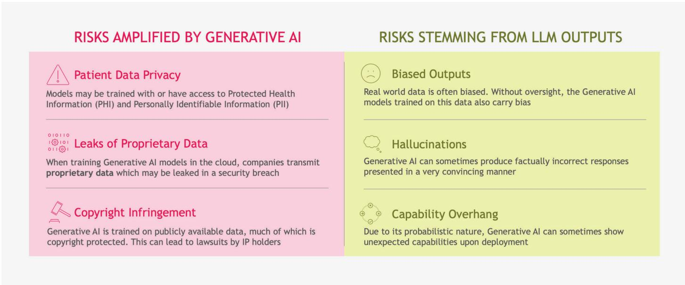
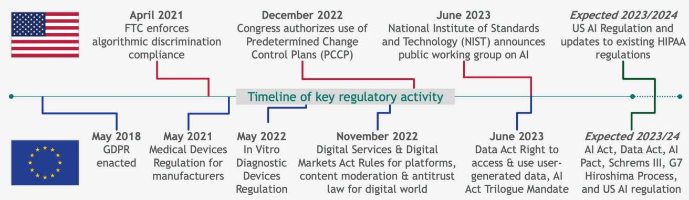
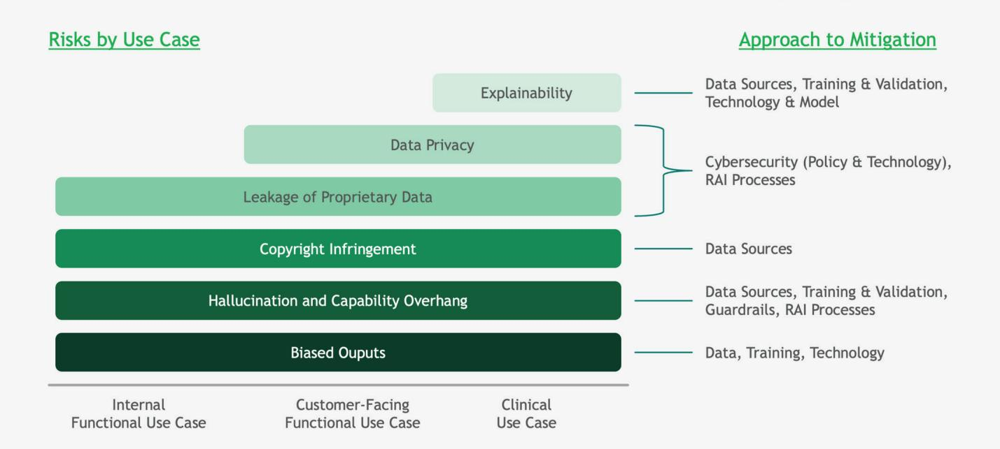

BCG

WHITE PAPER

# Navigating the Medtech GenAI Journey: A Policy Primer

October 10, 2023
By Nadya Bartol, Meghna Eichelberger, Peter Lawyer, Kirsten Rulf, Bradley Merrill Thompson $^{1}$ .

1. Bradley Merrill Thompson is an external author who is a Member of Epstein Becker & Green, P.C.

## Navigating the Medtech GenAI Journey: A Policy Primer

The road to successful Generative Artificial Intelligence (GenAI) deployment in medtech can draw parallels from classical literature and mythology. The hero (a medtech company) heeds a call to adventure in pursuit of some glorious proposition (the power of GenAI), embarking on a journey from the known world into the abyss, where they must contend with forbidding and frightening obstacles (incomplete and unclear regulations, potential legal consequences, unknown cyber threats) as well as individual temptation (violations of data privacy, copyright infringement) presenting clear and present danger (to the company and, potentially, to patients). In storybooks, the hero emerges triumphant after an epiphany—while quick thinking may dodge a threat, and great courage and skill may win a battle, it is the hero’s own moral compass that separates their tale from a tragedy. Will your medtech GenAI journey be a Hero’s Tale or a Tragedy?

Our previous articles have focused on the call to adventure (“Medtech Companies Must Move Faster on Generative AI”) as well as the tremendous potential for GenAI technology (“Medtech’s GenAI Opportunity”) and the building blocks required to field GenAI products and services (“Building A Medtech GenAI Platform”). This article focuses on the Policy aspects of your GenAI initiative, including the Responsible AI (RAI) Playbook that serves as a roadmap to ensure your medtech GenAI journey is a successful one.

This Article's Focus - Policy  
  
Source: BCG
Copyright 2023 by Boston Consulting Group. All rights reserved.

## Risks on Your Medtech Journey

Dangers such as leaking Protected Health Information (PHI), making false claims, releasing proprietary data, and infringing copyrights exist regardless of the underlying technology. GenAI heightens these latent risks and introduces others via the inner workings of Large Language Models (LLMs) that are not yet fully understood. These risks could have unpredictable consequences, including biased output (generally due to inadequate training data), so-called “hallucination” (confidently presenting an “answer” that is objectively wrong and often cartoonishly flawed), capability overhang (the propensity for probabilistic models and heuristics to reach a conclusion beyond the natural stopping point, leading to unexpected outcomes), and poor robustness, including false positives and negatives.

## Exhibit 1 – Generative AI Increases Some Existing LLM Risks

  
Copyright 2023 by Boston Consulting Group. All rights reserved.

AI cyberattacks, especially those involving data poisoning of the model's training data or hijacking the GenAI model itself, present another danger. Maintaining data privacy and safeguarding your model's training data will therefore be a paramount concern. Likewise, the algorithms and services that leverage patient data and your company's intellectual property must be both scrubbed for bias and battle-hardened to prevent unauthorized access and use. Simulated attacks on your GenAI products enable your company to devise response scenarios that help put regulators' minds at ease.

The vanguard protecting your medtech GenAI journey is your company's RAI framework. Simply put, it is an articulation of your company's intended use of AI, with clear guardrails to prevent the misuse and unintended consequences of deploying this technology. Your RAI framework should anticipate and accommodate key concerns of regulators, patients and providers, and other stakeholders, while upholding your company's own value system.

## The Evolving Regulatory Landscape

Regulators walk the highwire of managing risk while providing sufficient leeway for innovation. For Software as a Medical Device (SaMD) and many AI/Machine Learning (ML) products, regulators can simulate hundreds of thousands of real-world scenarios to stress the underlying logic and test the robustness of the code. However, GenAI technology asks regulators to weigh the safety and effectiveness of medical products that generate new information, reaching conclusions that—in clinical situations—could determine how a patient is treated. Hubris on the part of the medtech company or the regulator can lead to tragedy.

In the US, the Food and Drug Administration's (FDA's) Center for Device and Radiological Health (CDRH) acts as the principal regulator for GenAI-powered medical devices, though the Department of Health and Human Services Office of Civil Rights oversees the Health Insurance Portability and Accountability Act (HIPAA), which upholds privacy laws concerning PHI. The EU's FDA equivalent, the European Medicines Agency, bears specific responsibility for devices and equipment via its Medical Device Regulations (MDR), but laws concerning data privacy in AI and GenAI are embedded in the EU's General Data Protection Regulation (GDPR).

The EU’s pending Artificial Intelligence Act proposes a four-tiered risk framework that currently defines all GenAI-powered medical products as “high-risk,” imposing a set of preconditions for market release, facilities for monitoring performance and compliance, as well as significant fines of up to 6% of global revenue for violations. Any such penalties would be incremental to violations of GDPR. EU officials hope to ratify the Artificial Intelligence Act by the close of 2023, compelling all member states to implement its measures within a 20-month transitional period.

The FDA has led the International Medical Device Regulators Forum SaMD working group to agree upon key definitions, a framework for risk categorization, the Quality Management System, and practical ways to run clinical trials. The FDA's December 2019 discussion paper set forth a risk-based framework for AI/ML-enabled device software functions. Congress then authorized the use of Predetermined Change Control Plans (PCCP) for products that evolve within predetermined parameters, enabling applicants to submit for FDA approval their proposed process for validating the model. Low-risk products such as heart rate monitors would require only periodic retesting, while more critical GenAI applications—say, implantable cardiac defibrillators that refine their own parameters for when to fire—would need to undergo more continuous testing. In June, the National Institute of Standards and Technology (NIST) launched a public working group on AI to build on its existing Risk Management Framework. Existing HIPAA regulations would also extend to any new US GenAI offering—but these rules, launched in 2006 and last modified in 2009, are scheduled for an update, possibly before the end of 2023.

Exhibit 2 – Agility Needed to Respond to Existing & Upcoming Regulations (non-exhaustive, selection of key regulations)  
  
Note: BCG does not provide legal advice  
Source: BCG  
Copyright 2023 by Boston Consulting Group. All rights reserved.

## Functional and commercial use cases perceived as low-risk offer a safe pathway to gain GenAI experience

## A Closer Look at the US Regulatory Landscape

Functional and commercial use cases perceived as low-risk (for example, HR, IT, Finance, Customer Service) offer a safe pathway for medtech companies eager to gain GenAI experience. Still, customer-facing applications that govern patient access or customer support can come under Federal Trade Commission (FTC) scrutiny, given this agency's mission to uphold health equity across all patient segments.

All Gen AI use cases involving the diagnosis, mitigation, treatment, cure, or prevention of disease or other medical conditions fall directly under FDA jurisdiction. Since CDRH has yet to introduce specific requirements, medtech companies can leverage the existing SaMD frameworks as a guide, and follow some commonsense steps in their GenAI approval and compliance strategies, including the following:

\- Intended Use: The narrower the intended use, the clearer the clinical trial endpoints. Loading up a GenAI offering with a broad swath of clinical claims will create a series of hurdles for your proposed solution that may be difficult to overcome.

\- Human in the Loop. While the presence of a human in the loop can reduce risk, the innovator must note how and under what circumstances this interaction takes place. Companies must specify what happens if the human response is erroneous or if there is no human response at all.

\- Explainability and Transparency. Medtech companies can lower the regulatory bar by ensuring that their model output is transparent and fully explainable so that end users can compare the GenAI solution to the current standard of care.

\- GenAI Model—Locked or Adaptive? Running simulations on a locked model can provide a sense of comfort that the product will perform as expected, but quirks in an adaptive GenAI model can lead to hallucination, capability overhang, and unpredictable output. The regulator therefore needs to devise a means of assessing the potential for dangerous results, as well as a means of re-evaluating the solution once in the field.

\- Data Inputs. GenAI models are trained with defined data sets, which serve as the basis for inferred and suggested solutions as well as guardrails to ensure that cold logic does not lead to extreme and unacceptable answers. So-called “constitutional” models embed human values into the model, permitting an intuitive user interface and more acceptable outputs. However, if new inputs render the model obsolete (“model drift”), the system’s guardrails and solutions can be altered. Moreover, data inputs acquired by the model may be subject to privacy and copyright laws.

\- Algorithm Change Protocol. When seeking clearance or approval from the FDA for products that evolve over time, companies can submit a PCCP to allow the model to change within constraints.

\- Edge Cases. During the clearance or approval process, the FDA may be concerned about so-called “edge cases,” or rare circumstances that may not present themselves in a trial setting but which are fully expected in the field. While humans may recognize the specific circumstances, machines may not—and the potential for adverse consequences must be mitigated.

\- Post-Approval Controls. The FDA will almost certainly seek policy changes that require more stringent post-approval controls to monitor and report on real-world input data validation, intended use, algorithm validation, as well as the safety and effectiveness of your GenAI products and services as they evolve.

\- Secure by Design. GenAI models must be designed with security in mind to resist subversion. Medtech companies should use cybersecurity experts to determine what security controls are required and the types of testing the applications should undergo.

## Exhibit 3 - Clinical Use Cases Have the Most Risks to Proactively Mitigate

  
Copyright 2023 by Boston Consulting Group. All rights reserved.  
Source: BCG

## Developing a Responsible AI Playbook

BCG recommends a centralized approach to developing your RAI playbook at the outset of your GenAI journey to both ensure more control over technology applications and enable rapid iteration. As an initial step, your CEO should sponsor and designate an AI leader within the organization. This leader, who acts as your company's primary GenAI business strategist, should assemble key business sponsors and a cross-functional and cross-organizational team with experts in IT, legal, regulatory, HR, cybersecurity, and privacy to provide the necessary policies and guardrails for your AI solutions. Each potential use case that addresses an internal and external customer pain point requires a business sponsor who approves the investment and takes responsibility for the solution's performance in the field.

The leadership team develops a holistic AI risk assessment for your medtech business, detailing which areas are considered “safe” and which pose potential risk. Informed by this heat map, the team prepares 5–10 guiding principles for GenAI that are consistent with your medtech company’s mission and value statement. These principles underpin your clear and consistent RAI framework, which spells out how, when, and where your company will employ GenAI—as well as where and how it will not. Business sponsors serve as a advocates and missionaries for GenAI, taking the lead from your corporate policy and adapting it to specific use cases. Each use case should be mapped and characterized by your Compliance and IT functions to enable ongoing maintenance and monitoring.

Historically, AI was the province of a select group of technically skilled individuals designing black box solutions that users did not need to understand. However, as GenAI has democratized technology with exciting innovative solutions such as ChatGPT and Bard, your company's approach to managing GenAI technology must also change. Your RAI framework places the onus of managing GenAI solutions at the feet of business leaders, with the IT and Compliance organizations providing necessary support. With your framework and AI leadership team in place, the next step is to create a corporate culture that supports RAI. This may be the trickiest aspect of fielding RAI solutions, and it will be the subject of our next and final article in the medtech GenAI series (Putting Medtech People and Processes to Work With GenAI).

To recap, your medtech company's GenAI journey involves a quest for massive improvements in efficiency in the short term, and personalized and improved patient outcomes over time. Medtech companies will need to experiment safely, learn and iterate quickly, and scale up their capabilities for maximum impact. It will require intellect and determination to take on the known challenges posed by GenAI—and courage and resilience to slay the unknown beasts lurking in the shadows. Medtech leaders must possess all these qualities and one more—humility—to approach the GenAI opportunity in a responsible fashion and avoid turning their Hero's Tale into a Tragedy.

## Acknowledgments

The authors would like to thank the following for their contributions to this article: Stuart John, Tad Roselund, and Gunnar Trommer.